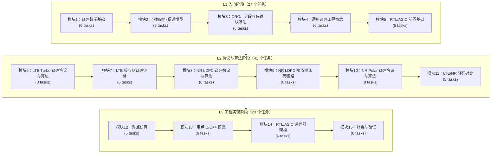

# 3GPP LTE/NR 译码全栈学习路线 — 完整任务清单

> **目标用户**：通信领域纯新手，具备 Python 基础语法，但不默认掌握线性代数、概率论、随机变量、矩阵、对数似然比（Log-Likelihood Ratio, LLR）、信噪比（Signal-to-Noise Ratio, SNR）、加性白高斯噪声（Additive White Gaussian Noise, AWGN）、定点数或 RTL 时序。
> **最终目标**：全栈通信译码工程师 — 理论推导 -> 浮点仿真 -> 定点 C/C++ 模型 -> Verilog/SystemVerilog RTL -> Synopsys Design Compiler 综合与验证。
> **3GPP 版本**：Rel-19，优先使用本地 `3GPP_Rel19/` 资料。
> **重点范围**：LTE Turbo 译码、NR LDPC 译码、NR Polar 译码。
> **版本**：v1.0（3 个阶段，15 个模块，91 个任务卡片）。

---

## 文档格式与合规规范

| 项目 | 必须遵守的要求 |
|:---|:---|
| Rel-19 溯源 | 任何来自 3GPP 的结论必须列出 TS 编号、Rel-19 包名、章节号、表/图/公式号和本地路径。 |
| 3GPP 协议精读 | 全局约定：凡是涉及 3GPP 的知识点，必须先围绕协议精读讲清前因后果、接收端位置、输入输出和上下游依赖，再进入通用原理、算法、仿真、定点、RTL/ASIC 和验证；工程策略不得写成协议强制要求。 |
| 零基础理论铺垫 | 全局约定：每节在公式推导前必须提供足够的理论介绍、概念铺垫和可手算例子；本节主角概念必须讲清“为什么需要、解决什么问题、直观或数值例子、正式定义、手算推导、工程后果”，不能默认读者已懂 LLR、AWGN、SNR、QAM、HARQ、TB/CB、CRC、矩阵、熵、定点数或状态机。二级标题和内部顺序可按主题自然组织，不要求机械使用“白话直觉”等固定标题。 |
| 未解释术语禁止 | LTE、NR、LDPC、Turbo、Polar、HARQ、TB、CB、CRC、LLR、AWGN、QAM、RTL、ASIC 等首次出现时必须先用中文解释；纯理论基础节不得用协议名词压过理论主线。 |
| 待核验 | 未核对表格 HTML、公式 XML、media 或原始 Word XML 时，必须标记 `待核验`，不得宣称已经完整复现协议参数。 |
| 零基础保护 | 首次出现数学、通信或硬件概念时，先给白话解释和可数例子，再给符号公式。 |
| 中文术语 | 首次出现英文术语时写成 `中文术语（English term/abbreviation）`。 |
| 表格 | 只使用 Markdown 表格，不使用 ASCII 伪表格。 |
| 图表 | Mermaid 必须使用 `%%{init: {'theme': 'default'}}%%`；硬件控制图优先使用 `stateDiagram-v2` 或 `sequenceDiagram`。 |
| 复杂图表图片化 | 若协议/论文图表含复杂公式、合并单元格、矩阵大表或 Mermaid/Markdown 无法稳定表达的结构，必须用 Python 生成图片资产并插入正文，同时记录脚本、输入数据和证据路径。 |
| 难理解内容 Python 直观化 | 对读者难以凭文字建立空间或流程直觉的内容，例如循环缓存、HARQ/RV 窗口、CB/CBG 层级、descriptor/key、矩阵构造、路径搜索、状态机、bank 访问、排序器和软信息合并，必须优先使用 Python 生成清晰图片插入正文，并记录脚本、输出路径、读图说明和目检状态。 |
| Python 图片视觉审计 | Python 生成图必须检查箭头、文本框、说明文字和信息密度：箭头不得斜穿多个无关区域或压迫文字；文本框尺寸必须与内容匹配，不能大面积空白或拥挤；descriptor/key/token 类图应使用紧凑对齐 token；“要点”“风险”“读图顺序”“工程检查点”等说明文字必须放入独立说明框或独立留白区域，不能贴近边界、压到相邻区块或与底部图例/负例区视觉接触；还必须检查文本框内部上下左右留白、说明框底部留白、相邻区块/表格/图例间距，以及缩放到文档常用阅读尺寸后的协调性。图片中的表格必须按 Markdown 缩放后的阅读尺寸设计，表头、首列和正文单元格字体都必须足够大；除坐标轴刻度、码位小标签、环形缓存短索引等明确辅助标注外，表格正文、表头、首列、图例和说明框教学文字原则上不得低于 24px，表格行高原则上不得低于 56px；20-23px 只能作为辅助索引/刻度/短地址标注，并且必须有更大字号的说明区补偿。若内容多导致小字，应拆表、加宽画布、增加行高或改成长图，不能压缩字体。该表格字号可读性要求适用于全项目全部 Python 生成图，不只修复用户当次指出的单张图；发现表格字体偏小、行高不足或 Markdown 缩放后不可读时，即使无遮挡，也必须记录为视觉审计缺陷并修复。循环缓存、环形缓冲区、树图、分层流程和表格下方标题必须额外检查局部几何间距，脚本应尽量加入标题 bbox 到最近节点 bbox、说明框到相邻图元 bbox 的最小间距断言。包含变长文字的节点不得使用固定半径圆框硬塞文本，必须按文字尺寸自适应或改用圆角胶囊/矩形节点；节点、标签、说明框、图例、提示框、文本框和表格单元格内文字默认必须视觉上下居中和左右居中，Python/PIL 绘图应优先使用 `anchor="mm"`、字体 bbox 基线校正或等价机制；只有明确作为正文段落排版的长说明才允许左对齐。修改节点尺寸、字体、内边距或布局后，必须同步重新计算连线和箭头端点，让连线从真实节点边界出发并到达真实目标边界，端点必须精确落在节点/文本框边缘，不能在框内、越过框边缘或靠遮罩掩盖穿框线；带箭头连线的线身应在箭头头部之前停止，箭头尖端精确到达目标边缘。连线不能机械地全部从右侧或左侧出线，必须按节点相对位置和读图方向选择合理边界点；曲线、折线和跨层连接也必须保证线身不进入节点内部；凡脚本中已知节点/卡片/表格 bbox，跨层线、斜线、折线和反馈线都必须做 segment-rectangle 相交检查或等价断言，若某条线因避让被改为折线/曲线，必须逐段检查不穿无关框，并在讲义或资产清单写明避让原因。像素边界无裁切、脚本运行成功和粗略目检都不等于图片通过；每张 Python 图都必须逐图做局部视觉几何审计，重点覆盖底部说明框、脚注、图例、caption、表格块、“读图顺序”“要点”“风险”“工程检测点”等底部或边缘面板。所有文本框、说明框、表格单元格和标题/正文组合都必须检查水平居中、垂直居中、上下左右内边距、底部留白、标题与正文间距、相邻图元间距和缩放后的阅读观感；底部说明框、脚注或读图顺序块若使用固定 y 坐标、手写逐行递增或没有 bbox 驱动的垂直布局，必须改成 bbox-based 居中/自适应布局或等价自动布局 helper。发现图片表格小字、文字框离下边界过近、文字在框内偏上/偏下、说明框贴近下方图表、文本框尺寸失衡、底部说明框纵向布局失衡、局部标题贴近节点、循环缓存例子遮挡、连线穿入节点、箭头停在框内或箭头与节点脱节等问题，必须记录为局部视觉审计漏检，重画脚本并全图复检。 |
| Python 图片四项硬检查 | 每张新增、修改、重生成图片和全项目逐图审核，都必须单独记录四项结论：字体与上下边框的距离、相邻边框之间的距离、箭头是否正常、连线起始和终止位置是否合理。检查时必须逐区块看节点、卡片、表格、说明框、图例、底部区域和密集连线区：第一行和最后一行不能贴近上下边框；相邻外边框之间不能视觉接触或过近；箭头方向、头部大小、线宽、避让文字和终止位置必须正常；连线起点/终点必须来自符合读图方向的真实边界，不能从框中心出线、机械全从右侧出线、停在框内或越过框边缘。 |
| Python 图片连线中点与对称锚点 | 单条箭头连接文本框时，起点和终点必须优先使用对应边中点；左右相邻用右边中点到左边中点，上下相邻用下边中点到上边中点。一个文本框有多条入线或出线时，锚点必须围绕该边中点等距对称分布，或按读图方向使用上下/左右边中点的对称组合。禁止使用角点、框内点、任意偏移点或旧固定坐标造成端点不居中、不对称。 |
| Python 图片直线连接优先 | 文本框之间的普通流程箭头默认必须使用直线连接，不得擅自改成折线、曲线或绕线路径。只有直线会穿过无关文本框、表格、图例或关键文字时，才允许使用折线/曲线避让，并且必须记录避让原因；折线不能替代中点/对称锚点要求。 |
| Python 图片箭头头部方向 | 箭头头部必须按实际连线向量绘制，头部中轴线与线段方向一致。斜直线箭头不能使用水平/垂直箭头头部逻辑；即使当前箭头只是水平或垂直，也必须用 start/end 或最后一段向量统一生成头部，不能写固定方向三角形 helper 后假定永远不会换方向；线段应在箭头头部前停止，避免线段插入或穿过箭头头部，禁止先把线段画到箭头尖端再用三角头覆盖。线身截断点必须沿同一 start/end 或最后一段单位向量计算，不能只做固定 x/y 偏移；三角箭头两个翼点必须围绕同一向量回退点，并由最终线段法向量展开，不能用固定 `±x/±y` 偏移或角度模板逃避审计；审计时要同时确认头部方向、线身方向、截断点和翼点四者一致。 |
| Python 图片箭头形状与路径一致 | 箭头形状必须匹配实际路径类型：直线连接必须视觉上保持直线，折线避让必须由清晰直线段组成，箭头头部只按最后一段向量绘制。不得用 `joint="curve"`、Bezier、弧线、遮罩或分段错位把普通流程线画成似直非直的曲线；确需曲线时必须有明确教学含义或避让理由，并在图片审计记录中说明。普通 `arrow()`、`connect_arrow()`、`arrow_between()` helper 只能绘制两点直线 shaft；三点或三点以上路径必须使用明确命名的避让 helper，并配套穿框断言或等价检查。静态审计必须覆盖普通箭头 helper 内的曲线、弧线、Bezier、`joint="curve"`、命名多点路径变量和未标注多段路径风险；新增或修改绘图脚本后，相关回归测试和全项目几何审计必须重新运行。 |
| Python 图片宽聚合框连线 | 对横向很宽的聚合框、总线框、fanout/fanin 框和 evidence/archive 类宽框，不能用跨越大半张图的长斜线硬连到框边中点来迁就旧坐标。若长斜线穿过视觉中心、压近正文或使箭头形状难以判断，应优先重排框图，使源框和聚合框中心线对齐，采用上下边中点的竖直直连或短直连；布局变更后必须同步更新全部连线调用并重新目视整图。 |
| 公式 | 块级公式使用独立 `$$` 围栏并带 `\tag{}`；使用前必须定义符号。 |
| 代码注释 | C/C++ 使用 Doxygen；SystemVerilog 标注时钟域、复位方案和位宽；Python/MATLAB 标注关键复杂度。 |
| 用例 | 每节最多 2 个工业用例，每个用例有输入、输出、边界条件、验证方式和失败案例。 |
| 技能 | 涉及 3GPP Word 表格、公式、media 或原始 XML 时使用 `$3gpp-word-extraction`。 |
| 范围 | MAC/RRC/RLC/PDCP 只作为译码输入、配置来源或系统边界出现，不扩展为通用协议栈课程。 |
| 连续执行 | 学习者在长任务中提出新问题时，必须先完整回答或处理新问题，再回到原任务断点继续推进。新问题不自动取消、暂停或替代旧任务；旧任务必须保留清晰断点、待办项和已完成证据。只有学习者明确暂停、停止、切换任务、只要求回答新问题，或新目标与旧目标冲突时，才暂停或重定向旧任务。完成新问题后，需简要说明将回到哪个旧任务断点继续。旧任务若可拆成多个相互独立的工作域，允许使用多个子代理并行处理；并行前必须限定每个子代理的范围、输入、产物、禁改文件和验收命令，避免共享状态冲突，并由主 agent 统一汇总、复核和验证。 |
| Prompt 最低线与适当拓展 | 每张任务卡片的 `Prompt` 是最低覆盖线，不是写作上限。讲义必须逐条覆盖 Prompt 并给出正文证据，同时按本节主题适当拓展前因后果、对象模型、接收端流程、边界条件、失败模式、接口字段、工业用例、图表直观化和验证方法；禁止只写 Prompt 覆盖表或按 Prompt 机械填空。全项目整改必须维护 Prompt 覆盖矩阵，逐篇列出要求、证据、缺口和补写动作。 |

## 本地 Rel-19 资料基线

本路线图在 2026-06-19 重新检查 `3GPP_Rel19/processed/manifest.json`：总计 34 份 Word 来源，其中 `processed` 33 份，`converted` 1 份。

| 资料 | 路径 | 用途 |
|:---|:---|:---|
| 原始 ZIP | `3GPP_Rel19/archive/` | 保存官方下载包，不直接编辑。 |
| 原始 Word | `3GPP_Rel19/specs/` | 官方 Word 文档解压结果。 |
| 下载清单 | `3GPP_Rel19/manifest.csv` | 协议号、Rel-19 包名、SHA-256、官方 URL。 |
| 结构化抽取 | `3GPP_Rel19/processed/` | agent 阅读、检索、表格/公式定位。 |
| 抽取总清单 | `3GPP_Rel19/processed/manifest.json` | 文档处理状态和计数。 |
| 抽取报告 | `3GPP_Rel19/processed/extraction_report.md` | 人工阅读的处理摘要。 |

| 处理状态 | 数量 |
|:---|---:|
| `processed` | 33 |
| `converted` | 1 |
| Word 来源合计 | 34 |

## LTE/NR 译码协议速查表

证据状态分三类：

| 状态 | 含义 | 关闭条件 |
|:---|:---|:---|
| 已重建 | 已在对应讲义正文复现本任务实际依赖的公式、表格、图或参数，并记录脚本/本地路径。 | 审核脚本通过，讲义证据表写明来源与边界。 |
| 仅背景 | 只作为后续协议入口或理论动机，不在当前讲义中依赖具体表值、公式或图形。 | 正文明确说明“本节未引用具体公式/表格/图”。 |
| 待核验 | 已识别协议锚点，但尚未复现，不能作为已闭环结论使用。 | 核验本地 HTML/XML/media/原始 Word，正文重建或图片化，并更新本表状态。 |

### LTE Turbo 译码

| 主题 | 协议锚点 | 本地路径 | 证据状态 |
|:---|:---|:---|:---|
| CRC 计算 | TS 36.212 Rel-19 `36212-j30` §5.1.1 | `3GPP_Rel19/processed/TS_36.212_36212-j30` | 已重建：T3.1 已复现 LTE CRC24A/CRC24B/CRC16/CRC8 生成多项式。 |
| 码块分段与 CB CRC | TS 36.212 Rel-19 `36212-j30` §5.1.2 | `3GPP_Rel19/processed/TS_36.212_36212-j30` | 已重建：T3.3 已复现 $Z=6144$、CB CRC、filler、$K_-/K_+$ 顺序和尺寸算法。 |
| Turbo 编码器结构 | TS 36.212 Rel-19 `36212-j30` §5.1.3.2，Figure 5.1.3-2 | `3GPP_Rel19/processed/TS_36.212_36212-j30` | 图形/media 复现前 `待核验`。 |
| Turbo 内部交织器 | TS 36.212 Rel-19 `36212-j30` §5.1.3.2.3，Table 5.1.3-3 | `3GPP_Rel19/processed/TS_36.212_36212-j30` | 已重建：T3.3 已用 Python 图片化复现全部 188 组 `i/K/f1/f2` 参数；T6.4 仍需精读交织地址生成。 |
| Turbo 速率匹配 | TS 36.212 Rel-19 `36212-j30` §5.1.4.1，Figure 5.1.4-1，Table 5.1.4-1 | `3GPP_Rel19/processed/TS_36.212_36212-j30` | 表格/图复现前 `待核验`。 |
| LTE HARQ/RV 背景 | TS 36.213 Rel-19 `36213-j30_*` relevant §7/§8 | `3GPP_Rel19/processed/TS_36.213_*` | 仅背景/待核验：T4/T7 使用作 HARQ 动机；精确分册和章节未关闭。 |

### NR LDPC 译码

| 主题 | 协议锚点 | 本地路径 | 证据状态 |
|:---|:---|:---|:---|
| CRC 与 LDPC 分段 | TS 38.212 Rel-19 `38212-j30` §5.1、§5.2.2 | `3GPP_Rel19/processed/TS_38.212_38212-j30` | 待核验：当前抽取件未保留 NR CRC 多项式本体，LDPC 分段公式/表格待 T3.4 重建。 |
| LDPC 编码与基图 | TS 38.212 Rel-19 `38212-j30` §5.3.2，Table 5.3.2-1/2/3 | `3GPP_Rel19/processed/TS_38.212_38212-j30` | 基图表复现前 `待核验`。 |
| LDPC 速率匹配与比特交织 | TS 38.212 Rel-19 `38212-j30` §5.4.2、§5.4.2.2 | `3GPP_Rel19/processed/TS_38.212_38212-j30` | 参数复现前核验。 |
| UL-SCH/DL-SCH LDPC 链路 | TS 38.212 Rel-19 `38212-j30` §6.2、§7.2 | `3GPP_Rel19/processed/TS_38.212_38212-j30` | 接收侧讲义需逐条核验。 |
| MCS/TBS/RV/CBG 背景 | TS 38.214 Rel-19 `38214-j30` §5.1.3、§5.1.7、§6.1.4、§6.1.5 | `3GPP_Rel19/processed/TS_38.214_38214-j30` | 表格值复现前 `待核验`。 |

### NR Polar 译码

| 主题 | 协议锚点 | 本地路径 | 证据状态 |
|:---|:---|:---|:---|
| Polar 分段与 CRC | TS 38.212 Rel-19 `38212-j30` §5.2.1 | `3GPP_Rel19/processed/TS_38.212_38212-j30` | 章节锚点已定位；细节复现前核验。 |
| Polar 编码与可靠性序列 | TS 38.212 Rel-19 `38212-j30` §5.3.1、§5.3.1.2，Table 5.3.1.2-1 | `3GPP_Rel19/processed/TS_38.212_38212-j30` | 可靠性表复现前 `待核验`。 |
| Polar 速率匹配 | TS 38.212 Rel-19 `38212-j30` §5.4.1、§5.4.1.1，Table 5.4.1.1-1 | `3GPP_Rel19/processed/TS_38.212_38212-j30` | 表格复现前 `待核验`。 |
| UCI/PUCCH/PUSCH Polar 链路 | TS 38.212 Rel-19 `38212-j30` §6.3 | `3GPP_Rel19/processed/TS_38.212_38212-j30` | 接收侧任务需逐条核验。 |
| DCI Polar 背景 | TS 38.212 Rel-19 `38212-j30` §7.3；TS 38.213 context anchors `待核验` | `3GPP_Rel19/processed/TS_38.212_38212-j30`，`3GPP_Rel19/processed/TS_38.213_38213-j30` | DCI 映射细节可能需要 TS 38.213/38.214 复核。 |

### 解码边界与配置来源

| 来源 | 本地路径 | 在本路线图中的用途 |
|:---|:---|:---|
| TS 36.211 / TS 38.211 调制与物理信道 | `3GPP_Rel19/processed/TS_36.211_*`，`3GPP_Rel19/processed/TS_38.211_38211-j30` | 解释 LLR 来源和调制阶数，不展开完整物理信道课程。 |
| TS 36.321 / TS 38.321 MAC | `3GPP_Rel19/processed/TS_36.321_36321-j20`，`3GPP_Rel19/processed/TS_38.321_38321-j20` | 说明 HARQ/ACK/NACK 边界和译码结果上报。 |
| TS 36.331 / TS 38.331 RRC | `3GPP_Rel19/processed/TS_36.331_36331-j21`，`3GPP_Rel19/processed/TS_38.331_38331-j20` | 说明配置字段来源，不写 RRC 课程。 |

## 总览：三阶段十五模块学习路线

| 阶段 | 模块 | 任务数 | 目的 |
|:---|:---|---:|:---|
| L1 入门阶段 | M1-M5 | 27 | 补齐译码数学、LLR、CRC、HARQ、定点和硬件基础。 |
| L2 协议与算法阶段 | M6-M11 | 41 | 深入 LTE Turbo、NR LDPC、NR Polar 的协议链路、算法和对比。 |
| L3 工程实现阶段 | M12-M15 | 23 | 落到浮点仿真、定点 C/C++、RTL/ASIC、综合和验证证据。 |

## 任务卡片统一写作要求

| 字段 | 要求 |
|:---|:---|
| `编号` | 稳定任务编号，例如 `T8.4`。 |
| `前置` | 开始本任务前应完成的任务编号。 |
| `Prompt` | 任务专属写作指令，并以短约束指向 `单节讲义弹性审计清单`。审计清单只在本文全局写一次，不在 91 张卡片内重复。 |
| `产出` | 未来讲义 Markdown 路径，位于 `docs/L1_基础`、`docs/L2_协议算法` 或 `docs/L3_工程实现`。 |
| `验收` | 具体学习、仿真或实现验收标准。 |
| `3GPP/证据` | TS 编号、Rel-19 包名、章节、表/图/公式号和本地路径；未核验锚点必须标记 `待核验`。 |

每张任务卡片的 `Prompt` 可包含以下写作提醒；它用于防止漏项，不是固定模板要求：

> 写作时参考本文“单节讲义弹性审计清单”，按本节性质取舍：基础课重理论概念、解释和推导；协议课重 3GPP 前因后果和接收侧流程；工程课重仿真、定点、RTL/ASIC、验证和证据记录。

### 单节讲义弹性审计清单

本清单是顶层审计工具，不是机械写作骨架。写讲义时应先判断本节性质：纯理论基础课以概念解释、问题来源、直观例子、正式定义、手算推导和工程含义为主；协议精读课以 Rel-19 条文、前因后果、接收侧逆流程、上下游依赖和证据链为主；工程实现课再重点展开仿真、定点、RTL/ASIC、验证和综合。不要为了凑齐小节而硬写“不适用”，也不要把所有章节都套成同一套二级标题。需要保留的是学习目标、必要证据、可验证产物和参考来源，而不是固定顺序。

| 审计项 | 使用原则 |
|:---|:---|
| 学习目标和前置知识 | 每节都应有，但形式可短可长；基础课尤其要先补概念。 |
| 理论介绍、解释和推导 | 基础课的核心。必须讲清为什么需要该概念、它解决什么问题、直观例子、正式定义、手算推导和工程后果。 |
| 协议依据与本地路径 | 涉及 3GPP 结论时必须列出 TS 编号、Rel-19 包、章节/表/图/公式和本地路径；纯数学基础课可只给后续协议入口，不能让协议名词压过理论主线。 |
| 接收端流程 | 协议课和链路课必须展开；纯理论课可用“后续如何用到”轻量桥接，不必硬造完整接收流程。 |
| 伪代码、仿真和验证 | 有算法或数值结论时应给可执行验证；纯概念课可用手算、Python 小例子或概念问答验收。 |
| 定点化与 RTL/ASIC | 工程课必须展开；纯基础课只需说明工程含义或后续依赖，不必硬写架构映射。 |
| 工业用例 | 最多 2 个；只有在能帮助理解或验收时才写，不为凑格式添加。 |
| 常见错误和思考题 | 应服务教学诊断，思考题要给参考答案或验收点。 |
| 执行与证据记录 | 对协议精读、仿真、代码、RTL 或审查任务必须记录；纯理论草稿可简化为资料来源和验收记录。 |
| 参考文献 | 使用 `[Author, Year]` 格式；协议、经典理论和工程实现来源分清。若引用论文/教材/协议的公式、表格、图或算法框图，正文必须完整重建本节依赖的内容；不能只给链接或参考文献。 |

# L1 入门阶段

| 模块 | 主题 | 任务数 | 范围 |
|:---|:---|---:|:---|
| M1 | 译码数学基础 | 6 | GF(2)、矩阵、概率、贝叶斯、对数似然比和信息论最小集。 |
| M2 | 软解调与信道模型 | 5 | 从信道输出到译码器输入 LLR，覆盖 AWGN、调制、QAM、衰落与量化预览。 |
| M3 | CRC、分段与传输块基础 | 5 | 把传输块、码块、CRC、填充位和 LTE/NR 分段规则讲清楚。 |
| M4 | 通用译码工程概念 | 6 | 迭代译码、外信息、HARQ 软合并、早停、性能指标和统一接口。 |
| M5 | RTL/ASIC 前置基础 | 5 | 定点数、存储分 bank、吞吐/延迟、握手状态机和验证思维。 |

## 模块 1：译码数学基础（6 个任务）

GF(2)、矩阵、概率、贝叶斯、对数似然比和信息论最小集。

### T1.1 面向译码器的 GF(2) 二元运算

| 项目 | 内容 |
|:---|:---|
| **编号** | T1.1 |
| **前置** | 无 |
| **Prompt** | 请为通信新手讲解有限域 GF(2) 如何支撑 LTE/NR 译码器中的二元运算，覆盖异或加法、与乘法、多项式表示、二进制信道编码为什么依赖 GF(2)，以及 CRC 与奇偶校验如何使用这些运算。要求先给白话直觉，再给真值表、两个手算例子和一个固定输入的 Python 校验片段。写作时参考本文“单节讲义弹性审计清单”，按本节性质取舍：基础课重理论概念、解释和推导；协议课重 3GPP 前因后果和接收侧流程；工程课重仿真、定点、RTL/ASIC、验证和证据记录。 |
| **产出** | `docs/L1_基础/T1.1_GF2_binary_arithmetic_for_decoders.md` |
| **验收** | Learner can hand-calculate GF(2) addition, multiplication, polynomial addition, and one polynomial division step used by CRC. |
| **3GPP/证据** | 背景任务。 Protocol linkage to TS 36.212 Rel-19 `36212-j30` §5.1.1 and TS 38.212 Rel-19 `38212-j30` §5.1 must be cited when motivating CRC, with 本地路径如下。 本地证据路径： TS 36.212 -> `3GPP_Rel19/processed/TS_36.212_36212-j30`; TS 38.212 -> `3GPP_Rel19/processed/TS_38.212_38212-j30`. |

### T1.2 GF(2) 多项式与 CRC 余数

| 项目 | 内容 |
|:---|:---|
| **编号** | T1.2 |
| **前置** | T1.1 |
| **Prompt** | 请讲解 GF(2) 多项式长除法为什么是循环冗余校验（CRC）的算术核心，从普通整数除法类比开始，说明 GF(2) 中减法等于异或。包含一个 8 bit 消息加 CRC-4 的教学例子，以及一个只引用、暂不复现 LTE/NR CRC 生成多项式的协议动机例子。写作时参考本文“单节讲义弹性审计清单”，按本节性质取舍：基础课重理论概念、解释和推导；协议课重 3GPP 前因后果和接收侧流程；工程课重仿真、定点、RTL/ASIC、验证和证据记录。 |
| **产出** | `docs/L1_基础/T1.2_GF2_polynomials_crc_remainders.md` |
| **验收** | Learner can compute a short CRC remainder manually and explain why a zero syndrome indicates no detected error. |
| **3GPP/证据** | TS 36.212 Rel-19 `36212-j30` §5.1.1; TS 38.212 Rel-19 `38212-j30` §5.1; local processed directories; formula details 必须核验 in raw artifacts before final reproduction. 本地证据路径： TS 36.212 -> `3GPP_Rel19/processed/TS_36.212_36212-j30`; TS 38.212 -> `3GPP_Rel19/processed/TS_38.212_38212-j30`. |

### T1.3 GF(2) 上的向量与矩阵

| 项目 | 内容 |
|:---|:---|
| **编号** | T1.3 |
| **前置** | T1.1 |
| **Prompt** | 请讲解译码所需的 GF(2) 向量、矩阵、转置、乘法、秩的直觉和稀疏矩阵，用小型校验矩阵连接到 LDPC 奇偶校验矩阵。包含一个 3x6 矩阵例子、手算综合校验子和 Python 校验。写作时参考本文“单节讲义弹性审计清单”，按本节性质取舍：基础课重理论概念、解释和推导；协议课重 3GPP 前因后果和接收侧流程；工程课重仿真、定点、RTL/ASIC、验证和证据记录。 |
| **产出** | `docs/L1_基础/T1.3_GF2_vectors_matrices.md` |
| **验收** | Learner can multiply a binary vector by a parity-check matrix and interpret a non-zero syndrome. |
| **3GPP/证据** | 背景任务。 Connect to TS 38.212 Rel-19 `38212-j30` §5.3.2, Table 5.3.2-1/2/3, local path `3GPP_Rel19/processed/TS_38.212_38212-j30`. 本地证据路径： TS 38.212 -> `3GPP_Rel19/processed/TS_38.212_38212-j30`. |

### T1.4 软译码所需的概率、条件概率与贝叶斯

| 项目 | 内容 |
|:---|:---|
| **编号** | T1.4 |
| **前置** | 无 |
| **Prompt** | 请面向没有概率论基础的学习者讲解概率、条件概率、先验概率、似然、后验概率、证据和贝叶斯公式，首次出现英文术语必须中文在前。用“收到一个有噪声的比特后判断它原来是 0 还是 1”的译码场景贯穿，给出两个数值例子。写作时参考本文“单节讲义弹性审计清单”，按本节性质取舍：基础课重理论概念、解释和推导；协议课重 3GPP 前因后果和接收侧流程；工程课重仿真、定点、RTL/ASIC、验证和证据记录。 |
| **产出** | `docs/L1_基础/T1.4_probability_bayes_soft_decoding.md` |
| **验收** | Learner can calculate a simple posterior probability and explain what likelihood means in demapping. |
| **3GPP/证据** | 背景任务。 Cite TS 36.211 Rel-19 `36211-j30_*` / TS 38.211 Rel-19 `38211-j30` only as later soft-information source, exact modulation anchors `待核验`. 本地证据路径： TS 36.211 -> `3GPP_Rel19/processed/TS_36.211_*` (精确分册 `待核验`); TS 38.211 -> `3GPP_Rel19/processed/TS_38.211_38211-j30`. |

### T1.5 对数似然比与软判决

| 项目 | 内容 |
|:---|:---|
| **编号** | T1.5 |
| **前置** | T1.4 |
| **Prompt** | 请从概率比值推导硬判决、软判决和对数似然比（LLR），逐步解释 LLR 的正负号和绝对值含义。说明译码器为什么使用 LLR 而不是原始概率，覆盖数值稳定性、独立证据相加和饱和值含义。写作时参考本文“单节讲义弹性审计清单”，按本节性质取舍：基础课重理论概念、解释和推导；协议课重 3GPP 前因后果和接收侧流程；工程课重仿真、定点、RTL/ASIC、验证和证据记录。 |
| **产出** | `docs/L1_基础/T1.5_LLR_soft_decision.md` |
| **验收** | Learner can convert probabilities to LLR and interpret positive, negative, zero, large, and saturated LLR values. |
| **3GPP/证据** | 背景任务。 Link to demapper outputs from TS 36.211 Rel-19 `36211-j30_*` / TS 38.211 Rel-19 `38211-j30` with 精确锚点 `待核验`. 本地证据路径： TS 36.211 -> `3GPP_Rel19/processed/TS_36.211_*` (精确分册 `待核验`); TS 38.211 -> `3GPP_Rel19/processed/TS_38.211_38211-j30`. |

### T1.6 面向译码的信息论最小集

| 项目 | 内容 |
|:---|:---|
| **编号** | T1.6 |
| **前置** | T1.4, T1.5 |
| **Prompt** | 请讲解译码必须掌握的信息论最小集：熵、互信息、信道容量、码率、编码增益，以及 Turbo/LDPC/Polar 为什么重要。控制范围，不写成完整信息论课程；包含一个二元对称信道（BSC）例子和一个 AWGN 直觉例子。写作时参考本文“单节讲义弹性审计清单”，按本节性质取舍：基础课重理论概念、解释和推导；协议课重 3GPP 前因后果和接收侧流程；工程课重仿真、定点、RTL/ASIC、验证和证据记录。 |
| **产出** | `docs/L1_基础/T1.6_information_theory_minimum_for_decoding.md` |
| **验收** | Learner can explain code rate, capacity intuition, and why iterative soft decoding improves reliability. |
| **3GPP/证据** | 背景任务。 Connect to LTE Turbo and NR LDPC/Polar channel coding usage in TS 36.212 Rel-19 `36212-j30` and TS 38.212 Rel-19 `38212-j30`. 本地证据路径： TS 36.212 -> `3GPP_Rel19/processed/TS_36.212_36212-j30`; TS 38.212 -> `3GPP_Rel19/processed/TS_38.212_38212-j30`. |

## 模块 2：软解调与信道模型（5 个任务）

从信道输出到译码器输入 LLR，覆盖 AWGN、调制、QAM、衰落与量化预览。

### T2.9 AWGN 信道与噪声缩放

| 项目 | 内容 |
|:---|:---|
| **编号** | T2.9 |
| **前置** | T1.4, T1.5 |
| **Prompt** | 请讲解加性白高斯噪声（AWGN）、高斯随机变量、SNR、Eb/N0、Es/N0、码率、调制阶数和噪声方差缩放。推导 BPSK 在 AWGN 下的 LLR，并给出固定随机种子的可复现实验。写作时参考本文“单节讲义弹性审计清单”，按本节性质取舍：基础课重理论概念、解释和推导；协议课重 3GPP 前因后果和接收侧流程；工程课重仿真、定点、RTL/ASIC、验证和证据记录。 |
| **产出** | `docs/L1_基础/T2.9_AWGN_noise_scaling.md` |
| **验收** | Learner can compute noise variance for a given code rate, modulation order, and Eb/N0, and generate reproducible noisy BPSK samples. |
| **3GPP/证据** | 背景任务。 Modulation order linkage to TS 38.214 Rel-19 `38214-j30` §5.1.3/§6.1.4 and LTE equivalent anchors `待核验`. 本地证据路径： TS 38.214 -> `3GPP_Rel19/processed/TS_38.214_38214-j30`. |

### T2.13 BPSK/QPSK 软解调

| 项目 | 内容 |
|:---|:---|
| **编号** | T2.13 |
| **前置** | T1.5, T2.9 |
| **Prompt** | 请讲解 BPSK 和 QPSK 星座映射、Gray 映射、接收采样模型、BPSK 精确 LLR 和 QPSK 逐比特 LLR。包含可用 Mermaid 表达的星座/流程图和一个小型数值软解调例子。写作时参考本文“单节讲义弹性审计清单”，按本节性质取舍：基础课重理论概念、解释和推导；协议课重 3GPP 前因后果和接收侧流程；工程课重仿真、定点、RTL/ASIC、验证和证据记录。 |
| **产出** | `docs/L1_基础/T2.13_BPSK_QPSK_soft_demapping.md` |
| **验收** | Learner can derive BPSK LLR and compute QPSK bit LLRs for one received symbol. |
| **3GPP/证据** | TS 36.211 Rel-19 `36211-j30_*` modulation clauses `待核验`; TS 38.211 Rel-19 `38211-j30` modulation clauses `待核验`. 本地证据路径： TS 36.211 -> `3GPP_Rel19/processed/TS_36.211_*` (精确分册 `待核验`); TS 38.211 -> `3GPP_Rel19/processed/TS_38.211_38211-j30`. |

### T2.14 QAM 软解调与 Max-Log-MAP

| 项目 | 内容 |
|:---|:---|
| **编号** | T2.14 |
| **前置** | T2.13 |
| **Prompt** | 请讲解 16QAM、64QAM、256QAM 的比特映射、精确比特 LLR 与 Max-Log-MAP 近似，说明实际译码器为什么使用近似、查表或最近距离简化。包含一个 16QAM 手算例子和一个 LLR 符号反转失败案例。写作时参考本文“单节讲义弹性审计清单”，按本节性质取舍：基础课重理论概念、解释和推导；协议课重 3GPP 前因后果和接收侧流程；工程课重仿真、定点、RTL/ASIC、验证和证据记录。 |
| **产出** | `docs/L1_基础/T2.14_QAM_Max_Log_MAP_demapping.md` |
| **验收** | Learner can compute approximate bit LLR for a 16QAM symbol and explain complexity growth for higher QAM. |
| **3GPP/证据** | TS 38.214 Rel-19 `38214-j30` MCS modulation order sections §5.1.3/§6.1.4; TS 38.211 modulation clauses `待核验`; LTE anchors `待核验`. 本地证据路径： TS 38.214 -> `3GPP_Rel19/processed/TS_38.214_38214-j30`; TS 38.211 -> `3GPP_Rel19/processed/TS_38.211_38211-j30`. |

### T2.15 衰落信道与 LLR 可靠度

| 项目 | 内容 |
|:---|:---|
| **编号** | T2.15 |
| **前置** | T2.9, T2.13 |
| **Prompt** | 请从译码器输入视角讲解 Rayleigh/Rician 衰落、均衡器输出和信道增益如何改变 LLR 可靠度。聚焦译码器看到的软比特与可靠度，不展开完整信道估计课程；包含一个单抽头衰落例子。写作时参考本文“单节讲义弹性审计清单”，按本节性质取舍：基础课重理论概念、解释和推导；协议课重 3GPP 前因后果和接收侧流程；工程课重仿真、定点、RTL/ASIC、验证和证据记录。 |
| **产出** | `docs/L1_基础/T2.15_fading_channel_LLR_reliability.md` |
| **验收** | Learner can explain why equalized symbols with low channel gain should have smaller LLR magnitude. |
| **3GPP/证据** | 背景任务。 Link to physical channel and demodulation context in TS 36.211 Rel-19 `36211-j30_*` / TS 38.211 Rel-19 `38211-j30`, 精确锚点 `待核验`. 本地证据路径： TS 36.211 -> `3GPP_Rel19/processed/TS_36.211_*` (精确分册 `待核验`); TS 38.211 -> `3GPP_Rel19/processed/TS_38.211_38211-j30`. |

### T2.16 LLR 裁剪、缩放与量化预览

| 项目 | 内容 |
|:---|:---|
| **编号** | T2.16 |
| **前置** | T1.5, T2.9 |
| **Prompt** | 请引入 LLR 裁剪、缩放、量化、饱和，以及定点译码器为什么不能保留无限精度。包含过度自信 LLR、缩放不足 LLR 和符号错误三个例子。写作时参考本文“单节讲义弹性审计清单”，按本节性质取舍：基础课重理论概念、解释和推导；协议课重 3GPP 前因后果和接收侧流程；工程课重仿真、定点、RTL/ASIC、验证和证据记录。 |
| **产出** | `docs/L1_基础/T2.16_LLR_clipping_scaling_quantization.md` |
| **验收** | Learner can explain why LLR magnitude saturation changes decoder behavior and identify a likely LLR sign convention bug. |
| **3GPP/证据** | 无需直接 3GPP 引用 for the quantization concept. Downstream decoder-family articles must cite their own Rel-19 protocol evidence. |

## 模块 3：CRC、分段与传输块基础（5 个任务）

把传输块、码块、CRC、填充位和 LTE/NR 分段规则讲清楚。

### T3.1 LTE/NR CRC 家族

| 项目 | 内容 |
|:---|:---|
| **编号** | T3.1 |
| **前置** | T1.2 |
| **Prompt** | 请讲解 LTE/NR 译码中使用的 CRC 家族，包括 CRC 目的、生成多项式概念、传输块 CRC、码块 CRC 和控制信道 CRC。必须复现已经由本地制品核验的协议生成多项式；若某制式的多项式在当前抽取件中缺失，必须明确标成待核验并记录关闭条件，不能凭记忆补写。包含一个可执行的小型 CRC 例子。写作时参考本文“单节讲义弹性审计清单”，按本节性质取舍：基础课重理论概念、解释和推导；协议课重 3GPP 前因后果和接收侧流程；工程课重仿真、定点、RTL/ASIC、验证和证据记录。 |
| **产出** | `docs/L1_基础/T3.1_LTE_NR_CRC_families.md` |
| **验收** | Learner can distinguish TB CRC, CB CRC, and control CRC roles in decoder pass/fail decisions. |
| **3GPP/证据** | TS 36.212 Rel-19 `36212-j30` §5.1.1, §5.2.2.1, §5.3.2.1; TS 38.212 Rel-19 `38212-j30` §5.1, §6.2.1, §7.2.1, §7.3.2; 本地路径如下。 本地证据路径： TS 36.212 -> `3GPP_Rel19/processed/TS_36.212_36212-j30`; TS 38.212 -> `3GPP_Rel19/processed/TS_38.212_38212-j30`. |

### T3.2 传输块、码块与填充位

| 项目 | 内容 |
|:---|:---|
| **编号** | T3.2 |
| **前置** | T3.1 |
| **Prompt** | 请讲解传输块、码块、分段、填充位，以及大传输块为什么要在 Turbo/LDPC 译码前拆成码块。并列说明 LTE 与 NR 术语，给出一个小型分段例子。写作时参考本文“单节讲义弹性审计清单”，按本节性质取舍：基础课重理论概念、解释和推导；协议课重 3GPP 前因后果和接收侧流程；工程课重仿真、定点、RTL/ASIC、验证和证据记录。 |
| **产出** | `docs/L1_基础/T3.2_transport_code_block_filler_bits.md` |
| **验收** | Learner can explain why decoder works per code block but final pass/fail is per transport block. |
| **3GPP/证据** | TS 36.212 Rel-19 `36212-j30` §5.1.2; TS 38.212 Rel-19 `38212-j30` §5.2.1/§5.2.2; 本地路径如下。 本地证据路径： TS 36.212 -> `3GPP_Rel19/processed/TS_36.212_36212-j30`; TS 38.212 -> `3GPP_Rel19/processed/TS_38.212_38212-j30`. |

### T3.3 LTE Turbo 分段规则

| 项目 | 内容 |
|:---|:---|
| **编号** | T3.3 |
| **前置** | T3.1, T3.2 |
| **Prompt** | 请从接收侧视角讲解 LTE Turbo 专用码块分段和码块 CRC 附加，说明最大码块大小、填充位、CB CRC 以及分段如何影响并行译码。写作时参考本文“单节讲义弹性审计清单”，按本节性质取舍：基础课重理论概念、解释和推导；协议课重 3GPP 前因后果和接收侧流程；工程课重仿真、定点、RTL/ASIC、验证和证据记录。 |
| **产出** | `docs/L1_基础/T3.3_LTE_Turbo_segmentation_rules.md` |
| **验收** | Learner can map one LTE TB size to code block count and identify where CB CRC is checked. |
| **3GPP/证据** | TS 36.212 Rel-19 `36212-j30`, §5.1.2, §5.2.2.2, §5.3.2.2; 本地路径如下。 本地证据路径： TS 36.212 -> `3GPP_Rel19/processed/TS_36.212_36212-j30`. |

### T3.4 NR LDPC 分段规则

| 项目 | 内容 |
|:---|:---|
| **编号** | T3.4 |
| **前置** | T3.1, T3.2 |
| **Prompt** | 请讲解 NR LDPC 码块分段、基图相关最大块长、提升大小交互和 CB CRC。包含一个说明基图选择为什么影响分段的小例子。写作时参考本文“单节讲义弹性审计清单”，按本节性质取舍：基础课重理论概念、解释和推导；协议课重 3GPP 前因后果和接收侧流程；工程课重仿真、定点、RTL/ASIC、验证和证据记录。 |
| **产出** | `docs/L1_基础/T3.4_NR_LDPC_segmentation_rules.md` |
| **验收** | Learner can explain the relationship among TB size, code blocks, base graph, lifting size, and CB CRC. |
| **3GPP/证据** | TS 38.212 Rel-19 `38212-j30`, §5.2.2, §6.2.2, §6.2.3, §7.2.2, §7.2.3; 本地路径如下。 本地证据路径： TS 38.212 -> `3GPP_Rel19/processed/TS_38.212_38212-j30`. |

### T3.5 NR Polar 分段与 CRC 附加

| 项目 | 内容 |
|:---|:---|
| **编号** | T3.5 |
| **前置** | T3.1, T3.2 |
| **Prompt** | 请讲解 NR Polar 控制信息的分段与 CRC 附加，说明控制信道负载为什么不同于 LDPC 传输块。覆盖 PUCCH/PUSCH UCI 和 DCI 背景，但不扩展成控制信道课程。写作时参考本文“单节讲义弹性审计清单”，按本节性质取舍：基础课重理论概念、解释和推导；协议课重 3GPP 前因后果和接收侧流程；工程课重仿真、定点、RTL/ASIC、验证和证据记录。 |
| **产出** | `docs/L1_基础/T3.5_NR_Polar_segmentation_crc.md` |
| **验收** | Learner can explain when Polar-coded control information gets CRC and how CRC supports SCL path selection. |
| **3GPP/证据** | TS 38.212 Rel-19 `38212-j30` §5.2.1, §6.3.1.2.1, §6.3.2.2.1, §7.3.2; 本地路径如下。 本地证据路径： TS 38.212 -> `3GPP_Rel19/processed/TS_38.212_38212-j30`. |

## 模块 4：通用译码工程概念（6 个任务）

迭代译码、外信息、HARQ 软合并、早停、性能指标和统一接口。

### T4.1 迭代译码与外信息

| 项目 | 内容 |
|:---|:---|
| **编号** | T4.1 |
| **前置** | T1.5 |
| **Prompt** | 请讲解迭代译码、本征信息、外信息，以及 Turbo 和 LDPC 译码器为什么通过多次迭代修正置信度。使用一个两个校验关系的小例子，不默认学习者懂图论。写作时参考本文“单节讲义弹性审计清单”，按本节性质取舍：基础课重理论概念、解释和推导；协议课重 3GPP 前因后果和接收侧流程；工程课重仿真、定点、RTL/ASIC、验证和证据记录。 |
| **产出** | `docs/L1_基础/T4.1_iterative_decoding_extrinsic_information.md` |
| **验收** | Learner can distinguish channel LLR, a priori information, extrinsic information, and posterior LLR. |
| **3GPP/证据** | 算法背景。 Connect to LTE Turbo and NR LDPC tasks; no direct 3GPP formula claim. |

### T4.2 因子图、Tanner 图与网格图

| 项目 | 内容 |
|:---|:---|
| **编号** | T4.2 |
| **前置** | T1.3, T4.1 |
| **Prompt** | 请用译码友好的直觉讲解因子图、Tanner 图和网格图，对比 Turbo 的网格译码、LDPC 的图译码和 Polar 的树译码。要求使用 Mermaid 图。写作时参考本文“单节讲义弹性审计清单”，按本节性质取舍：基础课重理论概念、解释和推导；协议课重 3GPP 前因后果和接收侧流程；工程课重仿真、定点、RTL/ASIC、验证和证据记录。 |
| **产出** | `docs/L1_基础/T4.2_graphs_trellises_trees_for_decoding.md` |
| **验收** | Learner can identify which graphical model belongs to Turbo, LDPC, and Polar decoding. |
| **3GPP/证据** | 算法背景。 Link to TS 36.212 Rel-19 `36212-j30` §5.1.3.2 Figure 5.1.3-2 and TS 38.212 Rel-19 `38212-j30` §5.3.2 Table 5.3.2-1/2/3. 本地证据路径： TS 36.212 -> `3GPP_Rel19/processed/TS_36.212_36212-j30`; TS 38.212 -> `3GPP_Rel19/processed/TS_38.212_38212-j30`. |

### T4.3 HARQ 软合并基础

| 项目 | 内容 |
|:---|:---|
| **编号** | T4.3 |
| **前置** | T1.5, T2.15 |
| **Prompt** | 请讲解混合自动重传请求（HARQ）、冗余版本、软缓存、Chase 合并与增量冗余直觉，以及为什么译码器输入会跨重传累积 LLR。包含一个软合并数值例子。写作时参考本文“单节讲义弹性审计清单”，按本节性质取舍：基础课重理论概念、解释和推导；协议课重 3GPP 前因后果和接收侧流程；工程课重仿真、定点、RTL/ASIC、验证和证据记录。 |
| **产出** | `docs/L1_基础/T4.3_HARQ_soft_combining_basics.md` |
| **验收** | Learner can explain why retransmission LLRs are added or placed into a circular-buffer-derived soft buffer. |
| **3GPP/证据** | LTE TS 36.212 Rel-19 `36212-j30` §5.1.4.1 and TS 36.213 HARQ/RV anchors `待核验`; NR TS 38.212 Rel-19 `38212-j30` §5.4.2 and TS 38.214 Rel-19 `38214-j30` §5.1.3/§6.1.4/§5.1.7/§6.1.5. 本地证据路径： TS 36.212 -> `3GPP_Rel19/processed/TS_36.212_36212-j30`; TS 38.212 -> `3GPP_Rel19/processed/TS_38.212_38212-j30`; TS 38.214 -> `3GPP_Rel19/processed/TS_38.214_38214-j30`; TS 36.213 -> `3GPP_Rel19/processed/TS_36.213_*` (精确分册 `待核验`). |

### T4.4 早停与 CRC 门控译码控制

| 项目 | 内容 |
|:---|:---|
| **编号** | T4.4 |
| **前置** | T3.1, T4.1 |
| **Prompt** | 请讲解利用奇偶校验和 CRC 的译码早停控制，对比 Turbo 的 CRC 门控停止、LDPC 的 syndrome/CRC 停止和 Polar 的 CRC 辅助路径选择。包含 CRC 误通过风险的定性失败案例。写作时参考本文“单节讲义弹性审计清单”，按本节性质取舍：基础课重理论概念、解释和推导；协议课重 3GPP 前因后果和接收侧流程；工程课重仿真、定点、RTL/ASIC、验证和证据记录。 |
| **产出** | `docs/L1_基础/T4.4_early_stopping_crc_gated_control.md` |
| **验收** | Learner can design a high-level stop condition for Turbo, LDPC, and Polar decoders. |
| **3GPP/证据** | CRC anchors from TS 36.212 Rel-19 `36212-j30` / TS 38.212 Rel-19 `38212-j30`; algorithmic stopping is implementation guidance unless directly cited. 本地证据路径： TS 36.212 -> `3GPP_Rel19/processed/TS_36.212_36212-j30`; TS 38.212 -> `3GPP_Rel19/processed/TS_38.212_38212-j30`. |

### T4.5 译码器性能指标

| 项目 | 内容 |
|:---|:---|
| **编号** | T4.5 |
| **前置** | T1.6, T2.9 |
| **Prompt** | 请讲解 BER、BLER、FER、吞吐、延迟、迭代次数、每比特能耗和面积吞吐取舍。说明如何绘制 BLER vs Eb/N0 曲线，以及为置信度需要多少帧。写作时参考本文“单节讲义弹性审计清单”，按本节性质取舍：基础课重理论概念、解释和推导；协议课重 3GPP 前因后果和接收侧流程；工程课重仿真、定点、RTL/ASIC、验证和证据记录。 |
| **产出** | `docs/L1_基础/T4.5_decoder_performance_metrics.md` |
| **验收** | Learner can define BLER and explain why decoder studies usually focus on BLER for transport blocks. |
| **3GPP/证据** | 工程背景。 Link to transport block CRC pass/fail in TS 36.212 Rel-19 `36212-j30` / TS 38.212 Rel-19 `38212-j30`. 本地证据路径： TS 36.212 -> `3GPP_Rel19/processed/TS_36.212_36212-j30`; TS 38.212 -> `3GPP_Rel19/processed/TS_38.212_38212-j30`. |

### T4.6 译码器接口契约

| 项目 | 内容 |
|:---|:---|
| **编号** | T4.6 |
| **前置** | T3.2, T4.3 |
| **Prompt** | 请定义 Turbo、LDPC、Polar 可共用的译码器接口：输入 LLR 流、码块元数据、冗余版本、HARQ 进程 ID、输出比特、CRC 状态、迭代次数和错误标志。包含中立接口表。写作时参考本文“单节讲义弹性审计清单”，按本节性质取舍：基础课重理论概念、解释和推导；协议课重 3GPP 前因后果和接收侧流程；工程课重仿真、定点、RTL/ASIC、验证和证据记录。 |
| **产出** | `docs/L1_基础/T4.6_decoder_interface_contracts.md` |
| **验收** | Learner can specify a decoder input/output contract independent of algorithm internals. |
| **3GPP/证据** | TS 36.212 Rel-19 `36212-j30` / TS 38.212 Rel-19 `38212-j30` code block and rate matching anchors; TS 38.214/TS 36.213 HARQ/RV context. 本地证据路径： TS 36.212 -> `3GPP_Rel19/processed/TS_36.212_36212-j30`; TS 38.212 -> `3GPP_Rel19/processed/TS_38.212_38212-j30`; TS 38.214 -> `3GPP_Rel19/processed/TS_38.214_38214-j30`; TS 36.213 -> `3GPP_Rel19/processed/TS_36.213_*` (精确分册 `待核验`). |

## 模块 5：RTL/ASIC 前置基础（5 个任务）

定点数、存储分 bank、吞吐/延迟、握手状态机和验证思维。

### T5.1 LLR 处理中的定点数

| 项目 | 内容 |
|:---|:---|
| **编号** | T5.1 |
| **前置** | T2.15 |
| **Prompt** | 请讲解译码 LLR 处理中使用的有符号定点表示、二进制补码、整数/小数划分、饱和、舍入和裁剪。包含 Q 格式例子和 Python 位级检查。写作时参考本文“单节讲义弹性审计清单”，按本节性质取舍：基础课重理论概念、解释和推导；协议课重 3GPP 前因后果和接收侧流程；工程课重仿真、定点、RTL/ASIC、验证和证据记录。 |
| **产出** | `docs/L1_基础/T5.1_fixed_point_numbers_for_LLR.md` |
| **验收** | Learner can encode and decode signed fixed-point LLR values and explain saturation. |
| **3GPP/证据** | 无需直接 3GPP 引用. The article must explicitly state this is an implementation foundation and point to downstream protocol tasks for normative evidence. |

### T5.2 存储分 bank 与缓存基础

| 项目 | 内容 |
|:---|:---|
| **编号** | T5.2 |
| **前置** | T4.6 |
| **Prompt** | 请用译码器例子讲解 SRAM、寄存器文件、乒乓缓存、循环缓存、存储分 bank 和 bank 冲突。预览 Turbo 交织器存储、LDPC layered 存储和 Polar 路径存储。写作时参考本文“单节讲义弹性审计清单”，按本节性质取舍：基础课重理论概念、解释和推导；协议课重 3GPP 前因后果和接收侧流程；工程课重仿真、定点、RTL/ASIC、验证和证据记录。 |
| **产出** | `docs/L1_基础/T5.2_memory_banking_buffering_basics.md` |
| **验收** | Learner can explain why parallel decoders need banked memory and identify one bank conflict scenario. |
| **3GPP/证据** | Engineering background plus protocol context: LTE circular-buffer rate matching from TS 36.212 Rel-19 `36212-j30` §5.1.4.1, local path `3GPP_Rel19/processed/TS_36.212_36212-j30`; NR LDPC rate matching context from TS 38.212 Rel-19 `38212-j30` §5.4.2 and NR Polar rate matching context from TS 38.212 Rel-19 `38212-j30` §5.4.1, local path `3GPP_Rel19/processed/TS_38.212_38212-j30`. Exact table/figure details remain `待核验` 复现前. |

### T5.3 吞吐、延迟与并行度

| 项目 | 内容 |
|:---|:---|
| **编号** | T5.3 |
| **前置** | T4.5 |
| **Prompt** | 请讲解译码器吞吐、延迟、启动间隔、时钟频率、并行度和迭代次数影响。给出符号定义清楚的公式，并分别给出 Turbo、LDPC、Polar 的高层例子。写作时参考本文“单节讲义弹性审计清单”，按本节性质取舍：基础课重理论概念、解释和推导；协议课重 3GPP 前因后果和接收侧流程；工程课重仿真、定点、RTL/ASIC、验证和证据记录。 |
| **产出** | `docs/L1_基础/T5.3_throughput_latency_parallelism.md` |
| **验收** | Learner can estimate bits per second from block size, cycles, iterations, and clock frequency. |
| **3GPP/证据** | 工程背景。 Connect to TS 38.214 Rel-19 `38214-j30` processing/HARQ context where relevant; 精确锚点 `待核验`. 本地证据路径： TS 38.214 -> `3GPP_Rel19/processed/TS_38.214_38214-j30`. |

### T5.4 RTL 状态机与握手基础

| 项目 | 内容 |
|:---|:---|
| **编号** | T5.4 |
| **前置** | T4.6 |
| **Prompt** | 请讲解译码模块 RTL 接口、valid/ready 握手、有限状态机、复位方案和时钟域基础。使用 Mermaid stateDiagram-v2 和 SystemVerilog 风格接口片段。写作时参考本文“单节讲义弹性审计清单”，按本节性质取舍：基础课重理论概念、解释和推导；协议课重 3GPP 前因后果和接收侧流程；工程课重仿真、定点、RTL/ASIC、验证和证据记录。 |
| **产出** | `docs/L1_基础/T5.4_RTL_state_machine_handshake_basics.md` |
| **验收** | Learner can draw a decoder controller FSM with idle, load, decode, check, output, and error states. |
| **3GPP/证据** | 无需直接 3GPP 引用. The article must explicitly state this is an implementation foundation and point to downstream protocol tasks for normative evidence. |

### T5.5 译码硬件验证思维

| 项目 | 内容 |
|:---|:---|
| **编号** | T5.5 |
| **前置** | T4.5, T5.1 |
| **Prompt** | 请讲解译码器验证中的 golden model、bit-exact 对比、约束随机、边界案例、覆盖率、回归和波形调试，并说明 CRC 通过/失败如何成为可观察验证结果。写作时参考本文“单节讲义弹性审计清单”，按本节性质取舍：基础课重理论概念、解释和推导；协议课重 3GPP 前因后果和接收侧流程；工程课重仿真、定点、RTL/ASIC、验证和证据记录。 |
| **产出** | `docs/L1_基础/T5.5_decoder_hardware_verification_mindset.md` |
| **验收** | Learner can list a minimum verification plan for a code block decoder. |
| **3GPP/证据** | Engineering background with CRC anchors from TS 36.212 Rel-19 `36212-j30` / TS 38.212 Rel-19 `38212-j30`. 本地证据路径： TS 36.212 -> `3GPP_Rel19/processed/TS_36.212_36212-j30`; TS 38.212 -> `3GPP_Rel19/processed/TS_38.212_38212-j30`. |

# L2 协议与算法阶段

| 模块 | 主题 | 任务数 | 范围 |
|:---|:---|---:|:---|
| M6 | LTE Turbo 译码协议与算法 | 8 | 围绕 TS 36.212 的 Turbo 结构、交织、MAP/Log-MAP/Max-Log-MAP 和迭代译码。 |
| M7 | LTE 接收侧译码链路 | 6 | LTE Turbo 解速率匹配、HARQ 软缓存、码块重组、上下行差异和边界案例。 |
| M8 | NR LDPC 译码协议与算法 | 8 | 围绕 TS 38.212 的基图、提升、QC-LDPC、BP/Min-Sum 和 layered schedule。 |
| M9 | NR LDPC 接收侧译码链路 | 6 | NR LDPC 速率恢复、比特解交织、HARQ/RV/CBG、CRC 和边界案例。 |
| M10 | NR Polar 译码协议与算法 | 8 | NR 控制信道 Polar 链路、可靠性序列、SC/SCL/CA-SCL 和速率恢复。 |
| M11 | LTE/NR 译码对比 | 5 | Turbo、LDPC、Polar 在算法、速率匹配、HARQ、硬件和信道类型上的取舍。 |

## 模块 6：LTE Turbo 译码协议与算法（8 个任务）

围绕 TS 36.212 的 Turbo 结构、交织、MAP/Log-MAP/Max-Log-MAP 和迭代译码。

### T6.1 LTE Turbo 译码链路总览

| 项目 | 内容 |
|:---|:---|
| **编号** | T6.1 |
| **前置** | T3.3, T4.1 |
| **Prompt** | 请从解调器 LLR 输入开始，总览 LTE Turbo 接收侧链路：解速率匹配、子块解交织、Turbo 译码、CB CRC、码块拼接和 TB CRC。必须区分三类容易混淆的空洞：T3.3 的码块 filler、T7.2 子块交织矩阵中的 `<NULL>`、以及速率匹配/冗余版本造成的未发送比特位置。强调接收端逆操作和本地协议证据。写作时参考本文“单节讲义弹性审计清单”，按本节性质取舍：基础课重理论概念、解释和推导；协议课重 3GPP 前因后果和接收侧流程；工程课重仿真、定点、RTL/ASIC、验证和证据记录。 |
| **产出** | `docs/L2_协议算法/T6.1_LTE_Turbo_decoder_chain_overview.md` |
| **验收** | Learner can draw the LTE Turbo decoding chain and name each input/output. |
| **3GPP/证据** | TS 36.212 Rel-19 `36212-j30` §5.1.1-§5.1.4.1, §5.2.2, §5.3.2; 本地路径如下。 本地证据路径： TS 36.212 -> `3GPP_Rel19/processed/TS_36.212_36212-j30`. |

### T6.2 递归系统卷积码基础

| 项目 | 内容 |
|:---|:---|
| **编号** | T6.2 |
| **前置** | T1.1, T4.2 |
| **Prompt** | 请讲解递归系统卷积码（RSC）的状态、移位寄存器、生成多项式直觉、系统比特、校验比特和网格图。先用非 LTE 玩具 RSC 例子，再连接到 LTE Turbo。写作时参考本文“单节讲义弹性审计清单”，按本节性质取舍：基础课重理论概念、解释和推导；协议课重 3GPP 前因后果和接收侧流程；工程课重仿真、定点、RTL/ASIC、验证和证据记录。 |
| **产出** | `docs/L2_协议算法/T6.2_RSC_code_foundation.md` |
| **验收** | Learner can trace a simple RSC encoder state transition and parity output. |
| **3GPP/证据** | TS 36.212 Rel-19 `36212-j30` §5.1.3.2.1 and Figure 5.1.3-2; local media/figure artifact 必须核验 复现前. 本地证据路径： TS 36.212 -> `3GPP_Rel19/processed/TS_36.212_36212-j30`. |

### T6.3 LTE Turbo 编码器与网格终止

| 项目 | 内容 |
|:---|:---|
| **编号** | T6.3 |
| **前置** | T6.2 |
| **Prompt** | 请讲解 LTE Turbo 编码器结构、两个 8 状态组成编码器、1/3 码率三路输出、内部交织器送入第二编码器以及网格终止。站在译码器角度说明尾比特为什么重要。写作时参考本文“单节讲义弹性审计清单”，按本节性质取舍：基础课重理论概念、解释和推导；协议课重 3GPP 前因后果和接收侧流程；工程课重仿真、定点、RTL/ASIC、验证和证据记录。 |
| **产出** | `docs/L2_协议算法/T6.3_LTE_Turbo_encoder_trellis_termination.md` |
| **验收** | Learner can identify systematic, parity-1, parity-2, and tail-bit streams in LTE Turbo coding. |
| **3GPP/证据** | TS 36.212 Rel-19 `36212-j30` §5.1.3.2.1, §5.1.3.2.2, Figure 5.1.3-2; 本地路径如下。 本地证据路径： TS 36.212 -> `3GPP_Rel19/processed/TS_36.212_36212-j30`. |

### T6.4 LTE Turbo 内部交织器

| 项目 | 内容 |
|:---|:---|
| **编号** | T6.4 |
| **前置** | T6.3 |
| **Prompt** | 请讲解 LTE Turbo 内部交织器、交织为什么带来分集、参数如何随块长选择，以及译码器如何生成交织/解交织地址。包含一个人工小交织器例子，并要求复现参数前核验 Table 5.1.3-3。写作时参考本文“单节讲义弹性审计清单”，按本节性质取舍：基础课重理论概念、解释和推导；协议课重 3GPP 前因后果和接收侧流程；工程课重仿真、定点、RTL/ASIC、验证和证据记录。 |
| **产出** | `docs/L2_协议算法/T6.4_LTE_Turbo_internal_interleaver.md` |
| **验收** | Learner can explain how interleaver and deinterleaver address maps are related. |
| **3GPP/证据** | TS 36.212 Rel-19 `36212-j30` §5.1.3.2.3, Table 5.1.3-3; local table artifact 必须核验. 本地证据路径： TS 36.212 -> `3GPP_Rel19/processed/TS_36.212_36212-j30`. |

### T6.5 BCJR 与 MAP 译码直觉

| 项目 | 内容 |
|:---|:---|
| **编号** | T6.5 |
| **前置** | T1.4, T4.2, T6.2 |
| **Prompt** | 请用前向度量、后向度量、分支度量和后验 LLR 讲解卷积网格的 BCJR/MAP 译码。先从小型网格建立直觉，再严谨推导更新方程。写作时参考本文“单节讲义弹性审计清单”，按本节性质取舍：基础课重理论概念、解释和推导；协议课重 3GPP 前因后果和接收侧流程；工程课重仿真、定点、RTL/ASIC、验证和证据记录。 |
| **产出** | `docs/L2_协议算法/T6.5_BCJR_MAP_decoding_intuition.md` |
| **验收** | Learner can describe alpha, beta, gamma metrics and their role in bit posterior probability. |
| **3GPP/证据** | Algorithm background for LTE Turbo; no direct 3GPP formula claim. |

### T6.6 Log-MAP 与 Max-Log-MAP Turbo 译码

| 项目 | 内容 |
|:---|:---|
| **编号** | T6.6 |
| **前置** | T6.5 |
| **Prompt** | 请从 MAP 到对数域推导 Log-MAP，解释 max-star 修正，再推导 Max-Log-MAP 近似及其性能/复杂度取舍。包含一个 max-star 数值例子。写作时参考本文“单节讲义弹性审计清单”，按本节性质取舍：基础课重理论概念、解释和推导；协议课重 3GPP 前因后果和接收侧流程；工程课重仿真、定点、RTL/ASIC、验证和证据记录。 |
| **产出** | `docs/L2_协议算法/T6.6_Log_MAP_Max_Log_MAP_Turbo.md` |
| **验收** | Learner can explain why Max-Log-MAP is simpler and what correction it drops. |
| **3GPP/证据** | Algorithm background for LTE Turbo decoder implementation. |

### T6.7 Turbo 迭代、外信息交换与停止

| 项目 | 内容 |
|:---|:---|
| **编号** | T6.7 |
| **前置** | T4.1, T6.6 |
| **Prompt** | 请讲解两个 SISO 译码器、外信息交织/解交织、迭代调度、后验判决、CRC 早停和最大迭代限制。包含 Mermaid 流程图。写作时参考本文“单节讲义弹性审计清单”，按本节性质取舍：基础课重理论概念、解释和推导；协议课重 3GPP 前因后果和接收侧流程；工程课重仿真、定点、RTL/ASIC、验证和证据记录。 |
| **产出** | `docs/L2_协议算法/T6.7_Turbo_iteration_extrinsic_stopping.md` |
| **验收** | Learner can trace one Turbo iteration and identify where CRC early stopping can be applied. |
| **3GPP/证据** | 算法实现任务； CRC anchors TS 36.212 Rel-19 `36212-j30` §5.1.1/§5.1.2. 本地证据路径： TS 36.212 -> `3GPP_Rel19/processed/TS_36.212_36212-j30`. |

### T6.8 LTE Turbo 译码数值走读

| 项目 | 内容 |
|:---|:---|
| **编号** | T6.8 |
| **前置** | T6.6, T6.7 |
| **Prompt** | 请用缩短状态的玩具 Turbo-like 例子做数值走读，展示分支度量、外信息更新、交织交换和硬判决。明确标注哪些是教学例子而非规范 LTE 向量。写作时参考本文“单节讲义弹性审计清单”，按本节性质取舍：基础课重理论概念、解释和推导；协议课重 3GPP 前因后果和接收侧流程；工程课重仿真、定点、RTL/ASIC、验证和证据记录。 |
| **产出** | `docs/L2_协议算法/T6.8_LTE_Turbo_decoder_numeric_walkthrough.md` |
| **验收** | Learner can follow one toy iteration and explain each number's meaning. |
| **3GPP/证据** | Algorithm teaching example; LTE structure referenced from TS 36.212 Rel-19 `36212-j30` §5.1.3.2. 本地证据路径： TS 36.212 -> `3GPP_Rel19/processed/TS_36.212_36212-j30`. |

## 模块 7：LTE 接收侧译码链路（6 个任务）

LTE Turbo 解速率匹配、打孔（puncturing）、重复（repetition）、子块交织 `<NULL>`、HARQ 软缓存、码块重组、上下行差异和边界案例。本模块必须把“分段 filler”和“速率匹配未发送位置”分开讲：前者是码块输入端的协议占位，后者是编码比特经过速率匹配后没有在本次传输中出现的位置，接收端通常用未知/擦除软信息或软缓存缺省值处理，不能当成业务 0。

### T7.1 LTE Turbo 解速率匹配总览

| 项目 | 内容 |
|:---|:---|
| **编号** | T7.1 |
| **前置** | T6.1, T4.3 |
| **Prompt** | 请讲解 LTE 接收侧 Turbo 解速率匹配：发送端三路 Turbo 编码流如何经过子块交织、循环缓存、比特收集、打孔、重复和冗余版本选择形成实际发送比特；接收端如何把收到的 LLR 反向放回系统比特流、第一校验流和第二校验流。必须说明被打孔或本次未发送的位置是未知/擦除软信息，不是硬填 0；必须给出接收端导向伪代码和一个小型循环缓存例子。写作时参考本文“单节讲义弹性审计清单”，按本节性质取舍：基础课重理论概念、解释和推导；协议课重 3GPP 前因后果和接收侧流程；工程课重仿真、定点、RTL/ASIC、验证和证据记录。 |
| **产出** | `docs/L2_协议算法/T7.1_LTE_Turbo_de_rate_matching_overview.md` |
| **验收** | Learner can explain how received LLRs are placed back into the three Turbo streams, and can distinguish punctured/unknown positions from filler bits. |
| **3GPP/证据** | TS 36.212 Rel-19 `36212-j30` §5.1.4.1, §5.1.4.1.1, Figure 5.1.4-1, Table 5.1.4-1; local table/figure artifacts 必须核验. 本地证据路径： TS 36.212 -> `3GPP_Rel19/processed/TS_36.212_36212-j30`. |

### T7.2 LTE 子块解交织器与循环缓存

| 项目 | 内容 |
|:---|:---|
| **编号** | T7.2 |
| **前置** | T7.1 |
| **Prompt** | 请讲解 LTE 子块交织器反操作、矩阵行列写入、列间置换、矩阵 `<NULL>` 位置、循环缓存索引和接收侧解交织。必须专门对比三种“空”：码块分段 filler、子块交织补入的 `<NULL>`、速率匹配打孔导致的未接收 LLR；说明它们在协议位置、是否参与 CRC、是否进入循环缓存和接收端删除/保留策略上的差别。包含一个人工小矩阵例子和列置换错误失败案例。写作时参考本文“单节讲义弹性审计清单”，按本节性质取舍：基础课重理论概念、解释和推导；协议课重 3GPP 前因后果和接收侧流程；工程课重仿真、定点、RTL/ASIC、验证和证据记录。 |
| **产出** | `docs/L2_协议算法/T7.2_LTE_subblock_deinterleaver_circular_buffer.md` |
| **验收** | Learner can invert a toy sub-block interleaver, identify null-bit positions, and state why these nulls are not the same as T3.3 filler bits. |
| **3GPP/证据** | TS 36.212 Rel-19 `36212-j30` §5.1.4.1.1, Table 5.1.4-1; local table artifact 必须核验 复现前. 本地证据路径： TS 36.212 -> `3GPP_Rel19/processed/TS_36.212_36212-j30`. |

### T7.3 LTE HARQ 软缓存与冗余版本

| 项目 | 内容 |
|:---|:---|
| **编号** | T7.3 |
| **前置** | T4.3, T7.1 |
| **Prompt** | 请讲解 LTE HARQ 软缓存大小、冗余版本、增量冗余和重传 LLR 如何更新缓存。必须把冗余版本解释为循环缓存中不同起点/区域的选择，说明重传如何补充前一次被打孔或未发送的校验信息，以及软合并时相同编码比特位置的 LLR 如何累加或饱和。包含一个小型循环缓存合并例子，并讨论定点饱和。写作时参考本文“单节讲义弹性审计清单”，按本节性质取舍：基础课重理论概念、解释和推导；协议课重 3GPP 前因后果和接收侧流程；工程课重仿真、定点、RTL/ASIC、验证和证据记录。 |
| **产出** | `docs/L2_协议算法/T7.3_LTE_HARQ_soft_buffer_RV.md` |
| **验收** | Learner can describe how RV changes the selected circular-buffer region, how retransmission covers punctured or previously unknown positions, and how combining affects LLR reliability. |
| **3GPP/证据** | TS 36.212 Rel-19 `36212-j30` §5.1.4.1 soft buffer/rate matching; TS 36.213 HARQ/RV anchors `待核验`. 本地证据路径： TS 36.212 -> `3GPP_Rel19/processed/TS_36.212_36212-j30`; TS 36.213 -> `3GPP_Rel19/processed/TS_36.213_*` (精确分册 `待核验`). |

### T7.4 LTE 码块重组与传输块 CRC

| 项目 | 内容 |
|:---|:---|
| **编号** | T7.4 |
| **前置** | T3.3, T6.7 |
| **Prompt** | 请讲解接收端码块 CRC 检查、分段 filler 和 CB CRC 去除、码块按 $r$ 顺序拼接、传输块 CRC 与最终 ACK/NACK 判决。必须承接 T3.3 的 $K_-$ 在前、$K_+$ 在后和第 0 个 CB 开头 filler 规则；并说明打孔/未发送位置在 Turbo 译码前已经作为软信息缺失处理，不能在码块重组阶段再当 filler 删除。包含单个 CB 失败、全 CB 通过但 TB CRC 失败、填充处理错误案例。写作时参考本文“单节讲义弹性审计清单”，按本节性质取舍：基础课重理论概念、解释和推导；协议课重 3GPP 前因后果和接收侧流程；工程课重仿真、定点、RTL/ASIC、验证和证据记录。 |
| **产出** | `docs/L2_协议算法/T7.4_LTE_code_block_reassembly_TB_CRC.md` |
| **验收** | Learner can describe final LTE TB pass/fail logic from decoded code blocks. |
| **3GPP/证据** | TS 36.212 Rel-19 `36212-j30` §5.1.1, §5.1.2, §5.2.2, §5.3.2; 本地路径如下。 本地证据路径： TS 36.212 -> `3GPP_Rel19/processed/TS_36.212_36212-j30`. |

### T7.5 LTE 下行与上行译码差异

| 项目 | 内容 |
|:---|:---|
| **编号** | T7.5 |
| **前置** | T7.4 |
| **Prompt** | 请从接收机视角对比 LTE DL-SCH 与 UL-SCH 译码：信道路径、HARQ 时序/配置背景、码块处理，以及 TS 36.213/36.321 边界在哪里影响译码器。避免展开调度器设计。写作时参考本文“单节讲义弹性审计清单”，按本节性质取舍：基础课重理论概念、解释和推导；协议课重 3GPP 前因后果和接收侧流程；工程课重仿真、定点、RTL/ASIC、验证和证据记录。 |
| **产出** | `docs/L2_协议算法/T7.5_LTE_DL_UL_decoding_differences.md` |
| **验收** | Learner can explain which parameters a decoder needs from MAC/PHY control for LTE DL and UL. |
| **3GPP/证据** | TS 36.212 Rel-19 `36212-j30` §5.2.2/§5.3.2; TS 36.213 精确锚点 `待核验`; TS 36.321 Rel-19 `36321-j20` HARQ boundary `待核验`. 本地证据路径： TS 36.212 -> `3GPP_Rel19/processed/TS_36.212_36212-j30`; TS 36.213 -> `3GPP_Rel19/processed/TS_36.213_*` (精确分册 `待核验`); TS 36.321 -> `3GPP_Rel19/processed/TS_36.321_36321-j20`. |

### T7.6 LTE Turbo 译码边界案例

| 项目 | 内容 |
|:---|:---|
| **编号** | T7.6 |
| **前置** | T7.1-T7.5 |
| **Prompt** | 请整理 LTE Turbo 译码边界案例：小块、分段 filler、子块交织 `<NULL>`、打孔位置、重复位置、最大码块数、软缓存限制、RV 序列不匹配、LLR 符号不匹配、CRC 误通过风险和超时，并给出诊断步骤。必须列出“把打孔位置当 0”“把 `<NULL>` 当业务位”“把分段 filler 留到 TB 中”“按译码完成顺序拼接 CB”等典型失败模式。写作时参考本文“单节讲义弹性审计清单”，按本节性质取舍：基础课重理论概念、解释和推导；协议课重 3GPP 前因后果和接收侧流程；工程课重仿真、定点、RTL/ASIC、验证和证据记录。 |
| **产出** | `docs/L2_协议算法/T7.6_LTE_Turbo_decoder_edge_cases.md` |
| **验收** | Learner can use a checklist to debug a failing LTE Turbo decode. |
| **3GPP/证据** | TS 36.212 Rel-19 `36212-j30` §5.1.1-§5.1.4.1; TS 36.213/36.321 anchors `待核验`. 本地证据路径： TS 36.212 -> `3GPP_Rel19/processed/TS_36.212_36212-j30`; TS 36.213 -> `3GPP_Rel19/processed/TS_36.213_*` (精确分册 `待核验`). |

## 模块 8：NR LDPC 译码协议与算法（8 个任务）

围绕 TS 38.212 的基图、提升、QC-LDPC、BP/Min-Sum 和 layered schedule。

### T8.1 NR LDPC 译码链路总览

| 项目 | 内容 |
|:---|:---|
| **编号** | T8.1 |
| **前置** | T3.4, T4.1 |
| **Prompt** | 请从解调器 LLR 输入开始，总览 NR LDPC 接收侧链路：速率恢复、LDPC 译码、CB CRC、码块拼接、TB CRC 和可选 CBG 处理。写作时参考本文“单节讲义弹性审计清单”，按本节性质取舍：基础课重理论概念、解释和推导；协议课重 3GPP 前因后果和接收侧流程；工程课重仿真、定点、RTL/ASIC、验证和证据记录。 |
| **产出** | `docs/L2_协议算法/T8.1_NR_LDPC_decoder_chain_overview.md` |
| **验收** | Learner can draw NR LDPC decoding chain and map each step to a TS 38.212 clause. |
| **3GPP/证据** | TS 38.212 Rel-19 `38212-j30` §5.2.2, §5.3.2, §5.4.2, §6.2.1-§6.2.6, §7.2.1-§7.2.6; TS 38.214 Rel-19 `38214-j30` §5.1.7/§6.1.5. 本地证据路径： TS 38.212 -> `3GPP_Rel19/processed/TS_38.212_38212-j30`; TS 38.214 -> `3GPP_Rel19/processed/TS_38.214_38214-j30`. |

### T8.2 NR LDPC 基图选择

| 项目 | 内容 |
|:---|:---|
| **编号** | T8.2 |
| **前置** | T3.4 |
| **Prompt** | 请讲解 Base Graph 1 和 Base Graph 2，NR 为什么使用两个基图，以及负载大小和码率如何指导选择。包含上下行协议依据和一个边界选择例子。写作时参考本文“单节讲义弹性审计清单”，按本节性质取舍：基础课重理论概念、解释和推导；协议课重 3GPP 前因后果和接收侧流程；工程课重仿真、定点、RTL/ASIC、验证和证据记录。 |
| **产出** | `docs/L2_协议算法/T8.2_NR_LDPC_base_graph_selection.md` |
| **验收** | Learner can choose BG1/BG2 for representative A/R conditions and explain the engineering reason. |
| **3GPP/证据** | TS 38.212 Rel-19 `38212-j30` §6.2.2, §7.2.2; 本地路径如下。 本地证据路径： TS 38.212 -> `3GPP_Rel19/processed/TS_38.212_38212-j30`. |

### T8.3 提升大小与 QC-LDPC 矩阵构造

| 项目 | 内容 |
|:---|:---|
| **编号** | T8.3 |
| **前置** | T1.3, T8.2 |
| **Prompt** | 请讲解提升大小、准循环 LDPC、基矩阵、循环置换矩阵和奇偶校验矩阵展开。包含一个玩具基矩阵展开例子，并说明 Table 5.3.2-1/2/3 复现前必须核验。写作时参考本文“单节讲义弹性审计清单”，按本节性质取舍：基础课重理论概念、解释和推导；协议课重 3GPP 前因后果和接收侧流程；工程课重仿真、定点、RTL/ASIC、验证和证据记录。 |
| **产出** | `docs/L2_协议算法/T8.3_NR_LDPC_lifting_QC_matrix.md` |
| **验收** | Learner can expand a toy QC-LDPC base matrix into a parity-check matrix. |
| **3GPP/证据** | TS 38.212 Rel-19 `38212-j30` §5.3.2, Table 5.3.2-1/2/3; local table artifacts 必须核验. 本地证据路径： TS 38.212 -> `3GPP_Rel19/processed/TS_38.212_38212-j30`. |

### T8.4 LDPC Tanner 图与消息传递

| 项目 | 内容 |
|:---|:---|
| **编号** | T8.4 |
| **前置** | T4.2, T8.3 |
| **Prompt** | 请讲解 Tanner 图、变量节点、校验节点、边消息、syndrome 和迭代消息传递。用一个小校验矩阵展示一轮消息流。写作时参考本文“单节讲义弹性审计清单”，按本节性质取舍：基础课重理论概念、解释和推导；协议课重 3GPP 前因后果和接收侧流程；工程课重仿真、定点、RTL/ASIC、验证和证据记录。 |
| **产出** | `docs/L2_协议算法/T8.4_LDPC_Tanner_graph_message_passing.md` |
| **验收** | Learner can map a parity-check matrix to a Tanner graph and describe VN/CN messages. |
| **3GPP/证据** | Algorithm background linked to TS 38.212 Rel-19 `38212-j30` §5.3.2 base graph tables. 本地证据路径： TS 38.212 -> `3GPP_Rel19/processed/TS_38.212_38212-j30`. |

### T8.5 LDPC 和积置信传播

| 项目 | 内容 |
|:---|:---|
| **编号** | T8.5 |
| **前置** | T8.4, T1.5 |
| **Prompt** | 请推导 LLR 域 LDPC 置信传播，包括变量节点更新、校验节点更新、后验 LLR 和 syndrome 检查。用直觉解释 tanh/atanh，并提示定点实现风险。写作时参考本文“单节讲义弹性审计清单”，按本节性质取舍：基础课重理论概念、解释和推导；协议课重 3GPP 前因后果和接收侧流程；工程课重仿真、定点、RTL/ASIC、验证和证据记录。 |
| **产出** | `docs/L2_协议算法/T8.5_LDPC_sum_product_BP.md` |
| **验收** | Learner can write BP update equations and explain why check-node update is nonlinear. |
| **3GPP/证据** | 算法实现任务； NR LDPC structure from TS 38.212 Rel-19 `38212-j30` §5.3.2. 本地证据路径： TS 38.212 -> `3GPP_Rel19/processed/TS_38.212_38212-j30`. |

### T8.6 Min-Sum、归一化 Min-Sum 与偏移 Min-Sum

| 项目 | 内容 |
|:---|:---|
| **编号** | T8.6 |
| **前置** | T8.5 |
| **Prompt** | 请讲解 Min-Sum 近似、符号乘积、最小值/次小值技巧、归一化 Min-Sum、偏移 Min-Sum 和性能/复杂度取舍。包含一个 check-node 更新数值例子。写作时参考本文“单节讲义弹性审计清单”，按本节性质取舍：基础课重理论概念、解释和推导；协议课重 3GPP 前因后果和接收侧流程；工程课重仿真、定点、RTL/ASIC、验证和证据记录。 |
| **产出** | `docs/L2_协议算法/T8.6_LDPC_MS_NMS_OMS.md` |
| **验收** | Learner can compute one check-node Min-Sum update and explain normalization/offset effects. |
| **3GPP/证据** | 算法实现任务； not a normative 3GPP decoder algorithm. |

### T8.7 Layered LDPC 译码调度

| 项目 | 内容 |
|:---|:---|
| **编号** | T8.7 |
| **前置** | T8.6 |
| **Prompt** | 请讲解 flooding 与 layered LDPC 译码调度，为什么 layered 收敛更快，QC 行如何映射到层，以及消息存储如何变化。包含小型 layered 更新表。写作时参考本文“单节讲义弹性审计清单”，按本节性质取舍：基础课重理论概念、解释和推导；协议课重 3GPP 前因后果和接收侧流程；工程课重仿真、定点、RTL/ASIC、验证和证据记录。 |
| **产出** | `docs/L2_协议算法/T8.7_layered_LDPC_decoding_schedule.md` |
| **验收** | Learner can distinguish flooding and layered schedules and state hardware tradeoffs. |
| **3GPP/证据** | Algorithm implementation task linked to TS 38.212 Rel-19 `38212-j30` §5.3.2 QC structure. 本地证据路径： TS 38.212 -> `3GPP_Rel19/processed/TS_38.212_38212-j30`. |

### T8.8 NR LDPC 译码数值走读

| 项目 | 内容 |
|:---|:---|
| **编号** | T8.8 |
| **前置** | T8.4-T8.7 |
| **Prompt** | 请提供玩具 LDPC 数值走读：信道 LLR、奇偶校验矩阵、CN 更新、VN 更新、硬判决、syndrome 和早停。明确标注为教学例子，不是规范 NR 向量。写作时参考本文“单节讲义弹性审计清单”，按本节性质取舍：基础课重理论概念、解释和推导；协议课重 3GPP 前因后果和接收侧流程；工程课重仿真、定点、RTL/ASIC、验证和证据记录。 |
| **产出** | `docs/L2_协议算法/T8.8_NR_LDPC_decoder_numeric_walkthrough.md` |
| **验收** | Learner can complete one toy Min-Sum iteration and check syndrome. |
| **3GPP/证据** | Algorithm teaching example; NR matrix structure referenced from TS 38.212 Rel-19 `38212-j30` §5.3.2. 本地证据路径： TS 38.212 -> `3GPP_Rel19/processed/TS_38.212_38212-j30`. |

## 模块 9：NR LDPC 接收侧译码链路（6 个任务）

NR LDPC 速率恢复、比特解交织、HARQ/RV/CBG、CRC 和边界案例。

### T9.1 NR LDPC 速率恢复总览

| 项目 | 内容 |
|:---|:---|
| **编号** | T9.1 |
| **前置** | T8.1, T4.3 |
| **Prompt** | 请讲解 NR LDPC 接收侧速率匹配反操作：比特选择反操作、循环缓存、冗余版本、比特解交织、有限缓存速率匹配和软合并。写作时参考本文“单节讲义弹性审计清单”，按本节性质取舍：基础课重理论概念、解释和推导；协议课重 3GPP 前因后果和接收侧流程；工程课重仿真、定点、RTL/ASIC、验证和证据记录。 |
| **产出** | `docs/L2_协议算法/T9.1_NR_LDPC_rate_recovery_overview.md` |
| **验收** | Learner can explain where received LLRs are inserted in the LDPC soft buffer. |
| **3GPP/证据** | TS 38.212 Rel-19 `38212-j30` §5.4.2, §5.4.2.2, §6.2.5, §7.2.5; TS 38.214 Rel-19 `38214-j30` §5.1.3/§6.1.4. 本地证据路径： TS 38.212 -> `3GPP_Rel19/processed/TS_38.212_38212-j30`; TS 38.214 -> `3GPP_Rel19/processed/TS_38.214_38214-j30`. |

### T9.2 NR LDPC 比特交织与解交织

| 项目 | 内容 |
|:---|:---|
| **编号** | T9.2 |
| **前置** | T9.1, T2.14 |
| **Prompt** | 请讲解 NR LDPC 按调制阶数进行的比特交织及其接收端反操作。说明 Qm 如何影响比特顺序、LLR 分组和解交织地址，包含小型 Qm 例子。写作时参考本文“单节讲义弹性审计清单”，按本节性质取舍：基础课重理论概念、解释和推导；协议课重 3GPP 前因后果和接收侧流程；工程课重仿真、定点、RTL/ASIC、验证和证据记录。 |
| **产出** | `docs/L2_协议算法/T9.2_NR_LDPC_bit_deinterleaving.md` |
| **验收** | Learner can invert a toy LDPC bit interleaver for Qm=2 or Qm=4. |
| **3GPP/证据** | TS 38.212 Rel-19 `38212-j30` §5.4.2.2; 本地路径如下。 本地证据路径： TS 38.212 -> `3GPP_Rel19/processed/TS_38.212_38212-j30`. |

### T9.3 NR LDPC HARQ 软缓存与 RV k0

| 项目 | 内容 |
|:---|:---|
| **编号** | T9.3 |
| **前置** | T4.3, T9.1 |
| **Prompt** | 请讲解 NR LDPC 冗余版本、k0、循环缓存起点、HARQ 软合并、有限缓存行为和重传处理。包含一个基于玩具 k0 的 LLR 放置例子。写作时参考本文“单节讲义弹性审计清单”，按本节性质取舍：基础课重理论概念、解释和推导；协议课重 3GPP 前因后果和接收侧流程；工程课重仿真、定点、RTL/ASIC、验证和证据记录。 |
| **产出** | `docs/L2_协议算法/T9.3_NR_LDPC_HARQ_soft_buffer_RV_k0.md` |
| **验收** | Learner can explain how RV changes the selected code-bit region and why soft buffer consistency matters. |
| **3GPP/证据** | TS 38.212 Rel-19 `38212-j30` §5.4.2; TS 38.214 Rel-19 `38214-j30` §5.1.3/§6.1.4; exact k0 table references 必须核验 复现前. 本地证据路径： TS 38.212 -> `3GPP_Rel19/processed/TS_38.212_38212-j30`; TS 38.214 -> `3GPP_Rel19/processed/TS_38.214_38214-j30`. |

### T9.4 NR 码块组处理

| 项目 | 内容 |
|:---|:---|
| **编号** | T9.4 |
| **前置** | T8.1, T9.3 |
| **Prompt** | 请讲解码块组（CBG）、基于 CBG 的重传、接收侧 mask，以及 CBG 如何改变 HARQ 缓存和 CRC 判决处理。调度器细节只保留影响译码控制的部分。写作时参考本文“单节讲义弹性审计清单”，按本节性质取舍：基础课重理论概念、解释和推导；协议课重 3GPP 前因后果和接收侧流程；工程课重仿真、定点、RTL/ASIC、验证和证据记录。 |
| **产出** | `docs/L2_协议算法/T9.4_NR_code_block_group_handling.md` |
| **验收** | Learner can explain why a subset of code blocks may be retransmitted and how decoder control tracks it. |
| **3GPP/证据** | TS 38.214 Rel-19 `38214-j30` §5.1.7, §6.1.5; TS 38.212 Rel-19 `38212-j30` §5.4.2 CBG-related rate matching text; 本地路径如下。 本地证据路径： TS 38.212 -> `3GPP_Rel19/processed/TS_38.212_38212-j30`; TS 38.214 -> `3GPP_Rel19/processed/TS_38.214_38214-j30`. |

### T9.5 NR LDPC 码块重组与传输块 CRC

| 项目 | 内容 |
|:---|:---|
| **编号** | T9.5 |
| **前置** | T3.4, T8.8, T9.1 |
| **Prompt** | 请讲解 NR LDPC 解码后码块处理：填充位去除、CB CRC、码块拼接、TB CRC 和通过/失败上报。包含 CB 失败、CBG 部分重传和 TB CRC 失败案例。写作时参考本文“单节讲义弹性审计清单”，按本节性质取舍：基础课重理论概念、解释和推导；协议课重 3GPP 前因后果和接收侧流程；工程课重仿真、定点、RTL/ASIC、验证和证据记录。 |
| **产出** | `docs/L2_协议算法/T9.5_NR_LDPC_reassembly_TB_CRC.md` |
| **验收** | Learner can define final NR LDPC TB pass/fail logic and CBG interaction. |
| **3GPP/证据** | TS 38.212 Rel-19 `38212-j30` §5.1, §5.2.2, §6.2.1-§6.2.6, §7.2.1-§7.2.6. 本地证据路径： TS 38.212 -> `3GPP_Rel19/processed/TS_38.212_38212-j30`. |

### T9.6 NR LDPC 译码边界案例

| 项目 | 内容 |
|:---|:---|
| **编号** | T9.6 |
| **前置** | T9.1-T9.5 |
| **Prompt** | 请整理 NR LDPC 译码边界案例：BG 选择边界、提升大小边界、填充位、被 puncture 的系统位、有限缓存、RV 不匹配、CBG 重传不匹配、LLR 饱和、syndrome 与 CRC 不一致。写作时参考本文“单节讲义弹性审计清单”，按本节性质取舍：基础课重理论概念、解释和推导；协议课重 3GPP 前因后果和接收侧流程；工程课重仿真、定点、RTL/ASIC、验证和证据记录。 |
| **产出** | `docs/L2_协议算法/T9.6_NR_LDPC_decoder_edge_cases.md` |
| **验收** | Learner can debug a failing NR LDPC decode using a structured checklist. |
| **3GPP/证据** | TS 38.212 Rel-19 `38212-j30` §5.2.2/§5.3.2/§5.4.2; TS 38.214 Rel-19 `38214-j30` §5.1.7/§6.1.5. 本地证据路径： TS 38.212 -> `3GPP_Rel19/processed/TS_38.212_38212-j30`; TS 38.214 -> `3GPP_Rel19/processed/TS_38.214_38214-j30`. |

## 模块 10：NR Polar 译码协议与算法（8 个任务）

NR 控制信道 Polar 链路、可靠性序列、SC/SCL/CA-SCL 和速率恢复。

### T10.1 NR Polar 译码链路总览

| 项目 | 内容 |
|:---|:---|
| **编号** | T10.1 |
| **前置** | T3.5, T4.2 |
| **Prompt** | 请总览 NR Polar 控制信息接收侧链路：解调器 LLR、速率恢复、子块解交织、Polar 译码、CRC 辅助路径选择和控制比特输出。覆盖 UCI 与 DCI 的路线图级背景。写作时参考本文“单节讲义弹性审计清单”，按本节性质取舍：基础课重理论概念、解释和推导；协议课重 3GPP 前因后果和接收侧流程；工程课重仿真、定点、RTL/ASIC、验证和证据记录。 |
| **产出** | `docs/L2_协议算法/T10.1_NR_Polar_decoder_chain_overview.md` |
| **验收** | Learner can draw NR Polar decoding chain and name UCI/DCI contexts. |
| **3GPP/证据** | TS 38.212 Rel-19 `38212-j30` §5.2.1, §5.3.1, §5.4.1, §6.3, §7.3; TS 38.213 context anchors `待核验`. 本地证据路径： TS 38.212 -> `3GPP_Rel19/processed/TS_38.212_38212-j30`. |

### T10.2 信道极化与冻结比特

| 项目 | 内容 |
|:---|:---|
| **编号** | T10.2 |
| **前置** | T1.6 |
| **Prompt** | 请讲解信道极化、可靠/不可靠比特信道、冻结比特、信息比特，以及 Polar 为什么适合短控制块。使用 N=4 或 N=8 小例子。写作时参考本文“单节讲义弹性审计清单”，按本节性质取舍：基础课重理论概念、解释和推导；协议课重 3GPP 前因后果和接收侧流程；工程课重仿真、定点、RTL/ASIC、验证和证据记录。 |
| **产出** | `docs/L2_协议算法/T10.2_channel_polarization_frozen_bits.md` |
| **验收** | Learner can identify frozen and information bit positions in a toy Polar code. |
| **3GPP/证据** | Algorithm background; TS 38.212 Rel-19 `38212-j30` §5.3.1/§5.3.1.2 and Table 5.3.1.2-1 for NR construction. 本地证据路径： TS 38.212 -> `3GPP_Rel19/processed/TS_38.212_38212-j30`. |

### T10.3 NR Polar 可靠性序列

| 项目 | 内容 |
|:---|:---|
| **编号** | T10.3 |
| **前置** | T10.2 |
| **Prompt** | 请讲解 NR Polar 可靠性序列、如何选择信息位索引，以及实现为什么使用表。复现任何值前必须核验 Table 5.3.1.2-1；包含玩具可靠性排序例子。写作时参考本文“单节讲义弹性审计清单”，按本节性质取舍：基础课重理论概念、解释和推导；协议课重 3GPP 前因后果和接收侧流程；工程课重仿真、定点、RTL/ASIC、验证和证据记录。 |
| **产出** | `docs/L2_协议算法/T10.3_NR_Polar_reliability_sequence.md` |
| **验收** | Learner can explain how reliability ordering determines frozen bit positions. |
| **3GPP/证据** | TS 38.212 Rel-19 `38212-j30` §5.3.1.2, Table 5.3.1.2-1; local table artifact 必须核验. 本地证据路径： TS 38.212 -> `3GPP_Rel19/processed/TS_38.212_38212-j30`. |

### T10.4 连续消除译码

| 项目 | 内容 |
|:---|:---|
| **编号** | T10.4 |
| **前置** | T10.2 |
| **Prompt** | 请推导连续消除（SC）译码，包括 f/g LLR 函数、部分和、冻结位判决和树遍历。包含一个 N=4 数值例子。写作时参考本文“单节讲义弹性审计清单”，按本节性质取舍：基础课重理论概念、解释和推导；协议课重 3GPP 前因后果和接收侧流程；工程课重仿真、定点、RTL/ASIC、验证和证据记录。 |
| **产出** | `docs/L2_协议算法/T10.4_Polar_SC_decoding.md` |
| **验收** | Learner can trace SC decoding decisions through a toy Polar tree. |
| **3GPP/证据** | 算法实现任务； NR construction references TS 38.212 Rel-19 `38212-j30` §5.3.1. 本地证据路径： TS 38.212 -> `3GPP_Rel19/processed/TS_38.212_38212-j30`. |

### T10.5 连续消除列表译码

| 项目 | 内容 |
|:---|:---|
| **编号** | T10.5 |
| **前置** | T10.4 |
| **Prompt** | 请讲解连续消除列表（SCL）译码、路径分裂、路径度量、剪枝、列表大小和复杂度。包含玩具路径度量例子，并说明排序对硬件的影响。写作时参考本文“单节讲义弹性审计清单”，按本节性质取舍：基础课重理论概念、解释和推导；协议课重 3GPP 前因后果和接收侧流程；工程课重仿真、定点、RTL/ASIC、验证和证据记录。 |
| **产出** | `docs/L2_协议算法/T10.5_Polar_SCL_decoding.md` |
| **验收** | Learner can explain how list decoding keeps multiple candidate paths and prunes them. |
| **3GPP/证据** | 算法实现任务； NR Polar use in TS 38.212 Rel-19 `38212-j30` §5.3.1. 本地证据路径： TS 38.212 -> `3GPP_Rel19/processed/TS_38.212_38212-j30`. |

### T10.6 CRC 辅助 SCL 与控制信道可靠性

| 项目 | 内容 |
|:---|:---|
| **编号** | T10.6 |
| **前置** | T3.5, T10.5 |
| **Prompt** | 请讲解 CRC 辅助 SCL：CRC 比特如何辅助路径选择、误通过风险、列表大小取舍，以及控制信道为什么需要低延迟和高可靠。包含最佳度量路径 CRC 失败的案例。写作时参考本文“单节讲义弹性审计清单”，按本节性质取舍：基础课重理论概念、解释和推导；协议课重 3GPP 前因后果和接收侧流程；工程课重仿真、定点、RTL/ASIC、验证和证据记录。 |
| **产出** | `docs/L2_协议算法/T10.6_CRC_aided_SCL_control_reliability.md` |
| **验收** | Learner can explain how CRC selects among SCL candidate paths. |
| **3GPP/证据** | TS 38.212 Rel-19 `38212-j30` §5.1, §5.2.1, §6.3.1.2.1, §6.3.2.2.1, §7.3.2. 本地证据路径： TS 38.212 -> `3GPP_Rel19/processed/TS_38.212_38212-j30`. |

### T10.7 NR Polar 速率恢复

| 项目 | 内容 |
|:---|:---|
| **编号** | T10.7 |
| **前置** | T10.1 |
| **Prompt** | 请讲解 Polar 速率匹配的接收侧反操作：子块解交织、比特收集、puncturing/shortening/repetition 直觉和配置时的比特交织。包含小型循环缓存例子。写作时参考本文“单节讲义弹性审计清单”，按本节性质取舍：基础课重理论概念、解释和推导；协议课重 3GPP 前因后果和接收侧流程；工程课重仿真、定点、RTL/ASIC、验证和证据记录。 |
| **产出** | `docs/L2_协议算法/T10.7_NR_Polar_rate_recovery.md` |
| **验收** | Learner can explain how received control-channel LLRs are mapped back to Polar codeword positions. |
| **3GPP/证据** | TS 38.212 Rel-19 `38212-j30` §5.4.1, §5.4.1.1, Table 5.4.1.1-1; UCI rate matching §6.3.1.4.1/§6.3.2.4.1; local artifacts 必须核验 复现前. 本地证据路径： TS 38.212 -> `3GPP_Rel19/processed/TS_38.212_38212-j30`. |

### T10.8 NR Polar 译码边界案例

| 项目 | 内容 |
|:---|:---|
| **编号** | T10.8 |
| **前置** | T10.3-T10.7 |
| **Prompt** | 请整理 NR Polar 译码边界案例：无 CRC 小负载、CRC 长度选择、列表大小耗尽、路径度量并列、puncturing/shortening 不匹配、冻结位 mask 错误、DCI/UCI 背景不匹配。写作时参考本文“单节讲义弹性审计清单”，按本节性质取舍：基础课重理论概念、解释和推导；协议课重 3GPP 前因后果和接收侧流程；工程课重仿真、定点、RTL/ASIC、验证和证据记录。 |
| **产出** | `docs/L2_协议算法/T10.8_NR_Polar_decoder_edge_cases.md` |
| **验收** | Learner can debug a failing NR Polar decode with a checklist. |
| **3GPP/证据** | TS 38.212 Rel-19 `38212-j30` §5.2.1/§5.3.1/§5.4.1/§6.3/§7.3; exact context anchors verified before final article. 本地证据路径： TS 38.212 -> `3GPP_Rel19/processed/TS_38.212_38212-j30`. |

## 模块 11：LTE/NR 译码对比（5 个任务）

Turbo、LDPC、Polar 在算法、速率匹配、HARQ、硬件和信道类型上的取舍。

### T11.1 Turbo、LDPC 与 Polar 算法对比

| 项目 | 内容 |
|:---|:---|
| **编号** | T11.1 |
| **前置** | T6.7, T8.7, T10.6 |
| **Prompt** | 请从图模型、迭代/列表行为、复杂度、存储、延迟和数据/控制信道适配性对比 Turbo、LDPC 与 Polar 译码算法。使用中文术语优先和简明对比表。写作时参考本文“单节讲义弹性审计清单”，按本节性质取舍：基础课重理论概念、解释和推导；协议课重 3GPP 前因后果和接收侧流程；工程课重仿真、定点、RTL/ASIC、验证和证据记录。 |
| **产出** | `docs/L2_协议算法/T11.1_Turbo_LDPC_Polar_algorithm_comparison.md` |
| **验收** | Learner can explain why LTE data used Turbo, NR data uses LDPC, and NR control uses Polar. |
| **3GPP/证据** | TS 36.212 Rel-19 `36212-j30` Turbo usage; TS 38.212 Rel-19 `38212-j30` LDPC/Polar usage Table 5.3-1/5.3-2; local table artifacts 必须核验 复现前. 本地证据路径： TS 36.212 -> `3GPP_Rel19/processed/TS_36.212_36212-j30`; TS 38.212 -> `3GPP_Rel19/processed/TS_38.212_38212-j30`. |

### T11.2 LTE/NR 速率匹配对比

| 项目 | 内容 |
|:---|:---|
| **编号** | T11.2 |
| **前置** | T7.1, T9.1, T10.7 |
| **Prompt** | 请从接收端视角对比 LTE Turbo、NR LDPC 和 NR Polar 的速率匹配/反匹配，聚焦循环缓存、交织、RV 和反向映射。写作时参考本文“单节讲义弹性审计清单”，按本节性质取舍：基础课重理论概念、解释和推导；协议课重 3GPP 前因后果和接收侧流程；工程课重仿真、定点、RTL/ASIC、验证和证据记录。 |
| **产出** | `docs/L2_协议算法/T11.2_LTE_NR_rate_matching_comparison.md` |
| **验收** | Learner can state key differences in de-rate matching for Turbo, LDPC, and Polar. |
| **3GPP/证据** | TS 36.212 Rel-19 `36212-j30` §5.1.4.1; TS 38.212 Rel-19 `38212-j30` §5.4.1/§5.4.2; 本地路径如下。 本地证据路径： TS 36.212 -> `3GPP_Rel19/processed/TS_36.212_36212-j30`; TS 38.212 -> `3GPP_Rel19/processed/TS_38.212_38212-j30`. |

### T11.3 HARQ 与软缓存对比

| 项目 | 内容 |
|:---|:---|
| **编号** | T11.3 |
| **前置** | T7.3, T9.3 |
| **Prompt** | 请对比 LTE 与 NR 的 HARQ 软缓存处理、RV 含义、CBG 支持和译码控制影响。调度细节只保留影响译码器状态的部分。写作时参考本文“单节讲义弹性审计清单”，按本节性质取舍：基础课重理论概念、解释和推导；协议课重 3GPP 前因后果和接收侧流程；工程课重仿真、定点、RTL/ASIC、验证和证据记录。 |
| **产出** | `docs/L2_协议算法/T11.3_HARQ_soft_buffer_comparison.md` |
| **验收** | Learner can explain how NR CBG changes retransmission granularity compared with LTE TB/CB flow. |
| **3GPP/证据** | TS 36.212 Rel-19 `36212-j30` §5.1.4.1; TS 36.213 anchors `待核验`; TS 38.212 Rel-19 `38212-j30` §5.4.2; TS 38.214 Rel-19 `38214-j30` §5.1.7/§6.1.5. 本地证据路径： TS 36.212 -> `3GPP_Rel19/processed/TS_36.212_36212-j30`; TS 38.212 -> `3GPP_Rel19/processed/TS_38.212_38212-j30`; TS 38.214 -> `3GPP_Rel19/processed/TS_38.214_38214-j30`; TS 36.213 -> `3GPP_Rel19/processed/TS_36.213_*` (精确分册 `待核验`). |

### T11.4 译码器硬件取舍对比

| 项目 | 内容 |
|:---|:---|
| **编号** | T11.4 |
| **前置** | T5.3, T6.7, T8.7, T10.5 |
| **Prompt** | 请对比 Turbo、LDPC 和 Polar 硬件架构取舍：并行度、存储访问、排序、迭代/列表深度、延迟、吞吐和功耗。包含工程决策矩阵。写作时参考本文“单节讲义弹性审计清单”，按本节性质取舍：基础课重理论概念、解释和推导；协议课重 3GPP 前因后果和接收侧流程；工程课重仿真、定点、RTL/ASIC、验证和证据记录。 |
| **产出** | `docs/L2_协议算法/T11.4_decoder_hardware_tradeoff_comparison.md` |
| **验收** | Learner can justify why LDPC is high-throughput friendly and why Polar SCL sorting is latency-sensitive. |
| **3GPP/证据** | Engineering comparison; protocol usage evidence from TS 36.212 Rel-19 `36212-j30` / TS 38.212 Rel-19 `38212-j30`. 本地证据路径： TS 36.212 -> `3GPP_Rel19/processed/TS_36.212_36212-j30`; TS 38.212 -> `3GPP_Rel19/processed/TS_38.212_38212-j30`. |

### T11.5 按信道类型选择译码器

| 项目 | 内容 |
|:---|:---|
| **编号** | T11.5 |
| **前置** | T11.1 |
| **Prompt** | 请把 LTE/NR 信道和信息类型映射到译码器家族：LTE 传输信道、NR UL-SCH/DL-SCH、NR UCI/DCI 和边界情况。包含速查表。写作时参考本文“单节讲义弹性审计清单”，按本节性质取舍：基础课重理论概念、解释和推导；协议课重 3GPP 前因后果和接收侧流程；工程课重仿真、定点、RTL/ASIC、验证和证据记录。 |
| **产出** | `docs/L2_协议算法/T11.5_decoder_selection_by_channel_type.md` |
| **验收** | Learner can choose Turbo, LDPC, or Polar decoder for each covered LTE/NR decoding task. |
| **3GPP/证据** | TS 36.212 Rel-19 `36212-j30` channel coding usage; TS 38.212 Rel-19 `38212-j30` Table 5.3-1 and Table 5.3-2; local artifacts 必须核验 before reproducing table values. 本地证据路径： TS 36.212 -> `3GPP_Rel19/processed/TS_36.212_36212-j30`; TS 38.212 -> `3GPP_Rel19/processed/TS_38.212_38212-j30`. |

# L3 工程实现阶段

| 模块 | 主题 | 任务数 | 范围 |
|:---|:---|---:|:---|
| M12 | 浮点仿真 | 5 | Python/MATLAB golden model、BLER 曲线、随机种子、输出文件和阈值。 |
| M13 | 定点 C/C++ 模型 | 6 | LLR 位宽、饱和、缩放、SIMD 布局和 bit-exact 回归。 |
| M14 | RTL/ASIC 译码器架构 | 6 | Turbo、LDPC、Polar 微架构、统一子系统、软缓存和寄存器配置流。 |
| M15 | 综合与验证 | 6 | SystemVerilog testbench、协议向量、覆盖率、DC 综合、时序收敛和最终证据报告。 |

## 模块 12：浮点仿真（5 个任务）

Python/MATLAB golden model、BLER 曲线、随机种子、输出文件和阈值。

### T17.1 Python Golden Model 工程布局

| 项目 | 内容 |
|:---|:---|
| **编号** | T17.1 |
| **前置** | T4.6, T5.5 |
| **Prompt** | 请规定 LTE Turbo、NR LDPC、NR Polar Python golden model 的工程布局，包括包结构、配置文件、向量文件、随机种子、日志和可复现命令示例。写作时参考本文“单节讲义弹性审计清单”，按本节性质取舍：基础课重理论概念、解释和推导；协议课重 3GPP 前因后果和接收侧流程；工程课重仿真、定点、RTL/ASIC、验证和证据记录。 |
| **产出** | `docs/L3_工程实现/T17.1_python_golden_model_project_layout.md` |
| **验收** | Learner can scaffold a reproducible decoder simulation project. |
| **3GPP/证据** | 工程任务； protocol vector generation later cites TS 36.212 Rel-19 `36212-j30` / TS 38.212 Rel-19 `38212-j30`. 本地证据路径： TS 36.212 -> `3GPP_Rel19/processed/TS_36.212_36212-j30`; TS 38.212 -> `3GPP_Rel19/processed/TS_38.212_38212-j30`. |

### T17.2 LTE Turbo 浮点仿真计划

| 项目 | 内容 |
|:---|:---|
| **编号** | T17.2 |
| **前置** | T6.7, T7.4, T17.1 |
| **Prompt** | 请定义 LTE Turbo 浮点仿真计划：编码器参考、AWGN 信道、解速率匹配、Log-MAP/Max-Log-MAP 译码、CRC 检查、BLER 曲线、随机种子、输出和阈值。写作时参考本文“单节讲义弹性审计清单”，按本节性质取舍：基础课重理论概念、解释和推导；协议课重 3GPP 前因后果和接收侧流程；工程课重仿真、定点、RTL/ASIC、验证和证据记录。 |
| **产出** | `docs/L3_工程实现/T17.2_LTE_Turbo_float_sim_plan.md` |
| **验收** | Learner can run or implement a plan that produces LTE Turbo BLER curves and decoder traces. |
| **3GPP/证据** | TS 36.212 Rel-19 `36212-j30` §5.1.1-§5.1.4.1; TS 36.213 MCS/TBS anchors `待核验`. 本地证据路径： TS 36.212 -> `3GPP_Rel19/processed/TS_36.212_36212-j30`; TS 36.213 -> `3GPP_Rel19/processed/TS_36.213_*` (精确分册 `待核验`). |

### T17.3 NR LDPC 浮点仿真计划

| 项目 | 内容 |
|:---|:---|
| **编号** | T17.3 |
| **前置** | T8.8, T9.5, T17.1 |
| **Prompt** | 请定义 NR LDPC 浮点仿真计划：基图选择、提升、速率匹配/恢复、Min-Sum 变体、CRC 检查、BLER 曲线、随机种子、输出和阈值。写作时参考本文“单节讲义弹性审计清单”，按本节性质取舍：基础课重理论概念、解释和推导；协议课重 3GPP 前因后果和接收侧流程；工程课重仿真、定点、RTL/ASIC、验证和证据记录。 |
| **产出** | `docs/L3_工程实现/T17.3_NR_LDPC_float_sim_plan.md` |
| **验收** | Learner can specify a reproducible NR LDPC BLER simulation and compare BP/MS/NMS/OMS. |
| **3GPP/证据** | TS 38.212 Rel-19 `38212-j30` §5.2.2/§5.3.2/§5.4.2/§6.2/§7.2; TS 38.214 Rel-19 `38214-j30` §5.1.3/§6.1.4. 本地证据路径： TS 38.212 -> `3GPP_Rel19/processed/TS_38.212_38212-j30`; TS 38.214 -> `3GPP_Rel19/processed/TS_38.214_38214-j30`. |

### T17.4 NR Polar 浮点仿真计划

| 项目 | 内容 |
|:---|:---|
| **编号** | T17.4 |
| **前置** | T10.6, T10.7, T17.1 |
| **Prompt** | 请定义 NR Polar 浮点仿真计划：可靠性序列、速率恢复、SC/SCL/CA-SCL、列表大小扫描、CRC 检查、延迟代理指标、随机种子、输出和阈值。写作时参考本文“单节讲义弹性审计清单”，按本节性质取舍：基础课重理论概念、解释和推导；协议课重 3GPP 前因后果和接收侧流程；工程课重仿真、定点、RTL/ASIC、验证和证据记录。 |
| **产出** | `docs/L3_工程实现/T17.4_NR_Polar_float_sim_plan.md` |
| **验收** | Learner can specify a reproducible CA-SCL performance experiment with list-size comparison. |
| **3GPP/证据** | TS 38.212 Rel-19 `38212-j30` §5.2.1/§5.3.1/§5.4.1/§6.3/§7.3. 本地证据路径： TS 38.212 -> `3GPP_Rel19/processed/TS_38.212_38212-j30`. |

### T17.5 BER/BLER 曲线生成与报告

| 项目 | 内容 |
|:---|:---|
| **编号** | T17.5 |
| **前置** | T17.2, T17.3, T17.4 |
| **Prompt** | 请讲解如何生成、保存、绘制和解读 BER/BLER 曲线，包含置信区间、最小帧数、仿真早停、CSV/PNG 命名和失败诊断。写作时参考本文“单节讲义弹性审计清单”，按本节性质取舍：基础课重理论概念、解释和推导；协议课重 3GPP 前因后果和接收侧流程；工程课重仿真、定点、RTL/ASIC、验证和证据记录。 |
| **产出** | `docs/L3_工程实现/T17.5_BER_BLER_curve_reporting.md` |
| **验收** | Learner can produce a report-ready BLER curve with reproducible seeds and metadata. |
| **3GPP/证据** | 工程任务； transport block CRC anchors from TS 36.212 Rel-19 `36212-j30` / TS 38.212 Rel-19 `38212-j30`. 本地证据路径： TS 36.212 -> `3GPP_Rel19/processed/TS_36.212_36212-j30`; TS 38.212 -> `3GPP_Rel19/processed/TS_38.212_38212-j30`. |

## 模块 13：定点 C/C++ 模型（6 个任务）

LLR 位宽、饱和、缩放、SIMD 布局和 bit-exact 回归。

### T18.1 定点译码器需求

| 项目 | 内容 |
|:---|:---|
| **编号** | T18.1 |
| **前置** | T5.1, T17.1 |
| **Prompt** | 请定义定点译码器需求：LLR 位宽、内部消息位宽、饱和规则、舍入、缩放、性能损失预算和 bit-exact 对比方案。写作时参考本文“单节讲义弹性审计清单”，按本节性质取舍：基础课重理论概念、解释和推导；协议课重 3GPP 前因后果和接收侧流程；工程课重仿真、定点、RTL/ASIC、验证和证据记录。 |
| **产出** | `docs/L3_工程实现/T18.1_fixed_point_decoder_requirements.md` |
| **验收** | Learner can write fixed-point requirements for one decoder block and identify comparison tolerances. |
| **3GPP/证据** | 无需直接 3GPP 引用 for fixed-point methodology. Any protocol-specific fixed-point requirement must cite upstream Rel-19 evidence from T7, T9, T10, and related simulation/vector tasks. |

### T18.2 LTE Turbo 定点模型计划

| 项目 | 内容 |
|:---|:---|
| **编号** | T18.2 |
| **前置** | T6.6, T7.3, T18.1 |
| **Prompt** | 请规划 C/C++ 定点 LTE Turbo 译码器模型：分支度量、alpha/beta 度量、外信息缩放、交织器地址、饱和、max-log 修正选项和对 Python 的 bit-exact 测试。写作时参考本文“单节讲义弹性审计清单”，按本节性质取舍：基础课重理论概念、解释和推导；协议课重 3GPP 前因后果和接收侧流程；工程课重仿真、定点、RTL/ASIC、验证和证据记录。 |
| **产出** | `docs/L3_工程实现/T18.2_LTE_Turbo_fixed_point_model_plan.md` |
| **验收** | Learner can specify C/C++ structures and tests for a fixed-point Turbo decoder. |
| **3GPP/证据** | TS 36.212 Rel-19 `36212-j30` §5.1.3.2/§5.1.4.1; algorithm implementation evidence. 本地证据路径： TS 36.212 -> `3GPP_Rel19/processed/TS_36.212_36212-j30`. |

### T18.3 NR LDPC 定点模型计划

| 项目 | 内容 |
|:---|:---|
| **编号** | T18.3 |
| **前置** | T8.6, T9.3, T18.1 |
| **Prompt** | 请规划 C/C++ 定点 NR LDPC 译码器模型：LLR/消息位宽、最小/次小存储、归一化/偏移、layered 调度、饱和、syndrome 检查和 bit-exact 测试。写作时参考本文“单节讲义弹性审计清单”，按本节性质取舍：基础课重理论概念、解释和推导；协议课重 3GPP 前因后果和接收侧流程；工程课重仿真、定点、RTL/ASIC、验证和证据记录。 |
| **产出** | `docs/L3_工程实现/T18.3_NR_LDPC_fixed_point_model_plan.md` |
| **验收** | Learner can define fixed-point NMS/OMS experiments and compare BLER loss to floating point. |
| **3GPP/证据** | TS 38.212 Rel-19 `38212-j30` §5.3.2/§5.4.2; algorithm implementation evidence. 本地证据路径： TS 38.212 -> `3GPP_Rel19/processed/TS_38.212_38212-j30`. |

### T18.4 NR Polar 定点模型计划

| 项目 | 内容 |
|:---|:---|
| **编号** | T18.4 |
| **前置** | T10.5, T10.6, T18.1 |
| **Prompt** | 请规划 C/C++ 定点 NR Polar 译码器模型：f/g 函数、路径度量位宽、部分和、列表剪枝、排序器影响、CRC 辅助选择和 bit-exact 测试。写作时参考本文“单节讲义弹性审计清单”，按本节性质取舍：基础课重理论概念、解释和推导；协议课重 3GPP 前因后果和接收侧流程；工程课重仿真、定点、RTL/ASIC、验证和证据记录。 |
| **产出** | `docs/L3_工程实现/T18.4_NR_Polar_fixed_point_model_plan.md` |
| **验收** | Learner can specify fixed-point CA-SCL data structures and path metric saturation checks. |
| **3GPP/证据** | TS 38.212 Rel-19 `38212-j30` §5.3.1/§5.4.1; algorithm implementation evidence. 本地证据路径： TS 38.212 -> `3GPP_Rel19/processed/TS_38.212_38212-j30`. |

### T18.5 C/C++ 译码器 SIMD 与内存布局

| 项目 | 内容 |
|:---|:---|
| **编号** | T18.5 |
| **前置** | T18.2, T18.3, T18.4 |
| **Prompt** | 请讲解 Turbo、LDPC、Polar C/C++ 译码器的内存布局、对齐、SIMD 友好数组、缓存局部性和向量化机会。包含 profiling 计划和非合并访存失败案例。写作时参考本文“单节讲义弹性审计清单”，按本节性质取舍：基础课重理论概念、解释和推导；协议课重 3GPP 前因后果和接收侧流程；工程课重仿真、定点、RTL/ASIC、验证和证据记录。 |
| **产出** | `docs/L3_工程实现/T18.5_SIMD_memory_layout_decoders.md` |
| **验收** | Learner can propose an array layout for one decoder and justify cache/SIMD behavior. |
| **3GPP/证据** | 无需直接 3GPP 引用 for this engineering method. The article must cite upstream protocol-vector tasks when it uses generated LTE/NR vectors. |

### T18.6 Bit-Exact 回归框架

| 项目 | 内容 |
|:---|:---|
| **编号** | T18.6 |
| **前置** | T18.2, T18.3, T18.4 |
| **Prompt** | 请设计 bit-exact 回归框架，对比 Python 浮点/定点参考、C/C++ 定点模型和后续 RTL 输出。包含向量格式、元数据、种子追踪、容差、通过/失败方案和 CI 命令。写作时参考本文“单节讲义弹性审计清单”，按本节性质取舍：基础课重理论概念、解释和推导；协议课重 3GPP 前因后果和接收侧流程；工程课重仿真、定点、RTL/ASIC、验证和证据记录。 |
| **产出** | `docs/L3_工程实现/T18.6_bit_exact_regression_harness.md` |
| **验收** | Learner can define a regression vector format and pass/fail policy for all three decoders. |
| **3GPP/证据** | 工程任务； protocol vectors link to TS 36.212 Rel-19 `36212-j30` / TS 38.212 Rel-19 `38212-j30`. 本地证据路径： TS 36.212 -> `3GPP_Rel19/processed/TS_36.212_36212-j30`; TS 38.212 -> `3GPP_Rel19/processed/TS_38.212_38212-j30`. |

## 模块 14：RTL/ASIC 译码器架构（6 个任务）

Turbo、LDPC、Polar 微架构、统一子系统、软缓存和寄存器配置流。

### T19.1 LTE Turbo RTL 微架构

| 项目 | 内容 |
|:---|:---|
| **编号** | T19.1 |
| **前置** | T5.2, T5.4, T18.2 |
| **Prompt** | 请设计 LTE Turbo RTL 微架构：SISO 数据通路、alpha/beta 存储、外信息存储、交织/解交织地址生成器、乒乓迭代控制、CRC 早停、时钟/复位方案和吞吐估算。写作时参考本文“单节讲义弹性审计清单”，按本节性质取舍：基础课重理论概念、解释和推导；协议课重 3GPP 前因后果和接收侧流程；工程课重仿真、定点、RTL/ASIC、验证和证据记录。 |
| **产出** | `docs/L3_工程实现/T19.1_LTE_Turbo_RTL_microarchitecture.md` |
| **验收** | Learner can draw the Turbo decoder block diagram and FSM and estimate memory size. |
| **3GPP/证据** | TS 36.212 Rel-19 `36212-j30` §5.1.3.2/§5.1.4.1; RTL design is implementation guidance. 本地证据路径： TS 36.212 -> `3GPP_Rel19/processed/TS_36.212_36212-j30`. |

### T19.2 NR LDPC RTL 微架构

| 项目 | 内容 |
|:---|:---|
| **编号** | T19.2 |
| **前置** | T5.2, T5.4, T18.3 |
| **Prompt** | 请设计 NR LDPC RTL 微架构：layered 调度控制器、校验节点单元、变量节点更新、最小/次小数据通路、消息存储、LLR 存储、bank 冲突处理、syndrome/CRC 早停和吞吐估算。写作时参考本文“单节讲义弹性审计清单”，按本节性质取舍：基础课重理论概念、解释和推导；协议课重 3GPP 前因后果和接收侧流程；工程课重仿真、定点、RTL/ASIC、验证和证据记录。 |
| **产出** | `docs/L3_工程实现/T19.2_NR_LDPC_RTL_microarchitecture.md` |
| **验收** | Learner can draw a layered LDPC decoder architecture and identify memory banking constraints. |
| **3GPP/证据** | TS 38.212 Rel-19 `38212-j30` §5.3.2 table-driven QC structure; RTL design is implementation guidance. 本地证据路径： TS 38.212 -> `3GPP_Rel19/processed/TS_38.212_38212-j30`. |

### T19.3 NR Polar RTL 微架构

| 项目 | 内容 |
|:---|:---|
| **编号** | T19.3 |
| **前置** | T5.2, T5.4, T18.4 |
| **Prompt** | 请设计 NR Polar RTL 微架构：SC/SCL 树遍历、LLR 存储、部分和存储、路径存储、路径度量更新、排序/剪枝器、CRC 检查器和低延迟控制。写作时参考本文“单节讲义弹性审计清单”，按本节性质取舍：基础课重理论概念、解释和推导；协议课重 3GPP 前因后果和接收侧流程；工程课重仿真、定点、RTL/ASIC、验证和证据记录。 |
| **产出** | `docs/L3_工程实现/T19.3_NR_Polar_RTL_microarchitecture.md` |
| **验收** | Learner can draw a CA-SCL decoder architecture and explain sorter bottleneck. |
| **3GPP/证据** | TS 38.212 Rel-19 `38212-j30` §5.3.1/§5.4.1; RTL design is implementation guidance. 本地证据路径： TS 38.212 -> `3GPP_Rel19/processed/TS_38.212_38212-j30`. |

### T19.4 统一译码子系统架构

| 项目 | 内容 |
|:---|:---|
| **编号** | T19.4 |
| **前置** | T19.1, T19.2, T19.3 |
| **Prompt** | 请设计统一译码子系统，包含 Turbo、LDPC、Polar 引擎、共享输入/输出 DMA、软缓存、配置寄存器、中断/状态和错误处理。边界必须清晰，使每个引擎可独立测试。写作时参考本文“单节讲义弹性审计清单”，按本节性质取舍：基础课重理论概念、解释和推导；协议课重 3GPP 前因后果和接收侧流程；工程课重仿真、定点、RTL/ASIC、验证和证据记录。 |
| **产出** | `docs/L3_工程实现/T19.4_unified_decoder_subsystem_architecture.md` |
| **验收** | Learner can define top-level registers and dataflow for a multi-decoder accelerator. |
| **3GPP/证据** | Context evidence only, not a source for specific register-field claims until verified: LTE configuration inputs from TS 36.213 Rel-19 `36213-j30_*`, TS 36.321 Rel-19 `36321-j20`, TS 36.331 Rel-19 `36331-j21`; NR configuration inputs from TS 38.214 Rel-19 `38214-j30`, TS 38.321 Rel-19 `38321-j20`, TS 38.331 Rel-19 `38331-j20`. Local paths: `3GPP_Rel19/processed/TS_36.213_*` (`待核验` 精确分册), `3GPP_Rel19/processed/TS_36.321_36321-j20`, `3GPP_Rel19/processed/TS_36.331_36331-j21`, `3GPP_Rel19/processed/TS_38.214_38214-j30`, `3GPP_Rel19/processed/TS_38.321_38321-j20`, `3GPP_Rel19/processed/TS_38.331_38331-j20`. |

### T19.5 软缓存与 HARQ 存储架构

| 项目 | 内容 |
|:---|:---|
| **编号** | T19.5 |
| **前置** | T7.3, T9.3, T19.4 |
| **Prompt** | 请设计软缓存与 HARQ 存储架构：进程 ID、TB/CB/CBG 索引、RV 放置、饱和、存储 bank 划分、淘汰方案和 CRC 失败后的恢复。包含 LTE 与 NR 差异。写作时参考本文“单节讲义弹性审计清单”，按本节性质取舍：基础课重理论概念、解释和推导；协议课重 3GPP 前因后果和接收侧流程；工程课重仿真、定点、RTL/ASIC、验证和证据记录。 |
| **产出** | `docs/L3_工程实现/T19.5_soft_buffer_HARQ_memory_architecture.md` |
| **验收** | Learner can propose a soft-buffer address map for LTE Turbo and NR LDPC. |
| **3GPP/证据** | TS 36.212 Rel-19 `36212-j30` §5.1.4.1; TS 38.212 Rel-19 `38212-j30` §5.4.2; TS 38.214 Rel-19 `38214-j30` §5.1.7/§6.1.5; TS 36.213 anchors `待核验`. 本地证据路径： TS 36.212 -> `3GPP_Rel19/processed/TS_36.212_36212-j30`; TS 38.212 -> `3GPP_Rel19/processed/TS_38.212_38212-j30`; TS 38.214 -> `3GPP_Rel19/processed/TS_38.214_38214-j30`; TS 36.213 -> `3GPP_Rel19/processed/TS_36.213_*` (精确分册 `待核验`). |

### T19.6 译码器寄存器表与配置流

| 项目 | 内容 |
|:---|:---|
| **编号** | T19.6 |
| **前置** | T4.6, T19.4 |
| **Prompt** | 请定义译码器寄存器表和配置流：算法选择、块长、码率、BG、Zc、RV、Qm、HARQ ID、列表大小、迭代上限、start/status/error 中断，并追踪字段来自 PHY/MAC/RRC 的哪里。写作时参考本文“单节讲义弹性审计清单”，按本节性质取舍：基础课重理论概念、解释和推导；协议课重 3GPP 前因后果和接收侧流程；工程课重仿真、定点、RTL/ASIC、验证和证据记录。 |
| **产出** | `docs/L3_工程实现/T19.6_decoder_register_map_configuration_flow.md` |
| **验收** | Learner can map high-level protocol parameters to hardware registers. |
| **3GPP/证据** | Context evidence only, not a source for specific register-field claims until verified: decoder algorithm parameters from TS 36.212 Rel-19 `36212-j30` and TS 38.212 Rel-19 `38212-j30`; scheduling/HARQ context from TS 36.213 Rel-19 `36213-j30_*` and TS 38.214 Rel-19 `38214-j30`; MAC/RRC configuration context from TS 36.321 Rel-19 `36321-j20`, TS 36.331 Rel-19 `36331-j21`, TS 38.321 Rel-19 `38321-j20`, TS 38.331 Rel-19 `38331-j20`. Exact RRC/MAC fields remain `待核验`. Local paths: `3GPP_Rel19/processed/TS_36.212_36212-j30`, `3GPP_Rel19/processed/TS_38.212_38212-j30`, `3GPP_Rel19/processed/TS_36.213_*` (`待核验` 精确分册), `3GPP_Rel19/processed/TS_38.214_38214-j30`, `3GPP_Rel19/processed/TS_36.321_36321-j20`, `3GPP_Rel19/processed/TS_36.331_36331-j21`, `3GPP_Rel19/processed/TS_38.321_38321-j20`, `3GPP_Rel19/processed/TS_38.331_38331-j20`. |

## 模块 15：综合与验证（6 个任务）

SystemVerilog testbench、协议向量、覆盖率、DC 综合、时序收敛和最终证据报告。

### T20.1 译码器 Testbench 架构

| 项目 | 内容 |
|:---|:---|
| **编号** | T20.1 |
| **前置** | T18.6, T19.1-T19.3 |
| **Prompt** | 请设计 Turbo、LDPC、Polar 译码引擎的 SystemVerilog testbench 架构，包含 driver、monitor、scoreboard、参考向量加载器、断言、复位测试和超时方案。写作时参考本文“单节讲义弹性审计清单”，按本节性质取舍：基础课重理论概念、解释和推导；协议课重 3GPP 前因后果和接收侧流程；工程课重仿真、定点、RTL/ASIC、验证和证据记录。 |
| **产出** | `docs/L3_工程实现/T20.1_decoder_testbench_architecture.md` |
| **验收** | Learner can write a testbench plan that compares RTL output to golden vectors. |
| **3GPP/证据** | 无需直接 3GPP 引用 for testbench methodology. Generated vectors must cite upstream Rel-19 evidence from T7, T9, T10, and T20.2. |

### T20.2 协议向量与边界案例套件

| 项目 | 内容 |
|:---|:---|
| **编号** | T20.2 |
| **前置** | T7.6, T9.6, T10.8, T18.6 |
| **Prompt** | 请定义 LTE Turbo、NR LDPC、NR Polar 的协议向量和边界案例套件：最小/最大大小、填充位、CRC 失败、RV 不匹配、CBG、列表大小压力、LLR 饱和和运行中复位。写作时参考本文“单节讲义弹性审计清单”，按本节性质取舍：基础课重理论概念、解释和推导；协议课重 3GPP 前因后果和接收侧流程；工程课重仿真、定点、RTL/ASIC、验证和证据记录。 |
| **产出** | `docs/L3_工程实现/T20.2_protocol_vector_corner_case_suite.md` |
| **验收** | Learner can list required directed tests for all three decoders and explain what each catches. |
| **3GPP/证据** | TS 36.212 Rel-19 `36212-j30` / TS 38.212 Rel-19 `38212-j30` anchors for sizes/rate matching/CRC; exact corner tables must be verified. 本地证据路径： TS 36.212 -> `3GPP_Rel19/processed/TS_36.212_36212-j30`; TS 38.212 -> `3GPP_Rel19/processed/TS_38.212_38212-j30`. |

### T20.3 覆盖率与回归方案

| 项目 | 内容 |
|:---|:---|
| **编号** | T20.3 |
| **前置** | T20.1, T20.2 |
| **Prompt** | 请定义译码验证的功能覆盖率、代码覆盖率、回归层级、随机种子、夜间运行、失败分诊和 sign-off 标准。覆盖点包括算法家族、块长、RV、Qm、CRC 状态和复位。写作时参考本文“单节讲义弹性审计清单”，按本节性质取舍：基础课重理论概念、解释和推导；协议课重 3GPP 前因后果和接收侧流程；工程课重仿真、定点、RTL/ASIC、验证和证据记录。 |
| **产出** | `docs/L3_工程实现/T20.3_coverage_regression_strategy.md` |
| **验收** | Learner can define coverage bins and regression pass criteria for a decoder subsystem. |
| **3GPP/证据** | 无需直接 3GPP 引用 for coverage methodology. Coverage bins that depend on protocol parameters must reference upstream Rel-19 evidence from T7/T9/T10/T20.2. |

### T20.4 Synopsys Design Compiler 综合流程

| 项目 | 内容 |
|:---|:---|
| **编号** | T20.4 |
| **前置** | T19.1-T19.6 |
| **Prompt** | 请讲解译码 RTL 的 Synopsys Design Compiler 综合流程：文件列表、时钟约束、复位假设、compile 方案、时序报告、面积报告、功耗估算和常见关键路径。若未安装 DC，必须说明工具可用性限制。写作时参考本文“单节讲义弹性审计清单”，按本节性质取舍：基础课重理论概念、解释和推导；协议课重 3GPP 前因后果和接收侧流程；工程课重仿真、定点、RTL/ASIC、验证和证据记录。 |
| **产出** | `docs/L3_工程实现/T20.4_DC_synthesis_flow_decoders.md` |
| **验收** | Learner can prepare a DC script skeleton and interpret timing/area reports. |
| **3GPP/证据** | 无需直接 3GPP 引用 for this engineering method. The article must cite upstream protocol-vector tasks when it uses generated LTE/NR vectors. |

### T20.5 时序收敛与关键路径调试

| 项目 | 内容 |
|:---|:---|
| **编号** | T20.5 |
| **前置** | T20.4 |
| **Prompt** | 请讲解译码 RTL 时序收敛：关键路径识别、LDPC check-node min tree、Polar sorter、Turbo ACS/度量更新、流水线、retiming、寄存器复制和面积/时序取舍。写作时参考本文“单节讲义弹性审计清单”，按本节性质取舍：基础课重理论概念、解释和推导；协议课重 3GPP 前因后果和接收侧流程；工程课重仿真、定点、RTL/ASIC、验证和证据记录。 |
| **产出** | `docs/L3_工程实现/T20.5_timing_closure_decoder_critical_paths.md` |
| **验收** | Learner can diagnose one plausible timing violation and propose a pipeline or architecture fix. |
| **3GPP/证据** | 无需直接 3GPP 引用 for this engineering method. The article must cite upstream protocol-vector tasks when it uses generated LTE/NR vectors. |

### T20.6 最终译码验证与证据报告

| 项目 | 内容 |
|:---|:---|
| **编号** | T20.6 |
| **前置** | T20.1-T20.5 |
| **Prompt** | 请定义最终验证与证据报告格式：协议证据表、仿真摘要、定点损失、RTL 回归、覆盖率、综合时序/面积/功耗、已知限制和 sign-off 清单。写作时参考本文“单节讲义弹性审计清单”，按本节性质取舍：基础课重理论概念、解释和推导；协议课重 3GPP 前因后果和接收侧流程；工程课重仿真、定点、RTL/ASIC、验证和证据记录。 |
| **产出** | `docs/L3_工程实现/T20.6_final_decoder_verification_evidence_report.md` |
| **验收** | Learner can assemble an audit-ready final report for LTE Turbo, NR LDPC, and NR Polar decoder work. |
| **3GPP/证据** | Aggregates exact Rel-19 evidence from all protocol tasks. Final report must list concrete TS package names, sections, table/figure/formula anchors when applicable, and `3GPP_Rel19/processed/...` local paths rather than using aggregate wording. |

## 执行、审查与证据记录规则

| 记录项 | 要求 |
|:---|:---|
| 本地资料 | 列出读取过的所有 `3GPP_Rel19/...` 文件或目录。 |
| 技能/脚本 | 记录 `$3gpp-word-extraction`、生成脚本、验证脚本和审查工具。 |
| 协议证据 | 列出 TS 编号、Rel-19 包名、章节、表/图/公式和本地路径。 |
| 未核验项 | 表格、公式、media 或原始 XML 未核验前保持 `待核验`。 |
| 仿真证据 | 记录命令、随机种子、依赖、输出文件和阈值。 |
| 定点/RTL 证据 | 记录位宽、饱和方案、向量来源、波形或回归结果。 |
| 审查结论 | 记录审查范围、发现、修复和剩余风险。 |

## 路线图自检清单

| 检查项 | 通过标准 |
|:---|:---|
| 任务数量 | Exactly 91 cards。 |
| 模块数量 | 15 modules。 |
| 阶段数量 | 3 stages。 |
| 译码族覆盖 | LTE Turbo、NR LDPC、NR Polar 全部出现。 |
| 字段完整性 | 每张卡片包含 `编号`、`前置`、`Prompt`、`产出`、`验收`、`3GPP/证据`。 |
| Prompt 完整性 | 每张卡片包含任务专属范围，并以短约束指向 `单节讲义弹性审计清单`。 |
| 证据状态 | 未核验锚点标记 `待核验`。 |
| 范围控制 | MAC/RRC/RLC/PDCP 只作为译码边界、配置来源或证据路径出现。 |
