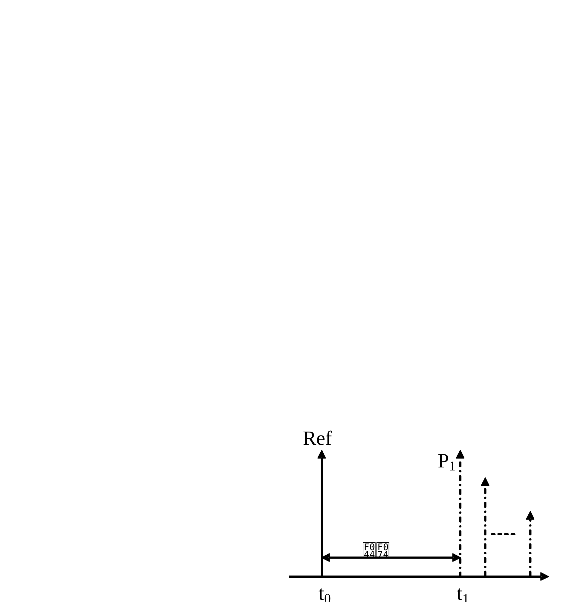

| 3GPP TS 36.104 V19.2.0 (2025-12) |  |
| --- | --- |
| Technical Specification |  |
| 3rd Generation Partnership Project;Technical Specification Group Radio Access Network;Evolved Universal Terrestrial Radio Access (E-UTRA);Base Station (BS) radio transmission and reception(Release 19) |  |
|  |  |
|  |  |
|  |  |
| The present document has been developed within the 3rd Generation Partnership Project (3GPP TM) and may be further elaborated for the purposes of 3GPP. The present document has not been subject to any approval process by the 3GPP Organizational Partners and shall not be implemented. This Specification is provided for future development work within 3GPP only. The Organizational Partners accept no liability for any use of this Specification. Specifications and Reports for implementation of the 3GPP TM system should be obtained via the 3GPP Organizational Partners' Publications Offices. |  |

|  |
| --- |
| 3GPPPostal address3GPP support office address650 Route des Lucioles - Sophia AntipolisValbonne - FRANCETel.: +33 4 92 94 42 00 Fax: +33 4 93 65 47 16Internethttp://www.3gpp.org |
| Copyright NotificationNo part may be reproduced except as authorized by written permission. The copyright and the foregoing restriction extend to reproduction in all media.© 2025, 3GPP Organizational Partners (ARIB, ATIS, CCSA, ETSI, TSDSI, TTA, TTC).All rights reserved.UMTS™ is a Trade Mark of ETSI registered for the benefit of its members3GPP™ is a Trade Mark of ETSI registered for the benefit of its Members and of the 3GPP Organizational Partners LTE™ is a Trade Mark of ETSI registered for the benefit of its Members and of the 3GPP Organizational PartnersGSM® and the GSM logo are registered and owned by the GSM Association |

Contents

Foreword 9

1 Scope 11

2 References 11

3 Definitions, symbols and abbreviations 12

3.1 Definitions 12

3.2 Symbols 15

3.3 Abbreviations 16

4 General 19

4.1 Relationship between minimum requirements and test requirements 19

4.2 Base station classes 19

4.3 Regional requirements 19

4.4 Applicability of requirements 21

4.5 Requirements for BS capable of multi-band operation 21

5 Operating bands and channel arrangement 22

5.1 General 22

5.2 Void 22

5.3 Void 22

5.4 Void 22

5.5 Operating bands 22

5.6 Channel bandwidth 26

5.7 Channel arrangement 31

5.7.1 Channel spacing 31

5.7.1A CA Channel spacing 32

5.7.2 Channel raster 32

5.7.3 Carrier frequency and EARFCN 32

5.7.4 EARFCN sets for Type B multi-carrier downlink transmissions and conversion to Type 2 channel access for multi-carrier uplink transmissions on multiple Scells configured in Band 46 37

5.8 Requirements for contiguous and non-contiguous spectrum 37

6 Transmitter characteristics 38

6.1 General 38

6.2 Base station output power 38

6.2.1 Minimum requirement 39

6.2.2 Additional requirement (regional) 39

6.2.3 Home BS output power for adjacent UTRA channel protection 40

6.2.4 Home BS output power for adjacent E-UTRA channel protection 41

6.2.5 Home BS Output Power for co-channel E-UTRA protection 42

6.3 Output power dynamics 43

6.3.1 RE Power control dynamic range 43

6.3.1.1 Minimum requirements 43

6.3.2 Total power dynamic range 43

6.3.2.1 Minimum requirements 44

6.3.3 NB-IoT RB power dynamic range for in-band or guard band operation 44

6.3.3.1 Minimum Requirement 44

6.4 Transmit ON/OFF power 44

6.4.1 Transmitter OFF power 44

6.4.1.1 Minimum Requirement 44

6.4.2 Transmitter transient period 45

6.4.2.1 Minimum requirements 45

6.5 Transmitted signal quality 45

6.5.1 Frequency error 45

6.5.1.1 Minimum requirement 45

6.5.2 Error Vector Magnitude 46

6.5.3 Time alignment error 46

6.5.3.1 Minimum Requirement 47

6.5.4 DL RS power 47

6.5.4.1 Minimum requirements 47

6.6 Unwanted emissions 47

6.6.0 Unwanted emissions for LTE based 5G terrestrial broadcast 48

6.6.1 Occupied bandwidth 48

6.6.1.1 Minimum requirement 48

6.6.2 Adjacent Channel Leakage power Ratio (ACLR) 48

6.6.2.0 Additional requirements for LTE based 5G terrestrial broadcast 49

6.6.2.1 Minimum requirement 49

6.6.2.2 Cumulative ACLR requirement in non-contiguous spectrum 51

6.6.3 Operating band unwanted emissions 53

6.6.3.1 Minimum requirements for Wide Area BS (Category A) 55

6.6.3.2 Minimum requirements for Wide Area BS (Category B) 57

6.6.3.2.1 Category B requirements (Option 1) 57

6.6.3.2.2 Category B (Option 2) 60

6.6.3.2A Minimum requirements for Local Area BS (Category A and B) 62

6.6.3.2B Minimum requirements for Home BS (Category A and B) 63

6.6.3.2C Minimum requirements for Medium Range BS (Category A and B) 64

6.6.3.2D Minimum requirements for Local Area and Medium Range BS in Band 46 (Category A and B) 66

6.6.3.2E Minimum requirements for standalone NB-IoT Wide Area BS 67

6.6.3.2F Minimum requirements for standalone NB-IoT Local Area BS 68

6.6.3.2G Minimum requirements for standalone NB-IoT Home BS (Category A and B) 69

6.6.3.2H Minimum requirements for standalone NB-IoT Medium Range BS 71

6.6.3.3 Additional requirements 72

6.6.3.4 Additional requirements for LTE based 5G terrestrial broadcast 77

6.6.4 Transmitter spurious emissions 77

6.6.4.1 Mandatory Requirements 77

6.6.4.1.1 Spurious emissions (Category A) 77

6.6.4.1.2 Spurious emissions (Category B) 78

6.6.4.2 Protection of the BS receiver of own or different BS 78

6.6.4.2.1 Minimum Requirement 78

6.6.4.3 Additional spurious emissions requirements 79

6.6.4.3.1 Minimum Requirement 79

6.6.4.4 Co-location with other base stations 88

6.6.4.4.1 Minimum Requirement 88

6.6.4.5 Additional transmitter spurious emissions requirements for LTE based 5G terrestrial broadcast 89

6.7 Transmitter intermodulation 89

6.7.1 Minimum requirement 89

6.7.2 Additional requirement for Band 41 91

7 Receiver characteristics 91

7.1 General 91

7.2 Reference sensitivity level 92

7.2.1 Minimum requirement 92

7.3 Dynamic range 97

7.3.1 Minimum requirement 98

7.4 In-channel selectivity 104

7.4.1 Minimum requirement 104

7.5 Adjacent Channel Selectivity (ACS) and narrow-band blocking 111

7.5.1 Minimum requirement 111

7.6 Blocking 122

7.6.1 General blocking requirement 122

7.6.1.1 Minimum requirement 122

7.6.2 Co-location with other base stations 137

7.6.2.1 Minimum requirement 137

7.6.3 Additional requirement (regional) 138

7.7 Receiver spurious emissions 138

7.7.1 Minimum requirement 139

7.8 Receiver intermodulation 139

7.8.1 Minimum requirement 139

8 Performance requirement 155

8.1 General 155

8.2 Performance requirements for PUSCH 155

8.2.1 Requirements in multipath fading propagation conditions 155

8.2.1.1 Minimum requirements 156

8.2.2 Requirements for UL timing adjustment 175

8.2.2.1 Minimum requirements 176

8.2.3 Requirements for high speed train 176

8.2.3.1 Minimum requirements 177

8.2.4 Requirements for HARQ-ACK multiplexed on PUSCH 180

8.2.4.1 Minimum requirement 180

8.2.5 Requirements for PUSCH with TTI bundling and enhanced HARQ pattern 181

8.2.5.1 Minimum requirements 182

8.2.6 Enhanced performance requirement type A in multipath fading propagation conditions with synchronous interference 182

8.2.6.1 Minimum requirements 183

8.2.6A Enhanced performance requirement type A in multipath fading propagation conditions with asynchronous interference 184

8.2.6A.1 Minimum requirements 185

8.2.7 Requirements for PUSCH supporting coverage enhancement 187

8.2.8 Requirements for PUSCH of Frame structure type 3 188

8.2.9 Enhanced performance requirement type B in multipath fading propagation conditions 189

8.2.9.1 Minimum requirements 191

8.2.10 Requirements for PUSCH supporting subPRB transmission 193

8.3 Performance requirements for PUCCH 195

8.3.1 DTX to ACK performance 195

8.3.1.1 Minimum requirement 195

8.3.2 ACK missed detection requirements for single user PUCCH format 1a 195

8.3.2.1 Minimum requirements 196

8.3.3 CQI performance requirements for PUCCH format 2 196

8.3.3.1 Minimum requirements 196

8.3.4 ACK missed detection requirements for multi user PUCCH format 1a 197

8.3.4.1 Minimum requirement 197

8.3.5 ACK missed detection requirements for PUCCH format 1b with Channel Selection 197

8.3.5.1 Minimum requirements 198

8.3.6 ACK missed detection requirements for PUCCH format 3 198

8.3.6.1 Minimum requirements 198

8.3.7 NACK to ACK requirements for PUCCH format 3 199

8.3.7.1 Minimum requirement 199

8.3.8 CQI performance requirements for PUCCH format 2 with DTX detection 199

8.3.8.1 Minimum requirements 200

8.3.9 PUCCH performance requirements for coverage enhancement 200

8.3.9.1 DTX to ACK performance 200

8.3.9.1.1 Minimum requirement 200

8.3.9.2 ACK missed detection requirements for single user PUCCH format 1a 200

8.3.9.2.1 Minimum requirements 201

8.3.9.3 CQI performance requirements for PUCCH format 2 201

8.3.9.3.1 Minimum requirements 201

8.3.10 ACK missed detection requirements for PUCCH format 4 201

8.3.10.1 Minimum requirements 202

8.3.11 ACK missed detection requirements for PUCCH format 5 202

8.3.11.1 Minimum requirements 202

8.4 Performance requirements for PRACH 203

8.4.1 PRACH False alarm probability 203

8.4.1.1 Minimum requirement 203

8.4.2 PRACH detection requirements 203

8.4.2.1 Minimum requirements 203

8.5 Performance requirements for Narrowband IoT 205

8.5.1 Requirements for NPUSCH format 1 205

8.5.1.1 Requirements 205

8.5.1.1.1 Minimum requirements 206

8.5.2 Performance requirements for NPUSCH format 2 207

8.5.2.1 DTX to ACK performance 207

8.5.2.1.1 Minimum requirement 207

8.5.2.2 ACK missed detection requirements 207

8.5.2.2.1 Minimum requirements 207

8.5.3 Performance requirements for NPRACH 208

8.5.3.1 NPRACH False alarm probability 208

8.5.3.1.1 Minimum requirement 208

8.5.3.2 NPRACH detection requirements 208

8.5.3.2.1 Minimum requirements 209

8.6 Performance requirements for subslot-PUSCH 209

8.6.1 Requirements 209

8.6.1.1 Minimum requirements 209

8.7 Performance requirements for SPUCCH 210

8.7.1 ACK missed detection requirements for single user SPUCCH format 1a 210

8.7.1.1 Minimum requirements 210

8.7.2 ACK missed detection requirements for SPUCCH format 4 211

8.7.2.1 Minimum requirements 211

9 Void 212

Annex A (normative):  Reference measurement channels 213

A.1 Fixed Reference Channels for reference sensitivity and in-channel selectivity (QPSK, R=1/3) 214

A.2 Fixed Reference Channels for dynamic range (16QAM, R=2/3) 215

A.3 Fixed Reference Channels for performance requirements (QPSK 1/3) 215

A.4 Fixed Reference Channels for performance requirements (16QAM 3/4) 216

A.5 Fixed Reference Channels for performance requirements (64QAM 5/6) 216

A.6 PRACH Test preambles 216

A.7 Fixed Reference Channels for UL timing adjustment (Scenario 1) 217

A.8 Fixed Reference Channels for UL timing adjustment (Scenario 2) 218

A.9 Multi user PUCCH test 218

A.10 PUCCH transmission on two antenna ports test 218

A.11 Fixed Reference Channel for PUSCH with TTI bundling and enhanced HARQ pattern 219

A.12 Fixed Reference Channels for performance requirements (QPSK 0.36) 219

A.13 Fixed Reference Channels for performance requirements (16QAM 1/2) 220

A.14 Fixed Reference Channels for NB-IOT reference sensitivity (π/2 BPSK, R=1/3) 220

A.15 Fixed Reference Channels for NB-IoT dynamic range (π/4 QPSK, R=2/3) 220

A.16 Fixed Reference Channels for NB-IoT NPUSCH format 1 221

A.16.1 One PRB 221

A.17 Fixed Reference Channels for performance requirements (256QAM 5/6) 222

A.18 Fixed Reference Channels for PUSCH transmission in UpPTS (16QAM 0.65) 223

A.19 Fixed Reference Channels for PUSCH transmission in UpPTS (256QAM 0.69) 223

A.20 Fixed Reference Channels for PUSCH of Frame structure type 3 224

A.21 Fixed Reference Channels for performance requirements (QPSK 3/5) 225

A.22 Fixed Reference Channels for performance requirements (64QAM 1/2) 225

A.23 Fixed Reference Channels for SubPRB allocation reference sensitivity (π/2 BPSK, R=1/3) 225

A.24 Fixed Reference Channel for subslot-PUSCH 226

A.25 Fixed Reference Channels for PUSCH with SubPRB transmission 227

Annex B (normative):  Propagation conditions 228

B.1 Static propagation condition 228

B.2 Multi-path fading propagation conditions 228

B.3 High speed train condition 229

B.4 Moving propagation conditions 233

B.5 Multi-Antenna channel models 234

B.5.1 Definition of MIMO Correlation Matrices 234

B.5.2 MIMO Correlation Matrices at High, Medium and Low Level 235

B.5A Multi-Antenna channel models using cross polarized antennas 237

B.5A.1 Definition of MIMO Correlation Matrices using cross polarized antennas 238

B.5A.2 Spatial Correlation Matrices at UE and eNB sides 239

B.5A.2.1 Spatial Correlation Matrices at UE side 239

B.5A.2.2 Spatial Correlation Matrices at eNB side 239

B.5A.3 MIMO Correlation Matrices using cross polarized antennas 239

B.6 Interference model for enhanced performance requirements type A and type B 239

B.6.1 Dominant interferer proportion 240

B.6.2 Interference model for synchronous scenario 240

B.6.3 Interference model for asynchronous scenario 240

Annex C (normative):  Characteristics of the interfering signals 241

Annex D (normative):  Environmental requirements for the BS equipment 242

Annex E (normative):  Error Vector Magnitude 243

E.1 Reference point for measurement 243

E.2 Basic unit of measurement 243

E.3 Modified signal under test 244

E.4 Estimation of frequency offset 244

E.5 Estimation of time offset 244

E.5.1 Window length 245

E.6 Estimation of TX chain amplitude and frequency response parameters 247

E.7 Averaged EVM 248

Annex F (Informative): Unwanted emission requirements for multi-carrier BS 250

F.1 General 250

F.2 Multi-carrier BS of different E-UTRA channel bandwidths 250

F.3 Multi-carrier BS of E-UTRA and UTRA 250

Annex G (Informative): Regional requirement for protection of DTT 251

G.1 Regional requirement for protection of DTT 251

G.2 Regional requirement for Public Safety LTE BS in Korea 251

Annex H (Informative):  Calculation of EIRP based on manufacturer declarations and site specific conditions 254

H.1 Calculation of EIRP based on manufacturer declarations and site specific conditions 254

Annex I (Informative):  Change history 255

# Foreword

This Technical Specification has been produced by the 3rd Generation Partnership Project (3GPP).

The contents of the present document are subject to continuing work within the TSG and may change following formal TSG approval. Should the TSG modify the contents of the present document, it will be re-released by the TSG with an identifying change of release date and an increase in version number as follows:

Version x.y.z

where:

x the first digit:

## 1 presented to TSG for information;

## 2 presented to TSG for approval;

## 3 or greater indicates TSG approved document under change control.

y the second digit is incremented for all changes of substance, i.e. technical enhancements, corrections, updates, etc.

z the third digit is incremented when editorial only changes have been incorporated in the document.

In the present document, modal verbs have the following meanings:

shall  indicates a mandatory requirement to do something

shall not indicates an interdiction (prohibition) to do something

The constructions "shall" and "shall not" are confined to the context of normative provisions, and do not appear in Technical Reports.

The constructions "must" and "must not" are not used as substitutes for "shall" and "shall not". Their use is avoided insofar as possible, and they are not used in a normative context except in a direct citation from an external, referenced, non-3GPP document, or so as to maintain continuity of style when extending or modifying the provisions of such a referenced document.

should  indicates a recommendation to do something

should not indicates a recommendation not to do something

may  indicates permission to do something

need not indicates permission not to do something

The construction "may not" is ambiguous and is not used in normative elements. The unambiguous constructions "might not" or "shall not" are used instead, depending upon the meaning intended.

can  indicates that something is possible

cannot  indicates that something is impossible

The constructions "can" and "cannot" are not substitutes for "may" and "need not".

will  indicates that something is certain or expected to happen as a result of action taken by an agency the behaviour of which is outside the scope of the present document

will not  indicates that something is certain or expected not to happen as a result of action taken by an agency the behaviour of which is outside the scope of the present document

might indicates a likelihood that something will happen as a result of action taken by some agency the behaviour of which is outside the scope of the present document

might not indicates a likelihood that something will not happen as a result of action taken by some agency the behaviour of which is outside the scope of the present document

In addition:

is (or any other verb in the indicative mood) indicates a statement of fact

is not (or any other negative verb in the indicative mood) indicates a statement of fact

The constructions "is" and "is not" do not indicate requirements.

# 1 Scope

The present document establishes the minimum RF characteristics and minimum performance requirements of E-UTRA, E-UTRA with NB-IoT or NB-IoT Base Station (BS).

# 2 References

The following documents contain provisions which, through reference in this text, constitute provisions of the present document.

- References are either specific (identified by date of publication, edition number, version number, etc.) or nonspecific.

- For a specific reference, subsequent revisions do not apply.

- For a non-specific reference, the latest version applies. In the case of a reference to a 3GPP document (including a GSM document), a non-specific reference implicitly refers to the latest version of that document in the same Release as the present document.

[1] 3GPP TR 21.905: "Vocabulary for 3GPP Specifications".

[2] ITU-R Recommendation SM.329: "Unwanted emissions in the spurious domain".

[3] ITU-R Recommendation M.1545: "Measurement uncertainty as it applies to test limits for the terrestrial component of International Mobile Telecommunications-2000".

[4] 3GPP TS 36.141: "Evolved Universal Terrestrial Radio Access (E-UTRA); Base Station (BS) conformance testing".

[5] ITU-R recommendation SM.328: "Spectra and bandwidth of emissions".

[6] 3GPP TS 25.104: "Base Station (BS) radio transmission and reception (FDD)".

[7] 3GPP TS 25.105: "Base Station (BS) radio transmission and reception (TDD)".

[8] 3GPP TR 25.942: "RF system scenarios".

[9] 3GPP TR 36.942: "E-UTRA RF system scenarios".

[10] 3GPP TS 36.211: "Evolved Universal Terrestrial Radio Access (E-UTRA); Physical Channels and Modulation".

[11] 3GPP TS 36.213: "Evolved Universal Terrestrial Radio Access (E-UTRA); Physical layer procedures".

[12] ECC/DEC/(09)03 "Harmonised conditions for MFCN in the band 790-862 MHz", 30 Oct. 2009

[13] IEC 60721-3-3 (2002): "Classification of environmental conditions - Part 3: Classification of groups of environmental parameters and their severities - Section 3: Stationary use at weather protected locations".

[14] IEC 60721-3-4 (1995): "Classification of environmental conditions - Part 3: Classification of groups of environmental parameters and their severities - Section 4: Stationary use at non-weather protected locations".

[15] 3GPP TS 37.104: "E-UTRA, UTRA and GSM/EDGE; Multi-Standard Radio (MSR) Base Station (BS) radio transmission and reception ".

[16] CEPT ECC Decision (13)03, "The harmonised use of the frequency band 1452-1492 MHz for Mobile/Fixed Communications Networks Supplemental Downlink (MFCN SDL)".

[17] 3GPP TS 36.211: "Evolved Universal Terrestrial Radio Access (E-UTRA); Physical channels and modulation".

[18] 3GPP TS 36.213: "Evolved Universal Terrestrial Radio Access (E-UTRA); Physical layer procedures".

[19] CEPT ECC Decision (17)06, "The harmonised use of the frequency bands 1427-1452 MHz and 1492-1518 MHz for Mobile/Fixed Communications Networks Supplemental Downlink (MFCN SDL)".

[20] 3GPP TS 37.213: "Physical layer procedures for shared spectrum channel access".

[21] ITU-R Recommendation BT.1206: "Spectrum limit masks for digital terrestrial television broadcasting".

[22] ETSI EN 302 296: "Digital Terrestrial TV Transmitters; Harmonised Standard for access to radio spectrum".

[23] ETSI TR 101 290: "Digital Video Broadcasting (DVB); Measurement guidelines for DVB systems".

[24] Void

[25] ITU GE06 Agreement: "Primary Terrestrial Services Other Than Broadcasting In The Planning Area And Bands Governed By The Regional Agreement GE06", https://www.itu.int/en/ITU-R/terrestrial/fmd/Documents/fxm-GE06-report.pdf

[26] FCC Title 47 CFR 73.622, Digital television table of allotments, FCC, United States.

[27] ABNT NBR 15601, Digital terrestrial television – Transmission system, Brazilian Association of Technical Standards, Anatel, Brazil.

[28] GB20600-2006: "Framing structure, Channel coding and modulation for digital television terrestrial broadcasting system", National Standard, China.

[29] 3GPP TS 36.331: "Evolved Universal Terrestrial Radio Access (E-UTRA); Radio Resource Control (RRC); Protocol specification".

[30] 3GPP TR 36.972: "Summary of regulatory requirements on unwanted emissions for transmission over broadcast bands in UHF spectrum".

[31] 3GPP TS 38.104: "NR; Base Station (BS) radio transmission and reception"

# 3 Definitions, symbols and abbreviations

## 3.1 Definitions

For the purposes of the present document, the terms and definitions given in TR 21.905 [1] and the following apply. A term defined in the present document takes precedence over the definition of the same term, if any, in TR 21.905 [1].

Aggregated Channel Bandwidth: RF bandwidth in which a base station transmits and/or receives multiple contiguously aggregated carriers.

NOTE: The Aggregated Channel Bandwidth is measured in MHz.

Base station receive period: time during which the base station is receiving data subframes or UpPTS.

Base Station RF Bandwidth: RF bandwidth in which a base station transmits and/or receives single or multiple carrier(s) within a supported operating band.

NOTE: In single E-UTRA carrier operation, the Base Station RF Bandwidth is equal to the channel bandwidth.

Base Station RF Bandwidth edge: frequency of one of the edges of the Base Station RF Bandwidth.

Carrier: modulated waveform conveying the E-UTRA or UTRA physical channels

Carrier aggregation: aggregation of two or more component carriers in order to support wider transmission bandwidths

Carrier aggregation band: a set of one or more operating bands across which multiple carriers are aggregated with a specific set of technical requirements.

NOTE: Carrier aggregation band(s) for an E-UTRA BS is declared by the manufacturer according to the designations in Tables 5.5-2 to 5.5-4.

Channel bandwidth: RF bandwidth supporting a single E-UTRA RF carrier with the transmission bandwidth configured in the uplink or downlink of a cell.

NOTE: The channel bandwidth is measured in MHz and is used as a reference for transmitter and receiver RF requirements.

Channel edge: lowest or highest frequency of the E-UTRA carrier, separated by the channel bandwidth.

Contiguous carriers: set of two or more carriers configured in a spectrum block where there are no RF requirements based on co-existence for un-coordinated operation within the spectrum block.

Contiguous spectrum: spectrum consisting of a contiguous block of spectrum with no sub-block gap(s).

DL RS power: resource element power of Downlink Reference Symbol.

DL NRS power: resource element power of Downlink Narrowband Reference Signal.

Downlink operating band: part of the operating band designated for downlink.

Enhanced performance requirements type A: This defines performance requirements assuming baseline receiver as demodulation reference signal based linear minimum mean square error interference rejection combining.

Enhanced performance requirements type B: This defines performance requirements assuming baseline receiver as code word level interference cancellation for intra-cell inter-user interference plus demodulation reference signal based linear minimum mean square error interference rejection combining for inter-cell interference.

Highest carrier: carrier with the highest carrier centre frequency transmitted/received in a specified operating band.

Inter RF Bandwidth gap: frequency gap between two consecutive Base Station RF Bandwidths that are placed within two supported operating bands.

Inter-band carrier aggregation: carrier aggregation of component carriers in different operating bands.

NOTE: Carriers aggregated in each band can be contiguous or non-contiguous.

Inter-band gap: The frequency gap between two supported consecutive operating bands.

Intra-band contiguous carrier aggregation: contiguous carriers aggregated in the same operating band.

Intra-band non-contiguous carrier aggregation: non-contiguous carriers aggregated in the same operating band.

Lower sub-block edge: frequency at the lower edge of one sub-block.

NOTE: It is used as a frequency reference point for both transmitter and receiver requirements.

Lowest carrier: carrier with the lowest carrier centre frequency transmitted/received in a specified operating band.

LTE based 5G terrestrial broadcast base station: A base station designed to work on LTE based 5G terrestrial broadacast bands.

Maximum output power: mean power level per carrier of the base station measured at the antenna connector in a specified reference condition.

Maximum throughput: maximum achievable throughput for a reference measurement channel.

Mean power: power measured in the channel bandwidth of the carrier.

NOTE: The period of measurement shall be at least one subframe (1ms), unless otherwise stated.

Measurement bandwidth: RF bandwidth in which an emission level is specified.

Multi-band base station: base station characterized by the ability of its transmitter and/or receiver to process two or more carriers in common active RF components simultaneously, where at least one carrier is configured at a different operating band (which is not a sub-band or superseding-band of another supported operating band) than the other carrier(s).

Multi-band transmitter: transmitter characterized by the ability to process two or more carriers in common active RF components simultaneously, where at least one carrier is configured at a different operating band  (which is not a sub-band or superseding-band of another supported operating band) than the other carrier(s).

Multi-band receiver: receiver characterized by the ability to process two or more carriers in common active RF components simultaneously, where at least one carrier is configured at a different operating band  (which is not a sub-band or superseding-band of another supported operating band) than the other carrier(s).

Multi-carrier transmission configuration: set of one or more contiguous or non-contiguous carriers that a BS is able to transmit simultaneously according to the manufacturer's specification.

NB-IoT In-band operation: NB-IoT is operating in-band when it utilizes the resource block(s) within a normal E-UTRA carrier

NB-IoT guard band operation: NB-IoT is operating in guard band when it utilizes the unused resource block(s) within a E-UTRA carrier's guard-band.

NB-IoT standalone operation: NB-IoT is operating standalone when it utilizes its own spectrum, for example the spectrum currently being used by GERAN systems as a replacement of one or more GSM carriers, as well as scattered spectrum for potential IoT deployment.

Non-contiguous spectrum: spectrum consisting of two or more sub-blocks separated by sub-block gap(s).

Occupied bandwidth: width of a frequency band such that, below the lower and above the upper frequency limits, the mean powers emitted are each equal to a specified percentage β/2 of the total mean power of a given emission.

Operating band: frequency range in which E-UTRA operates (paired or unpaired), that is defined with a specific set of technical requirements.

NOTE: The operating band(s) for an E-UTRA BS is declared by the manufacturer according to the designations in table 5.5-1.

Output power: mean power of one carrier of the base station, delivered to a load with resistance equal to the nominal load impedance of the transmitter.

Radio Bandwidth: frequency difference between the upper edge of the highest used carrier and the lower edge of the lowest used carrier.

Rated output power: mean power level per carrier that the manufacturer has declared to be available at the antenna connector during the transmitter ON period.

RE power control dynamic range: difference between the power of a RE and the average RE power for a BS at maximum output power for a specified reference condition.

RRC filtered mean power: mean power of an UTRA carrier as measured through a root raised cosine filter with roll-off factor  and a bandwidth equal to the chip rate of the radio access mode.

NOTE 1: The RRC filtered mean power of a perfectly modulated UTRA signal is 0.246 dB lower than the mean power of the same signal.

sTTI: A transmission time interval (TTI) of either one slot or one subslot as defined in [10] on either uplink or downlink.

Sub-band: A sub-band of an operating band contains a part of the uplink and downlink frequency range of the operating band.

Sub-block: one contiguous allocated block of spectrum for transmission and reception by the same base station.

NOTE: There may be multiple instances of sub-blocks within aBase Station RF Bandwidth.

Sub-block bandwidth: bandwidth of one sub-block.

Sub-block gap: frequency gap between two consecutive sub-blocks within a Bae Station RF Bandwidth, where the RF requirements in the gap are based on co-existence for un-coordinated operation.

Superseding-band: A superseding-band of an operating band includes the whole of the uplink and downlink frequency range of the operating band.

Synchronized operation: operation of TDD in two different systems, where no simultaneous uplink and downlink occur.

Throughput: number of payload bits successfully received per second for a reference measurement channel in a specified reference condition.

Total power dynamic range: difference between the maximum and the minimum transmit power of an OFDM symbol for a specified reference condition.

Transmission bandwidth: RF Bandwidth of an instantaneous transmission from a UE or BS, measured in resource block units.

Transmission bandwidth configuration: highest transmission bandwidth allowed for uplink or downlink in a given channel bandwidth, measured in resource block units.

Transmitter ON period: time period during which the BS transmitter is transmitting data and/or reference symbols, i.e. data subframes or DwPTS.

Transmitter OFF period: time period during which the BS transmitter is not allowed to transmit.

Transmitter transient period: time period during which the transmitter is changing from the OFF period to the ON period or vice versa.

Unsynchronized operation: operation of TDD in two different systems, where the conditions for synchronized operation are not met.

Uplink operating band: part of the operating band designated for uplink.

Upper sub-block edge: frequency at the upper edge of one sub-block.

NOTE: It is used as a frequency reference point for both transmitter and receiver requirements.

## 3.2 Symbols

For the purposes of the present document, the following symbols apply:

 Roll-off factor

 Percentage of the mean transmitted power emitted outside the occupied bandwidth on the assigned channel

BW Bandwidth

BWChannel Channel bandwidth

BWChannel_CA Aggregated Channel Bandwidth, expressed in MHz. BWChannel_CA= Fedge_high- Fedge_low.

BWChannel,block Sub-block bandwidth, expressed in MHz. BWChannel,block= Fedge,block,high- Fedge,block,low.

BWConfig Transmission bandwidth configuration, expressed in MHz, where BWConfig = NRB x 180 kHz in the uplink and BWConfig = 15 kHz + NRB x 180 kHz in the downlink.

CA_X Intra-band contiguous CA of component carriers in one sub-block within band X where X is the applicable E-UTRA operating band

CA_X-X Intra-band non-contiguous CA of component carriers in two sub-blocks within band X where X is the applicable E-UTRA operating band

CA_X-Y Inter-band CA of component carrier(s) in one sub-block within band X and component carrier(s) in one sub-block within Band Y where X and Y are the applicable E-UTRA operating bands

CA_X-X-Y CA of component carriers in two sub-blocks within Band X and component carrier(s) in one sub-block within Band Y where X and Y are the applicable E-UTRA operating bands

f Frequency

f Separation between the channel edge frequency and the nominal -3dB point of the measuring filter closest to the carrier frequency

fmax The largest value of f used for defining the requirement

FC Carrier centre frequency

FC,block, high Centre frequency of the highest transmitted/received carrier in a sub-block.

FC,block, low Centre frequency of the lowest transmitted/received carrier in a sub-block.

FC_low The carrier centre frequency of the lowest carrier, expressed in MHz.

FC_high The carrier centre frequency of the highest carrier, expressed in MHz.

Fedge_low The lower edge of Aggregated Channel Bandwidth, expressed in MHz. Fedge_low = FC_low - Foffset.

Fedge_high The upper edge of Aggregated Channel Bandwidth, expressed in MHz. Fedge_high = FC_high + Foffset.

Fedge,block,low The lower sub-block edge, where Fedge,block,low = FC,block,low - Foffset.

Fedge,block,high The upper sub-block edge, where Fedge,block,high = FC,block,high + Foffset.

Foffset Frequency offset from FC_high to the upper Base Station RF Bandwidth edge, or from F C,block, high to the upper sub-block edge, or FC_low to the lower Base Station RF Bandwidth edge, or from FC,block, low to the lower sub-block edge.

Ffilter Filter centre frequency

f_offset Separation between the channel edge frequency and the centre of the measuring filter

f_offsetmax The maximum value of f_offset used for defining the requirement

FDL_low The lowest frequency of the downlink operating band

FDL_high The highest frequency of the downlink operating band

FUL_low The lowest frequency of the uplink operating band

FUL_high The highest frequency of the uplink operating band

Gant Net antenna gain

MDL Offset of NB-IoT Downlink channel number to Downlink EARFCN

MUL Offset of NB-IoT Uplink channel number to Uplink EARFCN

Nant Number of transmitter antennas

NDL Downlink EARFCN

NOffs-DL Offset used for calculating downlink EARFCN

NOffs-UL Offset used for calculating uplink EARFCN

NCS Number of Cyclic shifts for preamble generation in PRACH

NRB Transmission bandwidth configuration, expressed in units of resource blocks

NUL Uplink EARFCN

P10MHz Maximum output Power within 10 MHz

PEIRP,N EIRP level for channel N

PEIRP,N,MAX Maximum EIRP level for channel N

PEM,N Declared emission level for channel N

PEM,B32,B75,B76,ind Declared emission level in Band 32, Band 75 and Band 76, ind=a, b, c

PEM,B32,ind Declared emission level in Band 32, ind=d, e

PEM,B50,B74,B75,ind Declared emission level for Band 50, Band 74 and Band 75, ind=a,b

PEM,B54,ind Declared emission level in Band 54, ind=a,b,c,d,e,f

Pmax,c Maximum carrier output power

Pout Output power (per carrier)

Prated,c Rated output power (per carrier)

PREFSENS Reference Sensitivity power level

TA Timing advance command, as defined in [11]

 [公式≈: ^{T}s] Basic time unit, as defined in [10]

Wgap Sub-block gap or Inter RF Bandwidth gap size

## 3.3 Abbreviations

For the purposes of the present document, the abbreviations given in TR 21.905 [1] and the following apply. An abbreviation defined in the present document takes precedence over the definition of the same abbreviation, if any, in TR 21.905 [1].

ACLR Adjacent Channel Leakage Ratio

ACK Acknowledgement (in HARQ protocols)

ACS Adjacent Channel Selectivity

ATSC Advanced Television Systems Committee

AWGN Additive White Gaussian Noise

BS Base Station

CA Carrier Aggregation

CACLR Cumulative ACLR

CP Cyclic prefix

CRC Cyclic Redundancy Check

CW Continuous Wave

DC Direct Current

DFT Discrete Fourier Transformation

DIP Dominant Interferer Proportion

DTMB Digital Terrestrial Multimedia Broadcast

DTT Digital Terrestrial Television

DTX Discontinuous Transmission

DVB-T Digital Video Broadcasting – Terrestrial

DwPTS Downlink part of the special subframe (for TDD operation)

EARFCN E-UTRA Absolute Radio Frequency Channel Number

EIRP Effective Isotropic Radiated Power

EPA Extended Pedestrian A model

ETU Extended Typical Urban model

E-UTRA Evolved UTRA

EVA Extended Vehicular A model

EVM Error Vector Magnitude

FDD Frequency Division Duplex

FFT Fast Fourier Transformation

FRC Fixed Reference Channel

GP Guard Period (for TDD operation)

GSM Global System for Mobile communications

HAPS High Altitude Platform Station

HARQ Hybrid Automatic Repeat Request

ICS In-Channel Selectivity

ISDB-T Integrated Services Digital Broadcasting – Terrestrial

ITUR Radiocommunication Sector of the ITU

LA Local Area

LNA Low Noise Amplifier

MCS Modulation and Coding Scheme

MFCN Mobile/Fixed Communications Network

MR Medium Range

NB-IoT Narrowband – Internet of Things

NPDSCH Narrowband Physical Downlink Shared Channel

NPUSCH Narrowband Physical Uplink Shared Channel

NRS Narrowband Refernce Signal

OFDM Orthogonal Frequency Division Multiplex

OOB Out-of-band

PA Power Amplifier

PBCH Physical Broadcast Channel

PDCCH Physical Downlink Control Channel

PDSCH Physical Downlink Shared Channel

PMCH Physical Multicast Channel

PUSCH Physical Uplink Shared Channel

PUCCH Physical Uplink Control Channel

PRACH Physical Random Access Channel

QAM Quadrature Amplitude Modulation

QPSK Quadrature Phase-Shift Keying

RAT Radio Access Technology

RB Resource Block

RE Resource Element

RF Radio Frequency

RMS Root Mean Square (value)

RS Reference Symbol

RX Receiver

RRC Root Raised Cosine

SDO Standalone Downlink Only

SINR Signal-to-Interference-and-Noise Ratio

SNR Signal-to-Noise Ratio

sPDCCH shortened Physical Downlink Control Channel

sPDSCH shortened Physical Downlink Shared Channel

TA Timing Advance

TDD Time Division Duplex

TX Transmitter

UE User Equipment

WA Wide Area

# 4 General

## 4.1 Relationship between minimum requirements and test requirements

The Minimum Requirements given in this specification make no allowance for measurement uncertainty. The test specification TS 36.141 [4] Annex G defines Test Tolerances. These Test Tolerances are individually calculated for each test. The Test Tolerances are used to relax the Minimum Requirements in this specification to create Test Requirements.

The measurement results returned by the Test System are compared - without any modification - against the Test Requirements as defined by the shared risk principle.

The Shared Risk principle is defined in ITU-R M.1545 [3].

## 4.2 Base station classes

The requirements in this specification apply to Wide Area Base Stations, Medium Range Base Stations, Local Area Base Stations and Home Base Stations unless otherwise stated.

Wide Area Base Stations are characterised by requirements derived from Macro Cell scenarios with a BS to UE minimum coupling loss equal to 70 dB. The Wide Area Base Station class has the same requirements as the base station for General Purpose application in Release 8.

Medium Range Base Stations are characterised by requirements derived from Micro Cell scenarios with a BS to UE minimum coupling loss equal to 53 dB.

Local Area Base Stations are characterised by requirements derived from Pico Cell scenarios with a BS to UE minimum coupling loss equal to 45 dB.

Home Base Stations are characterised by requirements derived from Femto Cell scenarios.

HAPS BS class is defined as indicated below:

- HAPS Base Stations are characterised by requirements derived from High Altitude Platform scenarios with a BS to ground UE minimum distance of typically around 20km.

- Unless otherwise stated, HAPS BS class would refer to Wide Area BS class, which is specified in clause 4.2.

## 4.3 Regional requirements

Some requirements in the present document may only apply in certain regions either as optional requirements or set by local and regional regulation as mandatory requirements. It is normally not stated in the 3GPP specifications under what exact circumstances that the requirements apply, since this is defined by local or regional regulation.

Table 4.3-1 lists all requirements that may be applied differently in different regions.

Table 4.3-1: List of regional requirements

| Clause number | Requirement | Comments |
| --- | --- | --- |
| 5.5 | Operating bands | Some bands may be applied regionally. |
| 5.6 | Channel bandwidth | Some channel bandwidths may be applied regionally. |
| 5.7 | Channel arrangement | The requirement is applied according to what operating bands in clause 5.5 that are supported by the BS. |
| 6.2 | Base station maximum output power | In certain regions, the minimum requirement for normal conditions may apply also for some conditions outside the range of conditions defined as normal. |
| 6.2.2 | Additional requirement (regional) | For Band 34 and Band 41 operation in certain regions, the rated output power declared by the manufacturer shall be less than or equal to the values specified in Table 6.2.2-1 and 6.2.2-2, respectively.In addition for Band 46 operation, the BS may have to comply with the applicable BS power limits established regionally, when deployed in regions where those limits apply and under the conditions declared by the manufacturer. |
| 6.6.0 | Unwanted emissions for LTE based 5G terrestrial broadcast | For LTE based 5G terrestrial broadcast BS additional regional requirements may apply according to the references in Table 6.6-1. |
| 6.6.1.1 | Occupied bandwidth | For Band 46 operation in certain regions, the occupied bandwidth for each 20MHz channel bandwidth E-UTRA carrier shall be less than or equal to 19MHz or 19.7MHz. |
| 6.6.2 | Adjacent Channel Leakage power Ratio (ACLR) | For LTE based 5G terrestrial broadcast BS, the ACLR shall be no less than 45 dB in addition to the applicable ACLR requirements according to regional regulations. |
| 6.6.3.1 | Operating band unwanted emissions (Category A) | This requirement is mandatory for regions where Category A limits for spurious emissions, as defined in ITU-R Recommendation SM.329 [2] apply. |
| 6.6.3.2 | Operating band unwanted emissions (Category B) | This requirement is mandatory for regions where Category B limits for spurious emissions, as defined in ITU-R Recommendation SM.329 [2], apply. |
| 6.6.3.3 | Additional requirements | These requirements may apply in certain regions as additional Operating band unwanted emission limits.In addition for Band 46 operation, the BS may have to comply with the applicable operating band unwanted emission limits established regionally, when deployed in regions where those limits apply and under the conditions declared by the manufacturer. |
| 6.6.3.4 | Additional requirements for LTE based 5G terrestrial broadcast | These requirements for LTE based 5G terrestrial broadcast BS may apply in certain regions as additional Operating band unwanted emission limits. |
| 6.6.4.1.1 | Spurious emissions (Category A) | This requirement is mandatory for regions where Category A limits for spurious emissions, as defined in ITU-R Recommendation SM.329 [2] apply. |
| 6.6.4.1.2 | Spurious emissions (Category B) | This requirement is mandatory for regions where Category B limits for spurious emissions, as defined in ITU-R Recommendation SM.329 [2], apply. |
| 6.6.4.3 | Additional spurious emission requirements | These requirements may be applied for the protection of system operating in frequency ranges other than the E-UTRA BS operating band.In addition for Band 46 operation, the BS may have to comply with the applicable spurious emission limits established regionally, when deployed in regions where those limits apply and under the conditions declared by the manufacturer. |
| 6.6.4.4 | Co-location with other base stations | These requirements may be applied for the protection of other BS receivers when a BS operating in another frequency band is co-located with an E-UTRA BS. |
| 6.6.4.5 | Additional transmitter spurious emissions requirements for LTE based 5G terrestrial broadcast | These requirements for LTE based 5G terrestrial broadcast BS may apply in certain regions as additional spurious emission requirements. |
| 6.7.2 | Additional requirements | These requirements may apply in certain regions. |
| 7.6.2 | Co-location with other base stations | These requirements may be applied for the protection of the BS receiver when a BS operating in another frequency band is co-located with an EUTRA BS. |

## 4.4 Applicability of requirements

For BS that is E-UTRA (single-RAT), E-UTRA with NB-IoT (in band and/or guard band) or standalone NB-IoT capable only, MBMS (including 15 kHz, 7.5 kHz,1.25 kHz, 2.5 kHz and 0.37 kHz subcarrier spacing), the requirements in the present document are applicable and additional conformance to TS 37.104 [15] is optional. For a BS additionally conforming to TS 37.104 [15], conformance to some of the RF requirements in the present document can be demonstrated through the corresponding requirements in TS 37.104 [15] as listed in Table 4.4-1.

Table 4.4-1: Alternative RF minimum requirements for a BS additionally conforming to TS 37.104 [15]

| RF requirement | Clause in the present document | Alternative clause in TS 37.104 [15] |
| --- | --- | --- |
| Base station output power | 6.2.16.2.2 | 6.2.1  6.2.2 |
| Transmit ON/OFF power | 6.4 | 6.4 |
| Unwanted emissions |  |  |
| Transmitter spurious emissions | 6.6.4 | 6.6.1 (except for 6.6.1.1.3) |
| Operating band unwanted emissions | 6.6.3.1, 6.6.3.2(NOTE 1) | 6.6.2 (except for 6.6.2.3 and 6.6.2.4) |
| Transmitter intermodulation | 6.7 | 6.7.1 |
| Narrowband blocking | 7.5.1 | 7.4.2 |
| Blocking | 7.6.1.1 | 7.4.1 |
| Out-of-band blocking | 7.6.1.1 | 7.5.1 |
| Co-location with other base stations | 7.6.2.1 | 7.5.2 |
| Receiver spurious emissions | 7.7.1 | 7.6.1 |
| Intermodulation | 7.8.1 | 7.7.1 |
| Narrowband intermodulation | 7.8.1 | 7.7.2 |
| NOTE 1: This does not apply when the lowest or highest carrier frequency is configured as 1.4 or 3 MHz carrier in bands of Band Category 1 or 3 according to clause 4.5 in TS 37.104 [15]. |  |  |

## 4.5 Requirements for BS capable of multi-band operation

For BS capable of multi-band operation, the RF requirements in clause 6 and 7 apply for each supported operating band unless otherwise stated. For some requirements it is explicitly stated that specific additions or exclusions to the requirement apply for BS capable of multi-band operation.

For BS capable of multi-band operation, various structures in terms of combinations of different transmitter and receiver implementations (multi-band or single band) with mapping of transceivers to one or more antenna port(s) in different ways are possible. In the case where multiple bands are mapped on an antenna connector, the exclusions or provisions for multi-band capable BS are applicable to this antenna connector. In the case where a single band is mapped on an antenna connector, the following applies:

- Single-band ACLR, operating band unwanted emissions, transmitter spurious emissions, transmitter intermodulation and receiver spurious emissions requirements apply to this antenna connector that is mapped to single-band. In case there are carrier(s) transmitted simultaneously in another supported operating band in common active RF components, when the RF signals of these antenna connectors cover the same geographical area, the frequency range of the Base Station RF bandwidth in the other supported band to this antenna connector should be excluded from the unwanted emission requirements.

- If the BS is configured for single-band operation, single-band requirements shall apply to this antenna connector configured for single-band operation and no exclusions or provisions for multi-band capable BS are applicable. Single-band requirements are tested separately at the antenna connector configured for single-band operation, with all other antenna connectors terminated.

For a band supported by a Base Station where the transmitted carriers are not processed in active RF components together with carriers in any other band, single-band transmitter requirements shall apply. For a band supported by a Base Station where the received carriers are not processed in active RF components together with carriers in any other band, single-band receiver requirements shall apply.

For a BS capable of multi-band operation supporting bands for TDD, the RF requirements in the present specification assume synchronized operation, where no simultaneous uplink and downlink occur between the supported operating bands.

The RF requirements in the present specification are FFS for multi-band operation supporting bands for both FDD and TDD.

# 5 Operating bands and channel arrangement

## 5.1 General

The channel arrangements presented in this clause are based on the operating bands and channel bandwidths defined in the present release of specifications.

NOTE: Other operating bands and channel bandwidths may be considered in future releases.

## 5.2 Void

## 5.3 Void

## 5.4 Void

## 5.5 Operating bands

E-UTRA is designed to operate in the operating bands defined in Table 5.5-1. Unless stated otherwise, requirements specified for the TDD duplex mode apply for downlink and uplink operations in Frame Structure Type 2 [4].

NB-IoT is designed to operate in the E-UTRA operating bands 1, 2, 3, 4, 5, 7, 8, 11, 12, 13, 14, 17, 18, 19, 20, 21, 24, 25, 26, 28, 31, 41 (in certain regions), 42, 43, 48, 54, 65, 66, 70, 71, 72, 73, 74, 85, 87, 88, 103, 106, 111 which are defined in Table 5.5-1.

LTE based 5G terrestrial broadcast is designed to operate in the E-UTRA operating bands 107, 108, 112 and 113.

E-UTRA operating band 1, 2, 3, 5, 7, 8, 20, 25, 26, 28, 34, 38, 39, 41, 67 and 85 which are defined in Table 5.5-1, can be applied for HAPS operation.

Table 5.5-1 E-UTRA frequency bands

| EUTRA Operating Band | Uplink (UL) operating band BS receive UE transmit |  |  | Downlink (DL) operating band BS transmit  UE receive |  |  | Duplex Mode |
| --- | --- | --- | --- | --- | --- | --- | --- |
|  | FUL_low   –  FUL_high |  |  | FDL_low   –  FDL_high |  |  |  |
| 1 | 1920 MHz | – | 1980 MHz | 2110 MHz | – | 2170 MHz | FDD |
| 2 | 1850 MHz | – | 1910 MHz | 1930 MHz | – | 1990 MHz | FDD |
| 3 | 1710 MHz | – | 1785 MHz | 1805 MHz | – | 1880 MHz | FDD |
| 4 | 1710 MHz | – | 1755 MHz | 2110 MHz | – | 2155 MHz | FDD |
| 5 | 824 MHz | – | 849 MHz | 869 MHz | – | 894MHz | FDD |
| 6(NOTE 1) | 830 MHz | – | 840  MHz | 875 MHz | – | 885 MHz | FDD |
| 7 | 2500 MHz | – | 2570 MHz | 2620 MHz | – | 2690 MHz | FDD |
| 8 | 880 MHz | – | 915 MHz | 925 MHz | – | 960 MHz | FDD |
| 9 | 1749.9 MHz | – | 1784.9 MHz | 1844.9 MHz | – | 1879.9 MHz | FDD |
| 10 | 1710 MHz | – | 1770 MHz | 2110 MHz | – | 2170 MHz | FDD |
| 11 | 1427.9 MHz | – | 1447.9 MHz | 1475.9 MHz | – | 1495.9 MHz | FDD |
| 12 | 699 MHz | – | 716 MHz | 729 MHz | – | 746 MHz | FDD |
| 13 | 777 MHz | – | 787 MHz | 746 MHz | – | 756 MHz | FDD |
| 14 | 788 MHz | – | 798 MHz | 758 MHz | – | 768 MHz | FDD |
| 15 | Reserved |  |  | Reserved |  |  | FDD |
| 16 | Reserved |  |  | Reserved |  |  | FDD |
| 17 | 704 MHz | – | 716 MHz | 734 MHz | – | 746 MHz | FDD |
| 18 | 815 MHz | – | 830 MHz | 860 MHz | – | 875 MHz | FDD |
| 19 | 830 MHz | – | 845 MHz | 875 MHz | – | 890 MHz | FDD |
| 20 | 832 MHz | – | 862 MHz | 791 MHz | – | 821 MHz | FDD |
| 21 | 1447.9 MHz | – | 1462.9 MHz | 1495.9 MHz | – | 1510.9 MHz | FDD |
| 22 | 3410 MHz | – | 3490 MHz | 3510 MHz | – | 3590 MHz | FDD |
| 231 | 2000 MHz | – | 2020 MHz | 2180 MHz | – | 2200 MHz | FDD |
| 249 | 1626.5 MHz | – | 1660.5 MHz | 1525 MHz | – | 1559 MHz | FDD |
| 25 | 1850 MHz | – | 1915  MHz | 1930 MHz | – | 1995 MHz | FDD |
| 26 | 814 MHz | – | 849 MHz | 859 MHz | – | 894 MHz | FDD |
| 27 | 807 MHz | – | 824 MHz | 852 MHz | – | 869 MHz | FDD |
| 28 | 703 MHz | – | 748 MHz | 758 MHz | – | 803 MHz | FDD |
| 29 | N/A |  |  | 717 MHz | – | 728 MHz | FDD(NOTE 2) |
| 30 | 2305 MHz | – | 2315 MHz | 2350 MHz | – | 2360 MHz | FDD |
| 31 | 452.5 MHz | – | 457.5 MHz | 462.5 MHz | – | 467.5 MHz | FDD |
| 32 | N/A |  |  | 1452 MHz | – | 1496 MHz | FDD(NOTE 2) |
| 33 | 1900 MHz | – | 1920 MHz | 1900 MHz | – | 1920 MHz | TDD |
| 34 | 2010 MHz | – | 2025 MHz | 2010 MHz | – | 2025 MHz | TDD |
| 35 | 1850 MHz | – | 1910 MHz | 1850 MHz | – | 1910 MHz | TDD |
| 36 | 1930 MHz | – | 1990 MHz | 1930 MHz | – | 1990 MHz | TDD |
| 37 | 1910 MHz | – | 1930 MHz | 1910 MHz | – | 1930 MHz | TDD |
| 38 | 2570 MHz | – | 2620 MHz | 2570 MHz | – | 2620 MHz | TDD |
| 39 | 1880 MHz | – | 1920 MHz | 1880 MHz | – | 1920 MHz | TDD |
| 40 | 2300 MHz | – | 2400 MHz | 2300 MHz | – | 2400 MHz | TDD |
| 41 | 2496 MHz | – | 2690 MHz | 2496 MHz | – | 2690 MHz | TDD |
| 42 | 3400 MHz | – | 3600 MHz | 3400 MHz | – | 3600 MHz | TDD |
| 43 | 3600 MHz | – | 3800 MHz | 3600 MHz | – | 3800 MHz | TDD |
| 44 | 703 MHz | – | 803 MHz | 703 MHz | – | 803 MHz | TDD |
| 45 | 1447 MHz | – | 1467 MHz | 1447 MHz | – | 1467 MHz | TDD |
| 46 | 5150 MHz | – | 5925 MHz | 5150 MHz | – | 5925 MHz | TDD(NOTE 3, NOTE 4) |
| 48 | 3550 MHz | – | 3700 MHz | 3550 MHz | – | 3700 MHz | TDD |
| 49 | 3550 MHz | – | 3700 MHz | 3550 MHz | – | 3700 MHz | TDD(NOTE 8) |
| 50 | 1432 MHz | - | 1517 MHz | 1432 MHz | - | 1517 MHz | TDD |
| 51 | 1427 MHz | - | 1432 MHz | 1427 MHz | - | 1432 MHz | TDD |
| 52 | 3300 MHz | - | 3400 MHz | 3300 MHz | - | 3400 MHz | TDD |
| 53 | 2483.5 MHz | - | 2495 MHz | 2483.5 MHz | - | 2495 MHz | TDD |
| 54 | 1670 MHz | - | 1675 MHz | 1670 MHz | - | 1675 MHz | TDD |
| 65 | 1920 MHz | – | 2010 MHz | 2110 MHz | – | 2200 MHz | FDD |
| 66 | 1710 MHz | – | 1780 MHz | 2110 MHz | – | 2200 MHz | FDD (NOTE 5) |
| 67 | N/A |  |  | 738 MHz | – | 758 MHz | FDD (NOTE 2) |
| 68 | 698 MHz | – | 728 MHz | 753 MHz | – | 783 MHz | FDD |
| 69 | N/A |  |  | 2570 MHz | – | 2620 MHz | FDD (NOTE 2) |
| 70 | 1695 MHz | – | 1710 MHz | 1995 MHz | – | 2020 MHz | FDD6 |
| 71 | 663 MHz | – | 698 MHz | 617 MHz | – | 652 MHz | FDD |
| 72 | 451 MHz | – | 456 MHz | 461 MHz | – | 466 MHz | FDD |
| 73 | 450 MHz | – | 455 MHz | 460 MHz | – | 465 MHz | FDD |
| 74 | 1427 MHz | – | 1470 MHz | 1475 MHz | – | 1518 MHz | FDD |
| 75 | N/A |  |  | 1432 MHz | – | 1517 MHz | FDD(NOTE 2) |
| 76 | N/A |  |  | 1427 MHz | – | 1432 MHz | FDD(NOTE 2) |
| 85 | 698 MHz – 716 MHz |  |  | 728 MHz | – | 746 MHz | FDD |
| 87 | 410 MHz – 415 MHz |  |  | 420 MHz | – | 425 MHz | FDD |
| 88 | 412 MHz – 417 MHz |  |  | 422 MHz | – | 427 MHz | FDD |
| 10310 | 787 MHz – 788 MHz |  |  | 757 MHz | – | 758 MHz | FDD |
| 106 | 896 MHz – 901 MHz |  |  | 935 MHz | – | 940 MHz | FDD |
| 107 | N/A |  |  | 612 MHz | – | 652 MHz | SDO (NOTE 11) |
| 108 | N/A |  |  | 470 MHz | – | 698 MHz | SDO (NOTE 11) |
| 111 | 1800 MHz – 1810 MHz |  |  | 1820 MHz | – | 1830 MHz | FDD |
| 112 | N/A |  |  | 470 MHz | – | 608 MHz | SDO (NOTE 11) |
| 113 | N/A |  |  | 606 MHz | – | 698 MHz | SDO (NOTE 11) |
| NOTE 1: Band 6, 23 are not applicable.NOTE 2: Restricted to E-UTRA operation when carrier aggregation is configured. The downlink operating band is paired with the uplink operating band (external) of the carrier aggregation configuration that is supporting the configured Pcell.NOTE 3: This band is an unlicensed band restricted to licensed-assisted operation using Frame Structure Type 3.NOTE 4: Band 46 is divided into four sub-bands as in Table 5.5-1A.NOTE 5: The range 2180 – 2200 MHz of the DL operating band is restricted to E-UTRA operation when carrier aggregation is configured.NOTE 6: The range 2010-2020 MHz of the DL operating band is restricted to E-UTRA operation when carrier aggregation is configured and TX-RX separation is 300 MHz.  The range 2005-2020 MHz of the DL operating band is restricted to E-UTRA operation when carrier aggregation is configured and TX-RX separation is 295 MHz.NOTE 7: VoidNOTE 8: This band is restricted to licensed-assisted operation using Frame Structure Type 3.NOTE 9: DL operation is restricted to 1526-1536 MHz frequency range. UL operation is restricted to 1627.5 – 1637.5 MHz and 1646.5 – 1656.5 MHz per FCC Order DA 20-48.NOTE 10: This band is restricted to NB-IoT standalone operation.NOTE 11: This band is restricted to LTE based 5G terrestrial broadcast operation. |  |  |  |  |  |  |  |

Table 5.5-1A Sub-bands for Band 46

| EUTRA Operating Band | Uplink (UL) operating band BS receive UE transmit |  |  | Downlink (DL) operating band BS transmit  UE receive |  |  |
| --- | --- | --- | --- | --- | --- | --- |
|  | FUL_low   –  FUL_high |  |  | FDL_low   –  FDL_high |  |  |
| 46a | 5150 MHz | – | 5250 MHz | 5150 MHz | – | 5250 MHz |
| 46b | 5250 MHz | – | 5350 MHz | 5250 MHz | – | 5350 MHz |
| 46c | 5470 MHz | – | 5725 MHz | 5470 MHz | – | 5725 MHz |
| 46d | 5725 MHz | – | 5925 MHz | 5725 MHz | – | 5925 MHz |

Table 5.5-2: Void

Table 5.5-3: Void

Table 5.5-3A: Void

Table 5.5-3B: Void

Table 5.5-3C: Void

Table 5.5-4: Void

Table 5.5-5: Void

Table 5.5-6: Void

## 5.6 Channel bandwidth

For E-UTRA, requirements in present document are specified for the channel bandwidths listed in Table 5.6-1.

Table 5.6-1 Transmission bandwidth configuration NRB in E-UTRA channel bandwidths

| Channel bandwidth BWChannel [MHz] | 1.4 | 3 | 5 | 10 | 15 | 20 |
| --- | --- | --- | --- | --- | --- | --- |
| Transmission bandwidth configuration NRB | 6 | 15 | 25 | 50 | 75 | 100 |

For E-UTRA, figure 5.6-1 shows the relation between the channel bandwidth (BWChannel) and the transmission bandwidth configuration (NRB). The channel edges are defined as the lowest and highest frequencies of the carrier separated by the channel bandwidth, i.e. at FC +/- BWChannel /2.

Figure 5.6-1 Definition of Channel Bandwidth and Transmission Bandwidth Configuration for one EUTRA carrier

Figure 5.6-2 illustrates the Aggregated Channel Bandwidth for intra-band carrier aggregation.

Figure 5.6-2 Definition of Aggregated Channel Bandwidth for intra-band carrier aggregation

The lower edge of the Aggregated Channel Bandwidth (BWChannel_CA) is defined as Fedge_low = FC_low - Foffset. The upper edge of the Aggregated Channel Bandwidth is defined as Fedge_high = FC_high + Foffset. The Aggregated Channel Bandwidth, BWChannel_CA, is defined as follows:

BWChannel_CA = Fedge_high - Fedge_low [MHz]

Figure 5.6-3 illustrates the sub-block bandwidth for a BS operating in non-contiguous spectrum

Figure 5.6-3 Definition of sub-block bandwidth for intra-band non-contiguous spectrum

The lower sub-block edge of the sub-block bandwidth (BWChannel,block) is defined as Fedge,block, low = FC,block,low - Foffset. The upper sub-block edge of the sub-block bandwidth is defined as Fedge,block,high = FC,block,high + Foffset. The sub-block bandwidth, BWChannel,block, is defined as follows:

BWChannel,block = Fedge,block,high - Fedge,block,low [MHz]

Foffset is defined in Table 5.6-2 below where BWChannel is defined in Table 5.6-1.

Table 5.6-2: Definition of Foffset

| Channel Bandwidth of the Lowest or Highest Carrier: BWChannel[MHz] | Foffset[MHz] |
| --- | --- |
| 5, 10, 15, 20 | BWChannel/2 |

NOTE 1: Foffset  is calculated separately for each Base Station RF Bandwidth edge / sub-block edge.

NOTE 2: The values of BWChannel_CA/BWChannel,block for UE and BS are the same if the channel bandwidths of lowest and the highest component carriers are identical.

For NB-IoT, requirements in present document are specified for the channel bandwidths listed in Table 5.6-3.

Table 5.6-3: Transmission bandwidth configuration NRB, Ntone 15kHz and Ntone 3.75kHz in NB-IoT channel bandwidth

| NB-IoT | Standalone | In-band | Guard Band |
| --- | --- | --- | --- |
| Channel bandwidth BWChannel [kHz] | 200 | E-UTRA channel bandwidth in Table 5.6-1 for BWChannel>1.4MHz | E-UTRA channel bandwidth in Table 5.6-1 for BWChannel >3MHz |
| Transmission bandwidth configuration NRB | 1 | 1 | 1 |
| Transmission bandwidth configuration Ntone 15kHz | 12 | 12 | 12 |
| Transmission bandwidth configuration Ntone 3.75kHz | 48 | 48 | 48 |

For NB-IoT standalone operation, figure 5.6-4 shows the relation between the channel bandwidth (BWChannel) and the transmission bandwidth configuration (NRB, Ntone 15kHz and Ntone 3.75kHz) for NB-IoT standalone operation. The channel edges are defined as the lowest and highest frequencies of the carrier separated by the channel bandwidth, i.e. at FC +/- BWChannel /2.

For NB-IoT standalone operation, NB-IoT requirements for receiver and transmitter shall apply with a frequency offset Foffsetas defined in Table 5.6-3A.

Table 5.6-3A: Foffset for NB-IoT standalone operation

| Lowest or Highest Carrier | Foffset |
| --- | --- |
| Standalone NB-IoT | 200 kHz |

Figure 5.6-4 Definition of Channel Bandwidth and Transmission Bandwidth Configuration for NB-IoT standalone operation

For NB-IoT in-band operation, figure 5.6-5 shows the relation between the channel bandwidth (BWChannel) and the transmission bandwidth configuration (NRB, Ntone 15kHz and Ntone 3.75kHz) . The channel edges are defined as the lowest and highest frequencies of the carrier separated by the channel bandwidth, i.e. at FC +/- BWChannel /2.

Figure 5.6-5 Definition of Channel Bandwidth and Transmission Bandwidth Configuration for NB-IoT in-band operation

For NB-IoT guard band operation, figure 5.6-6 shows the relation between the channel bandwidth (BWChannel) and the transmission bandwidth configuration (NRB, Ntone 15kHz and Ntone 3.75kHz). The channel edges are defined as the lowest and highest frequencies of the carrier separated by the channel bandwidth, i.e. at FC +/- BWChannel /2.

Figure 5.6-6 Definition of Channel Bandwidth and Transmission Bandwidth Configuration for NB-IoT guard band operation

The LTE based 5G terrestrial broadcast network operates on 6, 7, or 8 MHz channels and the requirements in this specification apply according to configuration by the higher layer parameter pmch-Bandwidth (see TS 36.213 [11]) in the MBSFN area (see TS 36.331 [29]). The transmission bandwidth configuration for LTE based 5G terrestrial broadcast are defined in table 5.6-4.

Table 5.6-: Transmission bandwidth configuration NRB for LTE based 5G terrestrial broadcast

| PMCH bandwidth (MHz) | 6 | 7 | 8 |
| --- | --- | --- | --- |
| Transmission bandwidth configuration $ N_{RB}^{PMCH}$ | 30 | 35 | 40 |

## 5.7 Channel arrangement

### 5.7.1 Channel spacing

The spacing between carriers will depend on the deployment scenario, the size of the frequency block available and the channel bandwidths. The nominal channel spacing between two adjacent E-UTRA carriers is defined as following:

Nominal Channel spacing = (BWChannel(1) + BWChannel(2))/2

where BWChannel(1) and BWChannel(2) are the channel bandwidths of the two respective E-UTRA carriers. The channel spacing can be adjusted to optimize performance in a particular deployment scenario.

For 20MHz carriers in Band 46, the requirements apply for both 19.8 MHz and 20.1 MHz nominal carrier spacing.

For LTE based 5G terrestrial broadcast, the nominal channel spacing between adjacent broadcast channels is defined as follows:

Nominal Channel spacing = PMCH bandwidth

where PMCH bandwidth is the broadcast bandwidth for all broadcast carriers in the same geographical area is indicated by upper layer signaling pmch-Bandwidth in the MBSFN area (see TS 36.331 [29]). The requirements in this specification do not apply for heterogeneous broadcast bandwidths in the same geographical area.

### CA Channel spacing

For intra-band contiguously aggregated carriers the channel spacing between adjacent component carriers shall be multiple of 300 kHz.

The nominal channel spacing between two adjacent aggregated E-UTRA carriers is defined as follows:

 [公式≈: _{Nominal}_{channel}_{spacing}_{=}^{⋅}_{⋅}_{⋅}_{√}^{BW}Channel(1)^{+}^{BW}Channel(2)^{−}_{0}^{0}_{.}_{6}^{.}^{1}^{BW}Channel(1)^{−}^{BW}Channel(2)^{∂}_{∂}_{∂}_{∃}_{0}_{.}_{3}]

where BWChannel(1) and BWChannel(2) are the channel bandwidths of the two respective E-UTRA component carriers according to Table 5.6-1 with values in MHz. The channel spacing for intra-band contiguous carrier aggregation can be adjusted to any multiple of 300 kHz less than the nominal channel spacing to optimize performance in a particular deployment scenario.

For intra-band contiguous carrier aggregation with two or more component carriers in Band 46, the requirements apply for both 19.8 MHz and 20.1 MHz nominal carrier spacing between two 20 MHz component carriers, and for 15.0 MHz nominal carrier spacing between 10 MHz and 20 MHz component carriers.

### 5.7.2 Channel raster

The channel raster is 100 kHz for all bands, which means that the carrier centre frequency must be an integer multiple of 100 kHz.

### 5.7.3 Carrier frequency and EARFCN

The carrier frequency in the uplink and downlink is designated by the E-UTRA Absolute Radio Frequency Channel Number (EARFCN) in the range 0 - 262143. The relation between EARFCN and the carrier frequency in MHz for the downlink is given by the following equation, where FDL_low and NOffs-DL are given in table 5.7.3-1 and NDL is the downlink EARFCN.

FDL = FDL_low + 0.1(NDL – NOffs-DL)

The relation between EARFCN and the carrier frequency in MHz for the uplink is given by the following equation where FUL_low and NOffs-UL are given in table 5.7.3-1 and NUL is the uplink EARFCN.

FUL = FUL_low + 0.1(NUL – NOffs-UL)

The carrier frequency of NB-IoT in the downlink is designated by the E-UTRA Absolute Radio Frequency Channel Number (EARFCN) in the range 0 – 262143 and the Offset of NB-IoT Channel Number to EARFCN in the range {-10,-9,-8,-7,-6,-5,-4,-3,-2,-1,-0.5,0,1,2,3,4,5,6,7,8,9} for FDD and in the range {-10,-9,-8.5,-8,-7,-6,-5,-4.5,-4,-3,-2,-1,-0.5,0,1,2,3,3.5,4,5,6,7,7.5,8,9} for TDD. The relation between EARFCN, Offset of NB-IoT Channel Number to EARFCN and the carrier frequency in MHz for the downlink is given by the following equation, where FDL is the downlink carrier frequency of NB-IoT, FDL_low and NOffs-DL are given in table 5.7.3-1, NDL is the downlink EARFCN, MDL is the Offset of NB-IoT Channel Number to downlink EARFCN.

FDL = FDL_low + 0.1(NDL – NOffs-DL) + 0.0025*(2MDL+1)

The carrier frequency of NB-IoT in the uplink is designated by the E-UTRA Absolute Radio Frequency Channel Number (EARFCN) in the range 0 –262143, and the Offset of NB-IoT Channel Number to EARFCN in the range {-10,-9,-8,-7,-6,-5,-4,-3,-2,-1,0,1,2,3,4,5,6,7,8,9} for FDD and in the range {-11,-10,-9.5,-9,-8.5,-8,-7.5,-7,-6.5,-6,-5.5,-5,  -4.5,-4,-3.5,-3,-2.5,-2,-1.5,-1,-0.5,0,0.5,1,1.5,2,2.5,3,3.5,4,4.5,5,5.5,6,6.5,7,7.5,8,8.5,9,9.5,10, 11} for TDD. The relation between EARFCN, Offset of NB-IoT Channel Number to EARFCN and the carrier frequency in MHz for the uplink is given by the following equation, where FUL is the uplink carrier frequency of NB-IoT, FUL_low and NOffs-UL are given in table 5.7.3-1, NUL is the uplink EARFCN, MUL is the Offset of NB-IoT Channel Number to uplink EARFCN.

FUL = FUL_low + 0.1(NUL – NOffs-UL) + 0.0025*(2MUL)

NOTE 1: For NB-IoT, NDL or NUL is different than the value of EARFCN that corresponds to E-UTRA downlink or uplink carrier frequency for in-band and guard band operation.

NOTE 2: For FDD MDL = -0.5 is not applicable for in-band and guard band operation. For TDD MDL {-0.5,+3.5,-4.5,+7.5,-8.5} is not applicable for in-band and guard band operation.

NOTE 3: For the carrier including NPSS/NSSS for in-band and guard band operation, MDL is selected from {-2,-1,0,1}.

NOTE 4: For the carrier including NPSS/NSSS for stand-alone operation, MDL = -0.5.

Table 5.7.3-1: E-UTRA channel numbers

| E-UTRA Operating Band | Downlink |  |  | Uplink |  |  |  |
| --- | --- | --- | --- | --- | --- | --- | --- |
|  | FDL_low [MHz] | NOffs-DL | Range of NDL | FUL_low [MHz] |  | NOffs-UL | Range of NUL |
| 1 | 2110 | 0 | 0 – 599 | 1920 |  | 18000 | 18000 – 18599 |
| 2 | 1930 | 600 | 6001199 | 1850 |  | 18600 | 18600 – 19199 |
| 3 | 1805 | 1200 | 1200 – 1949 | 1710 |  | 19200 | 19200 – 19949 |
| 4 | 2110 | 1950 | 1950 – 2399 | 1710 |  | 19950 | 19950 – 20399 |
| 5 | 869 | 2400 | 2400 – 2649 | 824 |  | 20400 | 20400 – 20649 |
| 6 | 875 | 2650 | 2650 – 2749 | 830 |  | 20650 | 20650 – 20749 |
| 7 | 2620 | 2750 | 2750 – 3449 | 2500 |  | 20750 | 20750 – 21449 |
| 8 | 925 | 3450 | 3450 – 3799 | 880 |  | 21450 | 21450 – 21799 |
| 9 | 1844.9 | 3800 | 3800 – 4149 | 1749.9 |  | 21800 | 21800 – 22149 |
| 10 | 2110 | 4150 | 4150 – 4749 | 1710 |  | 22150 | 22150 – 22749 |
| 11 | 1475.9 | 4750 | 4750 – 4949 | 1427.9 |  | 22750 | 22750 – 22949 |
| 12 | 729 | 5010 | 5010 – 5179 | 699 |  | 23010 | 23010 – 23179 |
| 13 | 746 | 5180 | 5180 – 5279 | 777 |  | 23180 | 23180 – 23279 |
| 14 | 758 | 5280 | 5280 – 5379 | 788 |  | 23280 | 23280 – 23379 |
| … |  |  |  |  |  |  |  |
| 17 | 734 | 5730 | 5730 – 5849 | 704 |  | 23730 | 23730 – 23849 |
| 18 | 860 | 5850 | 5850 – 5999 | 815 |  | 23850 | 23850 – 23999 |
| 19 | 875 | 6000 | 6000 – 6149 | 830 |  | 24000 | 24000 – 24149 |
| 20 | 791 | 6150 | 6150 - 6449 | 832 |  | 24150 | 24150 - 24449 |
| 21 | 1495.9 | 6450 | 6450 – 6599 | 1447.9 |  | 24450 | 24450 – 24599 |
| 22 | 3510 | 6600 | 6600 - 7399 | 3410 |  | 24600 | 24600 - 25399 |
| 23 | 2180 | 7500 | 7500 – 7699 | 2000 |  | 25500 | 25500 – 25699 |
| 24 | 1525 | 7700 | 7700 – 8039 | 1626.5 |  | 25700 | 25700 – 26039 |
| 25 | 1930 | 8040 | 8040 - 8689 | 1850 |  | 26040 | 26040 - 26689 |
| 26 | 859 | 8690 | 8690 – 9039 | 814 |  | 26690 | 26690 - 27039 |
| 27 | 852 | 9040 | 9040 – 9209 | 807 |  | 27040 | 27040 – 27209 |
| 28 | 758 | 9210 | 9210 – 9659 | 703 |  | 27210 | 27210 – 27659 |
| 29(NOTE 2) | 717 | 9660 | 9660 – 9769 | N/A |  |  |  |
| 30 | 2350 | 9770 | 9770 – 9869 | 2305 |  | 27660 | 27660 – 27759 |
| 31 | 462.5 | 9870 | 9870 – 9919 | 452.5 |  | 27760 | 27760 – 27809 |
| 32(NOTE 2) | 1452 | 9920 | 9920 – 10359 | N/A |  |  |  |
| 33 | 1900 | 36000 | 36000 – 36199 | 1900 |  | 36000 | 36000 – 36199 |
| 34 | 2010 | 36200 | 36200 – 36349 | 2010 |  | 36200 | 36200 – 36349 |
| 35 | 1850 | 36350 | 36350 – 36949 | 1850 |  | 36350 | 36350 – 36949 |
| 36 | 1930 | 36950 | 36950 – 37549 | 1930 |  | 36950 | 36950 – 37549 |
| 37 | 1910 | 37550 | 37550 – 37749 | 1910 |  | 37550 | 37550 – 37749 |
| 38 | 2570 | 37750 | 37750 – 38249 | 2570 |  | 37750 | 37750 – 38249 |
| 39 | 1880 | 38250 | 38250 – 38649 | 1880 |  | 38250 | 38250 – 38649 |
| 40 | 2300 | 38650 | 38650 – 39649 | 2300 |  | 38650 | 38650 – 39649 |
| 41 | 2496 | 39650 | 39650 – 41589 | 2496 |  | 39650 | 39650 – 41589 |
| 42 | 3400 | 41590 | 41590 – 43589 | 3400 |  | 41590 | 41590 – 43589 |
| 43 | 3600 | 43590 | 43590 – 45589 | 3600 |  | 43590 | 43590 – 45589 |
| 44 | 703 | 45590 | 45590 – 46589 | 703 |  | 45590 | 45590 – 46589 |
| 45 | 1447 | 46590 | 46590 – 46789 | 1447 |  | 46590 | 46590 – 46789 |
| 46(NOTE 3) | 5150 | 46790 | 46790 – 54539 | 5150 |  | 46790 | 46790 – 54539 |
| 48 | 3550 | 55240 | 55240 – 56739 | 3550 |  | 55240 | 55240 – 56739 |
| 49 | 3550 | 56740 | 56740 – 58239 | 3550 |  | 56740 | 56740 – 58239 |
| 50 | 1432 | 58240 | 58240 - 59089 | 1432 |  | 58240 | 58240 - 59089 |
| 51 | 1427 | 59090 | 59090 - 59139 | 1427 |  | 59090 | 59090 - 59139 |
| 52 | 3300 | 59140 | 59140 - 60139 | 3300 |  | 59140 | 59140 - 60139 |
| 53 | 2483.5 | 60140 | 60140 - 60254 | 2483.5 |  | 60140 | 60140 - 60254 |
| 54 | 1670 | 60255 | 60255 - 60304 | 1670 |  | 60255 | 60255 - 60304 |
| 65 | 2110 | 65536 | 65536 – 66435 | 1920 |  | 131072 | 131072 – 131971 |
| 66(NOTE 4) | 2110 | 66436 | 66436 – 67335 | 1710 |  | 131972 | 131972 – 132671 |
| 67(NOTE 2) | 738 | 67336 | 67336 - 67535 | N/A |  |  |  |
| 68 | 753 | 67536 | 67536 - 67835 | 698 |  | 132672 | 132672 - 132971 |
| 69(NOTE 2) | 2570 | 67836 | 67836 - 68335 | N/A |  |  |  |
| 70(NOTE 5) | 1995 | 68336 | 68336 - 68585 | 1695 |  | 132972 | 132972 - 133121 |
| 71 | 617 | 68586 | 68586 - 68935 | 663 |  | 133122 | 133122-133471 |
| 72 | 461 | 68936 | 68936 - 68985 | 451 |  | 133472 | 133472-133521 |
| 73 | 460 | 68986 | 68986 - 69035 | 450 |  | 133522 | 133522-133571 |
| 74 | 1475 | 69036 | 69036 - 69465 | 1427 |  | 133572 | 133572 - 134001 |
| 75(NOTE 2) | 1432 | 69466 | 69466 - 70315 | N/A |  |  |  |
| 76(NOTE 2) | 1427 | 70316 | 70316 - 70365 | N/A |  |  |  |
| 85 | 728 | 70366 | 70366 - 70545 | 698 |  | 134002 | 134002 - 134181 |
| 87 | 420 | 70546 | 70546 - 70595 | 410 |  | 134182 | 134182 - 134231 |
| 88 | 422 | 70596 | 70596 - 70645 | 412 |  | 134232 | 134232 - 134281 |
| 103 | 757 | 70646 | 70646 - 70655 | 787 |  | 134282 | 134282 - 134291 |
| 106(NOTE 6) | 935 | 70656 | 70656 - 70705 | 896 |  | 134292 | 134292 - 134341 |
| 107 (NOTE 7) | 612 | 70706 | 70706 – 71105 | N/A |  |  |  |
| 108 (NOTE 7) | 470 | 71106 | 71106 – 73385 | N/A |  |  |  |
| 111 | 1820 | 73386 | 73386 – 73485 | 1800 | 134342 |  | 134342 – 134441 |
| 112(NOTE 7) | 470 | 73486 | 73486 - 74865 | N/A |  |  |  |
| 113(NOTE 7) | 606 | 74866 | 74866 - 75785 | N/A |  |  |  |
| NOTE 1: The channel numbers that designate carrier frequencies so close to the operating band edges that the carrier extends beyond the operating band edge shall not be used. This implies that the first 7, 15, 25, 50, 75 and 100 channel numbers at the lower operating band edge and the last 6, 14, 24, 49, 74 and 99 channel numbers at the upper operating band edge shall not be used for channel bandwidths of 1.4, 3, 5, 10, 15 and 20 MHz respectively.NOTE 2: Restricted to E-UTRA operation when carrier aggregation is configured.NOTE 3: The following NDL and NUL are allowed for operation in Band 46 assuming 20MHz channel bandwidth: NDL =NUL = {n-2, n-1, n, n+1, n+2 \| n = 46890 (5160 MHz), 47090 (5180 MHz), 47290 (5200 MHz), 47490 (5220 MHz), 47690 (5240 MHz), 47890 (5260 MHz), 48090 (5280 MHz), 48290 (5300 MHz), 48490 (5320 MHz), 48690 (5340 MHz), 50090 (5480 MHz), 50290 (5500 MHz), 50490 (5520 MHz), 50690 (5540 MHz), 50890 (5560 MHz), 51090 (5580 MHz), 51290 (5600 MHz), 51490 (5620 MHz), 51690 (5640 MHz), 51890 (5660 MHz), 52090 (5680 MHz), 52290 (5700 MHz), 52490 (5720 MHz), 52740 (5745 MHz), 52940 (5765 MHz), 53140 (5785 MHz), 53340 (5805 MHz), 53540 (5825 MHz), 53740 (5845 MHz), 53940 (5865 MHz), 54140 (5885 MHz), 54340 (5905 MHz)}. And the following NDL and NUL are allowed for operation in Band 46 assuming 10MHz channel bandwidth:  NDL =NUL = {n-2, n-1, n, n+1, n+2 \| n = 52590 (5730 MHz), 53590 (5830 MHz)}. 10 MHz channel bandwidth shall only apply in certain regions where the absence of non 3GPP technologies can be guaranteed on a long term basis in this version of specification.NOTE 4: Downlink frequency range 2180 – 2200 MHz is restricted to E-UTRA operation when carrier aggregation is configured.NOTE 5: The range 2010-2020 MHz of the DL operating band is restricted to E-UTRA operation when carrier aggregation is configured and TX-RX separation is 300 MHz.  The range 2005-2020 MHz of the DL operating band is restricted to E-UTRA operation when carrier aggregation is configured and TX-RX separation is 295 MHz.NOTE 6: In the present version of the specification, only EARFCN 70686 and 134322 is applicable for 3 MHz channel bandwidth.NOTE 7:  This band is restricted to LTE based 5G terrestrial broadcast operation. The channel numbers that designate carrier frequencies so close to the operating band edges that the broadcast carrier with PMCH bandwidth extends beyond the operating band edge shall not be used. |  |  |  |  |  |  |  |

### 5.7.4 EARFCN sets for Type B multi-carrier downlink transmissions and conversion to Type 2 channel access for multi-carrier uplink transmissions on multiple Scells configured in Band 46

If the maximum frequency separation between the center frequencies of any two of the carriers on which LAA transmissions are performed is > 62 MHz, then on a configured set of carriers with carrier frequencies that are a subset of any of the following sets of EARFCN, downlink transmissions in accordance with Type B multi-carrier access procedure as defined in 4.1.6.2 of TS 37.213 [20] are allowed:

- for sets of two Scells: n-2, n-1, n, n+1, n+2 | n = {47090, 47290}, {47490, 47690}, {47890, 48090}, {48290, 48490}, {50290, 50490}, {50690, 50890}, {51090, 51290}, {51490, 51690}, {51890, 52090}, {52290, 52490}; {52740, 52940}; {53140, 53340}

- for sets of four Scells: n-2, n-1, n, n+1, n+2 | n = {47090, 47290, 47490, 47690}, {47890, 48090, 48290, 48490}, {50290, 50490, 50690, 50890}, {51090, 51290, 51490, 51690}, {51890, 52090, 52290, 52490}, {52740, 52940, 53140, 53340}

- for sets of eight Scells: n-2, n-1, n, n+1, n+2 | n = {47090, 47290, 47490, 47690, 47890, 48090, 48290, 48490}, {50290, 50490, 50690, 50890, 51090, 51290, 51490, 51690}

Additionally, if the maximum frequency separation between the center frequencies of any two of the carriers on which LAA transmissions are performed is ≤ 62 MHz, then the Type B multi-carrier access procedure as defined in 4.1.6.2 of TS 37.213 [20] is allowed without any of the above EARFCN restrictions.

If the maximum frequency separation between the center frequencies of any two of the carriers on which LAA transmissions are performed is > 62 MHz and transmissions are permitted by national regulations, then Type B multi-carrier access procedure is also allowed only within a configured set of carriers that does not include any carrier frequencies that are included in any of the sets of EARFCN above, as defined in Note 3 in Table 5.7.3-1.  EARFCN values that are not included in any of the sets of EARFCN above are as follows: n-2, n-1, n, n+1, n+2 | n = {46890, 48690, 50090, 53540}

For any LAA transmissions, single carrier access procedure as defined in clause 4.1.1 and 4.1.2 of TS 37.213 [20] or Type A multi-carrier access procedure as defined in clause 4.1.6.1 of TS 37.213 [20] are also allowed.

On a configured set of carriers with carrier frequencies that are a subset of any of the following sets of EARFCN, if the eNB schedules a UE to transmit in a subframe on the configured set of carriers, and if the UL grants scheduling PUSCH transmissions on any of the said set of carriers indicate Type 1 channel access procedure, and if the same 'PUSCH starting position' is indicated for all carriers, transmissions in accordance with the conditions for Type 2 channel access specified in clause 15.2.1 of [11] are allowed:

- for sets of two Scells: n-2, n-1, n, n+1, n+2 | n = {47090, 47290}, {47490, 47690}, {47890, 48090}, {48290, 48490}, {50290, 50490}, {50690, 50890}, {51090, 51290}, {51490, 51690}, {51890, 52090}, {52290, 52490}; {52740, 52940}; {53140, 53340}

- for sets of four Scells: n-2, n-1, n, n+1, n+2 | n = {47090, 47290, 47490, 47690}, {47890, 48090, 48290, 48490}, {50290, 50490, 50690, 50890}, {51090, 51290, 51490, 51690}, {51890, 52090, 52290, 52490}, {52740, 52940, 53140, 53340}

- for sets of eight Scells: n-2, n-1, n, n+1, n+2 | n = {47090, 47290, 47490, 47690, 47890, 48090, 48290, 48490}, {50290, 50490, 50690, 50890, 51090, 51290, 51490, 51690}

Type 2 channel access is also allowed within a configured set of carriers that does not include any carrier frequencies that are included in any of the sets of EARFCN above, as defined in Note 3 in Table 5.7.3-1. EARFCN values that are not included in any of the sets of EARFCN above are as follows: n-2, n-1, n, n+1, n+2 | n = {46890, 48690, 50090, 53540}

## 5.8 Requirements for contiguous and non-contiguous spectrum

A spectrum allocation where the BS operates can either be contiguous or non-contiguous. Unless otherwise stated, the requirements in the present specification apply for BS configured for both contiguous spectrum operation and non-contiguous spectrum operation.

For BS operation in non-contiguous spectrum, some requirements apply also inside the sub-block gaps. For each such requirement, it is stated how the limits apply relative to the sub-block edges.

# 6 Transmitter characteristics

## 6.1 General

Unless otherwise stated, the requirements in clause 6 are expressed for a single transmitter antenna connector. In case of multi-carrier transmission with one or multiple transmitter antenna connectors, transmit diversity or MIMO transmission, the requirements apply for each transmitter antenna connector.

Unless otherwise stated, the transmitter characteristics are specified at the BS antenna connector (test port A) with a full complement of transceivers for the configuration in normal operating conditions. If any external apparatus such as a TX amplifier, a filter or the combination of such devices is used, requirements apply at the far end antenna connector (port B).

Unless otherwise stated the requirements in clause 6 applies at all times, i.e. during the Transmitter ON period, the Transmitter OFF period and the Transmitter transient period.

Unless otherwise stated the requirements for NB-IoT in clause 6 applies for all operation modes (In-band operation, Guard-band operation and Stand-alone operation).

Figure 6.1-1: Transmitter test ports

## 6.2 Base station output power

Output power, Pout, of the base station is the mean power of one carrier delivered to a load with resistance equal to the nominal load impedance of the transmitter.

Rated total output power of the base station is the mean power for BS operating in single carrier, multi-carrier, or carrier aggregation configurations that the manufacturer has declared to be available at the antenna connector during the transmitter ON period.

Maximum output power (Pmax,c) of the base station is the mean power level per carrier measured at the antenna connector during the transmitter ON period in a specified reference condition.

Rated output power, Prated,c, of the base station is the mean power level per carrier for BS operating in single carrier, multi-carrier, or carrier aggregation configurations that the manufacturer has declared to be available at the antenna connector during the transmitter ON period.

NOTE: Different Prated,c may be declared for different configurations.

NOTE: For NB-IoT in-band and guard band operation, the LTE carrier and NB-IoT carrier shall be seen as a single carrier occupied LTE channel bandwidth, the output power over this carrier is shared between LTE and NB-IoT. This note is applied for Pout, Rated total output power, Pmax,c and Prated,c.

The rated output power, Prated,c, of the BS shall be as specified in Table 6.2-1.

Table 6.2-1: Base Station rated output power

| BS class | Prated,c |
| --- | --- |
| Wide Area BS | - (note) |
| Medium Range BS | <  + 38 dBm |
| Local Area BS | <  + 24 dBm |
| Home BS | <  + 20 dBm (for one transmit antenna port)<  + 17 dBm (for two transmit antenna ports)<  + 14dBm (for four transmit antenna ports)<  + 11dBm (for eight transmit antenna ports) |
| NOTE: There is no upper limit for the rated output power of the Wide Area Base Station. |  |

In addition for Band46 operation, the BS may have to comply with the applicable BS power limits established regionally, when deployed in regions where those limits apply and under the conditions declared by the manufacturer. The regional requirements may be in the form of conducted power, power spectral density, EIRP and other types of limits. In case of regulatory limits based on EIRP, assessment of the EIRP level is described in Annex H.

In addition for Band 49 operation in US, the BS EIRP power limit established by FCC for Category A CBSDs (Citizens Broadband Radio Service Devices) applies. Assessment of the EIRP level is described in Annex H.

In addition for Band 85 NB-IoT standalone operation, the BS rated output power limit of 43 dBm applies over the NB-IoT carriers in the range 728-729 MHz of the DL operating band. The BS output power limit of 43 dBm shall be considered as shared among all NB-IoT carriers in the 728-729 MHz frequency range or as the maximum value per NB-IoT carrier in the case where only one NB-IoT carrier is deployed in 728-729 MHz frequency range.

In addition for Band 103 NB-IoT standalone operation, the BS rated output power limit of 43 dBm applies over the NB-IoT carriers in the range 757-758 MHz of the DL operating band. The BS output power limit of 43 dBm shall be considered as shared among all NB-IoT carriers in the 757-758 MHz frequency range or as the maximum value per NB-IoT carrier in the case where only one NB-IoT carrier is deployed in 757-758 MHz frequency range.

### 6.2.1 Minimum requirement

In normal conditions, the base station maximum output power, Pmax,c, shall remain within +2 dB and -2 dB of the rated output power, Prated,c, declared by the manufacturer.

In extreme conditions, the base station maximum output power, Pmax,c, shall remain within +2.5 dB and -2.5 dB of the rated output power, Prated,c, declared by the manufacturer.

In certain regions, the minimum requirement for normal conditions may apply also for some conditions outside the range of conditions defined as normal.

### 6.2.2 Additional requirement (regional)

For Band 34 operation in Japan, the rated output power, Prated,c, declared by the manufacturer shall be less than or equal to the values specified in Table  6.2.2-1.

Table 6.2.2-1: Regional requirements for Band 34 for rated output power declared by the manufacturer.

| Channel bandwidth BWChannel [MHz] | 1.4 | 3 | 5 | 10 | 15 | 20 |
| --- | --- | --- | --- | --- | --- | --- |
| Maximum output power Pmax,c [W] | N/A | N/A | 20 | 40 | 60 | N/A |

For Band 41 operation in Japan, the rated output power, Prated,c,  per BS declared by the manufacturer shall be less than or equal to the values specified in Table -2.

Table -2: Regional requirements for Band 41 for rated output power declared by the manufacturer.

| Channel bandwidth BWChannel [MHz] | 1.4 | 3 | 5 | 10 | 15 | 20 |
| --- | --- | --- | --- | --- | --- | --- |
| Maximum output power Pmax,c [W] | N/A | N/A | N/A | 20 | N/A | 40 |

### 6.2.3 Home BS output power for adjacent UTRA channel protection

The E-UTRA or E-UTRA with NB-IoT or NB-IoT Home BS shall be capable of adjusting the transmitter output power to minimize the interference level on the adjacent channels licensed to other operators in the same geographical area while optimize the Home BS coverage. These requirements are only applicable to Home BS. The requirements in this clause are applicable for AWGN radio propagation conditions.

The output power, Pout, of the E-UTRA or E-UTRA with NB-IoT or NB-IoT Home BS shall be as specified in Table 6.2.3-1 under the following input conditions:

- CPICH Êc, measured in dBm, is the code power of the Primary CPICH on one of the adjacent channels present at the Home BS antenna connector for the CPICH received on the adjacent channels. If Tx diversity is applied on the Primary CPICH, CPICH Êc shall be the sum in [W] of the code powers of the Primary CPICH transmitted from each antenna.

- Ioh, measured in dBm, is the total received power density, including signals and interference but excluding the own Home BS signal, present at the Home BS antenna connector on the Home BS operating channel.

In case that both adjacent channels are licensed to other operators, the most stringent limit shall apply for Pout. In the case when one of the adjacent channels is licensed to an E-UTRA operator while the other adjacent channel is licensed to an UTRA operator, the more stringent limit of this clause and clause 6.2.4 shall apply for Pout. In case the Home BS's operating channel and both adjacent channels are licensed to the same operator, the requirements of this clause do not apply.

The input conditions defined for the requirements in this clause are specified at the antenna connector of the Home BS. For Home BS receivers with diversity, the requirements apply to each antenna connector separately, with the other one(s) terminated or disabled. The requirements are otherwise unchanged. For Home BS(s) without measurement capability, a reference antenna with a gain of 0 dBi is assumed for converting these power levels into field strength requirements.

Table 6.2.3-1: Home BS output power for adjacent operator UTRA channel protection

| Input Conditions | Output power, Pout |
| --- | --- |
| Ioh > CPICH Êc + 43 dBAnd CPICH Êc ≥  -105dBm | ≤ 10 dBm |
| Ioh ≤  CPICH Êc + 43 dBand CPICH Êc ≥ -105dBm | ≤ max(8 dBm, min(20 dBm,  CPICH Êc + 100 dB)) |

Note 1: The Home BS transmitter output power specified in Table 6.2.3-1 assumes a Home BS reference antenna gain of 0 dBi, an target outage zone of 47dB around the Home BS for an UE on the adjacent channel, with an allowance of 2 dB for measurement errors, an ACIR of 33 dB, an adjacent channel UE CPICH Ec/Io target of -18 dB and the same CPICH Êc value at the adjacent channel UE as for the Home BS.

Note 2: For CPICH Êc < -105dBm, the requirements in clauses 6.2.1 and 6.2.2 apply.

Note 3: The output power Pout is the sum transmit power across all the antennas of the Home BS, with each transmit power measured at the respective antenna connectors.

### 6.2.4 Home BS output power for adjacent E-UTRA channel protection

The E-UTRA or E-UTRA with NB-IoT or NB-IoT Home BS shall be capable of adjusting the transmitter output power to minimize the interference level on the adjacent channels licensed to other operators in the same geographical area while optimize the Home BS coverage. These requirements are only applicable to Home BS. The requirements in this clause are applicable for AWGN radio propagation conditions.

The output power, Pout, of the E-UTRA or E-UTRA with NB-IoT or NB-IoT Home BS shall be as specified in Table 6.2. 4-1 under the following input conditions:

- CRS Ês, measured in dBm, is the Reference Signal Received Power per resource element on one of the adjacent channels present at the Home BS antenna connector for the Reference Signal received on the adjacent channels. For CRS Ês determination, the cell-specific reference signal R0 according TS 36.211 [3] shall be used. If the Home BS can reliably detect that multiple TX antennas are used for transmission on the adjacent channel, it may use the average in [W] of the CRS Ês on all detected antennas.

- Ioh, measured in dBm, is the total received power density, including signals and interference but excluding the own Home BS signal, present at the Home BS antenna connector on the Home BS operating channel.

In case that both adjacent channels are licensed to other operators, the most stringent limit shall apply for Pout. In the case when one of the adjacent channels is licensed to an E-UTRA operator while the other adjacent channel is licensed to an UTRA operator, the more stringent limit of this clause and clause 6.2.3 shall apply for Pout. In case the E-UTRA or E-UTRA with NB-IoT or NB-IoT Home BS's operating channel and both adjacent channels are licensed to the same operator, the requirements of this clause do not apply.

The input conditions defined for the requirements in this clause are specified at the antenna connector of the Home BS. For E-UTRA or E-UTRA with NB-IoT or NB-IoT Home BS receivers with diversity, the requirements apply to each antenna connector separately, with the other one(s) terminated or disabled. The requirements are otherwise unchanged. For Home BS(s) without measurement capability, a reference antenna with a gain of 0 dBi is assumed for converting these power levels into field strength requirements.

Table 6.2. 4-1: Home BS output power for adjacent operator E-UTRA channel protection

| Input Conditions | Output power, Pout |
| --- | --- |
| Ioh > CRS Ês +  [公式≈: 10∪log_{10}(N_{RB}^{DL}∪N_{sc}^{RB})]+ 30 dBand CRS Ês ≥  -127dBm | ≤ 10 dBm |
| Ioh ≤  CRS Ês +   [公式≈: 10∪log_{10}(N_{RB}^{DL}∪N_{sc}^{RB})]+ 30 dBand CRS Ês ≥ -127dBm | ≤ max(8 dBm, min(20 dBm,  CRS Ês +  [公式≈: 10∪log_{10}(N_{RB}^{DL}∪N_{sc}^{RB})] + 85 dB)) |

Note 1: The E-UTRA or E-UTRA with NB-IoT or NB-IoT Home BS transmitter output power specified in Table 6.2. 4-1 assumes a Home BS reference antenna gain of 0 dBi, an target outage zone of 47dB around the Home BS for an UE on the adjacent channel, with an allowance of 2 dB for measurement errors, an ACIR of 30 dB, an adjacent channel UE Ês/Iot target of -6 dB and the same CRS Ês value at the adjacent channel UE as for the Home BS.

Note 2: For CRS Ês < -127dBm, the requirements in clauses 6.2.1 and 6.2.2 apply.

Note 3: The output power Pout is the sum transmit power across all the antennas of the Home BS, with each transmit power measured at the respective antenna connectors.

Note 4:  [公式≈: _{N}_{RB}DL] is the number of downlink resource blocks in the own E-UTRA or E-UTRA with NB-IoT or NB-IoT Home BS channel.

Note 5:  [公式≈: _{N}_{sc}RB] is the number of subcarriers in a resource block,  [公式: N_{sc}^{RB}=12].

### 6.2.5 Home BS Output Power for co-channel E-UTRA protection

To minimize the co-channel DL interference to non-CSG macro UEs operating in close proximity while optimizing the CSG Home BS coverage, E-UTRA or E-UTRA with NB-IoT or NB-IoT Home BS may adjust its output power according to the requirements set out in this clause. These requirements are only applicable to E-UTRA or E-UTRA with NB-IoT or NB-IoT Home BS. The requirements in this clause are applicable for AWGN radio propagation conditions.

For E-UTRA or E-UTRA with NB-IoT or NB-IoT Home BS that supports the requirements in this clause, the output power, Pout, of the Home BS shall be as specified in Table 6.2.5-1 under the following input conditions:

- CRS Ês, measured in dBm, is the Reference Signal Received Power per resource element present at the Home BS antenna connector received from the co-channel Wide Area BS. For CRS Ês determination, the cell-specific reference signal R0 according TS 36.211 [10] shall be used. If the Home BS can reliably detect that multiple TX antenna ports are used for transmission by the co-channel Wide Area Base Station, it may use the average in [W] of the CRS Ês on all detected TX antenna ports, including R0.

- Ioh, measured in dBm, is the total received DL power, including all interference but excluding the own Home BS signal, present at the Home BS antenna connector on the Home BS operating channel.

- Iob, measured in dBm, is the uplink received interference power, including thermal noise, within one physical resource block's bandwidth of  [公式≈: _{N}_{sc}RB]resource elements as defined in TS 36.214, present at the Home BS antenna connector on the Home BS operating channel.

The input conditions defined for the requirements in this clause are specified at the antenna connector of the Home BS. For E-UTRA or E-UTRA with NB-IoT or NB-IoT Home BS receivers with diversity, the requirements apply to each antenna connector separately, with the other one(s) terminated or disabled. The requirements are otherwise unchanged. For E-UTRA or E-UTRA with NB-IoT or NB-IoT Home BS(s) without measurement capability, a reference antenna with a gain of 0 dBi is assumed for converting these power levels into field strength requirements.

Table 6.2.5-1: Home BS output power for co-channel E-UTRA channel protection

| Input Conditions | Output power, Pout |
| --- | --- |
| Ioh (DL) > CRS Ês + 10log10( [公式≈: _{N}_{RB}DL] [公式≈: _{N}_{sc}RB]) + 30 dB andOption 1: CRS Ês ≥  -127 dBm orOption 2: CRS Ês ≥ -127 dBm and Iob > -103 dBm | ≤ 10 dBm |
| Ioh (DL) ≤ CRS Ês + 10log10( [公式≈: _{N}_{RB}DL] [公式≈: _{N}_{sc}RB]) + 30 dB andOption 1: CRS Ês ≥ -127 dBm orOption 2. CRS Ês ≥ -127 dBm and Iob > -103 dBm | ≤ max (Pmin, min (Pmax,c CRS Ês + 10log10( [公式≈: _{N}_{RB}DL] [公式≈: _{N}_{sc}RB]) + X ))30 dB ≤ X ≤ 70 dBPmin =  - 10 dBm |

Note 1: Only the option supported by the E-UTRA or E-UTRA with NB-IoT or NB-IoT Home BS shall be tested.

Note 2: For CRS Ês < -127dBm, or Iob ≤ -103 dBm when Option 2 is supported, the requirements in clauses 6.2.1 and 6.2.2 apply.

Note 3: The output power, Pout, is the sum of transmits power across all the antennas of the Home BS, with each transmit power measured at the respective antenna connectors.

Note 4:  [公式≈: _{N}_{RB}DL] is the number of downlink resource blocks in the own E-UTRA or E-UTRA with NB-IoT or NB-IoT Home BS channel.

Note 5:  [公式≈: _{N}_{sc}RB] is the number of subcarriers in a resource block,  [公式: N_{sc}^{RB}=12].

Note 6: X is a network configurable parameter.

Note 7: Pmin can be lower dependent on the E-UTRA or E-UTRA with NB-IoT or NB-IoT Home BS total dynamic range.

Note 8: Other input conditions and output power to be applied for network scenarios other than co-channel E-UTRA macro channel protection shall not be precluded.

## 6.3 Output power dynamics

The requirements in clause 6.3 apply during the transmitter ON period. Transmit signal quality (as specified in clause 6.5) shall be maintained for the output power dynamics requirements of this Clause.

Power control is used to limit the interference level.

The requirements in this clause do not apply to LTE based 5G terrestrial broadcast base stations.

### 6.3.1 RE Power control dynamic range

The RE power control dynamic range is the difference between the power of an RE and the average RE power for a BS at maximum output power for a specified reference condition.

#### 6.3.1.1 Minimum requirements

RE power control dynamic range:

Table 6.3.1.1-1 E-UTRA BS RE power control dynamic range

| Modulation scheme used on the RE | RE power control dynamic range (dB) |  |
| --- | --- | --- |
|  | (down) | (up) |
| QPSK (PDCCH) | -6 | +4 |
| QPSK (PDSCH) | -6 | +3 |
| QPSK (sPDCCH) | -6 | +4 |
| QPSK (sPDSCH) | -6 | +3 |
| 16QAM (PDSCH) | -3 | +3 |
| 16QAM (sPDSCH) | -3 | +3 |
| 16QAM (sPDSCH) | -3 | +3 |
| 64QAM (PDSCH) | 0 | 0 |
| 64QAM (sPDSCH) | 0 | 0 |
| 256QAM (PDSCH) | 0 | 0 |
| 1024QAM (PDSCH) | 0 | 0 |
| NOTE 1: The output power per carrier shall always be less or equal to the maximum output power of the base station. |  |  |

### 6.3.2 Total power dynamic range

The total power dynamic range is the difference between the maximum and the minimum transmit power of an OFDM symbol for a specified reference condition.

NOTE 1: The upper limit of the dynamic range is the OFDM symbol power for a BS at maximum output power. The lower limit of the dynamic range is the OFDM symbol power for a BS when one resource block is transmitted. The OFDM symbol shall carry PDSCH or sPDSCH and not contain RS, PBCH or synchronisation signals.

NOTE 2: The requirement does not apply to Band 46.

#### 6.3.2.1 Minimum requirements

The downlink (DL) total power dynamic range for each E-UTRA carrier shall be larger than or equal to the level in Table 6.3.2.1-1.

Table 6.3.2.1-1 E-UTRA BS total power dynamic range

| E-UTRAchannel bandwidth (MHz) | Total power dynamic range (dB) |
| --- | --- |
| 1.4 | 7.7 |
| 3 | 11.7 |
| 5 | 13.9 |
| 10 | 16.9 |
| 15 | 18.7 |
| 20 | 20 |

### 6.3.3 NB-IoT RB power dynamic range for in-band or guard band operation

The NB-IoT RB power dynamic range (or NB-IoT power boosting) for guard band operation is the difference between the power of NB-IoT RB (which occupies 180kHz in guard band of an E-UTRA carrier) and the average power over all RBs (from both NB-IoT and the E-UTRA carrier containing the NB-IoT RB).

The NB-IoT RB power dynamic range (or NB-IoT power boosting) for in-band operation is the difference between the average power of NB-IoT REs (which occupy certain REs in a RB of an E-UTRA carrier) and the average power over all REs (from both NB-IoT and the E-UTRA carrier containing the NB-IoT REs).

#### 6.3.3.1 Minimum Requirement

NB-IoT power dynamic range shall be larger than or equal to +6dB, except for guard band operation with E-UTRA 5 MHz channel bandwidth signal where BS manufacturer shall declare the NB-IoT dynamic range power it could support. (in this version of the specification).

The +6 dB power dynamic range is only required for one NB-IoT RB for both in-band and guard band operation modes.

For guard band operation, this NB-IoT RB should be placed adjacent to the E-UTRA RB edge as close as possible (i.e., away from edge of channel bandwidth).

## 6.4 Transmit ON/OFF power

The requirements in clause 6.4 are only applied for E-UTRA, E-UTRA with NB-IoT and NB-IoT TDD BS.

### Transmitter OFF power

Transmitter OFF power is defined as the mean power measured over 70 us filtered with a square filter of bandwidth equal to the transmission bandwidth configuration of the BS (BWConfig) centred on the assigned channel frequency during  the transmitter OFF period.

For BS supporting intra-band contiguous CA, the transmitter OFF power is defined as the mean power measured over 70 us filtered with a square filter of bandwidth equal to the Aggregated Channel Bandwidth BWChannel_CA centred on (Fedge_high+Fedge_low)/2 during the transmitter OFF period.

#### .1 Minimum Requirement

The transmitter OFF power spectral density shall be less than -85dBm/MHz.

For BS capable of multi-band operation, the requirement is only applicable during the transmitter OFF period in all supported operating bands.

### 6.4.2 Transmitter transient period

The transmitter transient period is the time period during which the transmitter is changing from the OFF period to the ON period or vice versa. The transmitter transient period is illustrated in Figure 6.4.2-1.

Figure 6.4.2-1 Illustration of the relations of transmitter ON period, transmitter OFF period and transmitter transient period.

#### 6.4.2.1 Minimum requirements

The transmitter transient period shall be shorter than the values listed in Table 6.4.2.1-1.

Table 6.4.2.1-1 Minimum requirements for the transmitter transient period

| Transition | Transient period length [us] |
| --- | --- |
| OFF to ON | 17 |
| ON to OFF | 17 |

## 6.5 Transmitted signal quality

The requirements in clause 6.5 apply to the transmitter ON period.

### 6.5.1 Frequency error

Frequency error is the measure of the difference between the actual BS transmit frequency and the assigned frequency. The same source shall be used for RF frequency and data clock generation.

#### 6.5.1.1 Minimum requirement

For E-UTRA, the modulated carrier frequency of each E-UTRA carrier configured by the BS shall be accurate to within the accuracy range given in Table -1 observed over a period of one subframe (1ms).

For NB-IoT, the modulated carrier frequency of each NB-IoT carrier configured by the BS shall be accurate to within the accuracy range given in Table 6.5.1-1 observed over a period of one subframe (1ms).

Table 6.5.1-1:  Frequency error minimum requirement

| BS class | Accuracy |
| --- | --- |
| Wide Area BS | ±0.05 ppm |
| Medium Range BS | ±0.1 ppm |
| Local Area BS | ±0.1 ppm |
| Home BS | ±0.25 ppm |

### 6.5.2 Error Vector Magnitude

The Error Vector Magnitude is a measure of the difference between the ideal symbols and the measured symbols after the equalization. This difference is called the error vector. The equaliser parameters are estimated as defined in Annex E. The EVM result is defined as the square root of the ratio of the mean error vector power to the mean reference power expressed in percent.

For E-UTRA, for all bandwidths, the EVM measurement shall be performed for each E-UTRA carrier over all allocated resource blocks and downlink subframes within 10ms measurement periods for subframe TTI, and over all allocated resource blocks and downlink sTTIs within 10ms measurement periods for sTTI. The boundaries of the EVM measurement periods need not be aligned with radio frame boundaries. The EVM value is then calculated as the mean square root of the measured values. The EVM of each E-UTRA carrier for different modulation schemes on PDSCH or sPDSCH shall be better than the limits in table 6.5.2-1:

Table 6.5.2-1: EVM requirements for E-UTRA carrier

| Modulation scheme for PDSCH or sPDSCH | Required EVM [%] |
| --- | --- |
| QPSK | 17.5 % |
| 16QAM | 12.5 % |
| 64QAM | 8 % |
| 256QAM | 3.5 % |
| 1024QAM | 2.5 % |
| NOTE: For LTE based 5G terrestrial broadcast base stations the 1024QAM modulation scheme is not applicable. |  |

For NB-IoT, for all bandwidths, the EVM measurement shall be performed for each NB-IoT carrier over all allocated resource and downlink subframes within 10ms measurement periods. The boundaries of the EVM measurement periods need not be aligned with radio frame boundaries. The EVM value is then calculated as the mean square root of the measured values. The EVM of each NB-IoT carrier on NB-PDSCH shall be better than the limits in Table 6.5.2-2:

Table 6.5.2-2: EVM requirements for NB-IoT carrier

| Modulation scheme for NB-PDSCH | Required EVM [%] |
| --- | --- |
| QPSK | 17.5 % |
| 16QAM | 12.5% |

### 6.5.3 Time alignment error

This requirement applies to frame timing in TX diversity, MIMO transmission, carrier aggregation and their combinations.

Frames of the LTE signals present at the BS transmitter antenna port(s) are not perfectly aligned in time. In relation to each other, the RF signals present at the BS transmitter antenna port(s) experience certain timing differences.

For a specific set of signals/transmitter configuration/transmission mode, time alignment error (TAE) is defined as the largest timing difference between any two signals.

The requirements in this clause do not apply to LTE based 5G terrestrial broadcast base stations.

#### 6.5.3.1 Minimum Requirement

For E-UTRA:

- For MIMO or TX diversity transmissions, at each carrier frequency, TAE shall not exceed 65 ns.

- For intra-band contiguous carrier aggregation, with or without MIMO or TX diversity, TAE shall not exceed 130 ns.

- For intra-band non-contiguous carrier aggregation, with or without MIMO or TX diversity, TAE shall not exceed 260 ns.

- For inter-band carrier aggregation, with or without MIMO or TX diversity, TAE shall not exceed 260ns.

For NB-IoT:

- For TX diversity transmissions, at each carrier frequency, TAE shall not exceed 65 ns.

### 6.5.4 DL RS power

For E-UTRA, DL RS power is the resource element power of the Downlink Reference Symbol.

The absolute DL RS power is indicated on the DL-SCH. The absolute accuracy is defined as the maximum deviation between the DL RS power indicated on the DL-SCH and the DL RS power of each E-UTRA carrier at the BS antenna connector.

For NB-IoT, DL NRS power is the resource element power of the Downlink Narrow-band Reference Signal.

The absolute DL NRS power is indicated on the DL-SCH. The absolute accuracy is defined as the maximum deviation between the DL NRS power indicated on the DL-SCH and the DL NRS power of each NB-IoT carrier at the BS antenna connector.

#### 6.5.4.1 Minimum requirements

For E-UTRA, DL RS power of each E-UTRA carrier shall be within  2.1 dB of the DL RS power indicated on the DL-SCH.

For NB-IoT, DL NRS power of each NB-IoT carrier shall be within  2.1 dB of the DL NRS power indicated on the DL-SCH.

## 6.6 Unwanted emissions

Unwanted emissions consist of out-of-band emissions and spurious emissions [2]. Out of band emissions are unwanted emissions immediately outside the channel bandwidth resulting from the modulation process and non-linearity in the transmitter but excluding spurious emissions. Spurious emissions are emissions which are caused by unwanted transmitter effects such as harmonics emission, parasitic emission, intermodulation products and frequency conversion products, but exclude out of band emissions.

The out-of-band emissions requirement for the BS transmitter is specified both in terms of Adjacent Channel Leakage power Ratio (ACLR) and Operating band unwanted emissions. The Operating band unwanted emissions define all unwanted emissions in each supported downlink operating band plus the frequency ranges 10 MHz above and 10 MHz below each band. Unwanted emissions outside of this frequency range are limited by a spurious emissions requirement.

For a BS supporting multi-carrier or intra-band contiguous CA, the unwanted emissions requirements apply to channel bandwidths of the outermost carrier larger than or equal to 5 MHz.

There is in addition a requirement for occupied bandwidth.

### 6.6.0 Unwanted emissions for LTE based 5G terrestrial broadcast

Additional unwanted emission requirements for LTE based 5G terrestrial broadcast base stations are described in the Recommendation ITU-R BT.1206 [21] Spectrum limit masks for digital terrestrial television broadcasting. The spectrum masks defined in the ITU-R BT.1206 [21] recommendation are not based on the ITU-R Region but on the DTT system (ATSC, DVB-T, ISDB-T, and DTMB) and for different TV channel rasters (6, 7, and 8 MHz) used independent of the region/country. In addition to the general requirements for the unwanted emissions, regional regulatory requirements are specified in the references shown in Table 6.6.0-1.

Table 6.6.0-1: References to regional requirements on unwanted emissions for terrestrial broadcast BS

| ITU Region 1 | - ETSI EN 302 296 [22] Digital Terrestrial TV Transmitters- ITU GE06 Agreement [25] |
| --- | --- |
| ITU Region 2 | - Title 47 CFR 73.622 [26] Digital television table of allotments, FCC, United States- ABNT NBR 15601 [27], Digital terrestrial television – Transmission system |
| ITU Region 3 | - GB20600-2006 [28] |

### 6.6.1 Occupied bandwidth

The occupied bandwidth is the width of a frequency band such that, below the lower and above the upper frequency limits, the mean powers emitted are each equal to a specified percentage /2 of the total mean transmitted power. See also ITU-R Recommendation SM.328 [5].

The value of /2 shall be taken as 0.5%.

The requirement applies during the transmitter ON period.

#### 6.6.1.1 Minimum requirement

For E-UTRA, the occupied bandwidth for each E-UTRA carrier shall be less than the channel bandwidth as defined in Table 5.6-1. For intra-band contiguous CA, the occupied bandwidth shall be less than or equal to the Aggregated Channel Bandwidth as defined in clause 5.6. For Band 46 operation in Japan, the occupied bandwidth for each 20MHz channel bandwidth E-UTRA carrier assigned within 5150-5350 MHz and 5470-5725 MHz shall be less than or equal to 19 MHz and 19.7MHz respectively.

For NB-IoT in-band operation, the occupied bandwidth for each E-UTRA carrier with NB-IoT shall be less than the channel bandwidth as defined in Table 5.6-1.

For NB-IoT guard band operation, the occupied bandwidth for each E-UTRA carrier with NB-IoT shall be less than the channel bandwidth as defined in Table 5.6-1 for channel bandwidth larger than or equal to 5 MHz.

For NB-IoT standalone operation, the occupied bandwidth for each NB-IoT carrier shall be less than the channel bandwidth as defined in Table 5.6-3.

### 6.6.2 Adjacent Channel Leakage power Ratio (ACLR)

Adjacent Channel Leakage power Ratio (ACLR) is the ratio of the filtered mean power centred on the assigned channel frequency to the filtered mean power centred on an adjacent channel frequency.

The requirements shall apply outside the Base Station RF Bandwidth or Radio Bandwidth whatever the type of transmitter considered (single carrier or multi-carrier) and for all transmission modes foreseen by the manufacturer's specification.

For a E-UTRA or  E-UTRA with NB-IoT (in-band and/or guard band) BS operating in non-contiguous spectrum, the ACLR also applies for the first adjacent channel inside any sub-block gap with a gap size Wgap ≥ 15MHz or Wgap ≥ 60MHz for Band 46. The ACLR requirement for the second adjacent channel applies inside any sub-block gap with a gap size Wgap ≥ 20 MHz or Wgap ≥ 80MHz for Band 46. The CACLR requirement in clause 6.6.2.2 applies in sub block gaps for the frequency ranges defined in Table 6.6.2.2-1/2/2a.

For a E-UTRA or  E-UTRA with NB-IoT (in-band and/or guard band) BS operating in multiple bands, where multiple bands are mapped onto the same antenna connector, the ACLR also applies for the first adjacent channel inside any Inter RF Bandwidth gap with a gap size Wgap ≥ 15MHz. The ACLR requirement for the second adjacent channel applies inside any Inter RF Bandwidth gap with a gap size Wgap ≥ 20 MHz. The CACLR requirement in clause 6.6.2.2 applies in Inter RF Bandwidth gaps for the frequency ranges defined in Table 6.6.2.2-1/2.

The requirement applies during the transmitter ON period.

#### 6.6.2.0 Additional requirements for LTE based 5G terrestrial broadcast

For LTE based 5G terrestrial broadcast base stations operating in band 107, 108, 112, 113, the ACLR requirement is according to regional regulations, but shall be no less than 45 dB. Examples are captured in Annex A.2.2 in TR 36.792 [30].

#### 6.6.2.1 Minimum requirement

The ACLR is defined with a square filter of bandwidth equal to the transmission bandwidth configuration of the transmitted signal (BWConfig) centred on the assigned channel frequency and a filter centred on the adjacent channel frequency according to the tables below.

For Category A Wide Area BS, either the ACLR limits in the tables below or the absolute limit of -13dBm/MHz shall apply, whichever is less stringent.

For Category B Wide Area BS, either the ACLR limits in the tables below or the absolute limit of -15dBm/MHz shall apply, whichever is less stringent.

For Medium Range BS, either the ACLR limits in the tables below or the absolute limit of -25 dBm/MHz shall apply, whichever is less stringent.

For Local Area BS, either the ACLR limits in the tables below or the absolute limit of -32dBm/MHz shall apply, whichever is less stringent.

For Home BS, either the ACLR limits in the tables below or the absolute limit of -50dBm/MHz shall apply, whichever is less stringent.

The ACLR requirements in Tables 6.6.2.1-1 to 6.6.2.1-4 (except Table 6.6.2.1-2b) apply to BS that supports E-UTRA or  E-UTRA with NB-IoT (in-band and/or guard band), in any operating band except for Band 46. The ACLR requirements for Band 46 are in Table 6.6.2.1-2a and 6.6.2.1-5. The ACLR requirements in Table 6.6.2.1-2b and 6.6.2.1-6 apply to BS that supports standalone NB-IoT.

For operation in paired spectrum, the ACLR shall be higher than the value specified in Table 6.6.2.11.

Table 6.6.2.1-1: Base Station ACLR in paired spectrum

| Channel bandwidth of E-UTRA lowest/highest carrier transmitted BWChannel [MHz] | BS adjacent channel centre frequency offset below the lowest or above the highest carrier centre frequency transmitted | Assumed adjacent channel carrier (informative) | Filter on the adjacent channel frequency and corresponding filter bandwidth | ACLR limit |
| --- | --- | --- | --- | --- |
| 1.4, 3.0, 5, 10, 15, 20 | BWChannel | E-UTRA of same BW | Square (BWConfig) | 45 dB |
|  | 2 x BWChannel | E-UTRA of same BW | Square (BWConfig) | 45 dB |
|  | BWChannel /2 + 2.5 MHz | 3.84 Mcps UTRA | RRC (3.84 Mcps) | 45 dB |
|  | BWChannel /2 + 7.5 MHz | 3.84 Mcps UTRA | RRC (3.84 Mcps) | 45 dB |
| NOTE 1: BWChannel and BWConfig are the channel bandwidth and transmission bandwidth configuration of the E-UTRA lowest/highest carrier transmitted on the assigned channel frequency.NOTE 2: The RRC filter shall be equivalent to the transmit pulse shape filter defined in TS 25.104 [6], with a chip rate as defined in this table. |  |  |  |  |

For operation in unpaired spectrum, the ACLR shall be higher than the value specified in Table 6.6.2.12.

Table 6.6.2.1-2: Base Station ACLR in unpaired spectrum with synchronized operation

| Channel bandwidth of E-UTRA lowest/highest carrier transmitted BWChannel [MHz] | BS adjacent channel centre frequency offset below the lowest or above the highest carrier centre frequency transmitted | Assumed adjacent channel carrier (informative) | Filter on the adjacent channel frequency and corresponding filter bandwidth | ACLR limit |
| --- | --- | --- | --- | --- |
| 1.4, 3 | BWChannel | E-UTRA of same BW | Square (BWConfig) | 45 dB |
|  | 2 x BWChannel | E-UTRA of same BW | Square (BWConfig) | 45 dB |
|  | BWChannel /2 + 0.8 MHz | 1.28 Mcps UTRA | RRC (1.28 Mcps) | 45 dB |
|  | BWChannel /2 + 2.4 MHz | 1.28 Mcps UTRA | RRC (1.28 Mcps) | 45 dB |
| 5, 10, 15, 20 | BWChannel | E-UTRA of same BW | Square (BWConfig) | 45 dB |
|  | 2 x BWChannel | E-UTRA of same BW | Square (BWConfig) | 45 dB |
|  | BWChannel /2 + 0.8 MHz | 1.28 Mcps UTRA | RRC (1.28 Mcps) | 45 dB |
|  | BWChannel /2 + 2.4 MHz | 1.28 Mcps UTRA | RRC (1.28 Mcps) | 45 dB |
|  | BWChannel /2 + 2.5 MHz | 3.84 Mcps UTRA | RRC (3.84 Mcps) | 45 dB |
|  | BWChannel /2 + 7.5 MHz | 3.84 Mcps UTRA | RRC (3.84 Mcps) | 45 dB |
|  | BWChannel /2 + 5 MHz | 7.68 Mcps UTRA | RRC (7.68 Mcps) | 45 dB |
|  | BWChannel /2 + 15 MHz | 7.68 Mcps UTRA | RRC (7.68 Mcps) | 45 dB |
| NOTE 1: BWChannel and BWConfig are the channel bandwidth and transmission bandwidth configuration of the E-UTRA lowest/highest carrier transmitted on the assigned channel frequency.NOTE 2: The RRC filter shall be equivalent to the transmit pulse shape filter defined in TS 25.105 [7], with a chip rate as defined in this table. |  |  |  |  |

For operation in Band 46, the ACLR shall be higher than the value specified in Table 6.6.2.12a.

Table 6.6.2.1-2a: Base Station ACLR in Band 46

| Channel bandwidth of E-UTRA lowest/highest carrier transmitted BWChannel [MHz] | BS adjacent channel centre frequency offset below the lowest or above the highest carrier centre frequency transmitted | Assumed adjacent channel carrier (informative) | Filter on the adjacent channel frequency and corresponding filter bandwidth | ACLR limit |
| --- | --- | --- | --- | --- |
| 10, 20 | BWChannel | E-UTRA of same BW | Square (BWConfig) | 35 dB |
|  | 2 x BWChannel | E-UTRA of same BW | Square (BWConfig) | 40 dB |
| NOTE 1: BWChannel and BWConfig are the channel bandwidth and transmission bandwidth configuration of the E-UTRA lowest/highest carrier transmitted on the assigned channel frequency. |  |  |  |  |

For standalone NB-IoT operation in paired spectrum, the ACLR shall be higher than the value specified in Table 6.6.2.1-2b.

Table 6.6.2.1-2b: Base Station ACLR for standalone NB-IoT operation in paired spectrum

| Channel bandwidth of NB-IoT lowest/highest carrier transmitted BWChannel [kHz] | BS adjacent channel centre frequency offset below the lowest or above the highest carrier centre frequency transmitted | Assumed adjacent channel carrier (informative) | Filter on the adjacent channel frequency and corresponding filter bandwidth | ACLR limit |
| --- | --- | --- | --- | --- |
| 200 | 300 kHz | Standalone NB-IoT | Square (180 kHz) | 40 dB |
|  | 500 kHz | Standalone NB-IoT | Square (180 kHz) | 50 dB |

For operation in non-contiguous paired spectrum or multiple bands, the ACLR shall be higher than the value specified in Table 6.6.2.13.

Table 6.6.2.1-3: Base Station ACLR in non-contiguous paired spectrum or multiple bands

| Sub-block or Inter RF Bandwidth gap size (Wgap) where the limit applies | BS adjacent channel centre frequency offset below or above the sub-block edge or the Base Station RF Bandwidth edge (inside the gap) | Assumed adjacent channel carrier (informative) | Filter on the adjacent channel frequency and corresponding filter bandwidth | ACLR limit |
| --- | --- | --- | --- | --- |
| Wgap ≥ 15 MHz | 2.5 MHz | 3.84 Mcps UTRA | RRC (3.84 Mcps) | 45 dB |
| Wgap ≥ 20 MHz | 7.5 MHz | 3.84 Mcps UTRA | RRC (3.84 Mcps) | 45 dB |
| NOTE: The RRC filter shall be equivalent to the transmit pulse shape filter defined in TS 25.104 [6], with a chip rate as defined in this table. |  |  |  |  |

For operation in non-contiguous unpaired spectrum or multiple bands, the ACLR shall be higher than the value specified in Table 6.6.2.14.

Table 6.6.2.1-4: Base Station ACLR in non-contiguous unpaired spectrum or multiple bands

| Sub-block or Inter RF Bandwidth gap size (Wgap) where the limit applies | BS adjacent channel centre frequency offset below or above the sub-block edge or the Base Station RF Bandwidth edge (inside the gap) | Assumed adjacent channel carrier (informative) | Filter on the adjacent channel frequency and corresponding filter bandwidth | ACLR limit |
| --- | --- | --- | --- | --- |
| Wgap ≥ 15 MHz | 2.5 MHz | 5MHz E-UTRA carrier | Square (BWConfig) | 45 dB |
| Wgap ≥ 20 MHz | 7.5 MHz | 5MHz E-UTRA carrier | Square (BWConfig) | 45 dB |

For operation in non-contiguous spectrum in Band 46, the ACLR shall be higher than the value specified in Table 6.6.2.15.

Table 6.6.2.1-5: Base Station ACLR in non-contiguous spectrum in Band 46

| Sub-block gap size (Wgap) where the limit applies | BS adjacent channel centre frequency offset below or above the sub-block edge (inside the gap) | Assumed adjacent channel carrier (informative) | Filter on the adjacent channel frequency and corresponding filter bandwidth | ACLR limit |
| --- | --- | --- | --- | --- |
| Wgap ≥ 60 MHz | 10 MHz | 20MHz E-UTRA carrier | Square (BWConfig) | 35 dB |
| Wgap ≥ 80 MHz | 30 MHz | 20MHz E-UTRA carrier | Square (BWConfig) | 40 dB |

#### 6.6.2.2 Cumulative ACLR requirement in non-contiguous spectrum

The following requirement applies for the sub-block or Inter RF Bandwidth gap sizes listed in Table 6.6.2.2-1/2/2a,

- Inside a sub-block gap within an operating band for a BS operating in non-contiguous spectrum.

- Inside an Inter RF Bandwidth gap for a BS operating in multiple bands, where multiple bands are mapped on the same antenna connector.

The Cumulative Adjacent Channel Leakage power Ratio (CACLR) in a sub-block gap or the Inter RF Bandwidth gap is the ratio of:

a) the sum of the filtered mean power centred on the assigned channel frequencies for the two carriers adjacent to each side of the sub-block gap or the Inter RF Bandwidth gap, and

b) the filtered mean power centred on a frequency channel adjacent to one of the respective sub-block edges or Base Station RF Bandwidth edges.

The assumed filter for the adjacent channel frequency is defined in Table 6.6.2.2-1/2/2a and the filters on the assigned channels are defined in Table 6.6.2.2-3.

For Wide Area Category A BS, either the CACLR limits in Table 6.6.2.2-1/2 or the absolute limit of -13dBm/MHz shall apply, whichever is less stringent.

For Wide Area Category B BS, either the CACLR limits in Table 6.6.2.2-1/2 or the absolute limit of -15dBm/MHz shall apply, whichever is less stringent.

For Medium Range BS, either the CACLR limits in Table 6.6.2.2-1/2/2a or the absolute limit of -25 dBm/MHz shall apply, whichever is less stringent.

For Local Area BS, either the CACLR limits in Table 6.6.2.2-1/2/2a or the absolute limit of -32 dBm/MHz shall apply, whichever is less stringent.

The ACLR requirements in Tables 6.6.2.2-1 and 6.6.2.2-2 apply to BS that supports E-UTRA, in any operating band except for Band 46. The ACLR requirements for Band 46 are in Table 6.6.2.2-2a.

For operation in non-contiguous spectrum or multiple bands, the CACLR for E-UTRA carriers located on either side of the sub-block gap or the Inter RF Bandwidth gap shall be higher than the value specified in Table 6.6.2.2-1/2.

Table 6.6.2.2-1: Base Station CACLR in non-contiguous paired spectrum or multiple bands

| Sub-block or Inter RF Bandwidth gap size (Wgap) where the limit applies | BS adjacent channel centre frequency offset below or above the sub-block edge or the Base Station RF Bandwidth edge (inside the gap) | Assumed adjacent channel carrier (informative) | Filter on the adjacent channel frequency and corresponding filter bandwidth | CACLR limit |
| --- | --- | --- | --- | --- |
| 5 MHz ≤ Wgap < 15 MHz | 2.5 MHz | 3.84 Mcps UTRA | RRC (3.84 Mcps) | 45 dB |
| 10 MHz < Wgap < 20 MHz | 7.5 MHz | 3.84 Mcps UTRA | RRC (3.84 Mcps) | 45 dB |
| NOTE: The RRC filter shall be equivalent to the transmit pulse shape filter defined in TS 25.104 [6], with a chip rate as defined in this table. |  |  |  |  |

Table 6.6.2.2-2: Base Station CACLR in non-contiguous unpaired spectrum or multiple bands

| Sub-block or Inter RF Bandwidth gap size (Wgap) where the limit applies | BS adjacent channel centre frequency offset below or above the sub-block edge or the Base Station RF Bandwidth edge (inside the gap) | Assumed adjacent channel carrier (informative) | Filter on the adjacent channel frequency and corresponding filter bandwidth | CACLR limit |
| --- | --- | --- | --- | --- |
| 5 MHz ≤ Wgap < 15 MHz | 2.5 MHz | 5MHz E-UTRA carrier | Square (BWConfig) | 45 dB |
| 10 MHz < Wgap < 20 MHz | 7.5 MHz | 5MHz  E-UTRA carrier | Square (BWConfig) | 45 dB |

For operation in non-contiguous spectrum in Band 46, the CACLR for E-UTRA carriers located on either side of the sub-block gap shall be higher than the value specified in Table 6.6.2.2-2a.

Table 6.6.2.2-2a: Base Station CACLR in non-contiguous spectrum in Band 46

| Sub-block gap size (Wgap) where the limit applies | BS adjacent channel centre frequency offset below or above the sub-block edge (inside the gap) | Assumed adjacent channel carrier (informative) | Filter on the adjacent channel frequency and corresponding filter bandwidth | CACLR limit |
| --- | --- | --- | --- | --- |
| 20 MHz ≤ Wgap < 60 MHz | 10 MHz | 20MHz E-UTRA carrier | Square (BWConfig) | 35 dB |
| 40 MHz < Wgap < 80 MHz | 30 MHz | 20MHz E-UTRA carrier | Square (BWConfig) | 35 dB |

Table 6.6.2.2-3: Filter parameters for the assigned channel

| RAT of the carrier adjacent to the sub-block or Inter RF Bandwidth gap | Filter on the assigned channel frequency and corresponding filter bandwidth |
| --- | --- |
| E-UTRA | E-UTRA of same bandwidth |

### 6.6.3 Operating band unwanted emissions

Unless otherwise stated, the Operating band unwanted emission limits are defined from 10 MHz below the lowest frequency of each supported downlink operating band up to 10 MHz above the highest frequency of each supported downlink operating band.

The requirements shall apply whatever the type of transmitter considered (single carrier or multi-carrier) and for all transmission modes foreseen by the manufacturer's specification. In addition, for a BS operating in non-contiguous spectrum, the requirements apply inside any sub-block gap. In addition, for a BS operating in multiple bands, the requirements apply inside any Inter RF Bandwidth gap.

For BS capable of multi-band operation where multiple bands are mapped on separate antenna connectors, the single-band requirements apply and the cumulative evaluation of the emission limit in the Inter RF Bandwidth gap are not applicable.

For a BS supporting E-UTRA with NB-IoT guard band operation, the Operating band unwanted emissions requirements apply toE-UTRA carrier with channel bandwidth larger than or equal to 5 MHz.

The unwanted emission limits in the part of the downlink operating band that falls in the spurious domain are consistent with ITU-R Recommendation SM.329 [2].

Emissions shall not exceed the maximum levels specified in the tables below, where:

- f is the separation between the Base Station RF Bandwidth edge frequency and the nominal -3dB point of the measuring filter closest to the carrier frequency.

- f_offset is the separation between the Base Station RF Bandwidth edge frequency and the centre of the measuring filter.

- f_offsetmax is the offset to the frequency 10 MHz outside the downlink operating band.

- fmax is equal to f_offsetmax minus half of the bandwidth of the measuring filter.

For E-UTRA or  E-UTRA with NB-IoT (in-band and/or guard band) BS operating in multiple bands, inside any Inter RF Bandwidth gaps with Wgap < 20 MHz, emissions shall not exceed the cumulative sum of the minimum requirements specified at the Base Station RF Bandwidth edges on each side of the Inter RF Bandwidth gap. The minimum requirement for Base Station RF Bandwidth edge is specified in Tables 6.6.3.1-1 to 6.6.3.3-3 below, where in this case:

- f is the separation between the Base Station RF Bandwidth edge frequency and the nominal -3 dB point of the measuring filter closest to the Base Station RF Bandwidth edge.

- f_offset is the separation between the Base Station RF Bandwidth edge frequency and the centre of the measuring filter.

- f_offsetmax is equal to the Inter RF Bandwidth gap minus half of the bandwidth of the measuring filter.

- fmax is equal to f_offsetmax minus half of the bandwidth of the measuring filter.

For BS capable of multi-band operation where multiple bands are mapped on the same antenna connector, the operating band unwanted emission limits apply also in a supported operating band without any carrier transmitted, in the case where there are carrier(s) transmitted in other supported operating band(s). In this case where there is no carrier transmitted in an operating band, the operating band unwanted emission limit, as defined in the tables of the present clause for the largest frequency offset (fmax), of a band where there is no carrier transmitted shall apply from 10 MHz below the lowest frequency, up to 10 MHz above the highest frequency of the supported downlink operating band without any carrier transmitted. And no cumulative limit is applied in the inter-band gap between a supported downlink operating band with carrier(s) transmitted and a supported downlink operating band without any carrier transmitted.

For a multicarrier E-UTRA BS or BS configured for intra-band contiguous or non-contiguous carrier aggregation the definitions above apply to the lower edge of the carrier transmitted at the lowest carrier frequency and the upper edge of the carrier transmitted at the highest carrier frequency within a specified frequency band.

In addition inside any sub-block gap for a BS operating in non-contiguous spectrum, emissions shall not exceed the cumulative sum of the minimum requirements specified for the adjacent sub blocks on each side of the sub block gap. The minimum requirement for each sub block is specified in Tables 6.6.3.1-1 to 6.6.3.3-3 below, where in this case:

- f is the separation between the sub block edge frequency and the nominal -3 dB point of the measuring filter closest to the sub block edge.

- f_offset is the separation between the sub block edge frequency and the centre of the measuring filter.

- f_offsetmax is equal to the sub block gap bandwidth minus half of the bandwidth of the measuring filter.

- fmax is equal to f_offsetmax minus half of the bandwidth of the measuring filter.

For Wide Area BS, the requirements of either clause 6.6.3.1 (Category A limits) or clause 6.6.3.2 (Category B limits) shall apply.

For Local Area BS, the requirements of clause 6.6.3.2A shall apply (Category A and B).

For Home BS, the requirements of clause .2B shall apply (Category A and B).

For Medium Range BS, the requirements in clause 6.6.3.2C shall apply (Category A and B).

The application of either Category A or Category B limits shall be the same as for Transmitter spurious emissions (Mandatory Requirements) in clause 6.6.4.1.

The requirements of clauses 6.6.3.1 and 6.6.3.2 apply to Wide Area BS that supports E-UTRA or  E-UTRA with NB-IoT (in-band and/or guard band). The requirements for Wide Area BS that supports NB-IoT standalone are in clause 6.6.3.2E.

The requirements of clauses 6.6.3.2A apply to Local Area BS that supports E-UTRA or  E-UTRA with NB-IoT (in-band and/or guard band). The requirements for Local Area BS that supports NB-IoT standalone are in clause 6.6.3.2F.

The requirements of clauses 6.6.3.2B apply to Home BS that supports E-UTRA or  E-UTRA with NB-IoT (in-band and/or guard band). The requirements for Home BS that supports NB-IoT standalone are in clause 6.6.3.2G.

The requirements of clauses 6.6.3.2C apply to Medium Range BS that supports E-UTRA or  E-UTRA with NB-IoT (in-band and/or guard band). The requirements for Medium Range BS that supports NB-IoT standalone are in clause 6.6.3.2H.

#### 6.6.3.1 Minimum requirements for Wide Area BS (Category A)

For E-UTRA BS operating in Bands 5, 6, 8, 12, 13, 14, 17, 18, 19, 26, 27, 28, 29, 31, 44, 68, 71, 72, 73, 85, 87, 88, 106 emissions shall not exceed the maximum levels specified in Tables 6.6.3.11 to 6.6.3.1-3.

Table 6.6.3.1-1: Wide Area BS operating band unwanted emission limits for 1.4 MHz channel bandwidth (EUTRA bands <1GHz) for Category A

| Frequency offset of measurement filter 3dB point, f | Frequency offset of measurement filter centre frequency, f_offset | Minimum requirement (Note 1, 2) | Measurement bandwidth (Note 8) |
| --- | --- | --- | --- |
| 0 MHz  f < 1.4 MHz | 0.05 MHz  f_offset < 1.45 MHz |  | 100 kHz |
| 1.4 MHz  f < 2.8 MHz | 1.45 MHz  f_offset < 2.85 MHz | -11 dBm | 100 kHz |
| 2.8 MHz  f  fmax | 2.85 MHz  f_offset < f_offsetmax | -13 dBm | 100 kHz |
| NOTE 1: For a BS supporting non-contiguous spectrum operation within any operating band, the minimum requirement within sub-block gaps is calculated as a cumulative sum of contributions from adjacent sub blocks on each side of the sub block gap. Exception is f ≥ 10MHz from both adjacent sub blocks on each side of the sub-block gap, where the minimum requirement within sub-block gaps shall be -13dBm/100kHz.NOTE 2: For BS supporting multi-band operation with Inter RF Bandwidth gap < 20MHz the minimum requirement within the Inter RF Bandwidth gaps is calculated as a cumulative sum of contributions from adjacent sub-blocks or RF Bandwidth on each side of the Inter RF Bandwidth gap. |  |  |  |

Table 6.6.3.1-2: Wide Area BS operating band unwanted emission limits for 3 MHz channel bandwidth (EUTRA bands <1GHz) for Category A

| Frequency offset of measurement filter 3dB point, f | Frequency offset of measurement filter centre frequency, f_offset | Minimum requirement (Note 1, 2) | Measurement bandwidth (Note 8) |
| --- | --- | --- | --- |
| 0 MHz  f < 3 MHz | 0.05 MHz  f_offset < 3.05 MHz |  | 100 kHz |
| 3 MHz  f < 6 MHz | 3.05 MHz  f_offset < 6.05 MHz | -15 dBm | 100 kHz |
| 6 MHz  f  fmax | 6.05 MHz  f_offset < f_offsetmax | -13 dBm | 100 kHz |
| NOTE 1: For a BS supporting non-contiguous spectrum operation within any operating band, the minimum requirement within sub-block gaps is calculated as a cumulative sum of contributions from adjacent sub blocks on each side of the sub block gap. Exception is f ≥ 10MHz from both adjacent sub blocks on each side of the sub-block gap, where the minimum requirement within sub-block gaps shall be -13dBm/100kHz.NOTE 2: For BS supporting multi-band operation with Inter RF Bandwidth gap < 20MHz the minimum requirement within the Inter RF Bandwidth gaps is calculated as a cumulative sum of contributions from adjacent sub-blocks or RF Bandwidth on each side of the Inter RF Bandwidth gap. |  |  |  |

Table 6.6.3.1-3: Wide Area BS operating band unwanted emission limits for 5, 10, 15 and 20 MHz channel bandwidth (E-UTRA bands <1GHz) for Category A

| Frequency offset of measurement filter 3dB point, f | Frequency offset of measurement filter centre frequency, f_offset | Minimum requirement (Note 1, 2) | Measurement bandwidth (Note 8) |
| --- | --- | --- | --- |
| 0 MHz  f < 5 MHz | 0.05 MHz  f_offset < 5.05 MHz |  | 100 kHz |
| 5 MHz  f <min(10 MHz, fmax) | 5.05 MHz  f_offset <min(10.05 MHz, f_offsetmax) | -14 dBm | 100 kHz |
| 10 MHz  f  fmax | 10.05 MHz  f_offset < f_offsetmax | -13 dBm (Note 10) | 100 kHz |
| NOTE 1: For a BS supporting non-contiguous spectrum operation within any operating band, the minimum requirement within sub-block gaps is calculated as a cumulative sum of contributions from adjacent sub blocks on each side of the sub block gap. Exception is f ≥ 10MHz from both adjacent sub blocks on each side of the sub-block gap, where the minimum requirement within sub-block gaps shall be -13dBm/100kHz.NOTE 2: For BS supporting multi-band operation with Inter RF Bandwidth gap < 20MHz the minimum requirement within the Inter RF Bandwidth gaps is calculated as a cumulative sum of contributions from adjacent sub-blocks or RF Bandwidth on each side of the Inter RF Bandwidth gap. |  |  |  |

For E-UTRA BS operating in Bands 1, 2, 3, 4, 7, 9, 10, 11, 21, 22, 23, 24, 25, 30, 32, 33, 34, 35, 36, 37, 38, 39, 40, 41, 42, 43, 45, 48, 50, 52, 54, 65, 66, 69, 70, 74, 75, 111 emissions shall not exceed the maximum levels specified in Tables 6.6.3.1-4 to 6.6.3.1-6:

Table 6.6.3.1-4: Wide Area BS operating band unwanted emission limits for 1.4 MHz channel bandwidth (EUTRA bands >1GHz) for Category A

| Frequency offset of measurement filter 3dB point, f | Frequency offset of measurement filter centre frequency, f_offset | Minimum requirement (Note 1, 2) | Measurement bandwidth (Note 8) |
| --- | --- | --- | --- |
| 0 MHz  f < 1.4 MHz | 0.05 MHz  f_offset < 1.45 MHz |  | 100 kHz |
| 1.4 MHz  f < 2.8 MHz | 1.45 MHz  f_offset < 2.85 MHz | -11 dBm | 100 kHz |
| 2.8 MHz  f  fmax | 3.3 MHz  f_offset < f_offsetmax | -13 dBm | 1MHz |
| NOTE 1: For a BS supporting non-contiguous spectrum operation within any operating band, the minimum requirement within sub-block gaps is calculated as a cumulative sum of contributions from adjacent sub blocks on each side of the sub block gap, where the contribution from the far-end sub-block shall be scaled according to the measurement bandwidth of the near-end sub-block. Exception is f ≥ 10MHz from both adjacent sub blocks on each side of the sub-block gap, where the minimum requirement within sub-block gaps shall be -13dBm/1MHz.NOTE 2: For BS supporting multi-band operation with Inter RF Bandwidth gap < 20MHz the minimum requirement within the Inter RF Bandwidth gaps is calculated as a cumulative sum of contributions from adjacent sub-blocks or RF Bandwidth on each side of the Inter RF Bandwidth gap, where the contribution from the far-end sub-block or RF Bandwidth shall be scaled according to the measurement bandwidth of the near-end sub-block or RF Bandwidth. |  |  |  |

Table 6.6.3.1-5: Wide Area BS operating band unwanted emission limits for 3 MHz channel bandwidth (EUTRA bands >1GHz) for Category A

| Frequency offset of measurement filter 3dB point, f | Frequency offset of measurement filter centre frequency, f_offset | Minimum requirement (Note 1, 2) | Measurement bandwidth (Note 8) |
| --- | --- | --- | --- |
| 0 MHz  f < 3 MHz | 0.05 MHz  f_offset < 3.05 MHz |  | 100 kHz |
| 3 MHz  f < 6 MHz | 3.05 MHz  f_offset < 6.05 MHz | -15 dBm | 100 kHz |
| 6 MHz  f  fmax | 6.5 MHz  f_offset < f_offsetmax | -13 dBm | 1MHz |
| NOTE 1: For a BS supporting non-contiguous spectrum operation within any operating band, the minimum requirement within sub-block gaps is calculated as a cumulative sum of contributions from adjacent sub blocks on each side of the sub block gap, where the contribution from the far-end sub-block shall be scaled according to the measurement bandwidth of the near-end sub-block. Exception is f ≥ 10MHz from both adjacent sub blocks on each side of the sub-block gap, where the minimum requirement within sub-block gaps shall be -13dBm/1MHz.NOTE 2: For BS supporting multi-band operation with Inter RF Bandwidth gap < 20MHz the minimum requirement within the Inter RF Bandwidth gaps is calculated as a cumulative sum of contributions from adjacent sub-blocks or RF Bandwidth on each side of the Inter RF Bandwidth gap, where the contribution from the far-end sub-block or RF Bandwidth shall be scaled according to the measurement bandwidth of the near-end sub-block or RF Bandwidth. |  |  |  |

Table 6.6.3.1-6: Wide Area BS operating band unwanted emission limits for 5, 10, 15 and 20 MHz channel bandwidth (E-UTRA bands >1GHz) for Category A

| Frequency offset of measurement filter 3dB point, f | Frequency offset of measurement filter centre frequency, f_offset | Minimum requirement (Note 1, 2) | Measurement bandwidth (Note 8) |
| --- | --- | --- | --- |
| 0 MHz  f < 5 MHz | 0.05 MHz  f_offset < 5.05 MHz |  | 100 kHz |
| 5 MHz  f <min(10 MHz, fmax) | 5.05 MHz  f_offset <min(10.05 MHz, f_offsetmax) | -14 dBm | 100 kHz |
| 10 MHz  f  fmax | 10.5 MHz  f_offset < f_offsetmax | -13 dBm (Note 10) | 1MHz |
| NOTE 1: For a BS supporting non-contiguous spectrum operation within any operating band, the minimum requirement within sub-block gaps is calculated as a cumulative sum of contributions from adjacent sub blocks on each side of the sub block gap, where the contribution from the far-end sub-block shall be scaled according to the measurement bandwidth of the near-end sub-block. Exception is f ≥ 10MHz from both adjacent sub blocks on each side of the sub-block gap, where the minimum requirement within sub-block gaps shall be -13dBm/1MHz.NOTE 2: For BS supporting multi-band operation with Inter RF Bandwidth gap < 20MHz the minimum requirement within the Inter RF Bandwidth gaps is calculated as a cumulative sum of contributions from adjacent sub-blocks or RF Bandwidth on each side of the Inter RF Bandwidth gap, where the contribution from the far-end sub-block or RF Bandwidth shall be scaled according to the measurement bandwidth of the near-end sub-block or RF Bandwidth. |  |  |  |

#### 6.6.3.2 Minimum requirements for Wide Area BS (Category B)

For Category B Operating band unwanted emissions, there are two options for the limits that may be applied regionally. Either the limits in clause 6.6.3.2.1 or clause 6.6.3.2.2 shall be applied.

##### 6.6.3.2.1 Category B requirements (Option 1)

For E-UTRA BS operating in Bands 5, 8, 12, 13, 14, 17, 20, 26, 27, 28, 29, 31, 44, 68, 67, 71, 72, 73, 85, 87, 88 emissions shall not exceed the maximum levels specified in Tables 6.6.3.2.1-1 to 6.6.3.2.1-3:

Table 6.6.3.2.1-1: Wide Area BS operating band unwanted emission limits for 1.4 MHz channel bandwidth (EUTRA bands <1GHz) for Category B

| Frequency offset of measurement filter 3dB point, f | Frequency offset of measurement filter centre frequency, f_offset | Minimum requirement (Note 1, 2) | Measurement bandwidth (Note 8) |
| --- | --- | --- | --- |
| 0 MHz  f < 1.4 MHz | 0.05 MHz  f_offset < 1.45 MHz |  | 100 kHz |
| 1.4 MHz  f < 2.8 MHz | 1.45 MHz  f_offset < 2.85 MHz | -11 dBm | 100 kHz |
| 2.8 MHz  f  fmax | 2.85 MHz  f_offset < f_offsetmax | -16 dBm | 100 kHz |
| NOTE 1: For a BS supporting non-contiguous spectrum operation within any operating band, the minimum requirement within sub-block gaps is calculated as a cumulative sum of contributions from adjacent sub blocks on each side of the sub block gap. Exception is f ≥ 10MHz from both adjacent sub blocks on each side of the sub-block gap, where the minimum requirement within sub-block gaps shall be -16dBm/100kHz.NOTE 2: For BS supporting multi-band operation with Inter RF Bandwidth gap < 20MHz the minimum requirement within the Inter RF Bandwidth gaps is calculated as a cumulative sum of contributions from adjacent sub-blocks or RF Bandwidth on each side of the Inter RF Bandwidth gap. |  |  |  |

Table 6.6.3.2.1-2: Wide Area BS operating band unwanted emission limits for 3 MHz channel bandwidth (EUTRA bands <1GHz) for Category B

| Frequency offset of measurement filter 3dB point, f | Frequency offset of measurement filter centre frequency, f_offset | Minimum requirement (Note 1, 2) | Measurement bandwidth (Note 8) |
| --- | --- | --- | --- |
| 0 MHz  f < 3 MHz | 0.05 MHz  f_offset < 3.05 MHz |  | 100 kHz |
| 3 MHz  f < 6 MHz | 3.05 MHz  f_offset < 6.05 MHz | -15 dBm | 100 kHz |
| 6 MHz  f  fmax | 6.05 MHz  f_offset < f_offsetmax | -16 dBm | 100 kHz |
| NOTE 1: For a BS supporting non-contiguous spectrum operation within any operating band, the minimum requirement within sub-block gaps is calculated as a cumulative sum of contributions from adjacent sub blocks on each side of the sub block gap. Exception is f ≥ 10MHz from both adjacent sub blocks on each side of the sub-block gap, where the minimum requirement within sub-block gaps shall be -16dBm/100kHz.NOTE 2: For BS supporting multi-band operation with Inter RF Bandwidth gap < 20MHz the minimum requirement within the Inter RF Bandwidth gaps is calculated as a cumulative sum of contributions from adjacent sub-blocks or RF Bandwidth on each side of the Inter RF Bandwidth gap. |  |  |  |

Table 6.6.3.2.1-3: Wide Area BS operating band unwanted emission limits for 5, 10, 15 and 20 MHz channel bandwidth (E-UTRA bands <1GHz) for Category B

| Frequency offset of measurement filter 3dB point, f | Frequency offset of measurement filter centre frequency, f_offset | Minimum requirement (Note 1, 2) | Measurement bandwidth (Note 8) |
| --- | --- | --- | --- |
| 0 MHz  f < 5 MHz | 0.05 MHz  f_offset < 5.05 MHz |  | 100 kHz |
| 5 MHz  f <min(10 MHz, fmax) | 5.05 MHz  f_offset <min(10.05 MHz, f_offsetmax) | -14 dBm | 100 kHz |
| 10 MHz  f  fmax | 10.05 MHz  f_offset < f_offsetmax | -16 dBm (Note 10) | 100 kHz |
| NOTE 1: For a BS supporting non-contiguous spectrum operation within any operating band, the minimum requirement within sub-block gaps is calculated as a cumulative sum of contributions from adjacent sub blocks on each side of the sub block gap. Exception is f ≥ 10MHz from both adjacent sub blocks on each side of the sub-block gap, where the minimum requirement within sub-block gaps shall be -16dBm/100kHz.NOTE 2: For BS supporting multi-band operation with Inter RF Bandwidth gap < 20MHz the minimum requirement within the Inter RF Bandwidth gaps is calculated as a cumulative sum of contributions from adjacent sub-blocks or RF Bandwidth on each side of the Inter RF Bandwidth gap. |  |  |  |

For E-UTRA BS operating in Bands 1, 2, 3, 4, 7, 10, 22, 25, 30, 33, 34, 35, 36, 37, 38, 39, 40, 41, 42, 43, 45, 48, 50, 52, 65, 66, 69, 70, 75 emissions shall not exceed the maximum levels specified in Tables 6.6.3.2.1-4 to 6.6.3.2.1-6:

Table 6.6.3.2.1-4: Wide Area BS operating band unwanted emission limits for 1.4 MHz channel bandwidth (EUTRA bands >1GHz) for Category B

| Frequency offset of measurement filter 3dB point, f | Frequency offset of measurement filter centre frequency, f_offset | Minimum requirement (Note 1, 2) | Measurement bandwidth (Note 8) |
| --- | --- | --- | --- |
| 0 MHz  f < 1.4 MHz | 0.05 MHz  f_offset < 1.45 MHz |  | 100 kHz |
| 1.4 MHz  f < 2.8 MHz | 1.45 MHz  f_offset < 2.85 MHz | -11 dBm | 100 kHz |
| 2.8 MHz  f  fmax | 3.3 MHz  f_offset < f_offsetmax | -15 dBm | 1MHz |
| NOTE 1: For a BS supporting non-contiguous spectrum operation within any operating band, the minimum requirement within sub-block gaps is calculated as a cumulative sum of contributions from adjacent sub blocks on each side of the sub block gap, where the contribution from the far-end sub-block shall be scaled according to the measurement bandwidth of the near-end sub-block. Exception is f ≥ 10MHz from both adjacent sub blocks on each side of the sub-block gap, where the minimum requirement within sub-block gaps shall be -15dBm/1MHz.NOTE 2: For BS supporting multi-band operation with Inter RF Bandwidth gap < 20MHz the minimum requirement within the Inter RF Bandwidth gaps is calculated as a cumulative sum of contributions from adjacent sub-blocks or RF Bandwidth on each side of the Inter RF Bandwidth gap, where the contribution from the far-end sub-block or RF Bandwidth shall be scaled according to the measurement bandwidth of the near-end sub-block or RF Bandwidth. |  |  |  |

Table 6.6.3.2.1-5: Wide Area BS operating band unwanted emission limits for 3 MHz channel bandwidth (EUTRA bands >1GHz) for Category B

| Frequency offset of measurement filter 3dB point, f | Frequency offset of measurement filter centre frequency, f_offset | Minimum requirement (Note 1, 2) | Measurement bandwidth (Note 8) |
| --- | --- | --- | --- |
| 0 MHz  f < 3 MHz | 0.05 MHz  f_offset < 3.05 MHz |  | 100 kHz |
| 3 MHz  f < 6 MHz | 3.05 MHz  f_offset < 6.05 MHz | -15 dBm | 100 kHz |
| 6 MHz  f  fmax | 6.5 MHz  f_offset < f_offsetmax | -15 dBm | 1MHz |
| NOTE 1: For a BS supporting non-contiguous spectrum operation within any operating band, the minimum requirement within sub-block gaps is calculated as a cumulative sum of contributions from adjacent sub blocks on each side of the sub block gap, where the contribution from the far-end sub-block shall be scaled according to the measurement bandwidth of the near-end sub-block. Exception is f ≥ 10MHz from both adjacent sub blocks on each side of the sub-block gap, where the minimum requirement within sub-block gaps shall be -15dBm/1MHz.NOTE 2: For BS supporting multi-band operation with Inter RF Bandwidth gap < 20MHz the minimum requirement within the Inter RF Bandwidth gaps is calculated as a cumulative sum of contributions from adjacent sub-blocks or RF Bandwidth on each side of the Inter RF Bandwidth gap, where the contribution from the far-end sub-block or RF Bandwidth shall be scaled according to the measurement bandwidth of the near-end sub-block or RF Bandwidth. |  |  |  |

Table 6.6.3.2.1-6: Wide Area BS operating band unwanted emission limits for 5, 10, 15 and 20 MHz channel bandwidth (E-UTRA bands >1GHz) for Category B

| Frequency offset of measurement filter 3dB point, f | Frequency offset of measurement filter centre frequency, f_offset | Minimum requirement (Note 1, 2) | Measurement bandwidth (Note 8) |
| --- | --- | --- | --- |
| 0 MHz  f < 5 MHz | 0.05 MHz  f_offset < 5.05 MHz |  | 100 kHz |
| 5 MHz  f <min(10 MHz, fmax) | 5.05 MHz  f_offset <min(10.05 MHz, f_offsetmax) | -14 dBm | 100 kHz |
| 10 MHz  f  fmax | 10.5 MHz  f_offset < f_offsetmax | -15 dBm (Note 10) | 1MHz |
| NOTE 1: For a BS supporting non-contiguous spectrum operation within any operating band, the minimum requirement within sub-block gaps is calculated as a cumulative sum of contributions from adjacent sub blocks on each side of the sub block gap, where the contribution from the far-end sub-block shall be scaled according to the measurement bandwidth of the near-end sub-block. Exception is f ≥ 10MHz from both adjacent sub blocks on each side of the sub-block gap, where the minimum requirement within sub-block gaps shall be -15dBm/1MHz.NOTE 2: For BS supporting multi-band operation with Inter RF Bandwidth gap < 20MHz the minimum requirement within the Inter RF Bandwidth gaps is calculated as a cumulative sum of contributions from adjacent sub-blocks or RF Bandwidth on each side of the Inter RF Bandwidth gap, where the contribution from the far-end sub-block or RF Bandwidth shall be scaled according to the measurement bandwidth of the near-end sub-block or RF Bandwidth. |  |  |  |

#### 6.6.3.2.2 Category B (Option 2)

The limits in this clause are intended for Europe and may be applied regionally for BS operating in band 1, 3, 7, 8, 32, 33, 34, 38, 65 or 69.

For a BS operating in band 1, 3, 7, 8, 32, 33, 34, 38, 65 or 69 emissions shall not exceed the maximum levels specified in Table 6.6.3.2.2-1 below for 5, 10, 15 and 20 MHz channel bandwidth:

Table 6.6.3.2.2-1: Regional Wide Area BS operating band unwanted emission limits in band 1, 3, 7, 8, 32, 33, 34, 38, 65 or 69 for 5, 10, 15 and 20 MHz channel bandwidth for Category B

| Frequency offset of measurement filter 3dB point, f | Frequency offset of measurement filter centre frequency, f_offset | Minimum requirement (Note 1, 2) | Measurement bandwidth (Note 8) |
| --- | --- | --- | --- |
| 0 MHz  f < 0.2 MHz | 0.015MHz  f_offset < 0.215MHz | -14 dBm | 30 kHz |
| 0.2 MHz  f < 1 MHz | 0.215MHz  f_offset < 1.015MHz |  [公式≈: −14dBm−15∪^{⊇}⊕_{⊗}^{f}^{_}_{MHz}^{offset}−0.215^{⇒}⇐_{⇔}dB](Note 3) | 30 kHz |
| (Note 9) | 1.015MHz  f_offset < 1.5 MHz | -26 dBm (Note 3) | 30 kHz |
| 1 MHz  f min( 10 MHz, fmax) | 1.5 MHz  f_offset <min(10.5 MHz, f_offsetmax) | -13 dBm (Note 3) | 1 MHz |
| 10 MHz  f  fmax | 10.5 MHz  f_offset < f_offsetmax | -15 dBm (Note 3) (Note 10) | 1 MHz |
| NOTE 1: For a BS supporting non-contiguous spectrum operation within any operating band, the minimum requirement within sub-block gaps is calculated as a cumulative sum of contributions from adjacent sub blocks on each side of the sub block gap, where the contribution from the far-end sub-block shall be scaled according to the measurement bandwidth of the near-end sub-block. Exception is f ≥ 10MHz from both adjacent sub blocks on each side of the sub-block gap, where the minimum requirement within sub-block gaps shall be -15dBm/1MHz. For BS supporting multi-band operation, either this limit or -16dBm/100kHz (f_offset adjusted according to the measurement bandwidth), whichever is less stringent, shall apply at f ≥ 10MHz for operating bands <1GHz.NOTE 2: For BS supporting multi-band operation with Inter RF Bandwidth gap < 20MHz the minimum requirement within the Inter RF Bandwidth gaps is calculated as a cumulative sum of contributions from adjacent sub-blocks or RF Bandwidth on each side of the Inter RF Bandwidth gap, where the contribution from the far-end sub-block or RF Bandwidth shall be scaled according to the measurement bandwidth of the near-end sub-block or RF Bandwidth.NOTE 3: For BS supporting multi-band operation, either this limit or -16dBm/100kHz (f_offset adjusted according to the measurement bandwidth), whichever is less stringent, shall apply for operating bands <1GHz. |  |  |  |

For a BS operating in band 3, 8 or 65, emissions shall not exceed the maximum levels specified in Table 6.6.3.2.22 below for 3 MHz channel bandwidth:

Table 6.6.3.2.2-2: Regional Wide Area BS operating band unwanted emission limits in band 3, 8 or 65 for 3 MHz channel bandwidth for Category B

| Frequency offset of measurement filter 3dB point, f | Frequency offset of measurement filter centre frequency, f_offset | Minimum requirement (Note 1, 2) | Measurement bandwidth (Note 8) |
| --- | --- | --- | --- |
| 0 MHz  f < 0.05 MHz | 0.015 MHz  f_offset < 0.065 MHz |  [公式≈: 5dBm−60∪^{⊇}⊕_{⊕}_{⊗}_{MHz}^{f}^{offset}−0.015^{⇒}⇐_{⇐}_{⇔}dB] | 30 kHz |
| 0.05 MHz  f < 0.15 MHz | 0. 065 MHz  f_offset < 0.165 MHz |  [公式≈: 2dBm−160∪^{⊇}⊕_{⊕}_{⊗}_{MHz}^{f}^{offset}−0.065^{⇒}⇐_{⇐}_{⇔}dB] | 30 kHz |
| 0.15 MHz  f < 0.2 MHz | 0.165MHz  f_offset < 0.215MHz | -14 dBm | 30 kHz |
| 0.2 MHz  f < 1 MHz | 0.215MHz  f_offset < 1.015MHz |  [公式≈: −14dBm−15∪^{⊇}⊕_{⊗}^{f}^{_}_{MHz}^{offset}−0.215^{⇒}⇐_{⇔}dB](Note 3) | 30 kHz |
| (Note 9) | 1.015MHz  f_offset < 1.5 MHz | -26 dBm (Note 3) | 30 kHz |
| 1 MHz  f 6 MHz | 1.5 MHz  f_offset <6.5 MHz | -13 dBm (Note 3) | 1 MHz |
| 6 MHz  f  fmax | 6.5 MHz  f_offset < f_offsetmax | -15 dBm (Note 3) | 1 MHz |
| NOTE 1: For a BS supporting non-contiguous spectrum operation within any operating band, the minimum requirement within sub-block gaps is calculated as a cumulative sum of contributions from adjacent sub blocks on each side of the sub block gap, where the contribution from the far-end sub-block shall be scaled according to the measurement bandwidth of the near-end sub-block. Exception is f ≥ 10MHz from both adjacent sub blocks on each side of the sub-block gap, where the minimum requirement within sub-block gaps shall be -15dBm/1MHz. For BS supporting multi-band operation, either this limit or -16dBm/100kHz (f_offset adjusted according to the measurement bandwidth), whichever is less stringent, shall apply at f ≥ 10MHz for operating bands <1GHz.NOTE 2: For BS supporting multi-band operation with Inter RF Bandwidth gap < 20MHz the minimum requirement within the Inter RF Bandwidth gaps is calculated as a cumulative sum of contributions from adjacent sub-blocks or RF Bandwidth on each side of the Inter RF Bandwidth gap, where the contribution from the far-end sub-block or RF Bandwidth shall be scaled according to the measurement bandwidth of the near-end sub-block or RF Bandwidth.NOTE 3: For BS supporting multi-band operation, either this limit or -16dBm/100kHz (f_offset adjusted according to the measurement bandwidth), whichever is less stringent, shall apply for operating bands <1GHz. |  |  |  |

For a BS operating in band 3, 8 or 65, emissions shall not exceed the maximum levels specified in Table 6.6.3.2.23 below for 1.4 MHz channel bandwidth:

Table 6.6.3.2.2-3: Regional Wide Area BS operating band unwanted emission limits in band 3, 8 or 65 for 1.4 MHz channel bandwidth for Category B

| Frequency offset of measurement filter 3dB point, f | Frequency offset of measurement filter centre frequency, f_offset | Minimum requirement (Note 1, 2) | Measurement bandwidth (Note 8) |
| --- | --- | --- | --- |
| 0 MHz  f < 0.05 MHz | 0.015 MHz  f_offset < 0.065 MHz |  [公式≈: 5dBm−60∪^{⊇}⊕_{⊕}_{⊗}_{MHz}^{f}^{offset}−0.015^{⇒}⇐_{⇐}_{⇔}dB] | 30 kHz |
| 0.05 MHz  f < 0.15 MHz | 0. 065 MHz  f_offset < 0.165 MHz |  [公式≈: 2dBm−160∪^{⊇}⊕_{⊕}_{⊗}_{MHz}^{f}^{offset}−0.065^{⇒}⇐_{⇐}_{⇔}dB] | 30 kHz |
| 0.15 MHz  f < 0.2 MHz | 0.165MHz  f_offset < 0.215MHz | -14 dBm | 30 kHz |
| 0.2 MHz  f < 1 MHz | 0.215MHz  f_offset < 1.015MHz |  [公式≈: −14dBm−15∪^{⊇}⊕_{⊗}^{f}^{_}_{MHz}^{offset}−0.215^{⇒}⇐_{⇔}dB](Note 3) | 30 kHz |
| (Note 9) | 1.015MHz  f_offset < 1.5 MHz | -26 dBm (Note 3) | 30 kHz |
| 1 MHz  f  2.8 MHz | 1.5 MHz  f_offset < 3.3 MHz | -13 dBm (Note 3) | 1 MHz |
| 2.8 MHz  f  fmax | 3.3 MHz  f_offset < f_offsetmax | -15 dBm (Note 3) | 1 MHz |
| NOTE 1: For a BS supporting non-contiguous spectrum operation within any operating band, the minimum requirement within sub-block gaps is calculated as a cumulative sum of contributions from adjacent sub blocks on each side of the sub block gap, where the contribution from the far-end sub-block shall be scaled according to the measurement bandwidth of the near-end sub-block. Exception is f ≥ 10MHz from both adjacent sub blocks on each side of the sub-block gap, where the minimum requirement within sub-block gaps shall be -15dBm/1MHz. For BS supporting multi-band operation, either this limit or -16dBm/100kHz (f_offset adjusted according to the measurement bandwidth), whichever is less stringent, shall apply at f ≥ 10MHz for operating bands <1GHz.NOTE 2: For BS supporting multi-band operation with Inter RF Bandwidth gap < 20MHz the minimum requirement within the Inter RF Bandwidth gaps is calculated as a cumulative sum of contributions from adjacent sub-blocks or RF Bandwidth on each side of the Inter RF Bandwidth gap, where the contribution from the far-end sub-block or RF Bandwidth shall be scaled according to the measurement bandwidth of the near-end sub-block or RF Bandwidth.NOTE 3: For BS supporting multi-band operation, either this limit or -16dBm/100kHz (f_offset adjusted according to the measurement bandwidth), whichever is less stringent, shall apply for operating bands <1GHz. |  |  |  |

#### 6.6.3.2A Minimum requirements for Local Area BS (Category A and B)

For Local Area BS, emissions shall not exceed the maximum levels specified in Tables 6.6.3.2A-1 to 6.6.3.2A-3.

Table 6.6.3.2A-1: Local Area BS operating band unwanted emission limits for 1.4 MHz channel bandwidth

| Frequency offset of measurement filter 3dB point, f | Frequency offset of measurement filter centre frequency, f_offset | Minimum requirement (Note 1, 2) | Measurement bandwidth (Note 8) |
| --- | --- | --- | --- |
| 0 MHz  f < 1.4 MHz | 0.05 MHz  f_offset < 1.45 MHz |  [公式≈: −−−210.05dBmdB_{1.4}^{10_}^{⊇⇒}_{⊕⇐}_{⊗⇔}^{foffset}_{MHz}] | 100 kHz |
| 1.4 MHz  f < 2.8 MHz | 1.45 MHz  f_offset < 2.85 MHz | -31 dBm | 100 kHz |
| 2.8 MHz  f  fmax | 2.85 MHz  f_offset < f_offsetmax | -31 dBm | 100 kHz |
| NOTE 1:   For a BS supporting non-contiguous spectrum operation within any operating band the minimum requirement within sub-block gaps is calculated as a cumulative sum of contributions from adjacent sub blocks on each side of the sub block gap. Exception is f ≥ 10MHz from both adjacent sub blocks on each side of the sub-block gap, where the minimum requirement within sub-block gaps shall be -31dBm/100kHz.NOTE 2: For BS supporting multi-band operation with Inter RF Bandwidth gap < 20MHz the minimum requirement within the Inter RF Bandwidth gaps is calculated as a cumulative sum of contributions from adjacent sub-blocks or RF Bandwidth on each side of the Inter RF Bandwidth gap. |  |  |  |

Table 6.6.3.2A-2: Local Area BS operating band unwanted emission limits for 3 MHz channel bandwidth

| Frequency offset of measurement filter 3dB point, f | Frequency offset of measurement filter centre frequency, f_offset | Minimum requirement (Note 1, 2) | Measurement bandwidth (Note 8) |
| --- | --- | --- | --- |
| 0 MHz  f < 3 MHz | 0.05 MHz  f_offset < 3.05 MHz |  [公式≈: −25dBm−^{10}_{3}^{⊇}⊕_{⊗}^{f}^{_}_{MHz}^{offset}−0.05^{⇒}⇐_{⇔}dB] | 100 kHz |
| 3 MHz  f < 6 MHz | 3.05 MHz  f_offset < 6.05 MHz | -35 dBm | 100 kHz |
| 6 MHz  f  fmax | 6.05 MHz  f_offset < f_offsetmax | -35 dBm | 100 kHz |
| NOTE 1:   For a BS supporting non-contiguous spectrum operation within any operating band the minimum requirement within sub-block gaps is calculated as a cumulative sum of contributions from adjacent sub blocks on each side of the sub block gap. Exception is f ≥ 10MHz from both adjacent sub blocks on each side of the sub-block gap, where the minimum requirement within sub-block gaps shall be -35dBm/100kHz.NOTE 2: For BS supporting multi-band operation with Inter RF Bandwidth gap < 20MHz the minimum requirement within the Inter RF Bandwidth gaps is calculated as a cumulative sum of contributions from adjacent sub-blocks or RF Bandwidth on each side of the Inter RF Bandwidth gap. |  |  |  |

Table 6.6.3.2A-3: Local Area BS operating band unwanted emission limits for 5, 10, 15 and 20 MHz channel bandwidth

| Frequency offset of measurement filter 3dB point, f | Frequency offset of measurement filter centre frequency, f_offset | Minimum requirement (Note 1, 2)) | Measurement bandwidth (Note 8) |
| --- | --- | --- | --- |
| 0 MHz  f < 5 MHz | 0.05 MHz  f_offset < 5.05 MHz |  [公式≈: −30dBm−^{7}_{5}^{⊇}⊕_{⊗}^{f}^{_}_{MHz}^{offset}−0.05^{⇒}⇐_{⇔}dB] | 100 kHz |
| 5 MHz  f < min(10 MHz, Δfmax) | 5.05 MHz  f_offset < min(10.05 MHz, f_offsetmax) | -37 dBm | 100 kHz |
| 10 MHz  f  fmax | 10.05 MHz  f_offset < f_offsetmax | -37 dBm (Note 10) | 100 kHz |
| NOTE 1:   For a BS supporting non-contiguous spectrum operation within any operating band the minimum requirement within sub-block gaps is calculated as a cumulative sum of contributions from adjacent sub blocks on each side of the sub block gap. Exception is f ≥ 10MHz from both adjacent sub blocks on each side of the sub-block gap, where the minimum requirement within sub-block gaps shall be -37dBm/100kHz.NOTE 2: For BS supporting multi-band operation with Inter RF Bandwidth gap < 20MHz the minimum requirement within the Inter RF Bandwidth gaps is calculated as a cumulative sum of contributions from adjacent sub-blocks or RF Bandwidth on each side of the Inter RF Bandwidth gap. |  |  |  |

#### .2B Minimum requirements for Home BS (Category A and B)

For Home BS, emissions shall not exceed the maximum levels specified in Tables .2B-1 to 6.6.3.2B-3.

Table .2B-1: Home BS operating band unwanted emission limits for 1.4 MHz channel bandwidth

| Frequency offset of measurement filter 3dB point, f | Frequency offset of measurement filter centre frequency, f_offset | Minimum requirement | Measurement bandwidth (Note 8) |
| --- | --- | --- | --- |
| 0 MHz  f < 1.4 MHz | 0.05 MHz  f_offset < 1.45 MHz |  [公式≈: −−−300.05dBmdB_{1.4}^{6_}^{⊇⇒}_{⊕⇐}_{⊗⇔}^{foffset}_{MHz}] | 100 kHz |
| 1.4 MHz  f < 2.8 MHz | 1.45 MHz  f_offset < 2.85 MHz | -36 dBm | 100 kHz |
| 2.8 MHz  f  fmax | 3.3 MHz  f_offset < f_offsetmax |  [公式≈: √_{⌠}_{∞}_{−}PdBP_{50, P&lt;2dBm}−≥≥52, 2dBm20dBm_{dBm}](Note 11) | 1MHz |

Table .2B-2: Home BS operating band unwanted emission limits for 3 MHz channel bandwidth

| Frequency offset of measurement filter 3dB point, f | Frequency offset of measurement filter centre frequency, f_offset | Minimum requirement | Measurement bandwidth (Note 8) |
| --- | --- | --- | --- |
| 0 MHz  f < 3 MHz | 0.05 MHz  f_offset < 3.05 MHz |  [公式≈: −−−3420.05dBmdB^{⊇⇒}_{⊕⇐}_{⊗⇔}^{foffset}^{_}_{MHz}] | 100 kHz |
| 3 MHz  f < 6 MHz | 3.05 MHz  f_offset < 6.05 MHz | -40 dBm | 100 kHz |
| 6 MHz  f  fmax | 6.5 MHz  f_offset < f_offsetmax |  [公式≈: √_{⌠}_{∞}_{−}PdBP_{50, P&lt;2dBm}−≥≥52, 2dBm20dBm_{dBm}](Note 11) | 1MHz |

Table .2B-3: Home BS operating band unwanted emission limits for 5, 10, 15 and 20 MHz channel bandwidth

| Frequency offset of measurement filter 3dB point, f | Frequency offset of measurement filter centre frequency, f_offset | Minimum requirement | Measurement bandwidth (Note 8) |
| --- | --- | --- | --- |
| 0 MHz  f < 5 MHz | 0.05 MHz  f_offset < 5.05 MHz |  [公式≈: −−−360.05dBmdB^{6_}_{5}^{⊇⇒}_{⊕⇐}_{⊗⇔}^{foffset}_{MHz}] | 100 kHz |
| 5 MHz  f < min(10 MHz, fmax) | 5.05 MHz  f_offset < min(10.05 MHz, f_offsetmax) | -42 dBm | 100 kHz |
| 10 MHz  f  fmax | 10.5 MHz  f_offset < f_offsetmax |  [公式≈: √_{⌠}_{∞}_{−}PdBP_{50, P&lt;2dBm}−≥≥52, 2dBm20dBm_{dBm}](Note 10, Note 11) | 1MHz |

#### 6.6.3.2C Minimum requirements for Medium Range BS (Category A and B)

For Medium Range BS, emissions shall not exceed the maximum levels specified in Tables 6.6.3.2C-1 to 6.6.3.2C-6.

Table 6.6.3.2C-1: Medium Range BS operating band unwanted emission limits for 1.4 MHz channel bandwidth, 31 < Prated,c  38 dBm

| Frequency offset of measurement filter 3dB point, f | Frequency offset of measurement filter centre frequency, f_offset | Minimum requirement (Note 1, 2) | Measurement bandwidth (Note 8) |
| --- | --- | --- | --- |
| 0 MHz  f < 1.4 MHz | 0.05 MHz  f_offset < 1.45 MHz |  [公式≈: P_{rated,}_{c}-45dB−_{1}^{10}_{.}_{4}^{⊇}⊕_{⊗}^{f}^{_}_{MHz}^{offset}−0.05^{⇒}⇐_{⇔}dB] | 100 kHz |
| 1.4 MHz  f < 2.8 MHz | 1.45 MHz  f_offset < 2.85 MHz | Prated,c -55dB | 100 kHz |
| 2.8 MHz  f  fmax | 2.85 MHz  f_offset < f_offsetmax | -25dBm | 100 kHz |
| NOTE 1: For a BS supporting non-contiguous spectrum operation within any operating band the minimum requirement within sub-block gaps is calculated as a cumulative sum of contributions from adjacent sub blocks on each side of the sub block gap. Exception is f ≥ 10MHz from both adjacent sub blocks on each side of the sub-block gap, where the minimum requirement within sub-block gaps shall be -25dBm/100kHz.NOTE 2: For BS supporting multi-band operation with Inter RF Bandwidth gap < 20MHz the minimum requirement within the Inter RF Bandwidth gaps is calculated as a cumulative sum of contributions from adjacent sub-blocks or RF Bandwidth on each side of the Inter RF Bandwidth gap. |  |  |  |

Table 6.6.3.2C-2: Medium Range BS operating band unwanted emission limits for 1.4 MHz channel bandwidth, Prated,c  31 dBm

| Frequency offset of measurement filter 3dB point, f | Frequency offset of measurement filter centre frequency, f_offset | Minimum requirement (Note 1, 2) | Measurement bandwidth (Note 8) |
| --- | --- | --- | --- |
| 0 MHz  f < 1.4 MHz | 0.05 MHz  f_offset < 1.45 MHz |  [公式≈: −14dBm−_{1}^{10}_{.}_{4}^{⊇}⊕_{⊗}^{f}^{_}_{MHz}^{offset}−0.05^{⇒}⇐_{⇔}dB] | 100 kHz |
| 1.4 MHz  f < 2.8 MHz | 1.45 MHz  f_offset < 2.85 MHz | -24 dBm | 100 kHz |
| 2.8 MHz  f  fmax | 2.85 MHz  f_offset < f_offsetmax | -25dBm | 100 kHz |
| NOTE 1: For a BS supporting non-contiguous spectrum operation within any operating band the minimum requirement within sub-block gaps is calculated as a cumulative sum of contributions from adjacent sub blocks on each side of the sub block gap. Exception is f ≥ 10MHz from both adjacent sub blocks on each side of the sub-block gap, where the minimum requirement within sub-block gaps shall be -25dBm/100kHz.NOTE 2: For BS supporting multi-band operation with Inter RF Bandwidth gap < 20MHz the minimum requirement within the Inter RF Bandwidth gaps is calculated as a cumulative sum of contributions from adjacent sub-blocks or RF Bandwidth on each side of the Inter RF Bandwidth gap. |  |  |  |

Table 6.6.3.2C-3: Medium Range BS operating band unwanted emission limits for 3 MHz channel bandwidth, 31 < Prated,c  38 dBm

| Frequency offset of measurement filter 3dB point, f | Frequency offset of measurement filter centre frequency, f_offset | Minimum requirement (Note 1, 2) | Measurement bandwidth (Note 8) |
| --- | --- | --- | --- |
| 0 MHz  f < 3 MHz | 0.05 MHz  f_offset < 3.05 MHz |  [公式≈: P_{rated,}_{c}-49dB−^{10}_{3}^{⊇}⊕_{⊗}^{f}^{_}_{MHz}^{offset}−0.05^{⇒}⇐_{⇔}dB] | 100 kHz |
| 3 MHz  f < 6 MHz | 3.05 MHz  f_offset < 6.05 MHz | Prated,c -59dB | 100 kHz |
| 6 MHz  f  fmax | 6.05 MHz  f_offset < f_offsetmax | Min(Prated,c -59dB, -25dBm) | 100 kHz |
| NOTE 1: For a BS supporting non-contiguous spectrum operation within any operating band the minimum requirement within sub-block gaps is calculated as a cumulative sum of contributions from adjacent sub blocks on each side of the sub block gap. Exception is f ≥ 10MHz from both adjacent sub blocks on each side of the sub-block gap, where the minimum requirement within sub-block gaps shall be Min(Prated,c -59dB, -25dBm)/100kHz.NOTE 2: For BS supporting multi-band operation with Inter RF Bandwidth gap < 20MHz the minimum requirement within the Inter RF Bandwidth gaps is calculated as a cumulative sum of contributions from adjacent sub-blocks or RF Bandwidth on each side of the Inter RF Bandwidth gap. |  |  |  |

Table 6.6.3.2C-4: Medium Range BS operating band unwanted emission limits for 3 MHz channel bandwidth, Prated,c  31 dBm

| Frequency offset of measurement filter 3dB point, f | Frequency offset of measurement filter centre frequency, f_offset | Minimum requirement (Note 1, 2) | Measurement bandwidth (Note 8) |
| --- | --- | --- | --- |
| 0 MHz  f < 3 MHz | 0.05 MHz  f_offset < 3.05 MHz |  [公式≈: -18dBm−^{10}_{3}^{⊇}⊕_{⊗}^{f}^{_}_{MHz}^{offset}−0.05^{⇒}⇐_{⇔}dB] | 100 kHz |
| 3 MHz  f < 6 MHz | 3.05 MHz  f_offset < 6.05 MHz | -28 dBm | 100 kHz |
| 6 MHz  f  fmax | 6.05 MHz  f_offset < f_offsetmax | -28 dBm | 100 kHz |
| NOTE 1: For a BS supporting non-contiguous spectrum operation within any operating band the minimum requirement within sub-block gaps is calculated as a cumulative sum of contributions from adjacent sub blocks on each side of the sub block gap. Exception is f ≥ 10MHz from both adjacent sub blocks on each side of the sub-block gap, where the minimum requirement within sub-block gaps shall be -28dBm/100kHz.NOTE 2: For BS supporting multi-band operation with Inter RF Bandwidth gap < 20MHz the minimum requirement within the Inter RF Bandwidth gaps is calculated as a cumulative sum of contributions from adjacent sub-blocks or RF Bandwidth on each side of the Inter RF Bandwidth gap. |  |  |  |

Table 6.6.3.2C-5: Medium Range BS operating band unwanted emission limits for 5, 10, 15 and 20 MHz channel bandwidth, 31< Prated,c  38 dBm

| Frequency offset of measurement filter 3dB point, f | Frequency offset of measurement filter centre frequency, f_offset | Minimum requirement (Note 1, 2) | Measurement bandwidth (Note 8) |
| --- | --- | --- | --- |
| 0 MHz  f < 5 MHz | 0.05 MHz  f_offset < 5.05 MHz |  [公式≈: P_{rated,}_{c}-53dB−^{7}_{5}^{⊇}⊕_{⊗}^{f}^{_}_{MHz}^{offset}−0.05^{⇒}⇐_{⇔}dB] | 100 kHz |
| 5 MHz  f < min(10 MHz, Δfmax) | 5.05 MHz  f_offset < min(10.05 MHz, f_offsetmax) | Prated,c -60dB | 100 kHz |
| 10 MHz  f  fmax | 10.05 MHz  f_offset < f_offsetmax | Min(Prated,c -60dB, -25dBm) (Note 9) | 100 kHz |
| NOTE 1: For a BS supporting non-contiguous spectrum operation within any operating band the minimum requirement within sub-block gaps is calculated as a cumulative sum of contributions from adjacent sub blocks on each side of the sub block gap. Exception is f ≥ 10MHz from both adjacent sub blocks on each side of the sub-block gap, where the minimum requirement within sub-block gaps shall be Min(Prated,c -60dB, -25dBm)/100kHz.NOTE 2: For BS supporting multi-band operation with Inter RF Bandwidth gap < 20MHz the minimum requirement within the Inter RF Bandwidth gaps is calculated as a cumulative sum of contributions from adjacent sub-blocks or RF Bandwidth on each side of the Inter RF Bandwidth gap. |  |  |  |

Table 6.6.3.2C-6: Medium Range BS operating band unwanted emission limits for 5, 10, 15 and 20 MHz channel bandwidth, Prated,c  31 dBm

| Frequency offset of measurement filter 3dB point, f | Frequency offset of measurement filter centre frequency, f_offset | Minimum requirement (Note 1, 2) | Measurement bandwidth (Note 8) |
| --- | --- | --- | --- |
| 0 MHz  f < 5 MHz | 0.05 MHz  f_offset < 5.05 MHz |  [公式≈: -22dBm−^{7}_{5}^{⊇}⊕_{⊗}^{f}^{_}_{MHz}^{offset}−0.05^{⇒}⇐_{⇔}dB] | 100 kHz |
| 5 MHz  f < min(10 MHz, Δfmax) | 5.05 MHz  f_offset < min(10.05 MHz, f_offsetmax) | -29 dBm | 100 kHz |
| 10 MHz  f  fmax | 10.05 MHz  f_offset < f_offsetmax | -29 dBm (Note 9) | 100 kHz |
| NOTE 1: For a BS supporting non-contiguous spectrum operation within any operating band the minimum requirement within sub-block gaps is calculated as a cumulative sum of contributions from adjacent sub blocks on each side of the sub block gap. Exception is f ≥ 10MHz from both adjacent sub blocks on each side of the sub-block gap, where the minimum requirement within sub-block gaps shall be -29dBm/100kHz.NOTE 2: For BS supporting multi-band operation with Inter RF Bandwidth gap < 20MHz the minimum requirement within the Inter RF Bandwidth gaps is calculated as a cumulative sum of contributions from adjacent sub-blocks or RF Bandwidth on each side of the Inter RF Bandwidth gap. |  |  |  |

#### 6.6.3.2D Minimum requirements for Local Area and Medium Range BS in Band 46 (Category A and B)

For Local Area and Medium Range BS operating in Band 46, emissions shall not exceed the maximum levels specified in Tables 6.6.3.2D-1 and Tables 6.6.3.2D-2.

Table 6.6.3.2D-1: Local Area and Medium Range BS operating band unwanted emission limits in Band 46 for 20MHz channel bandwidth

| Frequency offset of measurement filter 3dB point, f | Frequency offset of measurement filter centre frequency, f_offset | Minimum requirement (Note 1) | Measurement bandwidth (Note 8) |
| --- | --- | --- | --- |
| 0 MHz  f < 1 MHz | 0.05 MHz  f_offset < 1.05 MHz |  [公式≈: P_{rated,}_{c}-32.6dB−10^{⊇}⊕_{⊗}^{f}^{_}_{MHz}^{offset}−0.05^{⇒}⇐_{⇔}dB] | 100 kHz |
| 1 MHz  f < min(10 MHz, fmax) | 1.05 MHz  f_offset < min(10.05 MHz, f_offsetmax) |  [公式≈: P_{rated,}_{c}-42.6dB−^{8}_{9}^{⊇}⊕_{⊗}^{f}^{_}_{MHz}^{offset}−1.05^{⇒}⇐_{⇔}dB] | 100 kHz |
| 10 MHz  f < min(20 MHz, fmax) | 10.05 MHz  f_offset < min(20.05 MHz, f_offsetmax) |  [公式≈: P_{rated,}_{c}-50.6dB−^{12}_{10}^{⊇}⊕_{⊗}^{f}^{_}_{MHz}^{offset}−10.05^{⇒}⇐_{⇔}dB] | 100 kHz |
| 20 MHz  f < min(170 MHz, fmax) | 20.05 MHz  f_offset < min(170.05 MHz, f_offsetmax) | Max(Prated,c - 62.6dB, -40dBm) | 100 kHz |
| 170 MHz  f < min(206 MHz, fmax) | 170.05 MHz  f_offset < min(206.05 MHz, f_offsetmax) | Max(Prated,c - 64.6dB, -40dBm) | 100 kHz |
| 206 MHz  f  fmax | 206.05 MHz  f_offset < f_offsetmax | Max(Prated,c - 69.6dB, -40dBm) | 100 kHz |
| NOTE 1: For a BS supporting non-contiguous spectrum operation within any operating band, the minimum requirement within sub-block gaps is calculated as a cumulative sum of contributions from adjacent sub blocks on each side of the sub block gap. Exception is f ≥ 20 MHz from both adjacent sub blocks on each side of the sub-block gap, where the minimum requirement within sub-block gaps shall be Max(Prated,c - 62.6dB, -40 dBm)/100kHz. |  |  |  |

Table 6.6.3.2D-2: Local Area and Medium Range BS operating band unwanted emission limits in Band 46 for 10MHz channel bandwidth

| Frequency offset of measurement filter 3dB point, f | Frequency offset of measurement filter centre frequency, f_offset | Minimum requirement (Note 1) | Measurement bandwidth (Note 8) |
| --- | --- | --- | --- |
| 0 MHz  f < 0.5 MHz | 0.05 MHz  f_offset < 0.55 MHz |  [公式≈: P_{rated,}_{c}-29.5dB−20^{⊇}⊕_{⊗}^{f}^{_}_{MHz}^{offset}−0.05^{⇒}⇐_{⇔}dB] | 100 kHz |
| 0.5 MHz  f < 5 MHz | 0.55 MHz  f_offset < min(5.05 MHz, f_offsetmax) |  [公式≈: P_{rated,}_{c}-39.5dB−^{16}_{9}^{⊇}⊕_{⊗}^{f}^{_}_{MHz}^{offset}−0.55^{⇒}⇐_{⇔}dB] | 100 kHz |
| 5 MHz  f < min(10 MHz, fmax) | 5.05 MHz  f_offset < min(10.05 MHz, f_offsetmax) |  [公式≈: P_{rated,}_{c}-47.5dB−^{12}_{5}^{⊇}⊕_{⊗}^{f}^{_}_{MHz}^{offset}−5.05^{⇒}⇐_{⇔}dB] | 100 kHz |
| 10 MHz  f < min(85 MHz, fmax) | 10.05 MHz  f_offset < min(85.05 MHz, f_offsetmax) | Max(Prated,c – 59.5dB, -40dBm) | 100 kHz |
| 85 MHz  f < min(103 MHz, fmax) | 85.05 MHz  f_offset < min(103.05 MHz, f_offsetmax) | Max(Prated,c – 61.5dB, -40dBm) | 100 kHz |
| 103 MHz  f  fmax | 103.05 MHz  f_offset < f_offsetmax | Max(Prated,c – 66.5dB, -40dBm) | 100 kHz |
| NOTE 1: For a BS supporting non-contiguous spectrum operation within any operating band, the minimum requirement within sub-block gaps is calculated as a cumulative sum of contributions from adjacent sub blocks on each side of the sub block gap. Exception is f ≥ 10 MHz from both adjacent sub blocks on each side of the sub-block gap, where the minimum requirement within sub-block gaps shall be Max (Prated,c – 59.5dB, -40 dBm)/100kHz. |  |  |  |

#### 6.6.3.2E Minimum requirements for standalone NB-IoT Wide Area BS

For standalone NB-IoT BS, emissions shall not exceed the maximum levels specified in Tables 6.6.3.2E-1.

Table 6.6.3.2E-1: Standalone NB-IoT BS operating band unwanted emission limits

| Frequency offset of measurement filter 3dB point, f | Frequency offset of measurement filter centre frequency, f_offset | Minimum requirement (Note 1, 2, 3, 4, 5) | Measurement bandwidth (Note 8) |
| --- | --- | --- | --- |
| 0 MHz  f < 0.05 MHz | 0.015 MHz  f_offset < 0.065 MHz |  [公式≈: Max(5dBm−60∪_{−}^{⊇}⊕_{⊕}_{⊗}_{14}_{MHz}^{f}^{offset}_{dBm}−_{)}0.015^{⇒}⇐_{⇐}_{⇔}dB+XdB,] | 30 kHz |
| 0.05 MHz  f < 0.15 MHz | 0.065 MHz  f_offset < 0.165 MHz |  [公式≈: Max(2dBm−160∪_{−}^{⊇}⊕_{⊕}_{⊗}_{14}_{MHz}^{f}^{offset}_{dBm}−_{)}0.065^{⇒}⇐_{⇐}_{⇔}dB+XdB,] | 30 kHz |
| 0.15 MHz  f < 0.2 MHz | 0.165 MHz  f_offset < 0.215 MHz | -14 dBm | 30 kHz |
| 0.2 MHz  f < 1 MHz | 0.215 MHz  f_offset < 1.015 MHz |  [公式≈: −14dBm−15∪^{⊇}⊕_{⊗}^{f}^{_}_{MHz}^{offset}−0.215^{⇒}⇐_{⇔}dB] | 30 kHz |
| (Note 9) | 1.015 MHz  f_offset < 1.5 MHz | -26 dBm | 30 kHz |
| 1 MHz  f min(fmax, 10 MHz) | 1.5 MHz  f_offset < min(f_offsetmax, 10.5 MHz) | -13 dBm | 1 MHz |
| 10 MHz  f  fmax | 10.5 MHz  f_offset < f_offsetmax | -15 dBm (Note 10) | 1 MHz |
| NOTE 1: The limits in this table only apply for operation with a NB-IoT carrier adjacent to the Base Station RF Bandwidth edge.NOTE 2: For a BS supporting non-contiguous spectrum operation within any operating band the minimum requirement within sub-block gaps is calculated as a cumulative sum of contributions from adjacent sub blocks on each side of the sub block gap, where the contribution from the far-end sub-block shall be scaled according to the measurement bandwidth of the near-end sub-block.NOTE 3: For a BS supporting multi-band operation with Inter RF Bandwidth gap < 20MHz the minimum requirement within the Inter RF Bandwidth gaps is calculated as a cumulative sum of contributions from adjacent sub-blocks or RF Bandwidth on each side of the Inter RF Bandwidth gap, where the contribution from the far-end sub-block or RF Bandwidth shall be scaled according to the measurement bandwidth of the near-end sub-block or RF Bandwidth.NOTE 4: In case the carrier adjacent to the RF bandwidth edge is a NB-IoT carrier, the value of X = PNB-IoTcarrier – 43, where PNB-IoTcarrier is the power level of the NB-IoT carrier adjacent to the RF bandwidth edge. In other cases, X = 0.NOTE 5: For BS that only support E-UTRA and NB-IoT multi-carrier operation, the requirements in this table do not apply to an E-UTRA BS from Release 8, which is upgraded to support E-UTRA and NB-IoT multi-carrier operation, where the upgrade does not affect existing RF parts of the radio unit related to the requirements in this table. In this case, the requirements in clauses 6.6.3.1 and 6.6.3.2 shall apply. |  |  |  |

#### 6.6.3.2F Minimum requirements for standalone NB-IoT Local Area BS

For standalone NB-IoT local area BS, emissions shall not exceed the maximum levels specified in Tables 6.6.3.2H-1.

Table 6.6.3.2F-1: Standalone NB-IoT local area BS operating band unwanted emission limits

| Frequency offset of measurement filter 3dB point, f | Frequency offset of measurement filter centre frequency, f_offset | Minimum requirement (Note 1, 2, 3, 4) | Measurement bandwidth (Note 8) |
| --- | --- | --- | --- |
| 0 MHz  f < 0.05 MHz(Note 1) | 0.015 MHz  f_offset < 0.065 MHz |  [公式≈: Max(−14dBm_{+}_{XdB}−60_{,}∪_{−}^{⊇}⊕_{⊕}_{⊗}_{35}_{MHz}^{f}^{offset}_{dBm}−_{)}0.015^{⇒}⇐_{⇐}_{⇔}dB+] | 30 kHz |
| 0.05 MHz  f < 0.16 MHz | 0.065 MHz  f_offset < 0.175 MHz |  [公式≈: Max(−17dBm_{+}−_{XdB}160_{,}_{−}∪_{35}^{⊇}⊕_{⊕}_{⊗}_{MHz}^{f}_{dBm}^{offset}_{)}−0.065^{⇒}⇐_{⇐}_{⇔}dB+] | 30 kHz |
| 0.15 MHz  f < 5 MHz(Note 1) | 0.05 MHz  f_offset < 5.05 MHz |  [公式≈: −30dBm−^{7}_{5}^{⊇}⊕_{⊗}^{f}^{_}_{MHz}^{offset}−0.05^{⇒}⇐_{⇔}dB] | 100 kHz |
| 5 MHz  f < min(10 MHz, Δfmax) | 5.05 MHz  f_offset < min(10.05 MHz, f_offsetmax) | -37 dBm | 100 kHz |
| 10 MHz  f  fmax | 10.05 MHz  f_offset < f_offsetmax | -37 dBm (Note 10) | 100 kHz |
| NOTE 1: The limits in this table only apply for operation with a NB-IoT carrier adjacent to the Base Station RF Bandwidth edge.NOTE 2: For BS supporting non-contiguous spectrum operation within any operating band the minimum requirement within sub-block gaps is calculated as a cumulative sum of contributions from adjacent sub blocks on each side of the sub block gap, where the contribution from the far-end sub-block shall be scaled according to the measurement bandwidth of the near-end sub-block.NOTE 3: For BS supporting multi-band operation with Inter RF Bandwidth gap < 20MHz the minimum requirement within the Inter RF Bandwidth gaps is calculated as a cumulative sum of contributions from adjacent sub-blocks or RF Bandwidth on each side of the Inter RF Bandwidth gap, where the contribution from the far-end sub-block or RF Bandwidth shall be scaled according to the measurement bandwidth of the near-end sub-block or RF Bandwidth.NOTE 4: In case the carrier adjacent to the RF bandwidth edge is a NB-IoT carrier, the value of X = PNB-IoTcarrier – 24, where PNB-IoTcarrier is the power level of the NB-IoT carrier adjacent to the RF bandwidth edge. In other cases, X = 0. |  |  |  |

#### .2G Minimum requirements for standalone NB-IoT Home BS (Category A and B)

For standalone NB-IoT Home BS, emissions shall not exceed the maximum levels specified in Table .2G-1.

Table .2G-1: Standalone NB-IoT Home BS operating band unwanted emission limits (E-UTRA bands ≤3GHz)

| Frequency offset of measurement filter 3dB point, f | Frequency offset of measurement filter centre frequency, f_offset | Minimum requirement (Note 1, 2) | Measurement bandwidth (Note 8) |
| --- | --- | --- | --- |
| 0 MHz  f < 0.05 MHz | 0.015 MHz  f_offset < 0.065 MHz |  [公式≈: _{+−}MaxdBmdB_{XdBdBm}(1860.0.015−−−_{,39)}^{⊇⇒}_{⊕⇐}_{⊗⇔}^{foffset}^{_}_{MHz}] | 30 kHz |
| 0.05 MHz  f < 0.16 MHz | 0.065 MHz  f_offset < 0.175 MHz |  [公式≈: _{+−}MaxdBmdB_{XdBdBm}(21160.0.065−−−_{,39)}^{⊇⇒}_{⊕⇐}_{⊗⇔}^{foffset}^{_}_{MHz}] | 30 kHz |
| 0.16 MHz  f < 5 MHz(Note 8) | 0.175 MHz  f_offset < 5.05 MHz |  [公式≈: −−−340.05dBmdB^{7_}_{5}^{⊇⇒}_{⊕⇐}_{⊗⇔}^{foffset}_{MHz}] | 100 kHz |
| 5 MHz  f < min(10 MHz, Δfmax) | 5.05 MHz  f_offset < min(10.05 MHz, f_offsetmax) | -41 dBm | 100 kHz |
| 10 MHz  f  fmax | 10.05 MHz  f_offset < f_offsetmax | -41 dBm (Note 10) | 100 kHz |
| NOTE 1: The limits in this table only apply for operation with a standalone NB-IoT carrier adjacent to the Base Station RF Bandwidth edge.NOTE 2: In case the carrier adjacent to the RF bandwidth edge is a standalone NB-IoT carrier, the value of X = PNB-IoTcarrier – 20, where PNB-IoTcarrier is the power level of the standalone NB-IoT carrier adjacent to the RF bandwidth edge. In other cases, X = 0. |  |  |  |

#### 6.6.3.2H Minimum requirements for standalone NB-IoT Medium Range BS

For standalone NB-IoT medium range BS (maximum output power 31 < Prated,c  38 dBm), emissions shall not exceed the maximum levels specified in Tables 6.6.3.2H-1.

Table 6.6.3.2H-1: Standalone NB-IoT medium range BS operating band unwanted emission limits, BS maximum output power 31 < Prated,c  38 dBm

| Frequency offset of measurement filter 3dB point, f | Frequency offset of measurement filter centre frequency, f_offset | Minimum requirement (Note 1, 2, 3) | Measurement bandwidth (Note 8) |
| --- | --- | --- | --- |
| 0 MHz  f < 0.05 MHz(Note 1) | 0.015 MHz  f_offset < 0.065 MHz |  [公式≈: P_{rated,}_{c}-38dB−60^{⊇}⊕_{⊗}^{f}^{_}_{MHz}^{offset}−0.015^{⇒}⇐_{⇔}dB] | 30 kHz |
| 0.05 MHz  f < 0.15 MHz | 0.065 MHz  f_offset < 0.165 MHz |  [公式≈: P_{rated,}_{c}-41dB−160^{⊇}⊕_{⊗}^{f}^{_}_{MHz}^{offset}−0.065^{⇒}⇐_{⇔}dB] | 30 kHz |
| 0.15 MHz  f < 0.6 MHz(Note 1) | 0.165MHz  f_offset < 0.615MHz |  [公式≈: P_{rated,}_{c}-58dB−^{5}_{3}^{⊇}⊕_{⊗}^{f}^{_}_{MHz}^{offset}−0.015^{⇒}⇐_{⇔}dB] | 30 kHz |
| 0.6 MHz  f < 1 MHz | 0.615MHz  f_offset < 1.015MHz |  [公式≈: P_{rated,}_{c}-53dB−15^{⊇}⊕_{⊗}^{f}^{_}_{MHz}^{offset}−0.215^{⇒}⇐_{⇔}dB] | 30 kHz |
| (Note 6) | 1.015MHz  f_offset < 1.5 MHz | Prated,c - 65 dB | 30 kHz |
| 1 MHz  f  2.8 MHz | 1.5 MHz  f_offset < 3.3 MHz | Prated,c - 52 dB | 1 MHz |
| 2.8 MHz  f  5 MHz | 3.3 MHz  f_offset < 5.5 MHz | min(Prated,c - 52 dB, -15dBm) | 1 MHz |
| 5 MHz  f  fmax | 5.5 MHz  f_offset < f_offsetmax | Prated,c - 56 dB | 1 MHz |
| NOTE 1: The limits in this table only apply for operation with a standalone NB-IoT carrier adjacent to the Base Station RF Bandwidth edge.NOTE 2: For BS supporting non-contiguous spectrum operation within any operating band the minimum requirement within sub-block gaps is calculated as a cumulative sum of contributions from adjacent sub blocks on each side of the sub block gap, where the contribution from the far-end sub-block shall be scaled according to the measurement bandwidth of the near-end sub-block.NOTE 3: For BS supporting multi-band operation with Inter RF Bandwidth gap < 20MHz the minimum requirement within the Inter RF Bandwidth gaps is calculated as a cumulative sum of contributions from adjacent sub-blocks or RF Bandwidth on each side of the Inter RF Bandwidth gap, where the contribution from the far-end sub-block or RF Bandwidth shall be scaled according to the measurement bandwidth of the near-end sub-block or RF Bandwidth. |  |  |  |

For standalone NB-IoT medium range BS (maximum output power Prated,c  31 dBm), emissions shall not exceed the maximum levels specified in Tables 6.6.3.2H-2.

Table 6.6.3.2H-2: Standalone NB-IoT medium range BS operating band unwanted emission limits, BS maximum output power Prated,c  31 dBm

| Frequency offset of measurement filter 3dB point, f | Frequency offset of measurement filter centre frequency, f_offset | Minimum requirement (Note 1, 2, 3, 4) | Measurement bandwidth (Note 8) |
| --- | --- | --- | --- |
| 0 MHz  f < 0.05 MHz(Note 1) | 0.015 MHz  f_offset < 0.065 MHz |  [公式≈: Max(−7dBm_{+}−_{XdB}60_{,}∪_{−}^{⊇}⊕_{⊕}_{⊗}_{27}_{MHz}^{f}^{offset}_{dBm}−_{)}0.015^{⇒}⇐_{⇐}_{⇔}dB+] | 30 kHz |
| 0.05 MHz  f < 0.15 MHz | 0.065 MHz  f_offset < 0.165 MHz |  [公式≈: Max(−10dBm_{+}−_{XdB}160_{,}_{−}∪^{⊇}⊕_{⊕}_{⊗}_{27}_{MHz}^{f}_{dBm}^{offset}−_{)}0.065^{⇒}⇐_{⇐}_{⇔}dB+] | 30 kHz |
| 0.15 MHz  f < 0.6 MHz(Note 1) | 0.165MHz  f_offset < 0.615MHz |  [公式≈: −−−270.015dBmdB^{5_}_{3}^{⊇⇒}_{⊕⇐}_{⊗⇔}^{foffset}_{MHz}] | 30 kHz |
| 0.6 MHz  f < 1 MHz | 0.615MHz  f_offset < 1.015MHz |  [公式≈: −−∪−22150.215dBmdB^{⊇⇒}_{⊕⇐}_{⊗⇔}^{foffset}^{_}_{MHz}] | 30 kHz |
| (Note 6) | 1.015MHz  f_offset < 1.5 MHz | -34 dBm | 30 kHz |
| 1 MHz  f  5 MHz | 1.5 MHz  f_offset < 5.5 MHz | -21 dBm | 1 MHz |
| 5 MHz  f  fmax | 5.5 MHz  f_offset < f_offsetmax | -25 dBm | 1 MHz |
| NOTE 1: The limits in this table only apply for operation with a NB-IoT carrier adjacent to the Base Station RF Bandwidth edge.NOTE 2: For BS supporting non-contiguous spectrum operation within any operating band the minimum requirement within sub-block gaps is calculated as a cumulative sum of contributions from adjacent sub blocks on each side of the sub block gap, where the contribution from the far-end sub-block shall be scaled according to the measurement bandwidth of the near-end sub-block.NOTE 3: For BS supporting multi-band operation with Inter RF Bandwidth gap < 20MHz the minimum requirement within the Inter RF Bandwidth gaps is calculated as a cumulative sum of contributions from adjacent sub-blocks or RF Bandwidth on each side of the Inter RF Bandwidth gap, where the contribution from the far-end sub-block or RF Bandwidth shall be scaled according to the measurement bandwidth of the near-end sub-block or RF Bandwidth.NOTE 4: In case the carrier adjacent to the RF bandwidth edge is a NB-IoT carrier, the value of X = PNB-IoTcarrier – 31, where PNB-IoTcarrier is the power level of the NB-IoT carrier adjacent to the RF bandwidth edge. In other cases, X = 0. |  |  |  |

#### 6.6.3.3 Additional requirements

These requirements may be applied for the protection of other systems operating inside or near each supported E-UTRA, E-UTRA with NB-IoT and NB-IoT BS downlink operating band. The limits may apply as an optional protection of such systems that are deployed in the same geographical area as the E-UTRA, E-UTRA with NB-IoT and NB-IoT BS, or they may be set by local or regional regulation as a mandatory requirement for an E-UTRA operating band. It is in some cases not stated in the present document whether a requirement is mandatory or under what exact circumstances that a limit applies, since this is set by local or regional regulation. An overview of regional requirements in the present document is given in clause 4.3.

In certain regions the following requirement may apply. For E-UTRA, E-UTRA with NB-IoT and NB-IoT BS operating in Bands 5, 26, 27 or 28, emissions shall not exceed the maximum levels specified in Tables 6.6.3.3-1.

Table 6.6.3.3-1: Additional operating band unwanted emission limits for E-UTRA bands <1GHz

| Channel bandwidth | Frequency offset of measurement filter 3dB point, f | Frequency offset of measurement filter centre frequency, f_offset | Minimum requirement | Measurement bandwidth (Note 8) |
| --- | --- | --- | --- | --- |
| 200 kHz | 0 MHz  f < 1 MHz | 0.005 MHz  f_offset < 0.995 MHz | -6 dBm | 10 kHz |
| 1.4 MHz | 0 MHz  f < 1 MHz | 0.005 MHz  f_offset < 0.995 MHz | -14 dBm | 10 kHz |
| 3 MHz | 0 MHz  f < 1 MHz | 0.015 MHz  f_offset < 0.985 MHz | -13 dBm | 30 kHz |
| 5 MHz | 0 MHz  f < 1 MHz | 0.015 MHz  f_offset < 0.985 MHz | -15 dBm | 30 kHz |
| 10 MHz | 0 MHz  f < 1 MHz | 0.05 MHz  f_offset < 0.95 MHz | -13 dBm | 100 kHz |
| 15 MHz | 0 MHz  f < 1 MHz | 0.05 MHz  f_offset < 0.95 MHz | -13 dBm | 100 kHz |
| 20 MHz | 0 MHz  f < 1 MHz | 0.05 MHz  f_offset < 0.95 MHz | -13 dBm | 100 kHz |
| All | 1 MHz  f < fmax | 1.05 MHz  f_offset < f_offsetmax | -13 dBm | 100 kHz |

In certain regions the following requirement may apply. For E-UTRA, E-UTRA with NB-IoT and NB-IoT BS operating in Bands 2, 4, 10, 23, 25, 30, 35, 36, 41, 66, 70, emissions shall not exceed the maximum levels specified in Table 6.6.3.3-2.

Table 6.6.3.3-2: Additional operating band unwanted emission limits for E-UTRA bands>1GHz

| Channel bandwidth | Frequency offset of measurement filter 3dB point, f | Frequency offset of measurement filter centre frequency, f_offset | Minimum requirement | Measurement bandwidth (Note 8) |
| --- | --- | --- | --- | --- |
| 200 kHz | 0 MHz  f < 1 MHz | 0.005 MHz  f_offset < 0.995 MHz | -6 dBm | 10 kHz |
| 1.4 MHz | 0 MHz  f < 1 MHz | 0.005 MHz  f_offset < 0.995 MHz | -14 dBm | 10 kHz |
| 3 MHz | 0 MHz  f < 1 MHz | 0.015 MHz  f_offset < 0.985 MHz | -13 dBm | 30 kHz |
| 5 MHz | 0 MHz  f < 1 MHz | 0.015 MHz  f_offset < 0.985 MHz | -15 dBm | 30 kHz |
| 10 MHz | 0 MHz  f < 1 MHz | 0.05 MHz  f_offset < 0.95 MHz | -13 dBm | 100 kHz |
| 15 MHz | 0 MHz  f < 1 MHz | 0.05 MHz  f_offset < 0.95 MHz | -15 dBm | 100 kHz |
| 20 MHz | 0 MHz  f < 1 MHz | 0.05 MHz  f_offset < 0.95 MHz | -16 dBm | 100 kHz |
| All | 1 MHz  f < fmax | 1.5 MHz  f_offset < f_offsetmax | -13 dBm | 1 MHz |

In certain regions the following requirement may apply. For E-UTRA, E-UTRA with NB-IoT and NB-IoT BS operating in Bands 12, 13, 14, 17, 29, 71, 85, 103 emissions shall not exceed the maximum levels specified in Table 6.6.3.3-3.

Table 6.6.3.3-3: Additional operating band unwanted emission limits for E-UTRA (bands 12, 13, 14, 17, 29, 71, 85 and 103)

| Channel bandwidth | Frequency offset of measurement filter 3dB point, f | Frequency offset of measurement filter centre frequency, f_offset | Minimum requirement | Measurement bandwidth (Note 8) |
| --- | --- | --- | --- | --- |
| All | 0 MHz  f < 100 kHz | 0.015 MHz  f_offset < 0.085 MHz | -13 dBm | 30 kHz |
| All | 100  kHz  f < fmax | 150 kHz  f_offset < f_offsetmax | -13 dBm | 100 kHz |

In certain regions, the following requirements may apply to an E-UTRA, E-UTRA with NB-IoT and NB-IoT TDD BS operating in the same geographic area and in the same operating band as another E-UTRA TDD system without synchronisation. For this case the emissions shall not exceed -52 dBm/MHz in each supported downlink operating band except in:

- The frequency range from 10 MHz below the lower channel edge to the frequency 10 MHz above the upper channel edge of each supported band.

In certain regions the following requirement may apply for protection of DTT. For E-UTRA BS operating in Band 20, the level of emissions in the band 470-790 MHz, measured in an 8MHz filter bandwidth on centre frequencies Ffilter according to Table 6.6.3.3-4, shall not exceed the  maximum emission level PEM,N declared by the manufacturer.  This requirement applies in the frequency range 470-790 MHz even though part of the range falls in the spurious domain.

Table 6.6.3.3-4: Declared emissions levels for protection of DTT

| Filter centre frequency, Ffilter | Measurement bandwidth | Declared emission level [dBm] |
| --- | --- | --- |
| Ffilter = 8*N + 306 (MHz);  21 ≤ N ≤ 60 | 8 MHz | PEM,N |

Note: The regional requirement is defined in terms of EIRP (effective isotropic radiated power), which is dependent on both the BS emissions at the antenna connector and the deployment (including antenna gain and feeder loss). The requirement defined above provides the characteristics of the base station needed to verify compliance with the regional requirement. Compliance with the regional requirement can be determined using the method outlined in Annex G.

Table 6.6.3.3-5: Void

In regions where FCC regulation applies, requirements for protection of GPS according to FCC Order DA 20-48 applies for operation in Band 24. The following normative requirement covers the base station, to be used together with other information about the site installation to verify compliance with the requirement in FCC Order DA 20-48. The requirement applies to BS operating in Band 24 to ensure that appropriate interference protection is provided to the 1541 – 1650 MHz band. This requirement applies to the frequency range 1541-1650 MHz, even though part of this range falls within the spurious domain.

The level of emissions in the 1541 – 1650 MHz band, measured in measurement bandwidth according to Table 6.6.3.3-6 shall not exceed the maximum emission levels PEM,B24,a, PEM,B24,b, PEM,B24,c, PEM,B24,d, PEM,B24,e and PEM,B24,f declared by the manufacturer.

Table 6.6.3.3-6: Declared emissions levels for protection of the 1541-1650 MHz band

| Operating Band | Frequency range | Declared emission level [dBW](Measurement bandwidth = 1 MHz) | Declared emission level [dBW] of discrete emissions of less than 700 Hz bandwidth(Measurement bandwidth = 1 kHz) | Declared emission level (dBW) of discrete emissions of less than 2 kHz bandwidth(Measurement bandwidth = 1 kHz) |
| --- | --- | --- | --- | --- |
| 24 | 1541 – 1559 MHz | PEM,B24,a |  | PEM,B24,f |
|  | 1559 – 1610 MHz | PEM,B24,b | PEM,B24,d |  |
|  | 1610 – 1650 MHz | PEM,B24,c | PEM,B24,e |  |

Note: The regional requirements in FCC Order DA 20-48 are defined in terms of EIRP (effective isotropic radiated power), which is dependent on both the BS emissions at the antenna connector and the deployment (including antenna gain and feeder loss). The EIRP level is calculated using: PEIRP = PE + Gant where PE denotes the BS unwanted emission level at the antenna connector, Gant equals the BS antenna gain minus feeder loss. The requirement defined above provides the characteristics of the base station needed to verify compliance with the regional requirement.

Table .3-7: Void

In certain regions, the following requirements may apply to E-UTRA BS operating in Band 32 within 1452-1492 MHz, in Band 75 within 1432-1517 MHz and in Band 76 within 1427-1432 MHz. The level of operating band unwanted emissions, measured on centre frequencies f_offset with filter bandwidth, according to Table 6.6.3.3-8, shall neither exceed the maximum emission level PEM,B32,B75,B76,a ,  PEM,B32,B75,B76,b nor PEM,B32,B75,B76,c declared by the manufacturer.

For Band 32, this requirement applies in the frequency range 1452-1492 MHz when non-Mobile/Fixed Communications Network (MFCN) services are deployed in adjacent frequency ranges, while it applies also within 1427-1452 MHz and/or 1492-1517 MHz when MFCN services are deployed in such frequency ranges, even though part of the ranges falls in the spurious domain. For Band 75, this requirement applies in the frequency range 1427-1517 MHz. For Band 76, this requirement applies in the frequency range 1432-1517 MHz even though part of the range falls in the spurious domain.

Table .3-8: Declared operating band 32, 75 and 76 unwanted emission within 1427-1517 MHz

| Frequency offset of measurement filter centre frequency, f_offset | Declared emission level [dBm] | Measurement bandwidth |
| --- | --- | --- |
| 2.5 MHz | PEM,B32,B75,B76,a | 5 MHz |
| 7.5 MHz | PEM,B32,B75,B76,b | 5 MHz |
| 12.5 MHz ≤ f_offset ≤ f_offsetmax | PEM,B32,B75,B76,c | 5 MHz |
| NOTE: For Band 32, when non-MFCN services are deployed in the adjacent bands, f_offsetmax  denotes the frequency difference between the lower channel edge and 1454.5 MHz, and the frequency difference between the upper channel edge and 1489.5 MHz for the set channel position. For Band 32, when MFCN services are deployed in the adjacent frequencies, Band 75 and Band 76, f_offsetmax denotes the frequency difference between the lower channel edge and 1429.5 MHz, and the frequency difference between the upper channel edge and 1514.5 MHz for the set channel position. |  |  |

NOTE: The regional requirement, included in [19], is defined in terms of EIRP per antenna, which is dependent on both the BS emissions at the antenna connector and the deployment (including antenna gain and feeder loss). The requirement defined above provides the characteristics of the base station needed to verify compliance with the regional requirement. The assessment of the EIRP level is described in Annex H.

In certain regions, the following requirement may apply to E-UTRA BS operating in Band 32 within 1452-1492 MHz for the protection of non-MFCN services in spectrum adjacent to the frequency range 1452-1492 MHz. The level of emissions, measured on centre frequencies Ffilter with filter bandwidth according to Table 6.6.3.3-9, shall neither exceed the maximum emission level PEM,B32,d nor PEM,B32,e declared by the manufacturer. This requirement applies in the frequency range 1429-1518MHz even though part of the range falls in the spurious domain.

Table 6.6.3.3-9: Operating band 32 declared emission outside 1452-1492 MHz

| Filter centre frequency, Ffilter | Declared emission level [dBm] | Measurement bandwidth |
| --- | --- | --- |
| 1429.5 MHz ≤ Ffilter ≤ 1448.5 MHz | PEM,B32,d | 1 MHz |
| Ffilter =  1450.5 MHz | PEM,B32,e | 3 MHz |
| Ffilter  = 1493.5 MHz | PEM,B32,e | 3 MHz |
| 1495.5 MHz ≤ Ffilter ≤ 1517.5 MHz | PEM,B32,d | 1 MHz |

NOTE: The regional requirement, included in [16], is defined in terms of EIRP, which is dependent on both the BS emissions at the antenna connector and the deployment (including antenna gain and feeder loss). The requirement defined above provides the characteristics of the base station needed to verify compliance with the regional requirement. The assessment of the EIRP level is described in Annex H.

In certain regions, the following requirement may apply to BS operating in Band 50 and Band 75 within 1492-1517 MHz and in Band 74 within 1492-1518 MHz. The level of emissions, measured on centre frequencies Ffilter with filter bandwidth according to Table 6.6.3.3-9A, shall neither exceed the maximum emission level PEM,B50,B74,B75,a nor PEM,B50,B74,B75,b declared by the manufacturer.

Table 6.6.3.3-9A: Operating band 50, 74 and 75 declared emission above 1518 MHz

| Filter centre frequency, Ffilter | Declared emission level [dBm] | Measurement bandwidth |
| --- | --- | --- |
| 1518.5 MHz ≤ Ffilter ≤ 1519.5 MHz | PEM,B50,B74,B75,a | 1 MHz |
| 1520.5 MHz ≤ Ffilter ≤ 1558.5 MHz | PEM,B50,B74,B75,b | 1 MHz |

NOTE: The regional requirement, included in [19], is defined in terms of EIRP, which is dependent on both the BS emissions at the antenna connector and the deployment (including antenna gain and feeder loss). The requirement defined above provides the characteristics of the base station needed to verify compliance with the regional requirement. The assessment of the EIRP level is described in Annex H.

In certain regions, the following requirement may apply to E-UTRA BS operating in Band 50 and Band 75 within 1432-1452 MHz, and in Band 51 and Band 76. Emissions shall not exceed the maximum levels specified in Table 6.6.3.3-9B.

Table 6.6.3.3-9B: Additional operating band unwanted emission limits for BS operating in Band 50 and 75 within 1432-1452 MHz, and in Band 51 and 76

| Filter centre frequency, Ffilter | Maximum Level [dBm] | Measurement Bandwidth |
| --- | --- | --- |
| Ffilter = 1413.5 MHz | -42 | 27 MHz |

In addition for Band 46 operation, the BS may have to comply with the applicable operating band unwanted emission limits established regionally, when deployed in regions where those limits apply and under the conditions declared by the manufacturer. The regional requirements may be in the form of conducted power, power spectral density, EIRP and other types of limits. In case of regulatory limits based on EIRP, assessment of the EIRP level is described in Annex H.

In certain regions the following requirement may apply to E-UTRA BS operating in Band 45. Emissions shall not exceed the maximum levels specified in Table .3-10.

Table 6.6.3.3-10: Emissions limits for protection of adjacent band services

| Operating Band | Filter centre frequency, Ffilter | Maximum Level [dBm] | Measurement Bandwidth |
| --- | --- | --- | --- |
| 45 | Ffilter = 1467.5 | -20 | 1 MHz |
|  | Ffilter = 1468.5 | -23 | 1 MHz |
|  | Ffilter = 1469.5 | -26 | 1 MHz |
|  | Ffilter = 1470.5 | -33 | 1 MHz |
|  | Ffilter = 1471.5 | -40 | 1 MHz |
|  | 1472.5 MHz ≤ Ffilter ≤ 1491.5 MHz | -47 | 1 MHz |

The following requirement may apply to E-UTRA BS operating in Band 48 and Band 49 in certain regions. Emissions shall not exceed the maximum levels specified in Table 6.6.3.3-11.

Table 6.6.3.3-11: Additional operating band unwanted emission limits for Band 48 and Band 49

| Channel bandwidth | Frequency offset of measurement filter 3dB point, f | Frequency offset of measurement filter centre frequency, f_offset | Minimum requirement | Measurement bandwidth (Note 8) |
| --- | --- | --- | --- | --- |
| All | 0 MHz  f < 10 MHz | 0.5 MHz  f_offset < 9.5 MHz | -13 dBm | 1 MHz |

The following requirement may apply to E-UTRA BS operating in Band 53 in certain regions. Emissions shall not exceed the maximum levels specified in Table 6.6.3.3-12.

Table 6.6.3.3-12: Additional operating band unwanted emission limits for Band 53

| Channel bandwidth [MHz] | Frequency range [MHz] | Frequency offset of measurement filter 3dB point, f | Frequency offset of measurement filter centre frequency, f_offset | Minimum requirement | Measurement bandwidth (Note 8) |
| --- | --- | --- | --- | --- | --- |
| 1.4, 3, 5 | 2400 - 2477.5 | 6 MHz  f < 83.5 MHz | 6.5 MHz  f_offset < 83 MHz | -25 dBm | 1 MHz |
| 10 | 2400 - 2473.5 | 10 MHz  f < 83.5 MHz | 10.5 MHz  f_offset < 83 MHz | -25 dBm | 1 MHz |
| 1.4, 3, 5 | 2477.5 - 2478.5 | 5 MHz  f < 6 MHz | 5.5 MHz | -13 dBm | 1 MHz |
| 10 | 2473.5 - 2478.5 | 5 MHz  f < 10 MHz | 5.5 MHz  f_offset < 9.5 MHz | -13 dBm | 1 MHz |
| All | 2478.5 - 2483.5 | 0 MHz  f < 5 MHz | 0.5 MHz  f_offset < 4.5 MHz | -10 dBm | 1 MHz |
| 1.4, 3, 5 | 2495 - 2501 | 0 MHz  f < 6 MHz | 0.5 MHz  f_offset < 5.5 MHz | -13 dBm | 1 MHz |
| 10 | 2495 - 2505 | 0 MHz  f < 10 MHz | 0.5 MHz  f_offset < 9.5 MHz | -13 dBm | 1 MHz |
| 1.4, 3, 5 | 2501 - 2690 | 6 MHz  f < 195 MHz | 6.5 MHz  f_offset < 194.5 MHz | -25 dBm | 1 MHz |
| 10 | 2505 - 2690 | 10 MHz  f < 195 MHz | 10.5 MHz  f_offset < 194.5 MHz | -25 dBm | 1 MHz |

The following notes are common to all clauses in 6.6.3:

NOTE 6: Local or regional regulations may specify another excluded frequency range, which may include frequencies where synchronised E-UTRA TDD systems operate.

NOTE 7: E-UTRA TDD base stations that are synchronized can transmit without these additional co-existence requirements.

NOTE 8: As a general rule for the requirements in clause , the resolution bandwidth of the measuring equipment should be equal to the measurement bandwidth. However, to improve measurement accuracy, sensitivity and efficiency, the resolution bandwidth may be smaller than the measurement bandwidth. When the resolution bandwidth is smaller than the measurement bandwidth, the result should be integrated over the measurement bandwidth in order to obtain the equivalent noise bandwidth of the measurement bandwidth.

NOTE 9: This frequency range ensures that the range of values of f_offset is continuous.

NOTE 10: The requirement is not applicable when fmax < 10 MHz.

NOTE 11: For Home BS, the parameter P is defined as the aggregated maximum output power of all transmit antenna connectors of Home BS.

#### 6.6.3.4 Additional requirements for LTE based 5G terrestrial broadcast

For LTE based 5G terrestrial broadcast base stations operating in band 107, 108, 112, 113, the operating band unwanted emission requirements are according to regional regulations as captured in clause 4.3 to 4.6 and Annex A.2.2 of TR  36.792[30].

### 6.6.4 Transmitter spurious emissions

The transmitter spurious emission limits apply from 9 kHz to 12.75 GHz, excluding the frequency range from 10 MHz below the lowest frequency of the downlink operating band up to 10 MHz above the highest frequency of the downlink operating band. For BS capable of multi-band operation where multiple bands are mapped on the same antenna connector, this exclusion applies for each supported operating band. For BS capable of multi-band operation where multiple bands are mapped on separate antenna connectors, the single-band requirements apply and the multi-band exclusions and provisions are not applicable. Exceptions are the requirements in Table 6.6.4.3.1-2, Table 6.6.4.3.1-3, and specifically stated exceptions in Table 6.6.4.3.1-1 that apply also closer than 10 MHz from the downlink operating band and Table 6.6.4.3.1-1a that applies inside the downlink operating band. For some operating bands the upper frequency limit is higher than 12.75 GHz.

The requirements shall apply to BS that supports E-UTRA or  E-UTRA with NB-IoT in-band/guard band operation or NB-IoT standalone operation.

The requirements shall apply whatever the type of transmitter considered (single carrier or multi-carrier). It applies for all transmission modes foreseen by the manufacturer's specification. Unless otherwise stated, all requirements are measured as mean power (RMS).

#### 6.6.4.1 Mandatory Requirements

The requirements of either clause 6.6.4.1.1 (Category A limits) or clause 6.6.4.1.2 (Category B limits) shall apply. The application of either Category A or Category B limits shall be the same as for Operating band unwanted emissions in clause 6.6.3.

##### 6.6.4.1.1 Spurious emissions (Category A)

## 6.6.4.1.1.1 Minimum Requirement

The power of any spurious emission shall not exceed the limits in Table 6.6.4.1.1.1-1

Table 6.6.4.1.1.1-1: BS Spurious emission limits, Category A

| Frequency range | Maximum level | Measurement Bandwidth | Note |
| --- | --- | --- | --- |
| 9kHz  150kHz | -13 dBm | 1 kHz | Note 1 |
| 150kHz  30MHz |  | 10 kHz | Note 1 |
| 30MHz  1GHz |  | 100 kHz | Note 1 |
| 1GHz  12.75 GHz |  | 1 MHz | Note 2 |
| 12.75 GHz  5th harmonic of the upper frequency edge of the DL operating band in GHz |  | 1 MHz | Note 2, Note 3 |
| 12.75 GHz - 26 GHz |  | 1 MHz | Note 2, Note 4 |
| NOTE 1: Bandwidth as in ITU-R SM.329 [2] , s4.1NOTE 2: Bandwidth as in ITU-R SM.329 [2] , s4.1. Upper frequency as in ITU-R SM.329 [2] , s2.5 table 1NOTE 3: Applies only for Bands 22, 42, 43, 48 and 49.NOTE 4: Applies only for Band 46. |  |  |  |

##### 6.6.4.1.2 Spurious emissions (Category B)

## 6.6.4.1.2.1 Minimum Requirement

The power of any spurious emission shall not exceed the limits in Table 6.6.4.1.2.1-1

Table 6.6.4.1.2.1-1: BS Spurious emissions limits, Category B

| Frequency range | Maximum Level | Measurement Bandwidth | Note |
| --- | --- | --- | --- |
| 9 kHz  150 kHz | -36 dBm | 1 kHz | Note 1 |
| 150 kHz  30 MHz | -36 dBm | 10 kHz | Note 1 |
| 30 MHz  1 GHz | -36 dBm | 100 kHz | Note 1 |
| 1 GHz  12.75 GHz | -30 dBm | 1 MHz | Note 2 |
| 12.75 GHz  5th harmonic of the upper frequency edge of the DL operating band in GHz | -30 dBm | 1 MHz | Note 2, Note 3 |
| 12.75 GHz  26 GHz | -30 dBm | 1 MHz | Note 2, Note 4 |
| NOTE 1: Bandwidth as in ITU-R SM.329 [2] , s4.1NOTE 2: Bandwidth as in ITU-R SM.329 [2] , s4.1. Upper frequency as in ITU-R SM.329 [2] , s2.5 table 1NOTE 3: Applies only for Bands 22, 42, 43, 48 and 49.NOTE 4: Applies only for Band 46. |  |  |  |

#### 6.6.4.2 Protection of the BS receiver of own or different BS

This requirement shall be applied for E-UTRA FDD operation in order to prevent the receivers of the BSs being desensitised by emissions from a BS transmitter. It is measured at the transmit antenna port for any type of BS which has common or separate Tx/Rx antenna ports.

##### 6.6.4.2.1 Minimum Requirement

The power of any spurious emission shall not exceed the limits in Table 6.6.4.2-1.

Table 6.6.4.2-1: BS Spurious emissions limits for protection of the BS receiver

|  | Frequency range | Maximum Level | Measurement Bandwidth | Note |
| --- | --- | --- | --- | --- |
| Wide Area BS | FUL_low  – FUL_high | -96 dBm | 100 kHz |  |
| Medium Range BS | FUL_low  – FUL_high | -91 dBm | 100 kHz |  |
| Local Area BS | FUL_low  – FUL_high | -88 dBm | 100 kHz |  |
| Home BS | FUL_low  – FUL_high | -88 dBm | 100 kHz |  |
| Note 1: For BS operating in regions where a band is only partially allocated for E-UTRA operations (e.g. band 28), this requirement only applies in the UL frequency range of the partial allocation.NOTE 2:  For BS capable of multi-band operation, Table 6.6.4.2-1 assumes that the supported operating bands, where the corresponding BS transmit and receive frequency ranges in table 5.5-1 would be overlapping, are not deployed in the same geographical area. For such a case of operation with overlapping frequency arrangements in the same geographical area, special protection requirements may apply that are not covered by the 3GPP specifications. |  |  |  |  |

#### 6.6.4.3 Additional spurious emissions requirements

These requirements may be applied for the protection of system operating in frequency ranges other than the E-UTRA BS downlink operating band. The limits may apply as an optional protection of such systems that are deployed in the same geographical area as the E-UTRA BS, or they may be set by local or regional regulation as a mandatory requirement for an E-UTRA operating band. It is in some cases not stated in the present document whether a requirement is mandatory or under what exact circumstances that a limit applies, since this is set by local or regional regulation. An overview of regional requirements in the present document is given in clause 4.3.

Some requirements may apply for the protection of specific equipment (UE, MS and/or BS) or equipment operating in specific systems (GSM, CDMA, UTRA, E-UTRA, NR, etc.) as listed below.

##### 6.6.4.3.1 Minimum Requirement

The power of any spurious emission shall not exceed the limits of Table 6.6.4.3.1-1 for a BS where requirements for co-existence with the system listed in the first column apply. For BS capable of multi-band operation, the exclusions and conditions in the Table 6.6.4.3.1-1 apply for each supported operating band. For BS capable of multi-band operation where multiple bands are mapped on separate antenna connectors, the exclusions and conditions in the Table 6.6.4.3.1-1 apply for the operating band supported at that antenna connector.

Table 6.6.4.3.1-1: BS Spurious emissions limits for E-UTRA BS for co-existence with systems operating in other frequency bands

| System type to co-exist with (Note 7) | Frequency range for co-existence requirement (MHz)(Note 8) | Limits  (dBm) | Measurement bandwidth | Notes |
| --- | --- | --- | --- | --- |
| GSM850 or CDMA850 | 869 - 894 | -57 | 100 kHz | Note 1 |
|  | 824  849 | -61 |  |  |
| GSM900 | 921  960 | -57 |  |  |
|  | 876 - 915 | -61 |  |  |
| DCS1800 | 1805  1880 | -47 |  |  |
|  | 1710 - 1785 | -61 |  |  |
| PCS1900 | 1930  1990 | -47 |  |  |
|  | 1850  1910 | -61 |  |  |
| UTRA, E-UTRA or NR | Frequency range of downlink operating band of the BS to co-exist with | -52 | 1 MHz | Note 1, Note 9 |
|  | Frequency range of uplink operating band of the BS to co-exist with | -49 |  | Note 1, Note 4, Note 5, Note 6 |

Additional co-existence requirements in Table 6.6.4.3.1-1a may apply for some regions.

Table .3.1-1a: BS Spurious emissions limits for E-UTRA BS for co-existence with systems operating in Band 46

| System type for E-UTRA to co-exist with | Frequency range for co-existence requirement | Maximum Level | Measurement Bandwidth | Note |
| --- | --- | --- | --- | --- |
| E-UTRA Band 46a | 5150 - 5250 MHz | -40 dBm | 1 MHz | This is only applicable to E-UTRA BS operating in Band 46c or 46d. |
| E-UTRA Band 46b | 5250 - 5350 MHz | -40 dBm | 1 MHz | This is only applicable to E-UTRA BS operating in Band 46c or 46d. |
| E-UTRA Band 46c | 5470 - 5725 MHz | -40 dBm | 1 MHz | This is only applicable to E-UTRA BS operating in Band 46a or 46b. |
| E-UTRA Band 46d | 5725 - 5925 MHz | -40 dBm | 1 MHz | This is only applicable to E-UTRA BS operating in Band 46a or 46b. |
| NOTE 1: This requirement may apply to E-UTRA BS operating in certain regions. |  |  |  |  |

NOTE 1: As defined in the scope for spurious emissions in this clause, except for the cases where the noted requirements apply to a BS operating in Band 25, Band 27, Band 28 or Band 29, the co-existence requirements in Table 6.6.4.3.1-1 do not apply for the 10 MHz frequency range immediately outside the downlink operating band (see Table 5.5-1). Emission limits for this excluded frequency range may be covered by local or regional requirements.

NOTE 2: Table 6.6.4.3.1-1 assumes that two operating bands, where the frequency ranges in Table 5.5-1 would be overlapping, are not deployed in the same geographical area. For such a case of operation with overlapping frequency arrangements in the same geographical area, special co-existence requirements may apply that are not covered by the 3GPP specifications.

NOTE 3: TDD base stations deployed in the same geographical area, that are synchronized and use the same or adjacent operating bands can transmit without additional co-existence requirements. For unsynchronized base stations (except in Band 46), special co-existence requirements may apply that are not covered by the 3GPP specifications.

NOTE 4: For E-UTRA Band 28 BS, specific solutions may be required to fulfil the spurious emissions limits for E-UTRA BS for co-existence with E-UTRA Band 27 UL operating band, where requirement applies 4 MHz above the Band n28 downlink operating band.

NOTE 5: For E-UTRA Band 29 BS, specific solutions may be required to fulfil the spurious emissions limits for E-UTRA BS for co-existence with UTRA Band XII or E-UTRA Band 12 UL operating band, E-UTRA Band 17 UL operating band or E-UTRA Band 85 UL operating band, where requirement applies 1 MHz above the Band n29 downlink operating band.

NOTE 6: For E-UTRA Band n67 BS, specific solutions may be required to fulfil the spurious emissions limits for  E-UTRA BS co-existence with E-UTRA Band 28 or NR Band n28 UL operating band or NR Band n83 UL operating band, where requirement applies for 703 MHz to 736 MHz.

NOTE 7: Does not apply for co-existence with standalone downlink bands (SDO) defined in table 5.5-1.

NOTE 8: Frequency range of E-UTRA, UTRA and NR bands, as described in clause 5.5, TS 25.104 [6] clause 5.2 and TS 38.104 [31] clause 5.2, respectively.

NOTE 9: For TDD bands, -52 dBm/MHz limit applies.

The power of any spurious emission shall not exceed the limits of Table .3.1-1A for a Home BS where requirements for co-existence with a Home BS type listed in the first column apply.

Table .3.1-1A: Home BS Spurious emissions limits for co-existence with Home BS operating in other frequency bands

| Type of coexistence BS | Frequency range for co-location requirement | Maximum Level | Measurement Bandwidth | Note |
| --- | --- | --- | --- | --- |
| UTRA FDD Band I or E-UTRA Band 1 | 1920 - 1980 MHz | -71 dBm | 100 kHz | This requirement does not apply to Home BS operating in band 1 or 65, since it is already covered by the requirement in clause 6.6.4.2. |
| UTRA FDD Band II or E-UTRA Band 2 | 1850 - 1910 MHz | -71 dBm | 100 kHz | This requirement does not apply to Home BS operating in band 2 or 25, since it is already covered by the requirement in clause 6.6.4.2. |
| UTRA FDD Band III or E-UTRA Band 3 | 1710 - 1785 MHz | -71 dBm | 100 kHz | This requirement does not apply to Home BS operating in band 3, since it is already covered by the requirement in clause 6.6.4.2. For Home BS operating in band 9, it applies for 1710MHz to 1749.9MHz and 1784.9 MHz to 1785 MHz, while the rest is covered in clause 6.6.4.2. |
| UTRA FDD Band IV or E-UTRA Band 4 | 1710 - 1755 MHz | -71 dBm | 100 kHz | This requirement does not apply to Home BS operating in band 4, 10 or 66, since it is already covered by the requirement in clause 6.6.4.2. |
| UTRA FDD Band V or E-UTRA Band 5 | 824 - 849 MHz | -71 dBm | 100 kHz | This requirement does not apply to Home BS operating in band 5 or 26, since it is already covered by the requirement in clause 6.6.4.2.  For EUTRA BS operating in Band 27, it applies 3 MHz below the Band 27 downlink operating band. |
| UTRA FDD Band VI, XIX or E-UTRA Band 6, 18, 19 | 815 - 830 MHz | -71 dBm | 100 kHz | This requirement does not apply to Home BS operating in band 18, since it is already covered by the requirement in clause 6.6.4.2. |
|  | 830 - 845 MHz | -71 dBm | 100 kHz | This requirement does not apply to Home BS operating in band 6, 19, since it is already covered by the requirement in clause 6.6.4.2. |
| UTRA FDD Band VII or E-UTRA Band 7 | 2500 - 2570 MHz | -71 dBm | 100 kHz | This requirement does not apply to Home BS operating in band 7, since it is already covered by the requirement in clause 6.6.4.2. |
| UTRA FDD Band VIII or E-UTRA Band 8 | 880 - 915 MHz | -71 dBm | 100 kHz | This requirement does not apply to Home BS operating in band 8, since it is already covered by the requirement in clause 6.6.4.2. |
| UTRA FDD Band IX or E-UTRA Band 9 | 1749.9 - 1784.9 MHz | -71 dBm | 100 kHz | This requirement does not apply to Home BS operating in band 3 or 9, since it is already covered by the requirement in clause 6.6.4.2. |
| UTRA FDD Band X or E-UTRA Band 10 | 1710 - 1770 MHz | -71 dBm | 100 kHz | This requirement does not apply to Home BS operating in band 10 or 66, since it is already covered by the requirement in clause 6.6.4.2. For Home BS operating in Band 4, it applies for 1755 MHz to 1770 MHz, while the rest is covered in clause 6.6.4.2. |
| UTRA FDD Band XI, XXI or E-UTRA Band 11, 21 | 1427.9 - 1447.9 MHz | -71 dBm | 100 kHz | This requirement does not apply to Home BS operating in band 11 or 74, since it is already covered by the requirement in clause 6.6.4.2. This requirement does not apply to Home BS operating in band 32, 50, 51, 75 or 76. |
|  | 1447.9 - 1462.9 MHz | -71 dBm | 100 kHz | This requirement does not apply to Home BS operating in band 21 or 74, since it is already covered by the requirement in clause 6.6.4.2. This requirement does not apply to Home BS operating in band 32, 50 or 75. |
| UTRA FDD Band XII orE-UTRA Band 12 | 699 - 716 MHz | -71 dBm | 100 kHz | This requirement does not apply to Home BS operating in band 12 or 85, since it is already covered by the requirement in clause 6.6.4.2. For Home BS operating in Band 29, it applies 1 MHz below the Band 29 downlink operating band (Note 5) |
| UTRA FDD Band XIII orE-UTRA Band 13 | 777 - 787 MHz | -71 dBm | 100 kHz | This requirement does not apply to Home BS operating in band 13, since it is already covered by the requirement in clause 6.6.4.2. |
| UTRA FDD Band XIV orE-UTRA Band 14 | 788 - 798 MHz | -71 dBm | 100 kHz | This requirement does not apply to Home BS operating in band 14, since it is already covered by the requirement in clause 6.6.4.2. |
| E-UTRA Band 17 | 704 - 716 MHz | -71 dBm | 100 kHz | This requirement does not apply to Home BS operating in band 17, since it is already covered by the requirement in clause 6.6.4.2. For Home BS operating in Band 29, it applies 1 MHz below the Band 29 downlink operating band (Note 5) |
| UTRA FDD Band XX or E-UTRA Band 20 | 832 - 862 MHz | -71 dBm | 100 kHz | This requirement does not apply to Home BS operating in band 20, since it is already covered by the requirement in clause 6.6.4.2. |
| UTRA FDD Band XXII orE-UTRA Band 22 | 3410 - 3490 MHz | -71 dBm | 100 kHz | This requirement does not apply to Home BS operating in band 22, since it is already covered by the requirement in clause 6.6.4.2. This requirement does not apply to Home BS operating in Band 42 |
| E-UTRA Band 24 | 1626.5 – 1660.5 MHz | -71 dBm | 100 kHz | This requirement does not apply to Home BS operating in band 24, since it is already covered by the requirement in clause 6.6.4.2. |
| UTRA FDD Band XXV orE-UTRA Band 25 | 1850 - 1915 MHz | -71 dBm | 100 kHz | This requirement does not apply to Home BS operating in band 25, since it is already covered by the requirement in clause 6.6.4.2 |
| UTRA FDD Band XXVI orE-UTRA Band 26 | 814 - 849 MHz | -71 dBm | 100 kHz | This requirement does not apply to Home BS operating in band 26, since it is already covered by the requirement in clause 6.6.4.2. For Home BS operating in Band 5, it applies for 814 MHz to 824 MHz, while the rest is covered in clause 6.6.4.2.  For EUTRA BS operating in Band 27, it applies 3 MHz below the Band 27 downlink operating band. |
| E-UTRA Band 27 | 807 - 824 MHz | -71 dBm | 100 kHz | This requirement does not apply to E-UTRA BS operating in Band 27, since it is already covered by the requirement in clause 6.6.4.2.  For E-UTRA BS operating in Band 26, it applies for 807 MHz to 814 MHz, while the rest is covered in clause 6.6.4.2.  This requirement also applies to E-UTRA BS operating in Band 28, starting 4 MHz above the Band 28 downlink operating band (Note 4). |
| E-UTRA Band 28 | 703 – 748 MHz | -71 dBm | 100 kHz | This requirement does not apply to Home BS operating in band 28, since it is already covered by the requirement in clause 6.6.4.2. This requirement does not apply to Home BS operating in Band 44.For E-UTRA BS operating in Band 67, it applies for 703 MHz to 736 MHz. For E-UTRA BS operating in Band 68, it applies for 728MHz to 733MHz. |
| E-UTRA Band 30 | 2305 – 2315 MHz | -71 dBm | 100 kHz | This requirement does not apply to Home BS operating in band 30, since it is already covered by the requirement in clause 6.6.4.2. This requirement does not apply to Home BS operating in Band 40. |
| UTRA TDD Band a) or E-UTRA Band 33 | 1900 - 1920 MHz | -71 dBm | 100 kHz | This requirement does not apply to Home BS operating in Band 33 |
| UTRA TDD Band a) or E-UTRA Band 34 | 2010 - 2025 MHz | -71 dBm | 100 kHz | This requirement does not apply to Home BS operating in Band 34 |
| UTRA TDD Band b) or E-UTRA Band 35 | 1850 – 1910 MHz | -71 dBm | 100 kHz | This requirement does not apply to Home BS operating in Band 35 |
| UTRA TDD Band b) or E-UTRA Band 36 | 1930 - 1990 MHz | -71 dBm | 100 kHz | This requirement does not apply to Home BS operating in Band 2 and 36 |
| UTRA TDD Band c) or E-UTRA Band 37 | 1910 - 1930 MHz | -71 dBm | 100 kHz | This is not applicable to Home BS operating in Band 37. This unpaired band is defined in ITU-R M.1036, but is pending any future deployment. |
| UTRA TDD Band d) or E-UTRA Band 38 | 2570 - 2620 MHz | -71 dBm | 100 kHz | This requirement does not apply to Home BS operating in Band 38. |
| UTRA TDD Band f) or E-UTRA Band 39 | 1880 - 1920MHz | -71 dBm | 100 kHz | This is not applicable to Home BS operating in Band 39 |
| UTRA TDD Band e) or E-UTRA Band 40 | 2300 - 2400MHz | -71 dBm | 100 kHz | This is not applicable to Home BS operating in Band 30 or 40 |
| E-UTRA Band 41 | 2496 – 2690 MHz | -71 dBm | 100 kHz | This is not applicable to Home BS operating in Band 41 |
| E-UTRA Band 42 | 3400 - 3600 MHz | -71 dBm | 100 kHz | This is not applicable to Home BS operating in Band 22, 42, 43, 48 or 52. |
| E-UTRA Band 43 | 3600 - 3800 MHz | -71 dBm | 100 kHz | This is not applicable to Home BS operating in Band 42, 43 or 48. |
| E-UTRA Band 44 | 703 - 803 MHz | -71 dBm | 100 kHz | This is not applicable to Home BS operating in Band 28 or 44 |
| E-UTRA Band 48 | 3550 - 3700 MHz | -71 dBm | 100 kHz | This is not applicable to Home BS operating in Band 22, 42, 43 or 48. |
| E-UTRA Band 50 | 1432 - 1517 MHz | -71 dBm | 100 kHz | This requirement does not apply to Home BS operating in Band 11, 21, 32, 50, 51, 74, 75 or 76. |
| E-UTRA Band 51 | 1427 - 1432 MHz | -71 dBm | 100 kHz | This requirement does not apply to Home BS operating in Band 50, 51, 75 or 76. |
| E-UTRA Band 52 | 3300 - 3400 MHz | -71 dBm | 100 kHz | This is not applicable to Home BS operating in Band 42 or 52. |
| E-UTRA Band 54 | 1670 - 1675 MHz | -71 dBm | 100 kHz | This is not applicable to Home BS operating in Band 54. |
| E-UTRA Band 65 | 1920 - 2010 MHz | -71 dBm | 100 kHz | This requirement does not apply to Home BS operating in band 65, since it is already covered by the requirement in clause 6.6.4.2.For Home BS operating in Band 1, it applies for 1980 MHz to 2010 MHz, while the rest is covered in clause 6.6.4.2. |
| E-UTRA Band 66 | 1710 - 1780 MHz | -71 dBm | 100 kHz | This requirement does not apply to Home BS operating in band 66, since it is already covered by the requirement in clause 6.6.4.2. For Home BS operating in Band 4, it applies for 1755 MHz to 1780 MHz, while the rest is covered in clause 6.6.4.2. For Home BS operating in Band 10, it applies for 1770 MHz to 1780 MHz, while the rest is covered in clause 6.6.4.2. |
| E-UTRA Band 68 | 698-728 MHz | -71 dBm | 100 kHz | This requirement does not apply to Home BS operating in band 68, since it is already covered by the requirement in clause 6.6.4.2. For Home BS operating in Band 28, it applies between 698 MHz and 703 MHz, while the rest is covered in clause 6.6.4.2. |
| E-UTRA Band 70 | 1695 - 1710 MHz | -71 dBm | 100 kHz | This requirement does not apply to Home BS operating in band 70, since it is already covered by the requirement in clause 6.6.4.2. |
| E-UTRA Band 71 | 663 – 698 MHz | -71 dBm | 100 kHz | This requirement does not apply to Home BS operating in band 71, since it is already covered by the requirement in clause 6.6.4.2. |
| E-UTRA Band 74 | 1427 – 1470 MHz | -71 dBm | 100 kHz | This requirement does not apply to Home BS operating in Band 74, since it is already covered by the requirement in clause 6.6.4.2. This requirement does not apply to BS operating in band 32, 50, 51, 75 or 76. |
| E-UTRA Band 85 | 698 - 716 MHz | -71 dBm | 100 kHz | This requirement does not apply to Home BS operating in band 85, since it is already covered by the requirement in clause 6.6.4.2. For Home BS operating in Band 29, it applies 1 MHz below the Band 29 downlink operating band (Note 5). |
| E-UTRA Band 103 | 787 – 788 MHz | -71 dBm | 100 kHz | This requirement does not apply to Home BS operating in band 103, since it is already covered by the requirement in clause 6.6.4.2. |

NOTE 1: As defined in the scope for spurious emissions in this clause, except for the cases where the noted requirements apply to a BS operating in Band 27, Band 28 or Band 29, the coexistence requirements in Table .3.1-1A do not apply for the 10 MHz frequency range immediately outside the Home BS transmit frequency range of a downlink operating band (see Table 5.5-1). Emission limits for this excluded frequency range may be covered by local or regional requirements.

NOTE 2: Table .3.1-1A assumes that two operating bands, where the frequency ranges in Table 5.5-1 would be overlapping, are not deployed in the same geographical area. For such a case of operation with overlapping frequency arrangements in the same geographical area, special co-existence requirements may apply that are not covered by the 3GPP specifications.

NOTE 3: TDD base stations deployed in the same geographical area, that are synchronized and use the same or adjacent operating bands can transmit without additional co-existence requirements. For unsynchronized base stations, special co-existence requirements may apply that are not covered by the 3GPP specifications.

NOTE 4: For E-UTRA Band 28 BS, specific solutions may be required to fulfil the spurious emissions limits for E-UTRA BS for co-existence with E-UTRA Band 27 UL operating band.

NOTE 5: For E-UTRA Band 29 BS, specific solutions may be required to fulfil the spurious emissions limits for E-UTRA BS for co-existence with UTRA Band XII or E-UTRA Band 12 UL operating band, E-UTRA Band 17 UL operating band or E-UTRA Band 85 UL operating band.

The following requirement may be applied for the protection of PHS. This requirement is also applicable at specified frequencies falling between 10 MHz below the lowest BS transmitter frequency of the downlink operating band and 10 MHz above the highest BS transmitter frequency of the downlink operating band.

The power of any spurious emission shall not exceed:

Table 6.6.4.3.1-2: E-UTRA BS Spurious emissions limits for BS for co-existence with PHS

| Frequency range | Maximum Level | Measurement Bandwidth | Note |
| --- | --- | --- | --- |
| 1884.5  1915.7 MHz | -41 dBm | 300 kHz | Applicable when co-existence with PHS system operating in  1884.5-1915.7MHz |

The following requirement shall be applied to BS operating in Bands 13, 14 and 103 to ensure that appropriate interference protection is provided to 700 MHz public safety operations. This requirement is also applicable at the frequency range from 10 MHz below the lowest frequency of the BS downlink operating band up to 10 MHz above the highest frequency of the BS downlink operating band.

The power of any spurious emission shall not exceed:

Table 6.6.4.3.1-3: BS Spurious emissions limits for protection of 700 MHz public safety operations

| Operating Band | Frequency range | Maximum Level | Measurement Bandwidth | Note |
| --- | --- | --- | --- | --- |
| 13 | 763 - 775 MHz | -46 dBm | 6.25 kHz |  |
| 13 | 793 - 805 MHz | -46 dBm | 6.25 kHz |  |
| 14 | 769 - 775 MHz | -46 dBm | 6.25 kHz |  |
| 14 | 799 - 805 MHz | -46 dBm | 6.25 kHz |  |
| 103 | 763 - 775 MHz | -46 dBm | 6.25 kHz |  |
| 103 | 793 - 805 MHz | -46 dBm | 6.25 kHz |  |

Table 6.6.4.3.1-4: Void

The following requirement shall be applied to BS operating in Band 26 to ensure that appropriate interference protection is provided to 800 MHz public safety operations. This requirement is also applicable at the frequency range from 10 MHz below the lowest frequency of the BS downlink operating band up to 10 MHz above the highest frequency of the BS downlink operating band.

The power of any spurious emission shall not exceed:

Table 6.6.4.3.1-5: BS Spurious emissions limits for protection of 800 MHz public safety operations

| Operating Band | Frequency range | Maximum Level | Measurement Bandwidth | Note |
| --- | --- | --- | --- | --- |
| 26 | 851 - 859 MHz | -13 dBm | 100 kHz | Applicable for offsets > 37.5kHz from the channel edge |

The following requirement may apply to E-UTRA BS operating in Band 41 in certain regions. This requirement is also applicable at the frequency range from 10 MHz below the lowest frequency of the BS downlink operating band up to 10 MHz above the highest frequency of the BS downlink operating band.

The power of any spurious emission shall not exceed:

Table .3.1-6: Additional E-UTRA BS Spurious emissions limits for Band 41

| Frequency range | Maximum Level | Measurement Bandwidth | Note |
| --- | --- | --- | --- |
| 2505 MHz – 2535 MHz | -42 dBm | 1 MHz |  |
| NOTE: This requirement applies for 10 or 20 MHz E-UTRA carriers allocated within 2545-2645 MHz. |  |  |  |

The following requirement may apply to E-UTRA BS operating in Band 30 in certain regions. This requirement is also applicable at the frequency range from 10 MHz below the lowest frequency of the BS downlink operating band up to 10 MHz above the highest frequency of the BS downlink operating band.

The power of any spurious emission shall not exceed:

Table 6.6.4.3.1-7: Additional E-UTRA BS Spurious emissions limits for Band 30

| Frequency range | Maximum Level | Measurement Bandwidth | Note |
| --- | --- | --- | --- |
| 2200MHz – 2345MHz | -45dBm | 1 MHz |  |
| 2362.5MHz – 2365MHz | -25dBm | 1 MHz |  |
| 2365MHz – 2367.5MHz | -40dBm | 1 MHz |  |
| 2367.5MHz – 2370MHz | -42dBm | 1 MHz |  |
| 2370MHz – 2395MHz | -45dBm | 1 MHz |  |

In addition for Band 46 operation, the BS may have to comply with the applicable spurious emission limits established regionally, when deployed in regions where those limits apply and under the conditions declared by the manufacturer. The regional requirements may be in the form of conducted power, power spectral density, EIRP and other types of limits. In case of regulatory limits based on EIRP, assessment of the EIRP level is described in Annex H.

The following requirement may apply to E-UTRA BS operating in Band 48 and Band 49 in certain regions. The power of any spurious emission shall not exceed:

Table 6.6.4.3.1-8: Additional E-UTRA BS Spurious emissions limits for Band 48 and Band 49

| Frequency range | Maximum Level | Measurement Bandwidth | Note |
| --- | --- | --- | --- |
| 3530MHz – 3720MHz | -25dBm | 1 MHz | Applicable 10MHz from the assigned channel edge |
| 3100MHz – 3530MHz3720MHz – 4200MHz | -40dBm | 1 MHz |  |

The following requirement may also apply to BS operating in Band 54 in certain regions. The level of emissions in the 1541 – 1650 MHz band, measured in measurement bandwidth according to Table 6.6.4.3.1-9 shall not exceed the maximum emission levels PEM,B54,a, PEM,B54,b, PEM,B54,c, PEM,B54,d, PEM,B54,e and PEM,B54,f declared by the manufacturer.

Table 6.6.4.3.1-9: Declared Band 54 emissions levels for protection of the 1541-1650 MHz band

| Operating Band | Frequency range | Declared emission level (dBW) (Measurement bandwidth = 1 MHz) | Declared emission level (dBW) of discrete emissions of less than 700 Hz bandwidth(Measurement bandwidth = 1 kHz) | Declared emission level (dBW) of discrete emissions of less than 2 kHz bandwidth(Measurement bandwidth = 1 kHz) |
| --- | --- | --- | --- | --- |
| 54 | 1541 - 1559 MHz | PEM,B54,a |  | PEM,B54,f |
|  | 1559 - 1610 MHz | PEM,B54,b | PEM,B54,d |  |
|  | 1610 - 1650 MHz | PEM,B54,c | PEM,B54,e |  |

Note: The regional requirements specified in attachment to the FCC reference document, 0007135419, are defined in terms of EIRP (effective isotropic radiated power), which is dependent on both the BS emissions at the antenna connector and the deployment (including antenna gain and feeder loss). The EIRP level is calculated using: PEIRP = PE + Gant where PE denotes the BS unwanted emission level at the antenna connector, Gant equals the BS antenna gain minus feeder loss. The requirement defined above provides the characteristics of the base station needed to verify compliance with the regional requirement.

#### 6.6.4.4 Co-location with other base stations

These requirements may be applied for the protection of other BS receivers when GSM900, DCS1800, PCS1900, GSM850, CDMA850, UTRA FDD, UTRA TDD, E-UTRA and/or NR BS are co-located with an E-UTRA BS.

The requirements assume a 30 dB coupling loss between transmitter and receiver and are based on co-location with base stations of the same class.

The requirements of clause 6.6.4.4 do not apply to base stations only supporting LTE based 5G terrestrial broadcast.

##### 6.6.4.4.1 Minimum Requirement

The power of any spurious emission shall not exceed the limits of Table 6.6.4.4.1-4 for a BS where requirements for co-location with a BS type listed in the second column apply. For BS capable of multi-band operation, the exclusions and conditions in the Table 6.6.4.4.1-4 apply for each supported operating band. For BS capable of multi-band operation where multiple bands are mapped on separate antenna connectors, the exclusions and conditions in the Table 6.6.4.4.1-1 apply for the operating band supported at that antenna connector.

Table 6.6.4.4.1-1: void

Table .4.1-2: void

Table 6.6.4.4.1-3: void

Table 6.6.4.4.1-4: BS spurious emissions limits for BS co-located with another BS

| Frequency range of uplink operating band of the | System type to co-locate with | Limits (dBm/100kHz)(Note 1) |  |  |
| --- | --- | --- | --- | --- |
| co-located BS (MHz)(Note 4) |  | WA BS | MR BS | LA BS |
| 824 - 849 | GSM850 or CDMA850 | -98 | -91 | -70 |
| 876 - 915 | GSM900 | -98 | -91 | -70 |
| 1710 - 1785 | DCS1800 | -98 | -91 | -80 |
| 1850 - 1910 | PCS1900 | -98 | -91 | -80 |
| 49, 51/n51, n91, n93 | E-UTRA or NR | N/A | N/A | -88 |
| 46/n46, 53/n53 | E-UTRA or NR | N/A | -91 | -88 |
| n100, n101 | NR | -96 | N/A | N/A |
| n96, n102 | NR | N/A | -90 | -87 |
| n104 | NR | -95 | -90 | -87 |
| Other operating band | UTRA, E-UTRA or NR | -96 | -91 | -88 |

NOTE 1: As defined in the scope for spurious emissions in this clause, the co-location requirements in Table 6.6.4.4.1-4 do not apply for the 10 MHz frequency range immediately outside the BS transmit frequency range of a downlink operating band (see Table 5.5-1). The current state-of-the-art technology does not allow a single generic solution for co-location with other system on adjacent frequencies for 30dB BS-BS minimum coupling loss. However, there are certain site-engineering solutions that can be used. These techniques are addressed in TR 25.942 [8].

NOTE 2: Table 6.6.4.4.1-4 assume that two operating bands, where the corresponding BS transmit and receive frequency ranges in Table 5.5-1 would be overlapping, are not deployed in the same geographical area. For such a case of operation with overlapping frequency arrangements in the same geographical area, special co-location requirements may apply that are not covered by the 3GPP specifications.

NOTE 3: Co-located TDD base stations that are synchronized and using the same or adjacent operating band can transmit without special co-locations requirements. For unsynchronized base stations (except in Band 46), special co-location requirements may apply that are not covered by the 3GPP specifications.

NOTE 4: Frequency range of E-UTRA, UTRA and NR bands, as described in clause 5.5, TS 25.104 [6] clause 5.2 and TS 38.104 [31] clause 5.2, respectively.

#### 6.6.4.5 Additional transmitter spurious emissions requirements for LTE based 5G terrestrial broadcast

For LTE based 5G terrestrial broadcast base stations operating in band 107, 108, 112, 113, the transmitter spurious emission requirements are according to regional regulations, as captured in Annex A.2.3 TR 36.792 [30].

## 6.7 Transmitter intermodulation

The transmit intermodulation requirement is a measure of the capability of the transmitter to inhibit the generation of signals in its non linear elements caused by presence of the wanted signal and an interfering signal reaching the transmitter via the antenna. The requirement applies during the transmitter ON period and the transmitter transient period.

For BS capable of multi-band operation where multiple bands are mapped on separate antenna connectors, the single-band requirements apply regardless of the interfering signals position relative to the Inter RF Bandwidth gap.

### 6.7.1 Minimum requirement

The transmitter intermodulation level is the power of the intermodulation products when an E-UTRA signal of channel bandwidth 5 MHz as an interfering signal is injected into the antenna connector.

The transmitter intermodulation level shall not exceed the unwanted emission limits in clauses 6.6.2, 6.6.3 and 6.6.4 in the presence of an E-UTRA interfering signal according to Table 6.7.1-1, Table 6.7.1-2 and Table 6.7.1-3.

The requirement is applicable outside the Base Station RF Bandwidth or Radio Bandwidth. The interfering signal offset is defined relative to the Base Station RF Bandwidth edges or Radio Bandwidth edges.

For a BS operating in non-contiguous spectrum, the requirement is also applicable inside a sub-block gap for interfering signal offsets where the interfering signal falls completely within the sub-block gap. The interfering signal offset is defined relative to the sub-block edges.

For a BS capable of multi-band operation, the requirement applies relative to the Base Station RF Bandwidth edges of each supported operating band. In case the Inter RF Bandwidth gap is less than 15 MHz, the requirement in the gap applies only for interfering signal offsets where the interfering signal falls completely within the Inter RF Bandwidth gap.

For E-UTRA, the wanted signal and interfering signal centre frequency offset shall be as in Table 6.7.1-1.

Table 6.7.1-1 Interfering and wanted signals for the Transmitter intermodulation requirement for E-UTRA

| Parameter | Value |
| --- | --- |
| Wanted signal | E-UTRA single carrier, or multi-carrier, or multiple intra-band contiguously or non-contiguously aggregated carriers |
| Interfering signal type | E-UTRA signal of channel bandwidth 5 MHz |
| Interfering signal level | Rated total output power in the operating band – 30 dB |
| Interfering signal centre frequency offset from the lower/upper edge of the wanted signal or edge of sub-block inside a sub-block gap | ± 2.5 MHz± 7.5 MHz± 12.5 MHz |
| NOTE1: Interfering signal positions that are partially or completely outside of any downlink operating band of the base station are excluded from the requirement, unless the interfering signal positions fall within the frequency range of adjacent downlink operating bands in the same geographical area. In case that none of the interfering signal positions fall completely within the frequency range of the downlink operating band, TS 36.141 [4] provides further guidance regarding appropriate test requirements.NOTE2: In certain regions, NOTE1 is not applied in Band 1, 3, 8, 9, 11, 18, 19, 21, 28, 32 operating within 1475.9-1495.9MHz, 34, 74. |  |

For NB-IoT in-band and guard band operation, the wanted signal and interfering signal centre frequency offset shall be as in Table 6.7.12.

Table 6.7.1-2 Interfering and wanted signals for the Transmitter intermodulation requirement for NB-IoT in-band and guard band operations

| Parameter | Value |
| --- | --- |
| Wanted signal | E-UTRA single carrier, or multi-carrier, or multiple intra-band contiguously or non-contiguously aggregated carriers with NB-IoT in-band and/or guard band operation |
| Interfering signal type | E-UTRA signal of channel bandwidth 5 MHz |
| Interfering signal level | Rated total output power in the operating band – 30 dB |
| Interfering signal centre frequency offset from the lower/upper edge of the wanted signal or edge of sub-block inside a sub-block gap | ± 2.5 MHz± 7.5 MHz± 12.5 MHz |
| NOTE1: Interfering signal positions that are partially or completely outside of any downlink operating band of the base station are excluded from the requirement, unless the interfering signal positions fall within the frequency range of adjacent downlink operating bands in the same geographical area. In case that none of the interfering signal positions fall completely within the frequency range of the downlink operating band, TS 36.141 [4] provides further guidance regarding appropriate test requirements.NOTE2: In certain regions, NOTE1 is not applied in Band 1, 3, 8, 9, 11, 18, 19, 21, 28, 32 operating within 1475.9-1495.9MHz, 34, 74. |  |

For NB-IoT standalone operation, the wanted signal and interfering signal centre frequency offset shall be as in Table 6.7.13.

Table 6.7.1-3 Interfering and wanted signals for the Transmitter intermodulation requirement for standalone NB-IoT

| Parameter | Value |
| --- | --- |
| Wanted signal | Standalone NB-IoT carrier |
| Interfering signal type | E-UTRA signal of channel bandwidth 5 MHz |
| Interfering signal level | Rated total output power in the operating band – 30 dB |
| Interfering signal centre frequency offset from the lower/upper edge of the wanted signal or edge of sub-block inside a sub-block gap | ± 2.5 MHz± 7.5 MHz± 12.5 MHz |
| NOTE1: Interfering signal positions that are partially or completely outside of any downlink operating band of the base station are excluded from the requirement, unless the interfering signal positions fall within the frequency range of adjacent downlink operating bands in the same geographical area. In case that none of the interfering signal positions fall completely within the frequency range of the downlink operating band, TS 36.141 [4] provides further guidance regarding appropriate test requirements.NOTE2: In certain regions, NOTE1 is not applied in Band 1, 3, 8, 9, 11, 18, 19, 21, 28, 32 operating within 1475.9-1495.9MHz, 34, 74. |  |

### 6.7.2 Additional requirement for Band 41

In certain regions the following requirement may apply. For E-UTRA BS operating in Band 41, the transmitter intermodulation level shall not exceed the maximum levels specified in Table 6.6.2.1-2 with a square filter in the first adjacent channel, and Table .3.1-6 in the presence of an interfering signal according to Table 6.7.21.

Table 6.7.2-1 Interfering and wanted signals for the additional transmitter intermodulation requirement for Band 41

| Parameter | Value |
| --- | --- |
| Wanted signal | E-UTRA single carrier (NOTE) |
| Interfering signal type | E-UTRA signal of the same channel bandwidth as the wanted signal |
| Interfering signal level | Rated total output power in the operating band – 30 dB |
| Interfering signal centre frequency offset from the lower/upper carrier centre  frequency of the wanted signal | ± BWChannel± 2 x BWChannel |
| NOTE: This requirement applies for 10 or 20 MHz E-UTRA carriers allocated within 2545-2645 MHz. |  |

# 7 Receiver characteristics

## 7.1 General

The requirements in clause 7 are expressed for a single receiver antenna connector. For receivers with antenna diversity, the requirements apply for each receiver antenna connector.

Unless otherwise stated, the receiver characteristics are specified at the BS antenna connector (test port A) with a full complement of transceivers for the configuration in normal operating conditions. For FDD operation the requirements in clause 7 shall be met with the transmitter(s) on. If any external apparatus such as a RX amplifier, a filter or the combination of such devices is used, requirements apply at the far end antenna connector (port B).

NOTE: In normal operating conditions the BS in FDD operation is configured to transmit and receive at the same time. The transmitter may be off for some of the tests as specifed in 36.141 [4].

Unless otherwise stated the requirements in clause 7 apply during the base station receive period.

Figure 7.1: Receiver test ports

The throughput requirements defined for the receiver characteristics in this clause do not assume HARQ retransmissions.

When the BS is configured to receive multiple carriers, all the throughput requirements are applicable for each received carrier. For ACS, blocking and intermodulation characteristics, the negative offsets of the interfering signal apply relative to the lower Base Station RF Bandwidth edge and positive offsets of the interfering signal apply relative to the upper Base Station RF Bandwidth edge.

NOTE: Requirements may only be supported for certain frequency ranges within the operating band(s). These frequency ranges could be different for NB.-IoT comparing to E-UTRA.

NOTE: For E-UTRA BS with NB-IoT (in band and/or guard band) or standalone NB-IoT BS, requirements are defined for 15 kHz sub-carrier spacing and 3.75 kHz sub-carrier spacing. A NB-IoT Base Station supports 15 kHz sub-carrier spacing, 3.75 kHz sub-carrier spacing, or both.

The requirements of clause 7 do not apply to base stations only supporting LTE based 5G terrestrial broadcast.

## 7.2 Reference sensitivity level

The reference sensitivity power level PREFSENS is the minimum mean power received at the antenna connector at which a throughput requirement shall be met for a specified reference measurement channel.

### 7.2.1 Minimum requirement

For E-UTRA, the throughput shall be ≥ 95% of the maximum throughput of the reference measurement channel as specified in Annex A with parameters specified in Table 7.2.1-1 for Wide Area BS, in Table 7.2.1-2 for Local Area BS, in Table 7.2.1-3 for Home BS and in Table 7.2.1-4 for Medium Range BS.

Table 7.2.1-1: E-UTRA Wide Area BS reference sensitivity levels

| E-UTRAchannel bandwidth [MHz] | Reference measurement channel | Reference sensitivity power level, PREFSENS [dBm] |
| --- | --- | --- |
| 1.4 | FRC A1-1 in Annex A.1 | -106.8 |
| 3 | FRC A1-2 in Annex A.1 | -103.0 |
| 3 | FRC A1-6 in Annex A.1 for E-UTRA with NB-IoT in-band operation (Note 3) | -103.0 (Note 2) |
| 5 | FRC A1-3 in Annex A.1 | -101.5 |
| 5 | FRC A1-7 in Annex A.1 for E-UTRA with NB-IoT in-band operation | -101.5 (Note 2) |
| 10 | FRC A1-3 in Annex A.1 (Note 1) | -101.5 |
| 10 | FRC A1-7 in Annex A.1 for E-UTRA with NB-IoT in-band operation (Note 4) | -101.5 (Note 2) |
| 15 | FRC A1-3 in Annex A.1 (Note 1) | -101.5 |
| 15 | FRC A1-7 in Annex A.1 for E-UTRA with NB-IoT in-band operation (Note 4) | -101.5 (Note 2) |
| 20 | FRC A1-3 in Annex A.1 (Note 1) | -101.5 |
| 20 | FRC A1-7 in Annex A.1 for E-UTRA with NB-IoT in-band operation (Note 4) | -101.5 (Note 2) |
| Note 1: PREFSENS is the power level of a single instance of the reference measurement channel. This requirement shall be met for each consecutive application of a single instance of FRC A1-3 mapped to disjoint frequency ranges with a width of 25 resource blocks each.Note 2: The requirements apply to BS that supports E-UTRA with NB-IoT in-band operation.Note 3: PREFSENS is the power level of a single instance of the reference measurement channel. This requirement shall be met for a single instance of FRC A1-6 mapped to the 12 E-UTRA resource blocks adjacent to the NB-IoT PRB.Note 4: PREFSENS is the power level of a single instance of the reference measurement channel. This requirement shall be met for a single instance of FRC A1-7 mapped to the 24 E-UTRA resource blocks adjacent to the NB-IoT PRB, and for each consecutive application of a single instance of FRC A1-3 mapped to disjoint frequency ranges with a width of 25 resource blocks each. |  |  |

Table -2: E-UTRA Local Area BS reference sensitivity levels

| E-UTRAchannel bandwidth [MHz] | Reference measurement channel | Reference sensitivity power level, PREFSENS [dBm] |
| --- | --- | --- |
| 1.4 | FRC A1-1 in Annex A.1 | -98.8 |
| 3 | FRC A1-2 in Annex A.1 | -95.0 |
| 3 | FRC A1-6 in Annex A.1 for E-UTRA with NB-IoT in-band operation (Note 4) | -95.0 (Note 3) |
| 5 | FRC A1-3 in Annex A.1 | -93.5 |
| 5 | FRC A1-7 in Annex A.1 for E-UTRA with NB-IoT in-band operation | -93.5 (Note 3) |
| 10 | FRC A1-3 in Annex A.1 (Note 1)FRC A1-8 in Annex A.1 (Note 2) | -93.5-96.2 |
| 10 | FRC A1-7 in Annex A.1 for E-UTRA with NB-IoT in-band operation (Note 5) | -93.5 (Note 3) |
| 15 | FRC A1-3 in Annex A.1 (Note 1) | -93.5 |
| 15 | FRC A1-7 in Annex A.1 for E-UTRA with NB-IoT in-band operation(Note 5) | -93.5 (Note 3) |
| 20 | FRC A1-3 in Annex A.1(Note 1)FRC A1-9 in Annex A.1 (Note 2) | -93.5-96.2 |
| 20 | FRC A1-7 in Annex A.1 for E-UTRA with NB-IoT in-band operation (Note 5) | -93.5 (Note 3) |
| Note 1: PREFSENS is the power level of a single instance of the reference measurement channel. This requirement shall be met for each consecutive application of a single instance of FRC A1-3 mapped to disjoint frequency ranges with a width of 25 resource blocks each. This reference measurement channel is not applied for Band 46 and Band 49.Note 2: PREFSENS is the power level of a single instance of the reference measurement channel. This requirement shall be met for each single interlace of FRC A1-8 and A1-9. This reference measurement channel is only applied for Band 46 and Band 49.Note 3: The requirements apply to BS that supports E-UTRA with NB-IoT in-band operation.Note 4: PREFSENS is the power level of a single instance of the reference measurement channel. This requirement shall be met for a single instance of FRC A1-6 mapped to the 12 E-UTRA resource blocks adjacent to the NB-IoT PRB.Note 5: PREFSENS is the power level of a single instance of the reference measurement channel. This requirement shall be met for a single instance of FRC A1-7 mapped to the 24 E-UTRA resource blocks adjacent to the NB-IoT PRB, and for each consecutive application of a single instance of FRC A1-3 mapped to disjoint frequency ranges with a width of 25 resource blocks each. |  |  |

Table -3: E-UTRA Home BS reference sensitivity levels

| E-UTRAchannel bandwidth [MHz] | Reference measurement channel | Reference sensitivity power level, PREFSENS [dBm] |
| --- | --- | --- |
| 1.4 | FRC A1-1 in Annex A.1 | -98.8 |
| 3 | FRC A1-2 in Annex A.1 | -95.0 |
| 3 | FRC A1-6 in Annex A.1 1 for E-UTRA with NB-IoT in-band operation (Note 3) | -95.0 (Note 2) |
| 5 | FRC A1-3 in Annex A.1 | -93.5 |
| 5 | FRC A1-7 in Annex A.1 for E-UTRA with NB-IoT in-band operation | -93.5 (Note 2) |
| 10 | FRC A1-3 in Annex A.1 (Note) | -93.5 |
| 10 | FRC A1-7 in Annex A.1 for E-UTRA with NB-IoT in-band operation (Note 4) | -93.5 (Note 2) |
| 15 | FRC A1-3 in Annex A.1 (Note) | -93.5 |
| 15 | FRC A1-7 in Annex A.1 for E-UTRA4with NB-IoT in-band operation (Note 4) | -93.5 (Note 2) |
| 20 | FRC A1-3 in Annex A.1 (Note) | -93.5 |
| 20 | FRC A1-7 in Annex A.1 for E-UTRA with NB-IoT in-band operation (Note 4) | -93.5 (Note 2) |
| Note 1: PREFSENS is the power level of a single instance of the reference measurement channel. This requirement shall be met for each consecutive application of a single instance of FRC A1-3 mapped to disjoint frequency ranges with a width of 25 resource blocks eachNote 2: The requirements apply to BS that supports E-UTRA with NB-IoT in-band operation.Note 3: PREFSENS is the power level of a single instance of the reference measurement channel. This requirement shall be met for a single instance of FRC A1-6 mapped to the 12 E-UTRA resource blocks adjacent to the NB-IoT PRB.Note 4: PREFSENS is the power level of a single instance of the reference measurement channel. This requirement shall be met for a single instance of FRC A1-7 mapped to the 24 E-UTRA resource blocks adjacent to the NB-IoT PRB, and for each consecutive application of a single instance of FRC A1-3 mapped to disjoint frequency ranges with a width of 25 resource blocks each. |  |  |

Table 7.2.1-4: E-UTRA Medium Range BS reference sensitivity levels

| E-UTRAchannel bandwidth [MHz] | Reference measurement channel | Reference sensitivity power level, PREFSENS [dBm] |
| --- | --- | --- |
| 1.4 | FRC A1-1 in Annex A.1 | -101.8 |
| 3 | FRC A1-2 in Annex A.1 | -98.0 |
| 3 | FRC A1-6 in Annex A.1 1 for E-UTRA with NB-IoT in-band operation (Note 4) | -98.0 (Note 3) |
| 5 | FRC A1-3 in Annex A.1 | -96.5 |
| 5 | FRC A1-7 in Annex A.1 for E-UTRA with NB-IoT in-band operation | -96.5 (Note 3) |
| 10 | FRC A1-3 in Annex A.1 (Note 1)FRC A1-8 in Annex A.1 (Note 2) | -96.5-99.2 |
| 10 | FRC A1-7 in Annex A.1 for E-UTRA with NB-IoT in-band operation (Note 5) | -96.5 (Note 3) |
| 15 | FRC A1-3 in Annex A.1 (Note 1) | -96.5 |
| 15 | FRC A1-7 in Annex A.1 for E-UTRA with NB-IoT in-band operation (Note 5) | -96.5 (Note 3) |
| 20 | FRC A1-3 in Annex A.1 (Note 1)FRC A1-9 in Annex A.1 (Note 2) | -96.5-99.2 |
| 20 | FRC A1-7 in Annex A.1 for E-UTRA with NB-IoT in-band operation (Note 5) | -96.5 (Note 3) |
| Note 1: PREFSENS is the power level of a single instance of the reference measurement channel. This requirement shall be met for each consecutive application of a single instance of FRC A1-3 mapped to disjoint frequency ranges with a width of 25 resource blocks each. This reference measurement channel is not applied for Band 46.Note 2: PREFSENS is the power level of a single instance of the reference measurement channel. This requirement shall be met for each single interlace of FRC A1-8 and A1-9. This reference measurement channel is only applied for Band 46.Note 3: The requirements apply to BS that supports E-UTRA with NB-IoT in-band operation.Note 4: PREFSENS is the power level of a single instance of the reference measurement channel. This requirement shall be met for a single instance of FRC A1-6 mapped to the 12 E-UTRA resource blocks adjacent to the NB-IoT PRB.Note 5: PREFSENS is the power level of a single instance of the reference measurement channel. This requirement shall be met for a single instance of FRC A1-7 mapped to the 24 E-UTRA resource blocks adjacent to the NB-IoT PRB, and for each consecutive application of a single instance of FRC A1-3 mapped to disjoint frequency ranges with a width of 25 resource blocks each. |  |  |

For NB-IoT standalone BS or E-UTRA BS with NB-IoT (in-band and/or guard band), NB-IoT throughput shall be ≥ 95% of the maximum throughput of the reference measurement channel as specified in Annex A with parameters specified in Table 7.2.1-5 for Wide Area BS, in Table 7.2.1-5a for Local Area BS, in Table 7.2.1-5b for Home BS and in Table 7.2.1-5c for Medium Range BS.

Table 7.2.1-5: NB-IoT Wide Area BS reference sensitivity levels

| NB-IoTchannel bandwidth [kHz] | NB-IoTSub-carrier spacing[kHz] | Reference measurement channel | Reference sensitivity power level, PREFSENS [dBm] |
| --- | --- | --- | --- |
| 200 | 15 | FRC A14-1 in Annex A.14 | -127.3 |
| 200 | 3.75 | FRC A14-2 in Annex A.14 | -133.3 |

Table 7.2.1-5a: NB-IoT Local Area BS reference sensitivity levels

| NB-IoTchannel bandwidth [kHz] | NB-IoTSub-carrier spacing[kHz] | Reference measurement channel | Reference sensitivity power level, PREFSENS [dBm] |
| --- | --- | --- | --- |
| 200 | 15 | FRC A14-1 in Annex A.14 | -119.3 |
| 200 | 3.75 | FRC A14-2 in Annex A.14 | -125.3 |

Table 7.2.1-5b: NB-IoT Home BS reference sensitivity levels

| NB-IoTchannel bandwidth [kHz] | NB-IoTSub-carrier spacing[kHz] | Reference measurement channel | Reference sensitivity power level, PREFSENS [dBm] |
| --- | --- | --- | --- |
| 200 | 15 | FRC A14-1 in Annex A.14 | -119.3 |
| 200 | 3.75 | FRC A14-2 in Annex A.14 | -125.3 |

Table 7.2.1-5c: NB-IoT Medium Range BS reference sensitivity levels

| NB-IoTchannel bandwidth [kHz] | NB-IoTSub-carrier spacing[kHz] | Reference measurement channel | Reference sensitivity power level, PREFSENS [dBm] |
| --- | --- | --- | --- |
| 200 | 15 | FRC A14-1 in Annex A.14 | -122.3 |
| 200 | 3.75 | FRC A14-2 in Annex A.14 | -128.3 |

Table 7.2.1-6: Void

For E-UTRA BS with subPRB allocation, subPRB allocation throughput shall be ≥ 95% of the maximum throughput of the reference measurement channel as specified in Annex A with parameters specified in Table 7.2.1-7 for Wide Area BS, in Table 7.2.1-7a for Local Area BS, in Table 7.2.1-7b for Home BS and in Table 7.2.1-7c for Medium Range BS.

Table 7.2.1-7: SubPRB allocation for Wide Area BS reference sensitivity levels

| SubPRB transmission bandwidth [kHz] | subPRBSub-carrier spacing[kHz] | Reference measurement channel | Reference sensitivity power level, PREFSENS [dBm] |
| --- | --- | --- | --- |
| 30 | 15 | FRC A23-1 in Annex A. | -124.7 |

Table 7.2.1-7a: subPRB allocation for Local Area BS reference sensitivity levels

| SubPRB transmission bandwidth [kHz] | subPRBSub-carrier spacing[kHz] | Reference measurement channel | Reference sensitivity power level, PREFSENS [dBm] |
| --- | --- | --- | --- |
| 30 | 15 | FRC A23-1 in Annex A. | -116.7 |

Table 7.2.1-7b: subPRB allocation for Home BS reference sensitivity levels

| SubPRB transmission bandwidth [kHz] | subPRBSub-carrier spacing[kHz] | Reference measurement channel | Reference sensitivity power level, PREFSENS [dBm] |
| --- | --- | --- | --- |
| 30 | 15 | FRC A23-1 in Annex A. | -116.7 |

Table 7.2.1-7c: subPRB allocation for Medium Range BS reference sensitivity levels

| SubPRB transmission bandwidth [kHz] | subPRBSub-carrier spacing[kHz] | Reference measurement channel | Reference sensitivity power level, PREFSENS [dBm] |
| --- | --- | --- | --- |
| 30 | 15 | FRC A23-1 in Annex A. | -119.7 |

## 7.3 Dynamic range

The dynamic range is specified as a measure of the capability of the receiver to receive a wanted signal in the presence of an interfering signal inside the received channel bandwidth. In this condition a throughput requirement shall be met for a specified reference measurement channel. The interfering signal for the dynamic range requirement is an AWGN signal.

### 7.3.1 Minimum requirement

For E-UTRA, the throughput shall be ≥ 95% of the maximum throughput of the reference measurement channel as specified in Annex A with parameters specified in Table 7.3.1-1 for Wide Area BS, in Table 7.3.1-2 for Local Area BS, in Table 7.3.1-3 for Home BS and in Table 7.3.1-4 for Medium Range BS.

Table 7.3.1-1: Wide Area BS dynamic range for E-UTRA carrier

| E-UTRAchannel bandwidth [MHz] | Reference measurement channel | Wanted signal mean power [dBm] | Interfering signal mean power [dBm] / BWConfig | Type of interfering signal |
| --- | --- | --- | --- | --- |
| 1.4 | FRC A2-1 in Annex A.2 | -76.3 | -88.7 | AWGN |
| 3 | FRC A2-2 in Annex A.2 | -72.4 | -84.7 | AWGN |
| 5 | FRC A2-3 in Annex A.2 | -70.2 | -82.5 | AWGN |
| 10 | FRC A2-3 in Annex A.2* | -70.2 | -79.5 | AWGN |
| 15 | FRC A2-3 in Annex A.2* | -70.2 | -77.7 | AWGN |
| 20 | FRC A2-3 in Annex A.2* | -70.2 | -76.4 | AWGN |
| Note*: The wanted signal mean power is the power level of a single instance of the reference measurement channel. This requirement shall be met for each consecutive application of a single instance of FRC A2-3 mapped to disjoint frequency ranges with a width of 25 resource blocks each. |  |  |  |  |

Table -2: Local Area BS dynamic range for E-UTRA carrier

| E-UTRAchannel bandwidth [MHz] | Reference measurement channel | Wanted signal mean power [dBm] | Interfering signal mean power [dBm] / BWConfig | Type of interfering signal |
| --- | --- | --- | --- | --- |
| 1.4 | FRC A2-1 in Annex A.2 | -68.3 | -80.7 | AWGN |
| 3 | FRC A2-2 in Annex A.2 | -64.4 | -76.7 | AWGN |
| 5 | FRC A2-3 in Annex A.2 | -62.2 | -74.5 | AWGN |
| 10 | FRC A2-3 in Annex A.2 (Note 1)FRC A2-4 in Annex A.2 (Note 2) | -62.2-65.3 | -71.5 | AWGN |
| 15 | FRC A2-3 in Annex A.2 (Note 1) | -62.2 | -69.7 | AWGN |
| 20 | FRC A2-3 in Annex A.2 (Note 1)FRC A2-5 in Annex A.2 (Note 2) | -62.2-65.3 | -68.4 | AWGN |
| Note 1: The wanted signal mean power is the power level of a single instance of the reference measurement channel. This requirement shall be met for each consecutive application of a single instance of FRC A2-3 mapped to disjoint frequency ranges with a width of 25 resource blocks each. This reference measurement channel is not applied for Band 46 and Band 49.Note 2: The wanted signal mean power is the power level of a single instance of the reference measurement channel. This requirement shall be met for each single interlace of FRC A2-4 and A2-5. This reference measurement channel is only applied for Band 46 and Band 49. |  |  |  |  |

Table -3: Home BS dynamic range for E-UTRA carrier

| E-UTRAchannel bandwidth [MHz] | Reference measurement channel | Wanted signal mean power [dBm] | Interfering signal mean power [dBm] / BWConfig | Type of interfering signal |
| --- | --- | --- | --- | --- |
| 1.4 | FRC A2-1 in Annex A.2 | -31.8 | -44.2 | AWGN |
| 3 | FRC A2-2 in Annex A.2 | -27.9 | -40.2 | AWGN |
| 5 | FRC A2-3 in Annex A.2 | -25.7 | -38 | AWGN |
| 10 | FRC A2-3 in Annex A.2* | -25.7 | -35 | AWGN |
| 15 | FRC A2-3 in Annex A.2* | -25.7 | -33.2 | AWGN |
| 20 | FRC A2-3 in Annex A.2* | -25.7 | -31.9 | AWGN |
| Note*: The wanted signal mean power is the power level of a single instance of the reference measurement channel. This requirement shall be met for each consecutive application of a single instance of FRC A2-3 mapped to disjoint frequency ranges with a width of 25 resource blocks each. |  |  |  |  |

Table 7.3.1-4: Medium Range BS dynamic range for E-UTRA carrier

| E-UTRAchannel bandwidth [MHz] | Reference measurement channel | Wanted signal mean power [dBm] | Interfering signal mean power [dBm] / BWConfig | Type of interfering signal |
| --- | --- | --- | --- | --- |
| 1.4 | FRC A2-1 in Annex A.2 | -71.3 | -83.7 | AWGN |
| 3 | FRC A2-2 in Annex A.2 | -67.4 | -79.7 | AWGN |
| 5 | FRC A2-3 in Annex A.2 | -65.2 | -77.5 | AWGN |
| 10 | FRC A2-3 in Annex A.2 (Note 1)FRC A2-4 in Annex A.2 (Note 2) | -65.2-68.3 | -74.5 | AWGN |
| 15 | FRC A2-3 in Annex A.2 (Note 1) | -65.2 | -72.7 | AWGN |
| 20 | FRC A2-3 in Annex A.2 (Note 1)FRC A2-5 in Annex A.2 (Note 2) | -65.2-68.3 | -71.4 | AWGN |
| Note 1: The wanted signal mean power is the power level of a single instance of the reference measurement channel. This requirement shall be met for each consecutive application of a single instance of FRC A2-3 mapped to disjoint frequency ranges with a width of 25 resource blocks each. This reference measurement channel is not applied for Band 46.Note 2: The wanted signal mean power is the power level of a single instance of the reference measurement channel. This requirement shall be met for each single interlace of FRC A2-4 and A2-5. This reference measurement channel is only applied for Band 46. |  |  |  |  |

For NB-IoT standalone operation, the throughput shall be ≥ 95% of the maximum throughput of the reference measurement channel as specified in Annex A with parameters specified in Table 7.3.1-5 for Wide Area BS.

Table 7.3.1-5: Wide Area BS dynamic range for NB-IoT standalone operation

| NB-IoTchannel bandwidth [kHz] | Reference measurement channel | Wanted signal mean power [dBm] | Interfering signal mean power [dBm] / BWChannel | Type of interfering signal |
| --- | --- | --- | --- | --- |
| 200 | FRC A15-1 in Annex A.15 | -99.7 | -96 | AWGN |
| 200 | FRC A15-2 in Annex A.15 | -105.6 | -96 | AWGN |

For NB-IoT in-band or guard band operation, the throughput shall be ≥ 95% of the maximum throughput of the reference measurement channel as specified in Annex A with parameters specified in Table 7.3.1-6 for Wide Area BS.

Table 7.3.1-6: Wide Area BS dynamic range for NB-IoT in-band or guard band operation

| NB-IoTchannel bandwidth [MHz] | Reference measurement channel | Wanted signal mean power [dBm] | Interfering signal mean power [dBm] / BWChannel | Type of interfering signal |
| --- | --- | --- | --- | --- |
| 3* | FRC A15-1 in Annex A.15 | -99.7 | -84.2 | AWGN |
|  | FRC A15-2 in Annex A.15 | -105.6 |  |  |
| 5 | FRC A15-1 in Annex A.15 | -99.7 | -82.0 | AWGN |
|  | FRC A15-2 in Annex A.15 | -105.6 |  |  |
| 10 | FRC A15-1 in Annex A.15 | -99.7 | -79.0 | AWGN |
|  | FRC A15-2 in Annex A.15 | -105.6 |  |  |
| 15 | FRC A15-1 in Annex A.15 | -99.7 | -77.2 | AWGN |
|  | FRC A15-2 in Annex A.15 | -105.6 |  |  |
| 20 | FRC A15-1 in Annex A.15 | -99.7 | -76.0 | AWGN |
|  | FRC A15-2 in Annex A.15 | -105.6 |  |  |
| Note*: 3 MHz channel bandwidth is not applicable to guard band operation. |  |  |  |  |

For NB-IoT standalone operation, the throughput shall be ≥ 95% of the maximum throughput of the reference measurement channel as specified in Annex A with parameters specified in Table 7.3.1-7 for Local Area BS

Table 7.3.1-7: Local  Area BS dynamic range for NB-IoT standalone operation

| NB-IoTchannel bandwidth [kHz] | Reference measurement channel | Wanted signal mean power [dBm] | Interfering signal mean power [dBm] / BWChannel | Type of interfering signal |
| --- | --- | --- | --- | --- |
| 200 | FRC A15-1 in Annex A.15 | -91.7 | -88 | AWGN |
| 200 | FRC A15-2 in Annex A.15 | -97.6 | -88 | AWGN |

For NB-IoT in-band or guard band operation, the throughput shall be ≥ 95% of the maximum throughput of the reference measurement channel as specified in Annex A with parameters specified in Table 7.3.1-8 for Local Area BS.

Table 7.3.1-8: Local Area BS dynamic range for NB-IoT in-band or guard band operation

| NB-IoTchannel bandwidth [MHz] | Reference measurement channel | Wanted signal mean power [dBm] | Interfering signal mean power [dBm] / BWChannel | Type of interfering signal |
| --- | --- | --- | --- | --- |
| 3(Note 1) | FRC A15-1 in Annex A.15 | -91.7 | -76.2 | AWGN |
|  | FRC A15-2 in Annex A.15 | -97.6 |  |  |
| 5 | FRC A15-1 in Annex A.15 | -91.7 | -74.0 | AWGN |
|  | FRC A15-2 in Annex A.15 | -97.6 |  |  |
| 10 | FRC A15-1 in Annex A.15 | -91.7 | -71.0 | AWGN |
|  | FRC A15-2 in Annex A.15 | -97.6 |  |  |
| 15 | FRC A15-1 in Annex A.15 | -91.7 | -69.2 | AWGN |
|  | FRC A15-2 in Annex A.15 | -97.6 |  |  |
| 20 | FRC A15-1 in Annex A.15 | -91.7 | -68.0 | AWGN |
|  | FRC A15-2 in Annex A.15 | -97.6 |  |  |
| Note 1: 3 MHz channel bandwidth is not applicable to guard band operation. |  |  |  |  |

For NB-IoT standalone operation, the throughput shall be ≥ 95% of the maximum throughput of the reference measurement channel as specified in Annex A with parameters specified in Table 7.3.1-9 for Home BS

Table 7.3.1-9: Home BS dynamic range for NB-IoT standalone operation

| NB-IoTchannel bandwidth [kHz] | Reference measurement channel | Wanted signal mean power [dBm] | Interfering signal mean power [dBm] / BWChannel | Type of interfering signal |
| --- | --- | --- | --- | --- |
| 200 | FRC A15-1 in Annex A.15 | -55.2 | -51.5 | AWGN |
| 200 | FRC A15-2 in Annex A.15 | -61.1 | -51.5 | AWGN |

For NB-IoT in-band or guard band operation, the throughput shall be ≥ 95% of the maximum throughput of the reference measurement channel as specified in Annex A with parameters specified in Table 7.3.1-10 for Home BS.

Table 7.3.1-10: Home BS dynamic range for NB-IoT in-band or guard band operation

| NB-IoTchannel bandwidth [MHz] | Reference measurement channel | Wanted signal mean power [dBm] | Interfering signal mean power [dBm] / BWChannel | Type of interfering signal |
| --- | --- | --- | --- | --- |
| 3(Note 1) | FRC A15-1 in Annex A.15 | -55.2 | -39.7 | AWGN |
|  | FRC A15-2 in Annex A.15 | -61.1 |  |  |
| 5 | FRC A15-1 in Annex A.15 | -55.2 | -37.5 | AWGN |
|  | FRC A15-2 in Annex A.15 | -61.1 |  |  |
| 10 | FRC A15-1 in Annex A.15 | -55.2 | -34.5 | AWGN |
|  | FRC A15-2 in Annex A.15 | -61.1 |  |  |
| 15 | FRC A15-1 in Annex A.15 | -55.2 | -32.7 | AWGN |
|  | FRC A15-2 in Annex A.15 | -61.1 |  |  |
| 20 | FRC A15-1 in Annex A.15 | -55.2 | -31.5 | AWGN |
|  | FRC A15-2 in Annex A.15 | -61.1 |  |  |
| Note 1: 3 MHz channel bandwidth is not applicable to guard band operation. |  |  |  |  |

For NB-IoT standalone operation, the throughput shall be ≥ 95% of the maximum throughput of the reference measurement channel as specified in Annex A with parameters specified in Table 7.3.1-11 for Medium Range BS

Table 7.3.1-11: Medium Range BS dynamic range for NB-IoT standalone operation

| NB-IoTchannel bandwidth [kHz] | Reference measurement channel | Wanted signal mean power [dBm] | Interfering signal mean power [dBm] / BWChannel | Type of interfering signal |
| --- | --- | --- | --- | --- |
| 200 | FRC A15-1 in Annex A.15 | -94.7 | -91 | AWGN |
| 200 | FRC A15-2 in Annex A.15 | -100.6 | -91 | AWGN |

For NB-IoT in-band or guard band operation, the throughput shall be ≥ 95% of the maximum throughput of the reference measurement channel as specified in Annex A with parameters specified in Table 7.3.1-12 for Medium Range BS.

Table 7.3.1-12: Medium Range BS dynamic range for NB-IoT in-band or guard band operation

| NB-IoTchannel bandwidth [MHz] | Reference measurement channel | Wanted signal mean power [dBm] | Interfering signal mean power [dBm] / BWChannel | Type of interfering signal |
| --- | --- | --- | --- | --- |
| 3(Note 1) | FRC A15-1 in Annex A.15 | -94.7 | -79.2 | AWGN |
|  | FRC A15-2 in Annex A.15 | -100.6 |  |  |
| 5 | FRC A15-1 in Annex A.15 | -94.7 | -77.0 | AWGN |
|  | FRC A15-2 in Annex A.15 | -100.6 |  |  |
| 10 | FRC A15-1 in Annex A.15 | -94.7 | -74.0 | AWGN |
|  | FRC A15-2 in Annex A.15 | -100.6 |  |  |
| 15 | FRC A15-1 in Annex A.15 | -94.7 | -72.2 | AWGN |
|  | FRC A15-2 in Annex A.15 | -100.6 |  |  |
| 20 | FRC A15-1 in Annex A.15 | -94.7 | -71.0 | AWGN |
|  | FRC A15-2 in Annex A.15 | -100.6 |  |  |
| Note 1: 3 MHz channel bandwidth is not applicable to guard band operation. |  |  |  |  |

## 7.4 In-channel selectivity

In-channel selectivity (ICS) is a measure of the receiver ability to receive a wanted signal at its assigned resource block locations in the presence of an interfering signal received at a larger power spectral density. In this condition a throughput requirement shall be met for a specified reference measurement channel. The interfering signal shall be an E-UTRA signal as specified in Annex C and shall be time aligned with the wanted signal.

### 7.4.1 Minimum requirement

For E-UTRA, the throughput shall be ≥ 95% of the maximum throughput of the reference measurement channel as specified in Annex A with parameters specified in Table 7.4.1-1 for Wide Area BS, in Table 7.4.1-2 for Local Area BS, in Table 7.4.1-3 for Home BS and in Table 7.4.1-4 for Medium Range BS.

Table 7.4.1-1 Wide Area BS in-channel selectivity for E-UTRA

| E-UTRAchannel bandwidth (MHz) | Reference measurement channel | Wanted signal mean power [dBm] | Interfering signal mean power [dBm] | Type of interfering signal |
| --- | --- | --- | --- | --- |
| 1.4 | A1-4 in Annex A.1 | -106.9 | -87 | 1.4 MHz E-UTRA signal, 3 RBs |
| 3 | A1-5 in Annex A.1 | -102.1 | -84 | 3 MHz E-UTRA signal, 6 RBs |
| 5 | A1-2 in Annex A.1 | -100.0 | -81 | 5 MHz E-UTRA signal, 10 RBs |
| 10 | A1-3 in Annex A.1 | -98.5 | -77 | 10 MHz E-UTRA signal, 25 RBs |
| 15 | A1-3 in Annex A.1 (Note) | -98.5 | -77 | 15 MHz E-UTRA signal, 25 RBs (Note) |
| 20 | A1-3 in Annex A.1 (Note) | -98.5 | -77 | 20 MHz E-UTRA signal, 25 RBs (Note) |
| Note: Wanted and interfering signal are placed adjacently around Fc |  |  |  |  |

Table -2 Local Area BS in-channel selectivity for E-UTRA

| E-UTRAchannel bandwidth (MHz) | Reference measurement channel | Wanted signal mean power [dBm] | Interfering signal mean power [dBm] | Type of interfering signal |
| --- | --- | --- | --- | --- |
| 1.4 | A1-4 in Annex A.1 | -98.9 | -79 | 1.4 MHz E-UTRA signal, 3 RBs |
| 3 | A1-5 in Annex A.1 | -94.1 | -76 | 3 MHz E-UTRA signal, 6 RBs |
| 5 | A1-2 in Annex A.1 | -92.0 | -73 | 5 MHz E-UTRA signal, 10 RBs |
| 10 | A1-3 in Annex A.1 (Note 3)A1-8 in Annex A.1 (Note 2) | -90.5-93.2 | -69-71.8 | 10 MHz E-UTRA signal, 25 RBs (Note 3)10 MHz E-UTRA interlace signal, 10 RBs (Note 2) |
| 15 | A1-3 in Annex A.1 (Note 1) | -90.5 | -69 | 15 MHz E-UTRA signal, 25 RBs (Note 1) |
| 20 | A1-3 in Annex A.1 (Note 1)A1-9 in Annex A.1 (Note 2) | -90.5-93.2 | -69-71.8 | 20 MHz E-UTRA signal, 25 RBs (Note 1)20 MHz E-UTRA interlace signal, 10 RBs (Note 2) |
| Note 1: Wanted and interfering signal are placed adjacently around Fc, this reference measurement channel and interfering signal are not applied for Band 46 and Band 49.Note 2: Wanted and interfering signal interlaces are mirrored around Fc, this reference measurement channel and interfering signal are only applied for Band 46 and Band 49.Note 3: This reference measurement channel and interfering signal are not applied for Band 46 and Band 49. |  |  |  |  |

Table -3 Home BS in-channel selectivity for E-UTRA

| E-UTRAchannel bandwidth (MHz) | Reference measurement channel | Wanted signal mean power [dBm] | Interfering signal mean power [dBm] | Type of interfering signal |
| --- | --- | --- | --- | --- |
| 1.4 | A1-4 in Annex A.1 | -98.9 | -79 | 1.4 MHz E-UTRA signal, 3 RBs |
| 3 | A1-5 in Annex A.1 | -94.1 | -76 | 3 MHz E-UTRA signal, 6 RBs |
| 5 | A1-2 in Annex A.1 | -92.0 | -73 | 5 MHz E-UTRA signal, 10 RBs |
| 10 | A1-3 in Annex A.1 | -90.5 | -69 | 10 MHz E-UTRA signal, 25 RBs |
| 15 | A1-3 in Annex A.1 (Note) | -90.5 | -69 | 15 MHz E-UTRA signal, 25 RBs (Note) |
| 20 | A1-3 in Annex A.1 (Note) | -90.5 | -69 | 20 MHz E-UTRA signal, 25 RBs (Note) |
| Note: Wanted and interfering signal are placed adjacently around Fc |  |  |  |  |

Table 7.4.1-4 Medium Range BS in-channel selectivity for E-UTRA

| E-UTRAchannel bandwidth (MHz) | Reference measurement channel | Wanted signal mean power [dBm] | Interfering signal mean power [dBm] | Type of interfering signal |
| --- | --- | --- | --- | --- |
| 1.4 | A1-4 in Annex A.1 | -101.9 | -82 | 1.4 MHz E-UTRA signal, 3 RBs |
| 3 | A1-5 in Annex A.1 | -97.1 | -79 | 3 MHz E-UTRA signal, 6 RBs |
| 5 | A1-2 in Annex A.1 | -95.0 | -76 | 5 MHz E-UTRA signal, 10 RBs |
| 10 | A1-3 in Annex A.1 (Note 3)A1-8 in Annex A.1 (Note 2) | -93.5-96.2 | -72-74.8 | 10 MHz E-UTRA signal, 25 RBs (Note 3)10 MHz E-UTRA interlace signal, 10 RBs (Note 2) |
| 15 | A1-3 in Annex A.1 (Note 1) | -93.5 | -72 | 15 MHz E-UTRA signal, 25 RBs (Note 1) |
| 20 | A1-3 in Annex A.1 (Note 1)A1-9 in Annex A.1 (Note 2) | -93.5-96.2 | -72-74.8 | 20 MHz E-UTRA signal, 25 RBs (Note 1)20 MHz E-UTRA interlace signal, 10 RBs (Note 2) |
| Note 1: Wanted and interfering signal are placed adjacently around Fc, this reference measurement channel and interfering signal are not applied for Band 46.Note 2: Wanted and interfering signal interlaces are mirrored around Fc, this reference measurement channel and interfering signal are only applied for Band 46.Note 3: This reference measurement channel and interfering signal are not applied for Band 46. |  |  |  |  |

For NB-IoT in-band operation, the throughput shall be ≥ 95% of the maximum throughput of the reference measurement channel as specified in Annex A with parameters specified in Table 7.4.1-5 and Table 7.4.1-6 for Wide Area BS.

Table 7.4.1-5 Wide Area BS in-channel selectivity for NB-IoT in-band operation with 15kHz channel spacing

| E-UTRAchannel bandwidth (MHz) | Reference measurement channel | Wanted signal mean power [dBm] | Interfering signal mean power [dBm] | Type of interfering signal |
| --- | --- | --- | --- | --- |
| 3 | FRC A14-1 in Annex A.14 | -124.3 | -84 | 3 MHz E-UTRA signal, 6 RBs (Note 2) |
| 5 | FRC A14-1 in Annex A.14 | -124.3 | -81 | 5 MHz E-UTRA signal, 10 RBs (Note 1) |
| 10 | FRC A14-1 in Annex A.14 | -124.3 | -77 | 10 MHz E-UTRA signal, 25 RBs (Note 1) |
| 15 | FRC A14-1 in Annex A.14 | -124.3 | -77 | 15 MHz E-UTRA signal, 25 RBs (Note 1) |
| 20 | FRC A14-1 in Annex A.14 | -124.3 | -77 | 20 MHz E-UTRA signal, 25 RBs (Note 1) |
| Note 1: Interfering signal is placed in one side of the Fc, while the NB-IoT PRB is placed on the other side. Both interfering signal and NB-IoT PRB are placed at the middle of the available PRB locations. The wanted NB-IoT tone is placed at the centre of this NB-IoT PRB.Note 2: Interfering signal is placed from the edge of BWConfig, while the NB-IoT PRB is placed at the middle of the remaining PRB locations. The wanted NB-IoT tone is placed at the centre of this NB-IoT PRB. |  |  |  |  |

Table 7.4.1-6 Wide Area BS in-channel selectivity for NB-IoT in-band operation with 3.75kHz channel spacing

| E-UTRAchannel bandwidth (MHz) | Reference measurement channel | Wanted signal mean power [dBm] | Interfering signal mean power [dBm] | Type of interfering signal |
| --- | --- | --- | --- | --- |
| 3 | FRC A14-2 in Annex A.14 | -133.2+[3] | -84 | 3 MHz E-UTRA signal, 6 RBs (Note 2) |
| 5 | FRC A14-2 in Annex A.14 | -133.2+[3] | -81 | 5 MHz E-UTRA signal, 10 RBs (Note 1) |
| 10 | FRC A14-2 in Annex A.14 | -133.2+[3] | -77 | 10 MHz E-UTRA signal, 25 RBs (Note 1) |
| 15 | FRC A14-2 in Annex A.14 | -133.2+[3] | -77 | 15 MHz E-UTRA signal, 25 RBs (Note 1) |
| 20 | FRC A14-2 in Annex A.14 | -133.2+[3] | -77 | 20 MHz E-UTRA signal, 25 RBs (Note 1) |
| Note 1: Interfering signal is placed in one side of the Fc, while the NB-IoT PRB is placed on the other side. Both interfering signal and NB-IoT PRB are placed at the middle of the available PRB locations. The wanted NB-IoT tone is placed at the centre of this NB-IoT PRB.Note 2: Interfering signal is placed from the edge of BWConfig, while the NB-IoT PRB is placed at the middle of the remaining PRB locations. The wanted NB-IoT tone is placed at the centre of this NB-IoT PRB. |  |  |  |  |

For NB-IoT in-band operation, the throughput shall be ≥ 95% of the maximum throughput of the reference measurement channel as specified in Annex A with parameters specified in Table 7.4.1-7 and Table 7.4.1-8 for Local Area BS.

Table 7.4.1-7 Local Area BS in-channel selectivity for NB-IoT in-band operation with 15kHz channel spacing

| E-UTRAchannel bandwidth (MHz) | Reference measurement channel | Wanted signal mean power [dBm] | Interfering signal mean power [dBm] | Type of interfering signal |
| --- | --- | --- | --- | --- |
| 3 | FRC A14-1 in Annex A.14 | -116.3 | -76 | 3 MHz E-UTRA signal, 6 RBs (Note 2) |
| 5 | FRC A14-1 in Annex A.14 | -116.3 | -73 | 5 MHz E-UTRA signal, 10 RBs (Note 1) |
| 10 | FRC A14-1 in Annex A.14 | -116.3 | -69 | 10 MHz E-UTRA signal, 25 RBs (Note 1) |
| 15 | FRC A14-1 in Annex A.14 | -116.3 | -69 | 15 MHz E-UTRA signal, 25 RBs (Note 1) |
| 20 | FRC A14-1 in Annex A.14 | -116.3 | -69 | 20 MHz E-UTRA signal, 25 RBs (Note 1) |
| Note 1: Interfering signal is placed in one side of the Fc, while the NB-IoT PRB is placed on the other side. Both interfering signal and NB-IoT PRB are placed at the middle of the available PRB locations. The wanted NB-IoT tone is placed at the centre of this NB-IoT PRB.Note 2: Interfering signal is placed from the edge of BWConfig, while the NB-IoT PRB is placed at the middle of the remaining PRB locations. The wanted NB-IoT tone is placed at the centre of this NB-IoT PRB. |  |  |  |  |

Table 7.4.1-8 Local Area BS in-channel selectivity for NB-IoT in-band operation with 3.75kHz channel spacing

| E-UTRAchannel bandwidth (MHz) | Reference measurement channel | Wanted signal mean power [dBm] | Interfering signal mean power [dBm] | Type of interfering signal |
| --- | --- | --- | --- | --- |
| 3 | FRC A14-2 in Annex A.14 | -122.2 | -76 | 3 MHz E-UTRA signal, 6 RBs (Note 2) |
| 5 | FRC A14-2 in Annex A.14 | -122.2 | -73 | 5 MHz E-UTRA signal, 10 RBs (Note 1) |
| 10 | FRC A14-2 in Annex A.14 | -122.2 | -69 | 10 MHz E-UTRA signal, 25 RBs (Note 1) |
| 15 | FRC A14-2 in Annex A.14 | -122.2 | -69 | 15 MHz E-UTRA signal, 25 RBs (Note 1) |
| 20 | FRC A14-2 in Annex A.14 | -122.2 | -69 | 20 MHz E-UTRA signal, 25 RBs (Note 1) |
| Note 1: Interfering signal is placed in one side of the Fc, while the NB-IoT PRB is placed on the other side. Both interfering signal and NB-IoT PRB are placed at the middle of the available PRB locations. The wanted NB-IoT tone is placed at the centre of this NB-IoT PRB.Note 2: Interfering signal is placed from the edge of BWConfig, while the NB-IoT PRB is placed at the middle of the remaining PRB locations. The wanted NB-IoT tone is placed at the centre of this NB-IoT PRB. |  |  |  |  |

For NB-IoT in-band operation, the throughput shall be ≥ 95% of the maximum throughput of the reference measurement channel as specified in Annex A with parameters specified in Table 7.4.1-9 and Table 7.4.1-10 for Home BS.

Table 7.4.1-9 Home BS in-channel selectivity for NB-IoT in-band operation with 15kHz channel spacing

| E-UTRAchannel bandwidth (MHz) | Reference measurement channel | Wanted signal mean power [dBm] | Interfering signal mean power [dBm] | Type of interfering signal |
| --- | --- | --- | --- | --- |
| 3 | FRC A14-1 in Annex A.14 | -116.3 | -76 | 3 MHz E-UTRA signal, 6 RBs (Note 2) |
| 5 | FRC A14-1 in Annex A.14 | -116.3 | -73 | 5 MHz E-UTRA signal, 10 RBs (Note 1) |
| 10 | FRC A14-1 in Annex A.14 | -116.3 | -69 | 10 MHz E-UTRA signal, 25 RBs (Note 1) |
| 15 | FRC A14-1 in Annex A.14 | -116.3 | -69 | 15 MHz E-UTRA signal, 25 RBs (Note 1) |
| 20 | FRC A14-1 in Annex A.14 | -116.3 | -69 | 20 MHz E-UTRA signal, 25 RBs (Note 1) |
| Note 1: Interfering signal is placed in one side of the Fc, while the NB-IoT PRB is placed on the other side. Both interfering signal and NB-IoT PRB are placed at the middle of the available PRB locations. The wanted NB-IoT tone is placed at the centre of this NB-IoT PRB.Note 2: Interfering signal is placed from the edge of BWConfig, while the NB-IoT PRB is placed at the middle of the remaining PRB locations. The wanted NB-IoT tone is placed at the centre of this NB-IoT PRB. |  |  |  |  |

Table 7.4.1-10 Home BS in-channel selectivity for NB-IoT in-band operation with 3.75kHz channel spacing

| E-UTRAchannel bandwidth (MHz) | Reference measurement channel | Wanted signal mean power [dBm] | Interfering signal mean power [dBm] | Type of interfering signal |
| --- | --- | --- | --- | --- |
| 3 | FRC A14-2 in Annex A.14 | -122.2 | -76 | 3 MHz E-UTRA signal, 6 RBs (Note 2) |
| 5 | FRC A14-2 in Annex A.14 | -122.2 | -73 | 5 MHz E-UTRA signal, 10 RBs (Note 1) |
| 10 | FRC A14-2 in Annex A.14 | -122.2 | -69 | 10 MHz E-UTRA signal, 25 RBs (Note 1) |
| 15 | FRC A14-2 in Annex A.14 | -122.2 | -69 | 15 MHz E-UTRA signal, 25 RBs (Note 1) |
| 20 | FRC A14-2 in Annex A.14 | -122.2 | -69 | 20 MHz E-UTRA signal, 25 RBs (Note 1) |
| Note 1: Interfering signal is placed in one side of the Fc, while the NB-IoT PRB is placed on the other side. Both interfering signal and NB-IoT PRB are placed at the middle of the available PRB locations. The wanted NB-IoT tone is placed at the centre of this NB-IoT PRB.Note 2: Interfering signal is placed from the edge of BWConfig, while the NB-IoT PRB is placed at the middle of the remaining PRB locations. The wanted NB-IoT tone is placed at the centre of this NB-IoT PRB. |  |  |  |  |

For NB-IoT in-band operation, the throughput shall be ≥ 95% of the maximum throughput of the reference measurement channel as specified in Annex A with parameters specified in Table 7.4.1-11 and Table 7.4.1-12 for Medium Range BS.

Table 7.4.1-11 Medium Range BS in-channel selectivity for NB-IoT in-band operation with 15kHz channel spacing

| E-UTRAchannel bandwidth (MHz) | Reference measurement channel | Wanted signal mean power [dBm] | Interfering signal mean power [dBm] | Type of interfering signal |
| --- | --- | --- | --- | --- |
| 3 | FRC A14-1 in Annex A.14 | -119.3 | -79 | 3 MHz E-UTRA signal, 6 RBs (Note 2) |
| 5 | FRC A14-1 in Annex A.14 | -119.3 | -76 | 5 MHz E-UTRA signal, 10 RBs (Note 1) |
| 10 | FRC A14-1 in Annex A.14 | -119.3 | -72 | 10 MHz E-UTRA signal, 25 RBs (Note 1) |
| 15 | FRC A14-1 in Annex A.14 | -119.3 | -72 | 15 MHz E-UTRA signal, 25 RBs (Note 1) |
| 20 | FRC A14-1 in Annex A.14 | -119.3 | -72 | 20 MHz E-UTRA signal, 25 RBs (Note 1) |
| Note 1: Interfering signal is placed in one side of the Fc, while the NB-IoT PRB is placed on the other side. Both interfering signal and NB-IoT PRB are placed at the middle of the available PRB locations. The wanted NB-IoT tone is placed at the centre of this NB-IoT PRB.Note 2: Interfering signal is placed from the edge of BWConfig, while the NB-IoT PRB is placed at the middle of the remaining PRB locations. The wanted NB-IoT tone is placed at the centre of this NB-IoT PRB. |  |  |  |  |

Table 7.4.1-12 Medium Range BS in-channel selectivity for NB-IoT in-band operation with 3.75kHz channel spacing

| E-UTRAchannel bandwidth (MHz) | Reference measurement channel | Wanted signal mean power [dBm] | Interfering signal mean power [dBm] | Type of interfering signal |
| --- | --- | --- | --- | --- |
| 3 | FRC A14-2 in Annex A.14 | -125.2 | -79 | 3 MHz E-UTRA signal, 6 RBs (Note 2) |
| 5 | FRC A14-2 in Annex A.14 | -125.2 | -76 | 5 MHz E-UTRA signal, 10 RBs (Note 1) |
| 10 | FRC A14-2 in Annex A.14 | -125.2 | -72 | 10 MHz E-UTRA signal, 25 RBs (Note 1) |
| 15 | FRC A14-2 in Annex A.14 | -125.2 | -72 | 15 MHz E-UTRA signal, 25 RBs (Note 1) |
| 20 | FRC A14-2 in Annex A.14 | -125.2 | -72 | 20 MHz E-UTRA signal, 25 RBs (Note 1) |
| Note 1: Interfering signal is placed in one side of the Fc, while the NB-IoT PRB is placed on the other side. Both interfering signal and NB-IoT PRB are placed at the middle of the available PRB locations. The wanted NB-IoT tone is placed at the centre of this NB-IoT PRB.Note 2: Interfering signal is placed from the edge of BWConfig, while the NB-IoT PRB is placed at the middle of the remaining PRB locations. The wanted NB-IoT tone is placed at the centre of this NB-IoT PRB. |  |  |  |  |

## 7.5 Adjacent Channel Selectivity (ACS) and narrow-band blocking

Adjacent channel selectivity (ACS) is a measure of the receiver ability to receive a wanted signal at its assigned channel frequency in the presence of an adjacent channel signal with a specified centre frequency offset of the interfering signal to the band edge of a victim system. For E-UTRA or E-UTRA with NB-IoT (in-band and/or guard band operation) BS, the interfering signal shall be an E-UTRA signal as specified in Annex C. For NB-IoT standalone BS, the interfering signal shall be a NB-IoT signal as specified in Annex C.

### 7.5.1 Minimum requirement

The throughput shall be ≥ 95% of the maximum throughput of the reference measurement channel.

For E-UTRA Wide Area BS, the wanted and the interfering signal coupled to the BS antenna input are specified in Tables 7.5.1-1 and 7.5.1-2 for narrowband blocking and in Table 7.5.1-3 for ACS. The reference measurement channel for the wanted signal is identified in Table 7.2.1-1 for each channel bandwidth and further specified in Annex A.

For E-UTRA Medium Range BS, the wanted and the interfering signal coupled to the BS antenna input are specified in Tables -1 and 7.5.1-2 for narrowband blocking and in Table 7.5.1-6 for ACS. Narrowband blocking requirements are not applied for Band 46. The reference measurement channel for the wanted signal is identified in Table 7.2.1-4 for each channel bandwidth and further specified in Annex A.

For E-UTRA Local Area BS, the wanted and the interfering signal coupled to the BS antenna input are specified in Tables 7.5.1-1 and 7.5.1-2 for narrowband blocking and in Table 7.5.1-4 for ACS. Narrowband blocking requirements are not applied for Band 46. The reference measurement channel for the wanted signal is identified in Table 7.2.1-2 for each channel bandwidth and further specified in Annex A.

For E-UTRA Home BS, the wanted and the interfering signal coupled to the BS antenna input are specified in Tables -1 and 7.5.1-2 for narrowband blocking and in Table 7.5.1-5 for ACS. The reference measurement channel for the wanted signal is identified in Table 7.2.1-3 for each channel bandwidth and further specified in Annex A.

For NB-IoT in-band operation Wide Area BS, the wanted signal and the interfering signal coupled to the BS antenna input are specified in Tables 7.5.1-1a and 7.5.1-2 for narrowband blocking and in Table 7.5.1-3a for ACS. The reference measurement channel for the NB-IoT wanted signal is identified in Table 7.2.1-5 for each sub-carrier spacing and further specified in Annex A.

For NB-IoT guard band operation Wide Area BS, the wanted signal and the interfering signal coupled to the BS antenna input are specified in Tables 7.5.1-1b and 7.5.1-2 for narrowband blocking and in Table 7.5.1-3b for ACS. The reference measurement channel for the NB-IoT wanted signal is identified in Table 7.2.1-5 for each sub-carrier spacing and further specified in Annex A.

For NB-IoT standalone operation Wide Area BS, the wanted signal and the interfering signal coupled to the BS antenna input are specified in Tables 7.5.1-1c and 7.5.1-2a for narrowband blocking and in Table 7.5.1-3c for ACS. The reference measurement channel for the NB-IoT wanted signal is identified in Table 7.2.1-5 for each sub-carrier spacing and further specified in Annex A.

For NB-IoT in-band operation Local Area BS, the wanted signal and the interfering signal coupled to the BS antenna input are specified in Tables 7.5.1-1a and 7.5.1-2 for narrowband blocking and in Table 7.5.1-4a for ACS. The reference measurement channel for the NB-IoT wanted signal is identified in Table 7.2.1-5a for each sub-carrier spacing and further specified in Annex A.

For NB-IoT guard band operation Local Area BS, the wanted signal and the interfering signal coupled to the BS antenna input are specified in Tables 7.5.1-1b and 7.5.1-2 for narrowband blocking and in Table 7.5.1-4b for ACS. The reference measurement channel for the NB-IoT wanted signal is identified in Table 7.2.1-5a for each sub-carrier spacing and further specified in Annex A.

For NB-IoT standalone operation Loca Area BS, the wanted signal and the interfering signal coupled to the BS antenna input are specified in Tables 7.5.1-1c and 7.5.1-2a for narrowband blocking and in Table 7.5.1-4c for ACS. The reference measurement channel for the NB-IoT wanted signal is identified in Table 7.2.1-5a for each sub-carrier spacing and further specified in Annex A.

For NB-IoT in-band operation Medium Range BS, the wanted signal and the interfering signal coupled to the BS antenna input are specified in Tables 7.5.1-1a and 7.5.1-2 for narrowband blocking and in Table 7.5.1-5a for ACS. The reference measurement channel for the NB-IoT wanted signal is identified in Table 7.2.1-5b for each sub-carrier spacing and further specified in Annex A.

For NB-IoT guard band operation Medium Range BS, the wanted signal and the interfering signal coupled to the BS antenna input are specified in Tables 7.5.1-1b and 7.5.1-2 for narrowband blocking and in Table 7.5.1-5b for ACS. The reference measurement channel for the NB-IoT wanted signal is identified in Table 7.2.1-5c for each sub-carrier spacing and further specified in Annex A.

For NB-IoT standalone operation Medium Range BS, the wanted signal and the interfering signal coupled to the BS antenna input are specified in Tables 7.5.1-1c and 7.5.1-2a for narrowband blocking and in Table 7.5.1-5c for ACS. The reference measurement channel for the NB-IoT wanted signal is identified in Table 7.2.1-5c for each sub-carrier spacing and further specified in Annex A.

For NB-IoT in-band operation Home BS, the wanted signal and the interfering signal coupled to the BS antenna input are specified in Tables 7.5.1-1a and 7.5.1-2 for narrowband blocking and in Table 7.5.1-5a for ACS. The reference measurement channel for the NB-IoT wanted signal is identified in Table 7.2.1-5c for each sub-carrier spacing and further specified in Annex A.

For NB-IoT guard band operation Home BS, the wanted signal and the interfering signal coupled to the BS antenna input are specified in Tables 7.5.1-1b and 7.5.1-2 for narrowband blocking and in Table 7.5.1-5b for ACS. The reference measurement channel for the NB-IoT wanted signal is identified in Table 7.2.1-5b for each sub-carrier spacing and further specified in Annex A.

For NB-IoT standalone operation Home BS, the wanted signal and the interfering signal coupled to the BS antenna input are specified in Tables 7.5.1-1c and 7.5.1-2a for narrowband blocking and in Table 7.5.1-5c for ACS. The reference measurement channel for the NB-IoT wanted signal is identified in Table 7.2.1-5b for each sub-carrier spacing and further specified in Annex A.

The ACS and narrowband blocking requirement is applicable outside the Base Station RF Bandwidth or Radio Bandwidth. The interfering signal offset is defined relative to the Base station RF Bandwidth edges or Radio Bandwidth edges.

For a E-UTRA BS operating in non-contiguous spectrum within any operating band, the ACS requirement applies in addition inside any sub-block gap, in case the sub-block gap size is at least as wide as the E-UTRA interfering signal in Table 7.5.1-3, 7.5.1-4 and 7.5.1-6. The interfering signal offset is defined relative to the sub-block edges inside the sub-block gap.

For a E-UTRA BS capable of multi-band operation, the ACS requirement applies in addition inside any Inter RF Bandwidth gap, in case the Inter RF Bandwidth gap size is at least as wide as the E-UTRA interfering signal in Tables 7.5.1-3, 7.5.1-4 and 7.5.1-6. The interfering signal offset is defined relative to the Base Station RF Bandwidth edges inside the Inter RF Bandwidth gap.

For a E-UTRA BS operating in non-contiguous spectrum within any operating band, the narrowband blocking requirement applies in addition inside any sub-block gap, in case the sub-block gap size is at least as wide as the channel bandwidth of the E-UTRA interfering signal in Table 7.5.1-2. The interfering signal offset is defined relative to the sub-block edges inside the sub-block gap.

For a E-UTRA BS capable of multi-band operation, the narrowband blocking requirement applies in addition inside any Inter RF Bandwidth gap, in case the Inter RF Bandwidth gap size is at least as wide as the E-UTRA interfering signal in Table 7.5.1-2. The interfering signal offset is defined relative to the Base Station RF Bandwidth edges inside the Inter RF Bandwidth gap.

Table 7.5.1-1: Narrowband blocking requirement for E-UTRA BS

|  | Wanted signal mean power [dBm] | Interfering signal mean power [dBm] | Type of interfering signal |
| --- | --- | --- | --- |
| Wide Area BS | PREFSENS + 6dB (Note 1) | -49 | See Table 7.5.1-2 |
| Medium Range BS | PREFSENS + 6dB (Note 4) | -44 | See Table 7.5.1-2 |
| Local Area BS | PREFSENS + 6dB (Note 2) | -41 | See Table 7.5.1-2 |
| Home BS | PREFSENS + 14dB (Note 3) | -33 | See Table 7.5.1-2 |
| Note 1: PREFSENS depends on the channel bandwidth as specified in Table 7.2.1-1.Note 2: PREFSENS depends on the channel bandwidth as specified in Table -2Note 3: PREFSENS depends on the channel bandwidth as specified in Table 7.2.1-3.Note 4: PREFSENS depends on the channel bandwidth as specified in Table 7.2.1-4. |  |  |  |

Table 7.5.1-1a: Narrowband blocking requirement for NB-IoT in-band operation BS

|  | E-UTRA channelBW of the lowest/highest carrier received [MHz] | NB-IoT Wanted signal mean power [dBm] | Interfering signal mean power [dBm] | Type of interfering signal |
| --- | --- | --- | --- | --- |
| Wide Area BS | 3 | PREFSENS + 11 dB (Note 1) | -49 | See Table 7.5.1-2 |
|  | 5 | PREFSENS + 8 dB (Note 1) | -49 | See Table 7.5.1-2 |
|  | 10 | PREFSENS + 6 dB (Note 1) | -49 | See Table 7.5.1-2 |
|  | 15 | PREFSENS + 6 dB (Note 1) | -49 | See Table 7.5.1-2 |
|  | 20 | PREFSENS + 6 dB (Note 1) | -49 | See Table 7.5.1-2 |
| Local Area BS | 3 | PREFSENS + 11 dB (Note 2) | -41 | See Table 7.5.1-2 |
|  | 5 | PREFSENS + 8 dB (Note 2) | -41 | See Table 7.5.1-2 |
|  | 10 | PREFSENS + 6 dB (Note 2) | -41 | See Table 7.5.1-2 |
|  | 15 | PREFSENS + 6 dB (Note 2) | -41 | See Table 7.5.1-2 |
|  | 20 | PREFSENS + 6 dB (Note 2) | -41 | See Table 7.5.1-2 |
| Medium Range BS | 3 | PREFSENS + 11 dB (Note 3) | -44 | See Table 7.5.1-2 |
|  | 5 | PREFSENS + 8 dB (Note 3) | -44 | See Table 7.5.1-2 |
|  | 10 | PREFSENS + 6 dB (Note 3) | -44 | See Table 7.5.1-2 |
|  | 15 | PREFSENS + 6 dB (Note 3) | -44 | See Table 7.5.1-2 |
|  | 20 | PREFSENS + 6 dB (Note 3) | -44 | See Table 7.5.1-2 |
| Home BS | 3 | PREFSENS + 19 dB (Note 4) | -33 | See Table 7.5.1-2 |
|  | 5 | PREFSENS + 16 dB (Note 4) | -33 | See Table 7.5.1-2 |
|  | 10 | PREFSENS + 14 dB (Note 4) | -33 | See Table 7.5.1-2 |
|  | 15 | PREFSENS + 14 dB (Note 4) | -33 | See Table 7.5.1-2 |
|  | 20 | PREFSENS + 14 dB (Note 4) | -33 | See Table 7.5.1-2 |
| Note 1: PREFSENS depends on the sub-carrier spacing as specified in Table 7.2.1-5.Note 2: PREFSENS depends on the sub-carrier spacing as specified in Table 7.2.1-5a.Note 3: PREFSENS depends on the sub-carrier spacing as specified in Table 7.2.1-5c.Note 4: PREFSENS depends on the sub-carrier spacing as specified in Table 7.2.1-5b. |  |  |  |  |

Table 7.5.1-1b: Narrowband blocking requirement for NB-IoT guard band operation BS

|  | E-UTRA channelBW of the lowest/highest carrier received [MHz] | NB-IoT Wanted signal mean power [dBm] | Interfering signal mean power [dBm] | Type of interfering signal |
| --- | --- | --- | --- | --- |
| Wide Area BS | 5 | PREFSENS + 11 dB (Note 1) | -49 | See Table 7.5.1-2 |
|  | 10 | PREFSENS + 6 dB (Note 1) | -49 | See Table 7.5.1-2 |
|  | 15 | PREFSENS + 6 dB (Note 1) | -49 | See Table 7.5.1-2 |
|  | 20 | PREFSENS + 6 dB (Note 1) | -49 | See Table 7.5.1-2 |
| Local Area BS | 5 | PREFSENS + 11 dB (Note 2) | -41 | See Table 7.5.1-2 |
|  | 10 | PREFSENS + 6 dB (Note 2) | -41 | See Table 7.5.1-2 |
|  | 15 | PREFSENS + 6 dB (Note 2) | -41 | See Table 7.5.1-2 |
|  | 20 | PREFSENS + 6 dB (Note 2) | -41 | See Table 7.5.1-2 |
| Medium Range BS | 5 | PREFSENS + 11 dB (Note 3) | -44 | See Table 7.5.1-2 |
|  | 10 | PREFSENS + 6 dB (Note 3) | -44 | See Table 7.5.1-2 |
|  | 15 | PREFSENS + 6 dB (Note 3) | -44 | See Table 7.5.1-2 |
|  | 20 | PREFSENS + 6 dB (Note 3) | -44 | See Table 7.5.1-2 |
| Home BS | 3 | PREFSENS + 19 dB (Note 4) | -33 | See Table 7.5.1-2 |
|  | 5 | PREFSENS + 16 dB (Note 4) | -33 | See Table 7.5.1-2 |
|  | 10 | PREFSENS + 14 dB (Note 4) | -33 | See Table 7.5.1-2 |
|  | 15 | PREFSENS + 14 dB (Note 4) | -33 | See Table 7.5.1-2 |
|  | 20 | PREFSENS + 14 dB (Note 4) | -33 | See Table 7.5.1-2 |
| Note: The mentioned desens values consider only one NB-IoT PRB in the guard band, which is placed adjacent to the E-UTRA PRB edge as close as possible (i.e., away from edge of channel bandwidth).Note 1: PREFSENS depends on the sub-carrier spacing as specified in Table 7.2.1-5.Note 2: PREFSENS depends on the sub-carrier spacing as specified in Table 7.2.1-5a.Note 3: PREFSENS depends on the sub-carrier spacing as specified in Table 7.2.1-5c.Note 4: PREFSENS depends on the sub-carrier spacing as specified in Table 7.2.1-5b. |  |  |  |  |

Table 7.5.1-1c: Narrowband blocking requirement for NB-IoT standalone

|  | NB-IoTchannel bandwidth of the lowest/highest carrier received [kHz] | Wanted signal mean power [dBm] | Interfering signal mean power [dBm] | Type of interfering signal |
| --- | --- | --- | --- | --- |
| Wide Area BS | 200 | PREFSENS + 12 dB (Note 1) | -49 | See Table 7.5.1-2a |
| Local Area BS | 200 | PREFSENS + 12 dB (Note 2) | -41 | See Table 7.5.1-2a |
| Medium Range BS | 200 | PREFSENS + 12 dB (Note 3) | -44 | See Table 7.5.1-2a |
| Home BS | 200 | PREFSENS + 20 dB (Note 4) | -33 | See Table 7.5.1-2a |
| Note 1: PREFSENS depends on the sub-carrier spacing as specified in Table 7.2.1-5.Note 2: PREFSENS depends on the sub-carrier spacing as specified in Table 7.2.1-5a.Note 3: PREFSENS depends on the sub-carrier spacing as specified in Table 7.2.1-5c.Note 4: PREFSENS depends on the sub-carrier spacing as specified in Table 7.2.1-5b. |  |  |  |  |

Table 7.5.1-2: Interfering signal for Narrowband blocking requirement for E-UTRA BS

| E-UTRA channelBW of the lowest/highest carrier received [MHz] | Interfering RB centre frequency offset to the lower/upper Base Station RF Bandwdith edge or sub-block edge inside a sub-block gap [kHz] | Type of interfering signal |
| --- | --- | --- |
| 1.4 | ±(252.5+m*180),m=0, 1, 2, 3, 4, 5 | 1.4 MHz E-UTRA signal, 1 RB* |
| 3 | ±(247.5+m*180),m=0, 1, 2, 3, 4, 7, 10, 13 | 3 MHz E-UTRA signal, 1 RB* |
| 5 | ±(342.5+m*180),m=0, 1, 2, 3, 4, 9, 14, 19, 24 | 5 MHz E-UTRA signal, 1 RB* |
| 10 | ±(347.5+m*180),m=0, 1, 2, 3, 4, 9, 14, 19, 24 | 5 MHz E-UTRA signal, 1 RB* |
| 15 | ±(352.5+m*180),m=0, 1, 2, 3, 4, 9, 14, 19, 24 | 5 MHz E-UTRA signal, 1 RB* |
| 20 | ±(342.5+m*180),m=0, 1, 2, 3, 4, 9, 14, 19, 24 | 5 MHz E-UTRA signal, 1 RB* |
| Note*: Interfering signal consisting of one resource block is positioned at the stated offset, the channel bandwidth of the interfering signal is located adjacently to the lower/upper Base Station RF Bandwidth edge. |  |  |

Table 7.5.1-2a: Interfering signal for Narrowband blocking requirement for NB-IoT standalone operation BS

| NB-IoTchannel bandwidth of the lowest/highest carrier received [kHz] | Interfering RB centre frequency offset to the lower/upper Base Station RF Bandwdith edge or sub-block edge inside a sub-block gap [kHz] | Type of interfering signal |
| --- | --- | --- |
| 200 | ±(240 +m*180),m=0, 1, 2, 3, 4, 9, 14 | 3 MHz E-UTRA signal, 1 RB* |
| Note*: Interfering signal consisting of one resource block is positioned at the stated offset, the channel bandwidth of the interfering signal is located adjacently to the lower/upper Base Station RF Bandwidth edge. |  |  |

Table 7.5.1-3: Adjacent channel selectivity for E-UTRA Wide Area BS

| E-UTRAchannel bandwidth of the lowesthighest carrier received [MHz] | Wanted signal mean power [dBm] | Interfering signal mean power [dBm] | Interfering signal centre frequency offset from the lower/upper Base Station RF Bandwidth edge or sub-block edge inside a sub-block gap [MHz] | Type of interfering signal |
| --- | --- | --- | --- | --- |
| 1.4 | PREFSENS + 11dB (Note) | -52 | ±0.7025 | 1.4MHz E-UTRA signal |
| 3 | PREFSENS + 8dB (Note) | -52 | ±1.5075 | 3MHz E-UTRA signal |
| 5 | PREFSENS + 6dB (Note) | -52 | ±2.5025 | 5MHz E-UTRA signal |
| 10 | PREFSENS + 6dB (Note) | -52 | ±2.5075 | 5MHz E-UTRA signal |
| 15 | PREFSENS + 6dB (Note) | -52 | ±2.5125 | 5MHz E-UTRA signal |
| 20 | PREFSENS + 6dB (Note) | -52 | ±2.5025 | 5MHz E-UTRA signal |
| Note: PREFSENS depends on the channel bandwidth as specified in Table 7.2.1-1. |  |  |  |  |

Table 7.5.1-3a: Adjacent channel selectivity for NB-IoT in-band operation Wide Area BS

| E-UTRAchannel bandwidth of the lowesthighest carrier received [MHz] | NB-IoT wanted signal mean power [dBm] | Interfering signal mean power [dBm] | Interfering signal centre frequency offset from the lower/upper Base Station RF Bandwidth edge or sub-block edge inside a sub-block gap [MHz] | Type of interfering signal |
| --- | --- | --- | --- | --- |
| 3 | PREFSENS + 8dB (Note) | -52 | ±1.5075 | 3MHz E-UTRA signal |
| 5 | PREFSENS + 6dB (Note) | -52 | ±2.5025 | 5MHz E-UTRA signal |
| 10 | PREFSENS + 6dB (Note) | -52 | ±2.5075 | 5MHz E-UTRA signal |
| 15 | PREFSENS + 6dB (Note) | -52 | ±2.5125 | 5MHz E-UTRA signal |
| 20 | PREFSENS + 6dB (Note) | -52 | ±2.5025 | 5MHz E-UTRA signal |
| Note: PREFSENS depends on the sub-carrier spacing as specified in Table 7.2.1-5. |  |  |  |  |

Table 7.5.1-3b: Adjacent channel selectivity NB-IoT guard band operation Wide Area BS

| E-UTRAchannel bandwidth of the lowesthighest carrier received [MHz] | NB-IoT wanted signal mean power [dBm] | Interfering signal mean power [dBm] | Interfering signal centre frequency offset from the lower/upper Base Station RF Bandwidth edge or sub-block edge inside a sub-block gap [MHz] | Type of interfering signal |
| --- | --- | --- | --- | --- |
| 5 | PREFSENS + 10 dB (Note) | -52 | ±2.5025 | 5MHz E-UTRA signal |
| 10 | PREFSENS + 8 dB (Note) | -52 | ±2.5075 | 5MHz E-UTRA signal |
| 15 | PREFSENS + 6 dB (Note) | -52 | ±2.5125 | 5MHz E-UTRA signal |
| 20 | PREFSENS + 6 dB (Note) | -52 | ±2.5025 | 5MHz E-UTRA signal |
| Note: PREFSENS depends on the sub-carrier spacing as specified in Table 7.2.1-5. |  |  |  |  |

Table 7.5.1-3c: Adjacent channel selectivity for NB-IoT standalone Wide Area BS

| NB-IoTchannel bandwidth of the lowest/highest carrier received [kHz] | Wanted signal mean power [dBm] | Interfering signal mean power [dBm] | Interfering signal centre frequency offset to the lower/upper Base Station RF Bandwidth edge or sub-block edge inside a sub-block gap [kHz] | Type of interfering signal |
| --- | --- | --- | --- | --- |
| 200 | PREFSENS + 19.5dB (Note) | -52 | ±100 | 180 kHz NB-IoT signal |
| Note: PREFSENS depends on the sub-carrier spacing as specified in Table -5. |  |  |  |  |

Table 7.5.1-4: Adjacent channel selectivity for E-UTRA Local Area BS

| E-UTRAchannel bandwidth of the lowest/highest carrier received [MHz] | Wanted signal mean power [dBm] | Interfering signal mean power [dBm] | Interfering signal centre frequency offset from the lower/upper Base Station RF Bandwidth edge or sub-block edge inside a sub-block gap [MHz] | Type of interfering signal |
| --- | --- | --- | --- | --- |
| 1.4 | PREFSENS + 11dB (Note 1) | -44 | ±0.7025 | 1.4MHz E-UTRA signal |
| 3 | PREFSENS + 8dB (Note 1) | -44 | ±1.5075 | 3MHz E-UTRA signal |
| 5 | PREFSENS + 6dB (Note 1) | -44 | ±2.5025 | 5MHz E-UTRA signal |
| 10 | PREFSENS + 6dB (Note 1) | -44 | ±2.5075±10.0175 | 5MHz E-UTRA signal (Note 2)20 MHz E-UTRA signal (Note 3) |
| 15 | PREFSENS + 6dB (Note 1) | -44 | ±2.5125 | 5MHz E-UTRA signal |
| 20 | PREFSENS + 6dB (Note 1) | -44 | ±2.5025±10.0175 | 5MHz E-UTRA signal (Note 2)20 MHz E-UTRA signal (Note 3) |
| Note 1: PREFSENS depends on the channel bandwidth as specified in Table -2.Note 2: This type of interfering signal is not applied for Band 46.Note 3: This type of interfering signal is only applied for Band 46. |  |  |  |  |

Table 7.5.1-4a: Adjacent channel selectivity for NB-IoT in-band operation Local Area BS

| E-UTRAchannel bandwidth of the lowesthighest carrier received [MHz] | NB-IoT wanted signal mean power [dBm] | Interfering signal mean power [dBm] | Interfering signal centre frequency offset from the lower/upper Base Station RF Bandwidth edge or sub-block edge inside a sub-block gap [MHz] | Type of interfering signal |
| --- | --- | --- | --- | --- |
| 3 | PREFSENS + 8dB (Note) | -44 | ±1.5075 | 3MHz E-UTRA signal |
| 5 | PREFSENS + 6dB (Note) | -44 | ±2.5025 | 5MHz E-UTRA signal |
| 10 | PREFSENS + 6dB (Note) | -44 | ±2.5075 | 5MHz E-UTRA signal |
| 15 | PREFSENS + 6dB (Note) | -44 | ±2.5125 | 5MHz E-UTRA signal |
| 20 | PREFSENS + 6dB (Note) | -44 | ±2.5025 | 5MHz E-UTRA signal |
| Note: PREFSENS depends on the sub-carrier spacing as specified in Table 7.2.1-5a. |  |  |  |  |

Table 7.5.1-4b: Adjacent channel selectivity NB-IoT guard band operation Local Area BS

| E-UTRAchannel bandwidth of the lowesthighest carrier received [MHz] | NB-IoT wanted signal mean power [dBm] | Interfering signal mean power [dBm] | Interfering signal centre frequency offset from the lower/upper Base Station RF Bandwidth edge or sub-block edge inside a sub-block gap [MHz] | Type of interfering signal |
| --- | --- | --- | --- | --- |
| 5 | PREFSENS + 10 dB (Note) | -44 | ±2.5025 | 5MHz E-UTRA signal |
| 10 | PREFSENS + 8 dB (Note) | -44 | ±2.5075 | 5MHz E-UTRA signal |
| 15 | PREFSENS + 6 dB (Note) | -44 | ±2.5125 | 5MHz E-UTRA signal |
| 20 | PREFSENS + 6 dB (Note) | -44 | ±2.5025 | 5MHz E-UTRA signal |
| Note: PREFSENS depends on the sub-carrier spacing as specified in Table 7.2.1-5a. |  |  |  |  |

Table 7.5.1-4c: Adjacent channel selectivity for NB-IoT standalone Local Area BS

| NB-IoTchannel bandwidth of the lowest/highest carrier received [kHz] | Wanted signal mean power [dBm] | Interfering signal mean power [dBm] | Interfering signal centre frequency offset to the lower/upper Base Station RF Bandwidth edge or sub-block edge inside a sub-block gap [kHz] | Type of interfering signal |
| --- | --- | --- | --- | --- |
| 200 | PREFSENS + 19.5dB (Note) | -44 | ±100 | 180 kHz NB-IoT signal |
| Note: PREFSENS depends on the sub-carrier spacing as specified in Table -5a. |  |  |  |  |

Table -5: Adjacent channel selectivity for E-UTRA Home BS

| E-UTRAchannel bandwidth [MHz] | Wanted signal mean power [dBm] | Interfering signal mean power [dBm] | Interfering signal centre frequency offset from the channel edge of the wanted signal [MHz] | Type of interfering signal |
| --- | --- | --- | --- | --- |
| 1.4 | PREFSENS + 27dB (Note) | -28 | 0.7025 | 1.4MHz E-UTRA signal |
| 3 | PREFSENS + 24dB (Note) | -28 | 1.5075 | 3MHz E-UTRA signal |
| 5 | PREFSENS + 22dB (Note) | -28 | 2.5025 | 5MHz E-UTRA signal |
| 10 | PREFSENS + 22dB (Note) | -28 | 2.5075 | 5MHz E-UTRA signal |
| 15 | PREFSENS + 22dB (Note) | -28 | 2.5125 | 5MHz E-UTRA signal |
| 20 | PREFSENS + 22dB (Note) | -28 | 2.5025 | 5MHz E-UTRA signal |
| Note: PREFSENS depends on the channel bandwidth as specified in Table 7.2.1-3. |  |  |  |  |

Table 7.5.1-5a: Adjacent channel selectivity for NB-IoT in-band operation Home BS

| E-UTRAchannel bandwidth of the lowesthighest carrier received [MHz] | NB-IoT wanted signal mean power [dBm] | Interfering signal mean power [dBm] | Interfering signal centre frequency offset from the lower/upper Base Station RF Bandwidth edge or sub-block edge inside a sub-block gap [MHz] | Type of interfering signal |
| --- | --- | --- | --- | --- |
| 3 | PREFSENS + 24dB (Note) | -28 | ±1.5075 | 3MHz E-UTRA signal |
| 5 | PREFSENS + 22dB (Note) | -28 | ±2.5025 | 5MHz E-UTRA signal |
| 10 | PREFSENS + 22dB (Note) | -28 | ±2.5075 | 5MHz E-UTRA signal |
| 15 | PREFSENS + 22dB (Note) | -28 | ±2.5125 | 5MHz E-UTRA signal |
| 20 | PREFSENS + 22dB (Note) | -28 | ±2.5025 | 5MHz E-UTRA signal |
| Note: PREFSENS depends on the sub-carrier spacing as specified in Table 7.2.1-5b. |  |  |  |  |

Table 7.5.1-5b: Adjacent channel selectivity NB-IoT guard band operation Home BS

| E-UTRAchannel bandwidth of the lowesthighest carrier received [MHz] | NB-IoT wanted signal mean power [dBm] | Interfering signal mean power [dBm] | Interfering signal centre frequency offset from the lower/upper Base Station RF Bandwidth edge or sub-block edge inside a sub-block gap [MHz] | Type of interfering signal |
| --- | --- | --- | --- | --- |
| 5 | PREFSENS + 26dB (Note) | -28 | ±2.5025 | 5MHz E-UTRA signal |
| 10 | PREFSENS + 24dB (Note) | -28 | ±2.5075 | 5MHz E-UTRA signal |
| 15 | PREFSENS + 22dB (Note) | -28 | ±2.5125 | 5MHz E-UTRA signal |
| 20 | PREFSENS + 22dB (Note) | -28 | ±2.5025 | 5MHz E-UTRA signal |
| Note: PREFSENS depends on the sub-carrier spacing as specified in Table 7.2.1-5b. |  |  |  |  |

Table 7.5.1-5c: Adjacent channel selectivity for NB-IoT standalone Home BS

| NB-IoTchannel bandwidth of the lowest/highest carrier received [kHz] | Wanted signal mean power [dBm] | Interfering signal mean power [dBm] | Interfering signal centre frequency offset to the lower/upper Base Station RF Bandwidth edge or sub-block edge inside a sub-block gap [kHz] | Type of interfering signal |
| --- | --- | --- | --- | --- |
| 200 | PREFSENS + 35.5dB (Note) | -28 | ±100 | 180 kHz NB-IoT signal |
| Note: PREFSENS depends on the sub-carrier spacing as specified in Table -5b. |  |  |  |  |

Table 7.5.1-6: Adjacent channel selectivity for E-UTRA Medium Range BS

| E-UTRAchannel bandwidth of the lowest/highest carrier received [MHz] | Wanted signal mean power [dBm] | Interfering signal mean power [dBm] | Interfering signal centre frequency offset to the lower/upper Base Station RF Bandwidth edge or sub-block edge inside a sub-block gap [MHz] | Type of interfering signal |
| --- | --- | --- | --- | --- |
| 1.4 | PREFSENS + 11dB (Note 1) | -47 | ±0.7025 | 1.4MHz E-UTRA signal |
| 3 | PREFSENS + 8dB (Note 1) | -47 | ±1.5075 | 3MHz E-UTRA signal |
| 5 | PREFSENS + 6dB (Note 1) | -47 | ±2.5025 | 5MHz E-UTRA signal |
| 10 | PREFSENS + 6dB (Note 1) | -47 | ±2.5075±10.0175 | 5MHz E-UTRA signal (Note 2)20 MHz E-UTRA signal (Note 3) |
| 15 | PREFSENS + 6dB (Note 1) | -47 | ±2.5125 | 5MHz E-UTRA signal |
| 20 | PREFSENS + 6dB (Note 1) | -47 | ±2.5025±10.0175 | 5MHz E-UTRA signal (Note 2)20 MHz E-UTRA signa (Note 3) |
| Note 1: PREFSENS depends on the channel bandwidth as specified in Table -4.Note 2: This type of interfering signal is not applied for Band 46.Note 3: This type of interfering signal is only applied for Band 46. |  |  |  |  |

Table 7.5.1-6a: Adjacent channel selectivity for NB-IoT in-band operation Medium Range BS

| E-UTRAchannel bandwidth of the lowesthighest carrier received [MHz] | NB-IoT wanted signal mean power [dBm] | Interfering signal mean power [dBm] | Interfering signal centre frequency offset from the lower/upper Base Station RF Bandwidth edge or sub-block edge inside a sub-block gap [MHz] | Type of interfering signal |
| --- | --- | --- | --- | --- |
| 3 | PREFSENS + 8dB (Note) | -47 | ±1.5075 | 3MHz E-UTRA signal |
| 5 | PREFSENS + 6dB (Note) | -47 | ±2.5025 | 5MHz E-UTRA signal |
| 10 | PREFSENS + 6dB (Note) | -47 | ±2.5075 | 5MHz E-UTRA signal |
| 15 | PREFSENS + 6dB (Note) | -47 | ±2.5125 | 5MHz E-UTRA signal |
| 20 | PREFSENS + 6dB (Note) | -47 | ±2.5025 | 5MHz E-UTRA signal |
| Note: PREFSENS depends on the sub-carrier spacing as specified in Table 7.2.1-5c. |  |  |  |  |

Table 7.5.1-6b: Adjacent channel selectivity NB-IoT guard band operation Medium Range BS

| E-UTRAchannel bandwidth of the lowesthighest carrier received [MHz] | NB-IoT wanted signal mean power [dBm] | Interfering signal mean power [dBm] | Interfering signal centre frequency offset from the lower/upper Base Station RF Bandwidth edge or sub-block edge inside a sub-block gap [MHz] | Type of interfering signal |
| --- | --- | --- | --- | --- |
| 5 | PREFSENS + 10 dB (Note) | -47 | ±2.5025 | 5MHz E-UTRA signal |
| 10 | PREFSENS + 8 dB (Note) | -47 | ±2.5075 | 5MHz E-UTRA signal |
| 15 | PREFSENS + 6 dB (Note) | -47 | ±2.5125 | 5MHz E-UTRA signal |
| 20 | PREFSENS + 6 dB (Note) | -47 | ±2.5025 | 5MHz E-UTRA signal |
| Note: PREFSENS depends on the sub-carrier spacing as specified in Table 7.2.1-5c. |  |  |  |  |

Table 7.5.1-6c: Adjacent channel selectivity for NB-IoT standalone Medium Range BS

| NB-IoTchannel bandwidth of the lowest/highest carrier received [kHz] | Wanted signal mean power [dBm] | Interfering signal mean power [dBm] | Interfering signal centre frequency offset to the lower/upper Base Station RF Bandwidth edge or sub-block edge inside a sub-block gap [kHz] | Type of interfering signal |
| --- | --- | --- | --- | --- |
| 200 | PREFSENS + 19.5dB (Note) | -47 | ±100 | 180 kHz NB-IoT signal |
| Note: PREFSENS depends on the sub-carrier spacing as specified in Table -5c. |  |  |  |  |

## 7.6 Blocking

### 7.6.1 General blocking requirement

The blocking characteristics is a measure of the receiver ability to receive a wanted signal at its assigned channel in the presence of an unwanted interferer, which are either a 1.4MHz, 3MHz or 5MHz E-UTRA signal for in-band blocking or a CW signal for out-of-band blocking. The interfering signal shall be an E-UTRA signal as specified in Annex C.

#### 7.6.1.1 Minimum requirement

For E-UTRA, the throughput shall be ≥ 95% of the maximum throughput of the reference measurement channel, with a wanted and an interfering signal coupled to BS antenna input using the parameters in Tables 7.6.1.1-1, 7.6.1.1-1a, 7.6.1.1-1b, 7.6.1.1-1c and 7.6.1.1-2. The reference measurement channel for the wanted signal is identified in Table 7.2.1-1, 7.2.1-2, 7.2.1-3 and 7.2.1-4 for each channel bandwidth and further specified in Annex A.

The blocking requirement is applicable outside the Base Station RF Bandwidth or Radio Bandwidth. The interfering signal offset is defined relative to the Base Station RF Bandwidth edges or Radio Bandwidth edges.

For a BS operating in non-contiguous spectrum within any operating band, the blocking requirement applies in addition inside any sub-block gap, in case the sub-block gap size is at least as wide as twice the interfering signal minimum offset in Table 7.6.1.1-2. The interfering signal offset is defined relative to the sub-block edges inside the sub-block gap.

For a BS capable of multi-band operation, the requirement in the in-band blocking frequency ranges applies for each supported operating band. The requirement applies in addition inside any Inter RF Bandwidth gap, in case the Inter RF Bandwidth gap size is at least as wide as twice the interfering signal minimum offset in Table 7.6.1.1-2.

For a BS capable of multi-band operation, the requirement in the out-of-band blocking frequency ranges apply for each operating band, with the exception that the in-band blocking frequency ranges of all supported operating bands according to Tables 7.6.1.1-1, 7.6.1.1-1a and 7.6.1.1-1c shall be excluded from the out-of-band blocking requirement.

Table 7.6.1.1-1: Blocking performance requirement for Wide Area BS for E-UTRA

| Operating Band | Centre Frequency of Interfering Signal [MHz] |  |  | Interfering Signal mean power [dBm] | Wanted Signal mean power [dBm] | Interfering signal centre frequency minimum frequency offset from  the lower/upper Base Station RF Bandwidth edge or sub-block edge inside a sub-block gap [MHz] | Type of Interfering Signal |
| --- | --- | --- | --- | --- | --- | --- | --- |
| 1-7, 9-11, 13, 14, 18,19, 21-23, 24, 27, 30, 33-45, 48, 50, 52, 54, 65, 66, 68, 70, 106 | (FUL_low -20) | to | (FUL_high +20) | -43 | PREFSENS +6dB (Note 1) | See table 7.6.1.1-2 | See table 7.6.1.1-2 |
|  | 1(FUL_high +20) | toto | (FUL_low -20)12750 | -15 | PREFSENS +6dB (Note 1) |  | CW carrier |
| 8, 26, 28, 111 | (FUL_low  -20) | to | (FUL_high +10) | -43 | PREFSENS +6dB (Note 1) | See table 7.6.1.1-2 | See table 7.6.1.1-2 |
|  | 1(FUL_high +10) | toto | (FUL_low  -20)12750 | -15 | PREFSENS +6dB (Note 1) |  | CW carrier |
| 12 | (FUL_low  -20) | to | (FUL_high +13) | -43 | PREFSENS +6dB (Note 1) | See table 7.6.1.1-2 | See table 7.6.1.1-2 |
|  | 1(FUL_high +13) | toto | (FUL_low  -20)12750 | -15 | PREFSENS +6dB (Note 1) |  | CW carrier |
| 17 | (FUL_low  -20) | to | (FUL_high +18) | -43 | PREFSENS +6dB (Note 1) | See table 7.6.1.1-2 | See table 7.6.1.1-2 |
|  | 1(FUL_high +18) | toto | (FUL_low  -20)12750 | -15 | PREFSENS +6dB (Note 1) |  | CW carrier |
| 20, 71 | (FUL_low  -11) | to | (FUL_high +20) | -43 | PREFSENS +6dB (Note 1) | See table 7.6.1.1-2 | See table 7.6.1.1-2 |
|  | 1(FUL_high +20) | toto | (FUL_low  -11)12750 | -15 | PREFSENS +6dB (Note 1) |  | CW carrier |
| 25 | (FUL_low  -20) | to | (FUL_high +15) | -43 | PREFSENS +6dB (Note 1) | See table 7.6.1.1-2 | See table 7.6.1.1-2 |
|  | 1(FUL_high +15) | toto | (FUL_low  -20)12750 | -15 | PREFSENS +6dB (Note 1) |  | CW carrier |
| 31, 72, 73, 74, 87, 88 | (FUL_low -20) | to | (FUL_high +5) | -43 | PREFSENS +6dB (Note 1) | See table 7.6.1.1-2 | See table 7.6.1.1-2 |
|  | 1(FUL_high +5) | toto | (FUL_low -20)12750 | -15 | PREFSENS +6dB (Note 1) |  | CW carrier |
| 85 | (FUL_low  -20) | to | (FUL_high +12) | -43 | PREFSENS +6dB (Note 1) | See table 7.6.1.1-2 | See table 7.6.1.1-2 |
|  | 1(FUL_high +12) | toto | (FUL_low  -20)12750 | -15 | PREFSENS +6dB (Note 1) |  | CW carrier |
| Note 1: PREFSENS depends on the channel bandwidth as specified in Table 7.2.1-1.Note 2: For a BS capable of multiband operation, in case of interfering signal that is not in the in-band blocking frequency range of the operating band where the wanted signal is present, and not in the in-band blocking frequency range of an adjacent or overlapping operating band, the wanted signal mean power is equal to PREFSENS + 1.4 dB. |  |  |  |  |  |  |  |

NOTE: Table 7.6.1.1-1 assumes that two operating bands, where the downlink operating band (see Table 5.5-1) of one band would be within the in-band blocking region of the other band, are not deployed in the same geographical area.

Table 7.6.1.1-1a: Blocking performance requirement for Local Area BS for E-UTRA

| Operating Band | Centre Frequency of Interfering Signal [MHz] |  |  | Interfering Signal mean power [dBm] | Wanted Signal mean power [dBm] | Interfering signal centre frequency minimum frequency offset from the lower/upper Base Station RF Bandwidth edge or sub-block edge inside a sub-block gap [MHz] | Type of Interfering Signal |
| --- | --- | --- | --- | --- | --- | --- | --- |
| 1-7, 9-11, 13-14, 18,19, 21-23, 24, 27, 30, 33-45, 48-54, 65, 66, 68, 70, 106 | (FUL_low -20) | to | (FUL_high +20) | -35 | PREFSENS +6dB (Note 1) | See table .1-2 | See table .1-2 |
|  | 1(FUL_high +20) | toto | (FUL_low -20)12750 | -15 | PREFSENS +6dB (Note 1) |  | CW carrier |
| 8, 26, 28, 111 | (FUL_low  -20) | to | (FUL_high +10) | -35 | PREFSENS +6dB (Note 1) | See table .1-2 | See table .1-2 |
|  | 1(FUL_high +10) | toto | (FUL_low  -20)12750 | -15 | PREFSENS +6dB (Note 1) |  | CW carrier |
| 12 | (FUL_low  -20) | to | (FUL_high +13) | -35 | PREFSENS +6dB (Note 1) | See table .1-2 | See table .1-2 |
|  | 1(FUL_high +13) | toto | (FUL_low  -20)12750 | -15 | PREFSENS +6dB (Note 1) |  | CW carrier |
| 17 | (FUL_low  -20) | to | (FUL_high +18) | -35 | PREFSENS +6dB (Note 1) | See table 7.6.1. 1-2 | See table 7.6.1.1-2 |
|  | 1(FUL_high +18) | toto | (FUL_low  -20)12750 | -15 | PREFSENS +6dB (Note 1) |  | CW carrier |
| 20, 71 | (FUL_low  -11) | to | (FUL_high +20) | -35 | PREFSENS +6dB (Note 1) | See table . 1-2 | See table 7.6.1.1-2 |
|  | 1 | to | (FUL_low  -11)12750 | -15 | PREFSENS +6dB (Note 1) |  | CW carrier |
|  | (FUL_high +20) | to |  |  |  |  |  |
| 25 | (FUL_low  -20) | to | (FUL_high +15) | -35 | PREFSENS +6dB (Note 1) | See table . 1-2 | See table 7.6.1.1-2 |
|  | 1(FUL_high +15) | toto | (FUL_low  -20)12750 | -15 | PREFSENS +6dB (Note 1) |  | CW carrier |
| 31, 72, 73, 74, 87, 88 | (FUL_low -20) | to | (FUL_high +5) | -35 | PREFSENS +6dB (Note 1) | See table 7.6.1.1-2 | See table 7.6.1.1-2 |
|  | 1(FUL_high +5) | toto | (FUL_low -20)12750 | -15 | PREFSENS +6dB (Note 1) |  | CW carrier |
| 46 | (FUL_low -20) | to | (FUL_high +20) | -35 | PREFSENS +6dB (Note 1) | See table .1-2 | See table .1-2 |
|  | (FUL_low -500)(FUL_high +20) | toto | (FUL_low -20)(FUL_high +500) | -35 | PREFSENS +6dB (Note 1) |  | CW carrier |
|  | 1(FUL_high +500) | toto | (FUL_low -500)12750 | -15 | PREFSENS +6dB (Note 1) |  | CW carrier |
| 85 | (FUL_low  -20) | to | (FUL_high +12) | -35 | PREFSENS +6dB (Note 1) | See table . 1-2 | See table 7.6.1.1-2 |
|  | 1(FUL_high +12) | toto | (FUL_low -20)12750 | -15 | PREFSENS +6dB (Note 1) |  | CW carrier |
| Note 1: PREFSENS depends on the channel bandwidth as specified in Table 7.2.1-2Note 2: For a BS capable of multiband operation, in case of interfering signal that is not in the in-band blocking frequency range of the operating band where the wanted signal is present, and not in the in-band blocking frequency range of an adjacent or overlapping operating band, the wanted signal mean power is equal to PREFSENS + 1.4 dB. |  |  |  |  |  |  |  |

NOTE: Table 7.6.1.1-1a assumes that two operating bands, where the downlink operating band (see Table 5.5-1) of one band would be within the in-band blocking region of the other band, are not deployed  in the same geographical area.

Table .1-1b: Blocking performance requirement for Home BS for E-UTRA

| Operating Band | Centre Frequency of Interfering Signal [MHz] |  |  | Interfering Signal mean power [dBm] | Wanted Signal mean power [dBm] | Interfering signal centre frequency minimum frequency offset from  the channel edge of the wanted signal [MHz] | Type of Interfering Signal |
| --- | --- | --- | --- | --- | --- | --- | --- |
| 1-7, 9-11, 13, 14, 18, 19, 21-23, 24, 27, 30, 33-44, 48, 50-52, 54, 65, 66, 68, 70 | (FUL_low -20) | to | (FUL_high +20) | -27 | PREFSENS +14dB (Note 1) | See table .1-2 | See table .1-2 |
|  | 1(FUL_high +20) | toto | (FUL_low -20)12750 | -15 | PREFSENS +14dB (Note 1) |  | CW carrier |
| 8, 26, 28 | (FUL_low  -20) | to | (FUL_high +10) | -27 | PREFSENS +14dB (Note 1) | See table .1-2 | See table .1-2 |
|  | 1(FUL_high +10) | toto | (FUL_low  -20)12750 | -15 | PREFSENS +14dB (Note 1) |  | CW carrier |
| 12 | (FUL_low  -20) | to | (FUL_high +13) | -27 | PREFSENS +14dB (Note 1) | See table .1-2 | See table .1-2 |
|  | 1(FUL_high +13) | toto | (FUL_low  -20)12750 | -15 | PREFSENS +14dB (Note 1) |  | CW carrier |
| 17 | (FUL_low  -20) | to | (FUL_high +18) | -27 | PREFSENS +14dB (Note 1) | See table .1-2 | See table .1-2 |
|  | 1(FUL_high +18) | toto | (FUL_low  -20)12750 | -15 | PREFSENS +14dB (Note 1) |  | CW carrier |
| 20, 71 | (FUL_low  -11) | to | (FUL_high +20) | -27 | PREFSENS +14dB (Note 1) | See table 7.6.1.1-2 | See table 7.6.1.1-2 |
|  | 1(FUL_high +20) | toto | (FUL_low  -11)12750 | -15 | PREFSENS +14dB (Note 1) |  | CW carrier |
| 25 | (FUL_low  -20) | to | (FUL_high +15) | -27 | PREFSENS +14dB (Note 1) | See table 7.6.1.1-2 | See table 7.6.1.1-2 |
|  | 1(FUL_high +15) | toto | (FUL_low  -20)12750 | -15 | PREFSENS +14dB (Note 1) |  | CW carrier |
| 74 | (FUL_low -20) | to | (FUL_high +5) | -27 | PREFSENS +14dB (Note 1) | See table 7.6.1.1-2 | See table 7.6.1.1-2 |
|  | 1(FUL_high +5) | toto | (FUL_low -20)12750 | -15 | PREFSENS +14dB (Note 1) |  | CW carrier |
| 85 | (FUL_low  -20) | to | (FUL_high +12) | -27 | PREFSENS +14dB (Note 1) | See table 7.6.1.1-2 | See table 7.6.1.1-2 |
|  | 1(FUL_high +12) | toto | (FUL_low  -20)12750 | -15 | PREFSENS +14dB (Note 1) |  | CW carrier |
| Note 1: PREFSENS depends on the channel bandwidth as specified in Table -3. |  |  |  |  |  |  |  |

NOTE: Table 7.6.1.1-1b assumes that two operating bands, where the downlink operating band (see Table 5.5-1) of one band would be within the in-band blocking region of the other band, are not deployed in the same geographical area.

Table 7.6.1.1-1c: Blocking performance requirement for Medium Range BS for E-UTRA

| Operating Band | Centre Frequency of Interfering Signal [MHz] |  |  | Interfering Signal mean power [dBm] | Wanted Signal mean power [dBm] | Interfering signal centre frequency minimum frequency offset to the lower/higher Base Station RF Bandwidth edge or sub-block edge inside a sub-block gap [MHz] | Type of Interfering Signal |
| --- | --- | --- | --- | --- | --- | --- | --- |
| 1-7, 9-11, 13, 14, 18,19, 21-23, 24, 27, 30, 33-45, 48, 50, 52-54, 65, 66, 68, 70, 106 | (FUL_low -20) | to | (FUL_high +20) | -38 | PREFSENS +6dB (Note 1) | See table 7.6.1.1-2 | See table 7.6.1.1-2 |
|  | 1(FUL_high +20) | toto | (FUL_low -20)12750 | -15 | PREFSENS +6dB (Note 1) |  | CW carrier |
| 8, 26, 28, 111 | (FUL_low  -20) | to | (FUL_high +10) | -38 | PREFSENS +6dB (Note 1) | See table 7.6.1.1-2 | See table 7.6.1.1-2 |
|  | 1(FUL_high +10) | toto | (FUL_low  -20)12750 | -15 | PREFSENS +6dB (Note 1) |  | CW carrier |
| 12 | (FUL_low  -20) | to | (FUL_high +13) | -38 | PREFSENS +6dB (Note 1) | See table 7.6.1.1-2 | See table 7.6.1.1-2 |
|  | 1(FUL_high +13) | toto | (FUL_low  -20)12750 | -15 | PREFSENS +6dB (Note 1) |  | CW carrier |
| 17 | (FUL_low  -20) | to | (FUL_high +18) | -38 | PREFSENS +6dB (Note 1) | See table 7.6.1.1-2 | See table 7.6.1.1-2 |
|  | 1(FUL_high +18) | toto | (FUL_low  -20)12750 | -15 | PREFSENS +6dB (Note 1) |  | CW carrier |
| 20, 71 | (FUL_low  -11) | to | (FUL_high +20) | -38 | PREFSENS +6dB (Note 1) | See table 7.6.1.1-2 | See table 7.6.1.1-2 |
|  | 1(FUL_high +20) | toto | (FUL_low  -11)12750 | -15 | PREFSENS +6dB (Note 1) |  | CW carrier |
| 25 | (FUL_low  -20) | to | (FUL_high +15) | -38 | PREFSENS +6dB (Note 1) | See table 7.6.1.1-2 | See table 7.6.1.1-2 |
|  | 1(FUL_high +15) | toto | (FUL_low  -20)12750 | -15 | PREFSENS +6dB (Note 1) |  | CW carrier |
| 31, 72, 73, 74, 87, 88 | (FUL_low -20) | to | (FUL_high +5) | -38 | PREFSENS +6dB (Note 1) | See table 7.6.1.1-2 | See table 7.6.1.1-2 |
|  | 1(FUL_high +5) | toto | (FUL_low -20)12750 | -15 | PREFSENS +6dB (Note 1) |  | CW carrier |
| 46 | (FUL_low -20) | to | (FUL_high +20) | -38 | PREFSENS +6dB (Note 1) | See table .1-2 | See table .1-2 |
|  | (FUL_low -500)(FUL_high +20) | toto | (FUL_low -20)(FUL_high +500) | -35 | PREFSENS +6dB (Note 1) |  | CW carrier |
|  | 1(FUL_high +500) | toto | (FUL_low -500)12750 | -15 | PREFSENS +6dB (Note 1) |  | CW carrier |
| 85 | (FUL_low -20) | to | (FUL_high +12) | -38 | PREFSENS +6dB (Note 1) | See table 7.6.1.1-2 | See table 7.6.1.1-2 |
|  | 1(FUL_high +12) | to | (FUL_low  -20)12750 | -15 | PREFSENS +6dB (Note 1) |  | CW carrier |
| Note 1: PREFSENS depends on the channel bandwidth as specified in Table 7.2.1-4.Note 2: For a BS capable of multiband operation, in case of interfering signal that is not in the in-band blocking frequency range of the operating band where the wanted signal is present, and not in the in-band blocking frequency range of an adjacent or overlapping operating band, the wanted signal mean power is equal to PREFSENS + 1.4 dB. |  |  |  |  |  |  |  |

NOTE: Table 7.6.1.1-1c assumes that two operating bands, where the downlink operating band (see Table 5.5-1) of one band would be within the in-band blocking region of the other band, are not deployed in the same geographical area.

Table 7.6.1.1-2: Interfering signals for blocking performance requirement

| E-UTRAchannel BW of the lowest/highest carrier received [MHz] | Interfering signal centre frequency minimum offset to  the lower/upper Base Station RF Bandwidth edge or sub-block edge inside a sub-block gap [MHz] | Type of interfering signal |
| --- | --- | --- |
| 1.4 | ±2.1 | 1.4 MHz E-UTRA signal |
| 3 | ±4.5 | 3 MHz E-UTRA signal |
| 5 | ±7.5 | 5 MHz E-UTRA signal |
| 10 | ±7.5 | 5 MHz E-UTRA signal |
| 15 | ±7.5 | 5 MHz E-UTRA signal |
| 20 | ±7.5 | 5 MHz E-UTRA signal (Note 1) |
| 20 | ±30 | 20 MHz E-UTRA signal (Note 2) |
| Note 1: This type of interfering signal is not applied for Band 46.Note 2: This type of interfering signal is only applied for Band 46. |  |  |

For NB-IoT standalone operation, the throughput shall be ≥ 95% of the maximum throughput of the reference measurement channel, with a wanted and an interfering signal coupled to BS antenna input using the parameters in Tables 7.6.1.1-3, 7.6.1.1-3a, 7.6.1.1-3b, 7.6.1.1-3c and 7.6.1.1-4. The reference measurement channel for the wanted signal is identified in Table 7.2.1-5, 7.2.1-5a, 7.2.1-5b and 7.2.1-5c and further specified in Annex A.

The blocking requirement is applicable outside the Base Station RF Bandwidth or Radio Bandwidth. The interfering signal offset is defined relative to the Base Station RF Bandwidth edges or Radio Bandwidth edges.

Table 7.6.1.1-3: Blocking performance requirement for Wide Area BS for NB-IoT standalone operation

| Operating Band | Centre Frequency of Interfering Signal [MHz] |  |  | Interfering Signal mean power [dBm] | Wanted Signal mean power [dBm] | Interfering signal centre frequency minimum frequency offset from  the lower/upper Base Station RF Bandwidth edge or sub-block edge inside a sub-block gap [MHz] | Type of Interfering Signal |
| --- | --- | --- | --- | --- | --- | --- | --- |
| 1-5, 7, 11, 13-14,18,19, 21, 24, 42, 43, 48, 54, 65, 66, 70, 103, 106 | (FUL_low -20) | to | (FUL_high +20) | -43 | PREFSENS +6dB (Note 1) | See table 7.6.1.1-4 | See table 7.6.1.1-4 |
|  | 1(FUL_high +20) | toto | (FUL_low -20)12750 | -15 (Note 2) | PREFSENS +6dB (Note 1) |  | CW carrier |
| 8, 26, 28, 111 | (FUL_low  -20) | to | (FUL_high +10) | -43 | PREFSENS +6dB (Note 1) | See table 7.6.1.1-4 | See table 7.6.1.1-4 |
|  | 1(FUL_high +10) | toto | (FUL_low  -20)12750 | -15 (Note 2) | PREFSENS +6dB (Note 1) |  | CW carrier |
| 12 | (FUL_low  -20) | to | (FUL_high +13) | -43 | PREFSENS +6dB (Note 1) | See table 7.6.1.1-4 | See table 7.6.1.1-4 |
|  | 1(FUL_high +13) | toto | (FUL_low  -20)12750 | -15 (Note 2) | PREFSENS +6dB (Note 1) |  | CW carrier |
| 17 | (FUL_low  -20) | to | (FUL_high +18) | -43 | PREFSENS +6dB (Note 1) | See table 7.6.1.1-4 | See table 7.6.1.1-4 |
|  | 1(FUL_high +18) | toto | (FUL_low  -20)12750 | -15 (Note 2) | PREFSENS +6dB (Note 1) |  | CW carrier |
| 20, 71 | (FUL_low  -11) | to | (FUL_high +20) | -43 | PREFSENS +6dB (Note 1) | See table 7.6.1.1-4 | See table 7.6.1.1-4 |
|  | 1(FUL_high +20) | toto | (FUL_low  -11)12750 | -15 (Note 2) | PREFSENS +6dB (Note 1) |  | CW carrier |
| 25 | (FUL_low  -20) | to | (FUL_high +15) | -43 | PREFSENS +6dB (Note 1) | See table 7.6.1.1-4 | See table 7.6.1.1-4 |
|  | 1(FUL_high +15) | toto | (FUL_low  -20)12750 | -15 (Note 2) | PREFSENS +6dB (Note 1) |  | CW carrier |
| 31, 72, 73, 74, 87, 88 | (FUL_low -20) | to | (FUL_high +5) | -43 | PREFSENS +6dB (Note 1) | See table 7.6.1.1-4 | See table 7.6.1.1-4 |
|  | 1(FUL_high +5) | toto | (FUL_low -20)12750 | -15 (Note 2) | PREFSENS +6dB (Note 1) |  | CW carrier |
| 85 | (FUL_low  -20) | to | (FUL_high +12) | -43 | PREFSENS +6dB (Note 1) | See table 7.6.1.1-4 | See table 7.6.1.1-4 |
|  | 1(FUL_high +12) | toto | (FUL_low  -20)12750 | -15 (Note 2) | PREFSENS +6dB (Note 1) |  | CW carrier |
| Note 1: PREFSENS is specified in Table 7.2.1-5.Note 2: Up to 24 exceptions are allowed for spurious response frequencies in each wanted signal frequency when measured using a 1MHz step size. For these exceptions the above throughput requirement shall be met when the blocking signal is set to a level of -40 dBm for 15 kHz subcarrier spacing and -46 dBm for 3.75 kHz subcarrier spacing. In addition, each group of exceptions shall not exceed three contiguous measurements using a 1MHz step size. |  |  |  |  |  |  |  |

Table 7.6.1.1-3a: Blocking performance requirement for Local Area BS for NB-IoT standalone operation

| Operating Band | Centre Frequency of Interfering Signal [MHz] |  |  | Interfering Signal mean power [dBm] | Wanted Signal mean power [dBm] | Interfering signal centre frequency minimum frequency offset from  the lower/upper Base Station RF Bandwidth edge or sub-block edge inside a sub-block gap [MHz] | Type of Interfering Signal |
| --- | --- | --- | --- | --- | --- | --- | --- |
| 1-5, 7, 11, 13-14,18,19, 21, 24, 42, 43, 48, 54, 65, 66, 70, 103, 106 | (FUL_low -20) | to | (FUL_high +20) | -35 | PREFSENS +6dB (Note 1) | See table 7.6.1.1-4 | See table 7.6.1.1-4 |
|  | 1(FUL_high +20) | toto | (FUL_low -20)12750 | -15 (Note 2) | PREFSENS +6dB (Note 1) |  | CW carrier |
| 8, 26, 28, 111 | (FUL_low  -20) | to | (FUL_high +10) | -35 | PREFSENS +6dB (Note 1) | See table 7.6.1.1-4 | See table 7.6.1.1-4 |
|  | 1(FUL_high +10) | toto | (FUL_low  -20)12750 | -15 (Note 2) | PREFSENS +6dB (Note 1) |  | CW carrier |
| 12 | (FUL_low  -20) | to | (FUL_high +13) | -35 | PREFSENS +6dB (Note 1) | See table 7.6.1.1-4 | See table 7.6.1.1-4 |
|  | 1(FUL_high +13) | toto | (FUL_low  -20)12750 | -15 (Note 2) | PREFSENS +6dB (Note 1) |  | CW carrier |
| 17 | (FUL_low  -20) | to | (FUL_high +18) | -35 | PREFSENS +6dB (Note 1) | See table 7.6.1.1-4 | See table 7.6.1.1-4 |
|  | 1(FUL_high +18) | toto | (FUL_low  -20)12750 | -15 (Note 2) | PREFSENS +6dB (Note 1) |  | CW carrier |
| 20, 71 | (FUL_low  -11) | to | (FUL_high +20) | -35 | PREFSENS +6dB (Note 1) | See table 7.6.1.1-4 | See table 7.6.1.1-4 |
|  | 1(FUL_high +20) | toto | (FUL_low  -11)12750 | -15 (Note 2) | PREFSENS +6dB (Note 1) |  | CW carrier |
| 25 | (FUL_low  -20) | to | (FUL_high +15) | -35 | PREFSENS +6dB (Note 2) | See table 7.6.1.1-4 | See table 7.6.1.1-4 |
|  | 1(FUL_high +15) | toto | (FUL_low  -20)12750 | -15 (Note 2) | PREFSENS +6dB (Note 2) |  | CW carrier |
| 31, 72, 74, 87, 88 | (FUL_low -20) | to | (FUL_high +5) | -35 | PREFSENS +6dB (Note 2) | See table 7.6.1.1-4 | See table 7.6.1.1-4 |
|  | 1(FUL_high +5) | toto | (FUL_low -20)12750 | -15 (Note 2) | PREFSENS +6dB (Note 2) |  | CW carrier |
| 85 | (FUL_low  -20) | to | (FUL_high +12) | -35 | PREFSENS +6dB (Note 2) | See table 7.6.1.1-4 | See table 7.6.1.1-4 |
|  | 1(FUL_high +12) | toto | (FUL_low  -20)12750 | -15 (Note 2) | PREFSENS +6dB (Note 2) |  | CW carrier |
| Note 1: PREFSENS is specified in Table 7.2.1-5a.Note 2: Up to 24 exceptions are allowed for spurious response frequencies in each wanted signal frequency when measured using a 1MHz step size. For these exceptions the above throughput requirement shall be met when the blocking signal is set to a level of -40 dBm for 15 kHz subcarrier spacing and -46 dBm for 3.75 kHz subcarrier spacing. In addition, each group of exceptions shall not exceed three contiguous measurements using a 1MHz step size. |  |  |  |  |  |  |  |

Table 7.6.1.1-3b: Blocking performance requirement for Home BS for NB-IoT standalone operation

| Operating Band | Centre Frequency of Interfering Signal [MHz] |  |  | Interfering Signal mean power [dBm] | Wanted Signal mean power [dBm] | Interfering signal centre frequency minimum frequency offset from the lower/upper Base Station RF Bandwidth edge or sub-block edge inside a sub-block gap [MHz] | Type of Interfering Signal |
| --- | --- | --- | --- | --- | --- | --- | --- |
| 1-5, 7,11, 13-14,18,19, 21, 24, 42, 43, 48, 54, 65, 66, 70, 103 | (FUL_low -20) | to | (FUL_high +20) | -27 | PREFSENS +14dB (Note 1) | See table 7.6.1.1-4 | See table 7.6.1.1-4 |
|  | 1(FUL_high +20) | toto | (FUL_low -20)12750 | -15 (Note 2) | PREFSENS +14dB (Note 1) |  | CW carrier |
| 8, 26, 28 | (FUL_low  -20) | to | (FUL_high +10) | -27 | PREFSENS +14dB (Note 1) | See table 7.6.1.1-4 | See table 7.6.1.1-4 |
|  | 1(FUL_high +10) | toto | (FUL_low  -20)12750 | -15 (Note 2) | PREFSENS +14dB (Note 1) |  | CW carrier |
| 12 | (FUL_low  -20) | to | (FUL_high +13) | -27 | PREFSENS +14dB (Note 1) | See table 7.6.1.1-4 | See table 7.6.1.1-4 |
|  | 1(FUL_high +13) | toto | (FUL_low  -20)12750 | -15 (Note 2) | PREFSENS +14dB (Note 1) |  | CW carrier |
| 17 | (FUL_low  -20) | to | (FUL_high +18) | -27 | PREFSENS +14dB (Note 1) | See table 7.6.1.1-4 | See table 7.6.1.1-4 |
|  | 1(FUL_high +18) | toto | (FUL_low  -20)12750 | -15 (Note 2) | PREFSENS +14dB (Note 1) |  | CW carrier |
| 20, 71 | (FUL_low  -11) | to | (FUL_high +20) | -27 | PREFSENS +14dB (Note 1) | See table 7.6.1.1-4 | See table 7.6.1.1-4 |
|  | 1(FUL_high +20) | toto | (FUL_low  -11)12750 | -15 (Note 2) | PREFSENS +14dB (Note 1) |  | CW carrier |
| 25 | (FUL_low  -20) | to | (FUL_high +15) | -27 | PREFSENS +14dB (Note 1) | See table 7.6.1.1-4 | See table 7.6.1.1-4 |
|  | 1(FUL_high +15) | toto | (FUL_low  -20)12750 | -15 (Note 2) | PREFSENS +14dB (Note 1) |  | CW carrier |
| 74 | (FUL_low -20) | to | (FUL_high +5) | -27 | PREFSENS +14dB (Note 1) | See table 7.6.1.1-4 | See table 7.6.1.1-4 |
|  | 1(FUL_high +5) | toto | (FUL_low -20)12750 | -15 (Note 2) | PREFSENS +14dB (Note 1) |  | CW carrier |
| 85 | (FUL_low  -20) | to | (FUL_high +12) | -27 | PREFSENS +14dB (Note 1) | See table 7.6.1.1-4 | See table 7.6.1.1-4 |
|  | 1(FUL_high +12) | toto | (FUL_low  -20)12750 | -15 (Note 2) | PREFSENS +14dB (Note 1) |  | CW carrier |
| Note 1: PREFSENS is specified in Table 7.2.1-5b.Note 2: Up to 24 exceptions are allowed for spurious response frequencies in each wanted signal frequency when measured using a 1MHz step size. For these exceptions the above throughput requirement shall be met when the blocking signal is set to a level of -40 dBm for 15 kHz subcarrier spacing and -46 dBm for 3.75 kHz subcarrier spacing. In addition, each group of exceptions shall not exceed three contiguous measurements using a 1MHz step size. |  |  |  |  |  |  |  |

Table 7.6.1.1-3c: Blocking performance requirement for Medium Range BS for NB-IoT standalone operation

| Operating Band | Centre Frequency of Interfering Signal [MHz] |  |  | Interfering Signal mean power [dBm] | Wanted Signal mean power [dBm] | Interfering signal centre frequency minimum frequency offset from  the lower/upper Base Station RF Bandwidth edge or sub-block edge inside a sub-block gap [MHz] | Type of Interfering Signal |
| --- | --- | --- | --- | --- | --- | --- | --- |
| 1-5, 7, 11, 13-14,18,19, 21, 24, 42, 43, 48, 54, 65, 66, 70, 103, 106 | (FUL_low -20) | to | (FUL_high +20) | -38 | PREFSENS +6dB (Note 1) | See table 7.6.1.1-4 | See table 7.6.1.1-4 |
|  | 1(FUL_high +20) | toto | (FUL_low -20)12750 | -15 (Note 2) | PREFSENS +6dB (Note 1) |  | CW carrier |
| 8, 26, 28, 111 | (FUL_low  -20) | to | (FUL_high +10) | -38 | PREFSENS +6dB (Note 1) | See table 7.6.1.1-4 | See table 7.6.1.1-4 |
|  | 1(FUL_high +10) | toto | (FUL_low  -20)12750 | -15 (Note 2) | PREFSENS +6dB (Note 1) |  | CW carrier |
| 12 | (FUL_low  -20) | to | (FUL_high +13) | -38 | PREFSENS +6dB (Note 1) | See table 7.6.1.1-4 | See table 7.6.1.1-4 |
|  | 1(FUL_high +13) | toto | (FUL_low  -20)12750 | -15 (Note 2) | PREFSENS +6dB (Note 1) |  | CW carrier |
| 17 | (FUL_low  -20) | to | (FUL_high +18) | -38 | PREFSENS +6dB (Note 1) | See table 7.6.1.1-4 | See table 7.6.1.1-4 |
|  | 1(FUL_high +18) | toto | (FUL_low  -20)12750 | -15 (Note 2) | PREFSENS +6dB (Note 1) |  | CW carrier |
| 20, 71 | (FUL_low  -11) | to | (FUL_high +20) | -38 | PREFSENS +6dB (Note 1) | See table 7.6.1.1-4 | See table 7.6.1.1-4 |
|  | 1(FUL_high +20) | toto | (FUL_low  -11)12750 | -15 (Note 2) | PREFSENS +6dB (Note 1) |  | CW carrier |
| 25 | (FUL_low  -20) | to | (FUL_high +15) | -38 | PREFSENS +6dB (Note 1) | See table 7.6.1.1-4 | See table 7.6.1.1-4 |
|  | 1(FUL_high +15) | toto | (FUL_low  -20)12750 | -15 (Note 2) | PREFSENS +6dB (Note 1) |  | CW carrier |
| 31, 72, 74, 87, 88 | (FUL_low -20) | to | (FUL_high +5) | -38 | PREFSENS +6dB (Note 1) | See table 7.6.1.1-4 | See table 7.6.1.1-4 |
|  | 1(FUL_high +5) | toto | (FUL_low -20)12750 | -15 (Note 2) | PREFSENS +6dB (Note 1) |  | CW carrier |
| 85 | (FUL_low  -20) | to | (FUL_high +12) | -38 | PREFSENS +6dB (Note 1) | See table 7.6.1.1-4 | See table 7.6.1.1-4 |
|  | 1(FUL_high +12) | toto | (FUL_low  -20)12750 | -15 (Note 2) | PREFSENS +6dB (Note 1) |  | CW carrier |
| Note 1: PREFSENS is specified in Table 7.2.1-5c.Note 2: Up to 24 exceptions are allowed for spurious response frequencies in each wanted signal frequency when measured using a 1MHz step size. For these exceptions the above throughput requirement shall be met when the blocking signal is set to a level of -40 dBm for 15 kHz subcarrier spacing and -46 dBm for 3.75 kHz subcarrier spacing. In addition, each group of exceptions shall not exceed three contiguous measurements using a 1MHz step size. |  |  |  |  |  |  |  |

NOTE: Tables 7.6.1.1-3, 7.6.1.1-3a, 7.6.1.1-3b and 7.6.1.1-3c assumes that two operating bands, where the downlink operating band (see Table 5.5-1) of one band would be within the in-band blocking region of the other band, are not deployed in the same geographical area.

Table 7.6.1.1-4: Interfering signals for blocking performance requirement for NB-IoT standalone operation

| NB-IoT channel BW of the lowest/highest carrier received [MHz] | Interfering signal centre frequency minimum offset to  the lower/upper Base Station RF Bandwidth edge or sub-block edge inside a sub-block gap [MHz] | Type of interfering signal |
| --- | --- | --- |
| 0.2 | ±7.5 | 5MHz E-UTRA signal |

For E-UTRA with NB-IoT in-band/guard band operation, the throughput shall be ≥ 95% of the maximum throughput of the reference measurement channel, with a wanted and an interfering signal coupled to BS antenna input using the parameters in Tables 7.6.1.1-5, 7.6.1.1-5a, 7.6.1.1-5b, 7.6.1.1-5c and 7.6.1.1-6. The reference measurement channel for the wanted signal is identified in Table 7.2.1-1, 7.2.1-2, 7.2.1-3 and 7.2.1-4 for each channel bandwidth for E-UTRA, Table 7.2.1-5, 7.2.1-5a, 7.2.1-5b and 7.2.1-5c for NB-IoT and further specified in Annex A.

The blocking requirement is applicable outside the Base Station RF Bandwidth or Radio Bandwidth. The interfering signal offset is defined relative to the Base Station RF Bandwidth edges or Radio Bandwidth edges.

Table 7.6.1.1-5: Blocking performance requirement for Wide Area BS for E-UTRA with NB-IoT in-band/guard band operation

| Operating Band | Centre Frequency of Interfering Signal [MHz] |  |  | Interfering Signal mean power [dBm] | Wanted Signal mean power [dBm] | Interfering signal centre frequency minimum frequency offset from the lower/upper Base Station RF Bandwidth edge or sub-block edge inside a sub-block gap [MHz] | Type of Interfering Signal |
| --- | --- | --- | --- | --- | --- | --- | --- |
| 1-5, 7,11, 13-14,18,19, 21, 24, 42, 43, 48, 54, 65, 66, 70, 106 | (FUL_low -20) | to | (FUL_high +20) | -43 | PREFSENS +6dB (Note 1) | See table 7.6.1.1-6 | See table 7.6.1.1-6 |
|  | 1(FUL_high +20) | toto | (FUL_low -20)12750 | -15 (Note 3) | PREFSENS +6dB (Note 1) |  | CW carrier |
| 8, 26, 28, 111 | (FUL_low  -20) | to | (FUL_high +10) | -43 | PREFSENS +6dB (Note 1) | See table 7.6.1.1-6 | See table 7.6.1.1-6 |
|  | 1(FUL_high +10) | toto | (FUL_low  -20)12750 | -15 (Note 3) | PREFSENS +6dB (Note 1) |  | CW carrier |
| 12 | (FUL_low  -20) | to | (FUL_high +13) | -43 | PREFSENS +6dB (Note 1) | See table 7.6.1.1-6 | See table 7.6.1.1-6 |
|  | 1(FUL_high +13) | toto | (FUL_low  -20)12750 | -15 (Note 3) | PREFSENS +6dB (Note 1) |  | CW carrier |
| 17 | (FUL_low  -20) | to | (FUL_high +18) | -43 | PREFSENS +6dB (Note 1) | See table 7.6.1.1-6 | See table 7.6.1.1-6 |
|  | 1(FUL_high +18) | toto | (FUL_low  -20)12750 | -15 (Note 3) | PREFSENS +6dB (Note 1) |  | CW carrier |
| 20, 71 | (FUL_low  -11) | to | (FUL_high +20) | -43 | PREFSENS +6dB (Note 1) | See table 7.6.1.1-6 | See table 7.6.1.1-6 |
|  | 1(FUL_high +20) | toto | (FUL_low  -11)12750 | -15 (Note 3) | PREFSENS +6dB (Note 1) |  | CW carrier |
| 25 | (FUL_low  -20) | to | (FUL_high +15) | -43 | PREFSENS +6dB (Note 1) | See table 7.6.1.1-6 | See table 7.6.1.1-6 |
|  | 1(FUL_high +15) | toto | (FUL_low  -20)12750 | -15 (Note 3) | PREFSENS +6dB (Note 1) |  | CW carrier |
| 31, 72, 73, 74, 87, 88 | (FUL_low -20) | to | (FUL_high +5) | -43 | PREFSENS +6dB (Note 1) | See table 7.6.1.1-6 | See table 7.6.1.1-6 |
|  | 1(FUL_high +5) | toto | (FUL_low -20)12750 | -15 (Note 3) | PREFSENS +6dB (Note 1) |  | CW carrier |
| 85 | (FUL_low  -20) | to | (FUL_high +12) | -43 | PREFSENS +6dB (Note 1) | See table 7.6.1.1-6 | See table 7.6.1.1-6 |
|  | 1(FUL_high +12) | toto | (FUL_low  -20)12750 | -15 (Note 3) | PREFSENS +6dB (Note 1) |  | CW carrier |
| Note 1: PREFSENS depends on the channel bandwidth as specified in Table 7.2.1-1 for E-UTRA and is specified in Table 7.2.1-5 for NB-IoT.Note 2: For a BS capable of multiband operation, in case of interfering signal that is not in the in-band blocking frequency range of the operating band where the wanted signal is present, and not in the in-band blocking frequency range of an adjacent or overlapping operating band, the wanted signal mean power is equal to PREFSENS + 1.4 dB.Note 3: For NB-IoT, up to 24 exceptions are allowed for spurious response frequencies in each wanted signal frequency when measured using a 1MHz step size. For these exceptions the above throughput requirement shall be met when the blocking signal is set to a level of -40 dBm for 15 kHz subcarrier spacing and -46 dBm for 3.75 kHz subcarrier spacing. In addition, each group of exceptions shall not exceed three contiguous measurements using a 1MHz step size. |  |  |  |  |  |  |  |

Table 7.6.1.1-5a: Blocking performance requirement for Local Area BS for E-UTRA with NB-IoT in-band/guard band operation

| Operating Band | Centre Frequency of Interfering Signal [MHz] |  |  | Interfering Signal mean power [dBm] | Wanted Signal mean power [dBm] | Interfering signal centre frequency minimum frequency offset from the lower/upper Base Station RF Bandwidth edge or sub-block edge inside a sub-block gap [MHz] | Type of Interfering Signal |
| --- | --- | --- | --- | --- | --- | --- | --- |
| 1-5, 7, 11, 13-14,18,19, 21, 24, 42, 43, 48, 54, 65, 66, 70, 106 | (FUL_low -20) | to | (FUL_high +20) | -35 | PREFSENS +6dB (Note 1) | See table 7.6.1.1-6 | See table 7.6.1.1-6 |
|  | 1(FUL_high +20) | toto | (FUL_low -20)12750 | -15 (Note 3) | PREFSENS +6dB (Note 1) |  | CW carrier |
| 8, 26, 28, 111 | (FUL_low  -20) | to | (FUL_high +10) | -35 | PREFSENS +6dB (Note 1) | See table 7.6.1.1-6 | See table 7.6.1.1-6 |
|  | 1(FUL_high +10) | toto | (FUL_low  -20)12750 | -15 (Note 3) | PREFSENS +6dB (Note 1) |  | CW carrier |
| 12 | (FUL_low  -20) | to | (FUL_high +13) | -35 | PREFSENS +6dB (Note 1) | See table 7.6.1.1-6 | See table 7.6.1.1-6 |
|  | 1(FUL_high +13) | toto | (FUL_low  -20)12750 | -15 (Note 3) | PREFSENS +6dB (Note 1) |  | CW carrier |
| 17 | (FUL_low  -20) | to | (FUL_high +18) | -35 | PREFSENS +6dB (Note 1) | See table 7.6.1.1-6 | See table 7.6.1.1-6 |
|  | 1(FUL_high +18) | toto | (FUL_low  -20)12750 | -15 (Note 3) | PREFSENS +6dB (Note 1) |  | CW carrier |
| 20, 71 | (FUL_low  -11) | to | (FUL_high +20) | -35 | PREFSENS +6dB (Note 1) | See table 7.6.1.1-6 | See table 7.6.1.1-6 |
|  | 1(FUL_high +20) | toto | (FUL_low  -11)12750 | -15 (Note 3) | PREFSENS +6dB (Note 1) |  | CW carrier |
| 25 | (FUL_low  -20) | to | (FUL_high +15) | -35 | PREFSENS +6dB (Note 1) | See table 7.6.1.1-6 | See table 7.6.1.1-6 |
|  | 1(FUL_high +15) | toto | (FUL_low  -20)12750 | -15 (Note 3) | PREFSENS +6dB (Note 1) |  | CW carrier |
| 31, 72, 74, 87, 88 | (FUL_low -20) | to | (FUL_high +5) | -35 | PREFSENS +6dB (Note 1) | See table 7.6.1.1-6 | See table 7.6.1.1-6 |
|  | 1(FUL_high +5) | toto | (FUL_low -20)12750 | -15 (Note 3) | PREFSENS +6dB (Note 1) |  | CW carrier |
| 85 | (FUL_low  -20) | to | (FUL_high +12) | -35 | PREFSENS +6dB (Note 1) | See table 7.6.1.1-6 | See table 7.6.1.1-6 |
|  | 1(FUL_high +12) | toto | (FUL_low  -20)12750 | -15 (Note 3) | PREFSENS +6dB (Note 1) |  | CW carrier |
| Note 1: PREFSENS depends on the channel bandwidth as specified in Table 7.2.1-1 for E-UTRA and is specified in Table 7.2.1-5a for NB-IoT.Note 2: For a BS capable of multiband operation, in case of interfering signal that is not in the in-band blocking frequency range of the operating band where the wanted signal is present, and not in the in-band blocking frequency range of an adjacent or overlapping operating band, the wanted signal mean power is equal to PREFSENS + 1.4 dB.Note 3: For NB-IoT, up to 24 exceptions are allowed for spurious response frequencies in each wanted signal frequency when measured using a 1MHz step size. For these exceptions the above throughput requirement shall be met when the blocking signal is set to a level of -40 dBm for 15 kHz subcarrier spacing and -46 dBm for 3.75 kHz subcarrier spacing. In addition, each group of exceptions shall not exceed three contiguous measurements using a 1MHz step size. |  |  |  |  |  |  |  |

Table 7.6.1.1-5b: Blocking performance requirement for Home BS for E-UTRA with NB-IoT in-band/guard band operation

| Operating Band | Centre Frequency of Interfering Signal [MHz] |  |  | Interfering Signal mean power [dBm] | Wanted Signal mean power [dBm] | Interfering signal centre frequency minimum frequency offset from the lower/upper Base Station RF Bandwidth edge or sub-block edge inside a sub-block gap [MHz] | Type of Interfering Signal |
| --- | --- | --- | --- | --- | --- | --- | --- |
| 1-5, 7, 11, 13-14,18,19, 21, 24, 42, 43, 48, 54, 65, 66, 70 | (FUL_low -20) | to | (FUL_high +20) | -27 | PREFSENS +14dB (Note 1) | See table 7.6.1.1-6 | See table 7.6.1.1-6 |
|  | 1(FUL_high +20) | toto | (FUL_low -20)12750 | -15 (Note 3) | PREFSENS +14dB (Note 1) |  | CW carrier |
| 8, 26, 28 | (FUL_low  -20) | to | (FUL_high +10) | -27 | PREFSENS +14dB (Note 1) | See table 7.6.1.1-6 | See table 7.6.1.1-6 |
|  | 1(FUL_high +10) | toto | (FUL_low  -20)12750 | -15 (Note 3) | PREFSENS +14dB (Note 1) |  | CW carrier |
| 12 | (FUL_low  -20) | to | (FUL_high +13) | -27 | PREFSENS +14dB (Note 1) | See table 7.6.1.1-6 | See table 7.6.1.1-6 |
|  | 1(FUL_high +13) | toto | (FUL_low  -20)12750 | -15 (Note 3) | PREFSENS +14dB (Note 1) |  | CW carrier |
| 17 | (FUL_low  -20) | to | (FUL_high +18) | -27 | PREFSENS +14dB (Note 1) | See table 7.6.1.1-6 | See table 7.6.1.1-6 |
|  | 1(FUL_high +18) | toto | (FUL_low  -20)12750 | -15 (Note 3) | PREFSENS +14dB (Note 1) |  | CW carrier |
| 20, 71 | (FUL_low  -11) | to | (FUL_high +20) | -27 | PREFSENS +14dB (Note 1) | See table 7.6.1.1-6 | See table 7.6.1.1-6 |
|  | 1(FUL_high +20) | toto | (FUL_low  -11)12750 | -15 (Note 3) | PREFSENS +14dB (Note 1) |  | CW carrier |
| 25 | (FUL_low  -20) | to | (FUL_high +15) | -27 | PREFSENS +14dB (Note 1) | See table 7.6.1.1-6 | See table 7.6.1.1-6 |
|  | 1(FUL_high +15) | toto | (FUL_low  -20)12750 | -15 (Note 3) | PREFSENS +14dB (Note 1) |  | CW carrier |
| 74 | (FUL_low -20) | to | (FUL_high +5) | -27 | PREFSENS +14dB (Note 1) | See table 7.6.1.1-6 | See table 7.6.1.1-6 |
|  | 1(FUL_high +5) | toto | (FUL_low -20)12750 | -15 (Note 3) | PREFSENS +14dB (Note 1) |  | CW carrier |
| 85 | (FUL_low  -20) | to | (FUL_high +12) | -27 | PREFSENS +14dB (Note 1) | See table 7.6.1.1-6 | See table 7.6.1.1-6 |
|  | 1(FUL_high +12) | toto | (FUL_low  -20)12750 | -15 (Note 3) | PREFSENS +14dB (Note 1) |  | CW carrier |
| Note 1: PREFSENS depends on the channel bandwidth as specified in Table 7.2.1-1 for E-UTRA and is specified in Table 7.2.1-5b for NB-IoT.Note 2: (Void)Note 3: For NB-IoT, up to 24 exceptions are allowed for spurious response frequencies in each wanted signal frequency when measured using a 1MHz step size. For these exceptions the above throughput requirement shall be met when the blocking signal is set to a level of -40 dBm for 15 kHz subcarrier spacing and -46 dBm for 3.75 kHz subcarrier spacing. In addition, each group of exceptions shall not exceed three contiguous measurements using a 1MHz step size. |  |  |  |  |  |  |  |

Table 7.6.1.1-5c: Blocking performance requirement for Medium Range BS for E-UTRA with NB-IoT in-band/guard band operation

| Operating Band | Centre Frequency of Interfering Signal [MHz] |  |  | Interfering Signal mean power [dBm] | Wanted Signal mean power [dBm] | Interfering signal centre frequency minimum frequency offset from the lower/upper Base Station RF Bandwidth edge or sub-block edge inside a sub-block gap [MHz] | Type of Interfering Signal |
| --- | --- | --- | --- | --- | --- | --- | --- |
| 1-5, 7, 11, 13-14,18,19, 21, 24, 42, 43, 48, 54, 65, 66, 70, 106 | (FUL_low -20) | to | (FUL_high +20) | -38 | PREFSENS +6dB (Note 1) | See table 7.6.1.1-6 | See table 7.6.1.1-6 |
|  | 1(FUL_high +20) | toto | (FUL_low -20)12750 | -15 (Note 3) | PREFSENS +6dB (Note 1) |  | CW carrier |
| 8, 26, 28, 111 | (FUL_low  -20) | to | (FUL_high +10) | -38 | PREFSENS +6dB (Note 1) | See table 7.6.1.1-6 | See table 7.6.1.1-6 |
|  | 1(FUL_high +10) | toto | (FUL_low  -20)12750 | -15 (Note 3) | PREFSENS +6dB (Note 1) |  | CW carrier |
| 12 | (FUL_low  -20) | to | (FUL_high +13) | -38 | PREFSENS +6dB (Note 1) | See table 7.6.1.1-6 | See table 7.6.1.1-6 |
|  | 1(FUL_high +13) | toto | (FUL_low  -20)12750 | -15 (Note 3) | PREFSENS +6dB (Note 1) |  | CW carrier |
| 17 | (FUL_low  -20) | to | (FUL_high +18) | -38 | PREFSENS +6dB (Note 1) | See table 7.6.1.1-6 | See table 7.6.1.1-6 |
|  | 1(FUL_high +18) | toto | (FUL_low  -20)12750 | -15 (Note 3) | PREFSENS +6dB (Note 1) |  | CW carrier |
| 20, 71 | (FUL_low  -11) | to | (FUL_high +20) | -38 | PREFSENS +6dB (Note 1) | See table 7.6.1.1-6 | See table 7.6.1.1-6 |
|  | 1(FUL_high +20) | toto | (FUL_low  -11)12750 | -15 (Note 3) | PREFSENS +6dB (Note 1) |  | CW carrier |
| 25 | (FUL_low  -20) | to | (FUL_high +15) | -38 | PREFSENS +6dB (Note 1) | See table 7.6.1.1-6 | See table 7.6.1.1-6 |
|  | 1(FUL_high +15) | toto | (FUL_low  -20)12750 | -15 (Note 3) | PREFSENS +6dB (Note 1) |  | CW carrier |
| 31, 72, 74, 87, 88 | (FUL_low -20) | to | (FUL_high +5) | -38 | PREFSENS +6dB (Note 1) | See table 7.6.1.1-6 | See table 7.6.1.1-6 |
|  | 1(FUL_high +5) | toto | (FUL_low -20)12750 | -15 (Note 3) | PREFSENS +6dB (Note 1) |  | CW carrier |
| 85 | (FUL_low  -20) | to | (FUL_high +12) | -38 | PREFSENS +6dB (Note 1) | See table 7.6.1.1-6 | See table 7.6.1.1-6 |
|  | 1(FUL_high +12) | toto | (FUL_low  -20)12750 | -15 (Note 3) | PREFSENS +6dB (Note 1) |  | CW carrier |
| Note 1: PREFSENS depends on the channel bandwidth as specified in Table 7.2.1-1 for E-UTRA and is specified in Table 7.2.1-5c for NB-IoT.Note 2: For a BS capable of multiband operation, in case of interfering signal that is not in the in-band blocking frequency range of the operating band where the wanted signal is present, and not in the in-band blocking frequency range of an adjacent or overlapping operating band, the wanted signal mean power is equal to PREFSENS + 1.4 dB.Note 3: For NB-IoT, up to 24 exceptions are allowed for spurious response frequencies in each wanted signal frequency when measured using a 1MHz step size. For these exceptions the above throughput requirement shall be met when the blocking signal is set to a level of -40 dBm for 15 kHz subcarrier spacing and -46 dBm for 3.75 kHz subcarrier spacing. In addition, each group of exceptions shall not exceed three contiguous measurements using a 1MHz step size.. |  |  |  |  |  |  |  |

NOTE: Tables 7.6.1.1-5, 7.6.1.1-5a and 7.6.1.1-5b assume that two operating bands, where the downlink operating band (see Table 5.5-1) of one band would be within the in-band blocking region of the other band, are not deployed in the same geographical area.

Table 7.6.1.1-6: Interfering signals for blocking performance requirement for E-UTRA with NB-IoT in-band/guard band operation

| E-UTRAchannel BW of the lowest/highest carrier received [MHz] | Interfering signal centre frequency minimum offset to  the lower/upper Base Station RF Bandwidth edge or sub-block edge inside a sub-block gap [MHz] | Type of interfering signal |
| --- | --- | --- |
| 3(Note) | ±4.5 | 3MHz E-UTRA signal |
| 5 | ±7.5 | 5MHz E-UTRA signal |
| 10 | ±7.5 | 5MHz E-UTRA signal |
| 15 | ±7.5 | 5MHz E-UTRA signal |
| 20 | ±7.5 | 5MHz E-UTRA signal |
| Note: 3 MHz channel bandwidth is not applicable to guard band operation. |  |  |

### 7.6.2 Co-location with other base stations

This additional blocking requirement may be applied for the protection of E-UTRA and NB-IoT BS receivers when GSM, CDMA, UTRA, E-UTRA, NR or NB-IoT BS operating in a different frequency band are co-located with an E-UTRA or NB-IoT BS. The requirement is applicable to all channel bandwidths supported by the E-UTRA BS and E-UTRA with NB-IoT in-band/guard band operation.

The requirements in this clause assume a 30 dB coupling loss between interfering transmitter and E-UTRA or NB-IoT BS receiver and are based on co-location with base stations of the same class.

#### 7.6.2.1 Minimum requirement

The throughput shall be ≥ 95% of the maximum throughput of the reference measurement channel, with a wanted and an interfering signal coupled to BS antenna input using the parameters in Table 7.6.2.1-4. The reference measurement channel for the wanted signal is identified in Tables 7.2.1-1, 7.2.1-2 and 7.2.1-4 for each channel bandwidth for E-UTRA, Table 7.2.1-5 for NB-IoT and further specified in Annex A.

Table 7.6.2.1-1: void

Table .1-2: void

Table 7.6.2.1-3: void

Table 7.6.2.1-4: Blocking performance requirement for E-UTRA and NB-IoT BS when co-located with BS in other frequency bands.

| Frequency range of interfering signal(Note 8) | Wanted signal mean power (dBm) | Interfering signal mean power for WA BS (dBm) | Interfering signal mean power for MR BS (dBm) | Interfering signal mean power for LA BS (dBm) | Type of interfering signal |
| --- | --- | --- | --- | --- | --- |
| Frequency range of co-located downlink operating band | PREFSENS +6dB (Note 1) | +16 | +8 | x (Note 2) | CW carrier |
| NOTE 1: PREFSENS depends on the BS channel bandwidth as specified in clause 7.2.1.NOTE 2: x = -7 dBm for E-UTRA BS co-located with Pico GSM850 or Pico CDMA850 x = -4 dBm for E-UTRA BS co-located with Pico DCS1800 or Pico PCS1900 x = -6 dBm for E-UTRA BS co-located with UTRA bands or E-UTRA bands or NR bandsNOTE 3: For NB-IoT, up to 24 exceptions are allowed for spurious response frequencies in each wanted signal frequency when measured using a 1MHz step size. For these exceptions the above throughput requirement shall be met when the blocking signal is set to a level of -40 dBm for 15 kHz subcarrier spacing and -46 dBm for 3.75 kHz subcarrier spacing. In addition, each group of exceptions shall not exceed three contiguous measurements using a 1MHz step size.NOTE 4: Except for a BS operating in Band 13, these requirements do not apply when the interfering signal falls within any of the supported uplink operating band or in the 10 MHz immediately outside any of the supported uplink operating band. For a BS operating in band 13 the requirements do not apply when the interfering signal falls within the frequency range 768-797 MHz.NOsTE 5: Some combinations of bands may not be possible to co-site based on the requirements above. The current state-of-the-art technology does not allow a single generic solution for co-location of UTRA TDD or E-UTRA TDD with E-UTRA FDD on adjacent frequencies for 30dB BS-BS minimum coupling loss. However, there are certain site-engineering solutions that can be used. These techniques are addressed in TR 25.942 [8].NOTE 6: For a BS operating in band 11, 21 or 74, the requirement for co-location with Band 32 applies for interfering signal within the frequency range 1475.9-1495.9 MHz.NOTE 7: Co-located TDD base stations that are synchronized and using the same or adjacent operating band can receive without special co-location requirements. For unsynchronized base stations (except in Band 46), special co-location requirements may apply that are not covered by the 3GPP specifications.NOTE 8:  Frequency range of E-UTRA, UTRA and NR bands, as described in clause 5.5, TS 25.104 [6] clause 5.2 and TS 38.104 [31] clause 5.2, respectively. |  |  |  |  |  |

### 7.6.3 Additional requirement (regional)

For the Public Safety LTE BS in Korea from 718 to 728 MHz in band 28, the wanted and the interfering signal coupled to the BS antenna input are specified in Tables G-2.2, G-2.3, G-2.4 and G-2.5 for the blocking requirements. The reference measurement channel for the wanted signal is A.1-3 for 10 MHz channel bandwidth and further specified in Annex A.

## 7.7 Receiver spurious emissions

The spurious emissions power is the power of emissions generated or amplified in a receiver that appear at the BS receiver antenna connector. The requirements apply to all BS with separate RX and TX antenna ports. In this case for FDD BS the test shall be performed when both TX and RX are on, with the TX port terminated.

For TDD BS with common RX and TX antenna port the requirement applies during the Transmitter OFF period. For FDD BS with common RX and TX antenna port the transmitter spurious emission as specified in clause 6.6.4 is valid.

For BS capable of multi-band operation where multiple bands are mapped on separate antenna connectors, the single-band requirements apply and the excluded frequency range is only applicable for the operating band supported on each antenna connector.

The requirements shall apply to BS that supports E-UTRA or  E-UTRA with NB-IoT in-band/guard band operation or NB-IoT standalone operation.

### 7.7.1 Minimum requirement

The power of any spurious emission shall not exceed the levels in Table 7.7.1-1:

Table 7.7.1-1: General spurious emission minimum requirement

| Frequency range | Maximum level | Measurement Bandwidth | Note |
| --- | --- | --- | --- |
| 30MHz  1 GHz | -57 dBm | 100 kHz |  |
| 1 GHz – 12.75 GHz | -47 dBm | 1 MHz |  |
| 12.75 GHz  5th harmonic of the upper  frequency edge of the UL operating band in GHz | -47 dBm | 1 MHz | Applies only for Bands 22, 42, 43, 48 or 49. |
| 12.75 GHz  26 GHz | -47 dBm | 1 MHz | Applies only for Band 46 |
| NOTE: The frequency range between 2.5 * BWChannel below the first carrier frequency and 2.5 * BWChannel above the last carrier frequency transmitted by the BS, where BWChannel is the channel bandwidth according to Table 5.61, may be excluded from the requirement. However, frequencies that are more than 10 MHz below the lowest frequency of any of the BS supported downlink operating band or more than 10 MHz above the highest frequency of any of the BS supported downlink operating band shall not be excluded from the requirement. For BS capable of multiband operation, the exclusion applies for all supported operating bands. For BS capable of multi-band operation where multiple bands are mapped on separate antenna connectors, the single-band requirements apply and the excluded frequency range is only applicable for the operating band supported on each antenna connector. |  |  |  |

In addition to the requirements in Table 7.7.1-1, the power of any spurious emission shall not exceed the levels specified for Protection of the E-UTRA FDD BS receiver of own or different BS in clause 6.6.4.2 and for Co-existence with other systems in the same geographical area in clause 6.6.4.3. In addition, the co-existence requirements for co-located base stations specified in clause 6.6.4.4 may also be applied.

## 7.8 Receiver intermodulation

Third and higher order mixing of the two interfering RF signals can produce an interfering signal in the band of the desired channel.  Intermodulation response rejection is a measure of the capability of the receiver to receive a wanted signal on its assigned channel frequency in the presence of two interfering signals which have a specific frequency relationship to the wanted signal. Interfering signals shall be a CW signal and an E-UTRA signal as specified in Annex C.

### 7.8.1 Minimum requirement

For E-UTRA, the throughput shall be ≥ 95% of the maximum throughput of the reference measurement channel, with a wanted signal at the assigned channel frequency and two interfering signals coupled to the BS antenna input, with the conditions specified in Tables 7.8.1-1 and 7.8.1-2 for intermodulation performance and in Tables 7.8.1-3, 7.8.1-4, 7.8.1-5 and 7.8.1-6 for narrowband intermodulation performance. Narrowband intermodulation requirements are not applied for Band 46. The reference measurement channel for the wanted signal is identified in Table 7.2.1-1, Table 7.2.1-2, Table 7.2.1-3 and Table 7.2.1-4 for each channel bandwidth and further specified in Annex A.

For NB-IoT in-band operation, the throughput shall be ≥ 95% of the maximum throughput of the reference measurement channel, with a wanted signal at the assigned channel frequency and two interfering signals coupled to the BS antenna input, with the conditions specified in Tables 7.8.1-1a and 7.8.1-2 for intermodulation performance and in Tables 7.8.1-3a, 7.8.1-4a, 7.8.1-5a and 7.8.1-6a for narrowband intermodulation performance. The reference measurement channel for the wanted signal is identified in Tables 7.2.1-5, 7.2.1-5a, 7.2.1-5b and 7.2.1-5c and further specified in Annex A.

For NB-IoT guard band operation, the throughput shall be ≥ 95% of the maximum throughput of the reference measurement channel, with a wanted signal at the assigned channel frequency and two interfering signals coupled to the BS antenna input, with the conditions specified in Tables 7.8.1-1b and 7.8.1-2 for intermodulation performance and in Tables 7.8.1-3b, 7.8.1-4b, 7.8.1-5b and 7.8.1-6b for narrowband intermodulation performance. The reference measurement channel for the wanted signal is identified in Tables 7.2.1-5, 7.2.1-5a, 7.2.1-5b and 7.2.1-5c and further specified in Annex A.

For NB-IoT standalone operation, the throughput shall be ≥ 95% of the maximum throughput of the reference measurement channel, with a wanted signal at the assigned channel frequency and two interfering signals coupled to the BS antenna input, with the conditions specified in Tables 7.8.1-1c and 7.8.1-2a for intermodulation performance and in Tables 7.8.1-3c, 7.8.1-4c, 7.8.1-5c and 7.8.1-6c for narrowband intermodulation performance. The reference measurement channel for the wanted signal is identified in Tables 7.2.1-5, 7.2.1-5a and 7.2.1-5c and further specified in Annex A.

The receiver intermodulation requirement is applicable outside the Base Station RF Bandwidth or Radio Bandwidth edges. The interfering signal offset is defined relative to the Base Station RF Bandwidth edges or Radio Bandwidth edges.

For a BS operating in non-contiguous spectrum within any operating band, the narrowband intermodulation requirement applies in addition inside any sub-block gap in case the sub-block gap is at least as wide as the channel bandwidth of the E-UTRA interfering signal in Table 7.8.1-3. The interfering signal offset is defined relative to the sub-block edges inside the sub-block gap.

For a BS capable of multi-band operation, the intermodulation requirement applies in addition inside any Inter RF Bandwidth gap, in case the gap size is at least twice as wide as the E-UTRA interfering signal centre frequency offset from the Base Station RF Bandwidth edge.

For a BS capable of multi-band operation, the narrowband intermodulation requirement applies in addition inside any Inter RF Bandwidth gap in case the gap size is at least as wide as the E-UTRA interfering signal in Tables 7.8.1-3, 7.8.1-4 and 7.8.1-6. The interfering signal offset is defined relative to the Base Station RF Bandwidth edges inside the Inter RF Bandwidth gap.

Table 7.8.1-1: Intermodulation performance requirement for E-UTRA

| BS type | Wanted signal mean power [dBm] | Interfering signal mean power [dBm] | Type of interfering signal |
| --- | --- | --- | --- |
| Wide Area BS | PREFSENS + 6dB* | -52 | See Table 7.8.1-2 |
| Medium Range BS | PREFSENS + 6dB** | -47 |  |
| Local Area BS | PREFSENS + 6dB*** | -44 |  |
| Home BS | PREFSENS + 14dB**** | -36 |  |
| Note*: PREFSENS depends on the channel bandwidth as specified in Table 7.2.1-1.Note**: PREFSENS depends on the channel bandwidth as specified in Table 7.2.1-4.Note*** PREFSENS depends on the channel bandwidth as specified in Table-2.Note**** PREFSENS depends on the channel bandwidth as specified in Table-3. |  |  |  |

Table 7.8.1-1a: Intermodulation performance requirement for E-UTRA with NB-IoT in-band operation BS

| BS type | Wanted signal mean power [dBm] | Interfering signal mean power [dBm] | Type of interfering signal |
| --- | --- | --- | --- |
| Wide Area BS | PREFSENS + 6dB* | -52 | See Table 7.8.1-2 |
| Medium Range BS | PREFSENS + 6dB** | -47 |  |
| Local Area BS | PREFSENS + 6dB*** | -44 |  |
| Home BS | PREFSENS + 14dB**** | -36 |  |
| Note*: PREFSENS depends on the sub-carrier spacing as specified in Table 7.2.1-5.Note**: PREFSENS depends on the sub-carrier spacing as specified in Table 7.2.1-5c.Note***: PREFSENS depends on the sub-carrier spacing as specified in Table 7.2.1-5a.Note****: PREFSENS depends on the sub-carrier spacing as specified in Table 7.2.1-5b. |  |  |  |

Table 7.8.1-1b: Intermodulation performance requirement for E-UTRA with NB-IoT guard band operation BS

| BS type | Wanted signal mean power [dBm] | Interfering signal mean power [dBm] | Type of interfering signal |
| --- | --- | --- | --- |
| Wide Area BS | PREFSENS + 6dB* | -52 | See Table 7.8.1-2 |
| Medium Area BS | PREFSENS + 6dB** | -47 |  |
| Local Area BS | PREFSENS + 6dB**** | -44 |  |
| Home BS | PREFSENS + 14dB**** | -36 |  |
| Note*: PREFSENS depends on the sub-carrier spacing as specified in Table 7.2.1-5.Note**: PREFSENS depends on the sub-carrier spacing as specified in Table 7.2.1-5c.Note***: PREFSENS depends on the sub-carrier spacing as specified in Table 7.2.1-5a.Note****: PREFSENS depends on the sub-carrier spacing as specified in Table 7.2.1-5b. |  |  |  |

Table 7.8.1-1c: Intermodulation performance requirement for NB-IoT standalone

|  | NB-IoTchannel bandwidth of the lowest/highest carrier received [kHz] | Wanted signal mean power [dBm] | Interfering signal mean power [dBm] | Type of interfering signal |
| --- | --- | --- | --- | --- |
| Wide Area BS | 200 | PREFSENS + 6 dB* | -52 | See Table 7.8.1-2a |
| Medium Area BS | 200 | PREFSENS + 6dB** | -47 |  |
| Local Area BS | 200 | PREFSENS + 6dB**** | -44 |  |
| Home BS | 200 | PREFSENS + 14dB**** | -36 |  |
| Note*: PREFSENS depends on the sub-carrier spacing as specified in Table 7.2.1-5.Note**: PREFSENS depends on the sub-carrier spacing as specified in Table 7.2.1-5c.Note***: PREFSENS depends on the sub-carrier spacing as specified in Table 7.2.1-5a.Note****: PREFSENS depends on the sub-carrier spacing as specified in Table 7.2.1-5b. |  |  |  |  |

Table 7.8.1-2: Interfering signal for Intermodulation performance requirement for E-UTRA or E-UTRA with NB-IoT in-band/guard band operation BS

| E-UTRAchannel bandwidth of the lowest/highest carrier received [MHz] | Interfering signal centre frequency offset from the lower/upper Base Station RF Bandwidth edge [MHz] | Type of interfering signal |
| --- | --- | --- |
| 3 | ±4.5 | CW |
|  | ±10.5 | 3 MHz E-UTRA signal (Note 3) |
| 5 | ±7.5 | CW |
|  | ±17.5 | 5 MHz E-UTRA signal |
| 10 | ±7.375 | CW |
|  | ±17.5 | 5 MHz E-UTRA signal |
| 15 | ±7.25 | CW |
|  | ±17.5 | 5 MHz E-UTRA signal |
| 20 | ±7.125 | CW |
|  | ±17.5 | 5 MHz E-UTRA signal (Note 1) |
| 20 | ±7.125 | CW |
|  | ±24 | 20 MHz E-UTRA signal (Note 2) |
| Note 1: This type of interfering signal is not applied for Band 46.Note 2: This type of interfering signal is only applied for Band 46.Note 3: 3 MHz channel bandwidth is not applicable to guard band operation. |  |  |

Table 7.8.1-2a: Interfering signal for Intermodulation performance requirement for NB-IoT standalone operation BS

| Channel bandwidth of the lowest/highest carrier received [MHz] | Interfering signal centre frequency offset from the lower/upper Base Station RF Bandwidth edge [MHz] | Type of interfering signal |
| --- | --- | --- |
| 0.2 | ±7.575 | CW |
|  | ±17.5 | 5 MHz E-UTRA signal |

Table 7.8.1-3: Narrowband intermodulation performance requirement for Wide Area BS for E-UTRA

| E-UTRAchannel bandwidth of the lowest/highest carrier received [MHz] | Wanted signal mean power [dBm] | Interfering signal mean power [dBm] | Interfering RB centre frequency offset from the lower/upper Base Station RF Bandwidth edge or sub-block edge inside a sub-block gap [kHz] | Type of interfering signal |
| --- | --- | --- | --- | --- |
| 1.4 | PREFSENS + 6dB* | -52 | ±270 | CW |
|  |  | -52 | ±790 | 1.4 MHz E-UTRA signal, 1 RB** |
| 3 | PREFSENS + 6dB* | -52 | ±270 | CW |
|  |  | -52 | ±780 | 3.0 MHz E-UTRA signal, 1 RB** |
| 5 | PREFSENS + 6dB* | -52 | ±360 | CW |
|  |  | -52 | ±1060 | 5 MHz E-UTRA signal, 1 RB** |
| 10 | PREFSENS + 6dB*(***) | -52 | ±325 | CW |
|  |  | -52 | ±1240 | 5 MHz E-UTRA signal, 1 RB** |
| 15 | PREFSENS + 6dB*(***) | -52 | ±380 | CW |
|  |  | -52 | ±1600 | 5MHz E-UTRA signal, 1 RB** |
| 20 | PREFSENS + 6dB*(***) | -52 | ±345 | CW |
|  |  | -52 | ±1780 | 5MHz E-UTRA signal, 1 RB** |
| Note*: PREFSENS is related to the channel bandwidth as specified in Table 7.2.1-1.Note**: Interfering signal consisting of one resource block positioned at the stated offset, the channel bandwidth of the interfering signal is located adjacently to the lower/upper Base Station RF Bandwidth edge.Note***:    This requirement shall apply only for a FRC A1-3 mapped to the frequency range at the channel edge adjacent to the interfering signals |  |  |  |  |

Table 7.8.1-3a: Narrowband intermodulation performance requirement for Wide Area BS for E-UTRA with NB-IoT in-band operation BS

| E-UTRAchannel bandwidth of the lowest/highest carrier received [MHz] | Wanted signal mean power [dBm] | Interfering signal mean power [dBm] | Interfering RB centre frequency offset from the lower/upper Base Station RF Bandwidth edge or sub-block edge inside a sub-block gap [kHz] | Type of interfering signal |
| --- | --- | --- | --- | --- |
| 3 | PREFSENS + 6dB* | -52 | ±270 | CW |
|  |  | -52 | ±780 | 3.0 MHz E-UTRA signal, 1 RB** |
| 5 | PREFSENS + 6dB* | -52 | ±360**** | CW |
|  |  | -52 | ±1060 | 5 MHz E-UTRA signal, 1 RB** |
| 10 | PREFSENS + 6dB*(***) | -52 | ±325**** | CW |
|  |  | -52 | ±1240 | 5 MHz E-UTRA signal, 1 RB** |
| 15 | PREFSENS + 6dB*(***) | -52 | ±380**** | CW |
|  |  | -52 | ±1600 | 5MHz E-UTRA signal, 1 RB** |
| 20 | PREFSENS + 6dB*(***) | -52 | ±345**** | CW |
|  |  | -52 | ±1780 | 5MHz E-UTRA signal, 1 RB** |
| Note*: PREFSENS depends on the sub-carrier spacing as specified in Table 7.2.1-5.Note**: Interfering signal consisting of one resource block positioned at the stated offset, the channel bandwidth of the interfering signal is located adjacently to the lower/upper Base Station RF Bandwidth edge.Note***: This requirement shall apply only for a FRC A1-3 mapped to the frequency range at the channel edge adjacent to the interfering signals.Note****: The frequency offset shall be adjusted to accommodate the IMD product to fall in the NB-IoT RB for NB-IoT in-band operation.Note*****: If a BS RF receiver fails the test of the requirement, the test shall be performed with the CW interfering signal frequency shifted away from the wanted signal by 180 kHz and the E-UTRA interfering signal frequency shifted away from the wanted signal by 360 kHz. If the BS RF receiver still fails the test after the frequency shift, then the BS RF receiver shall be deemed to fail the requirement. |  |  |  |  |

Table 7.8.1-3b: Narrowband intermodulation performance requirement for Wide Area BS for E-UTRA with NB-IoT guard band operation BS

| E-UTRAchannel bandwidth of the lowest/highest carrier received [MHz] | Wanted signal mean power [dBm] | Interfering signal mean power [dBm] | Interfering RB centre frequency offset from the lower/upper Base Station RF Bandwidth edge or sub-block edge inside a sub-block gap [kHz] | Type of interfering signal |
| --- | --- | --- | --- | --- |
| 5 | PREFSENS + 6dB* | -52 | ±360**** | CW |
|  |  | -52 | ±1060 | 5 MHz E-UTRA signal, 1 RB** |
| 10 | PREFSENS + 6dB*(***) | -52 | ±325**** | CW |
|  |  | -52 | ±1240 | 5 MHz E-UTRA signal, 1 RB** |
| 15 | PREFSENS + 6dB*(***) | -52 | ±380**** | CW |
|  |  | -52 | ±1600 | 5MHz E-UTRA signal, 1 RB** |
| 20 | PREFSENS + 6dB*(***) | -52 | ±345**** | CW |
|  |  | -52 | ±1780 | 5MHz E-UTRA signal, 1 RB** |
| Note*: PREFSENS depends on the sub-carrier spacing as specified in Table 7.2.1-5.Note**: Interfering signal consisting of one resource block positioned at the stated offset, the channel bandwidth of the interfering signal is located adjacently to the lower/upper Base Station RF Bandwidth edge.Note***: This requirement shall apply only for a FRC A1-3 mapped to the frequency range at the channel edge adjacent to the interfering signals.Note****: The frequency offset shall be adjusted to accommodate the IMD product to fall in the NB-IoT RB for NB-IoT guard band operation.Note*****: If a BS RF receiver fails the test of the requirement, the test shall be performed with the CW interfering signal frequency shifted away from the wanted signal by 180 kHz and the E-UTRA interfering signal frequency shifted away from the wanted signal by 360 kHz. If the BS RF receiver still fails the test after the frequency shift, then the BS RF receiver shall be deemed to fail the requirement. |  |  |  |  |

Table 7.8.1-3c: Narrowband intermodulation performance requirement for Wide Area BS for NB-IoT standalone

| Channel bandwidth of the lowest/highest carrier received [MHz] | Wanted signal mean power [dBm] | Interfering signal mean power [dBm] | Interfering RB centre frequency offset from the lower/upper Base Station RF Bandwidth edge or sub-block edge inside a sub-block gap [kHz] | Type of interfering signal |
| --- | --- | --- | --- | --- |
| 0.2 | PREFSENS + 6dB* | -52 | ±340 | CW |
|  |  | -52 | ±880 | 5MHz E-UTRA signal, 1 RB** |
| Note*: PREFSENS depends on the sub-carrier spacing as specified in Table 7.2.1-5.Note**: Interfering signal consisting of one resource block positioned at the stated offset, the channel bandwidth of the interfering signal is located adjacently to the lower/upper Base Station RF Bandwidth edge.Note***: If a BS RF receiver fails the test of the requirement, the test shall be performed with the CW interfering signal frequency shifted away from the wanted signal by 180 kHz and the E-UTRA interfering signal frequency shifted away from the wanted signal by 360 kHz. If the BS RF receiver still fails the test after the frequency shift, then the BS RF receiver shall be deemed to fail the requirement. |  |  |  |  |

Table -4: Narrowband intermodulation performance requirement for Local Area BS for E-UTRA

| E-UTRAchannel bandwidth of the lowest/highest carrier received [MHz] | Wanted signal mean power [dBm] | Interfering signal mean power [dBm] | Interfering RB centre frequency offset from the lower/upper Base Station RF Bandwidth edge or sub-block edge inside a sub-block [kHz] | Type of interfering signal |
| --- | --- | --- | --- | --- |
| 1.4 | PREFSENS + 6dB* | -44 | ±270 | CW |
|  |  | -44 | ±790 | 1.4 MHz E-UTRA signal, 1 RB** |
| 3 | PREFSENS + 6dB* | -44 | ±270 | CW |
|  |  | -44 | ±780 | 3.0 MHz E-UTRA signal, 1 RB** |
| 5 | PREFSENS + 6dB* | -44 | ±360 | CW |
|  |  | -44 | ±1060 | 5 MHz E-UTRA signal, 1 RB** |
| 10 | PREFSENS + 6dB*(***) | -44 | ±325 | CW |
|  |  | -44 | ±1240 | 5 MHz E-UTRA signal, 1 RB** |
| 15 | PREFSENS + 6dB*(***) | -44 | ±380 | CW |
|  |  | -44 | ±1600 | 5MHz E-UTRA signal, 1 RB** |
| 20 | PREFSENS + 6dB*(***) | -44 | ±345 | CW |
|  |  | -44 | ±1780 | 5MHz E-UTRA signal, 1 RB** |
| Note*: PREFSENS is related to the channel bandwidth as specified in Table -2.Note**: Interfering signal consisting of one resource block positioned at the stated offset, the channel bandwidth of the interfering signal is located adjacently to the lower/upper Base Station RF Bandwidth edge.Note***: This requirement shall apply only for a FRC A1-3 mapped to the frequency range at the channel edge adjacent to the interfering signals. |  |  |  |  |

Table 7.8.1-4a: Narrowband intermodulation performance requirement for Local Area BS for E-UTRA with NB-IoT in-band operation BS

| E-UTRAchannel bandwidth of the lowest/highest carrier received [MHz] | Wanted signal mean power [dBm] | Interfering signal mean power [dBm] | Interfering RB centre frequency offset from the lower/upper Base Station RF Bandwidth edge or sub-block edge inside a sub-block gap [kHz] | Type of interfering signal |
| --- | --- | --- | --- | --- |
| 3 | PREFSENS + 6dB* | -44 | ±270 | CW |
|  |  | -44 | ±780 | 3.0 MHz E-UTRA signal, 1 RB** |
| 5 | PREFSENS + 6dB* | -44 | ±360**** | CW |
|  |  | -44 | ±1060 | 5 MHz E-UTRA signal, 1 RB** |
| 10 | PREFSENS + 6dB*(***) | -44 | ±325**** | CW |
|  |  | -44 | ±1240 | 5 MHz E-UTRA signal, 1 RB** |
| 15 | PREFSENS + 6dB*(***) | -44 | ±380**** | CW |
|  |  | -44 | ±1600 | 5MHz E-UTRA signal, 1 RB** |
| 20 | PREFSENS + 6dB*(***) | -44 | ±345**** | CW |
|  |  | -44 | ±1780 | 5MHz E-UTRA signal, 1 RB** |
| Note*: PREFSENS depends on the sub-carrier spacing as specified in Table 7.2.1-5a.Note**: Interfering signal consisting of one resource block positioned at the stated offset, the channel bandwidth of the interfering signal is located adjacently to the lower/upper Base Station RF Bandwidth edge.Note***: This requirement shall apply only for a FRC A1-3 mapped to the frequency range at the channel edge adjacent to the interfering signals.Note****: The frequency offset shall be adjusted to accommodate the IMD product to fall in the NB-IoT RB for NB-IoT in-band operation.Note*****: If a BS RF receiver fails the test of the requirement, the test shall be performed with the CW interfering signal frequency shifted away from the wanted signal by 180 kHz and the E-UTRA interfering signal frequency shifted away from the wanted signal by 360 kHz. If the BS RF receiver still fails the test after the frequency shift, then the BS RF receiver shall be deemed to fail the requirement. |  |  |  |  |

Table 7.8.1-4b: Narrowband intermodulation performance requirement for Local Area BS for E-UTRA with NB-IoT guard band operation BS

| E-UTRAchannel bandwidth of the lowest/highest carrier received [MHz] | Wanted signal mean power [dBm] | Interfering signal mean power [dBm] | Interfering RB centre frequency offset from the lower/upper Base Station RF Bandwidth edge or sub-block edge inside a sub-block gap [kHz] | Type of interfering signal |
| --- | --- | --- | --- | --- |
| 5 | PREFSENS + 6dB* | -44 | ±360**** | CW |
|  |  | -44 | ±1060 | 5 MHz E-UTRA signal, 1 RB** |
| 10 | PREFSENS + 6dB*(***) | -44 | ±325**** | CW |
|  |  | -44 | ±1240 | 5 MHz E-UTRA signal, 1 RB** |
| 15 | PREFSENS + 6dB*(***) | -44 | ±380**** | CW |
|  |  | -44 | ±1600 | 5MHz E-UTRA signal, 1 RB** |
| 20 | PREFSENS + 6dB*(***) | -44 | ±345**** | CW |
|  |  | -44 | ±1780 | 5MHz E-UTRA signal, 1 RB** |
| Note*: PREFSENS depends on the sub-carrier spacing as specified in Table 7.2.1-5a.Note**: Interfering signal consisting of one resource block positioned at the stated offset, the channel bandwidth of the interfering signal is located adjacently to the lower/upper Base Station RF Bandwidth edge.Note***: This requirement shall apply only for a FRC A1-3 mapped to the frequency range at the channel edge adjacent to the interfering signals.Note****: The frequency offset shall be adjusted to accommodate the IMD product to fall in the NB-IoT RB for NB-IoT guard band operation.Note*****: If a BS RF receiver fails the test of the requirement, the test shall be performed with the CW interfering signal frequency shifted away from the wanted signal by 180 kHz and the E-UTRA interfering signal frequency shifted away from the wanted signal by 360 kHz. If the BS RF receiver still fails the test after the frequency shift, then the BS RF receiver shall be deemed to fail the requirement. |  |  |  |  |

Table 7.8.1-4c: Narrowband intermodulation performance requirement for Local Area BS for NB-IoT standalone

| Channel bandwidth of the lowest/highest carrier received [MHz] | Wanted signal mean power [dBm] | Interfering signal mean power [dBm] | Interfering RB centre frequency offset from the lower/upper Base Station RF Bandwidth edge or sub-block edge inside a sub-block gap [kHz] | Type of interfering signal |
| --- | --- | --- | --- | --- |
| 0.2 | PREFSENS + 6dB* | -44 | ±340 | CW |
|  |  | -44 | ±880 | 5MHz E-UTRA signal, 1 RB** |
| Note*: PREFSENS depends on the sub-carrier spacing as specified in Table 7.2.1-5a.Note**: Interfering signal consisting of one resource block positioned at the stated offset, the channel bandwidth of the interfering signal is located adjacently to the lower/upper Base Station RF Bandwidth edge.Note***: If a BS RF receiver fails the test of the requirement, the test shall be performed with the CW interfering signal frequency shifted away from the wanted signal by 180 kHz and the E-UTRA interfering signal frequency shifted away from the wanted signal by 360 kHz. If the BS RF receiver still fails the test after the frequency shift, then the BS RF receiver shall be deemed to fail the requirement. |  |  |  |  |

Table -5: Narrowband intermodulation performance requirement for Home BS for E-UTRA

| E-UTRAchannel bandwidth [MHz] | Wanted signal mean power [dBm] | Interfering signal mean power [dBm] | Interfering RB centre frequency offset from the channel edge of the wanted signal [kHz] | Type of interfering signal |
| --- | --- | --- | --- | --- |
| 1.4 | PREFSENS + 14dB* | -36 | 270 | CW |
|  |  | -36 | 790 | 1.4 MHz E-UTRA signal, 1 RB** |
| 3 | PREFSENS + 14dB* | -36 | 270 | CW |
|  |  | -36 | 780 | 3.0 MHz E-UTRA signal, 1 RB** |
| 5 | PREFSENS + 14dB* | -36 | 360 | CW |
|  |  | -36 | 1060 | 5 MHz E-UTRA signal, 1 RB** |
| 10 | PREFSENS + 14dB*(***) | -36 | 325 | CW |
|  |  | -36 | 1240 | 5 MHz E-UTRA signal, 1 RB** |
| 15 | PREFSENS + 14dB*(***) | -36 | 380 | CW |
|  |  | -36 | 1600 | 5MHz E-UTRA signal, 1 RB** |
| 20 | PREFSENS + 14dB*(***) | -36 | 345 | CW |
|  |  | -36 | 1780 | 5MHz E-UTRA signal, 1 RB** |
| Note*: PREFSENS is related to the channel bandwidth as specified in Table-3.Note**: Interfering signal consisting of one resource block positioned at the stated offset, the channel bandwidth of the interfering signal is located adjacently to the channel edge of the wanted signal.Note***:    This requirement shall apply only for a FRC A1-3 mapped to the frequency range at the channel edge adjacent to the interfering signals. |  |  |  |  |

Table 7.8.1-5a: Narrowband intermodulation performance requirement for Home BS for E-UTRA with NB-IoT in-band operation BS

| E-UTRAchannel bandwidth of the lowest/highest carrier received [MHz] | Wanted signal mean power [dBm] | Interfering signal mean power [dBm] | Interfering RB centre frequency offset from the lower/upper Base Station RF Bandwidth edge or sub-block edge inside a sub-block gap [kHz] | Type of interfering signal |
| --- | --- | --- | --- | --- |
| 3 | PREFSENS + 14dB* | -36 | ±270 | CW |
|  |  | -36 | ±780 | 3.0 MHz E-UTRA signal, 1 RB** |
| 5 | PREFSENS + 14dB* | -36 | ±360**** | CW |
|  |  | -36 | ±1060 | 5 MHz E-UTRA signal, 1 RB** |
| 10 | PREFSENS + 14dB*(***) | -36 | ±325**** | CW |
|  |  | -36 | ±1240 | 5 MHz E-UTRA signal, 1 RB** |
| 15 | PREFSENS + 14dB*(***) | -36 | ±380**** | CW |
|  |  | -36 | ±1600 | 5MHz E-UTRA signal, 1 RB** |
| 20 | PREFSENS + 14dB*(***) | -36 | ±345**** | CW |
|  |  | -36 | ±1780 | 5MHz E-UTRA signal, 1 RB** |
| Note*: PREFSENS depends on the sub-carrier spacing as specified in Table 7.2.1-5c.Note**: Interfering signal consisting of one resource block positioned at the stated offset, the channel bandwidth of the interfering signal is located adjacently to the lower/upper Base Station RF Bandwidth edge.Note***: This requirement shall apply only for a FRC A1-3 mapped to the frequency range at the channel edge adjacent to the interfering signals.Note****: The frequency offset shall be adjusted to accommodate the IMD product to fall in the NB-IoT RB for NB-IoT in-band operation.Note*****: If a BS RF receiver fails the test of the requirement, the test shall be performed with the CW interfering signal frequency shifted away from the wanted signal by 180 kHz and the E-UTRA interfering signal frequency shifted away from the wanted signal by 360 kHz. If the BS RF receiver still fails the test after the frequency shift, then the BS RF receiver shall be deemed to fail the requirement. |  |  |  |  |

Table 7.8.1-5b: Narrowband intermodulation performance requirement for Home BS for E-UTRA with NB-IoT guard band operation BS

| E-UTRAchannel bandwidth of the lowest/highest carrier received [MHz] | Wanted signal mean power [dBm] | Interfering signal mean power [dBm] | Interfering RB centre frequency offset from the lower/upper Base Station RF Bandwidth edge or sub-block edge inside a sub-block gap [kHz] | Type of interfering signal |
| --- | --- | --- | --- | --- |
| 5 | PREFSENS + 14dB* | -36 | ±360**** | CW |
|  |  | -36 | ±1060 | 5 MHz E-UTRA signal, 1 RB** |
| 10 | PREFSENS + 14dB*(***) | -36 | ±325**** | CW |
|  |  | -36 | ±1240 | 5 MHz E-UTRA signal, 1 RB** |
| 15 | PREFSENS + 14dB*(***) | -36 | ±380**** | CW |
|  |  | -36 | ±1600 | 5MHz E-UTRA signal, 1 RB** |
| 20 | PREFSENS + 14dB*(***) | -36 | ±345**** | CW |
|  |  | -36 | ±1780 | 5MHz E-UTRA signal, 1 RB** |
| Note*: PREFSENS depends on the sub-carrier spacing as specified in Table 7.2.1-5c.Note**: Interfering signal consisting of one resource block positioned at the stated offset, the channel bandwidth of the interfering signal is located adjacently to the lower/upper Base Station RF Bandwidth edge.Note***: This requirement shall apply only for a FRC A1-3 mapped to the frequency range at the channel edge adjacent to the interfering signals.Note****: The frequency offset shall be adjusted to accommodate the IMD product to fall in the NB-IoT RB for NB-IoT guard band operation.Note*****: If a BS RF receiver fails the test of the requirement, the test shall be performed with the CW interfering signal frequency shifted away from the wanted signal by 180 kHz and the E-UTRA interfering signal frequency shifted away from the wanted signal by 360 kHz. If the BS RF receiver still fails the test after the frequency shift, then the BS RF receiver shall be deemed to fail the requirement. |  |  |  |  |

Table 7.8.1-5c: Narrowband intermodulation performance requirement for Home BS for NB-IoT standalone

| Channel bandwidth of the lowest/highest carrier received [MHz] | Wanted signal mean power [dBm] | Interfering signal mean power [dBm] | Interfering RB centre frequency offset from the lower/upper Base Station RF Bandwidth edge or sub-block edge inside a sub-block gap [kHz] | Type of interfering signal |
| --- | --- | --- | --- | --- |
| 0.2 | PREFSENS + 14dB* | -36 | ±340 | CW |
|  |  | -36 | ±880 | 5MHz E-UTRA signal, 1 RB** |
| Note*: PREFSENS depends on the sub-carrier spacing as specified in Table 7.2.1-5c.Note**: Interfering signal consisting of one resource block positioned at the stated offset, the channel bandwidth of the interfering signal is located adjacently to the lower/upper Base Station RF Bandwidth edge.Note***: If a BS RF receiver fails the test of the requirement, the test shall be performed with the CW interfering signal frequency shifted away from the wanted signal by 180 kHz and the E-UTRA interfering signal frequency shifted away from the wanted signal by 360 kHz. If the BS RF receiver still fails the test after the frequency shift, then the BS RF receiver shall be deemed to fail the requirement. |  |  |  |  |

Table 7.8.1-6: Narrowband intermodulation performance requirement for Medium Range BS for E-UTRA

| E-UTRAchannel bandwidth of the lowest/highest carrier received [MHz] | Wanted signal mean power [dBm] | Interfering signal mean power [dBm] | Interfering RB centre frequency offset to the lower/higher Base Station RF Bandwidth edge or sub-block edge inside a sub-block gap [kHz] | Type of interfering signal |
| --- | --- | --- | --- | --- |
| 1.4 | PREFSENS + 6dB* | −47 | ±270 | CW |
|  |  | −47 | ±790 | 1.4 MHz E-UTRA signal, 1 RB** |
| 3 | PREFSENS + 6dB* | −47 | ±270 | CW |
|  |  | −47 | ±780 | 3.0 MHz E-UTRA signal, 1 RB** |
| 5 | PREFSENS + 6dB* | −47 | ±360 | CW |
|  |  | −47 | ±1060 | 5 MHz E-UTRA signal, 1 RB** |
| 10 | PREFSENS + 6dB*(***) | −47 | ±325 | CW |
|  |  | −47 | ±1240 | 5 MHz E-UTRA signal, 1 RB** |
| 15 | PREFSENS + 6dB*(***) | −47 | ±380 | CW |
|  |  | −47 | ±1600 | 5MHz E-UTRA signal, 1 RB** |
| 20 | PREFSENS + 6dB*(***) | −47 | ±345 | CW |
|  |  | −47 | ±1780 | 5MHz E-UTRA signal, 1 RB** |
| Note*: PREFSENS is related to the channel bandwidth as specified in Table 7.2.1-4.Note**: Interfering signal consisting of one resource block positioned at the stated offset, the channel bandwidth of the interfering signal is located adjacently to the lower/upper Base Station RF Bandwidth edge.Note***: This requirement shall apply only for a FRC A1-3 mapped to the frequency range at the channel edge adjacent to the interfering signals. |  |  |  |  |

Table 7.8.1-6a: Narrowband intermodulation performance requirement for Medium Range BS for E-UTRA with NB-IoT in-band operation BS

| E-UTRAchannel bandwidth of the lowest/highest carrier received [MHz] | Wanted signal mean power [dBm] | Interfering signal mean power [dBm] | Interfering RB centre frequency offset from the lower/upper Base Station RF Bandwidth edge or sub-block edge inside a sub-block gap [kHz] | Type of interfering signal |
| --- | --- | --- | --- | --- |
| 3 | PREFSENS + 6dB* | -47 | ±270 | CW |
|  |  | -47 | ±780 | 3.0 MHz E-UTRA signal, 1 RB** |
| 5 | PREFSENS + 6dB* | -47 | ±360**** | CW |
|  |  | -47 | ±1060 | 5 MHz E-UTRA signal, 1 RB** |
| 10 | PREFSENS + 6dB*(***) | -47 | ±325**** | CW |
|  |  | -47 | ±1240 | 5 MHz E-UTRA signal, 1 RB** |
| 15 | PREFSENS + 6dB*(***) | -47 | ±380**** | CW |
|  |  | -47 | ±1600 | 5MHz E-UTRA signal, 1 RB** |
| 20 | PREFSENS + 6dB*(***) | -47 | ±345**** | CW |
|  |  | -47 | ±1780 | 5MHz E-UTRA signal, 1 RB** |
| Note*: PREFSENS depends on the sub-carrier spacing as specified in Table 7.2.1-5c.Note**: Interfering signal consisting of one resource block positioned at the stated offset, the channel bandwidth of the interfering signal is located adjacently to the lower/upper Base Station RF Bandwidth edge.Note***: This requirement shall apply only for a FRC A1-3 mapped to the frequency range at the channel edge adjacent to the interfering signals.Note****: The frequency offset shall be adjusted to accommodate the IMD product to fall in the NB-IoT RB for NB-IoT in-band operation.Note*****: If a BS RF receiver fails the test of the requirement, the test shall be performed with the CW interfering signal frequency shifted away from the wanted signal by 180 kHz and the E-UTRA interfering signal frequency shifted away from the wanted signal by 360 kHz. If the BS RF receiver still fails the test after the frequency shift, then the BS RF receiver shall be deemed to fail the requirement. |  |  |  |  |

Table 7.8.1-6b: Narrowband intermodulation performance requirement for Medium Range BS for E-UTRA with NB-IoT guard band operation BS

| E-UTRAchannel bandwidth of the lowest/highest carrier received [MHz] | Wanted signal mean power [dBm] | Interfering signal mean power [dBm] | Interfering RB centre frequency offset from the lower/upper Base Station RF Bandwidth edge or sub-block edge inside a sub-block gap [kHz] | Type of interfering signal |
| --- | --- | --- | --- | --- |
| 5 | PREFSENS + 6dB* | -47 | ±360**** | CW |
|  |  | -47 | ±1060 | 5 MHz E-UTRA signal, 1 RB** |
| 10 | PREFSENS + 6dB*(***) | -47 | ±325**** | CW |
|  |  | -47 | ±1240 | 5 MHz E-UTRA signal, 1 RB** |
| 15 | PREFSENS + 6dB*(***) | -47 | ±380**** | CW |
|  |  | -47 | ±1600 | 5MHz E-UTRA signal, 1 RB** |
| 20 | PREFSENS + 6dB*(***) | -47 | ±345**** | CW |
|  |  | -47 | ±1780 | 5MHz E-UTRA signal, 1 RB** |
| Note*: PREFSENS depends on the sub-carrier spacing as specified in Table 7.2.1-5c.Note**: Interfering signal consisting of one resource block positioned at the stated offset, the channel bandwidth of the interfering signal is located adjacently to the lower/upper Base Station RF Bandwidth edge.Note***: This requirement shall apply only for a FRC A1-3 mapped to the frequency range at the channel edge adjacent to the interfering signals.Note****: The frequency offset shall be adjusted to accommodate the IMD product to fall in the NB-IoT RB for NB-IoT guard band operation.Note*****: If a BS RF receiver fails the test of the requirement, the test shall be performed with the CW interfering signal frequency shifted away from the wanted signal by 180 kHz and the E-UTRA interfering signal frequency shifted away from the wanted signal by 360 kHz. If the BS RF receiver still fails the test after the frequency shift, then the BS RF receiver shall be deemed to fail the requirement. |  |  |  |  |

Table 7.8.1-6c: Narrowband intermodulation performance requirement for Medium Range BS for NB-IoT standalone

| Channel bandwidth of the lowest/highest carrier received [MHz] | Wanted signal mean power [dBm] | Interfering signal mean power [dBm] | Interfering RB centre frequency offset from the lower/upper Base Station RF Bandwidth edge or sub-block edge inside a sub-block gap [kHz] | Type of interfering signal |
| --- | --- | --- | --- | --- |
| 0.2 | PREFSENS + 6dB* | -47 | ±340 | CW |
|  |  | -47 | ±880 | 5MHz E-UTRA signal, 1 RB** |
| Note*: PREFSENS depends on the sub-carrier spacing as specified in Table 7.2.1-5c.Note**: Interfering signal consisting of one resource block positioned at the stated offset, the channel bandwidth of the interfering signal is located adjacently to the lower/upper Base Station RF Bandwidth edge.Note***: If a BS RF receiver fails the test of the requirement, the test shall be performed with the CW interfering signal frequency shifted away from the wanted signal by 180 kHz and the E-UTRA interfering signal frequency shifted away from the wanted signal by 360 kHz. If the BS RF receiver still fails the test after the frequency shift, then the BS RF receiver shall be deemed to fail the requirement. |  |  |  |  |

# 8 Performance requirement

## 8.1 General

Performance requirements for the BS are specified for the fixed reference channels defined in Annex A and the propagation conditions in Annex B. The requirements only apply to those FRCs that are supported by the base station.

Unless stated otherwise, performance requirements apply for a single carrier only. Performance requirements for a BS supporting carrier aggregation are defined in terms of single carrier requirements. For FDD operation the requirements in clause 8 shall be met with the transmitter(s) on.

NOTE: In normal operating conditions the BS in FDD operation is configured to transmit and receive at the same time. The transmitter may be off for some of the tests as specifed in 36.141 [4].

The SNR used in this clause is specified based on a single carrier and defined as:

SNR = S / N

Where:

S is the total signal energy in the subframe on a single antenna port.

N is the noise energy in a bandwidth corresponding to the transmission bandwidth over the duration of a subframe.

For enhanced performance requirements type A and type B, the SINR used in this clause is specified based on a single carrier and defined as:

 [公式: SINRSN=´]

Where:

 [公式: S] is the total signal energy of one intra-cell UE in the subframe on a single antenna port.

 [公式: N´] is the summation of the received energy of the strongest inter-cell interferers explicitly defined in a test procedure plus the white noise energy N, in a bandwidth corresponding to the transmission bandwidth over the duration of a subframe on a single antenna port. The respective energy of each inter-cell interferer relative to  [公式: N´] is defined by its associated DIP value.

## 8.2 Performance requirements for PUSCH

### 8.2.1 Requirements in multipath fading propagation conditions

The performance requirement of PUSCH is determined by a minimum required throughput for a given SNR. The required throughput is expressed as a fraction of maximum throughput for the FRCs listed in Annex A. The performance requirements assume HARQ retransmissions. For 2Tx test the HARQ retransmissions for two codewords are independent. The requirements defined based on FRC in Annex A.17 apply to the BS supporting PUSCH with 256QAM. The requirements defined based on FRC in Annex A.18 apply to the BS supporting PUSCH transmission in UpPTS. The requirements defined based on FRC in Annex A.19 apply to the BS supporting both PUSCH transmission in UpPTS and PUSCH with 256QAM. For PUSCH transmission in UpPTS, the special subframe configuration is 10 as specified in 36.211 [10] Table 4.2-1, and during the test only special subframe is scheduled.

Table 8.2.1-1 Test parameters for testing PUSCH

| Parameter | Value |
| --- | --- |
| Maximum number of HARQ transmissions | 4 |
| RV sequence | 0, 2, 3, 1, 0, 2, 3, 1 |
| Uplink-downlink allocation for TDD | Configuration 1 (2:2) |

#### 8.2.1.1 Minimum requirements

The throughput shall be equal to or larger than the fraction of maximum throughput stated in the tables 8.2.1.1-1 to 8.2.1.1-6 at the given SNR for 1Tx and in tables 8.2.1.1-7 to 8.2.1.1-12 for 2Tx two layer spatial multiplexing transmission.

Table 8.2.1.1-1 Minimum requirements for PUSCH, 1.4 MHz Channel Bandwidth, 1Tx

| Number of TX antennas | Number of RX antennas | Cyclic prefix | Propagation conditions and correlation matrix (Annex B) | FRC (Annex A) | Fraction of  maximum throughput | SNR[dB] |
| --- | --- | --- | --- | --- | --- | --- |
| 1 | 2 | Normal | EPA 5Hz Low | A3-2 | 30% | -4.1 |
|  |  |  |  |  | 70% | 0.1 |
|  |  |  |  | A4-3 | 70% | 10.6 |
|  |  |  |  | A5-2 | 70% | 17.7 |
|  |  |  |  | A17-1 | 70% | 21.4 |
|  |  |  |  | A18-1 | 70% | 7.4 |
|  |  |  |  | A19-1 | 70% | 18.1 |
|  |  |  | EVA 5Hz Low | A3-1 | 30% | -2.7 |
|  |  |  |  |  | 70% | 1.8 |
|  |  |  |  | A4-1 | 30% | 4.4 |
|  |  |  |  |  | 70% | 11.3 |
|  |  |  |  | A5-1 | 70% | 18.6 |
|  |  |  | EVA 70Hz Low | A3-2 | 30% | -3.9 |
|  |  |  |  |  | 70% | 0.7 |
|  |  |  |  | A4-3 | 30% | 4.0 |
|  |  |  |  |  | 70% | 11.9 |
|  |  |  | ETU 70Hz* Low | A3-1 | 30% | -2.4 |
|  |  |  |  |  | 70% | 2.4 |
|  |  |  | ETU 300Hz* Low | A3-1 | 30% | -2.2 |
|  |  |  |  |  | 70% | 2.9 |
|  |  | Extended | ETU 70Hz* Low | A4-2 | 30% | 4.8 |
|  |  |  |  |  | 70% | 13.5 |
|  | 4 | Normal | EPA 5Hz Low | A3-2 | 30% | -6.6 |
|  |  |  |  |  | 70% | -3.1 |
|  |  |  |  | A4-3 | 70% | 7.1 |
|  |  |  |  | A5-2 | 70% | 14.4 |
|  |  |  |  | A17-1 | 70% | 18.2 |
|  |  |  |  | A18-1 | 70% | 4.1 |
|  |  |  |  | A19-1 | 70% | 14.7 |
|  |  |  | EVA 5Hz Low | A3-1 | 30% | -5.0 |
|  |  |  |  |  | 70% | -1.3 |
|  |  |  |  | A4-1 | 30% | 1.3 |
|  |  |  |  |  | 70% | 7.8 |
|  |  |  |  | A5-1 | 70% | 15.4 |
|  |  |  | EVA 70Hz Low | A3-2 | 30% | -6.3 |
|  |  |  |  |  | 70% | -2.7 |
|  |  |  |  | A4-3 | 30% | 0.8 |
|  |  |  |  |  | 70% | 8.3 |
|  |  |  | ETU 70Hz* Low | A3-1 | 30% | -4.8 |
|  |  |  |  |  | 70% | -1.0 |
|  |  |  | ETU 300Hz* Low | A3-1 | 30% | -4.6 |
|  |  |  |  |  | 70% | -0.6 |
|  |  |  | ETU 600Hz** Low | A13-1 | 30% | -0.9 |
|  |  |  |  |  | 70% | 6.1 |
|  |  | Extended | ETU 70Hz* Low | A4-2 | 30% | 1.6 |
|  |  |  |  |  | 70% | 9.9 |
|  | 8 | Normal | EPA 5Hz Low | A3-2 | 30% | -9.4 |
|  |  |  |  |  | 70% | -6.4 |
|  |  |  |  | A4-3 | 70% | 4.0 |
|  |  |  |  | A5-2 | 70% | 10.9 |
|  |  |  |  | A17-1 | 70% | 15.1 |
|  |  |  |  | A18-1 | 70% | 1.1 |
|  |  |  |  | A19-1 | 70% | 11.6 |
|  |  |  | EVA 5Hz Low | A3-1 | 30% | -7.2 |
|  |  |  |  |  | 70% | -3.8 |
|  |  |  |  | A4-1 | 30% | -1.7 |
|  |  |  |  |  | 70% | 4.6 |
|  |  |  |  | A5-1 | 70% | 11.7 |
|  |  |  | EVA 70Hz Low | A3-2 | 30% | -9.0 |
|  |  |  |  |  | 70% | -5.8 |
|  |  |  |  | A4-3 | 30% | -2.5 |
|  |  |  |  |  | 70% | 4.8 |
|  |  |  | ETU 70Hz* Low | A3-1 | 30% | -6.8 |
|  |  |  |  |  | 70% | -3.6 |
|  |  |  | ETU 300Hz* Low | A3-1 | 30% | -6.7 |
|  |  |  |  |  | 70% | -3.3 |
|  |  | Extended | ETU 70Hz* Low | A4-2 | 30% | -1.1 |
|  |  |  |  |  | 70% | 6.4 |
| Note*: Not applicable for Local Area BS and Home BS.Note**: Not applicable for Local Area BS and Home BS, and only applicable for BS supporting ETU600. |  |  |  |  |  |  |

Table 8.2.1.1-2 Minimum requirements for PUSCH, 3 MHz Channel Bandwidth, 1Tx

| Number of TX antennas | Number of RX antennas | Cyclic prefix | Propagation conditions and correlation matrix (Annex B) | FRC (Annex A) | Fraction of maximum throughput | SNR [dB] |
| --- | --- | --- | --- | --- | --- | --- |
| 1 | 2 | Normal | EPA 5Hz Low | A3-3 | 30% | -4.1 |
|  |  |  |  |  | 70% | 0.1 |
|  |  |  |  | A4-4 | 70% | 10.9 |
|  |  |  |  | A5-3 | 70% | 18.1 |
|  |  |  |  | A17-2 | 70% | 22.0 |
|  |  |  |  | A18-2 | 70% | 7.4 |
|  |  |  |  | A19-2 | 70% | 17.9 |
|  |  |  | EVA 5Hz Low | A3-1 | 30% | -2.8 |
|  |  |  |  |  | 70% | 1.8 |
|  |  |  |  | A4-1 | 30% | 4.3 |
|  |  |  |  |  | 70% | 11.5 |
|  |  |  |  | A5-1 | 70% | 18.8 |
|  |  |  | EVA 70Hz Low | A3-3 | 30% | -4.0 |
|  |  |  |  |  | 70% | 0.6 |
|  |  |  |  | A4-4 | 30% | 4.7 |
|  |  |  |  |  | 70% | 12.5 |
|  |  |  | ETU 70Hz* Low | A3-1 | 30% | -2.5 |
|  |  |  |  |  | 70% | 2.4 |
|  |  |  | ETU 300Hz* Low | A3-1 | 30% | -2.2 |
|  |  |  |  |  | 70% | 2.9 |
|  |  | Extended | ETU 70Hz* Low | A4-2 | 30% | 4.7 |
|  |  |  |  |  | 70% | 13.5 |
|  | 4 | Normal | EPA 5Hz Low | A3-3 | 30% | -6.8 |
|  |  |  |  |  | 70% | -3.4 |
|  |  |  |  | A4-4 | 70% | 7.7 |
|  |  |  |  | A5-3 | 70% | 14.4 |
|  |  |  |  | A17-2 | 70% | 18.7 |
|  |  |  |  | A18-2 | 70% | 4.0 |
|  |  |  |  | A19-2 | 70% | 14.0 |
|  |  |  | EVA 5Hz Low | A3-1 | 30% | -5.0 |
|  |  |  |  |  | 70% | -1.3 |
|  |  |  |  | A4-1 | 30% | 1.2 |
|  |  |  |  |  | 70% | 7.8 |
|  |  |  |  | A5-1 | 70% | 15.4 |
|  |  |  | EVA 70Hz Low | A3-3 | 30% | -6.5 |
|  |  |  |  |  | 70% | -2.9 |
|  |  |  |  | A4-4 | 30% | 1.6 |
|  |  |  |  |  | 70% | 8.7 |
|  |  |  | ETU 70Hz* Low | A3-1 | 30% | -4.8 |
|  |  |  |  |  | 70% | -0.9 |
|  |  |  | ETU 300Hz* Low | A3-1 | 30% | -4.6 |
|  |  |  |  |  | 70% | -0.6 |
|  |  |  | ETU 600Hz** Low | A13-2 | 30% | -1.1 |
|  |  |  |  |  | 70% | 5.8 |
|  |  | Extended | ETU 70Hz* Low | A4-2 | 30% | 1.5 |
|  |  |  |  |  | 70% | 9.9 |
|  | 8 | Normal | EPA 5Hz Low | A3-3 | 30% | -9.6 |
|  |  |  |  |  | 70% | -6.6 |
|  |  |  |  | A4-4 | 70% | 4.1 |
|  |  |  |  | A5-3 | 70% | 11.1 |
|  |  |  |  | A17-2 | 70% | 15.6 |
|  |  |  |  | A18-2 | 70% | 1.3 |
|  |  |  |  | A19-2 | 70% | 11.0 |
|  |  |  | EVA 5Hz Low | A3-1 | 30% | -7.1 |
|  |  |  |  |  | 70% | -4.0 |
|  |  |  |  | A4-1 | 30% | -1.6 |
|  |  |  |  |  | 70% | 4.4 |
|  |  |  |  | A5-1 | 70% | 11.7 |
|  |  |  | EVA 70Hz Low | A3-3 | 30% | -9.3 |
|  |  |  |  |  | 70% | -5.9 |
|  |  |  |  | A4-4 | 30% | -2.8 |
|  |  |  |  |  | 70% | 4.8 |
|  |  |  | ETU 70Hz* Low | A3-1 | 30% | -7.0 |
|  |  |  |  |  | 70% | -3.7 |
|  |  |  | ETU 300Hz* Low | A3-1 | 30% | -6.8 |
|  |  |  |  |  | 70% | -3.3 |
|  |  | Extended | ETU 70Hz* Low | A4-2 | 30% | -1.2 |
|  |  |  |  |  | 70% | 6.5 |
| Note*: Not applicable for Local Area BS and Home BS.Note**: Not applicable for Local Area BS and Home BS, and only applicable for BS supporting ETU600. |  |  |  |  |  |  |

Table 8.2.1.1-3 Minimum requirements for PUSCH, 5 MHz Channel Bandwidth, 1Tx

| Number of TX antennas | Number of RX antennas | Cyclic prefix | Propagation conditions a and correlation matrix (Annex B) | FRC (Annex A) | Fraction of maximum throughput | SNR[dB] |
| --- | --- | --- | --- | --- | --- | --- |
| 1 | 2 | Normal | EPA 5Hz Low | A3-4 | 30% | -4.7 |
|  |  |  |  |  | 70% | -0.7 |
|  |  |  |  | A4-5 | 70% | 10.4 |
|  |  |  |  | A5-4 | 70% | 18.0 |
|  |  |  |  | A17-3 | 70% | 21.9 |
|  |  |  |  | A18-3 | 70% | 8.3 |
|  |  |  |  | A19-3 | 70% | 19.4 |
|  |  |  | EVA 5Hz Low | A3-1 | 30% | -2.7 |
|  |  |  |  |  | 70% | 1.8 |
|  |  |  |  | A4-1 | 30% | 4.3 |
|  |  |  |  |  | 70% | 11.5 |
|  |  |  |  | A5-1 | 70% | 18.6 |
|  |  |  | EVA 70Hz Low | A3-4 | 30% | -4.5 |
|  |  |  |  |  | 70% | -0.1 |
|  |  |  |  | A4-5 | 30% | 4.3 |
|  |  |  |  |  | 70% | 12.3 |
|  |  |  | ETU 70Hz* Low | A3-1 | 30% | -2.5 |
|  |  |  |  |  | 70% | 2.4 |
|  |  |  | ETU 300Hz* Low | A3-1 | 30% | -2.2 |
|  |  |  |  |  | 70% | 2.9 |
|  |  | Extended | ETU 70Hz* Low | A4-2 | 30% | 4.8 |
|  |  |  |  |  | 70% | 13.5 |
|  | 4 | Normal | EPA 5Hz Low | A3-4 | 30% | -7.1 |
|  |  |  |  |  | 70% | -3.8 |
|  |  |  |  | A4-5 | 70% | 7.6 |
|  |  |  |  | A5-4 | 70% | 14.4 |
|  |  |  |  | A17-3 | 70% | 18.5 |
|  |  |  |  | A18-3 | 70% | 5.1 |
|  |  |  |  | A19-3 | 70% | 15.8 |
|  |  |  | EVA 5Hz Low | A3-1 | 30% | -5.1 |
|  |  |  |  |  | 70% | -1.4 |
|  |  |  |  | A4-1 | 30% | 1.2 |
|  |  |  |  |  | 70% | 7.9 |
|  |  |  |  | A5-1 | 70% | 15.5 |
|  |  |  | EVA 70Hz Low | A3-4 | 30% | -6.9 |
|  |  |  |  |  | 70% | -3.3 |
|  |  |  |  | A4-5 | 30% | 1.2 |
|  |  |  |  |  | 70% | 8.3 |
|  |  |  | ETU 70Hz* Low | A3-1 | 30% | -4.8 |
|  |  |  |  |  | 70% | -0.9 |
|  |  |  | ETU 300Hz* Low | A3-1 | 30% | -4.6 |
|  |  |  |  |  | 70% | -0.6 |
|  |  |  | ETU 600Hz**Low | A13-3 | 30% | -0.9 |
|  |  |  |  |  | 70% | 6.1 |
|  |  | Extended | ETU 70Hz* Low | A4-2 | 30% | 1.6 |
|  |  |  |  |  | 70% | 9.9 |
|  | 8 | Normal | EPA 5Hz Low | A3-4 | 30% | -10.1 |
|  |  |  |  |  | 70% | -7.2 |
|  |  |  |  | A4-5 | 70% | 4.0 |
|  |  |  |  | A5-4 | 70% | 11.3 |
|  |  |  |  | A17-3 | 70% | 15.3 |
|  |  |  |  | A18-3 | 70% | 2.0 |
|  |  |  |  | A19-3 | 70% | 12.5 |
|  |  |  | EVA 5Hz Low | A3-1 | 30% | -7.1 |
|  |  |  |  |  | 70% | -3.9 |
|  |  |  |  | A4-1 | 30% | -1.9 |
|  |  |  |  |  | 70% | 4.4 |
|  |  |  |  | A5-1 | 70% | 11.7 |
|  |  |  | EVA 70Hz Low | A3-4 | 30% | -9.9 |
|  |  |  |  |  | 70% | -6.7 |
|  |  |  |  | A4-5 | 30% | -2.5 |
|  |  |  |  |  | 70% | 4.6 |
|  |  |  | ETU 70Hz* Low | A3-1 | 30% | -6.9 |
|  |  |  |  |  | 70% | -3.4 |
|  |  |  | ETU 300Hz* Low | A3-1 | 30% | -6.9 |
|  |  |  |  |  | 70% | -3.3 |
|  |  | Extended | ETU 70Hz* Low | A4-2 | 30% | -1.2 |
|  |  |  |  |  | 70% | 6.4 |
| Note*: Not applicable for Local Area BS and Home BS.Note**: Not applicable for Local Area BS and Home BS, and only applicable for BS supporting ETU600. |  |  |  |  |  |  |

Table 8.2.1.1-4 Minimum requirements for PUSCH, 10 MHz Channel Bandwidth, 1Tx

| Number of TX antennas | Number of RX antennas | Cyclic prefix | Propagation conditions and correlation matrix (Annex B) | FRC (Annex A) | Fraction of maximum throughput | SNR[dB] |
| --- | --- | --- | --- | --- | --- | --- |
| 1 | 2 | Normal | EPA 5Hz Low | A3-5 | 30% | -4.2 |
|  |  |  |  |  | 70% | -0.4 |
|  |  |  |  | A4-6 | 70% | 10.8 |
|  |  |  |  | A5-5 | 70% | 18.3 |
|  |  |  |  | A17-4 | 70% | 22.6 |
|  |  |  |  | A18-4 | 70% | 8.5 |
|  |  |  |  | A19-4 | 70% | 19.5 |
|  |  |  | EVA 5Hz Low | A3-1 | 30% | -2.7 |
|  |  |  |  |  | 70% | 1.9 |
|  |  |  |  | A4-1 | 30% | 4.3 |
|  |  |  |  |  | 70% | 11.4 |
|  |  |  |  | A5-1 | 70% | 18.8 |
|  |  |  | EVA 70Hz Low | A3-5 | 30% | -4.1 |
|  |  |  |  |  | 70% | 0.1 |
|  |  |  |  | A4-6 | 30% | 4.5 |
|  |  |  |  |  | 70% | 12.6 |
|  |  |  | ETU 70Hz* Low | A3-1 | 30% | -2.5 |
|  |  |  |  |  | 70% | 2.4 |
|  |  |  | ETU 300Hz* Low | A3-1 | 30% | -2.2 |
|  |  |  |  |  | 70% | 2.9 |
|  |  | Extended | ETU 70Hz* Low | A4-2 | 30% | 4.8 |
|  |  |  |  |  | 70% | 13.6 |
|  | 4 | Normal | EPA 5Hz Low | A3-5 | 30% | -6.8 |
|  |  |  |  |  | 70% | -3.5 |
|  |  |  |  | A4-6 | 70% | 7.5 |
|  |  |  |  | A5-5 | 70% | 14.7 |
|  |  |  |  | A17-4 | 70% | 19.2 |
|  |  |  |  | A18-4 | 70% | 5.3 |
|  |  |  |  | A19-4 | 70% | 15.8 |
|  |  |  | EVA 5Hz Low | A3-1 | 30% | -5.0 |
|  |  |  |  |  | 70% | -1.2 |
|  |  |  |  | A4-1 | 30% | 1.2 |
|  |  |  |  |  | 70% | 7.9 |
|  |  |  |  | A5-1 | 70% | 15.5 |
|  |  |  | EVA 70Hz Low | A3-5 | 30% | -6.7 |
|  |  |  |  |  | 70% | -2.9 |
|  |  |  |  | A4-6 | 30% | 0.7 |
|  |  |  |  |  | 70% | 8.0 |
|  |  |  | ETU 70Hz* Low | A3-1 | 30% | -4.8 |
|  |  |  |  |  | 70% | -0.9 |
|  |  |  | ETU 300Hz* Low | A3-1 | 30% | -4.6 |
|  |  |  |  |  | 70% | -0.6 |
|  |  |  | ETU 600Hz** Low | A13-4 | 30% | -1.0 |
|  |  |  |  |  | 70% | 6.2 |
|  |  | Extended | ETU 70Hz* Low | A4-2 | 30% | 1.7 |
|  |  |  |  |  | 70% | 10.3 |
|  | 8 | Normal | EPA 5Hz Low | A3-5 | 30% | -9.8 |
|  |  |  |  |  | 70% | -6.7 |
|  |  |  |  | A4-6 | 70% | 4.2 |
|  |  |  |  | A5-5 | 70% | 11.5 |
|  |  |  |  | A17-4 | 70% | 15.9 |
|  |  |  |  | A18-4 | 70% | 2.1 |
|  |  |  |  | A19-4 | 70% | 12.5 |
|  |  |  | EVA 5Hz Low | A3-1 | 30% | -6.9 |
|  |  |  |  |  | 70% | -3.8 |
|  |  |  |  | A4-1 | 30% | -1.7 |
|  |  |  |  |  | 70% | 4.5 |
|  |  |  |  | A5-1 | 70% | 11.9 |
|  |  |  | EVA 70Hz Low | A3-5 | 30% | -9.7 |
|  |  |  |  |  | 70% | -6.2 |
|  |  |  |  | A4-6 | 30% | -2.6 |
|  |  |  |  |  | 70% | 4.7 |
|  |  |  | ETU 70Hz* Low | A3-1 | 30% | -6.8 |
|  |  |  |  |  | 70% | -3.6 |
|  |  |  | ETU 300Hz* Low | A3-1 | 30% | -6.8 |
|  |  |  |  |  | 70% | -3.3 |
|  |  | Extended | ETU 70Hz* Low | A4-2 | 30% | -1.1 |
|  |  |  |  |  | 70% | 6.5 |
| Note*: Not applicable for Local Area BS and Home BS.Note**: Not applicable for Local Area BS and Home BS, and only applicable for BS supporting ETU600. |  |  |  |  |  |  |

Table 8.2.1.1-5 Minimum requirements for PUSCH, 15 MHz Channel Bandwidth, 1Tx

| Number of TX antennas | Number of RX antennas | Cyclic prefix | Propagation conditions and correlation matrix (Annex B) | FRC (Annex A) | Fraction of maximum throughput | SNR[dB] |
| --- | --- | --- | --- | --- | --- | --- |
| 1 | 2 | Normal | EPA 5Hz Low | A3-6 | 30% | -4.5 |
|  |  |  |  |  | 70% | -0.8 |
|  |  |  |  | A4-7 | 70% | 11.3 |
|  |  |  |  | A5-6 | 70% | 18.8 |
|  |  |  |  | A17-5 | 70% | 22.8 |
|  |  |  |  | A18-5 | 70% | 9.4 |
|  |  |  |  | A19-5 | 70% | 21.4 |
|  |  |  | EVA 5Hz Low | A3-1 | 30% | -2.8 |
|  |  |  |  |  | 70% | 1.8 |
|  |  |  |  | A4-1 | 30% | 4.2 |
|  |  |  |  |  | 70% | 11.4 |
|  |  |  |  | A5-1 | 70% | 18.7 |
|  |  |  | EVA 70Hz Low | A3-6 | 30% | -4.5 |
|  |  |  |  |  | 70% | -0.3 |
|  |  |  |  | A4-7 | 30% | 4.2 |
|  |  |  |  |  | 70% | 12.9 |
|  |  |  | ETU 70Hz* Low | A3-1 | 30% | -2.5 |
|  |  |  |  |  | 70% | 2.4 |
|  |  |  | ETU 300Hz* Low | A3-1 | 30% | -2.2 |
|  |  |  |  |  | 70% | 2.9 |
|  |  | Extended | ETU 70Hz* Low | A4-2 | 30% | 4.9 |
|  |  |  |  |  | 70% | 13.6 |
|  | 4 | Normal | EPA 5Hz Low | A3-6 | 30% | -7.2 |
|  |  |  |  |  | 70% | -3.8 |
|  |  |  |  | A4-7 | 70% | 7.6 |
|  |  |  |  | A5-6 | 70% | 15.0 |
|  |  |  |  | A17-5 | 70% | 18.9 |
|  |  |  |  | A18-5 | 70% | 5.9 |
|  |  |  |  | A19-5 | 70% | 17.1 |
|  |  |  | EVA 5Hz Low | A3-1 | 30% | -5.0 |
|  |  |  |  |  | 70% | -1.2 |
|  |  |  |  | A4-1 | 30% | 1.2 |
|  |  |  |  |  | 70% | 7.9 |
|  |  |  |  | A5-1 | 70% | 15.7 |
|  |  |  | EVA 70Hz Low | A3-6 | 30% | -7.0 |
|  |  |  |  |  | 70% | -3.3 |
|  |  |  |  | A4-7 | 30% | 0.7 |
|  |  |  |  |  | 70% | 8.5 |
|  |  |  | ETU 70Hz* Low | A3-1 | 30% | -4.8 |
|  |  |  |  |  | 70% | -1.0 |
|  |  |  | ETU 300Hz* Low | A3-1 | 30% | -4.6 |
|  |  |  |  |  | 70% | -0.6 |
|  |  |  | ETU 600Hz** Low | A13-5 | 30% | -0.9 |
|  |  |  |  |  | 70% | 6.4 |
|  |  | Extended | ETU 70Hz* Low | A4-2 | 30% | 1.6 |
|  |  |  |  |  | 70% | 10.1 |
|  | 8 | Normal | EPA 5Hz Low | A3-6 | 30% | -10.4 |
|  |  |  |  |  | 70% | -7.3 |
|  |  |  |  | A4-7 | 70% | 4.4 |
|  |  |  |  | A5-6 | 70% | 11.8 |
|  |  |  |  | A17-5 | 70% | 15.5 |
|  |  |  |  | A18-5 | 70% | 2.8 |
|  |  |  |  | A19-5 | 70% | 13.8 |
|  |  |  | EVA 5Hz Low | A3-1 | 30% | -7.1 |
|  |  |  |  |  | 70% | -4.0 |
|  |  |  |  | A4-1 | 30% | -1.7 |
|  |  |  |  |  | 70% | 4.4 |
|  |  |  |  | A5-1 | 70% | 11.7 |
|  |  |  | EVA 70Hz Low | A3-6 | 30% | -10.1 |
|  |  |  |  |  | 70% | -6.8 |
|  |  |  |  | A4-7 | 30% | -2.5 |
|  |  |  |  |  | 70% | 5.0 |
|  |  |  | ETU 70Hz* Low | A3-1 | 30% | -7.0 |
|  |  |  |  |  | 70% | -3.6 |
|  |  |  | ETU 300Hz* Low | A3-1 | 30% | -6.9 |
|  |  |  |  |  | 70% | -3.3 |
|  |  | Extended | ETU 70Hz* Low | A4-2 | 30% | -1.1 |
|  |  |  |  |  | 70% | 6.7 |
| Note*: Not applicable for Local Area BS and Home BS.Note**: Not applicable for Local Area BS and Home BS, and only applicable for BS supporting ETU600. |  |  |  |  |  |  |

Table 8.2.1.1-6 Minimum requirements for PUSCH, 20 MHz Channel Bandwidth, 1Tx

| Number of TX antennas | Number of RX antennas | Cyclic prefix | Propagation conditions and correlation matrix (Annex B) | FRC (Annex A) | Fraction of maximum throughput | SNR[dB] |
| --- | --- | --- | --- | --- | --- | --- |
| 1 | 2 | Normal | EPA 5Hz Low | A3-7 | 30% | -4.2 |
|  |  |  |  |  | 70% | -0.4 |
|  |  |  |  | A4-8 | 70% | 11.5 |
|  |  |  |  | A5-7 | 70% | 19.7 |
|  |  |  |  | A17-6 | 70% | 23.7 |
|  |  |  |  | A18-6 | 70% | 9.3 |
|  |  |  |  | A19-6 | 70% | 21.0 |
|  |  |  | EVA 5Hz Low | A3-1 | 30% | -2.7 |
|  |  |  |  |  | 70% | 1.8 |
|  |  |  |  | A4-1 | 30% | 4.3 |
|  |  |  |  |  | 70% | 11.5 |
|  |  |  |  | A5-1 | 70% | 18.7 |
|  |  |  | EVA 70Hz Low | A3-7 | 30% | -4.1 |
|  |  |  |  |  | 70% | 0.2 |
|  |  |  |  | A4-8 | 30% | 4.2 |
|  |  |  |  |  | 70% | 13.0 |
|  |  |  | ETU 70Hz* Low | A3-1 | 30% | -2.4 |
|  |  |  |  |  | 70% | 2.4 |
|  |  |  | ETU 300Hz* Low | A3-1 | 30% | -2.1 |
|  |  |  |  |  | 70% | 2.9 |
|  |  | Extended | ETU 70Hz* Low | A4-2 | 30% | 4.7 |
|  |  |  |  |  | 70% | 13.6 |
|  | 4 | Normal | EPA 5Hz Low | A3-7 | 30% | -6.8 |
|  |  |  |  |  | 70% | -3.5 |
|  |  |  |  | A4-8 | 70% | 7.5 |
|  |  |  |  | A5-7 | 70% | 15.9 |
|  |  |  |  | A17-6 | 70% | 19.8 |
|  |  |  |  | A18-6 | 70% | 5.7 |
|  |  |  |  | A19-6 | 70% | 16.6 |
|  |  |  | EVA 5Hz Low | A3-1 | 30% | -5.1 |
|  |  |  |  |  | 70% | -1.3 |
|  |  |  |  | A4-1 | 30% | 1.2 |
|  |  |  |  |  | 70% | 7.9 |
|  |  |  |  | A5-1 | 70% | 15.6 |
|  |  |  | EVA 70Hz Low | A3-7 | 30% | -6.7 |
|  |  |  |  |  | 70% | -2.9 |
|  |  |  |  | A4-8 | 30% | 0.7 |
|  |  |  |  |  | 70% | 8.6 |
|  |  |  | ETU 70Hz* Low | A3-1 | 30% | -4.4 |
|  |  |  |  |  | 70% | -0.9 |
|  |  |  | ETU 300Hz* Low | A3-1 | 30% | -4.6 |
|  |  |  |  |  | 70% | -0.7 |
|  |  |  | ETU 600Hz** Low | A13-6 | 30% | -0.9 |
|  |  |  |  |  | 70% | 6.4 |
|  |  | Extended | ETU 70Hz* Low | A4-2 | 30% | 1.6 |
|  |  |  |  |  | 70% | 10.0 |
|  | 8 | Normal | EPA 5Hz Low | A3-7 | 30% | -9.7 |
|  |  |  |  |  | 70% | -6.7 |
|  |  |  |  | A4-8 | 70% | 4.3 |
|  |  |  |  | A5-7 | 70% | 12.5 |
|  |  |  |  | A17-6 | 70% | 16.3 |
|  |  |  |  | A18-6 | 70% | 2.6 |
|  |  |  |  | A19-6 | 70% | 13.2 |
|  |  |  | EVA 5Hz Low | A3-1 | 30% | -7.0 |
|  |  |  |  |  | 70% | -3.9 |
|  |  |  |  | A4-1 | 30% | -1.7 |
|  |  |  |  |  | 70% | 4.6 |
|  |  |  |  | A5-1 | 70% | 12.0 |
|  |  |  | EVA 70Hz Low | A3-7 | 30% | -9.7 |
|  |  |  |  |  | 70% | -6.1 |
|  |  |  |  | A4-8 | 30% | -2.2 |
|  |  |  |  |  | 70% | 4.9 |
|  |  |  | ETU 70Hz* Low | A3-1 | 30% | -6.9 |
|  |  |  |  |  | 70% | -3.5 |
|  |  |  | ETU 300Hz* Low | A3-1 | 30% | -6.8 |
|  |  |  |  |  | 70% | -3.3 |
|  |  | Extended | ETU 70Hz* Low | A4-2 | 30% | -1.2 |
|  |  |  |  |  | 70% | 6.5 |
| Note*: Not applicable for Local Area BS and Home BS.Note**: Not applicable for Local Area BS and Home BS, and only applicable for BS supporting ETU600. |  |  |  |  |  |  |

Table 8.2.1.1-7 Minimum requirements for PUSCH, 1.4 MHz Channel Bandwidth, 2Tx

| Number of TX antennas | Number of RX antennas | Cyclic prefix | Propagation conditions and correlation matrix(Annex B) | FRC (Annex A) | Fraction of  maximum throughput | SNR[dB] |
| --- | --- | --- | --- | --- | --- | --- |
| 2 | 2 | Normal | EPA 5Hz Low | A3-2 | 70% | 4.6 |
|  |  |  |  | A4-3 | 70% | 17.70 |
|  | 4 | Normal | EPA 5Hz Low | A3-2 | 70% | -0.1 |
|  |  |  |  | A4-3 | 70% | 11.9 |
|  | 8 | Normal | EPA 5Hz Low | A3-2 | 70% | -3.0 |
|  |  |  |  | A4-3 | 70% | 7.5 |

Table 8.2.1.1-8 Minimum requirements for PUSCH, 3 MHz Channel Bandwidth, 2Tx

| Number of TX antennas | Number of RX antennas | Cyclic prefix | Propagation conditions and correlation matrix(Annex B) | FRC (Annex A) | Fraction of  maximum throughput | SNR[dB] |
| --- | --- | --- | --- | --- | --- | --- |
| 2 | 2 | Normal | EPA 5Hz Low | A3-3 | 70% | 4.4 |
|  |  |  |  | A4-4 | 70% | 17.6 |
|  | 4 | Normal | EPA 5Hz Low | A3-3 | 70% | 0.3 |
|  |  |  |  | A4-4 | 70% | 11.8 |
|  | 8 | Normal | EPA 5Hz Low | A3-3 | 70% | -3.1 |
|  |  |  |  | A4-4 | 70% | 7.6 |

Table 8.2.1.1-9 Minimum requirements for PUSCH, 5 MHz Channel Bandwidth, 2Tx

| Number of TX antennas | Number of RX antennas | Cyclic prefix | Propagation conditions and correlation matrix(Annex B) | FRC (Annex A) | Fraction of  maximum throughput | SNR[dB] |
| --- | --- | --- | --- | --- | --- | --- |
| 2 | 2 | Normal | EPA 5Hz Low | A3-4 | 70% | 3.7 |
|  |  |  |  | A4-5 | 70% | 18.2 |
|  | 4 | Normal | EPA 5Hz Low | A3-4 | 70% | -0.5 |
|  |  |  |  | A4-5 | 70% | 11.9 |
|  | 8 | Normal | EPA 5Hz Low | A3-4 | 70% | -3.9 |
|  |  |  |  | A4-5 | 70% | 7.6 |

Table 8.2.1.1-10 Minimum requirements for PUSCH, 10 MHz Channel Bandwidth, 2Tx

| Number of TX antennas | Number of RX antennas | Cyclic prefix | Propagation conditions and correlation matrix(Annex B) | FRC (Annex A) | Fraction of  maximum throughput | SNR[dB] |
| --- | --- | --- | --- | --- | --- | --- |
| 2 | 2 | Normal | EPA 5Hz Low | A3-5 | 70% | 4.2 |
|  |  |  |  | A4-6 | 70% | 18.6 |
|  | 4 | Normal | EPA 5Hz Low | A3-5 | 70% | 0.2 |
|  |  |  |  | A4-6 | 70% | 12.0 |
|  | 8 | Normal | EPA 5Hz Low | A3-5 | 70% | -3.3 |
|  |  |  |  | A4-6 | 70% | 7.9 |

Table 8.2.1.1-11 Minimum requirements for PUSCH, 15 MHz Channel Bandwidth, 2Tx

| Number of TX antennas | Number of RX antennas | Cyclic prefix | Propagation conditions and correlation matrix(Annex B) | FRC (Annex A) | Fraction of  maximum throughput | SNR[dB] |
| --- | --- | --- | --- | --- | --- | --- |
| 2 | 2 | Normal | EPA 5Hz Low | A3-6 | 70% | 3.7 |
|  |  |  |  | A4-7 | 70% | 19.4 |
|  | 4 | Normal | EPA 5Hz Low | A3-6 | 70% | -0.2 |
|  |  |  |  | A4-7 | 70% | 12.7 |
|  | 8 | Normal | EPA 5Hz Low | A3-6 | 70% | -3.8 |
|  |  |  |  | A4-7 | 70% | 8.3 |

Table 8.2.1.1-12 Minimum requirements for PUSCH, 20 MHz Channel Bandwidth, 2Tx

| Number of TX antennas | Number of RX antennas | Cyclic prefix | Propagation conditions and correlation matrix(Annex B) | FRC (Annex A) | Fraction of  maximum throughput | SNR[dB] |
| --- | --- | --- | --- | --- | --- | --- |
| 2 | 2 | Normal | EPA 5Hz Low | A3-7 | 70% | 4.4 |
|  |  |  |  | A4-8 | 70% | 19.7 |
|  | 4 | Normal | EPA 5Hz Low | A3-7 | 70% | 0.5 |
|  |  |  |  | A4-8 | 70% | 12.7 |
|  | 8 | Normal | EPA 5Hz Low | A3-7 | 70% | -3.4 |
|  |  |  |  | A4-8 | 70% | 8.3 |

### 8.2.2 Requirements for UL timing adjustment

The performance requirement of UL timing adjustment is determined by a minimum required throughput for the moving UE at given SNR. The performance requirements assume HARQ retransmissions. The performance requirements for UL timing adjustment scenario 2 defined in Annex B.4 are optional.

In the tests for UL timing adjustment, two signals are configured, one being transmitted by a moving UE and the other being transmitted by a stationary UE. The transmission of SRS from UE is optional. FRC parameters in Table A.7-1 and Table A.8-1 are applied for both UEs. The received power for both UEs is the same. The resource blocks allocated for both UEs are consecutive. In Scenario 2, Doppler shift is not taken into account.

This requirement shall not be applied to Local Area BS and Home BS.

Table 8.2.2-1 Test parameters for testing UL timing adjustment

| Parameter | Value |
| --- | --- |
| Maximum number of HARQ transmissions | 4 |
| RV sequence | 0, 2, 3, 1, 0, 2, 3, 1 |
| Uplink-downlink allocation for TDD | Configuration 1 (2:2) |
| Subframes in which PUSCH is transmitted | For FDD: subframe #0, #2, #4, #6, and #8 in radio framesFor TDD: subframe #2, #3, #7 and #8 in radio frames |
| Subframes in which sounding RS is transmitted(Note 1) | For FDD: subframe #1 in radio framesFor TDD: UpPTS in subframe #1 in radio frames |
| Note 1. The transmission of SRS is optional. |  |

#### 8.2.2.1 Minimum requirements

The throughput shall be ≥ 70% of the maximum throughput of the reference measurement channel as specified in Annex A for the moving UE at the SNR given in table 8.2.2.1-1.

Table 8.2.2.1-1 Minimum requirements for UL timing adjustment

| Number of TX antennas | Number of RX antennas | Cyclic prefix | Channel Bandwidth [MHz] | Moving propagation conditions and correlation matrix (Annex B) | FRC (Annex A) | SNR[dB] |
| --- | --- | --- | --- | --- | --- | --- |
| 1 | 2 | Normal | 1.4 | Scenario 1 Low | A7-1 | 13.1 |
|  |  |  |  | Scenario 2 Low | A8-1 | -1.9 |
|  |  |  | 3 | Scenario 1 Low | A7-2 | 13.4 |
|  |  |  |  | Scenario 2 Low | A8-2 | -1.5 |
|  |  |  | 5 | Scenario 1 Low | A7-3 | 13.2 |
|  |  |  |  | Scenario 2 Low | A8-3 | -1.6 |
|  |  |  | 10 | Scenario 1 Low | A7-4 | 13.8 |
|  |  |  |  | Scenario 2 Low | A8-4 | -1.8 |
|  |  |  | 15 | Scenario 1 Low | A7-5 | 14.0 |
|  |  |  |  | Scenario 2 Low | A8-5 | -1.8 |
|  |  |  | 20 | Scenario 1 Low | A7-6 | 13.9 |
|  |  |  |  | Scenario 2 Low | A8-6 | -1.8 |

### 8.2.3 Requirements for high speed train

The performance requirement of PUSCH for high speed train is determined by a minimum required throughput for a given SNR. The required throughput is expressed as a fraction of maximum throughput for the FRCs listed in Annex A. The performance requirements assume HARQ retransmissions. The performance requirements for high speed train are optional.

This requirement shall not be applied to Local Area BS and Home BS.

Table 8.2.3-1 Test parameters for high speed train

| Parameter | Value |
| --- | --- |
| Maximum number of HARQ transmissions | 4 |
| RV sequence | 0, 2, 3, 1, 0, 2, 3, 1 |
| Uplink-downlink allocation for TDD | Configuration 1 (2:2) |
| Subframes in which PUSCH is transmitted | For FDD:subframe #0 and #8 in radio frames for which SFN mod 4 = 0subframe #6 in radio frames for which SFN mod 4 = 1subframe #4 in radio frames for which SFN mod 4 = 2subframe #2 in radio frames for which SFN mod 4 = 3For TDD:subframe #2 in each radio frame |
| Subframes in which PUCCH is transmitted (Note 1, Note 2) | For FDD:subframe #5 in radio framesFor TDD:subframe #3 in each radio frame |
| Note 1: The configuration of PUCCH (format 2) is optional.Note 2: The SNR values per antenna shall be set to -4.5 dB and -1.5 dB for Scenario 1 and 3, respectively. |  |

#### 8.2.3.1 Minimum requirements

The throughput shall be equal to or larger than the fraction of maximum throughput stated in table 8.2.3.1-1 at the given SNR.

Table 8.2.3.1-1 Minimum requirements of PUSCH for high speed train

| Channel Bandwidth [MHz] | Cyclic prefix | FRC (Annex A) | Number of TX antennas | Number of RX antennas | Propagation conditions and correlation matrix (Annex B) | Fraction of maximum throughput | SNR [dB] |
| --- | --- | --- | --- | --- | --- | --- | --- |
| 1.4 | Normal | A3-2 | 1 | 1 | HST Scenario 3 | 30% | -1.5 |
|  |  |  |  |  |  | 70% | 1.9 |
|  |  |  |  |  | HST Scenario 3-LTE500a (NOTE 1) | 30% | -1.5 |
|  |  |  |  |  |  | 70% | 1.9 |
|  |  |  |  |  | HST Scenario 3-LTE500b (NOTE 2) | 30% | -1.5 |
|  |  |  |  |  |  | 70% | 1.9 |
|  |  |  |  | 2 | HST Scenario 1 Low | 30% | -3.9 |
|  |  |  |  |  |  | 70% | -0.6 |
|  |  |  |  |  | HST Scenario 1-LTE500a Low (NOTE 1) | 30% | -3.9 |
|  |  |  |  |  |  | 70% | -0.6 |
|  |  |  |  |  | HST Scenario 1-LTE500b Low (NOTE 2) | 30% | -3.9 |
|  |  |  |  |  |  | 70% | -0.6 |
| 3 | Normal | A3-3 |  | 1 | HST Scenario 3 | 30% | -2.1 |
|  |  |  |  |  |  | 70% | 1.6 |
|  |  |  |  |  | HST Scenario 3-LTE500a (NOTE 1) | 30% | -2.1 |
|  |  |  |  |  |  | 70% | 1.8 |
|  |  |  |  |  | HST Scenario 3-LTE500b (NOTE 2) | 30% | -2.1 |
|  |  |  |  |  |  | 70% | 1.7 |
|  |  |  |  | 2 | HST Scenario 1 Low | 30% | -4.5 |
|  |  |  |  |  |  | 70% | -1.0 |
|  |  |  |  |  | HST Scenario 1-LTE500a Low (NOTE 1) | 30% | -4.5 |
|  |  |  |  |  |  | 70% | -1.0 |
|  |  |  |  |  | HST Scenario 1-LTE500b Low (NOTE 2) | 30% | -4.5 |
|  |  |  |  |  |  | 70% | -1.0 |
| 5 | Normal | A3-4 |  | 1 | HST Scenario 3 | 30% | -2.6 |
|  |  |  |  |  |  | 70% | 1.3 |
|  |  |  |  |  | HST Scenario 3-LTE500a (NOTE 1) | 30% | -2.6 |
|  |  |  |  |  |  | 70% | 1.3 |
|  |  |  |  |  | HST Scenario 3-LTE500b (NOTE 2) | 30% | -2.6 |
|  |  |  |  |  |  | 70% | 1.3 |
|  |  |  |  | 2 | HST Scenario 1 Low | 30% | -5.1 |
|  |  |  |  |  |  | 70% | -1.4 |
|  |  |  |  |  | HST Scenario 1-LTE500a Low (NOTE 1) | 30% | -5.1 |
|  |  |  |  |  |  | 70% | -1.4 |
|  |  |  |  |  | HST Scenario 1-LTE500b Low (NOTE 2) | 30% | -5.1 |
|  |  |  |  |  |  | 70% | -1.4 |
| 10 | Normal | A3-5 |  | 1 | HST Scenario 3 | 30% | -2.7 |
|  |  |  |  |  |  | 70% | 1.2 |
|  |  |  |  |  | HST Scenario 3-LTE500a (NOTE 1) | 30% | -2.7 |
|  |  |  |  |  |  | 70% | 1.7 |
|  |  |  |  |  | HST Scenario 3-LTE500b (NOTE 2) | 30% | -2.7 |
|  |  |  |  |  |  | 70% | 1.7 |
|  |  |  |  | 2 | HST Scenario 1 Low | 30% | -5.4 |
|  |  |  |  |  |  | 70% | -1.5 |
|  |  |  |  |  | HST Scenario 1-LTE500a Low (NOTE 1) | 30% | -5.4 |
|  |  |  |  |  |  | 70% | -1.5 |
|  |  |  |  |  | HST Scenario 1-LTE500b Low (NOTE 2) | 30% | -5.4 |
|  |  |  |  |  |  | 70% | -1.2 |
| 15 | Normal | A3-6 |  | 1 | HST Scenario 3 | 30% | -2.7 |
|  |  |  |  |  |  | 70% | 1.2 |
|  |  |  |  |  | HST Scenario 3-LTE500a (NOTE 1) | 30% | -2.7 |
|  |  |  |  |  |  | 70% | 1.2 |
|  |  |  |  |  | HST Scenario 3-LTE500b (NOTE 2) | 30% | -2.7 |
|  |  |  |  |  |  | 70% | 1.2 |
|  |  |  |  | 2 | HST Scenario 1 Low | 30% | -5.2 |
|  |  |  |  |  |  | 70% | -1.4 |
|  |  |  |  |  | HST Scenario 1-LTE500a Low (NOTE 1) | 30% | -5.2 |
|  |  |  |  |  |  | 70% | -1.4 |
|  |  |  |  |  | HST Scenario 1-LTE500b Low (NOTE 2) | 30% | -5.2 |
|  |  |  |  |  |  | 70% | -1.4 |
| 20 | Normal | A3-7 |  | 1 | HST Scenario 3 | 30% | -2.7 |
|  |  |  |  |  |  | 70% | 1.2 |
|  |  |  |  |  | HST Scenario 3-LTE500a (NOTE 1) | 30% | -2.7 |
|  |  |  |  |  |  | 70% | 1.5 |
|  |  |  |  |  | HST Scenario 3-LTE500b (NOTE 2) | 30% | -2.7 |
|  |  |  |  |  |  | 70% | 1.8 |
|  |  |  |  | 2 | HST Scenario 1 Low | 30% | -5.3 |
|  |  |  |  |  |  | 70% | -1.4 |
|  |  |  |  |  | HST Scenario 1-LTE500a Low (NOTE 1) | 30% | -5.3 |
|  |  |  |  |  |  | 70% | -1.4 |
|  |  |  |  |  | HST Scenario 1-LTE500b Low (NOTE 2) | 30% | -5.3 |
|  |  |  |  |  |  | 70% | -1.4 |
| NOTE 1: Not applicable if the BS manufacturer declares supported maximum Doppler frequency is 1750HzNOTE 2: Not applicable if the BS manufacturer declares supported maximum Doppler frequency is 1944Hz |  |  |  |  |  |  |  |

### 8.2.4 Requirements for HARQ-ACK multiplexed on PUSCH

Two performance requirements are defined for HARQ-ACK multiplexed on PUSCH: ACK false detection and ACK missed detection requirements.

The ACK false detection probability for PUSCH is the probability that ACK is detected when data only is sent on symbols where HARQ-ACK information can be allocated (i.e. by puncturing data).

The ACK missed detection probability for HARQ-ACK multiplexed on PUSCH is the conditional probability of not detecting an ACK when it was sent on PUSCH resources.

In the tests for ACK missed detection on PUSCH, data is punctured by the control information (i.e. ACK/NACK) in both slots within subframe on symbols as specified in 36.212.

In both tests none of CQI, RI nor SRS is transmitted. Tests are to be performed for one bit HARQ-ACK information (O = 1).

#### 8.2.4.1 Minimum requirement

The ACK false detection probability as well as the ACK missed detection probability for HARQ-ACK multiplexed on PUSCH shall not exceed 1% at PUSCH power settings presented in table 8.2.4.1-1.

Table 8.2.4.1-1 Minimum requirements for HARQ-ACK multiplexed on PUSCH

| Number of TX antennas | Number ofRX antennas | Cyclic Prefix | Propagationconditionsand correlation matrix (Annex B) | Channel Bandwidth [MHz] | FRC(Annex A) |  | SNR [dB] |
| --- | --- | --- | --- | --- | --- | --- | --- |
| 1 | 2 | Normal | EVA 5* Low | 1.4 | A.3-1 | 8 | 6.8 |
|  |  |  |  |  | A.4-3 | 5 | 13.6 |
|  |  |  |  | 3 | A.3-1 | 8 | 6.8 |
|  |  |  |  |  | A.4-4 | 5 | 13.1 |
|  |  |  |  | 5 | A.3-1 | 8 | 6.9 |
|  |  |  |  |  | A.4-5 | 5 | 12.4 |
|  |  |  |  | 10 | A.3-1 | 8 | 6.8 |
|  |  |  |  |  | A.4-6 | 5 | 12.4 |
|  |  |  |  | 15 | A.3-1 | 8 | 6.8 |
|  |  |  |  |  | A.4-7 | 5 | 12.0 |
|  |  |  |  | 20 | A.3-1 | 8 | 6.8 |
|  |  |  |  |  | A.4-8 | 5 | 11.9 |
|  |  |  | ETU70** Low | 1.4 | A.3-1 | 8 | 6.6 |
|  |  |  |  |  | A.4-3 | 5 | 13.8 |
|  |  |  |  | 3 | A.3-1 | 8 | 6.6 |
|  |  |  |  |  | A.4-4 | 5 | 12.9 |
|  |  |  |  | 5 | A.3-1 | 8 | 6.5 |
|  |  |  |  |  | A.4-5 | 5 | 12.5 |
|  |  |  |  | 10 | A.3-1 | 8 | 6.6 |
|  |  |  |  |  | A.4-6 | 5 | 12.3 |
|  |  |  |  | 15 | A.3-1 | 8 | 6.7 |
|  |  |  |  |  | A.4-7 | 5 | 12.1 |
|  |  |  |  | 20 | A.3-1 | 8 | 6.5 |
|  |  |  |  |  | A.4-8 | 5 | 12 |
| Note*: Not applicable for Wide Area BS and Medium Range BS.Note**: Not applicable for Local Area BS and Home BS. |  |  |  |  |  |  |  |

### 8.2.5 Requirements for PUSCH with TTI bundling and enhanced HARQ pattern

The performance requirement of PUSCH configured with TTI bundling and enhanced HARQ pattern, as specified in 36.213 [11] clause 8 and 8.0, is determined by residual block error probability (BLER) after HARQ retransmission. The performance is measured by the required SNR at residual BLER of 2% for the FRCs listed in Annex A.11. The residual BLER is defined as follows:

 [公式≈: ^{BLER}residual^{=}_{B}^{A}]

where:

- A is the number of incorrectly decoded transport blocks after HARQ retransmission.

- B is the number of transmitted transport blocks (retransmitted transport blocks are not counted repetitively).

The requirement is applicable for FDD. TTI bundling and enhanced HARQ pattern are enabled in the tests.

Table 8.2.5-1: Test parameters for PUSCH with TTI bundling and enhanced HARQ pattern

| Parameter | Value |
| --- | --- |
| Number of TTIs for a TTI bundle | 4 |
| RV sequence for 4 TTIs within a TTI bundle | 0, 2, 3, 1 |
| HARQ round trip time | 12 ms |
| Maximum number of HARQ transmissions for a TTI bundle | 5 |

#### 8.2.5.1 Minimum requirements

The residual BLER shall not exceed 2% at the given SNR in Table 8.2.5.1-1.

Table 8.2.5.1-1: Minimum requirements for PUSCH with TTI bundling and enhanced HARQ pattern

| Number of TX antennas | Number of RX antennas | Cyclic Prefix | Propagation conditions and correlation matrix (Annex B) | Channel Bandwidth / SNR [dB] |  |  |  |  |  |
| --- | --- | --- | --- | --- | --- | --- | --- | --- | --- |
|  |  |  |  | 1.4 MHz | 3 MHz | 5 MHz | 10 MHz | 15 MHz | 20 MHz |
| 1 | 2 | Normal | EVA 5 Low | -4.7 | -4.7 | -4.7 | -4.7 | -4.6 | -4.6 |
|  |  |  | ETU 300* Low | -7.9 | -7.9 | -8.0 | -7.9 | -8.0 | -7.9 |
|  | 4 |  | EVA 5 Low | -8.4 | -8.3 | -8.3 | -8.3 | -8.4 | -8.4 |
|  |  |  | ETU 300* Low | -10.3 | -10.3 | -10.3 | -10.4 | -10.3 | -10.3 |
|  | 8 |  | EVA 5 Low | -11.4 | -11.3 | -11.4 | -11.4 | -11.3 | -11.4 |
|  |  |  | ETU 300* Low | -12.5 | -12.4 | -12.5 | -12.4 | -12.4 | -12.5 |
| Note*: Not applicable for Local Area BS and Home BS. |  |  |  |  |  |  |  |  |  |

### 8.2.6 Enhanced performance requirement type A in multipath fading propagation conditions with synchronous interference

The enhanced performance requirement type A of PUSCH is determined by a minimum required throughput for a given SINR. The required throughput is expressed as a fraction of maximum throughput for the FRCs listed in Annex A. The performance requirements assume HARQ retransmissions.

The purpose is to verify the demodulation performance when the wanted PUSCH signal in the serving cell is interfered by PUSCH of one or two dominant interferer(s) applying the interference model defined in clause B.6.2.

The requirements apply to the BS supporting the enhanced performance requirements type A.

The requirements apply to the BS receiving the synchronous interference i.e., the interference is time-synchronous with the tested signal.

Table 8.2.6-1: Test parameters for enhanced performance requirement type A

| Parameter |  |  | Unit |  | Tested signal |  | Interferer 1 (Note 1) |  | Interferer 2 (Note 1) |  |
| --- | --- | --- | --- | --- | --- | --- | --- | --- | --- | --- |
| Maximum number of HARQ transmissions |  |  |  |  | 4 |  | N/A |  | N/A |  |
| RV sequence |  |  |  |  | 0, 2, 3, 1, 0, 2, 3, 1 |  | N/A |  | N/A |  |
| DIP (Note 2) |  | Set 1 | dB |  | N/A |  | -1.11 |  | -10.91 |  |
|  |  | Set 2 | dB |  | N/A |  | -0.43 |  | -13.78 |  |
| Cell Id |  |  |  |  | 0 |  | 1 |  | 2 |  |
| Interference model |  |  |  |  | N/A |  | As specified in clause B.6.2 |  | As specified in clause B.6.2 |  |
| Cyclic Prefix |  |  |  |  | Normal |  |  |  |  |  |
| Uplink-downlink allocation for TDD |  |  |  |  | Configuration 1 (2:2) |  |  |  |  |  |
| Demodulation reference signal for PUSCH |  |  |  |  |  [公式≈: ^{δ}ss] =0,  [公式≈: ^{n}DMRS^{(1)}] =0,  [公式≈: ^{n}DMRS,0^{(2)}] =0Group hopping and sequence hopping are disabled. |  |  |  |  |  |
| Note 1: One explicit interferer, i.e., interferer 1, is modelled for tests with 2 RX antennas. Two explicit interferers are modelled for tests with 4 or 8 RX antennas.Note 2: The respective received energy of each interferer relative to  [公式: N´]  is defined by its associated DIP value as specified in clause B.6.1. DIP set 1 and set 2 are derived respectively in homogeneous and heterogeneous network scenarios.Note 3: All cells are time-synchronous. |  |  |  |  |  |  |  |  |  |  |

#### 8.2.6.1 Minimum requirements

The throughput shall be equal to or larger than the fraction of maximum throughput stated in the tables 8.2.6.1-1 to 8.2.6.1-6 at the given SINR.

Table 8.2.6.1-1: Enhanced performance requirement type A for PUSCH, 1.4 MHz Channel Bandwidth

| Number of TX antennas (Note 1) | Number of RX antennas (Note 1) | Propagation conditions and correlation matrix (Annex B) (Note 2) |  |  | DIP set | FRC(Annex A) | Fraction of  maximum throughput | SINR [dB] (Note 3) |
| --- | --- | --- | --- | --- | --- | --- | --- | --- |
|  |  | Tested signal | Interferer 1 | Interferer 2 |  |  |  |  |
| 1 | 2 | EPA 5 Low | ETU 5 Low | N/A | Set 2 | A12-1 | 70% | -4.8 |
|  |  | EVA 70 Low | ETU 70 Low | N/A | Set 1* | A12-1 | 70% | -2.0 |
|  | 4 | EPA 5 Low | ETU 5 Low | ETU 5 Low | Set 2 | A13-1 | 70% | -4.1 |
|  |  | EVA 70 Low | ETU 70 Low | ETU 70 Low | Set 1* | A13-1 | 70% | -0.1 |
|  | 8 | EPA 5 Low | ETU 5 Low | ETU 5 Low | Set 2 | A4-3 | 70% | -4.7 |
|  |  | EVA 70 Low | ETU 70 Low | ETU 70 Low | Set 1* | A4-3 | 70% | 0.0 |
| Note*: Not applicable for Local Area BS and Home BS. |  |  |  |  |  |  |  |  |
| Note 1: Antenna configuration applies for each of the tested signal, interferer 1 and interferer 2.Note 2: The propagation conditions for the tested signal, interferer 1 and interferer 2 are statistically independent.Note 3: SINR corresponds to  [公式: SN´] of the tested signal as defined in clause 8.1. |  |  |  |  |  |  |  |  |

Table 8.2.6.1-2: Enhanced performance requirement type A for PUSCH, 3 MHz Channel Bandwidth

| Number of TX antennas (Note 1) | Number of RX antennas (Note 1) | Propagation conditions and correlation matrix (Annex B) (Note 2) |  |  | DIP set | FRC(Annex A) | Fraction of  maximum throughput | SINR [dB] (Note 3) |
| --- | --- | --- | --- | --- | --- | --- | --- | --- |
|  |  | Tested signal | Interferer 1 | Interferer 2 |  |  |  |  |
| 1 | 2 | EPA 5 Low | ETU 5 Low | N/A | Set 2 | A12-2 | 70% | -5.0 |
|  |  | EVA 70 Low | ETU 70 Low | N/A | Set 1* | A12-2 | 70% | -2.3 |
|  | 4 | EPA 5 Low | ETU 5 Low | ETU 5 Low | Set 2 | A13-2 | 70% | -4.4 |
|  |  | EVA 70 Low | ETU 70 Low | ETU 70 Low | Set 1* | A13-2 | 70% | -0.1 |
|  | 8 | EPA 5 Low | ETU 5 Low | ETU 5 Low | Set 2 | A4-4 | 70% | -4.6 |
|  |  | EVA 70 Low | ETU 70 Low | ETU 70 Low | Set 1* | A4-4 | 70% | -0.1 |
| Note*: Not applicable for Local Area BS and Home BS. |  |  |  |  |  |  |  |  |
| Note 1: Antenna configuration applies for each of the tested signal, interferer 1 and interferer 2.Note 2: The propagation conditions for the tested signal, interferer 1 and interferer 2 are statistically independent.Note 3: SINR corresponds to  [公式: SN´] of the tested signal as defined in clause 8.1. |  |  |  |  |  |  |  |  |

Table 8.2.6.1-3: Enhanced performance requirement type A for PUSCH, 5 MHz Channel Bandwidth

| Number of TX antennas (Note 1) | Number of RX antennas (Note 1) | Propagation conditions and correlation matrix (Annex B) (Note 2) |  |  | DIP set | FRC(Annex A) | Fraction of  maximum throughput | SINR [dB] (Note 3) |
| --- | --- | --- | --- | --- | --- | --- | --- | --- |
|  |  | Tested signal | Interferer 1 | Interferer 2 |  |  |  |  |
| 1 | 2 | EPA 5 Low | ETU 5 Low | N/A | Set 2 | A12-3 | 70% | -5.1 |
|  |  | EVA 70 Low | ETU 70 Low | N/A | Set 1* | A12-3 | 70% | -2.5 |
|  | 4 | EPA 5 Low | ETU 5 Low | ETU 5 Low | Set 2 | A13-3 | 70% | -4.1 |
|  |  | EVA 70 Low | ETU 70 Low | ETU 70 Low | Set 1* | A13-3 | 70% | 0.1 |
|  | 8 | EPA 5 Low | ETU 5 Low | ETU 5 Low | Set 2 | A4-5 | 70% | -4.7 |
|  |  | EVA 70 Low | ETU 70 Low | ETU 70 Low | Set 1* | A4-5 | 70% | -0.5 |
| Note*: Not applicable for Local Area BS and Home BS. |  |  |  |  |  |  |  |  |
| Note 1: Antenna configuration applies for each of the tested signal, interferer 1 and interferer 2.Note 2: The propagation conditions for the tested signal, interferer 1 and interferer 2 are statistically independent.Note 3: SINR corresponds to  [公式: SN´] of the tested signal as defined in clause 8.1. |  |  |  |  |  |  |  |  |

Table 8.2.6.1-4: Enhanced performance requirement type A for PUSCH, 10 MHz Channel Bandwidth

| Number of TX antennas (Note 1) | Number of RX antennas (Note 1) | Propagation conditions and correlation matrix (Annex B) (Note 2) |  |  | DIP set | FRC(Annex A) | Fraction of  maximum throughput | SINR [dB] (Note 3) |
| --- | --- | --- | --- | --- | --- | --- | --- | --- |
|  |  | Tested signal | Interferer 1 | Interferer 2 |  |  |  |  |
| 1 | 2 | EPA 5 Low | ETU 5 Low | N/A | Set 2 | A12-4 | 70% | -5.4 |
|  |  | EVA 70 Low | ETU 70 Low | N/A | Set 1* | A12-4 | 70% | -2.7 |
|  | 4 | EPA 5 Low | ETU 5 Low | ETU 5 Low | Set 2 | A13-4 | 70% | -4.2 |
|  |  | EVA 70 Low | ETU 70 Low | ETU 70 Low | Set 1* | A13-4 | 70% | -0.1 |
|  | 8 | EPA 5 Low | ETU 5 Low | ETU 5 Low | Set 2 | A4-6 | 70% | -4.5 |
|  |  | EVA 70 Low | ETU 70 Low | ETU 70 Low | Set 1* | A4-6 | 70% | -0.2 |
| Note*: Not applicable for Local Area BS and Home BS. |  |  |  |  |  |  |  |  |
| Note 1: Antenna configuration applies for each of the tested signal, interferer 1 and interferer 2.Note 2: The propagation conditions for the tested signal, interferer 1 and interferer 2 are statistically independent.Note 3: SINR corresponds to  [公式: SN´] of the tested signal as defined in clause 8.1. |  |  |  |  |  |  |  |  |

Table 8.2.6.1-5: Enhanced performance requirement type A for PUSCH, 15 MHz Channel Bandwidth

| Number of TX antennas (Note 1) | Number of RX antennas (Note 1) | Propagation conditions and correlation matrix (Annex B) (Note 2) |  |  | DIP set | FRC(Annex A) | Fraction of  maximum throughput | SINR [dB] (Note 3) |
| --- | --- | --- | --- | --- | --- | --- | --- | --- |
|  |  | Tested signal | Interferer 1 | Interferer 2 |  |  |  |  |
| 1 | 2 | EPA 5 Low | ETU 5 Low | N/A | Set 2 | A12-5 | 70% | -5.5 |
|  |  | EVA 70 Low | ETU 70 Low | N/A | Set 1* | A12-5 | 70% | -2.7 |
|  | 4 | EPA 5 Low | ETU 5 Low | ETU 5 Low | Set 2 | A13-5 | 70% | -4.0 |
|  |  | EVA 70 Low | ETU 70 Low | ETU 70 Low | Set 1* | A13-5 | 70% | 0.0 |
|  | 8 | EPA 5 Low | ETU 5 Low | ETU 5 Low | Set 2 | A4-7 | 70% | -4.5 |
|  |  | EVA 70 Low | ETU 70 Low | ETU 70 Low | Set 1* | A4-7 | 70% | -0.3 |
| Note*: Not applicable for Local Area BS and Home BS. |  |  |  |  |  |  |  |  |
| Note 1: Antenna configuration applies for each of the tested signal, interferer 1 and interferer 2.Note 2: The propagation conditions for the tested signal, interferer 1 and interferer 2 are statistically independent.Note 3: SINR corresponds to  [公式: SN´] of the tested signal as defined in clause 8.1. |  |  |  |  |  |  |  |  |

Table 8.2.6.1-6: Enhanced performance requirement type A for PUSCH, 20 MHz Channel Bandwidth

| Number of TX antennas (Note 1) | Number of RX antennas (Note 1) | Propagation conditions and correlation matrix (Annex B) (Note 2) |  |  | DIP set | FRC(Annex A) | Fraction of  maximum throughput | SINR [dB] (Note 3) |
| --- | --- | --- | --- | --- | --- | --- | --- | --- |
|  |  | Tested signal | Interferer 1 | Interferer 2 |  |  |  |  |
| 1 | 2 | EPA 5 Low | ETU 5 Low | N/A | Set 2 | A12-6 | 70% | -5.7 |
|  |  | EVA 70 Low | ETU 70 Low | N/A | Set 1* | A12-6 | 70% | -3.0 |
|  | 4 | EPA 5 Low | ETU 5 Low | ETU 5 Low | Set 2 | A13-6 | 70% | -4.5 |
|  |  | EVA 70 Low | ETU 70 Low | ETU 70 Low | Set 1* | A13-6 | 70% | -0.4 |
|  | 8 | EPA 5 Low | ETU 5 Low | ETU 5 Low | Set 2 | A4-8 | 70% | -4.6 |
|  |  | EVA 70 Low | ETU 70 Low | ETU 70 Low | Set 1* | A4-8 | 70% | -0.1 |
| Note*: Not applicable for Local Area BS and Home BS. |  |  |  |  |  |  |  |  |
| Note 1: Antenna configuration applies for each of the tested signal, interferer 1 and interferer 2.Note 2: The propagation conditions for the tested signal, interferer 1 and interferer 2 are statistically independent.Note 3: SINR corresponds to  [公式: SN´] of the tested signal as defined in clause 8.1. |  |  |  |  |  |  |  |  |

### 8.2.6A Enhanced performance requirement type A in multipath fading propagation conditions with asynchronous interference

The enhanced performance requirement type A of PUSCH is determined by a minimum required throughput for a given SINR. The required throughput is expressed as a fraction of maximum throughput for the FRCs listed in Annex A. The performance requirements assume HARQ retransmissions.

The purpose is to verify the demodulation performance when the wanted PUSCH signal in the serving cell is interfered by PUSCH of two interferers from the same interfering cell, applying the interference model defined in clause B.6.3.

The requirements apply to the BS supporting the enhanced performance requirements type A.

The requirements apply to the BS receiving the asynchronous interference i.e., the interference is time-asynchronous with the tested signal.

Table 8.2.6A-1: Test parameters for enhanced performance requirement type A

| Parameter |  | Unit |  | Tested signal |  | Interferer 1-1(Note 1) |  | Interferer 1-2(Note 1) |  |
| --- | --- | --- | --- | --- | --- | --- | --- | --- | --- |
| Maximum number of HARQ transmissions |  |  |  | 4 |  | N/A |  | N/A |  |
| RV sequence |  |  |  | 0, 2, 3, 1, 0, 2, 3, 1 |  | N/A |  | N/A |  |
| DIP (Note 2) |  | dB |  | N/A |  | -0.43 |  | -0.43 |  |
| Cell Id |  |  |  | 0 |  | 1 |  | 1 |  |
| Interference model |  |  |  | N/A |  | As specified in clause B.6.3 |  | As specified in clause B.6.3 |  |
| Cyclic Prefix |  |  |  | Normal |  |  |  |  |  |
| Demodulation reference signal for PUSCH |  |  |  |  [公式≈: ^{δ}ss] =0,  [公式≈: ^{n}DMRS^{(1)}] =0,  [公式≈: ^{n}DMRS,0^{(2)}] =0Group hopping and sequence hopping are disabled. |  |  |  |  |  |
| Note 1: Interferer 1-1 and interferer 1-2 are connected to the same cell and configured to transmit respectively in the even subframes and odd subframes.Note 2: The respective received energy of each interferer relative to  [公式: N´]  is defined by its associated DIP value as specified in clause B.6.1.Note 3: The transmissions of both interferer 1-1 and interferer 1-2 are delayed with respect to the tested signal by 0.33 ms. |  |  |  |  |  |  |  |  |  |

#### 8.2.6A.1 Minimum requirements

The throughput shall be equal to or larger than the fraction of maximum throughput stated in the tables 8.2.6A.1-1 to 8.2.6A.1-6 at the given SINR.

Table 8.2.6A.1-1 Enhanced performance requirement type A for PUSCH, 1.4 MHz Channel Bandwidth

| Number of TX antennas (Note 1) | Number of RX antennas(Note 1) | Propagation conditions and correlation matrix (Annex B) (Note 2) |  |  | FRC(Annex A) | Fraction of  maximum throughput | SINR [dB] (Note 3) |
| --- | --- | --- | --- | --- | --- | --- | --- |
|  |  | Tested signal | Interferer 1-1 | Interferer 1-2 |  |  |  |
| 1 | 2 | EPA 5 Low | ETU 5 Low | ETU 5 Low | A12-1 | 70% | -2.3 |
|  | 4 | EPA 5 Low | ETU 5 Low | ETU 5 Low | A13-1 | 70% | -1.4] |
|  | 8 | EPA 5 Low | ETU 5 Low | ETU 5 Low | A4-3 | 70% | -2.2 |
| Note 1: Antenna configuration applies for each of the tested signal, interferer 1-1 and interferer 1-2.Note 2: The propagation conditions for the tested signal, interferer 1-1 and interferer 1-2 are statistically independent.Note 3: SINR corresponds to  [公式: SN´] of the tested signal as defined in clause 8.1. |  |  |  |  |  |  |  |

Table 8.2.6A.1-2 Enhanced performance requirement type A for PUSCH, 3 MHz Channel Bandwidth

| Number of TX antennas (Note 1) | Number of RX antennas(Note 1) | Propagation conditions and correlation matrix (Annex B) (Note 2) |  |  | FRC(Annex A) | Fraction of  maximum throughput | SINR [dB] (Note 3) |
| --- | --- | --- | --- | --- | --- | --- | --- |
|  |  | Tested signal | Interferer 1-1 | Interferer 1-2 |  |  |  |
| 1 | 2 | EPA 5 Low | ETU 5 Low | ETU 5 Low | A12-2 | 70% | -2.5 |
|  | 4 | EPA 5 Low | ETU 5 Low | ETU 5 Low | A13-2 | 70% | -1.6 |
|  | 8 | EPA 5 Low | ETU 5 Low | ETU 5 Low | A4-4 | 70% | -2.2 |
| Note 1: Antenna configuration applies for each of the tested signal, interferer 1-1 and interferer 1-2.Note 2: The propagation conditions for the tested signal, interferer 1-1 and interferer 1-2 are statistically independent.Note 3: SINR corresponds to  [公式: SN´] of the tested signal as defined in clause 8.1. |  |  |  |  |  |  |  |

Table 8.2.6A.1-3 Enhanced performance requirement type A for PUSCH, 5 MHz Channel Bandwidth

| Number of TX antennas (Note 1) | Number of RX antennas(Note 1) | Propagation conditions and correlation matrix (Annex B) (Note 2) |  |  | FRC(Annex A) | Fraction of  maximum throughput | SINR [dB] (Note 3) |
| --- | --- | --- | --- | --- | --- | --- | --- |
|  |  | Tested signal | Interferer 1-1 | Interferer 1-2 |  |  |  |
| 1 | 2 | EPA 5 Low | ETU 5 Low | ETU 5 Low | A12-3 | 70% | -2.6 |
|  | 4 | EPA 5 Low | ETU 5 Low | ETU 5 Low | A13-3 | 70% | -1.3 |
|  | 8 | EPA 5 Low | ETU 5 Low | ETU 5 Low | A4-5 | 70% | -2.1 |
| Note 1: Antenna configuration applies for each of the tested signal, interferer 1-1 and interferer 1-2.Note 2: The propagation conditions for the tested signal, interferer 1-1 and interferer 1-2 are statistically independent.Note 3: SINR corresponds to  [公式: SN´] of the tested signal as defined in clause 8.1. |  |  |  |  |  |  |  |

Table 8.2.6A.1-4: Enhanced performance requirement type A for PUSCH, 10 MHz Channel Bandwidth

| Number of TX antennas (Note 1) | Number of RX antennas(Note 1) | Propagation conditions and correlation matrix (Annex B) (Note 2) |  |  | FRC(Annex A) | Fraction of  maximum throughput | SINR [dB] (Note 3) |
| --- | --- | --- | --- | --- | --- | --- | --- |
|  |  | Tested signal | Interferer 1-1 | Interferer 1-2 |  |  |  |
| 1 | 2 | EPA 5 Low | ETU 5 Low | ETU 5 Low | A12-4 | 70% | -2.8 |
|  | 4 | EPA 5 Low | ETU 5 Low | ETU 5 Low | A13-4 | 70% | -1.3 |
|  | 8 | EPA 5 Low | ETU 5 Low | ETU 5 Low | A4-6 | 70% | -1.9 |
| Note 1: Antenna configuration applies for each of the tested signal, interferer 1-1 and interferer 1-2.Note 2: The propagation conditions for the tested signal, interferer 1-1 and interferer 1-2 are statistically independent.Note 3: SINR corresponds to  [公式: SN´] of the tested signal as defined in clause 8.1. |  |  |  |  |  |  |  |

Table 8.2.6A.1-5: Enhanced performance requirement type A for PUSCH, 15 MHz Channel Bandwidth

| Number of TX antennas (Note 1) | Number of RX antennas(Note 1) | Propagation conditions and correlation matrix (Annex B) (Note 2) |  |  | FRC(Annex A) | Fraction of  maximum throughput | SINR [dB] (Note 3) |
| --- | --- | --- | --- | --- | --- | --- | --- |
|  |  | Tested signal | Interferer 1-1 | Interferer 1-2 |  |  |  |
| 1 | 2 | EPA 5 Low | ETU 5 Low | ETU 5 Low | A12-5 | 70% | -2.7 |
|  | 4 | EPA 5 Low | ETU 5 Low | ETU 5 Low | A13-5 | 70% | -1.1 |
|  | 8 | EPA 5 Low | ETU 5 Low | ETU 5 Low | A4-7 | 70% | -1.4 |
| Note 1: Antenna configuration applies for each of the tested signal, interferer 1-1 and interferer 1-2.Note 2: The propagation conditions for the tested signal, interferer 1-1 and interferer 1-2 are statistically independent.Note 3: SINR corresponds to  [公式: SN´] of the tested signal as defined in clause 8.1. |  |  |  |  |  |  |  |

Table 8.2.6A.1-6: Enhanced performance requirement type A for PUSCH, 20 MHz Channel Bandwidth

| Number of TX antennas (Note 1) | Number of RX antennas(Note 1) | Propagation conditions and correlation matrix (Annex B) (Note 2) |  |  | FRC(Annex A) | Fraction of  maximum throughput | SINR [dB] (Note 3) |
| --- | --- | --- | --- | --- | --- | --- | --- |
|  |  | Tested signal | Interferer 1-1 | Interferer 1-2 |  |  |  |
| 1 | 2 | EPA 5 Low | ETU 5 Low | ETU 5 Low | A12-6 | 70% | -2.9 |
|  | 4 | EPA 5 Low | ETU 5 Low | ETU 5 Low | A13-6 | 70% | -1.1 |
|  | 8 | EPA 5 Low | ETU 5 Low | ETU 5 Low | A4-8 | 70% | -1.3 |
| Note 1: Antenna configuration applies for each of the tested signal, interferer 1-1 and interferer 1-2.Note 2: The propagation conditions for the tested signal, interferer 1-1 and interferer 1-2 are statistically independent.Note 3: SINR corresponds to  [公式: SN´] of the tested signal as defined in clause 8.1. |  |  |  |  |  |  |  |

### 8.2.7 Requirements for PUSCH supporting coverage enhancement

For the parameters specified in Table 8.2.7-1 the throughput shall be equal to or larger than the fraction of maximum throughput stated in the tables8.2.7-2 to 8.2.7-11 at the given SNR.

Table 8.2.7-1 Test Parameters for PUSCH

| Parameter | unit | Mode A | Mode B |
| --- | --- | --- | --- |
|  |  |  |  |
| Maximum number of HARQ transmissions |  | 4 | 2 |
| RV sequences |  | 0, 2, 3, 1, 0, 2, 3, 1 | FDD: 0, 0, 0, 0, 2, 2, 2, 2, 3, 3, 3, 3, 1, 1, 1, 1TDD: 0, 0, 0, 0, 0, 2, 2, 2, 2, 2, 3, 3, 3, 3, 3, 1, 1, 1, 1,1 |
| Number of PUSCH repetitions |  | 8 | 256 |
| Frequency hopping |  | ON | ON |
| Frequency hopping interval | subframes | 4: FDD5: TDD | 4: FDD5: TDD |
| Note 1: Guard period shall be created according to TS36.211, 5.2.5 [12] |  |  |  |

Table 8.2.7-2 Minimum requirements for PUSCH, 3 MHz Channel Bandwidth for Mode A, 1Tx

| Number of TX antennas | Number of RX antennas | CE Mode | Propagation conditions and correlation matrix (Annex B) | FRC (Annex A) | Fraction of maximum throughput | SNR[dB] |
| --- | --- | --- | --- | --- | --- | --- |
| 1 | 2 | Mode A | EPA 5Hz Low | A3-2 | 70% | -6.2 |
| 1 | 2 | Mode A | ETU 200Hz Low | A3-2 | 70% | -7.1 |

Table 8.2.7-3 Minimum requirements for PUSCH, 5 MHz Channel Bandwidth for Mode A, 1Tx

| Number of TX antennas | Number of RX antennas | CE Mode | Propagation conditions and correlation matrix (Annex B) | FRC (Annex A) | Fraction of maximum throughput | SNR[dB] |
| --- | --- | --- | --- | --- | --- | --- |
| 1 | 2 | Mode A | EPA 5Hz Low | A3-2 | 70% | -6.6 |
| 1 | 2 | Mode A | ETU 200Hz Low | A3-2 | 70% | -7.1 |

Table 8.2.7-4 Minimum requirements for PUSCH, 10 MHz Channel Bandwidth for Mode A, 1Tx

| Number of TX antennas | Number of RX antennas | CE Mode | Propagation conditions and correlation matrix (Annex B) | FRC (Annex A) | Fraction of maximum throughput | SNR[dB] |
| --- | --- | --- | --- | --- | --- | --- |
| 1 | 2 | Mode A | EPA 5Hz Low | A3-2 | 70% | -6.9 |
| 1 | 2 | Mode A | ETU 200Hz Low | A3-2 | 70% | -7.1 |

Table 8.2.7-5 Minimum requirements for PUSCH, 15 MHz Channel Bandwidth for Mode A, 1Tx

| Number of TX antennas | Number of RX antennas | CE Mode | Propagation conditions and correlation matrix (Annex B) | FRC (Annex A) | Fraction of maximum throughput | SNR[dB] |
| --- | --- | --- | --- | --- | --- | --- |
| 1 | 2 | Mode A | EPA 5Hz Low | A3-2 | 70% | -6.9 |
| 1 | 2 | Mode A | ETU 200Hz Low | A3-2 | 70% | -7.1 |

Table 8.2.7-6 Minimum requirements for PUSCH, 20 MHz Channel Bandwidth for Mode A, 1Tx

| Number of TX antennas | Number of RX antennas | CE Mode | Propagation conditions and correlation matrix (Annex B) | FRC (Annex A) | Fraction of maximum throughput | SNR[dB] |
| --- | --- | --- | --- | --- | --- | --- |
| 1 | 2 | Mode A | EPA 5Hz Low | A3-2 | 70% | -7.0 |
| 1 | 2 | Mode A | ETU 200Hz Low | A3-2 | 70% | -7.1 |

Table 8.2.7-7 Minimum requirements for PUSCH, 3 MHz Channel Bandwidth for Mode B, 1Tx

| Number of TX antennas | Number of RX antennas | CE Mode | Propagation conditions and correlation matrix (Annex B) | FRC (Annex A) | Fraction of maximum throughput | SNR[dB] |
| --- | --- | --- | --- | --- | --- | --- |
| 1 | 2 | Mode B | ETU 1Hz Low | A3-1 | 70% | -15.0 |

Table 8.2.7-8 Minimum requirements for PUSCH, 5 MHz Channel Bandwidth for Mode B, 1Tx

| Number of TX antennas | Number of RX antennas | CE Mode | Propagation conditions and correlation matrix (Annex B) | FRC (Annex A) | Fraction of maximum throughput | SNR[dB] |
| --- | --- | --- | --- | --- | --- | --- |
| 1 | 2 | Mode B | ETU 1Hz Low | A3-1 | 70% | -15.2 |

Table 8.2.7-9 Minimum requirements for PUSCH, 10 MHz Channel Bandwidth for Mode B, 1Tx

| Number of TX antennas | Number of RX antennas | CE Mode | Propagation conditions and correlation matrix (Annex B) | FRC (Annex A) | Fraction of maximum throughput | SNR[dB] |
| --- | --- | --- | --- | --- | --- | --- |
| 1 | 2 | Mode B | ETU 1Hz Low | A3-1 | 70% | -15.3 |

Table 8.2.7-10 Minimum requirements for PUSCH, 15 MHz Channel Bandwidth for Mode B, 1Tx

| Number of TX antennas | Number of RX antennas | CE Mode | Propagation conditions and correlation matrix (Annex B) | FRC (Annex A) | Fraction of maximum throughput | SNR[dB] |
| --- | --- | --- | --- | --- | --- | --- |
| 1 | 2 | Mode B | ETU 1Hz Low | A3-1 | 70% | -15.1 |

Table 8.2.7-11 Minimum requirements for PUSCH, 20 MHz Channel Bandwidth for Mode B, 1Tx

| Number of TX antennas | Number of RX antennas | CE Mode | Propagation conditions and correlation matrix (Annex B) | FRC (Annex A) | Fraction of maximum throughput | SNR[dB] |
| --- | --- | --- | --- | --- | --- | --- |
| 1 | 2 | Mode B | ETU 1Hz Low | A3-1 | 70% | -15.2 |

### 8.2.8 Requirements for PUSCH of Frame structure type 3

For the parameters specified in Table 8.2.8-1 the throughput shall be equal to or larger than the fraction of maximum throughput stated in the tables 8.2.8-2 at the given SNR when the PUSCH is transmitted with Frame structure type 3.

Table 8.2.8-1: Test Parameters for PUSCH with frame structure type 3

| Parameter | Unit | Value (NOTE 1) |
| --- | --- | --- |
| Maximum number of HARQ transmissions |  | 4 |
| RV sequences |  | [0 ,2, 0, 2] |
| PUSCH starting position(NOTE 2) |  | '01' |
| PUSCH ending symbol(NOTE 3) |  | '0' |
| NOTE 1: PUSCH scheduling pattern is defined as the bitmap {1111000000} with the periodicity of 10ms. Value 1 in the bitmap indicates there is PUSCH data transmission on the corresponding subrames; Value 0 indicates that there is no PUSCH data transmission on the corresponding subframes.NOTE 2: The PUSCH starting position is applicable to only the first PUSCH transmission subframe indicated in the bitmap. For other transmission subframes indicated in the bitmap, PUSCH starting position is at symbol 0.NOTE 3: The PUSCH ending symbol value indicates the configuration of the last symbol of the last PUSCH transmission subframe indicated in the bitmap. |  |  |

Table 8.2.8-2: Minimum requirements for PUSCH, 20 MHz Channel Bandwidth, 1Tx

| Number of TX antennas | Number of RX antennas | Cyclic prefix | Propagation conditions and correlation matrix (Annex B) | FRC (Annex A) | Fraction of nominal maximum throughput(NOTE 1) | SNR[dB] |
| --- | --- | --- | --- | --- | --- | --- |
| 1 | 2 | Normal | EPA 5Hz Low | A20-1 | 70% | -0.2 |
|  |  |  |  | A20-2 | 70% | 12.1 |
|  | 4 | Normal | EPA 5Hz Low | A20-1 | 70% | -3.2 |
|  |  |  |  | A20-2 | 70% | 8.3 |
| NOTE1: Fraction of nominal maximum throughput is calculated based on the actual transmitted PUSCH |  |  |  |  |  |  |

### 8.2.9 Enhanced performance requirement type B in multipath fading propagation conditions

The purpose is to verify the demodulation performance when there are multiple co-scheduled intra-cell UEs in the serving cell and one inter-cell interfering UE in the negiboring cell. The PUSCH of all the intra-cell UEs are wanted signal for the BS.

The enhanced performance requirement type B of PUSCH is determined by a minimum required throughput for a given SINR. The required throughput is expressed as a fraction of maximum sum throughput of all the intra-cell UEs for the FRCs listed in Annex A. The performance requirements assume HARQ retransmissions.

The requirements apply to the BS supporting the enhanced performance requirements type B.

Table 8.2.9-1: Test parameters for enhanced performance requirement type B, 2 RX antennas

| Parameter |  | Unit | Wanted intra-cell UEs (Note 1) |  | Inter-cell interfering UE |
| --- | --- | --- | --- | --- | --- |
|  |  |  | UE1 | UE2 |  |
| Cyclic Prefix |  |  | Normal |  |  |
| Uplink-downlink allocation for TDD |  |  | Configuration 1 (2:2) |  |  |
| Maximum number of HARQ transmissions |  |  | 4 |  | N/A |
| RV sequence |  |  | 0, 2, 3, 1, 0, 2, 3, 1 |  | N/A |
| Cell Id |  |  | 0 |  | 1 |
| Inter-cell interference model |  |  | N/A |  | As specified in clause B.6.2 |
| DIP (Note 2) | Set 1 | dB | N/A |  | -5.45 |
|  | Set 2 | dB | N/A |  | -0.43 |
| Relative power of intra-cell UEs (Note 3) | Set 1 | dB | 0 | 0 | N/A |
|  | Set 2 | dB | 0 | 3 | N/A |
| Time offset |  | us | -1 | 1 | 0 |
| Frequency offset |  | Hz | -200 | 200 | 0 |
| Demodulation reference signal for PUSCH |  [公式≈: ^{n}DMRS^{(1)}] |  | 0 | 6 | 0 |
|  |  [公式≈: ^{δ}ss],  [公式≈: ^{n}DMRS,0^{(2)}] |  |  [公式≈: ^{δ}ss] =0,  [公式≈: ^{n}DMRS,0^{(2)}] =0Group hopping and sequence hopping are disabled. |  |  |
| Note 1: Two intra-cell UEs, i.e., UE1 and UE2, are configured for tests with 2 RX antennas.Note 2: The respective received energy of each inter-cell interferer relative to  [公式: N´]  is defined by its associated DIP value as specified in clause B.6.1. DIP set 1 and set 2 are derived respectively in homogeneous and heterogeneous network scenarios.Note 3: For set 1, equal average received signal energy is configured for the intra-cell UEs, while short-term variation remains. For set 2, the average received signal energy of UE2 is 3 dB higher than that of UE1. |  |  |  |  |  |

Table 8.2.9-2: Test parameters for enhanced performance requirement type B, 4 RX antennas

| Parameter |  | Unit | Wanted intra-cell UEs (Note 1) |  |  |  | Inter-cell interfering UE |
| --- | --- | --- | --- | --- | --- | --- | --- |
|  |  |  | UE1 | UE2 | UE3 | UE4 |  |
| Cyclic Prefix |  |  | Normal |  |  |  |  |
| Uplink-downlink allocation for TDD |  |  | Configuration 1 (2:2) |  |  |  |  |
| Maximum number of HARQ transmissions |  |  | 4 |  |  |  | N/A |
| RV sequence |  |  | 0, 2, 3, 1, 0, 2, 3, 1 |  |  |  | N/A |
| Cell Id |  |  | 0 |  |  |  | 1 |
| Inter-cell interference model |  |  | N/A |  |  |  | As specified in clause B.6.2 |
| DIP (Note 2) | Set 1 | dB | N/A |  |  |  | -5.45 |
|  | Set 2 | dB | N/A |  |  |  | -0.43 |
| Relative power of intra-cell UEs (Note 3) | Set 1 | dB | 0 | 0 | 0 | 0 | N/A |
|  | Set 2 | dB | 0 | 3 | 0 | 3 | N/A |
| Time offset |  | us | -1 | -0.5 | 0.5 | 1 | 0 |
| Frequency offset |  | Hz | -200 | -100 | 100 | 200 | 0 |
| Demodulation reference signal for PUSCH |  [公式≈: ^{n}DMRS^{(1)}] |  | 0 | 3 | 6 | 9 | 0 |
|  |  [公式≈: ^{δ}ss],  [公式≈: ^{n}DMRS,0^{(2)}] |  |  [公式≈: ^{δ}ss] =0,  [公式≈: ^{n}DMRS,0^{(2)}] =0Group hopping and sequence hopping are disabled. |  |  |  |  |
| Note 1: Four intra-cell UEs, i.e., UE1, UE2, UE3 and UE4, are configured for tests with 4 RX antennas.Note 2: The respective received energy of each inter-cell interferer relative to  [公式: N´]  is defined by its associated DIP value as specified in clause B.6.1. DIP set 1 and set 2 are derived respectively in homogeneous and heterogeneous network scenarios.Note 3: For set 1, equal average received signal energy is configured for the intra-cell UEs, while short-term variation remains. For set 2, the average received signal energy of UE1 and UE3 is the same, the average received signal energy of UE2 and UE4 is the same, and the average received signal energy of UE2 is 3 dB higher than that of UE1. |  |  |  |  |  |  |  |

#### 8.2.9.1 Minimum requirements

The throughput shall be equal to or larger than the fraction of maximum throughput stated in the tables 8.2.9.1-1 to 8.2.9.1-6 at the given SINR.

Table 8.2.9.1-1: Enhanced performance requirement type B for PUSCH, 1.4 MHz Channel Bandwidth

| Number of TX antennas (Note 1) | Number of RX antennas (Note 1) | Propagation conditions and correlation matrix (Annex B) (Note 2) |  | DIP set | Relative power of intra-cell UEs | FRC(Annex A) |  | Fraction of  maximum sum throughput of all the intra-cell UEs | UE1's SINR [dB] (Note 3) |
| --- | --- | --- | --- | --- | --- | --- | --- | --- | --- |
|  |  | Wanted intra-cell UEs | Inter-cell interfering UE |  |  | UE1, UE3 | UE2, UE4 |  |  |
| 1 | 2 | EPA 5 Low | ETU 5 Low | Set 2 | Set 1 | A22-1 | A22-1 | 80% | 15.4 |
|  |  | EVA 70 Low | ETU 70 Low | Set 1* | Set 2 | A13-1 | A13-1 | 80% | 11.3 |
|  | 4 | EVA 70 Low | ETU 70 Low | Set 1* | Set 1 | A13-1 | A13-1 | 80% | 10.3 |
|  |  | EPA 5 Low | ETU 5 Low | Set 2 | Set 2 | A21-1 | A13-1 | 80% | 0.6 |
| Note*: Not applicable for Local Area BS and Home BS. |  |  |  |  |  |  |  |  |  |
| Note 1: Antenna configuration applies for each of the intra-cell and inter-cell UEs.Note 2: The propagation conditions for the intra-cell and inter-cell UEs are statistically independent.Note 3: SINR corresponds to  [公式: SN´] of UE1 as defined in clause 8.1. |  |  |  |  |  |  |  |  |  |

Table 8.2.9.1-2: Enhanced performance requirement type B for PUSCH, 3 MHz Channel Bandwidth

| Number of TX antennas (Note 1) | Number of RX antennas (Note 1) | Propagation conditions and correlation matrix (Annex B) (Note 2) |  | DIP set | Relative power of intra-cell UEs | FRC(Annex A) |  | Fraction of  maximum sum throughput of all the intra-cell UEs | UE1's SINR [dB] (Note 3) |
| --- | --- | --- | --- | --- | --- | --- | --- | --- | --- |
|  |  | Wanted intra-cell UEs | Inter-cell interfering UE |  |  | UE1, UE3 | UE2, UE4 |  |  |
| 1 | 2 | EPA 5 Low | ETU 5 Low | Set 2 | Set 1 | A22--2 | A22--2 | 80% | 15.5 |
|  |  | EVA 70 Low | ETU 70 Low | Set 1* | Set 2 | A13-2 | A13-2 | 80% | 10.7 |
|  | 4 | EVA 70 Low | ETU 70 Low | Set 1* | Set 1 | A13-2 | A13-2 | 80% | 9.9 |
|  |  | EPA 5 Low | ETU 5 Low | Set 2 | Set 2 | A21--2 | A13-2 | 80% | 0.1 |
| Note*: Not applicable for Local Area BS and Home BS. |  |  |  |  |  |  |  |  |  |
| Note 1: Antenna configuration applies for each of the intra-cell and inter-cell UEs.Note 2: The propagation conditions for the intra-cell and inter-cell UEs are statistically independent.Note 3: SINR corresponds to  [公式: SN´] of UE1 as defined in clause 8.1. |  |  |  |  |  |  |  |  |  |

Table 8.2.9.1-3: Enhanced performance requirement type B for PUSCH, 5 MHz Channel Bandwidth

| Number of TX antennas (Note 1) | Number of RX antennas (Note 1) | Propagation conditions and correlation matrix (Annex B) (Note 2) |  | DIP set | Relative power of intra-cell UEs | FRC(Annex A) |  | Fraction of  maximum sum throughput of all the intra-cell UEs | UE1's SINR [dB] (Note 3) |
| --- | --- | --- | --- | --- | --- | --- | --- | --- | --- |
|  |  | Wanted intra-cell UEs | Inter-cell interfering UE |  |  | UE1, UE3 | UE2, UE4 |  |  |
| 1 | 2 | EPA 5 Low | ETU 5 Low | Set 2 | Set 1 | A22--3 | A22--3 | 80% | 16.1 |
|  |  | EVA 70 Low | ETU 70 Low | Set 1* | Set 2 | A13-3 | A13-3 | 80% | 11.0 |
|  | 4 | EVA 70 Low | ETU 70 Low | Set 1* | Set 1 | A13-3 | A13-3 | 80% | 10.4 |
|  |  | EPA 5 Low | ETU 5 Low | Set 2 | Set 2 | A21--3 | A13-3 | 80% | 0.4 |
| Note*: Not applicable for Local Area BS and Home BS. |  |  |  |  |  |  |  |  |  |
| Note 1: Antenna configuration applies for each of the intra-cell and inter-cell UEs.Note 2: The propagation conditions for the intra-cell and inter-cell UEs are statistically independent.Note 3: SINR corresponds to  [公式: SN´] of UE1 as defined in clause 8.1. |  |  |  |  |  |  |  |  |  |

Table 8.2.9.1-4: Enhanced performance requirement type B for PUSCH, 10 MHz Channel Bandwidth

| Number of TX antennas (Note 1) | Number of RX antennas (Note 1) | Propagation conditions and correlation matrix (Annex B) (Note 2) |  | DIP set | Relative power of intra-cell UEs | FRC(Annex A) |  | Fraction of  maximum sum throughput of all the intra-cell UEs | UE1's SINR [dB] (Note 3) |
| --- | --- | --- | --- | --- | --- | --- | --- | --- | --- |
|  |  | Wanted intra-cell UEs | Inter-cell interfering UE |  |  | UE1, UE3 | UE2, UE4 |  |  |
| 1 | 2 | EPA 5 Low | ETU 5 Low | Set 2 | Set 1 | A22--4 | A22--4 | 80% | 16.2 |
|  |  | EVA 70 Low | ETU 70 Low | Set 1* | Set 2 | A13-4 | A13-4 | 80% | 10.5 |
|  | 4 | EVA 70 Low | ETU 70 Low | Set 1* | Set 1 | A13-4 | A13-4 | 80% | 10.0 |
|  |  | EPA 5 Low | ETU 5 Low | Set 2 | Set 2 | A21--4 | A13-4 | 80% | 0.2 |
| Note*: Not applicable for Local Area BS and Home BS. |  |  |  |  |  |  |  |  |  |
| Note 1: Antenna configuration applies for each of the intra-cell and inter-cell UEs.Note 2: The propagation conditions for the intra-cell and inter-cell UEs are statistically independent.Note 3: SINR corresponds to  [公式: SN´] of UE1 as defined in clause 8.1. |  |  |  |  |  |  |  |  |  |

Table 8.2.9.1-5: Enhanced performance requirement type B for PUSCH, 15 MHz Channel Bandwidth

| Number of TX antennas (Note 1) | Number of RX antennas (Note 1) | Propagation conditions and correlation matrix (Annex B) (Note 2) |  | DIP set | Relative power of intra-cell UEs | FRC(Annex A) |  | Fraction of  maximum sum throughput of all the intra-cell UEs | UE1's SINR [dB] (Note 3) |
| --- | --- | --- | --- | --- | --- | --- | --- | --- | --- |
|  |  | Wanted intra-cell UEs | Inter-cell interfering UE |  |  | UE1, UE3 | UE2, UE4 |  |  |
| 1 | 2 | EPA 5 Low | ETU 5 Low | Set 2 | Set 1 | A22--4 | A22--4 | 80% | 16.2 |
|  |  | EVA 70 Low | ETU 70 Low | Set 1* | Set 2 | A13-5 | A13-5 | 80% | 10.6 |
|  | 4 | EVA 70 Low | ETU 70 Low | Set 1* | Set 1 | A13-5 | A13-5 | 80% | 10.3 |
|  |  | EPA 5 Low | ETU 5 Low | Set 2 | Set 2 | A21--5 | A13-5 | 80% | 0.5 |
| Note*: Not applicable for Local Area BS and Home BS. |  |  |  |  |  |  |  |  |  |
| Note 1: Antenna configuration applies for each of the intra-cell and inter-cell UEs.Note 2: The propagation conditions for the intra-cell and inter-cell UEs are statistically independent.Note 3: SINR corresponds to  [公式: SN´] of UE1 as defined in clause 8.1. |  |  |  |  |  |  |  |  |  |

Table 8.2.9.1-6: Enhanced performance requirement type B for PUSCH, 20 MHz Channel Bandwidth

| Number of TX antennas (Note 1) | Number of RX antennas (Note 1) | Propagation conditions and correlation matrix (Annex B) (Note 2) |  | DIP set | Relative power of intra-cell UEs | FRC(Annex A) |  | Fraction of  maximum sum throughput of all the intra-cell UEs | UE1's SINR [dB] (Note 3) |
| --- | --- | --- | --- | --- | --- | --- | --- | --- | --- |
|  |  | Wanted intra-cell UEs | Inter-cell interfering UE |  |  | UE1, UE3 | UE2, UE4 |  |  |
| 1 | 2 | EPA 5 Low | ETU 5 Low | Set 2 | Set 1 | A22--4 | A22--4 | 80% | 16.3 |
|  |  | EVA 70 Low | ETU 70 Low | Set 1* | Set 2 | A13-6 | A13-6 | 80% | 10.6 |
|  | 4 | EVA 70 Low | ETU 70 Low | Set 1* | Set 1 | A13-6 | A13-6 | 80% | 10.3 |
|  |  | EPA 5 Low | ETU 5 Low | Set 2 | Set 2 | A21--6 | A13-6 | 80% | 0.6 |
| Note*: Not applicable for Local Area BS and Home BS. |  |  |  |  |  |  |  |  |  |
| Note 1: Antenna configuration applies for each of the intra-cell and inter-cell UEs.Note 2: The propagation conditions for the intra-cell and inter-cell UEs are statistically independent.Note 3: SINR corresponds to  [公式: SN´] of UE1 as defined in clause 8.1. |  |  |  |  |  |  |  |  |  |

### 8.2.10 Requirements for PUSCH supporting subPRB transmission

For the parameters specified in Table 8.2.10-1 the throughput shall be equal to or larger than the fraction of maximum throughput stated in the tables8.2.10-2 to 8.2.10-11 at the given SNR.

The requirements apply to the BS supporting the PUSCH with subPRB transmission.

Table 8.2.10-1: Test Parameters for PUSCH

| Parameter | unit | Mode A | Mode B |
| --- | --- | --- | --- |
| Maximum number of HARQ transmissions |  | 4 | 2 |
| RV sequences (Note 2) |  | 0, 2, 3, 1, 0, 2, 3, 1 | 0, 2, 3, 1, 0, 2, 3, 1 |
| Number of PUSCH repetitions |  | 1 | 16 |
| Frequency hopping |  | ON | ON |
| Frequency hopping interval | subframes | 4: FDD5: TDD | 4: FDD5: TDD |
| Note 1: Guard period shall be created according to TS36.211, 5.2.5 [12]Note 2: RV changes per repetition every (RU size x number of RUs) transmission subframes. |  |  |  |

Table 8.2.10-2: Minimum requirements for PUSCH, 3 MHz Channel Bandwidth for Mode A, 1Tx

| Number of TX antennas | Number of RX antennas | CE Mode | Propagation conditions and correlation matrix (Annex B) | FRC (Annex A) | Fraction of maximum throughput | SNR[dB] |
| --- | --- | --- | --- | --- | --- | --- |
| 1 | 2 | Mode A | EPA 5Hz Low | A25-1 | 70% | -0.6 |

Table 8.2.10-3: Minimum requirements for PUSCH, 5 MHz Channel Bandwidth for Mode A, 1Tx

| Number of TX antennas | Number of RX antennas | CE Mode | Propagation conditions and correlation matrix (Annex B) | FRC (Annex A) | Fraction of maximum throughput | SNR[dB] |
| --- | --- | --- | --- | --- | --- | --- |
| 1 | 2 | Mode A | EPA 5Hz Low | A25-1 | 70% | -0.8 |

Table 8.2.10-4: Minimum requirements for PUSCH, 10 MHz Channel Bandwidth for Mode A, 1Tx

| Number of TX antennas | Number of RX antennas | CE Mode | Propagation conditions and correlation matrix (Annex B) | FRC (Annex A) | Fraction of maximum throughput | SNR[dB] |
| --- | --- | --- | --- | --- | --- | --- |
| 1 | 2 | Mode A | EPA 5Hz Low | A25-1 | 70% | -0.8 |

Table 8.2.10-5: Minimum requirements for PUSCH, 15 MHz Channel Bandwidth for Mode A, 1Tx

| Number of TX antennas | Number of RX antennas | CE Mode | Propagation conditions and correlation matrix (Annex B) | FRC (Annex A) | Fraction of maximum throughput | SNR[dB] |
| --- | --- | --- | --- | --- | --- | --- |
| 1 | 2 | Mode A | EPA 5Hz Low | A25-1 | 70% | -1.0 |

Table 8.2.10-6: Minimum requirements for PUSCH, 20 MHz Channel Bandwidth for Mode A, 1Tx

| Number of TX antennas | Number of RX antennas | CE Mode | Propagation conditions and correlation matrix (Annex B) | FRC (Annex A) | Fraction of maximum throughput | SNR[dB] |
| --- | --- | --- | --- | --- | --- | --- |
| 1 | 2 | Mode A | EPA 5Hz Low | A25-1 | 70% | -1.0 |

Table 8.2.10-7: Minimum requirements for PUSCH, 3 MHz Channel Bandwidth for Mode B, 1Tx

| Number of TX antennas | Number of RX antennas | CE Mode | Propagation conditions and correlation matrix (Annex B) | FRC (Annex A) | Fraction of maximum throughput | SNR[dB] |
| --- | --- | --- | --- | --- | --- | --- |
| 1 | 2 | Mode B | EPA 5Hz Low | A25-2 | 70% | -9.3 |

Table 8.2.10-8: Minimum requirements for PUSCH, 5 MHz Channel Bandwidth for Mode B, 1Tx

| Number of TX antennas | Number of RX antennas | CE Mode | Propagation conditions and correlation matrix (Annex B) | FRC (Annex A) | Fraction of maximum throughput | SNR[dB] |
| --- | --- | --- | --- | --- | --- | --- |
| 1 | 2 | Mode B | EPA 5Hz Low | A25-2 | 70% | -9.5 |

Table 8.2.10-9: Minimum requirements for PUSCH, 10 MHz Channel Bandwidth for Mode B, 1Tx

| Number of TX antennas | Number of RX antennas | CE Mode | Propagation conditions and correlation matrix (Annex B) | FRC (Annex A) | Fraction of maximum throughput | SNR[dB] |
| --- | --- | --- | --- | --- | --- | --- |
| 1 | 2 | Mode B | EPA 5Hz Low | A25-2 | 70% | -9.5 |

Table 8.2.10-10: Minimum requirements for PUSCH, 15 MHz Channel Bandwidth for Mode B, 1Tx

| Number of TX antennas | Number of RX antennas | CE Mode | Propagation conditions and correlation matrix (Annex B) | FRC (Annex A) | Fraction of maximum throughput | SNR[dB] |
| --- | --- | --- | --- | --- | --- | --- |
| 1 | 2 | Mode B | EPA 5Hz Low | A25-2 | 70% | -9.5 |

Table 8.2.10-11: Minimum requirements for PUSCH, 20 MHz Channel Bandwidth for Mode B, 1Tx

| Number of TX antennas | Number of RX antennas | CE Mode | Propagation conditions and correlation matrix (Annex B) | FRC (Annex A) | Fraction of maximum throughput | SNR[dB] |
| --- | --- | --- | --- | --- | --- | --- |
| 1 | 2 | Mode B | EPA 5Hz Low | A25-2 | 70% | -9.5 |

## 8.3 Performance requirements for PUCCH

### 8.3.1 DTX to ACK performance

The DTX to ACK requirement is valid for any number of receive antennas, for all frame structures and for any channel bandwidth.

The DTX to ACK probability for multi user PUCCH case denotes the probability that ACK is detected when nothing is sent on the wanted signal and the interfering signals are present.

#### 8.3.1.1 Minimum requirement

The DTX to ACK probability, i.e. the probability that ACK is detected when nothing was sent, shall not exceed 1%, where the performance measure definition is as follows:

,

where:

● #(false ACK bits) denotes the number of detected ACK bits.

● #(ACK/NACK bits) denotes the number of encoded bits per sub-frame

● #(PUCCH DTX) denotes the number of DTX occasions

### 8.3.2 ACK missed detection requirements for single user PUCCH format 1a

The ACK missed detection probability is the probability of not detecting an ACK when an ACK was sent.

ACK/NACK repetitions are disabled for PUCCH transmission.

Test parameters for PUCCH transmission on two antenna ports are presented in Annex A.10.

#### 8.3.2.1 Minimum requirements

The ACK missed detection probability shall not exceed 1% at the SNR given in table 8.3.2.1-1 for 1Tx and in table 8.3.2.1-2 for 2Tx case.

Table 8.3.2.1-1 Minimum requirements for single user PUCCH format 1a, 1Tx

| Number of TX antennas | Number of RX antennas | Cyclic Prefix | Propagation conditions andcorrelation matrix (Annex B) | Channel Bandwidth / SNR [dB] |  |  |  |  |  |
| --- | --- | --- | --- | --- | --- | --- | --- | --- | --- |
|  |  |  |  | 1.4 MHz | 3 MHz | 5 MHz | 10 MHz | 15 MHz | 20 MHz |
| 1 | 2 | Normal | EPA 5 Low | -2.5 | -3.9 | -4.8 | -5.4 | -5.3 | -5.1 |
|  |  |  | EVA 5 Low | -4.5 | -5.1 | -5.1 | -5.0 | -5.1 | -5.1 |
|  |  |  | EVA 70 Low | -4.9 | -5.2 | -5.2 | -5.1 | -5.2 | -5.1 |
|  |  |  | ETU 300* Low | -5.0 | -5.1 | -4.9 | -5.0 | -5.2 | -5.2 |
|  |  | Extended | ETU 70* Low | -4.2 | -4.3 | -4.1 | -4.3 | -4.2 | -4.3 |
|  | 4 | Normal | EPA 5 Low | -7.9 | -8.4 | -8.7 | -8.9 | -8.9 | -9.0 |
|  |  |  | EVA 5 Low | -8.8 | -9.1 | -9.1 | -8.8 | -8.9 | -8.9 |
|  |  |  | EVA 70 Low | -8.9 | -9.0 | -9.0 | -8.8 | -9.0 | -8.8 |
|  |  |  | ETU 300* Low | -8.7 | -8.9 | -8.7 | -8.7 | -8.9 | -8.8 |
|  |  | Extended | ETU 70* Low | -7.9 | -8.1 | -7.9 | -8.1 | -8.0 | -8.0 |
|  | 8 | Normal | EPA 5 Low | -11.2 | -11.5 | -12.2 | -12.3 | -12.3 | -12.3 |
|  |  |  | EVA 5 Low | -12.0 | -12.0 | -12.1 | -12.1 | -12.3 | -12.2 |
|  |  |  | EVA 70 Low | -12.0 | -12.1 | -12.2 | -12.1 | -12.3 | -12.1 |
|  |  |  | ETU 300* Low | -11.6 | -11.6 | -11.6 | -11.8 | -11.6 | -11.8 |
|  |  | Extended | ETU 70* Low | -10.5 | -10.7 | -10.6 | -10.7 | -10.6 | -10.6 |
| Note*: Not applicable for Local Area BS and Home BS. |  |  |  |  |  |  |  |  |  |

Table 8.3.2.1-2 Minimum requirements for single user PUCCH format 1a, 2Tx

| Number of TX antennas | Number of RX antennas | Cyclic Prefix | Propagation conditionsandcorrelation matrix (Annex B) | Channel Bandwidth / SNR [dB] |  |  |  |  |  |
| --- | --- | --- | --- | --- | --- | --- | --- | --- | --- |
|  |  |  |  | 1.4 MHz | 3 MHz | 5 MHz | 10 MHz | 15 MHz | 20 MHz |
| 2 | 2 | Normal | EPA 5 Low | -4.6 | -4.9 | -6.4 | -6.5 | -6.5 | -6.7 |
|  |  |  | EVA 70 Low | -5.8 | -5.9 | -6.4 | -5.9 | -6.4 | -6.4 |
|  | 4 | Normal | EPA 5 Low | -8.5 | -8.5 | -9.3 | -9.5 | -9.5 | -9.5 |
|  |  |  | EVA 70 Low | -9.0 | -9.2 | -9.3 | -9.3 | -9.4 | -9.5 |
| 2 | 8 | Normal | EPA 5 Low | -11.4 | -11.5 | -11.9 | -12.0 | -11.9 | -12.0 |
|  |  |  | EVA 70 Low | -11.7 | -11.8 | -11.8 | -11.8 | -11.8 | -11.8 |

### 8.3.3 CQI performance requirements for PUCCH format 2

The CQI block error probability (BLER) is defined as the conditional probability of incorrectly decoding the CQI information when the CQI information is sent. All CQI information shall be decoded (no exclusion due to DTX).

The CQI information bit payload per sub-frame is equal to 4 bits.

Test parameters for PUCCH transmission on two antenna ports are presented in Annex A.10.

#### 8.3.3.1 Minimum requirements

The CQI block error probability shall not exceed 1% at the SNR given in table 8.3.3.1-1 for 1Tx and in table 8.3.3.1-2 for 2Tx case.

Table 8.3.3.1-1 Minimum requirements for PUCCH format 2, 1Tx

| Number of TX antennas | Number of RX antennas | Cyclic Prefix | Propagation conditions andcorrelation matrix (Annex B) | Channel Bandwidth / SNR [dB] |  |  |  |  |  |
| --- | --- | --- | --- | --- | --- | --- | --- | --- | --- |
|  |  |  |  | 1.4 MHz | 3 MHz | 5 MHz | 10 MHz | 15 MHz | 20 MHz |
| 1 | 2 | Normal | EVA 5* Low | -3.7 | -4.1 | -4.4 | -4.0 | -4.2 | -4.2 |
|  |  |  | ETU 70** Low | -3.9 | -4.4 | -4.2 | -4.4 | -4.4 | -4.4 |
| Note*: Not applicable for Wide Area BS and Medium Range BS.Note**: Not applicable for Local Area BS and Home BS. |  |  |  |  |  |  |  |  |  |

Table 8.3.3.1-2 Minimum requirements for PUCCH format 2, 2Tx

| Number of TX antennas | Number of RX antennas | Cyclic Prefix | Propagation conditionsandcorrelation matrix (Annex B) | Channel Bandwidth / SNR [dB] |  |  |  |  |  |
| --- | --- | --- | --- | --- | --- | --- | --- | --- | --- |
|  |  |  |  | 1.4 MHz | 3 MHz | 5 MHz | 10 MHz | 15 MHz | 20 MHz |
| 2 | 2 | Normal | EVA 5 Low | -5.7 | -5.6 | -5.9 | -5.8 | -5.9 | -5.9 |

### 8.3.4 ACK missed detection requirements for multi user PUCCH format 1a

The ACK missed detection probability is the conditional probability of not detecting an ACK on the wanted signal in the presence of the wanted signal and the interfering signals.

Test parameters for multi user PUCCH case are presented in Annex A.9.

ACK/NACK repetitions are disabled for PUCCH transmission.

#### 8.3.4.1 Minimum requirement

The ACK missed detection probability for multi user PUCCH case shall not exceed 1% at the SNR given in table 8.3.4.11.

Table 8.3.4.1-1 Minimum requirements for multi user PUCCH case

| Number of TX antennas | Number of RX antennas | Cyclic Prefix | Propagation conditions andcorrelation matrix (Annex B) | Channel Bandwidth / SNR [dB] |  |  |  |  |  |
| --- | --- | --- | --- | --- | --- | --- | --- | --- | --- |
|  |  |  |  | 1.4 MHz | 3 MHz | 5 MHz | 10 MHz | 15 MHz | 20 MHz |
| 1 | 2 | Normal | ETU 70* Low | -4.1 | -4.4 | -4.4 | -4.6 | -4.6 | -4.4 |
| Note*: Not applicable for Local Area BS and Home BS. |  |  |  |  |  |  |  |  |  |

### 8.3.5 ACK missed detection requirements for PUCCH format 1b with Channel Selection

The ACK missed detection probability is the probability of not detecting an ACK bit when an ACK bit was sent on particular channel, with each missed ACK bit counted as one error.

The number of encoded ACK bits per sub-frame is equal to 4 bits (AAAA),

ACK/NACK repetitions are disabled for PUCCH transmission.

This requirement is applicable for FDD and TDD.

#### 8.3.5.1 Minimum requirements

The ACK missed detection probability shall not exceed 1% at the SNR given in table 8.3.5.1-1.

Table 8.3.5.1-1 Minimum requirements for PUCCH format 1b with Channel Selection

| Number of Tx antennas | Number of RX antennas | Cyclic Prefix | Propagation Conditions and correlation matrix (Annex B) | Channel Bandwidth / SNR [dB] |  |  |  |  |  |
| --- | --- | --- | --- | --- | --- | --- | --- | --- | --- |
|  |  |  |  | 1.4MHz | 3MHz | 5MHz | 10 MHz | 15MHz | 20MHz |
| 1 | 2 | Normal | EPA 5 Low | - | - | - | -4.5 | -4.6 | -4.6 |
|  |  |  | EVA70 Low | - | - | - | -4.3 | -4.5 | -4.5 |
|  | 4 | Normal | EPA 5 Low | - | - | - | -8.4 | -8.5 | -8.6 |
|  |  |  | EVA70 Low | - | - | - | -8.3 | -8.5 | -8.5 |
|  | 8 | Normal | EPA 5 Low | - | - | - | -11.7 | -11.8 | -11.8 |
|  |  |  | EVA70 Low | - | - | - | -11.5 | -11.7 | -11.6 |

### 8.3.6 ACK missed detection requirements for PUCCH format 3

The ACK missed detection probability is the probability of not detecting an ACK bit when an ACK bit was sent on the particular bit position, with each missed ACK bit being accounted as one error.

The number of encoded ACK/NACK bits per sub-frame is defined for two cases as presented below:

- 4AN bits: applicable for FDD and TDD

- 16AN bits : applicable for TDD

ACK/NACK repetitions are disabled for PUCCH transmission. Random codeword selection is assumed.

#### 8.3.6.1 Minimum requirements

The ACK missed detection probability shall not exceed 1% at the SNR given in table 8.3.6.1-1 and table 8.3.6.12, for 4 and 16 AN bits per sub-frame, respectively.

Table 8.3.6.1-1 Minimum requirements for PUCCH format 3, 4AN bits

| Number of Tx antennas | Number of RX antennas | Cyclic Prefix | Propagation Conditions and correlation matrix (Annex B) | Channel Bandwidth / SNR [dB] |  |  |  |  |  |
| --- | --- | --- | --- | --- | --- | --- | --- | --- | --- |
|  |  |  |  | 1.4MHz | 3MHz | 5MHz | 10 MHz | 15MHz | 20MHz |
| 1 | 2 | Normal | EPA 5 Low | - | - | - | -3.7 | -3.8 | -3.8 |
|  |  |  | EVA70 Low | - | - | - | -3.5 | -3.6 | -3.7 |
|  | 4 | Normal | EPA 5 Low | - | - | - | -7.3 | -7.4 | -7.5 |
|  |  |  | EVA70 Low | - | - | - | -7.2 | -7.3 | -7.3 |
|  | 8 | Normal | EPA 5 Low | - | - | - | -11.1 | -10.9 | -11.1 |
|  |  |  | EVA70 Low | - | - | - | -10.9 | -11.0 | -11.0 |

Table 8.3.6.1-2 Minimum requirements for PUCCH format 3, 16AN bits

| Number of Tx antennas | Number of RX antennas | Cyclic Prefix | Propagation Conditions and correlation matrix (Annex B) | Channel Bandwidth / SNR [dB] |  |  |  |  |  |
| --- | --- | --- | --- | --- | --- | --- | --- | --- | --- |
|  |  |  |  | 1.4MHz | 3MHz | 5MHz | 10 MHz | 15MHz | 20MHz |
| 1 | 2 | Normal | EPA 5 Low | - | - | - | -1.3 | -1.2 | -1.2 |
|  |  |  | EVA70 Low | - | - | - | -0.8 | -0.9 | -0.9 |
|  | 4 | Normal | EPA 5 Low | - | - | - | -5.3 | -5.3 | -5.4 |
|  |  |  | EVA70 Low | - | - | - | -5.0 | -5.1 | -5.1 |
|  | 8 | Normal | EPA 5 Low | - | - | - | -8.8 | -8.8 | -8.9 |
|  |  |  | EVA70 Low | - | - | - | -8.7 | -8.8 | -8.7 |

### 8.3.7 NACK to ACK requirements for PUCCH format 3

The NACK to ACK detection probability is the probability that an ACK bit is falsely detected when an NACK bit was sent on the particular bit position, where the NACK to ACK detection probability is defined as follows:

,

where:

- denotes the total number of NACK bits transmitted

- denotes the number of NACK bits decoded as ACK bits at the receiver, i.e. the number of received ACK bits

- NACK bits in the definition do not contain the NACK bits which are mapped from DTX, i.e. NACK bits received when DTX is sent should not be considered.

ACK/NACK repetitions are disabled for PUCCH transmission. Random codeword selection is assumed.

Note: NACK to ACK requirement only applies to the PUCCH format3 16AN bits cases.

#### 8.3.7.1 Minimum requirement

The NACK to ACK probability shall not exceed 0,1% at the SNR given in table 8.3.7.1-1 for 16 AN bits.

Table 8.3.7.1-1 Minimum requirements for PUCCH format 3, 16AN bits

| Number of Tx antennas | Number of RX antennas | Cyclic Prefix | Propagation Conditions and correlation matrix (Annex B) | Channel Bandwidth / SNR [dB] |  |  |  |  |  |
| --- | --- | --- | --- | --- | --- | --- | --- | --- | --- |
|  |  |  |  | 1.4MHz | 3MHz | 5MHz | 10 MHz | 15MHz | 20MHz |
| 1 | 2 | Normal | EPA 5 Low | - | - | - | 1.4 | 1.6 | 1.5 |
|  |  |  | EVA70 Low | - | - | - | 2.1 | 1.9 | 1.9 |
|  | 4 | Normal | EPA 5 Low | - | - | - | -3.1 | -3.3 | -3.5 |
|  |  |  | EVA70 Low | - | - | - | -2.9 | -3.1 | -3.2 |
|  | 8 | Normal | EPA 5 Low | - | - | - | -7.3 | -7.3 | -7.3 |
|  |  |  | EVA70 Low | - | - | - | -7.0 | -7.1 | -7.2 |

### 8.3.8 CQI performance requirements for PUCCH format 2 with DTX detection

The requirements in this clause apply to a BS supporting PUCCH format 2 with DTX. It is optional for a BS to support PUCCH format 2 with DTX.

A BS may meet the PUCCH format 2 requirements specified in Clause 8.3.8.1 instead of requirements specified in Clause 8.3.3.1.

The CQI block error probability (BLER) is defined as the sum of the:

- conditional probability of incorrectly decoding the CQI information when the CQI information is sent and

- conditional probability of detecting UE transmission as DTX, when the CQI information is sent.

The CQI false alarm probability is defined as the conditional probability of false detecting the CQI information transmitted from UE when no CQI information is sent.

The CQI information bit payload per sub-frame is equal to 4 bits.

Test parameters for PUCCH transmission on two antenna ports are presented in Annex A.10.

#### 8.3.8.1 Minimum requirements

The CQI false alarm probability and the CQI block error probability shall not exceed 10% and 1%, respectively, at the SNR given in table 8.3.8.1-1.

Table 8.3.8.1-1 Minimum requirements for PUCCH format 2 with DTX detection

| Number of TX antennas | Number of RX antennas | Cyclic Prefix | Propagation conditions and correlation matrix (Annex B) | Channel Bandwidth / SNR [dB] |  |  |  |  |  |
| --- | --- | --- | --- | --- | --- | --- | --- | --- | --- |
|  |  |  |  | 1.4 MHz | 3 MHz | 5 MHz | 10 MHz | 15 MHz | 20 MHz |
| 1 | 2 | Normal | EVA 5* Low | -3.7 | -4.0 | -4.4 | -4.0 | -4.2 | -4.2 |
|  |  |  | ETU 70** Low | -3.7 | -4.0 | -3.7 | -4.1 | -3.9 | -4.1 |
| 2 | 2 | Normal | EVA 5 Low | -5.3 | -5.2 | -5.5 | -5.4 | -5.3 | -5.5 |
| Note*: Not applicable for Wide Area BS and Medium Range BS.Note**: Not applicable for Local Area BS and Home BS. |  |  |  |  |  |  |  |  |  |

### 8.3.9 PUCCH performance requirements for coverage enhancement

#### 8.3.9.1 DTX to ACK performance

The DTX to ACK requirement is valid for any number of receive antennas, for all frame structures and for any channel bandwidth.

##### 8.3.9.1.1 Minimum requirement

The DTX to ACK probability, i.e. the probability that ACK is detected when nothing is sent per PUCCH transmission, shall not exceed 1% per PUCCH transmission. A PUCCH transmission may take multiple subframes due to PUCCH transmission repetition. The performance measure is defined as follows:

,

where:

- #(false ACK bits) denotes the number of detected ACK bits per PUCCH transmission.

- #(ACK/NACK bits) denotes the number of encoded bits per PUCCH transmission.

- #(PUCCH DTX) denotes the number of DTX occasions per PUCCH transmission.

#### 8.3.9.2 ACK missed detection requirements for single user PUCCH format 1a

The ACK missed detection probability is the probability of not detecting an ACK when an ACK is sent.

##### 8.3.9.2.1 Minimum requirements

The ACK missed detection probability shall not exceed 1% at the SNR given in table 8.3.9.2.1-1 for 1Tx.

Table 8.3.9.2.1-1 Minimum requirements for single user PUCCH format 1a, 1Tx

| Number of TX antennas | Number of RX antennas | Cyclic Prefix | Propagation conditions andcorrelation matrix (Annex B) | Repetitions | Channel Bandwidth / SNR [dB] |  |  |  |  |
| --- | --- | --- | --- | --- | --- | --- | --- | --- | --- |
|  |  |  |  |  | 3 MHz | 5 MHz | 10 MHz | 15 MHz | 20 MHz |
| 1 | 2 | normal | EPA5 Low | 4 | -5.2 | -5.5 | -5.5 | -5.6 | -5.5 |
|  |  |  |  | 8 | -9.2 | -11.0 | -10.9 | -11.1 | -11.3 |
|  |  |  |  | 32 | -13.7 | -14.8 | -15.1 | -15.1 | -15.1 |
| Note 1: Frequency Hopping Intervals: 4 (FDD); 10 (TDD).Note 2: Guard period shall be created according to TS36.211, 5.2.5 [12] |  |  |  |  |  |  |  |  |  |

#### 8.3.9.3 CQI performance requirements for PUCCH format 2

The CQI block error probability (BLER) is defined as the conditional probability of incorrectly decoding the CQI information when the CQI information is sent per PUCCH transmission. A PUCCH transmission may take multiple subframes due to PUCCH transmission repetition. All CQI information shall be decoded (no exclusion due to DTX).

The CQI information bit payload per PUCCH transmission is equal to 4 bits.

##### 8.3.9.3.1 Minimum requirements

The CQI block error probability shall not exceed 1% at the SNR given in table 8.3. 9.3.1-1 for 1Tx.

Table 8.3.9.3.1-1 Minimum requirements for PUCCH format 2, 1Tx

| Number of TX antennas | Number of RX antennas | Cyclic Prefix | Propagation conditions andcorrelation matrix (Annex B) | Repetitions | Channel Bandwidth / SNR [dB] |  |  |  |  |
| --- | --- | --- | --- | --- | --- | --- | --- | --- | --- |
|  |  |  |  |  | 3 MHz | 5 MHz | 10 MHz | 15 MHz | 20 MHz |
| 1 | 2 | normal | EVA5 Low | 4 | -4.1 | -5.0 | -5.1 | -4.9 | -4.7 |
|  |  |  |  | 8 | -9.8 | -10.3 | -10.0 | -10.1 | -10.0 |
|  |  |  |  | 32 | -13.7 | -14.1 | -13.8 | -14.0 | -13.9 |
| Note 1: Frequency Hopping Intervals: 4 (FDD); 10 (TDD)Note 2: Guard period shall be created according to TS36.211, 5.2.5 [12] |  |  |  |  |  |  |  |  |  |

### 8.3.10 ACK missed detection requirements for PUCCH format 4

The ACK missed detection probability is the probability of not detecting an ACK bit when an ACK bit was sent on the particular bit position, with each missed ACK bit being accounted as one error.

The number of encoded ACK/NACK bits per sub-frame is defined for two cases as presented below:

- 24AN bits with 1PRB allocated

- 64AN bits with 2PRB allocated

The requirements are applicable for FDD only, TDD only and TDD-FDD CA.

The requirements are applicable for both PUCCH on PCell and PUCCH on SCell.

ACK/NACK repetitions are disabled for PUCCH transmission. DAI based codebook size determination is disabled.  Random codeword selection is assumed.

#### 8.3.10.1 Minimum requirements

The ACK missed detection probability shall not exceed 1% at the SNR given in table 8.3.10.1-1 and table 8.3.10.12 for 24 AN bits with 1 PRB allocated and 64 AN bits with 2 PRB allocated per sub-frame, respectively.

Table 8.3.10.1-1 Minimum requirements for PUCCH format 4, 24AN bits with 1 PRB allocated

| Number of TX antennas | Number of RX antennas | Cyclic Prefix | Propagation conditions andcorrelation matrix (Annex B) | Channel Bandwidth / SNR [dB] |  |  |  |  |  |
| --- | --- | --- | --- | --- | --- | --- | --- | --- | --- |
|  |  |  |  | 1.4 MHz | 3 MHz | 5 MHz | 10 MHz | 15 MHz | 20 MHz |
| 1 | 2 | Normal | EPA 5 Low | - | - | - | 1.2 | 1.1 | 1.0 |
|  |  |  | EVA 70 Low | - | - | - | 1.4 | 1.2 | 1.2 |
|  | 4 | Normal | EPA 5 Low | - | - | - | -3.0 | -2.8 | -2.9 |
|  |  |  | EVA 70 Low | - | - | - | -2.6 | -3.0 | -3.0 |
|  | 8 | Normal | EPA 5 Low | - | - | - | -6.1 | -6.1 | -6.1 |
|  |  |  | EVA 70 Low | - | - | - | -6.0 | -6.0 | -6.1 |

Table 8.3.10.1-2 Minimum requirements for PUCCH format 4, 64AN bits with 2 PRB allocated

| Number of TX antennas | Number of RX antennas | Cyclic Prefix | Propagation conditions andcorrelation matrix (Annex B) | Channel Bandwidth / SNR [dB] |  |  |  |  |  |
| --- | --- | --- | --- | --- | --- | --- | --- | --- | --- |
|  |  |  |  | 1.4 MHz | 3 MHz | 5 MHz | 10 MHz | 15 MHz | 20 MHz |
| 1 | 2 | Normal | EPA 5 Low | - | - | - | 1.7 | 1.5 | 1.5 |
|  |  |  | EVA 70 Low | - | - | - | 2.1 | 2.0 | 1.9 |
|  | 4 | Normal | EPA 5 Low | - | - | - | -3.0 | -2.9 | -2.9 |
|  |  |  | EVA 70 Low | - | - | - | -2.5 | -2.7 | -2.7 |
|  | 8 | Normal | EPA 5 Low | - | - | - | -6.3 | -6.3 | -6.4 |
|  |  |  | EVA 70 Low | - | - | - | -6.0 | -6.2 | -6.2 |

### 8.3.11 ACK missed detection requirements for PUCCH format 5

The ACK missed detection probability is the probability of not detecting an ACK bit when an ACK bit was sent on the particular bit position, with each missed ACK bit being accounted as one error.

The number of encoded ACK/NACK bits per sub-frame is equal to 24 bits.

The requirement is applicable for FDD only, TDD only and TDD-FDD CA. The requirement is applicable for both PUCCH on PCell and PUCCH on SCell.

ACK/NACK repetitions are disabled for PUCCH transmission. DAI based codebook size determination is disabled. Random codeword selection is assumed.

#### 8.3.11.1 Minimum requirements

The ACK missed detection probability shall not exceed 1% at the SNR given in table 8.3.11.1-1.

Table 8.3.11.1-1 Minimum requirements for PUCCH format 5

| Number of Tx antennas | Number of RX antennas | Cyclic Prefix | Propagation Conditions and correlation matrix (Annex B) | Channel Bandwidth / SNR [dB] |  |  |  |  |  |
| --- | --- | --- | --- | --- | --- | --- | --- | --- | --- |
|  |  |  |  | 1.4MHz | 3MHz | 5MHz | 10 MHz | 15MHz | 20MHz |
| 1 | 2 | Normal | EPA 5 Low | - | - | - | 1.6 | 1.3 | 1.3 |
|  |  |  | EVA70 Low | - | - | - | 1.6 | 1.5 | 1.5 |
|  | 4 | Normal | EPA 5 Low | - | - | - | -2.9 | -2.8 | -2.8 |
|  |  |  | EVA70 Low | - | - | - | -2.5 | -2.8 | -2.7 |
|  | 8 | Normal | EPA 5 Low | - | - | - | -6.0 | -5.9 | -6.0 |
|  |  |  | EVA70 Low | - | - | - | -5.8 | -5.9 | -6.0 |

## 8.4 Performance requirements for PRACH

### 8.4.1 PRACH False alarm probability

The false alarm requirement is valid for any number of receive antennas, for all frame structures and for any channel bandwidth.

The false alarm probability is the conditional total probability of erroneous detection of the preamble (i.e. erroneous detection from any detector) when input is only noise.

#### 8.4.1.1 Minimum requirement

The false alarm probability shall be less than or equal to 0.1%.

### 8.4.2 PRACH detection requirements

The probability of detection is the conditional probability of correct detection of the preamble when the signal is present. There are several error cases – detecting different preamble than the one that was sent, not detecting a preamble at all or correct preamble detection but with the wrong timing estimation. For AWGN, a timing estimation error occurs if the estimation error of the timing of the strongest path is larger than 1.04us. For ETU70 and EPA1, a timing estimation error occurs if the estimation error of the timing of the strongest path is larger than 2.08us. The strongest path for the timing estimation error refers to the strongest path (i.e. average of the delay of all paths having the same highest gain = 310ns for ETU) in the power delay profile.

The test preambles for normal mode are listed in table A.6-1 and the test preambles for high speed mode restriced set type A are listed in A.6-2. The test preambles for coverage enhancement are listed in table A.6-3. The test preambles for high speed mode restriced set type B are listed in A.6-4.

#### 8.4.2.1 Minimum requirements

The probability of detection shall be equal to or exceed 99% for the SNR levels listed in Tables 8.4.2.1-1 to 8.4.2.1-5.

The requirements for Burst format 4 are optional and only valid for base stations supporting TDD. The requirements for high speed mode restricted set type A (table 8.4.2.1-2) and high speed mode restricted set type B (table 8.4.2.1-5) are only valid for the base stations supporting high speed mode restricted set A and restricted set type B respectively.

The requirements for coverage enhancement (Tables 8.4.2.1-3 and 8.4.2.1-4) are only valid for the base stations supporting coverage enhancement.

Table 8.4.2.1-1 PRACH missed detection requirements for Normal Mode

| Number of TX antennas | Number of RX antennas | Propagation conditions andcorrelation matrix (Annex B) | Frequency offset | SNR [dB] |  |  |  |  |
| --- | --- | --- | --- | --- | --- | --- | --- | --- |
|  |  |  |  | Burst format 0 | Burst format 1 | Burst format 2 | Burst format 3 | Burst format 4 |
| 1 | 2 | AWGN | 0 | -14.2 | -14.2 | -16.4 | -16.5 | -7.2 |
|  |  | ETU 70 Low* | 270 Hz | -8.0 | -7.8 | -10.0 | -10.1 | -0.1 |
|  | 4 | AWGN | 0 | -16.9 | -16.7 | -19.0 | -18.8 | -9.8 |
|  |  | ETU 70 Low* | 270 Hz | -12.1 | -11.7 | -14.1 | -13.9 | -5.1 |
|  | 8 | AWGN | 0 | -19.8 | -19.4 | -21.5 | -21.3 | -11.8 |
|  |  | ETU 70 Low* | 270 Hz | -16.3 | -15.9 | -17.8 | -17.5 | -8.6 |
| Note*: Not applicable for Local Area BS and Home BS. |  |  |  |  |  |  |  |  |

The requirements in Table .1-2 shall not be applied to Local Area BS and Home BS.

Table 8.4.2.1-2 PRACH missed detection requirements for High speed Mode restricted set type A

| Number of TX antennas | Number of RX antennas | Propagation conditions andcorrelation matrix (Annex B) | Frequency offset | SNR [dB] |  |  |  |
| --- | --- | --- | --- | --- | --- | --- | --- |
|  |  |  |  | Burst format 0 | Burst format 1 | Burst format 2 | Burst format 3 |
| 1 | 2 | AWGN | 0 | -14.1 | -14.2 | -16.3 | -16.6 |
|  |  | ETU 70 Low | 270 Hz | -7.4 | -7.3 | -9.3 | -9.5 |
|  |  | AWGN | 625 Hz | -12.4 | -12.3 | -14.4 | -14.4 |
|  |  | AWGN | 1340 Hz | -13.4 | -13.5 | -15.5 | -15.7 |
|  | 4 | AWGN | 0 | -16.9 | -16.6 | -18.9 | -18.8 |
|  |  | ETU 70 Low | 270 Hz | -11.8 | -11.4 | -13.7 | -13.7 |
|  |  | AWGN | 625 Hz | -14.9 | -14.6 | -16.8 | -16.8 |
|  |  | AWGN | 1340 Hz | -15.9 | -15.5 | -17.8 | -17.8 |
|  | 8 | AWGN | 0 | -19.3 | -19.1 | -20.9 | -21.0 |
|  |  | ETU 70 Low | 270 Hz | -15.6 | -15.1 | -17.0 | -17.0 |
|  |  | AWGN | 625 Hz | -17.7 | -17.4 | -19.3 | -19.4 |
|  |  | AWGN | 1340 Hz | -18.7 | -18.4 | -20.5 | -20.5 |

Table 8.4.2.1-3 PRACH missed detection requirements for coverage enhancement (PRACH frequency hopping OFF)

| Number of TX antennas | Number of RX antennas | Propagation conditions andcorrelation matrix (Annex B) | Frequency offset | Number of Repetitions | SNR [dB] |  |  |  |
| --- | --- | --- | --- | --- | --- | --- | --- | --- |
|  |  |  |  |  | Burst format 0 | Burst format 1 | Burst format 2 | Burst format 3 |
| 1 | 2 | AWGN | 0 | 4 | - | - | -21.3 | -21.1 |
|  |  |  |  | 8 | -21.7 | -21.3 | - | - |
|  |  |  |  | 16 | - | - | -25.1 | -25.0 |
|  |  |  |  | 32 | -25.6 | -25.3 | - | - |
|  |  | EPA1 Low | 270 Hz | 4 | - | - | -12.1 | -11.7 |
|  |  |  |  | 8 | -13.0 | -12.3 | - | - |
|  |  |  |  | 16 | - | - | -17.2 | -17.2 |
|  |  |  |  | 32 | -19.0 | -18.6 | - | - |
| Note 1: Under fading channels, the PRACH detection performance may be significantly different with different PRACH Configuration Indexes. The requirements in this table are defined based on the simulation results with PRACH Configuration Indexes (3, 19, 35, 51) for Format 0, Format 1, Format 2, and Format 3 respectively. |  |  |  |  |  |  |  |  |

Table 8.4.2.1-4 PRACH missed detection requirements for coverage enhancement (PRACH frequency hopping ON)

| Number of TX antennas | Number of RX antennas | Propagation conditions andcorrelation matrix (Annex B) | Frequency offset | Number of Repetitions | SNR [dB] |  |  |  |
| --- | --- | --- | --- | --- | --- | --- | --- | --- |
|  |  |  |  |  | Burst format 0 | Burst format 1 | Burst format 2 | Burst format 3 |
| 1 | 2 | EPA1 Low | 270 Hz | 4 | - | - | -15.5 | -15.3 |
|  |  |  |  | 8 | -16.2 | -15.8 | - | - |
|  |  |  |  | 16 | - | - | -20.1 | -20.2 |
|  |  |  |  | 32 | -21.3 | -21.1 | - | - |
| Note 1: Under fading channels, the PRACH detection performance may be significantly different with different PRACH Configuration Indexes. The requirements in this table are defined based on the simulation results with PRACH Configuration Indexes (3, 19, 35, 51) for Format 0, Format 1, Format 2, and Format 3 respectively.Note 2: The requirements in this table are defined under the assumption that UE RF tuning during PRACH frequency hopping has no impact on the symbols in PRACH subframes and thus all symbols in PRACH subframes are available for the transmission of PRACH preambles.Note 3: The requirements in this table are defined under the assumption that the PRACH frequency offset (prach-FreqOffset-r13) is 0 and frequency hopping offset is  -6, where  is defined in TS36.211 [12].Note 4: The requirements in this table apply for channel bandwidth of 5MHz, 10MHz, 15MHz or 20MHz. For channel bandwidth of 3MHz, the requirements in Table 8.4.2.1-3 apply. |  |  |  |  |  |  |  |  |

Table 8.4.2.1-5 PRACH missed detection requirements for High speed Mode restricted set type B

| Number of TX antennas | Number of RX antennas | Propagation conditions andcorrelation matrix (Annex B) | Frequency offset | SNR [dB] |  |  |  |
| --- | --- | --- | --- | --- | --- | --- | --- |
|  |  |  |  | Burst format 0 | Burst format 1 | Burst format 2 | Burst format 3 |
| 1 | 2 | AWGN | 0 | -14.5 | -14.1 | -16.7 | -16.8 |
|  |  | AWGN | 625 | -12.0 | -11.7 | -13.9 | -13.9 |
|  |  | ETU 70 Low | 270 Hz | -7.3 | -6.9 | -9.1 | -9.2 |
|  |  | AWGN | 1875 Hz | -11.8 | -11.4 | -13.8 | -14.0 |
|  |  | AWGN | 1944 Hz | -11.7 | -11.4 | -13.8 | -14.0 |
|  | 4 | AWGN | 0 | -17.1 | -16.6 | -19.1 | -19.1 |
|  |  | AWGN | 625 | -14.4 | -14.1 | -16.1 | -16.2 |
|  |  | ETU 70 Low | 270 Hz | -11.8 | -11.3 | -13.5 | -13.4 |
|  |  | AWGN | 1875 Hz | -14.2 | -13.8 | -15.9 | -16.3 |
|  |  | AWGN | 1944 Hz | -14.2 | -13.8 | -15.9 | -16.3 |
|  | 8 | AWGN | 0 | -19.6 | -19.1 | -21.2 | -21.2 |
|  |  | AWGN | 625 | -16.4 | -16.3 | -18.1 | -18.2 |
|  |  | ETU 70 Low | 270 Hz | -15.3 | -15.1 | -17.1 | -17.5 |
|  |  | AWGN | 1875 Hz | -16.3 | -16.0 | -18.0 | -18.4 |
|  |  | AWGN | 1944 Hz | -16.3 | -16.0 | -18.0 | -18.4 |

## 8.5 Performance requirements for Narrowband IoT

### 8.5.1 Requirements for NPUSCH format 1

#### 8.5.1.1 Requirements

The performance requirement of NPUSCH format 1 is determined by a minimum required throughput for a given SNR. The required throughput is expressed as a fraction of maximum throughput for the FRCs listed in Annex A16. The performance requirements assume HARQ retransmissions.

An NB-IoT Base Station supports 15 kHz subcarrier spacing requirements, or 3.75 kHz subcarrier spacing requirements, or both.

For 15kHz subcarrier spacing single-subcarrier/multi-subcarrier, the demodulation requirements apply for the supported number of subcarriers.

Table 8.5.1.1-1: Test parameters

| Parameter | Value |
| --- | --- |
| Maximum number of HARQ transmissions | 4 |
| RV sequence | RV0, RV2 |

##### 8.5.1.1.1 Minimum requirements

The throughput shall be equal to or larger than the fraction of maximum throughput stated in table 8.5.1.1.1-1 for the single-subcarrier of 3.75KHz subcarrier spacing,  in table 8.5.1.1.1-2 for 15KHz subcarrier spacing at the given SNR for 1Tx, and in table 8.5.1.1.1-3 for multi-subcarrier of 15KHz subcarrier spacing at the given SNR for 1Tx.

Table 8.5.1.1.1-1: Minimum requirements for NPUSCH format 1, 200KHz Channel Bandwidth, 3.75KHz subcarrier spacing, 1Tx

| Number of TX antennas | Number of RX antennas | Subcarrier spacing | Number of allocated subcarriers | Propagation conditions and correlation matrix (Annex B) | FRC (Annex A) | Repetition number | Fraction of  maximum throughput | SNR[dB] |
| --- | --- | --- | --- | --- | --- | --- | --- | --- |
| 1 | 2 | 3.75KHz | 1 | ETU 1Hz Low | A16-1 | 1 | 70% | -1.9 |
|  |  |  |  |  |  | 16 | 70% | -9.2 |
|  |  |  |  |  |  | 64 | 70% | -12.2 |

Table 8.5.1.1.1-2: Minimum requirements for NPUSCH format 1, 200KHz Channel Bandwidth, 15KHz subcarrier spacing, single subcarrier, 1Tx

| Number of TX antennas | Number of RX antennas | Subcarrier spacing | Number of allocated subcarriers | Propagation conditions and correlation matrix (Annex B) | FRC (Annex A) | Repetition number | Fraction of  maximum throughput | SNR[dB] |
| --- | --- | --- | --- | --- | --- | --- | --- | --- |
| 1 | 2 | 15KHz | 1 | ETU 1Hz Low | A16-2 | 1 | 70% | -2.1 |
|  |  |  |  |  |  | 16 | 70% | -8.8 |
|  |  |  |  |  |  | 64 | 70% | -12.6 |

Table 8.5.1.1.1-3: Minimum requirements for NPUSCH format 1, 200KHz Channel Bandwidth, 15KHz subcarrier spacing, multiple subcarriers, 1Tx

| Number of TX antennas | Number of RX antennas | Subcarrier spacing | Number of allocated subcarriers | Propagation conditions and correlation matrix (Annex B) | FRC (Annex A) | Repetition number | Fraction of  maximum throughput | SNR[dB] |
| --- | --- | --- | --- | --- | --- | --- | --- | --- |
| 1 | 2 | 15KHz | 3 | ETU 1Hz Low | A16-3 | 2 | 70% | -3.0 |
|  |  |  |  |  |  | 16 | 70% | -8.1 |
|  |  |  |  |  |  | 64 | 70% | -11.4 |
|  |  |  | 6 | ETU 1Hz Low | A16-4 | 2 | 70% | -0.6 |
|  |  |  |  |  |  | 16 | 70% | -6.8 |
|  |  |  |  |  |  | 64 | 70% | -10.5 |
|  |  |  | 12 | ETU 1Hz Low | A16-5 | 2 | 70% | -0.7 |
|  |  |  |  |  |  | 16 | 70% | -6.4 |
|  |  |  |  |  |  | 64 | 70% | -10.1 |

Table 8.5.1.1.1-4: Minimum requirements for NPUSCH format 1 with two HARQ processes and multiple TBs with interleaved transmission

| Number of TX antennas | Number of RX antennas | Subcarrier spacing | Number of allocated subcarriers | Propagation conditions and correlation matrix (Annex B) | FRC (Annex A) | Repetition number | Fraction of  maximum throughput | SNR[dB] |
| --- | --- | --- | --- | --- | --- | --- | --- | --- |
| 1 | 2 | 15KHz | 12 | ETU 1Hz Low | A16-6 | 64 | 70% | -13.9 |

Table 8.5.1.1.1-5: Minimum requirements for NPUSCH format 1 with 16QAM, single TB scheduling

| Number of TX antennas | Number of RX antennas | Subcarrier spacing | Number of allocated subcarriers | Propagation conditions and correlation matrix (Annex B) | FRC (Annex A) | Repetition number | Fraction of  maximum throughput | SNR[dB] |
| --- | --- | --- | --- | --- | --- | --- | --- | --- |
| 1 | 2 | 15KHz | 12 | ETU 1Hz Low | A16-7 | 1 | 70% | 9.1 |

### 8.5.2 Performance requirements for NPUSCH format 2

#### 8.5.2.1 DTX to ACK performance

The DTX to ACK probability for NPUSCH format 2 case denotes the probability that ACK is detected when nothing is sent on the wanted signal and only the noise is present per NPUSCH format 2 transmission.

An NB-IoT Base Station supports 15 KHz sub-carrier spacing requirements, or 3.75 KHz sub-carrier spacing requirements, or both.

##### 8.5.2.1.1 Minimum requirement

The DTX to ACK probability, i.e. the probability that ACK is detected when nothing was sent, shall not exceed 1% per NPUSCH format 2 transmission. Where the performance measure definition is as follows:

 [公式≈: ^{Prob(NPUSCH format 2 DTXACK bits)10}^{≥=≥}#NPUSCH format 2 DTX#(ACK/NAK bits)(^{#(false ACK bits)})≠^{−}^{2}]

where:

- #(false ACK bits) denotes the number of detected ACK bits.

- #(ACK/NACK bits) denotes the number of HARQ-ACK information bit per NPUSCH format 2 transmission.

- #( NPUSCH format 2 DTX) denotes the number of DTX occasions.

#### 8.5.2.2 ACK missed detection requirements

The ACK missed detection probability is the probability of not detecting an ACK when an ACK was sent per NPUSCH format 2 transmission.

##### 8.5.2.2.1 Minimum requirements

The ACK missed detection probability shall not exceed 1% at the SNR given in table 8.5.2.2.1-1 and table 8.5.2.2.1-2 for 1Tx case.

Table 8.5.2.2.1-1: Minimum requirements for NPUSCH format 2, 200KHz Channel Bandwidth, 3.75KHz subcarrier spacing, 1Tx

| Number of TX antennas | Number of RX antennas | Propagation conditions andcorrelation matrix (Annex B) | Number of allocated subcarriers | Subcarrier spacing | Repetition number | SNR [dB] |
| --- | --- | --- | --- | --- | --- | --- |
| 1 | 2 | EPA 5 Low | 1 | 3.75KHz | 1 | 7.0 |
|  |  |  |  |  | 16 | -5.3 |
|  |  |  |  |  | 64 | -10.9 |

Table 8.5.2.2.1-2: Minimum requirements for NPUSCH format 2, 200KHz Channel Bandwidth, 15KHz subcarrier spacing, 1Tx

| Number of TX antennas | Number of RX antennas | Propagation conditions andcorrelation matrix (Annex B) | Number of allocated subcarriers | Subcarrier spacing | Repetition number | SNR [dB] |
| --- | --- | --- | --- | --- | --- | --- |
| 1 | 2 | EPA 5 Low | 1 | 15KHz | 1 | 6.3 |
|  |  |  |  |  | 16 | -3.9 |
|  |  |  |  |  | 64 | -9.5 |

### 8.5.3 Performance requirements for NPRACH

#### 8.5.3.1 NPRACH False alarm probability

The false alarm requirement is valid for any number of receive antennas, for all repetition numbers and for any number of subcarriers.

The false alarm probability is the conditional total probability of erroneous detection of the preamble (i.e. erroneous detection from any detector) when input is only noise.

##### 8.5.3.1.1 Minimum requirement

The false alarm probability shall be less than or equal to 0.1%.

#### 8.5.3.2 NPRACH detection requirements

The probability of detection is the conditional probability of correct detection of the preamble when the signal is present. There are several error cases – detecting different preamble than the one that was sent, not detecting a preamble at all or correct preamble detection but with the wrong timing estimation. A timing estimation error occurs if the estimation error of the timing of the strongest path is larger than 3.646us. The strongest path for the timing estimation error refers to the strongest path in the power delay profile.

The requirements for TDD are optional and only valid for base stations supporting TDD.

Table 8.5.3.2-1: Test preambles for NPRACH

| Parameter | Value |
| --- | --- |
| Narrowband physical layer cell identity | 0 |
| Initial subcarrier index | 0 |
| Uplink-downlink configuration for TDD | 1 |
| Special subframe configuration for TDD | 7 |

##### 8.5.3.2.1 Minimum requirements

The probability of detection shall be equal to or exceed 99% for the SNR levels listed in table 8.5.3.2.1-1.

Table 8.5.3.2.1-1: NPRACH missed detection requirements for FDD

| Number of TX antennas | Number of RX antennas | Repetition number | Propagation conditions and correlation matrix (Annex B) | Frequency offset | SNR[dB] |  |  |
| --- | --- | --- | --- | --- | --- | --- | --- |
|  |  |  |  |  | Preamble format 0 | Preamble format 1 | Preamble format 2 |
| 1 | 2 | 8 | AWGN | 0 | -2.1 | -2.1 | -1.0 |
|  |  |  | EPA1 Low | 200 Hz | 6.1 | 6.1 | 9.0 |
|  |  | 32 | AWGN | 0 | -6.8 | -6.8 | -5.1 |
|  |  |  | EPA1 Low | 200 Hz | 0.5 | 0.5 | 2.2 |

Table 8.5.3.2.1-2: NPRACH missed detection requirements for TDD

| Number of TX antennas | Number of RX antennas | Repetition number | Propagation conditions and correlation matrix (Annex B) | Frequency offset | SNR[dB] |  |  |  |
| --- | --- | --- | --- | --- | --- | --- | --- | --- |
|  |  |  |  |  | Preamble format 0 | Preamble format 1 | Preamble format 0-a | Preamble format 1-a |
| 1 | 2 | 8 | AWGN | 0 | 5.6 | 2.5 | 4.0 | 1.0 |
|  |  |  | EPA1 Low | 200 Hz | 14.7 | 10.1 | 13.7 | 9.0 |
|  |  | 32 | AWGN | 0 | 0.9 | -2.2 | -0.7 | -3.6 |
|  |  |  | EPA1 Low | 200 Hz | 9.8 | 4.3 | 10.0 | 2.5 |

## 8.6 Performance requirements for subslot-PUSCH

### 8.6.1 Requirements

The performance requirement of subslot-PUSCH is determined by a minimum required throughput for a given SNR. The required throughput is expressed as a fraction of maximum throughput for the FRCs listed in Annex A. The performance requirements assume HARQ retransmissions. The requirements defined based on FRC in Annex A.23 apply to the BS supporting subslot-PUSCH.

Table 8.6.1-1: Test parameters for testing subslot-PUSCH

| Parameter | Value |
| --- | --- |
| Maximum number of HARQ transmissions | 4 |
| RV sequence | 0, 2, 3, 1, 0, 2, 3, 1 |
| Number of HARQ processes | 16 |

#### 8.6.1.1 Minimum requirements

The throughput shall be equal to or larger than the fraction of maximum throughput stated in the Tables 8.6.1.1-1 to 8.6.1.1-4 at the given SNR for 1Tx.

Table 8.6.1.1-1: Minimum requirements for PUSCH, 5 MHz Channel Bandwidth, 1Tx

| Number of TX antennas | Number of RX antennas | Cyclic prefix | Propagation conditions and correlation matrix (Annex B) | FRC (Annex A) | Fraction of  maximum throughput | SNR[dB] |
| --- | --- | --- | --- | --- | --- | --- |
| 1 | 2 | Normal | EPA 5Hz Low | A24-1 | 70% | 12.2 |
|  | 4 | Normal | EPA 5Hz Low | A24-1 | 70% | 8.9 |

Table 8.6.1.1-2: Minimum requirements for PUSCH, 10 MHz Channel Bandwidth, 1Tx

| Number of TX antennas | Number of RX antennas | Cyclic prefix | Propagation conditions and correlation matrix (Annex B) | FRC (Annex A) | Fraction of  maximum throughput | SNR[dB] |
| --- | --- | --- | --- | --- | --- | --- |
| 1 | 2 | Normal | EPA 5Hz Low | A24-2 | 70% | 12.2 |
|  | 4 | Normal | EPA 5Hz Low | A24-2 | 70% | 8.9 |

Table 8.6.1.1-3: Minimum requirements for PUSCH, 15 MHz Channel Bandwidth, 1Tx

| Number of TX antennas | Number of RX antennas | Cyclic prefix | Propagation conditions and correlation matrix (Annex B) | FRC (Annex A) | Fraction of  maximum throughput | SNR[dB] |
| --- | --- | --- | --- | --- | --- | --- |
| 1 | 2 | Normal | EPA 5Hz Low | A24-3 | 70% | 12.2 |
|  | 4 | Normal | EPA 5Hz Low | A24-3 | 70% | 8.8 |

Table 8.6.1.1-4: Minimum requirements for PUSCH, 20 MHz Channel Bandwidth, 1Tx

| Number of TX antennas | Number of RX antennas | Cyclic prefix | Propagation conditions and correlation matrix (Annex B) | FRC (Annex A) | Fraction of  maximum throughput | SNR[dB] |
| --- | --- | --- | --- | --- | --- | --- |
| 1 | 2 | Normal | EPA 5Hz Low | A24-4 | 70% | 12.4 |
|  | 4 | Normal | EPA 5Hz Low | A24-4 | 70% | 9.1 |

## 8.7 Performance requirements for SPUCCH

### 8.7.1 ACK missed detection requirements for single user SPUCCH format 1a

The ACK missed detection probability is the probability of not detecting an ACK when an ACK was sent.

#### 8.7.1.1 Minimum requirements

The ACK missed detection probability shall not exceed 1% at the SNR given in Table 8.7.1.1-1.

Table 8.7.1.1-1: Minimum requirements for single user SPUCCH format 1a, 1Tx

| Number of TX antennas | Number of RX antennas | Cyclic Prefix | Propagation conditions andcorrelation matrix (Annex B) | Channel Bandwidth / SNR [dB] |  |  |  |
| --- | --- | --- | --- | --- | --- | --- | --- |
|  |  |  |  | 5 MHz | 10 MHz | 15 MHz | 20 MHz |
| 1 | 2 | Normal | EPA 5 Low | 3.7 | 3.6 | 3.8 | 3.8 |
|  | 4 | Normal | EPA 5 Low | -0.1 | -0.2 | -0.1 | -0.1 |

### 8.7.2 ACK missed detection requirements for SPUCCH format 4

The ACK missed detection probability is the probability of not detecting an ACK bit when an ACK bit was sent on the particular bit position, with each missed ACK bit being accounted as one error.

The number of encoded ACK/NACK bits per subslot is 3. The transmitted subslots include both subslot with  [公式≈: ^{N}subslot^{SPUCCH}]=2 and subslot with  [公式≈: ^{N}subslot^{SPUCCH}]=3.

#### 8.7.2.1 Minimum requirements

The ACK missed detection probability shall not exceed 1% at the SNR given in table 8.7.2.1-1 for 3 AN bits per subslot.

Table 8.7.2.1-1: Minimum requirements for SPUCCH format 4, 3AN bits

| Number of Tx antennas | Number of RX antennas | Cyclic Prefix | Propagation Conditions and correlation matrix (Annex B) | Channel Bandwidth / SNR [dB] |  |  |  |
| --- | --- | --- | --- | --- | --- | --- | --- |
|  |  |  |  | 5MHz | 10 MHz | 15MHz | 20MHz |
| 1 | 2 | Normal | EPA 5 Low | 6.2 | 6.3 | 6.2 | 6.2 |
|  | 4 | Normal | EPA 5 Low | 0.5 | 0.5 | 0.7 | 0.8 |

# 9 Void

###### Annex A (normative): 
Reference measurement channels

The parameters for the reference measurement channels are specified in clause A.1 for E-UTRA reference sensitivity and in-channel selectivity and in clause A.2 for dynamic range.

A schematic overview of the encoding process for the E-UTRA reference measurement channels is provided in Figure A-1.

E-UTRA receiver requirements in the present document are defined with a throughput stated relative to the Maximum throughput of the FRC. The Maximum throughput for an FRC equals the Payload size * the Number of uplink subframes per second. For FDD, 1000 uplink sub-frames per second are used.

The parameters for the reference measurement channels are specified in clause A.12 for NB-IoT reference sensitivity and in clause A.13 for dynamic range.

A schematic overview of the encoding process for the NB-IoT reference measurement channels is provided in Figure A-2.

NB-IoT receiver requirements in the present document are defined with a throughput stated relative to the Maximum throughput of the FRC. The Maximum throughput for an FRC equals the Payload size / (Number of Resource Unit * time to send one Resource Unit).

Figure A-1. Schematic overview of the encoding process

Figure A-2. Schematic overview of the encoding process for NB-IoT

# A.1 Fixed Reference Channels for reference sensitivity and in-channel selectivity (QPSK, R=1/3)

The parameters for the reference measurement channels are specified in Table A.1-1 for reference sensitivity and in-channel selectivity.

Table A.1-1 FRC parameters for reference sensitivity and in-channel selectivity

| Reference channel | A1-1 | A1-2 | A1-3 | A1-4 | A1-5 | A1-6 | A1-7 | A1-8 | A1-9 |
| --- | --- | --- | --- | --- | --- | --- | --- | --- | --- |
| Allocated resource blocks | 6 | 15 | 25 | 3 | 9 | 12 | 24 | 101 | 102 |
| DFT-OFDM Symbols per subframe | 12 | 12 | 12 | 12 | 12 | 12 | 12 | 12 | 12 |
| Modulation | QPSK | QPSK | QPSK | QPSK | QPSK | QPSK | QPSK | QPSK | QPSK |
| Code rate | 1/3 | 1/3 | 1/3 | 1/3 | 1/3 | 1/3 | 1/3 | 1/3 | 1/3 |
| Payload size (bits) | 600 | 1544 | 2216 | 256 | 936 | 1224 | 2088 | 1032 | 1032 |
| Transport block CRC (bits) | 24 | 24 | 24 | 24 | 24 | 24 | 24 | 24 | 24 |
| Code block CRC size (bits) | 0 | 0 | 0 | 0 | 0 | 0 | 0 | 0 | 0 |
| Number of code blocks - C | 1 | 1 | 1 | 1 | 1 | 1 | 1 | 1 | 1 |
| Coded block size including 12bits trellis termination (bits) | 1884 | 4716 | 6732 | 852 | 2892 | 3756 | 6348 | 3180 | 3180 |
| Total number of bits per sub-frame | 1728 | 4320 | 7200 | 864 | 2592 | 3456 | 6912 | 2880 | 2880 |
| Total symbols per sub-frame | 864 | 2160 | 3600 | 432 | 1296 | 1728 | 3456 | 1440 | 1440 |
| NOTE 1: For reference channel A1-8, the allocated RB's are uniformly spaced over the channel bandwidth at RB index N, N+5, N+10, ..., N+45 where N = {0, 1, 2, 3, 4}.NOTE 2: For reference channel A1-9, the allocated RB's are uniformly spaced over the channel bandwidth at RB index N, N+10, N+20, ..., N+90 where N = {0, 1, 2, … 9}. |  |  |  |  |  |  |  |  |  |

# A.2 Fixed Reference Channels for dynamic range (16QAM, R=2/3)

The parameters for the reference measurement channels are specified in Table A.2-1 for dynamic range.

Table A.2-1 FRC parameters for dynamic range

| Reference channel | A2-1 | A2-2 | A2-3 | A2-4 | A2-5 |
| --- | --- | --- | --- | --- | --- |
| Allocated resource blocks | 6 | 15 | 25 | 101 | 102 |
| DFT-OFDM Symbols per subframe | 12 | 12 | 12 | 12 | 12 |
| Modulation | 16QAM | 16QAM | 16QAM | 16QAM | 16QAM |
| Code rate | 2/3 | 2/3 | 2/3 | 2/3 | 2/3 |
| Payload size (bits) | 2344 | 5992 | 9912 | 4008 | 4008 |
| Transport block CRC (bits) | 24 | 24 | 24 | 24 | 24 |
| Code block CRC size (bits) | 0 | 0 | 24 | 0 | 0 |
| Number of code blocks - C | 1 | 1 | 2 | 1 | 1 |
| Coded block size including 12bits trellis termination (bits) | 7116 | 18060 | 14988 | 12108 | 12108 |
| Total number of bits per sub-frame | 3456 | 8640 | 14400 | 5760 | 5760 |
| Total symbols per sub-frame | 864 | 2160 | 3600 | 1440 | 1440 |
| NOTE 1: For reference channel A2-4, the allocated RB's are uniformly spaced over the channel bandwidth at RB index N, N+5, N+10, ..., N+45 where N = {0, 1, 2, 3, 4}.NOTE 2: For reference channel A2-5, the allocated RB's are uniformly spaced over the channel bandwidth at RB index N, N+10, N+20, ..., N+90 where N = {0, 1, 2, … 9}. |  |  |  |  |  |

# A.3 Fixed Reference Channels for performance requirements (QPSK 1/3)

Table A.3-1 FRC parameters for performance requirements (QPSK 1/3)

| Reference channel | A3-1 | A3-2 | A3-3 | A3-4 | A3-5 | A3-6 | A3-7 |
| --- | --- | --- | --- | --- | --- | --- | --- |
| Allocated resource blocks | 1 | 6 | 15 | 25 | 50 | 75 | 100 |
| DFT-OFDM Symbols per subframe | 12 | 12 | 12 | 12 | 12 | 12 | 12 |
| Modulation | QPSK | QPSK | QPSK | QPSK | QPSK | QPSK | QPSK |
| Code rate | 1/3 | 1/3 | 1/3 | 1/3 | 1/3 | 1/3 | 1/3 |
| Payload size (bits) | 104 | 600 | 1544 | 2216 | 5160 | 6712 | 10296 |
| Transport block CRC (bits) | 24 | 24 | 24 | 24 | 24 | 24 | 24 |
| Code block CRC size (bits) | 0 | 0 | 0 | 0 | 0 | 24 | 24 |
| Number of code blocks - C | 1 | 1 | 1 | 1 | 1 | 2 | 2 |
| Coded block size including 12bits trellis termination (bits) | 396 | 1884 | 4716 | 6732 | 15564 | 10188 | 15564 |
| Total number of bits per sub-frame | 288 | 1728 | 4320 | 7200 | 14400 | 21600 | 28800 |
| Total symbols per sub-frame | 144 | 864 | 2160 | 3600 | 7200 | 10800 | 14400 |

# A.4 Fixed Reference Channels for performance requirements (16QAM 3/4)

Table A.4-1 FRC parameters for performance requirements (16QAM 3/4)

| Reference channel | A4-1 | A4-2 | A4-3 | A4-4 | A4-5 | A4-6 | A4-7 | A4-8 |
| --- | --- | --- | --- | --- | --- | --- | --- | --- |
| Allocated resource blocks | 1 | 1 | 6 | 15 | 25 | 50 | 75 | 100 |
| DFT-OFDM Symbols per subframe | 12 | 10 | 12 | 12 | 12 | 12 | 12 | 12 |
| Modulation | 16QAM | 16QAM | 16QAM | 16QAM | 16QAM | 16QAM | 16QAM | 16QAM |
| Code rate | 3/4 | 3/4 | 3/4 | 3/4 | 3/4 | 3/4 | 3/4 | 3/4 |
| Payload size (bits) | 408 | 376 | 2600 | 6456 | 10680 | 21384 | 32856 | 43816 |
| Transport block CRC (bits) | 24 | 24 | 24 | 24 | 24 | 24 | 24 | 24 |
| Code block CRC size (bits) | 0 | 0 | 0 | 24 | 24 | 24 | 24 | 24 |
| Number of code blocks - C | 1 | 1 | 1 | 2 | 2 | 4 | 6 | 8 |
| Coded block size including 12bits trellis termination (bits) | 1308 | 1212 | 7884 | 9804 | 16140 | 16140 | 16524 | 16524 |
| Total number of bits per sub-frame | 576 | 480 | 3456 | 8640 | 14400 | 28800 | 43200 | 57600 |
| Total symbols per sub-frame | 144 | 120 | 864 | 2160 | 3600 | 7200 | 10800 | 14400 |

# A.5 Fixed Reference Channels for performance requirements (64QAM 5/6)

Table A.5-1 FRC parameters for performance requirements (64QAM 5/6)

| Reference channel | A5-1 | A5-2 | A5-3 | A5-4 | A5-5 | A5-6 | A5-7 |
| --- | --- | --- | --- | --- | --- | --- | --- |
| Allocated resource blocks | 1 | 6 | 15 | 25 | 50 | 75 | 100 |
| DFT-OFDM Symbols per subframe | 12 | 12 | 12 | 12 | 12 | 12 | 12 |
| Modulation | 64QAM | 64QAM | 64QAM | 64QAM | 64QAM | 64QAM | 64QAM |
| Code rate | 5/6 | 5/6 | 5/6 | 5/6 | 5/6 | 5/6 | 5/6 |
| Payload size (bits) | 712 | 4392 | 11064 | 18336 | 36696 | 55056 | 75376 |
| Transport block CRC (bits) | 24 | 24 | 24 | 24 | 24 | 24 | 24 |
| Code block CRC size (bits) | 0 | 0 | 24 | 24 | 24 | 24 | 24 |
| Number of code blocks - C | 1 | 1 | 2 | 3 | 6 | 9 | 13 |
| Coded block size including 12bits trellis termination (bits) | 2220 | 13260 | 16716 | 18444 | 18444 | 18444 | 17484 |
| Total number of bits per sub-frame | 864 | 5184 | 12960 | 21600 | 43200 | 64800 | 86400 |
| Total symbols per sub-frame | 144 | 864 | 2160 | 3600 | 7200 | 10800 | 14400 |

# A.6 PRACH Test preambles

Table A.6-1 Test preambles for Normal Mode

| Burst format | Ncs | Logical sequence index | v |
| --- | --- | --- | --- |
| 0 | 13 | 22 | 32 |
| 1 | 167 | 22 | 2 |
| 2 | 167 | 22 | 0 |
| 3 | 0 | 22 | 0 |
| 4 | 10 | 0 | 0 |

Table A.6-2 Test preambles for High speed Mode restricted set type A

| Burst format | Ncs | Logical sequence index | v |
| --- | --- | --- | --- |
| 0 | 15 | 384 | 0 |
| 1 | 202 | 384 | 0 |
| 2 | 202 | 384 | 0 |
| 3 | 237 | 384 | 0 |

Table A.6-3 Test preambles for coverage enhancement

| Burst format | Ncs | Logical sequence index | v |
| --- | --- | --- | --- |
| 0 | 13 | 22 | 32 |
| 1 | 167 | 22 | 2 |
| 2 | 167 | 22 | 0 |
| 3 | 0 | 22 | 0 |

Table A.6-4 Test preambles for High speed Mode restricted set type B

| Burst format | Ncs | Logical sequence index | v |
| --- | --- | --- | --- |
| 0 | 15 | 30 | 30 |
| 1 | 100 | 168 | 20 |
| 2 | 118 | 204 | 10 |
| 3 | 137 | 264 | 0 |

# A.7 Fixed Reference Channels for UL timing adjustment (Scenario 1)

Table A.7-1 FRC parameters for UL timing adjustment (Scenario 1)

| Reference channel | A7-1 | A7-2 | A7-3 | A7-4 | A7-5 | A7-6 |
| --- | --- | --- | --- | --- | --- | --- |
| Allocated resource blocks | 3 | 6 | 12 | 25 | 25 | 25 |
| DFT-OFDM Symbols per subframe | 12 | 12 | 12 | 12 | 12 | 12 |
| Modulation | 16QAM | 16QAM | 16QAM | 16QAM | 16QAM | 16QAM |
| Code rate | 3/4 | 3/4 | 3/4 | 3/4 | 3/4 | 3/4 |
| Payload size (bits) | 1288 | 2600 | 5160 | 10680 | 10680 | 10680 |
| Transport block CRC (bits) | 24 | 24 | 24 | 24 | 24 | 24 |
| Code block CRC size (bits) | 0 | 0 | 0 | 24 | 24 | 24 |
| Number of code blocks - C | 1 | 1 | 1 | 2 | 2 | 2 |
| Coded block size including 12bits trellis termination (bits) | 3948 | 7884 | 15564 | 16140 | 16140 | 16140 |
| Total number of bits per sub-frame | 1728 | 3456 | 6912 | 14400 | 14400 | 14400 |
| Total symbols per sub-frame | 432 | 864 | 1728 | 3600 | 3600 | 3600 |
| SRS bandwidth configuration (See TS 36.211, 5.5.3) (Note 1) | 7 | 5 | 3 | 2 | 5 | 2 |
| SRS-Bandwidth b (See TS 36.211, 5.5.3) (Note 1, 2) | 0 | 0 | 0 | 0 | 0 | 1 |
| NOTE 1. The transmission of SRS is optionalNOTE 2. PUSCH resource blocks shall be included in SRS resource blocks |  |  |  |  |  |  |

# A.8 Fixed Reference Channels for UL timing adjustment (Scenario 2)

Table A.8-1 FRC parameters for UL timing adjustment (Scenario 2)

| Reference channel | A8-1 | A8-2 | A8-3 | A8-4 | A8-5 | A8-6 |
| --- | --- | --- | --- | --- | --- | --- |
| Allocated resource blocks | 3 | 6 | 12 | 25 | 25 | 25 |
| DFT-OFDM Symbols per subframe | 12 | 12 | 12 | 12 | 12 | 12 |
| Modulation | QPSK | QPSK | QPSK | QPSK | QPSK | QPSK |
| Code rate | 1/3 | 1/3 | 1/3 | 1/3 | 1/3 | 1/3 |
| Payload size (bits) | 256 | 600 | 1224 | 2216 | 2216 | 2216 |
| Transport block CRC (bits) | 24 | 24 | 24 | 24 | 24 | 24 |
| Code block CRC size (bits) | 0 | 0 | 0 | 0 | 0 | 0 |
| Number of code blocks - C | 1 | 1 | 1 | 1 | 1 | 1 |
| Coded block size including 12bits trellis termination (bits) | 852 | 1884 | 3756 | 6732 | 6732 | 6732 |
| Total number of bits per sub-frame | 864 | 1728 | 3456 | 7200 | 7200 | 7200 |
| Total symbols per sub-frame | 432 | 864 | 1728 | 3600 | 3600 | 3600 |
| SRS bandwidth configuration (See TS 36.211, 5.5.3) (Note 1) | 7 | 5 | 3 | 2 | 5 | 2 |
| SRS-Bandwidth b (See TS 36.211, 5.5.3) (Note 1, 2) | 0 | 0 | 0 | 0 | 0 | 1 |
| NOTE 1. The transmission of SRS is optionalNOTE 2. PUSCH resource blocks shall be included in SRS resource blocks |  |  |  |  |  |  |

# A.9 Multi user PUCCH test

Table A.9-1 Test parameters for multi user PUCCH case

|  | Resource index forPUCCH formats 1/1a/1b [公式≈: ^{n}PUCCH^{(1)}] | Relative power[dB] | Relative timing[ns] |
| --- | --- | --- | --- |
| Tested signal | 2 | - | - |
| Interferer 1 | 1 | 0 | 0 |
| Interferer 2 | 7 | -3 |  |
| Interferer 3 | 14 | 3 |  |
| NOTE1: The following parameters shall be used  [公式≈: N_{ID}^{cell}=150],  [公式: N_{cs}^{(1)}=0] and  [公式≈: _{δ}PUCCH_{shift}_{=}_{2}].NOTE2: All above listed signals are transmitted on the same PUCCH resource block, with different PUCCH resource indices as presented above. |  |  |  |

# A.10 PUCCH transmission on two antenna ports test

Table A.10-1 Test parameters for PUCCH transmission on two antenna ports case

| PUCCH format | Resource indices for two antenna ports |
| --- | --- |
| Format |  [公式≈: _{n}_{PUCCH}(1,)pp=_{0}_{=}_{1}], [公式≈: _{n}_{PUCCH}(1,)pp=_{1}_{=}_{2}] |
| Format 2 |  [公式≈: _{n}_{PUCCH}(2,)pp=_{0}_{=}_{1}], [公式≈: _{n}_{PUCCH}(2,)pp=_{1}_{=}_{2}] |
| NOTE1: The following parameters shall be used  [公式≈: N_{ID}^{cell}=150],  [公式: N_{cs}^{(1)}=0]. For PUCCH format ,  [公式≈: _{δ}PUCCH_{shift}_{=}_{2}] is assumed.NOTE2: The signals transmitted on two antenna ports are in the same PUCCH resource block with different resource indices as presented above. |  |

# A.11 Fixed Reference Channel for PUSCH with TTI bundling and enhanced HARQ pattern

Table A.11-1 FRC parameters for PUSCH with TTI bundling and enhanced HARQ pattern

| Reference channel | A11-1 |
| --- | --- |
| Allocated resource blocks | 3 |
| DFT-OFDM Symbols per subframe | 12 |
| Modulation | QPSK |
| Code rate | 11/27* |
| Payload size (bits) | 328 |
| Transport block CRC (bits) | 24 |
| Code block CRC size (bits) | 0 |
| Number of code blocks - C | 1 |
| Coded block size including 12bits trellis termination (bits) | 1068 |
| Total number of bits per sub-frame | 864 |
| Total symbols per sub-frame | 432 |
| Note *: code rate per TTI |  |

# A.12 Fixed Reference Channels for performance requirements (QPSK 0.36)

Table A.12-1 FRC parameters for performance requirements (QPSK 0.36)

| Reference channel | A12-1 | A12-2 | A12-3 | A12-4 | A12-5 | A12-6 |
| --- | --- | --- | --- | --- | --- | --- |
| Allocated resource blocks | 6 | 15 | 25 | 50 | 75 | 100 |
| DFT-OFDM Symbols per subframe | 12 | 12 | 12 | 12 | 12 | 12 |
| Modulation | QPSK | QPSK | QPSK | QPSK | QPSK | QPSK |
| Code rate | 0.36 | 0.36 | 0.36 | 0.36 | 0.36 | 0.36 |
| MCS index | 6 | 6 | 6 | 6 | 6 | 6 |
| Payload size (bits) | 600 | 1544 | 2600 | 5160 | 7736 | 10296 |
| Transport block CRC (bits) | 24 | 24 | 24 | 24 | 24 | 24 |
| Code block CRC size (bits) | 0 | 0 | 0 | 0 | 24 | 24 |
| Number of code blocks - C | 1 | 1 | 1 | 1 | 2 | 2 |
| Coded block size including 12bits trellis termination (bits) | 1884 | 4716 | 7884 | 15564 | 11724 | 15564 |
| Total number of bits per sub-frame | 1728 | 4320 | 7200 | 14400 | 21600 | 28800 |
| Total symbols per sub-frame | 864 | 2160 | 3600 | 7200 | 10800 | 14400 |
| NOTE 1: FRC A12-1, A12-2, A12-4, A12-6 are identical to A3-2, A3-3, A3-5, A3-7 respectively. |  |  |  |  |  |  |

# A.13 Fixed Reference Channels for performance requirements (16QAM 1/2)

Table A.13-1 FRC parameters for performance requirements (16QAM 1/2)

| Reference channel | A13-1 | A13-2 | A13-3 | A13-4 | A13-5 | A13-6 |
| --- | --- | --- | --- | --- | --- | --- |
| Allocated resource blocks | 6 | 15 | 25 | 50 | 75 | 100 |
| DFT-OFDM Symbols per subframe | 12 | 12 | 12 | 12 | 12 | 12 |
| Modulation | 16QAM | 16QAM | 16QAM | 16QAM | 16QAM | 16QAM |
| Code rate | 0.51 | 0. 50 | 0.50 | 0.49 | 0.50 | 0.49 |
| MCS index | 15 | 15 | 15 | 15 | 15 | 15 |
| Payload size (bits) | 1736 | 4264 | 7224 | 14112 | 21384 | 28336 |
| Transport block CRC (bits) | 24 | 24 | 24 | 24 | 24 | 24 |
| Code block CRC size (bits) | 0 | 0 | 24 | 24 | 24 | 24 |
| Number of code blocks - C | 1 | 1 | 2 | 3 | 4 | 5 |
| Coded block size including 12bits trellis termination (bits) | 5292 | 12876 | 10956 | 14220 | 16140 | 17100 |
| Total number of bits per sub-frame | 3456 | 8640 | 14400 | 28800 | 43200 | 57600 |
| Total symbols per sub-frame | 864 | 2160 | 3600 | 7200 | 10800 | 14400 |

# A.14 Fixed Reference Channels for NB-IOT reference sensitivity (π/2 BPSK, R=1/3)

The parameters for the reference measurement channels are specified in Table A.14-1 for reference sensitivity.

Table A.14-1 FRC parameters for reference sensitivity and in-channel selectivity

| Reference channel | A14-1 | A14-2 |
| --- | --- | --- |
| Sub-carrier spacing (kHz) | 15 | 3.75 |
| Number of tone | 1 | 1 |
| Diversity | No | No |
| Modulation | π/2 BPSK | π/2 BPSK |
| Frequency offset | 0 | 0 |
| Channel estimation length (ms) Note 1 | 4 | 16 |
| Number of NPUSCH repetition | 1 | 1 |
| IMCS / TBS | 0 / 0 | 0 / 0 |
| Payload size (bits) | 32 | 32 |
| Allocated resource unit | 2 | 2 |
| Code rate (target) | 1/3 | 1/3 |
| Code rate (effective) | 0.29 | 0.29 |
| Transport block CRC (bits) | 24 | 24 |
| Code block CRC size (bits) | 0 | 0 |
| Number of code blocks - C | 1 | 1 |
| Total number of bits per resource unit | 96 | 96 |
| Total symbols per resource unit | 96 | 96 |
| Tx time (ms) | 16 | 64 |
| Note 1: Channel estimation lengths are included in the table for information only. |  |  |

# A.15 Fixed Reference Channels for NB-IoT dynamic range (π/4 QPSK, R=2/3)

The parameters for the reference measurement channels are specified in Table A.15-1 for NB-IoT dynamic range.

Table A.15-1 FRC parameters for NB-IoT dynamic range

| Reference channel | A15-1 | A15-2 |
| --- | --- | --- |
| Sub carrier spacing (kHz) | 15 | 3.75 |
| Number of tone | 1 | 1 |
| Modulation | π/4 QPSK | π/4 QPSK |
| Diversity | No | No |
| Frequency offset | 0 | 0 |
| IMCS / ITBS | 7 / 7 | 7 / 7 |
| Payload size (bits) | 104 | 104 |
| Allocated resource units | 1 | 1 |
| Transport block CRC (bits) | 24 | 24 |
| Coding rate (target) | 2/3 | 2/3 |
| Coding Rate | 0.67 | 0.67 |
| Code block CRC size (bits) | 0 | 0 |
| Number of code blocks – C | 1 | 1 |
| Total symbols per resource unit | 96 | 96 |
| Total number of bits per resource unit | 192 | 192 |
| Tx time (ms) | 8 | 32 |
| Frequency offset | 0 | 0 |
| Channel estimation length (ms) Note 1 | 4 | 16 |
| Note 1: Channel estimation lengths are included in the table for information only. |  |  |

# A.16 Fixed Reference Channels for NB-IoT NPUSCH format 1

## A.16.1 One PRB

Table A.16.1-1: FRC parameters for NB-IoT NPUSCH format 1

| Reference channel | A16-1 | A16-2 | A16-3 | A16-4 | A16-5 | A16-6 |
| --- | --- | --- | --- | --- | --- | --- |
| Subcarrier spacing (kHz) | 3.75 | 15 | 15 | 15 | 15 | 15 |
| Number of allocated subcarriers | 1 | 1 | 3 | 6 | 12 | 12 |
| Diversity | No | No | No | No | No | No |
| Modulation | BPSK | BPSK | QPSK | QPSK | QPSK | QPSK |
| ITBS / IRU | 0 / 1 | 0 / 1 | 3 / 0 | 7 / 0 | 9 / 0 | 5/4 |
| Payload size (bits) | 32 | 32 | 40 | 104 | 136 | 424 |
| Allocated resource unit | 2 | 2 | 1 | 1 | 1 | 5 |
| Code rate (target) | 1/3 | 1/3 | 1/3 | 1/3 | 2/3 | 1/3 |
| Code rate (effective) | 0.29 | 0.29 | 0.22 | 0.44 | 0.56 | 0.34 |
| Transport block CRC (bits) | 24 | 24 | 24 | 24 | 24 | 24 |
| Code block CRC size (bits) | 0 | 0 | 0 | 0 | 0 | 0 |
| Number of code blocks - C | 1 | 1 | 1 | 1 | 1 | 1 |
| Total number of bits per resource unit | 96 | 96 | 288 | 288 | 288 | 1440 |
| Total symbols per resource unit | 96 | 96 | 144 | 144 | 144 | 720 |
| Channel estimation length (ms) Note 1 | 16 | 4 | 4 | 4 | 2 (when repetition = 2)4 (when repetition > 2) | 4 |
| Note 1: Channel estimation lengths are included in the table for information only. |  |  |  |  |  |  |

Table A.16.1-2: FRC parameters for NB-IoT NPUSCH format 1 with 16QAM

| Reference channel | A16-7 |
| --- | --- |
| Subcarrier spacing (kHz) | 15 |
| Number of allocated subcarriers | 12 |
| Diversity | No |
| Modulation | 16QAM |
| ITBS / IRU | 15 / 0 |
| Payload size (bits) | 280 |
| Allocated resource unit | 1 |
| Code rate (target) | 1/2 |
| Code rate (effective) | 0.528 |
| Transport block CRC (bits) | 24 |
| Code block CRC size (bits) | 0 |
| Number of code blocks - C | 1 |
| Total number of bits per resource unit | 576 |
| Total symbols per resource unit | 144 |
| Channel estimation length (ms) Note 1 | 1 |
| Note 1: Channel estimation lengths are included in the table for information only |  |

# A.17 Fixed Reference Channels for performance requirements (256QAM 5/6)

Table A.17-1 FRC parameters for performance requirements (256QAM 5/6)

| Reference channel | A17-1 | A17-2 | A17-3 | A17-4 | A17-5 | A17-6 |
| --- | --- | --- | --- | --- | --- | --- |
| Allocated resource blocks | 6 | 15 | 25 | 50 | 75 | 100 |
| DFT-OFDM Symbols per subframe | 12 | 12 | 12 | 12 | 12 | 12 |
| Modulation | 256QAM | 256QAM | 256QAM | 256QAM | 256QAM | 256QAM |
| Code rate | 5/6 | 5/6 | 5/6 | 5/6 | 5/6 | 5/6 |
| Payload size (bits) | 5544 | 14112 | 22920 | 46888 | 68808 | 93800 |
| Transport block CRC (bits) | 24 | 24 | 24 | 24 | 24 | 24 |
| Code block CRC size (bits) | 0 | 24 | 24 | 24 | 24 | 24 |
| Number of code blocks - C | 1 | 3 | 4 | 8 | 12 | 16 |
| Coded block size including 12bits trellis termination (bits) | 16716 | 14220 | 17292 | 17676 | 17292 | 17676 |
| Total number of bits per sub-frame | 6912 | 17280 | 28800 | 57600 | 86400 | 115200 |
| Total symbols per sub-frame | 864 | 2160 | 3600 | 7200 | 10800 | 14400 |

# A.18 Fixed Reference Channels for PUSCH transmission in UpPTS (16QAM 0.65)

Table A.18-1: FRC parameters for PUSCH transmission in UpPTS (16QAM 0.65)

| Reference channel | A18-1 | A18-2 | A18-3 | A18-4 | A18-5 | A18-6 |
| --- | --- | --- | --- | --- | --- | --- |
| Allocated resource blocks | 6 | 15 | 25 | 50 | 75 | 100 |
| DFT-OFDM Symbols in UpPTS | 5 | 5 | 5 | 5 | 5 | 5 |
| Modulation | 16QAM | 16QAM | 16QAM | 16QAM | 16QAM | 16QAM |
| Code rate | 0.65 | 0.65 | 0.65 | 0.65 | 0.65 | 0.65 |
| Payload size (bits) (Note 1) | 840 | 2152 | 3880 | 7736 | 12216 | 15840 |
| Transport block CRC (bits) | 24 | 24 | 24 | 24 | 24 | 24 |
| Code block CRC size (bits) | 0 | 0 | 24 | 24 | 24 | 24 |
| Number of code blocks - C | 1 | 1 | 1 | 2 | 2 | 3 |
| Coded block size including 12bits trellis termination (bits) | 2604 | 6540 | 17724 | 11724 | 18516 | 15948 |
| Total number of bits in UpPTS | 1440 | 3600 | 6000 | 12000 | 18000 | 24000 |
| Total symbols in UpPTS | 360 | 900 | 1500 | 3000 | 4500 | 6000 |
| Note 1: for special subframe configuration with more than 3 UpPTS SC-FDMA data symbols, the UE shall determine the TBS using  [公式≈: max{_{√}N_{PRB}≠0.375_{∃},1}]. |  |  |  |  |  |  |

# A.19 Fixed Reference Channels for PUSCH transmission in UpPTS (256QAM 0.69)

Table A.19-1: FRC parameters for PUSCH transmission in UpPTS (256QAM 0.69)

| Reference channel | A19-1 | A19-2 | A19-3 | A19-4 | A19-5 | A19-6 |
| --- | --- | --- | --- | --- | --- | --- |
| Allocated resource blocks | 6 | 15 | 25 | 50 | 75 | 100 |
| DFT-OFDM Symbols in UpPTS | 5 | 5 | 5 | 5 | 5 | 5 |
| Modulation | 256QAM | 256QAM | 256QAM | 256QAM | 256QAM | 256QAM |
| Code rate | 0.69 | 0.69 | 0.69 | 0.69 | 0.69 | 0.69 |
| Payload size (bits) | 1864 | 4584 | 8248 | 16416 | 26416 | 34008 |
| Transport block CRC (bits) | 24 | 24 | 24 | 24 | 24 | 24 |
| Code block CRC size (bits) | 0 | 0 | 24 | 24 | 24 | 24 |
| Number of code blocks - C | 1 | 1 | 2 | 3 | 5 | 6 |
| Coded block size including 12bits trellis termination (bits) | 5767 | 13836 | 12492 | 16524 | 15948 | 17100 |
| Total number of bits in UpPTS | 2880 | 7200 | 12000 | 24000 | 36000 | 48000 |
| Total symbols in UpPTS | 360 | 900 | 1500 | 3000 | 4500 | 6000 |
| Note 1: for special subframe configuration with more than 3 UpPTS SC-FDMA data symbols, the UE shall determine the TBS using  [公式≈: max{_{√}N_{PRB}≠0.375_{∃},1}]. |  |  |  |  |  |  |

# A.20 Fixed Reference Channels for PUSCH of Frame structure type 3

Table A.20-1: FRC parameters for performance requirements (QPSK 1/3)

| Reference channel | A20-1 |
| --- | --- |
| Uplink resource allocation type | 3 |
| Allocated resource blocks | 50 |
| DFT-OFDM Symbols per subframe | 11 |
| Modulation | QPSK |
| Code rate | 1/3 |
| Payload size (bits) | 4392 |
| Transport block CRC (bits) | 24 |
| Code block CRC size (bits) | 0 |
| Number of code blocks – C | 1 |
| Coded block size including 12bits trellis termination (bits) | 13260 |
| Total number of bits per sub-frame with the PUSCH starting position at 25µs in symbol 0 | 13200 |
| Total number of bits per sub-frame with the PUSCH starting position at symbol 0 | 14400 |
| Total symbols per sub-frame with the PUSCH starting position at 25µs in symbol 0 | 6600 |
| Total symbols per sub-frame with the PUSCH starting position at symbol 0 | 7200 |
| NOTE1: The PUSCH ending symbol for all scheduled subframes is the last symbol. |  |

Table A.20-2 FRC parameters for performance requirements (16QAM 3/4)

| Reference channel | A20-2 |
| --- | --- |
| Uplink resource allocation type | 3 |
| Allocated resource blocks | 50 |
| DFT-OFDM Symbols per subframe | 11 |
| Modulation | 16QAM |
| Code rate | ¾ |
| Payload size (bits) | 19848 |
| Transport block CRC (bits) | 24 |
| Code block CRC size (bits) | 24 |
| Number of code blocks – C | 4 |
| Coded block size including 12bits trellis termination (bits) | 14988 |
| Total number of bits per the sub-frame with the PUSCH starting position at 25µs in symbol 0 | 26400 |
| Total number of bits per the sub-frame with the PUSCH starting position at symbol 0 | 28800 |
| Total symbols per the sub-frame with the PUSCH starting positon at 25µs in symbol 0 | 6600 |
| Total symbols per the sub-frame with the PUSCH starting positon at symbol 0 | 7200 |
| NOTE1: The PUSCH ending symbol for all scheduled subframes is the last symbol. |  |

# A.21 Fixed Reference Channels for performance requirements (QPSK 3/5)

Table A.21-1 FRC parameters for performance requirements (QPSK 3/5)

| Reference channel | A21-1 | A21-2 | A21-3 | A21-4 | A21-5 | A21-6 |
| --- | --- | --- | --- | --- | --- | --- |
| Allocated resource blocks | 6 | 15 | 25 | 50 | 75 | 100 |
| DFT-OFDM Symbols per subframe | 12 | 12 | 12 | 12 | 12 | 12 |
| Modulation | QPSK | QPSK | QPSK | QPSK | QPSK | QPSK |
| Code rate | 0.61 | 0.62 | 0.61 | 0.61 | 0.60 | 0.61 |
| MCS index | 10 | 10 | 10 | 10 | 10 | 10 |
| Payload size (bits) | 1032 | 2664 | 4392 | 8760 | 12960 | 17568 |
| Transport block CRC (bits) | 24 | 24 | 24 | 24 | 24 | 24 |
| Code block CRC size (bits) | 0 | 0 | 0 | 24 | 24 | 24 |
| Number of code blocks - C | 1 | 1 | 1 | 2 | 3 | 3 |
| Coded block size including 12bits trellis termination (bits) | 3180 | 8076 | 13260 | 13260 | 13068 | 17676 |
| Total number of bits per sub-frame | 1728 | 4320 | 7200 | 14400 | 21600 | 28800 |
| Total symbols per sub-frame | 864 | 2160 | 3600 | 7200 | 10800 | 14400 |

# A.22 Fixed Reference Channels for performance requirements (64QAM 1/2)

Table A.22-1 FRC parameters for performance requirements (64QAM 1/2)

| Reference channel | A22-1 | A22-2 | A22-3 | A22-4 |
| --- | --- | --- | --- | --- |
| Allocated resource blocks | 6 | 15 | 25 | 50 |
| DFT-OFDM Symbols per subframe | 12 | 12 | 12 | 12 |
| Modulation | 64QAM | 64QAM | 64QAM | 64QAM |
| Code rate | 0.51 | 0.50 | 0.50 | 0.50 |
| MCS index | 21 | 21 | 21 | 21 |
| Payload size (bits) | 2600 | 6456 | 10680 | 21384 |
| Transport block CRC (bits) | 24 | 24 | 24 | 24 |
| Code block CRC size (bits) | 0 | 24 | 24 | 24 |
| Number of code blocks - C | 1 | 2 | 2 | 4 |
| Coded block size including 12bits trellis termination (bits) | 7884 | 9804 | 16140 | 16140 |
| Total number of bits per sub-frame | 5184 | 12960 | 21600 | 43200 |
| Total symbols per sub-frame | 864 | 2160 | 3600 | 7200 |

# A.23 Fixed Reference Channels for SubPRB allocation reference sensitivity (π/2 BPSK, R=1/3)

The parameters for the reference measurement channels are specified in Table A.23-1 for reference sensitivity.

Table A.23-1 FRC parameters for reference sensitivity and in-channel selectivity

| Reference channel | A23-1 |
| --- | --- |
| Diversity | No |
| Allocated resource blocks | 1 |
| Number of subcarriers | 2 out of 3 |
| DFT-OFDM Symbols per subframe | 12 |
| Modulation | π/2 BPSK |
| Code rate | 1/3 |
| MCS index | 0 |
| Payload size (bits) | 32 |
| Transport block CRC (bits) | 24 |
| Code block CRC size (bits) | 0 |
| Number of code blocks - C | 1 |
| Total number of bits per resource unit | 96*2 |
| Total symbols per resource unit | 96*2 |
| Frequency offset | 0 |
| Number of RUs | 1 |
| Tx time (ms) | 8 |

# A.24 Fixed Reference Channel for subslot-PUSCH

Table A.24-1: FRC parameters for performance requirements (16QAM 3/4)

| Reference channel | A24-1 |  | A24-2 |  | A24-3 |  | A24-4 |  |
| --- | --- | --- | --- | --- | --- | --- | --- | --- |
| Allocated resource blocks | 24 |  | 48 |  | 72 |  | 100 |  |
| DFT-OFDM Symbols per subframe | 1 | 2 | 1 | 2 | 1 | 2 | 1 | 2 |
| Modulation | 16QAM |  | 16QAM |  | 16QAM |  | 16QAM |  |
| Code rate | 3/4 |  | 3/4 |  | 3/4 |  | 3/4 |  |
| Payload size (bits) | 872 | 1736 | 1736 | 3496 | 2536 | 5160 | 3624 | 7224 |
| Transport block CRC (bits) | 24 | 24 | 24 | 24 | 24 | 24 | 24 | 24 |
| Code block CRC size (bits) | 24 | 24 | 24 | 24 | 24 | 24 | 24 | 24 |
| Number of code blocks - C | 1 | 1 | 1 | 1 | 1 | 1 | 1 | 2 |
| Coded block size including 12bits trellis termination (bits) | 2700 | 5292 | 5292 | 10572 | 7692 | 15564 | 10956 | 10956 |
| Total number of bits per sub-frame | 1152 | 2304 | 2304 | 4608 | 3456 | 6912 | 4800 | 9600 |
| Total symbols per sub-frame | 288 | 576 | 576 | 1152 | 864 | 1728 | 1200 | 2400 |

# A.25 Fixed Reference Channels for PUSCH with SubPRB transmission

Table A.25-1: FRC parameters for performance requirements (subPRB transmission)

| Reference channel | A25-1 | A25-2 |
| --- | --- | --- |
| Diversity | No | No |
| Allocated resource blocks | 1 | 1 |
| Number of subcarriers | 2 out of 3 | 2 out of 3 |
| DFT-OFDM Symbols per subframe | 12 | 12 |
| Modulation | π/2 BPSK | π/2 BPSK |
| Code rate | 1/3 | 1/3 |
| MCS index | 0 | 0 |
| Payload size (bits) | 32 | 88 |
| Transport block CRC (bits) | 24 | 24 |
| Code block CRC size (bits) | 0 | 0 |
| Number of code blocks - C | 1 | 1 |
| Total number of bits per resource unit | 96*2 | 96*2 |
| Total symbols per resource unit | 96*2 | 96*2 |
| Frequency offset | 0 | 0 |
| Number of RUs | 1 | 2 |
| Tx time (ms) | 8 | 16 |

###### Annex B (normative): 
Propagation conditions

# B.1 Static propagation condition

The propagation for the static performance measurement is an Additive White Gaussian Noise (AWGN) environment. No fading or multi-paths exist for this propagation model.

# B.2 Multi-path fading propagation conditions

Tables B.2-1 – B.2-3 show multi-path delay profiles that are used for the performance measurements in multi-path fading environment. All taps have classical Doppler spectrum, defined as:

(CLASS)  for f  -fD, fD.

Table B.2-1 Extended Pedestrian A model (EPA)

| Excess tap delay [ns] | Relative power  [dB] |
| --- | --- |
| 0 | 0.0 |
| 30 | -1.0 |
| 70 | -2.0 |
| 90 | -3.0 |
| 110 | -8.0 |
| 190 | -17.2 |
| 410 | -20.8 |

Table B.2-2 Extended Vehicular A model (EVA)

| Excess tap delay [ns] | Relative power [dB] |
| --- | --- |
| 0 | 0.0 |
| 30 | -1.5 |
| 150 | -1.4 |
| 310 | -3.6 |
| 370 | -0.6 |
| 710 | -9.1 |
| 1090 | -7.0 |
| 1730 | -12.0 |
| 2510 | -16.9 |

Table B.2-3 Extended Typical Urban model (ETU)

| Excess tap delay [ns] | Relative power [dB] |
| --- | --- |
| 0 | -1.0 |
| 50 | -1.0 |
| 120 | -1.0 |
| 200 | 0.0 |
| 230 | 0.0 |
| 500 | 0.0 |
| 1600 | -3.0 |
| 2300 | -5.0 |
| 5000 | -7.0 |

A multipath fading propagation condition is defined by a combination of a multi-path delay profile and a maximum Doppler frequency fD which is either 5, 70 or 300 Hz. In addidion, 200 Hz Doppler frequency is specified for UL timing adjustment performance requirement.

For carrier aggregation requirements, the fading of the signals for each carrier shall be independent.

# B.3 High speed train condition

High speed train conditions are as follows:

Scenario 1 / Scenario 1-LTE500a / Scenario 1-LTE500b: Open space

Scenario 3 / Scenario 3-LTE500a / Scenario 3-LTE500b: Tunnel for multi-antennas

The high speed train conditions for the test of the baseband performance are two non-fading propagation channels in both scenarios. For BS with Rx diversity defined in scenario 1 / Scenario 1-LTE500a / Scenario 1-LTE500b, the Doppler shift variation is the same between antennas.

Doppler shift for both scenarios is given by:

 [公式: f_{s}(t)=f_{d}cosΘ(t)] (B.3.1)

where  [公式: f_{s}(t)] is the Doppler shift and  [公式≈: ^{f}d] is the maximum Doppler frequency. The cosine of angle  [公式: Θ(t)]is given by:

 [公式≈: ^{cos}^{Θ}^{(}^{t}^{)}^{=}D_{min}^{2}^{D}+^{s}(^{2}D^{−}_{s}^{vt}2−vt)^{2}],  [公式: 0≥t≥D_{s}v] (B.3.2)

 [公式≈: ^{cos}^{Θ}^{(}^{t}^{)}^{=}D_{min}^{2}^{−}+^{1}^{.}(^{5}−^{D}1^{s}.5^{+}D^{vt}_{s}+vt)^{2}],  [公式: D_{s}v<t≥2D_{s}v]                           (B.3.3)

 [公式: cosΘ(t)=cosΘ(tmod(2D_{s}v))],  [公式: t>2D_{s}v]                           (B.3.4)

where  [公式: D_{s}2] is the initial distance of the train from BS, and  [公式≈: ^{D}min] is BS-Railway track distance, both in meters;  [公式: v] is the velocity of the train in m/s,  [公式: t] is time in seconds.

Doppler shift and cosine angle is given by equation B.3.1 and B.3.2-B.3.4 respectively, where the required input parameters listed in table B.3-1 and B.3-2, and the resulting Doppler shift shown in Figure B.3-1, B.3-2, B.3-3, B.3-4, B.3-5 and B.3-6 are applied for all frequency bands.

Table B.3-1: Parameters for high speed train conditions for UE velocity up to 350 km/h

| Parameter | Value |  |
| --- | --- | --- |
|  | Scenario 1 | Scenario 3 |
|  [公式≈: ^{D}s] | 1000 m | 300 m |
|  [公式≈: ^{D}min] | 50 m | 2 m |
|  [公式: v] | 350 km/h | 300 km/h |
|  [公式≈: ^{f}d] | 1340 Hz | 1150 Hz |

Table B.3-2: Parameters for high speed train conditions for UE velocity up to 500 km/h

| Parameter | Value |  |  |  |
| --- | --- | --- | --- | --- |
|  | Scenario 1-LTE500a | Scenario 3-LTE500a | Scenario 1-LTE500b | Scenario 3-LTE500b |
|  [公式≈: ^{D}s] | 1000 m | 300 m | 1000 m | 300 m |
|  [公式≈: ^{D}min] | 50 m | 2 m | 50 m | 2 m |
|  [公式: v] | 500 km/h | 500 km/h | 500 km/h | 500 km/h |
|  [公式≈: ^{f}d] | 1944 Hz | 1944 Hz | 1750 Hz | 1750 Hz |

NOTE 1: Parameters for HST conditions in table B.3-1 including  [公式≈: ^{f}d] and Doppler shift trajectories presented on figures B.3-1 and B.3-2 were derived from Band1 and are applied for performance verification in all frequency bands.

NOTE 2: Parameters for scenario 1-LTE500a and scenario 3-LTE500a in table B.3-2 including  [公式≈: ^{f}d] and Doppler shift trajectories presented on figures B.3-3 and B.3-4 were derived from Band1 and are applied for performance verification in all frequency bands.

NOTE 3: Parameters for scenario 1-LTE500b and scenario 3-LTE500b in table B.3-2 including  [公式≈: ^{f}d] and Doppler shift trajectories presented on figures B.3-5 and B.3-6 were derived from Band3 and are applied for performance verification in all frequency bands.

Figure B.3-1: Doppler shift trajectory for scenario 1

Figure B.3-2: Doppler shift trajectory for scenario 3

Figure B.3-3: Doppler shift trajectory for scenario 1-LTE500a

Figure B.3-4: Doppler shift trajectory for scenario 3-LTE500a

Figure B.3-5: Doppler shift trajectory for scenario 1-LTE500b

Figure B.3-6: Doppler shift trajectory for scenario 3-LTE500b

# B.4 Moving propagation conditions

Figure B.4-1 illustrates the moving propagation conditions for the test of the UL timing adjustment performance. The time difference between the reference timing and the first tap is according Equation (B.4-1). The timing difference between moving UE and stationary UE is equal to Δτ - (TA 31)16Ts. The relative timing among all taps is fixed. The parameters for the moving propagation conditions are shown in Table B.4-1.

 [公式≈: Ref_{t}_{0}_{δΤ}_{P}_{1}_{t}_{1}]

Figure B.4-1: Moving propagation conditions

 [公式: δΤ=^{A}_{2}∪sin(δΩ∪t)]                               (B.4-1)

Table B.4-1: Parameters for UL timing adjustment

| Parameter | Scenario 1 | Scenario 2 |
| --- | --- | --- |
| Channel model | Stationary UE: AWGNMoving UE: ETU200 | AWGN |
| UE speed | 120 km/h | 350 km/h |
| CP length | Normal | Normal |
| A | 10 s | 10 s |
|  | 0.04 s-1 | 0.13 s-1 |

NOTE 1: Multipath fading propagation conditions for Scenario 1 were derived for Band 1 with additional rounding applied to the Doppler frequency calculated for the specified UE speed.

NOTE 2: In Scenario 2, Doppler shift is not taken into account.

# B.5 Multi-Antenna channel models

The MIMO channel correlation matrices defined in B.5 apply for the antenna configuration using uniform linear arrays at both UE and eNodeB.

## B.5.1 Definition of MIMO Correlation Matrices

Table B.5.1-1 defines the correlation matrix for the eNodeB:

Table B.5.1-1 eNodeB correlation matrix

|  | One antenna | Two antennas | Four antennas |
| --- | --- | --- | --- |
| eNode B Correlation |  [公式: R_{eNB}=1] |  [公式≈: ^{R}eNB^{=}^{⊇}^{⊕}⊕_{⊗}^{1}_{Α}∗_{1}^{Α}^{⇒}^{⇐}⇐_{⇔}] |  [公式≈: ReNB=^{⊇}^{⊕}^{⊕}^{⊕}_{⊕}_{⊕}_{⊕}_{⊗}^{Α}_{Α}_{Α}4^{1}^{1}_{*}^{9}_{9}^{*}*_{Α}_{Α}^{Α}_{4}^{1}1^{1}_{9}_{9}^{9}*_{*}_{Α}^{Α}^{Α}_{1}_{1}^{4}^{1}_{9}^{9}^{9}_{*}^{Α}_{Α}^{Α}_{1}^{4}1^{9}_{9}^{⇒}^{⇐}^{⇐}^{⇐}_{⇐}_{⇐}_{⇐}_{⇔}] |

Table B.5.1-2 defines the correlation matrix for the UE:

Table B.5.1-2 UE correlation matrix

|  | One antenna | Two antennas | Four antennas |
| --- | --- | --- | --- |
| UE Correlation |  [公式: R_{UE}=1] |  [公式≈: ^{R}UE^{=}^{⊇}^{⊕}⊕_{⊗}^{1}_{Β}∗_{1}^{Β}^{⇒}^{⇐}⇐_{⇔}] |  [公式≈: ^{R}^{UE}^{=}^{⊇}^{⊕}^{⊕}^{⊕}^{⊕}⊕_{⊕}_{⊕}_{⊗}^{Β}Β_{Β}^{1}^{4}^{1}_{*}^{9}^{9}^{*}^{*}Β_{Β}^{Β}^{1}_{4}^{1}^{1}^{9}_{9}^{9}^{*}_{*}_{Β}^{Β}^{Β}1_{1}^{4}^{1}_{9}^{9}^{9}_{*}^{Β}Β^{Β}_{1}^{4}^{1}^{9}^{9}^{⇒}^{⇐}^{⇐}^{⇐}^{⇐}⇐_{⇐}_{⇐}_{⇔}] |

Table B.5.1-3 defines the channel spatial correlation matrix. The parameters α and β in Table B.5.1-3 defines the spatial correlation between the antennas at the eNodeB and UE respectively.

Table B.5.1-3:  correlation matrices

| 1x2 case |  [公式≈: _{RR}_{spateNB}_{==}⊇⇒_{⊕⇐}_{⊗⇔}1        _{Α}_{∗}_{    1}Α] |
| --- | --- |
| 2x2 case |  [公式≈: ^{RRR}spatUEeNB^{=⎣=⎣=}^{⊥∀⊥∀}⋅∂⋅∂_{√∃√∃}_{ΒΑΒΒΑΑ}^{111}****^{ΒΑΑΒΑΒ}_{111}^{⊥∀}^{⋅∂}^{⋅∂}_{⋅∂}_{⋅∂}_{√∃}_{ΒΑΒΑ}_{****}^{1}^{**}^{ΑΒΒΑ}_{1}] |
| 2x4 case |  [公式≈: ^{RRR}spatUEeNB^{=⎣=⎣}^{⊥∀}⋅∂_{√∃}_{Β}^{1}*^{Β}_{1}^{⊥∀}^{⋅∂}^{⋅∂}^{⋅∂}_{⋅∂}_{⋅∂}_{⋅∂}_{⋅∂}_{√∃}^{ΑΑΑ}_{ΑΑΑ}_{ΑΑΑ}^{1}_{411}^{114}_{*}^{999}_{999}^{*}**^{ΑΑΑ}^{1}_{41}^{14}_{99}^{99}_{**}_{1}_{1}] |
| 4x4 case |  [公式≈: ^{RRR}^{spatUEeNB}^{=⎣=⎣}^{⊇⇒}^{⊕⇐}^{⊕⇐}^{⊕⇐}^{⊕⇐}^{⊕⇐}⊕⇐_{⊗⇔}^{ΒΒΒ}^{ΒΒΒ}ΒΒΒ^{1}^{411}^{114}***^{999}^{999}^{*}^{**}^{ΒΒΒ}^{1}41^{14}99^{99}^{1}1^{⊥∀}^{⋅∂}^{⋅∂}^{⋅∂}^{⋅∂}^{⋅∂}⋅∂_{⋅∂}_{√∃}^{ΑΑΑ}^{ΑΑΑ}_{ΑΑΑ}^{1}^{411}^{114}*^{999}^{999}^{*}^{**}^{ΑΑΑ}^{1}41^{14}99^{99}**^{1}_{1}] |

For cases with more antennas at either eNodeB or UE or both, the channel spatial correlation matrix can still be expressed as the Kronecker product of  and  according to  [公式≈: ^{RRR}spatUEeNB^{=⎣}].

## B.5.2 MIMO Correlation Matrices at High, Medium and Low Level

The  and  for different correlation types are given in Table B.5.2-1.

Table B.5.2-1 Correlation for High Medium and Low Level

| Low correlation |  | Medium Correlation |  | High Correlation |  |
| --- | --- | --- | --- | --- | --- |
|  |  |  |  |  |  |
| 0 | 0 | 0.9 | 0.3 | 0.9 | 0.9 |

The correlation matrices for high, medium and low correlation are defined in Table B.5.2-2, B.5.2-3 and B.5.2-4 as below.

The values in Table B.5.2-2 have been adjusted for the 2x4 and 4x4 high correlation cases to insure the correlation matrix is positive semi-definite after round-off to 4 digit precision.  This is done using the equation:

 [公式≈: R_{high}=[R_{spatial}+aI_{n}]/(1+a)]

Where the value "a" is a scaling factor such that the smallest value is used to obtain a positive semi-definite result.  For the 2x4 high correlation case, a=0.00010. For the 4x4 high correlation case, a=0.00012.

The same method is used to adjust the 4x4 medium correlation matrix in Table B.5.2-3 to insure the correlation matrix is positive semi-definite after round-off to 4 digit precision with a =0.00012.

Table B.5.2-2: MIMO correlation matrices for high correlation

| 1x2 case |  [公式≈: ^{R}high^{=}^{⊇}^{⊕}⊕_{⊗}_{0}^{1}_{.}_{9}^{0}_{1}^{.}^{9}^{⇒}^{⇐}⇐_{⇔}] |
| --- | --- |
| 2x2 case |  [公式≈: _{R}_{high}_{=}^{⊇}^{⊕}⊕_{⊕}_{⊕}_{⊕}_{⊗}_{0}0_{0}_{.}^{1}._{.}_{81}9_{9}_{0}^{0}_{0}_{.}1^{.}_{.}_{81}^{9}_{9}0^{0}_{0}._{1}^{.}_{.}81^{9}_{9}^{0}0_{0}^{.}_{1}._{.}^{81}9_{9}^{⇒}^{⇐}⇐_{⇐}_{⇐}_{⇐}_{⇔}] |
| 2x4 case |  [公式≈: ^{R}high^{=}^{⊥∀}^{⋅∂}^{⋅∂}^{⋅∂}⋅∂_{⋅∂}_{⋅∂}_{⋅∂}_{√∃}^{  1.0000    0.9883    0.9542    0.8999  }^{  0.9883    1.0000    0.9883    0.9542  }^{  0.9542    0.9883    1.0000    0.9883}^{  0.8999    0.9542    0.9883    1.0000  }  0.8999    0.8894    0.8587    0.8099  _{  0.}_{  0.8587    0.8894    0.8999    0.8894  }_{  0.8099    0.8587    0.8894    0.8999  }_{8894    0.8999    0.8894    0.8587    0.}^{    0.8587    0.8894    0.8999    0.8894}^{  0.8999    0.8894    0.8587    0.8099}^{  0.8894    0.8999    0.8894    0.8587}^{  0.8099    0.8587    0.8894    0.8999}  1.0000    0.9883    0.9542    0.8999_{  0.9542    0.9883    1.0000    0.9883}_{  0.8999}_{9883    1.0000    0.9883    0.9542}_{    0.9542    0.9883    1.0000}] |
| 4x4 case |  [公式≈: ^{R}^{high}^{=}^{⊥}^{⋅}^{⋅}^{⋅}^{⋅}^{⋅}^{⋅}^{⋅}^{⋅}^{⋅}^{⋅}^{⋅}^{⋅}^{⋅}^{⋅}^{⋅}^{⋅}^{⋅}^{⋅}^{⋅}^{⋅}^{⋅}⋅_{⋅}_{√}^{1.0000}^{0.9882}^{0.9541}^{0.8999}^{0.9882}^{0.9767}^{0.9430}^{0.8894}^{0.9541}^{0.9430}^{0.9105}^{0.8587}^{0.8999}^{0.8894}0.8587_{0.8099}^{0.9882}^{1.0000}^{0.9882}^{0.9430}^{0.9430}^{0.9541}^{0.9767}^{0.9767}^{0.9430}^{0.9541}^{0.8894}^{0.8999}_{0.8587}^{0.9882}^{0.9105}0.8894^{1.0000}^{0.9541}^{0.9882}^{0.9882}^{0.9105}^{0.9430}^{0.9541}^{0.9767}^{0.9430}^{0.8587}^{0.8894}^{0.9430}^{0.9767}^{0.9882}0.8999_{0.8894}^{0.8999}^{0.9882}^{1.0000}^{0.9541}^{0.8587}^{0.9430}^{0.9105}^{0.9541}^{0.8587}^{0.8894}^{0.9767}^{0.9882}^{0.8099}0.8894_{0.8999}^{0.9430}^{0.9882}^{0.9767}^{0.9430}^{0.8894}^{0.9767}^{0.9430}^{1.0000}^{0.9882}^{0.8894}^{0.8999}^{0.9541}^{0.9430}0.9105_{0.8587}^{0.9882}^{0.9541}^{0.9767}^{0.9767}^{0.9430}^{0.9882}^{0.9767}^{0.9882}^{0.9767}^{0.9882}^{0.9430}^{1.0000}^{0.9430}^{0.9882}0.9430^{0.9541}^{0.9541}_{0.9105}^{0.9767}^{0.9430}^{0.9767}^{0.9882}^{1.0000}^{0.9541}^{0.9767}^{0.9882}^{0.9767}^{0.9882}^{0.9882}^{0.9430}^{0.9105}^{0.9430}0.9541_{0.9430}^{0.8894}^{0.9767}^{0.9882}^{0.8999}^{1.0000}^{0.9430}^{0.9882}^{0.9767}^{0.8587}0.9430^{0.9541}^{0.8894}^{0.9430}^{0.9882}^{0.9105}_{0.9541}^{0.9541}^{0.8587}^{0.9882}^{0.8894}^{1.0000}^{0.9430}^{0.9105}^{0.9767}^{0.9430}^{0.9767}0.9430^{0.9882}^{0.9541}^{0.8999}^{0.9882}_{0.8894}^{0.9430}^{0.9430}^{0.9767}^{0.9430}^{0.9882}^{1.0000}^{0.9541}^{0.9105}^{0.9767}^{0.9882}^{0.9882}0.9767^{0.9541}^{0.9767}^{0.9882}_{0.9430}^{0.9105}^{1.0000}^{0.9430}^{0.9541}^{0.9430}^{0.9767}^{0.9541}^{0.9882}^{0.9430}^{0.9882}^{0.9767}^{0.9882}^{0.9767}0.9882_{0.9767}^{0.9430}^{0.8587}^{0.9430}^{0.8999}^{0.9882}^{1.0000}^{0.9105}^{0.9541}^{0.9541}^{0.8894}^{0.9882}^{0.9767}^{0.9430}0.9767^{0.8894}^{0.9430}_{0.9882}^{0.8999}^{0.8894}^{0.8587}^{0.8099}^{0.9882}^{0.9767}^{0.9430}^{0.8894}^{0.9541}^{0.8587}^{1.0000}^{0.9430}^{0.9105}^{0.9882}0.9541_{0.8999}^{0.8894}^{0.8999}^{0.8587}^{0.9767}^{0.9767}^{0.9430}^{0.8894}^{0.9430}^{0.9882}^{0.9882}^{1.0000}^{0.9430}^{0.9105}0.9882^{0.9541}_{0.9541}^{0.8587}^{0.8894}^{0.9767}^{0.8999}^{0.8894}^{0.9105}^{0.9430}^{0.9767}^{0.9882}1.0000^{0.9430}^{0.9430}^{0.9541}^{0.9882}^{0.9541}_{0.9882}^{0.8587}^{0.8587}^{0.8099}^{0.8894}^{0.8999}^{0.8894}^{0.9767}^{0.9882}^{0.8999}0.9882_{1.0000}^{0.9430}^{0.9430}^{0.9105}^{0.9541}^{0.9541}^{∀}^{∂}^{∂}^{∂}^{∂}^{∂}^{∂}^{∂}^{∂}^{∂}^{∂}^{∂}^{∂}^{∂}^{∂}^{∂}^{∂}^{∂}^{∂}^{∂}^{∂}^{∂}∂_{∂}_{∃}] |

Table B.5.2-3: MIMO correlation matrices for medium correlation

| 1x2 case | [N/A] |
| --- | --- |
| 2x2 case | [ [公式≈: _{R}_{medium}_{=}⊇⇒_{⊕⇐}_{⊕⇐}_{⊕⇐}_{⊗⇔}1.0000    0.9000    0.3000    0.2700_{0.9000    1.0000    0.2700    0.3000}_{0.3000    0.2700    1.0000    0.9000}_{0.2700    0.3000    0.9000    1.0000}]] |
| 2x4 case | [ [公式≈: _{R}_{medium}_{=}^{⊇⇒}⊕⇐_{⊕⇐}_{⊕⇐}_{⊕⇐}_{⊕⇐}_{⊕⇐}_{⊕⇐}_{⊗⇔}^{ 1.0000    0.9884    0.9543    0.9000   }    0.9884    1.0000    0.9884    0.9543_{    0.9543    0.9884    1.0000    0}_{    0.9000    0.9543    0.9884    1.0000}_{    0.3000    0.2965    0.2863    0.2700}_{    0.2965    0.3000    0.2965    0.2863}_{    0.2863    0.2965    0.3000    0.2965}_{    0.2700    0.2863    0.2965    0}_{.9884    0.2863    0.2965    0.3000    0}_{.3000    0.9000    0.9543    0.9884    1}^{ 0.3000    0.2965    0.2863    0.2700}    0.2965    0.3000    0.2965    0.2863_{    0.2700    0.2863    0.2965    0.3000}_{    1.0000    0.9884    0.9543    0}_{    0.9884    1.0000    0.9884    0.9543}_{    0.9543    0.9884    1.0000    0.9884}_{.2965}_{.9000}_{.0000}]] |
| 4x4 case | [ [公式≈: ^{R}medium^{=}^{⊇⇒}^{⊕⇐}^{⊕⇐}^{⊕⇐}^{⊕⇐}^{⊕⇐}^{⊕⇐}^{⊕⇐}⊕⇐_{⊕⇐}_{⊕⇐}_{⊕⇐}_{⊕⇐}_{⊕⇐}_{⊕⇐}_{⊕⇐}_{⊗⇔}^{1.0000    0.9882    0.9541    0.8999    }^{    0.9882    1.0000    0.9882    0.}^{    0.9541    0.9882    1.0000    0.9882}^{    0.8999    0.9541    0.9882    1.0000}^{    0.8747    0.8645    0.8347    0.7872}^{    0.8645    0.8747    0.8645    0.8347}^{    0.8347    0.8645    0.8747    0.}^{    0.7872    0.8347    0.8645    0.8747}    0.5855    0.5787    0.5588    0.5270_{    0.5787    0.5855    0.5787    0.5588}_{    0.5588    0.5787    0.5855    0.5787}_{    0.5270    0.5588    0.5787    0.}_{    0.3000    0.2965    0.2862    0.2700}_{    0.2965    0.3000    0.2965    0.2862}_{    0.2862    0.2965    0.3000    0.2965}_{    0.2700    0.2862    0.2965    0.3000}^{9541    0.8645    0.8747    0.8645    0.}^{8645    0.9541    0.9882    1.0000    0.}_{5855    0.7872    0.8347    0.8645    0.}^{0.8747    0.8645    0.8347    0.7872    }^{    0.8347    0.8645    0.8747    0.}^{    0.7872    0.8347    0.8645    0.8747}^{    1.0000    0.9882    0.9541    0.8999}^{    0.9882    1.0000    0.9882    0.9541}^{    0.8999    0.9541    0.9882    1.}    0.8747    0.8645    0.8347    0.7872_{    0.8645    0.8747    0.8645    0.8347}_{    0.8347    0.8645    0.8747    0.8645}_{    0.5855    0.5787    0.5588    0.}_{    0.5787    0.5855    0.5787    0.5588}_{    0.5588    0.5787    0.5855    0.5787}_{    0.5270    0.5588    0.5787    0.5855}^{8347    0.5787    0.5855    0.5787    0.}^{8645    0.5588    0.5787    0.5855    0.}^{9882    0.8347    0.8645    0.8747    0.}^{0000    0.7872    0.8347    0.8645    0.}_{8747    0.8999    0.9541    0.9882    1.}_{5270    0.8747    0.8645    0.8347    0.}^{0.5855    0.5787    0.5588    0.5270    }^{    0.5270    0.5588    0.5787    0.}^{    0.8747    0.8645    0.8347    0.7872}^{    0.8645    0.8747    0.8645    0.8347}    1.0000    0.9882    0.9541    0._{    0.9882    1.0000    0.9882    0.9541}_{    0.9541    0.9882    1.0000    0.9882}_{    0.8645    0.8747    0.8645    0.}_{    0.8347    0.8645    0.8747    0.8645}_{    0.7872    0.8347    0.8645    0.8747}^{5588    0.2965    0.3000    0.2965    0.}^{5787    0.2862    0.2965    0.3000    0.}^{5855    0.2700    0.2862    0.2965    0.}^{8645    0.5588    0.5787    0.5855    0.}^{8747    0.5270    0.5588    0.5787    0.}8999    0.8747    0.8645    0.8347    0._{0000    0.7872    0.8347    0.8645    0.}_{7872    1.0000    0.9882    0.9541    0.}_{8347    0.9882    1.0000    0.9882    0.}^{0.3000    0.2965    0.2862    0.2700}^{    0.5855    0.5787    0.5588    0.}^{    0.5787    0.5855    0.5787    0.5588}_{    0.8645    0.8747    0.8645    0.}_{    0.8347    0.8645    0.8747    0.8645}_{    0.9541    0.9882    1.0000    0.}_{    0.8999    0.9541    0.9882    1.0000}^{2862}^{2965}^{3000}^{5270}^{5787}^{5855}7872_{8347}_{8747}_{8999}_{9541}_{9882}]] |

Table B.5.2-4: MIMO correlation matrices for low correlation

| 1x2 case |  [公式≈: ^{R}low^{=}^{I}2] |
| --- | --- |
| 1x4 case |  [公式≈: ^{R}low^{=}^{I}4] |
| 2x2 case |  [公式≈: ^{R}low^{=}^{I}4] |
| 2x4 case |  [公式≈: ^{R}low^{=}^{I}8] |
| 4x4 case |  [公式≈: ^{R}low^{=}^{I}16] |

In Table B.5.2-4,  [公式≈: ^{I}d] is a  [公式: d≠d] identity matrix.

NOTE: For completeness, the 1x2 cases were defined for high, medium and low correlation but for Rel-8 onwards for 1Tx, performance requirements exist only for low correlation.

# B.5A Multi-Antenna channel models using cross polarized antennas

The MIMO channel correlation matrices defined in B.5A apply to two cases as presented below:

- One TX antenna and multiple RX antennas case, with cross polarized antennas used at eNodeB

- Multiple TX antennas and multiple RX antennas case, with cross polarized antennas used at both UE and eNodeB

The cross-polarized antenna elements with +/-45 degrees polarization slant angles are deployed at eNB. For one TX antenna case, antenna element with +90 degree polarization slant angle is deployed at UE. For multiple TX antennas case, cross-polarized antenna elements with +90/0 degrees polarization slant angles are deployed at UE.

For the cross-polarized antennas, the N antennas are labelled such that antennas for one polarization are listed from 1 to N/2 and antennas for the other polarization are listed from N/2+1 to N, where N is the number of TX or RX antennas.

## B.5A.1 Definition of MIMO Correlation Matrices using cross polarized antennas

For the channel spatial correlation matrix, the following is used:

 [公式≈: ^{RPRRP}SpatULUEULeNBUL^{=⎣γ⎣}^{(}^{)}^{T}]

Where

-  is the spatial correlation matrix at the UE with same polarization,

-  is the spatial correlation matrix at the eNB with same polarization,

-  [公式≈: ^{γ}UL] is a polarization correlation matrix,

-  [公式≈: ^{P}UL] is a permutation matrix, and

- denotes transpose.

Table B.5A.1-1 defines the polarization correlation matrix.

Table B.5A.1-1 Polarization correlation matrix

|  | One TX antenna | Multiple TX antennas |
| --- | --- | --- |
| Polarization correlation matrix |  [公式≈: _{Γ}_{UL}_{=}⊥∀_{⋅∂}_{√∃}_{−}1_{Γ}−_{1}Γ] |  [公式≈: _{Γ}_{UL}_{=}⊥∀_{⋅∂}_{⋅∂}_{⋅∂}_{⋅∂}_{√∃}_{−}100_{001}_{001}_{Γ}−_{100}Γ_{Γ}_{Γ}] |

The matrix [公式≈: ^{P}UL]is defined as

 [公式≈: PUL(,)1(1)2(/2),1,,,/21,...,abforajNriandbjNtNrNriiNrjNtNt==−+=−−+==+^{√=−+=−+==}^{⌡}⌠_{⌡}_{∞}^{1(1)2(1),1,,,1,,/2}_{0}^{forajNriandbjNriiNrjNt}_{otherwise}^{λλ}λ⊥∀⋅∂^{⊥∀}^{⋅∂}]

where  [公式: Nt] and  [公式: Nr] is the number of TX and RX antennas respectively, and  [公式: ⊥∀_{⋅∂}^{…}] is the ceiling operator.

The matrix  [公式≈: ^{P}UL] is used to map the spatial correlation coefficients in accordance with the antenna element labelling system described in B.5A.

## B.5A.2 Spatial Correlation Matrices at UE and eNB sides

### B.5A.2.1 Spatial Correlation Matrices at UE side

For 1-antenna transmitter,  [公式: R_{UE}=1].

For 2-antenna transmitter using one pair of cross-polarized antenna elements,  [公式: R_{UE}=1].

For 4-antenna transmitter using two pairs of cross-polarized antenna elements,  [公式≈: RUE=^{⊇⇒}⊕⇐_{⊗⇔}_{Β}^{1}*^{Β}_{1}].

### B.5A.2.2 Spatial Correlation Matrices at eNB side

For 2-antenna receiver using one pair of cross-polarized antenna elements,  [公式: R_{eNB}=1].

For 4-antenna receiver using two pairs of cross-polarized antenna elements,  [公式≈: ReNB=^{⊇⇒}⊕⇐_{⊗⇔}_{Α}^{1}*^{Α}_{1}].

For 8-antenna receiver using four pairs of cross-polarized antenna elements,  [公式≈: ^{R}eNB^{=}^{⊇⇒}^{⊕⇐}⊕⇐_{⊕⇐}_{⊗⇔}_{ΑΑΑ}^{ΑΑΑ}_{ΑΑΑ}^{1}^{1/9*1/94/9}4/9*1/9*1/9_{*4/9*1/9*}^{ΑΑΑ}^{1}^{1/94/9}_{1}_{1}].

## B.5A.3 MIMO Correlation Matrices using cross polarized antennas

The values for parameters α, β and γ for low spatial correlation are given in Table B.5A.3-1.

Table B.5A.3-1 Values for parameters α,  and γ

| Low spatial correlation |  |  |
| --- | --- | --- |
|  |  |  |
| 0 | 0 | 0 |
| Note 1: Value of α applies when more than one pair of cross-polarized antenna elements at eNB side.Note 2: Value of β applies when more than one pair of cross-polarized antenna elements at UE side. |  |  |

The correlation matrices for low spatial correlation are defined in Table B.5A.3-2 as below.

Table B.5A.3-2 MIMO correlation matrices for low spatial correlation

| 1x8 case |  [公式≈: ^{R}low^{=}^{I}8] |
| --- | --- |
| 2x8 case |  [公式≈: ^{R}low^{=}^{I}16] |

In Table B.5A.3-2,  is a  identity matrix.

# B.6 Interference model for enhanced performance requirements type A and type B

This clause provides a description for the modelling of inter-cell interfering UE transmissions for enhanced performance requirements type A and type B, including: definition of dominant interferer proportion, interference model for synchronous scenario and interference model for asynchronous scenario.

## B.6.1 Dominant interferer proportion

Each inter-cell interferer involved in enhanced performance requirements type A and type B is characterized by its associated dominant interferer proportion (DIP) value:

 [公式≈: _{DIP}_{i}_{=}^{I}^{ˆ}_{N}ori(_{´})] ( [公式: i] = 1,…,  [公式: M])

where   [公式≈: ^{I}^{ˆ}ori()] is the received energy from the i-th strongest inter-cell interferer involved in the requirement scenario and  [公式≈: ^{NIN}^{´}^{=+}⊆_{j}^{M}_{=}_{1}^{ˆ}orj()] where  [公式: N] is the the energy of the white noise source consistent with the definition provided in clause 8.1 and  [公式: M] is the total number of simultaneously transmitted inter-cell interferers involved in a given requirement scenario.

## B.6.2 Interference model for synchronous scenario

This clause provides interference modelling for each explicitly modelled inter-cell interferer in the requirement scenario where the inter-cell interferer(s) are time-synchronous with the tested signal.

In each subframe, each interferer shall transmit 16QAM randomly modulated data over the entire PUSCH region and the same resource blocks as the tested signal. Demodulation reference signal, configured according to Table 8.2.6-1 for enhanced performance requirements type A, and Table 8.2.9-1 to Table 8.2.9-2 for enhanced performance requirements type B, is transmitted associated with the transmission of PUSCH.

## B.6.3 Interference model for asynchronous scenario

This clause provides interference modelling for each explicitly modelled inter-cell interferer in the requirement scenario where the inter-cell interferer(s) are time-asynchronous with the tested signal.

Two interfering UEs from the same interfering cell, named interferer 1-1 and interferer 1-2, are modelled. Interferer 1-1 and interferer 1-2 shall transmit 16QAM randomly modulated data over the entire PUSCH region and the same resource blocks as the tested signal, respectively in the even subframes and odd subframes, as illustrated in Figure B.6.3-1. Demodulation reference signal, configured according to Table 8.2.6A-1, is transmitted associated with the transmission of PUSCH. The transmissions of both interferer 1-1 and interferer 1-2 are delayed with respect to the tested signal by 0.33 ms.

Figure B.6.3-1: Configuration of asynchronous interferers

###### Annex C (normative): 
Characteristics of the interfering signals

For E-UTRA or E-UTRA with NB-IoT (in-band and/or guard band operation) BS, the interfering signal shall be a PUSCH containing data and reference symbols. Normal cyclic prefix is used. The data content shall be uncorrelated to the wanted signal and modulated according to clause 5 of TS36.211. Mapping of PUSCH modulation to receiver requirement are specified in table C-1.1.

Table C-1: Modulation of the interfering signal

| Receiver requirement | Modulation |
| --- | --- |
| In-channel selectivity | 16QAM |
| Adjacent channel selectivity and narrow-band blocking | QPSK |
| Blocking | QPSK |
| Receiver intermodulation | QPSK |

For NB-IoT standalone BS, the interfering signal shall be a NPUSCH containing data and reference symbols. Normal cyclic prefix is used. The data content shall be uncorrelated to the wanted signal and modulated according to clause 10.1 of TS36.211. Mapping of NPUSCH modulation to receiver requirement are specified in table C-2.

Table C-2: Modulation of the interfering signal – NB-IoT

| Receiver requirement | Modulation |
| --- | --- |
| Adjacent channel selectivity and narrow-band blocking | π/4 QPSK |
| Blocking | π/4 QPSK |
| Receiver intermodulation | π/4 QPSK |

###### Annex D (normative): 
Environmental requirements for the BS equipment

The BS equipment shall fulfil all the requirements in the full range of environmental conditions for the relevant environmental class from the relevant IEC specifications listed below

## 60 721-3-3 "Stationary use at weather protected locations" [13]

## 60 721-3-4 "Stationary use at non weather protected locations" [14]

Normally it should be sufficient for all tests to be conducted using normal test conditions except where otherwise stated. For guidance on the use of test conditions to be used in order to show compliance refer to TS 36.141.

###### Annex E (normative): 
Error Vector Magnitude

# E.1 Reference point for measurement

The EVM shall be measured at the point after the FFT and a zero-forcing (ZF) equalizer in the receiver, as depicted in Figure E.1-1 below.

Figure E.1-1: Reference point for EVM measurement

# E.2 Basic unit of measurement

For 15 kHz, 7.5 kHz,1.25 kHz, 2.5 kHz subcarrier spacing, the basic unit of EVM measurement is defined over one subframe (1ms) for subframe TTI and over one sTTI when supporting sTTI feature in the time domain and  [公式≈: _{N}_{BW}RB] subcarriers (180kHz) in the frequency domain:

For 0.37 kHz subcarrier spacing, the basic unit of EVM measurement is defined over one slot (3ms) in the time domain and  [公式≈: _{N}_{BW}RB] subcarriers (180kHz) in the frequency domain:

 [公式≈: _{EVM}_{=}_{⊆}_{t}_{⎰}_{T}_{f}_{⎰}_{⊆}_{⊆}_{F}_{t}_{⎰}_{(}_{T}_{t}_{)}Z_{f}_{⎰}_{⊆}&apos;(_{F}t_{(},_{t}_{)}_{I}f_{(})_{t}_{,}−_{f}I_{)}(_{2}t,f)^{2}]

where

 [公式: T] is the set of symbols with the considered modulation scheme being active within the subframe or within the sTTI,

 [公式: F(t)]is the set of subcarriers within the  [公式≈: _{N}_{BW}RB] subcarriers with the considered modulation scheme being active in symbol t,

 [公式: I(t,f)] is the ideal signal reconstructed by the measurement equipment in accordance with relevant Tx models,

 [公式: Z&apos;(t,f)] is the modified signal under test defined in E.3.

Note: Although the basic unit of measurement is one subframe or one sTTI, the equalizer is calculated over 10 subframe measurement periods to reduce the impact of noise in the reference symbols. The boundaries of the 10 subframe measurement periods need not be aligned with radio frame boundaries.

# E.3 Modified signal under test

Implicit in the definition of EVM is an assumption that the receiver is able to compensate a number of transmitter impairments. The signal under test is equalised and decoded according to:

 [公式≈: _{Z}_{&apos;}_{(}_{t}_{,}_{f}_{)}_{=}FFT{z(v_{a}−_{~}_{(}δ_{f}^{~}t_{)})_{∪}∪_{e}e_{j}_{ϑ}^{−}_{~}_{(}^{j}^{2}_{f}^{Π}_{)}^{δ}^{~}^{f}^{v}}.e^{j}^{2}^{Π}^{f}^{δ}^{~}^{t}]

where

 [公式: z(v)] is the time domain samples of the signal under test.

 [公式: δ^{~}t] is the sample timing difference between the FFT processing window in relation to nominal timing of the ideal signal. Note that two timing offsets are determined, the corresponding EVM is measured and the maximum used as described in E.7.

 [公式: δ^{~}f] is the RF frequency offset.

 [公式: ϑ^{~}(f)] is the phase response of the TX chain.

 [公式: a^{~}(f)] is the amplitude response of the TX chain.

# E.4 Estimation of frequency offset

The observation period for determining the frequency offset  [公式: δ^{~}f] shall be 1 ms.

For 0.37 kHz, the observation period for determining the frequency offset  [公式: δ^{~}f] shall be 6 ms.For 2.5 kHz, the observation period for determining the frequency offset  [公式: δ^{~}f] shall be 1 ms.

# E.5 Estimation of time offset

The observation period for determining the sample timing difference  [公式: δ^{~}t]shall be 1 ms.

For 0.37 kHz, the observation period for determining the sample timing difference  [公式: δ^{~}t] shall be 6 ms.

For 2.5 kHz, the observation period for determining the sample timing difference  [公式: δ^{~}t] shall be 1 ms.

In the following   [公式: δc^{~}] represents the middle sample of the EVM window of length  [公式: W] (defined in E.5.1)  or the last sample of the first window half if  [公式: W]is even.

 [公式: δc^{~}]is estimated so that the EVM window of length  [公式: W] is centred on  the measured cyclic prefix of the considered OFDM symbol. To minimize the estimation error the timing shall be based on the primary synchronization signal and reference signals. To limit time distortion of any transmit filter the reference signals in the 1 outer RBs are not taken into account in the timing estimation

Two values for  [公式: δ^{~}t] are determined:

 [公式≈: δ^{~}t_{l}=δc^{~}+Α−^{⋅}_{⋅}_{√}^{W}_{2}^{∂}_{∂}_{∃}] and

 [公式≈: δ^{~}t_{h}=δc^{~}+^{⋅}_{⋅}_{√}^{W}_{2}^{∂}_{∂}_{∃}] where  [公式: Α=0] if  [公式: W] is odd and  [公式: Α=1] if  [公式: W]is even.

When the cyclic prefix length varies from symbol to symbol (e.g. time multiplexed MBMS and unicast) then   [公式: T] shall be further restricted to the subset of symbols with the considered modulation scheme being active and with the considered cyclic prefix length type.

## E.5.1 Window length

Table E.5.1-1 and Table E.5.1-1a below specify EVM window length (W) for normal CP, the cyclic prefix length  [公式≈: ^{N}cp] is 160 for symbols 0 and 144 for symbols 1-6.

Table E.5.1-2, Table E.5.1-2a ,Table E.5.1-2b ,Table E.5.1-2c and Table E.5.1-2d specify the EVM window length (W) for extended CP for 15 kHz, 7.5 kHz ,1.25 kHz, 2.5 kHz and 0.37 kHz sub-carrier spacing, the cyclic prefix length  [公式≈: ^{N}cp] is 512, 1024 ,6144, 3072 and 9208 respectively.

For LTE based 5G terrestrial broadcast when pmch-Bandwidth is configured to 6, 7, or 8 MHz, the EVM window length corresponding to 10 MHz channel bandwidth applies.

Table E.5.1-1: EVM window length for normal CP for E-UTRA

| Channel Bandwidth MHz | FFT size |  | Cyclic prefix length for symbols 0 in FFT samples | Cyclic prefix length  for symbols 16 in FFT samples | EVM window length W | Ratio of W to total CP for symbols 16(Note 1) [%] |
| --- | --- | --- | --- | --- | --- | --- |
| 1.4 | 128 |  | 10 | 9 | 5 | 55.6 |
| 3 | 256 |  | 20 | 18 | 12 | 66.7 |
| 5 | 512 |  | 40 | 36 | 32 | 88.9 |
| 10 | 1024 |  | 80 | 72 | 66 | 91.7 |
| 15 | 1536 |  | 120 | 108 | 102 | 94.4 |
| 20 | 2048 |  | 160 | 144 | 136 | 94.4 |
| Note 1: These percentages are informative and apply to symbols 1 through 6. Symbol 0 has a longer CP and therefore a lower percentage. |  |  |  |  |  |  |

Table E.5.1-1a: EVM window length for normal CP for NB-IoT

| FFT size | Cyclic prefix length for symbols 0 in FFT samples | Cyclic prefix length  for symbols 16 in FFT samples | EVM window length W | Ratio of W to total CP for symbols 16(Note 1) [%] |
| --- | --- | --- | --- | --- |
| 128 | 10 | 9 | 3 | 33.3 |
| Note 1: These percentages are informative and apply to symbols 1 through 6. Symbol 0 has a longer CP and therefore a lower percentage. |  |  |  |  |

Table E.5.1-2 EVM window length for extended CP for 15 kHz sub-carrier spacing

| Channel Bandwidth [MHz] | FFT size | Cyclic prefix in FFT samples | EVM window length W | Ratio of W to total CP (Note 1) [%] |
| --- | --- | --- | --- | --- |
| 1.4 | 128 | 32 | 28 | 87.5 |
| 3 | 256 | 64 | 58 | 90.6 |
| 5 | 512 | 128 | 124 | 96.9 |
| 10 | 1024 | 256 | 250 | 97.7 |
| 15 | 1536 | 384 | 378 | 98.4 |
| 20 | 2048 | 512 | 504 | 98.4 |
| Note 1: These percentages are informative. |  |  |  |  |

Table E.5.1-2a EVM window length for extended CP for 7.5 kHz sub-carrier spacing

| Channel Bandwidth [MHz] | FFT size | Cyclic prefix in FFT samples | EVM window length W | Ratio of W to total CP (Note 1) [%] |
| --- | --- | --- | --- | --- |
| 1.4 | 256 | 64 | 56 | 87.5 |
| 3 | 512 | 128 | 116 | 90.6 |
| 5 | 1024 | 256 | 248 | 96.9 |
| 10 | 2048 | 512 | 500 | 97.7 |
| 15 | 3072 | 768 | 756 | 98.4 |
| 20 | 4096 | 1024 | 1008 | 98.4 |
| Note 1: These percentages are informative. |  |  |  |  |

Table E.5.1-2b EVM window length for extended CP for 1.25 kHz sub-carrier spacing

| Channel Bandwidth [MHz] | FFT size | Cyclic prefix in FFT samples | EVM window length W | Ratio of W to total CP (Note 1) [%] |
| --- | --- | --- | --- | --- |
| 1.4 | 1536 | 384 | 336 | 87.5 |
| 3 | 3072 | 768 | 696 | 90.6 |
| 5 | 6144 | 1536 | 1488 | 96.9 |
| 10 | 12288 | 3072 | 3000 | 97.7 |
| 15 | 18432 | 4608 | 4536 | 98.4 |
| 20 | 24576 | 6144 | 6048 | 98.4 |
| Note 1: These percentages are informative. |  |  |  |  |

Table E.5.1-2c EVM window length for extended CP for 2.5 kHz sub-carrier spacing

| Channel Bandwidth [MHz] | FFT size | Cyclic prefix in FFT samples | EVM window length W | Ratio of W to total CP (Note 1) [%] |
| --- | --- | --- | --- | --- |
| 1.4 | 768 | 192 | 168 | 87.5 |
| 3 | 1536 | 384 | 348 | 90.6 |
| 5 | 3072 | 768 | 746 | 96.9 |
| 10 | 6144 | 1536 | 1500 | 97.7 |
| 15 | 9216 | 2304 | 2268 | 98.4 |
| 20 | 12288 | 3072 | 3024 | 98.4 |
| Note 1: These percentages are informative. |  |  |  |  |

Table E.5.1-2d EVM window length for extended CP for 0.37 kHz sub-carrier spacing

| Channel Bandwidth [MHz] | FFT size | Cyclic prefix in FFT samples | EVM window length W | Ratio of W to total CP (Note 1) [%] |
| --- | --- | --- | --- | --- |
| 1.4 | 5184 | 576 | 504 | 87.5 |
| 3 | 10368 | 1152 | 1044 | 90.6 |
| 5 | 20736 | 2302 | 2230 | 96.9 |
| 10 | 41472 | 4604 | 4498 | 97.7 |
| 15 | 62208 | 6906 | 6796 | 98.4 |
| 20 | 82944 | 9208 | 9060 | 98.4 |
| Note 1: These percentages are informative. |  |  |  |  |

# E.6 Estimation of TX chain amplitude and frequency response parameters

The equalizer coefficients  [公式: a^{~}(f)]and  [公式: ϑ^{~}(f)] are determined as follows:

1. Calculate the complex ratios (amplitude and phase) of the post-FFT acquired signal  [公式: Z&apos;(t,f)] and the post-FFT Ideal signal  [公式: I_{2}(t,f)], for each reference symbol, over 10 subframes. This process creates a set of complex ratios:

 [公式≈: _{a}_{(}_{t}_{,}_{f}_{).}_{e}_{j}_{ϑ}_{(}_{t}_{,}_{f}_{)}_{=}Z_{I}_{2}&apos;_{(}(_{t}t_{,},_{f}f_{)})]

Where the post-FFT Ideal signal  [公式: I_{2}(t,f)] is constructed by the measuring equipment according to the relevant TX specifications, using the following parameters: restricted content: i.e. nominal Reference Symbols and the Primary Synchronisation Channel, (all other modulation symbols are set to 0 V), nominal carrier frequency,  nominal amplitude and phase for each applicable subcarrier, nominal timing.

2. Perform time averaging at each reference signal subcarrier of the complex ratios, the time-averaging length is 10 subframes. Prior to the averaging of the phases  [公式: ϑ(t_{i},f)] an unwrap operation must be performed according to the following definition: The unwrap operation corrects the radian phase angles of  [公式: ϑ(t_{i},f)] by adding multiples of 2*PI when absolute phase jumps between consecutive time instances ti are greater then or equal to the jump tolerance of PI radians. This process creates an average amplitude and phase for each reference signal subcarrier (i.e. every third subcarrier with the exception of the reference subcarrier spacing across the DC subcarrier).

 [公式≈: _{a}_{(}_{f}_{)}_{=}_{⊆}_{i}^{N}_{=}_{1}a_{N}(t_{i},f)]

 [公式≈: _{ϑ}_{(}_{f}_{)}_{=}_{⊆}_{i}^{N}_{=}_{1}ϑ_{N}(t_{i},f)]

Where N is the number of reference symbol time-domain locations ti from Z'(f,t) for each reference signal subcarrier  [公式: f].

3. The equalizer coefficients for amplitude and phase  [公式: aˆ(f)] and  [公式: ϑ^{ˆ}(f)] at the reference signal subcarriers  are obtained by computing the moving average in the frequency domain of the time-averaged reference signal subcarriers, i.e. every third subcarrier. The moving average window size is 19. For reference subcarriers at or near the edge of the channel the window size is reduced accordingly as per figure E.6-1.

4. Perform linear interpolation from the equalizer coefficients  [公式: aˆ(f)] and  [公式: ϑ^{ˆ}(f)] to compute coefficients  [公式: a^{~}(f)],  [公式: ϑ^{~}(f)] for each subcarrier.

Figure E.6-1: Reference subcarrier smoothing in the frequency domain

# E.7 Averaged EVM

EVM is averaged over all allocated downlink resource blocks with the considered modulation scheme in the frequency domain, and a minimum of 10 downlink subframes:

For FDD the averaging in the time domain equals the 10 subframe duration of the 10 subframes measurement period from the equalizer estimation step.

For TDD the averaging in the time domain can be calculated from subframes of different frames and should have a minimum of 10 subframes averaging length. TDD special fields (DwPTS and GP) are not included in the averaging.

 [公式≈: ^{EVM}frame^{=}_{⊆}N_{i}_{=}_{dl}_{1}^{1}_{Ni}⊆^{N}_{i}_{=}^{dl}_{1}⊆_{j}^{Ni}_{=}_{1}^{EVM}i^{2},j]

Where Ni is the number of resource blocks with the considered modulation scheme in subframe or sTTI i and Ndl is the number of allocated downlink subframes or sTTI in one frame.

The EVM requirements shall be tested against the maximum of  the RMS average at the window W extremities of the EVM measurements:

Thus  [公式: EVMframe,l]  is calculated using  [公式: δ^{~}t=δ^{~}t_{l}]in the expressions above and  [公式: EVMframe,h]is calculated using  [公式: δ^{~}t=δ^{~}t_{h}] in the  [公式≈: ^{EVM}frame] calculation.

Thus we get:

 [公式≈: EVM_{frame}=max(EVMframe,l,EVMframe,h)]

The averaged EVM with the minimum averaging length of at least 10 subframes is then achieved by further averaging of the  [公式≈: ^{EVM}frame] results

 [公式≈: ^{EVM}^{=}_{N}_{frame}^{1}^{N}⊆_{k}^{frame}_{=}_{1}^{EVM}^{2}frame,k],  [公式≈: ^{N}frame^{=}^{⊥}⋅_{⋅}_{N}^{10}_{dl}^{∀}∂_{∂}]

###### Annex F (Informative): Unwanted emission requirements for multi-carrier BS

# F.1 General

In clause 6.6, unwanted emission requirements for single carrier or multi-carrier BS are specified. This multi-carrier BS corresponds to a multi-carrier BS for E-UTRA, or a BS supporting intra-band contiguous CA. The following two pragmatic scenarios are considered in this annex:

- multi-carrier BS of different E-UTRA channel bandwidths, covering all scenarios except the channel bandwidth of the outermost carrier less than 5 MHz

- multi-carrier BS of E-UTRA and UTRA, covering all scenarios except the channel bandwidth of the outermost carrier less than 5 MHz.

All scenarios for channel bandwidths of the outermost carrier less than 5 MHz are for further study.  The guidelines below assumes that the power spectral density of the multiple carriers is the same. All other combinations of multiple carriers are ffs.

Note 1: Further information and analysis for these scenarios can be found in TR 36.942 [9].

# F.2 Multi-carrier BS of different E-UTRA channel bandwidths

For a multi-carrier E-UTRA BS transmitting a group of carriers of different channel bandwidths, the channel bandwidth of the outermost carriers (≥5 MHz) should be considered for ACLR and Operating band unwanted emission requirements. That is, the corresponding requirements for the channel bandwidth of each of the outermost carriers should be applied at the respective side of the group of transmitted carriers.

# F.3 Multi-carrier BS of E-UTRA and UTRA

For a multi-carrier BS transmitting a group of carriers of E-UTRA and UTRA, the RAT being used on the outermost carriers (≥5 MHz) should be considered for ACLR and Operating band unwanted emission requirements. That is, the corresponding requirements for the RAT being used on each of the outermost carriers should be applied at the respective side of the group of transmitted carriers.

###### Annex G (Informative): Regional requirement for protection of DTT

# G.1 Regional requirement for protection of DTT

The European Communications Committee (ECC) has adopted the "ECC Decision on harmonised conditions for Mobile/Fixed Communications Networks operating in the band 790-862 MHz" [12] applicable for BS operating in band 20. The decision defines a requirement for "Out-of-block BEM baseline requirements for 'mobile/fixed communications network' (MFCN) base stations within the spectrum allocated to the broadcasting (DTT) service", where three different cases A, B, and C for protecting broadcasting DTT are defined. These cases can be applied on a per-channel and/or per-region basis, i.e. for the same channel different cases can be applied in different geographic areas (e.g. area related to DTT coverage) and different cases can be applied to different channels in the same geographic area.

For band 20, compliance with the regulatory requirements in Europe referenced above can be assessed based on the manufacturer's declaration of PEM,N specified in clause 6.6.3.3, together with the deployment characteristics. Maximum output Power in 10 MHz (P10MHz) is also declared by the manufacturer. The parameters Gant and Nant are deployment specific parameters related to the deployment of the BS, where Gant is the antenna gain and Nant is the number of antennas.

For each channel (N) the EIRP level is calculated using: PEIRP,N = PEM,N + Gant  + 10*log(Nant ). The regulatory requirement in [12] limits the EIRP level to the Maximum level in Table G-1 for the protection case(s) defined in the regulation.

Table G-1: EIRP limits for protection of broadcasting (DTT) service

| Case | Measurement filter centre frequency | Condition on BS maximum aggregate EIRP / 10 MHz, PEIRP_10MHz(Note) | Maximum LevelPEIRP,N,MAX | Measurement Bandwidth |
| --- | --- | --- | --- | --- |
| A: for DTT frequencies where broadcasting is protected | N*8 + 306 MHz,21 ≤ N ≤ 60 | PEIRP_10MHz  59 dBm | 0  dBm | 8 MHz |
|  | N*8 + 306 MHz,21 ≤ N ≤ 60 | 36  PEIRP_10MHz < 59 dBm | PEIRP_10MHz – 59 dBm | 8 MHz |
|  | N*8 + 306 MHz,21 ≤ N ≤ 60 | PEIRP_10MHz < 36 dBm | -23 dBm | 8 MHz |
| B: for DTT frequencies where broadcasting is subject to an intermediate level of protection | N*8 + 306 MHz,21 ≤ N ≤ 60 | PEIRP_10MHz  59 dBm | 10 dBm | 8 MHz |
|  | N*8 + 306 MHz,21 ≤ N ≤ 60 | 36  PEIRP_10MHz < 59 dBm | PEIRP_10MHz – 49 dBm | 8 MHz |
|  | N*8 + 306 MHz,21 ≤ N ≤ 60 | PEIRP_10MHz < 36 dBm | -13 dBm | 8 MHz |
| C: for DTT frequencies where broadcasting is not protected | N*8 + 306 MHz,21 ≤ N ≤ 60 | N.A. | 22 dBm | 8 MHz |
| NOTE:     PEIRP_10MHz (dBm) is defined by the expression PEIRP_10MHz  = P10MHz + Gant  + 10*log10(Nant ) |  |  |  |  |

# G.2 Regional requirement for Public Safety LTE BS in Korea

Public Safety LTE (PS-LTE) service, commercial mobile service and Broadcasting are closely allocated for Band 28 in Korea. By making more strong blocking requirements, it provides more flexible site selection to locate for the PS-LTE BS and also it protects the uplink performance degradation. RRA (National Radio Research Agency) Announce 2015-30, "Article 17 of Technical Requirements of the Other Service Radio Equipment for Simple radio station, Space station and Earth station (Radio Equipment for Integrated Public Network)".

Figure G.2-1 Frequency Allocation in Korea

Table G-2.1: PS-LTE frequency band in Korea

| PS- LTE Operating Band | Downlink | Uplink |
| --- | --- | --- |
|  | [MHz] | [MHz] |
| 28 | 773 - 783 | 718 - 728 |

Table G-2.2: Blocking requirement for Wide Area BS, PS-LTE in Korea

| E-UTRAchannel bandwidth [MHz] | Wanted signal mean power [dBm] | Interfering signal mean power [dBm] | Interfering signal centre frequency [MHz] | Type of interfering signal |
| --- | --- | --- | --- | --- |
| 10 | PREFSENS + 6dB* | -21 | 701.5, 707.5 | 5MHz E-UTRA signal |
| Note*: PREFSENS depends on the channel bandwidth as specified in TS 36.104 [2] clause 7.2.1.Note**: Refer to TS 36.141, E-UTRA Test Mode 1.1 (E-TM1.1) The interfering signal shall be applied to the receiver antenna respectively. |  |  |  |  |

Table G-2.3: Blocking requirement for Local Area BS, PS-LTE in Korea

| E-UTRAchannel bandwidth [MHz] | Wanted signal mean power [dBm] | Interfering signal mean power [dBm] | Interfering signal centre frequency [MHz] | Type of interfering signal |
| --- | --- | --- | --- | --- |
| 10 | PREFSENS + 6dB* | -13 | 701.5, 707.5 | 5MHz E-UTRA signal |
| Note*: PREFSENS depends on the channel bandwidth as specified in TS 36.104 [2] clause .Note**: Refer to TS 36.141, E-UTRA Test Mode 1.1 (E-TM1.1) The interfering signal shall be applied to the receiver antenna respectively. |  |  |  |  |

Table G-2.4: Blocking requirement for Home BS, PS-LTE in Korea

| E-UTRAchannel bandwidth [MHz] | Wanted signal mean power [dBm] | Interfering signal mean power [dBm] | Interfering signal centre frequency [MHz] | Type of interfering signal |
| --- | --- | --- | --- | --- |
| 10 | PREFSENS + 22dB* | +3 | 701.5, 707.5 | 5MHz E-UTRA signal |
| Note*: PREFSENS depends on the channel bandwidth as specified in TS 36.104 [2] clause .Note**: Refer to TS 36.141, E-UTRA Test Mode 1.1 (E-TM1.1) The interfering signal shall be applied to the receiver antenna respectively. |  |  |  |  |

Table G-2.5: Blocking requirement for E-UTRA Medium Range BS, PS-LTE in Korea

| E-UTRAchannel bandwidth [MHz] | Wanted signal mean power [dBm] | Interfering signal mean power [dBm] | Interfering signal centre | Type of interfering signal |
| --- | --- | --- | --- | --- |
| 10 | PREFSENS +1dB* | -21 | 701.5, 707.5 | 5MHz E-UTRA signal |
| Note*: PREFSENS depends on the channel bandwidth as specified in Table -4.Note**: Refer to TS 36.141, E-UTRA Test Mode 1.1 (E-TM1.1) The interfering signal shall be applied to the receiver antenna respectively. |  |  |  |  |

###### Annex H (Informative): 
Calculation of EIRP based on manufacturer declarations and site specific conditions

# H.1 Calculation of EIRP based on manufacturer declarations and site specific conditions

Some regional requirements are defined per effective isotropic radiated power (EIRP), which is a combination of the transmitted power (or in some cases spectral density) and the effective antenna gain which is a site specific condition. Such requirements may be applied per antenna, per cell, or per base station. It shall be noted that the definition of BS or cell may differ between regulations. Where the regulator prescribes a method for EIRP calculation, that method supersedes the proposed assessment in this annex.

The 3GPP specifications mandate manufacturer declarations of the (conducted) output power or power spectral density per connector for the base station under the reference conditions stated as a way to accommodate the referred regional requirements without putting requirements on the local site conditions.

For the case when the base station manufacturer maximum output power or unwanted emission declarations apply per antenna connector, the maximum EIRP can be estimated using the following formulas:

EIRP per antenna: PEIRP = PTx + GAnt

EIRP per cell or per BS: PEIRPcell =10 * log (∑10PEIRPn/10)

In case the EIRP requirement is set per polarisation, the summation shall be made per polarisation.

"PEIRP" is the resulting effective isotropic radiated power (or radiated power spectral density) resulting from the power (or power spectral density) declared by the manufacturer in dBm (or dBm/measurement BW).

"PTx" is the conducted power or power spectral density declared by the manufacturer in dBm (or dBm/measurement BW)

"GAnt" is the effective antenna gain, calculated as the antenna gain (dBi) minus the loss of the site infrastructure connecting the BS antenna connector with the antenna (dB) for the applied frequency. The antenna nominal gain is only applicable within a certain frequency range.

"n" is the index number of the co-located antennas illuminating the same cell. PEIRPn is the PEIRP of the n:th antenna.

"Cell" is in this annex used in the sense that it is the limited geographical area covered by the carrier transmitted from one site.

###### Annex I (Informative): 
Change history

| Change history |  |  |  |  |  |  |  |
| --- | --- | --- | --- | --- | --- | --- | --- |
| Date | Meeting | TDoc | CR | Rev | Cat | Subject/Comment | New version |
| 2007-08 | RAN4#44 | R4-071465 |  |  |  | TS skeleton created from 3GPP TS template. | 0.0.1 |
| 2007-10 | RAN4#44bis | R4-071709 |  |  |  | Agreed TP in RAN4#44:R4-071466, "TP Common definitions for TS 36.104" | 0.0.2 |
| 2007-10 | RAN4#44bis | R4-071782 |  |  |  | Agreed TP in RAN4#44bis:R4-071681, "TP 36.104: General (6.1)".R4-071740, "E-UTRA FDD BS general receiver requirements". | 0.1.0 |
| 2007-11 | RAN4#45 | R4-072157 |  |  |  | Agreed TP in RAN4#45:R4-071854,  "E-UTRA FDD BS Reference sensitivity level"R4-071858,  "E-UTRA FDD BS Receiver intermodulation"R4-071859,  "E-UTRA FDD BS Fixed Reference Channels"R4-071860,  "E-UTRA FDD BS In-channel selectivity"R4-071964,  "TS 36.104: TP for Unwanted emissions (6.6)"R4-071968,  "TS 36.104: TP for Tx Intermodulation (6.7)"R4-071969,  "TS 36.104: TP for Rx spurious emissions (7.6)"R4-072123,  "TS 36.104: TP for General (4)"R4-072124,  "TS 36.104: TP for Operating band unwanted emissions (6.6.3)"R4-072126,  "E-UTRA FDD BS Dynamic range"R4-072127,  "E-UTRA FDD BS Adjacent channel selectivity and narrow band blocking"R4-072128,  "TS 36.104: TP for Propagation conditions for BS (Annex B)"R4-072130,  "E-UTRA FDD BS Blocking"R4-072155,  "TS 36.104: TP for Occupied bandwidth (6.6.1)"R4-072162,  "TP to 36.104 on performance requirements"R4-072177,  "TS 36.104: TP for Frequency bands and channel arrangement (5)"R4-072185,  "TS 36.104: TP for ACLR (6.6.2)"R4-072205,  " TS 36.104: TP for Transmitter spurious emissions (6.6.4)" | 0.2.0 |
| 2007-11 | RAN#38 | RP-070975 |  |  |  | Presentation to TSG | 1.0.0 |
| 2007-11 |  |  |  |  |  | Approved version at TSG RAN #38 | 8.0.0 |
| 2008-03 | RAN#39 | RP-080123 | 3 | 2 |  | Combined updates of E-UTRA BS RF requirements | 8.1.0 |
| 2008-05 | RAN#40 | RP-080325 | 4 |  |  | Updates of E-UTRA BS requirements | 8.2.0 |
| 2008-09 | RAN#41 | RP-080640 | 7 | 2 |  | LTE BS ON-OFF Mask | 8.3.0 |
| 2008-09 | RAN#41 | RP-080640 | 8 |  |  | Removal of brackets for LTE BS RF requirements | 8.3.0 |
| 2008-09 | RAN#41 | RP-080640 | 14 | 1 |  | Unwanted emission requirements for multi-carrier BS | 8.3.0 |
| 2008-09 | RAN#41 | RP-080640 | 15 | 2 |  | Clarification of emission requirements for co-existence | 8.3.0 |
| 2008-09 | RAN#41 | RP-080640 | 17 | 1 |  | eNB performance requirements for UL timing adjustment | 8.3.0 |
| 2008-09 | RAN#41 | RP-080640 | 18 |  |  | eNodeB performance requirements for PUCCH format 2 | 8.3.0 |
| 2008-09 | RAN#41 | RP-080640 | 21 |  |  | eNB performance requirements for highs speed train | 8.3.0 |
| 2008-09 | RAN#41 | RP-080640 | 23 |  |  | Additional band 17 | 8.3.0 |
| 2008-09 | RAN#41 | RP-080641 | 5 | 2 |  | Updates of Fixed Reference Channels | 8.3.0 |
| 2008-09 | RAN#41 | RP-080641 | 9 |  |  | Removal of brackets and notes related to test requirements | 8.3.0 |
| 2008-09 | RAN#41 | RP-080641 | 10 |  |  | High Speed Train scenarios modification | 8.3.0 |
| 2008-09 | RAN#41 | RP-080641 | 12 |  |  | Several modifications for TS36.104 | 8.3.0 |
| 2008-09 | RAN#41 | RP-080641 | 13 |  |  | Removal of notes on frequency offset | 8.3.0 |
| 2008-09 | RAN#41 | RP-080641 | 16 | 1 |  | LTE Abbreviations update | 8.3.0 |
| 2008-09 | RAN#41 | RP-080641 | 19 | 1 |  | eNodeB performance requirements for PUSCH and RF requirements | 8.3.0 |
| 2008-09 | RAN#41 | RP-080641 | 20 |  |  | Clarification on High Speed train model in 36.104 | 8.3.0 |
| 2008-09 | RAN#41 | RP-080641 | 22 | 1 |  | Clarification of ACLR for multi-carrier E-UTRA BS | 8.3.0 |
| 2008-12 | RAN #42 | RP-080914 | 37 | 1 |  | Editorial updates of TS 36.104 | 8.4.0 |
| 2008-12 | RAN #42 | RP-080915 | 30 |  |  | Correction to the figure with the transmission bandwidth configuration | 8.4.0 |
| 2008-12 | RAN #42 | RP-080916 | 77 |  |  | Modification to EARFCN | 8.4.0 |
| 2008-12 | RAN #42 | RP-080917 | 38 | 1 |  | Alignement of clause 5 betweeb E-UTRA specs | 8.4.0 |
| 2008-12 | RAN #42 | RP-080918 | 26 |  |  | Correction of output power dynamics requirement | 8.4.0 |
| 2008-12 | RAN #42 | RP-080918 | 27 |  |  | LTE BS ON-OFF Mask | 8.4.0 |
| 2008-12 | RAN #42 | RP-080918 | 28 |  |  | Correction to RE power control dynamic range | 8.4.0 |
| 2008-12 | RAN #42 | RP-080919 | 29 | 1 |  | BS RF requirements for Band 17 | 8.4.0 |
| 2008-12 | RAN #42 | RP-080920 | 41 |  |  | Update of total dynamic range limits | 8.4.0 |
| 2008-12 | RAN #42 | RP-080921 | 39 | 1 |  | Update of TDD-FDD coexistance requirements | 8.4.0 |
| 2008-12 | RAN #42 | RP-080922 | 33 | 1 |  | eNB performance requirements for Multi User PUCCH | 8.4.0 |
| 2008-12 | RAN #42 | RP-080922 | 42 |  |  | PRACH demodulation requirements update | 8.4.0 |
| 2008-12 | RAN #42 | RP-080922 | 25 | 1 |  | Updates of Fized Reference Channels and requirements for UL timing adjustment and PUCCH format 2 | 8.4.0 |
| 2008-12 | RAN #42 | RP-080922 | 44 |  |  | eNB performance requirements for HARQ-ACK multiplexed on PUSCH | 8.4.0 |
| 2008-12 | RAN #42 | RP-080923 | 43 |  |  | General updates to Clause 8 and appendix A | 8.4.0 |
| 2008-12 | RAN #42 | RP-080925 | 24 |  |  | LTE TDD Update for Annex E of 36.104 | 8.4.0 |
| 2008-12 | RAN #42 | RP-080927 | 32 | 1 |  | Clarification of eNB HST propagation conditions | 8.4.0 |
| 2008-12 | RAN #42 | RP-080927 | 31 |  |  | Corrections of eNB performance requirements for high speed train | 8.4.0 |
| 2009-03 | RAN #43 | RP-090173 | 53 | 1 |  | Clarification of EARFCN | 8.5.0 |
| 2009-03 | RAN #43 | RP-090175 | 60 | 1 |  | Regional requirement on maximum rated power for Band 34 | 8.5.0 |
| 2009-03 | RAN #43 | RP-090176 | 45 |  |  | Correction to additional requirements for operating band unwanted emissions | 8.5.0 |
| 2009-03 | RAN #43 | RP-090176 | 48 |  |  | Clarification of PHS band including the future plan | 8.5.0 |
| 2009-03 | RAN #43 | RP-090176 | 49 |  |  | Unsynchronized TDD coexistence requirements | 8.5.0 |
| 2009-03 | RAN #43 | RP-090176 | 54 |  |  | eNB transmitter transient period | 8.5.0 |
| 2009-03 | RAN #43 | RP-090176 | 56 | 1 |  | eNB ACS frequency offset | 8.5.0 |
| 2009-03 | RAN #43 | RP-090176 | 57 |  |  | Correction to unwanted emission limit for 3MHz(E-UTRA bands < 1GHz) for Category A | 8.5.0 |
| 2009-03 | RAN #43 | RP-090177 | 46 |  |  | Modifications on UL timing adjustment test case | 8.5.0 |
| 2009-03 | RAN #43 | RP-090177 | 47 | 1 |  | Modifications on PUSCH high speed train test case | 8.5.0 |
| 2009-03 | RAN #43 | RP-090177 | 50 |  |  | Clarification on PUCCH ACK/NAK repetitions for BS performance tests | 8.5.0 |
| 2009-03 | RAN #43 | RP-090177 | 52 |  |  | PUSCH ACK/NAK simulation assumptions finalization for simulations with implementation margins | 8.5.0 |
| 2009-03 | RAN #43 | RP-090177 | 59 |  |  | HARQ-ACK multiplexed on PUSCH performance requirement results | 8.5.0 |
| 2009-05 | RAN #44 | RP-090544 | 63 |  |  | Clarification of requirements for multicarrier BS. (Technically Endorsed CR in R4-50bis - R4-091375) | 8.6.0 |
| 2009-05 | RAN #44 | RP-090545 | 62 |  |  | CR ACS frequency offset. (Technically Endorsed CR in R4-50bis - R4-091329) | 8.6.0 |
| 2009-05 | RAN #44 | RP-090545 | 67 |  |  | Correction to DL RS power | 8.6.0 |
| 2009-05 | RAN #44 | RP-090545 | 69 |  |  | Correction to Receiver Dynamic Range minimum requirements | 8.6.0 |
| 2009-05 | RAN #44 | RP-090545 | 64 |  |  | UL timing adjustment performance requirement clarifications. (Technically Endorsed CR in R4-50bis - R4-091437) | 8.6.0 |
| 2009-05 | RAN #44 | RP-090559 | 61 |  |  | Introduction of Extended LTE800 requirements. (Technically Endorsed CR in R4-50bis - R4-091060) | 9.0.0 |
| 2009-09 | RAN #45 | RP-090953 | 71 |  |  | Clarification of the UL timing adjustment performance determination | 9.1.0 |
| 2009-09 | RAN #45 | RP-090953 | 73 |  |  | Corrections to E-UTRA Rx requirements | 9.1.0 |
| 2009-09 | RAN #45 | RP-090953 | 78 |  |  | Clarifications on testing UL timing adjustment requirements | 9.1.0 |
| 2009-09 | RAN #45 | RP-090953 | 90 |  |  | Correction on Table A.3-1 FRC parameters for performance requirements (QPSK 1/3) of Annex 3 | 9.1.0 |
| 2009-09 | RAN #45 | RP-090954 | 86 | 2 |  | LTE operating band unwanted emissions revision | 9.1.0 |
| 2009-09 | RAN #45 | RP-090826 | 74 |  |  | Correction of spurious emission requirements for LTE800 | 9.1.0 |
| 2009-12 | RP-46 | RP-091286 | 093 |  |  | Introduction of Extended LTE1500 requirements for TS36.104 (Technically endorsed at RAN 4 52bis in R4-093633) | 9.2.0 |
| 2009-12 | RP-46 | RP-091265 | 095 |  |  | Correction to ICS requirement (Technically endorsed at RAN 4 52bis in R4-093639) | 9.2.0 |
| 2009-12 | RP-46 | RP-091265 | 097 |  |  | CR eNB FDD EVM (Technically endorsed at RAN 4 52bis in R4-093713) | 9.2.0 |
| 2009-12 | RP-46 | RP-091265 | 099 |  |  | Correction on terminology for noise bandwidth (Technically endorsed at RAN 4 52bis in R4-093740) | 9.2.0 |
| 2009-12 | RP-46 | RP-091266 | 101 |  |  | LTE operating band unwanted emissions correction (Technically endorsed at RAN 4 52bis in R4-093801) | 9.2.0 |
| 2009-12 | RP-46 | RP-091266 | 103 |  |  | Multi-path fading propagation conditions reference correction (Technically endorsed at RAN 4 52bis in R4-093927) | 9.2.0 |
| 2009-12 | RP-46 | RP-091266 | 105 |  |  | Clarification on Spurious emissions limits for BS co-existed with another BS (Technically endorsed at RAN 4 52bis in R4-094011) | 9.2.0 |
| 2009-12 | RP-46 | RP-091266 | 106 |  |  | Correction to the transmitter intermodulation (Technically endorsed at RAN 4 52bis in R4-094084) | 9.2.0 |
| 2009-12 | RP-46 | RP-091270 | 109 | 1 |  | Clarification on PRACH False alarm probability | 9.2.0 |
| 2009-12 | RP-46 | RP-091295 | 110 | 1 |  | E-UTRA BS classification | 9.2.0 |
| 2009-12 | RP-46 | RP-091295 | 111 | 1 |  | Home eNode B maximum output power | 9.2.0 |
| 2009-12 | RP-46 | RP-091295 | 112 | 1 |  | Home eNode B in-channel selectivity requirement | 9.2.0 |
| 2009-12 | RP-46 | RP-091295 | 113 | 1 |  | Home eNode B receiver intermodulation requirement | 9.2.0 |
| 2009-12 | RP-46 | RP-091293 | 114 | 2 |  | Demodulation requirements of Pico NodeB | 9.2.0 |
| 2009-12 | RP-46 | RP-091269 | 116 |  |  | UL Timing Adjustment test clarifications | 9.2.0 |
| 2009-12 | RP-46 | RP-091265 | 118 |  |  | Corrections on frequency range of unwanted emissions requirements | 9.2.0 |
| 2009-12 | RP-46 | RP-091276 | 122 |  |  | Testing in case of Rx diversity, Tx diversity and MIMO | 9.2.0 |
| 2009-12 | RP-46 | RP-091265 | 124 |  |  | Table reference correction | 9.2.0 |
| 2009-12 | RP-46 | RP-091295 | 125 | 1 |  | Home eNode B ACLR requirement | 9.2.0 |
| 2009-12 | RP-46 | RP-091295 | 126 | 1 |  | Home eNode B ACS and narrow band blocking requirement | 9.2.0 |
| 2009-12 | RP-46 | RP-091295 | 127 | 1 |  | Home eNode B Blocking requirement | 9.2.0 |
| 2009-12 | RP-46 | RP-091294 | 128 | 1 |  | Home eNode B dynamic range requirement | 9.2.0 |
| 2009-12 | RP-46 | RP-091294 | 129 | 1 |  | Home eNode B frequency error requirement | 9.2.0 |
| 2009-12 | RP-46 | RP-091294 | 130 | 2 |  | Home eNode B performance requirement | 9.2.0 |
| 2009-12 | RP-46 | RP-091294 | 131 | 1 |  | Home eNode B operating band unwanted emissions requirement | 9.2.0 |
| 2009-12 | RP-46 | RP-091294 | 132 | 1 |  | Home eNode B reference sensitivity level requirement | 9.2.0 |
| 2009-12 | RP-46 | RP-091294 | 133 | 2 |  | Home eNode B spurious emission requirement | 9.2.0 |
| 2009-12 | RP-46 | RP-091284 | 135 | 1 |  | Inclusion of Band 20 BS RF parameters | 9.2.0 |
| 2009-12 | RP-46 | RP-091265 | 139 |  |  | Corrections on blocking performance requirement for Band 17 | 9.2.0 |
| 2009-12 | RP-46 | RP-091294 | 140 |  |  | CR-Protection of Adjacent Channels Owned by Other Operators | 9.2.0 |
| 2009-12 | RP-46 | RP-091293 | 141 |  |  | Introduction of LTE Pico NodeB class | 9.2.0 |
| 2010-03 | RP-47 | RP-100252 | 155 |  |  | Correction of the frequency range for unwanted emmissions limits (cat-B/option 2/BW 3MHz) | 9.3.0 |
| 2010-03 | RP-47 | RP-100252 | 152 |  |  | Correction of Band 4 and 10 co-existence requirement | 9.3.0 |
| 2010-03 | RP-47 | RP-100262 | 160 |  |  | Adding missing references | 9.3.0 |
| 2010-03 | RP-47 | RP-100275 | 145 | 1 |  | Corrections of operating band unwanted emissions for Local Area BS | 9.3.0 |
| 2010-03 | RP-47 | RP-100275 | 146 | 1 |  | Editorial correction in TS36.104 for Pico NodeB | 9.3.0 |
| 2010-03 | RP-47 | RP-100263 | 153 |  |  | Correction of DTT protection requirement | 9.3.0 |
| 2010-03 | RP-47 | RP-100266 | 144 |  |  | Corrections of operating band unwanted emissions for Home BS | 9.3.0 |
| 2010-03 | RP-47 | RP-100266 | 156 |  |  | Corrections on Home BS operating band unwanted emission limits | 9.3.0 |
| 2010-03 | RP-47 | RP-100266 | 147 |  |  | Corrections of additional spurious emissions and blocking requirements for HeNB | 9.3.0 |
| 2010-03 | RP-47 | RP-100266 | 150 |  |  | Corrections on Home BS Output Power for Adjacent Channel Protection | 9.3.0 |
| 2010-03 | RP-47 | RP-100274 | 157 |  |  | Requirements for HARQ-ACK multiplexed on PUSCH for E-UTRA LA and Home BS | 9.3.0 |
| 2010-03 | RP-47 | RP-100274 | 158 |  |  | CQI missed detection requirements for PUCCH format 2 for E-UTRA LA and Home BS | 9.3.0 |
| 2010-03 | RP-47 | RP-100274 | 149 | 1 |  | Corrections to the receiver intermodulation requirements | 9.3.0 |
| 2010-06 | RP-48 | RP-100621 | 164 |  |  | Clarification on narrowband blocking requirements | 9.4.0 |
| 2010-06 | RP-48 | RP-100621 | 162 |  |  | Spurious emissions limits and blocking requirements for coexistence with CDMA850 | 9.4.0 |
| 2010-06 | RP-48 | RP-100621 | 167 | 1 |  | Correction to the FRC for PUSCH 1.4M requirements | 9.4.0 |
| 2010-06 | RP-48 | RP-100625 | 172 |  |  | Clarification of applicability of requirements for multi-carrier BS | 9.4.0 |
| 2010-06 | RP-48 | RP-100631 | 168 |  |  | Co-existence with services in adjacent frequency bands | 9.4.0 |
| 2010-09 | RP-49 | RP-100920 | 178 |  |  | UL Timing Adjustment: Stationary UE propagation channel clarification | 9.5.0 |
| 2010-09 | RP-49 | RP-100927 | 173 |  |  | CR LTE_TDD_2600_US spectrum band definition additions to TS 36.104 | 10.0.0 |
| 2010-12 | RP-50 | RP-101327 | 194 |  |  | Band 12 channel arrangement correction on 36.104 | 10.1.0 |
| 2010-12 | RP-50 | RP-101328 | 190 |  |  | PUCCH format 2 performance requirements definition clarification | 10.1.0 |
| 2010-12 | RP-50 | RP-101328 | 203 |  |  | Correction on multi user PUCCH test | 10.1.0 |
| 2010-12 | RP-50 | RP-101342 | 183 |  |  | Equaliser coefficient derivation for EVM | 10.1.0 |
| 2010-12 | RP-50 | RP-101342 | 186 |  |  | Corrections on table reference for Local Area BS co-located with another BS | 10.1.0 |
| 2010-12 | RP-50 | RP-101342 | 200 |  |  | Correction of applicability of requirements | 10.1.0 |
| 2010-12 | RP-50 | RP-101356 | 181 | 3 |  | CR UMTS/LTE-3500 TDD spectrum band definition additions for BS to TS 36.104 | 10.1.0 |
| 2010-12 | RP-50 | RP-101358 | 191 |  |  | Base Station Rated Output Power with up to 8 Transmit Antennas | 10.1.0 |
| 2010-12 | RP-50 | RP-101359 | 204 |  |  | Introduction of Carrier Aggregation for LTE in TS 36.104 | 10.1.0 |
| 2011-04 | RP-51 | RP-110360 | 179 | 4 |  | Introduction of L-Band in TS 36.104 | 10.2.0 |
| 2011-04 | RP-51 | RP-110357 | 210 | 2 |  | Band 42 and 43 co-existence for UMTS/LTE 3500 (TDD) for TS 36.104 | 10.2.0 |
| 2011-04 | RP-51 | RP-110344 | 212 | - |  | Operating band unwanted emissions for Band 1, 33 and 34 (TS 36.104) | 10.2.0 |
| 2011-06 | RP-52 | RP-110794 | 218 |  |  | Modifications to Band 3 to allow LTE Band 3 operation in Japan (Rel-10 TS36.104 CR) | 10.3.0 |
| 2011-06 | RP-52 | RP-110812 | 219 |  |  | Add 2GHz S-Band (Band 23) in 36.104 | 10.3.0 |
| 2011-06 | RP-52 | RP-110802 | 224 |  |  | Co-existence/co-location between Band 42 and 43 in TS 36.104 | 10.3.0 |
| 2011-06 | RP-52 | RP-110796 | 225 |  |  | Harmonization of co-existence between Home BS and WA BS in 36.104 | 10.3.0 |
| 2011-06 | RP-52 | RP-110807 | 221 | 1 |  | LTE CA alignment of definitions in TS 36.104 | 10.3.0 |
| 2011-06 | RP-52 | RP-110807 | 220 | 1 |  | Corrections on LTE Carrier Aggregation requirements | 10.3.0 |
| 2011-06 | RP-52 | RP-110804 | 214 | 1 |  | Expanded 1900 MHz addition to 36.104 | 10.3.0 |
| 2011-06 | RP-52 | RP-110795 | 233 | 1 |  | Fixing the misalignment of Band 24 GPS Coexistence specifications between 36.104 and 37.104 | 10.3.0 |
| 2011-06 | RP-52 | RP-110811 | 223 | 2 |  | Requirements for HeNB Autonomous Power Setting for Macro-eNB Scenario | 10.3.0 |
| 2011-09 | RP-53 | RP-111252 | 249 |  |  | Band 3/III operation in Japan | 10.4.0 |
| 2011-09 | RP-53 | RP-111255 | 246 | 1 |  | Band 42 and 43 for LTE 3500 (TDD) correction to TS 36.104 | 10.4.0 |
| 2011-09 | RP-53 | RP-111255 | 247 | 1 |  | Add Band 22/XXII for LTE/UMTS 3500 (FDD) to TS 36.104 | 10.4.0 |
| 2011-09 | RP-53 | RP-111259 | 234 | 1 |  | Introduction of correlation matrices for UL MIMO | 10.4.0 |
| 2011-09 | RP-53 | RP-111260 | 236 | 2 |  | Performance requirements for UL-MIMO | 10.4.0 |
| 2011-09 | RP-53 | RP-111262 | 240 | 1 |  | CR to TS 36.104 Minimum requirements of Operating Band Unwanted Emissions | 10.4.0 |
| 2011-09 | RP-53 | RP-111262 | 244 |  |  | Co-existence and co-location corrections in 36.104 | 10.4.0 |
| 2011-09 | RP-53 | RP-111264 | 245 |  |  | Band 25/XXV co-existence fix in TS 36.104 | 10.4.0 |
| 2011-09 | RP-53 | RP-111266 | 226 | 2 |  | TS36.104 CR: on PUSCH performance | 10.4.0 |
| 2011-12 | RP-54 | RP-111684 | 254 |  |  | Correction for uplink demodulation performance | 10.5.0 |
| 2011-12 | RP-54 | RP-111734 | 255 |  |  | Clarification of general blocking requirements for co-existence in TS 36.104 | 10.5.0 |
| 2011-12 | RP-54 | RP-111686 | 256 |  |  | Requirements for HeNB  Power Setting for HeNB-eNB Scenario | 10.5.0 |
| 2011-12 | RP-54 | RP-111691 | 260 |  |  | CA PUCCH performance requirements for 36.104 | 10.5.0 |
| 2011-12 | RP-54 | RP-111687 | 261 | 2 |  | TX ON or OFF CR 36.104 | 10.5.0 |
| 2011-12 | RP-54 | RP-111733 | 262 |  |  | Correction of frequency range for spurious emission requirements | 10.5.0 |
| 2012-03 | RP-55 | RP-120296 | 265 |  |  | TS36.104 CR: Add the Tx antenna number for CA PUCCH requirements | 10.6.0 |
| 2012-03 | RP-55 | RP-120304 | 267 | 1 |  | Definition of synchronized operation | 10.6.0 |
| 2012-03 | RP-55 | RP-120295 | 268 | 1 |  | Finalizing Home BS Output Power parameter for co-channel E-UTRA protection in 36.104 | 10.6.0 |
| 2012-03 | RP-55 | RP-120298 | 272 | 1 |  | Addition of Band 23 HeNB specifications in 36.104 | 10.6.0 |
| 2012-03 | RP-55 | RP-120303 | 273 |  |  | Editorial corrections in BS output power requirements | 10.6.0 |
| 2012-03 | RP-55 | RP-120309 | 263 | 2 |  | Introduction of intra-band non-contiguous operation for E-UTRA | 11.0.0 |
| 2012-03 | RP-55 | RP-120310 | 264 |  |  | TS36.104 change for B41 CA | 11.0.0 |
| 2012-03 | RP-55 | RP-120305 | 274 |  |  | Introduction of Band 26/XXVI to TS 36.104 | 11.0.0 |
| 2012-06 | RP-56 | RP-120773 | 296 |  |  | Introduction of CA band combination Band4 + Band13 to TS 36.104 | 11.1.0 |
| 2012-06 | RP-56 | RP-120773 | 298 |  |  | Introduction of CA band combination Band4 + Band17 to TS 36.104 | 11.1.0 |
| 2012-06 | RP-56 | RP-120791 | 299 | 2 |  | Introduction of e850_LB (Band 27) to TS 36.104 | 11.1.0 |
| 2012-06 | RP-56 | RP-120773 | 280 |  |  | Introduction of CA band combination Band1 + Band19 to TS 36.104 | 11.1.0 |
| 2012-06 | RP-56 | RP-120782 | 294 |  |  | Time alignment error headline | 11.1.0 |
| 2012-06 | RP-56 | RP-120764 | 305 |  |  | Correction of PHS protection requirements for TS 36.104 | 11.1.0 |
| 2012-06 | RP-56 | RP-120788 | 279 | 1 |  | Corrections related to intra-band non-contiguous operation for E-UTRA | 11.1.0 |
| 2012-06 | RP-56 | RP-120788 | 285 |  |  | Introduction of time alignment error requirement for intra-band non-contiguous carrier aggregation | 11.1.0 |
| 2012-06 | RP-56 | RP-120793 | 286 |  |  | Introduction of APAC700(FDD) into TS 36.104 | 11.1.0 |
| 2012-06 | RP-56 | RP-120793 | 292 |  |  | Introduction of Band 44 | 11.1.0 |
| 2012-09 | RP-57 | RP-121328 | 306 |  |  | Introduction of CA band combination Band2 + Band17 to TS 36.104 | 11.2.0 |
| 2012-09 | RP-57 | RP-121321 | 307 |  |  | Correction to intra-band non-contiguous carrier aggregation bands acronym | 11.2.0 |
| 2012-09 | RP-57 | RP-121335 | 308 |  |  | Introduction of CA band combination Band1 + Band21 to TS 36.104 | 11.2.0 |
| 2012-09 | RP-57 | RP-121327 | 309 |  |  | Introduction of CA_B7_B20 in 36.104 | 11.2.0 |
| 2012-09 | RP-57 | RP-121301 | 312 |  |  | Introduction of Japanese regulatory requirements for LTE band 8, 36.104 R11 | 11.2.0 |
| 2012-09 | RP-57 | RP-121340 | 313 | 2 |  | Performant requirements of PUCCH format 2 with DTX detection for 36.104 | 11.2.0 |
| 2012-09 | RP-57 | RP-121334 | 314 | 1 |  | Add requirements for inter-band CA of B_1-18 in TS36.104 | 11.2.0 |
| 2012-09 | RP-57 | RP-121338 | 315 | 1 |  | TS 36.104 CR for CA_7 | 11.2.0 |
| 2012-09 | RP-57 | RP-121340 | 316 | 2 |  | Reusing band 41 requirements for the Japan 2.5G TDD band | 11.2.0 |
| 2012-09 | RP-57 | RP-121329 | 317 |  |  | Introduction of CA band combination Band3 + Band5 to TS 36.104 | 11.2.0 |
| 2012-09 | RP-57 | RP-121321 | 318 | 1 |  | Intra-band non-contiguous CA BS receiver requirement | 11.2.0 |
| 2012-09 | RP-57 | RP-121300 | 324 |  |  | Modificaitions of frequency ranges on spurious emission requirements for Band 6, 18, 19 | 11.2.0 |
| 2012-09 | RP-57 | RP-121331 | 325 |  |  | Introduction of CA band combination Band3 + Band20 to TS 36.104 | 11.2.0 |
| 2012-09 | RP-57 | RP-121333 | 327 |  |  | Introduction of CA band combination Band8 + Band20 to TS 36.104 | 11.2.0 |
| 2012-09 | RP-57 | RP-121324 | 328 |  |  | Introduction of CA_B3_B7 in 36.104 | 11.2.0 |
| 2012-12 | RP-58 | RP-121884 | 0330 |  |  | Introduction of CA band combination Band3 + Band8 to TS 36.104 | 11.3.0 |
| 2012-12 | RP-58 | RP-121861 | 0331 |  |  | Introduction of CA band combination Band4 + Band5 to TS 36.104 | 11.3.0 |
| 2012-12 | RP-58 | RP-121896 | 0332 |  |  | Introduction of CA band combination Band5 + Band17 to TS 36.104 | 11.3.0 |
| 2012-12 | RP-58 | RP-121906 | 0333 |  |  | Introduction of medium range BS class to TS 36.104 (clause 1-5) | 11.3.0 |
| 2012-12 | RP-58 | RP-121861 | 0335 |  |  | Correction of performance requirements of PUCCH format2 with DTX | 11.3.0 |
| 2012-12 | RP-58 | RP-121855 | 0338 |  |  | Modification of ouput power requirement for LA E-UTRA BS | 11.3.0 |
| 2012-12 | RP-58 | RP-121861 | 0340 |  |  | Correction on BS demodulation performance | 11.3.0 |
| 2012-12 | RP-58 | RP-121867 | 0343 |  |  | Clean up of specification R11 | 11.3.0 |
| 2012-12 | RP-58 | RP-121911 | 0344 | 1 |  | Modification on E-UTRA BS transmitter requriements | 11.3.0 |
| 2012-12 | RP-58 | RP-121899 | 0348 | 1 |  | Implementing NC CA in LTE LA | 11.3.0 |
| 2012-12 | RP-58 | RP-121894 | 0349 |  |  | Introduction of CA_B5_B12 in 36.104 | 11.3.0 |
| 2012-12 | RP-58 | RP-121899 | 0351 |  |  | Correction to intra-band non-contiguous carrier aggregation bands acronym | 11.3.0 |
| 2012-12 | RP-58 | RP-121906 | 0352 | 2 |  | Transmitter characteristics (Clause 6) due to introduction of Medium Range BS | 11.3.0 |
| 2012-12 | RP-58 | RP-121906 | 0353 | 1 |  | E-UTRA MR BS receiver requirements | 11.3.0 |
| 2012-12 | RP-58 | RP-121899 | 0354 | 1 |  | Further corrections for NC CA in LTE LA BS | 11.3.0 |
| 2012-12 | RP-58 | RP-121887 | 0355 |  |  | Introduction of inter-band CA_4-12 into TS 36.104 | 11.3.0 |
| 2012-12 | RP-58 | RP-121882 | 0356 |  |  | Introduction of inter-band CA_11-18 into TS 36.104 | 11.3.0 |
| 2012-12 | RP-58 | RP-121907 | 0357 |  |  | Introduction of new BS classes to E-UTRA core specification (performance part) | 11.3.0 |
| 2012-12 | RP-58 | RP-121863 | 0362 |  |  | Removal of brackets around medium correlation in table | 11.3.0 |
| 2012-12 | RP-58 | RP-121892 | 0363 |  |  | Introduction of inter-band CA_4-7 into TS 36.104 | 11.3.0 |
| 2012-12 | RP-58 | RP-121901 | 0364 |  |  | Introduction of Band 29 | 11.3.0 |
| 2012-12 | RP-58 |  |  |  |  | Editorial Corrections | 11.3.1 |
| 2013-03 | RP-59 | RP-130307 | 0290 | 1 |  | TS 36.104 CR for CA_38 | 11.4.0 |
| 2013-03 | RP-59 | RP-130365 | 0336 | 3 |  | CR 36.104: Performant requirements of PUCCH format 2 with DTX detection | 11.4.0 |
| 2013-03 | RP-59 | RP-130266 | 368 |  |  | Correction of BS performance requirements | 11.4.0 |
| 2013-03 | RP-59 | RP-130273 | 371 | 1 |  | Supplement some note information for MR BS in TS 36.104 | 11.4.0 |
| 2013-03 | RP-59 | RP-130273 | 372 | 1 |  | Correction of UEM requirements in TS 36.104 | 11.4.0 |
| 2013-03 | RP-59 | RP-130273 | 373 |  |  | Correction to LTE BS classes core requirements | 11.4.0 |
| 2013-03 | RP-59 | RP-130284 | 375 | 1 |  | Alignment of terminology for intra-band non-contiguous CA requirement | 11.4.0 |
| 2013-03 | RP-59 | RP-130287 | 376 |  |  | Band 41 requirements for operation in Japan | 11.4.0 |
| 2013-03 | RP-59 | RP-130287 | 377 |  |  | CR 36.104: Performance requirements of PUCCH format 2 with DTX detection and removal of brackets. | 11.4.0 |
| 2013-06 | RP-60 | RP-130769 | 0378 |  |  | Correct the interfering signal offsets for ACS requirement for Medium range BS | 11.5.0 |
| 2013-06 | RP-60 | RP-130765 | 0380 | 1 |  | Editorial correction for the UL-MIMO channel model | 11.5.0 |
| 2013-06 | RP-60 | RP-130766 | 0387 |  |  | CR on TAE for inter-band CA | 11.5.0 |
| 2013-06 | RP-60 | RP-130766 | 0388 | 1 |  | Editorial correction of inter band CA table  to TS 36.104 | 11.5.0 |
| 2013-06 | RP-60 | RP-130770 | 0389 |  |  | Addidtion of Bands for intra-band non-contiguous CA for 36.104 | 11.5.0 |
| 2013-06 | RP-60 | RP-130761 | 0390 |  |  | Modification on co-location spurious emission requirement for Medium Range BS | 11.5.0 |
| 2013-06 | RP-60 | RP-130769 | 0391 | 1 |  | Modification on co-location blocking requirement for E-UTRA Medium Range BS | 11.5.0 |
| 2013-06 | RP-60 | RP-130769 | 0394 | 1 |  | Introduction of multi-band BS to TS 36.104 | 11.5.0 |
| 2013-06 | RP-60 | RP-130770 | 0396 | 1 |  | Editorial: Figure 5.6-3 Definition of Sub-block Bandwidth for intra-band non-contiguous spectrum. | 11.5.0 |
| 2013-06 | RP-60 | RP-130765 | 0400 |  |  | CR for UL-MIMO performance requirements | 11.5.0 |
| 2013-06 | RP-60 | RP-130771 | 0366 | 1 |  | Introduction of CA 1+8 into TS36.104(Rel-12) | 12.0.0 |
| 2013-06 | RP-60 | RP-130781 | 0374 | 1 |  | Introduction of LTE Advanced inter-band Carrier Aggregation of Band 3 and Band 28 to TS 36.104 | 12.0.0 |
| 2013-06 | RP-60 | RP-130785 | 0381 |  |  | Introduction of LTE Advanced inter-band Carrier Aggregation of Band 23 and Band 29 to TS 36.104 | 12.0.0 |
| 2013-06 | RP-60 | RP-130779 | 0383 |  |  | Introduction of LTE Advanced inter-band carrier aggregation of Band 3 and Band 26 into TS36.104 (Rel-12) | 12.0.0 |
| 2013-06 | RP-60 | RP-130777 | 0384 |  |  | Introduction of CA band combination Band3 + Band19  to TS 36.104 | 12.0.0 |
| 2013-06 | RP-60 | RP-130783 | 0385 |  |  | Introduction of CA band combination Band19 + Band21  to TS 36.104 | 12.0.0 |
| 2013-06 | RP-60 | RP-130773 | 0392 |  |  | Introduction of inter-band CA combination for Band 2 and Band 4 | 12.0.0 |
| 2013-06 | RP-60 | RP-130787 | 0393 |  |  | Introduction of intra-band non-contiguous CA combination for Band 4 | 12.0.0 |
| 2013-06 | RP-60 | RP-130791 | 0395 | 1 |  | Introduction of US WCS Band (Band 30) to TS 36.104 | 12.0.0 |
| 2013-06 | RP-60 | RP-130790 | 0397 |  |  | Introduction of LTE 450 in Brazil into TS 36.104 | 12.0.0 |
| 2013-06 | RP-60 | RP-130775 | 0399 | 1 |  | Introduction of LTE Advanced Inter-Band Carrier Aggregation of Band 2 and Band 13 to TS36.104 | 12.0.0 |
| 09-2013 | RP-61 | RP-131300 | 0401 |  |  | 36.104 CR for LTE_CA_C_B3 | 12.1.0 |
| 09-2013 | RP-61 | RP-131283 | 0403 |  |  | Correction of rated output power of MR BS for E-UTRA (R12) | 12.1.0 |
| 09-2013 | RP-61 | RP-131289 | 0405 |  |  | Clarification on single-band operation of multi-band BS | 12.1.0 |
| 09-2013 | RP-61 | RP-131296 | 0408 |  |  | Add requirements for CA_1-26 into TS36.104 | 12.1.0 |
| 09-2013 | RP-61 | RP-131298 | 0409 |  |  | Introduction of inter-band CA Band 2+5 | 12.1.0 |
| 09-2013 | RP-61 | RP-131285 | 0413 |  |  | Non-contiguous intraband CA minimum channel spacing. | 12.1.0 |
| 12-2013 | RP-62 | RP-131959 | 0414 |  |  | Introduction of intra-band contiguous CA for Band 27 | 12.2.0 |
| 12-2013 | RP-62 | RP-131965 | 0415 |  |  | Introduction of LTE-Advanced intra-band non-contiguous Carrier Aggregation (CA) in Band 23 to TS 36.104 | 12.2.0 |
| 12-2013 | RP-62 | RP-131946 | 0416 |  |  | Introduction of CA band combination Band2 + Band12 to TS 36.104 | 12.2.0 |
| 12-2013 | RP-62 | RP-131954 | 0417 |  |  | Introduction of CA band combination Band12 + Band25 to TS 36.104 | 12.2.0 |
| 12-2013 | RP-62 | RP-131945 | 0419 | 1 |  | PUCCH format 1a performance requirements for 2Tx 8Rx | 12.2.0 |
| 12-2013 | RP-62 | RP-131930 | 0422 |  |  | Clarification for CACLR in TS36.104 | 12.2.0 |
| 12-2013 | RP-62 | RP-131931 | 0426 |  |  | Intraband non-contiguous CA minimum channel spacing | 12.2.0 |
| 12-2013 | RP-62 | RP-131945 | 0427 | 2 |  | PUSCH performance requirements for 2Tx 8Rx | 12.2.0 |
| 12-2013 | RP-62 | RP-131945 | 0428 | 1 |  | PUSCH performance requirements for 1Tx 8Rx | 12.2.0 |
| 12-2013 | RP-62 | RP-131945 | 0429 | 1 |  | Single user PUCCH format 1a performance requiements for 8 Rx | 12.2.0 |
| 12-2013 | RP-62 | RP-131945 | 0430 | - |  | Introduction of UL 8Rx channel correlation matrices | 12.2.0 |
| 12-2013 | RP-62 | RP-131945 | 0431 | 2 |  | Performance requirements for 8Rx PUCCH format 1b, PUCCH format 3 and PRACH | 12.2.0 |
| 12-2013 | RP-62 | RP-131957 | 0432 | - |  | Introduction of LTE-Advanced intra-band contiguous Carrier Aggregation (CA) in Band 23 to TS 36.104 | 12.2.0 |
| 12-2013 | RP-62 | RP-131961 | 0433 | - |  | Introduction of Intra-band non-contiguous CA in band 3 to TS 36.104 | 12.2.0 |
| 12-2013 | RP-62 | RP-131934 | 0435 | - |  | CR for clarification for receiver requirement on MB-MSR BS | 12.2.0 |
| 12-2013 | RP-62 | RP-131930 | 0438 | - |  | Corrections to requirements for multi-band operation | 12.2.0 |
| 12-2013 | RP-62 | RP-131950 | 0441 | - |  | Introduction of CA band combination Band5 + Band25 to TS 36.104 | 12.2.0 |
| 12-2013 | RP-62 | RP-131948 | 0442 | - |  | Introduction of CA band combination B5 + B7 to TS 36.104 | 12.2.0 |
| 12-2013 | RP-62 | RP-131952 | 0444 | - |  | Introduction of CA band combination B7 + B28 to TS 36.104 | 12.2.0 |
| 12-2013 | RP-62 | RP-131931 | 0446 | - |  | Consideration on CA OBW requirement | 12.2.0 |
| 12-2013 | RP-62 | RP-131963 | 0450 | - |  | Introduction of Intra-band non-contiguous CA in band 7 to TS 36.104 | 12.2.0 |
| 12-2013 | RP-62 | RP-131967 | 0452 | - |  | Band 41 deployment in Japan | 12.2.0 |
| 03-2014 | RP-63 | RP-140388 | 451 | 1 |  | TS36.104 changes for B39 CA | 12.3.0 |
| 03-2014 | RP-63 | RP-140387 | 436 | 1 |  | Introduction of CA band combination Band 39+Band 41 into BS specification | 12.3.0 |
| 03-2014 | RP-63 | RP-140386 | 453 |  |  | Introduction of CA band combination Band 3 and Band 27 to TS 36.104 | 12.3.0 |
| 03-2014 | RP-63 | RP-140375 | 463 |  |  | Correction of abbreviations for negative acknowledgement | 12.3.0 |
| 06-2014 | RP-64 | RP-140913 | 504 |  |  | Clarification on definitions and ACLR requirement in TS36.104 | 12.4.0 |
| 06-2014 | RP-64 | RP-140913 | 465 |  |  | CR for clarification for receiver requirement on MB-MSR BS | 12.4.0 |
| 06-2014 | RP-64 | RP-140926 | 512 | 1 |  | Introduction of operating band 32 and CA band 20+32 in TS36.104 | 12.4.0 |
| 06-2014 | RP-64 | RP-140930 | 509 |  |  | Introduction of LTE-Advanced CA of Band 8 and Band 40 into TS 36.104 | 12.4.0 |
| 06-2014 | RP-64 | RP-140931 | 501 |  |  | Introduction of CA 1+11 to 36.104 (Rel-12) | 12.4.0 |
| 06-2014 | RP-64 | RP-140933 | 477 | 1 |  | Introduction of band B4+B27 CA to TS36.104 | 12.4.0 |
| 06-2014 | RP-64 | RP-140938 | 483 |  |  | Introduction of intra-band non-contiguous Carrier Aggregation in Band 2 to TS 36.104 | 12.4.0 |
| 06-2014 | RP-64 | RP-140940 | 527 |  |  | Introduction of LTE_CA_NC_B42 into 36.104 | 12.4.0 |
| 06-2014 | RP-64 | RP-140942 | 535 |  |  | Introduction of CA band combination Band 1 and Band 20 to TS 36.104 | 12.4.0 |
| 06-2014 | RP-64 | RP-140942 | 469 |  |  | Introduction of CA band combination Band 1 and Band 20 to TS 36.104 | 12.4.0 |
| 06-2014 | RP-64 | RP-140944 | 478 |  |  | Introduction of intra-band non-contiguous Carrier Aggregation in Band 41 for 3DL to TS 36.104 | 12.4.0 |
| 06-2014 | RP-64 | RP-140946 | 537 |  |  | Introduction of intra-band CA_Band 42C to TS 36.104 | 12.4.0 |
| 09-2014 | RP-65 | RP-141538 | 537 | 1 |  | Introduction of intra-band CA_Band 42C to TS 36.104 | 12.5.0 |
| 09-2014 | RP-65 | RP-141556 | 557 | - |  | Introduction of 3 Band Carrier Aggregation (3DL/1UL) of Band 1, Band 3 and Band 8 to TS 36.104 | 12.5.0 |
| 09-2014 | RP-65 | RP-141532 | 559 | - |  | Clarification of high speed train conditions in 36.104 | 12.5.0 |
| 09-2014 | RP-65 | RP-141551 | 560 | - |  | Introduction of CA 8+11 to 36.104 (Rel-12) | 12.5.0 |
| 09-2014 | RP-65 | RP-141548 | 562 | - |  | Introduction of CA band combination Band1 + Band3  to TS 36.104 | 12.5.0 |
| 09-2014 | RP-65 | RP-141201 | 563 | 1 |  | Introduction of CA band combination Band1 + Band3 + Band19  to TS 36.104 | 12.5.0 |
| 09-2014 | RP-65 | RP-141557 | 564 | - |  | Introduction of CA band combination Band19 + Band42  to TS 36.104 | 12.5.0 |
| 09-2014 | RP-65 | RP-141559 | 565 | - |  | Introduction of CA band combination Band1 + Band42  to TS 36.104 | 12.5.0 |
| 09-2014 | RP-65 | RP-141446 | 567 | 1 |  | Introduction of CA band combination B1+B7 and B1+B5+B7 to TS 36.104 Rel-12 | 12.5.0 |
| 09-2014 | RP-65 | RP-141706 | 569 | 1 |  | Introduction of 3 Band Carrier Aggregation of Band 1,Band 3 and Band 5 to TS 36.104 | 12.5.0 |
| 09-2014 | RP-65 | RP-141108 | 571 | 1 |  | Introduction of inter-band CA_18-28 into TS36.104 | 12.5.0 |
| 09-2014 | RP-65 | RP-141558 | 577 | - |  | Introduction of CA band combination Band 1, Band 3 and Band 20 to TS 36.104 | 12.5.0 |
| 09-2014 | RP-65 | RP-141528 | 589 | - |  | Correction on UEM related to multi-band operation in TS36.104 | 12.5.0 |
| 09-2014 | RP-65 | RP-141554 | 591 | 1 |  | Introduction of CA combinations | 12.5.0 |
| 09-2014 | RP-65 | RP-141562 | 592 | - |  | Update of definitions to support supplemental DL in TS36.104 | 12.5.0 |
| 09-2014 | RP-65 | RP-141463 | 595 | - |  | Introduction of CA band combination Band 1, Band 7 and Band 20 to TS 36.104 | 12.5.0 |
| 12-2014 | RP-66 | RP-142175 | 599 | 1 |  | FRC for PUSCH with TTI bundling and enhanced HARQ pattern | 12.6.0 |
| 12-2014 | RP-66 | RP-142154 | 593 | 2 |  | Introduction of annex H and references in TS36.104 | 12.6.0 |
| 12-2014 | RP-66 | RP-142182 | 614 |  |  | Introduction of inter-band CA_1-28 into TS36.104 | 12.6.0 |
| 12-2014 | RP-66 | RP-142149 | 618 |  |  | Correction on transmitter intermodulation requirement | 12.6.0 |
| 12-2014 | RP-66 | RP-142189 | 624 |  |  | CR for TR 36.104: LTE_CA_B5_B13 | 12.6.0 |
| 12-2014 | RP-66 | RP-142175 | 615 | 1 |  | Performance requirements for PUSCH with TTI bundling and enhanced HARQ pattern | 12.6.0 |
| 12-2014 | RP-66 | RP-142179 | 619 | 1 |  | CR on RF requirements for 256QAM | 12.6.0 |
| 12-2014 | RP-66 | RP-142190 | 609 | 2 |  | Introduction of 3DL CA combinations | 12.6.0 |
| 03-2015 | RP-67 | RP-150382 | 627 |  |  | Co-location between Band 42 and Band 43 in TS 36.104 | 12.7.0 |
| 03-2015 | RP-67 | RP-150391 | 629 |  |  | Introduction of CA_3A-42A and CA_3A-42C into 36.104 | 12.7.0 |
| 03-2015 | RP-67 | RP-150388 | 636 |  |  | MB and TDD+FDD | 12.7.0 |
| 07-2015 | RP-68 | RP-150955 | 647 |  |  | Clarification of parameter P for emission requirements | 12.8.0 |
| 07-2015 | RP-68 | RP-150955 | 658 |  |  | Some corrections related to single carrier requirements | 12.8.0 |
| 07-2015 | RP-68 | RP-150968 | 630 | 4 |  | Introduction of 2DL CA combinations | 13.0.0 |
| 07-2015 | RP-68 | RP-150972 | 631 | 4 |  | Introduction of 3DL CA combinations | 13.0.0 |
| 07-2015 | RP-68 | RP-150974 | 651 | 1 |  | Introduction of 4DL CA combinations | 13.0.0 |
| 07-2015 | RP-68 | RP-150669 | 664 |  |  | Introduction of CA_3A-40A to TS 36.104 | 13.0.0 |
| 09-2015 | RP-69 | RP-151476 | 667 |  |  | BS Spec improvements: TS 36.104 Corrections | 13.1.0 |
| 09-2015 | RP-69 | RP-151506 | 678 |  |  | CR on core requirements for support of 256QAM in wide area BS | 13.1.0 |
| 09-2015 | RP-69 | RP-151499 | 680 |  |  | Introduction of 3DL CA combinations | 13.1.0 |
| 09-2015 | RP-69 | RP-151501 | 681 |  |  | Introduction of 4DL CA combinations | 13.1.0 |
| 09-2015 | RP-69 | RP-151204 | 682 |  |  | Introduction of CA_7A-40A and CA_7A-40C to TS 36.104 | 13.1.0 |
| 12-2015 | RP-70 | RP-152168 | 0686 | - |  | Introduction of intra-band CA_8B to TS 36.104 | 13.2.0 |
| 12-2015 | RP-70 | RP-152171 | 0700 | - |  | Introduction of E-UTRA band 65 to TS36.104 | 13.2.0 |
| 12-2015 | RP-70 | RP-152132 | 0703 | - |  | Clarification on the transmitter intermodulation requirement in TS36.104 | 13.2.0 |
| 12-2015 | RP-70 | RP-152157 | 0705 | 1 |  | Introduction of Band 67 and CA_20-67 to 36.104 | 13.2.0 |
| 12-2015 | RP-70 | RP-152167 | 0708 | - |  | Introduction of CA_5B to TS 36.104 | 13.2.0 |
| 12-2015 | RP-70 | RP-152169 | 0709 | - |  | Introduction of intra-band NC CA_5A-5A to TS 36.104 | 13.2.0 |
| 12-2015 | RP-70 | RP-152173 | 0711 | - |  | Introduction of 1447-1467MHz Band into 36.104 | 13.2.0 |
| 12-2015 | RP-70 | RP-152132 | 0714 | - |  | Correction on UEM requirement for MB-MSR | 13.2.0 |
| 12-2015 | RP-70 | RP-152148 | 0715 | 2 |  | Introduction of LAA in TS 36.104 | 13.2.0 |
| 12-2015 | RP-70 | RP-152132 | 0718 | - |  | BS Spec improvements: TS 36.104 Corrections | 13.2.0 |
| 12-2015 | RP-70 | RP-152132 | 0721 | - |  | Corrections on definition of f_offsetmax for BS operating in multiple bands or non-contiguous spectrum | 13.2.0 |
| 12-2015 | RP-70 | RP-152172 | 0729 | - |  | Introduction of Band 66 to 36.104 | 13.2.0 |
| 12-2015 | RP-70 | RP-152156 | 0731 | - |  | Introduction of 2DL CA combinations | 13.2.0 |
| 12-2015 | RP-70 | RP-152161 | 0732 | - |  | Introduction of 3DL CA combinations | 13.2.0 |
| 12-2015 | RP-70 | RP-152162 | 0733 | - |  | Introduction of 4DL CA combinations | 13.2.0 |
| 03/2016 | RP-71 | RP-160480 | 0753 |  | B | Introduction of 3DL CA combinations | 13.3.0 |
| 03/2016 | RP-71 | RP-160481 | 0754 |  | B | Introduction of 4DL CA combinations | 13.3.0 |
| 03/2016 | RP-71 | RP-160482 | 0752 |  | B | Introduction of 5DL CA combinations | 13.3.0 |
| 03/2016 | RP-71 | RP-160483 | 0737 | 2 | B | Introduction of Band 68 into 36.104 | 13.3.0 |
| 03/2016 | RP-71 | RP-160488 | 0747 |  | A | Band 20 and Band 28 BS co-existence | 13.3.0 |
| 03/2016 | RP-71 | RP-160489 | 0739 |  | A | Corrections to BS spurious emissions requirements for band 22 and 42 in TS36.104 (Rel-13) | 13.3.0 |
| 03/2016 | RP-71 | RP-160490 | 0748 |  | F | Correction of BS RF requirements in TS 36.104 | 13.3.0 |
| 06/2016 | RP-72 | RP-161131 | 0760 |  | B | 36.104 CR for BS MMSE-IRC receiver - Definitions | 13.4.0 |
| 06/2016 | RP-72 | RP-161131 | 0761 | 1 | B | 36.104 CR for BS MMSE-IRC receiver - Demodulation tests in synchronous interference scneario | 13.4.0 |
| 06/2016 | RP-72 | RP-161131 | 0762 | 1 | B | 36.104 CR for BS MMSE-IRC receiver - Demodulation tests in asynchronous interference scneario | 13.4.0 |
| 06/2016 | RP-72 | RP-161131 | 0763 | 1 | B | 36.104 CR for BS MMSE-IRC receiver - FRC definitions | 13.4.0 |
| 06/2016 | RP-72 | RP-161131 | 0764 |  | B | 36.104 CR for BS MMSE-IRC receiver - Interference model for synchronous and asynchronous scnearios | 13.4.0 |
| 06/2016 | RP-72 | RP-161128 | 0765 | 3 | B | CR: Cat-M1 PRACH Performance Requirements | 13.4.0 |
| 06/2016 | RP-72 | RP-161128 | 0766 | 2 | B | CR: Cat-M1 PUCCH Performance Requirements | 13.4.0 |
| 06/2016 | RP-72 | RP-161142 | 0773 | 1 | F | Correction on co-existence and co-location emssion requirement for LAA | 13.4.0 |
| 06/2016 | RP-72 | RP-161142 | 0780 |  | F | Band 46 sub-bands indication | 13.4.0 |
| 06/2016 | RP-72 | RP-161142 | 0781 |  | F | Band 46 channel access procedures requirements | 13.4.0 |
| 06/2016 | RP-72 | RP-116131 | 0783 |  | B | Performance requirements for BS MMSE-IRC receiver in asynchronous interference scneario | 13.4.0 |
| 2016/06 | RP-72 | RP-161129 | 0784 | 1 | B | CR: Performance requirements for PUCCH format 4 (Rel-13) | 13.5.0 |
| 2016/06 | RP-72 | RP-161128 | 0785 | 1 | B | CR for eMTC PUSCH performance requirements | 13.5.0 |
| 06/2016 | RP-72 | RP-161129 | 0788 | 1 | B | CR for PUCCH format 5 performance requirements for 36.104 | 13.4.0 |
| 06/2016 | RP-72 | RP-161142 | 0789 | 1 | F | Correction related to band 65 | 13.4.0 |
| 06/2016 | RP-72 | RP-161140 | 0795 | 1 | F | Corrections on definition of multi-band definition and blocking | 13.4.0 |
| 06/2016 | RP-72 | RP-116142 | 0799 |  | F | Correction to BS spurious emissions for co-location with Band 46 | 13.4.0 |
| 06/2016 | RP-72 | RP-161126 | 0800 |  | B | CR to TS36.104 for NB-IoT feature introduction | 13.4.0 |
| 06/2016 | RP-72 | RP-161125 | 782 | - | B | Introduction of Band 70 to 36.104 | 14.0.0 |
| 06/2016 | RP-72 | RP-161119 | 790 | - | B | Introduction of additional band combinations for 4DL inter-band CA | 14.0.0 |
| 06/2016 | RP-72 | RP-161117 | 792 | - | B | Introduction of completed R14 2DL band combinations to TS 36.104 | 14.0.0 |
| 06/2016 | RP-72 | RP-161118 | 794 | 1 | B | Introduction of completed R14 3DL band combination to TS 36.104 | 14.0.0 |
| 06/2016 | RP-72 | RP-161124 | 798 | - | B | Introduction of Band 69 and CA_3-69 to 36.104 | 14.0.0 |
| 09/2016 | RP-73 | RP-161623 | 802 |  | B | Introduction of completed R14 3DL band combination to TS 36.104 | 14.1.0 |
| 09/2016 | RP-73 | RP-161637 | 804 |  | A | Corrections on NB-IoT BS unwanted emissions requirements | 14.1.0 |
| 09/2016 | RP-73 | RP-161622 | 805 |  | B | Introduction of completed R14 2DL band combinations to TS 36.104 | 14.1.0 |
| 09/2016 | RP-73 | RP-161636 | 807 |  | A | correction CR for 36.104(Rel-14) NB-IoT In-channel selectivity | 14.1.0 |
| 09/2016 | RP-73 | RP-161786 | 809 |  | A | 36.104 CR on bracket removal for BS IRC receiver | 14.1.0 |
| 09/2016 | RP-73 | RP-161782 | 811 |  | A | CR for eMTC PUCCH performance requirements (Rel-14) | 14.1.0 |
| 09/2016 | RP-73 | RP-161782 | 813 |  | A | CR for eMTC PUSCH performance requirements(Rel-14) | 14.1.0 |
| 09/2016 | RP-73 | RP-161780 | 815 |  | A | CR: Demodulation requirements for NPUSCH format 1 (Rel-14) | 14.1.0 |
| 09/2016 | RP-73 | RP-161780 | 817 |  | A | CR: Demodulation requirements for NPUSCH format 2 (Rel-14) | 14.1.0 |
| 09/2016 | RP-73 | RP-161782 | 820 |  | A | CR: Add Test tolerances for eMTC BS demodulation performance requirements | 14.1.0 |
| 09/2016 | RP-73 | RP-161640 | 824 |  | A | Corrections to operating band unwanted emissions in TS36.104 (Rel-14) | 14.1.0 |
| 09/2016 | RP-73 | RP-161624 | 825 |  | B | Introduction of additional band combinations for 4DL inter-band CA | 14.1.0 |
| 09/2016 | RP-73 | RP-161629 | 835 |  | F | Corrections of CA operating band tables | 14.1.0 |
| 09/2016 | RP-73 | RP-161636 | 840 |  | A | CR to section 7.8 Receiver intermodulation | 14.1.0 |
| 09/2016 | RP-73 | RP-161637 | 841 |  | A | CR to section 7.8 Receiver intermodulation | 14.1.0 |
| 09/2016 | RP-73 | RP-161636 | 845 |  | A | Clarification on EARFCN | 14.1.0 |
| 09/2016 | RP-73 | RP-161637 | 847 |  | A | Correction on ACS for standalone NB-IoT BS in TS 36.104 | 14.1.0 |
| 09/2016 | RP-73 | RP-161636 | 849 |  | A | Correction on FRC for EUTRA with in-band NB-IoT in TS 36.104 | 14.1.0 |
| 09/2016 | RP-73 | RP-161625 | 850 |  | B | Introduction of 5DL CA combinations | 14.1.0 |
| 09/2016 | RP-73 | RP-161786 | 852 |  | A | Maintenance for BS MMSE-IRC receiver requirements(Rel-13) | 14.1.0 |
| 09/2016 | RP-73 | RP-161618 | 818 | 1 | B | CR on ETU600 PUSCH test for 36.104 | 14.1.0 |
| 09/2016 | RP-73 | RP-161617 | 828 | 1 | B | Introduction of V2V bands | 14.1.0 |
| 09/2016 | RP-73 | RP-161635 | 822 | 1 | A | Introduction of Korea regulatory requirements for PS-LTE BS, band 28, 36.104 | 14.1.0 |
| 09/2016 | RP-73 | RP-161638 | 857 |  | A | LAA BS unwanted emission mask requirements in 36.104 | 14.1.0 |
| 12/2016 | RP-74 | RP-162384 | 0862 |  | A | CR for Rel-14 eMTC PRACH performance requirements | 14.2.0 |
| 12/2016 | RP-74 | RP-162388 | 0863 | 1 | F | Maintenance for PUSCH ETU600 requirements | 14.2.0 |
| 12/2016 | RP-74 | RP-162428 | 0864 |  | A | Update of the Total Power Dynamic Range requirement for Band 46 | 14.2.0 |
| 12/2016 | RP-74 | RP-162407 | 0879 | 1 | B | Addition of new operating bands for NB-IoT | 14.2.0 |
| 12/2016 | RP-74 | RP-162434 | 0881 |  | A | Interfering signal bandwidth for NB-IoT BS receiver dynamic range requirements | 14.2.0 |
| 12/2016 | RP-74 | RP-162434 | 0882 |  | A | Spurious responses for NB-IoT BS receiver blocking requirements | 14.2.0 |
| 12/2016 | RP-74 | RP-162457 | 0883 |  | B | Introduction of additional band combinations for 4DL inter-band CA | 14.2.0 |
| 12/2016 | RP-74 | RP-162398 | 0884 |  | B | Introduction of additional band combinations for Intra-band CA | 14.2.0 |
| 12/2016 | RP-74 | RP-162379 | 0888 |  | A | CR: Correction of Fixed Reference Channels for NPUSCH format 1 (Rel-14, 36.104) | 14.2.0 |
| 12/2016 | RP-74 | RP-162379 | 0891 |  | A | CR: Demodulation requirements for NPRACH (Rel-14) | 14.2.0 |
| 12/2016 | RP-74 | RP-162379 | 0893 |  | A | CR: Updates to demodulation requirements for NPUSCH format 1 (Rel-14) | 14.2.0 |
| 12/2016 | RP-74 | RP-162456 | 0895 | 1 | A | CR: Updates to demodulation requirements for NPUSCH format 2 (Rel-14) | 14.2.0 |
| 12/2016 | RP-74 | RP-162382 | 0897 |  | A | CR on cleaning up Rel-14 eMTC PUSCH performance requirements | 14.2.0 |
| 12/2016 | RP-74 | RP-162399 | 0898 |  | B | Introduction of completed R14 2DL band combinations to TS 36.104 | 14.2.0 |
| 12/2016 | RP-74 | RP-162433 | 0900 |  | A | Correction to interfering signal for Narrowband blocking requirement for NB-IOT (Rel-14) | 14.2.0 |
| 12/2016 | RP-74 | RP-162400 | 0901 |  | B | Introduction of completed R14 3DL band combinations to TS 36.104 | 14.2.0 |
| 12/2016 | RP-74 | RP-162387 | 0902 | 1 | F | Sets of EARFCN for multiple Scell operation in Band 46 | 14.2.0 |
| 12/2016 | RP-74 | RP-162433 | 0904 |  | A | Correction of Fixed Reference Channels for NB-IOT reference sensitivity and dynamic range | 14.2.0 |
| 12/2016 | RP-74 | RP-162395 | 0905 | 1 | B | Necessary changes to the core requirements for Multi-Band Base Station testing with three or more bands | 14.2.0 |
| 12/2016 | RP-74 | RP-162402 | 0906 |  | B | Introduction of 5DL CA combinations | 14.2.0 |
| 12/2016 | RP-74 | RP-162405 | 0907 |  | B | Introduction of Band 48 | 14.2.0 |
| 12/2016 | RP-74 | RP-162413 | 0914 | 1 | A | Correction to dynamic range requirement | 14.2.0 |
| 03/2017 | RP-75 | RP-170568 | 0915 |  | B | Introduction of additional band combinations for 4DL inter-band CA | 14.3.0 |
| 03/2017 | RP-75 | RP-170565 | 0916 | 2 | B | Introduction of additional band combinations for Intra-band CA | 14.3.0 |
| 03/2017 | RP-75 | RP-170567 | 0917 |  | F | Correction of completed 2DL and 3DL CAs | 14.3.0 |
| 03/2017 | RP-75 | RP-170569 | 0918 |  | B | Introduction of 5DL CA combinations | 14.3.0 |
| 03/2017 | RP-75 | RP-170593 | 0922 |  | A | CR to 36.104 for correction of performance requirements for BS MMSE-IRC receiver | 14.3.0 |
| 03/2017 | RP-75 | RP-170573 | 0924 | 1 | A | CR to 36.104: Addition of 1.4 and 3 MHz channel bandwidths for Band 65 | 14.3.0 |
| 03/2017 | RP-75 | RP-170600 | 0926 |  | A | CR:Cleanup for NB-IoT BS demod performance requirements(R14) | 14.3.0 |
| 03/2017 | RP-75 | RP-170596 | 0928 |  | A | CR for PRACH requirements (Rel-14) | 14.3.0 |
| 03/2017 | RP-75 | RP-170553 | 0931 | 1 | B | CR on eLAA BS for TS 36.104 | 14.3.0 |
| 03/2017 | RP-75 | RP-170598 | 0933 |  | A | Correction on FRC for NB-IoT in TS 36.104 | 14.3.0 |
| 03/2017 | RP-75 | RP-170567 | 0934 |  | B | Introduction of completed R14 3DL band combinations to TS 36.104 | 14.3.0 |
| 03/2017 | RP-75 | RP-170595 | 0936 |  | A | Correction CR on PUSCH and PUCCH supporting Cat-M1 considering guard period in 36.104 | 14.3.0 |
| 03/2017 | RP-75 | RP-170598 | 0938 |  | A | Corrections on NB-IoT narrowband intermodulation performance requirement | 14.3.0 |
| 03/2017 | RP-75 | RP-170577 | 0939 |  | F | B70 Carrier Frequency and EARFCN Correction | 14.3.0 |
| 03/2017 | RP-75 | RP-170566 | 0941 |  | B | Introduction of completed R14 2DL band combinations to TS 36.104 | 14.3.0 |
| 06/2017 | RP-76 | RP-171282 | 0322 | 1 | F | CR on BS for protection of V2X UE in TS 36.104 | 14.4.0 |
| 06/2017 | RP-76 | RP-171279 | 0944 | 1 | B | Intorduction of new bands for NB-IoT in 36.104 | 14.4.0 |
| 06/2017 | RP-76 | RP-171301 | 0973 |  | A | Updates to performance requirements for NPUSCH format 2 | 14.4.0 |
| 06/2017 | RP-76 | RP-171310 | 0975 |  | A | clean up eMTC PUCCH requirements(Rel-14) | 14.4.0 |
| 06/2017 | RP-76 | RP-171257 | 0976 | 3 | B | CR for new PRACH performance requirements | 14.4.0 |
| 06/2017 | RP-76 | RP-171261 | 4667 | 1 | B | CR to 36.104: Introduction of FeMBMS numerologies | 14.4.0 |
| 06/2017 | RP-76 | RP-171276 | 4668 | 1 | B | Introduction of 5DL CA combinations to 36.104 | 14.4.0 |
| 06/2017 | RP-76 | RP-171272 | 4671 | 1 | B | Introduction of additional band combinations for Intra-band CA | 14.4.0 |
| 06/2017 | RP-76 | RP-171275 | 4672 | 2 | B | Introduction of Rel-14 4DL/1UL combinations in 36.104 | 14.4.0 |
| 06/2017 | RP-76 | RP-171273 | 4673 |  | B | Introduction of completed R14 2DL band combinations to TS 36.104 | 14.4.0 |
| 06/2017 | RP-76 | RP-171274 | 4674 |  | B | Introduction of completed R14 3DL band combinations to TS 36.104 | 14.4.0 |
| 06/2017 | RP-76 | RP-171260 | 4676 | 1 | B | Introduction of BS performance requirements for 256QAM in 36.104 | 14.4.0 |
| 06/2017 | RP-76 | RP-171299 | 4678 |  | F | Channel Raster For Multiple Standalone NB-IoT Carriers (TS 36.104) | 14.4.0 |
| 06/2017 | RP-76 | RP-171299 | 4680 |  | A | Narrowband blocking requirement for NB-IoT guard band operation (TS 36.104) | 14.4.0 |
| 06/2017 | RP-76 | RP-171300 | 4682 |  | A | Intermodulation performance requirement for NB-IoT operation (TS 36.104) | 14.4.0 |
| 06/2017 | RP-76 | RP-171299 | 4684 |  | A | Note on BS in-channel selectivity for NB-IoT | 14.4.0 |
| 06/2017 | RP-76 | RP-171300 | 4686 |  | A | Clarification on 1.4 MHz for in-band operation | 14.4.0 |
| 09/2017 | RP-77 | RP-171972 | 4691 |  | A | NB-IoT PRB position in Refsens for >5 MHz E-UTRA in-band operation (TS 36.104) | 14.5.0 |
| 09/2017 | RP-77 | RP-171971 | 4698 |  | A | CR on eMTC BS PRACH requirements R14 | 14.5.0 |
| 09/2017 | RP-77 | RP-171934 | 4703 |  | B | Removal of brackets of perfromance requirements for 256QAM. | 14.5.0 |
| 09/2017 | RP-77 | RP-171934 | 4705 |  | B | Introduction of perfromance requirements for PUSCH transmission in UpPTS | 14.5.0 |
| 09/2017 | RP-77 | RP-171968 | 4709 |  | A | CR to 36.104: Correction to LA BS spurious emissions limits table | 14.5.0 |
| 09/2017 | RP-77 | RP-171933 | 4712 | 1 | B | Introduce test case for eLAA PUSCH | 14.5.0 |
| 09/2017 | RP-77 | RP-171972 | 4713 |  | F | Correction on NB-IoT BS standalone UEM | 14.5.0 |
| 09/2017 | RP-77 | RP-171942 | 4715 |  | F | Maintance CR for HST PRACH enhancement requirements | 14.5.0 |
| 09/2017 | RP-77 | RP-171945 | 4692 | 1 | B | 36.104 CR for BS IC receiver - Definitions | 15.0.0 |
| 09/2017 | RP-77 | RP-171945 | 4693 | 1 | B | 36.104 CR for BS IC receiver - Demodulation tests | 15.0.0 |
| 09/2017 | RP-77 | RP-171945 | 4694 |  | B | 36.104 CR for BS IC receiver - FRC definitions | 15.0.0 |
| 09/2017 | RP-77 | RP-171955 | 4695 | 1 | B | Introduction of Rel-15 LTE Intra-band combinations in 36.104 | 15.0.0 |
| 09/2017 | RP-77 | RP-171958 | 4696 |  | B | Introduction of Rel-15 LTE 4DL/1UL combinations in 36.104 | 15.0.0 |
| 09/2017 | RP-77 | RP-171948 | 4699 | 2 | B | Introduction of the FDD L-band (Band 74) into TS 36.104 | 15.0.0 |
| 09/2017 | RP-77 | RP-171959 | 4700 | 1 | B | Introduction of 5DL CA combinations | 15.0.0 |
| 09/2017 | RP-77 | RP-171952 | 4701 |  | B | CR to 36.104: Introduction of Band 71 | 15.0.0 |
| 09/2017 | RP-77 | RP-171946 | 4702 |  | B | CR to 36.104: Introduction of Band 72 | 15.0.0 |
| 09/2017 | RP-77 | RP-171957 | 4704 |  | B | Introduction of completed R15 3DL band combinations to TS 36.104 | 15.0.0 |
| 09/2017 | RP-77 | RP-171950 | 4707 | 1 | B | CR to 36.104: Introduction of B75 and B76 | 15.0.0 |
| 09/2017 | RP-77 | RP-171956 | 4711 | 3 | B | Introduction of completed combination to 36.104 | 15.0.0 |
| 09/2017 | RP-77 | RP-171949 | 4714 | 2 | B | Introduction of TDD L-band into TS 36.104 | 15.0.0 |
| 09/2017 | RP-77 | RP-172048 | 4717 |  | B | CR to 36.104: Support of NB-IoT for Bands 4, 14 and 71 | 15.0.0 |
| 12/2017 | RP-78 | RP-172600 | 4720 |  | F | 36.104 CR on bracket removal for BS IC receiver | 15.1.0 |
| 12/2017 | RP-78 | RP-172609 | 4723 |  | A | Correction on NB-IoT RB power dynamic range | 15.1.0 |
| 12/2017 | RP-78 | RP-172613 | 4727 |  | A | CR to 36.104: BS Spurious emissions limits for protection of the BS receiver for B28 in Europe | 15.1.0 |
| 12/2017 | RP-78 | RP-172593 | 4731 |  | B | CR to 36.104: Introduction of Band 73 | 15.1.0 |
| 12/2017 | RP-78 | RP-172596 | 4733 |  | B | CR  for 36104 | 15.1.0 |
| 12/2017 | RP-78 | RP-172595 | 4734 |  | B | Introduction of additional band combinations for Intra-band CA | 15.1.0 |
| 12/2017 | RP-78 | RP-172704 | 4735 |  | B | Introduction of Rel-15 LTE 4DL/1UL combinations in 36.104 | 15.1.0 |
| 12/2017 | RP-78 | RP-172586 | 4737 |  | A | Correction of channel spacing for band 46 intraband CA band combinations with 10 MHz bandwidth | 15.1.0 |
| 12/2017 | RP-78 | RP-172584 | 4739 |  | A | CR to 36.104: Corrections to co-location tables for B48 | 15.1.0 |
| 12/2017 | RP-78 | RP-172594 | 4740 | 1 | B | CR to 36.104: Introduction of Band 49 | 15.1.0 |
| 12/2017 | RP-78 | RP-172588 | 4741 | 2 | B | Addition of NB-IoT small cells support | 15.1.0 |
| 12/2017 | RP-78 | RP-172611 | 4746 |  | A | Removal of BS repetition sensitivity | 15.1.0 |
| 12/2017 | RP-78 | RP-172597 | 4747 |  | B | Introduction of completed R15 3DL band combinations to TS 36.104 | 15.1.0 |
| 12/2017 | RP-78 | RP-172586 | 4750 |  | A | Introduce burst model for eLAA PUSCH demodualtion | 15.1.0 |
| 12/2017 | RP-78 | RP-172598 | 4751 |  | B | Introduction of 5DL CA combinations to 36.104 | 15.1.0 |
| 12/2017 | RP-78 | RP-172587 | 4752 |  | B | Introduction on sTTI for TS 36.104 | 15.1.0 |
| 12/2017 | RP-78 | RP-172550 | 4753 |  | B | Introduction of missing 3DL fallbacks to 4DL combinations | 15.1.0 |
| 2018-03 | RAN#79 | RP-180265 | 4754 | 1 | B | CR on BS RF requirments for DL 1024QAM in TS 36.104 | 15.2.0 |
| 2018-03 | RAN#79 | RP-180272 | 4755 |  | B | Introduction of completed R15 3DL/1UL band combinations to TS 36.104 | 15.2.0 |
| 2018-03 | RAN#79 | RP-180273 | 4757 |  | B | Introduction of Rel-15 LTE 4DL/1UL combinations in 36.104 | 15.2.0 |
| 2018-03 | RAN#79 | RP-180274 | 4758 |  | B | Introduction of 5DL CA combinations to 36.104 | 15.2.0 |
| 2018-03 | RAN#79 | RP-180281 | 4759 | 1 | B | CR to 36.104: Introduction of new additional unwanted emission limit for L-Band | 15.2.0 |
| 2018-03 | RAN#79 | RP-180279 | 4760 |  | B | CR to 36.104: Introduction of Band 85 (B12-extended) | 15.2.0 |
| 2018-03 | RAN#79 | RP-180266 | 4761 |  | F | Removing Section 9 from 36.104 | 15.2.0 |
| 2018-03 | RAN#79 | RP-180293 | 4764 |  | A | CR on clarifications of NB-IoT RB power dynamic range for in-band or guard band operation (TS 36.104) | 15.2.0 |
| 2018-03 | RAN#79 | RP-180267 | 4765 |  | F | CR on corrections of tables for NB-IoT small cell support (TS 36.104) | 15.2.0 |
| 2018-03 | RAN#79 | RP-180271 | 4766 |  | B | CR for 36.104 | 15.2.0 |
| 2018-03 | RAN#79 | RP-180278 | 4767 |  | B | Introduction of TDD 3.3-3.4GHz band (band 52) | 15.2.0 |
| 2018-06 | RAN#80 | RP-181112 | 4770 |  | A | Clarifcation on Base Station RF Bandwidth for stand-alone NB-IoT operation (36.104) | 15.3.0 |
| 2018-06 | RAN#80 | RP-181091 | 4772 |  | B | Introduction of Rel-15 LTE 4DL/1UL combinations in 36.104(This CR was superseded by CR#4786) | 15.3.0 |
| 2018-06 | RAN#80 | RP-181089 | 4776 |  | B | CR to add new 2DL1UL CA combos to 36104 | 15.3.0 |
| 2018-06 | RAN#80 | RP-181090 | 4777 |  | B | Introduction of Rel-15 LTE 3DL/1UL combinations in 36.104(This CR was superseded by CR#4788) | 15.3.0 |
| 2018-06 | RAN#80 | RP-181089 | 4780 | 1 | B | CR for 36.104 to update 2DL1UL basket items | 15.3.0 |
| 2018-06 | RAN#80 | RP-181102 | 4781 |  | F | Correction on FRC indices for enhanced performance requirement type B | 15.3.0 |
| 2018-06 | RAN#80 | RP-181084 | 4782 |  | B | NB-IoT: Adding TDD support in TS 36.104 | 15.3.0 |
| 2018-06 | RAN#80 | RP-181100 | 4783 |  | F | CR to TS 36.104: Correct Pmax,c to Prated,c for UEM requirements | 15.3.0 |
| 2018-06 | RAN#80 | RP-181088 | 4785 |  | B | Introduction of Rel-15 LTE Intra-band combinations in 36.104 | 15.3.0 |
| 2018-06 | RAN#80 | RP-181091 | 4786 |  | B | Introduction of Rel-15 LTE 4DL/1UL combinations in 36.104 | 15.3.0 |
| 2018-06 | RAN#80 | RP-181090 | 4788 |  | B | Introduction of completed R15 3DL/1UL band combinations to TS 36.104 | 15.3.0 |
| 2018-06 | RAN#80 | RP-181092 | 4789 |  | B | Introduction of 5DL CA combinations to 36.104 | 15.3.0 |
| 2018-09 | RAN#81 | RP-181900 | 4790 |  | F | CR to TS 36.104: Corrections on NB-IoT operating band unwanted emission and blocking requirements (6.6.3.3, 7.6.1.1) | 15.4.0 |
| 2018-09 | RAN#81 | RP-181897 | 4792 | 1 | F | CR on protecting NR bands in 36.104 | 15.4.0 |
| 2018-09 | RAN#81 | RP-181899 | 4793 | 1 | B | CR_BS REFSENSE for SubPRB_36_104 | 15.4.0 |
| 2018-09 | RAN#81 | RP-181898 | 4799 | 1 | B | Performance requirements for SPUCCH | 15.4.0 |
| 2018-09 | RAN#81 | RP-181898 | 4800 | 1 | B | Performance requirements for subslot-PUSCH | 15.4.0 |
| 2018-12 | RAN#82 | RP-182362 | 4801 | 1 | B | Addition of NR bands to E-UTRA co-location blocking requirements | 15.5.0 |
| 2018-12 | RAN#82 | RP-182364 | 4803 |  | F | Introduction of PUSCH demodulation requirements for sTTI | 15.5.0 |
| 2018-12 | RAN#82 | RP-182364 | 4804 | 4 | F | Introduction of SPUCCH demodulation requirements | 15.5.0 |
| 2018-12 | RAN#82 | RP-182365 | 4805 | 2 | B | Introduction of BS demodulation requirements for eFeMTC (TS36.104) | 15.5.0 |
| 2018-12 | RAN#82 | RP-182360 | 4815 |  | F | CR on protecting NR band n86 in 36.104 | 15.5.0 |
| 2018-12 | RAN#82 | RP-182386 | 4816 | 1 | B | CR to TS 36.104: Implementation of UL PRB to DL PRB center offset for TDD NB-IoT | 15.5.0 |
| 2018-12 | RAN#82 | RP-182377 | 4806 |  | B | CR adding_B65 for NB1/NB2 | 16.0.0 |
| 2018-12 | RAN#82 | RP-182375 | 4810 |  | F | Removal of CA bands list for E-UTRA | 16.0.0 |
| 2018-12 | RAN#82 | RP-182376 | 4811 | 1 | B | CR to 36.104: Introduction of Band 53 | 16.0.0 |
| 2019-03 | RAN#83 | RP-190414 | 4829 |  | A | CR for TS 36.104 Rel-16: Clarification on LAA and eLAA channel access | 16.1.0 |
| 2019-03 | RAN#83 | RP-190420 | 4833 |  | A | CR to 36.104: frequency offset between anchor and non-anchor carrier for TDD NB-IoT standalone operation | 16.1.0 |
| 2019-03 | RAN#83 | RP-190406 | 4835 |  | A | CR: Addition of demodulation performance requirements for new NPRACH formats in 36.104(Rel-16) | 16.1.0 |
| 2019-03 | RAN#83 | RP-190401 | 4839 |  | A | CR to TS 36.104: Corrections on transmitter co-existence and co-location requirements | 16.1.0 |
| 2019-03 | RAN#83 | RP-190410 | 4847 |  | A | CR to TS 36.104: correction of missing Band 20 duplex mode, Rel-16 | 16.1.0 |
| 2019-06 | RAN#84 | RP-191264 | 4853 | 1 | A | Correction of PUSCH demodulation requirements for eFeMTC (36.104) | 16.2.0 |
| 2019-06 | RAN#84 | RP-191248 | 4857 |  | B | CR to 36.104: Introduction of co-existence requirements with Band n48 | 16.2.0 |
| 2019-06 | RAN#84 | RP-191256 | 4858 | 1 | B | CR to 36.104: Introduction of Band 87 and 88 | 16.2.0 |
| 2019-06 | RAN#84 | RP-191266 | 4860 |  | A | CR to 36.104: Corrections to blocking performance requirements for Home BS | 16.2.0 |
| 2019-06 | RAN#84 | RP-191267 | 4863 |  | A | CR to 36.104: category B option 2 unwanted emissions for 2500-2690 MHz band | 16.2.0 |
| 2019-06 | RAN#84 | RP-191242 | 4864 |  | B | CR to TS 36.104: Introduction of band n14 | 16.2.0 |
| 2019-06 | RAN#84 | RP-191250 | 4866 | 1 | B | n65 introduction to 36.104 | 16.2.0 |
| 2019-06 | RAN#84 | RP-191265 | 4868 |  | A | CR 36.104 Corrections to demodulation performance for NPRACH FDD preamble format 2 | 16.2.0 |
| 2019-06 | RAN#84 | RP-191246 | 4872 |  | B | CR to TS 36.104: Introduction of band n30 | 16.2.0 |
| 2019-09 | RAN#85 | RP-192041 | 4873 | 1 | B | CR to 36.104 on LTE HST PUSCH conditions | 16.3.0 |
| 2019-09 | RAN#85 | RP-192055 | 4876 |  | A | Clean up of PUSCH demodulation requirements for eFeMTC (36.104) | 16.3.0 |
| 2019-09 | RAN#85 | RP-192034 | 4877 |  | B | n29 introduction to 36.104 | 16.3.0 |
| 2019-09 | RAN#85 | RP-192043 | 4879 | 1 | B | CR of adding LTE B42/B43 for UE category NB1/NB2 in R16 | 16.3.0 |
| 2019-09 | RAN#85 | RP-192043 | 4880 | 1 | B | CR of adding LTE B7 for UE category NB1/NB2 in R16 | 16.3.0 |
| 2019-09 | RAN#85 | RP-192029 | 4881 |  | F | CR on Protection of SUL band n89 to TS 36.104 | 16.3.0 |
| 2019-12 | RAN#86 | RP-193013 | 4882 |  | B | Introduction of 2010-2025MHz SUL band into Rel-16 TS 36.104 | 16.4.0 |
| 2019-12 | RAN#86 | RP-193026 | 4883 | 1 | B | CR to TS 36.104: Introduction of PUSCH performance requirements for enhanced HST scenario | 16.4.0 |
| 2019-12 | RAN#86 | RP-193026 | 4884 | 1 | B | CR to TS 36.104: Introduction of PRACH performance requirements for enhanced HST scenario | 16.4.0 |
| 2019-12 | RAN#86 | RP-192842 | 4888 |  | B | CR to 36.104 on variable duplex FDD bands | 16.4.0 |
| 2020-03 | RAN#87-e | RP-200381 | 4889 |  | B | Introduction of n26 | 16.5.0 |
| 2020-03 | RAN#87-e | RP-200382 | 4890 |  | B | Introduction of n53 | 16.5.0 |
| 2020-03 | RAN#87-e | RP-200412 | 4891 |  | F | CR to TS 36.104 Updates of PUSCH performance requirements for enhanced HST scenario | 16.5.0 |
| 2020-03 | RAN#87-e | RP-200412 | 4892 |  | F | CR to TS 36.104 Updates of PRACH performance requirements for enhanced HST scenario | 16.5.0 |
| 2020-06 | RAN#88 | RP-200964 | 4895 |  | F | CR to TS 36.104  Finalization on PUSCH performance requirements for enhanced HST scenario | 16.6.0 |
| 2020-06 | RAN#88 | RP-200964 | 4896 |  | F | CR to TS 36.104 Finalization on PRACH performance requirements for enhanced HST scenario | 16.6.0 |
| 2020-06 | RAN#88 | RP-200988 | 4898 |  | A | CR: Updates to FeNB-IoT NPRACH TDD performance requirements in TS 36.104 (Rel-16) | 16.6.0 |
| 2020-06 | RAN#88 | RP-200988 | 4902 |  | A | CR to 36.104 on Removal of FFSs, brackets and TBD (Rel-16) | 16.6.0 |
| 2020-09 | RAN#89 | RP-201509 | 4907 | 1 | B | CR to 36.104: Introduction of LTE based 5G terrestrial broadcast numerologies | 16.7.0 |
| 2020-09 | RAN#89 | RP-201509 | 4909 | 1 | B | CR: Introduce NPUSCH format 1 performance requirements for multi-TB interleaved transmission. | 16.7.0 |
| 2020-09 | RAN#89 | RP-201916 | 4911 |  | B | CR to 36.104: Introduction of NR-U co-existence requirements | 16.7.0 |
| 2020-12 | RAN#90 | RP-202474 | 4915 |  | B | CR: Addition of NPUSCH format1 performance requirements for multi-TB interleaved transmission in TS 36.104 | 16.8.0 |
| 2020-12 | RAN#90 | RP-202414 | 4917 | 1 | B | CR to 36.104: Introduction of n96 medium range requirements | 16.8.0 |
| 2020-12 | RAN#90 | RP-202510 | 4919 |  | A | CR to 36.104 on Removal of additional limit for Band 1 | 16.8.0 |
| 2020-12 | RAN#90 | RP-202451 | 4912 | - | B | Introduction of 1880-1920MHz SUL band into Rel-16 TS 36.104 | 17.0.0 |
| 2020-12 | RAN#90 | RP-202452 | 4913 | - | B | Introduction of 2300-2400MHz SUL band into Rel-16 TS 36.104 | 17.0.0 |
| 2020-12 | RAN#90 | RP-202448 | 4916 | - | B | CR to TS 36.104: introduction of NR band n13 | 17.0.0 |
| 2021-03 | RAN#91 | RP-210096 | 4920 |  | B | CR to 36.104 on introdcuing new SUL band n99 | 17.1.0 |
| 2021-03 | RAN#91 | RP-210110 | 4921 | 1 | B | CR of adding LTE B24 for UE category NB1/NB2 in R17 | 17.1.0 |
| 2021-03 | RAN#91 | RP-210121 | 4924 |  | A | CR to TS 36.104: Additions of regional requirements for band 41 in Japan, Rel-17 | 17.1.0 |
| 2021-03 | RAN#91 | RP-210084 | 4926 |  | A | CR to TS 36.104: corrections of NR-U BS RF requirements | 17.1.0 |
| 2021-03 | RAN#91 | RP-210097 | 4927 |  | B | CR to 36.104: Inroduction of n24 requirements | 17.1.0 |
| 2021-03 | RAN#91 | RP-210111 | 4935 |  | A | CR to 36.104: Correction oto Band 24 requirements (Rel-17) | 17.1.0 |
| 2021-06 | RAN#92 | RP-211116 | 4936 |  | B | CR to TS 36.104: Introduction of band n67 | 17.2.0 |
| 2021-06 | RAN#92 | RP-211116 | 4937 |  | B | CR to TS 36.104: Introduction of band n85 | 17.2.0 |
| 2021-06 | RAN#92 | RP-211090 | 4940 |  | A | CR to 36.104: In-band blocking for multi-band Base Stations | 17.2.0 |
| 2021-09 | RAN#93 | RP-211920 | 4941 |  | F | CR to 36.104: Correction to Band 24 requirements | 17.3.0 |
| 2021-09 | RAN#93 | RP-211922 | 4944 |  | A | Big CR for TS 36.104 Maintenance (Rel-17, CAT A) | 17.3.0 |
| 2021-12 | RAN#94 | RP-212853 | 4948 |  | A | Big CR for TS 36.104 Maintenance (Rel-17, CAT A) | 17.4.0 |
| 2022-03 | RAN#95 | RP-220351 | 4949 |  | B | CR to TS16104 Addition of NB-IoT 16QAM | 17.5.0 |
| 2022-03 | RAN#95 | RP-220347 | 4950 | 1 | B | CR to TS36.104 on introduction of upper 700MHz A block | 17.5.0 |
| 2022-03 | RAN#95 | RP-220357 | 4952 |  | B | CR to TS 36.104 the introduction of EU unlicensed band n102 | 17.5.0 |
| 2022-03 | RAN#95 | RP-220331 | 4955 | 1 | A | Big CR for TS 36.104 Maintenance (Rel-17, CAT A) | 175.0 |
| 2022-03 | RAN#95 | RP-220376 | 4956 |  | B | CR to TS 36.104: RMR 1900MHz band n101 introduction | 17.5.0 |
| 2022-06 | RAN#96 | RP-221684 | 4957 |  | B | CR to TS 36.104: RMR 900MHz band  introduction | 17.6.0 |
| 2022-06 | RAN#96 | RP-221673 | 4958 |  | B | CR to TS36.104 the introduction of coexistence requirements of licensed band 6425-7125MHz | 17.6.0 |
| 2022-06 | RAN#96 | RP-221669 | 4959 |  | B | CR on adding B48 for M1/M2/NB1/NB2 | 17.6.0 |
| 2022-09 | RAN#97 | RP-222029 | 4960 |  | B | Big CR for TS 36.104 for Rel-17 NB-IoT BS performance requirements | 17.7.0 |
| 2022-12 | RAN#98-e | RP-223308 | 4961 |  | F | CR on NPUSCH format1 demodulation requirement for TS 36.104 | 17.8.0 |

| Change history |  |  |  |  |  |  |  |
| --- | --- | --- | --- | --- | --- | --- | --- |
| Date | Meeting | TDoc | CR | Rev | Cat | Subject/Comment | New version |
| 2022-12 | RAN#98-e | RP-223315 | 4963 |  | B | CR to 36.104 on introduction of Band 54 | 18.0.0 |
| 2023-03 | RAN#99 | RP-230527 | 4964 |  | F | Adds reference for additional spurious emission levels for Band 54 | 18.1.0 |
| 2023-03 | RAN#99 | RP-230524 | 4965 | 1 | B | CR related to Introduction of support of NB1/NB2 for LTE TDD Band 54 | 18.1.0 |
| 2023-03 | RAN#99 | RP-230535 | 4966 |  | B | CR to 36.104 on introduction of Band n54 | 18.1.0 |
| 2023-03 | RAN#99 | RP-230533 | 4967 |  | B | CR to TS 36.104: Introduction of NR band n105, Rel-18 | 18.1.0 |
| 2023-03 | RAN#99 | RP-230512 | 4969 |  | A | Correction CR on NPUSCH format1 demodulation requirements for TS 36.104 | 18.1.0 |
| 2023-06 | RAN#100 | RP-231388 | 4970 |  | F | CR to remove duplicate rows for Band 54 in Table 6.6.4.3.1-1 | 18.2.0 |
| 2023-06 | RAN#100 | RP-231352 | 4976 | 1 | A | CR for TS 36.104: Operating band unwanted emissions for Single RAT BS supporting multi-band operation | 18.2.0 |
| 2023-06 | RAN#100 | RP-231362 | 4977 |  | B | CR to 36.104 on introduction of Band 106 | 18.2.0 |
| 2023-09 | RAN#101 | RP-232507 | 4979 | 1 | B | Introduction of 5G broadcast UHF bands to 36.104 | 18.3.0 |
| 2023-12 | RAN#102 | RP-233339 | 4982 |  | A | [NR_n18-Core] CR to TS 36.104 on correction of transmitter spurious emissions for protection of Band n18 | 18.4.0 |
| 2023-12 | RAN#102 | RP-233366 | 4983 | 1 | B | CR to TS36.104 Introduction of n109 | 18.4.0 |
| 2023-12 | RAN#102 | RP-233366 | 4984 | 1 | B | CR to TS 36.104: the introduction of band n106 | 18.4.0 |
| 2023-12 | RAN#102 | RP-233366 | 4985 |  | B | CR to 36.104 on introduction of Band n31 and n72 | 18.4.0 |
| 2023-12 | RAN#102 | RP-233359 | 4986 |  | F | [LTE_terr_bcast_bands_part2-Core] CR to TS 36.104:  Separation of additional ACLR requirements for LTE based 5G terrestrial broadcast, Rel-18 | 18.4.0 |
| 2024-03 | RAN#103 | RP-240584 | 4990 |  | F | (LTE_terr_bcast_bands_part2-Core) CR to 36.104: Correction of EARFCN for bands 107 and 108 | 18.5.0 |
| 2024-03 | RAN#103 | RP-240556 | 4993 |  | A | (MB_MSR_RF) CR to 36.104: clarification on requirements for BS capable of multi-band operation | 18.5.0 |
| 2024-03 | RAN#103 | RP-240553 | 4995 |  | A | (TEI17) CR to TS 36.104 - BS spurious receiver protection note generalization R18 | 18.5.0 |
| 2024-12 | RAN#106 | RP-243067 | 4997 |  | A | (TEI17) CR to TS 36.104 - BS spurious receiver protection note [MSR_BSRF_RX] | 18.6.0 |
| 2025-03 | RAN#107 | RP-250611 | 5003 |  | B | (TEI18) 36.104 CR to introduce LTE bands for HAPS BS [LTE_HAPS_B34] | 18.7.0 |

| Change history |  |  |  |  |  |  |  |
| --- | --- | --- | --- | --- | --- | --- | --- |
| Date | Meeting | TDoc | CR | Rev | Cat | Subject/Comment | New version |
| 2025-03 | RAN#107 | RP-250618 | 4998 |  | B | CR related to Introduction of new LTE FDD Band 111 | 19.0.0 |
| 2025-03 | RAN#107 | RP-250627 | 4999 |  | B | CR to 36.104 on introduction of Band n110 | 19.0.0 |
| 2025-03 | RAN#107 | RP-250622 | 5000 |  | B | CR to 36.104 - Introduction of band n68 | 19.0.0 |
| 2025-03 | RAN#107 | RP-250621 | 5001 |  | B | CR to 36.104 - Introduction of bands n87-n88 | 19.0.0 |
| 2025-06 | RAN#108 | RP-250939 | 5006 | 2 | B | CR to TS 36.104 : New bands for LTE based 5G terrestrial broadcast for early deployments, Rel-19 | 19.1.0 |
| 2025-12 | RAN#110 | RP-253627 | 5021 | 1 | F | CR to TS 36.104: Simplification of tables for additional requirements for co-existence and co-location [BDaT_simp_improvement] | 19.2.0 |
| 2025-12 | RAN#110 | RP-253668 | 5020 |  | F | (LTE_V2X) CR to Rel-19 36.104 on removal of Band 47 | 19.2.0 |
| 2025-12 | RAN#110 | RP-253669 | 5013 | 1 | A | (NB_IOT-Core) CR for TS36104 to correct NB-IoT Medium Range BS OBUE requirements for R19 | 19.2.0 |
