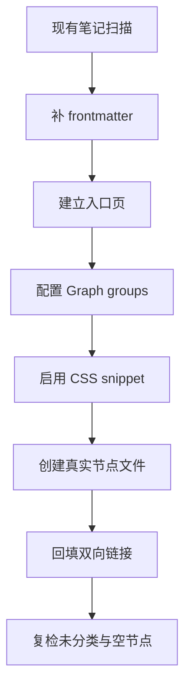

# Obsidian 图谱标准化执行结果

本页按 `Obsidian图谱标准化.md` 的固定输出顺序，给出可以直接落地到本知识库的入口、模板、清单与配置。

## 1. 存量笔记元数据补全片段

原则很简单。

1. 只补缺失的 `frontmatter`，不重写正文。
2. `aliases` 统一放同义词，不用管道别名语法。
3. `type` 只取四类：`spec`、`channel`、`algorithm`、`definition`。
4. `source_spec` 必须写到可追溯的 TS、Rel-19 版本和章节。
5. 旧笔记先补元数据，再补双向链接，避免空节点。

### 1.1 协议规范节点

```yaml
---
type: spec
aliases:
  - 协议简称
  - 标准编号别名
tags:
  - 3gpp
  - rel19
  - spec
source_spec: "TS 38.212 Rel-19 §5.1"
---
```

### 1.2 信道节点

```yaml
---
type: channel
aliases:
  - 信道简称
  - 业务侧别名
tags:
  - 3gpp
  - rel19
  - channel
source_spec: "TS 38.211 Rel-19 §4"
---
```

### 1.3 算法节点

```yaml
---
type: algorithm
aliases:
  - 算法简称
  - 常用缩写
tags:
  - 3gpp
  - rel19
  - algorithm
source_spec: "TS 38.212 Rel-19 §5.4.2"
---
```

### 1.4 定义节点

```yaml
---
type: definition
aliases:
  - 概念别名
  - 英文原词
tags:
  - 3gpp
  - rel19
  - definition
source_spec: "TS 36.212 Rel-19 §5.1.1"
---
```

## 2. 新增概念 md 完整模板

适用于首次创建的新文件。若条目属于协议规范、信道、算法或定义，只需要替换 `type` 和 `source_spec`，正文结构保持一致。

```markdown
---
type: definition
aliases:
  - 概念别名1
  - 概念别名2
tags:
  - 3gpp
  - rel19
  - kb
source_spec: "TS 38.212 Rel-19 §5.1.1"
---

# 概念名

## 协议原文定义

这里放协议原文的短摘录或结构化转写，保持可核验。

## 中文解释

用中文说明它是什么、不是什么、为什么需要它。

## 图谱关联

只写已经存在的真实文件名；未建文件先留在待建清单中，不写 wikilink。

## 使用边界

说明它在 LTE / NR 译码链路里的位置，以及本页不讨论的范围。

## 证据记录

- TS 编号：
- Rel-19 包版本：
- 章节号：
- 表 / 图 / 公式号：
- 本地路径：
```

## 3. 待新建节点清单

下面是适合先补的入口类节点。它们不需要先写双链，等文件真实创建后再回填链接。

| 优先级 | 建议节点 | 建议文件名 | 作用 |
|:---|:---|:---|:---|
| P0 | 图谱标准化入口 | `3gpp/Obsidian图谱标准化-执行结果.md` | 统一承载模板、清单和配置。 |
| P0 | 资料入口总览 | `3gpp/3GPP_Rel19_资料入口总览.md` | 汇总 `manifest.csv`、`processed/` 和 3GPP_译码知识库入口。 |
| P1 | 术语总表 | `3gpp/术语总表.md` | 收敛 `aliases`、首现术语和同义词。 |
| P1 | 协议锚点索引 | `3gpp/协议锚点索引.md` | 把 TS、章节、表、图、公式统一挂接起来。 |
| P1 | LTE 译码总览 | `3gpp/LTE_译码总览.md` | 连接 LTE Turbo 相关讲义。 |
| P1 | NR LDPC 总览 | `3gpp/NR_LDPC_总览.md` | 连接 NR LDPC 相关讲义。 |
| P1 | NR Polar 总览 | `3gpp/NR_Polar_总览.md` | 连接 NR Polar 相关讲义。 |
| P2 | 图谱配色说明 | `3gpp/图谱配色说明.md` | 记录 Graph group 与 CSS 方案。 |

## 4. Obsidian 图谱全套上色配置

### 4.0 Rel-19 资料目录边界

`3GPP_Rel19/` 保存协议原始资料和结构化抽取结果，不建立 Obsidian wikilink 关系图谱。概念、理论和算法笔记引用协议时，只写 TS 编号、章节号、表/图/公式号和本地路径锚点，例如 `TS 38.212 Rel-19 §5.4.2.1`、`3GPP_Rel19/processed/TS_38.212_38212-j30/TS_38.212_38212-j30_content.md:1179-1309`。

全局 Graph 默认排除 `3GPP_Rel19/`，避免协议抽取正文里的原始结构、ASN.1 片段或资料索引进入知识图谱。

### 4.1 Graph group 方案

| 组名 | 查询 | 颜色 | 说明 |
|:---|:---|:---|:---|
| 协议规范 | `[type:spec]` | `#4E79A7` | 3GPP 规范、协议归纳文档。 |
| 信道 | `[type:channel]` | `#59A14F` | 物理上下行信道与资源对象。 |
| 算法 | `[type:algorithm]` | `#F28E2B` | 编译码功能模块。 |
| 定义 | `[type:definition]` | `#B07AA1` | 协议术语、参数与可复用定义。 |
| 兜底未分类 | `path:"3gpp/" -[type:spec] -[type:channel] -[type:algorithm] -[type:definition]` | `#A0A0A0` | 尚未补全元数据的旧笔记，先低饱和显示。 |

### 4.2 CSS snippet

把下面内容保存为 `.obsidian/snippets/3gpp-graph.css`，然后在 Obsidian 的外观设置里启用。

```css
.graph-view.color-fill {
  color: #4E79A7;
}

.graph-view.color-line {
  color: rgba(148, 163, 184, 0.45);
}

.graph-view.color-circle {
  color: var(--text-on-accent);
}

.graph-view.color-text {
  color: var(--text-normal);
}

.graph-view.color-fill-highlight {
  color: #E15759 !important;
}

.graph-view.color-line-highlight {
  color: #E15759 !important;
}

.graph-view.color-fill-unresolved {
  color: rgba(148, 163, 184, 0.22) !important;
}

.graph-view.color-fill-tag {
  color: #2CB1BC !important;
}

.graph-view.color-fill-attachment {
  color: #F28E2B !important;
}
```

## 5. 简易分步落地操作流程

1. 先把 `3gpp/3GPP_译码知识库入口.md` 当成入口页，挂上标准化执行结果和学习路线。
2. 先建 `3gpp/术语总表.md` 和 `3gpp/协议锚点索引.md`，再开始补正文笔记的 `frontmatter`。
3. 每补一批笔记，只补缺失字段，不改正文内容，不提前制造双链。
4. 在真实文件创建后，再回填对应真实文件的 wikilink 双链；未落地节点只保留在待建清单。
5. `3GPP_Rel19/` 只写协议锚点和普通路径，不补 wikilink 双链。
6. 启用 Graph group 颜色，先把 `type` 四分类显示出来，再用兜底组压低未分类旧笔记的视觉权重。
7. 若后续要做批量整理，先跑一轮目录扫描，按 `docs/`、`sim/`、`tools/`、`3GPP_Rel19/` 分批处理。

## 6. 局部辅助示意图



## 执行备注

这份执行页先解决三件事：统一入口、统一元数据、统一图谱颜色。  
后续如果要做全库批量整理，可以继续补一份“目录级节点扫描表”和“frontmatter 差异清单”。
