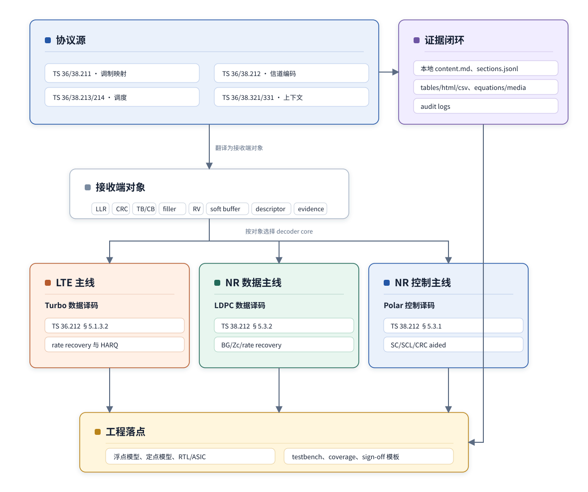

# T0.1 LTE/NR 译码协议阅读地图
## 本节学习目标

本节建立 3GPP LTE 和 NR 译码学习的协议地图。这里的”译码”不是泛泛地读通信协议，而是围绕接收端如何把软解调输出的 LLR 恢复成通过 CRC 的业务或控制比特。

学完本节后，应能做到：

- 说明 LTE Turbo、NR LDPC、NR Polar 三条主线分别服务什么对象。
- 从一个问题反查协议分册：调制映射查 TS 36.211/38.211，信道编码查 TS 36.212/38.212，调度、MCS/TBS、RV、CBG 查 TS 36.213/38.214，HARQ 和高层配置上下文查 TS 36.321/36.331/38.321/38.331。
- 把协议发送端步骤翻译成接收端对象：TB、CB、filler、rate recovery、soft buffer、descriptor、CRC checker、decoder core 和 evidence manifest。
- 区分协议强制规则、接收端等价逆流程、工程实现策略和真实证据边界。
- 用本地图定位后续章节，而不是把某一章 LDPC 材料误认为全项目唯一重点。

## 全局术语入口

全项目重复使用的术语、缩写和简要解释集中在 [译码讲义术语总表](L0_terminology_glossary.md)。本节和后续讲义默认直接使用这些简称，正文只在需要讲解概念本身时补充上下文。

## 前置知识检查

| 前置项 | 本节要求 |
|:---|:---|
| 二进制比特 | 知道空口最终传的是 0/1 比特，但接收端译码器通常输入软信息。 |
| CRC | 知道 CRC 用于错误检测，不是纠错算法。 |
| TB 和 CB | 知道一个传输块可能被拆成多个码块。 |
| HARQ | 知道混合自动重传请求会让接收端保存旧软信息。 |
| 协议证据意识 | 知道讲义中的协议结论必须回到本地 Rel-19 抽取件、表格、公式或明确标为待核验。 |

本项目的核心前提可归结为：协议规定发射端如何构造比特序列，接收端按相反方向恢复这些比特；本项目仅讨论与 LTE/NR 译码器相关的部分。

## 资料与协议边界

本节是协议阅读地图，不复现具体协议表值。它的任务是说明每类译码问题应查哪个协议分册、后续哪篇讲义负责精读、证据应如何归档。具体 CRC 多项式、Turbo interleaver 表、LDPC lifting/shift 表、Polar reliability sequence、MCS/TBS 表和 rate matching 公式，由对应专题章节复现。

| 资料 | 本地路径 | 本节边界 |
|:---|:---|:---|
| TS 36.212 Rel-19 `36212-j30` | `3GPP_Rel19/processed/TS_36.212_36212-j30` | LTE Turbo、CRC、segmentation、rate matching 的核心证据源。 |
| TS 38.212 Rel-19 `38212-j30` | `3GPP_Rel19/processed/TS_38.212_38212-j30` | NR LDPC、NR Polar、small block、CRC、rate matching 的核心证据源。 |
| TS 38.214 Rel-19 `38214-j30` | `3GPP_Rel19/processed/TS_38.214_38214-j30` | NR MCS/TBS/RV/CBG 的调度背景；不替代 TS 38.212 的编码规则。 |
| TS 36.211/38.211 | `3GPP_Rel19/processed/TS_36.211_*`，`TS_38.211_38211-j30` | 调制和物理映射背景。T2.0–T2.6 提供 OFDM 系统全景、OFDM 机制、Numerology、帧结构、资源网格（RE/PRB/CRB/Point A/BWP）、LTE 对比和 LLR 数据流的系统入口。 |
| TS 36.321/36.331/38.321/38.331 | `3GPP_Rel19/processed/TS_36.321_*` 等 | MAC/RRC 上下文；精确字段未核验时不得写成已关闭协议结论。 |

## 三条主线的第一层边界

本项目的译码主线有三条，不能互相替代。

| 主线 | 服务对象 | 主要协议入口 | 本项目展开 |
|:---|:---|:---|:---|
| LTE Turbo | LTE 数据业务，例如 UL-SCH、DL-SCH、PCH/MCH 等数据或传输信道链路中的 Turbo 编码对象 | TS 36.212 §5.1.3.2、§5.1.4、§5.2/§5.3 数据链路调用 | T6-T7：Turbo 编码结构、BCJR/Log-MAP、rate recovery、HARQ、边界案例。 |
| NR LDPC | NR 数据业务，例如 UL-SCH、DL-SCH、PCH 的数据 TB/CB | TS 38.212 §5.2.2、§5.3.2、§5.4.2，TS 38.214 MCS/TBS/CBG 背景 | T8-T9：BG/Zc/QC 矩阵、BP/Min-Sum、LDPC rate recovery、CBG/HARQ。 |
| NR Polar | NR 控制信息，例如 DCI、部分 UCI Polar 分支 | TS 38.212 §5.2.1、§5.3.1、§5.4.1、§6.3、§7.3 | T10：信道极化、可靠性序列、SC/SCL/CA-SCL、Polar rate recovery 和 small block 边界。 |

这张表的重点不是“哪种码更高级”，而是“协议给哪种对象选了哪种编码家族”。LTE 数据业务必须完整讲 Turbo；NR 数据业务必须完整讲 LDPC；NR 控制信息必须完整讲 Polar。横向比较在 T11 做，但比较不能替代三条主线本身。

## 协议分册如何分工

3GPP 协议分册很多，读译码时必须按问题筛选。

| 协议分册 | LTE 本地路径 | NR 本地路径 | 译码项目中查什么 |
|:---|:---|:---|:---|
| TS 36.211 / TS 38.211 | `3GPP_Rel19/processed/TS_36.211_*` | `3GPP_Rel19/processed/TS_38.211_38211-j30` | 调制、物理信道映射、控制信息承载位置。译码课只取会影响 LLR 顺序和 Qm 的入口。 |
| TS 36.212 / TS 38.212 | `3GPP_Rel19/processed/TS_36.212_36212-j30` | `3GPP_Rel19/processed/TS_38.212_38212-j30` | CRC、TB/CB 分段、信道编码、rate matching、code block concatenation，是本项目最核心证据源。 |
| TS 36.213 / TS 38.214 | `3GPP_Rel19/processed/TS_36.213_*` | `3GPP_Rel19/processed/TS_38.214_38214-j30` | MCS、Qm、目标码率、TBS、RV、CBG、处理能力背景。它们影响 descriptor，但不是译码算法公式本身。 |
| TS 36.321 / TS 38.321 | `3GPP_Rel19/processed/TS_36.321_36321-j20` | `3GPP_Rel19/processed/TS_38.321_38321-j20` | MAC 层 HARQ process、反馈、重传生命周期上下文。 |
| TS 36.331 / TS 38.331 | `3GPP_Rel19/processed/TS_36.331_36331-j21` | `3GPP_Rel19/processed/TS_38.331_38331-j20` | RRC 配置，例如 MCS table、HARQ process 数、能力和控制参数来源。 |

接收端开发者最容易犯的错是只打开 TS 36.212/38.212，然后困惑“RV、MCS、HARQ process 为什么找不到完整上下文”。原因是 TS 36.212/38.212 规定编码和比特序列，RV/MCS/HARQ 的调度语义还要回到 TS 36.213/38.214 和 MAC/RRC。

## 协议发送端顺序与接收端逆序

协议往往按发送端写。接收端要逆向读。

| 发送端协议动作 | 发送端问题 | 接收端逆动作 | 典型章节 |
|:---|:---|:---|:---|
| CRC attachment | 在哪里加检错比特，用什么 CRC 多项式 | CRC checker 判断候选是否可信；DCI 还要处理 RNTI 边界 | T3.1、T7.4、T9.5、T10.6 |
| Code block segmentation | 一个 TB 如何拆 CB，是否加 CB CRC，filler 在哪里 | 按 CB 边界切 LLR，译码后去 CRC/filler，再按顺序拼回 TB | T3.2-T3.5 |
| Channel coding | 选 Turbo、LDPC、Polar 或 small block；矩阵/树/网格如何生成 | 选择对应 decoder core，并使用同一结构做等价译码 | T6、T8、T10 |
| Rate matching | 母码输出如何被交织、打孔、重复、放入 circular buffer | rate recovery、LLR 初始化、软合并和饱和 | T7、T9、T10.7、T11.2 |
| Code block concatenation | 多个 CB 输出如何拼接成物理层输出序列 | 把输入 LLR 流重新切成每个 CB 的本次观测 | T7.4、T9.5 |
| MCS/TBS/RV/CBG 调度 | 本次传输发多少、用什么 Qm/R/RV、哪些 CB/CBG 被调度 | 生成 descriptor，决定 decoder 输入规模和 soft buffer 行为 | T9.0、T19.6、T20.2 |

“逆向读”不是简单倒序，而是要把每一步变成接收端状态。例如，发送端的 puncturing 在接收端不是删除数组元素，而是把未发送位置初始化为中性 LLR；发送端的 repetition 在接收端不是复制 bit，而是把相同母码位置的 LLR 累加并饱和。

## 协议阅读地图

```mermaid
%%{init: {'theme': 'default'}}%%
flowchart TB
SRC["协议源<br/>TS 36/38.211 调制映射<br/>TS 36/38.212 信道编码<br/>TS 36/38.213/214 调度<br/>TS 36/38.321/331 上下文"]
RX["接收端对象<br/>LLR、CRC、TB/CB、filler、RV、soft buffer、descriptor 和 evidence"]
LTE["LTE 主线<br/>Turbo 数据译码<br/>TS 36.212 §5.1.3.2<br/>rate recovery 与 HARQ"]
NR D["NR 数据主线<br/>LDPC 数据译码<br/>TS 38.212 §5.3.2<br/>BG/Zc/rate recovery"]
NR C["NR 控制主线<br/>Polar 控制译码<br/>TS 38.212 §5.3.1<br/>SC/SCL/CRC aided"]
EVI["证据闭环<br/>本地 content.md、sections.jsonl<br/>tables/html/csv、equations/media<br/>audit logs"]
ENG["工程落点<br/>浮点模型、定点模型、RTL/ASIC<br/>testbench、coverage、sign-off 模板"]

SRC --> RX
RX --> LTE
RX --> NR D
RX --> NR C
SRC --> EVI
EVI --> ENG
LTE --> ENG
NR D --> ENG
NR C --> ENG

classDef protocol fill:#EAF1FB,stroke:#2457A6,color:#152033;
classDef receiver fill:#FFFFFF,stroke:#AAB7C8,color:#152033;
classDef lte fill:#FFF0E6,stroke:#B65B2E,color:#152033;
classDef nr fill:#E8F6EF,stroke:#236B5A,color:#152033;
classDef evidence fill:#F1EDFF,stroke:#6E55A4,color:#152033;
classDef engineering fill:#FFF6DD,stroke:#B9841A,color:#152033;
class SRC,NR C protocol;
class RX receiver;
class LTE lte;
class NR D nr;
class EVI evidence;
class ENG engineering;
```

这是从 3GPP 协议源到接收端对象、译码器家族和证据归档的导航图。读图顺序是：先定位协议源，再把发送端规则翻译成接收端对象，最后选择 LTE Turbo、NR LDPC 或 NR Polar 主线。工程检测点是：每个结论都要能回到本地协议证据，或者明确标为模板、待生成、待核验，不能把模板或候选清单写成真实通过。

图中每条箭头都有实际含义。`协议源 -> 接收端对象` 表示把调制、编码、调度和上下文条文翻译成 `LLR/CRC/TB/CB/filler/RV/soft buffer/descriptor/evidence` 等接收端对象；`接收端对象 -> 三条主线` 表示由协议对象选择 LTE Turbo、NR LDPC 或 NR Polar decoder core；`协议源 -> 证据闭环 -> 工程落点` 表示所有浮点模型、定点模型、RTL/ASIC、testbench、coverage 和 sign-off 模板都必须保留可追溯证据；三条主线最终都落到工程实现，但工程策略不能反向冒充协议强制要求。

读协议时先问的问题如下表。列名按原图的语义使用：`问题` 是当前调试或学习入口；`先查哪里` 是第一协议锚点；`接收端对象` 是最终要进入 descriptor、buffer、checker 或 decoder 的对象；`主讲章节` 是本项目后续负责展开的任务；`常见误区` 是审查时必须主动规避的错误。

| 问题 | 先查哪里 | 接收端对象 | 主讲章节 | 常见误区 |
|:---|:---|:---|:---|:---|
| CRC 失败 | TS 36.212/38.212 §5.1 | TB/CB/control CRC checker | T3.1, T7.4, T9.5, T10.6 | 把 CRC 当纠错器，或忽略 DCI RNTI 边界 |
| TB/CB/filler | TS 36.212 §5.1.2; TS 38.212 §5.2 | segmentation descriptor | T3.2-T3.5 | 把 filler 当 payload 或把 CB 顺序弄反 |
| 译码器选择 | TS 36.212/38.212 channel coding tables | decoder_type | T6.1, T8.1, T10.1, T11.5 | 用 NR LDPC 解释控制信息，或用 Polar 解释 LTE |
| Rate matching/HARQ | TS 36.212 §5.1.4; TS 38.212 §5.4; TS 38.214 HARQ/CBG | RV, Ncb, E, k0, soft buffer | T7.1-T7.3, T9.1-T9.4, T11.2 | 只看 RV 标签，不看 circular buffer 地址 |
| MCS/TBS | TS 38.214 §5.1.3/§6.1.4 | Qm, R, TBS, CB pressure | T9.0, T19.6, T20.2 | 把调度元数据写成译码核内部算法 |
| 证据归档 | processed content/tables/equations/media | evidence manifest | T12-T15 | 把模板或候选清单写成真实通过 |

本节流程顺序是：先定位协议源，再翻译为接收端对象，然后进入 LTE Turbo、NR LDPC 或 NR Polar 主线，最后把结论落到工程证据闭环。

## 问题提纲：查询路径与协议锚点

| 问题 | 先问什么 | 协议位置 | 项目章节 |
|:---|:---|:---|:---|
| CRC | 这是 TB CRC、CB CRC、control CRC 还是 CRC-aided selector？CRC 长度和多项式来自哪里？ | TS 36.212 §5.1.1；TS 38.212 §5.1；DCI/UCI 专门章节 | T1.2、T3.1、T7.4、T9.5、T10.6 |
| TB/CB | 现在处理的是 TB 还是第 r 个 CB？CB 数、CB CRC 和 filler 是否存在？ | TS 36.212 §5.1.2；TS 38.212 §5.2 | T3.2-T3.5 |
| Turbo | 是否为 LTE 数据链路 Turbo 分支？K、internal interleaver、trellis termination、rate matching 参数是什么？ | TS 36.212 §5.1.3.2、§5.1.4.1 | T6-T7 |
| LDPC | 是否为 NR 数据链路 LDPC 分支？BG、Zc、iLS、shift table、Ncb、k0、CBG 怎么来？ | TS 38.212 §5.2.2、§5.3.2、§5.4.2；TS 38.214 CBG/TBS 背景 | T8-T9 |
| Polar | 是否为 NR 控制信息 Polar 分支？A/K/E/N、CRC、RNTI、frozen set、list size 如何定义？ | TS 38.212 §5.2.1、§5.3.1、§5.4.1、§6.3、§7.3 | T10 |
| Rate matching | 未发送位置、重复位置、RV 起点和 bit interleaving 分别如何反向处理？ | TS 36.212 §5.1.4；TS 38.212 §5.4 | T7.1-T7.3、T9.1-T9.4、T10.7、T11.2 |
| HARQ / soft buffer | 旧 LLR 是否保留？本次是 Chase 还是 incremental redundancy？soft buffer key 是否匹配？ | TS 36.213/36.321；TS 38.214/38.321 | T4.3、T7.3、T9.3、T11.3、T19.5 |
| MCS/TBS | Qm、R、PRB、RE、层数和 TBS 如何影响 decoder 输入规模？ | TS 38.214 §5.1.3、§6.1.4 | T9.0、T19.6、T20.2 |
| Descriptor | 哪些字段是协议派生，哪些是调度/MAC/RRC 上下文，哪些是实现策略？ | TS 36.212/38.212 + TS 36.213/38.214 + MAC/RRC | T4.6、T19.4、T19.6 |
| 验证证据 | 这是本地协议表复现、教学公式、仿真模板，还是真实工具输出？ | `processed/*/content.md`、`tables/*.html/csv`、`equations/*.xml`、审计日志 | T12-T15、`docs/audits/*` |

## 三条学习路径

LTE Turbo 路径：

```text
T2.0-T2.6 PHY 系统背景 → T1-T5 译码数学与工程基础
  -> T3.3 LTE Turbo segmentation
  -> T6.1-T6.8 Turbo 结构与 Log-MAP
  -> T7.1-T7.6 LTE rate recovery / HARQ / TB CRC
  -> T11 对比
  -> T12-T15 工程模型、定点、RTL、验证
```

NR LDPC 路径：

```text
T2.0-T2.6 PHY 系统背景 → T1-T5 译码数学与工程基础
  -> T3.4 NR LDPC segmentation
  -> T8.1-T8.8 BG/Zc/QC 矩阵与 BP/Min-Sum
  -> T9.1-T9.6 NR rate recovery / HARQ / CBG / TB CRC
  -> T11 对比
  -> T12-T15 工程模型、定点、RTL、验证
```

NR Polar 路径：

```text
T2.0-T2.6 PHY 系统背景 → T1-T5 译码数学与工程基础
  -> T3.5 NR Polar segmentation / CRC
  -> T10.1-T10.8 信道极化、SC/SCL/CA-SCL、rate recovery、small block 边界
  -> T11 对比
  -> T12-T15 工程模型、定点、RTL、验证
```

三条路径共享 LLR、CRC、概率、GF(2)、固定点、吞吐和验证基础，但核心算法对象不同：Turbo 是 trellis 上的软输入软输出递推；LDPC 是 Tanner graph 上的消息传递；Polar 是树和列表路径搜索。

## 最小 descriptor 思维

读协议时要一直问：这个条文最终会不会进入 decoder descriptor？

| 字段族 | 示例 | 来源 | 译码用途 |
|:---|:---|:---|:---|
| family | `LTE_TURBO`、`NR_LDPC`、`NR_POLAR` | channel coding scheme | 选择 decoder core。 |
| block shape | `K`、`C`、`BG`、`Zc`、`N`、`A/K/E` | segmentation/channel coding | 决定矩阵、树、网格或内存尺寸。 |
| rate recovery | `E`、`Ncb`、`k0`、`rvidx`、`Qm`、interleaver flag | rate matching + MCS/RV | 反速率匹配和 soft combining。 |
| CRC context | `tb_crc_type`、`cb_crc_present`、`crc_len`、`rnti_context` | CRC clauses and control context | pass/fail、CA-SCL final selection。 |
| HARQ context | `harq_id`、`ndi`、`rv`、`cbg_mask`、soft buffer key | scheduling + MAC | 保留、合并、释放或 flush soft buffer。 |
| engineering policy | `max_iter`、`list_size`、LLR width、timeout | implementation | 性能、吞吐、面积和验证策略，不是协议强制数值。 |

## 小型数值例子

假设接收端得到一条任务：

| 字段 | 值 |
|:---|:---|
| RAT | NR |
| channel | DL-SCH |
| MCS table result | `Qm=4`, `R=490/1024` |
| TBS | 2000 bit |
| channel coding | LDPC |
| RV | 2 |
| CBG enabled | no |

读图和读协议后，应形成如下判断：

1. RAT 为 NR 且对象为 DL-SCH 数据业务，所以进入 NR LDPC，不进入 Polar。
2. `Qm` 和 `R` 来自 TS 38.214 的 MCS/TBS 过程，不是 LDPC BP 算法内部推导。
3. TBS 加 TB CRC 后进入 TS 38.212 §5.2.2 分段，得到 CB 数、BG、Zc 和 filler。
4. RV=2 会影响 TS 38.212 §5.4.2 的 LDPC rate matching 起点；接收端要按同一规则做 rate recovery。
5. 最终是否交付 MAC 由 TB CRC 决定；若有 CB CRC，则 CB CRC 是分块局部证据。

若同样的任务把 channel 改成 DCI，则判断完全不同：NR DCI 是 Polar 主线，CRC/RNTI 和 CA-SCL selector 成为关键对象，`Qm/R/TBS` 数据链路字段不应照搬。

## 伪代码：从问题到章节

```python
def route_decoder_question(rat, object_type, question):
    if question in {"crc", "tb_cb", "filler"}:
        return "T3.1-T3.5"
    if rat == "LTE" and object_type in {"DL-SCH", "UL-SCH", "PCH", "MCH"}:
        return "T6-T7"
    if rat == "NR" and object_type in {"DL-SCH", "UL-SCH", "PCH"}:
        return "T8-T9"
    if rat == "NR" and object_type in {"DCI", "UCI"}:
        return "T10"
    if question in {"mcs", "tbs", "descriptor"}:
        return "T9.0/T19.6"
    if question in {"verification", "rtl", "fixed_point"}:
        return "T12-T15"
    return "T11 comparison and protocol map"
```

伪代码的重点是判定对象，而不是用关键词硬匹配。例如 UCI 在 PUSCH 上承载时，PUSCH 上同时可能有 UL-SCH 数据和 UCI 控制；UL-SCH 数据走 LDPC，UCI 控制按 UCI 分支判断。

## 验证方法

| 验证项 | 方法 |
|:---|:---|
| 协议路径完整性 | 对 TS 36.211/36.212/36.213/36.321/36.331 与 TS 38.211/38.212/38.213/38.214/38.321/38.331 建立译码边界表。 |
| 章节回链 | 从 CRC、TB/CB、Turbo、LDPC、Polar、rate matching、HARQ、MCS/TBS、descriptor、验证证据任一问题能定位到后续章节。 |
| 术语首现 | 全项目重复术语集中到术语总表；各讲义正文不再机械重复全称。 |
| 证据边界 | 没有真实 BLER、RTL、DC、STA 或 coverage 输出时，只写模板和待生成，不写通过。 |

## 自测题

1. 为什么不能只读 TS 38.212 就完成 NR LDPC 接收端 descriptor？
2. NR 中 DCI 和 DL-SCH 都是下行相关对象，为什么一个进 Polar，一个进 LDPC？
3. 发送端 puncturing 在接收端应该变成什么 LLR 状态？
4. LTE Turbo、NR LDPC、NR Polar 的图模型分别是什么？

## 自测题参考答案

1. TS 38.212 给出 LDPC 编码、分段和 rate matching 规则，但 MCS、目标码率、TBS、RV、CBG、HARQ process 等上下文还来自 TS 38.214、MAC 和 RRC。descriptor 必须把这些来源合并。
2. DCI 是下行控制信息，TS 38.212 Table 5.3-2 指向 Polar；DL-SCH 是数据传输信道，TS 38.212 的数据链路调用 LDPC。二者都在下行，但协议对象不同。
3. puncturing 表示该母码位置本次没有观测，接收端通常初始化为中性 LLR，即 $L=0$，不能当成业务比特 0。
4. Turbo 主要用 trellis；LDPC 用 Tanner graph 或因子图；Polar 用递归树和 SCL 路径列表。

## 图示


## 执行与证据记录

| 项目 | 记录 |
|:---|:---|
| 新增文件 | `docs/L0/T0.1_LTE_NR_decoder_protocol_reading_map.md`。 |
| 新增证据资产 | `docs/L0/assets/T0.1_LTE_NR_decoder_protocol_reading_map.svg`（手绘 SVG，替代原 Mermaid 渲染 PNG 及 `tools/figures/render_t0_1_lte_nr_decoder_protocol_map.py`）。 |
| 协议证据 | 本节为地图，引用 TS 36.211/36.212/36.213/36.321/36.331 与 TS 38.211/38.212/38.213/38.214/38.321/38.331 的本地 processed 目录。 |
| 证据边界 | 本节不复现具体协议表值；具体表、公式和图在对应专题章节复现或标注待核验。 |

## 参考文献

- 3GPP TS 36.212 Rel-19 `36212-j30`，`3GPP_Rel19/processed/TS_36.212_36212-j30`。
- 3GPP TS 38.212 Rel-19 `38212-j30`，`3GPP_Rel19/processed/TS_38.212_38212-j30`。
- 3GPP TS 38.214 Rel-19 `38214-j30`，`3GPP_Rel19/processed/TS_38.214_38214-j30`。
- 本项目 `docs/L1`、`docs/L2`、`docs/L3` 现有 LTE/NR 译码讲义。
