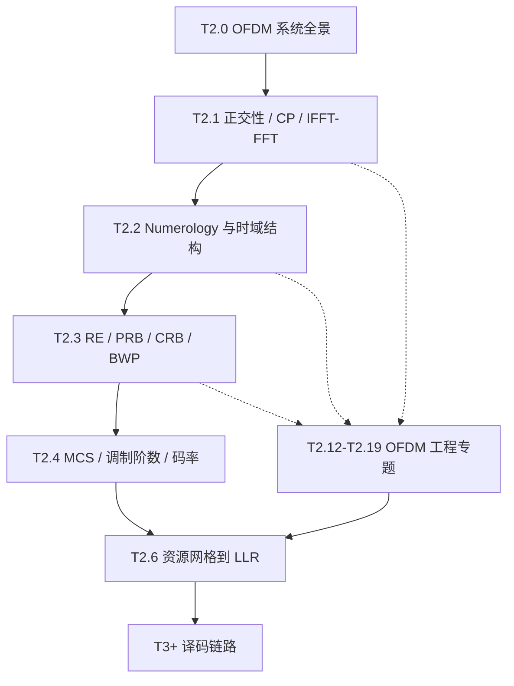

# T2.0 OFDM 系统全景：从比特到时域波形再到接收机
## 本节学习目标

T1.x 系列建立了译码器需要的概率、LLR 和信息论基础。进入 T2 系列之前，先把译码器上游的 OFDM 系统看成一条完整生产线：比特经过调制后被放到频域子载波上，经 IFFT 变成时域波形，插入 CP 后通过无线信道；接收端再做同步、去 CP、FFT、信道估计、均衡和软解调，最终给译码器输出 LLR。

本节不先推导公式，而是建立全局地图。后续 T2.1 再拆开讲子载波为什么正交、CP 为什么有效、IFFT/FFT 为什么能实现 OFDM。

先区分本节的核心对象：

| 术语 | 英文 | 先这样理解 |
|:---|:---|:---|
| OFDM | Orthogonal Frequency-Division Multiplexing | 把宽带信道切成许多窄带正交子载波，并行传输调制符号。 |
| 子载波 | subcarrier | OFDM 频域网格上的一个窄带位置，每个子载波在一个 OFDM 符号周期内承载一个调制符号。 |
| OFDM 符号 | OFDM symbol | 时域上的一个传输片段，由 CP + IFFT 输出的有用符号组成。 |
| 资源网格 | resource grid | 以 OFDM 符号为时域轴、子载波为频域轴的二维承载平面。 |
| LLR | Log-Likelihood Ratio | 解调器给译码器的软比特可靠度，不是硬判决比特。 |

- 建立从 bit 到 LLR 的 OFDM 收发全链路。
- 解释 OFDM 为什么适合频率选择性衰落信道。
- 区分 OFDM 的基础机制和工程问题：同步、CFO/SFO、信道估计、均衡、MIMO、PAPR、窗口函数。
- 理解 LTE/NR 对 OFDM 做了什么：不是重新发明 OFDM，而是选择 Numerology、资源网格、参考信号和物理信道映射规则。
- 给出后续 T2.1–T2.19 的学习顺序。

## 前置知识检查

| 问题 | 需要达到的程度 |
|:---|:---|
| bit 和调制符号有什么区别？ | 知道 QPSK/16QAM 会把多个 bit 映射成一个复数星座点。 |
| 频域和时域是什么关系？ | 能接受"频域描述每个频率上放什么，时域描述实际随时间发出的波形"。 |
| 多径传播是什么？ | 知道无线信号会经反射、散射形成多个延迟副本。 |
| 译码器输入是什么？ | 知道译码器通常消费 LLR，而不是天线上的原始波形。 |

## 为什么需要 OFDM

无线信道通常是频率选择性的：同一个宽带信号的不同频率分量会经历不同衰落。如果用单载波直接承载整个宽带数据流，接收端需要一个复杂的宽带均衡器去补偿整段频率响应；深衰落处还会把噪声一起放大。

OFDM 的思路是把宽带信道切成许多窄带子信道。每个子载波足够窄时，在单个子载波内部可以近似认为信道增益是一个常数：

$$
Y_k \approx H_k X_k + N_k
\tag{1}
$$

这样接收端对每个子载波只需要单抽头均衡：

$$
\hat{X}_k \approx \frac{Y_k}{H_k}
\tag{2}
$$

直观地说，OFDM 用许多个简单窄带均衡问题，替代一个困难的宽带均衡问题。代价是它必须非常依赖同步、频率精度、CP 和 FFT 窗口位置；这些工程问题就是本节后半部分的地图。

## OFDM 发射端做什么

发射端的工作可以按顺序理解：

1. **编码和调制**：传输块经 CRC、信道编码、rate matching 后得到编码比特；调制器把 bit 组映射成 QPSK/16QAM/64QAM 等复数调制符号。
2. **资源映射**：调制符号被放到资源网格的 RE 上。一个 RE 对应一个子载波位置和一个 OFDM 符号时刻。
3. **IFFT**：频域上"每个子载波放什么复数"被一次性变换成时域采样波形。这里的 IFFT 是 OFDM 能工程化的关键。
4. **插入 CP**：把 IFFT 输出末尾一段复制到符号前端，作为多径保护间隔。
5. **数模转换和射频发射**：基带时域采样经 DAC、上变频、功放和天线发射出去。

## OFDM 接收端做什么

接收端不是简单地"做一个 FFT"。FFT 只是链路中间的一步，前后还有多个工程环节：

| 步骤 | 输入 | 输出 | 失败后果 |
|:---|:---|:---|:---|
| 定时同步 | 接收时域采样 | OFDM 符号边界、FFT 窗口位置 | 窗口错位，引入 ISI/ICI。 |
| 频率同步 | 带频偏的采样 | CFO/SFO 校正后的采样 | 子载波正交性被破坏，星座持续旋转或扩散。 |
| 去 CP + FFT | 对齐后的时域符号 | 频域 RE 网格 | FFT 输入混入相邻符号则全符号污染。 |
| 信道估计 | DM-RS/CSI-RS 等参考信号 | $H[k,l]$ 估计值 | 均衡错误，LLR 可靠度失真。 |
| 均衡 / 检测 | $Y[k,l]$ 与 $H[k,l]$ | 估计调制符号 $\hat{X}[k,l]$ | 噪声增强、层间干扰、星座点偏移。 |
| 软解调 | 均衡后符号和噪声估计 | bit LLR | LLR 符号或幅度错误，译码器性能下降。 |

这张表说明：译码器看到的 LLR 质量，不只由码本和调制方式决定，也由 OFDM 接收机的同步、估计和均衡误差共同决定。

## OFDM 的工程问题地图

OFDM 的基础机制是"正交子载波 + CP + IFFT/FFT"。真正做成 LTE/NR 收发机时，还必须处理下面这些问题。

| 问题 | 发生位置 | 为什么重要 | 后续章节 |
|:---|:---|:---|:---|
| 定时同步 | 接收端 FFT 前 | FFT 窗口必须对准 OFDM 符号，否则当前符号会混入相邻符号。 | T2.12 |
| CFO | 射频本振和多普勒 | 载波频偏造成公共相位旋转和子载波间干扰。 | T2.13 |
| SFO | ADC 采样时钟 | 采样频偏造成符号边界和频域相位随时间漂移。 | T2.13 |
| 信道估计 | FFT 后、均衡前 | 接收端需要知道每个 RE 上的 $H[k,l]$ 才能均衡。 | T2.14 |
| 均衡 | 软解调前 | 把 $Y=HX+N$ 变成可判决的 $\hat{X}$，并估计可靠度。 | T2.15 |
| MIMO-OFDM | 每个 RE 上的多天线信道 | 单个 $H_k$ 变成矩阵 $H[k,l]$，需要层检测和干扰抑制。 | T2.16 |
| PAPR | 发射端 IFFT 后 | 多子载波叠加会产生高峰值，功放需要回退，削峰会污染 EVM/ACLR。 | T2.17 |
| 窗口函数 / 滤波 | 发射端符号边界 | 矩形窗会造成频谱旁瓣，窗口或滤波用于降低带外泄漏。 | T2.18 |
| 误差到 LLR | 接收链路末端 | 同步、频偏、估计、均衡和发射失真最终都体现在 LLR 符号和幅度上。 | T2.19 |

## 和 LTE/NR 的关系

OFDM 不是 3GPP 发明的。LTE/NR 的协议工作是把 OFDM 落成可互操作的无线系统参数：

| 协议层选择 | LTE/NR 需要规定什么 | 本项目在哪里展开 |
|:---|:---|:---|
| Numerology | 子载波间隔、CP 类型、符号/时隙/帧结构 | T2.2 |
| 资源网格 | RE、PRB、CRB、BWP、Point A | T2.3 |
| 调制与 MCS | QPSK/16QAM/64QAM/256QAM、码率、TBS | T2.4、T2.8、T2.9 |
| 物理信道映射 | PDSCH/PUSCH/PDCCH/PUCCH 等放到哪些 RE | T2.6 以及后续协议专题 |
| 参考信号 | DM-RS/CSI-RS/PTRS 等如何生成和映射 | T2.14、T2.16 |
| 接收机算法 | 同步、估计、均衡、检测实现 | 多数是实现自由度，T2.12–T2.19 讲工程模型 |

协议规定的是可互操作的信号、资源和参考点；接收机内部用什么同步算法、插值算法、均衡器实现，通常是厂家实现自由度。学习时要分清"协议规定"和"接收机工程"。

## 后续学习顺序

OFDM 的正确学习路径不是一上来就背 PRB 或 MCS，而是先建立系统图，再逐层拆解：

对应的阅读建议：

1. 先读本节 T2.0，知道 OFDM 收发机全链路和工程问题地图。
2. 再读 T2.1，理解正交性、CP 和 IFFT/FFT 这三个核心机制。
3. 再读 T2.2–T2.3，把抽象 OFDM 落到 NR 的时间和频率资源网格。
4. 再读 T2.4、T2.6–T2.11，进入调制、噪声、软解调和 LLR。
5. 最后读 T2.12–T2.19，把同步、频偏、信道估计、均衡、MIMO、PAPR、窗口函数这些工程误差接回 LLR 质量。

## 对译码链路的影响

译码器不直接处理 OFDM 时域波形，也不直接知道 FFT 窗口、DM-RS 位置或 MIMO 检测矩阵。译码器看到的是一维 LLR 向量。但这个 LLR 向量的可靠性由 OFDM 接收链路决定：

$$
\text{同步/频偏/信道估计/均衡/软解调误差}
\;\longrightarrow\;
\text{LLR 符号和幅度误差}
\;\longrightarrow\;
\text{译码收敛速度和 BLER}
\tag{3}
$$

因此，本项目虽然主线是 Turbo/LDPC/Polar 译码，但必须先讲 OFDM：没有 OFDM，就不知道 LLR 从哪里来，也不知道为什么同一套译码器在不同信道估计、不同同步质量下表现差异巨大。

## 常见错误

| 错误 | 为什么错 | 正确做法 |
|:---|:---|:---|
| 把 OFDM 等同于 FFT | FFT 只是 OFDM 接收链路的一步；同步、去 CP、信道估计、均衡和软解调同样关键。 | 把 OFDM 看成完整收发系统，不只看一个变换。 |
| 以为子载波互不重叠 | OFDM 的子载波频谱是重叠的，靠数学正交性分离。 | 用 T2.1 的 sinc 零点和内积推导理解正交。 |
| 以为 CP 是新数据 | CP 是同一 OFDM 符号尾部的副本，不承载新信息。 | 把 CP 理解成会被接收端丢弃的保护间隔。 |
| 以为同步只是实现细节，不影响译码 | 同步误差会造成 ICI/ISI，最终改变 LLR 可靠度。 | 把同步误差纳入接收链路和仿真假设。 |
| 以为 MIMO 和 OFDM 是两套无关系统 | NR 的 MIMO 检测通常发生在每个 RE/子载波上，OFDM 提供频域分解平面。 | 先理解单子载波标量信道，再推广到每 RE 的 MIMO 矩阵。 |
| 只看接收端，不看 PAPR/窗口 | 发射端 PAPR、削峰、窗口和滤波会影响 EVM、频谱泄漏和接收端 LLR。 | 把发射波形质量也纳入 OFDM 工程误差链。 |

## 自测题

1. OFDM 为什么能把宽带均衡问题变成多个窄带均衡问题？
2. 一个 OFDM 发射端从调制符号到天线发射，至少经过哪些步骤？
3. 接收端为什么不能直接对任意一段采样做 FFT？
4. CFO 和 SFO 分别来自哪里？它们为什么会破坏 OFDM？
5. 信道估计和均衡分别解决什么问题？
6. PAPR 为什么主要是 OFDM 发射端问题，但最终会影响译码器？
7. 为什么说 LTE/NR 是 OFDM 的参数化无线系统，而不是 OFDM 理论本身？

## 自测题参考答案

1. 因为 OFDM 把宽带信道切成许多窄带子载波。每个子载波内部信道近似平坦，均衡从宽带滤波器退化为每个子载波上的单抽头复数除法。

2. 典型路径是：编码比特 → QAM 调制 → 资源映射 → IFFT → 插入 CP → DAC/RF/功放 → 天线发射。

3. FFT 窗口必须对准 OFDM 符号的有用符号区间。窗口错位会混入 CP 外或相邻符号的采样，破坏子载波正交性，造成 ISI/ICI。

4. CFO 来自发射端和接收端本振频率不一致以及多普勒频移；SFO 来自采样时钟不一致。CFO 造成相位旋转和子载波泄漏，SFO 造成随时间积累的采样位置漂移和频域相位斜率。

5. 信道估计用参考信号估计每个 RE 或邻近区域的信道响应 $H[k,l]$；均衡用这个估计把接收符号从 $Y=HX+N$ 还原成调制符号估计，并为软解调提供可靠度信息。

6. OFDM 多子载波叠加会产生高峰值，功放若线性范围不足会削峰或非线性失真，导致 EVM 增大和带外泄漏。接收端看到的星座点偏移会改变 LLR 符号和幅度。

7. OFDM 提供多载波正交传输的数学和信号处理框架；LTE/NR 规定具体 SCS、CP、资源网格、物理信道、参考信号和调度参数，使不同厂家设备可以互通。

## 本节验收

| 验收项 | 通过标准 |
|:---|:---|
| 全链路 | 能从 bit 讲到 LLR，并指出 OFDM 发射端和接收端的主要模块。 |
| 工程问题地图 | 能说明同步、CFO/SFO、信道估计、均衡、MIMO、PAPR、窗口函数各自解决什么问题。 |
| 和 T2.1 的关系 | 能说明本节是系统全景，T2.1 是正交性、CP、IFFT/FFT 机制推导。 |
| 协议边界 | 能区分 3GPP 规定的资源网格/参考信号与接收机内部算法自由度。 |
| 译码关系 | 能解释 OFDM 工程误差如何通过 LLR 影响 Turbo/LDPC/Polar 译码。 |

## 资料与协议边界

| 资料 | 边界 |
| :--- | :--- |
| T2.1 OFDM 基础 | 本节只建立全景；正交性、CP、IFFT/FFT 的数学推导见 T2.1。 |
| TS 38.211 Rel-19 | 本节只把 TS 38.211 作为 NR OFDM、资源网格和参考信号的协议入口；不复现协议表格。 |
| TS 36.211 Rel-19 | LTE OFDM/SC-FDMA、RB 和资源网格作为对比入口；具体 LTE 帧结构见 T2.5。 |
| 概念笔记 | `Timing_Sync_定时同步`、`Channel_Estimation_信道估计`、`DMRS_解调参考信号`、`MMSE_均衡`、`MIMO_多天线系统` 可作为 T2.12–T2.16 的材料来源。 |

## 执行与证据记录

| 项目 | 记录 |
|:---|:---|
| 本地文档检索 | 使用 `rg` 检索项目内 OFDM、同步、信道估计、MIMO、DM-RS、MMSE 等现有材料。 |
| 结构决策 | 新增 T2.0 作为 OFDM 系统全景，不重编号现有 T2.1–T2.11。 |
| 图示标准 | 本节新增的学习路径和收发链路图使用 Mermaid，并包含 `%%{init: {'theme': 'default'}}%%`。 |
| 证据边界 | 本节为系统总览和学习路径，不声明完成 CFO/SFO、PAPR、窗口函数、MIMO-OFDM 的细节推导；这些留给 T2.12–T2.19。 |

## 参考文献

- [3GPP, 2026] 3GPP TS 38.211, Rel-19, `38211-j30`, Physical channels and modulation. Local path: `3GPP_Rel19/processed/TS_38.211_38211-j30`.
- [3GPP, 2026] 3GPP TS 36.211, Rel-19, `36211-j30`, Physical channels and modulation. Local path: `3GPP_Rel19/processed/TS_36.211_*`.
