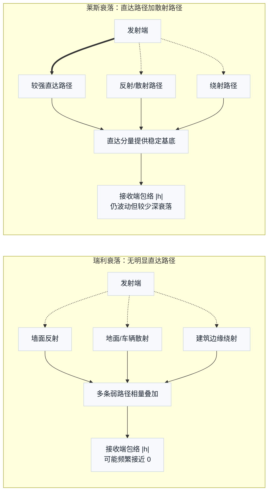
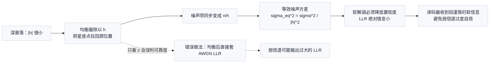

# T2.10 衰落信道与软信息可靠度：均衡输出幅度与可信度差异
## 本节学习目标

T2.7 讲了加性白高斯噪声：发送值上直接加噪声。T2.8 和 T2.9 讲了软解调：把接收样本变成对数似然比。这些内容先假设信号没有被无线传播路径额外“放大、衰减或旋转”。

真实无线链路更麻烦。信号从发射天线到接收天线，中间可能有直达路径、反射路径、遮挡和移动引起的相位变化。接收端看到的不只是：

$$
y=x+n
\tag{1}
$$

而更常写成：

$$
y=hx+n
\tag{2}
$$

这里 $h$ 是信道系数。它可以把符号放大、衰减或旋转。本节目标不是完整信道估计课，而是从译码器输入视角讲清楚一件事：均衡器把符号位置拉回来了，但可靠度也必须跟着信道强弱改变。


- 解释衰落为什么会让同样的判决结果具有不同可靠度。
- 区分瑞利衰落（Rayleigh Fading）和莱斯衰落（Rician Fading）的基础差别。
- 说明均衡器输出为什么还要携带噪声增强信息。
- 从单抽头二进制相移键控衰落模型推导 LLR 缩放。
- 用 Python 复核“弱信道下朴素 LLR（naive LLR）过度自信”的例子。
- 分清 3GPP 协议里的参考信号、测量过程和接收机 LLR 算法边界。

## 衰落的定义与来源

“衰落”不是编码算法，也不是译码器内部模块。它描述的是无线传播造成的接收信号强弱变化。

可以用一个生活类比理解。你在房间里听别人说话：

- 如果两人之间没有遮挡，声音比较稳定。
- 如果对方走到墙后面，声音变小。
- 如果房间有回声，多个路径的声音叠在一起，有些位置更响，有些位置更弱。
- 如果人或设备在移动，强弱还会随时间变化。

无线信号也类似。接收端用一个复数信道系数 $h$ 表示这一小段时间、这一小块频率资源上的传播影响：

$$
h=|h|e^{j\theta}
\tag{3}
$$

其中 $|h|$ 表示幅度强弱，$\theta$ 表示相位旋转。今天最关心的是 $|h|$：它越小，说明信号越弱，噪声相对越重要。

## 瑞利衰落（Rayleigh Fading）与莱斯衰落（Rician Fading）的基础模型

瑞利衰落和莱斯衰落是两种常见入门模型。Rayleigh 来自瑞利分布，常用于描述没有明显直达路径时的包络幅度；Rician 来自莱斯分布，常用于描述存在较强直达路径同时又有散射路径时的包络幅度。

| 模型 | 中文理解 | 适合先这样想 |
|:---|:---|:---|
| 瑞利衰落 | 没有明显直达路径，很多反射路径叠加 | 接收幅度可能经常掉得很低，深衰落更常见。 |
| 莱斯衰落 | 有一条较强直达路径，同时还有反射路径 | 接收幅度更稳定，但仍会波动。 |

这两个名字不是 3GPP 某个译码步骤的名称。它们是信道建模语言，用来帮助链路仿真生成更接近无线传播的样本。译码器真正看到的是软比特 LLR；它不会直接“知道”当前是 Rayleigh 还是 Rician，但 LLR 的可靠度会受到信道强弱影响。



图 1 展示两类模型最核心的差别。瑞利衰落没有一条占主导的直达分量，多个反射、散射和绕射路径的相位可能刚好互相抵消，因此 $|h|$ 更容易出现深衰落。莱斯衰落有较强直达路径，散射路径仍会造成波动，但接收包络通常围绕直达分量上下起伏，不像瑞利模型那样频繁掉到很低。

## 前置知识检查

| 问题 | 需要达到的程度 |
|:---|:---|
| BPSK 映射是什么？ | 本课程教学映射为 `0 -> +1`，`1 -> -1`。 |
| LLR 正负号怎么理解？ | 正值更像 `0`，负值更像 `1`，绝对值越大越可靠。 |
| 噪声方差 $\sigma^2$ 是什么？ | 方差越大，接收值越不可靠。 |
| 复数乘法的几何含义是什么？ | 可分解为幅度缩放与相位旋转两个独立操作。 |

如果复数还不熟，本节只需要抓住：$h$ 小，信号弱；均衡后噪声会被放大。

## 协议定位：参考信号与信道状态获取

3GPP 不会规定“你的接收机必须用某一个 LLR 公式实现软解调”。协议更关心的是：发送端在哪些资源上发送数据、调制符号和参考信号，接收端可以基于哪些参考信号进行接收过程、测量和报告。

本节用到的 Rel-19 入口如下：

| 协议 | 本地路径 | 本节读到的入口 | 与本节关系 |
|:---|:---|:---|:---|
| TS 38.214 | `3GPP_Rel19/processed/TS_38.214_38214-j30` | §5.1 UE procedure for receiving PDSCH；§5.1.6.1 CSI-RS reception procedure；§5.1.6.2 DM-RS reception procedure | 说明 NR 下行接收过程和参考信号接收过程是协议上下文的一部分。 |
| TS 38.215 | `3GPP_Rel19/processed/TS_38.215_38215-j20` | §5.1.1/§5.1.2 RSRP；§5.1.5/§5.1.6 SINR；§5.1.15-§5.1.17 E-UTRA 测量入口 | 说明协议定义了参考信号接收功率、质量、SINR 等测量名词和入口。 |
| TS 38.211 | `3GPP_Rel19/processed/TS_38.211_38211-j30` | 物理信道、调制和参考信号相关章节入口 | 提供数据符号、参考信号和资源映射背景。 |

协议前因后果可以这样理解：如果空口只有数据符号，接收端很难知道当前 $h$ 是多少。参考信号提供了已知或可推导的符号结构，接收端据此估计信道、均衡数据符号、估计噪声/干扰强度，然后生成译码器需要的 LLR。

本节没有使用 TS 38.214/38.215 中任何具体表格、测量公式或参数值。DM-RS、CSI-RS、RSRP 和 SINR 只作为“接收端为什么有机会估计信道与可靠度”的协议入口；本节的 LLR 推导完全基于教学单抽头模型。

## 单抽头模型的核心关系

单抽头模型表示一个符号只乘上一个信道系数：

$$
y=hx+n
\tag{4}
$$

其中：

- $x$ 是发送符号。
- $h$ 是信道系数。
- $n$ 是 AWGN 噪声。
- $y$ 是接收符号。

为了先把可靠度讲清楚，暂时假设 $h$ 是正实数。比如发送 $x=+1$，噪声方差为 $\sigma^2=0.04$。

| 情况 | $h$ | 接收值 $y$ | 直觉 |
|:---|---:|---:|:---|
| 强信道 | 1.0 | 1.10 | 接收值接近 $+1$，很可靠。 |
| 中等信道 | 0.5 | 0.60 | 看起来仍是正号，但信号被衰减。 |
| 弱信道 | 0.2 | 0.30 | 均衡后可能还是正，但噪声占比很高。 |

如果只看均衡后的判决，三个情况都可能判成比特 `0`。但它们不该给译码器同样大的 LLR。

## 均衡器的噪声放大效应

接收机常做的第一步是把信道影响除掉。若 $h$ 为正实数：

$$
z=\frac{y}{h}
\tag{5}
$$

代入式 (4)：

$$
z=\frac{hx+n}{h}=x+\frac{n}{h}
\tag{6}
$$

注意最后一项。均衡不仅把信号拉回到 $x$ 附近，也把噪声变成了 $n/h$。

如果原始噪声方差是 $\sigma^2$，均衡后噪声方差变为：

$$
\sigma_{\mathrm{eq}}^2=\frac{\sigma^2}{h^2}
\tag{7}
$$

这条公式回答的问题是：均衡后的样本 $z$ 该用多大的噪声方差计算 LLR。$h$ 越小，$\sigma_{\mathrm{eq}}^2$ 越大，LLR 幅度应该越小。



图 2 把式 (5) 到式 (7) 的工程含义串起来。均衡的目标是修正符号位置，但它不能让噪声消失；弱信道下除以很小的 $h$ 会把噪声一起放大。因此软解调接口必须携带等效噪声或可靠度，不能只把均衡后的 $z$ 当作普通 AWGN 样本。

## BPSK 衰落下的 LLR 推导

均衡后的 BPSK 模型可以写成：

$$
z=x+w
\tag{8}
$$

其中：

$$
w\sim\mathcal{N}(0,\sigma_{\mathrm{eq}}^2)
\tag{9}
$$

T2.7 已经推导过，BPSK 在 AWGN 下的 LLR 为：

$$
L=\frac{2z}{\sigma_{\mathrm{eq}}^2}
\tag{10}
$$

把式 (5) 和式 (7) 代入：

$$
L=\frac{2(y/h)}{\sigma^2/h^2}
\tag{11}
$$

整理得到：

$$
L=\frac{2hy}{\sigma^2}
\tag{12}
$$

这就是正实数单抽头 BPSK 的可靠度缩放结果。它表明：同样的均衡后 $z$，如果来自更小的 $h$，LLR 不应该一样大。

## 复数信道中的等效噪声方差

真实 OFDM 接收中，$h$ 通常是复数。常见零迫均衡可以写成：

$$
z=\frac{h^*y}{|h|^2}
\tag{13}
$$

其中 $h^*$ 是 $h$ 的共轭。代入 $y=hx+n$：

$$
z=x+\frac{h^*n}{|h|^2}
\tag{14}
$$

均衡后的噪声方差随 $|h|^2$ 改变：

$$
\sigma_{\mathrm{eq}}^2=\frac{\sigma^2}{|h|^2}
\tag{15}
$$

所以对 BPSK 的实部软信息，可靠度大致随 $|h|^2/\sigma^2$ 缩放。工程实现会把调制阶数、均衡器类型、干扰估计和定点量化一起考虑，本节只建立最小模型。

## 数值例子：朴素 LLR 计算的过度自信问题

设发送的是比特 `0`，所以 $x=+1$，噪声方差：

$$
\sigma^2=0.04
\tag{16}
$$

比较三个情况：

| $h$ | $y$ | 均衡后 $z=y/h$ | 均衡后方差 $\sigma_{\mathrm{eq}}^2$ | 正确 LLR | 错误朴素 LLR |
|---:|---:|---:|---:|---:|---:|
| 1.0 | 1.10 | 1.10 | 0.04 | 55.0 | 55.0 |
| 0.5 | 0.60 | 1.20 | 0.16 | 15.0 | 60.0 |
| 0.2 | 0.30 | 1.50 | 1.00 | 3.0 | 75.0 |

朴素 LLR（naive LLR）指的是错误地把均衡后样本 $z$ 仍然当作原始 AWGN 样本，用：

$$
L_{\mathrm{naive}}=\frac{2z}{\sigma^2}
\tag{17}
$$

这个错误很隐蔽：弱信道时 $z$ 可能看起来离 0 更远，naive 公式反而给出更大的 LLR。但实际上弱信道均衡放大了噪声，正确 LLR 应该更小。

## 信道估计误差与可靠度接口契约

前面的推导假设接收机知道真实信道 $h$。实际系统里，$h$ 需要从参考信号和插值得到，因此接收机使用的是估计值 $\hat{h}$。只要 $\hat{h}$ 有误差，均衡输出和可靠度缩放都会受影响。

可以把估计误差写成：

$$
\hat{h}=h+e
\tag{18}
$$

其中 $e$ 是信道估计误差。若接收机用 $\hat{h}$ 做均衡：

$$
z=\frac{y}{\hat{h}}
\tag{19}
$$

即使噪声 $n$ 很小，只要 $\hat{h}$ 的相位或幅度错了，$z$ 也会偏离正确星座点。更严重的是，如果可靠度模块仍按错误的 $|\hat{h}|^2/\sigma^2$ 输出 LLR 缩放因子，译码器会同时收到“位置错”和“置信度错”的输入。

因此软解调接口不能只定义复数样本 $z$。至少要定义三类信息：

| 接口信息 | 作用 | 错误后果 |
|:---|:---|:---|
| 均衡后样本 | 决定更像哪个星座点。 | 硬判决方向可能错误。 |
| 等效噪声或可靠度 | 决定 LLR 幅度。 | 过度自信或置信度不足。 |
| 比特顺序和调制阶数 | 决定 LLR 输出排列。 | 译码器收到错位软比特。 |

协议精读时，DM-RS、CSI-RS、RSRP、SINR 等入口提供的是参考信号和测量上下文；它们不会替接收机定义完整的 LLR 接口。工程实现必须把“协议给了哪些可用信号”和“本接收机怎样估计可靠度”分开记录，并用浮点模型、定点模型和寄存器传输级接口三方对齐。

## 接收端流程


这条流程中，参考信号、物理信道资源和测量入口来自协议；具体均衡算法、噪声估计和 LLR 缩放是接收机实现。

## 伪代码

```text
for each equalized resource element:
    estimate h from nearby reference signals
    estimate sigma2 from noise/interference estimator
    z = equalize(y, h)
    sigma2_eq = sigma2 / abs(h)^2
    llr = demap_to_llr(z, sigma2_eq, modulation)
    output llr to decoder input order
```

实现时不能只传 $z$ 给软解调器，还要传可靠度信息。可靠度可以表现为 $\sigma_{\mathrm{eq}}^2$、SINR、噪声精度倒数或等价缩放因子，具体接口取决于接收机架构。

## Python 校验片段

```python
def fading_bpsk_llr(y: float, h: float, sigma2: float) -> tuple[float, float, float]:
    # Time: O(1), Space: O(1)
    z = y / h
    sigma2_eq = sigma2 / (h * h)
    llr = 2.0 * z / sigma2_eq
    return z, sigma2_eq, llr


def naive_llr_after_equalization(y: float, h: float, sigma2: float) -> float:
    # Time: O(1), Space: O(1)
    z = y / h
    return 2.0 * z / sigma2


sigma2 = 0.04
cases = [(1.0, 1.10), (0.5, 0.60), (0.2, 0.30)]

for h, y in cases:
    z, sigma2_eq, llr = fading_bpsk_llr(y, h, sigma2)
    naive = naive_llr_after_equalization(y, h, sigma2)
    print(h, round(z, 4), round(sigma2_eq, 4), round(llr, 4), round(naive, 4))
```

期望输出：

```text
1.0 1.1 0.04 55.0 55.0
0.5 1.2 0.16 15.0 60.0
0.2 1.5 1.0 3.0 75.0
```

## 代表性工程用例

| 用例 | 输入 | 输出 | 失败案例 | 验证方式 |
|:---|:---|:---|:---|:---|
| PDSCH 均衡后软解调 | 均衡后符号、信道估计、噪声/干扰估计、调制阶数 | 逐比特 LLR | 弱子载波被朴素公式给出过大 LLR | 单资源元素黄金参考测试（golden test）、频域衰落场景块错误率对比。 |
| 高速移动信道 | 时变 $h$、DM-RS 位置、插值后的信道估计 | 随时间变化的 LLR 可靠度 | 使用过期信道估计导致 LLR 方向或幅度错误 | Doppler 扫描、导频插值误差注入、循环冗余校验失败率统计。 |

## 定点和硬件映射预览

这里的寄存器传输级和专用集成电路只是硬件实现层级预览：RTL 描述时钟周期内寄存器和组合逻辑如何传递数据，ASIC 则是把这些逻辑做成专用芯片。

| 层次 | 做什么 | 风险 |
|:---|:---|:---|
| 浮点仿真 | 比较理想 $h$、估计 $h$、朴素 LLR 三种曲线 | 把信道估计误差误认为译码器问题。 |
| 定点模型 | 量化 $h$、$1/|h|^2$、均衡输出和 LLR | 弱信道下倒数过大导致溢出或饱和。 |
| RTL/ASIC | 复乘、倒数/近似倒数、可靠度缩放、LLR 输出 | 除法代价高，常用查表或迭代近似。 |
| 验证 | 覆盖 $|h|$ 很小、相位旋转、噪声高、边界饱和 | 只测 AWGN，不测深衰落。 |

工程上常对很小的 $|h|^2$ 做下限保护，避免倒数无限放大。但保护阈值是实现策略，不能写成协议要求。

## 常见错误

| 错误 | 为什么错 | 正确做法 |
|:---|:---|:---|
| 均衡后直接套 AWGN LLR | 忽略了均衡放大的噪声。 | 使用等效噪声方差或可靠度缩放。 |
| 只看硬判决不看可靠度 | 三个样本都判成 `0`，但可信程度不同。 | 输出幅度合理的 LLR。 |
| 把 RSRP/SINR 测量当成逐 RE LLR 公式 | 测量定义不是软解调实现公式。 | 协议测量和接收机算法分开写。 |
| 弱信道倒数不做保护 | 定点实现可能溢出或产生极端 LLR。 | 设置工程保护并验证性能影响。 |
| 信道估计错误归咎于译码器 | 译码器只消费 LLR，LLR 错了译码自然失败。 | 分层验证：信道估计、均衡、LLR、译码分别打点。 |

## 自测题

1. 为什么 $h$ 小的时候，均衡后噪声会变大？
2. 对 $h=0.5$、$y=0.60$、$\sigma^2=0.04$，正确 LLR 是多少？
3. 为什么朴素 LLR 在 $h=0.2$ 的例子里反而给出 75.0？
4. 瑞利衰落和莱斯衰落的基础差别是什么？
5. 3GPP 参考信号和测量入口与本节 LLR 公式是什么关系？

## 自测题参考答案

1. 均衡相当于除以 $h$。信号被拉回来的同时，噪声也变成 $n/h$，方差变成 $\sigma^2/h^2$。
2. $z=0.60/0.5=1.2$，$\sigma_{\mathrm{eq}}^2=0.04/0.25=0.16$，所以 $L=2\times1.2/0.16=15.0$。
3. naive 公式只看到 $z=1.5$，仍用原始 $\sigma^2=0.04$，所以 $2\times1.5/0.04=75.0$；它忽略了弱信道导致的噪声增强。
4. 瑞利衰落更像没有强直达路径、反射叠加导致幅度可能深度衰落；莱斯衰落更像有较强直达路径，幅度相对稳定但仍会波动。
5. 协议提供参考信号、接收过程和测量定义的上下文；具体 LLR 公式、噪声估计和缩放属于接收机实现。

## 本节验收

| 验收项 | 通过标准 |
|:---|:---|
| 衰落直觉 | 能说出 $h$ 同时影响符号位置和可靠度。 |
| 均衡噪声 | 能推导 $\sigma_{\mathrm{eq}}^2=\sigma^2/h^2$。 |
| BPSK LLR | 能从 $z=y/h$ 得到 $L=2hy/\sigma^2$。 |
| 错误识别 | 能解释朴素 LLR 为什么在弱信道下过度自信。 |
| 协议边界 | 能说明参考信号/测量入口不是接收机 LLR 强制公式。 |
| Python 复核 | 能运行本节代码并得到期望输出。 |

## 资料与协议边界

| 资料 | 边界 |
| :--- | :--- |
| TS 38.214 Rel-19 `38214-j30` §5.1、§5.1.6.1、§5.1.6.2 | 未复现完整接收过程表格或公式 XML。 |
| TS 38.215 Rel-19 `38215-j20` §5.1.1、§5.1.2、§5.1.5、§5.1.6、§5.1.15-§5.1.17 | 未核验协议表格 HTML、公式 XML 或原始 Word。 |
| TS 38.211 Rel-19 `38211-j30` | 本节不复现参考信号序列或资源网格细节。 |

本节公式是教学和接收机实现模型，不是 3GPP 强制 LLR 实现。非 3GPP 文献只作为无线衰落和数字通信背景读物；本节的单抽头模型、均衡噪声增强公式和 Python 例子均在正文自洽推导，没有引用这些文献中的具体表格、图或算法框图。
## 执行与证据记录

| 项目 | 记录 |
|:---|:---|
| 本地协议检索 | 使用 `rg` 检索 TS 38.214、TS 38.215、TS 38.211 的 `sections.jsonl` 和 `content.md`，定位 PDSCH、DM-RS、CSI-RS、RSRP、SINR 相关入口。 |
| 示例验证 | 使用 Python 3 执行本节单抽头 BPSK 衰落 LLR 片段，验收输出为 `T2.4_PYTHON_EXAMPLE_OK`。 |
| 图表补充 | 新增 2 张 Mermaid 示意图：瑞利/莱斯传播路径对比、深衰落到 LLR 可靠度的因果链；图表均使用 `%%{init: {'theme': 'default'}}%%`。 |
| 审查范围 | 检查首次术语解释、公式编号、协议边界、朴素 LLR 失败案例、自测答案、验收项和参考文献。 |
| 证据边界 | 未核验协议表格 HTML、公式 XML 或原始 Word；不声明完成参考信号或测量协议精读。 |
| 使用技能/流程 | 使用 `3gpp-word-extraction` 规则确认协议证据边界；使用 `verification-before-completion` 规则执行本地验证；按 `requesting-code-review` 的检查维度做小节审查。 |

## 参考文献

- [3GPP, 2026] 3GPP TS 38.211, Rel-19, `38211-j30`, Physical channels and modulation. Local path: `3GPP_Rel19/processed/TS_38.211_38211-j30`.
- [3GPP, 2026] 3GPP TS 38.214, Rel-19, `38214-j30`, Physical layer procedures for data, §5.1, §5.1.6.1 and §5.1.6.2. Local path: `3GPP_Rel19/processed/TS_38.214_38214-j30`.
- [3GPP, 2026] 3GPP TS 38.215, Rel-19, `38215-j20`, Physical layer measurements, §5.1.1, §5.1.2, §5.1.5, §5.1.6 and E-UTRA measurement entries. Local path: `3GPP_Rel19/processed/TS_38.215_38215-j20`.
- [Goldsmith, 2005] Andrea Goldsmith, *Wireless Communications*, Cambridge University Press, 2005.
- [Proakis, 2001] John G. Proakis, *Digital Communications*, 4th ed., McGraw-Hill, 2001.
