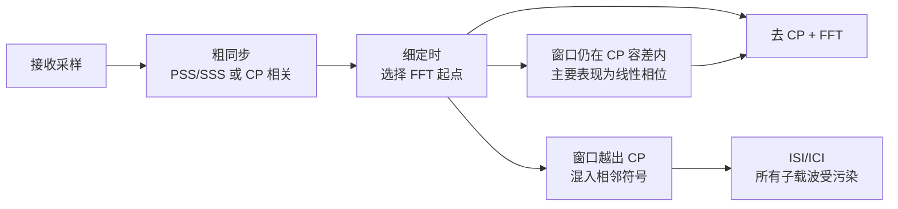

# T2.12 OFDM 定时同步：FFT 窗口、CP 容差与符号边界
## 本节学习目标

T2.1 已经说明 CP 为什么能保护 OFDM，T2.2 给出了 NR 的符号和时隙层级。本节进入接收机工程的第一关：接收端拿到的是连续采样流，不是已经切好的 OFDM 符号。定时同步要做的事，是在采样流里找到每个 OFDM 符号的边界，并选择一个不会被相邻符号污染的 FFT 窗口。

先建立三个判断：

| 对象 | 先这样理解 | 错了会怎样 |
|:---|:---|:---|
| 符号边界 | 当前 OFDM 符号从哪里开始 | 去 CP 位置错，FFT 输入混入错误采样。 |
| FFT 窗口 | 送入 FFT 的 $T_u$ 有用符号采样区间 | 窗口越出 CP 容差会产生 ISI/ICI。 |
| 定时容差 | CP 提供的可容忍误差范围 | 容差不是无限的，且会消耗多径保护余量。 |

- 解释为什么 OFDM 接收必须先做定时同步。
- 区分粗定时、细定时和跟踪。
- 说明定时误差落在 CP 内与落出 CP 的不同后果。
- 把定时误差如何进入信道估计、均衡和 LLR 质量讲清楚。
- 明确 PSS/SSS、CP 相关和接收机实现自由度的协议边界。

## 前置知识检查

| 问题 | 需要达到的程度 |
|:---|:---|
| CP 的作用是什么？ | 知道 CP 是同一 OFDM 符号尾部副本，接收端会先丢弃。 |
| FFT 窗口是什么？ | 知道 FFT 只处理 $T_u$ 长度的有用符号采样。 |
| 多径时延扩展是什么？ | 知道前一符号的延迟副本可能侵入后一符号开头。 |
| PSS/SSS 是什么？ | 知道它们是 NR 小区搜索和同步相关的协议序列。 |

若 T2.1 的 CP 机制还不清楚，先回到 T2.1 的图 5。T2.12 不重新推导 CP 为什么把线性卷积变成循环卷积，而是讨论接收端如何选择那个“可以被 CP 保护的”FFT 起点。

## FFT 窗口选择的约束

OFDM 的 FFT 解调隐含一个强前提：FFT 积分窗口必须覆盖同一个 OFDM 符号的有用区间。如果窗口取错，接收端做的就不是“把当前符号的频域子载波恢复出来”，而是对一段混杂信号做投影。

设发送端第 $n$ 个符号的有用时域采样为 $s_n[m]$，CP 是末尾 $N_{CP}$ 个采样的副本。接收端选择 FFT 起点 $\hat{m}_0$。若真实有用符号起点为 $m_0$，定时误差为：

$$
\Delta m = \hat{m}_0 - m_0
\tag{1}
$$

工程上最关心的不是 $\Delta m$ 是否严格为 0，而是窗口是否仍落在 CP 可以吸收的范围内。CP 允许接收端把 FFT 起点放在一个小区间内；只要窗口没有混入前后符号的有效数据，FFT 后仍可以保持循环卷积结构。

## 图示：定时同步链路



图示的读图顺序是：接收端先在连续采样中找粗同步峰，再结合 CP、多径和参考信号选择细定时位置，最后丢弃 CP 并取 $T_u$ 长度做 FFT。窗口误差仍落在 CP 容差内时，主要问题是频域线性相位；窗口越出 CP 时，FFT 输入直接混入相邻符号，当前符号的所有子载波都会被污染。

## CP 内误差与 CP 外误差

定时误差落在 CP 内时，系统不一定“完全无影响”。对于多径信道，选择不同 FFT 起点会改变每个子载波上的相位参考。简化地看，时域循环移位 $\Delta m$ 会在频域变成线性相位：

$$
Y_k \approx H_k X_k e^{-j2\pi k\Delta m/N} + N_k
\tag{2}
$$

这类相位通常可以被信道估计吸收，因为接收端估计到的是包含该相位参考的等效信道。但如果窗口越出 CP，问题就不再只是相位。FFT 输入会包含前一符号或后一符号的有效数据，循环卷积假设被破坏：

$$
Y_k \neq H_k X_k + N_k
\tag{3}
$$

此时每个子载波不再只对应自己的 $X_k$，还会混入相邻符号和其他子载波成分，表现为符号间干扰（ISI）和子载波间干扰（ICI）。

## 教学例子：三种 FFT 起点

假设一个教学 OFDM 参数为：

| 参数 | 数值 | 含义 |
|:---|---:|:---|
| $N$ | 128 | IFFT/FFT 有用采样点数。 |
| $N_{CP}$ | 16 | CP 采样点数。 |
| 信道最大时延 | 10 | 最晚多径比最早路径晚 10 个采样。 |

接收端有三个候选 FFT 起点：

| 候选 | 相对理想起点 | 是否推荐 | 原因 |
|:---|---:|:---:|:---|
| A | $-6$ | 可用但偏早 | 仍在 CP 容差内，频域主要多一个相位斜率；但只剩 $16-10-6=0$ 个采样余量，抗漂移差。 |
| B | $0$ | 推荐 | 与理想有用符号起点一致，CP 全部用于吸收多径。 |
| C | $+9$ | 风险高 | 延后太多，本符号尾部可能被截断，下一符号开头进入 FFT 窗口。 |

这个例子说明：定时同步不是“相关峰最大就结束”。最强相关峰可能对应最强路径而不是最早路径；若把 FFT 起点放得太晚，虽然当前主径能量强，但多径尾部和下一符号边界会压缩可用余量。工程接收机常把峰值、CP 余量、EVM、DM-RS 估计质量和跟踪稳定性一起判断。

还可以把候选起点写成预算公式。若窗口提前量为 $a$，最大多径时延为 $D$，CP 长度为 $N_{CP}$，一个保守约束是：

$$
a + D \leq N_{CP}
\tag{4}
$$

这里 $a$ 不是越大越好。提前太多会降低对定时漂移的余量；延后太多会截掉本符号尾部。实际系统还要考虑滤波器群时延、采样率转换延迟、射频链路固定延迟和多径统计。

## 深入理解：定时误差的三种观测形态

定时误差可以从三个角度观察：

| 观测域 | 看什么 | 典型诊断 |
|:---|:---|:---|
| 时域相关 | PSS/SSS 或 CP 相关峰的位置和形状 | 多峰、峰宽、峰值抖动说明多径或低 SNR 下定时不稳。 |
| 频域相位 | DM-RS 估计出的子载波相位斜率 | 线性相位斜率可能来自 CP 内窗口偏移，也可能来自 SFO。 |
| 星座/EVM | 均衡后星座点散布 | CP 外误差通常让整符号 EVM 变差，且不只是一条平滑相位线。 |

这三种观测不能互相替代。只看相关峰容易忽略后续均衡质量；只看 EVM 又难以区分定时、频偏和信道估计误差。严谨的日志应至少保存 `timing_offset`、`fft_start`、相关峰度量、DM-RS 相位斜率和 EVM。

## 实现细节：粗同步、细同步和跟踪的状态交接

一个接收机通常不会每个 OFDM 符号都从零开始做全范围搜索。更常见的结构是：

1. 初始接入或重捕获时做大范围粗搜索。
2. 在候选窗口附近做细同步。
3. 成功解调后进入跟踪状态，只估计慢变化偏移。
4. 若 CRC、EVM、相关峰或频偏指标异常，再触发重捕获。

这条状态链对译码器也重要。若定时跟踪已经失锁，但接收机仍继续输出 LLR，译码器会收到看似完整、实际已污染的软信息。工程接口应有“前端同步状态”或“LLR quality valid”之类的诊断字段，至少在仿真日志中保存。

## 粗同步、细同步和跟踪

定时同步不是一个单次动作。实际接收机通常分三层处理：

| 阶段 | 输入 | 常见方法 | 输出 |
|:---|:---|:---|:---|
| 粗同步 | 宽范围接收采样 | PSS/SSS 相关峰、能量检测 | 大致帧/符号位置。 |
| 细同步 | 粗同步附近采样 | CP 相关、DM-RS 辅助、最大似然搜索 | 更精确的 FFT 窗口。 |
| 定时跟踪 | 连续时隙或连续符号 | 参考信号相位/相关峰漂移 | 慢漂移修正量。 |

PSS/SSS 适合初始小区搜索和粗定时，因为它们在 SS/PBCH block 中有协议规定的位置和序列。CP 相关利用“CP 是符号尾部副本”的结构：把候选 CP 段与候选符号尾部相乘累加，相关峰高的位置更可能是符号边界。DM-RS 辅助细同步则利用已知参考信号，让定时选择与后续信道估计质量一致。

## 定时误差如何影响 LLR

译码器不直接看到定时误差。它看到的是软解调输出的 LLR。但定时误差会沿下面链路传播：

```text
FFT 窗口误差 -> 子载波正交性下降 -> 信道估计偏差/均衡残留
             -> 星座点旋转或扩散 -> LLR 符号/幅度错误
```

若窗口仍在 CP 内，主要风险是相位参考和估计一致性；若窗口越出 CP，风险变成全符号污染。对高阶 QAM，星座点间距更小，同样的窗口偏差更容易造成边界比特 LLR 翻转。

## 工程检查点

| 检查项 | 应记录的证据 | 失败迹象 |
|:---|:---|:---|
| 粗同步峰 | peak index、peak-to-side ratio | 多个候选峰接近，帧起点不稳定。 |
| FFT 起点 | 相对 CP 起点的采样偏移 | 偏移靠近 CP 边缘，保护余量不足。 |
| EVM/星座 | 同步前后星座散布 | 同步后仍有整体旋转或扩散。 |
| BLER 对比 | perfect timing vs practical timing | practical 曲线出现额外损失。 |
| 日志字段 | `timing_offset`, `peak_metric`, `fft_start` | 无法复现窗口选择。 |

## 资料与协议边界

| 资料 | 本节采用 | 边界 |
|:---|:---|:---|
| TS 38.211 §5.3 | NR OFDM 基带信号生成入口 | 不复现全部采样率和符号生成公式。 |
| TS 38.211 §7.4.3.1.1/§7.4.3.1.2 | PSS/SSS 映射入口 | 不复现 PSS/SSS 序列生成和检测算法。 |
| `Timing_Sync_定时同步` | 接收机实现解释 | 作为概念材料，不写成协议强制算法。 |
| T2.1 | CP 与 FFT 窗口的机制基础 | 本节不重复 T2.1 的完整正交性推导。 |

TS 38.211 定义 NR OFDM 基带信号生成、SS/PBCH block 中 PSS/SSS 的映射，以及各类参考信号。协议提供“可被检测的信号结构”，但不规定 UE 必须使用哪一种定时同步算法。CP 相关、PSS/SSS 搜索、DM-RS 辅助细同步、跟踪滤波器和异常检测阈值都属于接收机实现自由度。

本节也不展开随机接入的 timing advance 闭环；那属于上行时序控制和 MAC/RRC 过程，和这里的“接收端如何选择 FFT 窗口”不是同一层问题。

## 扩展讲解：验证与实现关注点

定时同步在仿真里很容易被“理想函数”隐藏。许多链路脚本直接使用 perfect timing，把接收波形按真实信道路径信息对齐。这适合建立上界，但不能代表实际接收机。实际实现至少要回答四个问题：粗同步如何找到候选区域，细同步如何选择 FFT 起点，跟踪如何处理慢漂移，失锁如何被发现。

第一，粗同步的目标不是一次性精确到采样，而是把搜索范围缩小到可控窗口。PSS/SSS 相关峰可以提供小区搜索和粗时序线索，但在低 SNR、多径和强邻区环境下，相关峰可能有多个局部最大值。若接收机只取最大峰，可能锁到强反射路径而不是更适合 FFT 的窗口位置。工程日志应保存前几名候选峰，而不只保存最终峰值。

第二，细同步要把“峰值最大”翻译成“FFT 窗口最安全”。最安全的位置通常要保留 CP 余量，避免多径尾巴或后续定时漂移把窗口推出保护区。一个实用策略是先估计信道时延扩展，再把 FFT 起点放在既能覆盖主要能量、又不贴近 CP 边界的位置。这个策略不一定在所有信道模型中最优，但它比“固定取峰值”更容易解释和调试。

第三，跟踪环路必须区分慢漂移和瞬时异常。采样时钟误差、温漂和移动造成的路径变化通常是慢变化；突发干扰、深衰落和错误相关峰则可能是瞬时异常。如果跟踪环路带宽太宽，会追随噪声；带宽太窄，又跟不上真实漂移。验证时可构造低速、中速、高速三组信道，并记录 `timing_offset` 的平滑曲线，而不是只看最终 BLER。

第四，定时失败需要进入质量门控。若前端已经判断同步不可靠，还继续输出高幅 LLR，译码器会收到错误证据。工程接口可以把 `sync_valid`、`timing_metric`、`fft_start_margin` 作为诊断字段，至少在仿真和 bring-up 中保留。对硬件而言，这些字段还可驱动丢包、重捕获或降低 LLR 置信度。

| 验证场景 | 目的 | 预期观察 |
|:---|:---|:---|
| AWGN 单径 | 检查同步基础逻辑 | 相关峰唯一，FFT 起点稳定。 |
| 多径 TDL | 检查 CP 余量选择 | 最强峰与最佳 FFT 起点可能不同。 |
| 高速移动 | 检查跟踪带宽 | 相位和定时漂移需要连续修正。 |
| 低 SNR | 检查误锁保护 | 候选峰接近时应降低置信度。 |
| perfect/practical 对比 | 定位接收机损失 | practical BLER 相对 perfect 有可解释差距。 |

定时同步还会影响后续所有参考信号处理。FFT 起点变化会改变 DM-RS 的相位参考；如果信道估计和数据均衡使用同一个窗口，这个相位可以被吸收；如果估计窗口和数据窗口不一致，等效信道就会错配。因此仿真日志应把 `fft_start` 与 channel estimate、equalizer、soft demapper 的数据关联起来，不能只在同步模块内部保存。

## 调试案例库

| 案例 | 表现 | 定位步骤 | 修复方向 |
|:---|:---|:---|:---|
| 锁到强反射路径 | 相关峰很高，但 BLER 比 perfect timing 差很多 | 对比最早路径、最强路径和 EVM 最优窗口 | 改为 CP 余量约束下的窗口选择。 |
| 低 SNR 误锁 | 帧起点偶发跳变，CRC 成簇失败 | 保存 top-N 相关峰和峰比 | 增加峰值置信度门限和重捕获机制。 |
| 滤波器时延未扣除 | 所有场景 FFT 起点固定偏移 | 关闭滤波或补偿群时延后对比 | 在同步坐标里统一扣除固定延迟。 |
| SFO 伪装成定时漂移 | 长 burst 后 slot 末端 EVM 恶化 | 观察 timing drift 和 per-subcarrier phase slope | 把 SFO 跟踪接入定时环路。 |

这些案例的共同点是：错误不一定在同步模块内部立刻显性失败，而是通过 DM-RS residual、EVM、LLR 和 BLER 逐层放大。定时同步的验收不能只写“检测到峰值”，而要证明这个峰值选择使后续 FFT、信道估计和 LLR 都一致。

## 常见错误

| 错误 | 为什么错 | 正确做法 |
|:---|:---|:---|
| 认为 CP 内任意位置都完全等价 | CP 内窗口偏移仍会改变频域相位参考。 | 让信道估计和 FFT 窗口选择使用一致参考。 |
| 把定时同步当作协议固定算法 | 协议定义 PSS/SSS 和参考信号，算法是接收机实现。 | 文档中分清“信号结构”和“检测方法”。 |
| 只看峰值不看多径 | 最早路径、最强路径和最佳 FFT 窗口不一定相同。 | 结合 CP 余量、EVM 和信道估计质量选择窗口。 |
| 仿真一直用 perfect timing | 会隐藏实际接收机损失。 | 同时跑 perfect/practical 两组基线。 |

## 最小仿真矩阵

| 维度 | 建议取值 | 覆盖目的 |
|:---|:---|:---|
| 信道 | AWGN、单径、TDL 多径 | 区分纯噪声、固定时延和多径扩展。 |
| SNR | 高、中、低三点 | 检查相关峰置信度随噪声变化是否合理。 |
| 定时偏移 | CP 内、CP 边缘、CP 外 | 验证相位误差和 ISI/ICI 的边界。 |
| 参考信号 | PSS/SSS only、DM-RS assisted | 比较粗同步和细同步能力。 |
| 接收模式 | perfect timing、practical timing | 给出接收机实现损失。 |

每个仿真点至少保存 `fft_start`、`timing_offset`、相关峰度量、EVM 和 BLER。若文章或报告只给最终 BLER，没有同步度量，就无法证明问题来自定时还是来自后续均衡/译码。

实际排查时还应保存同步模块的候选列表，而不是只保存最终 `fft_start`。候选列表至少包含候选采样点、相关峰值、相对主峰差值、估计 CP 余量和该候选下的 DM-RS residual。这样可以复盘接收机为什么选择某个窗口，也能判断失败是搜索范围不足、峰值判决错误，还是后续跟踪把窗口慢慢推到 CP 边缘。

## 自测题

1. 为什么 FFT 窗口必须覆盖同一个 OFDM 符号的有用区间？
2. 定时误差落在 CP 内和越出 CP 的后果有什么本质差别？
3. CP 相关为什么能用于定时同步？
4. PSS/SSS 在定时同步中提供什么帮助？
5. 定时误差最终如何影响译码器输入？

## 自测题参考答案

1. 因为 FFT 解调依赖当前符号内部子载波的正交投影；混入相邻符号会破坏这个投影。
2. CP 内误差主要表现为可被估计吸收的相位参考变化；越出 CP 会混入相邻符号有效数据，产生 ISI/ICI。
3. 因为 CP 是有用符号尾部的副本，候选 CP 段与候选尾部段应具有较高相关性。
4. PSS/SSS 是协议定义的同步信号，接收端可用相关检测获得粗帧/符号位置和小区搜索线索。
5. 定时误差先破坏 FFT 输出，再影响信道估计和均衡，最终表现为星座点偏移、LLR 符号或幅度错误。

## 本节验收

| 验收项 | 通过标准 |
|:---|:---|
| 窗口模型 | 能画出 CP、$T_u$ 和 FFT 窗口的关系。 |
| 误差分类 | 能区分 CP 内相位误差和 CP 外 ISI/ICI。 |
| 接收机流程 | 能说明粗同步、细同步、跟踪各自解决什么。 |
| 协议边界 | 能说清 PSS/SSS 是协议信号结构，检测算法不是协议强制。 |
| 链路图理解 | 能按图示说明同步、FFT 窗口、CP 容差和越界污染的关系。 |

## 与相邻章节的衔接

T2.12 是 T2.13–T2.16 的入口条件。若 FFT 窗口没有稳定对齐，频偏估计会把定时偏差误读为相位斜率，信道估计会把窗口错误吸收到 $\hat{H}$，均衡器会在错误模型上输出 LLR。学习时应先把定时同步当成“坐标系建立”问题，再进入 CFO/SFO 的频率坐标修正。

它也和 T2.18 有双向关系。发射端窗口/滤波可能引入固定群时延或改变 CP 余量，接收端定时同步必须把这些固定延迟和有效保护间隔纳入预算。最终这些误差都在 T2.19 收束为 LLR 可靠度问题。

## 执行与证据记录

| 项目 | 记录 |
|:---|:---|
| 本地材料 | 使用 `rg` 定位 TS 38.211 §5.3、§7.4.3.1.1、§7.4.3.1.2 和概念笔记 `Timing_Sync_定时同步`。 |
| 图解材料 | 本节使用 Markdown 内嵌 Mermaid 概念图，不再依赖外部 SVG 资产。 |
| 图解边界 | 图示只表达同步链路和错误分类，不作为具体接收机状态机或协议时序图。 |
| 证据边界 | 本节讲接收机定时同步工程模型，不声明复现 TS 38.211 的 PSS/SSS 序列公式。 |

## 参考文献

- [3GPP, 2026] 3GPP TS 38.211, Rel-19, `38211-j30`, Physical channels and modulation, §5.3, §7.4.3.1.1, §7.4.3.1.2. Local path: `3GPP_Rel19/processed/TS_38.211_38211-j30`.
- 项目概念笔记：`3gpp/docs/concepts/Timing_Sync_定时同步.md`。
