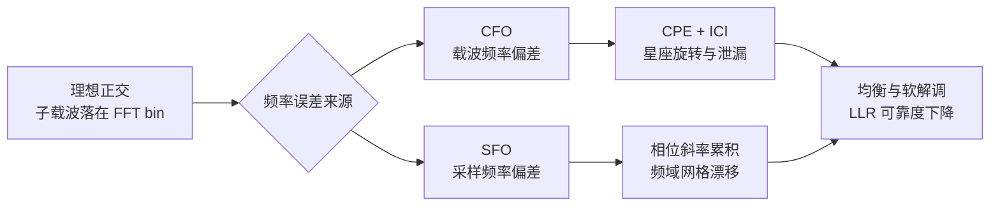

# T2.13 OFDM 频率同步：CFO、SFO 与子载波正交性损失
## 本节学习目标

T2.12 解决“FFT 窗口取哪里”的问题。本节解决“接收机的频率和采样节拍是否跟发送机一致”的问题。OFDM 的优势来自子载波正交性；载波频偏（Carrier Frequency Offset, CFO）和采样频偏（Sampling Frequency Offset, SFO）会让这个正交性逐步失效。

先区分两个频率误差：

| 误差 | 来源 | 直观表现 |
|:---|:---|:---|
| CFO | 发射/接收本振不一致，多普勒频移 | 星座随 OFDM 符号旋转，严重时子载波互相泄漏。 |
| SFO | ADC/DAC 采样时钟不一致 | 采样点慢慢漂移，频域相位随子载波索引和时间变化。 |

- 推导归一化 CFO 如何破坏 FFT bin 的正交投影。
- 区分整数 CFO、小数 CFO、公共相位误差和 ICI。
- 说明 SFO 为什么同时造成定时漂移和频域相位斜率。
- 解释 PSS/SSS、DM-RS、PTRS 在频率同步中的不同角色。
- 把残余 CFO/SFO 如何影响 LLR 质量讲清楚。

## 前置知识检查

| 问题 | 需要达到的程度 |
|:---|:---|
| 子载波正交条件是什么？ | 知道 T2.1 中 $\Delta f=1/T_u$ 是正交性的核心。 |
| FFT bin 是什么？ | 知道 FFT 把离散频率投影到一组固定频点。 |
| 相位旋转和频率偏移的关系是什么？ | 知道固定频率差会随时间累积相位。 |
| DM-RS/PTRS 的用途是什么？ | 知道参考信号可用于估计信道和相位误差。 |

本节不要求掌握锁相环或射频本振实现，只需要抓住一条主线：OFDM 靠“频率刚好对齐”保持正交，CFO/SFO 都会让这个对齐关系变差。

## CFO 的基本模型

设发送端基带 OFDM 采样为 $s[n]$。若接收本振与发送本振存在频率差 $\Delta f_c$，接收采样可写成：

$$
r[n] = s[n]e^{j2\pi \Delta f_c nT_s} + w[n]
\tag{1}
$$

把 CFO 按子载波间隔 $\Delta f$ 归一化：

$$
\epsilon = \frac{\Delta f_c}{\Delta f}
\tag{2}
$$

当 $\epsilon=0$ 时，每个子载波正好落在 FFT 的整数 bin 上。若 $\epsilon$ 不是 0，FFT 不再只在目标 bin 上取到能量。小数 CFO 会让能量泄漏到邻近子载波，形成 ICI；整数 CFO 则主要表现为子载波索引整体偏移。

## 图示：CFO/SFO 的影响链

图示从理想正交开始，分别引入 CFO 和 SFO，再落到软解调。CFO 更直接表现为公共相位旋转和 ICI；SFO 更像采样网格随时间漂移，在频域表现为随子载波索引变化的相位斜率。两者都可能让同一个 RE 的 LLR 幅度变小或符号错误。

## 公共相位误差与 ICI

在小 CFO 下，接收端常把影响拆成两部分：

| 成分 | 含义 | 接收端处理 |
|:---|:---|:---|
| CPE | Common Phase Error，整个 OFDM 符号近似同转一个相位 | 可用 DM-RS/PTRS 估计并补偿。 |
| ICI | Inter-Carrier Interference，其他子载波泄漏进当前子载波 | 无法只靠单个相位完全消除。 |

简化写法是：

$$
Y_k \approx C_0 X_k + \sum_{m\neq k} C_{k-m}X_m + N_k
\tag{3}
$$

$C_0$ 对应主子载波上的衰减和相位，求和项就是 ICI。CFO 越大，ICI 项越强。对高阶 QAM，CPE 会让星座整体旋转；ICI 会让星座点扩散，两者都会影响 soft demapper 的欧氏距离计算。

## 教学例子：15 kHz 子载波间隔下的 750 Hz CFO

假设 NR 使用 $\Delta f=15$ kHz，接收机残余 CFO 为 750 Hz。归一化频偏为：

$$
\epsilon=\frac{750}{15000}=0.05
\tag{4}
$$

这表示频偏是子载波间隔的 5%。若一个 OFDM 有用符号时长近似为：

$$
T_u=\frac{1}{15000}\approx 66.67\ \mu s
\tag{5}
$$

一个有用符号内累积相位为：

$$
\Delta\phi=2\pi\Delta f_cT_u
=2\pi\times750\times66.67\times10^{-6}
\approx0.314\ \mathrm{rad}
\tag{6}
$$

约等于 18 度。对 QPSK，这可能还可以由 DM-RS 相位补偿吸收；对 256QAM，18 度足以造成明显星座旋转。如果 CFO 未被建模，soft demapper 会把旋转后的点投到错误的候选距离上。

再看跨符号累积。若 residual CFO 没有被继续跟踪，第 10 个 OFDM 符号附近相位可以累积到约 180 度量级。实际系统会在粗频偏校正后继续使用 DM-RS/PTRS 做细相位跟踪，否则星座会持续转动。

## 深入理解：整数 CFO、小数 CFO 与符号时变相位

CFO 可以按归一化值拆成整数部分和小数部分：

$$
\epsilon = q + \delta,\quad q\in\mathbb{Z},\ -0.5<\delta\leq0.5
\tag{7}
$$

| 成分 | 主要后果 | 诊断方式 |
|:---|:---|:---|
| 整数 CFO $q$ | 子载波索引整体搬移，资源网格频域对不齐 | PSS/SSS 频域搜索、SSB raster 偏差。 |
| 小数 CFO $\delta$ | CPE + ICI，星座旋转和扩散 | DM-RS/PTRS 相位、EVM、ICI 代理。 |
| 残余时变相位 | 相位随 OFDM 符号继续漂移 | per-symbol CPE 曲线。 |

整数 CFO 如果没处理，接收端可能把 PRB/子载波地址整体读错；小数 CFO 即使只有几个百分点，也会降低子载波隔离度。两类问题在日志上不同，不能只保存一个 `frequency_offset_estimate` 字段后就结束。

## SFO 的数值直觉

采样频偏常用 ppm 表示。若采样率为 $30.72$ Msps，SFO 为 20 ppm，则采样频率误差为：

$$
\Delta f_s = 30.72\times10^6 \times 20\times10^{-6}
=614.4\ \mathrm{Hz}
\tag{8}
$$

这不是载波频偏，但它会让采样点逐步漂移。每经过 50000 个采样，累计误差约为：

$$
50000\times20\times10^{-6}=1\ \text{sample}
\tag{9}
$$

因此 SFO 可能在短时间内看不明显，却会在长 burst 或连续 slot 中逐步把 FFT 窗口推向 CP 边缘，同时在频域留下相位斜率。高速移动、低成本晶振和长时间连续接收都需要关注 SFO 跟踪。

## SFO 的基本模型

SFO 来自采样时钟误差。设接收采样周期不是 $T_s$，而是：

$$
\hat{T}_s = T_s(1+\eta)
\tag{10}
$$

其中 $\eta$ 是相对采样频偏，常用 ppm 表示。SFO 的麻烦在于它会积累：采样点每个符号都略微偏离，经过多个 OFDM 符号后，FFT 窗口位置和每个子载波的相位都会变化。

频域上，SFO 常表现为随子载波索引 $k$ 变化的相位斜率，并且随 OFDM 符号时间 $l$ 继续累积：

$$
Y[k,l] \approx X[k,l]H[k,l]e^{j\phi(k,l)} + ICI + N[k,l]
\tag{11}
$$

其中 $\phi(k,l)$ 同时依赖频率位置和时间。工程调试时，如果星座不是整体同转，而是高频端和低频端相位不一致，就要怀疑 SFO 或定时漂移。

## 频率同步的典型流程

| 阶段 | 目标 | 典型依据 |
|:---|:---|:---|
| 粗 CFO | 将大频偏校正到可解调范围 | PSS/SSS、重复结构、频域搜索。 |
| 细 CFO | 消除残余公共旋转 | DM-RS 相位、相邻符号相位差。 |
| 相位跟踪 | 跟踪高频相位噪声和残余 CPE | PTRS 或密集参考信号。 |
| SFO 跟踪 | 估计采样时钟漂移 | 频域相位斜率、定时漂移历史。 |

## 资料与协议边界

| 资料 | 本节采用 | 边界 |
|:---|:---|:---|
| TS 38.211 §7.4.3.1.1/§7.4.3.1.2 | PSS/SSS 映射入口 | 不复现小区搜索算法。 |
| TS 38.211 §7.4.1.1/§7.4.1.2 | DM-RS/PTRS 入口 | 不复现完整参考信号序列和配置表。 |
| T2.1 | 子载波正交性基础 | 本节只讨论频率误差破坏正交性的工程模型。 |
| T2.12 | FFT 窗口和 CP 容差 | SFO 与定时漂移的关系在本节衔接。 |

TS 38.211 定义 PSS/SSS、DM-RS 和 PTRS 的信号结构与映射；接收端使用哪些滤波器、环路带宽、估计窗口和异常判定阈值，是实现选择。

## 对 LLR 的影响

软解调的 LLR 通常来自候选星座点距离和噪声方差。如果残余 CFO/SFO 没有补偿，接收符号不再满足理想模型：

$$
Y_k = H_k X_k + N_k
\tag{12}
$$

而更接近：

$$
Y_k = H_k X_k e^{j\theta_k} + I_k + N_k
\tag{13}
$$

$I_k$ 是 ICI 或残留干扰。若 soft demapper 仍按式 (6) 计算，LLR 会过度自信或方向错误。工程上需要把残余频偏造成的扩散计入 EVM、post-eq SINR 或等效噪声估计。

## 工程检查点

| 检查项 | 应记录的证据 | 失败迹象 |
|:---|:---|:---|
| 残余 CFO | Hz 或归一化 $\epsilon$ | 星座随符号时间持续旋转。 |
| SFO/ppm | 估计 ppm、相位斜率 | 频带两端相位误差不同。 |
| PTRS/DM-RS 相位 | CPE 跟踪曲线 | 相位噪声峰值后 BLER 跳变。 |
| ICI 代理 | EVM、邻子载波泄漏 | 高 SCS 或高速移动下曲线恶化。 |
| LLR 质量 | LLR 均值/方差、clip 计数 | LLR 幅度异常偏大或偏小。 |

## 扩展讲解：验证与实现关注点

频率同步问题的难点在于它常常伪装成别的错误。残余 CFO 会让星座旋转，看起来像信道估计相位错；SFO 会让相位随子载波索引变化，看起来像频率选择性信道估计不准；ICI 会让星座扩散，看起来像噪声方差变大。调试时不能只看一个 EVM 数字，必须把时间、频率和参考信号相位拆开看。

粗 CFO 估计通常要处理较大搜索范围。初始接入时，接收端可能先在时域或频域上执行候选频偏搜索，使 PSS/SSS 相关峰最大。这个阶段的目标是将频偏校正到细估计可处理范围，不追求极限精度。若粗 CFO 漏掉整数子载波偏移，后续 DM-RS 可能与预期频域位置完全错开；这种错误通常表现为资源网格整体频移，而不是单个 RE 的噪声增大。

细 CFO 和 CPE 跟踪更多依赖参考信号。DM-RS 可用于估计数据区域附近的相位；PTRS 更适合跟踪相位噪声和残余公共相位误差。两者的时间密度、频率密度和端口关系会影响估计质量。若使用太长的平均窗口，噪声能被压低，但快速相位变化会被抹平；若窗口太短，估计噪声又会进入 LLR。工程设计需要在相位跟踪带宽和估计噪声之间折中。

SFO 的验证最好使用长时间连续接收场景。短包里 SFO 可能只表现为很小的相位斜率，BLER 不明显；长 burst 中采样点漂移会逐步逼近 CP 边缘。测试时应记录 `sfo_ppm_estimate`、`timing_drift_per_slot`、`phase_slope_per_prb`，并观察这些量是否同向变化。若只记录 residual CFO，SFO 问题会被误归因到信道估计。

| 诊断图 | 横轴 | 纵轴 | 能暴露的问题 |
|:---|:---|:---|:---|
| per-symbol CPE | OFDM symbol index | common phase | 残余 CFO、相位噪声。 |
| per-subcarrier phase | subcarrier index | DM-RS phase residual | SFO、定时偏移、频域估计误差。 |
| EVM heatmap | PRB x OFDM symbol | EVM | 局部 ICI、跟踪失锁。 |
| LLR histogram | LLR bin | count | 可靠度过强/过弱。 |

对定点实现，频偏补偿通常是复数旋转器。旋转因子精度、相位累加器位宽和查表/坐标旋转数字计算机实现都会影响残余相位误差。若相位累加器截断过粗，星座会出现周期性抖动；若旋转器饱和或缩放不一致，后续信道估计幅度也会偏。硬件验证应加入固定 CFO、扫频 CFO、SFO ppm 和相位噪声四类向量，而不是只跑静态 AWGN。

## 调试案例库

| 案例 | 表现 | 定位步骤 | 修复方向 |
|:---|:---|:---|:---|
| 残余 CFO | 星座逐符号同向旋转 | 画 per-symbol CPE 曲线 | 调整细 CFO 环路或 DM-RS 相位估计。 |
| SFO 漂移 | 频带两端相位方向不同 | 画 per-subcarrier phase residual | 增加 SFO 估计和采样率校正。 |
| 相位噪声 | 高频段 CPE 抖动明显 | 对比 PTRS on/off | 增加 PTRS 跟踪或缩短估计窗口。 |
| 整数 CFO | 资源网格整体频移 | 检查 SSB/PSS 频域候选 | 扩大粗频偏搜索并校正子载波偏移。 |

频率同步和信道估计要联合验证。如果先做信道估计再用估计结果补 CFO，残余 CFO 会污染 $\hat{H}$；如果先补 CFO 但粗估计方向错，DM-RS 又会被放到错误频点。工程实现通常要迭代：粗同步和粗 CFO 给出初始网格，DM-RS/ PTRS 提供细修正，再把修正后的网格用于后续估计和均衡。

## 常见错误

| 错误 | 为什么错 | 正确做法 |
|:---|:---|:---|
| 把 CFO 当成固定相位 | CFO 是频率差，随时间累积相位。 | 用相邻符号相位变化估计残余频偏。 |
| 只补 CPE 不管 ICI | 大 CFO 下 ICI 不能靠单相位旋转消除。 | 先通过粗 CFO 将频偏降至细补偿可处理范围。 |
| 混淆 CFO 和 SFO | CFO 来自载波频率，SFO 来自采样时钟。 | 分别观察整体旋转和频域相位斜率。 |
| 仿真不记录残余频偏 | BLER 损失无法归因。 | 保存 CFO/SFO 估计、校正后 EVM 和 LLR 统计。 |

## 最小仿真矩阵

| 维度 | 建议取值 | 覆盖目的 |
|:---|:---|:---|
| CFO | 0、0.01、0.05、0.2 个 SCS | 分离小相位旋转和明显 ICI。 |
| SFO | 0、5、20、50 ppm | 观察长 burst 下采样漂移。 |
| 速度 | 静止、低速、高速 | 覆盖多普勒和相位跟踪压力。 |
| 参考信号 | DM-RS only、DM-RS+PTRS | 验证 CPE 跟踪收益。 |
| 调制 | QPSK、64QAM、256QAM | 检查高阶调制对相位误差的敏感性。 |

每个点至少输出 residual CFO、SFO estimate、per-symbol CPE、per-subcarrier phase slope、EVM 和 LLR histogram。若 CFO/SFO 只用一个平均误差表示，会漏掉时间和频率两个方向的结构性失真。

## 自测题

1. 为什么 CFO 会破坏 OFDM 子载波正交性？
2. CPE 和 ICI 有什么区别？
3. SFO 为什么会随时间积累？
4. PTRS 和 DM-RS 在频率误差补偿中有什么不同角色？
5. 残余 CFO/SFO 为什么会改变 LLR 可靠度？

## 自测题参考答案

1. CFO 使子载波频率不再对准 FFT 的整数 bin，目标子载波能量会泄漏到其他 bin。
2. CPE 是同一个 OFDM 符号内近似公共的相位旋转；ICI 是其他子载波泄漏进当前子载波的干扰。
3. 因为采样周期长期略大或略小，采样点偏差会逐符号累积。
4. DM-RS 主要服务信道估计和细相位修正；PTRS 更偏向跟踪相位噪声和残余 CPE。
5. 它们让星座旋转和扩散，soft demapper 的距离和噪声假设失配，导致 LLR 幅度或符号错误。

## 本节验收

| 验收项 | 通过标准 |
|:---|:---|
| CFO 模型 | 能写出 $r[n]=s[n]e^{j2\pi\Delta f_c nT_s}+w[n]$。 |
| SFO 模型 | 能解释 $\hat{T}_s=T_s(1+\eta)$ 的累积效应。 |
| 误差分类 | 能区分 CPE、ICI 和频域相位斜率。 |
| 协议边界 | 能说明 PSS/SSS、DM-RS、PTRS 是信号结构，不是固定算法。 |
| 链路图理解 | 能按图示说明 CFO、SFO、CPE、ICI 和 LLR 可靠度之间的关系。 |

## 与相邻章节的衔接

T2.13 接在 T2.12 后面，因为频率误差估计必须建立在大致正确的时间窗口上。窗口错位会制造频域相位斜率，容易和 SFO 混淆；残余 CFO 又会污染 DM-RS 相位，影响 T2.14 的信道估计。学习时应将 T2.12 和 T2.13 视为时间参考与频率参考校准的两个连续环节。

它还直接影响 T2.15 和 T2.19。均衡器假设输入 RE 已经落在正确子载波上；若残余 CFO 仍产生 ICI，均衡器输出的 post-eq SINR 应包含这部分残留干扰。否则 T2.19 中的 LLR 会过度自信，译码器会把前端频偏误差当成可靠证据。

工程验收时，频率同步不应只给一个“校正后 CFO=0”的结论。更稳妥的口径是同时给出校正前误差、校正后残差、相位跟踪曲线、EVM 改善和 BLER 改善。若 CFO 数值很小但 EVM 仍差，可能是 SFO、相位噪声或 ICI；若 EVM 改善但 BLER 不改善，可能是 LLR 可靠度没有同步修正。

报告中还应注明频偏单位：Hz、ppm 和归一化 SCS 不能混写。单位错会让环路带宽、相位累积和仿真扫点全部失真。

## 执行与证据记录

| 项目 | 记录 |
|:---|:---|
| 本地材料 | 使用 `rg` 定位 TS 38.211 §7.4.1.2、§7.4.3.1.1、§7.4.3.1.2 以及 PTRS/DM-RS/PSS/SSS 入口。 |
| 图解材料 | 本节使用 Markdown 内嵌 Mermaid 概念图，不再依赖外部 SVG 资产。 |
| 图解边界 | 图示只表达 CFO/SFO 的误差传播路径，不规定接收机环路结构。 |
| 证据边界 | 本节讲接收机频率同步模型，不复现 PTRS、PSS、SSS 序列生成公式。 |

## 参考文献

- [3GPP, 2026] 3GPP TS 38.211, Rel-19, `38211-j30`, Physical channels and modulation, §7.4.1.2, §7.4.3.1.1, §7.4.3.1.2. Local path: `3GPP_Rel19/processed/TS_38.211_38211-j30`.
