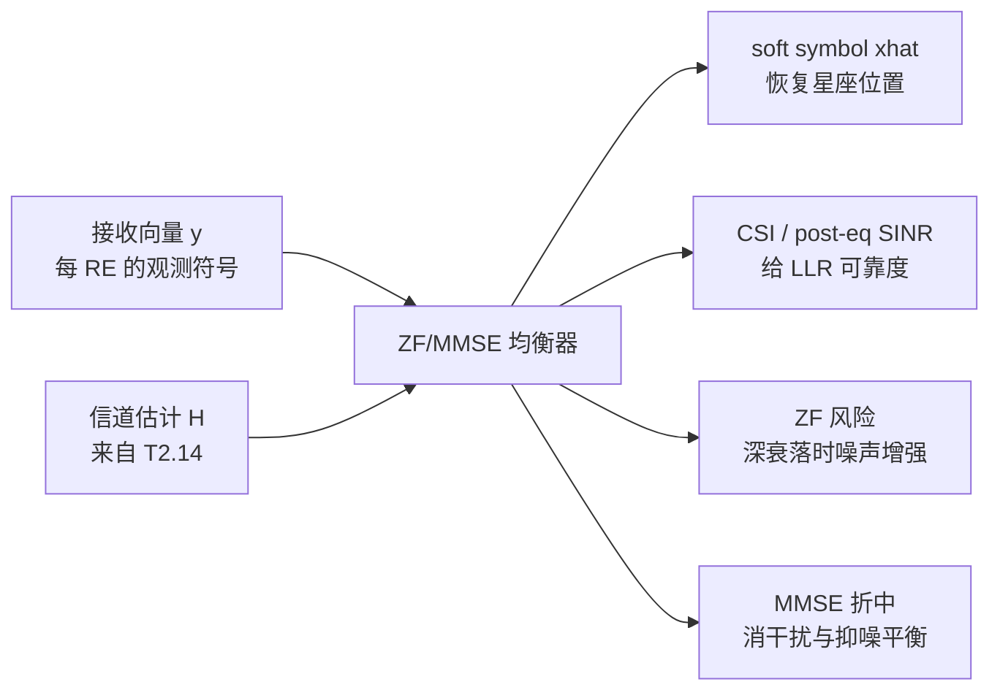

# T2.15 OFDM 均衡与 CSI：从 $Y=HX+N$ 到软解调输入
## 本节学习目标

T2.14 得到了每个 RE 上的信道估计 $\hat{H}[k,l]$。本节讲怎么使用它。均衡（equalization）的目标不是直接输出硬比特，而是把接收符号尽量变回星座点附近，并给软解调器提供可靠度信息。

先分清两个输出：

| 输出 | 含义 | 谁使用 |
|:---|:---|:---|
| 符号估计 $\hat{X}$ | 星座点位置估计 | soft demapper 计算候选星座距离。 |
| CSI/SINR/等效噪声 | 可靠度估计 | soft demapper 缩放 LLR，译码器感知置信度。 |

- 推导 SISO 单抽头均衡。
- 对比 ZF 和 MMSE 的工程差异。
- 说明 MIMO 线性均衡为什么需要矩阵运算。
- 解释 post-eq SINR/CSI 如何影响 LLR。
- 明确均衡算法通常不是 3GPP 协议强制项。

## 前置知识检查

| 问题 | 需要达到的程度 |
|:---|:---|
| 单抽头信道模型是什么？ | 知道 $Y=HX+N$ 表示信道乘法加噪声。 |
| 信道估计输出是什么？ | 知道 T2.14 给出的是 $\hat{H}[k,l]$ 或有效信道矩阵。 |
| LLR 为什么需要噪声方差？ | 知道同样的星座距离在不同噪声下可靠度不同。 |
| 矩阵求逆的风险是什么？ | 知道弱方向求逆会放大噪声。 |

本节默认已经理解 T2.14 的 DM-RS-based 信道估计。均衡不是孤立模块：它的输入质量由信道估计决定，输出可靠度又直接决定 soft demapper 的 LLR。

## SISO 单抽头均衡

OFDM 把频率选择性信道拆成许多子载波上的窄带问题。单个 RE 上可以写成：

$$
Y = HX + N
\tag{1}
$$

若已知 $\hat{H}$，最简单的零迫（Zero Forcing, ZF）均衡为：

$$
\hat{X}_{ZF} = \frac{Y}{\hat{H}}
\tag{2}
$$

这会把星座位置拉回原点附近，但也会把噪声除以 $\hat{H}$。深衰落时 $|\hat{H}|$ 很小，噪声被放大，软解调不能假装可靠度没变。

## 教学例子：同样的均衡输出，不同可靠度

假设 BPSK 发送 $X=+1$。两个 RE 的均衡后符号都为：

$$
\hat{X}=0.9
\tag{3}
$$

若第一个 RE 的等效噪声方差为 $0.05$，BPSK 近似 LLR 为：

$$
L_1=\frac{2\times0.9}{0.05}=36
\tag{4}
$$

若第二个 RE 的等效噪声方差为 $0.5$：

$$
L_2=\frac{2\times0.9}{0.5}=3.6
\tag{5}
$$

两个 RE 的硬判决都偏向 bit 0，但可靠度差了 10 倍。这个例子说明均衡输出不能只传 $\hat{X}$。如果 soft demapper 对两个 RE 使用同一噪声方差，弱信道 RE 会被过度相信，强信道 RE 可能被低估。

再看深衰落。若原始噪声方差为 $0.04$，$|H|=0.2$，ZF 后等效噪声方差为：

$$
\sigma^2_{eq}=\frac{0.04}{0.2^2}=1
\tag{6}
$$

这意味着均衡后星座点即使看起来回到了正确区域，也应输出很小的 LLR。MMSE 的价值就在这里：它不会像 ZF 那样在弱信道方向无限放大噪声。

## 深入理解：MMSE 输出归一化

线性 MMSE 输出通常不是完全无偏的。可以抽象写成：

$$
\hat{x}=g x + v
\tag{7}
$$

其中 $g$ 是等效增益，$v$ 是等效噪声和残留干扰。如果直接把 $\hat{x}$ 当成 $x+w$ 送给 soft demapper，会造成星座缩放错误。因此实现中常需要归一化：

$$
z=\frac{\hat{x}}{g}
\tag{8}
$$

归一化后噪声也被除以 $g$，所以必须同步更新等效噪声方差或 CSI。危险点在于 $g$ 很小时，归一化倍数很大，定点实现必须有饱和和异常保护。否则一个深衰落 RE 会产生不合理的大幅 LLR。

## 实现细节：均衡器接口字段

一个可调试的均衡器接口不应只输出复数符号。建议至少记录：

| 字段 | 粒度 | 用途 |
|:---|:---|:---|
| `x_hat` | RE/layer | soft demapper 输入位置。 |
| `csi` 或 `post_sinr` | RE/layer | LLR 缩放和可靠度评估。 |
| `noise_var` | slot、PRB 或 RE | soft demapper 距离归一化。 |
| `eq_gain` | RE/layer | MMSE 输出归一化调试。 |
| `condition_metric` | RE/PRB | 判断矩阵求逆和噪声增强风险。 |

这些字段不会全部进入最终产品接口，但在仿真和 bring-up 阶段很有价值。缺少它们时，BLER 曲线一旦异常，调试者只能猜是信道估计、均衡、soft demapper 还是译码器出了问题。

## 扩展讲解：验证与实现关注点

均衡器验证应从“符号位置”和“可靠度”两个维度同时进行。很多错误只看星座图不明显。例如 MMSE 输出未归一化时，星座整体缩小，但判决方向可能仍对；如果 soft demapper 同时使用了错误的噪声方差，BLER 会明显变差。反过来，星座看起来扩散很大，但如果 CSI 正确降低了 LLR 幅度，译码器仍可能通过校验约束恢复。

第一个基线是 SISO flat fading。构造固定 $H=0.5e^{j30^\circ}$、固定噪声方差的信道，检查均衡后星座是否回到正确相位和幅度，并检查输出 LLR 是否按 $|H|^2/\sigma^2$ 缩放。这个测试能暴露复共轭方向、除法方向、相位符号和噪声方差口径错误。

第二个基线是深衰落。把 $|H|$ 扫到很小，观察 ZF 和 MMSE 的差异。正确行为不是输出越来越大的可靠 LLR，而是识别弱信道并降低 CSI。若 LLR clip count 在深衰落下反而升高，通常说明归一化或噪声估计存在问题。

第三个基线是 MIMO 条件数扫描。构造一组从正交到近似共线的信道矩阵，观察 per-layer SINR 是否随最小奇异值下降。ZF 在病态矩阵下会显著噪声增强；MMSE 应更平滑。如果两者表现完全相同，要检查 MMSE 是否真正使用了 $\sigma^2$。

| 测试向量 | 应观察 | 能暴露的问题 |
|:---|:---|:---|
| 固定复数 $H$ | 星座相位完全校正 | 共轭方向和复除法错误。 |
| 深衰落 sweep | CSI 下降，LLR 变小 | 噪声增强未建模。 |
| 噪声方差 sweep | MMSE 权重随噪声变化 | $\sigma^2$ 未接入或单位错。 |
| MIMO 条件数 sweep | 弱层 SINR 下降 | 矩阵求逆、层顺序或 CSI 输出错。 |
| 定点位宽 sweep | BLER 平滑退化 | 溢出、饱和、归一化过强。 |

均衡器的硬件代价也要提前记录。每 RE 做矩阵求逆不现实，工程上常通过维度限制、共享权重、近似求逆、流水线和缓存复用来实现。设计文档需要明确每 slot 需要处理多少 RE、每 RE 的层数、矩阵维度、复乘数量和输出带宽。否则算法在浮点仿真里成立，落到实时接收机时可能无法满足吞吐。

## 调试案例库

| 案例 | 表现 | 定位步骤 | 修复方向 |
|:---|:---|:---|:---|
| 复共轭方向错 | 星座相位加倍或反向旋转 | 固定 $H=e^{j\theta}$ 单元测试 | 修正 $H^H$、$H^{-1}$ 或除法方向。 |
| MMSE 退化成 ZF | 噪声变化时输出不变 | 扫 $\sigma^2$ 看权重 | 检查噪声方差是否进入矩阵。 |
| CSI 过度自信 | 深衰落下 LLR 极大 | 看 per-RE CSI 和 clip count | 对弱信道做下限/上限保护。 |
| 层输出交换 | 单层激励时另一层有强 LLR | 做 layer impulse test | 修正 detector output order。 |

均衡器还要和 soft demapper 协商符号缩放约定。若均衡器输出已经归一化，soft demapper 不应再次除以增益；若均衡器输出保留 MMSE bias，soft demapper 必须知道等效增益。接口文档应写明 `x_hat` 是 normalized 还是 biased，`csi` 是线性 SINR、增益、还是内部归一化权重。这个约定不清，会导致不同团队的模块单测都通过，系统联调却失败。

## 最小仿真矩阵

| 维度 | 建议取值 | 覆盖目的 |
|:---|:---|:---|
| 信道幅度 | 强、中、深衰落 | 检查噪声增强和 CSI 缩放。 |
| 均衡器 | ZF、MMSE、perfect equalization | 分离算法差异和上界。 |
| 噪声方差 | 正确、偏大、偏小 | 验证 LLR 可靠度敏感性。 |
| MIMO 条件数 | 良好、一般、病态 | 覆盖矩阵求逆风险。 |
| 定点位宽 | 浮点、宽定点、窄定点 | 检查归一化和饱和。 |

每个点至少记录 `x_hat`、`csi/post_sinr`、`noise_var`、clip count、EVM 和 BLER。均衡器验收必须同时证明“星座位置对”和“可靠度对”，缺一项都不能算完成。

## 图示：均衡链路

图示的上半部分是均衡主链路：接收向量 $y$ 和信道估计 $H$ 进入 ZF/MMSE 均衡器，输出 soft symbol、CSI 或 SINR。下半部分强调 ZF 和 MMSE 的核心差异：ZF 更强调消干扰，MMSE 在残留干扰和噪声增强之间折中。

## ZF 的优点和风险

ZF 的目标是让信道影响尽量被逆掉。SISO 下它就是除法；MIMO 下它对应矩阵伪逆：

$$
\mathbf{W}_{ZF} = (\mathbf{H}^{H}\mathbf{H})^{-1}\mathbf{H}^{H}
\tag{9}
$$

当信道矩阵条件数良好时，ZF 简单直接。但如果某些方向接近深衰落，矩阵求逆会把噪声沿弱方向大幅放大。结果是星座点看似被分离了，LLR 却不该过度自信。

## MMSE 的折中

MMSE（Minimum Mean Square Error）均衡显式把噪声方差纳入权重。常见线性形式为：

$$
\mathbf{W}_{MMSE}
=
\mathbf{H}^{H}
(\mathbf{H}\mathbf{H}^{H}+\sigma^2\mathbf{I})^{-1}
\tag{10}
$$

式 (4) 的直觉是：信道强、噪声小时，MMSE 接近 ZF；信道弱、噪声大时，MMSE 不会为了完全消掉干扰而无限放大噪声。它允许一点残留干扰，换取整体均方误差更小。

## post-eq SINR 与 CSI

均衡器后，soft demapper 需要知道每个符号有多可靠。这个可靠度常用 post-eq SINR、CSI 或等效噪声方差表达。概念上可以写成：

$$
\mathrm{SINR}_{post}
=
\frac{\text{期望符号功率}}
{\text{残留干扰功率}+\text{等效噪声功率}}
\tag{11}
$$

LLR 不是只由 $\hat{X}$ 的位置决定，还要由可靠度缩放。弱信道下，即使 $\hat{X}$ 落在正确星座点附近，也应给较小幅度的 LLR；强信道下，同样的距离可以给更大 LLR。

## MIMO 均衡的维度

MIMO-OFDM 中，每个 RE 的模型变成：

$$
\mathbf{y}[k,l] = \mathbf{H}[k,l]\mathbf{x}[k,l] + \mathbf{n}[k,l]
\tag{12}
$$

其中 $\mathbf{H}$ 是接收天线数 $\times$ 层数的矩阵。均衡器需要对每个 RE 计算或复用矩阵权重。若层数增加，矩阵求逆、乘法、CSI 输出和缓存带宽都会上升。这就是为什么 MIMO 检测不只是“多几根天线”，而是接收机硬件复杂度的重要来源。

## 和 LLR 的接口

对 BPSK/QPSK/QAM soft demapper 来说，均衡器至少要提供：

| 字段 | 用途 | 错误后果 |
|:---|:---|:---|
| $\hat{X}$ | 计算到候选星座点的距离 | 星座偏移，LLR 符号可能错误。 |
| $\sigma^2_{eq}$ 或 SINR | 缩放距离到概率 | LLR 过度自信或过度保守。 |
| layer/RE 顺序 | 还原码字级 LLR 顺序 | rate recovery 地址错位。 |
| clip/saturation 状态 | 定点接口保护 | 极值吞噬迭代或溢出翻符号。 |

## 资料与协议边界

| 资料 | 本节采用 | 边界 |
|:---|:---|:---|
| TS 38.211 层映射/预编码入口 | 说明均衡前的发送侧结构 | 不复现全部 PDSCH/PUSCH 映射规则。 |
| TS 38.215 §5.1.5/§5.1.6 | SINR 测量入口 | 不把测量定义等同 soft demapper 内部算法。 |
| `MMSE_均衡` | MMSE 公式和归一化风险 | 作为接收机概念材料。 |
| `CSI_SINR` | CSI 到 LLR 可靠度的关系 | 不声明协议强制 CSI 加权公式。 |

TS 38.211 规定物理信道、调制、层映射、预编码和参考信号结构；TS 38.214 规定 PDSCH/PUSCH 过程、MCS、CSI 报告等上下文；TS 38.215 定义 RSRP/RSRQ/SINR 等测量指标。具体使用 ZF、MMSE、IRC、ML、球面检测，如何估计 post-eq SINR，如何归一化和裁剪 LLR，通常是接收机实现自由度。

## 常见错误

| 错误 | 为什么错 | 正确做法 |
|:---|:---|:---|
| 均衡后直接硬判决 | 译码器需要软信息，不是硬比特。 | 输出 $\hat{X}$ 和可靠度，交给 soft demapper。 |
| 只比较 ZF 星座位置 | ZF 可能噪声增强严重。 | 同时比较 post-eq SINR 和 LLR 分布。 |
| 忽略 $\hat{H}$ 误差 | 均衡完全依赖信道估计。 | 联合记录 channel estimate 和 equalizer 输出。 |
| MIMO 每层用 SISO 逻辑 | 多层之间存在串扰。 | 使用矩阵均衡/检测并输出每层 CSI。 |

## 自测题

1. SISO ZF 均衡为什么会放大噪声？
2. MMSE 相比 ZF 多考虑了什么？
3. 为什么 soft demapper 不能只拿 $\hat{X}$？
4. MIMO 均衡为什么是每 RE 的矩阵问题？
5. post-eq SINR 和译码器性能有什么关系？

## 自测题参考答案

1. 因为 $\hat{X}=Y/\hat{H}=X+N/\hat{H}$，$|\hat{H}|$ 小时噪声项被放大。
2. MMSE 把噪声方差加入权重，在消干扰和抑制噪声增强之间折中。
3. LLR 幅度需要可靠度；同样的符号位置在强信道和弱信道下置信度不同。
4. 每个 RE 上多层符号经过 MIMO 信道矩阵混合，接收端要用该 RE 的矩阵权重分离层。
5. post-eq SINR 越高，LLR 可更自信；SINR 估计错误会导致 LLR 缩放错误并影响译码收敛。

## 本节验收

| 验收项 | 通过标准 |
|:---|:---|
| SISO 均衡 | 能写出 $\hat{X}=Y/\hat{H}$ 并解释噪声增强。 |
| ZF/MMSE | 能说明两者在干扰消除和噪声放大之间的差异。 |
| CSI 接口 | 能解释 soft demapper 为什么需要可靠度。 |
| MIMO 维度 | 能说明每 RE 矩阵均衡的复杂度来源。 |
| 链路图理解 | 能按图示说明均衡器如何同时输出符号位置和可靠度。 |

## 与相邻章节的衔接

T2.15 把 T2.14 的信道估计转换成 soft demapper 可用的符号和可靠度。它是 T2.8/T2.9 软解调公式在真实衰落信道里的前置步骤：没有均衡，QAM 星座距离没有统一参考；没有 CSI/SINR，LLR 幅度没有可靠依据。

它也为 T2.16 做准备。单层均衡是标量除法，多层均衡是矩阵检测；两者的共同接口都是 `x_hat + reliability`。到 T2.19 时，这个接口被进一步压缩成 LLR。学习时应始终检查“符号位置”和“可靠度”是否同步传递，不能只看星座图。

工程验收时，均衡器至少要通过三个层次：浮点公式正确、定点实现等价、系统 LLR 合理。浮点正确说明矩阵和复数运算方向没错；定点等价说明归一化、饱和和位宽没有破坏主要行为；LLR 合理说明 soft demapper 接收到了正确可靠度。如果只验前两层，可能出现星座点好看但译码器输入过度自信的问题。

对调试报告，建议把均衡器输出按 PRB、symbol 和 layer 分桶。一个平均 EVM 无法显示深衰落 RE 的噪声增强，也无法显示某一层的 CSI 偏差。分桶统计能直接连接 T2.15 的均衡输出和 T2.19 的 LLR 质量分析。

另一个验收口径是“单调性”。在同一调制和噪声口径下，信道越强、post-eq SINR 越高，LLR 绝对值的统计均值应整体变大；深衰落、病态 MIMO 或残留干扰变强时，LLR 应整体收缩。如果这个单调关系反了，通常说明 CSI 缩放、归一化或噪声方差接口存在错误。

日志字段建议固定为：`re_index`、`layer_id`、`h_norm`、`eq_gain`、`post_sinr`、`noise_var`、`x_hat_iq`、`llr_scale`。这些字段能把一个异常 LLR 追回具体 RE 和均衡状态，避免只剩 TB 级失败结论。

若系统支持多种均衡模式，报告还应保留模式选择条件，例如 ZF/MMSE/IRC 的切换门限、噪声方差来源和干扰协方差更新周期。否则同一组 IQ 输入在不同配置下得到不同 LLR 时，很难判断差异来自算法选择还是状态接口错误。

## 执行与证据记录

| 项目 | 记录 |
|:---|:---|
| 本地材料 | 使用 `rg` 定位 TS 38.211 层映射/预编码入口、TS 38.215 SINR 入口，并读取概念笔记 `MMSE_均衡`、`CSI_SINR`。 |
| 图解材料 | 本节使用 Markdown 内嵌 Mermaid 概念图，不再依赖外部 SVG 资产。 |
| 图解边界 | 图示只表达均衡接口和 ZF/MMSE 差异，不限定具体检测算法。 |
| 证据边界 | 本节讲线性均衡和 CSI 接口，不声明 3GPP 强制使用某个均衡算法。 |

## 参考文献

- [3GPP, 2026] 3GPP TS 38.211, Rel-19, `38211-j30`, Physical channels and modulation, §6.3.1.3, §6.3.1.5, §7.3.1.3. Local path: `3GPP_Rel19/processed/TS_38.211_38211-j30`.
- [3GPP, 2026] 3GPP TS 38.215, Rel-19, `38215-j20`, Physical layer measurements, §5.1.5, §5.1.6. Local path: `3GPP_Rel19/processed/TS_38.215_38215-j20`.
- 项目概念笔记：`3gpp/docs/concepts/MMSE_均衡.md`，`3gpp/docs/concepts/CSI_SINR.md`。
