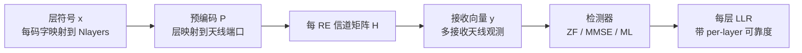

# T2.16 MIMO-OFDM：层、预编码、每 RE 信道矩阵与检测
## 本节学习目标

T2.15 讲了均衡。本节把单层 OFDM 推广到多天线、多层传输。MIMO-OFDM 的核心思想是：OFDM 先把宽带频率选择性信道拆成许多 RE；MIMO 再在每个 RE 上处理多层符号经过多天线信道后的混合。

先区分三个经常混淆的对象：

| 对象 | 含义 | 常见误解 |
|:---|:---|:---|
| 天线 | 物理发射/接收通道 | 天线数不等于可传层数。 |
| 层 | 空间复用的数据流 | 层数受信道秩和配置限制。 |
| 端口 | 参考信号和逻辑天线端口 | 端口不是一定等于物理天线。 |

- 建立每 RE 的 MIMO 基带模型。
- 解释层映射、预编码、信道矩阵和接收向量之间的关系。
- 说明 DM-RS-based 估计为什么给接收端有效信道。
- 对比 ZF、MMSE、ML/球面检测的复杂度和性能边界。
- 讲清 MIMO 检测如何输出每层 LLR。

## 前置知识检查

| 问题 | 需要达到的程度 |
|:---|:---|
| OFDM 的 RE 是什么？ | 知道每个 RE 是一个频域子载波和时域 OFDM 符号位置。 |
| 矩阵乘法代表什么？ | 知道多个输入层可以被信道矩阵混合成多个接收观测。 |
| DM-RS 有什么作用？ | 知道接收端用它估计每层或端口的有效信道。 |
| LLR 与层有什么关系？ | 知道每层调制符号最终都要变成码字级 LLR。 |

本节不要求已经掌握信息论 MIMO 容量公式，但需要理解“多层同时发送会互相混合，接收端必须分离”。如果单层均衡还不熟，先读 T2.15。

## 每 RE 的 MIMO 模型

在单层 OFDM 中，一个 RE 可写成：

$$
Y[k,l] = H[k,l]X[k,l] + N[k,l]
\tag{1}
$$

MIMO 下，标量变成向量和矩阵：

$$
\mathbf{y}[k,l]
=
\mathbf{H}[k,l]\mathbf{P}[k,l]\mathbf{x}[k,l]
+
\mathbf{n}[k,l]
\tag{2}
$$

其中：

| 符号 | 含义 |
|:---|:---|
| $\mathbf{x}$ | 层符号向量，维度为 $N_{layers}\times1$。 |
| $\mathbf{P}$ | 预编码矩阵，把层映射到天线端口。 |
| $\mathbf{H}$ | 物理信道矩阵，接收天线数 $\times$ 发射端口数。 |
| $\mathbf{y}$ | 多接收天线观测向量。 |

接收端真正用于检测的通常是有效信道：

$$
\mathbf{H}_{eff}[k,l]=\mathbf{H}[k,l]\mathbf{P}[k,l]
\tag{3}
$$

## 教学例子：2x2 MIMO 的层间混合

考虑 2 根接收天线、2 个传输层，忽略预编码后有效信道为：

$$
\mathbf{H}_{eff}
=
\begin{bmatrix}
1 & 0.3 \\
0.2 & 0.9
\end{bmatrix}
\tag{4}
$$

两个层符号为：

$$
\mathbf{x}=
\begin{bmatrix}
1\\
-1
\end{bmatrix}
\tag{5}
$$

无噪声时接收向量为：

$$
\mathbf{y}
=
\begin{bmatrix}
1 & 0.3 \\
0.2 & 0.9
\end{bmatrix}
\begin{bmatrix}
1\\
-1
\end{bmatrix}
=
\begin{bmatrix}
0.7\\
-0.7
\end{bmatrix}
\tag{6}
$$

第一根接收天线上看到的 $0.7$ 不是第一层符号本身，而是两层混合后的结果。若接收机把每根天线当成一个独立 SISO 链路，就会把层间干扰当成噪声甚至当成数据。MIMO 检测器必须使用整个 $\mathbf{H}_{eff}$ 来同时估计两层。

若两个列向量几乎平行，例如：

$$
\mathbf{H}_{eff}
\approx
\begin{bmatrix}
1 & 0.95\\
1 & 0.96
\end{bmatrix}
\tag{7}
$$

矩阵秩接近 1，两层很难分离。此时强行传两层会让第二层 post-eq SINR 很低，LLR 应该变小；若仍输出高置信 LLR，译码器会被误导。

## 深入理解：秩、奇异值和层可靠度

MIMO 信道可以通过奇异值理解。把信道分解为：

$$
\mathbf{H}=\mathbf{U}\mathbf{\Sigma}\mathbf{V}^H
\tag{8}
$$

$\mathbf{\Sigma}$ 对角线上的奇异值表示不同空间方向的强弱。大的奇异值对应强空间流，小的奇异值对应弱空间流。层数选择、预编码和 CSI 报告，本质上都在围绕这些空间方向做折中。

| 状态 | 奇异值形态 | 工程含义 |
|:---|:---|:---|
| 高秩 | 多个奇异值都大 | 可支持多层空间复用。 |
| 低秩 | 只有一个或少数奇异值大 | 更适合少层、波束成形或分集。 |
| 病态矩阵 | 最小奇异值很小 | ZF 噪声增强严重，MMSE 更稳健。 |

对 soft demapper 来说，这些空间方向最终要变成 per-layer CSI。一个层如果对应弱奇异值方向，它的 LLR 幅度应比强层小。

## 实现细节：码字、层和 LLR 顺序

MIMO 检测不仅是数学矩阵，还涉及顺序和接口：

| 步骤 | 风险 | 调试证据 |
|:---|:---|:---|
| codeword 到 layer mapping | 码字比特被分到错误层 | codeword/layer index trace。 |
| DM-RS port 到 layer | 端口顺序错 | per-port channel estimate dump。 |
| detector output order | 层输出交换 | per-layer constellation and SINR。 |
| layer 到 LLR sequence | LLR 串接顺序错 | RE/layer/bit index mapping。 |

这类错误经常不会表现为“程序崩溃”，而是 BLER 曲线完全不对。因为译码器收到的是合法长度的 LLR，只是这些 LLR 对应错了码字位置。

## 图示：MIMO-OFDM 每 RE 矩阵

图示从层符号开始，经预编码、MIMO 信道和多接收天线观测，到检测器输出每层 LLR。OFDM 的作用是把问题分解到 RE 级；MIMO 检测器的作用是把每个 RE 上混在一起的层分离出来。

## 层数、秩和天线数

MIMO 不是“天线越多，层数一定越多”。层数受信道秩限制：

$$
N_{layers} \leq \mathrm{rank}(\mathbf{H}) \leq \min(N_{tx},N_{rx})
\tag{9}
$$

如果信道矩阵低秩，例如所有发射天线路径高度相关，那么即使天线很多，也无法可靠传输很多独立层。强行提高层数会让层间干扰上升，post-eq SINR 下降，LLR 变得不可靠。

## 检测器选择

| 检测器 | 核心思想 | 优点 | 代价 |
|:---|:---|:---|:---|
| ZF | 用矩阵伪逆消除层间干扰 | 简单，吞吐好 | 弱奇异值方向噪声增强。 |
| MMSE | 把噪声方差加入矩阵权重 | 工程常用，稳健 | 仍是线性近似，有残留干扰。 |
| ML | 穷举所有星座组合最小距离 | 性能上界接近最优 | 复杂度随层数和调制阶数爆炸。 |
| 球面检测 | 在候选空间中剪枝搜索 | 接近 ML，复杂度可控一些 | 最坏复杂度仍高，硬件控制复杂。 |

对 4 层 256QAM，如果穷举 ML，需要比较 $256^4$ 个候选组合，工程上通常不可接受。因此量产接收机常以 MMSE/IRC 等线性或近似检测为主，再配合 CSI 缩放、LLR 裁剪和 HARQ 增益兜底。

## DM-RS 端口和有效信道

多层传输里，DM-RS 端口与层有紧密关系。因为 DM-RS 与对应层的数据经历相同预编码，接收端可以直接估计层域有效信道 $\mathbf{H}_{eff}$。这有两个重要含义：

1. 接收端不必把预编码矩阵 $\mathbf{P}$ 单独解出来，才能做数据检测。
2. 如果 DM-RS 端口、层顺序或资源映射处理错误，后续每层 LLR 都会错位。

## MIMO 对 LLR 的影响

单层软解调只需考虑“符号点离候选星座多远”。MIMO 软解调还要考虑层间干扰和检测器输出可靠度。对第 $i$ 层，可以抽象写成：

$$
\hat{x}_i = g_i x_i + \nu_i
\tag{10}
$$

$g_i$ 是检测后的等效增益，$\nu_i$ 包含噪声和残留层间干扰。soft demapper 应使用每层、每 RE 的等效可靠度，而不是给所有层使用同一个噪声方差。否则强层 LLR 会过弱，弱层 LLR 会过强。

## 工程检查点

| 检查项 | 应记录的证据 | 失败迹象 |
|:---|:---|:---|
| 层/端口映射 | layer index、DM-RS port、codeword 映射 | 某层 LLR 全部异常或互换。 |
| 信道矩阵维度 | `Nrx x Nlayers` 或有效信道维度 | 矩阵乘法维度错，检测器崩溃。 |
| 条件数/秩 | singular values、rank proxy | 高层数下 post-eq SINR 急降。 |
| 检测器输出 | per-layer $\hat{x}$、CSI/SINR | 层间干扰没有进入可靠度。 |
| 复杂度 | 每 RE 矩阵求逆次数、吞吐 | 高阶 MIMO 下实时性不足。 |

## 扩展讲解：验证与实现关注点

MIMO-OFDM 的验证不能只用“单层 AWGN 能过”作为证据。多层接收最容易错在维度、顺序和可靠度，而这些问题常常不会造成明显异常长度或程序错误。译码器收到的 LLR 长度可能完全正确，但每个 LLR 对应了错误的层、错误的 RE 或错误的 codeword 位置。

第一类测试是层隔离。构造 2 层或 4 层场景，每次只让一个层发送非零符号，其他层发送已知零功率或固定符号。正确接收机应只在对应层输出有效星座，其余层输出低能量或低可靠度。如果某个未发送层也出现强 LLR，说明检测矩阵、端口映射或层顺序有串扰。

第二类测试是层交换。故意交换 DM-RS port 或 detector output order，确认回归测试能失败。很多项目只测试“正确配置能过”，没有测试“层交换会失败”，因此无法防止端口顺序 bug。最小负例应记录 `dmrs_port -> layer -> codeword bit index` 的完整链路。

第三类测试是秩退化。构造从高秩到低秩的一组信道矩阵，观察 RI/层数选择、per-layer SINR 和 BLER。若低秩场景仍输出多个高可靠层，说明 CSI 估计或检测器可靠度输出过度自信。实际链路自适应会避免在低秩信道强行高层数，接收机仿真也应体现这个事实。

| 测试类型 | 输入设置 | 通过标准 |
|:---|:---|:---|
| 单层激励 | 只有 layer 0 有数据 | layer 0 LLR 有效，其他层低可靠。 |
| 端口交换负例 | 故意交换 DM-RS port | BLER 或端口一致性检查失败。 |
| 条件数扫描 | 控制信道列相关性 | 弱层 SINR 随条件数恶化。 |
| 高阶 QAM 多层 | 4 层 64/256QAM | LLR scaling 不出现系统性过强。 |
| 定点矩阵求逆 | 限定位宽 | 饱和计数和误差相对浮点可解释。 |

硬件实现中，MIMO 检测的关键代价是矩阵运算和带宽。以 4 层为例，每个数据 RE 都可能需要处理一个 4x4 相关矩阵、噪声项、求逆或分解结果，以及每层 CSI 输出。即使权重可按 PRB 或 DM-RS 邻域复用，缓存和控制仍然复杂。工程文档应明确权重复用粒度：per RE、per PRB、per symbol、还是 per DM-RS interpolation region。复用粒度越粗，复杂度越低，但快速变化信道下性能越差。

MIMO 还与 HARQ 和 rate recovery 有接口风险。多层符号经 soft demapper 后会重新串成 codeword 级 LLR 序列。如果层到码字的映射或 bit interleaving 顺序错，HARQ soft buffer 会把错误层的 LLR 合并到母码地址上。此类错误在单次传输中可能表现为 BLER 变差，在重传中会更严重，因为错误证据被重复累加。

## 调试案例库

| 案例 | 表现 | 定位步骤 | 修复方向 |
|:---|:---|:---|:---|
| layer mapping 错 | 单层激励出现在另一层 | 打印 codeword/layer/RE 映射 | 修正层映射和串接顺序。 |
| DM-RS port 错 | 信道矩阵列交换 | per-port $\hat{H}$ heatmap | 修正端口到层关系。 |
| 低秩强传多层 | 弱层 LLR 过度自信 | 看 singular value 和 per-layer SINR | 降低层数或修正 CSI。 |
| detector 近似过粗 | 高阶 QAM 下 BLER 地板 | 对比 ML/K-best 小规模 golden | 改进 LLR 近似或可靠度缩放。 |

MIMO 专题还要特别关注“局部失败”。一个 TB 里可能只有某些 PRB、某些 OFDM 符号或某一层很差。平均 BLER 只能说明结果，不能说明原因。建议把 per-layer EVM、per-layer SINR 和 per-layer LLR histogram 作为常规图表输出。若 layer 2 的 LLR 明显比其他层更激进，而其 SINR 又最低，通常说明 CSI 缩放或层排序有错。

## 资料与协议边界

| 资料 | 本节采用 | 边界 |
|:---|:---|:---|
| TS 38.211 §6.3.1.3/§7.3.1.3 | 层映射入口 | 不复现完整层映射表。 |
| TS 38.211 §6.3.1.5 | 预编码入口 | 不展开所有码本和端口配置。 |
| TS 38.214 §5.1 | 下行数据接收和 CSI 上下文 | 不复现 PMI/RI/CQI 表格。 |
| `MIMO_多天线系统` | 层、秩、信道矩阵概念 | 作为接收机工程解释材料。 |

TS 38.211 定义层映射、预编码和参考信号入口；TS 38.214 定义数据接收过程、CSI 报告、PMI/RI/CQI 等链路自适应上下文。协议不强制 UE 使用哪一种 MIMO 检测算法。ZF、MMSE、IRC、ML、球面检测、K-best 检测、LLR 近似和定点归一化都属于实现选择。

## 常见错误

| 错误 | 为什么错 | 正确做法 |
|:---|:---|:---|
| 天线数等同层数 | 低秩信道无法支撑同样多的独立层。 | 用秩、奇异值和 post-eq SINR 判断层数。 |
| 每层使用同一可靠度 | 层间干扰和信道强度不同。 | 输出 per-layer/per-RE CSI。 |
| DM-RS 端口错当物理天线 | 端口是逻辑参考信号维度。 | 从端口到层、有效信道、检测器输入统一处理。 |
| 只看检测性能不看硬件 | ML/球面检测复杂度可能不可实现。 | 把性能、复杂度、延迟和定点范围一起评估。 |

## 最小仿真矩阵

| 维度 | 建议取值 | 覆盖目的 |
|:---|:---|:---|
| 层数 | 1、2、4 | 验证层映射和检测维度。 |
| 信道秩 | 满秩、近低秩、病态 | 检查 per-layer SINR。 |
| 调制 | QPSK、64QAM、256QAM | 覆盖候选集合和 LLR 近似压力。 |
| 检测器 | ZF、MMSE、小规模 ML golden | 对比复杂度和性能。 |
| 端口负例 | 正确、交换、缺失 | 防止 DM-RS port/layer bug。 |

每个点至少保存 layer map、port map、effective H、per-layer EVM、per-layer SINR 和 codeword LLR 顺序摘要。MIMO 失败常常是顺序错误而不是数学公式错误，因此负例比正例更重要。

## 自测题

1. 为什么 MIMO-OFDM 可以看成每 RE 一个矩阵问题？
2. 层数和天线数为什么不能简单画等号？
3. $\mathbf{H}_{eff}=\mathbf{H}\mathbf{P}$ 对接收端有什么意义？
4. 为什么高阶 MIMO 下 ML 检测复杂度会爆炸？
5. per-layer CSI 为什么会影响 LLR？

## 自测题参考答案

1. OFDM 已把宽带信道分解到 RE；在每个 RE 上，多层符号经 MIMO 信道矩阵混合，需要矩阵检测。
2. 层数受信道秩限制，秩不超过发射和接收天线数的较小值。
3. 接收端可直接用 DM-RS 估计数据层看到的有效信道，不必显式恢复预编码矩阵。
4. 候选组合数随星座大小和层数指数增长，例如 4 层 256QAM 为 $256^4$。
5. 各层等效增益、残留干扰和噪声不同，LLR 幅度必须随层可靠度变化。

## 本节验收

| 验收项 | 通过标准 |
|:---|:---|
| MIMO 模型 | 能写出 $\mathbf{y}=\mathbf{H}\mathbf{P}\mathbf{x}+\mathbf{n}$。 |
| 层/秩关系 | 能解释 $N_{layers}\leq rank(H)$。 |
| 检测器 | 能对比 ZF、MMSE、ML/球面检测。 |
| LLR 接口 | 能说明 per-layer CSI 的必要性。 |
| 链路图理解 | 能按图示说明每 RE 矩阵检测和 per-layer LLR 的来源。 |

## 与相邻章节的衔接

T2.16 是 T2.15 的多层推广。T2.15 中的标量可靠度在这里变成 per-layer、per-RE 的可靠度；T2.14 中的标量信道估计在这里变成有效信道矩阵。学习时先理解单层，再理解矩阵，不要直接跳到高阶 MIMO 检测算法。

T2.16 还连接后续译码链路的码字顺序。层检测输出不是最终结果，它还要经过 soft demapper、码字重组、rate recovery 和 CB 切分。任何 layer/codeword 顺序错误都会在 T3+ 中表现为译码失败。T2.19 会把这类错误统一归入 LLR 语义错误。

## 执行与证据记录

| 项目 | 记录 |
|:---|:---|
| 本地材料 | 使用 `rg` 定位 TS 38.211 §6.3.1.3、§6.3.1.5、§7.3.1.3，并读取概念笔记 `MIMO_多天线系统`、`MMSE_均衡`。 |
| 图解材料 | 本节使用 Markdown 内嵌 Mermaid 概念图，不再依赖外部 SVG 资产。 |
| 图解边界 | 图示只表达 MIMO-OFDM 接收链路，不复现 PMI/RI/CQI 表格。 |
| 证据边界 | 本节讲 MIMO-OFDM 接收机模型，不复现 TS 38.214 PMI/RI/CQI 表格。 |

## 参考文献

- [3GPP, 2026] 3GPP TS 38.211, Rel-19, `38211-j30`, Physical channels and modulation, §6.3.1.3, §6.3.1.5, §7.3.1.3. Local path: `3GPP_Rel19/processed/TS_38.211_38211-j30`.
- [3GPP, 2026] 3GPP TS 38.214, Rel-19, `38214-j30`, Physical layer procedures for data, §5.1. Local path: `3GPP_Rel19/processed/TS_38.214_38214-j30`.
- 项目概念笔记：`3gpp/docs/concepts/MIMO_多天线系统.md`，`3gpp/docs/concepts/MMSE_均衡.md`。
