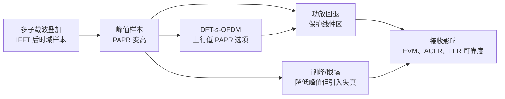

# T2.17 OFDM PAPR：峰均功率比、功放回退与发射端失真
## 本节学习目标

前面 T2.12–T2.16 主要在讲接收端。本节回到发射端：OFDM 的 IFFT 把许多子载波相加，时域波形会出现高峰值。峰均功率比（Peak-to-Average Power Ratio, PAPR）高，会迫使功放保持较大线性余量；如果余量不足，功放非线性或削峰会污染星座和频谱。

本节回答一个常被忽略的问题：PAPR 是发射端问题，为什么最终也会影响译码器 LLR？

- 定义 PAPR 并解释 OFDM 为什么天然容易高 PAPR。
- 说明功放回退、效率、EVM 和 ACLR 的关系。
- 对比削峰、滤波、预失真和 DFT-s-OFDM 的基本思路。
- 解释发射端非线性如何变成接收端 LLR 失真。
- 明确 NR 下 CP-OFDM 和 DFT-s-OFDM 的波形边界。

## 前置知识检查

| 问题 | 需要达到的程度 |
|:---|:---|
| IFFT 输出是什么？ | 知道它是多个子载波复指数叠加后的时域采样。 |
| 功放为什么有线性区？ | 知道真实 PA 不能无限按比例放大，过大输入会饱和。 |
| EVM 是什么？ | 知道它衡量接收/发射星座点相对理想位置的误差。 |
| LLR 幅度代表什么？ | 知道幅度越大表示 soft demapper 越确信。 |

如果还没有建立“发射端波形质量会影响接收端软信息”的意识，先回到 T2.0 的 OFDM 工程问题地图。PAPR 本身不在译码器里，但它会通过 PA 非线性改变译码器输入。

## PAPR 的定义

离散时域 OFDM 样本为 $x[n]$。PAPR 定义为峰值功率与平均功率之比：

$$
\mathrm{PAPR}
=
\frac{\max_n |x[n]|^2}{E[|x[n]|^2]}
\tag{1}
$$

用 dB 表示：

$$
\mathrm{PAPR}_{dB}=10\log_{10}(\mathrm{PAPR})
\tag{2}
$$

OFDM 高 PAPR 的根源是多子载波相加。当许多子载波相位在某个时刻接近同向，瞬时样本幅度会远高于平均值。虽然这种峰值不常出现，但功放必须为它留出线性余量。

## 图示：PAPR 影响链



图示的主线是多子载波叠加 → 峰值样本 → 功放回退 → 接收影响。下方两条支路说明了两类缓解：削峰/限幅可以降低峰值但会引入失真；DFT-s-OFDM 可以降低上行波形 PAPR，减轻 UE 功放压力。

## 功放回退的必要性

理想线性功放满足：

$$
y(t)=Gx(t)
\tag{3}
$$

真实功放有饱和区。当输入峰值超过线性范围时，输出不再按比例放大，等效为：

$$
y(t)=Gx(t)+d(t)
\tag{4}
$$

$d(t)$ 是非线性失真。它有两类后果：

| 后果 | 含义 | 接收端影响 |
|:---|:---|:---|
| 带内失真 | 星座点偏移、压缩、旋转 | EVM 增大，LLR 不可靠。 |
| 带外再生 | 频谱泄漏到邻道 | ACLR 恶化，干扰其他系统。 |

为了避免进入饱和区，发射机降低平均输出功率，让峰值仍在功放线性范围内，这叫功放回退（backoff）。回退越大，线性越安全，但效率越低，尤其对 UE 电池和热设计不利。

## OFDM 高 PAPR 的成因

单载波波形每个时刻主要由一个符号脉冲决定；OFDM 时域样本是多个子载波复指数的和：

$$
x[n]=\frac{1}{\sqrt{N}}\sum_{k=0}^{N-1}X_k e^{j2\pi kn/N}
\tag{5}
$$

如果 $X_k$ 的相位组合刚好同向，峰值可能随 $N$ 增加而明显变大。实际峰值概率用 CCDF（Complementary Cumulative Distribution Function）描述，例如：

$$
P(\mathrm{PAPR} > z)
\tag{6}
$$

链路设计不会只看平均 PAPR，而会看“超过某个峰值门限的概率”。

## 教学例子：四个子载波同相叠加

先看一个极简手算例子。假设只有 4 个子载波，且某个采样时刻四个复指数相位都刚好为 0，同时四个频域符号都是 $1$。采用 $1/\sqrt{N}$ 归一化：

$$
x[n_0]=\frac{1}{\sqrt{4}}(1+1+1+1)=2
\tag{7}
$$

瞬时功率为：

$$
|x[n_0]|^2=4
\tag{8}
$$

而若平均功率归一化到 1，则该时刻 PAPR 为：

$$
\mathrm{PAPR}=4,\qquad \mathrm{PAPR}_{dB}=10\log_{10}4\approx 6.02\ \mathrm{dB}
\tag{9}
$$

这个例子只有 4 个子载波，已经能出现 6 dB 峰均比。真实 NR 载波可能有数百到数千个有效子载波，虽然“全部同相”的概率很小，但“很多子载波局部同向”的峰值仍会以小概率出现。功放必须面对这些低概率高峰，而不能只按平均功率设计。

进一步考察削峰的影响。若把 $|x|>1.5$ 的样本都限制到 1.5，上述 $x=2$ 的样本会被限制为 1.5。峰值降低了，但误差为：

$$
d = 1.5 - 2 = -0.5
\tag{10}
$$

这个误差不是 AWGN，它和信号本身相关。经过 FFT 后，它会散布到多个子载波，表现为星座点偏移和带外再生。接收端若不知道这部分失真，只按热噪声方差计算 LLR，就可能把受削峰污染的符号当成高可信观测。

## 深入理解：PAPR、EVM、ACLR 和 BLER 的联合验收

PAPR 优化不能只看单个指标。下面四个指标经常相互牵制：

| 指标 | 目标 | 和其他指标的冲突 |
|:---|:---|:---|
| PAPR | 降低峰值，减小 PA backoff | 过度削峰会增大 EVM。 |
| EVM | 保持星座点接近理想位置 | 过强滤波或削峰会恶化。 |
| ACLR/OOB | 降低带外泄漏 | 削峰后必须滤波，滤波可能带来时延和峰值再生。 |
| BLER | 译码端最终性能 | EVM 相同但 LLR scaling 不同，BLER 也可能不同。 |

工程报告应把这四者放在同一页，而不是分别散落在 RF、PHY 和 decoder 文档里。对译码链路而言，最关键的是：PA 或削峰造成的误差是否已被前端等效为合理的噪声/CSI，还是被错误地当作高可信星座偏移。

## 常见缓解方法

| 方法 | 思路 | 风险 |
|:---|:---|:---|
| 功放回退 | 降低平均功率，保证峰值在线性区 | 效率低、覆盖变差。 |
| 削峰/限幅 | 直接限制峰值样本幅度 | 带内 EVM 和带外泄漏。 |
| 削峰后滤波 | 滤掉带外再生 | 峰值可能重新增长。 |
| 数字预失真 | 预先施加反向非线性 | 需要 PA 模型和校准。 |
| DFT-s-OFDM | IFFT 前做 DFT spreading，形成更像单载波的上行波形 | 资源映射和接收处理不同。 |

NR 上行支持 CP-OFDM 和 DFT-s-OFDM。DFT-s-OFDM 的重要工程动机之一就是降低 PAPR，减轻 UE 功放压力。下行基站供电和散热条件更好，通常更容易承受 CP-OFDM 的 PAPR 代价。

## PAPR 如何进入 LLR

PAPR 本身不会直接出现在译码器接口。它通过发射失真影响接收符号：

```text
高 PAPR -> PA 非线性/削峰 -> EVM 增大和带外泄漏
         -> 均衡后星座点偏移或扩散 -> LLR 幅度/符号错误
```

如果接收端仍按纯 AWGN 或理想线性发射假设计算 LLR，就会把失真当成随机噪声之外的“未建模误差”。这类误差可能不是独立高斯，导致译码器看到的 LLR 过度自信。

## 工程检查点

| 检查项 | 应记录的证据 | 失败迹象 |
|:---|:---|:---|
| PAPR CCDF | 门限和超过概率 | 峰值概率超出 PA 预算。 |
| PA backoff | 平均功率回退量 | EVM 和效率无法同时满足。 |
| EVM | 调制阶数对应 EVM | 高阶 QAM BLER 异常。 |
| ACLR/OOB | 邻道泄漏指标 | 削峰后频谱再生。 |
| LLR 统计 | clip 计数、LLR 分布 | 过多极值或可靠度失配。 |

## 扩展讲解：验证与实现关注点

PAPR 验证的第一层是波形统计。不要只报告一个最大峰值，因为最大峰值依赖仿真长度和随机种子。更稳定的做法是报告 CCDF，例如 PAPR 超过 6 dB、8 dB、10 dB 的概率。不同调制阶数、PRB 数、资源映射、DM-RS 插入和窗口函数都会改变 PAPR 分布；因此 PAPR 测试应覆盖窄带、小 PRB、大带宽、满载和稀疏资源几类场景。

第二层是 PA 模型。若只在数字基带里削峰，而不加入 PA AM/AM、AM/PM 或饱和模型，就很难评估真实发射失真。简化仿真可先使用软限幅或 Rapp 模型，把输入幅度映射到非线性输出；更完整的 RF 验证还要加入数字预失真、功放记忆效应和温度漂移。本项目的译码主线不需要展开 PA 物理细节，但必须承认 PA 非线性会改变 LLR 前端假设。

第三层是接收端后果。PAPR 优化后应同时看 equalized constellation、per-PRB EVM、post-eq SINR 和 LLR histogram。如果削峰主要污染峰值附近的时域样本，FFT 后误差会扩散到多个子载波；如果滤波用于抑制带外再生，边缘 PRB 的 EVM 可能更敏感。只看总体 BLER 会掩盖这些局部特征。

| 验证项 | 推荐记录 | 说明 |
|:---|:---|:---|
| PAPR CCDF | 多门限超过概率 | 比单个最大值更稳定。 |
| clip ratio | 被限幅样本比例 | 连接 PAPR 降低和失真强度。 |
| EVM per PRB | 频域分桶 | 暴露边缘滤波和削峰扩散。 |
| ACLR/OOB | 邻道泄漏 | 验证削峰后滤波是否足够。 |
| LLR histogram | 分调制阶数/层 | 观察非线性是否造成过度自信。 |

DFT-s-OFDM 需要单独建立基线。它降低 PAPR 的同时改变了发送链路中的处理顺序，接收端也不能把它完全当作普通 CP-OFDM 来解释。上行链路中，UE 功放能力、覆盖需求和 PAPR 约束更强，因此 DFT-s-OFDM 的工程意义很突出。学习时要把“PAPR 改善”与“资源映射和接收处理改变”同时记录。

对定点/RTL，PAPR 还会影响数模转换前的数字峰值范围。IFFT 输出、加窗、削峰、数字预失真和 crest factor reduction 模块之间要统一定点缩放，否则可能在进入 PA 前已经发生数字饱和。数字饱和和模拟 PA 饱和对接收端都表现为失真，但调试路径不同：前者看基带波形日志，后者看 RF/PA 模型输出。

## 调试案例库

| 案例 | 表现 | 定位步骤 | 修复方向 |
|:---|:---|:---|:---|
| 数字削峰过强 | PAPR 降低但 BLER 变差 | 比较 clip ratio、EVM、LLR histogram | 降低削峰强度或改进削峰后滤波。 |
| PA backoff 不足 | 高功率时 EVM 突然恶化 | 扫输出功率并记录 PA 输入峰值 | 增加 backoff 或启用 DPD。 |
| 滤波后峰值再生 | ACLR 改善但 PAPR 回升 | 比较滤波前后 CCDF | 迭代削峰-滤波或改窗函数。 |
| DFT-s-OFDM 接口错 | 上行 PAPR 正常但解调错 | 对比 transform precoding on/off | 修正资源映射和接收端假设。 |

PAPR 的负例要覆盖不同资源占用。满带连续 PRB 通常更接近典型 OFDM 高 PAPR；少量 PRB 或稀疏映射可能出现不同峰值统计；带 DM-RS、PTRS 和控制信道 puncturing 后，时域相位组合也会改变。若测试只用一个随机满载 slot，无法证明 crest factor reduction 对真实调度集合都稳定。

还要注意高阶调制的敏感性。QPSK 下，削峰造成的星座偏移可能仍离判决边界较远；256QAM 下，星座点间距小得多，同样 EVM 可能直接造成 bit LLR 翻转。工程报告应按调制阶数分组，而不是用一个“平均 EVM 通过”覆盖所有 MCS。

对 LLR 来说，PA 非线性还有一个麻烦：误差可能与信号相关，而不是独立高斯。削峰误差集中在高峰值样本，FFT 后在频域呈现有结构的污染。soft demapper 若仍只使用热噪声方差，容易输出过度自信 LLR。一个保守做法是在 PA/clip 模型开启时，用 EVM 或 residual error 估计额外噪声项，并观察 BLER 是否更贴近真实曲线。

最后，PAPR 优化必须有版本化证据。每次改变削峰阈值、滤波器、DPD 或 backoff，都应记录随机种子、资源分配、调制阶数、PAPR CCDF、EVM、ACLR 和 BLER。否则不同团队很容易各自拿一组指标证明“优化有效”，系统集成时却发现覆盖、频谱和译码性能不能同时满足。

## 资料与协议边界

| 资料 | 本节采用 | 边界 |
|:---|:---|:---|
| TS 38.211 §5.3 | NR OFDM 基带信号生成入口 | 不复现完整波形公式和采样率参数。 |
| TS 38.211 上行物理信道入口 | DFT-s-OFDM/transform precoding 的背景 | 不展开 PUSCH 全部映射规则。 |
| T2.0 | PAPR 位于发射端 IFFT 后的工程问题地图 | 本节展开工程代价，不替代 RF 一致性测试。 |
| T2.11 | LLR 裁剪/量化接口 | 本节只说明发射失真如何进入 LLR，不重新讲定点译码器。 |

TS 38.211 定义 NR 的 OFDM 基带信号生成以及上行变换预编码相关入口。协议规定可互操作的波形和资源映射；具体 PA 模型、削峰算法、预失真、回退策略和 LLR 失真建模属于实现和射频设计。

## 常见错误

| 错误 | 为什么错 | 正确做法 |
|:---|:---|:---|
| PAPR 只影响发射机，不影响译码 | 发射失真会改变接收星座和 LLR。 | 把 EVM/PA 模型纳入链路仿真。 |
| 削峰只会改善系统 | 削峰降低峰值但制造失真。 | 同时检查 PAPR、EVM 和 ACLR。 |
| 回退越大越好 | 回退降低效率和覆盖。 | 在功耗、覆盖和误码性能间折中。 |
| 用 AWGN 曲线代表真实 PA | AWGN 不包含非线性失真。 | 增加 PA/clip 模型做敏感性分析。 |

## 最小仿真矩阵

| 维度 | 建议取值 | 覆盖目的 |
|:---|:---|:---|
| 资源占用 | 少 PRB、半载、满载 | 覆盖不同 PAPR 统计。 |
| 波形 | CP-OFDM、DFT-s-OFDM | 对比上行低 PAPR 选项。 |
| PA 模型 | 理想、软限幅、Rapp/AM-AM | 分离线性和非线性损失。 |
| 削峰阈值 | 关闭、温和、激进 | 观察 PAPR/EVM/ACLR 折中。 |
| 调制 | QPSK、64QAM、256QAM | 检查高阶调制敏感性。 |

每个点至少保存 PAPR CCDF、clip ratio、PA input/output power、EVM per PRB、ACLR/OOB、LLR histogram 和 BLER。PAPR 专题的通过标准不是“峰值降了”，而是峰值、频谱、星座和译码性能同时可解释。

## 自测题

1. PAPR 的数学定义是什么？
2. 为什么多子载波相加会产生高峰值？
3. 功放回退解决什么问题，代价是什么？
4. 削峰为什么会同时影响 EVM 和 ACLR？
5. PAPR 如何间接影响译码器输入 LLR？

## 自测题参考答案

1. 峰值功率除以平均功率，$\max |x[n]|^2/E[|x[n]|^2]$。
2. IFFT 输出是许多子载波相量之和，某些时刻相位同向会形成大峰值。
3. 保证峰值仍在 PA 线性区；代价是平均输出功率和效率降低。
4. 限幅是非线性操作，会产生带内星座失真和带外频谱再生。
5. PAPR 导致 PA 非线性或削峰，接收星座偏移/扩散，soft demapper 输出的 LLR 可靠度失配。

## 本节验收

| 验收项 | 通过标准 |
|:---|:---|
| PAPR 定义 | 能写出式 (1) 和 dB 换算。 |
| OFDM 成因 | 能用 IFFT 求和解释高峰值。 |
| PA 权衡 | 能说明 backoff、EVM、ACLR 和效率关系。 |
| LLR 链路 | 能把发射失真接到接收端 LLR。 |
| 链路图理解 | 能按图示说明 PAPR、PA backoff、削峰和 LLR 质量之间的关系。 |

## 与相邻章节的衔接

T2.17 从发射端补齐 OFDM 工程问题。T2.12–T2.16 主要假设接收符号来自线性信道和噪声；T2.17 提醒读者，发射端 PA 非线性、削峰和数字饱和会在信号进入无线信道之前改变波形。接收机看到的误差未必都是 AWGN 或衰落。

它和 T2.18 的关系也很紧：削峰降低峰值后常需要滤波抑制带外再生，滤波又可能带来峰值再生、群时延和边缘 EVM。二者共同决定发射波形质量，并在 T2.19 中折叠成 LLR 可靠度。学习时应将 PAPR 视为从发射端传播到译码器输入的一条非线性误差链。

工程验收时，PAPR 优化不能只依据单一指标判定。一个削峰方案如果只降低 PAPR，却让 256QAM 的 EVM 或 BLER 恶化，就不是系统收益。一个 backoff 策略如果只保护 EVM，却让平均发射功率过低，也会损失覆盖。面向译码链路的记录应明确：本次 PAPR/PA 设置下，soft demapper 使用的噪声或 CSI 是否足以覆盖非线性误差。

实际项目还应把随机种子固定。PAPR 是统计指标，不同数据负载会产生不同峰值。没有固定 seed、资源分配和 MCS 的对比，很难判断两次 PAPR 曲线差异来自算法修改还是随机样本差异。

报告中还要写明观测点：IFFT 输出、加窗后、削峰后、滤波后、DPD 后和 PA 输出的 PAPR 不是同一个指标。若只记录最终 PA 输出，无法判断峰值控制发生在数字链路还是模拟链路；若只记录 IFFT 输出，又无法说明真实发射失真。

日志字段建议固定为：`papr_db`、`ccdf_threshold`、`clip_ratio`、`backoff_db`、`evm_rms`、`aclr_left/right`、`pa_model_id`、`mcs`。这些字段能把 PAPR 优化和译码性能放到同一证据链里。

还要区分 burst 内峰值和长期 CCDF。调度器、DM-RS 位置、PTRS 开销和空 PRB 会改变时域叠加统计；只用一帧或一种满载图样验收，容易低估真实业务下的峰值尾部风险。

## 执行与证据记录

| 项目 | 记录 |
|:---|:---|
| 本地材料 | 使用 `rg` 定位 TS 38.211 §5.3 OFDM baseband signal generation，并参考 T2.0 对 PAPR 的工程问题地图。 |
| 图解材料 | 本节使用 Markdown 内嵌 Mermaid 概念图，不再依赖外部 SVG 资产。 |
| 图解边界 | 图示只表达 PAPR 到译码质量的误差链，不复现射频一致性测试流程。 |
| 证据边界 | 本节讲 PAPR 和 PA 工程模型，不复现射频一致性测试指标表。 |

## 参考文献

- [3GPP, 2026] 3GPP TS 38.211, Rel-19, `38211-j30`, Physical channels and modulation, §5.3. Local path: `3GPP_Rel19/processed/TS_38.211_38211-j30`.
