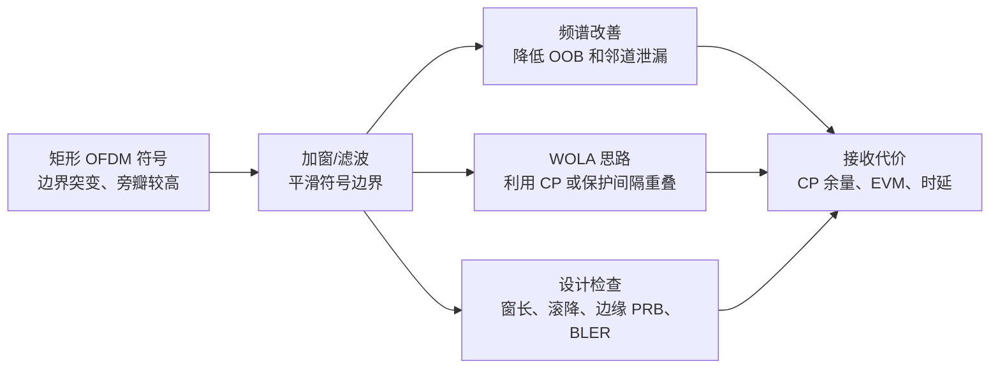

# T2.18 OFDM 窗口函数与滤波：频谱旁瓣、保护间隔与 EVM 折中
## 本节学习目标

理想 OFDM 符号在时域常被看成“矩形截断”：一个有用符号区间加上 CP，符号边界突然开始、突然结束。矩形窗在频域会产生较高旁瓣，带外泄漏可能影响邻道或相邻 numerology。窗口函数和滤波用于改善频谱，但它们不是免费的。

- 解释矩形窗为什么带来频谱旁瓣。
- 说明窗口、WOLA 和滤波的基本思路。
- 讲清频谱改善与 CP 保护、EVM、时延之间的折中。
- 区分发射端窗口/滤波与接收端 FFT 窗口。
- 明确协议波形定义和实现滤波策略的边界。

## 前置知识检查

| 问题 | 需要达到的程度 |
|:---|:---|
| OFDM 符号边界是什么？ | 知道 CP + 有用符号构成一个时域 OFDM 符号。 |
| 频谱旁瓣是什么？ | 知道主带外侧仍可能有非零能量。 |
| CP 保护什么？ | 知道 CP 用于吸收多径尾巴并维持 FFT 窗口循环性。 |
| EVM 与 LLR 有何关系？ | 知道星座误差越大，soft demapper 越难给准 LLR。 |

本节的重点不是设计某个最优窗函数，而是建立谱整形和解调质量之间的工程折中。窗口函数能降低旁瓣，但它不能违反 T2.12 的 FFT 窗口和 CP 保护逻辑。

## 矩形窗的频谱直觉

一个有限长度 OFDM 符号可看成无限长信号乘以矩形窗：

$$
x_{\mathrm{tx}}(t)=x(t)w_{\mathrm{rect}}(t)
\tag{1}
$$

时域乘法对应频域卷积。矩形窗的频谱是 sinc 形状，有明显旁瓣。因此即使子载波在有用符号区间内正交，整个发射波形的频谱边缘仍可能有带外泄漏。

窗口函数的直觉是把边界从“硬切”改成“平滑过渡”。边界越平滑，高频分量越少，旁瓣越低。

## 图示：窗口与滤波的权衡



图示的主线是矩形 OFDM 符号 → 加窗/滤波 → 频谱改善 → 接收代价。下方 WOLA 支路说明通过重叠加窗利用 CP 或保护间隔吸收过渡；设计检查支路提醒必须同时验收窗长、滚降、邻道指标、EVM 和时延。

## WOLA 的基本思想

WOLA（Weighted Overlap and Add）把相邻 OFDM 符号边界做平滑过渡。简化理解是：

1. 给每个 OFDM 符号乘一个边缘平滑的窗。
2. 相邻符号在边界处重叠一小段。
3. 重叠段相加后形成连续过渡，降低频谱旁瓣。

工程关键是重叠段不能破坏接收端可用的 CP 保护。如果窗长过大，有效保护间隔变短，多径保护能力下降。窗口设计必须和最大时延扩展、FFT 窗口位置和 numerology 一起看。

## 教学例子：窗长消耗 CP 余量

假设一个 OFDM 配置有：

| 参数 | 数值 | 含义 |
|:---|---:|:---|
| $N_{CP}$ | 72 samples | CP 长度。 |
| 最大多径时延 | 50 samples | 信道尾巴长度。 |
| 窗口过渡段 | 12 samples | 发射加窗占用的边界过渡。 |

若不加窗，CP 剩余余量约为：

$$
72-50=22\ \text{samples}
\tag{2}
$$

若加窗过渡段占用 12 个采样，保守理解下有效余量变为：

$$
72-50-12=10\ \text{samples}
\tag{3}
$$

这仍可能工作，但对定时误差、滤波器群时延和信道变化的容忍度明显下降。如果窗长增到 24 samples，余量变成负数：

$$
72-50-24=-2\ \text{samples}
\tag{4}
$$

此时频谱旁瓣可能更好，但多径尾巴已经无法完全被 CP 吸收，接收端 FFT 窗口会出现 ISI/ICI。这个例子说明，窗口函数不能只由频谱指标决定。

## 深入理解：频域边缘和 numerology 共存

窗口/滤波特别影响频带边缘。边缘 PRB 离相邻载波、保护带或另一种 numerology 更近，因此更容易受到谱泄漏和滤波滚降影响。

| 场景 | 风险 | 检查方式 |
|:---|:---|:---|
| 载波边缘 PRB | 滤波滚降造成幅度/相位畸变 | per-PRB EVM、equalized constellation。 |
| 混合 numerology 邻接 | 不同 SCS 子载波边界不完全对齐 | 邻带泄漏、inter-numerology interference。 |
| 窄 BWP | 滤波过渡带占比变大 | BWP 内边缘 RE 的 SINR。 |
| 高阶 QAM | 星座间距小，EVM 容忍度低 | BLER vs EVM 联合曲线。 |

对译码链路而言，最危险的是“平均 EVM 通过，但边缘 PRB LLR 很差”。因此测试报告应按频域位置分桶，而不只给一个全带平均值。

## 实现细节：发射滤波和接收窗的分工

发射端加窗/滤波主要服务频谱模板和邻道共存；接收端 FFT 窗口主要服务符号正交性。两者可能配合，但不是同一个变量。

| 项目 | 发射端窗口/滤波 | 接收端 FFT 窗口 |
|:---|:---|:---|
| 控制对象 | 发射波形边界和带外能量 | 送入 FFT 的有用采样区间。 |
| 优化目标 | OOB、ACLR、EVM、PA 友好性 | ISI/ICI 最小、信道估计稳定。 |
| 错误后果 | 频谱泄漏、星座扭曲、时延增加 | 当前符号被相邻符号污染。 |
| 日志字段 | window length、filter taps、roll-off | fft_start、timing_offset、CP margin。 |

把这两个窗口混为一谈，会导致错误修复。例如 BLER 差时盲目缩短接收 FFT 窗口没有意义；若根因是发射滤波边缘失真，应检查 TX waveform 和 EVM。

## 滤波与窗口的区别

| 方法 | 操作位置 | 优点 | 风险 |
|:---|:---|:---|:---|
| 加窗 | 符号边界平滑 | 简单，适合控制旁瓣 | 消耗 CP/保护间隔。 |
| 子带滤波 | 对一段频带做滤波 | 可改善邻带泄漏 | 滤波器时延和边缘 EVM。 |
| F-OFDM/UFMC 类思路 | 按子带或资源块组滤波 | 支持异构 numerology 共存 | 实现复杂，接收机假设变化。 |
| 接收窗 | 接收端选择或加权 FFT 输入 | 抑制部分泄漏/干扰 | 可能改变噪声和正交性。 |

本节不把这些波形变体写成 NR 强制特性。NR 的互操作核心仍是 TS 38.211 定义的物理信道、资源网格和 OFDM 基带信号；具体发射机谱整形策略属于实现约束和射频指标的一部分。

## 频谱和解调质量的折中

窗口/滤波有两个方向的收益：

| 收益 | 说明 |
|:---|:---|
| 降低 OOB | 减少带外泄漏，减轻邻道干扰。 |
| 改善共存 | 不同 numerology 或相邻载波之间更容易满足频谱约束。 |

同时也有代价：

| 代价 | 说明 |
|:---|:---|
| 有效 CP 缩短 | 边界重叠或滤波尾巴占用保护区。 |
| EVM 增加 | 滤波不理想会扭曲边缘子载波或符号。 |
| 时延增加 | 滤波器阶数越高，群时延和缓存越大。 |
| 实现复杂 | 需要额外乘法、状态缓存和边界控制。 |

工程设计不能只展示频谱图改善，还要同步展示 EVM、BLER、ACLR/OOB 和时延。

## 对 LLR 的影响

窗口/滤波通过两条路径影响 LLR：

```text
频谱整形过强 -> 星座点偏移/边缘子载波失真 -> LLR 距离计算失真
有效 CP 缩短 -> 多径尾巴进入 FFT 窗口 -> ISI/ICI -> LLR 可靠度下降
```

这也是为什么 T2.18 必须放在 PAPR 之后、误差到 LLR 之前。发射端波形质量不是“频谱图好看就结束”，它最终要回到接收端 soft demapper 的输入模型。

## 工程检查点

| 检查项 | 应记录的证据 | 失败迹象 |
|:---|:---|:---|
| 窗长/滚降 | window length、roll-off | CP 余量不足或边缘符号污染。 |
| 频谱泄漏 | PSD、OOB、ACLR | 邻道指标不满足。 |
| EVM | 分子载波/分层统计 | 频带边缘 EVM 高。 |
| BLER | window on/off 对比 | 频谱改善但译码性能退化。 |
| 实现代价 | 乘法数、延迟、缓存 | 无法满足实时或功耗。 |

## 扩展讲解：验证与实现关注点

窗口/滤波的验证需要同时覆盖频谱域和解调域。频谱域看 PSD、OOB、ACLR 或邻带泄漏；解调域看 EVM、post-eq SINR、LLR 分布和 BLER。两套指标必须成对出现，因为窗口参数可能让频谱明显改善，却让边缘 PRB 或高阶 QAM 的星座质量变差。

第一类测试是窗长 sweep。固定信道和调制阶数，逐步增加窗口过渡段，记录 OOB 改善和 BLER 损失。预期现象是：小窗长时 OOB 改善有限但 EVM 损失小；窗长增大后 OOB 继续改善，但有效 CP 余量降低，EVM 和 BLER 开始恶化。若曲线没有这个折中形态，要检查窗口是否真的生效，或 EVM 统计是否覆盖了边缘子载波。

第二类测试是多径时延 sweep。固定窗口，逐步增加 TDL 信道的最大时延扩展。若窗口占用了 CP 余量，多径越长，ISI/ICI 越容易出现。这个测试能把“窗口本身造成的星座失真”和“窗口缩短 CP 余量造成的多径污染”区分开。

第三类测试是邻带共存。把相邻 BWP、相邻载波或不同 numerology 放在频谱边缘，观察窗口/滤波是否降低泄漏，同时检查目标链路和邻链路 EVM。真正的谱整形方案不能只保护自己，也要减少对邻道的伤害。

| 测试 | 扫描参数 | 主要观察 |
|:---|:---|:---|
| 窗长 sweep | 过渡段长度 | OOB 改善 vs BLER 损失。 |
| 多径 sweep | 最大时延扩展 | 有效 CP 余量是否不足。 |
| 边缘 PRB | PRB 频域位置 | 滤波滚降造成的局部 EVM。 |
| 邻带共存 | 相邻 numerology/载波间隔 | inter-numerology interference。 |
| 定点滤波 | 系数位宽和内部累加位宽 | 量化噪声和溢出。 |

滤波器实现还要关注群时延。发送端滤波会让波形尾巴变长；接收端滤波会改变采样对齐和噪声颜色。如果仿真里加了滤波但没有同步更新定时对齐，可能把滤波器时延误判成定时错误。工程日志应记录 filter delay compensation，并在 T2.12 的 `fft_start` 计算中扣除固定群时延。

窗口函数还影响噪声假设。接收窗会对采样加权，使 FFT 后噪声不再严格保持各子载波同方差、互不相关的理想 AWGN 模型。多数接收机仍使用近似噪声方差计算 LLR，但在高干扰或强窗口下，需要通过 EVM、SINR 或仿真校准修正可靠度。

## 调试案例库

| 案例 | 表现 | 定位步骤 | 修复方向 |
|:---|:---|:---|:---|
| 窗长过大 | OOB 好但 BLER 差 | sweep 窗长并看 CP margin | 缩短窗或调整重叠区域。 |
| 边缘 PRB 失真 | 频带边缘 EVM 高 | per-PRB EVM heatmap | 调整滤波器过渡带或保护带。 |
| 群时延未补偿 | 同步起点固定偏移 | 关闭滤波对比 fft_start | 在同步链路补偿 filter delay。 |
| 接收窗噪声失配 | LLR 分布异常 | 比较 window on/off 噪声估计 | 修正等效噪声/CSI 缩放。 |

窗口/滤波还要和 numerology 一起验证。15 kHz SCS 的符号长、CP 相对长，对窗口过渡的容忍度可能高一些；60 kHz 或 120 kHz SCS 的符号更短，窗口占比变大，时延和 CP 余量问题更突出。同一套窗参数不能无条件复制到所有 numerology。工程表格应按 $\mu$ 分别列出窗长、CP 余量、EVM 和 OOB。

混合 numerology 场景尤其容易误判。如果两个相邻 BWP 使用不同 SCS，边界处干扰既可能来自矩形窗旁瓣，也可能来自调度保护带不足、滤波器过渡带不足或接收端同步假设不同。正确调试顺序是先固定单 numerology 验证窗口，再加入邻带，最后加入动态调度和不同功率差。

对实现而言，滤波器系数位宽和累加位宽同样重要。一个浮点滤波器可能频谱很好，定点化后却因系数量化产生旁瓣抬升；内部累加位宽不足会造成溢出或隐性饱和。定点验证应比较浮点输出、定点输出、频谱差异和 EVM 差异，而不是只检查系数表被正确加载。

本节的核心工程结论是：窗口/滤波是“系统折中旋钮”，不是单独的美化模块。它连接射频频谱、OFDM 正交性、同步余量、信道估计、soft demapper 和最终 BLER。任何文档只写“加窗降低旁瓣”都是不完整的。

## 资料与协议边界

| 资料 | 本节采用 | 边界 |
|:---|:---|:---|
| TS 38.211 §5.3 | OFDM 基带信号生成入口 | 不声明某种窗口函数为 NR 强制实现。 |
| T2.12 | FFT 窗口和 CP 容差 | 用于解释窗口消耗 CP 余量的风险。 |
| T2.17 | PAPR 和发射端失真 | 用于说明发射波形质量会影响 LLR。 |
| T2.19 | 前端误差到 LLR | 本节的失真链最终在那里收束。 |

TS 38.211 定义 OFDM 基带信号生成和资源映射。协议没有要求接收端必须知道发射机内部的具体加窗或滤波实现；但发射机必须满足频谱、EVM 和互操作要求。接收机若使用额外接收窗或干扰抑制滤波，也属于实现自由度。

## 常见错误

| 错误 | 为什么错 | 正确做法 |
|:---|:---|:---|
| 窗口越长越好 | 过长会消耗 CP 并增加 EVM。 | 用 OOB/EVM/BLER 联合选择窗长。 |
| 只看频谱不看译码 | 频谱改善可能换来 LLR 退化。 | 同时记录 BLER 和 LLR 统计。 |
| 混淆发射窗和 FFT 窗口 | 一个用于谱整形，一个用于接收解调。 | 分别记录 TX window 和 RX FFT start。 |
| 忽略边缘子载波 | 滤波最容易影响频带边缘。 | 分 PRB/子载波统计 EVM 和 SINR。 |

## 最小仿真矩阵

| 维度 | 建议取值 | 覆盖目的 |
|:---|:---|:---|
| 窗长 | 关闭、短窗、中窗、长窗 | 找到 OOB 与 BLER 的折中点。 |
| numerology | $\mu=0,1,2$ | 检查窗长相对 CP 的占比。 |
| 多径 | 短时延、中时延、长时延 | 验证有效 CP 余量。 |
| 频域位置 | 中心 PRB、边缘 PRB | 暴露滤波滚降影响。 |
| 邻带 | 无邻带、同 SCS、异 SCS | 验证共存和泄漏。 |

每个点至少保存 PSD/OOB、EVM heatmap、filter delay compensation、CP margin、LLR histogram 和 BLER。窗口/滤波是跨 RF 和基带的折中，不能只由单一频谱指标验收。

## 自测题

1. 为什么矩形 OFDM 符号会产生频谱旁瓣？
2. WOLA 的基本操作是什么？
3. 窗口函数为什么会消耗 CP 余量？
4. 为什么频谱改善不能单独作为通过证据？
5. 窗口/滤波如何影响 LLR？

## 自测题参考答案

1. 有限长矩形截断在频域对应 sinc 形状，旁瓣较高。
2. 对符号边界乘平滑窗，相邻符号在边界重叠相加，形成平滑过渡。
3. 边界平滑和重叠需要时间区间，可能占用原本用于吸收多径的保护间隔。
4. 因为窗口/滤波可能增加 EVM、缩短有效 CP 或增加时延，最终影响 BLER。
5. 它会造成星座点失真或 ISI/ICI，soft demapper 的距离和可靠度估计会失配。

## 本节验收

| 验收项 | 通过标准 |
|:---|:---|
| 旁瓣来源 | 能用时域截断和频域卷积解释矩形窗旁瓣。 |
| 窗口机制 | 能说明 WOLA 的重叠加窗思想。 |
| 折中关系 | 能联合解释 OOB、EVM、CP 和时延。 |
| LLR 链路 | 能把窗口/滤波失真接到 soft demapper。 |
| 链路图理解 | 能按图示说明窗口/滤波在 OOB、CP、EVM、BLER 之间的折中。 |

## 与相邻章节的衔接

T2.18 连接 T2.12 和 T2.17。它一方面改变发射端符号边界和频谱旁瓣，另一方面可能改变接收端可用 CP 余量和 FFT 对齐预算。学习时要同时看发射端谱整形和接收端窗口容差，不能把窗口函数只当作频域美化工具。

它也直接进入 T2.19。窗口/滤波造成的边缘子载波失真、有效 CP 缩短和噪声相关性变化，最终会改变 LLR 的幅度和可信度。若只在 RF 指标中记录 OOB，通过译码链路时就缺少解释 BLER 变化的证据。

工程验收时，窗口/滤波至少要同时给出频谱图和解调图。频谱图显示 OOB 或 ACLR，解调图显示 EVM heatmap、post-eq SINR 和 LLR 分布。若两类图只保留其中之一，就无法判断谱整形是否值得。尤其在混合 numerology 或窄 BWP 场景中，边缘 PRB 的局部质量比全带平均值更关键。

实现记录还要写明延迟补偿。滤波器群时延若没有进入同步坐标，T2.12 的 FFT 起点会带固定偏差；若滤波器尾巴超过保护区，T2.1 的 CP 假设会被破坏。窗口/滤波模块应和同步模块共享同一时间参考，而不是各自维护一套局部坐标。

报告中还要明确窗口作用方向：是只在发射端加窗、只在接收端加窗，还是两端都有处理。不同位置会改变不同的噪声和干扰模型。接收端加窗尤其要说明 FFT 后噪声方差如何估计，否则 soft demapper 的 LLR 缩放会缺少依据。

日志字段建议固定为：`tx_window_len`、`rx_window_len`、`filter_group_delay`、`cp_margin`、`edge_prb_evm`、`oob_power`、`llr_hist_edge`。这些字段能把频谱改善、同步余量和 LLR 质量放在同一张调试表里。若这些字段缺失，窗口参数变更后的 BLER 差异很难复现。

对于接收端实现，窗口/滤波还会改变噪声颜色。FFT 前白噪声经过窗函数或滤波器后，各子载波噪声方差可能不再完全相同，边缘子载波尤其明显。因此均衡器和 soft demapper 不能只沿用理想矩形窗下的单一噪声标量，至少要在仿真中确认 per-PRB SINR 或 LLR 统计没有系统性偏差。

对于发射端实现，窗口参数也应进入版本化配置。频谱口径、EVM 口径和调度口径往往由不同团队观察；如果窗长、滚降形状和滤波器版本没有随测试向量一起固化，后续很难解释“频谱变好但 BLER 变差”的回归来源。

## 执行与证据记录

| 项目 | 记录 |
|:---|:---|
| 本地材料 | 使用 `rg` 定位 TS 38.211 §5.3 OFDM baseband signal generation，并参考 T2.1/T2.12 的 CP 和 FFT 窗口模型。 |
| 图解材料 | 本节使用 Markdown 内嵌 Mermaid 概念图，不再依赖外部 SVG 资产。 |
| 图解边界 | 图示只表达窗口/滤波折中，不声明 NR 必须采用某一种谱整形实现。 |
| 证据边界 | 本节讲窗口/滤波工程折中，不声明 NR 必须采用某一种谱整形实现。 |

## 参考文献

- [3GPP, 2026] 3GPP TS 38.211, Rel-19, `38211-j30`, Physical channels and modulation, §5.3. Local path: `3GPP_Rel19/processed/TS_38.211_38211-j30`.
