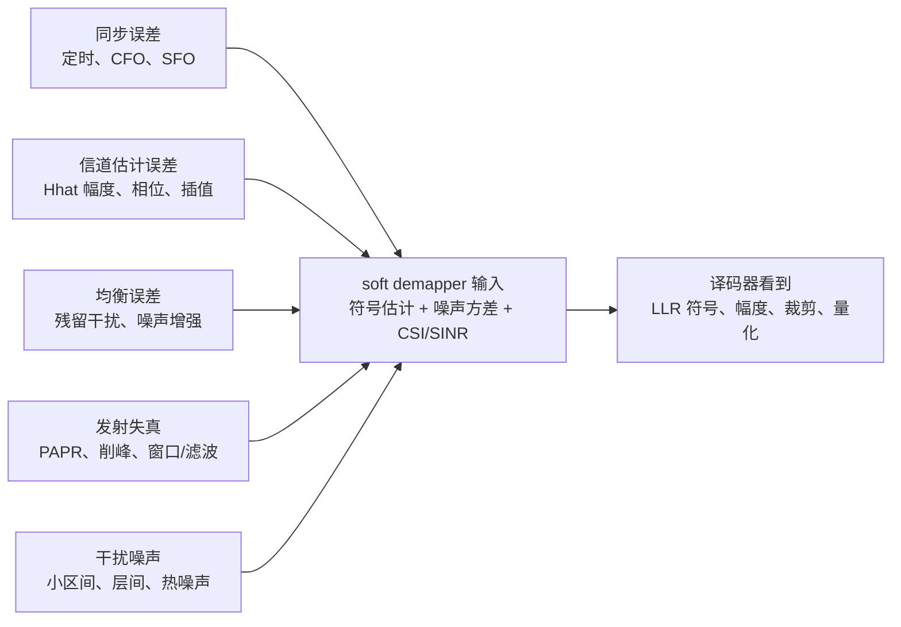

# T2.19 OFDM 误差到 LLR：从前端非理想到译码器输入质量
## 本节学习目标

T2.12–T2.18 分别讲了定时、频偏、信道估计、均衡、MIMO、PAPR 和窗口函数。本节把它们收束到译码器真正看到的接口：LLR。译码器不会知道 FFT 窗口偏了几采样、CFO 还剩多少 Hz、DM-RS 插值用了几阶滤波器，也不会知道 PA 是否削峰。它只看到一串有符号、有幅度、可能被裁剪和量化的 LLR。

- 建立 OFDM 前端误差到 LLR 的统一链路。
- 区分 LLR 符号错误、幅度错误、相关性错误和裁剪错误。
- 说明为什么 AWGN/perfect CSI 曲线只是上界。
- 给出 BLER 调试时的前端证据清单。
- 把 T2 系列如何进入 T3+ 译码链路讲清楚。

## 前置知识检查

| 问题 | 需要达到的程度 |
|:---|:---|
| LLR 的符号和幅度含义是什么？ | 正负号表示更像 0/1，幅度表示可靠度。 |
| soft demapper 需要哪些输入？ | 至少需要均衡后符号、噪声/CSI/SINR 和调制映射。 |
| perfect baseline 是什么？ | 知道它是理想同步/理想信道估计等上界条件。 |
| BLER 调试为什么要分层？ | 知道前端和译码器错误会在最终 BLER 上混在一起。 |

本节默认读者已经读过 T2.12–T2.18。若只读本节，要先接受一个核心前提：译码器看到的 LLR 是接收机前端多步处理之后的压缩结果，不是无线信道的原始观测。

## LLR 是前端误差的折叠接口

理想 soft demapper 假设均衡后符号满足：

$$
z = x + w,\quad w\sim\mathcal{CN}(0,\sigma_{eq}^2)
\tag{1}
$$

于是对每个比特计算：

$$
L(b_i)
=
\ln
\frac{\sum_{s\in\mathcal{S}_{i,0}}
\exp\left(-|z-s|^2/\sigma_{eq}^2\right)}
{\sum_{s\in\mathcal{S}_{i,1}}
\exp\left(-|z-s|^2/\sigma_{eq}^2\right)}
\tag{2}
$$

但真实系统里，$z$ 和 $\sigma_{eq}^2$ 都来自前端处理。任何同步、估计、均衡或发射失真都会改变式 (1) 的成立程度。

## 图示：前端误差汇聚到 LLR



图示把 T2.12–T2.18 的误差源汇总到 soft demapper 输入：符号估计、等效噪声方差和 CSI/SINR。译码器看到的是 LLR 的符号、幅度、裁剪和量化结果；它无法从 LLR 本身反推出是哪一个前端模块出错。因此调试 BLER 必须保留前端证据。

## 四类 LLR 失真

| 失真类型 | 表现 | 典型来源 |
|:---|:---|:---|
| 符号错误 | 正 LLR 写成负，或负写成正 | 星座旋转未补、层映射错、bit ordering 错。 |
| 幅度错误 | 方向对但过强/过弱 | 噪声方差、CSI/SINR、信道估计幅度错误。 |
| 相关性错误 | LLR 被当作独立观测但实际强相关 | ICI、残留层间干扰、相位噪声。 |
| 裁剪/量化错误 | 极值过多或溢出翻符号 | LLR scaling、clip、定点饱和设计不当。 |

译码器算法通常假设输入 LLR 大致反映独立观测可靠度。这个假设被破坏时，即使译码器代码完全正确，BLER 也会明显变差。

## 从模块误差到 LLR 的路径

| 前端模块 | 误差 | 对 LLR 的影响 |
|:---|:---|:---|
| 定时同步 | FFT 窗口越出 CP | ISI/ICI，多个 RE 同时污染。 |
| CFO/SFO | 残余旋转、频域相位斜率 | 星座旋转、距离计算错误。 |
| 信道估计 | $\hat{H}$ 幅相偏差 | 均衡偏置、噪声增强估计错。 |
| 均衡/MIMO 检测 | 残留层间干扰 | per-layer 可靠度失配。 |
| PAPR/PA | 非线性、削峰 | EVM 增大，误差非高斯。 |
| 窗口/滤波 | 频谱改善过度 | 边缘子载波 EVM 或 CP 余量损失。 |
| 干扰噪声 | 小区间/邻道/热噪声 | SINR 下降，LLR 幅度应变小。 |

## Perfect baseline 的调试价值

链路仿真常见三条曲线：

| 曲线 | 含义 | 用途 |
|:---|:---|:---|
| AWGN + perfect CSI | 最理想软解调条件 | 检查编码/译码主链路是否基本正确。 |
| Fading + perfect timing/CSI | 信道存在但接收机理想 | 分离信道模型损失。 |
| Practical receiver | 同步、估计、均衡、量化都实际化 | 评估真实接收机损失。 |

如果只跑 practical receiver，BLER 差时很难定位是译码器错误、LLR scaling 错误，还是前端估计误差。perfect baseline 是调试坐标系，不是为了美化结果。

## 教学例子：同一个判决方向，不同 LLR 质量

考虑 BPSK 教学映射 `0 -> +1`、`1 -> -1`。假设均衡后两个 RE 都落在正半轴，因此硬判决都是 bit 0：

| RE | 均衡后 $z$ | 等效噪声方差 $\sigma^2_{eq}$ | LLR $2z/\sigma^2_{eq}$ | 解释 |
|:---|---:|---:|---:|:---|
| A | 0.8 | 0.04 | 40 | 强信道、低噪声，非常确信 bit 0。 |
| B | 0.8 | 0.40 | 4 | 同样位置，但噪声大，只能中等确信。 |
| C | 0.8 | 0.04（误估） | 40（错误） | 如果真实噪声其实是 0.40，LLR 被过度放大。 |

这个例子说明：星座点位置相同，不代表 LLR 应相同。soft demapper 的可靠度来自位置和噪声/CSI 两部分。若信道估计、均衡或干扰估计把 $\sigma^2_{eq}$ 估小，译码器会收到过度自信的 LLR。过度自信比“略保守”更危险，因为迭代译码器可能很难推翻一个方向错误且幅度很大的输入。

再看符号错误。若残余 CFO 把星座旋转到负半轴，$z=-0.3$，但真实 bit 仍为 0。在 $\sigma^2_{eq}=0.04$ 下：

$$
L=\frac{2(-0.3)}{0.04}=-15
\tag{3}
$$

这是“非常确信 bit 1”的错误证据。后续 LDPC 或 Turbo 译码器会尝试用校验约束纠正它，但如果同类错误在多个 RE 上成簇出现，译码失败概率会急剧增加。

## 深入理解：LLR 质量的局部性

平均 SNR 经常掩盖局部问题。NR 资源在频域、时域和层域都有结构，因此 LLR 质量也应按这些维度拆开看：

| 维度 | 局部问题 | 推荐统计 |
|:---|:---|:---|
| 频域 PRB | 边缘滤波失真、频率选择性深衰落 | per-PRB EVM、SINR、LLR histogram。 |
| 时域符号 | 相位噪声、定时漂移、DM-RS 间隔过大 | per-symbol CPE、EVM、pilot residual。 |
| MIMO 层 | 某层奇异值弱、层间干扰强 | per-layer post-eq SINR、LLR clip count。 |
| HARQ 轮次 | RV 地址或 soft combining 错 | new/repeat coverage、LLR accumulation delta。 |

如果只保存一个 TB 级平均 SNR，调试者无法判断 BLER 来自某个弱 PRB、某个层、某个时域符号，还是来自 rate recovery 地址错位。T2.19 的工程建议是：LLR 进入 T3/T7/T9/T10 之前，至少保留一次“按 RE/layer 聚合的质量摘要”。

## LLR 调试指标

| 指标 | 为什么要看 | 异常示例 |
|:---|:---|:---|
| LLR sign accuracy | 判断方向是否对 | 高 SNR 仍大量符号错误。 |
| LLR magnitude histogram | 判断可靠度分布 | 弱信道下极大值过多。 |
| clip/saturation count | 判断定点边界 | clip 计数随 SNR 异常飙升。 |
| per-layer/per-PRB SINR | 判断局部弱区 | 某层或边缘 PRB BLER 主导。 |
| EVM vs BLER | 连接前端和译码 | EVM 好但 BLER 差，可能是 bit/LLR 顺序错。 |
| HARQ combining gain | 检查软信息一致性 | 重传后 LLR 没变好或变差。 |

## 对 T3+ 译码链路的接口

T3 以后进入 CRC、segmentation、rate recovery、Turbo/LDPC/Polar 译码。它们消费的不是 RE，也不是星座点，而是一维 LLR 序列。T2.19 的结论是：

```text
OFDM 接收质量 -> 码字级 LLR 序列 -> rate recovery -> 每 CB LLR -> decoder core
```

如果前端把 LLR 顺序、符号、幅度或可靠度做错，后续 rate recovery 和 decoder core 会忠实处理错误证据。译码器不负责修复物理层前端假设失配。

## 工程闭环

调试一个 BLER 问题时，建议按下面顺序收集证据：

1. 先跑 AWGN + perfect soft demapper，确认译码器主链路。
2. 加入 fading + perfect channel/timing，确认衰落和均衡公式。
3. 加入实际定时同步和 CFO/SFO，观察 EVM、残余相位和 LLR 分布。
4. 加入实际 DM-RS 信道估计，比较 perfect/practical CSI 的差距。
5. 加入 MIMO 检测、PA/PAPR、窗口/滤波和定点 LLR。
6. 最后看 HARQ soft combining 是否按同一母码地址累加可靠度。

这个顺序的目的不是把系统拆得过细，而是防止把所有问题都归咎于译码器。

## 扩展讲解：验证与实现关注点

T2.19 的工程重点是建立“证据闭环”。一个 BLER 失败不能只附上 decoder log，因为 decoder log 只能证明译码器如何处理 LLR，不能证明 LLR 是否可信。完整问题单至少应包含四层证据：前端同步/频偏、信道估计/均衡、soft demapper/LLR、rate recovery/decoder。

第一层是前端状态证据。包括 `sync_valid`、`timing_offset`、residual CFO、SFO ppm、CPE 曲线和 EVM heatmap。这些字段说明接收机是否真的在正确时频坐标上工作。如果这些字段异常，后续译码失败是结果不是根因。

第二层是信道和均衡证据。包括 DM-RS residual、$\hat{H}$ heatmap、post-eq SINR、per-layer CSI、condition number 或 rank proxy。它们说明 soft demapper 使用的符号位置和可靠度是否来自合理前端模型。若 post-eq SINR 过高但 EVM 很差，说明可靠度估计可能过度自信。

第三层是 LLR 证据。至少要保存 LLR histogram、sign accuracy proxy、clip/saturation count、per-layer/per-PRB LLR power 和 bit ordering trace。LLR 幅度分布应随 SNR、MCS、层数和信道质量合理变化。高 SNR 下全部 LLR 很小，可能是 scaling 不足；低 SNR 或深衰落下大量极值，可能是噪声方差低估。

第四层是译码证据。包括 rate recovery 地址、puncturing/shortening 初始化、HARQ combining 地址、decoder iteration count、syndrome/CRC 结果。只有当前三层都合理时，才应优先怀疑 decoder core。

| 层级 | 最小证据 | 典型根因 |
|:---|:---|:---|
| 同步/频偏 | timing、CFO/SFO、CPE | FFT 窗口错、残余旋转。 |
| 估计/均衡 | DM-RS residual、CSI、SINR | $\hat{H}$ 错、层间干扰。 |
| LLR | histogram、clip、bit order | scaling、噪声方差、映射错。 |
| 译码 | rate recovery、iteration、CRC | 地址、RV、decoder 算法错。 |

对回归测试，建议每个 MCS 至少保留三类曲线：理想 AWGN、衰落 perfect receiver、practical receiver。三类曲线不需要每天全量跑，但在模型变更、位宽变更、同步/估计/均衡模块变更后必须抽样跑。否则一次前端改动可能悄悄改变 LLR 分布，直到后续 decoder regression 才暴露。

T2 系列到 T3+ 的接口还要处理数据形状。前端通常按 RE/layer/time 输出 LLR，译码器按 code block 输入 LLR。中间的 de-rate-matching、deinterleaving 和 HARQ soft combining 会改变顺序。如果没有保存 RE 到 codeword bit 的映射摘要，某个局部前端缺陷很难追到具体 CB 和 decoder failure。

## 调试案例库

| 案例 | 表现 | 定位步骤 | 修复方向 |
|:---|:---|:---|:---|
| LLR 方向反 | 高 SNR 仍无法译码 | BPSK/QPSK 单点向量检查 sign | 修正 bit mapping 或 LLR 定义。 |
| LLR 过度自信 | CRC fail 且迭代难以翻转 | 看 clip count 和弱 RE LLR | 修正噪声方差/CSI。 |
| 局部 PRB 损坏 | 平均 SNR 正常但 BLER 差 | per-PRB LLR/EVM heatmap | 定位滤波、信道估计或干扰。 |
| HARQ 合并反降 | 重传后 BLER 变差 | 检查 RV 地址和 LLR delta | 修正 rate recovery/soft buffer。 |

LLR 问题的最终判据不是“数值看起来大”，而是它是否与真实可靠度单调一致。强 RE 的正确方向 LLR 应更大，弱 RE 应更保守；重传命中同一母码地址时，同方向独立观测应增加可靠度；puncturing 位置应保持中性。只要这些单调关系被破坏，译码器就会收到错误证据。

## 资料与协议边界

| 资料 | 本节采用 | 边界 |
|:---|:---|:---|
| T2.12–T2.18 | 各类 OFDM 前端误差来源 | 本节做接口收束，不重复每节完整推导。 |
| T2.10 | 衰落信道和 LLR 可靠度 | 本节扩展到同步、估计、MIMO 和发射失真。 |
| T2.11 | LLR 裁剪、缩放、量化 | 本节只说明前端误差如何改变进入定点化前的 LLR。 |
| TS 38.211/38.215 | 物理信号和测量指标入口 | 不复现具体协议表格或接收算法。 |

3GPP 规定物理信号、参考信号、调制、资源映射、编码和 rate matching 的可互操作规则。它不规定接收机内部必须如何估计 CFO/SFO、如何插值信道、如何选择均衡器、如何计算 post-eq SINR，也不规定 LLR 的定点位宽。工程文档必须把“协议必需字段”和“接收机实现证据”分开记录。

## 常见错误

| 错误 | 为什么错 | 正确做法 |
|:---|:---|:---|
| BLER 差就先改译码器 | 前端 LLR 可能已经错。 | 先做 perfect baseline 分层定位。 |
| 只记录平均 SNR | 局部 PRB、层、符号可能很差。 | 保存 per-RE/per-layer 质量统计。 |
| LLR 越大越好 | 错误方向的大 LLR 最伤译码。 | 检查 sign、magnitude、clip 和校验约束。 |
| 忽略相关干扰 | ICI/层间干扰不是独立 AWGN。 | 在等效噪声或 CSI 中体现残留干扰。 |

## 最小仿真矩阵

| 维度 | 建议取值 | 覆盖目的 |
|:---|:---|:---|
| 接收理想度 | AWGN、perfect CSI、practical receiver | 分层定位损失来源。 |
| 前端误差 | 定时、CFO/SFO、估计、PA、窗口 | 确认每类误差到 LLR 的路径。 |
| 调制编码 | 低 MCS、中 MCS、高 MCS | 覆盖可靠度敏感性。 |
| HARQ | 单传、同 RV、不同 RV | 检查 LLR 合并是否单调改善。 |
| 定点 | 浮点、裁剪、量化 | 检查 T2.11 接口影响。 |

每个点至少保存前端质量摘要、LLR histogram、clip count、rate recovery 地址摘要、decoder iteration 和 CRC。T2.19 的验收目标是能把一个 BLER 点拆成可解释证据链，而不是只给最终 pass/fail。

## 自测题

1. 为什么说 LLR 是前端误差的折叠接口？
2. LLR 符号错误和幅度错误哪个更危险？
3. 为什么 AWGN + perfect CSI 曲线仍然有价值？
4. 哪些前端误差会造成 LLR 过度自信？
5. 为什么译码器不负责修复 CFO/SFO？

## 自测题参考答案

1. 因为译码器只看到 LLR，无法直接看到同步、估计、均衡和发射端失真，这些误差都体现在 LLR 符号和幅度中。
2. 符号错误通常更危险；幅度错误会影响收敛，方向错误的大幅 LLR 会强行推动错误判决。
3. 它能证明编码、调制、软解调和译码主链路在理想条件下成立，是后续定位实际接收机损失的基准。
4. 噪声方差低估、CSI 过高、信道估计幅度偏小、残留干扰未计入、削峰失真被当作 AWGN。
5. CFO/SFO 是前端同步问题；译码器只处理 LLR，不知道采样频率或载波频率误差。

## 本节验收

| 验收项 | 通过标准 |
|:---|:---|
| 统一链路 | 能把 T2.12–T2.18 每类误差接到 LLR。 |
| 失真分类 | 能区分符号、幅度、相关性和裁剪/量化错误。 |
| 调试顺序 | 能设计 perfect 到 practical 的分层仿真。 |
| 协议边界 | 能区分协议规则和接收机内部实现证据。 |
| 链路图理解 | 能按图示说明 T2.12–T2.18 的误差如何汇聚到 LLR。 |

## 执行与证据记录

| 项目 | 记录 |
|:---|:---|
| 本地材料 | 汇总 T2.12–T2.18、T2.10、T2.11 和概念笔记 `CSI_SINR`、`MMSE_均衡`、`Channel_Estimation_信道估计`。 |
| 图解材料 | 本节使用 Markdown 内嵌 Mermaid 概念图，不再依赖外部 SVG 资产。 |
| 图解边界 | 图示只表达前端误差到 LLR 的收束关系，不新增具体协议表格复现。 |
| 证据边界 | 本节为 T2 工程误差收束，不新增具体协议表格复现。 |

## 参考文献

- [3GPP, 2026] 3GPP TS 38.211, Rel-19, `38211-j30`, Physical channels and modulation. Local path: `3GPP_Rel19/processed/TS_38.211_38211-j30`.
- [3GPP, 2026] 3GPP TS 38.215, Rel-19, `38215-j20`, Physical layer measurements. Local path: `3GPP_Rel19/processed/TS_38.215_38215-j20`.
- 项目概念笔记：`3gpp/docs/concepts/CSI_SINR.md`，`3gpp/docs/concepts/MMSE_均衡.md`，`3gpp/docs/concepts/Channel_Estimation_信道估计.md`。
