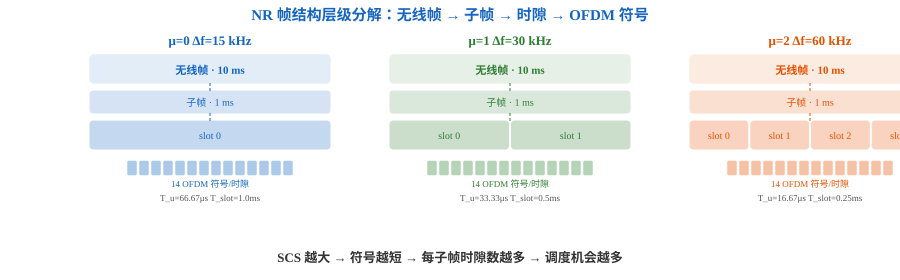
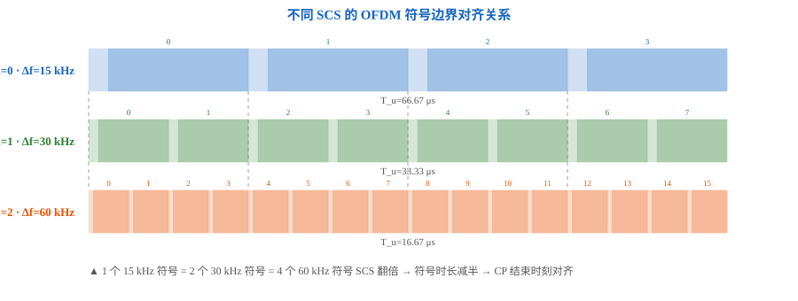
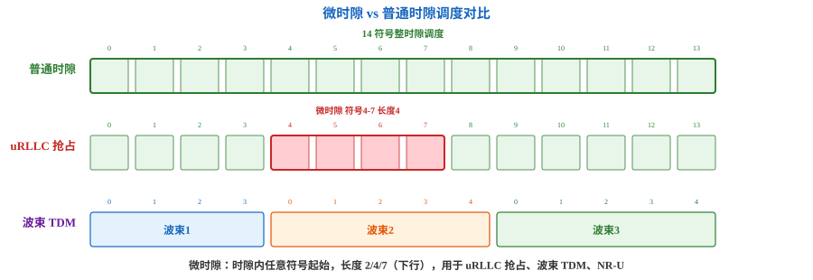
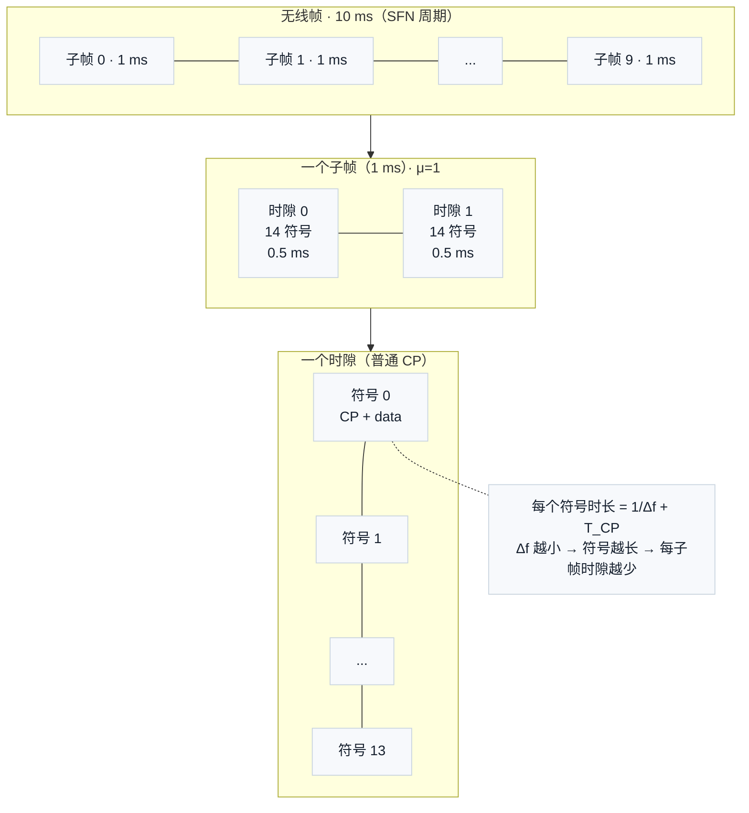

# T2.2 NR Numerology 与时域层级：从 μ 到帧结构的完整推导链
## 本节学习目标

T2.0 建立了 OFDM 收发机全景，T2.1 建立了 OFDM 的核心机制——子载波正交性、CP 和 IFFT/FFT 实现——但刻意没有给出任何具体 NR 数值。本节把框架填上实数：NR 定义了五套 Numerology（参数集），每套用单一参数 μ 确定从子载波间隔到无线帧的全部时域参数。

LTE 只用一套（15 kHz），NR 用五套（15–240 kHz）。这不是简单的数量增加——它反映了 5G 同时服务 eMBB（大带宽）、uRLLC（低时延）和 mMTC（广覆盖）三种差异化场景的系统设计选择。

先区分本节容易混在一起的三个时间尺度概念：

| 术语 | 英文 | 先这样理解 |
|:---|:---|:---|
| Numerology | — | 一套以 μ 为索引的参数集，确定 SCS、符号时长、CP 长度和时隙结构。 |
| 子帧 | subframe | 1 ms 固定时长，NR 中降级为纯计时单位，不再作为调度粒度。 |
| 时隙 | slot | NR 的基本调度单位，固定 14 个 OFDM 符号（普通 CP），实际时长随 μ 变化。 |

- 解释 NR 为什么需要五套 Numerology（eMBB/uRLLC/mMTC/毫米波的差异化需求）。
- 从 $\mu \to \Delta f \to T_u \to T_{symbol} \to T_{slot} \to T_{subframe} \to T_{frame}$ 逐级推导完整参数链。
- 读懂 TS 38.211 Table 4.3.2-1 的每列含义。
- 区分"计时单位（子帧）"和"调度单位（时隙）"——这是 NR 与 LTE 帧结构最关键的架构差异。
- 解释微时隙（mini-slot）的三种典型工程用途。
- 用 Python 验证不同 μ 下时域参数的一致性。

## 前置知识检查

| 问题 | 需要达到的程度 |
|:---|:---|
| 子载波间隔 Δf 是什么？ | 能说出 $\Delta f = 1/T_u$，是相邻子载波中心频率间距（T2.1）。 |
| CP 的作用是什么？ | 能说出 CP 消除 ISI 和维持子载波正交性（T2.1）。 |
| OFDM 符号的组成部分是什么？ | $T_{symbol} = T_u + T_{CP}$，CP + 有用符号（T2.1）。 |
| ms/μs/ns 的时间单位换算是什么？ | 1 ms = $10^3$ μs = $10^6$ ns。 |

## 为什么需要多套 Numerology

LTE 只有一套参数：$\Delta f = 15$ kHz，$T_u \approx 66.67$ μs，时隙 0.5 ms。这对中低频段的移动宽带服务足够——但在 5G 的多样化场景下，单一参数集成为瓶颈。

NR 的五套 Numerology 不是"多多益善"的堆砌——每一套对应一类明确的场景需求：

| μ | Δf (kHz) | $T_u$ (μs) | $T_{slot}$ (ms) | 主力场景 | 设计逻辑 |
|:---:|:---:|:---:|:---:|:---|:---|
| 0 | 15 | 66.67 | 1.000 | mMTC 广覆盖、LTE 兼容 | 长符号 → 能量集中 → 小区边缘覆盖好；窄带传输降低 UE 复杂度 |
| 1 | 30 | 33.33 | 0.500 | eMBB 中低频段（FR1, <6 GHz） | 中等符号时长 → 覆盖与时延的平衡点 |
| 2 | 60 | 16.67 | 0.250 | eMBB/uRLLC（FR1 中高频段 + 扩展 CP 选项） | 唯一同时支持普通 CP 和扩展 CP 的 Numerology |
| 3 | 120 | 8.33 | 0.125 | eMBB 高频段 + uRLLC（FR2, >24 GHz） | 短符号 → 抵抗高频相位噪声和多普勒频偏 |
| 4 | 240 | 4.17 | 0.0625 | eMBB 毫米波超宽带（FR2 高频段） | 极短符号 → 最大 SCS 满足最大带宽和最低时延 |

### eMBB 大带宽

高频段（FR2, >24 GHz）有丰富的连续频谱——单个载波带宽可达 400 MHz。大 SCS 使 OFDM 符号更短、时隙更短，时域调度粒度更细，对低时延传输天然友好。同时大 SCS 的子载波间隔更宽，对相位噪声和多普勒频偏的容忍度更高——这是高频段必须解决的问题。

### uRLLC 低时延

μ=2 或 3 时，$T_{slot}$ 分别降至 0.25 ms 和 0.125 ms。配合微时隙（mini-slot）机制，传输时间间隔可进一步缩短。大 SCS 的短时隙 + 微时隙灵活起始位置 + 快速 HARQ 反馈，共同实现 1 ms 级端到端时延。

### mMTC 广覆盖

μ=0（15 kHz）的长 OFDM 符号使信号能量在时间上更集中——在相同功率下，每个符号的能量更高，有利于小区边缘的覆盖。窄带传输（如 NB-IoT 仅占 1 个 PRB = 180 kHz）降低了 UE 的射频复杂度和功耗。

### 毫米波频段

高频段的多普勒频偏绝对值与载波频率成正比——$\Delta f_{doppler} \propto f_c$。30 GHz 载波的多普勒频偏是 3 GHz 的 10 倍。大 SCS 使子载波间隔远大于多普勒扩展，避免子载波间干扰。此外高频段的相位噪声谱密度更宽，大 SCS 可减小相位噪声引起的 ICI。

## 核心公式链：从 μ 到帧结构

NR 时域结构的设计精妙之处在于：**所有参数均可从单一参数 μ 推导**。

$$
\boxed{\mu \in \{0,1,2,3,4\}}
\;\xrightarrow{\Delta f = 15 \cdot 2^\mu \text{ kHz}}\;
\boxed{\Delta f}
\;\xrightarrow{T_u = 1/\Delta f}\;
\boxed{T_u}
\;\xrightarrow{T_{symbol} = T_u + T_{CP}}\;
\boxed{T_{symbol}}
\;\xrightarrow{T_{slot} = 14 \cdot T_{symbol}}\;
\boxed{T_{slot}}
\;\xrightarrow{T_{subframe} = 1\text{ ms}}\;
\boxed{T_{subframe}}
\;\xrightarrow{T_{frame} = 10\text{ ms}}\;
\boxed{T_{frame}}
$$

每一步的含义：

| 步骤 | 推导 | 物理含义 |
|:---|:---|:---|
| (1) μ → Δf | $\Delta f = 15 \cdot 2^\mu$ kHz | 子载波间隔，μ 每加 1 翻倍 |
| (2) Δf → $T_u$ | $T_u = 1/\Delta f$ | 有用符号时长，子载波正交条件 |
| (3) $T_u$ → $T_{symbol}$ | $T_{symbol} = T_u + T_{CP}$ | 含 CP 的完整 OFDM 符号时长 |
| (4) $T_{symbol}$ → $T_{slot}$ | $T_{slot} = 14 \cdot T_{symbol}$（普通 CP） | 基本调度单位 = 14 个 OFDM 符号 |
| (5) $T_{slot}$ → $T_{subframe}$ | $T_{subframe} = 1$ ms，含 $2^\mu$ 个时隙 | 子帧是固定 1 ms 计时锚点 |
| (6) $T_{subframe}$ → $T_{frame}$ | $T_{frame} = 10 \cdot T_{subframe} = 10$ ms | 无线帧是系统帧号（SFN）的周期 |

完整层级链的等式形式：

$$
T_{frame} = 10 \text{ ms} = 10 \cdot T_{subframe} = 10 \cdot 2^\mu \cdot N_{symb}^{slot} \cdot (1/\Delta f + T_{CP})
\tag{1}
$$



图 1 将 μ=0、1、2 三种 Numerology 的帧结构并排展示。μ=0（15 kHz）时每子帧仅 1 个时隙、$T_{slot}=1$ ms；μ=2（60 kHz）时每子帧 4 个时隙、$T_{slot}=0.25$ ms。层级链的最底端是 14 个 OFDM 符号（普通 CP），符号时长 $T_{symbol} = 1/\Delta f + T_{CP}$ 随 SCS 增大而缩短。

## 协议读法：TS 38.211 Table 4.3.2-1

TS 38.211 §4.3.2 定义了 Supported transmission numerologies 表格。这张表只有四列，但每一列对应后续多个章节的入口参数：

| 列 | 协议中写法 | 本节解读 |
|:---|:---|:---|
| μ | $\mu$ | Numerology 索引，NR Rel-15 支持 0–4 |
| Δf | $\Delta f = 2^\mu \cdot 15$ [kHz] | 子载波间隔 |
| CP 类型 | Normal / Extended | 仅 μ=2 同时支持两种 CP |
| 是否支持数据信道 | Supported for data | μ=0–4 全部支持；μ=2 扩展 CP 仅特定场景 |

μ=2 是唯一支持扩展 CP 的 Numerology。扩展 CP 下每时隙只有 12 个 OFDM 符号（$T_{slot}$ 时长不变），每个符号更长、CP 更久，用于对抗极端多径环境（如广域覆盖中的长时延反射）。LTE 在 15 kHz 下也支持扩展 CP（每时隙 6 个符号），但 NR 将扩展 CP 选项限定在 60 kHz 下，这使得大 SCS 的短符号场景也能获得扩展 CP 的多径保护。

## 完整参数速查

| μ | Δf (kHz) | $T_u$ (μs) | 每子帧时隙数 $2^\mu$ | 每帧时隙数 $10 \cdot 2^\mu$ | $T_{slot}$ (ms) | CP 类型 |
|:---:|:---:|:---:|:---:|:---:|:---:|:---:|
| 0 | 15 | 66.67 | 1 | 10 | 1.000 | Normal |
| 1 | 30 | 33.33 | 2 | 20 | 0.500 | Normal |
| 2 | 60 | 16.67 | 4 | 40 | 0.250 | Normal / Extended |
| 3 | 120 | 8.33 | 8 | 80 | 0.125 | Normal |
| 4 | 240 | 4.17 | 16 | 160 | 0.0625 | Normal |

读这张表时要抓住两个规律：
- **SCS 翻倍 → 符号时长减半**：$T_u$ 严格反比于 Δf
- **SCS 翻倍 → 每子帧时隙数翻倍**：因为每子帧时长固定 1 ms，时隙越短装的越多

### 基本时间单位 $T_c$

NR 的基本时间单位 $T_c$ 定义在 TS 38.211 §4.1：

$$
T_c = \frac{1}{\Delta f_{max} \cdot N_f} = \frac{1}{480000 \cdot 4096} \approx 0.509 \text{ ns}
\tag{2}
$$

其中 $\Delta f_{max} = 480$ kHz 是 NR 支持的最大子载波间隔，$N_f = 4096$ 是 FFT 大小。$T_c$ 比 LTE 的 $T_s \approx 32.552$ ns 精细约 64 倍，反映 NR 的 SCS 范围对时间精度的更高要求。

### CP 精确长度：从教学近似到协议表

前面用 $T_{CP} \approx T_u/8$ 作为教学近似。对于译码链路仿真，需要协议的精确 CP 采样点数——这直接影响接收端"丢弃多少采样才能正确进入 FFT 窗口"。

TS 38.211 §5.3.1 Table 5.3.1-1 给出普通 CP 的精确值。一个时隙内 CP 并非均匀分配——符号 0 的 CP 比其他符号略长（多 16·$T_c$）：

| μ | 符号 0 CP | 符号 1–13 CP | CP 开销 |
|:---:|:---|:---|:---:|
| 0 | $144\kappa + 16$ $T_c$ | $144\kappa$ $T_c$ | ≈ 6.7% |
| 1 | $72\kappa + 16$ $T_c$ | $72\kappa$ $T_c$ | ≈ 6.7% |

其中 $\kappa = T_s/T_c = 64$。符号 0 额外 16·$T_c \approx 8$ ns——在 FR2 高频段下若忽略此差异，FFT 窗口偏移会影响解调精度。

扩展 CP 仅 μ=2，每时隙 12 符号，所有符号 CP 统一为 $512\kappa \cdot 2^{-\mu}$ $T_c$（无符号 0 特例），开销约 25%。

## 子帧 vs 时隙——NR 与 LTE 的架构分水岭

这是理解 NR 帧结构最关键的一点。

| 概念 | LTE 中角色 | NR 中角色 |
|:---|:---|:---|
| 子帧（subframe） | **基本调度单位**（TTI = 1 ms = 2 slots） | **纯计时单位**（固定 1 ms，与 μ 无关） |
| 时隙（slot） | 0.5 ms 固定，7 符号（普通 CP） | **基本调度单位**（14 符号，时长随 μ 变） |

在 LTE 中，MAC 层以 1 ms 子帧为粒度分配资源——物理资源块（PRB）绑定到子帧内的时隙。在 NR 中，1 ms 子帧只作为跨 Numerology 的统一计时锚点（系统帧号 SFN、HARQ 定时器等都以子帧/帧为参考），实际调度完全以时隙为单位。这意味着 μ=3 时，1 ms 内有 8 个独立的调度机会——调度灵活性是 LTE 的 8 倍。



图 2 展示了不同 Numerology 的符号边界对齐关系。一个 15 kHz 的 OFDM 符号时长（$T_u \approx 66.67$ μs）恰好等于两个 30 kHz 符号（各 33.33 μs）或四个 60 kHz 符号（各 16.67 μs）。这一对齐关系是 TDD 上下行切换和跨 Numerology 共存设计的基础。

## 微时隙：NR 的灵活调度机制

微时隙（mini-slot）是 NR Rel-15 中与时隙并行的一种调度方式。它允许传输在时隙内的任意 OFDM 符号起始，长度不限于 14 个符号。

| 属性 | 普通时隙 | 微时隙 |
|:---|:---|:---|
| 起始位置 | 时隙边界（符号 0 或 7） | 时隙内任意 OFDM 符号 |
| 长度 | 14 符号（普通 CP） | 2、4 或 7 符号（下行）；1–14 任意（上行） |
| 调度粒度 | 粗（最快每时隙一次） | 细（符号级起始位置） |

三种典型应用场景：

1. **uRLLC 抢占**：低时延分组到达时，如果等到下一个时隙边界才开始传输，额外等待可能达数十个符号周期。微时隙可立即在下一个符号起始传输，抢占正在进行的 eMBB 时隙的部分资源。

2. **毫米波波束时分复用**：FR2 频段每个波束方向下的 UE 集合不同。一个时隙内可通过微时隙将时间切给多个波束方向，实现模拟波束的 TDM 切换。

3. **非授权频谱信道抢占**：NR-U（NR in unlicensed spectrum）中，LBT（先听后说，Listen Before Talk）成功后获得的信道使用权可能不对齐时隙边界。微时隙可从任意符号起始，充分利用抢占的信道时间。

### NR 时隙格式（SFI）：符号级的上下行配置

LTE TDD 只有 7 种子帧级配置（见 T2.5）。NR 将灵活性推到符号级——通过时隙格式指示（Slot Format Indication, SFI），一个时隙内的 14 个 OFDM 符号可各自标记为下行（D）、上行（U）或灵活（F）。

SFI 由 RRC 配置 + DCI format 2_0 动态指示（TS 38.213 §11.1）。协议预定义了 256 种时隙格式（Table 11.1.1-1），从全下行（格式 0: 14×D）到全上行（格式 1: 14×U），覆盖各种混合比例。F 符号可被后续调度动态覆写为 D 或 U。

SFI 对译码链路的影响：数据信道只能在指定方向的符号上传输——$N_{symb}^{data}$ 的计算不仅扣除参考信号，还受 SFI 约束。一个标记为 U 的符号上不会有下行 DM-RS，这改变了 RE 网格上有效数据 RE 的计算。



图 3 用三行对比了三种调度场景。第一行是普通 14 符号整时隙调度（eMBB）。第二行是 uRLLC 抢占：低时延分组到达后不从时隙边界起始，而是在符号 4 处立即启动一个 4 符号微时隙。第三行是毫米波波束 TDM：一个时隙被拆分为三个微时隙，各指向不同波束方向。

## 帧结构层级图



## Python 校验片段

```python
"""
@brief 验证不同 μ 下 NR 时域参数的内部一致性
@date 2026-07-27
"""


def numerology_params(mu: int, cp_type: str = "normal") -> dict:
    """从 μ 推导全部时域参数。

    @param mu       Numerology 索引 (0–4)
    @param cp_type  "normal" 或 "extended"（仅 μ=2 支持 extended）
    @return         参数字典
    """
    if mu not in range(5):
        raise ValueError(f"μ={mu} 超出 NR Rel-15 范围 (0–4)")
    if cp_type == "extended" and mu != 2:
        raise ValueError(f"扩展 CP 仅 μ=2 支持，当前 μ={mu}")

    delta_f_khz = 15 * (2 ** mu)       # kHz
    delta_f_hz = delta_f_khz * 1000    # Hz
    T_u_us = 1_000_000 / delta_f_hz    # μs

    # CP 长度（教学近似，协议精确采样点数见 TS 38.211 §5.3.1）
    if cp_type == "normal":
        T_cp_us = T_u_us / 8           # 教学近似：约 1/8 T_u
        N_symb = 14
    else:
        T_cp_us = T_u_us / 4           # 扩展 CP 更长
        N_symb = 12

    T_symbol_us = T_u_us + T_cp_us
    T_slot_ms = N_symb * T_symbol_us / 1000
    slots_per_subframe = 2 ** mu

    # 一致性验证：一个子帧内所有时隙的符号累加应等于 1 ms
    T_subframe_check_ms = slots_per_subframe * T_slot_ms

    return {
        "mu": mu, "delta_f_khz": delta_f_khz, "T_u_us": round(T_u_us, 2),
        "N_symb_per_slot": N_symb, "slots_per_subframe": slots_per_subframe,
        "slots_per_frame": 10 * slots_per_subframe,
        "T_slot_ms": round(T_slot_ms, 4),
        "subframe_ok": abs(T_subframe_check_ms - 1.0) < 0.01,
    }


# 验证所有 μ
for mu in range(5):
    p = numerology_params(mu)
    print(f"μ={mu}  Δf={p['delta_f_khz']:>3d} kHz  "
          f"T_u={p['T_u_us']:>6.2f} μs  "
          f"slots/subframe={p['slots_per_subframe']:>2d}  "
          f"T_slot={p['T_slot_ms']:.4f} ms  "
          f"subframe_ok={p['subframe_ok']}")

# 验证扩展 CP
p2e = numerology_params(2, "extended")
print(f"\nμ=2 extended: N_symb={p2e['N_symb_per_slot']}, T_slot={p2e['T_slot_ms']:.4f} ms")
```

期望输出：

```text
μ=0  Δf= 15 kHz  T_u= 66.67 μs  slots/subframe= 1  T_slot=1.0000 ms  subframe_ok=True
μ=1  Δf= 30 kHz  T_u= 33.33 μs  slots/subframe= 2  T_slot=0.5000 ms  subframe_ok=True
μ=2  Δf= 60 kHz  T_u= 16.67 μs  slots/subframe= 4  T_slot=0.2500 ms  subframe_ok=True
μ=3  Δf=120 kHz  T_u=  8.33 μs  slots/subframe= 8  T_slot=0.1250 ms  subframe_ok=True
μ=4  Δf=240 kHz  T_u=  4.17 μs  slots/subframe=16  T_slot=0.0625 ms  subframe_ok=True

μ=2 extended: N_symb=12, T_slot=0.2500 ms
```

这里用教学近似的 CP 长度演示参数推导链——协议的精确 CP 采样点数见 TS 38.211 §5.3.1。教学近似的要点是验证式 (1) 的自洽性：不管 μ 取何值，`slots_per_subframe * T_slot` 始终接近 1 ms。

## 和 3GPP 协议的关系

本节复现了 TS 38.211 §4.3.2 的 Numerology 参数映射和 §4.3.1 的帧结构定义。协议确定了 μ=0–4 的 SCS 取值、CP 类型和每子帧时隙数；本节在此基础上用式 (1) 逐级推导了参数之间的数学关系。

参数链本身（$\Delta f \to T_u \to T_{symbol} \to T_{slot}$）是 OFDM 物理约束和协议参数选择的组合——SCS 的取值来自协议，但 $\Delta f = 1/T_u$ 来自数学；每时隙 14 个符号来自协议，但 $T_{slot} = 14 \cdot T_{symbol}$ 来自算术。

需要分清：

- $N_{symb}^{slot} = 14$（普通 CP）和 $\Delta f = 15 \cdot 2^\mu$ kHz 是协议规定。
- $T_u = 1/\Delta f$ 和 $T_{frame} = 10 \cdot T_{subframe}$ 是数学关系和帧结构定义。
- CP 精确长度（采样点数）来自 TS 38.211 §5.3.1 Table 5.3.1-1/2，本节使用教学近似。

本地 Rel-19 资料入口如下：

| 协议依据 | 本地路径 | 本节采用程度 |
|:---|:---|:---|
| TS 38.211 Rel-19 §4.3.2, Table 4.3.2-1 | `3GPP_Rel19/processed/TS_38.211_38211-j30/sections.jsonl`, `content.md` | 已定位 Numerology 表入口；本节复现五行的完整参数映射，不读取协议文档内部 HTML/XML。 |
| TS 38.211 Rel-19 §4.3.1 | 同上 | 已定位帧结构定义和 $N_{slot}^{frame,\mu}$、$N_{slot}^{subframe,\mu}$ 表达式。 |
| TS 38.211 Rel-19 §4.1 | 同上 | 已定位基本时间单位 $T_c$ 定义。 |

## 常见错误

| 错误 | 为什么错 | 正确做法 |
|:---|:---|:---|
| 把子帧当 NR 的调度单位 | NR 中调度以时隙为单位；子帧只是 1 ms 计时锚点。 | 调度看时隙，计时间看子帧——两个维度分开理解。 |
| 以为每子帧时隙数 = $2^\mu$ 不适用于扩展 CP | 扩展 CP 下每时隙 12 符号，$T_{slot}$ 相同（符号更长使总数少但每符号更长使总时长不变）。每子帧时隙数 $2^\mu$ 仍然成立。 | 区分"每子帧时隙数"（只取决于 μ）和"每时隙符号数"（取决于 CP 类型）。 |
| 忘记 $T_c$ 和 $T_s$ 的数值差 | LTE $T_s \approx 32.552$ ns，NR $T_c \approx 0.509$ ns。部分协议参数在 NR 中用 $T_c$ 的整数倍表达。 | 核对公式中使用的是 $T_c$ 还是 $T_s$。 |
| 混淆 SCS 翻倍对 $T_{slot}$ 的影响 | μ 每加 1，Δf 翻倍，$T_u$ 减半，$T_{slot}$ 减半（因每符号减半且符号数不变）。 | $T_{slot} \propto 1/\Delta f \propto 1/2^\mu$。 |

## 自测题

1. NR 为什么要引入五套不同的子载波间隔？只用一套 15 kHz 有什么问题？
2. 从 μ=1 出发，写出 $\mu \to \Delta f \to T_u \to T_{symbol} \to T_{slot} \to T_{subframe}$ 的完整推导，每步填上具体数值。
3. NR 中子帧和时隙各自的角色是什么？为什么说这是 NR 与 LTE 帧结构的关键架构差异？
4. 为什么 μ=2 是唯一同时支持普通 CP 和扩展 CP 的 Numerology？
5. $T_c \approx 0.509$ ns 比 LTE 的 $T_s \approx 32.552$ ns 精细约 64 倍，这个精度提升的技术原因是什么？
6. 微时隙解决了普通时隙调度做不到的什么需求？举一个具体场景说明。

## 自测题参考答案

1. 单一 SCS 无法同时满足 5G 三类场景的差异化需求。只用 15 kHz 的问题：对 eMBB 大带宽来说符号太长、调度粒度太粗（每 ms 仅 1 个时隙）；对 uRLLC 来说时隙 1 ms 太长无法实现 1 ms 级端到端时延；对毫米波来说 15 kHz 的 SCS 小于多普勒扩展和相位噪声带宽，造成严重 ICI。

2. μ=1 → $\Delta f = 15 \times 2^1 = 30$ kHz → $T_u = 1/30000 \approx 33.33$ μs → $T_{symbol} = T_u + T_{CP} \approx 33.33 + 4.17 = 37.5$ μs（教学近似 CP = $T_u/8$）→ $T_{slot} = 14 \times 37.5 = 525$ μs = 0.525 ms → $T_{subframe} = 1$ ms = $2^1$ 个时隙 → $T_{frame} = 10$ ms。

3. 子帧是纯计时单位——1 ms 恒定，与 μ 无关。时隙是基本调度单位——14 个 OFDM 符号，实际时长随 μ 变化。LTE 中子帧身兼计时和调度双重角色（TTI = 1 ms）；NR 拆分为两个独立的维度，调度灵活性大幅提升（μ=3 时 1 ms 内有 8 次调度机会 vs LTE 的 1 次）。

4. 扩展 CP 设计的初衷是对抗极端多径。15 kHz（μ=0）下加扩展 CP 会使本就长的符号更长（开销比例更大）；高频段（μ=3,4）下符号极短，对多径时延不敏感——反而是中等 SCS（60 kHz, μ=2）既面临一定的多径挑战又有合理的开销比例，是扩展 CP 的最佳平衡点。

5. NR 的最大 SCS 是 LTE 的 16 倍（240 kHz vs 15 kHz），对应最短符号时长是 LTE 的 1/16。LTE 的 $T_s$ 用 15 kHz 和 2048 点 FFT 定义；NR 用 480 kHz 和 4096 点 FFT 定义 $T_c$，以适应更精细的时间分辨率需求——特别是 FR2 高频段下 ns 级的定时精度要求。

6. uRLLC 抢占场景：一个低时延分组到达时，如果等到下一个 14 符号时隙边界才开始传输，等待时间可达数个符号周期。微时隙允许在到达后的下一个符号立即起始传输（长度 2 或 4 个符号），将调度等待时延从"毫秒级"压缩到"符号级"。

## 本节验收

| 验收项 | 通过标准 |
|:---|:---|
| Numerology 动机 | 能分别解释 eMBB / uRLLC / mMTC / 毫米波各需要哪套 μ 以及为什么。 |
| 参数链推导 | 能从 μ 出发逐级算出 Δf、$T_u$、$T_{symbol}$、$T_{slot}$、每子帧时隙数、每帧时隙数。 |
| 子帧 vs 时隙 | 能说明 LTE 中子帧是调度单位，NR 中子帧降级为计时单位而时隙成为调度单位。 |
| Table 4.3.2-1 读法 | 能解释每列含义，并说出 μ=2 扩展 CP 的特殊性。 |
| 微时隙用途 | 能举出至少两种微时隙的典型工程场景。 |
| Python 复核 | 能运行本节代码并验证所有 μ 的 `subframe_ok=True`。 |

## 资料与协议边界

| 资料 | 边界 |
| :--- | :--- |
| TS 38.211 Rel-19 §4.3.2 (Table 4.3.2-1) | 本节复现五行的 μ/Δf/CP 类型/符号数映射；不读取原始 Word 或表格 HTML。 |
| TS 38.211 Rel-19 §4.3.1, §4.1 | 本节使用 $N_{slot}^{subframe,\mu}=2^\mu$ 和 $T_c$ 定义；CP 精确采样点数（Table 5.3.1-1/2）不在本节展开。 |
| T2.1 OFDM 基础 | $T_u = 1/\Delta f$ 和 CP 的 ISI/ICI 消除机制基于 T2.1 推导。 |
| T2.5 LTE 帧结构 | NR 与 LTE 的帧结构对比在 T2.4 用完整对照表展开。 |

非 3GPP 文献只作为 NR 帧结构背景读物。本节的 μ→帧结构推导链和 Python 验证在正文自洽完成。

## 执行与证据记录

| 项目 | 记录 |
|:---|:---|
| 本地协议检索 | 使用 `rg` 检索 TS 38.211 的 `sections.jsonl` 和 `content.md`，定位 Table 4.3.2-1、§4.3.1 和 §4.1。 |
| 示例验证 | 使用 Python 3 执行本节参数推导片段，验收输出为全 μ 的 `subframe_ok=True`。 |
| 审查范围 | 检查术语首现（Numerology/子帧/时隙/微时隙）、公式编号、μ→帧结构逐级推导完整性、子帧 vs 时隙区分、常见错误表、自测题及参考答案、验收项。 |
| 证据边界 | CP 精确采样点数（TS 38.211 §5.3.1 Table 5.3.1-1/2）未核验；FR1/FR2 频段划分和载波带宽的具体数值（TS 38.101）未引用。 |
| 使用技能/流程 | 使用 `3gpp-expert` 技能确认协议证据边界；使用 `verification-before-completion` 规则执行本地验证；使用 `tools/audit_lesson_terms.py` 做术语审计。 |

## 参考文献

- [3GPP, 2026] 3GPP TS 38.211, Rel-19, `38211-j30`, Physical channels and modulation, §4.3.2 (Table 4.3.2-1), §4.3.1, §4.1. Local path: `3GPP_Rel19/processed/TS_38.211_38211-j30`.
- [3GPP, 2026] 3GPP TS 38.213, Rel-19, `38213-j30`, Physical layer procedures for control, §11.1 (mini-slot scheduling). Local path: `3GPP_Rel19/processed/TS_38.213_38213-j30`.
- [Goldsmith, 2005] Andrea Goldsmith, *Wireless Communications*, Cambridge University Press, 2005.
