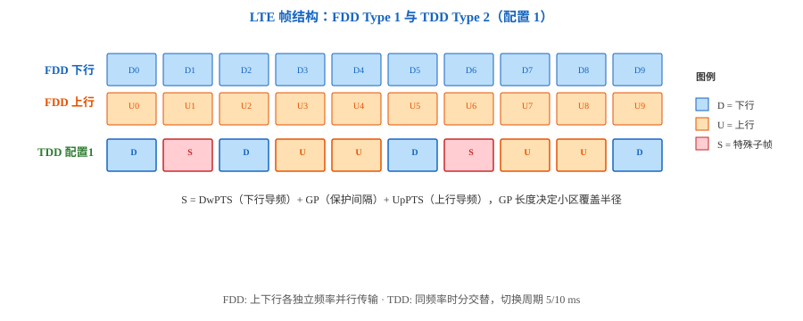
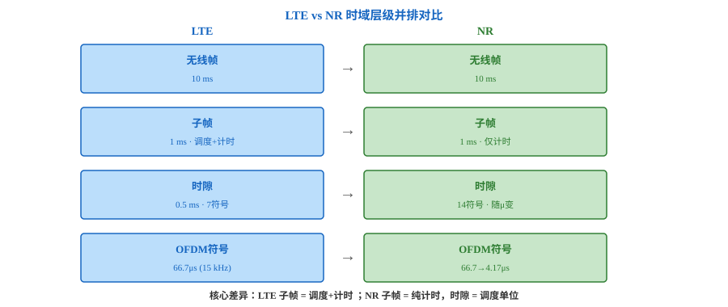

# T2.5 LTE 帧结构与时频资源：FDD/TDD 与 NR 对比
## 本节学习目标

T2.2–T2.3 建立了 NR 的时频框架。本节回退到 LTE 的固定参数框架，建立两套体系的精确对照——避免在阅读 LTE 译码链路时误用 NR 术语。

先区分 LTE 独有的三个概念：

| 术语 | 英文 | 先这样理解 |
|:---|:---|:---|
| Type 1 帧结构 | Frame structure type 1 | FDD 用——上下行各独立频率，10 子帧全用于对应方向。 |
| Type 2 帧结构 | Frame structure type 2 | TDD 用——上下行同频率时分交替，7 种配置。 |
| PRB pair | — | LTE 调度最小粒度——12 SC × 1 子帧（2 slots），NR 中无此概念。 |

- 解释 LTE FDD Type 1 和 TDD Type 2 两类帧结构差异。
- 理解 LTE 中子帧身兼计时和调度双重角色（TTI = 1 ms）——与 NR 的核心架构对比。
- 说明 LTE PRB 是时频二维绑定（12 SC × 1 slot），区别于 NR 纯频域 PRB。
- 读懂 LTE TDD 的 7 种上下行配置和特殊子帧（DwPTS/GP/UpPTS）。
- 掌握 LTE vs NR 时频参数完整对照表。

## 前置知识检查

| 问题 | 需要达到的程度 |
|:---|:---|
| FDD 和 TDD 的区别？ | FDD 上下行不同频率，TDD 同频率不同时间。 |
| NR 帧结构？ | 子帧 1 ms 纯计时，时隙 14 符号调度（T2.2）。 |
| NR PRB 定义？ | 12 子载波纯频域，与时隙解耦（T2.3）。 |

## LTE FDD Type 1 帧结构

Type 1 用于 FDD。上下行各独立频率载波，10 ms 无线帧 = 10 子帧（各 1 ms），全部子帧可用于对应方向传输。

```
无线帧 10 ms = 10 子帧
子帧 1 ms = 2 时隙
时隙 0.5 ms = 7 OFDM 符号（普通 CP）
```

FDD 优势：上下行同时传输，不需保护间隔切换方向。代价：需成对频谱。



## LTE TDD Type 2 帧结构

Type 2 用于 TDD。上下行同频时域交替。7 种标准配置（Configuration 0–6），周期 5 ms 或 10 ms：

| 配置 | 周期 | 0|1|2|3|4|5|6|7|8|9 | 上行占比 |
|:---:|:---:|:---|:---|:---|:---|:---|:---|:---|:---|:---|:---|:---:|
| 0 | 5 ms | D|**S**|U|U|U|D|**S**|U|U|U | 60% |
| 1 | 5 ms | D|**S**|U|U|D|D|**S**|U|U|D | 40% |
| 2 | 5 ms | D|**S**|U|D|D|D|**S**|U|D|D | 20% |
| 3 | 10 ms | D|**S**|U|U|U|D|D|D|D|D | 30% |
| 4 | 10 ms | D|**S**|U|U|D|D|D|D|D|D | 20% |
| 5 | 10 ms | D|**S**|U|D|D|D|D|D|D|D | 10% |
| 6 | 5 ms | D|**S**|U|U|U|D|**S**|U|U|D | 50% |

S = 特殊子帧含 DwPTS（下行导频）/ GP（保护间隔）/ UpPTS（上行导频）。GP 长度决定小区覆盖半径：$R_{max} = c \cdot GP/2$。

## LTE PRB 的时频二维绑定

| 属性 | LTE PRB | NR PRB |
|:---|:---|:---|
| 频域 | 12 子载波 | 12 子载波 |
| 时域 | **绑定 1 时隙**（7 符号） | **与时隙解耦** |
| PRB pair | 12 SC × 1 子帧，**调度最小粒度** | 无 |
| 频域参考 | DC 子载波（$k=0$，载波中心） | Point A（下边界） |
| 资源编排 | 直接 PRB 索引 | CRB→BWP→PRB 三级 |

LTE"给 UE 分 N 个 PRB"= 频域 N×12 SC + 时域 1 子帧（时频绑定）。NR 中频域和时域独立指定——这就是"解耦"的含义。

## 下行控制区域

LTE 下行子帧前 1–3 符号为 PDCCH 控制区域（全带宽）。NR 用 CORESET 替代——频域灵活配置，与数据 FDM。



## LTE vs NR 完整对比

| 概念 | LTE | NR |
|:---|:---|:---|
| SCS | 固定 15 kHz | $15 \cdot 2^\mu$ kHz, μ=0–4 |
| 子帧角色 | **调度+计时**（TTI=1 ms） | **纯计时**（1 ms 固定） |
| 时隙 | 0.5 ms, 7 符号 | 14 符号，时长随 μ 变 |
| $T_s$/$T_c$ | $T_s \approx 32.55$ ns | $T_c \approx 0.509$ ns |
| PRB | 12 SC × 1 slot（时频二维） | 12 SC（纯频域） |
| 频域参考 | DC 子载波 | Point A |
| 频域架构 | 直接 PRB 分配 | CRB→BWP→PRB |
| 控制区域 | PDCCH 全带宽 | CORESET 灵活 |
| $Q_m$ 上限 | 8（256QAM） | 10（1024QAM） |
| MCS→TBS | $I_{MCS}\to I_{TBS}\to$ 二维表 | $I_{MCS}\to Q_m,R\to$ 公式 |

## 和 3GPP 协议的关系

| 协议依据 | 本地路径 | 本节采用程度 |
|:---|:---|:---|
| TS 36.211 §4, §6.2 | `3GPP_Rel19/processed/TS_36.211_36211-j30_s06-s08/` | 复现 Type 1/2、TDD 配置、PRB 定义 |

## 常见错误

| 错误 | 正确做法 |
|:---|:---|
| 把 NR 的 Point A/BWP 套到 LTE | LTE 频域：DC 子载波 + 直接 PRB 索引。 |
| 认为 LTE/NR 子帧角色相同 | LTE 子帧=调度单位；NR 子帧=计时锚点。 |
| 混淆 LTE/NR PRB 时域绑定 | LTE PRB=12 SC×1 slot；NR PRB=12 SC 纯频域。 |

## 自测题

1. LTE Type 1/2 各用于什么双工方式？
2. 配置 2（5 ms）上行占比约多少？
3. LTE PRB pair 为什么是最小调度粒度而 NR 无此概念？
4. LTE DC 子载波 vs NR Point A 的角色差异？
5. PDCCH 全带宽设计在 NR 中被什么取代？

## 自测题参考答案

1. Type 1→FDD，Type 2→TDD。2. 约 20%（2/10 上行子帧 + S 含 UpPTS）。3. LTE 以子帧（1 ms）为调度单位，PRB pair 是子帧内的时频二维块。NR 调度以时隙为单位，频域时域解耦。4. DC 子载波在载波中心双向编号；Point A 在载波下边界单向编号。5. CORESET——频域灵活配置，与数据 FDM。

## 本节验收

| 验收项 | 通过标准 |
|:---|:---|
| FDD/TDD | 能画出 Type 1/2 帧结构，标注 D/S/U。 |
| 子帧角色 | 区分 LTE（调度+计时）vs NR（纯计时）。 |
| PRB 定义 | 说明 LTE PRB pair vs NR PRB 本质差异。 |
| 对照表 | 复现 LTE vs NR 对照表关键行。 |

## 资料与协议边界

| 资料 | 边界 |
| :--- | :--- |
| TS 36.211 §4, §6.2 | 复现帧结构和 PRB 定义；TDD 特殊子帧 OFDM 符号数配置表不在本节。 |
| T2.2/T2.3 | NR 侧对比基准。 |

## 执行与证据记录

| 项目 | 记录 |
|:---|:---|
| 本地协议检索 | 检索 TS 36.211 帧结构和 PRB 定义入口。 |
| 审查范围 | 术语首现、Type 1/2、TDD 配置、LTE vs NR 对照、常见错误、自测题。 |
| 证据边界 | TDD 特殊子帧完整配置（Table 4.2-1）不在本节。 |

## 参考文献

- [3GPP, 2026] 3GPP TS 36.211, Rel-19, `36211-j30_s06-s08`, Physical channels and modulation, §4, §6.2. Local path: `3GPP_Rel19/processed/TS_36.211_36211-j30_s06-s08`.
