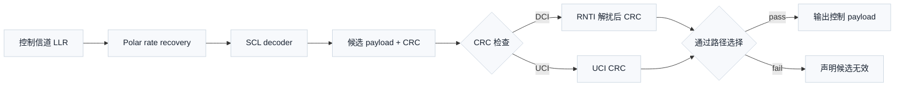

# T3.5 NR Polar 分段与 CRC 附加：控制信息的短块保护与路径选择
## 本节学习目标

本节第一次把 **Polar** 作为主角。Polar 不是一个普通“加校验位”的小技巧，而是一类信道编码方法：它把若干个原本相同的二元输入信道组合起来，再通过递归变换产生一组“合成信道”。随着码长增加，有些合成信道会变得越来越可靠，有些会变得越来越不可靠。发送端把真正的信息放到可靠位置，把固定值放到不可靠位置；接收端再利用这个结构恢复信息。

在 NR 中，Polar 主要用于控制信息。控制信息通常比数据信息短，但错误代价很高：调度命令错了，终端可能在错误资源上收发数据；混合自动重传请求的确认/否定确认（Acknowledgement/Negative Acknowledgement, ACK/NACK）错了，基站可能错误重传或错误丢包。因此，本节同时讲两条线：

- 理论线：Polar 的名称来源、信道极化直觉、冻结位、信息位、编码矩阵和列表译码。
- 协议线：TS 38.212 Rel-19 如何规定 NR 控制信息的 Polar 分段、循环冗余校验附加、下行控制信息的 24 bit CRC 和无线网络临时标识（Radio Network Temporary Identifier, RNTI）加扰。


- 解释 Polar 码中的“极化”指什么，不把它误解成调制极性或 I/Q 极性。
- 用 $N=2$ 和 $N=4$ 的小例子说明 Polar 编码矩阵如何把信息位扩散成编码位。
- 区分信息位、冻结位、CRC 位、奇偶校验位和速率匹配输出位。
- 读懂 TS 38.212 §5.2.1、§5.3.1、§5.3.1.2、§5.4.1、§6.3.1.2.1、§6.3.2.2.1、§7.3.2 和 §7.3.3 在接收链路中的先后关系。
- 解释上行控制信息和下行控制信息在 Polar 链路中为什么需要 CRC。
- 解释逐次消除列表译码（Successive Cancellation List, SCL）为什么要用 CRC 辅助路径选择。

## 前置知识检查

| 前置项 | 本节需要达到的程度 |
|:---|:---|
| 比特和异或 | 知道 `0/1` 是比特，异或可以理解成“不同为 1，相同为 0”。 |
| GF(2) | 知道二元有限域中加法等价于异或，乘法等价于普通 `0/1` 乘法。 |
| CRC | 知道 CRC 用于错误检测，不负责直接纠正错误。 |
| 对数似然比 | 知道 LLR 是接收端传给译码器的软信息。 |
| 传输块/码块 | 知道 TB 和 CB 是数据链路里的分层对象。 |
| HARQ | 知道 HARQ 会根据 ACK/NACK 和 CRC 结果决定是否重传或合并。 |

如果这些概念还不稳，本节会在 Polar 语境里重新解释关键点。真正需要提前掌握的只有两件事：第一，接收端看到的是带噪声的软信息，不是干净比特；第二，纠错码的任务是利用冗余和结构把最可能的原始比特找回来。

## 协议定位与本地证据

本节使用 3GPP TS 38.212 Rel-19 `38212-j30`，本地处理目录为 `3GPP_Rel19/processed/TS_38.212_38212-j30`。

| 协议位置 | 本地证据 |
| :--- | :--- |
| TS 38.212 Table 5.3-2 | `tables/table_0010.csv/html` |
| TS 38.212 §5.2.1 Polar coding | `content.md` lines around `## 5.2.1Polar coding`，`document.xml` |
| TS 38.212 §5.3.1 Polar coding | `content.md` lines around `## 5.3.1Polar coding` |
| TS 38.212 §5.3.1.2 Polar encoding | `content.md` lines around `## 5.3.1.2Polar encoding`，`tables/table_0012.csv/html` |
| TS 38.212 §5.4.1 Rate matching for Polar code | `content.md` lines around `## 5.4.1Rate matching for Polar code` |
| TS 38.212 §6.3.1.2.1 | `content.md` lines around `## 6.3.1.2.1UCI encoded by Polar code` |
| TS 38.212 §6.3.2.2.1 | `content.md` lines around `## 6.3.2.2.1UCI encoded by Polar code` |
| TS 38.212 §7.3.2 | `content.md` lines around `## 7.3.2CRC attachment`，`document.xml` |
| TS 38.212 §7.3.3 | `content.md` lines around `## 7.3.3Channel coding`，`document.xml` |

本节会复现本节实际使用的协议表格子集和教学公式。由于 `content.md` 对 §5.2.1 的分段公式和若干符号抽取不完整，涉及完整 UCI 分段条件、所有 $E$/$K$/$C$ 判定细节时，会明确标注边界，不把未逐符号核验的内容写成 bit-exact 结论。

## Polar 码的名称来源与历史位置

Polar 码由 Erdal Arikan 在 2009 年提出，核心论文题名是 *Channel Polarization: A Method for Constructing Capacity-Achieving Codes for Symmetric Binary-Input Memoryless Channels*。这里有三个关键词：

| 关键词 | 中文含义 | 本节解释 |
|:---|:---|:---|
| Channel | 信道 | 发送一个比特、接收一个带噪声观测值的概率系统。 |
| Polarization | 极化 | 原本统计特性相近的信道，经组合与拆分后，可靠性向两个方向显著分化。 |
| Code | 编码 | 发送端按规则增加结构，接收端利用结构纠错。 |

“极化”不是说比特变成正负电荷，也不是说星座点有极性。它说的是可靠性分化：一些合成信道越来越适合放信息，另一些合成信道越来越不适合放信息。这个思想非常适合短控制块，因为控制信息的块长不大、时延敏感，接收端可以用列表译码和 CRC 辅助选择提高可靠性。

NR 采用 Polar 的协议事实可以从 TS 38.212 Table 5.3-2 看到。本地 `tables/table_0010.csv/html` 抽取结果可复现为。左列是控制信息类型，右列是编码方案：

| Control Information | Coding scheme |
|:---|:---|
| DCI | Polar code |
| UCI | Block code |
| UCI | Polar code |

这张表只说明“哪类控制信息可以走哪类编码方案”。它不告诉你 Polar 怎样编码、UCI 什么时候走 block code、什么时候走 Polar，也不告诉你接收端怎样译码；这些要继续读 §5.2、§5.3、§5.4、§6.3 和 §7.3。

## 控制信息链路的工程动机

低密度奇偶校验码在 NR 里主要服务数据共享信道，适合大吞吐和并行译码；Polar 在 NR 中主要服务控制信息，适合短块、低时延和强检测。二者不是“谁更高级”的关系，而是服务对象不同。

| 对象 | 典型内容 | NR 编码家族 | 接收端风险 |
|:---|:---|:---|:---|
| 上行共享信道/下行共享信道数据 | 用户数据、媒体接入控制层PDU | LDPC | 大块译码失败导致数据不可用，可通过 HARQ 重传或软合并补救。 |
| UCI | HARQ-ACK、调度请求、信道状态信息 | block code 或 Polar | ACK/NACK 错误会改变重传行为；CSI 错误会影响调度和链路自适应。 |
| DCI | 资源分配、调制编码、冗余版本、HARQ process | Polar | 盲检误通过可能导致终端错误调度，漏检则错过本该接收或发送的资源。 |

物理上行控制信道（Physical Uplink Control Channel, PUCCH）可以承载 UCI；物理上行共享信道（Physical Uplink Shared Channel, PUSCH）也可以复用 UCI；物理下行控制信道（Physical Downlink Control Channel, PDCCH）承载 DCI。译码器看到的不是“PUCCH/PUSCH/PDCCH 这些资源名”，而是解调和解速率匹配后的一串 LLR，以及一组描述符：控制信息类型、payload 长度、候选 RNTI、码长、速率匹配长度、CRC 长度等。

控制信息短块的困难在于：有效比特少，冗余也有限，错误一次就可能造成协议状态机误动作。因此 CRC 在 Polar 控制链路中不只是最终验收，它还参与列表译码候选路径选择和 DCI 归属判断。

## 信道极化的最小直觉

先用一个非常小的模型解释 Polar 的核心。设有两个独立使用的同类二元信道。单独看，每个信道都一般可靠。Polar 的做法不是直接把两个信息比特分别发出去，而是先把输入比特混合：

$$
x_0 = u_0 \oplus u_1
\tag{1}
$$

$$
x_1 = u_1
\tag{2}
$$

其中 $u_0,u_1$ 是编码前的比特，$x_0,x_1$ 是要送入调制和信道的编码比特，$\oplus$ 是 GF(2) 加法，也就是异或。

这个变换可以写成矩阵形式：

$$
\mathbf{x}=\mathbf{u}\cdot\mathbf{F},\quad
\mathbf{F}=
\begin{bmatrix}
1 & 0\\
1 & 1
\end{bmatrix}
\tag{3}
$$

式 (3) 回答的问题是：两个输入比特怎样变成两个编码比特。所有运算都在 GF(2) 中进行，所以矩阵乘法里的“加法”是异或。若 $\mathbf{u}=[u_0,u_1]$，则：

$$
\mathbf{x}=[u_0\oplus u_1,\ u_1]
\tag{4}
$$

接收端先根据 $y_0,y_1$ 判断 $u_0$，再在已有 $u_0$ 判决的帮助下判断 $u_1$。这两个判断问题的可靠度不一样：第一个合成信道通常更难，第二个合成信道通常更容易。这就是最小的“极化”现象：两个原本相同的信道，经过组合与 successive cancellation 观察后，分成一个较差的合成信道和一个较好的合成信道。

## 冻结位、信息位与可靠性排序

如果某个合成信道不可靠，发送端不适合把真实信息放进去。Polar 的策略是：不可靠位置放发送端和接收端都知道的固定值，通常是 `0`；可靠位置放 payload bit、CRC bit 或协议定义的辅助 bit。

| 名称 | 英文 | 含义 | 接收端处理 |
|:---|:---|:---|:---|
| 冻结位 | frozen bit | 固定为已知值的位置，通常为 `0`。 | 译码时不允许自由判成 `0/1`，按已知值约束路径。 |
| 信息位 | information bit | 承载 payload 和 CRC 的位置。 | 译码时根据 LLR 和路径度量选择最可信值。 |
| 可靠性序列 | reliability sequence | 从低可靠到高可靠排列的 bit index 序列。 | 根据 $K$、$N$、速率匹配等条件选择信息集合。 |

TS 38.212 §5.3.1.2 明确给出 Polar sequence，并说明它按可靠性升序排列。本节不使用完整 1024 项可靠性序列做真实 NR 编码，但需要看懂表的形态。本地 `tables/table_0012.csv/html` 中 Table 5.3.1.2-1 的前 32 个可靠性序列值可复现为：

| Reliability order index | Bit index |
|---:|---:|
| 0 | 0 |
| 1 | 1 |
| 2 | 2 |
| 3 | 4 |
| 4 | 8 |
| 5 | 16 |
| 6 | 32 |
| 7 | 3 |
| 8 | 5 |
| 9 | 64 |
| 10 | 9 |
| 11 | 6 |
| 12 | 17 |
| 13 | 10 |
| 14 | 18 |
| 15 | 128 |
| 16 | 12 |
| 17 | 33 |
| 18 | 65 |
| 19 | 20 |
| 20 | 256 |
| 21 | 34 |
| 22 | 24 |
| 23 | 36 |
| 24 | 7 |
| 25 | 129 |
| 26 | 66 |
| 27 | 512 |
| 28 | 11 |
| 29 | 40 |
| 30 | 68 |
| 31 | 130 |

这张子表的读法是：左列是可靠性排名位置，右列是编码前 bit index。排名越靠前，可靠性越低；排名越靠后，可靠性越高。真实 NR 工程不能只用这 32 项，因为协议表覆盖更大母码长度；本节只用这 32 项说明“协议通过可靠性序列决定哪些位置更适合承载信息”。

## $N=4$ Polar 编码手算例子

Polar 码长通常是 $N=2^n$。当 $N=4$ 时，编码矩阵来自 $\mathbf{F}$ 的 Kronecker 幂：

$$
\mathbf{G}_4=\mathbf{F}^{\otimes 2}=
\begin{bmatrix}
1 & 0 & 0 & 0\\
1 & 1 & 0 & 0\\
1 & 0 & 1 & 0\\
1 & 1 & 1 & 1
\end{bmatrix}
\tag{5}
$$

式 (5) 回答的问题是：4 个编码前位置怎样混合成 4 个编码输出位置。假设可靠性排序表明位置 0 和 1 不可靠，位置 2 和 3 相对可靠。为了做教学例子，将位置 0、1 冻结为 `0`，把两个信息比特放到位置 2、3：

$$
\mathbf{u}=[0,\ 0,\ a,\ b]
\tag{6}
$$

编码为：

$$
\mathbf{x}=\mathbf{u}\cdot\mathbf{G}_4
\tag{7}
$$

逐列计算可以得到：

$$
x_0 = 0\oplus 0\oplus a\oplus b = a\oplus b
\tag{8}
$$

$$
x_1 = 0\oplus b = b
\tag{9}
$$

$$
x_2 = a\oplus b
\tag{10}
$$

$$
x_3 = b
\tag{11}
$$

所以：

$$
\mathbf{x}=[a\oplus b,\ b,\ a\oplus b,\ b]
\tag{12}
$$

这个例子不代表真实 NR 的可靠性集合，也不代表好的码率设计；它只说明三个基本事实：

- 冻结位是编码前位置上的已知约束，不是发送后随便删掉的比特。
- 信息位经过矩阵混合后会扩散到多个编码输出位置。
- 接收端译码必须知道同一套冻结位位置、信息位位置和编码矩阵，否则会在错误结构上恢复比特。

## Polar 译码的基本路径

最基础的 Polar 译码叫逐次消除译码（Successive Cancellation, SC）。它按 bit index 顺序一个个决定 $\hat{u}_i$。如果当前位置是冻结位，直接判为协议约定值；如果是信息位，就根据当前 LLR 和之前已判决的比特做硬判决。

SC 的问题是：早期判错会影响后续判断。控制信息短块里，一个早期错误可能让整个 DCI 或 UCI 变成另一条看似合理的控制消息。SCL 译码的改进是保留多条候选路径：遇到信息位时，不只保留 `0` 或 `1` 中最好的一个，而是保留若干条可能路径，更新每条路径的度量，最后再选择最可信路径。

| 译码方式 | 保留路径数 | 优点 | 风险 |
|:---|---:|:---|:---|
| SC | 1 | 结构简单、延迟低、存储少。 | 早期错误不可恢复。 |
| SCL | $M$ | 能保留多个候选，短块性能更好。 | 需要路径存储、排序和剪枝。 |
| CRC-aided SCL | $M$ | CRC 帮助从候选中选出满足校验的路径。 | CRC 长度、RNTI mask 或 bit 顺序错会导致误选。 |

CRC 辅助 SCL 不是说 CRC 负责纠错。更准确地说：SCL 先提出多个候选答案，CRC 负责过滤掉不满足校验关系的候选。如果多个候选都通过 CRC，再用路径度量选最可信的一条。

## NR Polar 控制信息的协议链路

TS 38.212 的 Polar 控制链路可以分成通用编码规则和具体控制信息调用规则。

通用规则：

```text
§5.2.1 Polar code block segmentation and CRC attachment
  -> §5.3.1 Polar channel coding
  -> §5.4.1 Polar rate matching
```

PUCCH 上的 UCI 调用链路：

```text
§6.3.1.1 UCI bit sequence generation
  -> §6.3.1.2 code block segmentation and CRC attachment
  -> §6.3.1.2.1 UCI encoded by Polar code
  -> §6.3.1.3.1 channel coding
  -> §6.3.1.4.1 / §6.3.1.4.3 rate matching
```

PUSCH 上的 UCI 调用链路：

```text
§6.3.2.1 UCI bit sequence generation
  -> §6.3.2.2 code block segmentation and CRC attachment
  -> §6.3.2.2.1 UCI encoded by Polar code
  -> §6.3.2.3.1 channel coding
  -> §6.3.2.4.1 rate matching
```

PDCCH 上的 DCI 调用链路：

```text
§7.3.1 DCI payload and size alignment
  -> §7.3.2 CRC attachment
  -> §7.3.3 Polar channel coding
  -> §7.3.4 Polar rate matching
```

接收端按照反方向处理：先从物理信道得到 LLR，再做速率恢复，然后 Polar SCL 译码，再做 CRC/RNTI 检查，最后把 payload 交给控制流程。



## UCI 的 Polar 分段与 CRC 附加

UCI 是终端上行反馈给网络的控制信息。它可以承载 HARQ-ACK、调度请求（Scheduling Request, SR）和信道状态信息（Channel State Information, CSI）。这些内容长度差异很大：1 bit ACK/NACK 很短，CSI 可能更长。因此协议不能对所有 UCI 都用同一条编码路径。

TS 38.212 §6.3.1.2 把 PUCCH 上的 UCI 分为 Polar-coded path 和 small-block path。§6.3.1.2.1 是 UCI encoded by Polar code；§6.3.1.2.2 是 UCI encoded by channel coding of small block lengths。§6.3.2.2.1 说明 PUSCH 上 UCI encoded by Polar code 的分段和 CRC 附加按 §6.3.1.2.1 执行。

对于 Polar-coded UCI，§6.3.1.2.1 明确存在两种 CRC 长度路径：

$$
L_{\mathrm{UCI}}\in\{6,\ 11\}
\tag{13}
$$

其中 $L_{\mathrm{UCI}}$ 是 UCI CRC parity bits 数量。协议文本说明：

- 一条路径设置 CRC 长度为 6 bit，并使用 §5.1 中相应 generator polynomial。
- 另一条路径设置 CRC 长度为 11 bit，并使用 §5.1 中相应 generator polynomial。

如果 UCI payload 长度为 $A$，本次选择的 CRC 长度为 $L_{\mathrm{UCI}}$，则进入 Polar 信息集合的比特数可抽象为：

$$
K=A+L_{\mathrm{UCI}}
\tag{14}
$$

式 (14) 回答的是“payload 加 CRC 以后有多少个待保护比特”。这里的 $K$ 是 Polar 语境下的信息集合大小，不是 T3.4 NR LDPC 中的基图扩展后码块长度。工程实现里必须把每个 descriptor 的 $A$、$L_{\mathrm{UCI}}$、$K$、rate matching output length $E$ 和 code block count $C$ 一起记录，否则接收端无法正确做速率恢复和 CRC 检查。

本地 `content.md` 对 §6.3.1.2.1 的部分判定公式符号缺失，因此本节不重建完整 UCI 分段判定表。后续 UCI 专章需要结合原始 Word XML、§6.3.1.4.1、§6.3.1.4.3 和 PUSCH 资源公式，把 $A$、$E$、$C$ 与 6/11 bit CRC 的完整条件逐项复现。

## DCI 的 24 bit CRC 与 RNTI 加扰

DCI 是基站通过 PDCCH 下发给终端的控制命令。终端会在搜索空间里尝试多个候选 PDCCH，接收机并不知道哪个候选一定有属于自己的 DCI。因此 DCI 译码天然带有“盲检”属性：接收端要判断这个候选是不是一个合法 DCI，还要判断它是不是发给自己的。

TS 38.212 §7.3.2 给出 DCI CRC attachment。协议事实可以概括为三步：

1. 整个 DCI payload 用于计算 CRC parity bits。
2. CRC 长度设置为 24 bit。
3. CRC parity bits 附加后，用对应的无线网络临时标识（Radio Network Temporary Identifier, RNTI）加扰。

因此 DCI CRC 长度为：

$$
L_{\mathrm{DCI}}=24
\tag{15}
$$

若 DCI payload 长度为 $A$，CRC 附加后进入 Polar coding 的信息长度为：

$$
K=A+24
\tag{16}
$$

RNTI 加扰的工程含义是：CRC 不仅检测错误，还承担“这条 DCI 是否属于某个 RNTI”的过滤作用。把 CRC 附加后的序列记为 $\mathbf{b}$，把 RNTI 加扰后的序列记为 $\mathbf{c}$。教学化表达为：

$$
c_k =
\begin{cases}
b_k, & 0 \le k < A\\
b_k \oplus r_{k-A}, & A \le k < A+24
\end{cases}
\tag{17}
$$

其中 $r_i$ 是候选 RNTI 的 bit。真实工程实现必须严格核对 §7.3.2 对 RNTI 最高有效位（Most Significant Bit, MSB）和 CRC parity bit 对应关系的描述，不能只按式 (17) 的教学下标猜测 bit order。

接收端盲检时会对候选 RNTI 做反向检查：

$$
b_k =
\begin{cases}
c_k, & 0 \le k < A\\
c_k \oplus r_{k-A}, & A \le k < A+24
\end{cases}
\tag{18}
$$

若使用正确 RNTI，CRC 有机会通过；若使用错误 RNTI，CRC 通常失败。这里说“通常”是因为 CRC 存在极低概率误通过，工程验证要统计 false alarm。

## CRC 辅助 SCL 路径选择

设 SCL 译码保留 $M$ 条候选路径：

$$
\hat{\mathbf{u}}^{(0)},\hat{\mathbf{u}}^{(1)},\ldots,\hat{\mathbf{u}}^{(M-1)}
\tag{19}
$$

每条路径都有路径度量（Path Metric, PM）$PM_m$。数值越小表示该路径与接收 LLR 越一致。CRC 检查把候选路径分成通过集合和失败集合：

$$
\mathcal{V}=\{m:\mathrm{CRC}(\hat{\mathbf{u}}^{(m)})=\mathrm{pass}\}
\tag{20}
$$

若 $\mathcal{V}$ 非空，接收端选择 CRC 通过且路径度量最好的路径：

$$
\hat{m}=\arg\min_{m\in\mathcal{V}} PM_m
\tag{21}
$$

若 $\mathcal{V}$ 为空，控制信息不能作为有效 payload 输出。实现可以记录 best metric path 用于调试，但不能把 CRC fail 的 payload 交给调度器或 HARQ 控制器。

这个规则说明 CRC 在 Polar 中有三个角色：

- 错误检测：判断候选 payload+CRC 是否满足生成多项式关系。
- 路径选择：在多条 SCL 候选中筛掉 CRC fail 路径。
- DCI 归属判断：结合 RNTI 加扰判断候选 DCI 是否面向当前 RNTI。

## 数值例子：DCI 候选路径选择

设一个 DCI payload 长度为：

$$
A=32
\tag{22}
$$

根据 §7.3.2，DCI CRC 长度为 24 bit：

$$
K=A+L_{\mathrm{DCI}}=32+24=56
\tag{23}
$$

接收端对某个 PDCCH candidate 和某个候选 RNTI 做 SCL 译码，得到 4 条路径：

| 路径 | 路径度量 $PM$ | RNTI 解扰后 CRC | 接收端处理 |
|---:|---:|:---|:---|
| 0 | 3.1 | fail | 度量最好但 CRC fail，不能输出。 |
| 1 | 3.4 | pass | 当前可接受路径。 |
| 2 | 4.0 | pass | CRC pass，但度量差于路径 1。 |
| 3 | 4.8 | fail | 不接受。 |

按式 (21)，选择路径 1。这个例子要记住的不是具体数值，而是优先级：CRC pass 是有效性门控，路径度量用于在通过路径中排序。若只看 metric，路径 0 会被错误输出；若只看 CRC 而不看 metric，路径 1 和路径 2 无法排序。

## 接收端流程

输入：

- 控制信道候选 LLR。
- 控制信息类型：DCI、PUCCH UCI 或 PUSCH UCI。
- payload 长度和 rate matching output length。
- 候选 RNTI，仅 DCI 盲检必需。
- Polar 配置：$N$、$K$、冻结位集合、可靠性序列索引、list size。

输出：

- payload bits。
- CRC pass/fail。
- 命中的候选 RNTI，若适用。
- 被选中的 SCL 路径编号、路径度量、失败原因。

流程：

1. 根据控制信息类型定位协议链路。
2. 根据 payload 长度和协议条件确定 CRC 长度。
3. 根据 $K$、$E$ 和协议规则恢复 Polar rate-matched LLR。
4. 根据 TS 38.212 §5.3.1.2 的可靠性序列建立信息位集合和冻结位集合。
5. 执行 SCL 译码，保留多条候选路径。
6. 对每条候选路径做 CRC 检查；DCI 还要对 CRC parity bits 按候选 RNTI 反向处理。
7. 若有 CRC pass 路径，选择 path metric 最优者。
8. 若没有 CRC pass 路径，声明本候选无效，不输出 payload。
9. 记录 descriptor、CRC 长度、RNTI、路径度量和失败原因，供仿真与硬件 debug 使用。

## 伪代码

```python
def choose_crc_aided_path(paths):
    """Return best CRC-passing path.

    Time: O(M), where M is the SCL list size.
    Space: O(1), excluding the input path storage.
    """
    best = None
    for path in paths:
        if not path["crc_pass"]:
            continue
        if best is None or path["metric"] < best["metric"]:
            best = path
    return best


def descramble_dci_crc_bits(bits, rnti_bits, payload_len):
    """Undo DCI CRC RNTI scrambling on the CRC part only.

    Time: O(24), Space: O(A + 24) for the copied output list.
    """
    out = list(bits)
    for i in range(24):
        out[payload_len + i] ^= rnti_bits[i]
    return out


paths = [
    {"idx": 0, "metric": 3.1, "crc_pass": False},
    {"idx": 1, "metric": 3.4, "crc_pass": True},
    {"idx": 2, "metric": 4.0, "crc_pass": True},
    {"idx": 3, "metric": 4.8, "crc_pass": False},
]

winner = choose_crc_aided_path(paths)
assert winner["idx"] == 1
print("T3.5_POLAR_CRC_PATH_SELECTION_OK")
```

这个伪代码只验证 CRC 辅助路径选择和 DCI CRC 区域的 RNTI 反向处理位置，不实现真实 Polar 编码、真实 CRC 多项式、真实可靠性序列选择或真实速率恢复。它的作用是把接收端控制逻辑固定下来，避免后续实现 SCL 时把 CRC fail 路径错误输出。

## 工业用例

| 用例 | 输入 | 输出 | 边界条件 | 失败案例 | 验证方式 |
|:---|:---|:---|:---|:---|:---|
| PDCCH DCI 盲检 | PDCCH candidate LLR、candidate RNTI、DCI payload size、list size | DCI payload、CRC 状态、RNTI 命中状态 | 多个候选 RNTI、多种 DCI size alignment、低 SNR 下路径度量接近 | 错误 RNTI 也通过 CRC，导致 false alarm；正确 RNTI CRC fail，导致 missed detection | 枚举 candidate/RNTI，统计 false alarm、missed detection 和 CRC pass path metric 分布。 |
| PUCCH/PUSCH UCI 译码 | UCI LLR、payload size、PUCCH/PUSCH 上下文、rate matching length | UCI payload、CRC 状态、路径度量 | small block 与 Polar 分界、6/11 bit CRC 切换、CSI part 组合 | CRC 长度选择错误，导致所有路径 fail 或误通过 | 枚举 UCI payload size 和 CRC 长度，检查 descriptor、$K$、$E$ 和 CRC status 一致。 |

## 浮点仿真方案

本节的浮点仿真目标不是完整 Polar 块错误率曲线，而是验证控制信息 CRC 和 SCL 路径选择的行为。

| 仿真项 | 方法 | 通过条件 |
|:---|:---|:---|
| $N=4$ 教学编码 | 用 GF(2) 矩阵乘法验证式 (5)-式 (12) | 对所有 $a,b\in\{0,1\}$，Python 输出与手算一致。 |
| CRC path selector | 构造多条路径、路径度量和 CRC 状态 | 只在 CRC pass 集合中选择 metric 最优路径。 |
| DCI RNTI 反向处理 | 构造 payload+CRC toy bits，按 24 bit RNTI mask 加扰和解扰 | 正确 RNTI 恢复原 CRC bits；错误 RNTI 改变 CRC bits。 |
| UCI descriptor | 构造 $A$ 和 $L_{\mathrm{UCI}}\in\{6,11\}$ | $K=A+L_{\mathrm{UCI}}$，descriptor 与 CRC checker 使用同一长度。 |
| 失败注入 | 随机翻转候选路径中的 payload 或 CRC bit | CRC fail 路径不输出 valid payload。 |

建议命令：

```bash
python3 - <<'PY'
def choose_crc_aided_path(paths):
    best = None
    for path in paths:
        if not path["crc_pass"]:
            continue
        if best is None or path["metric"] < best["metric"]:
            best = path
    return best

paths = [
    {"idx": 0, "metric": 3.1, "crc_pass": False},
    {"idx": 1, "metric": 3.4, "crc_pass": True},
    {"idx": 2, "metric": 4.0, "crc_pass": True},
    {"idx": 3, "metric": 4.8, "crc_pass": False},
]
assert choose_crc_aided_path(paths)["idx"] == 1
print("T3.5_POLAR_CRC_PATH_SELECTION_OK")
PY
```

## 定点化策略

Polar SCL 的定点重点不在 CRC 计算本身，而在 LLR、路径度量、排序和路径复制。

| 对象 | 定点关注点 | 工程建议 |
|:---|:---|:---|
| 输入 LLR | 符号约定、位宽、饱和、缩放 | 复用 T2.11 的 LLR 量化规则，单独统计控制信道饱和率。 |
| 路径度量 | 累加位宽、比较精度、饱和策略 | 选择足够位宽，避免两个路径本应排序不同却被量化成相同。 |
| 部分和 | GF(2) 中间判决存储 | 与路径 ID 绑定，路径复制时必须同步复制。 |
| CRC syndrome | 每条路径的 CRC 状态 | 不要只对最终 best metric path 做 CRC；否则无法实现 CRC-aided selection。 |
| RNTI mask | 24 bit 对应关系 | 单独写 bit-order 单元测试，覆盖 MSB/LSB 方向。 |

一个常见硬件错误是：SCL 排序器只保留路径度量和 payload，不保留 CRC 相关状态，最后只能对一条路径做 CRC。这会把 CA-SCL 退化成“best metric then CRC”，性能和错误行为都不对。

## 硬件实现映射

| 模块 | 输入 | 输出 | 关键风险 |
|:---|:---|:---|:---|
| Control descriptor parser | 控制类型、payload size、候选 RNTI、rate matching length | CRC length、$K$、$E$、Polar 参数、RNTI mask | DCI/UCI descriptor 混用。 |
| Polar rate recovery | rate-matched LLR | Polar decoder input LLR | puncturing、shortening、repetition 反操作错误。 |
| Frozen/information mask generator | $N$、$K$、可靠性序列、速率匹配集合 | frozen mask、information mask | 可靠性序列方向读反。 |
| SCL decoder core | LLR、frozen mask、list size | 候选 payload+CRC、路径度量 | 路径复制、部分和和 metric 排序不一致。 |
| CRC checker | 候选路径、CRC 长度、候选 RNTI | pass/fail per path | DCI RNTI bit 顺序、UCI CRC 长度错误。 |
| Output gate | CRC pass paths、path metrics | valid payload、status flags | CRC fail 仍输出 payload。 |

硬件上，CRC checker 可以在路径形成后并行检查多条候选，或者按 list index 流水处理。若 list size 较大，最后的 CRC 检查和路径选择可能成为尾部延迟瓶颈。实现要在低延迟控制信道目标和面积之间折中。

## 验证方法

| 验证层级 | 用例 | 检查点 |
|:---|:---|:---|
| 单元测试 | $N=4$ Polar 教学编码 | GF(2) 矩阵乘法与手算输出一致。 |
| 单元测试 | CRC path selector | 多条路径同时 pass 时，选择 metric 最优路径。 |
| 单元测试 | DCI RNTI mask | 正确 RNTI 能恢复 CRC bits，错误 RNTI 改变 CRC bits。 |
| 描述符测试 | UCI Polar descriptor | payload size、CRC length、$K$、$E$ 在 decoder/CRC checker 中一致。 |
| 集成测试 | PDCCH blind detection | candidate、RNTI、CRC 状态和 DCI valid 一致。 |
| 失败注入 | 翻转 payload 或 CRC bit | CRC fail 不输出 valid payload。 |
| 覆盖率 | list size、CRC pass path index、metric tie | 覆盖首路径 pass、末路径 pass、多路径 pass、全 fail。 |

本节没有实现真实 Polar bit-exact 编码器和译码器，因此不能声明 PDCCH/PUCCH/PUSCH Polar 链路已经 bit-exact。它建立的是理论底座、协议入口、CRC/RNTI 语义和接收端控制逻辑。

## 常见错误

| 错误 | 后果 | 修正 |
|:---|:---|:---|
| 把 Polar 只理解成“控制信道用的编码名” | 后续看可靠性序列、冻结位和 SCL 时只会背流程 | 先理解信道极化、冻结位、信息位和编码矩阵。 |
| 把可靠性序列方向读反 | 把信息放到低可靠位置，性能严重下降 | TS 38.212 §5.3.1.2 表示 Polar sequence 按可靠性升序排列。 |
| 把 UCI 和 DCI 的 CRC 长度混用 | UCI 全 fail 或 DCI 误检 | DCI 使用 24 bit CRC；UCI Polar 场景按协议条件使用 6 或 11 bit CRC。 |
| 把 CRC 只当最终验收 | SCL 路径选择缺失 | 为每条候选路径保存 CRC 状态，先筛 CRC pass，再按 metric 选择。 |
| 忽略 DCI RNTI 加扰 | 错误 DCI 可能被当成有效调度 | DCI CRC 检查必须结合候选 RNTI 反向处理。 |
| CRC fail 仍输出 payload | 调度器或 HARQ 控制器接收到不可信控制信息 | 输出 gate 必须由 CRC pass 控制。 |
| 只用 best metric path 做 CRC | CRC-aided SCL 退化，可能丢掉正确路径 | 对所有候选路径做 CRC，再选择通过路径中 metric 最优者。 |

## 工程思考题

1. Polar 码中的“极化”具体指哪种分化？
2. 冻结位为什么不能在接收端自由判决？
3. DCI 的 CRC 为什么还要用 RNTI 加扰？
4. CRC-aided SCL 中，CRC pass 和 path metric 的优先关系是什么？
5. UCI 为什么既可能走 small block coding，也可能走 Polar coding？
6. 若 SCL list 中没有任何路径通过 CRC，输出 best metric payload 会造成什么风险？

## 工程思考题参考答案

1. 指合成信道可靠性的分化：一部分 bit index 对应的合成信道越来越可靠，适合放信息；另一部分越来越不可靠，适合放冻结位。
2. 冻结位是发送端和接收端共同知道的约束。若接收端允许冻结位自由判决，就等于破坏编码结构，路径度量和后续判决都会失去协议约束。
3. RNTI 加扰让 CRC 同时承担错误检测和 DCI 归属判断。终端用候选 RNTI 反向处理 CRC 部分，只有 CRC 通过才认为候选 DCI 可能属于该 RNTI。
4. 先筛选 CRC pass 路径，再在 CRC pass 路径中选择 path metric 最优者。CRC fail 路径不能输出，即使 metric 更好。
5. 极短 UCI 用专门 small block coding 更合适；较长 UCI 才进入 Polar 路径。协议按 UCI payload size 和相关条件区分，并在 §6.3.1.2/§6.3.2.2 中给出调用路径。
6. 会把未通过错误检测的控制信息交给调度器或 HARQ 控制器，可能造成误调度、错误 ACK/NACK 或错误状态转移。工程实现可以记录 best metric path 供 debug，但不能作为 valid payload 输出。

## 自测题

1. TS 38.212 Table 5.3-2 中 DCI 使用哪类编码？
2. Polar 编码中冻结位通常放在可靠位置还是不可靠位置？
3. DCI CRC 长度是多少？
4. DCI CRC parity bits 与哪个标识相关？
5. UCI Polar 场景中本节核到的 CRC 长度有哪些？
6. SCL 路径选择中，如果路径 0 metric 最好但 CRC fail，路径 1 metric 次好且 CRC pass，应该选哪条？

## 自测题参考答案

1. DCI 使用 Polar code。
2. 冻结位放在不可靠位置；可靠位置用于 payload、CRC 或协议定义的辅助 bit。
3. 24 bit。
4. 与 RNTI 相关；CRC parity bits 会用对应 RNTI 加扰。
5. 6 bit 和 11 bit，具体由 TS 38.212 §6.3.1.2.1 的条件决定。
6. 选择路径 1，因为 CRC pass 是有效性门控，path metric 只在 CRC pass 路径中排序。

## 本节验收

| 验收项 | 通过标准 |
|:---|:---|
| Polar 理论底座 | 能解释信道极化、冻结位、信息位、可靠性序列和 $N=4$ 编码例子。 |
| 协议精读 | 能指出 TS 38.212 中 §5.2.1、§5.3.1、§5.4.1、§6.3.1.2.1、§6.3.2.2.1、§7.3.2、§7.3.3 的作用。 |
| DCI CRC | 能说明 24 bit CRC、RNTI 加扰和 PDCCH 盲检之间的关系。 |
| UCI CRC | 能说明 UCI Polar 场景存在 6/11 bit CRC 路径，且 PUSCH 复用 PUCCH 的相关规则入口。 |
| 接收端控制 | 能写出 CRC-aided SCL 的路径选择规则，且不会输出 CRC fail payload。 |
| 证据边界 | 能说明本节没有完整复现 §5.2.1 所有分段公式和完整 Polar reliability sequence。 |

## 资料与协议边界

本节围绕 TS 38.212 的 NR Polar 控制信息链路精读。已经核验的本地证据包括：

- `tables/table_0010.csv/html`：Table 5.3-2 控制信息编码方案。
- `tables/table_0012.csv/html`：Table 5.3.1.2-1 Polar sequence；正文只复现前 32 项用于解释表结构。
- `content.md` 与 `sections.jsonl`：§5.2.1、§5.3.1、§5.3.1.2、§5.4.1、§6.3.1.2.1、§6.3.2.2.1、§7.3.2、§7.3.3 的章节定位。
- `content.md` lines around §7.3.2：DCI 24 bit CRC 和 RNTI 加扰文本。

边界说明：

- 本节不重建完整 TS 38.212 Table 5.3.1.2-1 的 1024 项序列；后续 NR Polar reliability sequence 专章需要完整复现或表格化。
- 本节不重建 §5.2.1 的所有 code block segmentation 公式，因为当前 `content.md` 对公式符号抽取缺失，需结合原始 Word XML/OMML 再做 bit-exact 讲解。
- 本节不展开 PDCCH 搜索空间、DCI size alignment、PUCCH/PUSCH 资源映射和完整 rate matching 反操作；这些属于后续控制信道或 Polar rate recovery 章节。
- Arikan 论文在本节用于历史背景和理论来源；本节未照搬论文公式，只用自写 $N=2$/$N=4$ 教学模型解释极化编码结构。

## 协议证据表

| 证据 | 状态 | 本节结论 |
|:---|:---|:---|
| TS 38.212 Table 5.3-2，`table_0010.csv/html` | 已核验并复现 | DCI 使用 Polar code；UCI 可使用 block code 或 Polar code。 |
| TS 38.212 §5.2.1 | 已定位，公式抽取不完整 | Polar code block segmentation and CRC attachment 通用入口。 |
| TS 38.212 §5.3.1 | 已定位 | Polar channel coding 通用入口。 |
| TS 38.212 §5.3.1.2，`table_0012.csv/html` | 已定位并复现子集 | Polar sequence 按可靠性升序排列；本节只使用前 32 项解释表结构。 |
| TS 38.212 §5.4.1 | 已定位 | Polar rate matching 包含 sub-block interleaving、bit selection 和 coded-bit interleaving。 |
| TS 38.212 §6.3.1.2.1 | 已定位 | PUCCH UCI encoded by Polar code 调用 Polar 分段/CRC，存在 6/11 bit CRC 路径。 |
| TS 38.212 §6.3.2.2.1 | 已定位 | PUSCH UCI encoded by Polar code 的分段和 CRC 附加按 §6.3.1.2.1。 |
| TS 38.212 §7.3.2 | 已核对 `content.md`/`document.xml` | DCI 使用 24 bit CRC，CRC parity bits 用对应 RNTI 加扰。 |
| TS 38.212 §7.3.3 | 已核对 `content.md`/`document.xml` | DCI CRC 后进入 Polar coding。 |
## 执行与证据记录

| 项目 | 记录 |
|:---|:---|
| 本地协议检索 | 使用 `rg`、`sed` 检索 TS 38.212 `content.md`、`sections.jsonl`、`document.xml` 和 `tables/*.csv/html`。 |
| 表格复现 | 复现 Table 5.3-2 全部控制信息编码映射；复现 Table 5.3.1.2-1 前 32 项作为可靠性序列格式教学子集。 |
| 理论重构 | 补入 Polar 名称来源、Arikan 2009 背景、$N=2$/$N=4$ GF(2) 编码矩阵、冻结位、信息位、可靠性序列和 SCL/CRC 关系。 |
| Python 验证 | 使用本节伪代码检查 CRC pass 路径选择逻辑。 |
| 审计更新 | 已在 `合规与遵从.md` 增加“协议索引化防复发规则”，并新增 `tools/audit_lesson_depth.py`。 |
| 未覆盖内容 | 完整 §5.2.1 Polar segmentation 公式、完整 1024 项可靠性序列、真实 CRC 多项式 bit-exact、PDCCH search space、DCI size alignment、Polar rate recovery bit-exact。 |

## 参考文献

- [Arikan, 2009] E. Arikan, "Channel Polarization: A Method for Constructing Capacity-Achieving Codes for Symmetric Binary-Input Memoryless Channels," IEEE Transactions on Information Theory, 2009.
- [3GPP, 2026] 3GPP TS 38.212, Rel-19, `38212-j30`, Multiplexing and channel coding, §5.2.1, §5.3.1, §5.3.1.2, §5.4.1, §6.3.1.2.1, §6.3.2.2.1, §7.3.2, §7.3.3, Table 5.3-2, Table 5.3.1.2-1. Local path: `3GPP_Rel19/processed/TS_38.212_38212-j30`.
