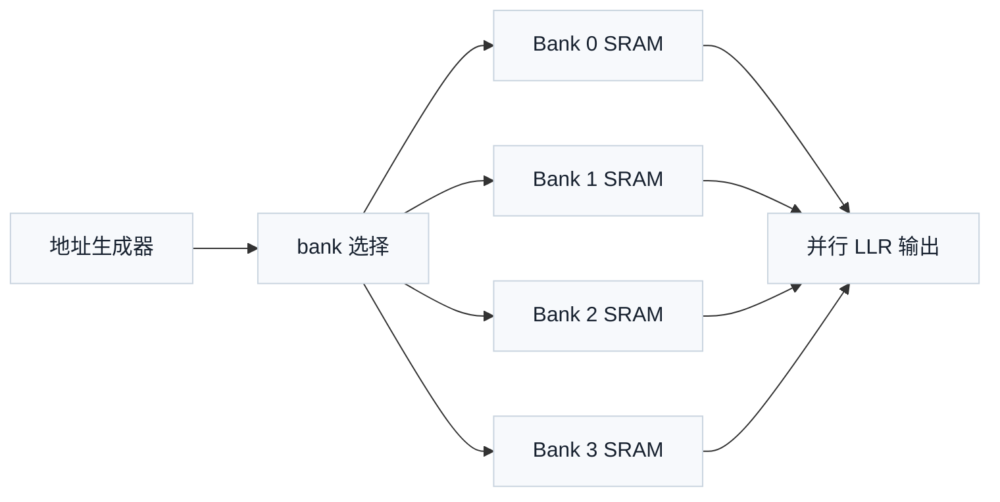

# T5.2 存储分 bank 与缓存基础：译码器并行访问为何受存储结构约束
## 本节学习目标

译码器不是只由公式组成。真实接收机要在有限时钟周期内读取大量对数似然比、中间消息、路径度量、交织地址和循环缓存内容。算法看起来可以并行，硬件却可能卡在一个更朴素的问题上：同一个时钟周期内，数据能不能从存储器里读出来、写回去，并且不互相撞车。

本节讲静态随机存取存储器、寄存器文件（register file）、乒乓缓存（ping-pong buffer）、循环缓存（circular buffer）、存储分 bank（memory banking）和 bank 冲突（bank conflict）。这些不是 3GPP 空口协议规定的字段，而是寄存器传输级和专用集成电路译码器实现必须掌握的基础。


- 解释 SRAM、寄存器文件、缓存、bank 和端口的区别。
- 说明为什么并行译码器需要把数据分散到多个 bank。
- 用取模映射手算某组地址是否发生 bank 冲突。
- 解释乒乓缓存如何让“写入下一块”和“处理当前块”重叠。
- 说明 LTE Turbo、NR 低密度奇偶校验码和 NR Polar译码为什么都绕不开存储组织。
- 把协议中的 circular buffer、rate matching、路径存储等概念翻译成接收端存储需求，而不是只背协议章节。

## 前置知识检查

| 前置项 | 本节需要达到的程度 |
|:---|:---|
| LLR | 知道它是译码器输入软信息。 |
| 定点数 | 知道一个 LLR 在硬件中通常保存为固定位宽整数。 |
| 数组地址 | 能理解 `buffer[7]` 表示访问第 7 个元素。 |
| 时钟周期 | 能理解硬件在每个周期做有限次数读写。 |
| 混合自动重传请求 | 知道 HARQ 会保留软信息等待重传合并。 |

如果只记住一句话：并行度不是“想开几路就开几路”，还要看存储器每周期能提供多少个互不冲突的读写访问。

## 资料与协议边界

本节是工程基础课，但它和 3GPP 协议有直接上下游关系。协议规定某些数据流如何排列、选择和重传；硬件实现必须把这些规则落到地址、缓存和 bank 上。

| 协议背景 | 本地证据 |
| :--- | :--- |
| LTE TS 36.212 Rel-19 `36212-j30` §5.1.4.1 | `3GPP_Rel19/processed/TS_36.212_36212-j30/TS_36.212_36212-j30_content.md` |
| NR TS 38.212 Rel-19 `38212-j30` §5.4.2 | `3GPP_Rel19/processed/TS_38.212_38212-j30/TS_38.212_38212-j30_content.md` |
| NR TS 38.212 Rel-19 `38212-j30` §5.4.1 | `3GPP_Rel19/processed/TS_38.212_38212-j30/TS_38.212_38212-j30_content.md` |

协议边界必须说清：3GPP 规定比特序列、交织、速率匹配和冗余版本的语义；它不规定芯片内部 SRAM 要分几个 bank、每个 bank 多宽、是否用乒乓缓存、是否复制某些热点数据。后者是实现选择，但必须保持协议 bit-exact 行为。

## 存储器的基本对象

先把几个容易混的词拆开。

| 对象 | 零基础解释 | 译码器中的典型用途 |
|:---|:---|:---|
| 寄存器 | 很少量、很快、通常直接在触发器中保存的值。 | 状态机状态、计数器、当前地址、少量临时 LLR。 |
| 寄存器文件 | 多个寄存器组成的小型可寻址存储。 | 小规模路径度量、短向量临时缓存。 |
| SRAM | 面积效率更高的片上存储器。 | HARQ soft buffer、LDPC 消息、Turbo 交织输入输出。 |
| 缓存 | 为某个处理阶段暂存数据的存储结构。 | 当前码块 LLR、下一码块输入、输出硬判决。 |
| Bank | 把一个大存储拆成多个独立小存储。 | 多路并行读取时减少访问冲突。 |
| 端口 | 一个周期内可进行的一次读或写通道。 | 单端口、双端口、多端口决定并发读写能力。 |

一个常见误解是“SRAM 很大，所以一定够用”。容量够不等于带宽够。译码器经常不是放不下数据，而是同一个周期需要读多个地址，其中两个地址落到同一个单端口 bank，导致其中一个访问必须等待。

## 存储容量与存储带宽

容量回答的问题是“能放多少数据”。带宽回答的问题是“每个周期能搬多少数据”。如果一个码块有 $N=6144$ 个 LLR，每个 LLR 为 6 bit，那么只保存一份输入 LLR 需要：

$$
M=N\cdot 6=6144\times6=36864\ \mathrm{bit}
\tag{1}
$$

这只是容量。若译码器每周期要并行读取 $P=8$ 个 LLR，每个 LLR 仍为 6 bit，则每周期读带宽需求为：

$$
B_{\mathrm{read}}=P\cdot6=48\ \mathrm{bit/cycle}
\tag{2}
$$

若 SRAM 每个 bank 每周期只能读一个 6 bit 元素，那么至少需要 8 个可并行读取的 bank，或者需要更宽的 SRAM word，或者降低并行度。容量公式无法替代带宽分析。

## 访问模式与并行调度

并行译码的存储问题可以抽象成三件事：

| 问题 | 数学化描述 | 工程含义 |
|:---|:---|:---|
| 每周期要读哪些地址 | 地址集合 $\mathcal{A}_t=\{a_0,a_1,\ldots,a_{P-1}\}$ | 第 $t$ 个周期的并行访问需求。 |
| 地址落到哪些 bank | $\mathrm{bank}(a_i)$ | 判断这些访问能不能同周期发生。 |
| 冲突时如何处理 | stall、重排、复制或改映射 | 决定吞吐、面积和控制复杂度。 |

如果一个周期的地址集合为：

$$
\mathcal{A}_t=\{a_0,a_1,\ldots,a_{P-1}\}
\tag{3}
$$

无冲突的基本条件是这些地址映射到互不相同的 bank：

$$
\mathrm{bank}(a_i)\ne \mathrm{bank}(a_j),\quad i\ne j
\tag{4}
$$

这就是为什么协议里的交织、循环缓存和速率匹配会影响硬件。协议改变的是“逻辑比特读取顺序”；硬件看到的是“每周期地址集合”。如果逻辑顺序导致很多地址落在同一个 bank，就算算法并行度写成 8 路，实际也会被存储冲突压回低吞吐。

## 分 bank 的基本映射

最简单的 bank 映射是取模：

$$
\mathrm{bank}(a)=a\bmod B
\tag{5}
$$

其中 $a$ 是元素地址，$B$ 是 bank 数。每个 bank 内部地址为：

$$
\mathrm{row}(a)=\left\lfloor \frac{a}{B}\right\rfloor
\tag{6}
$$

如果有 4 个 bank，地址 0 到 11 的映射如下：

| 地址 | bank | bank 内 row |
|---:|---:|---:|
| 0 | 0 | 0 |
| 1 | 1 | 0 |
| 2 | 2 | 0 |
| 3 | 3 | 0 |
| 4 | 0 | 1 |
| 5 | 1 | 1 |
| 6 | 2 | 1 |
| 7 | 3 | 1 |
| 8 | 0 | 2 |
| 9 | 1 | 2 |
| 10 | 2 | 2 |
| 11 | 3 | 2 |

这种映射适合连续地址并行访问。例如同一周期读地址 `[4,5,6,7]`，它们分别落在 bank 0、1、2、3，不冲突。

## 手算例子：bank 冲突判断

假设有 4 个单读端口 bank，采用式 (5) 的取模映射。某个译码步骤同一周期要读四个地址：

```text
0, 4, 8, 12
```

逐个计算 bank：

$$
0\bmod4=0
\tag{7}
$$

$$
4\bmod4=0
\tag{8}
$$

$$
8\bmod4=0
\tag{9}
$$

$$
12\bmod4=0
\tag{10}
$$

四个访问全部落在 bank 0。如果每个 bank 每周期只能读一个元素，就发生 4 路冲突，至少需要 4 个周期才能读完，或者需要改变映射、复制数据、增加端口、改变访问调度。

再看另一组地址：

```text
9, 10, 11, 12
```

对应 bank 为：

$$
9\bmod4=1,\quad 10\bmod4=2,\quad 11\bmod4=3,\quad 12\bmod4=0
\tag{11}
$$

四个地址落在四个不同 bank，可以同周期读取。这个小例子说明：同样 4 个地址，冲突与否由访问模式和 bank 映射共同决定。

## 访问步长、最大公约数与冲突直觉

很多译码器访问不是完全随机的，而是按固定步长访问。例如交织器、循环移位和层化调度经常产生类似：

```text
a, a+s, a+2s, a+3s
```

这样的地址序列，其中 $s$ 是步长。若 bank 映射仍然是 $\mathrm{bank}(a)=a\bmod B$，那么 bank 序列为：

$$
a\bmod B,\quad (a+s)\bmod B,\quad (a+2s)\bmod B,\quad (a+3s)\bmod B
\tag{12}
$$

是否容易冲突，取决于步长 $s$ 和 bank 数 $B$ 的最大公约数。直觉如下：

| 步长与 bank 数关系 | 例子 | 结果直觉 |
|:---|:---|:---|
| $\gcd(s,B)=1$ | $s=3,B=4$ | 逐步访问会轮流扫过所有 bank。 |
| $\gcd(s,B)>1$ | $s=2,B=4$ | 只会访问部分 bank，冲突概率升高。 |
| $s$ 是 $B$ 的倍数 | $s=4,B=4$ | 每次落到同一 bank，最坏冲突。 |

手算 $s=2,B=4,a=0$：

$$
0\bmod4=0,\quad 2\bmod4=2,\quad 4\bmod4=0,\quad 6\bmod4=2
\tag{13}
$$

只用了 bank 0 和 bank 2。若同周期需要读 4 个地址，就一定有冲突。

手算 $s=3,B=4,a=0$：

$$
0\bmod4=0,\quad 3\bmod4=3,\quad 6\bmod4=2,\quad 9\bmod4=1
\tag{14}
$$

四个地址正好分散到四个 bank。这解释了为什么硬件工程师不能只问“有几个 bank”，还要问“协议和算法产生的地址步长是什么”。LTE Turbo 交织、NR LDPC 循环移位和 Polar 树访问都会产生结构化地址序列；这些序列和 bank 映射的相互作用，决定真实吞吐。

## 乒乓缓存

乒乓缓存用两个缓冲区交替工作。一个 buffer 正在被译码器读取，另一个 buffer 同时接收下一块数据。处理完成后，两者交换角色。


如果没有乒乓缓存，系统可能必须等当前块译码完才能加载下一块，吞吐下降。乒乓缓存不减少总数据量，但能隐藏加载时间。它的代价是容量翻倍或控制更复杂。

对译码器来说，乒乓缓存常用于：

| 场景 | 作用 |
|:---|:---|
| 软解调到译码器 | 一块被译码，一块正在写入。 |
| 解速率匹配到 Turbo 输入 | 当前码块处理时预取下一码块。 |
| 硬判决输出 | 译码核心输出和上层读取解耦。 |

## 循环缓存

循环缓存把一段线性存储首尾相接。地址超过末尾后回到开头：

$$
a_{\mathrm{phys}}=(a_{\mathrm{base}}+k)\bmod N
\tag{15}
$$

其中 $N$ 是循环缓存长度，$k$ 是从起点开始的偏移。LTE Turbo rate matching 中的 circular buffer 可以用这个直觉理解：编码后的多个比特流经过交织和收集后形成一个循环序列，发送端根据冗余版本和输出长度选择其中一段或若干位置；接收端反向把收到的 LLR 放回对应位置。

一个教学循环缓存长度为 8：

| 逻辑偏移 $k$ | 物理地址 $(6+k)\bmod8$ |
|---:|---:|
| 0 | 6 |
| 1 | 7 |
| 2 | 0 |
| 3 | 1 |

如果本次从起点 6 取 4 个元素，访问顺序就是 `[6,7,0,1]`。这就是“循环”的含义：不是复制数据，而是地址回绕。

## 协议背景到存储需求的翻译

### LTE Turbo 背景

LTE TS 36.212 §5.1.4.1 描述 Turbo coded transport channels 的 rate matching：三个编码流先进行 sub-block interleaving，再进行 bit collection，形成 circular buffer，然后按照输出长度和冗余版本选择发送比特。接收端做反向操作时，至少需要保存三类信息：

| 信息 | 存储需求 |
|:---|:---|
| 本次接收的 LLR | 输入 FIFO 或临时 buffer。 |
| circular buffer 位置上的 soft information | HARQ soft buffer。 |
| 三路 Turbo 输入流 | 解速率匹配和解交织后的译码器输入 buffer。 |

这里的协议前因后果是：冗余版本改变发送端从 circular buffer 中选取的位置，接收端必须把 LLR 放回相同逻辑位置。若存储地址生成错，Turbo 译码器看到的系统流和校验流都会错位，循环冗余校验很可能失败。

### NR LDPC 背景

NR TS 38.212 §5.4.2 的 LDPC rate matching 与冗余版本会影响接收端 soft buffer 的写入位置。LDPC 译码还需要保存变量到校验、校验到变量或层化调度中的中间消息。它的存储压力通常比单纯输入 LLR 更大，因为每条边可能都有消息。

工程上常见做法是把 LDPC 消息按 layer、循环移位、列组或 bank 组织，目标是让同一层需要访问的变量消息尽量分散到不同 bank。协议给出基图和提升大小；硬件要把这些结构转成可并行访问的地址计划。

### NR Polar 背景

NR Polar 控制信息译码常涉及树形递归、路径扩展和候选路径排序。连续消除列表译码会保存多个候选路径的部分和、LLR 树节点和路径度量。存储挑战不是 circular buffer，而是多路径复制和更新。如果路径复制做得粗暴，面积和带宽会迅速增长。

## Python 冲突检查片段

下面用 Python 检查取模 bank 映射下的冲突。

```python
def bank_id(address: int, banks: int) -> int:
    """Return bank index for modulo banking. Time: O(1), Space: O(1)."""
    return address % banks


def has_conflict(addresses: list[int], banks: int) -> bool:
    """Check whether two addresses hit the same bank. Time: O(P), Space: O(P)."""
    seen = set()
    for address in addresses:
        bank = bank_id(address, banks)
        if bank in seen:
            return True
        seen.add(bank)
    return False


assert has_conflict([0, 4, 8, 12], 4) is True
assert has_conflict([9, 10, 11, 12], 4) is False
assert [bank_id(a, 4) for a in [9, 10, 11, 12]] == [1, 2, 3, 0]
print("T5.2_BANK_CONFLICT_CHECK_OK")
```

这个片段不模拟真实 LTE 或 NR 地址生成，只验证 bank 冲突的基础判断。

## 浮点仿真方案

存储结构通常不是浮点算法的一部分，但可以在 Python golden model 中提前建模地址和冲突：

| 仿真项 | 方法 | 通过条件 |
|:---|:---|:---|
| Bank 映射 | 枚举地址到 bank/row | 与手算表一致。 |
| 冲突检测 | 输入每周期访问地址集合 | 正确报告冲突周期。 |
| 循环缓存 | 起点、长度、偏移取模 | 地址序列回绕正确。 |
| 乒乓缓存 | 模拟 block index 奇偶切换 | 读写 buffer 不相同，边界切换正确。 |

这些仿真不是为了得到块错误率，而是为了在 RTL 之前发现地址计划问题。

## 定点化策略

存储组织会和定点位宽互相影响。LLR 从 6 bit 改成 8 bit，算法只觉得精度高了，硬件却看到：

$$
\frac{8}{6}=1.3333\ldots
\tag{16}
$$

也就是 soft buffer 容量和带宽约增加 33%。如果一个 bank word 宽固定，位宽改变还可能导致 packing 方式变化。例如 24 bit word 可以整齐放 4 个 6 bit LLR，却只能放 3 个 8 bit LLR。

定点化时要同步记录：

| 参数 | 存储影响 |
|:---|:---|
| LLR 位宽 | 决定 SRAM 容量和 word packing。 |
| 内部消息位宽 | 决定 LDPC/Turbo 迭代消息存储。 |
| 饱和计数器 | 需要额外状态或统计寄存器。 |
| HARQ 合并位宽 | 影响 soft buffer 读改写带宽。 |

## RTL/ASIC 映射

一个简化的 banked LLR buffer 可以这样理解：



RTL 设计需要明确：

| 设计项 | 必须固定的问题 |
|:---|:---|
| Bank 数 | 最大并行访问数是多少？ |
| 每 bank 端口数 | 同周期读写是否允许？读写同地址语义是什么？ |
| 地址映射 | 取模、分块、交织映射还是协议特化映射？ |
| 冲突处理 | stall、重排、复制、增加端口还是改变算法调度？ |
| 初始化 | 未收到的 LLR 位置如何置为中性软信息？ |

如果 bank 冲突靠 stall 解决，吞吐公式必须把 stall 周期计入；如果靠复制解决，面积和一致性验证必须计入。

## 验证方法

| 验证层级 | 检查内容 | 通过标准 |
|:---|:---|:---|
| 单元测试 | 地址到 bank/row 映射 | 全地址范围与参考模型一致。 |
| 单元测试 | 冲突检测 | 构造冲突和非冲突访问均正确。 |
| 单元测试 | 循环缓存回绕 | 起点接近末尾时地址序列正确。 |
| 集成测试 | HARQ soft buffer 读改写 | 相同位置 LLR 累加，不同位置写入。 |
| 压力测试 | 多码块连续输入 | 乒乓切换不覆盖正在读取的数据。 |
| 协议回归 | LTE/NR rate matching descriptor | 地址计划与协议反向映射一致。 |

## 常见错误

| 错误 | 后果 | 修正 |
|:---|:---|:---|
| 只算容量不算端口 | 数据放得下但读不出。 | 同时列容量和每周期读写需求。 |
| 取模 bank 映射未检查访问模式 | 某些 stride 访问全落同一 bank。 | 用真实访问序列跑冲突统计。 |
| 循环缓存回绕 off-by-one | 冗余版本位置错位。 | 起点在末尾附近做边界测试。 |
| 乒乓缓存切换过早 | 写入覆盖正在译码的数据。 | 状态机必须等待消费完成信号。 |
| 把协议 `<NULL>` 或 filler 当普通缓存数据 | CRC 或解交织错误。 | 区分协议占位、未发送位置和中性软信息。 |

## 工程思考题

1. 为什么容量足够的 SRAM 仍可能无法支撑并行译码？
2. 4 个 bank 下，地址 `[2,6,10,14]` 是否冲突？
3. 循环缓存长度为 8，从起点 7 连续取 4 个元素，物理地址是什么？
4. 乒乓缓存为什么能提高吞吐？
5. 为什么 bank 数不是越多越好？

## 工程思考题参考答案

1. 因为并行译码需要同周期多次读写；若端口或 bank 不够，会发生访问冲突，即使总容量足够也要等待。
2. 冲突。四个地址对 4 取模都等于 2。
3. 地址为 `[7,0,1,2]`。
4. 一个 buffer 被处理时另一个 buffer 可加载下一块，隐藏输入加载时间。
5. Bank 越多，地址译码、跨 bank 互连、仲裁和面积也越复杂；访问模式不匹配时仍可能冲突。

## 自测题

1. SRAM 和寄存器文件的主要差别是什么？
2. Bank 冲突指什么？
3. 用 4 个 bank 的取模映射，地址 13 落在哪个 bank？
4. 循环缓存的核心地址公式是什么？
5. LTE Turbo circular buffer 和硬件 SRAM bank 是同一个概念吗？

## 自测题参考答案

1. SRAM 容量密度高，适合较大数组；寄存器文件更小更快，适合少量临时状态或高频访问数据。
2. 同一周期多个访问落到同一个无法同时服务的 bank。
3. $13\bmod4=1$，落在 bank 1。
4. $a_{\mathrm{phys}}=(a_{\mathrm{base}}+k)\bmod N$。
5. 不是。LTE circular buffer 是协议 rate matching 的逻辑序列；SRAM bank 是芯片内部物理存储组织。实现时会把逻辑位置映射到物理地址和 bank。

## 本节验收

| 验收项 | 通过标准 |
|:---|:---|
| 概念理解 | 能区分 SRAM、寄存器文件、缓存、bank 和端口。 |
| 手算能力 | 能判断给定地址集合是否 bank 冲突。 |
| 循环缓存 | 能计算回绕地址序列。 |
| 协议桥接 | 能说明 LTE circular buffer 是逻辑序列，不等同于物理 SRAM bank。 |
| 工程落地 | 能列出译码器 banked buffer 至少三个验证点。 |

## 协议证据表

| 证据 | 状态 | 本节结论 |
|:---|:---|:---|
| TS 36.212 §5.1.4.1 | 已定位 | LTE Turbo rate matching 使用 circular buffer 语义，接收端实现需要反向地址映射。 |
| TS 38.212 §5.4.2 | 已定位 | NR LDPC rate matching/RV 背景会影响 soft buffer 位置。 |
| TS 38.212 §5.4.1 | 已定位 | NR Polar rate matching/rate recovery 背景会影响控制信道译码缓存。 |
| SRAM bank 数、端口数 | 不适用 | 属于 RTL/ASIC 实现选择，不是 3GPP 强制字段。 |
## 执行与证据记录

| 项目 | 记录 |
|:---|:---|
| 本地协议检索 | 使用路线图提供的 TS 36.212 §5.1.4.1、TS 38.212 §5.4.2、§5.4.1 作为背景锚点。 |
| 教学模型 | 自写 4-bank 取模映射、循环缓存和乒乓缓存例子。 |
| Python 验证 | 提供 `T5.2_BANK_CONFLICT_CHECK_OK` 冲突检查片段。 |
| LaTeX 审计 | 完成后必须运行 `tools/audit_latex_render.py` 对本节公式实际渲染全检。 |
| 协议边界 | 不把 SRAM bank、端口数、乒乓缓存写成 3GPP 规范要求。 |

## 参考文献

- [3GPP, 2026a] 3GPP TS 36.212, Rel-19, `36212-j30`, Multiplexing and channel coding, §5.1.4.1. Local path: `3GPP_Rel19/processed/TS_36.212_36212-j30`.
- [3GPP, 2026b] 3GPP TS 38.212, Rel-19, `38212-j30`, Multiplexing and channel coding, §5.4.1 and §5.4.2. Local path: `3GPP_Rel19/processed/TS_38.212_38212-j30`.
- [Hennessy and Patterson, 2019] John L. Hennessy and David A. Patterson, *Computer Architecture: A Quantitative Approach*, 6th ed., Morgan Kaufmann, 2019.
- [Parhi, 1999] Keshab K. Parhi, *VLSI Digital Signal Processing Systems: Design and Implementation*, Wiley, 1999.
