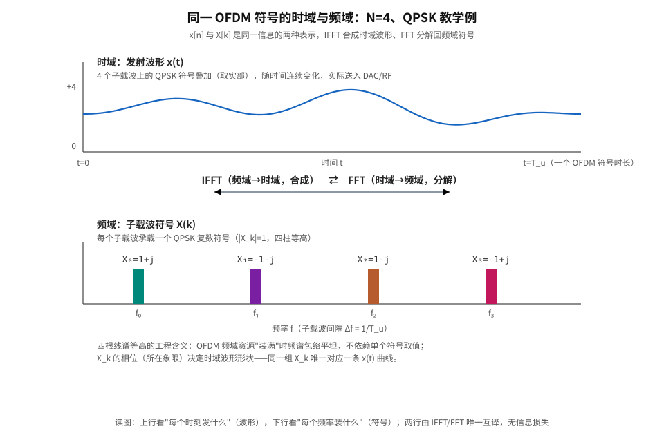
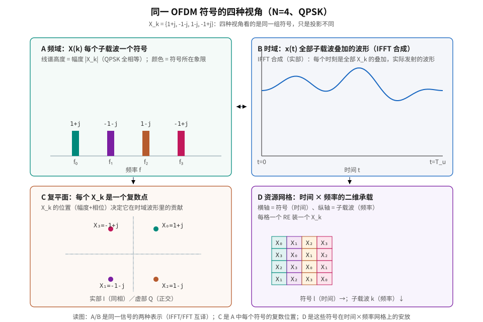
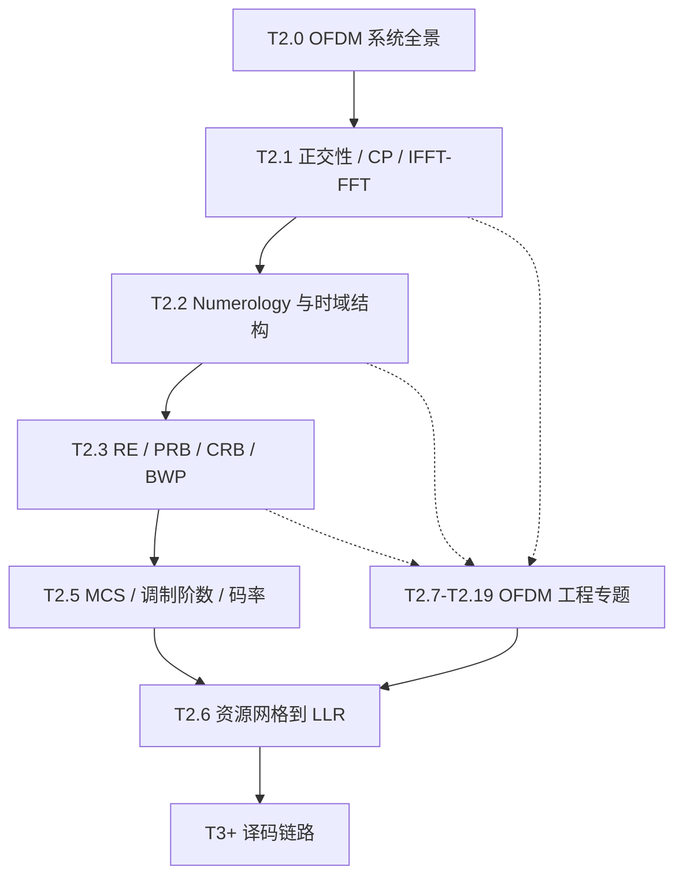

# T2.0 OFDM 系统全景：从比特到时域波形再到接收机
## 本节学习目标

T1.x 系列建立了译码器需要的概率、LLR（对数似然比，Log-Likelihood Ratio）和信息论基础。进入 T2 系列之前，需要先建立译码器上游 OFDM（正交频分复用，Orthogonal Frequency Division Multiplexing）收发链路的系统视图：比特经过调制后映射到频域子载波，经 IFFT（逆快速傅里叶变换，Inverse Fast Fourier Transform）变换为时域波形，插入 CP（循环前缀，Cyclic Prefix）后通过无线信道；接收端再经过同步、去 CP、FFT（快速傅里叶变换，Fast Fourier Transform）、信道估计、均衡和软解调，最终向译码器输出 LLR。

本节以系统图谱和基本概念为主，不展开完整数学推导。后续 [[T2.1_OFDM_subcarrier_spacing_basics|T2.1]] 将进一步分析子载波正交性、CP 有效性以及 IFFT/FFT 实现 OFDM 的机制。

本节核心术语如下：

| 术语 | 英文 | 概念说明 |
|:---|:---|:---|
| OFDM | Orthogonal Frequency-Division Multiplexing | 把宽带信道切成许多窄带正交子载波，并行传输调制符号。 |
| 子载波 | subcarrier | OFDM 频域网格上的一个窄带位置，每个子载波在一个 OFDM 符号周期内承载一个调制符号。 |
| OFDM 符号 | OFDM symbol | 时域上的一个传输片段，由 CP + IFFT 输出的有用符号组成。 |
| 资源网格 | resource grid | 以 OFDM 符号为时域轴、子载波为频域轴的二维承载平面。 |
| LLR | Log-Likelihood Ratio | 解调器给译码器的软比特可靠度，不是硬判决比特。 |

- 建立从 bit 到 LLR 的 OFDM 收发全链路。
- 说明 OFDM 适用于频率选择性衰落信道的原因。
- 区分 OFDM 的基础机制和工程问题：同步、CFO/SFO、信道估计、均衡、MIMO（多输入多输出，Multiple-Input Multiple-Output）、PAPR（峰均功率比，Peak-to-Average Power Ratio）、窗口函数。
- 理解 LTE（长期演进，Long Term Evolution）/NR（新空口，New Radio）对 OFDM 做了什么：不是重新发明 OFDM，而是选择 Numerology、资源网格、参考信号和物理信道映射规则。
- 给出后续 [[T2.1_OFDM_subcarrier_spacing_basics|T2.1]]–[[T2.19_OFDM_windowing_filtering|T2.19]] 的学习顺序。

## 前置知识检查

| 问题 | 需要达到的程度 |
|:---|:---|
| bit 和调制符号有什么区别？ | 知道 QPSK（正交相移键控，Quadrature Phase Shift Keying）/16QAM 会把多个 bit 映射成一个复数星座点。 |
| 频域和时域是什么关系？ | 能说明频域描述各频率分量的承载内容，时域描述实际随时间变化的发射波形。 |
| 多径传播是什么？ | 知道无线信号会经反射、散射形成多个延迟副本。 |
| 译码器输入是什么？ | 知道译码器通常消费 LLR，而不是天线上的原始波形。 |

## 时域与频域基础

OFDM 学习中需要首先区分“QAM（正交幅度调制，Quadrature Amplitude Modulation）调制符号”和“OFDM 符号”。QAM 调制符号是一个复数点，例如 $X_k$；OFDM 符号是一个时域传输片段，由一整组子载波上的复数点共同生成。前者表示频域某个位置承载的内容，后者表示发射机送入 DAC（数模转换器，Digital-to-Analog Converter）/RF 链路的一段基带采样波形。

| 视角 | 关注对象 | OFDM 中的表示 |
|:---|:---|:---|
| 频域 | 第 $k$ 个子载波承载的复数符号 | $X_0,X_1,\ldots,X_{N-1}$ 构成一个频域向量。 |
| 时域 | 每个采样时刻实际发出的复数基带值 | $x[0],x[1],\ldots,x[N-1]$ 构成一个有用 OFDM 符号。 |
| 资源网格 | 哪个时刻、哪个子载波承载哪个 RE（资源元素，Resource Element） | 横轴常画 OFDM symbol，纵轴常画 subcarrier 或 PRB（物理资源块，Physical Resource Block）。 |

IFFT 的作用是把“每个子载波上的复数权重”合成为“随时间变化的采样波形”：

$$
x[n]=\frac{1}{N}\sum_{k=0}^{N-1}X_k e^{j2\pi kn/N}
\tag{1}
$$

接收端 FFT 执行反向变换：在正确的 FFT 窗口内，将时域采样重新投影到各个子载波，得到 $Y_k$。因此，OFDM 既不是“只在频域传输”，也不是“只是一段时域波形”；其工程核心是频域资源分配与时域波形生成之间的可逆变换。

两张图把同一句话画出来。**图 1 双域对照**：同一个 N=4、QPSK 教学例，上行是时域——四个子载波叠加出的实际发射波形 x(t)；下行是频域——每个子载波承载的复数符号 X(k)，四根线谱等高（|X_k|=1，频谱包络平坦）。上下由 IFFT/FFT 唯一互译，信息零损失。

**图 2 四种视角**：同一组 X_k 的四种投影——线谱看幅度、波形看叠加、星座看复数位置、资源网格看时间×频率的二维安放。读图顺序是：A 决定 B（IFFT 合成），C 是 A 中每个符号的复数点，D 把这些点排进网格。

该图也是后续章节的基本坐标：[[T2.1_OFDM_subcarrier_spacing_basics|T2.1]] 解释子载波正交叠加的数学条件；[[T2.2_NR_numerology_time_domain_hierarchy|T2.2]] 解释 OFDM 符号在 NR 帧结构中的时间长度；[[T2.3_NR_frequency_resource_grid|T2.3]] 解释子载波如何组成 RE、PRB、CRB 和 BWP（带宽部分，Bandwidth Part）；[[T2.7_OFDM_timing_synchronization|T2.7]]–[[T2.19_OFDM_windowing_filtering|T2.19]] 则分析时间窗口、频率参考、信道估计、功放或窗口函数非理想时，$Y_k$ 和最终 LLR 的受影响方式。

## 教学例子：4 个子载波的时频转换

设一个极小 OFDM 符号只有 4 个子载波。频域向量 $X=[1,0,0,0]$ 时，只有第 0 个子载波承载能量，IFFT 后得到的是一段不随时间旋转的常量采样。若 $X=[0,1,0,0]$，IFFT 后得到的是每个采样点相位逐步旋转的复指数。真实 OFDM 只是把这个例子扩展到更多子载波：每个 $X_k$ 贡献一条不同频率的复指数，所有复指数相加形成时域波形。

该例子说明两个关键点。第一，频域上彼此分离的子载波，在时域上会叠加为同一段波形；天线并不逐个发射子载波，而是发射所有子载波叠加后的采样序列。第二，接收端只有在 FFT 窗口和频率参考正确时，才能把叠加波形重新投影回各个 $k$，恢复每个子载波上的观测值 $Y_k$。后续同步和频偏专题，本质上都在保护这一可逆投影条件。

## OFDM 需求背景

无线信道通常是频率选择性的：同一个宽带信号的不同频率分量会经历不同衰落。如果用单载波直接承载整个宽带数据流，接收端需要一个复杂的宽带均衡器去补偿整段频率响应；深衰落处还会把噪声一起放大。

OFDM 的思路是把宽带信道切成许多窄带子信道。每个子载波足够窄时，在单个子载波内部可以近似认为信道增益是一个常数：

$$
Y_k \approx H_k X_k + N_k
\tag{2}
$$

这样接收端对每个子载波只需要单抽头均衡：

$$
\hat{X}_k \approx \frac{Y_k}{H_k}
\tag{3}
$$

从接收机复杂度角度看，OFDM 用大量窄带均衡问题替代单个宽带均衡问题。其代价是系统对同步、频率精度、CP 和 FFT 窗口位置高度敏感；这些因素构成本节后半部分的工程问题图谱。

## OFDM 发射端处理链

发射端处理链可按如下顺序描述：

1. **编码和调制**：传输块经 CRC（循环冗余校验，Cyclic Redundancy Check）、信道编码、rate matching 后得到编码比特；调制器把 bit 组映射成 QPSK/16QAM/64QAM 等复数调制符号。
2. **资源映射**：调制符号被放到资源网格的 RE 上。一个 RE 对应一个子载波位置和一个 OFDM 符号时刻。
3. **IFFT**：频域上每个子载波承载的复数符号被一次性变换成时域采样波形。IFFT 是 OFDM 工程实现的关键步骤。
4. **插入 CP**：把 IFFT 输出末尾一段复制到符号前端，作为多径保护间隔。
5. **数模转换和射频发射**：基带时域采样经 DAC、上变频、功放和天线发射出去。

## OFDM 接收端处理链

接收端处理不能简化为单次 FFT。FFT 只是链路中间的一步，前后还包含多个工程环节：

| 步骤 | 输入 | 输出 | 失败后果 |
|:---|:---|:---|:---|
| 定时同步 | 接收时域采样 | OFDM 符号边界、FFT 窗口位置 | 窗口错位，引入 ISI/ICI。 |
| 频率同步 | 带频偏的采样 | CFO/SFO 校正后的采样 | 子载波正交性被破坏，星座持续旋转或扩散。 |
| 去 CP + FFT | 对齐后的时域符号 | 频域 RE 网格 | FFT 输入混入相邻符号则全符号污染。 |
| 信道估计 | DM-RS（解调参考信号，Demodulation Reference Signal）/CSI-RS（信道状态信息参考信号，Channel State Information Reference Signal）等参考信号 | $H[k,l]$ 估计值 | 均衡错误，LLR 可靠度失真。 |
| 均衡 / 检测 | $Y[k,l]$ 与 $H[k,l]$ | 估计调制符号 $\hat{X}[k,l]$ | 噪声增强、层间干扰、星座点偏移。 |
| 软解调 | 均衡后符号和噪声估计 | bit LLR | LLR 符号或幅度错误，译码器性能下降。 |

该表表明：译码器看到的 LLR 质量，不只由码本和调制方式决定，也由 OFDM 接收机的同步、估计和均衡误差共同决定。

## OFDM 的工程问题地图

OFDM 的基础机制是“正交子载波 + CP + IFFT/FFT”。在 LTE/NR 收发机实现中，还必须处理下列工程问题。

| 问题 | 发生位置 | 工程影响 | 后续章节 |
|:---|:---|:---|:---|
| 定时同步 | 接收端 FFT 前 | FFT 窗口必须对准 OFDM 符号，否则当前符号会混入相邻符号。 | [[T2.7_OFDM_timing_synchronization|T2.7]] |
| CFO | 射频本振和多普勒 | 载波频偏造成公共相位旋转和子载波间干扰。 | [[T2.8_OFDM_CFO_SFO_frequency_synchronization|T2.8]] |
| SFO | ADC（模数转换器，Analog-to-Digital Converter）采样时钟 | 采样频偏造成符号边界和频域相位随时间漂移。 | [[T2.8_OFDM_CFO_SFO_frequency_synchronization|T2.8]] |
| 信道估计 | FFT 后、均衡前 | 接收端需要知道每个 RE 上的 $H[k,l]$ 才能均衡。 | [[T2.10_OFDM_channel_estimation_DMRS|T2.10]] |
| 均衡 | 软解调前 | 把 $Y=HX+N$ 变成可判决的 $\hat{X}$，并估计可靠度。 | [[T2.11_OFDM_equalization_CSI_SINR|T2.11]] |
| MIMO-OFDM | 每个 RE 上的多天线信道 | 单个 $H_k$ 变成矩阵 $H[k,l]$，需要层检测和干扰抑制。 | [[T2.12_MIMO_OFDM_layer_detection|T2.12]] |
| PAPR | 发射端 IFFT 后 | 多子载波叠加会产生高峰值，功放需要回退，削峰会污染 EVM（误差向量幅度，Error Vector Magnitude）/ACLR。 | [[T2.18_OFDM_PAPR_power_amplifier|T2.18]] |
| 窗口函数 / 滤波 | 发射端符号边界 | 矩形窗会造成频谱旁瓣，窗口或滤波用于降低带外泄漏。 | [[T2.19_OFDM_windowing_filtering|T2.19]] |
| 误差到 LLR | 接收链路末端 | 同步、频偏、估计、均衡和发射失真最终都体现在 LLR 符号和幅度上。 | [[T2.17_OFDM_impairments_to_LLR|T2.17]] |

## LTE/NR 协议关系

OFDM 属于通用多载波调制技术，并非 3GPP（第三代合作伙伴计划，3rd Generation Partnership Project）专有理论。LTE/NR 的协议工作，是把 OFDM 落实为可互操作的无线系统参数：

| 协议层选择 | LTE/NR 需要规定什么 | 本项目在哪里展开 |
|:---|:---|:---|
| Numerology | 子载波间隔、CP 类型、符号/时隙/帧结构 | [[T2.2_NR_numerology_time_domain_hierarchy|T2.2]] |
| 资源网格 | RE、PRB、CRB、BWP、Point A | [[T2.3_NR_frequency_resource_grid|T2.3]] |
| 调制与 MCS（调制与编码方案，Modulation and Coding Scheme） | QPSK/16QAM/64QAM/256QAM、码率、TBS（传输块大小，Transport Block Size） | [[T2.5_MCS_modulation_order_target_code_rate|T2.5]]、[[T2.13_BPSK_QPSK_soft_demapping|T2.13]]、[[T2.14_QAM_Max_Log_MAP_demapping|T2.14]] |
| 物理信道映射 | PDSCH（物理下行共享信道，Physical Downlink Shared Channel）/PUSCH（物理上行共享信道，Physical Uplink Shared Channel）/PDCCH（物理下行控制信道，Physical Downlink Control Channel）/PUCCH（物理上行控制信道，Physical Uplink Control Channel）等放到哪些 RE | [[T2.6_from_resource_grid_to_decoder_LLR|T2.6]] 以及后续协议专题 |
| 参考信号 | DM-RS/CSI-RS/PTRS（相位跟踪参考信号，Phase Tracking Reference Signal）等如何生成和映射 | [[T2.10_OFDM_channel_estimation_DMRS|T2.10]]、[[T2.12_MIMO_OFDM_layer_detection|T2.12]] |
| 接收机算法 | 同步、估计、均衡、检测实现 | 多数是实现自由度，[[T2.7_OFDM_timing_synchronization|T2.7]]–[[T2.19_OFDM_windowing_filtering|T2.19]] 讲工程模型 |

协议规定的是可互操作的信号、资源和参考点；接收机内部采用何种同步算法、插值算法和均衡器实现，通常属于厂家实现自由度。学习时应区分“协议规定”和“接收机工程”。

## 后续学习顺序

OFDM 的学习路径应从系统视图开始，再逐层展开到 NR 资源、调制和译码接口：

对应的阅读建议：

1. 阅读本节 T2.0，建立 OFDM 收发机全链路和工程问题图谱。
2. 阅读 [[T2.1_OFDM_subcarrier_spacing_basics|T2.1]]，理解正交性、CP 和 IFFT/FFT 三个核心机制。
3. 阅读 [[T2.2_NR_numerology_time_domain_hierarchy|T2.2]]–[[T2.3_NR_frequency_resource_grid|T2.3]]，将抽象 OFDM 映射到 NR 的时间和频率资源网格。
4. 阅读 [[T2.5_MCS_modulation_order_target_code_rate|T2.5]]、[[T2.6_from_resource_grid_to_decoder_LLR|T2.6]]–[[T2.16_LLR_clipping_scaling_quantization|T2.16]]，进入调制、噪声、软解调和 LLR。
5. 阅读 [[T2.7_OFDM_timing_synchronization|T2.7]]–[[T2.19_OFDM_windowing_filtering|T2.19]]，将同步、频偏、信道估计、均衡、MIMO、PAPR、窗口函数等工程误差接回 LLR 质量。

## 对译码链路的影响

译码器不直接处理 OFDM 时域波形，也不直接知道 FFT 窗口、DM-RS 位置或 MIMO 检测矩阵。译码器看到的是一维 LLR 向量。但这个 LLR 向量的可靠性由 OFDM 接收链路决定：

$$
\text{同步/频偏/信道估计/均衡/软解调误差}
\;\longrightarrow\;
\text{LLR 符号和幅度误差}
\;\longrightarrow\;
\text{译码收敛速度和 BLER（块错误率，Block Error Rate）}
\tag{4}
$$

因此，虽然本项目主线是 Turbo（Turbo 码，Turbo Code）/LDPC（低密度奇偶校验码，Low-Density Parity-Check Code）/Polar（极化码，Polar Code）译码，但仍需要先建立 OFDM 背景：只有明确 LLR 的前端来源，才能解释同一套译码器在不同信道估计质量、同步质量和发射波形条件下的性能差异。

## 常见错误

| 错误 | 为什么错 | 正确做法 |
|:---|:---|:---|
| 把 OFDM 等同于 FFT | FFT 只是 OFDM 接收链路的一步；同步、去 CP、信道估计、均衡和软解调同样关键。 | 将 OFDM 理解为完整收发系统，而非单个变换步骤。 |
| 以为子载波互不重叠 | OFDM 的子载波频谱是重叠的，靠数学正交性分离。 | 用 [[T2.1_OFDM_subcarrier_spacing_basics|T2.1]] 的 sinc 零点和内积推导理解正交。 |
| 以为 CP 是新数据 | CP 是同一 OFDM 符号尾部的副本，不承载新信息。 | 把 CP 理解成会被接收端丢弃的保护间隔。 |
| 以为同步只是实现细节，不影响译码 | 同步误差会造成 ICI/ISI，最终改变 LLR 可靠度。 | 把同步误差纳入接收链路和仿真假设。 |
| 以为 MIMO 和 OFDM 是两套无关系统 | NR 的 MIMO 检测通常发生在每个 RE/子载波上，OFDM 提供频域分解平面。 | 先理解单子载波标量信道，再推广到每 RE 的 MIMO 矩阵。 |
| 只看接收端，不看 PAPR/窗口 | 发射端 PAPR、削峰、窗口和滤波会影响 EVM、频谱泄漏和接收端 LLR。 | 把发射波形质量也纳入 OFDM 工程误差链。 |

## 自测题

1. OFDM 为什么能把宽带均衡问题变成多个窄带均衡问题？
2. 一个 OFDM 发射端从调制符号到天线发射，至少经过哪些步骤？
3. 接收端为什么不能直接对任意一段采样做 FFT？
4. CFO 和 SFO 分别来自哪里？它们为什么会破坏 OFDM？
5. 信道估计和均衡分别解决什么问题？
6. PAPR 为什么主要是 OFDM 发射端问题，但最终会影响译码器？
7. 为什么说 LTE/NR 是 OFDM 的参数化无线系统，而不是 OFDM 理论本身？

## 自测题参考答案

1. 因为 OFDM 把宽带信道切成许多窄带子载波。每个子载波内部信道近似平坦，均衡从宽带滤波器退化为每个子载波上的单抽头复数除法。

2. 典型路径是：编码比特 → QAM 调制 → 资源映射 → IFFT → 插入 CP → DAC/RF/功放 → 天线发射。

3. FFT 窗口必须对准 OFDM 符号的有用符号区间。窗口错位会混入 CP 外或相邻符号的采样，破坏子载波正交性，造成 ISI/ICI。

4. CFO 来自发射端和接收端本振频率不一致以及多普勒频移；SFO 来自采样时钟不一致。CFO 造成相位旋转和子载波泄漏，SFO 造成随时间积累的采样位置漂移和频域相位斜率。

5. 信道估计用参考信号估计每个 RE 或邻近区域的信道响应 $H[k,l]$；均衡用这个估计把接收符号从 $Y=HX+N$ 还原成调制符号估计，并为软解调提供可靠度信息。

6. OFDM 多子载波叠加会产生高峰值，功放若线性范围不足会削峰或非线性失真，导致 EVM 增大和带外泄漏。接收端看到的星座点偏移会改变 LLR 符号和幅度。

7. OFDM 提供多载波正交传输的数学和信号处理框架；LTE/NR 规定具体 SCS、CP、资源网格、物理信道、参考信号和调度参数，使不同厂家设备可以互通。

## 本节验收

| 验收项 | 通过标准 |
|:---|:---|
| 全链路 | 能从 bit 讲到 LLR，并指出 OFDM 发射端和接收端的主要模块。 |
| 工程问题地图 | 能说明同步、CFO/SFO、信道估计、均衡、MIMO、PAPR、窗口函数各自解决什么问题。 |
| 和 [[T2.1_OFDM_subcarrier_spacing_basics|T2.1]] 的关系 | 能说明本节是系统全景，[[T2.1_OFDM_subcarrier_spacing_basics|T2.1]] 是正交性、CP、IFFT/FFT 机制推导。 |
| 协议边界 | 能区分 3GPP 规定的资源网格/参考信号与接收机内部算法自由度。 |
| 译码关系 | 能解释 OFDM 工程误差如何通过 LLR 影响 Turbo/LDPC/Polar 译码。 |

## 资料与协议边界

| 资料 | 边界 |
| :--- | :--- |
| [[T2.1_OFDM_subcarrier_spacing_basics|T2.1]] OFDM 基础 | 本节只建立全景；正交性、CP、IFFT/FFT 的数学推导见 [[T2.1_OFDM_subcarrier_spacing_basics|T2.1]]。 |
| TS 38.211 Rel-19 | 本节只把 TS 38.211 作为 NR OFDM、资源网格和参考信号的协议入口；不复现协议表格。 |
| TS 36.211 Rel-19 | LTE OFDM/SC-FDMA（单载波频分多址，Single Carrier Frequency Division Multiple Access）、RB 和资源网格作为对比入口；具体 LTE 帧结构见 [[T2.4_LTE_frame_structure_time_frequency|T2.4]]。 |
| [[T2.7_OFDM_timing_synchronization|T2.7]]–[[T2.19_OFDM_windowing_filtering|T2.19]] | 定时同步、CFO/SFO、信道估计、均衡、MIMO-OFDM、PAPR、窗口/滤波和误差到 LLR 的工程专题入口。 |
| 概念笔记 | `Timing_Sync_定时同步`、`Channel_Estimation_信道估计`、`DMRS_解调参考信号`、`MMSE_均衡`、`MIMO_多天线系统` 可作为 [[T2.7_OFDM_timing_synchronization|T2.7]]–[[T2.12_MIMO_OFDM_layer_detection|T2.12]] 的材料来源。 |

## 执行与证据记录

| 项目 | 记录 |
|:---|:---|
| 本地文档检索 | 使用 `rg` 检索项目内 OFDM、同步、信道估计、MIMO、DM-RS、MMSE（最小均方误差，Minimum Mean Square Error）等现有材料。 |
| 结构决策 | 新增 T2.0 作为 OFDM 系统全景，不重编号现有 [[T2.1_OFDM_subcarrier_spacing_basics|T2.1]]–[[T2.19_OFDM_windowing_filtering|T2.19]]。 |
| 图示标准 | 本节新增的学习路径和收发链路图使用 Mermaid，并包含 `%%{init: {'theme': 'default'}}%%`。 |
| 证据边界 | 本节为系统总览和学习路径；CFO/SFO、PAPR、窗口函数、MIMO-OFDM 的细节推导和工程检查点见 [[T2.7_OFDM_timing_synchronization|T2.7]]–[[T2.19_OFDM_windowing_filtering|T2.19]]。 |

## 参考文献

- [3GPP, 2026] 3GPP TS 38.211, Rel-19, `38211-j30`, Physical channels and modulation. Local path: `3GPP_Rel19/processed/TS_38.211_38211-j30`.
- [3GPP, 2026] 3GPP TS 36.211, Rel-19, `36211-j30`, Physical channels and modulation. Local path: `3GPP_Rel19/processed/TS_36.211_*`.
