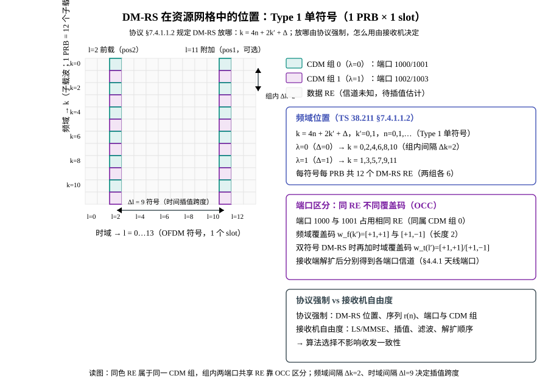
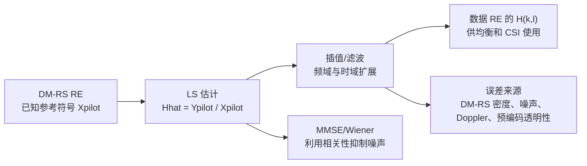
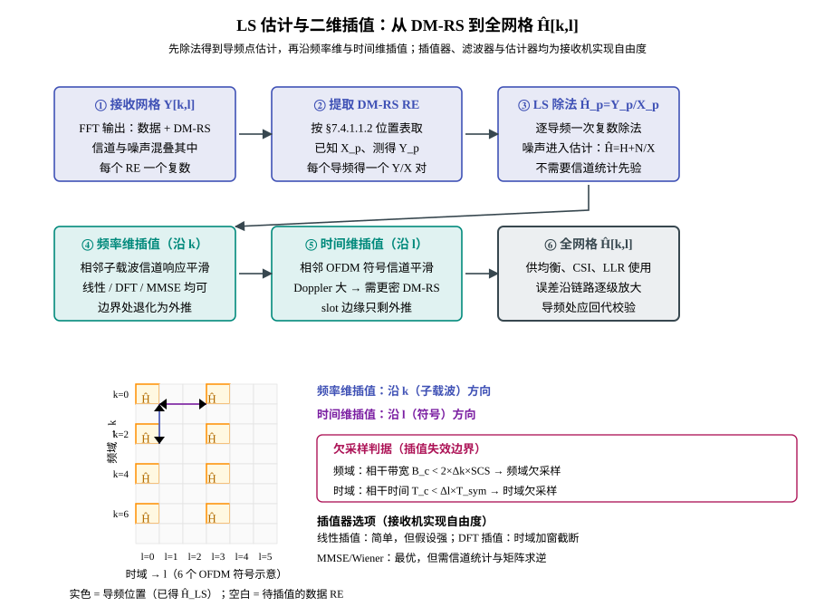
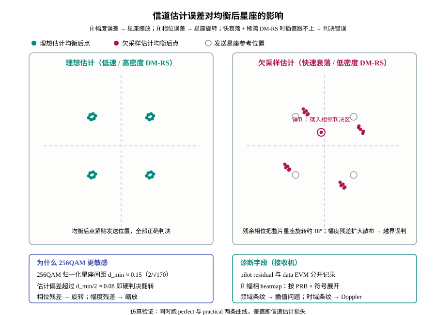

# T2.10 OFDM 信道估计：DM-RS、LS/MMSE 与二维插值

## 本节学习目标

[[T2.7_OFDM_timing_synchronization|T2.7]] 和 [[T2.8_OFDM_CFO_SFO_frequency_synchronization|T2.8]] 让接收端尽量把 FFT（快速傅里叶变换，Fast Fourier Transform）输出放回正确的时频坐标。接下来要回答：每个 RE（资源元素，Resource Element）上的信道 $H[k,l]$ 从哪里来？没有 $H$，接收端只能看到 $Y[k,l]$，不知道它是因为数据符号不同、信道衰落、相位旋转还是噪声造成的。

本节讲信道估计，不讲完整参考信号配置表。重点是把 DM-RS（解调参考信号，Demodulation Reference Signal）如何变成 $H[k,l]$、估计误差如何进入均衡和 LLR（对数似然比，Log-Likelihood Ratio）讲清楚。

- 说明 DM-RS 为什么是解调参考信号。
- 推导 LS（最小二乘，Least Squares）信道估计的最小模型。
- 解释 MMSE（最小均方误差，Minimum Mean Square Error）/Wiener 估计为什么能抑制噪声但需要统计先验。
- 说明频域/时域二维插值的假设和失败场景。
- 区分协议规定的 DM-RS 结构与接收机估计算法自由度。
- 定位 TS 38.211 中 DM-RS 的条款（§7.4.1.1.1 序列生成、§7.4.1.1.2 资源映射、§5.2.1 伪随机序列、§4.4.1 天线端口、§6.4.1.1 PUSCH（物理上行共享信道，Physical Uplink Shared Channel）对应），明确哪些是协议强制、哪些是接收机实现。

## 前置知识检查

| 问题 | 需要达到的程度 |
|:---|:---|
| RE 是什么？ | 知道一个 RE 是一个子载波位置和一个 OFDM（正交频分复用，Orthogonal Frequency Division Multiplexing）符号时刻。 |
| DM-RS 是什么？ | 知道它是接收端已知的解调参考信号。 |
| 复数除法代表什么？ | 知道它可以同时估计幅度缩放和相位旋转。 |
| 均衡为什么需要 $H$？ | 知道接收符号满足 $Y=HX+N$ 的近似模型。 |

如果还不熟悉资源网格，先读 [[T2.3_NR_frequency_resource_grid|T2.3]]；如果还不清楚衰落信道对 LLR 的影响，先读 [[T2.15_fading_channel_LLR_reliability|T2.15]]。本节把这些概念连接成"参考信号 → 信道估计 → 均衡输入"的实际接收链路。

## DM-RS 的角色：接收端的已知标尺

### 概念四要素：DM-RS 的定义与作用

| 要素 | 内容 |
|:---|:---|
| 白话 | 解调参考信号（Demodulation Reference Signal, DM-RS）是收发双方都知道的参考符号，相当于插在资源网格里的"已知图钉"：接收端在 DM-RS 位置既知道发送值、又测得接收值，对比两者就能量出信道把信号"扭曲"了多少（幅度缩放 + 相位旋转）。 |
| 可数例子 | Type 1 单符号配置下，1 个 PRB（物理资源块，Physical Resource Block）内每个 DM-RS 符号占 12 个资源单元（Resource Element, RE）（两个 CDM 组各 6 个），其余 156 个 RE 归数据。 |
| 可视化直觉 | 见图 1：青/紫格就是图钉的位置；数据 RE 必须绕开它们。 |
| 符号公式 | 见式 (1)：$Y_p = H_p X_p + N_p$，其中 $p$ 表示一个 DM-RS 位置。 |



图 1 回答"DM-RS 放在哪"：频域上两组各占一半 RE 且互相错开 1 个子载波（组内间隔 $\Delta k=2$），时域上只占少数符号（前载 $l=2$，可选附加 $l=11$）。正是这种"稀疏放置"让数据有地方放，也决定了接收端插值必须跨越的间隔。

DM-RS 占用部分 RE，数据 RE 必须绕开它。接收端在 DM-RS 位置知道发送值 $X_{\mathrm{DMRS}}$，同时测得接收值 $Y_{\mathrm{DMRS}}$，因此可以反推信道。

简化模型为：

$$
Y_p = H_p X_p + N_p
\tag{1}
$$

其中 $p$ 表示一个 DM-RS RE。若 $X_p$ 已知且非零，最直接的估计是：

$$
\hat{H}^{LS}_p = \frac{Y_p}{X_p}
\tag{2}
$$

这就是最小二乘（Least Squares, LS）估计。在单个导频（pilot）上它就是一次复数除法。

## 协议锚点：TS 38.211 如何规定 DM-RS

本节按"3GPP 规定什么 → 为什么这样规定 → 接收端必须做什么"的顺序，精读本地抽取件中的实际文本。所有引用均来自 `3GPP_Rel19/processed/TS_38.211_38211-j30/`（full.md 为公式化 Markdown，content.md 为条款文本，二者同节号）。

### §4.4.1 天线端口（Antenna ports）：按端口估计信道的协议依据

协议原文（TS 38.211 §4.4.1）：

> An antenna port is defined such that the channel over which a symbol on the antenna port is conveyed can be inferred from the channel over which another symbol on the same antenna port is conveyed.

白话翻译：同一天线端口（antenna port）上的任意两个符号，信道可以被互相推断。因此：

- 同端口的数据符号与 DM-RS 共享同一条信道 → 用该端口的 DM-RS 估计出的 $H$ 可以直接用于该端口的数据均衡；
- 不同端口之间的信道不同，必须分别估计 → "一个端口一条信道估计"是协议定义的自然结果。

协议还定义了准共址（Quasi Co-Located, QCL）：若两端口 QCL，则大尺度参数（时延扩展、多普勒扩展、多普勒频移、平均增益、平均时延、空间接收参数）可以互相推断——这是接收端能否"借用"另一个参考信号（如 SS/PBCH）做辅助估计的依据。

接收端必须做什么：把 DM-RS 端口当作独立的信道估计对象，逐端口维护 $\hat{H}$，不能把两个端口的估计混用（除非协议明确允许的 QCL 场景）。

### §5.2.1 伪随机序列生成（Pseudo-random sequence generation）：r(n) 的比特源

协议原文（TS 38.211 §5.2.1）：

> Generic pseudo-random sequences are defined by a length-31 Gold sequence. ... where $N_C=1600$ and the first m-sequence $x_1(n)$ shall be initialized with $x_1(0)=1, x_1(n)=0, n=1,2,...,30$. The initialization of the second m-sequence, $x_2(n)$, is denoted by $c_{init}=\sum_{i=0}^{30}x_2(i)2^i$ with the value depending on the application of the sequence.

公式形式：

$$
c(n) = \left(x_1(n+N_C)+x_2(n+N_C)\right) \bmod 2,\quad n=0,1,\ldots,M_{PN}-1,\quad N_C=1600
\tag{3}
$$

$$
x_1(n+31) = \left(x_1(n+3)+x_1(n)\right) \bmod 2,\qquad x_1(0)=1,\; x_1(n)=0\ (n=1,\ldots,30)
\tag{4}
$$

$$
x_2(n+31) = \left(x_2(n+3)+x_2(n+2)+x_2(n+1)+x_2(n)\right) \bmod 2
\tag{5}
$$

$$
c_{init} = \sum_{i=0}^{30} x_2(i)\, 2^i
\tag{6}
$$

逐符号解释：

| 符号                | 含义                             |
| :---------------- | :----------------------------- |
| $c(n)$            | 输出的伪随机比特序列（0/1），DM-RS 序列的比特源   |
| $x_1(n)$、$x_2(n)$ | 两条 m 序列（最大长度线性反馈移位寄存器序列），长度 31 |
| $N_C=1600$        | 丢弃的前置比特数，让序列"预热"（加扰相关应用通用）     |
| $c_{init}$        | 31 比特初始化值，$x_2$ 的初值就是它的二进制展开   |

为什么这样规定：Gold 序列是两条 m 序列的异或，只需 31 比特初始值就能生成任意长的伪随机序列；收发双方只要 $c_{init}$ 相同，就能各自独立生成完全相同的 $c(n)$，无需在空口上传送序列本身。

接收端必须做什么：用与发射端相同的 $c_{init}$ 本地生成 $c(n)$——这是后面式 (7) 序列、式 (8) 初始化公式的底层机制。

### §7.4.1.1.1 序列生成（Sequence generation）：DM-RS 的符号值

协议原文（TS 38.211 §7.4.1.1.1）：

> The UE shall assume the sequence $r(n)$ is defined by $r(n)=\frac{1}{\sqrt{2}}(1-2c(2n))+j\frac{1}{\sqrt{2}}(1-2c(2n+1))$. The pseudo-random sequence generator shall be initialized with $c_{init} = (2^{17}(N_{symb}^{slot}n_{s,f}^{\mu}+l+1)(2N_{ID}^{\hat{n}_{SCID}^{\hat{\lambda}}}+1)+2^{17}\lfloor\frac{\hat{\lambda}}{2}\rfloor+2N_{ID}^{\hat{n}_{SCID}^{\hat{\lambda}}}+\hat{n}_{SCID}^{\hat{\lambda}})\bmod 2^{31}$

公式形式：

$$
r(n) = \frac{1}{\sqrt{2}}\left(1-2c(2n)\right) + j\,\frac{1}{\sqrt{2}}\left(1-2c(2n+1)\right)
\tag{7}
$$

$$
c_{init} = \left(2^{17}\left(N_{symb}^{slot}n_{s,f}^{\mu}+l+1\right)\left(2N_{ID}^{\hat{n}_{SCID}^{\hat{\lambda}}}+1\right) + 2^{17}\left\lfloor\frac{\hat{\lambda}}{2}\right\rfloor + 2N_{ID}^{\hat{n}_{SCID}^{\hat{\lambda}}} + \hat{n}_{SCID}^{\hat{\lambda}}\right) \bmod 2^{31}
\tag{8}
$$

逐符号解释：

| 符号 | 含义 |
|:---|:---|
| $r(n)$ | DM-RS 序列第 $n$ 个复符号 |
| $c(2n)$、$c(2n+1)$ | 伪随机比特序列的相邻两位，分别决定 $r(n)$ 的实部与虚部 |
| $N_{symb}^{slot}$ | 每个 slot 的 OFDM 符号数（普通循环前缀 normal cyclic prefix 下为 14） |
| $n_{s,f}^{\mu}$ | slot 在无线帧内的编号（对应子载波间隔配置 $\mu$） |
| $l$ | DM-RS 所在 OFDM 符号在 slot 内的编号 |
| $\lambda$ | CDM 组编号（Type 1 为 0 或 1；Type 2 可到 2） |
| $N_{ID}^{\hat{n}_{SCID}^{\hat{\lambda}}}$ | 扰码标识：默认 $N_{ID}^{cell}$，或由高层参数 scramblingID0/scramblingID1（DMRS-DownlinkConfig）配置，取值 $0..65535$ |
| $n_{SCID}$ | DM-RS 序列初始化字段，来自 DCI（下行控制信息，Downlink Control Information；格式 1_1/1_2/1_3/4_2），取值 0 或 1；不存在时为 0 |
| $\hat{n}_{SCID}^{\hat{\lambda}}$ | 按 CDM 组修正后的 $n_{SCID}$：$\lambda=0$ 或 2 时等于 $n_{SCID}$，$\lambda=1$ 时等于 $1-n_{SCID}$（若配置了 dmrs-Downlink） |

为什么这样规定：

1. **序列是 QPSK（正交相移键控，Quadrature Phase Shift Keying）点**：$1-2c\in\{+1,-1\}$，所以 $r(n)\in\left\{\frac{1+j}{\sqrt2},\frac{1-j}{\sqrt2},\frac{-1+j}{\sqrt2},\frac{-1-j}{\sqrt2}\right\}$，功率恒为 $|r(n)|^2=1$。单位功率对接收端是利好：式 (2) 的 LS 除法不会放大噪声功率（$|N_p/X_p|=|N_p|$）。
2. **干扰随机化**：$c_{init}$ 依赖小区 ID、slot/符号编号、CDM 组与 DCI 字段，使不同小区、不同时频位置、不同端口的序列互不相关，干扰被"打散"。
3. **可本地生成**：收发双方不需要传送序列本身，只要参数一致即可各自生成。

接收端必须做什么：解码 DCI 得到 $n_{SCID}$、从 RRC（无线资源控制，Radio Resource Control）配置读取 scramblingID、知道 slot/符号编号与 CDM 组，代入式 (8) 算 $c_{init}$，再按式 (3)–(6) 生成 $c(n)$、按式 (7) 生成 $r(n)$。序列不匹配时，信道估计结果就是噪声——这是"掩码/序列参数错误"类故障的根因（见调试案例库）。

### §7.4.1.1.2 物理资源映射（Mapping to physical resources）：DM-RS 放在哪个 RE

协议原文（TS 38.211 §7.4.1.1.2，节选）：

> The UE shall assume the PDSCH DM-RS being mapped to physical resources according to configuration type 1 or configuration type 2 as given by the higher-layer parameter dmrs-Type. ... $a_{k,l}^{(p_j,\mu)} = \beta_{PDSCH}^{DMRS}w_f(k')w_t(l')r(2n+k')$, $k = 4n+2k'+\Delta$ [Type 1] / $k = 6n+k'+\Delta$ [Type 2], $k'=0,1$, $l = \hat{l}+l'$, $n=0,1,\ldots$，其中 $w_f(k')$、$w_t(l')$ 与 $\Delta$ 由表 7.4.1.1.2-1/2 给出。

公式形式：

$$
a_{k,l}^{(p_j,\mu)} = \beta_{PDSCH}^{DMRS}\, w_f(k')\, w_t(l')\, r(2n+k'),\qquad k = 4n+2k'+\Delta\ \text{(Type 1)},\quad l = \hat{l}+l',\quad k'=0,1,\ n=0,1,\ldots
\tag{9}
$$

逐符号解释：

| 符号 | 含义 |
|:---|:---|
| $a_{k,l}^{(p_j,\mu)}$ | 天线端口 $p_j$ 在资源单元 $(k,l)$ 上发射的复值（$j=0,\ldots,\upsilon-1$，$\upsilon$ 为端口/层数） |
| $\beta_{PDSCH}^{DMRS}$ | 功率缩放因子（由 TS 38.214 规定，让 DM-RS 满足发射功率约束） |
| $w_f(k')$ | 频域覆盖码（正交覆盖码 Orthogonal Cover Code, OCC），表 7.4.1.1.2-1/2 给出 |
| $w_t(l')$ | 时域覆盖码，同一张表给出 |
| $r(2n+k')$ | 式 (7) 的序列值，按序取用 |
| $\Delta$ | 频域偏移，Type 1 下 $\Delta=\lambda$（CDM 组号） |
| $\hat{l}$ | DM-RS 起始符号：映射类型 A 时相对 slot 起点，$l_0=3$（dmrs-TypeA-Position=pos3）否则 $l_0=2$；映射类型 B 时相对调度 PDSCH（物理下行共享信道，Physical Downlink Shared Channel）起点，$l_0=0$ |

表 7.4.1.1.2-1（Type 1，本节引用的端口 1000–1003 行；单符号 DM-RS 只用 $w_f(0),w_f(1)$ 两项）：

| 端口 $p$ | CDM 组 $\lambda$ | $\Delta$ | $[w_f(0)\ w_f(1)]$ | $[w_t(0)\ w_t(1)]$ |
|:---:|:---:|:---:|:---:|:---:|
| 1000 | 0 | 0 | $[+1\ +1]$ | $[+1\ +1]$ |
| 1001 | 0 | 0 | $[+1\ -1]$ | $[+1\ +1]$ |
| 1002 | 1 | 1 | $[+1\ +1]$ | $[+1\ +1]$ |
| 1003 | 1 | 1 | $[+1\ -1]$ | $[+1\ +1]$ |

表 7.4.1.1.2-5（DM-RS 时域索引 $l'$ 与支持的端口，完整引用）：

| DM-RS multiplexing | DM-RS duration | $l'$ | Type 1 端口 | Type 2 端口 |
|:---|:---|:---:|:---|:---|
| Basic | single-symbol | 0 | 1000–1003 | 1000–1005 |
| Basic | double-symbol | 0, 1 | 1000–1007 | 1000–1011 |
| Enhanced | single-symbol | 0 | 1000–1003, 1008–1011 | 1000–1005, 1012–1017 |
| Enhanced | double-symbol | 0, 1 | 1000–1015 | 1000–1023 |

表 7.4.1.1.2-3（PDSCH 映射类型 A 下的 DM-RS 符号位置，节选 $l_d=13/14$ 两行；单符号 DM-RS）：

| $l_d$（符号数） | pos0 | pos1 | pos2 | pos3 |
|:---:|:---:|:---:|:---:|:---:|
| 13 | $l_0$ | $l_0, l_1$ | $l_0, 7, 11$ | $l_0, 5, 8, 11$ |
| 14 | $l_0$ | $l_0, l_1$ | $l_0, 7, 11$ | $l_0, 5, 8, 11$ |

其中 $l_0=2$（pos2）或 3（pos3）；$l_1=11$（仅当 lte-CRS 参数已配置、dmrs-AdditionalPosition=pos1、$l_0=3$ 且 UE 能力 additionalDMRS-DL-Alt 同时满足时为 12，且限于单符号 DM-RS——见 38.211 §7.4.1.1.2）。dmrs-AdditionalPosition 取 pos0–pos3 决定附加 DM-RS 符号的密度。协议还规定映射类型 A 的 $l_d\le2$ 时与类型 B 的若干边界情形，详见条款原文。

为什么这样规定：频域上每组每符号 6 个 RE（Type 1）、组间错开 1 个子载波，使同一组内导频间隔固定（$\Delta k=2$），便于接收端按固定间距插值；端口 1000 与 1001 占用完全相同的 RE，靠覆盖码 $[+1,+1]$ 与 $[+1,-1]$ 区分——这就是图 1 中"同 RE 不同码"的含义。Type 1 与 Type 2 每符号每 PRB 的 DM-RS RE 总数相同（12 个），区别在 CDM 组数（2 vs 3）、支持的端口数（4 vs 6）与组内 RE 分布（Type 1 均匀间隔 2；Type 2 成对出现，组内相邻导频间隔更大）——用组数换端口数，是协议层面给出的第一个"密度—容量"折中。

接收端必须做什么（翻译成接收流程）：

1. 从 RRC 读 dmrs-Type、dmrs-TypeA-Position、dmrs-AdditionalPosition、maxLength 等，从 DCI 读 DM-RS 相关字段；
2. 用式 (8) 初始化、式 (7) 生成序列 $r(n)$；
3. 按式 (9) 与表 7.4.1.1.2-1/5 为每个端口 $p_j$ 构建 DM-RS 掩码（RE 坐标表）；
4. 在掩码位置取出 $Y_p$，先解扩（乘上 $w_f^*(k')$/$w_t^*(l')$ 并按端口合并同组 RE）再进入估计器；
5. 每个端口独立估计信道（§4.4.1 的依据），之后才是插值、滤波、均衡。

### §6.4.1.1 PUSCH DM-RS：上行对应

上行 PUSCH 的 DM-RS 与下行同构：§6.4.1.1.1.1（transform precoding 未启用时）使用与式 (7) 完全相同的 $r(n)$ 公式和与式 (8) 相同的 $c_{init}$ 公式（本地证据：`full.md` §6.4.1.1.1.1 引用同一公式图像 image365.svg）；§6.4.1.1.3 的映射公式与式 (9) 相同（$k=4n+2k'+\Delta$ Type 1 / $k=6n+k'+\Delta$ Type 2）。接收端含义：上行的信道估计由基站（gNB）完成，但处理流程与下行完全同构——了解下行 DM-RS 的结构，就能直接读懂上行。

### 协议强制 vs 接收机自由度边界

| 项目 | 协议规定（强制） | 接收机自由度 |
|:---|:---|:---|
| DM-RS 位置 | §7.4.1.1.2 公式 (9) 与表 7.4.1.1.2-1/3/4 | —— |
| DM-RS 序列 | §7.4.1.1.1 式 (7)(8) 与 §5.2.1 | —— |
| 端口与 CDM 组 | 表 7.4.1.1.2-5 | —— |
| 估计器 | —— | LS / MMSE / ML（最大似然，Maximum Likelihood）等任选 |
| 插值与滤波 | —— | 线性 / DFT（离散傅里叶变换，Discrete Fourier Transform） / 样条 / Wiener 任选 |
| 噪声方差估计 | —— | NVar 口径与来源自定 |
| 解扩顺序与定点 | —— | 实现选择 |

一句话总结：**协议管"导频放哪、序列是什么、端口怎么分"，接收机管"怎么把导频变成 $\hat{H}$"**。协议保证收发双方对参考信号有一致理解，算法好坏完全由接收机决定——这也是本讲义把协议部分与算法部分分开讲的原因。

## 图示：从 DM-RS 到每 RE 的信道



图示的主线是 DM-RS RE → LS 估计 → 插值/滤波 → 数据 RE 上的 $H[k,l]$。下方两条支路说明：MMSE/Wiener 可以用统计先验抑制 LS 噪声；误差来源包括 DM-RS 密度、噪声、Doppler、插值假设和预编码透明性。

## LS 估计：一次复数除法及其噪声代价

回答的问题：已知一对发送值 $X_p$ 与接收值 $Y_p$，如何还原该位置的信道 $H_p$？LS 的答案是直接相除。

LS 的优点是简单、不需要信道统计模型。只要知道参考符号，就可以逐 pilot 做除法。它的代价也直接：噪声被参考符号除进去。

把式 (1) 代入式 (2)：

$$
\hat{H}^{LS}_p = H_p + \frac{N_p}{X_p}
\tag{10}
$$

由于 DM-RS 序列 $|X_p|=1$（式 (7) 的 QPSK 性质），$N_p/X_p$ 与 $N_p$ 同功率——**LS 本身不放大噪声功率，但噪声原样进入了估计**。如果参考符号功率较低，或者低 SNR（信噪比，Signal-to-Noise Ratio）下 $N_p$ 很大，估计误差会直接进入 $\hat{H}$。后续均衡用错的 $\hat{H}$，会造成符号偏置和噪声方差估计失配。

## 教学例子：单个 DM-RS RE 的 LS 手算

回答的问题：式 (2) 的一次复数除法到底算出来什么？用具体数字走一遍。

假设某个 DM-RS RE 上，发送参考符号为：

$$
X_p=1+j
\tag{11}
$$

接收端测得：

$$
Y_p=0.4+1.2j
\tag{12}
$$

LS 估计为：

$$
\hat{H}^{LS}_p
=\frac{0.4+1.2j}{1+j}
=\frac{(0.4+1.2j)(1-j)}{(1+j)(1-j)}
=\frac{1.6+0.8j}{2}
=0.8+0.4j
\tag{13}
$$

这个结果同时包含幅度和相位。幅度为：

$$
|\hat{H}|=\sqrt{0.8^2+0.4^2}\approx0.894
\tag{14}
$$

相位为：

$$
\angle\hat{H}\approx \tan^{-1}(0.4/0.8)\approx26.6^\circ
\tag{15}
$$

若相邻数据 RE 的真实信道变化很小，可以暂时把这个 $\hat{H}$ 用于附近数据 RE 的均衡。若相邻数据 RE 处发生频率选择性深衰落，这个近似就会失败。这个简单例子说明 LS 估计本身不复杂，真正困难在于噪声、插值和时变信道。

## 深入理解：DM-RS 密度、开销和估计精度的权衡

DM-RS 越密，估计越容易跟踪时频变化；但 DM-RS 占用的 RE 不能承载数据。这个权衡可以从三个场景看：

| 场景 | 信道变化 | DM-RS 需求 | 工程后果 |
|:---|:---|:---|:---|
| 低速、平坦信道 | 时频变化慢 | 较稀疏也可能够用 | 数据 RE 更多，估计开销低。 |
| 高速移动 | 时域变化快 | 需要更密时域参考 | 否则插值过时，slot 后部 EVM（误差矢量幅度，Error Vector Magnitude）变差。 |
| 宽带频率选择性 | 频域变化快 | 需要更密频域参考或更好插值 | 否则边缘/深衰落 PRB LLR 失真。 |

工程上还要叠加两个约束：

- **信噪比（SNR）**：低 SNR 下噪声主导，单点 LS 误差大，要么加密导频、要么用 MMSE/滤波把相邻导频"平均"起来；高 SNR 下噪声不再是瓶颈，插值假设（信道平滑度）才是。
- **信道变化速度**：决定"该加密时域还是频域"。时域变化快（多普勒 Doppler 大）→ 提高 dmrs-AdditionalPosition 或缩短调度时长；频域变化快（时延扩展大）→ 用更高频域密度或更好的频域插值器。

工程实现里，DM-RS 配置不是单独优化的。它和 MCS（调制与编码方案，Modulation and Coding Scheme）、层数、移动速度、频带、接收机插值器和目标 BLER（块错误率，Block Error Rate）一起形成系统折中。文档中如果只写"用 DM-RS 估计信道"，但不说明密度和插值假设，就会漏掉最重要的工程风险。

## 二维插值：从导频到数据 RE

DM-RS 不会铺满所有 RE，否则没有地方放数据。接收端必须把 pilot 位置的估计扩展到数据位置。常见插值维度有两个：

| 维度 | 假设 | 失败场景 |
|:---|:---|:---|
| 频域插值 | 相邻子载波的信道响应变化平滑 | 频率选择性强、相干带宽小。 |
| 时域插值 | 相邻 OFDM 符号的信道变化平滑 | 高速移动、Doppler 大、DM-RS 间隔过大。 |



图 2 把链路画完整：上排是"导频点估计"三步（提取、除法、得到 $\hat{H}_p^{LS}$），下排是"扩展到全网格"两步（频率维、时间维），左下方小网格示意导频点与插值方向，右下方给出欠采样判据（详见下一节）。

插值不是数学装饰，而是假设"信道在 pilot 间隔内变化不剧烈"。当时域变化太快或频域选择性太强时，插值会低估真实变化，数据 RE 上的 $\hat{H}[k,l]$ 会偏离真实 $H[k,l]$。

## 教学例子：一维频域线性插值手算

回答的问题：拿到两个导频估计后，中间数据 RE 的 $\hat{H}$ 怎么算？以最简单的线性插值为例（频率维，两个导频之间只有一个 RE）。

设两个相邻导频（间隔 $\Delta k=2$）的 LS 估计分别为 $\hat{H}(k_a)$ 与 $\hat{H}(k_b)$，对中间任意位置 $k$，线性插值为：

$$
\hat{H}(k) = (1-\delta)\,\hat{H}(k_a) + \delta\,\hat{H}(k_b),\qquad \delta = \frac{k-k_a}{k_b-k_a}
\tag{16}
$$

代入前面例子的结果：$k_a=0$ 处 $\hat{H}(0)=0.8+0.4j$，设 $k_b=2$ 处测得 $\hat{H}(2)=0.6-0.2j$，则 $k=1$ 处 $\delta=1/2$：

$$
\hat{H}(1) = \frac{(0.8+0.4j)+(0.6-0.2j)}{2} = 0.7+0.1j
\tag{17}
$$

教学要点：

- **复平面上的线性插值**同时处理幅度与相位：$0.7+0.1j$ 的幅度 0.707、相位 8.1°，介于两个导频之间，符合"信道平滑变化"的假设。
- **假设成立时误差为零**：若真实信道在 $k=0..2$ 间确实线性变化，插值结果就是真实值。
- **假设失败时误差被均衡放大**：若 $k=1$ 处恰好是深衰落（真实 $|H|\approx0.1$），插值给出 0.707，均衡时噪声被放大约 7 倍（$1/0.707$ 中的错误幅度）——这就是"插值欠采样 → 深衰落点 LLR 失真"的量化来源。
- **相位折叠陷阱**：当两个导频的相位差接近或超过 $\pi$（对应频率间隔大于相干带宽）时，复平面线性插值会"绕远路"，插出的相位反而不在两者之间——此时应改用 DFT 插值或先做相位解卷绕。

## 插值器选择与欠采样判据

### 插值器选项

| 插值器 | 思路 | 优点 | 代价/风险 |
|:---|:---|:---|:---|
| 最近邻 | 直接取最近导频 | 最简、零运算 | 阶梯误差，性能差 |
| 线性 | 相邻导频连线（式 (16)） | 简单、常用 | 只用 2 点，无法建模弯曲 |
| 三次样条 | 分段三次曲线 | 更平滑 | 计算量、可能过冲 |
| DFT 插值 | FFT → 时域加窗（循环前缀内截断）→ 补零 → IFFT（逆快速傅里叶变换，Inverse Fast Fourier Transform） | 利用 OFDM 信道循环结构，性能好 | 窗长需调，复杂度较高 |
| MMSE/Wiener | 用信道相关矩阵统计加权 | 均方误差最优 | 需信道统计先验与矩阵求逆 |

工程经验：DFT 插值利用"信道冲激响应集中在循环前缀长度内"这一 OFDM 本质，是频域插值的常用首选；MMSE 在低 SNR 或导频很少时收益最大，但统计先验不准时会劣化。

### 欠采样判据：导频间隔 vs 信道变化速度

回答的问题：插值什么时候会"跟不上"信道？用奈奎斯特思想给定量判据——导频采样间隔必须小于信道变化尺度的一半。

频域维（Type 1 组内导频间隔 $\Delta k=2$，SCS 为子载波间隔）：

$$
\Delta f_{DMRS} = \Delta k \cdot SCS,\qquad \text{频域欠采样: } \Delta f_{DMRS} > \frac{B_c}{2},\qquad B_c \approx \frac{1}{\tau_{max}}
\tag{18}
$$

时域维（两 DM-RS 符号间隔 $\Delta l$，$T_{sym}$ 为符号周期）：

$$
\Delta t_{DMRS} = \Delta l \cdot T_{sym},\qquad \text{时域欠采样: } \Delta t_{DMRS} > \frac{T_c}{2},\qquad T_c \approx \frac{1}{f_D}
\tag{19}
$$

其中 $B_c$ 是相干带宽（coherence bandwidth，量级为最大多径时延扩展 $\tau_{max}$ 的倒数），$T_c$ 是相干时间（coherence time，量级为多普勒扩展 $f_D$ 的倒数）。含义：

- 频域欠采样：相干带宽比导频间隔还窄 → 两个导频之间的信道起伏被完全漏掉 → 深衰落点估计严重失真；
- 时域欠采样：相干时间比导频时间间隔还短 → 附加 DM-RS 前的信道已经"翻脸" → slot 后部均衡用的是过时信道。

这两条判据也是"为什么高速场景要多加 DM-RS 符号（pos1/pos2/pos3）、宽带场景要选更密的配置或更好的插值器"的定量依据（对应前面密度权衡表）。

## 实现细节：边界插值和异常值处理

二维插值在资源网格边界处特别容易出问题：

| 位置 | 风险 | 常见处理 |
|:---|:---|:---|
| 频带左/右边缘 | 一侧没有 pilot，插值变成外推 | 使用最近 pilot、低阶外推或边缘保护。 |
| slot 开头/结尾 | DM-RS 只在中间符号时，时间外推误差大 | 限制调度、增加 DM-RS 或保守 CSI（信道状态信息，Channel State Information）。 |
| 深衰落 pilot | LS 估计噪声占主导 | MMSE 平滑、异常值裁剪、邻域滤波。 |
| 多端口/多层 | 端口间正交性和映射顺序复杂 | 保存端口、CDM group、layer index 日志。 |

这些处理会影响 LLR 可靠度。若边缘外推过度自信，soft demapper 会把本该低可靠的 RE 输出成大幅 LLR；若滤波过强，又会把真实快速衰落抹平，造成系统性偏差。

## MMSE/Wiener 估计：从正交性原理到加权滤波

回答的问题：LS 是逐导频独立除法，噪声直接进估计；能否利用"相邻导频的信道是相关的"这个先验，把噪声平均掉？MMSE（最小均方误差，Minimum Mean Square Error, MMSE）或 Wiener 估计就是答案——在 LS 结果上做加权滤波。

MMSE 或 Wiener 估计利用信道相关性和噪声方差，在 LS 结果基础上做加权滤波。常见抽象形式是：

$$
\hat{\mathbf{h}}_{\mathrm{MMSE}}
=
\mathbf{R}_{hh}
(\mathbf{R}_{hh}+\sigma^2\mathbf{I})^{-1}
\hat{\mathbf{h}}_{\mathrm{LS}}
\tag{20}
$$

这里 $\mathbf{R}_{hh}$ 是信道相关矩阵（协方差），$\sigma^2$ 是噪声方差。它是怎么来的？用正交性原理（估计误差与观测正交）推导：

$$
\mathbb{E}\left[\left(\mathbf{h}-\mathbf{w}^H\hat{\mathbf{h}}_{LS}\right)\hat{\mathbf{h}}_{LS}^H\right]=\mathbf{0}\ \Rightarrow\ \mathbf{w} = \left(\mathbf{R}_{hh}+\sigma^2\mathbf{I}\right)^{-1}\mathbf{R}_{hh}
\tag{21}
$$

推导要点：令 $\hat{\mathbf{h}}_{LS}=\mathbf{h}+\mathbf{n}$（噪声 $\mathbf{n}$ 与信道不相关、协方差 $\sigma^2\mathbf{I}$），则 $\mathbb{E}[\hat{\mathbf{h}}_{LS}\hat{\mathbf{h}}_{LS}^H]=\mathbf{R}_{hh}+\sigma^2\mathbf{I}$，$\mathbb{E}[\hat{\mathbf{h}}_{LS}\mathbf{h}^H]=\mathbf{R}_{hh}$，代入正交条件即得最优权重 $\mathbf{w}$，其共轭转置作用在 $\hat{\mathbf{h}}_{LS}$ 上就是式 (20)。

行为规律：

- **低 SNR（$\sigma^2$ 大）**：$(\mathbf{R}_{hh}+\sigma^2\mathbf{I})^{-1}\approx\sigma^{-2}\mathbf{I}$，MMSE 近似为 $\frac{1}{\sigma^2}\mathbf{R}_{hh}\hat{\mathbf{h}}_{LS}$——强加权平滑，噪声被显著抑制；
- **高 SNR（$\sigma^2\to0$）**：$(\mathbf{R}_{hh}+\sigma^2\mathbf{I})^{-1}\to\mathbf{R}_{hh}^{-1}$，MMSE 收敛到 LS——先验信息不再有用；
- **代价**：需要统计先验（$\mathbf{R}_{hh}$ 从信道模型或长期观测估计）、矩阵运算和更多实现复杂度。

## 预编码透明性：估计的是有效信道

在 NR PDSCH/PUSCH 的多层传输中，DM-RS 通常与对应数据层经历相同预编码。接收端用 DM-RS 估计到的不是裸信道 $\mathbf{H}$ 本身，而是层域有效信道：

$$
\mathbf{H}_{\mathrm{eff}} = \mathbf{H}\mathbf{P}
\tag{22}
$$

这对接收端是好事：均衡需要的正是数据层看到的有效信道，不一定需要显式知道发送端预编码矩阵 $\mathbf{P}$。错误理解是"接收端必须先恢复预编码矩阵再估计信道"；在 DM-RS-based 解调里，通常直接估计有效信道即可。

## 估计误差如何伤害 LLR

设均衡用的是 $\hat{H}$，真实信道是 $H$。单抽头均衡输出为：

$$
\hat{X} = \frac{Y}{\hat{H}}
= \frac{H}{\hat{H}}X + \frac{N}{\hat{H}}
\tag{23}
$$

若 $\hat{H}$ 偏小，噪声会被过度放大；若相位估计错误，星座会旋转；若幅度估计错误，LLR 缩放会过度自信或过度保守。对 256QAM（256 阶正交幅度调制，256 Quadrature Amplitude Modulation）这类小星座间距调制，微小估计偏差都可能把点推到错误判决区域。



图 3 把式 (23) 的三种误差形态画成星座图：左面板是理想估计（或高密度 DM-RS），均衡后点紧贴发送位置；右面板是欠采样估计，残余相位把整片星座旋转约 $18^\circ$，个别点越过判决边界被判进相邻区域。相位残差旋转整片星座意味着"所有点一起错"——软解调时不仅判决错，LLR 的可靠度方向也整体错位，这比单纯噪声散布更伤译码器。

## 工程检查点

| 检查项 | 应记录的证据 | 失败迹象 |
|:---|:---|:---|
| DM-RS mask | pilot RE 位置、端口、符号索引 | 数据/参考信号 RE 混用。 |
| LS 输出 | pilot 位置 $\hat{H}^{LS}$ | 深衰落处估计幅度异常。 |
| 插值配置 | 频域/时域窗口、边界处理 | slot 边缘或带宽边缘 EVM 差。 |
| 噪声估计 | $\sigma^2$ 或 NVar 来源 | LLR 整体过强或过弱。 |
| perfect vs practical | 完美信道估计与实际估计 BLER 差 | 估计算法损失无法定位。 |
| 序列与初始化 | c_init 各输入（N_ID、n_SCID、λ、l、n_s,f^μ） | 某端口 residual 系统性偏大。 |

## 扩展讲解：验证与实现关注点

信道估计是接收机里最容易出现"看起来差不多、BLER 差很多"的模块。原因是均衡后的星座点对 $\hat{H}$ 的幅度、相位和噪声估计都敏感，而这些误差会被 soft demapper 放大成 LLR 失真。只检查 pilot 位置的 MSE 不够，还要检查数据 RE 上的插值结果和最终 LLR。

第一类验证是 perfect estimate 对比。仿真中应保留一条使用真实信道 $H$ 的曲线，再保留一条使用 DM-RS practical estimate 的曲线。两条曲线的差值就是信道估计算法、插值和噪声估计带来的损失。若 perfect 曲线正常、practical 曲线差，先不要改译码器；应检查 DM-RS mask、端口顺序、插值和 NVar。

第二类验证是 pilot residual。接收端在 DM-RS 位置估计出 $\hat{H}$ 后，可以重构 pilot：

```text
Y_hat_pilot = H_hat_pilot * X_pilot
residual = Y_pilot - Y_hat_pilot
```

若 residual 在某些端口或符号上明显偏大，说明估计或参考信号映射有问题。若 residual 很小但数据 RE EVM 很差，则更可能是插值假设失败、数据 RE 受干扰，或 DM-RS 与数据没有经历同一有效信道。

第三类验证是二维 heatmap。把 $\hat{H}$ 的幅度、相位、EVM 和 post-eq SINR（信干噪比，Signal-to-Interference-plus-Noise Ratio）按 PRB x OFDM symbol 展开，往往能直接看到问题形态：频域条纹可能是边缘插值或滤波问题；时域条纹可能是 Doppler 或相位跟踪问题；端口之间互换则可能是 DM-RS port/layer 顺序错误。

| 错误形态 | pilot MSE | data EVM | 可能原因 |
|:---|:---:|:---:|:---|
| pilot 和 data 都差 | 高 | 高 | DM-RS 序列、端口或同步错误。 |
| pilot 好、data 差 | 低 | 高 | 插值失败、数据干扰、相位跟踪不足。 |
| 某层特别差 | 中/高 | 高 | DM-RS port/layer mapping 错或层信道弱。 |
| 边缘 PRB 差 | 中 | 边缘高 | 频域外推、滤波、窗口影响。 |

对硬件实现，信道估计还涉及复数除法、滤波、插值缓存和定点缩放。LS 除法可能需要 reciprocal 或 CORDIC（坐标旋转数字计算，Coordinate Rotation Digital Computer）；MMSE/Wiener 滤波需要矩阵或 FIR 权重；二维插值需要跨符号缓存。每一步都可能引入位宽损失。验证时应保存浮点 golden、定点中间值和最终 $\hat{H}$ 差异，避免只在最终 BLER 上定位定点问题。

## 调试案例库

| 案例 | 表现 | 定位步骤 | 修复方向 |
|:---|:---|:---|:---|
| DM-RS mask 错 | pilot residual 很高 | 打印 pilot RE 坐标和序列值 | 统一发射/接收资源网格索引。 |
| 端口顺序错 | 某层星座像另一层 | 交换端口后 BLER 反而变好 | 修正 port/layer mapping。 |
| 插值过度平滑 | pilot 好、data 差 | 对比 data EVM heatmap | 缩短滤波窗口或提高 DM-RS 密度。 |
| 噪声方差错 | LLR 过强或过弱 | 扫 NVar 并观察 BLER | 统一噪声功率口径和 CSI 缩放。 |
| 序列参数错 | 某端口 residual 系统性偏大 | 核对 c_init 各输入与 DCI 解码 | 修正 N_ID/n_SCID 或 slot/符号索引。 |

一个高质量信道估计模块应能解释自己的误差。除了输出 $\hat{H}$，还应输出 pilot residual、插值邻域、噪声估计来源和异常值处理计数。这样后续均衡器看到异常 LLR 时，可以回溯到"pilot 本身错误""插值错误"还是"可靠度估计错误"。

## 资料与协议边界

| 资料 | 本节采用 | 边界 |
|:---|:---|:---|
| TS 38.211 §4.4.1 | 天线端口定义 | 只引定义与 QCL 概念，不展开全部 QCL 类型。 |
| TS 38.211 §5.2.1 | Gold 序列生成 | 只引与 DM-RS 相关的公式，不展开其他应用。 |
| TS 38.211 §6.4.1.1 | PUSCH DM-RS 入口 | 不复现完整上行 DM-RS 图样。 |
| TS 38.211 §7.4.1.1 | PDSCH DM-RS 入口 | 不复现 type1/type2 和端口表。 |
| TS 38.211 §7.4.1.5 | CSI-RS（信道状态信息参考信号，Channel State Information Reference Signal）入口 | 只作为信道状态和测量背景。 |
| 概念笔记 | `Channel_Estimation_信道估计`、`DMRS_解调参考信号` | 用于接收机算法解释，不写成协议强制实现。 |

TS 38.211 定义 PDSCH/PUSCH/PDCCH（物理下行控制信道，Physical Downlink Control Channel）/PBCH（物理广播信道，Physical Broadcast Channel）等物理信道的 DM-RS 结构和映射入口，也定义 CSI-RS 入口。协议要求收发双方对参考信号资源、端口和序列有一致理解；但 LS、MMSE、Wiener 滤波、二维插值、噪声估计和异常值处理都属于接收机实现。

本节引用了表 7.4.1.1.2-1 的 Type 1 端口 1000–1003 行、完整表 7.4.1.1.2-5 和表 7.4.1.1.2-3 的映射类型 A 两行；Type 2 端口行、双符号 DM-RS 位置表、CSI-RS 配置表属于协议精读专题，本节不复现，只建立接收机算法因果链。

## 常见错误

| 错误 | 为什么错 | 正确做法 |
|:---|:---|:---|
| 把 LS 当成完美估计 | LS 含噪声，低 SNR 下误差明显。 | 对比 LS/MMSE 和 perfect estimate。 |
| 忽略二维插值假设 | pilot 间隔内信道可能不平滑。 | 用相干带宽/相干时间判断 DM-RS 密度是否足够。 |
| 把 DM-RS 端口等同天线数 | DM-RS 端口更接近层/端口概念。 | 用端口到层、预编码、有效信道的链路理解。 |
| 只输出 $\hat{X}$ 不输出 CSI | 软解调还需要可靠度。 | 均衡输出同时携带符号估计和等效噪声/CSI。 |
| 以为序列要"从信号里估计" | 协议保证收发双方可本地生成同一序列。 | 用 c_init 各输入本地生成 r(n)，核对参数一致性。 |

## 最小仿真矩阵

| 维度 | 建议取值 | 覆盖目的 |
|:---|:---|:---|
| 信道 | 平坦、频率选择性、时变 | 验证插值假设。 |
| 估计算法 | perfect、LS、MMSE/Wiener | 分离上界和 practical 损失。 |
| DM-RS 密度 | 稀疏、正常、加密 | 观察开销和估计精度。 |
| 层数 | 1、2、4 | 检查端口/层映射。 |
| 边界 | 频带边缘、slot 边缘 | 暴露外推和滤波风险。 |

每个点建议保存 pilot residual、data EVM、$\hat{H}$ 幅相 heatmap、NVar 和 BLER。若 LS/MMSE 只比较 pilot MSE，不比较数据 RE 和 LLR，就不能证明估计结果真正服务了解调。

## 自测题

1. LS 信道估计为什么可以写成 $Y_p/X_p$？
2. 为什么 DM-RS 不能铺满所有 RE？
3. 二维插值隐含什么信道假设？
4. MMSE 估计相比 LS 多用了哪些信息？
5. 为什么 DM-RS-based 估计常得到 $\mathbf{H}_{eff}$？
6. Type 1 单符号 DM-RS 的每个 CDM 组在每个符号占几个 RE？为什么端口 1000 与 1001 可以占用相同的 RE？
7. 为什么 DM-RS 序列是单位功率的 QPSK 点，这对接收端有什么好处？
8. 频域欠采样的判据是什么？用相干带宽与 DM-RS 频域间隔表达。
9. 式 (8) 的 $c_{init}$ 由哪些输入决定？收发序列对不上会怎样？

## 自测题参考答案

1. 因为 pilot 位置发送值已知，$Y_p=H_pX_p+N_p$，直接除以 $X_p$ 可得到含噪声的 $H_p$ 估计。
2. DM-RS 占用 RE，铺满会没有数据容量；参考信号密度和数据容量要折中。
3. 假设 pilot 间隔内信道在频域和时域变化足够平滑。
4. 多用信道相关矩阵和噪声方差，用统计先验抑制 LS 噪声。
5. 因为 DM-RS 与数据层经历相同预编码，接收端估计到的是层域数据实际看到的有效信道。
6. 每个 CDM 组每符号 6 个 RE（Type 1，$k=4n+2k'+\Delta$，组内间隔 $\Delta k=2$）；端口 1000 与 1001 用频域覆盖码 $[+1,+1]$ 与 $[+1,-1]$ 区分，接收端解扩后分离。
7. $|r(n)|^2=1$ 使式 (2) 的除法不放大噪声功率（$|N_p/X_p|=|N_p|$），并且收发双方按同一 $c_{init}$ 可本地生成，无需传送序列。
8. 频域欠采样：$\Delta f_{DMRS}=\Delta k\cdot SCS > B_c/2$（$B_c\approx1/\tau_{max}$）；时域欠采样：$\Delta t_{DMRS}=\Delta l\cdot T_{sym} > T_c/2$（$T_c\approx1/f_D$）。
9. $c_{init}$ 由 slot 号 $n_{s,f}^\mu$、符号号 $l$、CDM 组 $\lambda$、扰码标识 $N_{ID}$ 与 DCI 字段 $n_{SCID}$ 决定；序列对不上时 DM-RS 相关/除法结果无意义，估计出的 $\hat{H}$ 是噪声。

## 本节验收

| 验收项 | 通过标准 |
|:---|:---|
| LS 模型 | 能写出 $\hat{H}^{LS}=Y_p/X_p$ 并解释噪声项。 |
| 插值模型 | 能说明 pilot 到 data RE 的频域/时域插值假设。 |
| MMSE 模型 | 能解释式 (20) 中相关矩阵和噪声方差的作用，并说出正交性原理来源。 |
| 有效信道 | 能说明 $\mathbf{H}_{eff}=\mathbf{H}\mathbf{P}$ 的接收端意义。 |
| 链路图理解 | 能按图示说明 DM-RS、LS 估计、插值/滤波和误差来源。 |
| 协议锚点 | 能说出 TS 38.211 §7.4.1.1.1/§7.4.1.1.2 规定的序列与位置公式、§4.4.1 天线端口定义，并区分协议强制与接收机自由度。 |

## 与相邻章节的衔接

T2.10 是 [[T2.11_OFDM_equalization_CSI_SINR|T2.11]] 的直接输入。均衡器质量由 $\hat{H}$ 决定；若估计幅度、相位、端口或插值错误，均衡器缺少恢复正确星座所需的信道依据。学习时应将"信道估计"和"均衡"拆开分析：前者回答 $H$ 的来源，后者回答 $H$ 的使用方式。

T2.10 也连接 [[T2.12_MIMO_OFDM_layer_detection|T2.12]]。MIMO-OFDM（多输入多输出正交频分复用，Multiple-Input Multiple-Output OFDM）中 DM-RS-based 估计得到层域有效信道，端口和层的对应关系会影响每层检测与 LLR 顺序。它最终在 [[T2.17_OFDM_impairments_to_LLR|T2.17]] 中表现为 per-layer LLR 可靠度；一个端口顺序错误会让译码器收到合法长度但语义错误的软信息。

## 执行与证据记录

| 项目 | 记录 |
|:---|:---|
| 本地材料 | 使用 `rg` 定位并核读 TS 38.211 §4.4.1、§5.2.1、§6.4.1.1、§7.4.1.1.1、§7.4.1.1.2 及表 7.4.1.1.2-1/2-3/2-5（本地路径 `3GPP_Rel19/processed/TS_38.211_38211-j30/full.md` 与 `content.md`），并读取概念笔记 `Channel_Estimation_信道估计`、`DMRS_解调参考信号`。 |
| 图解材料 | 新增三张手绘 SVG：`docs/L1_基础/assets/T2.10_dmrs_grid_mapping.svg`、`T2.10_ls_estimation_interpolation.svg`、`T2.10_channel_estimation_error_constellation.svg`；保留 Markdown 内嵌 Mermaid 概念图。 |
| 图解验证 | 三张 SVG 均通过 Y 坐标扫描（文本间距 ≥8px）、`tools/audit_svg_layout.py` bbox 审计（ALL_PASS）与 `cairosvg -s 1.5` 渲染检查。 |
| 图解边界 | 图示只表达 DM-RS 位置模式与信道估计数据流，不复现 Type 2、双符号 DM-RS 与 CSI-RS 的完整 RE 图样。 |
| 证据边界 | 协议条款与公式均核读本地抽取件后引用（未核验内容一律不写）；LS/MMSE、插值、滤波、噪声估计均为接收机实现，不写成协议强制。 |

## 参考文献

- [3GPP, 2026] 3GPP TS 38.211, Rel-19, `38211-j30`, Physical channels and modulation, §4.4.1（天线端口）、§5.2.1（伪随机序列生成）、§6.4.1.1（PUSCH DM-RS）、§7.4.1.1.1（PDSCH DM-RS 序列生成）、§7.4.1.1.2（PDSCH DM-RS 资源映射，表 7.4.1.1.2-1/2-3/2-5）、§7.4.1.5（CSI-RS 入口）. Local path: `3GPP_Rel19/processed/TS_38.211_38211-j30`.
- 项目概念笔记：`3gpp/docs/concepts/Channel_Estimation_信道估计.md`，`3gpp/docs/concepts/DMRS_解调参考信号.md`。
