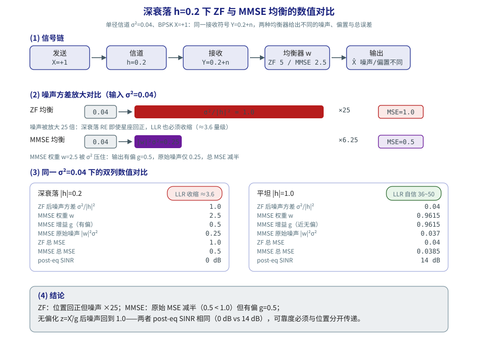
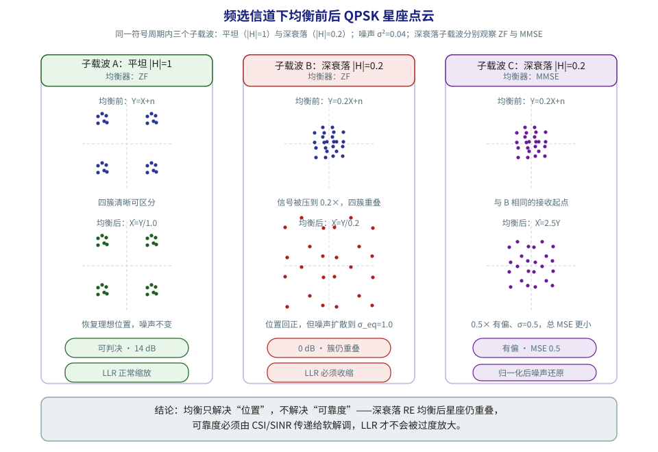
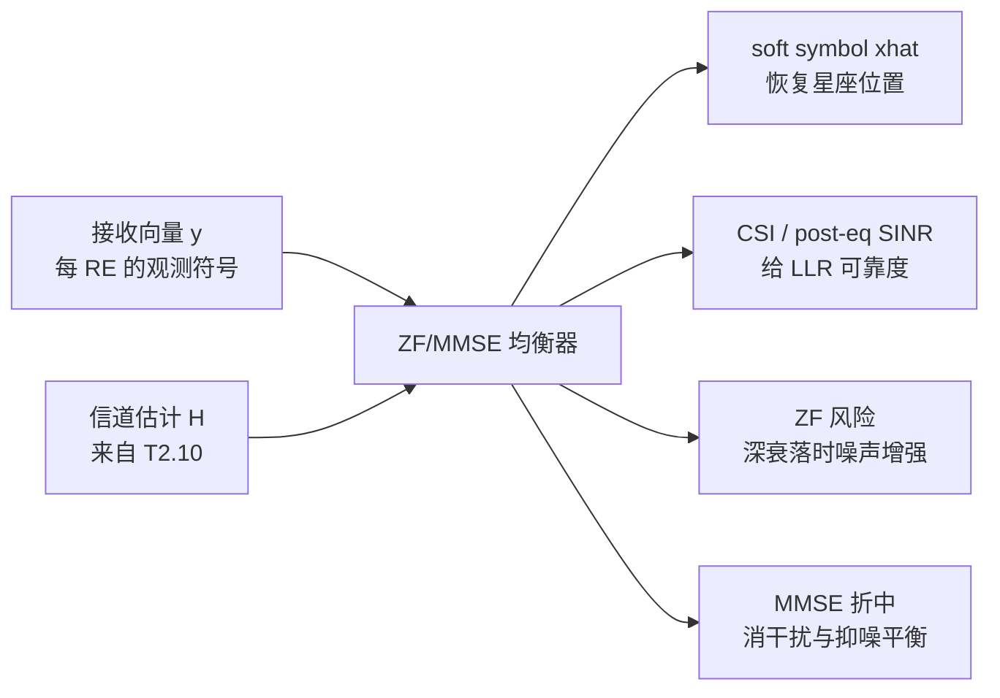
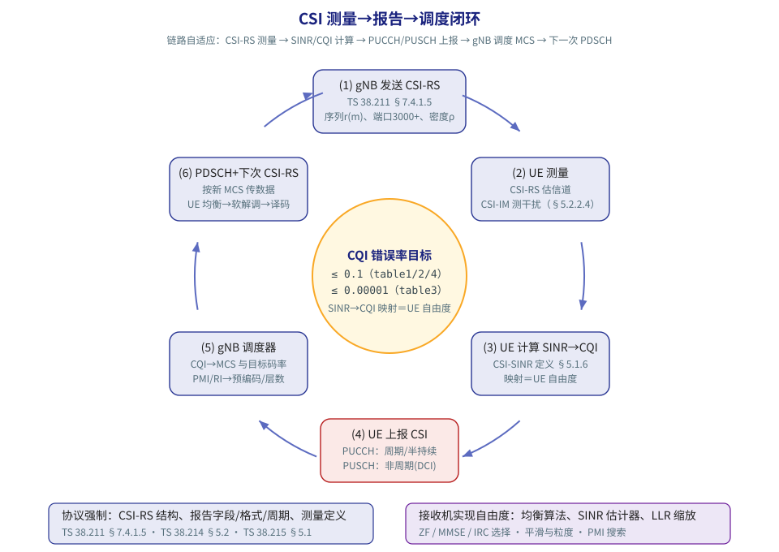

# T2.11 OFDM 均衡与 CSI：从 $Y=HX+N$ 到软解调输入
## 本节学习目标

[[T2.10_OFDM_channel_estimation_DMRS|T2.10]] 得到了每个 RE 上的信道估计 $\hat{H}[k,l]$。本节讲怎么使用它。均衡（equalization）的目标不是直接输出硬比特，而是把接收符号尽量变回星座点附近，并给软解调器提供可靠度信息。

先分清两个输出：

| 输出 | 含义 | 谁使用 |
|:---|:---|:---|
| 符号估计 $\hat{X}$ | 星座点位置估计 | soft demapper 计算候选星座距离。 |
| CSI/SINR/等效噪声 | 可靠度估计 | soft demapper 缩放 LLR，译码器感知置信度。 |

- 推导 SISO 单抽头均衡。
- 对比 ZF 和 MMSE 的工程差异。
- 说明 MIMO 线性均衡为什么需要矩阵运算。
- 解释 post-eq SINR/CSI 如何影响 LLR。
- 明确均衡算法通常不是 3GPP 协议强制项。
- 解释 CSI-RS 在协议中的角色（TS 38.211 §7.4.1.5）与 CSI 报告闭环（TS 38.214 §5.2）。
- 区分 TS 38.215 测量 SINR 与接收机内部 post-eq SINR，并标出“协议强制 vs 接收机实现自由度”边界。

## 前置知识检查

| 问题 | 需要达到的程度 |
|:---|:---|
| 单抽头信道模型是什么？ | 知道 $Y=HX+N$ 表示信道乘法加噪声。 |
| 信道估计输出是什么？ | 知道 [[T2.10_OFDM_channel_estimation_DMRS|T2.10]] 给出的是 $\hat{H}[k,l]$ 或有效信道矩阵。 |
| LLR 为什么需要噪声方差？ | 知道同样的星座距离在不同噪声下可靠度不同。 |
| 矩阵求逆的风险是什么？ | 知道弱方向求逆会放大噪声。 |
| CSI-RS 与 DM-RS 有什么区别？ | 知道 CSI-RS 不随 PDSCH 调度、位置由高层配置，专用于信道与干扰测量。 |
| CSI 报告是什么？ | 知道 UE 按周期或按需把 CQI/PMI/RI 等反馈给基站，驱动链路自适应。 |

本节默认已经理解 [[T2.10_OFDM_channel_estimation_DMRS|T2.10]] 的 DM-RS-based 信道估计。均衡不是孤立模块：它的输入质量由信道估计决定，输出可靠度又直接决定 soft demapper 的 LLR。

## 概念速览：本节三个主角

先给三个主角一个白话定位，再进入公式。

- **均衡（equalization）**：把“被信道揉皱”的星座图尽量摊回标准位置。信道让星座缩放、旋转、加噪；均衡用信道估计 $\hat{H}$ 做一次逆运算，让符号估计 $\hat{X}$ 重新靠近发送星座点。它只负责“位置”，不负责“该多相信这个位置”——后者是可靠度的事。
- **CSI（信道状态信息，Channel State Information）与 SINR（信号与干扰加噪声比，Signal-to-Interference-plus-Noise Ratio）**：可靠度的一种量化。同样的星座距离，在强信道下很可信、在深衰落信道下不可信；CSI/SINR 就是给 soft demapper 的“批改笔”：信道好把 LLR 放大，信道差把 LLR 收缩。它同时是基站做链路自适应的依据——UE 把 CSI 浓缩成 CQI 上报，基站据此选 MCS。
- **协议边界**：CSI-RS 放哪、序列是什么、报告什么字段——3GPP 协议规定；用 ZF、MMSE、IRC 中哪个均衡器、SINR 怎么估、CQI 怎么映射——接收机实现自由度。本节全部公式若未注明“协议强制”，一律按接收机实现理解。

## SISO 单抽头均衡

OFDM 把频率选择性信道拆成许多子载波上的窄带问题。单个 RE 上可以写成：

$$
Y = HX + N
\tag{1}
$$

**这个公式回答什么问题**：一个 RE 上收到的符号 $Y$ 是怎么来的？**符号含义**：$Y$ 是接收符号，$X$ 是发送符号，$H$ 是该子载波上的复信道增益（缩放+旋转），$N$ 是复噪声（方差 $\sigma^2$）。**来源**：OFDM 循环前缀把信道的时域卷积变成每个子载波上的逐点乘法（见 [[T2.1_OFDM_subcarrier_spacing_basics|T2.1]]），所以每个 RE 都是“乘一个复数再加噪声”的标量问题。

若已知 $\hat{H}$，最简单的零迫（Zero Forcing, ZF）均衡为：

$$
\hat{X}_{ZF} = \frac{Y}{\hat{H}}
\tag{2}
$$

**回答什么问题**：已知 $Y$ 和 $\hat{H}$，怎么恢复 $X$？**符号含义**：$\hat{X}_{ZF}$ 是 ZF 均衡后的符号估计。**推导**：把式 (1) 的两边同时除以 $\hat{H}$：$Y/\hat{H} = X + N/\hat{H}$，信道的影响被“除”掉了，代价是噪声项也被放大 $1/|\hat{H}|$ 倍。**白话直觉**：ZF 像把一张被压扁的图按反方向拉伸复原——图是回来了，但图上的噪点也被同倍拉伸。

这会把星座位置拉回原点附近，但也会把噪声除以 $\hat{H}$。深衰落时 $|\hat{H}|$ 很小，噪声被放大，软解调不能假装可靠度没变。

## 教学例子：同样的均衡输出，不同可靠度

假设 BPSK 发送 $X=+1$。两个 RE 的均衡后符号都为：

$$
\hat{X}=0.9
\tag{3}
$$

**回答什么问题**：均衡输出一样时，可靠度可以差多少？若第一个 RE 的等效噪声方差为 $0.05$，BPSK 近似 LLR 为：

$$
L_1=\frac{2\times0.9}{0.05}=36
\tag{4}
$$

若第二个 RE 的等效噪声方差为 $0.5$：

$$
L_2=\frac{2\times0.9}{0.5}=3.6
\tag{5}
$$

两个 RE 的硬判决都偏向 bit 0，但可靠度差了 10 倍。这个例子说明均衡输出不能只传 $\hat{X}$。如果 soft demapper 对两个 RE 使用同一噪声方差，弱信道 RE 会被过度相信，强信道 RE 可能被低估。

再看深衰落。若原始噪声方差为 $0.04$，$|H|=0.2$，ZF 后等效噪声方差为：

$$
\sigma^2_{eq}=\frac{0.04}{0.2^2}=1
\tag{6}
$$

这意味着均衡后星座点即使看起来回到了正确区域，也应输出很小的 LLR。MMSE 的价值就在这里：它不会像 ZF 那样在弱信道方向无限放大噪声。

## 数值手算：深衰落单径信道上的 ZF 与 MMSE 完整对比

上面的式 (6) 只算了 ZF 的噪声增强。现在把 ZF 和 MMSE 放在同一组小数字下完整算一遍，看清“噪声放大、偏置、MSE、post-eq SINR”四个量的关系。

**问题设定**：单径信道 $h=0.2$（实数，深衰落），噪声方差 $\sigma^2=0.04$（$\sigma=0.2$），BPSK 发送 $X=+1$，功率归一化 $E|X|^2=1$。接收为 $Y=hX+n=0.2+n$。

**第一步，ZF**。由式 (2)：

$$
\hat{X}_{ZF}=\frac{Y}{h}=X+\frac{n}{h}
$$

噪声项 $n/h$ 的方差为 $\sigma^2/|h|^2=0.04/0.04=1$，与式 (6) 一致：**噪声功率放大 25 倍**。ZF 总均方误差 $\mathrm{MSE}_{ZF}=E|\hat{X}_{ZF}-X|^2=0+1=1$。

**第二步，MMSE 权重的最小化推导**。MMSE 找使均方误差最小的线性权重 $w$：$\hat{X}_{MMSE}=wY$。目标函数为

$$
J(w)=E|wY-X|^2=|wh-1|^2+|w|^2\sigma^2
$$

对 $w^*$ 求导置零（Wiener 解，一步标准推导）：

$$
\frac{\partial J}{\partial w^*}=h^*(wh-1)+w\sigma^2=0
\;\Rightarrow\;
w=\frac{h^*}{|h|^2+\sigma^2}
$$

**回答什么问题**：为什么 MMSE 权重要“除一个 $|h|^2+\sigma^2$”而不是直接除 $|h|^2$？因为多出来的 $\sigma^2$ 项就是“噪声刹车”：信道越弱、噪声越大，$w$ 越不敢放大。**代入数字**：$w=0.2/(0.04+0.04)=2.5$。注意 ZF 的“除法增益”是 $1/h=5$，而 MMSE 只有 $2.5$——这就是 $\sigma^2$ 项把增益压住的效果。

**第三步，MMSE 输出**：

$$
\hat{X}_{MMSE}=wY=whX+wn=0.5X+2.5n
$$

等效增益 $g=wh=0.5$（**有偏**：星座整体收缩到一半），输出噪声方差 $|w|^2\sigma^2=2.5^2\times0.04=0.25$。总均方误差

$$
\mathrm{MSE}_{MMSE}=|g-1|^2+|w|^2\sigma^2=0.25+0.25=0.5
$$

**第四步，对比表**（同一 $\sigma^2=0.04$ 下，深衰落与平坦各算一列）：

| 量 | 深衰落 $\|h\|=0.2$ | 平坦 $\|h\|=1.0$ |
|:---|:---|:---|
| ZF 均衡后噪声方差 $\sigma^2/\|h\|^2$ | 1.0（放大 25 倍） | 0.04 |
| MMSE 权重 $w=h^*/(\|h\|^2+\sigma^2)$ | 2.5 | 0.9615 |
| MMSE 原始输出等效增益 $g=wh$ | 0.5（有偏） | 0.9615 |
| MMSE 原始输出噪声方差 $\|w\|^2\sigma^2$ | 0.25 | 0.037 |
| ZF 总 MSE | 1.0 | 0.04 |
| MMSE 总 MSE（含偏置） | 0.5 | 0.0385 |
| post-eq SINR（三者相同） | 1（0 dB） | 25（14 dB） |
| 无偏化后等效噪声方差 | 1.0 | 0.04 |

**第五步，读表结论**。

- 深衰落处 ZF 把噪声方差放大 25 倍；MMSE 原始输出噪声只有 0.25，且总 MSE（0.5）只有 ZF（1.0）的一半——这是 MMSE 的“原始”优势。
- 但 MMSE 输出是有偏的（星座收缩到 0.5×）。若直接把它当 $X$ 送 soft demapper，所有星座距离都会被系统性缩小。无偏化 $z=\hat{X}/g=X+5n$ 后噪声方差回到 1.0——**“把偏置还回去，噪声也还回来了”**。这正是下一节式 (7)(8) 归一化必须同步更新等效噪声方差的原因。
- 在“纯加性噪声、无干扰”的 SISO 单流场景，ZF 与 MMSE（无论是否无偏化）的 post-eq SINR 数学上相同，都是 $|h|^2/\sigma^2$（0 dB vs 14 dB）。MMSE 的真正优势在：(1) 噪声方差估计有误差时更稳健；(2) 存在层间/小区间干扰时，权重会主动抑制干扰（见后文 IRC）；(3) 未无偏化时总 MSE 更小。差异会在 MIMO/干扰场景被放大。
- LLR 视角：深衰落 RE 的 post-eq SINR 只有 0 dB，LLR 必须按小可靠度缩放（对应式 (5) 中 3.6 的量级而不是 36）；平坦 RE 是 14 dB，可以给 50 量级的 LLR。

## 图示：深衰落下的 ZF 与 MMSE 均衡对比

上图（频域）回答“深衰落子载波发生了什么”：信道幅度 $|H|=0.2$ 处，ZF 的均衡增益 $1/|H|=5$，对应噪声功率放大 $1/|H|^2=25$ 倍；MMSE 权重 $2.5$ 被 $\sigma^2$ 项压住，不会无限放大。下图（星座）回答“均衡后符号长什么样”：ZF 把位置拉回理想星座但噪声扩散到 $\sigma_{eq}=1.0$，四簇严重重叠；MMSE 原始输出收缩到 $0.5\times$、噪声只有 0.5，总 MSE 更小。

## 图示：频选信道下均衡前后星座

三个子载波放在同一张图里对比：接收起点（均衡前）决定“信道把星座糟蹋成什么样”，均衡器决定“位置能否回正、噪声付出多大代价”。深衰落子载波无论用哪种均衡器，均衡后星座都不可分——所以“位置”和“可靠度”必须分开传递，这就是 CSI/SINR 存在的原因。

## 深入理解：MMSE 输出归一化

线性 MMSE 输出通常不是完全无偏的。可以抽象写成：

$$
\hat{x}=g x + v
\tag{7}
$$

其中 $g$ 是等效增益，$v$ 是等效噪声和残留干扰。**回答什么问题**：均衡器输出 $\hat{x}$ 与真实符号 $x$ 之间是什么关系？如果直接把 $\hat{x}$ 当成 $x+w$ 送给 soft demapper，会造成星座缩放错误。因此实现中常需要归一化：

$$
z=\frac{\hat{x}}{g}
\tag{8}
$$

归一化后噪声也被除以 $g$，所以必须同步更新等效噪声方差或 CSI。危险点在于 $g$ 很小时，归一化倍数很大，定点实现必须有饱和和异常保护。否则一个深衰落 RE 会产生不合理的大幅 LLR。

## 实现细节：均衡器接口字段

一个可调试的均衡器接口不应只输出复数符号。建议至少记录：

| 字段 | 粒度 | 用途 |
|:---|:---|:---|
| `x_hat` | RE/layer | soft demapper 输入位置。 |
| `csi` 或 `post_sinr` | RE/layer | LLR 缩放和可靠度评估。 |
| `noise_var` | slot、PRB 或 RE | soft demapper 距离归一化。 |
| `eq_gain` | RE/layer | MMSE 输出归一化调试。 |
| `condition_metric` | RE/PRB | 判断矩阵求逆和噪声增强风险。 |

这些字段不会全部进入最终产品接口，但在仿真和 bring-up 阶段很有价值。缺少它们时，BLER 曲线一旦异常，调试者只能猜是信道估计、均衡、soft demapper 还是译码器出了问题。

诊断时建议再记录两个元信息：`csi_source`（标记 `csi` 来自哪种估计：基于参考信号、基于均衡权重解析推导、还是基于 EVM），以及 `cqi_reported`（本周期实际上报的 CQI）。前者让“可靠度不对”能追到估计方法，后者让“上报 CQI 与均衡器内部 SINR 不一致”能被发现——两者的差异超过阈值（例如 3 dB）说明口径或映射有问题，而不是译码器的问题。

## 扩展讲解：验证与实现关注点

均衡器验证应从“符号位置”和“可靠度”两个维度同时进行。很多错误只看星座图不明显。例如 MMSE 输出未归一化时，星座整体缩小，但判决方向可能仍对；如果 soft demapper 同时使用了错误的噪声方差，BLER 会明显变差。反过来，星座看起来扩散很大，但如果 CSI 正确降低了 LLR 幅度，译码器仍可能通过校验约束恢复。

第一个基线是 SISO flat fading。构造固定 $H=0.5e^{j30^\circ}$、固定噪声方差的信道，检查均衡后星座是否回到正确相位和幅度，并检查输出 LLR 是否按 $|H|^2/\sigma^2$ 缩放。这个测试能暴露复共轭方向、除法方向、相位符号和噪声方差口径错误。

第二个基线是深衰落。把 $|H|$ 扫到很小，观察 ZF 和 MMSE 的差异。正确行为不是输出越来越大的可靠 LLR，而是识别弱信道并降低 CSI。若 LLR clip count 在深衰落下反而升高，通常说明归一化或噪声估计存在问题。

第三个基线是 MIMO 条件数扫描。构造一组从正交到近似共线的信道矩阵，观察 per-layer SINR 是否随最小奇异值下降。ZF 在病态矩阵下会显著噪声增强；MMSE 应更平滑。如果两者表现完全相同，要检查 MMSE 是否真正使用了 $\sigma^2$。

| 测试向量 | 应观察 | 能暴露的问题 |
|:---|:---|:---|
| 固定复数 $H$ | 星座相位完全校正 | 共轭方向和复除法错误。 |
| 深衰落 sweep | CSI 下降，LLR 变小 | 噪声增强未建模。 |
| 噪声方差 sweep | MMSE 权重随噪声变化 | $\sigma^2$ 未接入或单位错。 |
| MIMO 条件数 sweep | 弱层 SINR 下降 | 矩阵求逆、层顺序或 CSI 输出错。 |
| 定点位宽 sweep | BLER 平滑退化 | 溢出、饱和、归一化过强。 |

均衡器的硬件代价也要提前记录。每 RE 做矩阵求逆不现实，工程上常通过维度限制、共享权重、近似求逆、流水线和缓存复用来实现。设计文档需要明确每 slot 需要处理多少 RE、每 RE 的层数、矩阵维度、复乘数量和输出带宽。否则算法在浮点仿真里成立，落到实时接收机时可能无法满足吞吐。

## 调试案例库

| 案例 | 表现 | 定位步骤 | 修复方向 |
|:---|:---|:---|:---|
| 复共轭方向错 | 星座相位加倍或反向旋转 | 固定 $H=e^{j\theta}$ 单元测试 | 修正 $H^H$、$H^{-1}$ 或除法方向。 |
| MMSE 退化成 ZF | 噪声变化时输出不变 | 扫 $\sigma^2$ 看权重 | 检查噪声方差是否进入矩阵。 |
| CSI 过度自信 | 深衰落下 LLR 极大 | 看 per-RE CSI 和 clip count | 对弱信道做下限/上限保护。 |
| 层输出交换 | 单层激励时另一层有强 LLR | 做 layer impulse test | 修正 detector output order。 |
| CQI 与本地 SINR 不一致 | 上报 MCS 与实际 BLER 脱节 | 对比上报 CQI 反推 SINR 与均衡器内部 SINR 分布 | 统一测量口径或校正映射表。 |
| IRC 无效果 | 强干扰下性能不升 | 检查 $\mathbf{R}_{nn}$ 是否真正进入权重 | 确认干扰协方差估计有效。 |

均衡器还要和 soft demapper 协商符号缩放约定。若均衡器输出已经归一化，soft demapper 不应再次除以增益；若均衡器输出保留 MMSE bias，soft demapper 必须知道等效增益。接口文档应写明 `x_hat` 是 normalized 还是 biased，`csi` 是线性 SINR、增益、还是内部归一化权重。这个约定不清，会导致不同团队的模块单测都通过，系统联调却失败。

## 最小仿真矩阵

| 维度 | 建议取值 | 覆盖目的 |
|:---|:---|:---|
| 信道幅度 | 强、中、深衰落 | 检查噪声增强和 CSI 缩放。 |
| 均衡器 | ZF、MMSE、perfect equalization | 分离算法差异和上界。 |
| 噪声方差 | 正确、偏大、偏小 | 验证 LLR 可靠度敏感性。 |
| MIMO 条件数 | 良好、一般、病态 | 覆盖矩阵求逆风险。 |
| 定点位宽 | 浮点、宽定点、窄定点 | 检查归一化和饱和。 |
| 干扰强度 | 无、弱、强 | 比较 ZF/MMSE/IRC 的分化。 |
| CSI 报告 | 无报告、理想报告、真实 CQI 映射 | 验证 CSI 闭环对 BLER 与吞吐的影响。 |

每个点至少记录 `x_hat`、`csi/post_sinr`、`noise_var`、clip count、EVM 和 BLER。均衡器验收必须同时证明“星座位置对”和“可靠度对”，缺一项都不能算完成。

## 图示：均衡链路

图示的上半部分是均衡主链路：接收向量 $y$ 和信道估计 $H$ 进入 ZF/MMSE 均衡器，输出 soft symbol、CSI 或 SINR。下半部分强调 ZF 和 MMSE 的核心差异：ZF 更强调消干扰，MMSE 在残留干扰和噪声增强之间折中。

## ZF 的优点和风险

ZF 的目标是让信道影响尽量被逆掉。SISO 下它就是除法；MIMO 下它对应矩阵伪逆：

$$
\mathbf{W}_{ZF} = (\mathbf{H}^{H}\mathbf{H})^{-1}\mathbf{H}^{H}
\tag{9}
$$

**回答什么问题**：MIMO 场景下“除以 $\mathbf{H}$”的矩阵写法是什么？**符号含义**：$\mathbf{W}_{ZF}$ 是 $N_{rx}\times N_{layer}$ 的均衡权重矩阵，$\mathbf{H}$ 是接收天线数 $\times$ 层数的信道矩阵，上标 $H$ 表示共轭转置。**推导**：伪逆是“最小二乘意义下的除法”——把 $\mathbf{y}=\mathbf{H}\mathbf{x}+\mathbf{n}$ 两边左乘 $\mathbf{H}^{H}$ 再解 $\mathbf{H}^{H}\mathbf{y}=(\mathbf{H}^{H}\mathbf{H})\mathbf{x}$。**来源**：矩阵伪逆的经典形式，是式 (2) 的矩阵推广。

当信道矩阵条件数良好时，ZF 简单直接。但如果某些方向接近深衰落，矩阵求逆会把噪声沿弱方向大幅放大。结果是星座点看似被分离了，LLR 却不该过度自信。

## MMSE 的折中

MMSE（Minimum Mean Square Error）均衡显式把噪声方差纳入权重。常见线性形式为：

$$
\mathbf{W}_{MMSE}
=
\mathbf{H}^{H}
(\mathbf{H}\mathbf{H}^{H}+\sigma^2\mathbf{I})^{-1}
\tag{10}
$$

**回答什么问题**：MIMO 下 MMSE 权重和 ZF 差在哪？**符号含义**：$\sigma^2\mathbf{I}$ 是对角噪声项，$\mathbf{I}$ 是单位阵；其余符号同式 (9)。**来源**：Wiener 滤波的矩阵形式，是上一节 SISO 推导 $w=h^*/(|h|^2+\sigma^2)$ 的直接推广——把标量 $|h|^2$ 换成矩阵 $\mathbf{H}\mathbf{H}^{H}$，把 $\sigma^2$ 换成 $\sigma^2\mathbf{I}$。

式 (10) 的直觉是：信道强、噪声小时，MMSE 接近 ZF；信道弱、噪声大时，MMSE 不会为了完全消掉干扰而无限放大噪声。它允许一点残留干扰，换取整体均方误差更小。

## post-eq SINR 与 CSI

均衡器后，soft demapper 需要知道每个符号有多可靠。这个可靠度常用 post-eq SINR、CSI 或等效噪声方差表达。概念上可以写成：

$$
\mathrm{SINR}_{post}
=
\frac{\text{期望符号功率}}
{\text{残留干扰功率}+\text{等效噪声功率}}
\tag{11}
$$

**回答什么问题**：均衡之后的“信干噪比”由什么组成？**符号含义**：分子是均衡后期望符号的功率，分母是没被消掉的干扰和放大后的噪声。**来源**：SINR 的一般定义（TS 38.215 §5.1 的测量定义是它的 RS 域特例，见下文协议锚点）。

LLR 不是只由 $\hat{X}$ 的位置决定，还要由可靠度缩放。弱信道下，即使 $\hat{X}$ 落在正确星座点附近，也应给较小幅度的 LLR；强信道下，同样的距离可以给更大 LLR。

## SINR 估计方法：从 RE 到报告

post-eq SINR 不只有一种算法。常见方法如下表，**全部属于接收机实现自由度**：

| 方法 | 原理 | 粒度 | 依赖 |
|:---|:---|:---|:---|
| 参考信号残差法 | 在 DM-RS/CSI-RS 处估残差方差 $\hat{\sigma}^2=\mathrm{Var}(Y_p-\hat{H}X_p)$，SINR $=|\hat{H}|^2/\hat{\sigma}^2$ | RE/PRB | 信道估计 |
| 权重解析法 | 由 MMSE 权重直接给出：SISO 下 $g=wh$，SINR $=g/(1-g)$；MIMO 下用每层等效增益 | RE | 均衡权重 |
| EVM 反推法 | 从均衡后星座残差 EVM 反推 SINR | PRB/slot | 均衡输出 |
| 干扰协方差法 | 在 CSI-IM/空白 RE 上估计 $\mathbf{R}_{nn}$，代入 post-eq SINR 表达式 | PRB/wideband | 干扰测量资源 |

两个消费者、两种粒度要分清：**LLR 缩放要 per-RE 的 SINR**（深衰落 RE 必须单独收缩），**CQI 上报要 wideband 或子带平均后的 SINR**（基站按整个报告频带的错误率目标选 MCS）。中间还要做时间平滑——快速衰落时平滑窗口太大会跟不上信道变化，太小则 CQI 抖动、MCS 频繁切换。这些都是实现自由度，但口径必须统一记录（见“实现细节”一节的 `csi_source` 字段）。

## 均衡器选择：ZF、MMSE 与 IRC

工程上均衡器有三种常见选择，选型的白话直觉是“三种音量处理策略”：ZF 把回声（信道效应）完全消掉但底噪一起放大；MMSE 兼顾回声与底噪（把 $\sigma^2$ 计入权重）；IRC（干扰抑制合并，Interference Rejection Combining）连“特定方向的噪音”——干扰——一起处理，把干扰协方差矩阵纳入权重：

$$
\mathbf{W}_{IRC}
=
\mathbf{H}^{H}
(\mathbf{H}\mathbf{H}^{H}+\mathbf{R}_{nn})^{-1}
$$

其中 $\mathbf{R}_{nn}=E[\mathbf{n}\mathbf{n}^{H}]$ 是干扰加噪声的协方差矩阵。**来源**：式 (10) 的推广——当 $\mathbf{R}_{nn}=\sigma^2\mathbf{I}$ 时 IRC 退化为 MMSE。

| 场景 | 推荐 | 理由 |
|:---|:---|:---|
| 噪声主导、信道良态 | ZF | 实现简单，不依赖 $\sigma^2$ 估计。 |
| 一般 PDSCH（噪声+弱干扰） | MMSE | 默认选择，总 MSE 最优。 |
| 强干扰（邻区/层间） | IRC | 白化干扰方向，SINR 增益最大。 |
| 深衰落或病态矩阵 | MMSE/IRC | ZF 噪声增强不可控。 |

实现代价与风险：每 RE 一次矩阵求逆，维度 $\min(N_{rx},N_{layer})$，4 层就是 $4\times4$ 求逆（$O(M^3)$），所以工程上常用共享权重、分段近似、流水线与缓存复用；MMSE 对 $\sigma^2$ 估计误差的响应也要记录——$\sigma^2$ 过估时权重偏保守（趋近匹配滤波），低估时趋近 ZF。**再次强调：以上全部是接收机实现自由度，3GPP 协议不规定接收端用哪个均衡器**。

## MIMO 均衡的维度

MIMO-OFDM 中，每个 RE 的模型变成：

$$
\mathbf{y}[k,l] = \mathbf{H}[k,l]\mathbf{x}[k,l] + \mathbf{n}[k,l]
\tag{12}
$$

**回答什么问题**：单 RE 的模型在 MIMO 下变成什么？**符号含义**：$\mathbf{y}$ 是接收天线数的向量，$\mathbf{x}$ 是层数的向量，$\mathbf{H}$ 是接收天线数 $\times$ 层数的矩阵，$\mathbf{n}$ 是噪声向量；$[k,l]$ 表示每个 RE 都有自己的矩阵。

其中 $\mathbf{H}$ 是接收天线数 $\times$ 层数的矩阵。均衡器需要对每个 RE 计算或复用矩阵权重。若层数增加，矩阵求逆、乘法、CSI 输出和缓存带宽都会上升。这就是为什么 MIMO 检测不只是“多几根天线”，而是接收机硬件复杂度的重要来源。

## 协议锚点：CSI-RS——测量与 CSI 报告的依据（TS 38.211 §7.4.1.5）

**是什么**：CSI-RS（信道状态信息参考信号，Channel State Information Reference Signal）是下行专用参考信号，供 UE 做信道测量、干扰测量、CSI 计算和移动性/波束测量（L1-RSRP、L1-SINR）。

**为什么**：DM-RS 跟着 PDSCH 走——数据调度到哪它出现在哪，只覆盖被调度的资源；CSI-RS 则“独立站岗”：序列、位置、密度、端口全部由高层配置，无论有没有 PDSCH 都按配置发送。因此 UE 才能随时测“信道本身有多好”，才能算 SINR、报 CQI。而且 CSI-RS 不承载数据，测出的功率不含数据干扰，SINR 测量比在 DM-RS 上测更干净。

**协议规定什么**（本地证据：`3GPP_Rel19/processed/TS_38.211_38211-j30/full.md` 第 5599–5685 行）：

- 分类（§7.4.1.5.1 General）：原文 “Zero-power (ZP) and non-zero-power (NZP) CSI-RS are defined”。**NZP（非零功率）** CSI-RS 承载序列，用于信道与功率测量；**ZP（零功率）** CSI-RS 不承载序列，UE 假设这些 RE 不用于 PDSCH 传输，用于干扰测量与速率匹配。
- 序列（§7.4.1.5.2 Sequence generation），原文：The UE shall assume the reference-signal sequence $r(m)$ is defined by

$$
r(m)=\frac{1}{\sqrt{2}}\big(1-2c(2m)\big)+j\frac{1}{\sqrt{2}}\big(1-2c(2m+1)\big)
\tag{13}
$$

**逐符号解释**：$r(m)$ 是第 $m$ 个 CSI-RS 序列元素；$c(i)$ 是 §5.2.1 定义的伪随机序列（与 PDSCH 加扰同族）；$1/\sqrt{2}$ 归一化使 $E|r(m)|^2=1$；$2m$、$2m+1$ 表示相邻取两个 $c$ 值分别构造实部与虚部。（注：抽取件将该公式中的 $1/\sqrt{2}$ 显示为 $1/2$，系 OCR 近似；标准形式如上，与 DM-RS 序列 §7.4.1.1.1 同构。）序列生成器在**每个 OFDM 符号起始**用下式初始化：

$$
c_{init}=\left(2^{10}\left(N_{symb}^{slot}n_{s,f}^{\mu}+l+1\right)\left(2n_{ID}+1\right)+n_{ID}\right)\bmod 2^{31}
\tag{14}
$$

**逐符号解释**：$N_{symb}^{slot}$ 是每个时隙的 OFDM 符号数（常规 CP 为 14），$n_{s,f}^{\mu}$ 是无线帧内的时隙号，$l$ 是时隙内的符号号，$n_{ID}$ 是高层参数 `scramblingID` 或 `sequenceGenerationConfig`。三个时间量都进初始化公式，意味着**不同符号、不同时隙的 CSI-RS 序列不同**——这是为了平滑掉小区间序列的固定碰撞。

- 映射（§7.4.1.5.3 Mapping to physical resources）：密度 $\rho$ 由高层参数 `density` 给出；端口数 `nrofPorts`，单资源端口数 $N_{tot}\in\{1,2,4,8,12,16,24,32\}$（48/64/128 由 $K$ 个资源聚合）；频域位置由 `frequencyDomainAllocation` 位图给出；时域位置 `firstOFDMSymbolInTimeDomain`（$l_0\in\{0,\ldots,13\}$，第二个符号 $l_1\in\{2,\ldots,12\}$）；CDM 组大小由 `cdm-Type` 给出；天线端口按 $p=3000+p'$ 编号。TRS（跟踪参考信号）特例：$\rho=3$、单端口。原文还规定：“The UE is not expected to receive CSI-RS and DM-RS on the same resource elements.”——CSI-RS 与 DM-RS 不会落在同一 RE 上，接收机可以据此规划 RE 处理流水。

**接收端必须做什么**：UE 拿到高层配置后，知道“哪些 RE 上是 CSI-RS、用什么序列、几个端口”，然后在这组 RE 上做三件事：(1) NZP CSI-RS 上做信道估计（方法就是 [[T2.10_OFDM_channel_estimation_DMRS|T2.10]] 的 LS/MMSE，属于实现自由度）；(2) ZP CSI-RS/CSI-IM 上测干扰与噪声；(3) 按 TS 38.215 的定义算功率/SINR。**边界**：CSI-RS 的序列、位置、端口、功率偏移是协议强制；在这些 RE 上用何种估计器、如何算 SINR 是接收机实现自由度。

## 协议锚点：CSI 报告框架（TS 38.214 §5.2）

**是什么**：CSI 报告是 UE 把信道质量反馈给 gNB 的流程。§5.2.1 原文：“CSI may consist of Channel Quality Indicator (CQI), precoding matrix indicator (PMI), CSI-RS resource indicator (CRI), SS/PBCH Block Resource indicator (SSBRI), layer indicator (LI), rank indicator (RI), L1-RSRP, L1-SINR, ...”——即报告内容是这些量的组合，由 `reportQuantity` 选择。

**为什么**：gNB 不知道 UE 侧的信道（FDD 上下行频率不同，互易性不可用），必须靠 UE 报告。报告内容决定三件事：CQI → MCS（调制+码率）、PMI → 预编码、RI/LI → 层数。没有 CSI 报告，链路自适应就退化成固定 MCS，深衰落用户要么 BLER 高企、要么吞吐浪费。

**协议规定什么**（本地证据：`3GPP_Rel19/processed/TS_38.214_38214-j30/full.md` 第 2895–2914、3035、4187–4230、6604–6627 行）：

- **报告设置**（§5.2.1.1 Reporting settings）：每个 `CSI-ReportConfig` 配置 `reportQuantity`（报哪些量）、`reportConfigType`（取值 'aperiodic' 非周期 / 'semiPersistentOnPUCCH' / 'semiPersistentOnPUSCH' 半持续 / 'periodic' 周期）、`reportFreqConfiguration`（频域粒度：wideband 或子带 CQI/PMI，由 `cqi-FormatIndicator` 指示）、`timeRestrictionForChannelMeasurements`（是否限制只能使用最近的测量时机）。
- **上报载体**（§5.2.3 CSI reporting using PUSCH / §5.2.4 CSI reporting using PUCCH）：周期与半持续报告在 **PUCCH**（物理上行控制信道，Physical Uplink Control Channel）上发送；非周期报告在 **PUSCH**（物理上行共享信道，Physical Uplink Shared Channel）上发送，由 DCI 触发。
- **CQI 定义**（§5.2.2.1，原文摘录）：“the UE shall derive ... the highest CQI index which satisfies the following condition: A single PDSCH transport block with a combination of modulation scheme, target code rate and transport block size corresponding to the CQI index ... could be received with a transport block error probability not exceeding: 0.1, if the higher layer parameter cqi-Table ... configures 'table1'/'table2'/'table4-r17' ..., or 0.00001, if ... 'table3' ...”。**翻译**：CQI 索引不是裸 SINR 数值，而是“调制方式+目标码率+TBS”的组合编号；UE 必须找到满足错误率目标（普通场景传输块错误概率 $\le 0.1$，低 BLER 场景 $\le 0.00001$）的**最高**索引——目标是在错误率约束下选最激进的 MCS。
- **子带差分 CQI**（Table 5.2.2.1-1）：2-bit 差分值 0/1/2/3 对应偏移 0、+1、$\ge+2$、$\le-1$（相对 wideband CQI）；配置 `cqi-BitsPerSubband` 时改为每子带 4-bit 全值。
- **干扰测量资源 CSI-IM**（§5.2.2.4，CSI 干扰测量，Channel State Information – Interference Measurement）：UE 可配置若干 CSI-IM 资源；pattern0 为 $(k,l)$、$(k+1,l)$、$(k,l+1)$、$(k+1,l+1)$ 四个 RE（2×2），pattern1 为同一符号内 4 个连续子载波——**这些 RE 上基站不发信号，UE 测到的就是纯干扰+噪声**。

**接收端流程**（把协议翻译成接收机动作）：

1. 高层配置 `CSI-ReportConfig` + `CSI-ResourceConfig`：哪套 CSI-RS 用于信道测量、哪套 CSI-IM 用于干扰测量、周期多长、报哪些量。
2. 按周期或 DCI 触发，在 NZP CSI-RS 的 RE 上估计信道。
3. 在 CSI-IM 的 RE 上测量干扰与噪声。
4. 计算（wideband 或子带）post-eq SINR，并映射为满足错误率目标（0.1 或 0.00001）的最高 CQI 索引。
5. 按 `reportQuantity` 组装 CQI/PMI/RI/LI 等字段，经 PUCCH（周期/半持续）或 PUSCH（非周期）上报。
6. gNB 调度器用 CQI 选 MCS、用 PMI 选预编码、用 RI/LI 选层数，调度下一次 PDSCH——闭环回到本节的均衡与软解调。

**边界**：报什么字段、什么格式、什么周期/触发、错误率目标是多少——协议强制；SINR 用什么估计器、SINR→CQI 用什么映射函数（哪条 BLER 曲线）、PMI 怎么搜索——UE 实现自由度。

## 协议锚点：测量指标定义（TS 38.215 §5.1.5/§5.1.6）

**是什么/为什么**：TS 38.215 定义物理层测量指标，统一“什么算功率、什么算 SINR”的口径，让 UE 上报与 gNB 解读一致。其中与本节直接相关的是 SS-SINR 与 CSI-SINR（本地证据：`3GPP_Rel19/processed/TS_38.215_38215-j20/full.md` 第 384–394 行）。

- **SS-SINR**（§5.1.5，原文摘录）：“SS signal-to-noise and interference ratio (SS-SINR), is defined as the linear average over the power contribution (in [W]) of the resource elements carrying secondary synchronisation signals divided by the linear average of the noise and interference power contribution (in [W]).”——分子是携带辅同步信号（SSS）的 RE 上接收功率的线性平均，分母是噪声与干扰功率的线性平均。
- **CSI-SINR**（§5.1.6，原文同构）：把上式中的 SSS 换成 CSI 参考信号。可整理成：

$$
\mathrm{CSI\text{-}SINR}
=
\frac{\text{携带 CSI-RS 的 RE 上信号功率贡献的线性平均（W）}}
{\text{噪声与干扰功率贡献的线性平均（W）}}
\tag{15}
$$

**逐符号解释**：分子分母都是“线性平均”——在功率域（W）上平均，不是 dB 平均后相减；分子只统计配置给 CSI-RS 测量用的 RE；分母统计同一带宽内的噪声与干扰。**附加约束**（原文）：CSI-SINR 测量使用天线端口 3000 的 CSI-RS（用于 L1-SINR 报告时可扩展到 3001）；FR1 的参考点是 UE 天线连接器；FR2 基于接收分支的组合信号；接收分集生效时，上报值不得低于任一接收分支的测量值。

**与接收机内部 post-eq SINR 的关系**：TS 38.215 的 SINR 是**测量指标**（RS 域、供报告与移动性），post-eq SINR 是**解调可靠度**（数据域、供 LLR 缩放），两者概念同源（式 (11)），但定义域、参考信号与平均粒度都不同，不能互相等同。接收机内部用什么估计器是自由度；一旦要上报，就必须按 TS 38.215 的口径测量——这是“协议强制 vs 自由度”的清晰分界线。

## 图示：CSI 测量→报告→调度闭环

本图回答“均衡器内部的 CSI 从哪里来、到哪里去”：左侧是协议强制部分（CSI-RS 结构、报告字段与错误率目标），右侧是自由度部分（均衡算法、SINR 估计器、CQI 映射）。本节的均衡与软解调位于第 (6) 步之后——UE 收到按新 MCS 调度的 PDSCH，解调、均衡、软解调、译码，然后基于 CSI-RS 再次测量，闭环继续。

## 和 LLR 的接口

对 BPSK/QPSK/QAM soft demapper 来说，均衡器至少要提供：

| 字段 | 用途 | 错误后果 |
|:---|:---|:---|
| $\hat{X}$ | 计算到候选星座点的距离 | 星座偏移，LLR 符号可能错误。 |
| $\sigma^2_{eq}$ 或 SINR | 缩放距离到概率 | LLR 过度自信或过度保守。 |
| layer/RE 顺序 | 还原码字级 LLR 顺序 | rate recovery 地址错位。 |
| clip/saturation 状态 | 定点接口保护 | 极值裁剪导致迭代信息丢失，或溢出造成符号翻转。 |

## 资料与协议边界

| 资料 | 本节采用 | 边界 |
|:---|:---|:---|
| TS 38.211 层映射/预编码入口 | 说明均衡前的发送侧结构 | 不复现全部 PDSCH/PUSCH 映射规则。 |
| TS 38.211 §7.4.1.5 CSI-RS | CSI-RS 序列、映射与端口（式 (13)(14)） | 不复现 §7.4.1.5.3 全部表格（CDM 表、聚合表）。 |
| TS 38.214 §5.2 CSI 报告 | CQI 定义、上报载体、CSI-IM、报告设置 | 不复现 codebook 类型与 DCI 触发细节。 |
| TS 38.215 §5.1.5/§5.1.6 | SS-SINR/CSI-SINR 测量定义（式 (15)） | 不把测量定义等同 soft demapper 内部算法。 |
| `MMSE_均衡` | MMSE 公式和归一化风险 | 作为接收机概念材料。 |
| `CSI_SINR` | CSI 到 LLR 可靠度的关系 | 不声明协议强制 CSI 加权公式。 |

TS 38.211 规定物理信道、调制、层映射、预编码和参考信号结构；TS 38.214 规定 PDSCH/PUSCH 过程、MCS、CSI 报告等上下文；TS 38.215 定义 RSRP/RSRQ/SINR 等测量指标。具体使用 ZF、MMSE、IRC、ML、球面检测，如何估计 post-eq SINR，如何归一化和裁剪 LLR，通常是接收机实现自由度。

## 常见错误

| 错误 | 为什么错 | 正确做法 |
|:---|:---|:---|
| 均衡后直接硬判决 | 译码器需要软信息，不是硬比特。 | 输出 $\hat{X}$ 和可靠度，交给 soft demapper。 |
| 只比较 ZF 星座位置 | ZF 可能噪声增强严重。 | 同时比较 post-eq SINR 和 LLR 分布。 |
| 忽略 $\hat{H}$ 误差 | 均衡完全依赖信道估计。 | 联合记录 channel estimate 和 equalizer 输出。 |
| MIMO 每层用 SISO 逻辑 | 多层之间存在串扰。 | 使用矩阵均衡/检测并输出每层 CSI。 |
| 把 TS 38.215 的测量 SINR 直接当 per-RE LLR 缩放 | 定义域不同（RS 域 vs 数据域、平均粒度不同）。 | 均衡器内部用 post-eq SINR，上报才用测量 SINR。 |
| 把均衡算法/CSI 加权当成协议强制 | 协议只规定参考信号结构与报告字段。 | 明确标注“接收机实现自由度”。 |

## 自测题

1. SISO ZF 均衡为什么会放大噪声？
2. MMSE 相比 ZF 多考虑了什么？
3. 为什么 soft demapper 不能只拿 $\hat{X}$？
4. MIMO 均衡为什么是每 RE 的矩阵问题？
5. post-eq SINR 和译码器性能有什么关系？
6. CSI-RS 和 DM-RS 在用途上有什么不同？为什么 SINR 测量用 CSI-RS 而不是 DM-RS？
7. CQI 的协议定义为什么是“错误概率不超过 0.1 的最高索引”，而不是直接上报 SINR 数值？
8. 周期 CSI 报告用什么物理信道上报？非周期（DCI 触发）用什么？
9. ZF、MMSE、IRC 是 3GPP 协议规定的接收算法吗？

## 自测题参考答案

1. 因为 $\hat{X}=Y/\hat{H}=X+N/\hat{H}$，$|\hat{H}|$ 小时噪声项被放大。
2. MMSE 把噪声方差加入权重，在消干扰和抑制噪声增强之间折中。
3. LLR 幅度需要可靠度；同样的符号位置在强信道和弱信道下置信度不同。
4. 每个 RE 上多层符号经过 MIMO 信道矩阵混合，接收端要用该 RE 的矩阵权重分离层。
5. post-eq SINR 越高，LLR 可更自信；SINR 估计错误会导致 LLR 缩放错误并影响译码收敛。
6. DM-RS 随 PDSCH/PUSCH 一起发送、只覆盖被调度资源，用于解调；CSI-RS 由高层配置、独立于数据调度，用于信道测量、干扰测量和 CSI/RSRP/SINR 计算（TS 38.211 §7.4.1.5）。SINR 测量需要“已知内容、不与数据共 RE”的信号，CSI-RS 满足；DM-RS 与数据功率共享，不能干净地测噪声。
7. 链路自适应的目标是“在错误率约束内用最高效率”：CQI 索引直接对应调制+目标码率+TBS，错误率目标（0.1 或 0.00001）由协议定义（TS 38.214 §5.2.2.1），保证 gNB 选 MCS 时知道 UE 的保障水平；裸 SINR 数值还需要双方对映射达成一致，而映射实际是 UE 自由度。
8. 周期/半持续 → PUCCH（TS 38.214 §5.2.4）；非周期 → PUSCH（§5.2.3）。
9. 不是。协议只规定参考信号结构与 CSI 报告字段（TS 38.211 §7.4.1.5、TS 38.214 §5.2）；均衡/检测算法是接收机实现自由度。

## 本节验收

| 验收项 | 通过标准 |
|:---|:---|
| SISO 均衡 | 能写出 $\hat{X}=Y/\hat{H}$ 并解释噪声增强。 |
| ZF/MMSE | 能说明两者在干扰消除和噪声放大之间的差异。 |
| CSI 接口 | 能解释 soft demapper 为什么需要可靠度。 |
| MIMO 维度 | 能说明每 RE 矩阵均衡的复杂度来源。 |
| 链路图理解 | 能按图示说明均衡器如何同时输出符号位置和可靠度。 |
| 数值手算 | 能复算深衰落 $h=0.2$、$\sigma^2=0.04$ 下 ZF/MMSE 的噪声方差、MSE 与 post-eq SINR。 |
| 协议锚点 | 能说出 CSI-RS 条款号（TS 38.211 §7.4.1.5）与 CQI 错误率目标（0.1 / 0.00001）。 |
| SINR 口径 | 能区分 TS 38.215 测量 SINR 与接收机内部 post-eq SINR。 |
| CSI 闭环 | 能画出 CSI-RS→测量→SINR/CQI→PUCCH/PUSCH→MCS 的闭环并标出强制/自由度边界。 |

## 与相邻章节的衔接

T2.11 把 [[T2.10_OFDM_channel_estimation_DMRS|T2.10]] 的信道估计转换成 soft demapper 可用的符号和可靠度。它是 [[T2.13_BPSK_QPSK_soft_demapping|T2.13]]/[[T2.14_QAM_Max_Log_MAP_demapping|T2.14]] 软解调公式在真实衰落信道里的前置步骤：没有均衡，QAM 星座距离没有统一参考；没有 CSI/SINR，LLR 幅度没有可靠依据。

它也为 [[T2.12_MIMO_OFDM_layer_detection|T2.12]] 做准备。单层均衡是标量除法，多层均衡是矩阵检测；两者的共同接口都是 `x_hat + reliability`。到 [[T2.17_OFDM_impairments_to_LLR|T2.17]] 时，这个接口被进一步压缩成 LLR。学习时应始终检查“符号位置”和“可靠度”是否同步传递，不能只看星座图。

工程验收时，均衡器至少要通过三个层次：浮点公式正确、定点实现等价、系统 LLR 合理。浮点正确说明矩阵和复数运算方向无误；定点等价说明归一化、饱和和位宽没有破坏主要行为；LLR 合理说明 soft demapper 接收到了正确可靠度。如果只验前两层，可能出现星座点位置接近理想值、但译码器输入过度自信的问题。

对调试报告，建议把均衡器输出按 PRB、symbol 和 layer 分桶。一个平均 EVM 无法显示深衰落 RE 的噪声增强，也无法显示某一层的 CSI 偏差。分桶统计能直接连接 T2.11 的均衡输出和 [[T2.17_OFDM_impairments_to_LLR|T2.17]] 的 LLR 质量分析。

另一个验收口径是“单调性”。在同一调制和噪声口径下，信道越强、post-eq SINR 越高，LLR 绝对值的统计均值应整体变大；深衰落、病态 MIMO 或残留干扰变强时，LLR 应整体收缩。如果这个单调关系反了，通常说明 CSI 缩放、归一化或噪声方差接口存在错误。

日志字段建议固定为：`re_index`、`layer_id`、`h_norm`、`eq_gain`、`post_sinr`、`noise_var`、`x_hat_iq`、`llr_scale`。这些字段能把一个异常 LLR 追回具体 RE 和均衡状态，避免只剩 TB 级失败结论。

若系统支持多种均衡模式，报告还应保留模式选择条件，例如 ZF/MMSE/IRC 的切换门限、噪声方差来源和干扰协方差更新周期。否则同一组 IQ 输入在不同配置下得到不同 LLR 时，很难判断差异来自算法选择还是状态接口错误。

## 执行与证据记录

| 项目 | 记录 |
|:---|:---|
| 本地材料 | 使用 `rg`/`sed` 精读 TS 38.211 §7.4.1.5（`full.md` L5599–5685）、TS 38.214 §5.2.1/§5.2.2.1/§5.2.2.4（`full.md` L2895–2914、L4187–4230、L6604–6627）、TS 38.215 §5.1.5/§5.1.6（`full.md` L384–394），并读取概念笔记 `MMSE_均衡`、`CSI_SINR`、`Channel_Estimation_信道估计`。 |
| 图解材料 | 本节新增三张手绘 SVG：`assets/T2.11_zf_mmse_equalizer_compare.svg`（图 1）、`assets/T2.11_freq_selective_constellation_equalize.svg`（图 2）、`assets/T2.11_csi_measurement_report_loop.svg`（图 3）；原 Mermaid 均衡链路图保留。 |
| 图解验证 | 三张 SVG 通过 Y 坐标扫描（文本间距 ≥ 8 px）、python bbox 审计与 cairosvg 1.5× 渲染验证。 |
| 证据边界 | 均衡算法（ZF/MMSE/IRC）、SINR 估计器、CQI 映射是接收机实现自由度；协议强制的是 CSI-RS 结构（TS 38.211 §7.4.1.5）、CSI 报告字段/周期/错误率目标（TS 38.214 §5.2）与测量定义（TS 38.215 §5.1.5/5.1.6）。 |

## 参考文献

- [3GPP, 2026] 3GPP TS 38.211, Rel-19, `38211-j30`, Physical channels and modulation, §6.3.1.3, §6.3.1.5, §7.3.1.3, §7.4.1.5（CSI-RS 序列与映射，式 (13)(14)）。Local path: `3GPP_Rel19/processed/TS_38.211_38211-j30`.
- [3GPP, 2026] 3GPP TS 38.214, Rel-19, `38214-j30`, Physical layer procedures for data, §5.2（CSI 报告框架）、§5.2.2.1（CQI 定义与错误率目标）、§5.2.2.4（CSI-IM）、§5.2.3/§5.2.4（PUSCH/PUCCH 上报）。Local path: `3GPP_Rel19/processed/TS_38.214_38214-j30`.
- [3GPP, 2026] 3GPP TS 38.215, Rel-19, `38215-j20`, Physical layer measurements, §5.1.2（CSI-RSRP）、§5.1.5（SS-SINR）、§5.1.6（CSI-SINR，式 (15)）。Local path: `3GPP_Rel19/processed/TS_38.215_38215-j20`.
- 项目概念笔记：`3gpp/docs/concepts/MMSE_均衡.md`，`3gpp/docs/concepts/CSI_SINR.md`。
