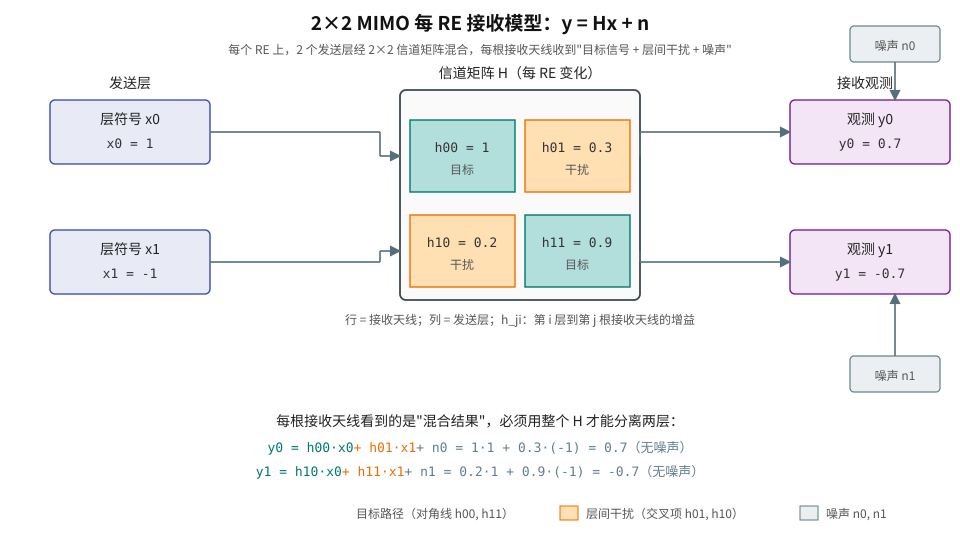
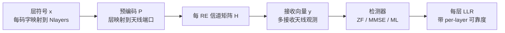
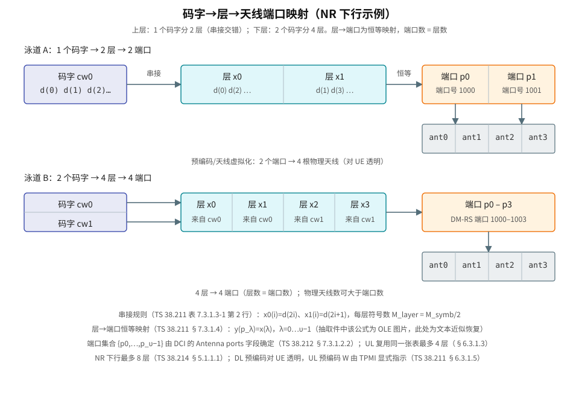
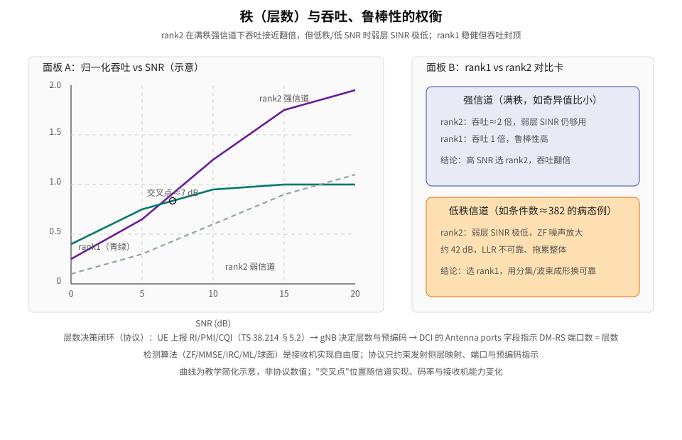

# T2.12 MIMO-OFDM：层映射、每 RE 信道矩阵与接收检测

## 本节学习目标

T2.11 已经介绍均衡模型。本节将单层 OFDM 推广到多天线、多层传输。MIMO-OFDM 的核心思想是：OFDM 先将宽带频率选择性信道分解为多个 RE；MIMO 再在每个 RE 上处理多层符号经过多天线信道后的混合。

先区分三个经常混淆的对象（本节末尾的"协议锚点精读"会给出这三者的协议出处）：

| 对象 | 含义 | 常见误解 |
|:---|:---|:---|
| 天线 | 物理发射/接收通道 | 天线数不等于可传层数。 |
| 层 | 空间复用的数据流 | 层数受信道秩和配置限制。 |
| 端口 | 参考信号和逻辑天线端口 | 端口不是一定等于物理天线。 |

- 建立每 RE 的 MIMO 基带模型。
- 解释层映射、预编码、信道矩阵和接收向量之间的关系。
- 说明 DM-RS-based 估计为什么给接收端有效信道。
- 对比 ZF、MMSE、ML/球面检测的复杂度和性能边界。
- 讲清 MIMO 检测如何输出每层 LLR。
- 定位本节知识点在 TS 38.211（层映射、端口映射、预编码）与 TS 38.214（传输方案、DM-RS 接收、CSI 上报）中的条款，并划清"协议强制"与"接收机实现自由度"的边界。

## 前置知识检查

| 问题 | 需要达到的程度 |
|:---|:---|
| OFDM 的 RE 是什么？ | 知道每个 RE 是一个频域子载波和时域 OFDM 符号位置。 |
| 矩阵乘法代表什么？ | 知道多个输入层可以被信道矩阵混合成多个接收观测。 |
| DM-RS 有什么作用？ | 知道接收端用它估计每层或端口的有效信道。 |
| LLR 与层有什么关系？ | 知道每层调制符号最终都要变成码字级 LLR。 |
| 秩（rank）是什么？ | 知道矩阵列向量的"独立方向数"，本节会给出白话解释。 |

本节不要求已经掌握信息论 MIMO 容量公式，但需要理解"多层同时发送会互相混合，接收端必须分离"。如果单层均衡还不熟，先读 T2.11。

## 零基础铺垫：天线、层与端口（概念四要素）

**白话版本**：把信道想成"运货通道"。单天线是只有一条传送带；MIMO 是在同一时刻打开多条平行传送带（多个**层（layer）**），每条传送带运一份数据符号。但传送带之间不是隔离的——接收端看到的是所有传送带内容的混合。接收机的任务就是"拆混合"：把每一条传送带上原本的符号从混合观测里分离出来。

四个概念的"要素卡"：

**层（layer）**：空间复用的数据流，是一条"并行的符号流"。可数例子：2 层传输时，符号 0 走层 0、符号 1 走层 1、符号 2 走层 0……层符号向量 $\mathbf{x}$ 每个位置放一个层符号。直观：层数是"同时打开几条传送带"。

**天线**：物理的发射/接收单元。直观：天线是"传送带两端的物理装置"。关键：天线数可以多于层数（多余天线用于波束成形、分集或提升接收 SNR），也可以少于层数（理论上可以，但信道矩阵会因此"矮"，层数受秩限制）。

**天线端口（antenna port）**：一个逻辑概念——"对应同一参考信号、经历同一信道的一个发射维度"。直观：端口是"接收端能分辨的发射通道编号"。NR 下行里，每层对应一个天线端口（DM-RS 端口 1000 起），所以**端口数 = 层数**（协议依据见"协议锚点精读"§7.3.1.4）。天线端口与物理天线的区别在于：端口是协议可见的接口，物理天线是设备实现。这就是常见误解"端口 = 物理天线"的来源——在 NR 中它们不相等，中间隔着预编码和天线虚拟化。

**预编码（precoding）**：在发送侧对层信号做的线性变换（乘一个矩阵 $\mathbf{P}$），目的是把层信号"定向"到信道的强方向。直观：预编码像给每条传送带配一个"转向器"，让它的能量主要流向接收端能接住的方向。预编码矩阵的行数等于端口数/天线数，列数等于层数。

用一条"四要素闭环"串起来：**码字（codeword）里的符号 → 按协议表分派到层 → 每层对应一个端口 → 端口信号经预编码/虚拟化送到物理天线 → 天线信号经物理信道混合 → 接收天线观测**。本节标题里"层检测"（layer detection）就是接收端在混合观测上把每层符号恢复出来。

## 每 RE 的 MIMO 模型

**这个公式回答什么问题**：在单个 RE 上，接收端看到的多天线观测与发送的层符号是什么关系？它给出所有检测算法的输入。

在单层 OFDM 中，一个 RE 可写成（标量模型，T2.11 已讲）：

$$
Y[k,l] = H[k,l]X[k,l] + N[k,l]
\tag{1}
$$

**符号含义**：$Y[k,l]$ 是子载波 $k$、OFDM 符号 $l$ 位置上的接收值（一个复数）；$H[k,l]$ 是该 RE 上的信道增益；$X[k,l]$ 是发送的调制符号；$N[k,l]$ 是噪声。这一行说：**一个 RE 收到的东西 = 信道缩放后的发送符号 + 噪声**。

MIMO 下，标量变成向量和矩阵（**这个公式回答**：多天线、多层时，观测与发送的关系）：

$$
\mathbf{y}[k,l]
=
\mathbf{H}[k,l]\mathbf{P}[k,l]\mathbf{x}[k,l]
+
\mathbf{n}[k,l]
\tag{2}
$$

其中：

| 符号 | 含义 |
|:---|:---|
| $\mathbf{x}$ | 层符号向量，维度为 $N_{layers}\times1$。每个元素是一个层在该 RE 上的调制符号。 |
| $\mathbf{P}$ | 预编码矩阵，把层映射到天线端口。维度为（端口数）×（层数）。 |
| $\mathbf{H}$ | 物理信道矩阵，维度为（接收天线数）×（发射端口数）。$H_{ji}$ 是第 $i$ 个发射端口到第 $j$ 根接收天线的复增益。 |
| $\mathbf{y}$ | 多接收天线观测向量，维度为（接收天线数）×1。 |
| $\mathbf{n}$ | 每根接收天线上的噪声向量。 |

**白话理解式 (2)**：左边"接收端看到的"；右边第一项"发送端在每一根天线上造成的信号叠加"，第二项"噪声"。中间的 $\mathbf{H}$ 把"每根发射天线的信号"混合成"每根接收天线收到的信号"——**混合是信道造成的，不是发送端故意为之**。

接收端真正用于检测的通常是有效信道：

$$
\mathbf{H}_{eff}[k,l]=\mathbf{H}[k,l]\mathbf{P}[k,l]
\tag{3}
$$

**这个公式回答**：接收端实际上需要知道什么？答案是"层→接收天线"的复合信道 $\mathbf{H}_{eff}$，而不是分别知道 $\mathbf{H}$ 和 $\mathbf{P}$。因为 DM-RS 与数据经历相同的预编码，接收端从 DM-RS 估计出的就是 $\mathbf{H}_{eff}$——**预编码对接收端是透明的**（协议机制见"DM-RS 端口与有效信道的协议机制"一节）。$k,l$ 下标说明这个矩阵随 RE 变化：每个 RE 有自己的一份信道矩阵，这是"每 RE 矩阵问题"的由来。

## 数值示例：2×2 MIMO 的层间混合与 ZF/MMSE 检测手算

考虑 2 根接收天线、2 个传输层，忽略预编码后有效信道为：

$$
\mathbf{H}_{eff}
=
\begin{bmatrix}
1 & 0.3 \\
0.2 & 0.9
\end{bmatrix}
\tag{4}
$$

两个层符号为：

$$
\mathbf{x}=
\begin{bmatrix}
1\\
-1
\end{bmatrix}
\tag{5}
$$

**回答什么问题**：这个 2×2 例子展示"混合"到底长什么样，以及线性检测器如何把它拆开。**回答什么问题（后续每一步）**：ZF 和 MMSE 分别给出什么输出、误差多大、噪声放大多少。

无噪声时接收向量为：

$$
\mathbf{y}
=
\begin{bmatrix}
1 & 0.3 \\
0.2 & 0.9
\end{bmatrix}
\begin{bmatrix}
1\\
-1
\end{bmatrix}
=
\begin{bmatrix}
0.7\\
-0.7
\end{bmatrix}
\tag{6}
$$

**手算过程**（可数例子，一步步来）：

- 第一行：$y_0 = 1\times 1 + 0.3\times(-1) = 1 - 0.3 = 0.7$。其中 $1\times1$ 是层 0 的贡献（目标项），$0.3\times(-1)$ 是层 1 漏过来的（干扰项）。
- 第二行：$y_1 = 0.2\times 1 + 0.9\times(-1) = 0.2 - 0.9 = -0.7$。

下面的图把这一过程画了出来：青绿色是"目标路径"（对角线项 $h_{00},h_{11}$），橙色是"层间干扰路径"（交叉项 $h_{01},h_{10}$），灰蓝色是噪声。

第一根接收天线上看到的 $0.7$ 不是第一层符号本身，而是两层混合后的结果。若接收机把每根天线当成一个独立 SISO 链路，就会把层间干扰当成噪声甚至当成数据。MIMO 检测器必须使用整个 $\mathbf{H}_{eff}$ 来同时估计两层。

### ZF（迫零）手算：逆矩阵怎么用

**零基础解释**：迫零（zero-forcing, ZF）的想法是"混合是矩阵造成的，那我就乘这个矩阵的逆把混合抵消掉"。就像录音里有两段声音叠在一起，如果你知道混合规则，就能反解出原始两段。

**滤波器（filter）公式**（回答"ZF 检测器用什么矩阵分离层"）：

$$
\mathbf{W}_{ZF} = \mathbf{H}^{-1},\qquad
\mathbf{H}^{-1}=\frac{1}{\det(\mathbf{H})}
\begin{bmatrix}
h_{11} & -h_{01}\\
-h_{10} & h_{00}
\end{bmatrix},\qquad
\det(\mathbf{H})=h_{00}h_{11}-h_{01}h_{10}
\tag{7}
$$

**这个公式回答**：2×2 矩阵的逆怎么手算。对式 (4) 的数值：$\det = 1\times0.9-0.3\times0.2 = 0.84$，所以

$$
\mathbf{W}_{ZF} = \frac{1}{0.84}
\begin{bmatrix}
0.9 & -0.3\\
-0.2 & 1
\end{bmatrix}
=
\begin{bmatrix}
1.0714 & -0.3571\\
-0.2381 & 1.1905
\end{bmatrix}
$$

**验证**：$\mathbf{W}_{ZF}\mathbf{y}$ 的每一行是"把对应层的信号拣出来"：

$$
\hat{\mathbf{x}}_{ZF} = \mathbf{W}_{ZF}\mathbf{y}
= \frac{1}{0.84}
\begin{bmatrix}
0.9 & -0.3\\
-0.2 & 1
\end{bmatrix}
\begin{bmatrix}
0.7\\
-0.7
\end{bmatrix}
= \frac{1}{0.84}
\begin{bmatrix}
0.63+0.21\\
-0.14-0.7
\end{bmatrix}
=
\begin{bmatrix}
1\\
-1
\end{bmatrix}
\tag{8}
$$

**结果**：无噪声时 ZF 精确恢复 $\mathbf{x}=[1,-1]^T$——干扰被完全消除。这正是 ZF 的承诺："消除干扰"。代价看下面。

### 加噪声后的对比：ZF 的噪声放大

现在给观测加上噪声 $\mathbf{n}=[0.1,-0.1]^T$（真实噪声方差 $\sigma^2=0.01$），$\mathbf{y}'=[0.8,-0.8]^T$，ZF 输出：

$$
\hat{\mathbf{x}}_{ZF}' = \frac{1}{0.84}
\begin{bmatrix}
0.9 & -0.3\\
-0.2 & 1
\end{bmatrix}
\begin{bmatrix}
0.8\\
-0.8
\end{bmatrix}
=
\begin{bmatrix}
1.1429\\
-1.1429
\end{bmatrix}
\tag{9}
$$

输出偏离真值约 $0.14$，而输入噪声只有 $0.1$。为什么？**因为求逆同时把噪声也"乘"了**。量化这个放大量（**回答"ZF 的噪声增强有多大"**）：$\mathbf{W}_{ZF}$ 的第 $i$ 行记为 $\mathbf{w}_i$，则该层输出的噪声方差为 $\sigma^2\|\mathbf{w}_i\|^2$，放大倍数：

$$
\|\mathbf{w}_0\|^2 = \frac{0.9^2+0.3^2}{0.84^2}\approx 1.28,\qquad
\|\mathbf{w}_1\|^2 = \frac{0.2^2+1^2}{0.84^2}\approx 1.47
\tag{10}
$$

即噪声能量被放大 $1.3\sim1.5$ 倍（约 $1\sim1.7$ dB）。良态矩阵下这个代价可以接受；病态矩阵下它会爆炸（见下文"低秩信道"）。

### MMSE 手算：在"消除干扰"与"抑制噪声"之间折中

**零基础解释**：最小均方误差（minimum mean square error, MMSE）检测器不再把混合完全抵消，而是"留一点点干扰，换噪声不被放大"。它把噪声方差也放进滤波器的分母里做正则化。

**滤波器公式**（回答"MMSE 用什么矩阵分离层"）：

$$
\mathbf{W}_{MMSE}
=
\left(\mathbf{H}^H\mathbf{H}+\sigma^2\mathbf{I}\right)^{-1}\mathbf{H}^H
\tag{11}
$$

**这个公式回答**：MMSE 权重如何构造。$^H$ 是共轭转置（这里实数矩阵就是转置）；$\mathbf{H}^H\mathbf{H}$ 是"信道自相关"，$\sigma^2\mathbf{I}$ 把噪声功率加在对角线上——噪声越大，滤波器越"不敢"放大信号，从而压住噪声增强；$\sigma^2\to0$ 时式 (11) 退化为 ZF。

数值手算（$\sigma^2=0.1$，注意这里用比真实噪声大的正则化以便看出折中效果）：

$$
\mathbf{H}^H\mathbf{H} =
\begin{bmatrix}
1.04 & 0.48\\
0.48 & 0.90
\end{bmatrix},
\qquad
\mathbf{H}^H\mathbf{H}+0.1\mathbf{I}=
\begin{bmatrix}
1.14 & 0.48\\
0.48 & 1.00
\end{bmatrix}
\tag{12}
$$

求逆（同样用式 (7) 的 2×2 公式，$\det = 1.14\times1.00-0.48^2=0.9096$）：

$$
\mathbf{W}_{MMSE}
=
\frac{1}{0.9096}
\begin{bmatrix}
1.00 & -0.48\\
-0.48 & 1.14
\end{bmatrix}
\begin{bmatrix}
1 & 0.2\\
0.3 & 0.9
\end{bmatrix}
=
\begin{bmatrix}
0.9411 & -0.2551\\
-0.1517 & 1.0224
\end{bmatrix}
\tag{13}
$$

无噪声时（$\mathbf{y}=[0.7,-0.7]^T$）：

$$
\hat{\mathbf{x}}_{MMSE} = \mathbf{W}_{MMSE}\mathbf{y} =
\begin{bmatrix}
0.9411\times0.7+0.2551\times0.7\\
-0.1517\times0.7-1.0224\times0.7
\end{bmatrix}
=
\begin{bmatrix}
0.8373\\
-0.8219
\end{bmatrix}
\tag{14}
$$

**注意**：无噪声情况下 MMSE 反而没有精确恢复 $[1,-1]^T$——因为 $\sigma^2\mathbf{I}$ 把估计"朝零收缩"了。这是 MMSE 的**有偏（biased）**特性。工程上常用无偏化：把输出除以等效增益的对角线（$\mathbf{W}_{MMSE}\mathbf{H}$ 的对角元素 $0.8901$ 与 $0.8747$）：

$$
\hat{\mathbf{x}}_{norm} = \hat{\mathbf{x}}_{MMSE} \oslash \operatorname{diag}(\mathbf{W}_{MMSE}\mathbf{H})
\tag{15}
$$

（$\oslash$ 表示逐元素除法，软解调器（soft demapper）之前的归一化就是这类操作；数学上无偏化能去掉收缩，但会放大一点点残余干扰——这是 MMSE 的固有折中。）

加噪声场景（$\mathbf{y}'=[0.8,-0.8]^T$）下的三方对比：

| 检测器 | 输出 $\hat{x}_0$ | 输出 $\hat{x}_1$ | 对真值 $[1,-1]^T$ 的最大偏差 | 说明 |
|:---|:---|:---|:---|:---|
| ZF | 1.1429 | -1.1429 | 0.143 | 干扰全消，但噪声被放大 1.3~1.5 倍 |
| MMSE（$\sigma^2=0.1$） | 0.9569 | -0.9393 | 0.061 | 噪声放大被抑制，残留一点干扰 |
| MMSE 无偏化后 | 1.0751 | -1.0739 | 0.075 | 去掉收缩，残余干扰显现 |

**工程结论**：噪声不可忽略时 MMSE 几乎总是优于 ZF（代价是每 RE 多一次矩阵构造与求逆）；无噪声极限下两者等价。这是"接收机实现自由度"内的经典选择。

### 低秩信道的数值冲击：ZF 为什么"爆"

若两个列向量几乎平行，例如：

$$
\mathbf{H}_{eff}
\approx
\begin{bmatrix}
1 & 0.95\\
1 & 0.96
\end{bmatrix}
\tag{16}
$$

$\det = 1\times0.96-0.95\times1 = 0.01$。代入式 (7)：

$$
\mathbf{W}_{ZF} = \frac{1}{0.01}
\begin{bmatrix}
0.96 & -0.95\\
-1 & 1
\end{bmatrix}
=
\begin{bmatrix}
96 & -95\\
-100 & 100
\end{bmatrix}
$$

于是 ZF 的噪声放大倍数（式 (10)）：

$$
\|\mathbf{w}_0\|^2 = 96^2+95^2 \approx 18241,\qquad
\|\mathbf{w}_1\|^2 = 100^2+100^2 = 20000
$$

**噪声能量被放大约 1.8 万倍，即约 42.6 dB**。同样的噪声，经过 ZF 后几乎把信号淹没。而 MMSE（$\sigma^2=1$）的对应行范数平方只有约 $0.086$（约 $-10.7$ dB）——正则化把病态问题稳住了。这是"病态矩阵 ZF 噪声增强严重，MMSE 更稳健"的量化证据。

矩阵秩接近 1，两层很难分离。此时强行传两层会让第二层 post-eq SINR（检测后信干噪比，post-equalization SINR）很低，LLR 应该变小；若仍输出高置信 LLR，译码器会被误导。**工程后果**：链路自适应（gNB 依据 UE 上报的秩指示决定层数）通常避免在低秩信道上强传多层（见"层数、秩与天线数"一节与图 3）。

## 秩、奇异值与层可靠度

**零基础铺垫**：**奇异值（singular value）**是"矩阵在某个空间方向上对信号的放大倍数"。想象一根弹簧被拉伸的倍数：奇异值就是信道矩阵在各个"拉伸方向"上的倍数。**秩（rank）**是"非零奇异值的个数"——即信道真正能同时放大几个独立方向。**条件数（condition number）**是最大奇异值与最小奇异值之比，衡量"方向之间差多大"。

MIMO 信道可以通过奇异值理解。把信道分解为：

$$
\mathbf{H}=\mathbf{U}\mathbf{\Sigma}\mathbf{V}^H
\tag{17}
$$

**这个公式回答**：信道矩阵可以被拆成"旋转 × 拉伸 × 旋转"三段的乘积。$\mathbf{U},\mathbf{V}$ 是酉矩阵（相当于旋转/反射，不改变能量），$\mathbf{\Sigma}$ 是对角矩阵，对角线就是奇异值。

$\mathbf{\Sigma}$ 对角线上的奇异值表示不同空间方向的强弱。大的奇异值对应强空间流，小的奇异值对应弱空间流。层数选择、预编码和 CSI 报告，本质上都在围绕这些空间方向做折中。

**数值例子**（沿用本节两个信道）：

- 良态例（式 (4)）：奇异值约 $\sigma_1=1.206$、$\sigma_2=0.696$，条件数 $\kappa=\sigma_1/\sigma_2\approx1.73$——两个方向都够强，支持 2 层。
- 病态例（式 (16)）：奇异值约 $1.956$ 与 $0.005$，条件数 $\kappa\approx382$——弱方向几乎被压扁，第二层几乎没有独立空间。

| 状态 | 奇异值形态 | 工程含义 |
|:---|:---|:---|
| 高秩 | 多个奇异值都大 | 可支持多层空间复用。 |
| 低秩 | 只有一个或少数奇异值大 | 更适合少层、波束成形或分集。 |
| 病态矩阵 | 最小奇异值很小 | ZF 噪声增强严重，MMSE 更稳健。 |

对 soft demapper 来说，这些空间方向最终要变成 per-layer CSI。一个层如果对应弱奇异值方向，它的 LLR 幅度应比强层小。

## 码字—层—LLR 的顺序与接口

MIMO 检测不仅是数学矩阵，还涉及顺序和接口：

| 步骤 | 风险 | 调试证据 |
|:---|:---|:---|
| codeword 到 layer mapping | 码字比特被分到错误层 | codeword/layer index trace。 |
| DM-RS port 到 layer | 端口顺序错 | per-port channel estimate dump。 |
| detector output order | 层输出交换 | per-layer constellation and SINR。 |
| layer 到 LLR sequence | LLR 串接顺序错 | RE/layer/bit index mapping。 |

这类错误经常不会表现为"程序崩溃"，而是 BLER 曲线完全不对。因为译码器收到的是合法长度的 LLR，只是这些 LLR 对应错了码字位置。

**协议层面的顺序依据**：层符号在发送侧按"先层 0、后层 1、……"的位置顺序生成（TS 38.211 §7.3.1.3 的映射规则，见"协议锚点精读"），接收侧必须按**相反方向、相同顺序**把每层符号串回码字级符号流。任何"层 1 的符号被当成层 0 的符号"之类错误，都等价于把码字比特序列做了块置换——LLR 长度完全合法，BLER 却不可救药。建议在实现中保留从 DM-RS 端口号到层号、再到码字内符号索引的完整映射表，作为回归测试的对照物。

## 链路图：从层符号到每层 LLR

图示从层符号开始，经预编码、MIMO 信道和多接收天线观测，到检测器输出每层 LLR。OFDM 的作用是把问题分解到 RE 级；MIMO 检测器的作用是把每个 RE 上混在一起的层分离出来。

下面的手绘图把链路前半段（码字→层→端口→天线）按 NR 协议规则展开：层→端口是恒等映射（端口数=层数），端口信号经预编码/天线虚拟化到达物理天线——这解释了为什么"端口"不等于"天线"。

## 层数、秩与天线数：约束与秩决策闭环

MIMO 不是"天线越多，层数一定越多"。层数受信道秩限制：

$$
N_{layers} \leq \mathrm{rank}(\mathbf{H}) \leq \min(N_{tx},N_{rx})
\tag{18}
$$

**这个公式回答**：为什么"4 发 2 收"最多只有 2 层？因为信道矩阵只有 2 行，最多 2 个独立方向。**白话**：接收端只有 2 根天线，它最多"分得清"2 条平行传送带。

如果信道矩阵低秩，例如所有发射天线路径高度相关，那么即使天线很多，也无法可靠传输很多独立层。强行提高层数会让层间干扰上升，post-eq SINR 下降，LLR 变得不可靠。

**秩决策闭环（谁来决定层数）**：

1. UE 用 CSI-RS 估计信道，计算各空间方向强度，向 gNB 上报**秩指示（rank indicator, RI）**、**预编码矩阵指示（precoding matrix indicator, PMI）**与**信道质量指示（channel quality indicator, CQI）**（TS 38.214 §5.2）。
2. gNB 综合 RI/PMI/CQI 与调度需要，决定实际层数、预编码和 MCS。
3. gNB 通过 DCI 的 Antenna ports 等字段告知 UE 本次传输的 DM-RS 端口集合；端口数就是层数。

**边界**：RI 是 UE 的"建议"，层数决策权在 gNB——这是协议强制的过程（TS 38.214 §5.2 定义 CSI 报告内容）；而"用什么算法估 RI（特征值分解？SINR 门限？）"是接收机实现自由度。下图把"选几层"的权衡画成曲线与对比卡：

## 检测器族与复杂度—性能权衡

| 检测器 | 核心思想 | 优点 | 代价 |
|:---|:---|:---|:---|
| ZF | 用矩阵伪逆消除层间干扰 | 简单，吞吐好 | 弱奇异值方向噪声增强。 |
| MMSE | 把噪声方差加入矩阵权重 | 工程常用，稳健 | 仍是线性近似，有残留干扰。 |
| ML | 穷举所有星座组合最小距离 | 性能上界接近最优 | 复杂度随层数和调制阶数爆炸。 |
| 球面检测 | 在候选空间中剪枝搜索 | 接近 ML，复杂度可控一些 | 最坏复杂度仍高，硬件控制复杂。 |

**复杂度数量级（回答"每个检测器贵在哪"）**：

- ZF/MMSE 是线性检测器：每个 RE 做一次矩阵求逆（或分解），复杂度 $\mathcal{O}(M^3)$，$M$ 为层数。$M=2$ 时可用式 (7) 的闭式公式（约 10 次乘加）；$M=4$ 时是 4×4 矩阵求逆；$M=8$ 时进一步恶化。矩阵维度每翻倍，求逆开销约乘 8。
- ML 是穷举：候选数 = 星座点数^层数。对 4 层 256QAM，需要比较 $256^4$ 个候选组合：

$$
256^4 = 4{,}294{,}967{,}296 \approx 4.3\times10^9
\tag{19}
$$

**这个公式回答**：为什么 ML 在工程上通常不可实现。工程上常以 MMSE/IRC 等线性或近似检测为主，再配合 CSI 缩放、LLR 裁剪和 HARQ 增益兜底；需要接近 ML 性能时使用 K-best 等列表检测（保留每层若干最优分支，$\mathcal{O}(K\cdot M)$ 量级），是"球面检测思想的固定复杂度实现"。

**每 RE 处理率的工程后果**：以 100 RB、30 kHz SCS 为例，一个时隙有 $100\times12\times14=16800$ 个数据 RE，时隙长 0.5 ms，即每秒约 $3.36\times10^7$ 次"RE 级矩阵处理"。4 层时每个 RE 都涉及 4×4 相关矩阵、噪声项与求逆（或分解）结果，以及每层 CSI 输出。即使权重可按 PRB 或 DM-RS 邻域复用，缓存和控制仍然复杂。工程文档应明确权重复用粒度：per RE、per PRB、per symbol、还是 per DM-RS interpolation region。复用粒度越粗，复杂度越低，但快速变化信道下性能越差。**注意**：协议在频域给了"同一预编码在 PRG 内不变"的允许假设（TS 38.214 §5.1.2.3，见"协议锚点精读"），这是接收端做粗粒度权重复用的协议依据，但"是否复用、复用多粗"仍是接收机实现自由度。

对 4 层 256QAM，如果穷举 ML，需要比较 $256^4$ 个候选组合，工程上通常不可接受。因此量产接收机常以 MMSE/IRC 等线性或近似检测为主，再配合 CSI 缩放、LLR 裁剪和 HARQ 增益兜底。

## DM-RS 端口与有效信道的协议机制

多层传输里，DM-RS 端口与层有紧密关系。因为 DM-RS 与对应层的数据经历相同预编码，接收端可以直接估计层域有效信道 $\mathbf{H}_{eff}$。这有两个重要含义：

1. 接收端不必把预编码矩阵 $\mathbf{P}$ 单独解出来，才能做数据检测。
2. 如果 DM-RS 端口、层顺序或资源映射处理错误，后续每层 LLR 都会错位。

**协议机制（三件套）**：

- **层→端口恒等映射**：TS 38.211 §7.3.1.4 规定层向量直接映射到天线端口（$y^{(p_\lambda)}(i)=x^{(\lambda)}(i)$），所以端口数=层数；下行最多 8 层、端口号 1000–1023（TS 38.214 §5.1.1.1）。端口号是逻辑编号，不是物理天线编号。
- **DM-RS 与数据同端口同预编码**：TS 38.214 §5.1.6.2 规定 UE 按 DCI 指示的 DM-RS 端口接收，且同一 CDM 组内其余正交端口不关联其他 UE 的 PDSCH——端口专属本 UE，估计出的端口信道即本 UE 数据的信道。这就是"DM-RS 估计给出有效信道"的协议来源。
- **频域预编码粒度**：TS 38.214 §5.1.2.3 允许 UE 假设同一 PRG（precoding resource block group，预编码资源块组）内预编码不变——接收端可在 PRG 粒度复用信道估计与权重。

**接收端必须做**：按 DCI 指示的端口集合做 DM-RS 信道估计（每个端口一份 $\hat{\mathbf{H}}_{eff}$ 列），把端口顺序与层顺序一一对应，再送入检测器。**接收端不必做**：恢复 gNB 实际用的预编码矩阵 $\mathbf{P}$（下行）；这正是"预编码对 UE 透明"的工程意义。上行则相反：PUSCH 预编码由 TPMI 显式指示（TS 38.211 §6.3.1.5），gNB 知道 UE 用的 $\mathbf{W}$（详见"协议锚点精读"）。

## MIMO 检测输出对 LLR 的影响

单层软解调只需考虑"符号点离候选星座多远"。MIMO 软解调还要考虑层间干扰和检测器输出可靠度。对第 $i$ 层，可以抽象写成：

$$
\hat{x}_i = g_i x_i + \nu_i
\tag{20}
$$

**这个公式回答**：检测器输出与"干净的层符号"差在哪。$g_i$ 是检测后的等效增益，$\nu_i$ 包含噪声和残留层间干扰。**定量地**：$g_i$ 对应 MMSE 无偏化后 $\mathbf{W}_{MMSE}\mathbf{H}$ 的对角线（本节数值例中是 0.8901 与 0.8747），$\nu_i$ 的方差对应噪声放大（式 (10)）与残留干扰之和——**每层不同**。

soft demapper 应使用每层、每 RE 的等效可靠度，而不是给所有层使用同一个噪声方差。否则强层 LLR 会过弱，弱层 LLR 会过强。

**实现要点**：检测器输出接口应携带"每层、每 RE 的 CSI（等效噪声方差或 SINR）"而不是单一标量；后续 soft demapper 与 LLR 缩放（T2.16）都依赖这个 per-layer CSI。若接口只传"平均 SINR"，低秩信道下弱层的 LLR 会被系统性高估——这正是"LLR 过度自信"的主要来源之一。

## 工程检查点与诊断字段

| 检查项 | 应记录的证据 | 失败迹象 |
|:---|:---|:---|
| 层/端口映射 | layer index、DM-RS port、codeword 映射 | 某层 LLR 全部异常或互换。 |
| 信道矩阵维度 | `Nrx x Nlayers` 或有效信道维度 | 矩阵乘法维度错，检测器崩溃。 |
| 条件数/秩 | singular values、rank proxy（秩的代理指标） | 高层数下 post-eq SINR 急降。 |
| 检测器输出 | per-layer $\hat{x}$、CSI/SINR | 层间干扰没有进入可靠度。 |
| 复杂度 | 每 RE 矩阵求逆次数、吞吐 | 高阶 MIMO 下实时性不足。 |

**建议的常规诊断字段**（不只是调试时才看）：

| 字段 | 内容 | 用于发现 |
|:---|:---|:---|
| per-layer EVM（误差向量幅度，error vector magnitude） | 每层检测输出的误差向量幅度 | 某层整体变差（层/端口错位、弱层） |
| per-layer SINR | 每层 post-eq SINR 随 PRB 的分布 | 低秩 PRB、CSI 估计坏点 |
| per-layer LLR histogram | 每层 LLR 幅值分布 | 层间 LLR scaling 不一致 |
| 条件数/最小奇异值跟踪 | 每 RE 或每 PRB | 病态信道下检测器退化 |
| 端口一致性检查 | 端口号→层号→码字位索引全链 | 端口交换类负例 |

## 验证策略与实现关注点

MIMO-OFDM 的验证不能只用"单层 AWGN 能过"作为证据。多层接收最容易错在维度、顺序和可靠度，而这些问题常常不会造成明显异常长度或程序错误。译码器收到的 LLR 长度可能完全正确，但每个 LLR 对应了错误的层、错误的 RE 或错误的 codeword 位置。

第一类测试是层隔离。构造 2 层或 4 层场景，每次只让一个层发送非零符号，其他层发送已知零功率或固定符号。正确接收机应只在对应层输出有效星座，其余层输出低能量或低可靠度。如果某个未发送层也出现强 LLR，说明检测矩阵、端口映射或层顺序有串扰。

第二类测试是层交换。故意交换 DM-RS port 或 detector output order，确认回归测试能失败。很多项目只测试"正确配置能过"，没有测试"层交换会失败"，因此无法防止端口顺序 bug。最小负例应记录 `dmrs_port -> layer -> codeword bit index` 的完整链路。

第三类测试是秩退化。构造从高秩到低秩的一组信道矩阵，观察 RI/层数选择、per-layer SINR 和 BLER。若低秩场景仍输出多个高可靠层，说明 CSI 估计或检测器可靠度输出过度自信。实际链路自适应会避免在低秩信道强行高层数，接收机仿真也应体现这个事实。

| 测试类型 | 输入设置 | 通过标准 |
|:---|:---|:---|
| 单层激励 | 只有 layer 0 有数据 | layer 0 LLR 有效，其他层低可靠。 |
| 端口交换负例 | 故意交换 DM-RS port | BLER 或端口一致性检查失败。 |
| 条件数扫描 | 控制信道列相关性 | 弱层 SINR 随条件数恶化。 |
| 高阶 QAM 多层 | 4 层 64/256QAM | LLR scaling 不出现系统性过强。 |
| 定点矩阵求逆 | 限定位宽 | 饱和计数和误差相对浮点可解释。 |

硬件实现中，MIMO 检测的关键代价是矩阵运算和带宽。以 4 层为例，每个数据 RE 都可能需要处理一个 4x4 相关矩阵、噪声项、求逆或分解结果，以及每层 CSI 输出。即使权重可按 PRB 或 DM-RS 邻域复用，缓存和控制仍然复杂。工程文档应明确权重复用粒度：per RE、per PRB、per symbol、还是 per DM-RS interpolation region。复用粒度越粗，复杂度越低，但快速变化信道下性能越差。

MIMO 还与 HARQ 和 rate recovery 有接口风险。多层符号经 soft demapper 后会重新串成 codeword 级 LLR 序列。如果层到码字的映射或 bit interleaving 顺序错，HARQ soft buffer 会把错误层的 LLR 合并到母码地址上。此类错误在单次传输中可能表现为 BLER 变差，在重传中会更严重，因为错误证据被重复累加。

## 调试案例库

| 案例 | 表现 | 定位步骤 | 修复方向 |
|:---|:---|:---|:---|
| layer mapping 错 | 单层激励出现在另一层 | 打印 codeword/layer/RE 映射 | 修正层映射和串接顺序。 |
| DM-RS port 错 | 信道矩阵列交换 | per-port $\hat{H}$ heatmap | 修正端口到层关系。 |
| 低秩强传多层 | 弱层 LLR 过度自信 | 看 singular value 和 per-layer SINR | 降低层数或修正 CSI。 |
| detector 近似过粗 | 高阶 QAM 下 BLER 地板 | 对比 ML/K-best 小规模 golden | 改进 LLR 近似或可靠度缩放。 |

MIMO 专题还要特别关注"局部失败"。一个 TB 里可能只有某些 PRB、某些 OFDM 符号或某一层很差。平均 BLER 只能说明结果，不能说明原因。建议把 per-layer EVM、per-layer SINR 和 per-layer LLR histogram 作为常规图表输出。若 layer 2 的 LLR 明显比其他层更激进，而其 SINR 又最低，通常说明 CSI 缩放或层排序有错。

## 协议锚点精读

本节给出 T2.12 涉及的协议条款级证据。本地证据路径统一为 `3GPP_Rel19/processed/TS_38.211_38211-j30/full.md`（下称"38.211"）与 `3GPP_Rel19/processed/TS_38.214_38214-j30/full.md`（下称"38.214"）等抽取件；条款内容均为从抽取件实际文本核对后摘录或概括。**说明**：抽取件中部分公式与表格以 OLE 图片嵌入（`media_svg/`），正文文字完整；凡以图片形式嵌入的公式，本文以抽取件的"[公式≈]"文本近似恢复，并在此注明。

### 锚点 1：TS 38.211 §7.3.1.3 下行层映射（PDSCH）

**条款原文**（38.211 行 4939–4941）：

> The UE shall assume that complex-valued modulation symbols for each of the codewords to be transmitted are mapped onto one or several layers according to Table 7.3.1.3-1. Complex-valued modulation symbols $d^{(q)}(0),\ldots,d^{(q)}(M_{symb}^{(q)}-1)$ for codeword $q$ shall be mapped onto the layers $x(i)=\left[x^{(0)}(i)\ \ldots\ x^{(\upsilon-1)}(i)\right]^T$, $i=0,1,\ldots,M_{symb}^{layer}-1$ where $\upsilon$ is the number of layers and $M_{symb}^{layer}$ is the number of modulation symbols per layer.

**逐符号解释**：

| 符号 | 含义 |
|:---|:---|
| $d^{(q)}(i)$ | 码字 $q$（codeword，经信道编码+调制后的符号流）的第 $i$ 个复调制符号。 |
| $x^{(\lambda)}(i)$ | 第 $\lambda$ 层的第 $i$ 个符号；$x(i)$ 是把 $\upsilon$ 个层符号堆成的列向量。 |
| $\upsilon$ | 层数（number of layers）。 |
| $M_{symb}^{(q)}$ | 码字 $q$ 的调制符号总数；$M_{symb}^{layer}$ 为每层的符号数。 |

**表 7.3.1.3-1（空间复用 Codeword-to-layer mapping）关键行重建**（表内公式在抽取件中为 OLE 图片，本表由抽取文本近似恢复，与 Rel-19 规范一致）：

| 层数 $\upsilon$ | 码字数 | 映射规则 | 每层符号数 |
|:---|:---|:---|:---|
| 1 | 1 | $x^{(0)}(i)=d^{(0)}(i)$ | $M_{symb}^{layer}=M_{symb}^{(0)}$ |
| 2 | 1 | $x^{(0)}(i)=d^{(0)}(2i)$；$x^{(1)}(i)=d^{(0)}(2i+1)$ | $M_{symb}^{layer}=M_{symb}^{(0)}/2$ |
| 3 | 1 | $x^{(\lambda)}(i)=d^{(0)}(3i+\lambda)$，$\lambda=0,1,2$ | $M_{symb}^{layer}=M_{symb}^{(0)}/3$ |
| 4 | 1 | $x^{(\lambda)}(i)=d^{(0)}(4i+\lambda)$，$\lambda=0,1,2,3$ | $M_{symb}^{layer}=M_{symb}^{(0)}/4$ |
| 5 | 2 | 码字 0 → 层 0,1：$x^{(0)}(i)=d^{(0)}(2i)$，$x^{(1)}(i)=d^{(0)}(2i+1)$；码字 1 → 层 2,3,4：$x^{(\lambda)}(i)=d^{(1)}(3i+\lambda-2)$，$\lambda=2,3,4$ | $M_{symb}^{layer}=M_{symb}^{(0)}/2=M_{symb}^{(1)}/3$ |
| 6 | 2 | 码字 0 → 层 0,1,2；码字 1 → 层 3,4,5（各按 3 个一组交错） | $M_{symb}^{layer}=M_{symb}^{(0)}/3=M_{symb}^{(1)}/3$ |
| 7 | 2 | 码字 0 → 层 0,1,2（3 个一组）；码字 1 → 层 3,4,5,6（4 个一组） | $M_{symb}^{layer}=M_{symb}^{(0)}/3=M_{symb}^{(1)}/4$ |
| 8 | 2 | 码字 0 → 层 0,1,2,3；码字 1 → 层 4,5,6,7（各按 4 个一组交错） | $M_{symb}^{layer}=M_{symb}^{(0)}/4=M_{symb}^{(1)}/4$ |

**读取方式（为什么这样写）**：$d^{(0)}(2i)$ 与 $d^{(0)}(2i+1)$ 表示"码字 0 的偶数位符号进层 0、奇数位符号进层 1"——把一条符号流**交错分派**（de-multiplexing）成 $\upsilon$ 条并行流；2 个码字时两个码字各负责一部分层。接收端含义：检测出每层符号后，必须按同一规则的反方向交错串接（层 0 取第 $0,1,2,\ldots$ 个、层 1 取第 $0,1,2,\ldots$ 个、……交替拼接）才能还原码字符号流——顺序即协议，错序即错码。

### 锚点 2：TS 38.211 §7.3.1.4 天线端口映射（DL）

**条款原文**（38.211 行 4960–4966）：

> The block of vectors $\left[x^{(0)}(i)\ \ldots\ x^{(\upsilon-1)}(i)\right]^T$, $i=0,1,\ldots,M_{symb}^{layer}-1$ shall be mapped to antenna ports according to [公式为 OLE 图片，文本近似恢复] where $i=0,1,\ldots,M_{symb}^{ap}-1$, $M_{symb}^{ap}=M_{symb}^{layer}$. The set of antenna ports $\{p_0,\ldots,p_{\upsilon-1}\}$ shall be determined according to the procedure in [4, TS 38.212].

**公式（文本近似恢复）**：

$$
y^{(p_\lambda)}(i) = x^{(\lambda)}(i),\qquad \lambda=0,1,\ldots,\upsilon-1,\qquad M_{symb}^{ap}=M_{symb}^{layer}
\tag{21}
$$

**逐符号解释**：$y^{(p_\lambda)}(i)$ 是天线端口 $p_\lambda$ 上发送的第 $i$ 个符号；等式右边就是第 $\lambda$ 层的符号。**含义**：层 $\lambda$ 的信号原样送到天线端口 $p_\lambda$——这是**恒等映射**，端口数恰好等于层数。端口集合 $\{p_0,\ldots,p_{\upsilon-1}\}$（NR 中即 DM-RS 端口，1000 起）由 TS 38.212 的 DCI 过程确定。

**接收端含义**：UE 按 DCI 指示的 DM-RS 端口做信道估计，估计出"端口 → 接收天线"的信道，也就是"层 → 接收天线"的有效信道 $\mathbf{H}_{eff}$；预编码矩阵 $\mathbf{P}$ 无需显式恢复。**强制 vs 自由度**：层→端口映射与端口集合的确定是协议强制；"如何从 DM-RS 估计有效信道"（插值、滤波、降噪）是接收机实现自由度。

### 锚点 3：TS 38.211 §6.3.1.3 上行层映射与 §6.3.1.5 上行预编码（PUSCH）

**§6.3.1.3 原文**（38.211 行 1832–1834）：

> The complex-valued modulation symbols for each of the codewords to be transmitted shall be mapped onto up to four layers according to Table 7.3.1.3-1.

上行复用同一张表 7.3.1.3-1，但**最多 4 层**（8 层是下行专属）。接收端含义（gNB 侧）：上行检测同样按表交错串接层符号。

**§6.3.1.5 原文要点**（38.211 行 1860–1895）：

> The block of vectors $\left[y^{(0)}(i)\ \ldots\ y^{(\upsilon-1)}(i)\right]^T$ shall be precoded according to $\left[z^{(p_0)}(i)\ \ldots\ z^{(p_{\rho-1})}(i)\right]^T = W\left[y^{(0)}(i)\ \ldots\ y^{(\upsilon-1)}(i)\right]^T$ ... For non-codebook-based transmission, the precoding matrix $W$ equals the identity matrix. For codebook-based transmission, the precoding matrix $W$ depends on the number of antenna ports used for the transmission ... The TPMI index used in the tables above is obtained from the DCI scheduling the uplink transmission or the higher-layer parameters according to the procedure in [6, TS 38.214]. When the higher-layer parameter txConfig is not configured, the precoding matrix $W=1$.

**逐符号解释**：$y^{(\lambda)}(i)$ 是层 $\lambda$ 的信号（上行先做层映射再做预编码）；$z^{(p)}(i)$ 是端口/天线上的信号；$W$ 是预编码矩阵（维度：端口数×层数），码本传输时从表 6.3.1.5-1 ~ 6.3.1.5-47 按 **TPMI（transmitted precoding matrix indicator，发送预编码矩阵指示）** 选取；非码本传输时 $W=\mathbf{I}$（接收端可用 SRS 探测信道、自己做波束，无需显式预编码）。

**与下行的关键对比**：上行预编码 $W$ 是**显式指示**的（TPMI 由 DCI 的 "Precoding information and number of layers" 字段携带，见 TS 38.214 §6.1.1.1），gNB 知道 UE 用了哪个预编码；下行预编码对 UE **透明**（不指示）。两条路径的接收模型相同（$\mathbf{y}=\mathbf{H}\mathbf{W}\mathbf{x}+\mathbf{n}$），但"接收端是否知道发送侧矩阵"不同——这直接决定接收端把 $\mathbf{H}\mathbf{W}$ 当作整体（下行）还是拆开用（上行）。

### 锚点 4：TS 38.214 §5.1.1.1 下行传输方案（层数与端口上限）

**条款原文**（38.214 行 923–929）：

> For transmission scheme 1 of the PDSCH, the UE may assume that a gNB transmission on the PDSCH would be performed with up to 8 transmission layers on antenna ports 1000-1023 as defined in Clause 7.3.1.4 of [4, TS 38.211], subject to the DM-RS reception procedures in Clause 5.1.6.2.

**接收端含义**：NR 下行只有一个传输方案（transmission scheme），UE 只需按"最多 8 层、端口 1000–1023"准备接收路径（检测器维度、吞吐预算都按 8 层封顶设计）；具体每次传输几层由 DCI 指示。**强制 vs 自由度**："最多 8 层"是 UE 必须支持的协议上限；"在 8 层以内选几层"由 gNB 依据 UE 的 CSI 上报决定。

### 锚点 5：TS 38.214 §5.1.6.2 DM-RS 接收过程（有效信道的协议来源）

**条款原文要点**（38.214 行 2406 起）：

> When receiving PDSCH scheduled by DCI format 1_0, ... the UE shall assume that ... a single symbol front-loaded DM-RS of configuration type 1 on DM-RS port 1000 is transmitted, and that all the remaining orthogonal antenna ports are not associated with transmission of PDSCH to another UE ... the UE may assume that all the remaining orthogonal antenna ports of the CDM groups, from which the antenna ports are indicated to the UE, are not associated with transmission of PDSCH to another UE.

**接收端含义**：DCI 指示的 DM-RS 端口专属本 UE（其余正交端口不与别的 UE 的 PDSCH 关联），因此接收端可以把这些端口上估计出的信道当作"数据实际经历的信道"——即有效信道 $\mathbf{H}_{eff}$。默认配置（无高层参数时）用配置类型 1 的单符号前置 DM-RS、端口 1000——这是接收端在初始接入/回退场景必须处理的默认假设。

### 锚点 6：TS 38.214 §5.1.2.3 PRB 捆绑（频域预编码粒度的允许假设）

**条款原文要点**（38.214 行 1350–1362）：

> A UE may assume that precoding granularity is $P'_{BWP,i}$ consecutive resource blocks in the frequency domain. $P'_{BWP,i}$ can be equal to one of the values among {2, 4, wideband}. ... The UE may assume the same precoding is applied for any downlink contiguous allocation of PRBs in a PRG.

**接收端含义**：协议允许 UE 假设同一 PRG（precoding resource block group，预编码资源块组）内预编码不变——这是"信道估计与检测权重可按 PRG 粒度复用"的直接协议依据（对应"工程检查点"中的权重复用粒度问题）。**强制 vs 自由度**："PRG 内预编码不变"是 gNB 对接收机的承诺（UE 可以依赖它）；"复用多粗、如何利用"是接收机实现自由度。

### 锚点 7：TS 38.214 §5.2 CSI 上报与秩决策闭环

**条款原文要点**（38.214 行 2899）：

> CSI may consist of Channel Quality Indicator (CQI), precoding matrix indicator (PMI), CSI-RS resource indicator (CRI), SS/PBCH Block Resource indicator (SSBRI), layer indicator (LI), rank indicator (RI), L1-RSRP, L1-SINR, ...

**接收端含义**：UE 的 CSI 上报可以包含 RI（秩指示，即 UE 建议的层数）、PMI（建议的预编码）、CQI（建议的调制与码率）等；gNB 据此决定下行层数与预编码。**边界**：RI/PMI/CQI 的**上报格式**是协议强制（TS 38.214 §5.2.2 各表），但"怎么算 RI/PMI/CQI"（信道估计→SINR→容量/吞吐优化）是接收机实现自由度；且上报的 RI 只是建议，**实际层数由 gNB 决定**（DCI 指示）。本节的秩决策闭环图（图 3）就是这个过程的简化示意。

### 锚点 8：TS 38.212 §7.3.1.2.2 DCI 格式 1_1 的 Antenna ports 字段

**条款原文要点**（`3GPP_Rel19/processed/TS_38.212_38212-j30/full.md` 行 10404 附近；注意：抽取件中该字段的主 bullet 列表缺失，仅保留以下文本）：

> If a UE is configured with both dmrs-DownlinkForPDSCH-MappingTypeA and dmrs-DownlinkForPDSCH-MappingTypeB, the bitwidth of this field equals $\max\{x_A, x_B\}$, where $x_A$ is the "Antenna ports" bitwidth derived according to dmrs-DownlinkForPDSCH-MappingTypeA and $x_B$ is the "Antenna ports" bitwidth derived according to dmrs-DownlinkForPDSCH-MappingTypeB. A number of $x_{AB}-$ zeros are padded in the MSB of this field, if the mapping type of the PDSCH corresponds to the smaller value of $x_A$ and $x_B$.

**接收端含义**：DCI 格式 1_1 用 "Antenna ports" 字段指示本次 PDSCH 的 DM-RS 端口集合（码点→端口集合的映射表在抽取件中以图片嵌入，未逐行展开——**待核验**具体码点表），端口数即层数（结合锚点 2）。接收端解析 DCI → 得到端口集合 → 确定层数 → 确定检测器维度。字段位宽由 DM-RS 配置（dmrs-Type、maxLength、映射类型）决定。

## 协议强制与实现自由度边界

| 项目 | 协议强制（UE/gNB 必须） | 接收机实现自由度（可自选） |
|:---|:---|:---|
| 码字→层映射 | 按表 7.3.1.3-1 交错分派/串接（TS 38.211 §7.3.1.3、§6.3.1.3） | 无（顺序是协议定义） |
| 层→天线端口 | 恒等映射，端口集合由 DCI 确定（§7.3.1.4、TS 38.212 §7.3.1.2.2） | 无 |
| 层数上限 | 下行最多 8 层、端口 1000–1023（TS 38.214 §5.1.1.1）；上行最多 4 层 | 实际层数由 gNB 依据 CSI 决定 |
| 预编码指示 | 上行 TPMI 显式指示（TS 38.211 §6.3.1.5）；下行预编码不指示、对 UE 透明 | 下行接收端不必恢复 $\mathbf{P}$，直接用 DM-RS 估计 $\mathbf{H}_{eff}$ |
| DM-RS 接收 | 按 §5.1.6.2 过程接收；PRG 内预编码不变假设（§5.1.2.3） | 信道估计方法、插值/滤波/降噪 |
| CSI 上报 | 按 §5.2 格式上报 RI/PMI/CQI 等 | RI/PMI/CQI 的计算算法 |
| 检测算法 | 无（协议不规定） | ZF、MMSE、IRC、ML、球面/K-best、LLR 近似、定点归一化等 |

一句话总结：**协议规定"发送侧怎么摆、指示里怎么说"；接收侧"怎么把层拆出来"全部是实现自由度**——但拆出来的顺序和可靠度必须严格对齐协议的层/端口顺序，否则译码器拿到的是"合法但错位"的 LLR。

## 资料与协议边界

| 资料 | 本节采用 | 边界 |
|:---|:---|:---|
| TS 38.211 §6.3.1.3/§7.3.1.3 | 层映射入口 + 表 7.3.1.3-1 关键行重建 | 表内公式在抽取件中为 OLE 图片，重建基于"[公式≈]"文本近似；完整表见抽取件 `full.md` 行 4943–4958。 |
| TS 38.211 §6.3.1.5 | 预编码入口（非码本 W=I、码本 TPMI） | 不展开所有码本和端口配置（表 6.3.1.5-1~47）。 |
| TS 38.211 §7.3.1.4 | 层→端口恒等映射 | 公式以文本近似恢复（OLE 图片），端口集合确定过程引用 TS 38.212。 |
| TS 38.214 §5.1 | 下行数据接收和 CSI 上下文 | 不复现 PMI/RI/CQI 表格。 |
| TS 38.212 §7.3.1.2.2 | Antenna ports 字段入口 | 字段主 bullet 在抽取件中缺失，码点→端口集合表未逐行展开（标注待核验）。 |
| `MIMO_多天线系统` | 层、秩、信道矩阵概念 | 作为接收机工程解释材料。 |

TS 38.211 定义层映射、预编码和参考信号入口；TS 38.214 定义数据接收过程、CSI 报告、PMI/RI/CQI 等链路自适应上下文。协议不强制 UE 使用哪一种 MIMO 检测算法。ZF、MMSE、IRC、ML、球面检测、K-best 检测、LLR 近似和定点归一化都属于实现选择。

## 常见错误

| 错误 | 为什么错 | 正确做法 |
|:---|:---|:---|
| 天线数等同层数 | 低秩信道无法支撑同样多的独立层。 | 用秩、奇异值和 post-eq SINR 判断层数。 |
| 每层使用同一可靠度 | 层间干扰和信道强度不同。 | 输出 per-layer/per-RE CSI。 |
| DM-RS 端口错当物理天线 | 端口是逻辑参考信号维度。 | 从端口到层、有效信道、检测器输入统一处理。 |
| 只看检测性能不看硬件 | ML/球面检测复杂度可能不可实现。 | 把性能、复杂度、延迟和定点范围一起评估。 |
| 层串接顺序按"自己觉得对"的顺序 | 层→码字串接必须按表 7.3.1.3-1 的反向交错规则，LLR 长度合法但错位时最隐蔽。 | 用协议表逐符号核对 `layer index → codeword bit index`，并做层交换负例。 |
| 认为下行接收端必须知道预编码矩阵 P | 下行预编码对 UE 透明，DM-RS 估计给出 $\mathbf{H}_{eff}$。 | 直接使用 $\mathbf{H}_{eff}$ 做检测；仅上行（TPMI 显式指示）需要处理 $W$。 |

## 最小仿真矩阵

| 维度 | 建议取值 | 覆盖目的 |
|:---|:---|:---|
| 层数 | 1、2、4 | 验证层映射和检测维度。 |
| 信道秩 | 满秩、近低秩、病态 | 检查 per-layer SINR。 |
| 调制 | QPSK、64QAM、256QAM | 覆盖候选集合和 LLR 近似压力。 |
| 检测器 | ZF、MMSE、小规模 ML golden | 对比复杂度和性能。 |
| 端口负例 | 正确、交换、缺失 | 防止 DM-RS port/layer bug。 |

每个点至少保存 layer map、port map、effective H、per-layer EVM、per-layer SINR 和 codeword LLR 顺序摘要。MIMO 失败常常是顺序错误而不是数学公式错误，因此负例比正例更重要。

## 自测题

1. 为什么 MIMO-OFDM 可以看成每 RE 一个矩阵问题？
2. 层数和天线数为什么不能简单画等号？
3. $\mathbf{H}_{eff}=\mathbf{H}\mathbf{P}$ 对接收端有什么意义？
4. 为什么高阶 MIMO 下 ML 检测复杂度会爆炸？
5. per-layer CSI 为什么会影响 LLR？
6. 数值题：给定 $\mathbf{H}=\begin{bmatrix}1 & 0.3\\0.2 & 0.9\end{bmatrix}$、$\mathbf{x}=[1,-1]^T$，手算 ZF 检测的两步（求逆、乘接收向量），并写出无噪声输出。
7. 数值题：为什么 $\mathbf{H}=\begin{bmatrix}1 & 0.95\\1 & 0.96\end{bmatrix}$ 下 ZF 噪声放大约 1.8 万倍（42.6 dB），而 MMSE（$\sigma^2=1$）反而约 $-10.7$ dB？这对应工程上什么决策？

## 自测题参考答案

1. OFDM 已把宽带信道分解到 RE；在每个 RE 上，多层符号经 MIMO 信道矩阵混合，需要矩阵检测。
2. 层数受信道秩限制，秩不超过发射和接收天线数的较小值。
3. 接收端可直接用 DM-RS 估计数据层看到的有效信道，不必显式恢复预编码矩阵。
4. 候选组合数随星座大小和层数指数增长，例如 4 层 256QAM 为 $256^4\approx4.3\times10^9$。
5. 各层等效增益、残留干扰和噪声不同，LLR 幅度必须随层可靠度变化。
6. $\det=0.84$，$\mathbf{W}_{ZF}=\frac{1}{0.84}\begin{bmatrix}0.9&-0.3\\-0.2&1\end{bmatrix}$；$\hat{\mathbf{x}}=\mathbf{W}_{ZF}\mathbf{y}=\frac{1}{0.84}\begin{bmatrix}0.84\\-0.84\end{bmatrix}=[1,-1]^T$。无噪声下 ZF 精确恢复。
7. 该矩阵 $\det=0.01$，逆矩阵元素达 $\pm96\sim\pm100$，行范数平方约 $1.8\times10^4$（42.6 dB），噪声被同等放大；MMSE 在求逆前把 $\sigma^2\mathbf{I}$ 加进 $\mathbf{H}^H\mathbf{H}$，正则化压住放大（行范数平方约 0.086）。工程决策：病态信道不要强传多层（RI 建议低层数），且检测器选 MMSE 而非 ZF。

## 本节验收

| 验收项 | 通过标准 |
|:---|:---|
| MIMO 模型 | 能写出 $\mathbf{y}=\mathbf{H}\mathbf{P}\mathbf{x}+\mathbf{n}$，并解释每个符号的维度与来源。 |
| 层/秩关系 | 能解释 $N_{layers}\leq rank(H)$，并说出 RI→gNB→DCI 的秩决策闭环。 |
| 数值检测 | 能手算 2×2 的 ZF 与 MMSE 输出，解释"有偏"与噪声放大（式 (10)）。 |
| 检测器 | 能对比 ZF、MMSE、ML/球面检测，并给出 4 层 256QAM 的候选数量级。 |
| 协议锚点 | 能说出表 7.3.1.3-1 的作用、§7.3.1.4 恒等映射、下行预编码透明、上行 TPMI 指示，并区分协议强制与实现自由度。 |
| LLR 接口 | 能说明 per-layer CSI 的必要性。 |
| 链路图理解 | 能按图示说明每 RE 矩阵检测和 per-layer LLR 的来源。 |

## 与相邻章节的衔接

T2.12 是 T2.11 的多层推广。T2.11 中的标量可靠度在这里变成 per-layer、per-RE 的可靠度；T2.10 中的标量信道估计在这里变成有效信道矩阵。学习时先理解单层，再理解矩阵，不要直接跳到高阶 MIMO 检测算法。

T2.12 还连接后续译码链路的码字顺序。层检测输出不是最终结果，它还要经过 soft demapper、码字重组、rate recovery 和 CB 切分。任何 layer/codeword 顺序错误都会在 T3+ 中表现为译码失败。T2.17 会把这类错误统一归入 LLR 语义错误。

## 执行与证据记录

| 项目 | 记录 |
|:---|:---|
| 本地协议检索 | 使用 `rg` 在 `3GPP_Rel19/processed/TS_38.211_38211-j30/full.md` 定位 §7.3.1.3（行 4939–4958）、§7.3.1.4（行 4960–4966）、§6.3.1.3（行 1832–1834）、§6.3.1.5（行 1860–1895）；在 `TS_38.214_38214-j30/full.md` 定位 §5.1.1.1（行 923–929）、§5.1.6.2（行 2406 起）、§5.1.2.3（行 1350–1362）、§5.2（行 2899）；在 `TS_38.212_38212-j30/full.md` 定位 §7.3.1.2.2 Antenna ports 字段（行 10404）。并读取概念笔记 `MIMO_多天线系统`、`MMSE_均衡`。 |
| 图解材料 | 新增手绘 SVG 3 张：`assets/T2.12_layer_mapping_ports.svg`（码字→层→端口，双泳道）、`assets/T2.12_2x2_mimo_channel_model.svg`（2×2 接收模型，对角/交叉项着色）、`assets/T2.12_rank_throughput_tradeoff.svg`（秩与吞吐权衡曲线+对比卡）；保留原 Mermaid 链路图。 |
| 图解验证 | 三张 SVG 均通过：(1) Y 坐标扫描（相邻元素间距 ≥8px）；(2) Python bbox 审计（文字不出 viewBox、text-text 无重叠、文字不溢出宿主矩形）；(3) `cairosvg -s 1.5` 渲染无异常。 |
| 数值验证 | 用 Python（numpy）核对全部手算数值：ZF 输出 [1,−1]、加噪 ZF [1.1429,−1.1429]、MMSE [0.9569,−0.9393]、无偏化 [1.0751,−1.0739]、病态例 ZF 放大 18241 倍（42.6 dB）、MMSE 0.086（−10.7 dB）、条件数 382、奇异值 [1.9555, 0.0051]。 |
| 协议核对 | §7.3.1.4 与表 7.3.1.3-1 的公式在抽取件中为 OLE 图片，正文以"[公式≈]"文本近似恢复并注明；TS 38.212 §7.3.1.2.2 的 Antenna ports 主 bullet 在抽取件中缺失，相关码点表标注"待核验"，未编造。 |
| 证据边界 | 本节讲 MIMO-OFDM 接收机模型，不复现 TS 38.214 PMI/RI/CQI 表格与 UL 码本全表。 |

## 参考文献

- [3GPP, 2026] 3GPP TS 38.211, Rel-19, `38211-j30`, Physical channels and modulation, §6.3.1.3, §6.3.1.5, §7.3.1.3, §7.3.1.4. Local path: `3GPP_Rel19/processed/TS_38.211_38211-j30/full.md`.
- [3GPP, 2026] 3GPP TS 38.214, Rel-19, `38214-j30`, Physical layer procedures for data, §5.1.1.1, §5.1.2.3, §5.1.6.2, §5.2. Local path: `3GPP_Rel19/processed/TS_38.214_38214-j30/full.md`.
- [3GPP, 2026] 3GPP TS 38.212, Rel-19, `38212-j30`, Multiplexing and channel coding, §7.3.1.2.2. Local path: `3GPP_Rel19/processed/TS_38.212_38212-j30/full.md`.
- 项目概念笔记：`3gpp/docs/concepts/MIMO_多天线系统.md`，`3gpp/docs/concepts/MMSE_均衡.md`。
