# T2.14 QAM 软解调与 Max-Log-MAP：16QAM 手算与高阶近似
## 本节学习目标

[[T2.13_BPSK_QPSK_soft_demapping|T2.13]] 讲过二进制相移键控和正交相移键控。它们的星座点很少，BPSK（二进制相移键控，Binary Phase Shift Keying）每个符号 1 个比特，QPSK（正交相移键控，Quadrature Phase Shift Keying）每个符号 2 个比特，而且 I/Q 两路可以很自然地拆开看。

本节进入正交幅度调制。QAM（正交幅度调制，Quadrature Amplitude Modulation）的核心变化是：一个符号不再只靠“正负号”表示比特，而是同时使用不同幅度和不同相位。16QAM（16 阶正交幅度调制，16 Quadrature Amplitude Modulation）每个符号 4 个比特，64QAM（64 阶正交幅度调制，64 Quadrature Amplitude Modulation）每个符号 6 个比特，256QAM（256 阶正交幅度调制，256 Quadrature Amplitude Modulation）每个符号 8 个比特，1024QAM（1024 阶正交幅度调制，1024 Quadrature Amplitude Modulation）每个符号 10 个比特。承载比特越多，吞吐量潜力越高，但接收端软解调也越复杂。

本节继续使用对数似然比表示软信息：LLR（对数似然比，Log-Likelihood Ratio）为正表示更像比特 `0`，为负表示更像比特 `1`。标题里的 Max-Log-MAP 可理解为“用最大项近似对数求和的最大后验概率类算法”，其中 MAP 来自最大后验概率（Maximum A Posteriori, MAP）。此处暂不需掌握完整 MAP 检测理论，只要先抓住它在本节的作用：把复杂求和近似成最近距离比较。


- 解释 QAM 为什么需要多层幅度点，而不是只用 QPSK 的四个象限。
- 读懂 16QAM 星座中“一个点代表 4 个比特”的含义。
- 说明精确逐比特 LLR 为什么要对多个候选星座点求和。
- 推导 Max-Log-MAP 近似为什么能把“求和”变成“找最近距离”。
- 用一个 16QAM 数值例子计算近似 LLR，并判断硬比特。
- 区分 3GPP 协议规定的调制映射和接收机实现中的 LLR 近似算法。

## QAM 的基本含义与接收端位置

如果只用 BPSK，一次只能传 1 个比特。如果只用 QPSK，一次能传 2 个比特。现在如果无线信道质量很好，接收端能分辨更细的星座点，发送端就希望一个符号带更多比特。这就是 QAM 登场的原因。

QAM 的名字可以拆成三部分：

| 部分 | 含义 | 对接收端意味着什么 |
|:---|:---|:---|
| 正交 | I 路和 Q 路互相独立地承载信息 | 接收样本通常写成复数 $y=y_I+j y_Q$。 |
| 幅度 | 每一路不只取 $+1$ 或 $-1$，还会取多个幅度等级 | 接收端要判断“靠近内层点还是外层点”。 |
| 调制 | 把比特映射成可发送的复数符号 | 解调器要从接收复数样本恢复每个比特的软信息。 |

QAM 不是一种纠错码。它发生在信道编码之后、空口发送之前；接收端则在均衡之后、译码器之前把 QAM 符号变成 LLR。Turbo（Turbo 码，Turbo Code）、低密度奇偶校验码和 Polar（极化码，Polar Code）这些译码器消费的是 LLR，不是星座点名称。本节先把它们理解成后面会进入协议精读的三类纠错码。

## 前置知识检查

| 问题 | 需要达到的程度 |
|:---|:---|
| 复数样本 $y=y_I+j y_Q$ 怎么看？ | 能把 $y_I$ 看成横轴，$y_Q$ 看成纵轴。 |
| LLR 的正负号怎么理解？ | 本课程约定 LLR 为正更像比特 `0`，为负更像比特 `1`。 |
| 加性白高斯噪声下距离和概率有什么关系？ | 越靠近某个发送点，来自该点的似然越大。 |
| QPSK 逐比特 LLR 怎么来？ | 能说出每个比特对应一组候选星座点，而不是只看硬判决。 |

如果这些还不熟，先回看 [[T1.5_LLR_soft_decision|T1.5]]、[[T2.9_AWGN_noise_scaling|T2.9]] 和 [[T2.13_BPSK_QPSK_soft_demapping|T2.13]]。T2.14 会重新解释关键概念，但不会重复完整概率基础。

## 协议定位：3GPP 调制映射入口

本节涉及 3GPP 协议，但要先分清边界。

协议规定的是：一串比特如何映射成复数调制符号，以及调度过程如何确定调制阶数 $Q_m$。接收机内部如何估计噪声、如何做精确 LLR、如何用 Max-Log-MAP 近似、如何量化 LLR，通常是实现策略，不是协议强制的唯一公式。

本地 Rel-19 入口如下：

| 系统 | 协议依据 | 本地路径 |
| :--- | :--- | :--- |
| LTE | TS 36.211 Rel-19 `36211-j30_s06-s08` §7.1.3, §7.1.4, §7.1.5, §7.1.6 | `3GPP_Rel19/processed/TS_36.211_36211-j30_s06-s08/sections.jsonl`，`content.md` |
| NR | TS 38.211 Rel-19 `38211-j30` §5.1.4, §5.1.5, §5.1.6, §5.1.7 | `3GPP_Rel19/processed/TS_38.211_38211-j30/sections.jsonl`，`content.md` |
| NR | TS 38.214 Rel-19 `38214-j30` §5.1.3, §5.1.3.1, §6.1.4, §6.1.4.1 | `3GPP_Rel19/processed/TS_38.214_38214-j30/sections.jsonl`，`content.md` |

协议前因后果可以这样读：

1. 调度和 MCS（调制与编码方案，Modulation and Coding Scheme）在真实系统中决定本次传输使用多高阶的调制，例如 QPSK、16QAM、64QAM 或 256QAM；本节的 16QAM 和 256QAM 是教学输入变量，不引用具体 MCS 表行。
2. 物理层调制映射把编码后、加扰后的比特按 $Q_m$ 个一组映射成复数符号。编码和加扰是调制映射前的两重独立预处理，各有不同的工程目的；详细分析见下一节。
3. 接收端均衡后得到复数样本，再根据同一套映射关系和噪声可靠度计算逐比特 LLR。
4. 译码器只看到 LLR 流；如果 LLR 的顺序、符号或尺度错了，后面的循环冗余校验以及 Turbo/LDPC（低密度奇偶校验码，Low-Density Parity-Check Code）/Polar 判决都会受影响。

## 信道编码与加扰：调制映射前的两重预处理

调制映射器接收的是一串比特——但这不是从 MAC（媒体接入控制层，Medium Access Control）层直接下来的原始信息比特。在调制之前，这串比特经历了两次独立的变换：信道编码，然后加扰。两重预处理解决的是两个性质完全不同的问题，缺一不可。



图 1 把整个物理层发送链路展开，信道编码（红色）和加扰（蓝色）标在调制映射之前。注意两个虚线注释框：编码工作在**代数维度**（构造 $2^K$ 个合法码字的最小汉明距离），加扰工作在**统计维度**（通过坐标平移白化比特序列，严格保持 $d_{\min}$ 不变）。两者操作同一段比特序列，但作用于两个正交的维度，互不干扰。

### 问题的根源：比特穿过无线信道时会发生什么

发射机把每个调制符号放在电磁波上发出去。电磁波穿过空间时，路径损耗让它变弱，多径反射让它和自己延迟后的副本叠加，邻区基站的发射变成干扰，接收机自己的低噪声放大器还会引入热噪声。到达接收天线的，不是干干净净的星座点，而是一团模糊的、被随机扰动污染的复数样本。

如果把 $K$ 个信息比特直接映射成符号发出去，接收端对每个比特只能做独立判决：收到一个样本，看看它离 `0` 的星座点近还是离 `1` 的星座点近。一旦单个样本偶然落在错误的一侧，那个比特就错了，而且没有任何办法发现。真实的 LTE/NR 系统要求块错误率低于 $10^{-3}$ 甚至 $10^{-5}$——这意味着几万个比特里只能错几个，单比特独立判决永远达不到。

信道编码的答案不是一个更好的单比特判决器，而是一个激进的视角转换：**不要逐比特地看，把整个码块当做一个整体来推理。**

### 信道编码：在 N 维空间中构造稀疏的合法码字集合

编码器做的事可以这样理解。$K$ 个信息比特作为输入，共有 $2^K$ 种可能的取值组合——从全零到全一，每一种都对应一条"想说的话"。编码器为**每一种**输入组合，分别指定一个唯一的、长度为 $N$ 的比特串作为输出（$N>K$）。简言之：输入端 $2^K$ 个点，输出端也是 $2^K$ 个点，一一对应；每个输出点 $N$ 比特长，比 $K$ 比特的输入多出了 $N-K$ 比特的冗余。映射规则是确定性的——同一个输入永远翻成同一个输出——接收端也事先知道这套规则。

这 $2^K$ 个 $N$ 比特长的输出，就是合法码字（valid codewords）。$N$ 维空间中总共有 $2^N$ 个可能的比特序列，但其中只有这 $2^K$ 个是"允许被发送的"——其余 $2^N-2^K$ 个在物理上不可能出现。码率 $R=K/N$ 衡量了这个合法码字集合的稀疏程度：$R=1/3$ 意味着 $N$ 维空间中，合法点只占全部点的 $2^{K-N}=2^{-2K}$，极其稀疏。

正是这种稀疏性提供了纠错能力。设想 $N$ 维空间中，$2^K$ 个合法码字均匀散布。噪声会让接收向量偏离发送的码字——但因为它是一个 $N$ 维的高斯随机扰动，接收向量落在发送码字附近的概率远大于跨越半个空间落到另一个合法码字附近的概率。译码器不需要"修正每个比特"，它只需要在所有 $2^K$ 个候选码字中，找到与接收向量最接近（在概率意义上）的那一个。只要噪声没有强到把接收向量推出正确码字的"领地"，译码结果就是正确的。

这就是为什么译码器必须接收软信息（LLR）而非硬比特。硬判决在译码之前就把每个比特冻结为 `0` 或 `1`，等效于把接收向量强行投影到最近的超立方体顶点——这个顶点很可能不是合法码字，而且投影过程不可逆地丢失了关于"距离有多近"的信息。LLR 保留了完整的距离信息：$L=+0.1$ 说"大概是 0，但我不太确定"，$L=+10$ 说"几乎肯定是 0"。译码器在 $2^K$ 个候选之间权衡时，会自然地给高置信度的比特更重的投票权，而对低置信度的比特保持开放——如果一个低置信度比特的硬判决值与全局码字约束冲突，译码器完全可能推翻它。

以 LTE Turbo 码的教学骨架为例。编码器的核心是一个带反馈的移位寄存器——系统递归卷积码（RSC）。信息比特 $u_k$ 依次进入寄存器，每个时刻编码器输出三个比特：

$$
c_k = (u_k,\ p_k^{(1)},\ p_k^{(2)})
$$

$u_k$ 就是原始信息比特（系统比特），$p_k^{(1)}$ 和 $p_k^{(2)}$ 是两组校验比特。校验比特不是独立产生的——$p_k^{(1)}$ 取决于 $u_k$ 和寄存器前几个时刻的状态，而寄存器的状态又取决于更早的输入比特。这意味着 $c_k$ 和 $c_{k-1}$ 之间存在由移位寄存器结构定义的确定性约束。把 $N$ 个编码比特串起来看，它们不是 $N$ 个独立硬币——它们被约束在编码器状态转移图（trellis）所允许的路径上。BCJR（BCJR 算法，Bahl-Cocke-Jelinek-Raviv Algorithm）译码器正是沿着这个 trellis 做双向消息传递，在全局约束下推断每个比特的后验概率。

不同编码器族的约束结构不同，但原理相通。Turbo 码用两个并行的 RSC 编码器加上内部交织器，让信息比特经过两条不同的约束路径——迭代译码时，两条路径互相交换外信息，逐步收敛。LDPC 用一个稀疏校验矩阵定义成百上千个低维奇偶约束——每个校验方程只涉及少数几个比特，但多个方程交织覆盖所有比特，置信传播（BP）在这些约束之间传递消息。Polar 码把 $N$ 个独立信道通过递归的极化变换合成为 $N$ 个"虚拟信道"，其中一部分趋近完美（冻结位），另一部分趋近纯噪声（信息位），逐次消去译码器按可靠性顺序逐个判决。三类编码器的详细推导分别在后续 T6、T8 和 T10 章展开。本节的关键是理解它们在发送链路中的位置：**它们都在为 $2^K$ 个可能的消息构造一个高维稀疏码字集合，让译码器能在全局约束下推理。**

### 加扰：不改变码字结构，但白化比特序列的统计特性

编码解决了纠错问题。但编码器输出的比特序列还有一个编码器无意处理、却对射频硬件至关重要的问题：**统计结构。**

RSC 编码器的系统比特 $u_k$ 直接等于信息比特。信息比特不是随机的——MAC 层填充会产生数十个连续的 `0`，IP 包头有固定的协议字段模板，RLC（无线链路控制层）状态报告有重复的控制结构。如果不经处理直接调制，会出现几个连锁的物理层故障。

第一，星座使用不均。如果连续几百个编码比特都是 `0`，调制器会在同一个星座点上反复打转。发射功率在频域上不再是平坦的——某些子载波持续满功率，另一些近乎空闲。接收端的信道估计通常假设各子载波功率统计相同；这个假设被破坏后，估计偏差会渗入均衡器和 LLR 计算。

第二，接收机同步链失锁。接收机从采样流中提取定时、频率和增益信息，依赖的是接收信号中存在足够丰富的跳变——边沿越多，锁相环和延迟锁定环的跟踪精度越高。如果信号长时间停留在同一星座点，这些回路会因为没有"更新线索"而漂移，严重时彻底失锁。

第三，OFDM（正交频分复用，Orthogonal Frequency Division Multiplexing）峰均比恶化。一个 OFDM 符号是几十到几百个子载波的叠加。如果每个子载波上的调制符号碰巧同相（由某些周期性的比特图案触发），时域波形的瞬时峰值功率可达平均功率的 10–15 倍。高峰均比迫使功率放大器大幅回退输出功率，否则进入饱和区产生非线性失真——互调产物在频域上拆散子载波间的正交性，造成不可恢复的载波间干扰。

第四，小区间干扰的结构化。两个相邻基站的下行信号在空中叠加。如果两个小区的用户数据恰好在某些子载波上有相同的比特结构，干扰不是类白噪声而是相干的。Turbo 和 LDPC 译码器在白噪声假设下性能接近理论极限，但面对相干干扰时纠错能力急剧退化。



图 2 把这四条故障链画在一起：共同的根源是编码器输出中的统计偏置（长 0 串、固定协议模板、重复控制结构）。不加处理直接调制，会在星座功率分布、同步跟踪、峰均比和小区间干扰四条路径上同时出问题。加扰用一条 Gold 伪随机序列统一解决——不是分别修复四条链路，而是从根源上打散统计结构，让发送比特接近均匀随机。

加扰用一个伪随机序列逐比特异或编码比特，把上述四种故障模式一次性缓解。数学上，加扰是对所有 $2^N$ 个可能的 $N$ 比特向量做了一次已知的按位翻转——每个比特向量被映射到另一个唯一的比特向量。被编码器精心构造的 $2^K$ 个合法码字，经过这次翻转后仍然是一组一一对应的向量。对任何两组对应向量来说，它们之间的汉明距离保持不变，因为异或同一个序列只会同步翻转相同位置的比特。**加扰不改变编码器的代数距离结构，但能打散常见的重复模式和相关性，使发送比特在统计上更接近均匀。**

LTE 和 NR 的加扰都使用 Gold 序列，由两个不同抽头的最大长度线性反馈移位寄存器（m-sequence）异或生成。初始化种子嵌入了小区标识、RNTI（无线网络临时标识，Radio Network Temporary Identifier）和时隙号——这意味着同一个用户在同一个小区、同一个时隙内的扰码序列是确定的；不同小区或不同用户的扰码序列不同。接收端知道自己该用哪个种子，因此可以精确重现 $c(i)$。

接收端不需要在比特域解扰。软解调输出的是 LLR：$L(i)=\ln\frac{P(b(i)=0|y)}{P(b(i)=1|y)}$。加扰把 $b(i)$ 翻转（$0\leftrightarrow 1$），对应 LLR 符号翻转：$L_{\text{解扰}}(i)=(-1)^{c(i)}\cdot L(i)$。这是全线性、无损的——LLR 的幅度完全保留，只有符号按扰码序列翻转。到达译码器时，所有加扰痕迹已被消除，译码器面对的等价编码比特与发送端编码器输出完全一致。

### 编码与加扰顺序的数学依据

这个顺序不是习惯，是由两者的数学性质决定的。

编码器构造的 $2^K$ 个合法码字之间的最小汉明距离 $d_{\min}$ 直接决定了译码器的纠错上限——在 AWGN（加性白高斯噪声，Additive White Gaussian Noise）下，译码错误概率的高信噪比斜率正比于 $d_{\min}$。任何在编码之后、$d_{\min}$ 能被保持的操作，都可以安全地放在编码器下游。加扰是逐比特异或一个已知序列——它是 $\mathbb{F}_2^N$ 上的一个平移，严格保持所有码字对的汉明距离。所以加扰可以、也应该放在编码之后。

反过来，如果在编码之前加扰——信息比特被随机化后再送入编码器——会发生什么？表面上，编码器仍然会正常工作，产生冗余比特。更重要的是，这样做并不会天然提升编码本身的距离性质，因为加扰只是改变了输入比特的标签，而不是改变编码器的生成规则。真正需要强调的是链路分工：编码器负责构造冗余约束，加扰负责在编码之后打散业务比特中的偏置和长重复结构。先编码再加扰，可以让编码器始终面对它设计时假定的原始比特流，同时让调制前的比特序列更适合后续的射频和多路复用处理。

一句话：**编码在代数空间中构造结构（冗余约束），加扰在统计空间中消除结构（比特偏差）。两者操作在同一个比特序列上，但作用于两个正交的维度，互不干扰。**



图 3 沿发送链路顺序展开两次变换的全过程。顶部是信息比特进入编码器；信道编码（红色）将 $K$ 个信息比特扩展为 $N$ 个编码比特（$N>K$），在 $N$ 维空间中构造 $2^K$ 个稀疏散布的合法码字——$d_{\min}$ 是译码器纠错能力的理论上限。紫色框标出了编码比特这个关键节点：它既是编码器的输出，也是加扰器的输入，携带着编码器赋予的代数距离结构，但统计偏置（长 0 串、协议模板）尚未消除。加扰（蓝色）对这个序列做一次确定的坐标平移（异或 Gold 序列），打散残留的统计偏置，同时严格保持所有码字对的汉明距离不变。底部是加扰后的比特：统计接近均匀、频谱平坦、射频友好。两次变换作用于同一条比特序列，但分属代数和统计两个正交维度。

| 维度 | 信道编码 | 加扰 |
|:---|:---|:---|
| 操作的数学空间 | $\mathbb{F}_2^N$ 上的子集构造（码字集合） | $\mathbb{F}_2^N$ 上的坐标平移（异或） |
| 改变的是什么 | $2^K$ 个合法码字的分布和 $d_{\min}$ | 每个码字的坐标标签，不改变距离 |
| 对接收端推理的影响 | 定义了译码器在 $2^K$ 个候选中的搜索空间 | 完全透明——通过 LLR 符号翻转无损消除 |
| 失效模式 | 噪声超过 $d_{\min}/2$，译码器选错码字 | 扰码序列不同步（种子不匹配）→ 全部 LLR 随机化 → 译码器崩溃 |

物理层发送链的完整顺序（参见图 1）——信息比特 → CRC（循环冗余校验，Cyclic Redundancy Check）附加 → 码块分段 → 信道编码 → 速率匹配 → 加扰 → 调制映射 → 层映射/预编码 → 资源映射 → OFDM 调制 → 射频发射——每一步都压在前一步的性质之上。编码在加扰之前，因为编码定义了信号在代数空间中的基本结构，加扰只是给这个结构换了一套对射频友好的坐标标签。

## 16QAM 星座的一维 PAM 分解

16QAM 可以看成 I 路一个 4 点脉冲幅度调制（Pulse Amplitude Modulation, PAM），Q 路另一个 4 点 PAM。I 路 2 个比特，Q 路 2 个比特，合起来就是 4 个比特。

本节采用教学 Gray 映射：

| 两个比特 | 一维幅度 |
|:---:|---:|
| `00` | $+3a$ |
| `01` | $+a$ |
| `11` | $-a$ |
| `10` | $-3a$ |

这里的 $a$ 是归一化尺度。16QAM 常用单位平均符号能量归一化，取：

$$
a=\frac{1}{\sqrt{10}}
\tag{1}
$$

为什么是 $\sqrt{10}$？首先考察一维 4-PAM 的幅度平方平均值：

$$
\frac{(+3)^2+(+1)^2+(-1)^2+(-3)^2}{4}
=\frac{20}{4}=5
\tag{2}
$$

I 路平均能量是 $5a^2$，Q 路也是 $5a^2$，复数符号总平均能量就是：

$$
E_s=5a^2+5a^2=10a^2
\tag{3}
$$

为了让平均符号能量 $E_s=1$，令：

$$
10a^2=1,\quad a=\frac{1}{\sqrt{10}}
\tag{4}
$$

这一步不是装饰。能量归一化会直接影响噪声方差和 LLR 幅度。如果仿真里星座没归一化，却按归一化噪声生成样本，块错误率曲线会整体偏移。

## 高阶 QAM、Gray 映射与 bit-channel 可靠性

高阶 QAM 的第一个工程问题是能量归一化。若 $M$QAM 是方形星座，且 $M=2^{Q_m}$，每个符号承载 $Q_m$ 个比特。常见归一化目标是平均符号能量：

$$
E_s=E[|s|^2]=1
\tag{5}
$$

这样 [[T2.9_AWGN_noise_scaling|T2.9]] 的噪声缩放可以直接使用同一套 $E_s/N_0$ 口径。若星座坐标没有归一化，高阶星座外层点能量更大，接收机计算距离和 LLR 时会系统性错配。

第二个工程问题是 Gray 映射。Gray 映射的目标是让相邻星座点的标签只差一个 bit。这样当噪声把点推到最近邻时，硬判决通常只错一个 bit，而不是多个 bit。以一维 4-PAM 为例：

| 幅度顺序 | Gray 标签 |
|:---:|:---:|
| $-3a$ | `10` |
| $-a$ | `11` |
| $+a$ | `01` |
| $+3a$ | `00` |

相邻标签只差一个 bit。这并不表示所有 bit 都同样可靠。以 16QAM 的一维 4-PAM 为例，符号位通常由正负半轴决定，内外层位由靠近内层还是外层决定。接收样本靠近 $+a$ 和 $+3a$ 中间时，符号位仍然可靠，但内外层位可能接近 0 LLR。于是同一个 QAM 符号内，不同 bit position 形成可靠性不同的 bit-channel。

这种 bit-channel 可靠性不均衡会影响 rate matching 和 bit interleaving。后续 [[T9.4_NR_LDPC_bit_deinterleaving|T9.4]] 的 NR LDPC bit deinterleaving 会把高阶调制的 bit 位置重新组织到 LDPC 输入可靠度上；[[T11.2_LTE_NR_rate_matching_comparison|T11.2]] 的 LTE/NR rate matching 对比也会继续解释“同一个 $Q_m$ 符号里的不同 bit 不应被译码器误当作完全等价”的工程后果。本文只建立软解调侧的原因：逐比特 LLR 的幅度本来就会随 bit position 和接收位置不同。

第三个问题是复杂度。16QAM 有 16 个候选点，每个 bit 需要比较两组各 8 个点；256QAM 有 256 个候选点，每个 bit 两组各 128 个点；1024QAM 有 1024 个候选点，每个符号 10 个 bit。若朴素精确求和，复杂度会随星座点数迅速增长。Max-Log-MAP、PAM 分解、候选裁剪和查表近似都是为了控制这部分代价。

1024QAM 的协议边界要写清：本节只定位 LTE/NR Rel-19 的 QAM modulation mapper 入口，并用教学公式说明 1024 点星座带来的复杂度和可靠性问题；不复现 1024QAM 真实表格，也不声称某个接收机必须支持或必须采用本文教学映射。涉及 1024QAM 的真实协议映射必须回到本地路径 `3GPP_Rel19/processed/TS_36.211_36211-j30_s06-s08` 和 `3GPP_Rel19/processed/TS_38.211_38211-j30` 的原始 Word、表格 HTML 和公式 XML 核验。

## 16QAM 比特到 I/Q 维度的分配

本节教学映射如下：

| 比特 $(b_0,b_1,b_2,b_3)$ | I 路比特 | Q 路比特 | 发送符号 |
|:---:|:---:|:---:|:---:|
| `0000` | `00` | `00` | $+3a+j3a$ |
| `0101` | `01` | `01` | $+a+ja$ |
| `1111` | `11` | `11` | $-a-ja$ |
| `1010` | `10` | `10` | $-3a-j3a$ |

完整 16QAM 有 16 个点。上表只列出 4 个代表点，用来说明“前两个比特管 I 路，后两个比特管 Q 路”。在真正实现里必须枚举全部 16 个候选点。

星座关系可以用 Mermaid 表示成一个二维格点：


本节结构只表达教学映射的比特标签关系，不声明它等同于 3GPP 表格。协议表格要以 TS 36.211/38.211 的表格 HTML 和原始 Word 为准。

## 精确逐比特 LLR 的复杂度来源

QPSK 中，一个比特通常可以直接看 I 路或 Q 路的正负。16QAM 不一样。比如 $b_0$ 表示 I 路在右半边还是左半边，但每一边都有 8 个候选点。

接收端拿到一个复数样本 $y$。对第 $k$ 个比特，LLR 定义仍然是：

$$
L_k(y)=\ln\frac{p(y\mid b_k=0)}{p(y\mid b_k=1)}
\tag{6}
$$

问题是，$b_k=0$ 不是一个星座点，而是一组星座点。记：

$$
\mathcal{S}_{k,0}=\{s\in\mathcal{S}:b_k(s)=0\}
\tag{7}
$$

$$
\mathcal{S}_{k,1}=\{s\in\mathcal{S}:b_k(s)=1\}
\tag{8}
$$

其中 $\mathcal{S}$ 是全部星座点集合，$b_k(s)$ 表示星座点 $s$ 的第 $k$ 个标签比特。

在 AWGN 模型下，距离越近，似然越大。对于复数样本，常用形式是：

$$
p(y\mid s)\propto
\exp\left(-\frac{|y-s|^2}{2\sigma^2}\right)
\tag{9}
$$

这里 $|y-s|^2$ 是接收点到候选星座点的平方距离，$\sigma^2$ 是 I 路和 Q 路每一路的噪声方差。

所以精确逐比特 LLR 是：

$$
L_k(y)=
\ln
\frac{
\sum\limits_{s\in\mathcal{S}_{k,0}}
\exp\left(-\frac{|y-s|^2}{2\sigma^2}\right)
}{
\sum\limits_{s\in\mathcal{S}_{k,1}}
\exp\left(-\frac{|y-s|^2}{2\sigma^2}\right)
}
\tag{10}
$$

这条公式回答的问题是：在所有第 $k$ 比特为 `0` 的候选点里，接收样本总体更像它们，还是更像所有第 $k$ 比特为 `1` 的候选点。

## Max-Log-MAP：把求和近似成找最近点

式 (10) 很准确，但实现代价高。每个比特都要对一组指数值求和，再取对数。高阶 QAM 星座点更多，计算更重。

Max-Log-MAP 的核心近似是：

$$
\ln\left(\sum_i e^{z_i}\right)\approx \max_i z_i
\tag{11}
$$

它的直觉是：如果一堆指数项里有一个最大项明显大于其它项，那么总和主要由最大项决定。

对式 (10) 中两个 log-sum-exp 项分别应用式 (11)，得到：

$$
L_k(y)\approx
\max_{s\in\mathcal{S}_{k,0}}
\left(-\frac{|y-s|^2}{2\sigma^2}\right)
-
\max_{s\in\mathcal{S}_{k,1}}
\left(-\frac{|y-s|^2}{2\sigma^2}\right)
\tag{12}
$$

把负号整理一下：

$$
L_k(y)\approx
\frac{
\min\limits_{s\in\mathcal{S}_{k,1}}|y-s|^2
-
\min\limits_{s\in\mathcal{S}_{k,0}}|y-s|^2
}{2\sigma^2}
\tag{13}
$$

这就是工程里常见的最近距离近似。它仍然保持本课程的符号约定：

- 如果最近的 `0` 候选点更近，分子为正，LLR 为正。
- 如果最近的 `1` 候选点更近，分子为负，LLR 为负。
- 两边最近距离差越大，LLR 绝对值越大，可靠度越高。

## 16QAM 手算例子

设：

$$
\sigma^2=0.04,\quad a=\frac{1}{\sqrt{10}}\approx 0.3162
\tag{14}
$$

接收样本为：

$$
y=0.52-0.15j
\tag{15}
$$

这个点的 I 分量为正，Q 分量为负，大致落在右下区域。肉眼上，它靠近：

$$
s=+a-ja
\tag{16}
$$

在本节教学映射中，$+a-ja$ 的标签是 `0111`。但软解调不能只输出 `0111`，还要输出 4 个 LLR。

以 $b_0$ 为例，先找 $b_0=0$ 的最近候选点和 $b_0=1$ 的最近候选点。使用本节完整 16 点教学星座计算后：

$$
\min_{s\in\mathcal{S}_{0,0}}|y-s|^2 \approx 0.0692
\tag{17}
$$

$$
\min_{s\in\mathcal{S}_{0,1}}|y-s|^2 \approx 0.7270
\tag{18}
$$

代入 Max-Log-MAP：

$$
L_0\approx
\frac{0.7270-0.0692}{2\times 0.04}
=8.22
\tag{19}
$$

$L_0$ 很大且为正，表示 $b_0$ 非常像 `0`。

同样计算 4 个比特，得到近似 LLR：

$$
(L_0,L_1,L_2,L_3)\approx
(8.2219,-1.7781,-2.3717,-7.6283)
\tag{20}
$$

硬判决是：

$$
\hat{\mathbf{b}}=0111
\tag{21}
$$

注意第二个比特 $b_1$ 的 LLR 绝对值不大，因为 $y_I=0.52$ 位于 $+a$ 与 $+3a$ 之间，内外层判断没有第一比特那么可靠。

## 精确 LLR 和 Max-Log-MAP 的差异

同一个样本，用精确式 (10) 计算可以得到：

$$
(L_0,L_1,L_2,L_3)\approx
(8.3780,-1.7783,-2.3722,-7.7167)
\tag{22}
$$

和 Max-Log-MAP 相比，符号相同、幅度接近，但并不完全一样。差异来自被忽略的非最近候选点。

工程上为什么仍常用 Max-Log-MAP？

| 原因 | 解释 |
|:---|:---|
| 算法简单 | 不需要指数、对数和多项累加，主要做距离比较。 |
| 适合硬件 | 最近距离和最小值搜索容易流水线化。 |
| 可配合修正 | 有些实现会加缩放因子或查表补偿近似误差。 |
| 高阶 QAM 更受益 | 星座点越多，精确 LLR 的求和代价越高。 |

这里的“常用”是工程经验，不是 3GPP 规定。协议没有限定某个接收机必须用 Max-Log-MAP。

## 近似误差、缩放修正与验证指标

Max-Log-MAP 的近似误差来自一个事实：不是所有非最近星座点都可以完全忽略。当接收样本非常靠近某个星座点时，最近项通常占主导，近似很好；当接收样本靠近多个候选点的边界时，几个候选点的似然可能接近，精确 LLR 会把它们一起算进去，而 Max-Log-MAP 只保留最近点。

可以用对数求和恒等式看清误差来源。设最大项为 $m=\max_i z_i$，则：

$$
\ln\left(\sum_i e^{z_i}\right)
=m+\ln\left(\sum_i e^{z_i-m}\right)
\tag{23}
$$

Max-Log-MAP 只保留第一项 $m$，丢掉了后面的修正项：

$$
\Delta=\ln\left(\sum_i e^{z_i-m}\right)
\tag{24}
$$

修正项 $\Delta$ 永远不为负；候选项越接近，$\Delta$ 越大。对 LLR 来说，分子集合和分母集合各自都有一个修正项，所以近似误差不是简单地“总是偏大”或“总是偏小”，它取决于两边候选点的分布。

工程上常见三种处理方式：

| 做法 | 含义 | 风险 |
|:---|:---|:---|
| 直接 Max-Log-MAP | 只用最近距离差。 | 边界区域 LLR 幅度可能偏差，影响 BLER（块错误率，Block Error Rate）曲线。 |
| 统一缩放 | 对 Max-Log-MAP LLR 乘一个经验系数。 | 系数依赖调制阶数、信道和量化，不能随便迁移。 |
| 分段或查表修正 | 根据距离差补偿部分 $\Delta$。 | 面积、延迟和验证复杂度增加。 |

验证时不能只看硬判决是否正确。对于同一个样本，硬判决 `0111` 正确并不代表 LLR 幅度正确。至少要比较三类指标：精确 LLR 与近似 LLR 的数值误差、浮点译码 BLER 与近似译码 BLER 的曲线差距、定点量化后饱和比例和错误地板。这样才能判断近似是否适合当前 LTE/NR 接收链路。

## 接收端流程


这条流程里，协议直接约束的是调制映射和调制阶数的选择依据。LLR 计算、缩放和量化属于接收机设计，后续 [[T2.16_LLR_clipping_scaling_quantization|T2.16]] 会专门讲。

## 伪代码

下面伪代码属于算法说明，不是寄存器传输级或专用集成电路实现。

下面是 Max-Log-MAP 的概念伪代码：

```text
for each received symbol y:
    for each bit index k in 0..Qm-1:
        d0 = +infinity
        d1 = +infinity
        for each constellation point s with label bits b:
            d = squared_distance(y, s)
            if b[k] == 0:
                d0 = min(d0, d)
            else:
                d1 = min(d1, d)
        llr[k] = (d1 - d0) / (2 * sigma2)
```

符号约定再次强调：本课程使用正 LLR 表示更像 `0`。如果你的译码器接口使用相反约定，必须在接口处统一，否则会出现高信噪比下仍然大量译码失败的典型错误。

## Python 校验片段

下面的 Python 代码构造本节教学 16QAM 星座，同时计算精确 LLR 和 Max-Log-MAP LLR。不需要第三方库。

```python
import math


def logsumexp(values: list[float]) -> float:
    # Time: O(N), Space: O(1)
    m = max(values)
    return m + math.log(sum(math.exp(v - m) for v in values))


def build_16qam() -> list[tuple[tuple[int, int, int, int], complex]]:
    # Time: O(16), Space: O(16)
    a = 1.0 / math.sqrt(10.0)
    pam = {
        (0, 0): 3.0 * a,
        (0, 1): 1.0 * a,
        (1, 1): -1.0 * a,
        (1, 0): -3.0 * a,
    }
    constellation = []
    for ibits, ival in pam.items():
        for qbits, qval in pam.items():
            constellation.append((ibits + qbits, complex(ival, qval)))
    return constellation


def exact_llrs(y: complex, sigma2: float) -> list[float]:
    # Time: O(Qm * M), Space: O(M)
    constellation = build_16qam()
    out = []
    for k in range(4):
        z0 = [
            -abs(y - s) ** 2 / (2.0 * sigma2)
            for bits, s in constellation
            if bits[k] == 0
        ]
        z1 = [
            -abs(y - s) ** 2 / (2.0 * sigma2)
            for bits, s in constellation
            if bits[k] == 1
        ]
        out.append(logsumexp(z0) - logsumexp(z1))
    return out


def maxlog_llrs(y: complex, sigma2: float) -> list[float]:
    # Time: O(Qm * M), Space: O(1)
    constellation = build_16qam()
    out = []
    for k in range(4):
        d0 = min(abs(y - s) ** 2 for bits, s in constellation if bits[k] == 0)
        d1 = min(abs(y - s) ** 2 for bits, s in constellation if bits[k] == 1)
        out.append((d1 - d0) / (2.0 * sigma2))
    return out


y = 0.52 - 0.15j
sigma2 = 0.04
exact = exact_llrs(y, sigma2)
approx = maxlog_llrs(y, sigma2)
hard = tuple(0 if v >= 0.0 else 1 for v in approx)

print([round(v, 4) for v in exact])
print([round(v, 4) for v in approx])
print(hard)
```

期望输出：

```text
[8.378, -1.7783, -2.3722, -7.7167]
[8.2219, -1.7781, -2.3717, -7.6283]
(0, 1, 1, 1)
```

## 代表性工程用例

| 用例 | 输入 | 输出 | 失败案例 | 验证方式 |
|:---|:---|:---|:---|:---|
| 16QAM 下行数据软解调 | 均衡后 PDSCH（物理下行共享信道，Physical Downlink Shared Channel）符号、噪声方差、调制阶数 $Q_m=4$ | 每个符号 4 个 LLR | 比特顺序按教学映射写死，未按协议映射核验 | 单符号黄金参考测试（golden test）+ BLER 曲线对齐。 |
| 256QAM 高吞吐场景 | 高 SNR（信噪比，Signal-to-Noise Ratio）样本、$Q_m=8$、定点 LLR 输出位宽 | 每个符号 8 个定点 LLR | LLR 过早饱和，外层/内层可靠度被压扁 | 浮点精确 LLR、Max-Log-MAP、定点模型三方比较。 |

## 定点和 RTL/ASIC 映射预览

本节给出 RTL 视角预览，帮助理解 QAM 软解调在硬件上通常长什么样。

| 层次 | 典型做法 | 风险 |
|:---|:---|:---|
| 浮点仿真 | 直接枚举星座点，计算精确 LLR 或 Max-Log-MAP | 映射顺序和协议不一致。 |
| 定点模型 | 把输入 I/Q、星座坐标、距离和 LLR 都量化 | 距离平方位宽不足导致溢出。 |
| RTL（寄存器传输级，Register Transfer Level）/ASIC（专用集成电路，Application-Specific Integrated Circuit） | 并行计算候选距离，按比特分组做最小值树 | 最小值树延迟、面积和吞吐之间要折中。 |
| 验证 | 单符号穷举、随机噪声、边界点、符号约定测试 | 只测硬判决，不测 LLR 幅度。 |

高阶 QAM 的面积压力来自候选点数量。16QAM 只有 16 个点，256QAM 有 256 个点，1024QAM 有 1024 个点。实际硬件不会总是朴素枚举所有点，可能利用 PAM 分解、查表、分段线性近似或候选裁剪。

## 常见错误

| 错误 | 为什么错 | 正确做法 |
|:---|:---|:---|
| 把最近星座点的标签当成全部输出 | 硬判决丢掉可靠度，译码性能下降。 | 输出逐比特 LLR。 |
| 忘记 16QAM 的 $1/\sqrt{10}$ 归一化 | 噪声方差与星座能量不匹配。 | 明确 $E_s$ 约定，并在仿真中统一。 |
| Max-Log-MAP 分母少了 $2\sigma^2$ | LLR 幅度整体错误，影响迭代译码。 | 按噪声方差缩放，再根据实现需要单独量化。 |
| LLR 符号接反 | 高可靠样本会强力支持错误比特。 | 明确正 LLR 对应 `0` 还是 `1`，接口统一。 |
| 把教学星座当 3GPP 表格 | 教学推导不能替代协议映射核验。 | 协议精读章节回到 TS 表格 HTML 和原始 Word。 |

## 自测题

1. 为什么 16QAM 每个符号能承载 4 个比特？
2. 为什么本节把 16QAM 的尺度设成 $a=1/\sqrt{10}$？
3. 精确 LLR 中为什么要对多个候选星座点求和？
4. Max-Log-MAP 把哪一步近似掉了？
5. 对 $y=0.52-0.15j$、$\sigma^2=0.04$，本节教学映射下 Max-Log-MAP 的硬判决是多少？
6. 为什么不能说“3GPP 规定接收机必须使用 Max-Log-MAP”？

## 自测题参考答案

1. 16QAM 有 16 个星座点，$16=2^4$，所以一个点可以标记 4 个比特。
2. 未归一化时 I/Q 两路平均能量合计为 10；取 $a=1/\sqrt{10}$ 后平均符号能量为 1，便于与噪声方差和 $E_s/N_0$ 约定匹配。
3. 因为“某个比特等于 0”通常对应一组星座点，不是单个点；要把这些候选点的似然合在一起。
4. 它把 $\ln(\sum_i e^{z_i})$ 近似为 $\max_i z_i$，也就是只保留最强的候选项。
5. 近似 LLR 为 $(8.2219,-1.7781,-2.3717,-7.6283)$，硬判决是 `0111`。
6. 3GPP 规定调制映射和调制阶数选择依据；LLR 生成、近似、缩放和量化是接收机实现策略。

## 本节验收

| 验收项 | 通过标准 |
|:---|:---|
| QAM 直觉 | 能说出 QAM 同时使用 I/Q 幅度等级承载更多比特。 |
| 16QAM 能量 | 能手算 $a=1/\sqrt{10}$ 的来源。 |
| 精确 LLR | 能解释式 (10) 中两个求和集合的含义。 |
| Max-Log-MAP | 能从式 (10) 走到式 (12)，并说明近似代价。 |
| Python 复核 | 能运行本节代码并得到期望输出。 |
| 协议边界 | 能说出本节定位 QAM 调制协议入口，正文使用教学映射讲清 LLR 和 Max-Log-MAP。 |

## 资料与协议边界

| 资料 | 边界 |
| :--- | :--- |
| TS 36.211 Rel-19 `36211-j30_s06-s08` §7.1.3-§7.1.6 | 协议表格 HTML、公式 XML 和原始 Word尚待调制专题逐项校验。 |
| TS 38.211 Rel-19 `38211-j30` §5.1.4-§5.1.7 | 协议表格 HTML、公式 XML 和原始 Word尚待调制专题逐项校验。 |
| TS 38.214 Rel-19 `38214-j30` §5.1.3/§6.1.4 | 本节不使用任何具体 MCS 表值；协议精读需查表格 HTML。 |

本节教学 16QAM 映射用于解释 LLR 和 Max-Log-MAP，不声明等同于 LTE/NR 协议表格。非 3GPP 文献用于 QAM、软解调和无线通信背景阅读；精确 LLR、Max-Log-MAP 近似、16QAM 归一化和 Python 例子均在正文完整重建，没有引用这些文献中的具体表格、图或算法框图。
## 执行与证据记录

| 项目 | 记录 |
|:---|:---|
| 本地协议检索 | 检查 `3GPP_Rel19/manifest.csv`、`3GPP_Rel19/processed/manifest.json`、`extraction_report.md`，确认抽取基线存在；QAM 表格、MCS 表格和公式留给调制专题校验。 |
| QAM 锚点 | 使用 `rg` 和 `sed` 定位 TS 36.211 §7.1.3-§7.1.6、TS 38.211 §5.1.4-§5.1.7、TS 38.214 §5.1.3/§6.1.4。 |
| 示例验证 | 使用 Python 3 执行本节 16QAM 精确 LLR 与 Max-Log-MAP 片段，验收输出为 `T2.3_PYTHON_EXAMPLE_OK`。 |
| 审查范围 | 检查首次术语解释、公式编号、协议边界、教学映射声明、自测答案、验收项和参考文献。 |
| 证据边界 | 协议表格 HTML、公式 XML 和原始 Word尚待逐项校验；协议 QAM 表格和 MCS 表格由调制协议专题承接。 |
| 使用技能/流程 | 使用 `3gpp-word-extraction` 规则确认协议证据边界；使用 `verification-before-completion` 规则执行本地验证；按 `requesting-code-review` 的检查维度做小节审查。 |

## 参考文献

- [3GPP, 2026] 3GPP TS 36.211, Rel-19, `36211-j30_s06-s08`, Physical channels and modulation, §7.1.3 16QAM, §7.1.4 64QAM, §7.1.5 256QAM, §7.1.6 1024QAM. Local path: `3GPP_Rel19/processed/TS_36.211_36211-j30_s06-s08`.
- [3GPP, 2026] 3GPP TS 38.211, Rel-19, `38211-j30`, Physical channels and modulation, §5.1.4 16QAM, §5.1.5 64QAM, §5.1.6 256QAM, §5.1.7 1024QAM. Local path: `3GPP_Rel19/processed/TS_38.211_38211-j30`.
- [3GPP, 2026] 3GPP TS 38.214, Rel-19, `38214-j30`, Physical layer procedures for data, §5.1.3 and §6.1.4. Local path: `3GPP_Rel19/processed/TS_38.214_38214-j30`.
- [Goldsmith, 2005] Andrea Goldsmith, *Wireless Communications*, Cambridge University Press, 2005.
- [Proakis, 2001] John G. Proakis, *Digital Communications*, 4th ed., McGraw-Hill, 2001.
