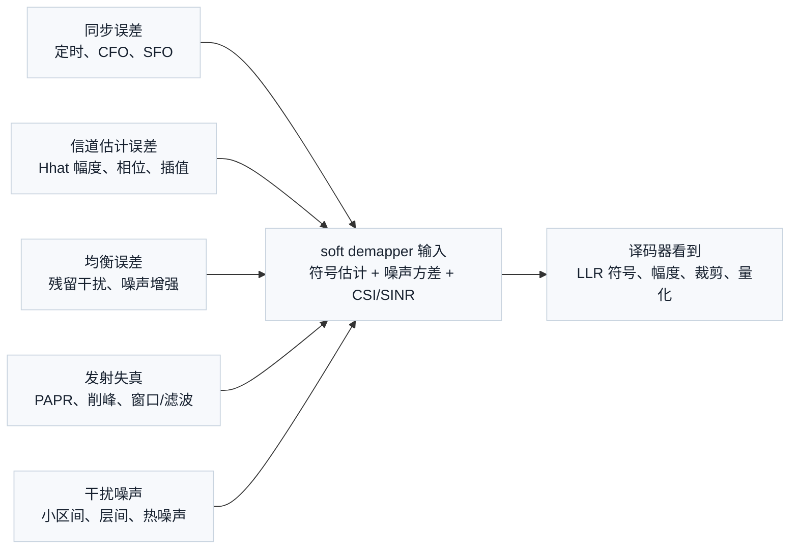
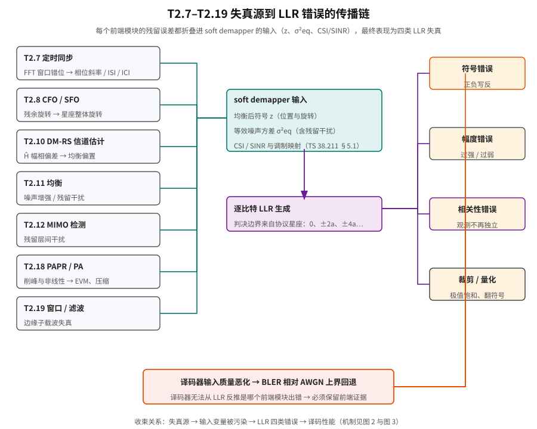
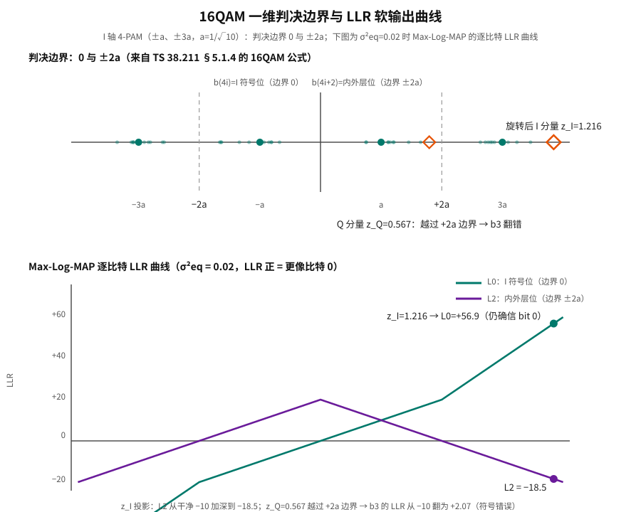
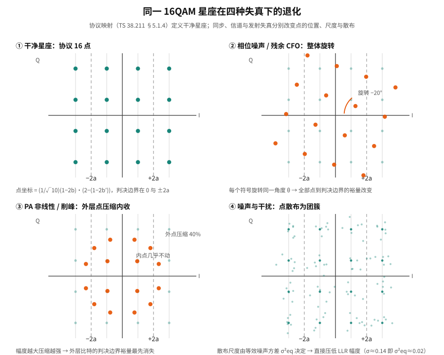

# T2.17 前端失真到 LLR 质量的退化链路：星座偏移、判决边界与译码器输入质量

## 本节学习目标

[[T2.7_OFDM_timing_synchronization|T2.7]]–[[T2.19_OFDM_windowing_filtering|T2.19]] 分别讲了定时、频偏、信道估计、均衡、MIMO（多输入多输出，Multiple-Input Multiple-Output）、峰均功率比（Peak-to-Average Power Ratio, PAPR）和窗口函数。本节把它们收束到译码器真正看到的接口：对数似然比（Log-Likelihood Ratio, LLR）。译码器不会知道快速傅里叶变换（Fast Fourier Transform, FFT）窗口偏了几采样、载波频偏（Carrier Frequency Offset, CFO）还剩多少赫兹、解调参考信号（Demodulation Reference Signal, DM-RS）插值用了几阶滤波器，也不会知道功率放大器（Power Amplifier, PA）是否削峰。它只看到一串有符号、有幅度、可能被裁剪和量化的 LLR。

- 建立 OFDM（正交频分复用，Orthogonal Frequency Division Multiplexing）前端误差到 LLR 的统一链路。
- 区分 LLR 符号错误、幅度错误、相关性错误和裁剪错误。
- 说明为什么 AWGN（加性高斯白噪声，Additive White Gaussian Noise）/perfect CSI（信道状态信息，Channel State Information）曲线只是上界。
- 给出 BLER（块错误率，Block Error Rate）调试时的前端证据清单。
- 把 T2 系列如何进入 T3+ 译码链路讲清楚。
- 从 TS 38.211 §5.1 调制映射公式推出 LLR 的判决边界（0、±2a 等）。
- 用手算复现 16QAM（16 阶正交幅度调制）符号受相位噪声旋转后逐比特 LLR 的变化。

## 前置知识检查

| 问题 | 需要达到的程度 |
|:---|:---|
| LLR 的符号和幅度含义是什么？ | 正负号表示更像 0/1，幅度表示可靠度。 |
| 软解调器（soft demapper）需要哪些输入？ | 至少需要均衡后符号、噪声、CSI（信道状态信息，Channel State Information）/SINR（信干噪比，Signal-to-Interference-plus-Noise Ratio）和调制映射。 |
| perfect baseline 是什么？ | 知道它是理想同步/理想信道估计等上界条件。 |
| BLER 调试为什么要分层？ | 知道前端和译码器错误会在最终 BLER 上混在一起。 |
| 16QAM 的判决边界在哪？ | 能说出符号位边界在 0，内外层位边界在 ±2a（a=1/√10）。 |

本节默认读者已经读过 [[T2.7_OFDM_timing_synchronization|T2.7]]–[[T2.19_OFDM_windowing_filtering|T2.19]]。若只读本节，要先接受一个核心前提：译码器看到的 LLR 是接收机前端多步处理之后的压缩结果，不是无线信道的原始观测。

## LLR：译码器唯一能看到的证据

在动手写公式之前，先用白话建立直觉。LLR 是每个编码比特的"证词"：一个带符号的实数。**正数说"这个比特更像 0"，负数说"更像 1"，绝对值越大越笃定。** 译码器（涡轮码 Turbo、低密度奇偶校验码（Low-Density Parity-Check code, LDPC）、极化码 Polar）像一位陪审员，它不做任何前端调查，只根据每份证词的"语气强度"加权投票。因此前端任何一步出错，只要没有反映到 LLR 的符号或幅度上，译码器就永远不可能知道——这就是本节标题里"退化"二字的全部含义：前端失真把"可信证据"降级成"误导证据"。

概念四要素：

| 要素 | 内容 |
|:---|:---|
| 是什么 | 每个编码比特的对数似然比（LLR）：$\ln\frac{P(b=0\mid z)}{P(b=1\mid z)}$ 的工程实现，正=更像 0，负=更像 1，|LLR| = 确信度。 |
| 为什么需要 | 硬判决 0/1 在译码前就冻结了每个比特，丢掉"有多近"的信息；软信息让译码器能推翻低置信度比特。 |
| 怎么计算 | soft demapper（软解调器）用均衡后符号 $z$、等效噪声方差 $\sigma_{eq}^2$ 和协议调制映射（TS 38.211 §5.1）逐比特计算。 |
| 工程含义 | 前端误差只能通过两条路进入 LLR：改变 $z$（位置/旋转）或改变 $\sigma_{eq}^2$（可靠度估计）——所有失真最终都"折叠"进这两条路。 |

可数例子（先感受幅度）：同是"更像 0"的判决，$L=+40$ 表示几乎确定，$L=+4$ 表示只是倾向；而 $L=-40$ 则是"几乎确定是 1"——方向错了的大幅度 LLR 对译码器最危险，因为迭代译码器很难推翻一个又坚决又错误的投票。这个例子在"教学例子一"中完整展开。

## LLR 是前端误差的折叠接口

理想 soft demapper 假设均衡后符号满足：

$$
z = x + w,\quad w\sim\mathcal{CN}(0,\sigma_{eq}^2)
\tag{1}
$$

**这个公式回答的问题**：在什么条件下，逐比特 LLR 才是可信的？**符号含义**：$z$ 是均衡后得到的复数符号（译码器看不到的中间量），$x$ 是发送端真正发出的星座点（由 TS 38.211 §5.1 调制映射决定），$w$ 是叠加的等效噪声，方差 $\sigma_{eq}^2$ 同时吸收热噪声、残留干扰和估计误差。**来源**：这是接收机内部采用的工作假设，不是协议条文——它把"前端一切正常"压缩成一个公式。

于是对每个比特计算：

$$
L(b_i)
=
\ln
\frac{\sum_{s\in\mathcal{S}_{i,0}}
\exp\left(-|z-s|^2/\sigma_{eq}^2\right)}
{\sum_{s\in\mathcal{S}_{i,1}}
\exp\left(-|z-s|^2/\sigma_{eq}^2\right)}
\tag{2}
$$

**这个公式回答的问题**：给定接收到的 $z$，第 $i$ 个比特更像 0 还是 1、有多确定？**逐符号解释**：$\mathcal{S}_{i,0}$ 是"第 $i$ 个比特为 0"的所有候选星座点集合，$\mathcal{S}_{i,1}$ 是"第 $i$ 个比特为 1"的候选集合；分子是"假如发 0，看到这个 $z$ 有多合理"的证据总量，分母是"假如发 1"的证据总量；两者之比取对数就是 LLR。**来源**：贝叶斯公式在等先验、复高斯噪声下的直接展开；它在 [[T2.14_QAM_Max_Log_MAP_demapping|T2.14]] 中演化为 Max-Log-MAP 近似（用最近候选点代替求和），在本节只用其正确形式作参照。**直观理解**：$z$ 越靠近某个候选点，该点贡献的指数项越大——离"0 的候选点"更近则 LLR 为正且幅度大。

对 BPSK（二进制相移键控，Binary Phase Shift Keying；本课程归一化约定见 [[T2.13_BPSK_QPSK_soft_demapping|T2.13]] 式 (5)），式 (2) 退化为一条直线：

$$
L = \frac{2z}{\sigma_{eq}^2}
\tag{3}
$$

式 (3) 说明 BPSK 的 LLR 正比于 $z$、反比于噪声方差：同样的位置，噪声大一倍，确信度就砍半。

但真实系统里，$z$ 和 $\sigma_{eq}^2$ 都来自前端处理。任何同步、估计、均衡或发射失真都会改变式 (1) 的成立程度：$z$ 可能被旋转、压缩、污染，$\sigma_{eq}^2$ 可能被估小或估大，甚至噪声根本不是高斯独立的。式 (2) 把"前端质量"与"译码器看到的证据"连成一条线——这就是"折叠接口"的准确含义。

## 图示：前端误差到 LLR 的收束链路





图示把 [[T2.7_OFDM_timing_synchronization|T2.7]]–[[T2.19_OFDM_windowing_filtering|T2.19]] 的误差源汇总到 soft demapper 输入：符号估计、等效噪声方差和 CSI/SINR。译码器看到的是 LLR 的符号、幅度、裁剪和量化结果；它无法从 LLR 本身反推出是哪一个前端模块出错。因此调试 BLER 必须保留前端证据。

## 协议锚点：调制映射定义 LLR 的判决边界

前端失真（定时、频偏、估计、均衡、PA……）的数学模型——相位噪声谱形状、IQ 不平衡模型、削峰曲线——**都不是 3GPP 规定的内容**，它们是工程模型。3GPP 真正规定的是：比特如何映射成星座点（调制映射），以及本次传输允许用哪些调制阶数。而星座点的几何结构直接决定了 soft demapper 的判决边界：**LLR 的符号由"落点在边界的哪一侧"决定，LLR 的幅度由"落点离边界多远"决定。** 这就是 [[T2.7_OFDM_timing_synchronization|T2.7]]–[[T2.19_OFDM_windowing_filtering|T2.19]] 全部失真在 LLR 层的协议落点。

### 3GPP 规定什么：调制映射公式

TS 38.211 §5.1 的引言句（本地证据：`3GPP_Rel19/processed/TS_38.211_38211-j30/full.md` 第 1076 行起）：

> The modulation mapper takes binary digits, 0 or 1, as input and produces complex-valued modulation symbols as output.

（调制映射器以二进制数字 0 或 1 为输入，产生复数值调制符号为输出。）

§5.1.4 给出 16QAM 的完整公式（本地证据：同目录 `content.md` §5.1.4、公式渲染件 `media_svg/image56.svg`）：

$$
d(i)=\frac{1}{\sqrt{10}}
\left[
(1-2b(4i))\left(2-(1-2b(4i+2))\right)
+
j(1-2b(4i+1))\left(2-(1-2b(4i+3))\right)
\right]
\tag{4}
$$

**逐符号解释**：$i$ 是符号索引；$d(i)$ 是第 $i$ 个复调制符号；$b(4i), b(4i+1), b(4i+2), b(4i+3)$ 是组成该符号的 4 个编码比特（协议称 quadruplets，四元组）；$(1-2b)$ 把比特 0/1 映射为 $+1/-1$；$j$ 是虚数单位。**结构**：实部（I 轴）与虚部（Q 轴）各自独立：$(1-2b)$ 决定正负号（符号位），$(2-(1-2b'))$ 决定幅度取 1 还是 3。**归一化**：$\frac{1}{\sqrt{10}}$ 使星座平均符号能量 $E_s=1$（16 个点的 I²+Q² 平均值是 10）。**判决边界**：I 轴投影只取 $\{\pm a, \pm 3a\}$，其中 $a=1/\sqrt{10}\approx 0.3162$。符号位 $b(4i)$ 在 0 处翻转；内外层位 $b(4i+2)$ 在幅度 1 与 3 的中点翻转，即 $\pm 2a \approx \pm 0.6325$。这两个边界数字——**0 与 ±2a**——不是协议表格里写死的条文，而是从协议公式推出的几何事实；接收端 soft demapper 的判决边界必须与之一致，否则就是系统性判决错误。

QPSK（正交相移键控，Quadrature Phase Shift Keying）与 64QAM（64 阶正交幅度调制，64 Quadrature Amplitude Modulation）的公式同构（本地证据：同目录 `content.md` §5.1.3、§5.1.5）：

$$
d(i)=\frac{1}{\sqrt{2}}\left[(1-2b(2i))+j(1-2b(2i+1))\right]
\tag{5}
$$

$$
d(i)=\frac{1}{\sqrt{42}}
\left[
(1-2b(6i))\left(4-(1-2b(6i+2))\left(2-(1-2b(6i+4))\right)\right)
+j(1-2b(6i+1))\left(4-(1-2b(6i+3))\left(2-(1-2b(6i+5))\right)\right)
\right]
\tag{6}
$$

64QAM 的嵌套结构揭示规律：每一层括号把幅度选项翻倍（1→3→5→7），归一化常数 $\sqrt{42}$ 保证 $E_s=1$。256QAM（256 阶正交幅度调制，256 Quadrature Amplitude Modulation）与 1024QAM（1024 阶正交幅度调制，1024 Quadrature Amplitude Modulation）把嵌套加深到第 3、4 层（归一化常数 $\sqrt{170}$、$\sqrt{682}$，坐标扩展到 $\pm 1..\pm 15$、$\pm 1..\pm 31$），公式全文见本地证据 `content.md` §5.1.6、§5.1.7（1024QAM 公式以完整 LaTeX 保留在 `full.md` §5.1.7）。16QAM 的 I 轴投影本质是 4 点脉冲幅度调制（Pulse Amplitude Modulation, PAM），其判决边界结构对 Q 轴同样成立。由此得到全部判决边界（表中 QPSK 即正交相移键控，Quadrature Phase Shift Keying）：

| 调制方案 | 条款 | 归一化常数 | I/Q 坐标 | 判决边界 | 每符号比特（调制阶数 $Q_m$） |
|:---|:---|:---|:---|:---|:---|
| QPSK | TS 38.211 §5.1.3 | $1/\sqrt{2}\approx 0.707$ | $\pm 0.707$ | $0$ | 2 |
| 16QAM | TS 38.211 §5.1.4 | $1/\sqrt{10}\approx 0.316$ | $\pm 0.316,\ \pm 0.949$ | $0,\ \pm 0.632$ | 4 |
| 64QAM | TS 38.211 §5.1.5 | $1/\sqrt{42}\approx 0.154$ | $\pm 0.154,\ \pm 0.463,\ \pm 0.772,\ \pm 1.080$ | $0,\ \pm 0.309,\ \pm 0.617,\ \pm 0.926$ | 6 |
| 256QAM | TS 38.211 §5.1.6 | $1/\sqrt{170}\approx 0.0767$ | $\pm 1..\pm 15$ 的奇数 × 常数 | $\pm 2k/\sqrt{170}$，$k=1..7$ | 8 |
| 1024QAM | TS 38.211 §5.1.7 | $1/\sqrt{682}\approx 0.0383$ | $\pm 1..\pm 31$ 的奇数 × 常数 | $\pm 2k/\sqrt{682}$，$k=1..15$ | 10 |

表中数值经本地抽取件逐项核对（判决边界 = 相邻坐标幅度的中点；例如 16QAM 的 $\pm 2a$ 是幅度 1 与 3 的归一化中点）。

### 3GPP 还规定什么：可用调制阶数集合

调制阶数不是任意的。PDSCH（物理下行共享信道，Physical Downlink Shared Channel）侧，TS 38.211 Table 7.3.1.2-1 规定 UE（用户设备，User Equipment）应假设的调制方案集合（本地证据：`full.md` 第 4931 行附近）：QPSK（$Q_m=2$）、16QAM（$4$）、64QAM（$6$）、256QAM（$8$）、1024QAM（$10$）。PUSCH（物理上行共享信道，Physical Uplink Shared Channel）侧，Table 6.3.1.2-1 在关闭变换预编码时支持 QPSK–256QAM，开启时额外允许 π/2-BPSK（π/2 二进制相移键控，$Q_m=1$）（本地证据：`tables/table_0017.csv` 即该表抽取件，`full.md` 第 1813 行）。$Q_m$ 直接决定每个符号产生几个 LLR、判决边界有几层——它由调度下发：TS 38.214 §5.1.3.1 规定 UE 用 DCI（下行控制信息，Downlink Control Information）中的 $I_{MCS}$ 查表确定调制阶数 $Q_m$ 与目标码率 $R$（MCS 即调制编码方案，Modulation and Coding Scheme）（本地证据：`3GPP_Rel19/processed/TS_38.214_38214-j30/content.md` §5.1.3.1；MCS 表本身已在 [[T2.5_MCS_modulation_order_target_code_rate|T2.5]] 展开，本节只做边界引用）。

### 协议强制与实现自由度的边界

| 事项 | 协议强制（TS 38.211 / 38.214） | 接收机实现自由度 |
|:---|:---|:---|
| 星座点坐标与能量归一化 | §5.1.1–§5.1.7 公式（含 $1/\sqrt{Q}$ 常数） | 无——必须按同一星座倒推候选点 |
| 可用调制阶数 | Table 7.3.1.2-1 / 6.3.1.2-1、MCS→$Q_m$ | 无——调度决定 |
| 判决边界位置 | 由公式几何推出（0、±2a、±4a…） | 边界的实现方式（查表、比较器、定点近似）自由 |
| LLR 计算算法 | 未规定 | 式 (2) 精确式、Max-Log-MAP（[[T2.14_QAM_Max_Log_MAP_demapping|T2.14]] 的最大后验近似）等自由选择 |
| 噪声方差/CSI/SINR 估计 | 未规定 | 完全自由（[[T2.10_OFDM_channel_estimation_DMRS|T2.10]]/[[T2.11_OFDM_equalization_CSI_SINR|T2.11]] 讲方法） |
| 相位噪声谱、IQ 不平衡等失真模型 | 未规定 | 工程模型，用于仿真与补偿设计 |

**接收端必须做什么**：软解调必须使用与 §5.1 完全相同的映射关系枚举候选点；判决边界必须与星座几何一致；调制阶数必须按 MCS 链路（TS 38.214）解析。除此之外，一切 LLR 层算法都是接收机自己的事——这也正是"LLR 被前端污染"问题全部发生在实现域的原因。



## 四类 LLR 失真

| 失真类型 | 表现 | 典型来源 |
|:---|:---|:---|
| 符号错误 | 正 LLR 写成负，或负写成正 | 星座旋转未补、层映射错、bit ordering 错。 |
| 幅度错误 | 方向对但过强/过弱 | 噪声方差、CSI/SINR、信道估计幅度错误。 |
| 相关性错误 | LLR 被当作独立观测但实际强相关 | 子载波间干扰（Inter-Carrier Interference, ICI）、残留层间干扰、相位噪声。 |
| 裁剪/量化错误 | 极值过多或溢出翻符号 | LLR scaling、clip、定点饱和设计不当。 |

译码器算法通常假设输入 LLR 大致反映独立观测可靠度。这个假设被破坏时，即使译码器代码完全正确，BLER 也会明显变差。需要特别强调：**符号错误和"过度自信的幅度错误"比"保守的幅度错误"危险得多**——前者直接喂给译码器错误结论，后者只是少投票；而大幅度的错误 LLR 在迭代译码（[[T4.1_iterative_decoding_extrinsic_information|T4.1]]）里极难被校验约束推翻。

## 从模块误差到 LLR 的路径

| 前端模块 | 误差 | 对 LLR 的影响 |
|:---|:---|:---|
| 定时同步 | FFT 窗口越出循环前缀（Cyclic Prefix, CP） | 符号间干扰（Inter-Symbol Interference, ISI）与 ICI，多个资源单元（Resource Element, RE）同时污染。 |
| CFO/SFO（采样频偏，Sampling Frequency Offset） | 残余旋转、频域相位斜率 | 星座旋转、距离计算错误。 |
| 信道估计 | $\hat{H}$ 幅相偏差 | 均衡偏置、噪声增强估计错。 |
| 均衡/MIMO 检测 | 残留层间干扰 | per-layer 可靠度失配。 |
| PAPR/PA | 非线性、削峰 | 误差矢量幅度（Error Vector Magnitude, EVM）增大，误差非高斯。 |
| 窗口/滤波 | 频谱改善过度 | 边缘子载波 EVM 或 CP 余量损失。 |
| 干扰噪声 | 小区间/邻道/热噪声 | SINR 下降，LLR 幅度应变小。 |

### 各失真源在 LLR 层的特征指纹

BLER 调试的难点是"多个失真同时存在"。好在每类失真在 LLR 层留下不同的**特征指纹**，可以据此区分根因：

| 失真源 | LLR 层特征指纹 | 与其它源的区分方法 |
|:---|:---|:---|
| 定时残留 | 相位沿频率线性增加 → 边缘 PRB（物理资源块，Physical Resource Block）符号错误更多 | per-PRB 符号错误率是否沿频率单调上升 |
| 残余 CFO | 全部 RE 恒定旋转 → 所有符号同向偏移 | 按 OFDM 符号平均的残余相位（公共相位误差，Common Phase Error, CPE）为同一常数 |
| SFO | 相位斜率随 OFDM 符号索引递增 | CPE 斜率随符号号线性增长，与符号号相关 |
| 信道估计幅度偏小 | LLR 整体偏小但方向正确 | 平均 \|LLR\| 与 post-eq SINR 不成比例 |
| 噪声方差低估 | 高 SNR（信噪比，Signal-to-Noise Ratio）下 \|LLR\| 极大、clip 计数飙升 | 比较 per-PRB SINR 与 \|LLR\| 的比值是否合理 |
| ICI/层间干扰 | 相关噪声 → LLR 序列自相关不为零 | 计算 LLR 残差的自相关，迭代译码收敛明显变慢 |
| PA 压缩 | 外层比特 LLR 系统性偏小或翻转 | 误差模式与星座幅度相关（外层点最严重） |

这张表回答工程问题"LLR 坏了，怎么知道是谁干的"：把 LLR 按频率、时间、幅度三个维度拆开看特征，比只看平均 BLER 有效得多。

## Perfect baseline 的调试价值

链路仿真常见三条曲线：

| 曲线 | 含义 | 用途 |
|:---|:---|:---|
| AWGN + perfect CSI | 最理想软解调条件 | 检查编码/译码主链路是否基本正确。 |
| Fading + perfect timing/CSI | 信道存在但接收机理想 | 分离信道模型损失。 |
| Practical receiver | 同步、估计、均衡、量化都实际化 | 评估真实接收机损失。 |

如果只运行 practical receiver，BLER 恶化时很难定位是译码器错误、LLR scaling 错误，还是前端估计误差。perfect baseline 是调试参照系，用于分离前端损失和译码器损失。

## 教学例子一（BPSK）：同一判决方向，不同 LLR 质量

考虑 BPSK 教学映射 `0 -> +1`、`1 -> -1`。假设均衡后两个 RE 都落在正半轴，因此硬判决都是 bit 0：

| RE | 均衡后 $z$ | 等效噪声方差 $\sigma^2_{eq}$ | LLR $2z/\sigma^2_{eq}$ | 解释 |
|:---|---:|---:|---:|:---|
| A | 0.8 | 0.04 | 40 | 强信道、低噪声，非常确信 bit 0。 |
| B | 0.8 | 0.40 | 4 | 同样位置，但噪声大，只能中等确信。 |
| C | 0.8 | 0.04（误估） | 40（错误） | 如果真实噪声其实是 0.40，LLR 被过度放大。 |

这个例子说明：星座点位置相同，不代表 LLR 应相同。soft demapper 的可靠度来自位置和噪声/CSI 两部分。若信道估计、均衡或干扰估计把 $\sigma^2_{eq}$ 估小，译码器会收到过度自信的 LLR。过度自信比"略保守"更危险，因为迭代译码器可能很难推翻一个方向错误且幅度很大的输入。

再看符号错误。若残余 CFO 把星座旋转到负半轴，$z=-0.3$，但真实 bit 仍为 0。在 $\sigma^2_{eq}=0.04$ 下：

$$
L=\frac{2(-0.3)}{0.04}=-15
\tag{7}
$$

这是"非常确信 bit 1"的错误证据。后续 LDPC 或 Turbo 译码器会尝试用校验约束纠正它，但如果同类错误在多个 RE 上成簇出现，译码失败概率会急剧增加。

## 教学例子二（16QAM）：相位噪声旋转 20° 后逐比特 LLR 的变化

BPSK 只有一条判决边界（0），看不出"一个失真对不同比特影响不同"。换 16QAM：每个符号 4 个比特、3 层判决边界（0、±2a），同一旋转对每个比特的命运可以完全不同。

**场景设定**：16QAM，噪声方差 $\sigma^2_{eq}=0.02$，归一化尺度 $a=1/\sqrt{10}\approx 0.3162$（与 [[T2.14_QAM_Max_Log_MAP_demapping|T2.14]] 手算例子同口径）。发送符号取最外层角点：

$$
s = 3a + 3aj = 0.9487 + 0.9487j
\tag{8}
$$

按 TS 38.211 §5.1.4 的比特顺序，$b(4i)=0$（I 符号位）、$b(4i+1)=0$（Q 符号位）、$b(4i+2)=1$（I 外层）、$b(4i+3)=1$（Q 外层），标签为 `0011`。

**干净情况**（无失真，$z=s$）：用 Max-Log-MAP（[[T2.14_QAM_Max_Log_MAP_demapping|T2.14]]）逐比特计算：

$$
(L_0, L_1, L_2, L_3) = (+40, +40, -10, -10)
\tag{9}
$$

$b_0$、$b_1$ 极确信为 0（落在 +3a 上，离符号位边界 0 最远）；$b_2$、$b_3$ 中等确信为 1（离内外层位边界 +2a 尚有 2a 的裕量）。硬判决 `0011` 正确。

**受相位噪声/残余 CFO 旋转 −20°**（[[T2.8_OFDM_CFO_SFO_frequency_synchronization|T2.8]] 的失真形态；相位噪声给每个符号一个随机旋转，残余 CFO 给全部符号同一个旋转）：

$$
z = s\cdot e^{-j20^\circ} = 1.2159 + 0.5670j
\tag{10}
$$

**逐比特 LLR 对比**（同一 $\sigma^2_{eq}=0.02$ 下计算）：

| 比特 | 判决边界 | 干净 LLR | 旋转后 LLR | 判决变化 | 解释 |
|:---|:---|---:|---:|:---|:---|
| $b_0$（I 符号位） | $0$ | +40.0 | +56.9 | 仍正确，更自信 | $z_I=1.216$ 远离 0，裕量反而变大 |
| $b_1$（Q 符号位） | $0$ | +40.0 | +17.9 | 仍正确，自信下降 | $z_Q=0.567$ 仍为正但靠近 0 |
| $b_2$（I 内外层） | $\pm 2a=\pm 0.633$ | −10.0 | −18.5 | 仍正确，更自信 | $z_I$ 被旋到 3a 之外，离 +2a 更远 |
| $b_3$（Q 内外层） | $\pm 2a=\pm 0.633$ | −10.0 | **+2.07** | **符号翻转（错）** | $z_Q=0.567$ 越过 +2a 边界，被误判为内层 |

**关键结论**：同一个 20° 旋转，$b_0$、$b_2$ 更自信（且仍然正确），$b_1$ 变保守，$b_3$ 却被**翻转成错误的 +2.07**——一个"中等确信"的错误判决。判决边界是分水岭：$z_Q=0.567 < 0.633$，Q 分量被旋到了 +2a 的内侧，于是外层比特 $b_3$ 的 LLR 符号反转。这精确对应图 2 中"越过边界 → 符号翻转"的机制，也说明为什么协议锚点（边界位置）与失真源（旋转）在 LLR 层必然相遇。

**为什么成簇错误难纠**：相位噪声或残余 CFO 对同一 OFDM 符号内的全部 RE 施加同向旋转，翻转的比特成簇出现且方向一致；LDPC/Turbo 的校验约束可以修复少量孤立错误，却很难对抗一段"系统性偏置"的证据——这正是相关性错误（四类失真中的第三类）的典型形态。



## 深入理解：LLR 质量的局部性

平均信噪比（Signal-to-Noise Ratio, SNR）经常掩盖局部问题。NR 资源在频域、时域和层域都有结构，因此 LLR 质量也应按这些维度拆开看：

| 维度 | 局部问题 | 推荐统计 |
|:---|:---|:---|
| 频域 PRB | 边缘滤波失真、频率选择性深衰落 | per-PRB EVM、SINR、LLR histogram。 |
| 时域符号 | 相位噪声、定时漂移、DM-RS 间隔过大 | per-symbol CPE、EVM、导频残差（pilot residual）。 |
| MIMO（多输入多输出，Multiple-Input Multiple-Output）层 | 某层奇异值弱、层间干扰强 | per-layer post-eq SINR、LLR clip count。 |
| HARQ（混合自动重传请求，Hybrid Automatic Repeat Request）轮次 | 冗余版本（Redundancy Version, RV）地址或软合并（soft combining）错 | new/repeat coverage、LLR accumulation delta。 |

如果只保存一个传输块（Transport Block, TB）级平均 SNR，调试者无法判断 BLER 来自某个弱 PRB、某个层、某个时域符号，还是来自 rate recovery 地址错位。T2.17 的工程建议是：LLR 进入 T3/T7/T9/T10 之前，至少保留一次"按 RE/layer 聚合的质量摘要"。

## LLR 调试指标与质量门控

| 指标 | 为什么要看 | 异常示例 |
|:---|:---|:---|
| LLR sign accuracy | 判断方向是否对 | 高 SNR 仍大量符号错误。 |
| LLR 幅度直方图（magnitude histogram） | 判断可靠度分布 | 弱信道下极大值过多。 |
| clip/saturation count | 判断定点边界 | clip 计数随 SNR 异常飙升。 |
| per-layer/per-PRB SINR | 判断局部弱区 | 某层或边缘 PRB BLER 主导。 |
| EVM vs BLER | 连接前端和译码 | EVM 好但 BLER 差，可能是 bit/LLR 顺序错。 |
| HARQ 合并增益（combining gain） | 检查软信息一致性 | 重传后 LLR 没变好或变差。 |

**质量门控（quality gate）建议**——LLR 进入 rate recovery 之前，接收机实现可加以下检查（全部属于实现自由度，协议不要求，但能显著缩短调试周期）：

1. **单调性检查**：per-PRB 平均 |LLR| 应与 per-PRB SINR 单调一致；若 SINR 高而 |LLR| 小，先怀疑 scaling 或信道估计幅度。
2. **clip 比例门限**：clip 计数占总 LLR 数比例超过约 5% 时打标记（高 MCS 可放宽），避免极值饱和悄悄改变译码器行为。
3. **sign accuracy 抽样**：用已知比特（如 DM-RS 邻近的已译码 CB（码块，Code Block）、或校验通过的早期迭代）抽样统计符号正确率。
4. **per-layer 均衡性**：多流时各层 |LLR| 功率差异过大提示层间干扰或 CSI 失配。
5. **HARQ 合并单调性**：同 RV 重传合并后 |LLR| 应整体增大；若变差，查 soft buffer 地址（[[T4.3_HARQ_soft_combining_basics|T4.3]]）。

## 对 T3+ 译码链路的接口

T3 以后进入循环冗余校验（Cyclic Redundancy Check, CRC）、分段（segmentation）、速率恢复（rate recovery）、Turbo/LDPC/Polar 译码。它们消费的不是 RE，也不是星座点，而是一维 LLR 序列。T2.17 的结论是：

```text
OFDM 接收质量 -> 码字级 LLR 序列 -> rate recovery -> 每 CB LLR -> decoder core
```

如果前端把 LLR 顺序、符号、幅度或可靠度做错，后续 rate recovery 和译码核心（decoder core）会忠实处理错误证据。译码器不负责修复物理层前端假设失配。

## 工程闭环：BLER 调试的证据收集顺序

调试一个 BLER 问题时，建议按下面顺序收集证据：

1. 先跑 AWGN + perfect soft demapper，确认译码器主链路。
2. 加入 fading + perfect channel/timing，确认衰落和均衡公式。
3. 加入实际定时同步和 CFO/SFO，观察 EVM、残余相位和 LLR 分布。
4. 加入实际 DM-RS 信道估计，比较 perfect/practical CSI 的差距。
5. 加入 MIMO 检测、PA/PAPR、窗口/滤波和定点 LLR。
6. 最后看 HARQ soft combining 是否按同一母码地址累加可靠度。

这个顺序的目的不是把系统拆得过细，而是防止把所有问题都归咎于译码器。

## 工程实现关注点：四层证据闭环与质量门控

T2.17 的工程重点是建立"证据闭环"。一个 BLER 失败不能只附上 decoder log，因为 decoder log 只能证明译码器如何处理 LLR，不能证明 LLR 是否可信。完整问题单至少应包含四层证据：前端同步/频偏、信道估计/均衡、soft demapper/LLR、rate recovery/decoder。

第一层是前端状态证据。包括 `sync_valid`、`timing_offset`、residual CFO、SFO ppm、CPE 曲线和 EVM 热图（heatmap）。这些字段说明接收机是否真的在正确时频坐标上工作。如果这些字段异常，后续译码失败是结果不是根因。

第二层是信道和均衡证据。包括 DM-RS residual、$\hat{H}$ heatmap、post-eq SINR、per-layer CSI、条件数（condition number）或秩代理（rank proxy）。它们说明软解调器使用的符号位置和可靠度是否来自合理前端模型。若 post-eq SINR 过高但 EVM 很差，说明可靠度估计可能过度自信。

第三层是 LLR 证据。至少要保存 LLR 直方图（histogram）、符号正确率代理（sign accuracy proxy）、裁剪/饱和计数（clip/saturation count）、per-layer/per-PRB LLR power 和比特顺序（bit ordering）轨迹。LLR 幅度分布应随 SNR、MCS、层数和信道质量合理变化。高 SNR 下全部 LLR 很小，可能是 LLR 缩放（scaling）不足；低 SNR 或深衰落下大量极值，可能是噪声方差低估。

第四层是译码证据。包括速率恢复地址、打孔（puncturing）/缩短（shortening）初始化、HARQ 合并地址、译码迭代次数（decoder iteration count）、校验子（syndrome）/CRC 结果。只有当前三层都合理时，才应优先怀疑 decoder core。

| 层级 | 最小证据 | 典型根因 |
|:---|:---|:---|
| 同步/频偏 | timing、CFO/SFO、CPE | FFT 窗口错、残余旋转。 |
| 估计/均衡 | DM-RS residual、CSI、SINR | $\hat{H}$ 错、层间干扰。 |
| LLR | histogram、clip、bit order | scaling、噪声方差、映射错。 |
| 译码 | rate recovery、iteration、CRC | 地址、RV、decoder 算法错。 |

对回归测试，建议每个 MCS 至少保留三类曲线：理想 AWGN、衰落 perfect receiver、practical receiver。三类曲线不需要每天全量跑，但在模型变更、位宽变更、同步/估计/均衡模块变更后必须抽样跑。否则一次前端改动可能悄悄改变 LLR 分布，直到后续 decoder regression 才暴露。

T2 系列到 T3+ 的接口还要处理数据形状。前端通常按 RE/layer/time 输出 LLR，译码器按码块（code block）输入 LLR。中间的解速率匹配（de-rate-matching）、解交织（deinterleaving）和 HARQ 软合并会改变顺序。如果没有保存 RE 到码字（codeword）比特的映射摘要，某个局部前端缺陷很难追到具体 CB 和译码失败（decoder failure）。

## 调试案例库

| 案例 | 表现 | 定位步骤 | 修复方向 |
|:---|:---|:---|:---|
| LLR 方向反 | 高 SNR 仍无法译码 | BPSK/QPSK 单点向量检查 sign | 修正 bit mapping 或 LLR 定义。 |
| LLR 过度自信 | CRC fail 且迭代难以翻转 | 看 clip count 和弱 RE LLR | 修正噪声方差/CSI。 |
| 局部 PRB 损坏 | 平均 SNR 正常但 BLER 差 | per-PRB LLR/EVM heatmap | 定位滤波、信道估计或干扰。 |
| HARQ 合并反降 | 重传后 BLER 变差 | 检查 RV 地址和 LLR delta | 修正 rate recovery/软缓冲（soft buffer）。 |
| 旋转类符号错误 | 高 SNR 下同向符号错误成簇 | 按符号平均残余相位（CPE） | 补 CPE 估计或残余 CFO 跟踪（[[T2.8_OFDM_CFO_SFO_frequency_synchronization|T2.8]]）。 |

LLR 问题的最终判据不是"数值看起来大"，而是它是否与真实可靠度单调一致。强 RE 的正确方向 LLR 应更大，弱 RE 应更保守；重传命中同一母码地址时，同方向独立观测应增加可靠度；puncturing 位置应保持中性。只要这些单调关系被破坏，译码器就会收到错误证据。

## 资料与协议边界

| 资料 | 本节采用 | 边界 |
|:---|:---|:---|
| [[T2.7_OFDM_timing_synchronization|T2.7]]–[[T2.19_OFDM_windowing_filtering|T2.19]] | 各类 OFDM 前端误差来源 | 本节做接口收束，不重复每节完整推导。 |
| [[T2.15_fading_channel_LLR_reliability|T2.15]] | 衰落信道和 LLR 可靠度 | 本节扩展到同步、估计、MIMO 和发射失真。 |
| [[T2.16_LLR_clipping_scaling_quantization|T2.16]] | LLR 裁剪、缩放、量化 | 本节只说明前端误差如何改变进入定点化前的 LLR。 |
| TS 38.211 §5.1 及表 7.3.1.2-1、6.3.1.2-1 | 调制映射与调制阶数集合（协议锚点） | 星座点、判决边界、$Q_m$ 是协议事实；LLR 算法与失真模型是实现自由度。 |
| TS 38.214 §5.1.3.1 | MCS→$Q_m$ 边界引用 | 不展开 MCS 表（[[T2.5_MCS_modulation_order_target_code_rate|T2.5]] 已讲）。 |

3GPP 规定物理信号、参考信号、调制、资源映射、编码和 rate matching 的可互操作规则。它不规定接收机内部必须如何估计 CFO/SFO、如何插值信道、如何选择均衡器、如何计算 post-eq SINR，也不规定 LLR 的定点位宽。工程文档必须把"协议必需字段"和"接收机实现证据"分开记录。

## 常见错误

| 错误 | 为什么错 | 正确做法 |
|:---|:---|:---|
| BLER 差就先改译码器 | 前端 LLR 可能已经错。 | 先做 perfect baseline 分层定位。 |
| 只记录平均 SNR | 局部 PRB、层、符号可能很差。 | 保存 per-RE/per-layer 质量统计。 |
| LLR 越大越好 | 错误方向的大 LLR 最伤译码。 | 检查 sign、magnitude、clip 和校验约束。 |
| 忽略相关干扰 | ICI/层间干扰不是独立 AWGN。 | 在等效噪声或 CSI 中体现残留干扰。 |
| 以为判决边界是协议表格 | 协议只给映射公式，边界是几何推论。 | 从 §5.1 公式推出边界，并用定点实现验证。 |

## 最小仿真矩阵

| 维度 | 建议取值 | 覆盖目的 |
|:---|:---|:---|
| 接收理想度 | AWGN、perfect CSI、practical receiver | 分层定位损失来源。 |
| 前端误差 | 定时、CFO/SFO、估计、PA、窗口 | 确认每类误差到 LLR 的路径。 |
| 调制编码 | 低 MCS、中 MCS、高 MCS | 覆盖可靠度敏感性。 |
| HARQ | 单传、同 RV、不同 RV | 检查 LLR 合并是否单调改善。 |
| 定点 | 浮点、裁剪、量化 | 检查 [[T2.16_LLR_clipping_scaling_quantization|T2.16]] 接口影响。 |

每个点至少保存前端质量摘要、LLR histogram、clip count、rate recovery 地址摘要、decoder iteration 和 CRC。T2.17 的验收目标是能把一个 BLER 点拆成可解释证据链，而不是只给最终 pass/fail。

## 自测题

1. 为什么说 LLR 是前端误差的折叠接口？
2. LLR 符号错误和幅度错误哪个更危险？
3. 为什么 AWGN + perfect CSI 曲线仍然有价值？
4. 哪些前端误差会造成 LLR 过度自信？
5. 为什么译码器不负责修复 CFO/SFO？
6. 16QAM 中 $b(4i+2)$ 的判决边界为什么是 ±2a？若残余旋转把 Q 分量推到 +2a 边界的另一侧，会发生什么？
7. 为什么说判决边界"0 与 ±2a"不是协议表格写出的数字，而是协议公式的推论？
8. 相位噪声使某个 OFDM 符号内全部 RE 同向旋转 20°，为什么"成簇的符号错误"比"孤立的符号错误"更难纠？

## 自测题参考答案

1. 因为译码器只看到 LLR，无法直接看到同步、估计、均衡和发射端失真，这些误差都体现在 LLR 符号和幅度中。
2. 符号错误通常更危险；幅度错误会影响收敛，方向错误的大幅 LLR 会强行推动错误判决。
3. 它能证明编码、调制、软解调和译码主链路在理想条件下成立，是后续定位实际接收机损失的基准。
4. 噪声方差低估、CSI 过高、信道估计幅度偏小、残留干扰未计入、削峰失真被当作 AWGN。
5. CFO/SFO 是前端同步问题；译码器只处理 LLR，不知道采样频率或载波频率误差。
6. 因为协议公式（TS 38.211 §5.1.4）给出 I 轴幅度只取 $\{1,3\}\times 1/\sqrt{10}$，内外层位在幅度 1 与 3 的中点（归一化后 $\pm 2/\sqrt{10}\approx\pm 0.633$）翻转。Q 分量被旋到 +2a 内侧时，该比特 LLR 符号翻转——教学例子二中 $b_3$ 从 −10 变为 +2.07 正是如此。
7. 协议条文只给出调制映射公式与调制阶数集合；判决边界是接收端从公式几何推出的位置（幅度中点的归一化），属于协议的数学推论；边界的具体实现方式（查表/比较器）则是接收机自由度。
8. 同向旋转使相邻 RE 的 LLR 错误方向一致且相关，译码器面对的是系统性偏置而非随机散布，校验约束难以逐点纠回；同时相关性错误破坏了译码器"观测独立"的假设，迭代收敛也变慢。

## 本节验收

| 验收项 | 通过标准 |
|:---|:---|
| 统一链路 | 能把 [[T2.7_OFDM_timing_synchronization|T2.7]]–[[T2.19_OFDM_windowing_filtering|T2.19]] 每类误差接到 LLR。 |
| 失真分类 | 能区分符号、幅度、相关性和裁剪/量化错误。 |
| 调试顺序 | 能设计 perfect 到 practical 的分层仿真。 |
| 协议边界 | 能区分协议规则和接收机内部实现证据。 |
| 链路图理解 | 能按图示说明 [[T2.7_OFDM_timing_synchronization|T2.7]]–[[T2.19_OFDM_windowing_filtering|T2.19]] 的误差如何汇聚到 LLR。 |
| 协议锚点 | 能写出 TS 38.211 §5.1.4 的 16QAM 公式，并推出判决边界 0、±2a。 |
| 手算例子 | 能复现 16QAM 旋转 20° 例子，指出 $b_3$ 符号翻转及原因。 |

## 执行与证据记录

| 项目 | 记录 |
|:---|:---|
| 本地材料 | 汇总 [[T2.7_OFDM_timing_synchronization|T2.7]]–[[T2.19_OFDM_windowing_filtering|T2.19]]、[[T2.15_fading_channel_LLR_reliability|T2.15]]、[[T2.16_LLR_clipping_scaling_quantization|T2.16]] 和概念笔记 `CSI_SINR`、`MMSE_均衡`、`Channel_Estimation_信道估计`、`Soft_Demodulation_软解调`、`Modulation_Constellations_调制星座`、`LLR_对数似然比`。 |
| 图解材料 | 新增 3 张手绘 SVG：`T2.17_impairment_to_llr_chain.svg`（图 1）、`T2.17_llr_decision_boundary.svg`（图 2）、`T2.17_16qam_impairment_degradation.svg`（图 3）；坐标程序化计算，配色按本节语义自定（青=协议参考、橙=失真警示、紫=LLR 软信息）。 |
| 图解验证 | y 坐标扫描（文本间距 ≥ 8px）、PIL 文本 bbox 审计（无重叠、无越界）、cairosvg 1.5 倍渲染无异常。 |
| 协议锚点 | TS 38.211 §5.1/§5.1.3–§5.1.7 公式、Table 7.3.1.2-1（PDSCH）、Table 6.3.1.2-1（PUSCH，`tables/table_0017.csv`）、TS 38.214 §5.1.3.1 均从本地抽取件核对（见"协议锚点"节）。 |
| 图解边界 | 图内星座坐标、判决边界、LLR 数值与本地抽取件及手算核对一致。 |
| 证据边界 | 本节为 T2 工程误差收束；失真源数学模型（相位噪声谱、压缩曲线等）标注为工程模型而非协议规定。 |

## 参考文献

- [3GPP, 2026] 3GPP TS 38.211, Rel-19, `38211-j30`, Physical channels and modulation. Local path: `3GPP_Rel19/processed/TS_38.211_38211-j30`.
- [3GPP, 2026] 3GPP TS 38.214, Rel-19, `38214-j30`, Physical layer procedures for data. Local path: `3GPP_Rel19/processed/TS_38.214_38214-j30`.
- [3GPP, 2026] 3GPP TS 38.215, Rel-19, `38215-j20`, Physical layer measurements. Local path: `3GPP_Rel19/processed/TS_38.215_38215-j20`.
- 项目概念笔记：`3gpp/docs/concepts/CSI_SINR.md`，`3gpp/docs/concepts/MMSE_均衡.md`，`3gpp/docs/concepts/Channel_Estimation_信道估计.md`，`3gpp/docs/concepts/Soft_Demodulation_软解调.md`，`3gpp/docs/concepts/Modulation_Constellations_调制星座.md`，`3gpp/docs/concepts/LLR_对数似然比.md`。
