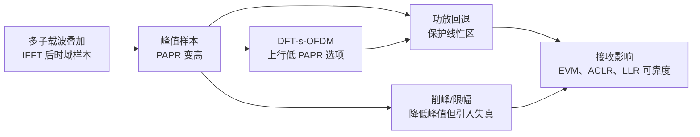
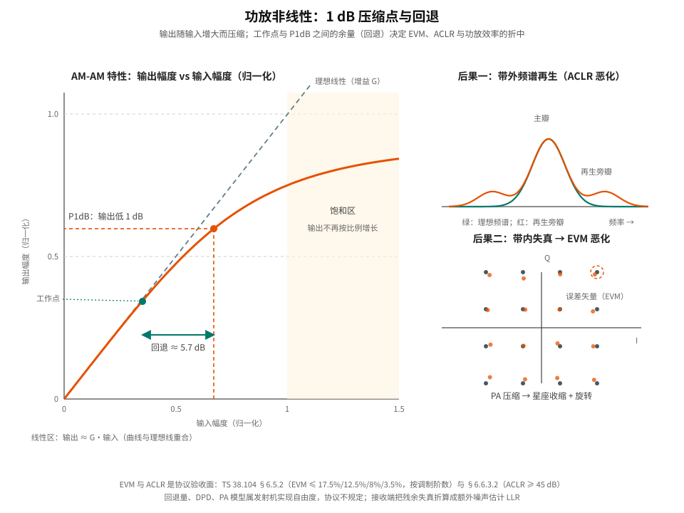
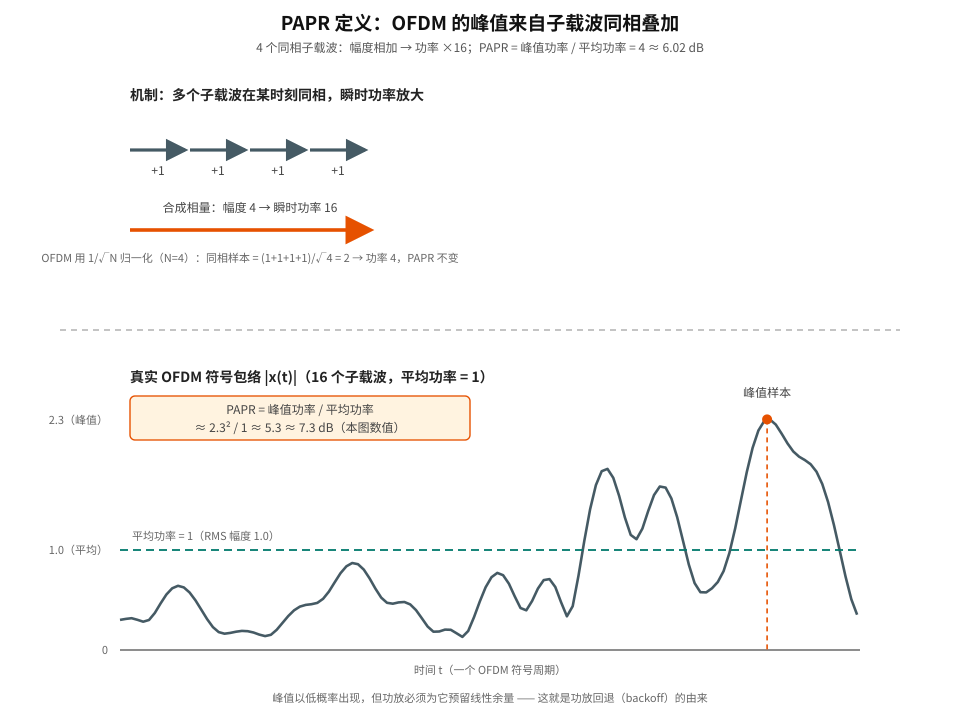
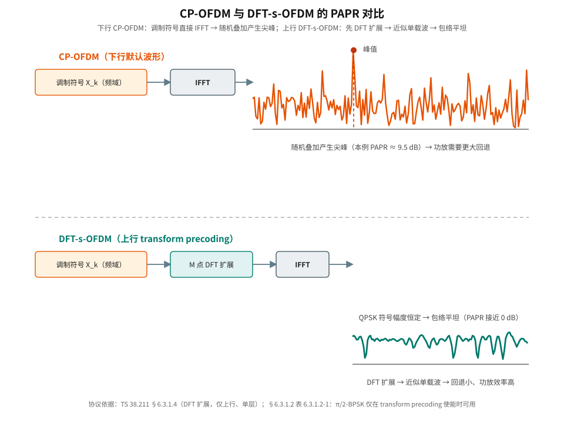

# T2.18 OFDM PAPR：峰均功率比、功放回退与发射端失真
## 本节学习目标

前面 [[T2.7_OFDM_timing_synchronization|T2.7]]–[[T2.12_MIMO_OFDM_layer_detection|T2.12]] 主要在讲接收端。本节回到发射端：OFDM 的 IFFT 把许多子载波相加，时域波形会出现高峰值。峰均功率比（Peak-to-Average Power Ratio, PAPR）高，会迫使功放保持较大线性余量；如果余量不足，功放非线性或削峰会污染星座和频谱。

本节回答一个常被忽略的问题：PAPR 是发射端问题，为什么最终也会影响译码器 LLR？

- 定义 PAPR 并解释 OFDM 为什么天然容易高 PAPR。
- 说明功放回退、效率、EVM 和 ACLR 的关系。
- 对比削峰、滤波、预失真和 DFT-s-OFDM 的基本思路。
- 解释发射端非线性如何变成接收端 LLR 失真。
- 明确 NR 下 CP-OFDM 和 DFT-s-OFDM 的波形边界。
- 精读 TS 38.211 中协议为降低 PAPR 做的调制与波形设计（π/2-BPSK、低 PAPR 序列、transform precoding），以及 TS 38.104 中 EVM 与 ACLR 的验收面。

## 前置知识检查

| 问题 | 需要达到的程度 |
|:---|:---|
| IFFT 输出是什么？ | 知道它是多个子载波复指数叠加后的时域采样。 |
| 功放为什么有线性区？ | 知道真实 PA 不能无限按比例放大，过大输入会饱和。 |
| EVM 是什么？ | 知道它衡量接收/发射星座点相对理想位置的误差。 |
| LLR 幅度代表什么？ | 知道幅度越大表示 soft demapper 越确信。 |

如果还没有建立“发射端波形质量会影响接收端软信息”的意识，先回到 [[T2.0_OFDM_system_overview|T2.0]] 的 OFDM 工程问题地图。PAPR 本身不在译码器里，但它会通过 PA 非线性改变译码器输入。

## PAPR 的定义

**白话引入。** 想象一支合唱团：一个人唱歌音量稳定；几十个人同时唱，如果各唱各的相位，总音量起伏不大；但某个瞬间恰好所有人都同声（同相），总音量会突然拔高，远超平时的平均值。OFDM 就是这个“几十人合唱”：IFFT 把成百上千个子载波（相当于合唱团员）加在一起，总包络偶尔会冲到远高于平均值的高度。PAPR 衡量的就是“峰值比平均高多少”。

**概念四要素。**

| 要素 | 内容 |
|:---|:---|
| 定义 | 一个 OFDM 符号内，时域样本的最大瞬时功率与平均功率之比（式 1）。 |
| 直觉 | 子载波相位局部同向 → 幅度相加 → 功率以幅度平方放大。 |
| 可数例子 | 4 个同相子载波 → PAPR = 4 ≈ 6.02 dB（见“教学例子”节）。 |
| 边界 | PAPR 是**波形统计量**，不是协议规定的参数；协议通过调制/序列/波形设计影响它。 |

**公式回答什么问题：** 给定发射信号时域样本 $x[n]$，峰值的相对高度到底是多少？离散时域 OFDM 样本为 $x[n]$，PAPR 定义为峰值功率与平均功率之比：

$$
\mathrm{PAPR}
=
\frac{\max_n |x[n]|^2}{E[|x[n]|^2]}
\tag{1}
$$

- $x[n]$：IFFT 输出的第 $n$ 个时域采样（复基带信号）；
- $|x[n]|^2$：该采样的瞬时功率；
- $\max_n$：在一个 OFDM 符号周期内对全部样本取最大；
- $E[\cdot]$：对全部样本取平均（工程上常用样本均值代替统计期望）。

**为什么用功率比而不是幅度比：** 功放的输出能力（饱和功率、散热、电池电流）按**功率**计量，所以峰值/平均也按功率定义。用 dB 表示：

$$
\mathrm{PAPR}_{dB}=10\log_{10}(\mathrm{PAPR})
\tag{2}
$$

因为功率与幅度平方成正比，幅度翻倍对应 PAPR 增加 $10\log_{10}4 \approx 6.02$ dB。

OFDM 高 PAPR 的根源是多子载波相加。当许多子载波相位在某个时刻接近同向，瞬时样本幅度会远高于平均值。虽然这种峰值不常出现，但功放必须为它留出线性余量。

## 图示：PAPR 影响链



图示的主线是多子载波叠加 → 峰值样本 → 功放回退 → 接收影响。下方两条支路说明了两类缓解：削峰/限幅可以降低峰值但会引入失真；DFT-s-OFDM（DFT-spread OFDM，对频域符号先做离散傅里叶变换扩展再送入 IFFT 的波形）可以降低上行波形 PAPR，减轻 UE 功放压力。

## 功放回退的必要性

**公式回答什么问题：** 理想功放与真实功放的行为差在哪里？

理想线性功放满足：

$$
y(t)=Gx(t)
\tag{3}
$$

其中 $G$ 是电压增益，$x(t)$ 是输入信号，$y(t)$ 是输出信号。线性意味着“输出波形 = 输入波形按比例放大”，星座不被扭曲。

真实功放有饱和区。当输入峰值超过线性范围时，输出不再按比例放大，等效为：

$$
y(t)=Gx(t)+d(t)
\tag{4}
$$

$d(t)$ 是非线性失真。它有两类后果。先给表中两个发射质量指标的白话定义：
误差矢量幅度（Error Vector Magnitude, EVM）衡量星座点相对理想位置的归一化偏离——落点越散、越偏，EVM 越大；
邻信道泄漏比（Adjacent Channel Leakage Ratio, ACLR）衡量泄漏到邻道的功率相对本信道功率的比值（dB），泄漏越大越干扰邻居。

| 后果 | 含义 | 接收端影响 |
|:---|:---|:---|
| 带内失真 | 星座点偏移、压缩、旋转 | EVM 增大，LLR 不可靠。 |
| 带外再生 | 频谱泄漏到邻道 | ACLR 恶化，干扰其他系统。 |

**数值直觉：回退量与功率。** 假设功放线性区的峰值预算为 $P_{\mathrm{peak}}$（例如 1 W）。如果发射波形 PAPR = 4（6.02 dB），平均功率只能设为 $P_{\mathrm{avg}}=P_{\mathrm{peak}}/4$（0.25 W），即“回退”了 6.02 dB；回退 3 dB 意味着平均功率减半。回退（backoff）的数值定义就是 $10\log_{10}(P_{\mathrm{peak}}/P_{\mathrm{avg}})$，它必须不小于 PAPR，否则峰值会进入压缩区。

为了避免进入饱和区，发射机降低平均输出功率，让峰值仍在功放线性范围内，这叫功放回退（backoff）。回退越大，线性越安全，但效率越低，尤其对 UE 电池和热设计不利。



上图主图是功放的幅度-幅度特性（AM-AM）曲线：小信号时输出与输入成正比（线性区，与理想虚线重合）；输入增大后曲线弯曲，输出比线性外推低 1 dB 的点称为 1 dB 压缩点（P1dB）；再往后进入饱和区，输出几乎不再增长。工作点（发射机实际运行的平均功率点）必须与 P1dB 保持回退余量。右侧两个小图说明回退不足的后果：带外频谱再生长高（ACLR 恶化），以及星座被压缩、散开（EVM 恶化）——这两条路径最终都会降低接收端软信息质量。P1dB 与回退的典型数值见后文“深入理解”节。

## OFDM 高 PAPR 的成因

**公式回答什么问题：** OFDM 时域样本为什么是“许多子载波相加”？相加为什么会产生高峰值？

单载波波形每个时刻主要由一个符号脉冲决定；OFDM 时域样本是多个子载波复指数的和（这也是协议 TS 38.211 §5.3.1 定义 OFDM 基带信号的方式，见“协议锚点”节）：

$$
x[n]=\frac{1}{\sqrt{N}}\sum_{k=0}^{N-1}X_k e^{j2\pi kn/N}
\tag{5}
$$

- $N$：子载波数（IFFT 点数）；
- $X_k$：第 $k$ 个子载波上的频域符号（调制符号）；
- $e^{j2\pi kn/N}$：第 $k$ 个子载波的复指数基；
- $1/\sqrt{N}$：归一化因子，保证 IFFT 前后功率不变。

**直觉：** 每个复指数都是单位幅度、相位随时间旋转的“指针”。多个指针相加，相位散开时互相抵消（和很小），相位偶然同向时叠加成很大的指针。$N$ 越大、调制阶数越高，出现“很多指针局部同向”的组合越多，峰值越容易高。

如果 $X_k$ 的相位组合刚好同向，峰值可能随 $N$ 增加而明显变大。实际峰值概率用互补累积分布函数（Complementary Cumulative Distribution Function, CCDF）描述，例如：

$$
P(\mathrm{PAPR} > z)
\tag{6}
$$

**白话解释 CCDF：** 它回答“PAPR 超过某个门限 $z$ 的概率有多大”。比如“PAPR 超过 8 dB 的概率是 0.1%”，意思是发一万个 OFDM 符号，平均有 10 个符号的峰值超过了 8 dB。

链路设计不会只看平均 PAPR，而会看“超过某个峰值门限的概率”。

## 教学例子：四个子载波同相叠加

先看一个极简手算例子。假设只有 4 个子载波，且某个采样时刻四个复指数相位都刚好为 0，同时四个频域符号都是 $1$。采用 $1/\sqrt{N}$ 归一化：

$$
x[n_0]=\frac{1}{\sqrt{4}}(1+1+1+1)=2
\tag{7}
$$

瞬时功率为：

$$
|x[n_0]|^2=4
\tag{8}
$$

而若平均功率归一化到 1，则该时刻 PAPR 为：

$$
\mathrm{PAPR}=4,\qquad \mathrm{PAPR}_{dB}=10\log_{10}4\approx 6.02\ \mathrm{dB}
\tag{9}
$$

这个例子只有 4 个子载波，已经能出现 6 dB 峰均比。真实 NR 载波可能有数百到数千个有效子载波，虽然“全部同相”的概率很小，但“很多子载波局部同向”的峰值仍会以小概率出现。功放必须面对这些低概率高峰，而不能只按平均功率设计。



上图上半部分用相量展示了“同相叠加”机制：4 个同相子载波幅度相加为 4，瞬时功率放大到 16；OFDM 的 $1/\sqrt{N}$ 归一化（$N=4$）后样本幅度为 2、功率为 4，PAPR 不变。下半部分是 16 个子载波随机叠加的真实包络：平均功率归一化为 1（青绿色虚线），峰值样本（橙色）达到 2.3，对应 PAPR ≈ 7.3 dB——比理想化的 4 载波例子更高，说明随机叠加中“局部同相”的峰值很常见。

进一步考察削峰的影响。若把 $|x|>1.5$ 的样本都限制到 1.5，上述 $x=2$ 的样本会被限制为 1.5。峰值降低了，但误差为：

$$
d = 1.5 - 2 = -0.5
\tag{10}
$$

这个误差不是 AWGN，它和信号本身相关。经过 FFT 后，它会散布到多个子载波，表现为星座点偏移和带外再生。接收端若不知道这部分失真，只按热噪声方差计算 LLR，就可能把受削峰污染的符号当成高可信观测。

## 补充手算：单载波与双音信号的 PAPR 基线

为了给 OFDM 的 PAPR 找一个“正常参照物”，这里手算三组基线。**公式回答的问题：** 单载波（QPSK/16QAM）和两个正弦叠加的 PAPR 各是多少？为什么单载波被称为“低 PAPR 波形”？

**例 A：QPSK 单载波，PAPR = 0 dB。** QPSK 的四个星座点幅度都等于 $\sqrt{(1/2)^2+(1/2)^2}=1/\sqrt{2}$（功率 $1/2$），即每个符号瞬时功率恒定。单载波波形每个时刻由一个符号决定，因此峰值功率 = 平均功率：

$$
\mathrm{PAPR}_{\mathrm{QPSK}}=\frac{\max|x(t)|^2}{E[|x(t)|^2]}=1 \quad\Rightarrow\quad 0\ \mathrm{dB}
\tag{11}
$$

**例 B：16QAM 单载波，PAPR ≈ 2.55 dB。** 16QAM 星座点 $I,Q\in\{\pm1,\pm3\}$，归一化前各点功率 $P=I^2+Q^2\in\{2,10,18\}$：功率 2 的点有 4 个，功率 10 的点有 8 个，功率 18 的点有 4 个。平均功率：

$$
E[P]=\frac{4\cdot2+8\cdot10+4\cdot18}{16}=\frac{160}{16}=10,\qquad \max P=18
\tag{12}
$$

$$
\mathrm{PAPR}_{\mathrm{16QAM}}=\frac{18}{10}=1.8\quad\Rightarrow\quad 10\log_{10}1.8\approx 2.55\ \mathrm{dB}
\tag{13}
$$

**例 C：两个等幅正弦叠加，PAPR = 4 ≈ 6.02 dB。** 设 $x(t)=\cos(2\pi f_1 t)+\cos(2\pi f_2 t)$（幅度均为 1）。两个正弦的功率各为 $1/2$，平均功率 $=1$；当两正弦某时刻同相时幅度为 2，峰值功率 $=4$：

$$
\mathrm{PAPR}=\frac{4}{1}=4\quad\Rightarrow\quad 6.02\ \mathrm{dB}
\tag{14}
$$

**三个基线的结论：** 即使只有两个音，只要它们能同相，峰均比就和 4 载波 OFDM 同量级；QPSK 单载波恒包络（0 dB），16QAM 单载波也只有 2.55 dB。这正是 DFT-s-OFDM 的动机：把 OFDM 的频域符号先“铺开”成类似单载波的时域信号，让 PAPR 从 8–11 dB 量级回落到接近单载波水平（见下图与“协议锚点”节）。

## 图示：CP-OFDM 与 DFT-s-OFDM 对比



上图两行对比：上行（橙色）CP-OFDM 把调制符号直接送入 IFFT，128 个子载波随机叠加，时域包络出现多个尖峰（本例 PAPR ≈ 9.5 dB），功放需要大回退；下行（青绿色）DFT-s-OFDM 在 IFFT 之前先做 $M$ 点 DFT 扩展，时域信号退化为近似单载波——QPSK 符号幅度恒定，包络平坦（PAPR 接近 0 dB），回退需求大幅下降。注意两种波形都是 OFDM 帧结构（都加循环前缀），区别只在频域符号到 IFFT 输入之间的变换，以及接收端需要补做对应的 IDFT 逆处理。

## 协议锚点：NR 为低 PAPR 做的波形设计

**本节回答“3GPP 规定什么、为什么、接收端必须做什么”。** 先说边界：PAPR 的度量、功率回退量、DPD 算法、PA 模型都是发射机/射频实现域，协议不规定（见本节末边界表）。但协议通过**调制方式、序列设计、波形选择**三处直接干预 PAPR。以下条款均核验自本地抽取件。

### 锚点 1：OFDM 基带信号生成——PAPR 的协议根源（TS 38.211 §5.3.1）

**规定什么：** §5.3.1 定义除 PRACH 和 RIM-RS 外所有信道/信号的时域连续信号：

$$
s_{l}^{(p,\mu)}(t)=\sum_{k=0}^{N_{\mathrm{grid,x}}^{\mathrm{size},\mu}N_{\mathrm{sc}}^{\mathrm{RB}}-1}a_{k,l}^{(p,\mu)}
e^{j2\pi\left(k+k_0^{\mu}-\frac{N_{\mathrm{grid,x}}^{\mathrm{size},\mu}N_{\mathrm{sc}}^{\mathrm{RB}}}{2}\right)\Delta f\left(t-N_{\mathrm{CP},l}^{\mu}T_c-t_{\mathrm{start},l}^{\mu}\right)}
\tag{15}
$$

- $a_{k,l}^{(p,\mu)}$：天线端口 $p$、符号 $l$、子载波 $k$ 上的复调制符号；
- $\Delta f$：子载波间隔（见 §4.2，如 15/30/60 kHz）；
- $N_{\mathrm{CP},l}^{\mu}T_c$：符号 $l$ 的循环前缀时长；
- $t_{\mathrm{start},l}^{\mu}$：符号起始时刻；$k_0^{\mu}$：载波中心频偏项。

**为什么：** 时域信号就是“所有子载波复指数之和”——这正是式 (5) 的连续时间版本，也是 PAPR 的协议根源：协议强制 OFDM 的求和结构，因而高峰值在结构上不可避免，只能靠实现域手段（回退、削峰、DPD）和波形选项（transform precoding）缓解。

**接收端必须做什么：** 接收端按同一结构做 FFT 解调即可；PAPR 本身不进入接收算法，但发射端为压 PAPR 引入的失真会以星座/频谱的形式出现在接收端（见“PAPR 如何进入 LLR”节）。

本地证据：`3GPP_Rel19/processed/TS_38.211_38211-j30/full.md`（§5.3.1）。

### 锚点 2：π/2-BPSK——协议为低 PAPR 设计的调制（TS 38.211 §5.1.1）

**规定什么：** §5.1.1 给出 π/2-BPSK 的符号映射：比特 $b(i)$ 映射为复符号 $d(i)$：

$$
d(i)=e^{j\frac{\pi}{2}(i\bmod 2)}\frac{1}{\sqrt{2}}\left[(1-2b(i))+j(1-2b(i))\right]
\tag{16}
$$

- $b(i)\in\{0,1\}$：第 $i$ 个比特；
- $(1/\sqrt{2})[(1-2b(i))+j(1-2b(i))]$：BPSK 的两个星座点 $\pm(1+j)/\sqrt{2}$；
- $e^{j\frac{\pi}{2}(i\bmod 2)}$：每符号旋转 $\pi/2$（0°、90°、180°、270° 循环）。

**为什么（低 PAPR 机理）：** 普通 BPSK 相邻符号可能在实轴上跨 180° 翻转，时域包络会跌到接近 0 再恢复，产生幅度起伏；π/2-BPSK 让星座点沿圆周转 $\pi/2$，符号间相位差只有 $\pm 90^\circ$，包络始终接近恒定，PAPR 明显低于 QPSK。注意这与 5G-NR 上行最远覆盖场景（PUSCH 低阶调制）直接相关。

**接收端必须做什么：** 解调端必须知道 π/2-BPSK 的旋转规律才能正确软解调；另外 §6.3.1.2 表 6.3.1.2-1 规定 π/2-BPSK **仅在 transform precoding 使能时可用**（调制阶数 1），接收端据此判断调制方式组合是否合法。表 6.3.1.2-1 同时给出 transform precoding 关闭/使能两列的调制集合：关闭时 QPSK/16QAM/64QAM/256QAM；使能时额外允许 π/2-BPSK。

本地证据：`3GPP_Rel19/processed/TS_38.211_38211-j30/full.md`（§5.1.1、§6.3.1.2）。

### 锚点 3：低 PAPR 序列——参考信号的 PAPR 控制（TS 38.211 §5.2.2 / §5.2.3）

**规定什么：** §5.2 定义两类低 PAPR 序列（low-PAPR sequences），用于 DM-RS、PUCCH、SRS 等参考/控制信号，因为参考信号对幅度失真同样敏感。

- 类型 1（§5.2.2）：ZC 基序列加循环移位：

$$
r_{u,v}^{(\alpha,\delta)}(n)=e^{j\alpha n}r_{u,v}(n),\qquad 0\le n<M_{ZC},\quad M_{ZC}=\frac{mN_{\mathrm{sc}}^{\mathrm{RB}}}{2^{\delta}}
\tag{17}
$$

- 类型 2（§5.2.3）：基序列 $\hat{r}_{u,v}(n)$ 由 π/2-BPSK 调制的二进制序列经 IDFT 得到：

$$
\hat{r}_{u,v}(n)=\frac{1}{\sqrt{M}}\sum_{i=0}^{M-1}\hat{r}_{u,v}(i)e^{-j\frac{2\pi in}{M}},\qquad n=0,\ldots,M-1
\tag{18}
$$

其中 $M\ge 30$ 时 $\hat{r}_{u,v}(i)$ 取 §5.1.1 的 π/2-BPSK 符号（§5.2.3.1），$M\in\{12,18,24\}$ 时查表 5.2.3.2-2 至 5.2.3.2-4（§5.2.3.2）。

**为什么：** ZC 序列恒包络（所有元素模长相同），π/2-BPSK 序列幅度恒定，二者作为参考信号的时域波形都不会引入额外峰值——协议用序列设计保证参考信号的 PAPR 天然很低，与数据信道用波形变换控制 PAPR 互为补充。

**接收端必须做什么：** 接收端按序列组号 $u$、序列号 $v$、循环移位 $\alpha$、梳状参数 $\delta$ 复现同一序列做相关/信道估计（§6.3.2.2 规定 PUCCH format 0/1/3/4 使用 §5.2.2 序列且 $\delta=0$）。

本地证据：`3GPP_Rel19/processed/TS_38.211_38211-j30/full.md`（§5.2.2、§5.2.3、§6.3.2.2）。

### 锚点 4：transform precoding——上行低 PAPR 波形的协议依据（TS 38.211 §6.3.1.4）

**规定什么：** PUSCH 的 transform precoding（即 DFT-s-OFDM）把每符号内 $M_{sc,l}^{\mathrm{PUSCH}}$ 个复符号做 DFT：

$$
\hat{y}_{l}^{(0)}(k)=\frac{1}{\sqrt{M_{sc,l}^{\mathrm{PUSCH}}}}\sum_{i=0}^{M_{sc,l}^{\mathrm{PUSCH}}-1}\hat{x}_{l}^{(0)}(i)e^{-j\frac{2\pi ik}{M_{sc,l}^{\mathrm{PUSCH}}}},\qquad k=0,\ldots,M_{sc,l}^{\mathrm{PUSCH}}-1
\tag{19}
$$

- $\hat{x}_{l}^{(0)}(i)$：符号 $l$ 内、transform precoding 之前的第 $i$ 个调制符号（单层 $\lambda=0$，协议规定使能时 $\upsilon=1$，即 DFT-s-OFDM 仅用于单层）；
- $\hat{y}_{l}^{(0)}(k)$：DFT 输出，随后进入与 CP-OFDM 相同的 IFFT 与资源映射；
- $M_{sc,l}^{\mathrm{PUSCH}}=M_{RB}^{\mathrm{PUSCH}}N_{\mathrm{sc}}^{\mathrm{RB}}$，且协议要求带宽可分解为 $2^{\alpha_2}3^{\alpha_3}5^{\alpha_5}$（保证 DFT 点数的分解）。

**为什么（低 PAPR 机理）：** DFT 把频域符号“铺开”成时域近似单载波信号——QPSK 时包络恒定（0 dB 量级），16QAM 时也只有单载波的 2.55 dB（式 13），远低于 CP-OFDM 的 8–11 dB，从而减轻 UE 功放压力、改善覆盖，代价是只支持单层且接收端需补做 IDFT。

**接收端必须做什么：** 接收端先按 CP-OFDM 解出 $\hat{y}_l^{(0)}(k)$，再做 $M_{sc,l}^{\mathrm{PUSCH}}$ 点 IDFT 恢复 $\hat{x}_l^{(0)}(i)$，才能进入软解调；transform precoding 开关由 DCI/高层配置（TS 38.214 §6.1.3 的 transmit precoding 相关字段）指示，接收端不能自行假设。PT-RS 的插入位置也与 transform precoding 的开关有关（§6.3.1.4 中两种情况分别处理）。

本地证据：`3GPP_Rel19/processed/TS_38.211_38211-j30/full.md`（§6.3.1.4）。

### 锚点 5：PUCCH 波形——低 PAPR 序列的使用场景（TS 38.211 §6.3.2）

**规定什么：** §6.3.2.1 表 6.3.2.1-1 定义 PUCCH 的五个格式：

| PUCCH format | OFDM 符号数 $N_{symb}^{PUCCH}$ | 比特数 |
|:---|:---|:---|
| 0 | 1–2 | ≤2 |
| 1 | 4–14 | ≤2 |
| 2 | 1–2 | >2 |
| 3 | 4–14 | >2 |
| 4 | 4–14 | >2 |

其中 format 0/1/3/4 使用 §5.2.2 的低 PAPR 序列（§6.3.2.2，$\delta=0$），format 3/4 调制默认 QPSK、可配置 π/2-BPSK（§6.3.2.6.2）。**为什么：** PUCCH 承载 HARQ-ACK 等关键控制信息，且上行功放余量最紧张，因此控制信道全面采用低 PAPR 序列/调制。

**接收端必须做什么：** 按格式查表确定序列长度与资源位置，用同一序列做相关检测；PUCCH format 3/4 若配置了 π/2-BPSK，需按锚点 2 的旋转规律解调。

本地证据：`3GPP_Rel19/processed/TS_38.211_38211-j30/full.md`（§6.3.2.1、§6.3.2.2、§6.3.2.6.2）。

### 协议强制 vs 实现自由度边界

| 域 | 协议强制（TS 38.211/38.104） | 发射机实现自由度（协议不规定） |
|:---|:---|:---|
| 波形结构 | CP-OFDM / DFT-s-OFDM（§6.3.1.4）、PUCCH 序列（§6.3.2） | IFFT 定点实现、窗函数 |
| 调制 | π/2-BPSK 符号映射（§5.1.1）、调制集合（§6.3.1.2 表 6.3.1.2-1） | 峰值采样率、插值滤波器 |
| 参考信号 | 低 PAPR 序列（§5.2.2/§5.2.3） | 无 |
| PAPR 度量 | 不规定 | CCDF 门限、回退量、削峰阈值、DPD 系数、PA 模型 |
| 发射质量下限 | EVM（TS 38.104 §6.5.2）、ACLR（§6.6.3.2）——发射端必须满足的**结果性**指标 | 如何达到（回退/DPD/削峰的组合） |

**一句话总结：** 协议规定“波形是什么样”（强制），并给出“发射质量不能低于多少”（验收面）；至于“怎么压低 PAPR”属于实现域，接收端只需把协议规定的结构和残余失真建模处理好。

## 深入理解：PAPR、EVM、ACLR 和 BLER 的联合验收

PAPR 优化不能只看单个指标。下面四个指标经常相互牵制：

| 指标 | 目标 | 和其他指标的冲突 |
|:---|:---|:---|
| PAPR | 降低峰值，减小 PA backoff | 过度削峰会增大 EVM。 |
| EVM | 保持星座点接近理想位置 | 过强滤波或削峰会恶化。 |
| ACLR/OOB | 降低带外泄漏 | 削峰后必须滤波，滤波可能带来时延和峰值再生。 |
| BLER | 译码端最终性能 | EVM 相同但 LLR scaling 不同，BLER 也可能不同。 |

**回顾 EVM 与 ACLR**（首现定义见“功放回退的必要性”节）：EVM 是星座点相对理想位置的归一化平均偏离；ACLR 是本信道功率与泄漏到邻道功率的比值。

**协议验收面（基站侧，TS 38.104）：** 这两项都有协议的**结果性**下限，发射机必须满足：

| 协议条款 | 内容 | 典型值（核验自本地抽取件） |
|:---|:---|:---|
| TS 38.104 §6.5.2 表 6.5.2.2-1 | PDSCH 各调制阶数的 EVM 上限 | QPSK 17.5%、16QAM 12.5%、64QAM 8%、256QAM 3.5%（1024QAM 更低） |
| TS 38.104 §6.6.3.2 表 6.6.3.2-1 | BS ACLR 限值（方波滤波、带宽 BWConfig） | 相邻信道 45 dB（band n104 为 38 dB）；n46/n96/n102 为 35/40 dB |
| TS 38.104 §6.6.3.2 表 6.6.3.2-2 | ACLR 绝对基本限 | Category A Wide Area −13 dBm/MHz 等（按 BS 等级） |

注意表中 EVM 随调制阶数提高而收紧：256QAM 只允许 3.5% 的误差，这与“削峰/PA 失真对高阶调制更致命”的直觉一致（见“扩展讲解”节）。

**接收端含义：** 发射端满足 EVM/ACLR 只是“合法下限”；对译码链路而言，最关键的是：PA 或削峰造成的误差是否已被前端等效为合理的噪声/CSI，还是被错误地当作高可信星座偏移（见“PAPR 如何进入 LLR”节）。

工程报告应把这四者放在同一页，而不是分别散落在 RF、PHY 和 decoder 文档里。

## 常见缓解方法

| 方法 | 思路 | 风险 |
|:---|:---|:---|
| 功放回退 | 降低平均功率，保证峰值在线性区 | 效率低、覆盖变差。 |
| 削峰/限幅 | 直接限制峰值样本幅度 | 带内 EVM 和带外泄漏。 |
| 削峰后滤波 | 滤掉带外再生 | 峰值可能重新增长。 |
| 数字预失真 | 预先施加反向非线性 | 需要 PA 模型和校准。 |
| DFT-s-OFDM | IFFT 前做 DFT spreading，形成更像单载波的上行波形 | 资源映射和接收处理不同。 |

**DPD 的白话补充：** 数字预失真（Digital Pre-Distortion, DPD）的思路是“以毒攻毒”——先测量功放的非线性曲线（AM-AM/AM-PM），在数字域给信号预加一个相反的弯曲，使“预失真 + 功放”合成后近似线性。它能把功放推到更接近 P1dB 处工作（减小回退、提高效率），代价是需要 PA 模型、校准链路和自适应跟踪（温度/老化漂移）。

NR 上行支持 CP-OFDM 和 DFT-s-OFDM。DFT-s-OFDM 的重要工程动机之一就是降低 PAPR，减轻 UE 功放压力。下行基站供电和散热条件更好，通常更容易承受 CP-OFDM 的 PAPR 代价。

## PAPR 如何进入 LLR

PAPR 本身不会直接出现在译码器接口。它通过发射失真影响接收符号：

```text
高 PAPR -> PA 非线性/削峰 -> EVM 增大和带外泄漏
         -> 均衡后星座点偏移或扩散 -> LLR 幅度/符号错误
```

如果接收端仍按纯 AWGN 或理想线性发射假设计算 LLR，就会把失真当成随机噪声之外的“未建模误差”。这类误差可能不是独立高斯，导致译码器看到的 LLR 过度自信。

**接收机实现自由度提示：** 如何建模发射失真（是否在噪声方差中加 EVM 项、是否对 clip 污染符号降权）属于接收机实现自由度——协议不规定，但直接影响 BLER 曲线是否贴近真实（详见 [[T2.17_OFDM_impairments_to_LLR|T2.17]]）。

## 工程检查点

| 检查项 | 应记录的证据 | 失败迹象 |
|:---|:---|:---|
| PAPR CCDF | 门限和超过概率 | 峰值概率超出 PA 预算。 |
| PA backoff | 平均功率回退量 | EVM 和效率无法同时满足。 |
| EVM | 调制阶数对应 EVM | 高阶 QAM BLER 异常。 |
| ACLR/OOB | 邻道泄漏指标 | 削峰后频谱再生。 |
| LLR 统计 | clip 计数、LLR 分布 | 过多极值或可靠度失配。 |

## 扩展讲解：验证与实现关注点

PAPR 验证的第一层是波形统计。不要只报告一个最大峰值，因为最大峰值依赖仿真长度和随机种子。更稳定的做法是报告 CCDF，例如 PAPR 超过 6 dB、8 dB、10 dB 的概率。不同调制阶数、PRB 数、资源映射、DM-RS 插入和窗口函数都会改变 PAPR 分布；因此 PAPR 测试应覆盖窄带、小 PRB、大带宽、满载和稀疏资源几类场景。

第二层是 PA 模型。若只在数字基带里削峰，而不加入 PA AM/AM、AM/PM 或饱和模型，就很难评估真实发射失真。简化仿真可先使用软限幅或 Rapp 模型，把输入幅度映射到非线性输出；更完整的 RF 验证还要加入数字预失真、功放记忆效应和温度漂移。本项目的译码主线不需要展开 PA 物理细节，但必须承认 PA 非线性会改变 LLR 前端假设。

第三层是接收端后果。PAPR 优化后应同时看 equalized constellation、per-PRB EVM、post-eq SINR 和 LLR histogram。如果削峰主要污染峰值附近的时域样本，FFT 后误差会扩散到多个子载波；如果滤波用于抑制带外再生，边缘 PRB 的 EVM 可能更敏感。只看总体 BLER 会掩盖这些局部特征。

| 验证项 | 推荐记录 | 说明 |
|:---|:---|:---|
| PAPR CCDF | 多门限超过概率 | 比单个最大值更稳定。 |
| clip ratio | 被限幅样本比例 | 连接 PAPR 降低和失真强度。 |
| EVM per PRB | 频域分桶 | 暴露边缘滤波和削峰扩散。 |
| ACLR/OOB | 邻道泄漏 | 验证削峰后滤波是否足够。 |
| LLR histogram | 分调制阶数/层 | 观察非线性是否造成过度自信。 |

DFT-s-OFDM 需要单独建立基线。它降低 PAPR 的同时改变了发送链路中的处理顺序，接收端也不能把它完全当作普通 CP-OFDM 来解释。上行链路中，UE 功放能力、覆盖需求和 PAPR 约束更强，因此 DFT-s-OFDM 的工程意义很突出。学习时要把“PAPR 改善”与“资源映射和接收处理改变”同时记录。

对定点/RTL，PAPR 还会影响数模转换前的数字峰值范围。IFFT 输出、加窗、削峰、数字预失真和削峰控制（crest factor reduction, CFR）模块之间要统一定点缩放，否则可能在进入 PA 前已经发生数字饱和。数字饱和和模拟 PA 饱和对接收端都表现为失真，但调试路径不同：前者看基带波形日志，后者看 RF/PA 模型输出。

## 调试案例库

| 案例 | 表现 | 定位步骤 | 修复方向 |
|:---|:---|:---|:---|
| 数字削峰过强 | PAPR 降低但 BLER 变差 | 比较 clip ratio、EVM、LLR histogram | 降低削峰强度或改进削峰后滤波。 |
| PA backoff 不足 | 高功率时 EVM 突然恶化 | 扫输出功率并记录 PA 输入峰值 | 增加 backoff 或启用 DPD。 |
| 滤波后峰值再生 | ACLR 改善但 PAPR 回升 | 比较滤波前后 CCDF | 迭代削峰-滤波或改窗函数。 |
| DFT-s-OFDM 接口错 | 上行 PAPR 正常但解调错 | 对比 transform precoding on/off | 修正资源映射和接收端假设。 |

PAPR 的负例要覆盖不同资源占用。满带连续 PRB 通常更接近典型 OFDM 高 PAPR；少量 PRB 或稀疏映射可能出现不同峰值统计；带 DM-RS、PTRS 和控制信道 puncturing 后，时域相位组合也会改变。若测试只用一个随机满载 slot，无法证明 crest factor reduction 对真实调度集合都稳定。

还要注意高阶调制的敏感性。QPSK 下，削峰造成的星座偏移可能仍离判决边界较远；256QAM 下，星座点间距小得多，同样 EVM 可能直接造成 bit LLR 翻转。工程报告应按调制阶数分组，而不是用一个“平均 EVM 通过”覆盖所有 MCS。

对 LLR 来说，PA 非线性还有一个麻烦：误差可能与信号相关，而不是独立高斯。削峰误差集中在高峰值样本，FFT 后在频域呈现有结构的污染。soft demapper 若仍只使用热噪声方差，容易输出过度自信 LLR。一个保守做法是在 PA/clip 模型开启时，用 EVM 或 residual error 估计额外噪声项，并观察 BLER 是否更贴近真实曲线。

最后，PAPR 优化必须有版本化证据。每次改变削峰阈值、滤波器、DPD 或 backoff，都应记录随机种子、资源分配、调制阶数、PAPR CCDF、EVM、ACLR 和 BLER。否则不同团队很容易各自拿一组指标证明“优化有效”，系统集成时却发现覆盖、频谱和译码性能不能同时满足。

## 资料与协议边界

| 资料 | 本节采用 | 边界 |
|:---|:---|:---|
| TS 38.211 §5.3.1 | OFDM 基带信号生成公式（式 15）——PAPR 的协议根源 | 不复现完整波形公式的参数表和采样率配置。 |
| TS 38.211 §5.1.1 | π/2-BPSK 映射公式（式 16）——低 PAPR 调制 | 不展开 1024QAM 等其余调制映射细节。 |
| TS 38.211 §5.2.2/§5.2.3 | 低 PAPR 序列两类生成（式 17/18） | 不列举 ZC 表与 π/2-BPSK 查表全部条目。 |
| TS 38.211 §6.3.1.4 | transform precoding 的 DFT 公式（式 19）与单层约束 | 不展开 PUSCH 全部映射规则与 PT-RS 细节。 |
| TS 38.211 §6.3.2 | PUCCH format 表 6.3.2.1-1 与低 PAPR 序列使用 | 不展开 PUCCH 各格式的详细映射。 |
| TS 38.104 §6.5.2 | EVM 验收值（表 6.5.2.2-1） | 本节引用其数量级作为验收面，不做一致性测试方法复现。 |
| TS 38.104 §6.6.3.2 | ACLR 定义与限值（表 6.6.3.2-1/2） | 同上，不展开区域化例外条款。 |
| [[T2.0_OFDM_system_overview|T2.0]] | PAPR 位于发射端 IFFT 后的工程问题地图 | 本节展开工程代价，不替代 RF 一致性测试。 |
| [[T2.16_LLR_clipping_scaling_quantization|T2.16]] | LLR 裁剪/量化接口 | 本节只说明发射失真如何进入 LLR，不重新讲定点译码器。 |

TS 38.211 定义 NR 的 OFDM 基带信号生成以及上行变换预编码相关入口。协议规定可互操作的波形和资源映射；具体 PA 模型、削峰算法、预失真、回退策略和 LLR 失真建模属于实现和射频设计。

## 常见错误

| 错误 | 为什么错 | 正确做法 |
|:---|:---|:---|
| PAPR 只影响发射机，不影响译码 | 发射失真会改变接收星座和 LLR。 | 把 EVM/PA 模型纳入链路仿真。 |
| 削峰只会改善系统 | 削峰降低峰值但制造失真。 | 同时检查 PAPR、EVM 和 ACLR。 |
| 回退越大越好 | 回退降低效率和覆盖。 | 在功耗、覆盖和误码性能间折中。 |
| 用 AWGN 曲线代表真实 PA | AWGN 不包含非线性失真。 | 增加 PA/clip 模型做敏感性分析。 |
| 把 DFT-s-OFDM 当普通 CP-OFDM 接收 | 接收端漏做 IDFT 逆变换，符号全部错位。 | 按 transform precoding 配置补 IDFT（式 19 的逆）。 |
| 认为 π/2-BPSK 任何上行都能用 | 表 6.3.1.2-1 规定它仅限 transform precoding 使能时。 | 按调制集合合法性表配置。 |

## 最小仿真矩阵

| 维度 | 建议取值 | 覆盖目的 |
|:---|:---|:---|
| 资源占用 | 少 PRB、半载、满载 | 覆盖不同 PAPR 统计。 |
| 波形 | CP-OFDM、DFT-s-OFDM | 对比上行低 PAPR 选项。 |
| PA 模型 | 理想、软限幅、Rapp/AM-AM | 分离线性和非线性损失。 |
| 削峰阈值 | 关闭、温和、激进 | 观察 PAPR/EVM/ACLR 折中。 |
| 调制 | QPSK、64QAM、256QAM | 检查高阶调制敏感性。 |

每个点至少保存 PAPR CCDF、clip ratio、PA input/output power、EVM per PRB、ACLR/OOB、LLR histogram 和 BLER。PAPR 专题的通过标准不是“峰值降了”，而是峰值、频谱、星座和译码性能同时可解释。

## 自测题

1. PAPR 的数学定义是什么？
2. 为什么多子载波相加会产生高峰值？
3. 功放回退解决什么问题，代价是什么？
4. 削峰为什么会同时影响 EVM 和 ACLR？
5. PAPR 如何间接影响译码器输入 LLR？
6. 手算：QPSK 单载波、16QAM 单载波、两个等幅正弦叠加的 PAPR 各是多少 dB？
7. π/2-BPSK 为什么比普通 BPSK 的 PAPR 低？协议在哪里规定它只能用于哪种上行配置？
8. 接收端收到 DFT-s-OFDM 的 PUSCH 时，相对 CP-OFDM 必须多做哪一步？

## 自测题参考答案

1. 峰值功率除以平均功率，$\max |x[n]|^2/E[|x[n]|^2]$（式 1）。
2. IFFT 输出是许多子载波相量之和，某些时刻相位同向会形成大峰值（式 5）。
3. 保证峰值仍在 PA 线性区；代价是平均输出功率和效率降低。
4. 限幅是非线性操作，会产生带内星座失真和带外频谱再生。
5. PAPR 导致 PA 非线性或削峰，接收星座偏移/扩散，soft demapper 输出的 LLR 可靠度失配。
6. QPSK：0 dB（恒包络）；16QAM：$18/10=1.8$，约 2.55 dB（式 12/13）；双正弦：$4/1=4$，约 6.02 dB（式 14）。
7. 星座每符号旋转 π/2（式 16），相邻符号相位差只有 ±90°，避免 180° 过零的包络凹陷；TS 38.211 §6.3.1.2 表 6.3.1.2-1 规定它仅在 transform precoding 使能时可用。
8. 对每符号的 $M_{sc,l}^{\mathrm{PUSCH}}$ 个输出做 IDFT（式 19 的逆变换），恢复调制符号后再软解调。

## 本节验收

| 验收项 | 通过标准 |
|:---|:---|
| PAPR 定义 | 能写出式 (1) 和 dB 换算，并说出与功率（而非幅度）相关的理由。 |
| OFDM 成因 | 能用 IFFT 求和解释高峰值，并能手算 4 载波同相例。 |
| 单载波基线 | 能手算 QPSK/16QAM 单载波与双正弦的 PAPR（式 11–14）。 |
| PA 权衡 | 能说明 backoff、P1dB、EVM、ACLR 和效率关系。 |
| 协议锚点 | 能说出 π/2-BPSK、低 PAPR 序列、transform precoding 在 TS 38.211 中的条款号与作用。 |
| 强制/自由度边界 | 能区分协议强制（波形/调制/序列/EVM/ACLR）与实现自由度（回退/DPD/PA 模型）。 |
| LLR 链路 | 能把发射失真接到接收端 LLR。 |
| 链路图理解 | 能按图示说明 PAPR、PA backoff、削峰和 LLR 质量之间的关系。 |

## 与相邻章节的衔接

T2.18 从发射端补齐 OFDM 工程问题。[[T2.7_OFDM_timing_synchronization|T2.7]]–[[T2.12_MIMO_OFDM_layer_detection|T2.12]] 主要假设接收符号来自线性信道和噪声；T2.18 提醒读者，发射端 PA 非线性、削峰和数字饱和会在信号进入无线信道之前改变波形。接收机看到的误差未必都是 AWGN 或衰落。

它和 [[T2.19_OFDM_windowing_filtering|T2.19]] 的关系也很紧：削峰降低峰值后常需要滤波抑制带外再生，滤波又可能带来峰值再生、群时延和边缘 EVM。二者共同决定发射波形质量，并在 [[T2.17_OFDM_impairments_to_LLR|T2.17]] 中折叠成 LLR 可靠度。学习时应将 PAPR 视为从发射端传播到译码器输入的一条非线性误差链。

工程验收时，PAPR 优化不能只依据单一指标判定。一个削峰方案如果只降低 PAPR，却让 256QAM 的 EVM 或 BLER 恶化，就不是系统收益。一个 backoff 策略如果只保护 EVM，却让平均发射功率过低，也会损失覆盖。面向译码链路的记录应明确：本次 PAPR/PA 设置下，soft demapper 使用的噪声或 CSI 是否足以覆盖非线性误差。

实际项目还应把随机种子固定。PAPR 是统计指标，不同数据负载会产生不同峰值。没有固定 seed、资源分配和 MCS 的对比，很难判断两次 PAPR 曲线差异来自算法修改还是随机样本差异。

报告中还要写明观测点：IFFT 输出、加窗后、削峰后、滤波后、DPD 后和 PA 输出的 PAPR 不是同一个指标。若只记录最终 PA 输出，无法判断峰值控制发生在数字链路还是模拟链路；若只记录 IFFT 输出，又无法说明真实发射失真。

日志字段建议固定为：`papr_db`、`ccdf_threshold`、`clip_ratio`、`backoff_db`、`evm_rms`、`aclr_left/right`、`pa_model_id`、`mcs`。这些字段能把 PAPR 优化和译码性能放到同一证据链里。

还要区分 burst 内峰值和长期 CCDF。调度器、DM-RS 位置、PTRS 开销和空 PRB 会改变时域叠加统计；只用一帧或一种满载图样验收，容易低估真实业务下的峰值尾部风险。

## 执行与证据记录

| 项目 | 记录 |
|:---|:---|
| 本地材料 | 使用 `rg`/python 定位 TS 38.211 §5.1.1（π/2-BPSK）、§5.2.2/§5.2.3（低 PAPR 序列）、§5.3.1（OFDM 基带信号生成）、§6.3.1.2 表 6.3.1.2-1、§6.3.1.4（transform precoding）、§6.3.2（PUCCH），以及 TS 38.104 §6.5.2（EVM）、§6.6.3.2（ACLR）并逐条核对原文。 |
| 图解材料 | 本节新增 3 张手绘 SVG：`assets/T2.18_papr_peak_average.svg`（相量叠加+包络峰值/平均标注）、`assets/T2.18_cp_ofdm_vs_dft_s_ofdm.svg`（两种波形链路与包络对比）、`assets/T2.18_pa_compression_backoff.svg`（AM-AM/P1dB/回退+ACLR/EVM 后果）。语义色板：橙=峰值/失真，青绿=平均/低 PAPR/回退，灰蓝=机制元素；尺寸 960×720、字号 19/14-15/12/11、字体栈同项目规范。经 bbox 几何审计（text 间距 ≥8px、无越界/重叠）与 `cairosvg -s 1.5` 渲染验证。 |
| 图解边界 | 图示只表达 PAPR 到译码质量的误差链与波形/PA 机理，不复现射频一致性测试流程；曲线由 numpy 合成，所有标注手绘。 |
| 证据边界 | 本节讲 PAPR 和 PA 工程模型，引用 TS 38.104 EVM/ACLR 数值仅作验收面数量级参考，不复现一致性测试指标表全貌。 |

## 参考文献

- [3GPP, 2026] 3GPP TS 38.211, Rel-19, `38211-j30`, Physical channels and modulation, §5.1.1, §5.2.2, §5.2.3, §5.3.1, §6.3.1.2, §6.3.1.4, §6.3.2. Local path: `3GPP_Rel19/processed/TS_38.211_38211-j30`.
- [3GPP, 2026] 3GPP TS 38.104, Rel-19, `38104-j50`, Base Station (BS) radio transmission and reception, §6.5.2, §6.6.3.2. Local path: `3GPP_Rel19/processed/TS_38.104_38104-j50`.
