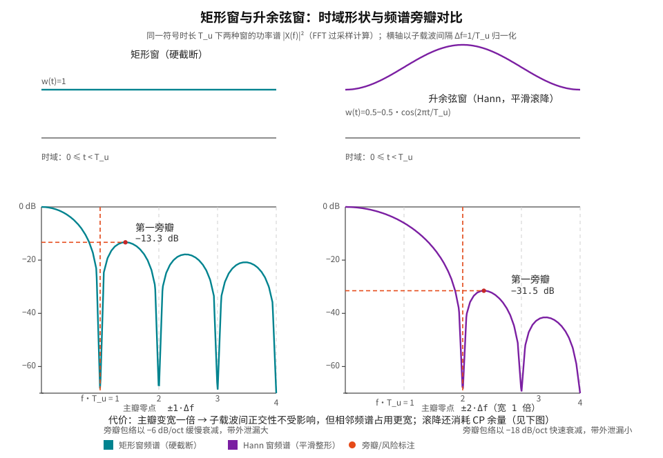
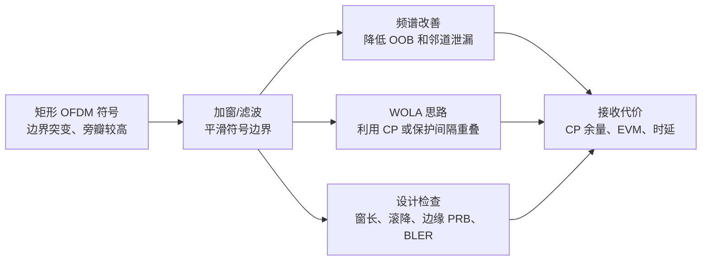
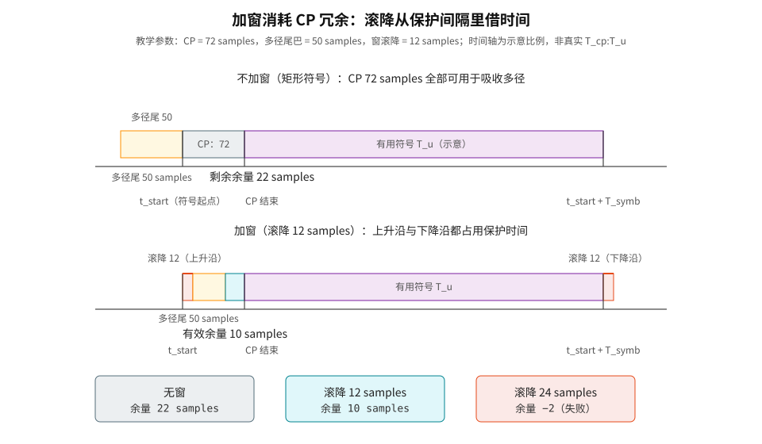
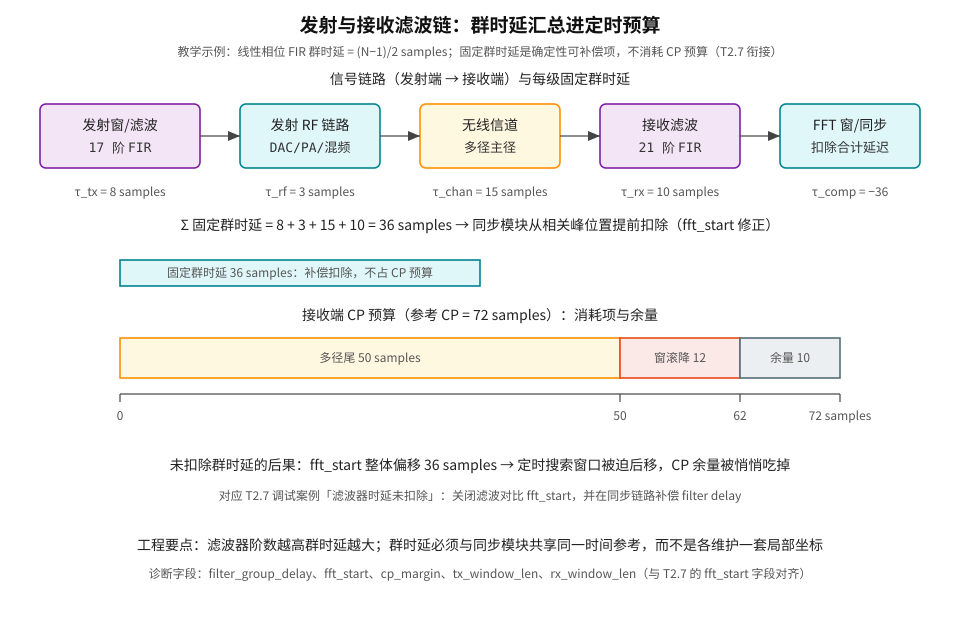

# T2.19 OFDM 窗口函数与滤波：频谱旁瓣、保护间隔与 EVM 折中

## 本节学习目标

理想 OFDM 符号在时域常被建模为"矩形截断"：一个有用符号区间加上 CP，符号边界突然开始、突然结束。矩形窗在频域会产生较高旁瓣，带外泄漏可能影响邻道或相邻 numerology。窗口函数和滤波用于改善频谱，但会引入额外的 EVM、时延和 CP 余量代价。

- 解释矩形窗为什么带来频谱旁瓣，并用手算数值说明第一旁瓣电平。
- 说明窗口、WOLA 和滤波的基本思路。
- 讲清频谱改善与 CP 保护、EVM、时延之间的折中。
- 区分发射端窗口/滤波与接收端 FFT 窗口。
- 明确协议波形定义和实现滤波策略的边界（TS 38.211 未规定窗函数，这是本节的核心协议结论）。
- 能计算线性相位滤波器的群时延，并把固定群时延纳入 [[T2.7_OFDM_timing_synchronization|T2.7]] 的定时预算。

## 前置知识检查

| 问题 | 需要达到的程度 |
|:---|:---|
| OFDM 符号边界是什么？ | 知道 CP + 有用符号构成一个时域 OFDM 符号。 |
| 频谱旁瓣是什么？ | 知道主带外侧仍可能有非零能量。 |
| CP 保护什么？ | 知道 CP 用于吸收多径尾巴并维持 FFT 窗口循环性。 |
| EVM 与 LLR 有何关系？ | 知道星座误差越大，soft demapper 越难给准 LLR。 |

本节的重点不是设计某个最优窗函数，而是建立谱整形和解调质量之间的工程折中。窗口函数能降低旁瓣，但它不能违反 [[T2.7_OFDM_timing_synchronization|T2.7]] 的 FFT 窗口和 CP 保护逻辑。

## 零基础引入：窗函数、卷积与频谱旁瓣

**窗函数（Window Function）**：一句话解释——"给一段信号加窗"，就是在时间上把这段信号"框出来"，并顺带决定它的边界是刀切还是磨边。好比拍证件照：相框框住人脸是"选择区间"，而边框是硬切还是羽化渐变，决定了照片边缘看起来突兀还是柔和。OFDM 里每个符号天然被时间轴"框"成一段有限长度，这个框就是窗；矩形窗（Rectangular Window）是最简单的"硬切框"，升余弦窗（Raised Cosine Window，如 Hann 窗）是"羽化框"。

**卷积（Convolution）**：两个信号"卷积"可以想象成一个函数在另一个函数上滑动、逐点相乘再求和——它回答的问题是"一个系统的记忆效应如何叠加到输入上"。本节只用它的一个结论：**时域相乘 ↔ 频域卷积**（卷积定理）。直觉：把一个信号的频谱"抹开"到另一个信号频谱的每个频率点上，等于把两个频谱彼此摊开再叠加。矩形窗的频谱是 sinc 形状（中间一个主峰、两侧一串小峰），所以"符号乘矩形窗"会把每个子载波原本像针一样细的谱线抹成 sinc 形状——主峰之外的这些"小峰"就是**频谱旁瓣（Spectral Sidelobe）**。

**频谱旁瓣**：主瓣（主峰）两侧的能量尾巴。旁瓣越高、越慢衰减，带外泄漏（Out-of-Band, OOB）越大——能量漏到相邻频带，可能干扰邻道或相邻 numerology 的接收。

**群时延（Group Delay）**（本节的第二个主角，先给直觉）：滤波器会让通过它的信号**整体晚到一个固定时间**，这个"晚到量"随频率基本不变时就是群时延。好比人群过闸机：每个人被闸机耽搁同样的时间，队伍整体平移，但人与人之间的间隔不变。接收端同步时若不知道这个"平移量"，就会把同步点找偏。

本节的整体问题可以概括成一句话：**为了把频域的"能量尾巴"压下去，我们在时域付出了什么代价？** 答案是 CP 余量、EVM 和时延——下面逐项展开。

## 矩形窗的频谱直觉

**本式回答的问题**：发射波形为什么天然带旁瓣？**符号含义**：$x(t)$ 是理想无限长 OFDM 信号（所有子载波持续存在），$w_{\mathrm{rect}}(t)$ 是矩形窗——在符号区间内取 1、区间外取 0，$x_{\mathrm{tx}}(t)$ 是实际发射的有限长符号。**来源**：有限长符号 = 无限长信号被时间轴截断，这是所有 OFDM 系统共有的建模起点。

一个有限长度 OFDM 符号可建模为无限长信号乘以矩形窗：

$$
x_{\mathrm{tx}}(t)=x(t)w_{\mathrm{rect}}(t)
\tag{1}
$$

时域乘法对应频域卷积（卷积定理）。矩形窗的频谱是 sinc 形状，有明显旁瓣。因此即使子载波在有用符号区间内正交，整个发射波形的频谱边缘仍可能有带外泄漏。

窗口函数的直觉是把边界从"硬切"改成"平滑过渡"。边界越平滑，高频分量越少，旁瓣越低。

## 矩形窗频谱的解析结果与第一旁瓣手算

**本式回答的问题**：矩形窗的旁瓣到底有多高？**符号含义**：$T_u$ 是一个有用符号的时长（如 $\mu=0$ 时 $T_u=2048\,T_c$），$\operatorname{sinc}(u)=\sin(\pi u)/(\pi u)$ 是归一化采样函数，$f$ 是频率。**来源**：矩形脉冲 $w_{\mathrm{rect}}(t)=1,\ 0\le t<T_u$ 的傅里叶变换是教科书标准结果，也是 OFDM 每个子载波频谱的解析形式。

$$
X_{\mathrm{rect}}(f)=T_u\cdot\operatorname{sinc}(fT_u)
\tag{2}
$$

主瓣零点在 $fT_u=\pm 1$，即 $\pm 1/T_u$——用子载波间隔 $\Delta f=1/T_u$ 归一化，就是 $\pm 1\,\Delta f$。**手算第一旁瓣峰值**：sinc 的第一个旁瓣峰出现在 $fT_u\approx1.43$ 处：

$$
\operatorname{sinc}(1.43)=\frac{|\sin(1.43\pi)|}{1.43\pi}\approx\frac{0.976}{4.492}\approx0.217
\tag{3}
$$

换算成分贝：$20\log_{10}(0.217)\approx-13.3\ \text{dB}$。也就是说，矩形窗的第一个旁瓣只比主瓣低 13.3 dB——这是一个相当"肥"的能量尾巴。后续旁瓣按 $\sim1/(\pi fT_u)$ 的包络衰减，大约每倍频程降 6 dB（−6 dB/oct），收敛很慢。

## 升余弦窗：把硬切改成磨边

**本式回答的问题**：升余弦窗的"磨边"具体长什么样？**符号含义**：$T_u$ 同上，窗在 $0\le t<T_u$ 内从 0 平滑升到 1 再平滑降回 0（0.5 − 0.5·cos 保证端点为零、中间为 1）。**来源**：这是 Hann 窗的连续时间形式，是 OFDM/WOLA 谱整形最常用的窗族之一。

$$
w_{\mathrm{h}}(t)=0.5-0.5\cos\left(\frac{2\pi t}{T_u}\right),\quad 0\le t<T_u
\tag{4}
$$

它的频谱是主瓣 sinc 与其两侧平移副本的加权叠加；由于三个分量的**相位相互干涉相消**，旁瓣被大幅压低。旁瓣的具体电平不适合手算（涉及复向量叠加），这里给出补零 FFT 的数值结果（1024 点符号、16 倍过采样，与图 1 的曲线同一来源），并与矩形窗并排对比：

| 指标 | 矩形窗 | 升余弦窗（Hann） | 差异 |
|:---|:---|:---|:---|
| 主瓣第一零点 | $\pm 1\,\Delta f$ | $\pm 2\,\Delta f$ | Hann 宽 1 倍 |
| 第一旁瓣峰值 | $-13.3$ dB | $-31.5$ dB | 降低约 18 dB |
| 旁瓣包络衰减 | $\sim-6$ dB/oct | $\sim-18$ dB/oct | Hann 快 3 倍 |
| 带外泄漏 | 高 | 低 | 谱整形的主要收益 |

数值结论：把矩形窗换成升余弦窗，第一旁瓣从 −13.3 dB 压到 −31.5 dB，这正是加窗降低 OOB 的量化依据。代价写在表的第一行：主瓣宽了一倍。好在 OFDM 接收端在整数倍子载波间隔处采样（FFT 的 bin 恰好落在每个子载波的 sinc 零点上，参见 [[T2.1_OFDM_subcarrier_spacing_basics|T2.1]] 的子载波正交性图），主瓣变宽**不破坏子载波间的正交性**；它真正影响的，是相邻频谱占用和后面要讲的 CP 消耗。

## 图 1：矩形窗与升余弦窗的时域形状与频谱对比



图 1 上下两排分别对比两种窗的时域形状与频域功率谱。读图要点：右图（Hann）的"频谱更干净"不是免费的——主瓣零点从 $\pm1\,\Delta f$ 移到 $\pm2\,\Delta f$，且时域曲线在符号两端各有一段滚降（Roll-off）过渡，这段过渡要占时间，见下面的图 2。

## 图示：窗口与滤波的权衡



图示的主线是矩形 OFDM 符号 → 加窗/滤波 → 频谱改善 → 接收代价。下方 WOLA 支路说明通过重叠加窗利用 CP 或保护间隔吸收过渡；设计检查支路提醒必须同时验收窗长、滚降、邻道指标、EVM 和时延。

## WOLA 的基本思想

WOLA（Weighted Overlap and Add，加权重叠相加）把相邻 OFDM 符号边界做平滑过渡。简化理解是：

1. 给每个 OFDM 符号乘一个边缘平滑的窗。
2. 相邻符号在边界处重叠一小段。
3. 重叠段相加后形成连续过渡，降低频谱旁瓣。

用概念四要素收束一下（零基础保护规则要求概念首现给全"是什么/为什么/怎么做/边界"）：

| 要素 | 内容 |
|:---|:---|
| 是什么 | 给每个符号乘平滑窗，并把相邻符号的窗尾与窗头重叠相加，让符号边界连续。 |
| 为什么 | 矩形硬切产生高旁瓣（−13.3 dB 第一旁瓣）；平滑过渡压低旁瓣（Hann 到 −31.5 dB）。 |
| 怎么做 | 发射机在符号头部/尾部的过渡段上做加权 + 重叠相加（重叠区通常借用 CP 或保护间隔）。 |
| 边界 | 重叠/滚降段消耗时间预算：窗长过大 → 有效保护间隔变短 → 多径保护能力下降。窗口设计必须和最大时延扩展、FFT 窗口位置和 numerology 一起看。 |

工程关键是重叠段不能破坏接收端可用的 CP 保护。如果窗长过大，有效保护间隔变短，多径保护能力下降。窗口设计必须和最大时延扩展、FFT 窗口位置和 numerology 一起看。

## 教学例子：窗长消耗 CP 余量

假设一个 OFDM 配置有：

| 参数 | 数值 | 含义 |
|:---|---:|:---|
| $N_{CP}$ | 72 samples | CP 长度（教学示例；真实 NR 常规 CP 长度由 TS 38.211 的 CP 表给出，本地抽取件未含该表数值，量级为每符号 144/160 个 $T_c$ 采样，待核验）。 |
| 最大多径时延 | 50 samples | 信道尾巴长度。 |
| 窗口过渡段 | 12 samples | 发射加窗占用的边界过渡。 |

若不加窗，CP 剩余余量约为：

$$
72-50=22\ \text{samples}
\tag{5}
$$

若加窗过渡段占用 12 个采样，保守理解下有效余量变为：

$$
72-50-12=10\ \text{samples}
\tag{6}
$$

这仍可能工作，但对定时误差、滤波器群时延和信道变化的容忍度明显下降。如果窗长增到 24 samples，余量变成负数：

$$
72-50-24=-2\ \text{samples}
\tag{7}
$$

此时频谱旁瓣可能更好，但多径尾巴已经无法完全被 CP 吸收，接收端 FFT 窗口会出现 ISI/ICI。这个例子说明，窗口函数不能只由频谱指标决定。

## 图 2：加窗消耗 CP 冗余的时间轴对比



图 2 把上面的算式画到时间轴上。注意下排：窗的**上升沿**从符号起点（CP 头部）开始爬升，**下降沿**在有用符号尾部——两段滚降都在"借"保护时间。时间轴是示意比例（真实 $T_{CP}:T_u$ 约为 3.5%:96.5%），但占用逻辑是真实的：滚降不是从 CP 里"额外长出来"的时间，而是从 CP 本来要吸收多径的预算里扣掉的。

## 深入理解：频域边缘和 numerology 共存

窗口/滤波特别影响频带边缘。边缘 PRB 离相邻载波、保护带或另一种 numerology 更近，因此更容易受到谱泄漏和滤波滚降影响。

| 场景 | 风险 | 检查方式 |
|:---|:---|:---|
| 载波边缘 PRB | 滤波滚降造成幅度/相位畸变 | per-PRB EVM、equalized constellation。 |
| 混合 numerology 邻接 | 不同 SCS 子载波边界不完全对齐 | 邻带泄漏、inter-numerology interference。 |
| 窄 BWP | 滤波过渡带占比变大 | BWP 内边缘 RE 的 SINR。 |
| 高阶 QAM | 星座间距小，EVM 容忍度低 | BLER vs EVM 联合曲线。 |

对译码链路而言，最危险的是"平均 EVM 通过，但边缘 PRB LLR 很差"。因此测试报告应按频域位置分桶，而不只给一个全带平均值。

## 协议锚点：TS 38.211 的波形定义与"协议未规定什么"

本节进入协议精读。先给出最重要的结论，再给出证据：**TS 38.211 只定义了理想 OFDM 基带信号的数学形式，没有规定任何窗函数或发射滤波——加窗、滚降、发射/接收滤波器设计全部是发射机实现自由度。协议边界本身就是本节教学内容的核心。**

**锚点 1：TS 38.211 §5.3.1 "OFDM baseband signal generation for all channels except PRACH and RIM-RS"**。本地路径：`3GPP_Rel19/processed/TS_38.211_38211-j30/content.md`（§5.3.1 正文）。抽取件原文（公式符号在抽取中已文本化，此处按标准记法复原）：

> The time-continuous signal $s_l^{(p,\mu)}(t)$ on antenna port $p$ and subcarrier spacing configuration $\mu$ for OFDM symbol $l$ in a subframe is defined by
> $$
> s_l^{(p,\mu)}(t)=\begin{cases}
> s_l^{(p,\mu)}(t), & t_{\mathrm{start},l}^{\mu}\le t<t_{\mathrm{start},l}^{\mu}+T_{\mathrm{symb},l}^{\mu}\\
> 0, & \text{otherwise}
> \end{cases}
> $$
> with
> $$
> s_l^{(p,\mu)}(t)=\sum_{k=0}^{N_{\mathrm{grid},x}^{\mathrm{size},\mu}N_{\mathrm{sc}}^{\mathrm{RB}}-1}a_{k,l}^{(p,\mu)}e^{j2\pi\left(k+k_0^{\mu}-\frac{N_{\mathrm{grid},x}^{\mathrm{size},\mu}N_{\mathrm{sc}}^{\mathrm{RB}}}{2}\right)\Delta f\left(t-N_{\mathrm{CP},l}^{\mu}T_c-t_{\mathrm{start},l}^{\mu}\right)}
> $$
> $$
> T_{\mathrm{symb},l}^{\mu}=\left(N_u^{\mu}+N_{\mathrm{CP},l}^{\mu}\right)T_c
> $$

逐符号解释：

| 符号 | 含义 |
|:---|:---|
| $s_l^{(p,\mu)}(t)$ | 天线端口 $p$、SCS 配置 $\mu$、符号 $l$ 的时域连续基带信号。 |
| $a_{k,l}^{(p,\mu)}$ | 资源网格中资源元素 $(k,l)$ 上的复值调制符号（QAM 调制后、RE 映射后的值）。 |
| $k_0^{\mu}$ | 载波中心对应的子载波索引偏移（把频谱搬移到载波中心的项）。 |
| $N_{\mathrm{grid},x}^{\mathrm{size},\mu}\cdot N_{\mathrm{sc}}^{\mathrm{RB}}$ | 资源网格子载波总数（RB 数 × 每 RB 12 个子载波）。 |
| $\Delta f$ | 子载波间隔（$\Delta f=2^\mu\cdot15$ kHz）。 |
| $N_{\mathrm{CP},l}^{\mu}$ | 符号 $l$ 的循环前缀长度（以 $T_c$ 为单位的采样数）。 |
| $T_c$ | 基本时间单位（§4.1 定义：$\Delta f_{\max}=480$ kHz 相关的时间单位，抽取件 §4.1 文本确认 $\Delta f_{\max}=480\cdot10^3$ Hz）。 |
| $T_{\mathrm{symb},l}^{\mu}$ | 一个 OFDM 符号总时长 = 有用部分 $N_u^{\mu}T_c$ + CP $N_{\mathrm{CP},l}^{\mu}T_c$。 |

**为什么这是本节最重要的协议事实**：公式里有两个值得注意的点。第一，信号被定义为在符号区间 $[t_{\mathrm{start}}, t_{\mathrm{start}}+T_{\mathrm{symb}})$ 内等于子载波求和、**区间之外严格为 0**（"otherwise 0"）——这就是协议级的矩形截断。第二，公式中**没有任何窗函数乘项、没有任何滤波卷积项**。协议的波形理想模型就是"矩形窗 OFDM"，加窗/滤波是发射机在满足射频指标前提下的自行选择。

**锚点 2：TS 38.211 §5.4 "Modulation and upconversion"**。本地路径：`3GPP_Rel19/processed/TS_38.211_38211-j30/content.md`（§5.4 正文，NOTE 紧跟在公式之后）。抽取件原文：

> Modulation and upconversion to the carrier frequency $f_0$ of the complex-valued OFDM baseband signal ... is given by $\mathrm{Re}\{s_l^{(p,\mu)}(t)e^{j2\pi f_0 t}\}$
>
> NOTE: For the uplink, the signal $s_l^{(p,\mu)}(t)$ and the baseband signals part thereof **should be filtered per UE implementation**, as required, to meet the minimum requirements as specified in [14, 38.101-1], [15, 38.101-2], and [16, 38.101-5] for the respective frequency range.

翻译与含义：上变频就是把基带信号乘以 $e^{j2\pi f_0 t}$ 再取实部。而协议用一条 NOTE 明确写出：**上行信号"应当按 UE 实现进行滤波"，目的只是满足 38.101 系列的最低射频要求**——"按 UE 实现"（per UE implementation）就是"实现自由度"的协议原文表述。下行同理（基站侧按 38.104 要求）。

**锚点 3（外部约束）：TS 38.104 §6.6 "Transmitter unwanted emissions"**。本地路径：`3GPP_Rel19/processed/TS_38.104_38104-j50/content.md`（§6.6.1-6.6.3）与 `tables/table_0046.csv`（Table 6.6.3.2-1）。这是基站（BS）侧射频发射的外部约束证据，直接量化"发射机必须做到多干净"：

- §6.6.1：带外发射（out-of-band emissions）要求由 **ACLR**（Adjacent Channel Leakage power Ratio，邻道泄漏功率比）和 **OBUE**（operating band unwanted emissions，工作频带无用发射）两部分共同规定。
- Table 6.6.3.2-1（FR1，抽取件 table_0046.csv）：BS 的 ACLR 限值为 **45 dB**（band n104 为 38 dB），测量滤波器为 Square (BWConfig) 矩形滤波器，邻道中心频偏为 BWChannel 与 2×BWChannel。
- Table 6.6.3.2-1a（FR2 类，table_0047.csv）：ACLR 限值 35 dB（邻道 1×BWChannel）与 40 dB（2×BWChannel）。
- Table 6.6.3.2-2（table_0048.csv）：ACLR 绝对基本限值：Category A Wide Area BS 为 −13 dBm/MHz、Category B −15 dBm/MHz、Medium Range −25 dBm/MHz、Local Area −32 dBm/MHz。
- §6.6.2：占用带宽（occupied bandwidth）要求 $\beta/2=0.5\%$ 功率占比定义，且占用带宽须小于 BS 信道带宽——发射谱不能无限做宽。

UE 侧对应条款为 TS 38.101-1 §6.5.2.4（本地路径：`3GPP_Rel19/processed/TS_38.101_38101-1-j60_s06-06/content.md`）：定义了 NR ACLR（NRACLR）的测量方法（矩形滤波器、邻道功率大于 −50 dBm 时须满足 Table 6.5.2.4.1-2 的限值），以及 UTRA 邻道 33 dB/36 dB（Table 6.5.2.4.2-1 数值可见于抽取件 `tables/table_0418.csv`）；NR ACLR 具体限值表数值在本地抽取件中缺失，标注**待核验**。

**协议强制 vs 实现自由度边界**（本节核心表格）：

| 项目 | 协议强制（必须做） | 实现自由度（自己定） |
|:---|:---|:---|
| 波形定义 | 按 §5.3.1 公式生成理想基带信号；符号区间外信号为零（隐含矩形窗）。 | 窗函数类型、窗长、滚降形状、发射滤波器系数——协议一律未规定。 |
| 上变频 | §5.4 定义的 $\mathrm{Re}\{s_l(t)e^{j2\pi f_0 t}\}$。 | 滤波的实现方式（时域加窗、子带滤波、F-OFDM 等）。 |
| 频谱合规 | 发射机必须满足 38.104（BS）/38.101-1（UE）的 ACLR、OBUE、占用带宽、EVM 等射频指标。 | 为达标采取的具体谱整形手段。 |
| 接收端 | 无任何关于接收窗/接收滤波的条款。 | 接收端 FFT 窗口、接收窗、干扰抑制滤波全属实现自由度；但固定群时延必须进入 [[T2.7_OFDM_timing_synchronization|T2.7]] 的定时预算。 |

**接收端必须做什么**：接收机不需要知道（也无法从协议推断）发射机用了什么窗；它只需要按 §5.3.1 的波形模型做 FFT 解调，并把发射/接收滤波的固定群时延作为已知常数纳入同步坐标。换句话说：**协议对接收端没有新增义务，但发射端的射频合规间接约束了接收端看到的频谱环境**（旁瓣越低，邻道/相邻 numerology 干扰越小）。

## 实现细节：发射滤波和接收窗的分工

发射端加窗/滤波主要服务频谱模板和邻道共存；接收端 FFT 窗口主要服务符号正交性。两者可能配合，但不是同一个变量。

| 项目 | 发射端窗口/滤波 | 接收端 FFT 窗口 |
|:---|:---|:---|
| 控制对象 | 发射波形边界和带外能量 | 送入 FFT 的有用采样区间。 |
| 优化目标 | OOB、ACLR、EVM、PA 友好性 | ISI/ICI 最小、信道估计稳定。 |
| 错误后果 | 频谱泄漏、星座扭曲、时延增加 | 当前符号被相邻符号污染。 |
| 日志字段 | window length、filter taps、roll-off | fft_start、timing_offset、CP margin。 |

把这两个窗口混为一谈，会导致错误修复。例如 BLER 差时盲目缩短接收 FFT 窗口没有意义；若根因是发射滤波边缘失真，应检查 TX waveform 和 EVM。

## 滤波与窗口的区别

| 方法 | 操作位置 | 优点 | 风险 |
|:---|:---|:---|:---|
| 加窗 | 符号边界平滑 | 简单，适合控制旁瓣 | 消耗 CP/保护间隔。 |
| 子带滤波 | 对一段频带做滤波 | 可改善邻带泄漏 | 滤波器时延和边缘 EVM。 |
| F-OFDM/UFMC 类思路 | 按子带或资源块组滤波 | 支持异构 numerology 共存 | 实现复杂，接收机假设变化。 |
| 接收窗 | 接收端选择或加权 FFT 输入 | 抑制部分泄漏/干扰 | 可能改变噪声和正交性。 |

本节不把这些波形变体写成 NR 强制特性。NR 的互操作核心仍是 TS 38.211 定义的物理信道、资源网格和 OFDM 基带信号；具体发射机谱整形策略属于实现约束和射频指标的一部分（见上节协议锚点的边界表）。

## 频谱和解调质量的折中

窗口/滤波有两个方向的收益：

| 收益 | 说明 |
|:---|:---|
| 降低 OOB | 减少带外泄漏，减轻邻道干扰。 |
| 改善共存 | 不同 numerology 或相邻载波之间更容易满足频谱约束。 |

同时也有代价：

| 代价 | 说明 |
|:---|:---|
| 有效 CP 缩短 | 边界重叠或滤波尾巴占用保护区。 |
| EVM 增加 | 滤波不理想会扭曲边缘子载波或符号。 |
| 时延增加 | 滤波器阶数越高，群时延和缓存越大。 |
| 实现复杂 | 需要额外乘法、状态缓存和边界控制。 |

工程设计不能只展示频谱图改善，还要同步展示 EVM、BLER、ACLR/OOB 和时延。

## 对 LLR 的影响

窗口/滤波通过两条路径影响 LLR：

```text
频谱整形过强 -> 星座点偏移/边缘子载波失真 -> LLR 距离计算失真
有效 CP 缩短 -> 多径尾巴进入 FFT 窗口 -> ISI/ICI -> LLR 可靠度下降
```

这也是 T2.19 位于 PAPR 之后、误差到 LLR 之前的原因。发射端波形质量不能只由频谱图判定，它最终要回到接收端 soft demapper 的输入模型。

## 工程检查点

| 检查项 | 应记录的证据 | 失败迹象 |
|:---|:---|:---|
| 窗长/滚降 | window length、roll-off | CP 余量不足或边缘符号污染。 |
| 频谱泄漏 | PSD、OOB、ACLR | 邻道指标不满足。 |
| EVM | 分子载波/分层统计 | 频带边缘 EVM 高。 |
| BLER | window on/off 对比 | 频谱改善但译码性能退化。 |
| 实现代价 | 乘法数、延迟、缓存 | 无法满足实时或功耗。 |

## 扩展讲解：验证与实现关注点

窗口/滤波的验证需要同时覆盖频谱域和解调域。频谱域看 PSD、OOB、ACLR 或邻带泄漏；解调域看 EVM、post-eq SINR、LLR 分布和 BLER。两套指标必须成对出现，因为窗口参数可能让频谱明显改善，却让边缘 PRB 或高阶 QAM 的星座质量变差。

第一类测试是窗长 sweep。固定信道和调制阶数，逐步增加窗口过渡段，记录 OOB 改善和 BLER 损失。预期现象是：小窗长时 OOB 改善有限但 EVM 损失小；窗长增大后 OOB 继续改善，但有效 CP 余量降低，EVM 和 BLER 开始恶化。若曲线没有这个折中形态，要检查窗口是否真的生效，或 EVM 统计是否覆盖了边缘子载波。

第二类测试是多径时延 sweep。固定窗口，逐步增加 TDL 信道的最大时延扩展。若窗口占用了 CP 余量，多径越长，ISI/ICI 越容易出现。这个测试能把"窗口本身造成的星座失真"和"窗口缩短 CP 余量造成的多径污染"区分开。

第三类测试是邻带共存。把相邻 BWP、相邻载波或不同 numerology 放在频谱边缘，观察窗口/滤波是否降低泄漏，同时检查目标链路和邻链路 EVM。真正的谱整形方案不能只保护自己，也要减少对邻道的伤害。

| 测试 | 扫描参数 | 主要观察 |
|:---|:---|:---|
| 窗长 sweep | 过渡段长度 | OOB 改善 vs BLER 损失。 |
| 多径 sweep | 最大时延扩展 | 有效 CP 余量是否不足。 |
| 边缘 PRB | PRB 频域位置 | 滤波滚降造成的局部 EVM。 |
| 邻带共存 | 相邻 numerology/载波间隔 | inter-numerology interference。 |
| 定点滤波 | 系数位宽和内部累加位宽 | 量化噪声和溢出。 |

### 群时延：白话、公式与定时预算（[[T2.7_OFDM_timing_synchronization|T2.7]] 衔接）

滤波器实现还要关注群时延。**白话**：线性相位滤波器会让通过它的信号整体晚到固定时间——群时延就是这个"整体晚到量"。**公式**：长度为 $N$ 抽头的线性相位 FIR 滤波器，群时延为：

$$
\tau_g=\frac{N-1}{2}\ \text{samples}
\tag{8}
$$

**数值例子**：17 阶 FIR（$N=17$）的群时延是 $(17-1)/2=8$ samples；21 阶 FIR 是 10 samples。阶数越高（滚降越陡、旁瓣越低），群时延越大，缓存和延迟也越大——这是"滤波器设计"与"谱整形质量"之间的直接工程换算。

发送端滤波会让波形尾巴变长；接收端滤波会改变采样对齐和噪声颜色。如果仿真里加了滤波但没有同步更新定时对齐，可能把滤波器时延误判成定时错误。工程日志应记录 filter delay compensation，并在 [[T2.7_OFDM_timing_synchronization|T2.7]] 的 `fft_start` 计算中扣除固定群时延。

## 图 3：发射→接收滤波链的群时延与定时预算



图 3 把"群时延进定时预算"画成两条并行的账：**上账**是固定群时延——确定性、可补偿，扣除后不消耗 CP 预算；**下账**是 CP 预算——消耗项只有多径尾和窗滚降。两条账混在一起是常见错误：把"滤波器群时延大"当成"CP 不够用"，或者反过来把定时偏移归咎于信道。

窗口函数还影响噪声假设。接收窗会对采样加权，使 FFT 后噪声不再严格保持各子载波同方差、互不相关的理想 AWGN 模型。多数接收机仍使用近似噪声方差计算 LLR，但在高干扰或强窗口下，需要通过 EVM、SINR 或仿真校准修正可靠度。

## 调试案例库

| 案例 | 表现 | 定位步骤 | 修复方向 |
|:---|:---|:---|:---|
| 窗长过大 | OOB 好但 BLER 差 | sweep 窗长并看 CP margin | 缩短窗或调整重叠区域。 |
| 边缘 PRB 失真 | 频带边缘 EVM 高 | per-PRB EVM heatmap | 调整滤波器过渡带或保护带。 |
| 群时延未补偿 | 同步起点固定偏移 | 关闭滤波对比 fft_start | 在同步链路补偿 filter delay。 |
| 接收窗噪声失配 | LLR 分布异常 | 比较 window on/off 噪声估计 | 修正等效噪声/CSI 缩放。 |

窗口/滤波还要和 numerology 一起验证。15 kHz SCS 的符号长、CP 相对长，对窗口过渡的容忍度可能高一些；60 kHz 或 120 kHz SCS 的符号更短，窗口占比变大，时延和 CP 余量问题更突出。同一套窗参数不能无条件复制到所有 numerology。工程表格应按 $\mu$ 分别列出窗长、CP 余量、EVM 和 OOB。

混合 numerology 场景尤其容易误判。如果两个相邻 BWP 使用不同 SCS，边界处干扰既可能来自矩形窗旁瓣，也可能来自调度保护带不足、滤波器过渡带不足或接收端同步假设不同。正确调试顺序是先固定单 numerology 验证窗口，再加入邻带，最后加入动态调度和不同功率差。

对实现而言，滤波器系数位宽和累加位宽同样重要。一个浮点滤波器可能频谱很好，定点化后却因系数量化产生旁瓣抬升；内部累加位宽不足会造成溢出或隐性饱和。定点验证应比较浮点输出、定点输出、频谱差异和 EVM 差异，而不是只检查系数表被正确加载。

本节的核心工程结论是：窗口/滤波是系统级折中参数，而不是孤立的频谱处理模块。它连接射频频谱、OFDM 正交性、同步余量、信道估计、soft demapper 和最终 BLER。任何文档只写"加窗降低旁瓣"都是不完整的。

## 资料与协议边界

| 资料 | 本节采用 | 边界 |
|:---|:---|:---|
| TS 38.211 §5.3.1 | OFDM 基带信号生成公式：区间外为零的矩形截断、$T_{\mathrm{symb}}=(N_u+N_{CP})T_c$。 | 公式中无窗函数项；协议未规定任何窗函数。 |
| TS 38.211 §5.4 | 上变频 $\mathrm{Re}\{s_l(t)e^{j2\pi f_0 t}\}$ + NOTE：上行"应"按 UE 实现滤波。 | NOTE 是"实现自由度"的协议原文出处。 |
| TS 38.104 §6.6 | ACLR 45 dB（FR1 BS）、OBUE、占用带宽等射频外部约束。 | 只约束发射机输出频谱，不约束接收机。 |
| TS 38.101-1 §6.5.2.4 | UE 侧 NRACLR/UTRAACLR 定义与测量方法。 | NR ACLR 限值表数值本地抽取缺失，待核验。 |
| [[T2.7_OFDM_timing_synchronization|T2.7]] | FFT 窗口和 CP 容差 | 用于解释窗口消耗 CP 余量与群时延进定时预算。 |
| [[T2.18_OFDM_PAPR_power_amplifier|T2.18]] | PAPR 和发射端失真 | 用于说明发射波形质量会影响 LLR。 |
| [[T2.17_OFDM_impairments_to_LLR|T2.17]] | 前端误差到 LLR | 本节的失真链最终在那里收束。 |

TS 38.211 定义 OFDM 基带信号生成和资源映射。协议没有要求接收端必须知道发射机内部的具体加窗或滤波实现；但发射机必须满足频谱、EVM 和互操作要求。接收机若使用额外接收窗或干扰抑制滤波，也属于实现自由度。

## 常见错误

| 错误 | 为什么错 | 正确做法 |
|:---|:---|:---|
| 窗口越长越好 | 过长会消耗 CP 并增加 EVM。 | 用 OOB/EVM/BLER 联合选择窗长。 |
| 只看频谱不看译码 | 频谱改善可能换来 LLR 退化。 | 同时记录 BLER 和 LLR 统计。 |
| 混淆发射窗和 FFT 窗口 | 一个用于谱整形，一个用于接收解调。 | 分别记录 TX window 和 RX FFT start。 |
| 忽略边缘子载波 | 滤波最容易影响频带边缘。 | 分 PRB/子载波统计 EVM 和 SINR。 |
| 把群时延误判成定时错误 | 固定延迟是可补偿常数，不是信道变化。 | 在同步坐标中统一扣除 filter delay。 |

## 最小仿真矩阵

| 维度 | 建议取值 | 覆盖目的 |
|:---|:---|:---|
| 窗长 | 关闭、短窗、中窗、长窗 | 找到 OOB 与 BLER 的折中点。 |
| 窗类型 | 矩形、Hann、滚降升余弦 | 对比旁瓣电平（−13.3 vs −31.5 dB）与主瓣代价。 |
| numerology | $\mu=0,1,2$ | 检查窗长相对 CP 的占比。 |
| 多径 | 短时延、中时延、长时延 | 验证有效 CP 余量。 |
| 频域位置 | 中心 PRB、边缘 PRB | 暴露滤波滚降影响。 |
| 邻带 | 无邻带、同 SCS、异 SCS | 验证共存和泄漏。 |

每个点至少保存 PSD/OOB、EVM heatmap、filter delay compensation、CP margin、LLR histogram 和 BLER。窗口/滤波是跨 RF 和基带的折中，不能只由单一频谱指标验收。

## 自测题

1. 为什么矩形 OFDM 符号会产生频谱旁瓣？
2. 手算矩形窗第一旁瓣电平（提示：sinc 第一旁瓣峰在 $fT_u\approx1.43$）。
3. WOLA 的基本操作是什么？
4. 窗口函数为什么会消耗 CP 余量？
5. 为什么频谱改善不能单独作为通过证据？
6. 17 抽头线性相位 FIR 滤波器的群时延是多少 samples？它如何进入 [[T2.7_OFDM_timing_synchronization|T2.7]] 的定时预算？
7. TS 38.211 §5.3.1 是否规定了窗函数？协议对发射滤波说了什么？
8. 窗口/滤波如何影响 LLR？

## 自测题参考答案

1. 有限长矩形截断在频域对应 sinc 形状，旁瓣较高（第一旁瓣仅 −13.3 dB）。
2. $\operatorname{sinc}(1.43)\approx0.976/4.492\approx0.217$，$20\log_{10}(0.217)\approx-13.3$ dB。
3. 对符号边界乘平滑窗，相邻符号在边界重叠相加，形成平滑过渡。
4. 边界平滑和重叠需要时间区间，可能占用原本用于吸收多径的保护间隔。
5. 因为窗口/滤波可能增加 EVM、缩短有效 CP 或增加时延，最终影响 BLER。
6. $(17-1)/2=8$ samples。群时延是确定性常数，接收端在 `fft_start` 计算中统一扣除（补偿后不消耗 CP 预算）；不扣除则所有符号带固定同步偏移。
7. 未规定。§5.3.1 公式中没有窗函数项（信号在符号区间外严格为零）；§5.4 NOTE 明确上行滤波"应"按 UE 实现进行，以满足 38.101 系列射频指标。发射谱整形是实现自由度，受 38.104/38.101 的 ACLR、OBUE 等射频要求约束。
8. 它会造成星座点失真或 ISI/ICI，soft demapper 的距离和可靠度估计会失配。

## 本节验收

| 验收项 | 通过标准 |
|:---|:---|
| 旁瓣来源 | 能用时域截断和频域卷积解释矩形窗旁瓣，并手算 −13.3 dB。 |
| 窗口机制 | 能说明 WOLA 的重叠加窗思想，能对比矩形窗与升余弦窗的数值（−13.3 vs −31.5 dB，主瓣 ±1 vs ±2 Δf）。 |
| 折中关系 | 能联合解释 OOB、EVM、CP 和时延。 |
| 协议边界 | 能说出 TS 38.211 §5.3.1 未规定窗函数、§5.4 NOTE 把滤波留给 UE 实现，以及 38.104 的 ACLR 约束（45 dB）。 |
| 群时延 | 能算线性相位 FIR 群时延，并说明它在 [[T2.7_OFDM_timing_synchronization|T2.7]] 定时预算中的处理。 |
| LLR 链路 | 能把窗口/滤波失真接到 soft demapper。 |
| 链路图理解 | 能按图示说明窗口/滤波在 OOB、CP、EVM、BLER 之间的折中。 |

## 与相邻章节的衔接

T2.19 连接 [[T2.7_OFDM_timing_synchronization|T2.7]] 和 [[T2.18_OFDM_PAPR_power_amplifier|T2.18]]。它一方面改变发射端符号边界和频谱旁瓣，另一方面可能改变接收端可用 CP 余量和 FFT 对齐预算。学习时要同时分析发射端谱整形和接收端窗口容差，不能把窗口函数只视为频域谱形修饰工具。

它也直接进入 [[T2.17_OFDM_impairments_to_LLR|T2.17]]。窗口/滤波造成的边缘子载波失真、有效 CP 缩短和噪声相关性变化，最终会改变 LLR 的幅度和可信度。若只在 RF 指标中记录 OOB，通过译码链路时就缺少解释 BLER 变化的证据。

工程验收时，窗口/滤波至少要同时给出频谱图和解调图。频谱图显示 OOB 或 ACLR，解调图显示 EVM heatmap、post-eq SINR 和 LLR 分布。若两类图只保留其中之一，就无法判断谱整形是否值得。尤其在混合 numerology 或窄 BWP 场景中，边缘 PRB 的局部质量比全带平均值更关键。

实现记录还要写明延迟补偿。滤波器群时延若没有进入同步坐标，[[T2.7_OFDM_timing_synchronization|T2.7]] 的 FFT 起点会带固定偏差；若滤波器尾巴超过保护区，[[T2.1_OFDM_subcarrier_spacing_basics|T2.1]] 的 CP 假设会被破坏。窗口/滤波模块应和同步模块共享同一时间参考，而不是各自维护一套局部坐标。

报告中还要明确窗口作用方向：是只在发射端加窗、只在接收端加窗，还是两端都有处理。不同位置会改变不同的噪声和干扰模型。接收端加窗尤其要说明 FFT 后噪声方差如何估计，否则 soft demapper 的 LLR 缩放会缺少依据。

日志字段建议固定为：`tx_window_len`、`rx_window_len`、`filter_group_delay`、`cp_margin`、`edge_prb_evm`、`oob_power`、`llr_hist_edge`。这些字段能把频谱改善、同步余量和 LLR 质量放在同一张调试表里。若这些字段缺失，窗口参数变更后的 BLER 差异很难复现。

对于接收端实现，窗口/滤波还会改变噪声颜色。FFT 前白噪声经过窗函数或滤波器后，各子载波噪声方差可能不再完全相同，边缘子载波尤其明显。因此均衡器和 soft demapper 不能只沿用理想矩形窗下的单一噪声标量，至少要在仿真中确认 per-PRB SINR 或 LLR 统计没有系统性偏差。

对于发射端实现，窗口参数也应进入版本化配置。频谱口径、EVM 口径和调度口径往往由不同团队观察；如果窗长、滚降形状和滤波器版本没有随测试向量一起固化，后续很难解释"频谱变好但 BLER 变差"的回归来源。

## 执行与证据记录

| 项目 | 记录 |
|:---|:---|
| 本地材料 | 使用 `rg`/`python3` 核对 TS 38.211 §5.3.1（`3GPP_Rel19/processed/TS_38.211_38211-j30/content.md`）、§5.4（同文件）、§4.1（同文件）、TS 38.104 §6.6（`3GPP_Rel19/processed/TS_38.104_38104-j50/content.md` 与 `tables/table_0046.csv`、`table_0047.csv`、`table_0048.csv`）、TS 38.101-1 §6.5.2.4（`3GPP_Rel19/processed/TS_38.101_38101-1-j60_s06-06/content.md`、`tables/table_0418.csv`）。 |
| 图解材料 | 本节新增三张手绘 SVG：`assets/T2.19_windowing_spectrum_compare.svg`（频谱对比，FFT 过采样数值）、`assets/T2.19_windowing_cp_overhead.svg`（CP 消耗时间轴）、`assets/T2.19_tx_rx_filter_group_delay.svg`（群时延与定时预算）。均已通过 Y 坐标扫描（行间距 ≥8px）、PIL bbox 审计与 `cairosvg -s 1.5` 渲染验证。 |
| 图解边界 | 图示只表达窗口/滤波折中，不声明 NR 必须采用某一种谱整形实现；图 2 时间轴为示意比例。 |
| 证据边界 | 协议条款均从本地抽取件核对：§5.3.1 公式"otherwise 0"与无窗函数项、§5.4 NOTE"filtered per UE implementation"、38.104 ACLR 45 dB 等。NR 常规 CP 长度表数值与 38.101-1 NR ACLR 限值表数值本地抽取件缺失，正文已标注待核验。 |

## 参考文献

- [3GPP, 2026] 3GPP TS 38.211, Rel-19, `38211-j30`, Physical channels and modulation, §4.1, §5.3.1, §5.4. Local path: `3GPP_Rel19/processed/TS_38.211_38211-j30`.
- [3GPP, 2026] 3GPP TS 38.104, Rel-19, `38104-j50`, Base Station (BS) radio transmission and reception, §6.6.1, §6.6.2, §6.6.3.2. Local path: `3GPP_Rel19/processed/TS_38.104_38104-j50`.
- [3GPP, 2026] 3GPP TS 38.101-1, Rel-19, `38101-1-j60`, UE radio transmission and reception; Part 1: Range 1 Standalone, §6.5.2.4. Local path: `3GPP_Rel19/processed/TS_38.101_38101-1-j60_s06-06`.
- [概念笔记] 无本地 windowing/filtering 概念笔记（已用 `rg` 检索 `docs/concepts/` 确认），本文档承担该主题的概念四要素教学。
