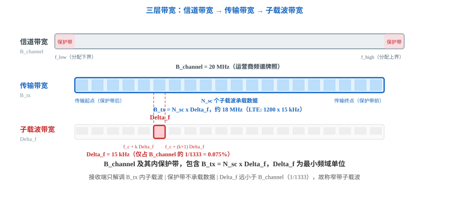
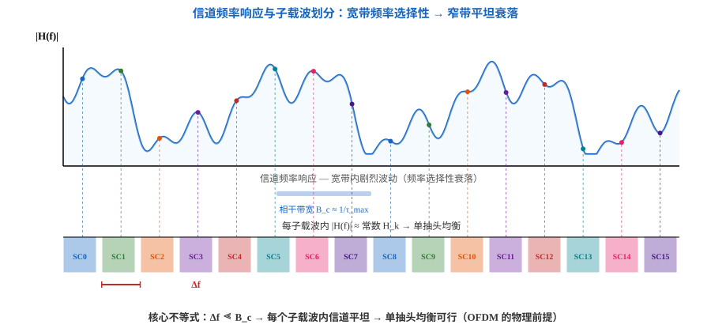
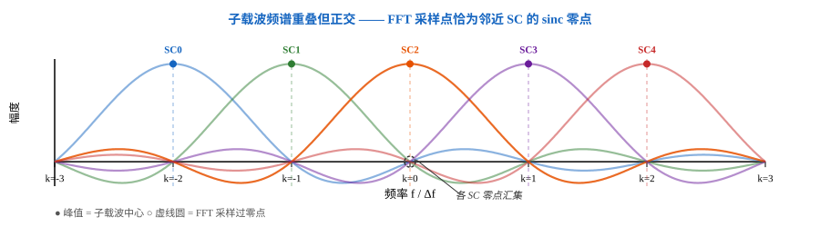
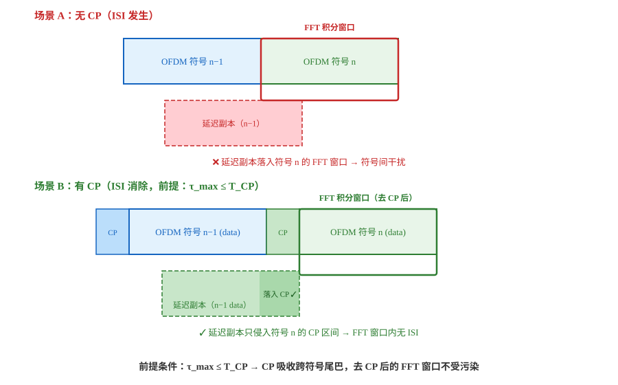

# T2.1 OFDM 机制基础：子载波正交性、循环前缀与 IFFT/FFT 实现
## 本节学习目标

[[T2.0_OFDM_system_overview|T2.0]] 已经建立了 OFDM 收发机全景：bit 经调制、资源映射、IFFT、CP 和无线信道到达接收端，再经过同步、FFT、信道估计、均衡和软解调变成 LLR。本节从那张系统图里抽出三个最核心的机制，回答 OFDM 为什么能成立：子载波为什么能重叠而不互相干扰、CP 为什么能保护 FFT 窗口、IFFT/FFT 为什么能把频域资源网格变成时域波形再还原回来。

这里先区分三个容易混在一起的概念：

| 术语 | 英文 | 先这样理解 |
|:---|:---|:---|
| 子载波 | subcarrier | 基带频域上的一个等间隔格点，每个子载波独立承载一个调制符号。 |
| 载波 | carrier | 射频中心频率 $f_c$，是天线实际发射的高频正弦波。 |
| 调制符号 | modulation symbol | 星座图上的一个复数点（BPSK $\pm 1$、QPSK $\pm 1 \pm j$），承载 $Q_m$ 个比特。 |

完整 OFDM 工程问题地图见 [[T2.0_OFDM_system_overview|T2.0]]；本节不是完整系统课程，也不是 3GPP 协议逐项规定的物理信道实现。它只讲译码链路必须理解的三个核心机制：

- 解释多载波传输为什么比单载波更适合频率选择性衰落信道。
- 从两个子载波基带信号的内积出发，推导子载波正交条件 $\Delta f = 1/T_u$。
- 说明循环前缀如何同时消除符号间干扰和子载波间干扰。
- 理解 OFDM 调制解调的 IFFT/FFT 实现框架及其复杂度优势。
- 严格区分"载波"（射频）与"子载波"（基带）、"OFDM 符号"（时域）与"调制符号"（频域）。
- 用 Python 生成一个简单的 OFDM 符号并通过 FFT 验证子载波正交性。

## 前置知识检查

| 问题 | 需要达到的程度 |
|:---|:---|
| 复数与欧拉公式 $e^{j\theta} = \cos\theta + j\sin\theta$ 是什么？ | 能理解复指数函数在频域分析中的角色。 |
| 傅里叶变换的直觉是什么？ | "时域波形可分解为若干频率分量的叠加"，无需严谨推导。 |
| I/Q 分量是什么？ | 知道复数符号 $y = y_I + j y_Q$，实部对应 I 路，虚部对应 Q 路。 |
| 多径传播是什么？ | 知道无线信号经反射/散射后以多个副本到达接收端。 |

如果傅里叶变换还不熟，本节只需要抓住一点：IFFT 把频域的"每个子载波上放什么符号"变成时域的"发射波形"，FFT 把收到的时域波形变回频域的"每个子载波上收到了什么符号"。这是后续 [[T2.9_AWGN_noise_scaling|T2.9]]、[[T2.13_BPSK_QPSK_soft_demapping|T2.13]]–[[T2.16_LLR_clipping_scaling_quantization|T2.16]] 所有软解调推导的前提。

如果还没有建立 OFDM 发射端、接收端和工程误差链的整体图，先读 [[T2.0_OFDM_system_overview|T2.0]]；本节默认读者已经知道 OFDM 收发链路的模块顺序。

## 单载波的困境与多载波的直觉

在讲 OFDM 之前，先理解它要解决什么问题。

无线信道不是对所有频率同等对待的。**频率选择性衰落**的意思是：在同一个时刻，信号的某些频率分量被严重衰减，另一些频率分量则几乎不受影响。想象你在房间里放音乐——某些音高（频率）因为房间回声而显著减弱，另一些音高反而被增强。无线传播也类似：多径反射的相位叠加造成不同频率的增益不同。

如果用单载波传输——把一个宽带信号调制到载波上，占满整个带宽——接收端需要用均衡器补偿整个带宽上的频率响应。均衡器本质上是一个逆滤波器：信道在某频率处有深衰落（很高的衰减），均衡器就要在那个频率处放大。这带来两个问题：

| 问题 | 原因 | 工程后果 |
|:---|:---|:---|
| 复杂度随带宽增长 | 带宽越宽，均衡器需要补偿的频率点越多，滤波器的抽头数线性或超线性增长。 | 宽带单载波的均衡器实现成本可能高到不可接受。 |
| 噪声增强 | 深衰落处放大信号的同时也放大了噪声——信号被衰减了 20 dB，均衡器就要放大 100 倍，噪声也跟着放大 100 倍。 | 均衡后信噪比恶化，译码器收到的软信息被污染。 |

多载波传输换了一种思路：把宽带信道在频域上切成 $N$ 个很窄的并行子信道。每个子信道带宽足够窄（比如 15 kHz），窄到在这个子信道内部，信道响应几乎是常数——这叫**平坦衰落**。平坦衰落不需要复杂的均衡器，只需要把接收符号除以这一个复常数——单抽头均衡。

这就是 OFDM 的核心直觉：**用 N 个简单的窄带子信道，替代一个复杂的宽带均衡器**。


图 1 以并排流程对比了两种方案的核心差异。左列单载波在深衰落处均衡放大噪声，右列 OFDM 将深衰落限制在个别子载波内，仅需降低对应子载波的置信度即可。

## 带宽、频域与信道：窄子载波的收益依据

前面反复出现"带宽""频域""子载波间隔"——这三个词在 OFDM 语境下各指什么，是理解后续所有参数设计的前提。

### 三层带宽

| 术语 | 符号 | 含义 | 举例（LTE 20 MHz） |
|:---|:---:|:---|:---|
| 信道带宽 | $B_{channel}$ | 运营商分配的一段频谱，含保护带 | 20 MHz |
| 传输带宽 | $B_{tx}$ | 实际承载数据的频率范围，$= N_{sc} \cdot \Delta f$ | ~18 MHz（1200 × 15 kHz） |
| 子载波带宽 | $\Delta f$ | 单个子载波的频域宽度。15 kHz 听起来不小，但在 20 MHz 信道中仅占 0.075%——$\Delta f / B_{channel} = 1/1333$。**"窄"是相对信道整体而言的**，并非绝对值小。 | 15 kHz |

T2.1 关注的是 $\Delta f$ 和总传输带宽与信道特性之间的关系。具体信道带宽数值由频谱分配决定（[[T2.3_NR_frequency_resource_grid|T2.3]] 展开）。



图 2 以 LTE 20 MHz 为例展示三层关系：最外层 20 MHz 是运营商分配的信道带宽（两侧各约 1 MHz 保护带），内部 ~18 MHz 是实际传输带宽（1200 个子载波 × 15 kHz），最底层是单个子载波的带宽 Δf = 15 kHz。

### 相干带宽：信道"平坦"的尺度

无线多径信道对不同频率的衰落不同——但相邻频率的衰落倾向于相似。**相干带宽**（Coherence Bandwidth, $B_c$）是信道频率响应保持近似平坦的最大频率间隔。它与最大多径时延扩展 $\tau_{max}$ 成反比：

$$
B_c \approx \frac{1}{\tau_{max}}
$$

典型宏蜂窝 $\tau_{max} \approx 1\text{--}5$ μs，$B_c \approx 200\text{--}1000$ kHz。

### 核心不等式：$\Delta f \ll B_c$

OFDM 的设计目标是让每个子载波的带宽远小于相干带宽。当 $\Delta f \ll B_c$ 成立时，单个子载波内部信道近似为常数（平坦衰落），均衡退化为单抽头复数乘法——除以 $H_k$ 即可。

LTE 选择 $\Delta f = 15$ kHz，远小于典型室外 $B_c \approx 200$ kHz，因此每个子载波满足平坦衰落条件。反之如果 $\Delta f > B_c$，子载波内部就会经历频率选择性衰落——正交性破坏，单抽头均衡失效。



图 3 上部的波动曲线是信道频率响应 $|H(f)|$——从 $f_0$ 到 $f_0+B$ 剧烈起伏。下部是 N 个子载波在频域上的位置（彩色条块），每个宽度 $\Delta f$。单个子载波内部的 $|H(f)|$ 变化极小——接收端只需乘一个复增益 $H_k$ 即可恢复符号。而单载波方案面对的是整条曲线，需要高复杂度均衡器来"抹平"全频带的起伏。

### 带宽-符号时长-子载波数的三角关系

FFT 点数 N 将三个量绑在一起：

$$
B_{tx} = N \cdot \Delta f = \frac{N}{T_u}
$$

- $\Delta f$ 由 $B_c$ 约束（必须足够小）→ $T_u = 1/\Delta f$ 足够长
- N 越大 → 总带宽越大，但 FFT 复杂度 $O(N \log N)$ 越高
- $T_u$ 越长 → 对多普勒（移动速度）越敏感

这就是 [[T2.2_NR_numerology_time_domain_hierarchy|T2.2]] 引入多套 Numerology 的根本原因——不同场景需要不同的 $\Delta f$ / $T_u$ / N 折中。

## 子载波正交性的数学推导

OFDM 把 N 个子载波紧密排在一起，每个子载波的中心频率是等间隔的。第 $k$ 个子载波的中心频率可以写成：

$$
f_k = k \cdot \Delta f
\tag{1}
$$

其中 $\Delta f$ 是子载波间隔。接收端怎么分辨哪个信号来自哪个子载波？靠的是正交性。

设第 $k$ 个子载波在第 $m$ 个符号周期内承载的调制符号为 $d_k$。在一个有用符号时长 $T_u$ 内，第 $k$ 个子载波的基带信号是 $d_k \cdot e^{j 2\pi f_k t}$（$0 \leq t < T_u$）。

接收端要提取第 $m$ 个子载波上的符号，就把它乘以 $e^{-j 2\pi f_m t}$ 然后在 $T_u$ 内积分——FFT 所做的就是这个操作。看看第 $k$ 个子载波会对第 $m$ 个子载波产生多少干扰，即两个不同频率的复指数函数的内积：

$$
\int_0^{T_u} e^{j2\pi f_k t} \cdot e^{-j2\pi f_m t} \, dt
= \int_0^{T_u} e^{j2\pi (k - m) \Delta f \, t} \, dt
\tag{2}
$$

当 $k = m$ 时（同一个子载波），被积函数恒为 1，积分值就是 $T_u$——收到的是自己的信号。

当 $k \neq m$ 时（不同的子载波）：

$$
\int_0^{T_u} e^{j2\pi (k - m) \Delta f \, t} \, dt
= \left[ \frac{e^{j2\pi (k - m) \Delta f \, t}}{j2\pi (k - m) \Delta f} \right]_0^{T_u}
= \frac{e^{j2\pi (k - m) \Delta f T_u} - 1}{j2\pi (k - m) \Delta f}
\tag{3}
$$

分子为零的充要条件是 $e^{j2\pi (k - m) \Delta f T_u} = 1$，也就是指数部分的相位必须是 $2\pi$ 的整数倍：

$$
j2\pi (k - m) \Delta f T_u = j2\pi \cdot n \quad (n \text{ 为整数})
\tag{4}
$$

化简得到 $\Delta f \cdot T_u = n$。最小的正整数解就是 $n = 1$，即**子载波正交条件**：

$$
\Delta f = \frac{1}{T_u}
\tag{5}
$$

这个条件的物理直觉：子载波间隔恰好等于有用符号时长的倒数。在一个 $T_u$ 长的积分窗口内，任意两个不同子载波的基带信号完成整数倍的周期差，积分结果精确为零——无子载波间干扰。

### 频域视角：sinc 函数的零点排列

式 (3) 是时域积分。换到频域看会更直观。

一个持续时间为 $T_u$ 的复指数信号片段，在频域上是一个 sinc 函数（$\sin(\pi f T_u)/(\pi f T_u)$）。每个子载波的频谱是中心频率不同、但形状相同的 sinc 函数。sinc 函数的零点在 $f = \pm 1/T_u, \pm 2/T_u, \dots$ 处。因为 $\Delta f = 1/T_u$，每个子载波的频谱峰值恰好落在所有其他子载波频谱的零点上。



图 4 用 5 个子载波展示了正交性的频域形态。每个子载波的 sinc 频谱（彩色曲线）峰值精确位于自身中心频率处（彩色圆点），零点精确位于相邻子载波的中心频率处（虚线圆圈）。FFT 在各子载波中心频率处采样——相邻子载波在这些采样点上的值恰为零，子载波间干扰为零。

理解这一点有助于区分 OFDM 和传统的频分复用（FDM）。FDM 靠频率滤波器把不同子信道的频谱隔开——各子载波的频谱不重叠，中间需要保护频带。OFDM 的子载波频谱是重叠的，靠的是数学正交性（积分精确为零）来分离，不需要保护频带，频谱效率更高。

## 循环前缀：用一小段冗余消除两重干扰

正交性保证了子载波在理想信道下互不干扰。但真实无线信道有多径：信号经不同路径以不同时延到达接收端。

多径带来两种干扰：

| 干扰类型 | 英文 | 产生机制 |
|:---|:---|:---|
| 符号间干扰 | Inter-Symbol Interference (ISI) | 前一个 OFDM 符号的延迟副本落入当前符号的 FFT 积分窗口，污染当前符号的采样值。 |
| 子载波间干扰 | Inter-Carrier Interference (ICI) | 多径使信道从循环卷积退化为线性卷积，子载波之间不再正交——FFT 后每个子载波的输出里混入了其他子载波的分量。 |

循环前缀（Cyclic Prefix, CP）同时解决这两个问题。机制很直接：把每个 OFDM 符号末尾的 $T_{CP}$ 时长复制到符号前端作为保护间隔。CP 不是新数据——它是同一符号末尾数据的副本，开销比例为 $T_{CP} / (T_u + T_{CP})$，不承载新信息。

CP 消除两类干扰的机制：

1. **消除 ISI**：只要最大多径时延扩展 $\tau_{max} \leq T_{CP}$，前一个符号的延迟副本确实会侵入当前完整 OFDM 符号的开头，但这段开头正是 CP 区间。接收端丢弃 CP 后再取 $T_u$ 长度的 FFT 积分窗口，前一个符号的残余不会进入 FFT 输入。

2. **消除 ICI（维持正交性）**：这是 CP 更精妙的作用。线性卷积信道 + CP = 循环卷积。循环卷积在频域的等价变换是子载波级单复增益——FFT 后每个子载波的输出为 $d_k \cdot H_k + n_k$，其中 $H_k$ 是该子载波所在频率处的信道频率响应。均衡只需除以 $H_k$（单抽头），无需矩阵求逆或复杂滤波。

CP 的代价是明确的：不承载新数据，功率和频谱效率都打折扣。CP 长度需要在"多径保护能力"和"开销"之间折中——[[T2.2_NR_numerology_time_domain_hierarchy|T2.2]] 展开不同 Numerology 下的 CP 长度选择。



图 5 将两个相邻 OFDM 符号的传输并排展示。场景 A 中没有 CP，接收端只能从符号 n 的起点开始取 FFT 积分窗口，前一符号的延迟副本直接落入这个窗口，形成 ISI。场景 B 中加了 CP，前一符号的延迟副本仍然侵入了符号 n 的完整接收时间段，但在 $\tau_{max} \leq T_{CP}$ 时，它只侵入符号 n 的 CP 区间。接收端先丢弃 CP，再对后面的 $T_u$ 区间做 FFT，因此 FFT 输入中没有前一符号的残留。

## OFDM 的 IFFT/FFT 实现

前面讲的是连续时间模型。基带 OFDM 发送信号的一般形式为：

$$
s(t) = \sum_{k=0}^{N-1} d_k \cdot e^{j2\pi k\Delta f t}, \quad 0 \leq t < T_u
\tag{6}
$$

直接按这个公式生成发射信号需要 N 个独立振荡器——不现实。

关键的工程观察是：如果对 $s(t)$ 以采样率 $f_s = N \cdot \Delta f$ 在时刻 $t_n = n/(N \cdot \Delta f)$（$n = 0, 1, \dots, N-1$）采样：

$$
s[n] = s\left(\frac{n}{N \cdot \Delta f}\right)
= \sum_{k=0}^{N-1} d_k \cdot e^{j2\pi k \Delta f \cdot \frac{n}{N \cdot \Delta f}}
= \sum_{k=0}^{N-1} d_k \cdot e^{j2\pi kn / N}
\tag{7}
$$

这正是 IDFT 的定义。通常加一个 $1/N$ 归一化因子：

$$
s[n] = \frac{1}{N} \sum_{k=0}^{N-1} d_k \cdot e^{j2\pi kn / N}, \quad n = 0, 1, \dots, N-1
\tag{8}
$$

接收端去除 CP 后的 N 个采样点做 DFT：

$$
\hat{d}_k = \sum_{n=0}^{N-1} r[n] \cdot e^{-j2\pi kn / N}, \quad k = 0, 1, \dots, N-1
\tag{9}
$$

其中 $r[n]$ 是去除 CP 后的接收采样序列。

IFFT 和 FFT 分别是 IDFT 和 DFT 的快速算法实现。这是 OFDM 能实际工程化的核心原因：

| 实现方式 | 复乘次数（N=1024） | 实际可行性 |
|:---|:---:|:---|
| 直接 DFT/IDFT | $N^2 = 1{,}048{,}576$ | 实时处理不现实 |
| FFT/IFFT | $\frac{N}{2} \log_2 N = 5{,}120$ | 约 200 倍加速，实时可行 |


图 6 给出了完整的 OFDM 调制解调链路。关键路径：频域调制符号 $\to$ IFFT $\to$ 时域采样 $\to$ +CP $\to$ 信道 $\to$ −CP $\to$ FFT $\to$ 频域接收符号。这是后续 [[T2.6_from_resource_grid_to_decoder_LLR|T2.6]]（端到端数据流）和 [[T2.9_AWGN_noise_scaling|T2.9]]、[[T2.13_BPSK_QPSK_soft_demapping|T2.13]]–[[T2.16_LLR_clipping_scaling_quantization|T2.16]]（软解调）共同依赖的信号处理框架。

## "载波"与"子载波"、"OFDM 符号"与"调制符号"的严格区分

OFDM 相关的术语中有两对概念极易混淆。**这是译码链路理解中最容易出错的术语陷阱之一**，分别澄清。

### 载波（carrier）vs 子载波（subcarrier）

| 概念 | 域 | 定义 | 典型数值 |
|:---|:---|:---|:---|
| 载波 | 射频 | 无线传输的中心频率，发射机将基带信号上变频到 $f_c$ 后通过天线辐射。 | LTE Band 3 下行 1842.5 MHz |
| 子载波 | 基带 | 基带 OFDM 信号在频域上的 $N$ 个等间隔格点，第 $k$ 个子载波的基带频率为 $k \cdot \Delta f$。 | $k \times 15$ kHz（LTE） |

打个比方：载波是一条高速公路的位置，子载波是路上的 N 条车道。射频关心高速公路在哪（$f_c$），基带关心车道怎么分（$k \cdot \Delta f$）。

### OFDM 符号（OFDM symbol）vs 调制符号（modulation symbol）

这两个概念共享同一个英文词汇 "symbol"，但含义完全不同。

| 概念 | 域 | 定义 | 时长/粒度 |
|:---|:---|:---|:---|
| OFDM 符号 | 时域 | 一个 CP + N 点 IFFT 输出的时间片段 | 时长 $T_{symbol} = T_u + T_{CP}$ |
| 调制符号 | 频域 | 星座图上的一个复数点（BPSK=$\pm 1$，QPSK=$\pm 1 \pm j$，16QAM=16 格点之一） | 承载 $Q_m$ 个比特 |

两者的关系是：在一个 OFDM 符号周期内，N 个子载波各承载一个调制符号——N 个调制符号经 IFFT 并行变换为一个 OFDM 符号。在后续 [[T2.6_from_resource_grid_to_decoder_LLR|T2.6]]（端到端数据流）和 [[T3.2_transport_code_block_filler_bits|T3.2]]（码块分段）中，"调制符号"指的是 constellation symbol 放到 RE 上，不是 OFDM symbol 的传输。

## Python 校验片段

下面用 Python 生成一个简单的 OFDM 符号并验证子载波正交性。这里使用直接 DFT/IDFT 实现而非 `numpy.fft`——教学目的：展示式 (8) 和式 (9) 的逐字代码，让推导和代码可以直接对照。

```python
import math
import cmath


def generate_ofdm_symbol(mod_symbols: list[complex], n_fft: int, cp_len: int) -> list[complex]:
    """生成一个含 CP 的 OFDM 符号时域采样序列。

    @param mod_symbols  每个子载波上的调制符号（频域），长度 = n_fft
    @param n_fft        IFFT 点数
    @param cp_len       CP 采样点数
    @return             时域采样序列（含 CP），长度 = n_fft + cp_len
    """
    # 直接 IDFT（教学实现，非 FFT）
    time_samples = []
    for n in range(n_fft):
        sample = 0j
        for k, d in enumerate(mod_symbols):
            sample += d * cmath.exp(1j * 2 * math.pi * k * n / n_fft)
        time_samples.append(sample / n_fft)

    # 插入 CP：复制末尾 cp_len 个采样放到前端
    cp = time_samples[-cp_len:]
    return cp + time_samples


def demodulate_ofdm(rx_samples: list[complex], n_fft: int, cp_len: int) -> list[complex]:
    """去除 CP 后做 DFT 解调，返回各子载波上的接收符号。

    @param rx_samples  接收端时域采样（含 CP）
    @param n_fft       FFT 点数
    @param cp_len      CP 采样点数
    @return            各子载波的解调符号（频域），长度 = n_fft
    """
    signal = rx_samples[cp_len:]  # 去 CP
    symbols = []
    for k in range(n_fft):
        s = 0j
        for n, r in enumerate(signal):
            s += r * cmath.exp(-1j * 2 * math.pi * k * n / n_fft)
        symbols.append(s)
    return symbols


# 参数设置
N = 8         # FFT 点数（教学用小点数，便于手算验证）
CP = 2        # CP 长度
# 子载波 0–3 上各放一个非零调制符号，其余置零
mod = [1+0j, -1+0j, 1j, -1j] + [0j] * (N - 4)

# 发送端
tx = generate_ofdm_symbol(mod, N, CP)

# 理想无噪声信道：接收 = 发送
rx = tx[:]

# 接收端解调
demod = demodulate_ofdm(rx, N, CP)

# 打印子载波 0–4 上的解调结果
for k in range(min(5, N)):
    print(f"k={k}: sent={mod[k]:.1f}, rx={demod[k].real:.4f}{demod[k].imag:+.4f}j")

# 验证正交性：子载波 4–7 上没放任何符号，解调后应该接近 0
leakage = sum(abs(demod[k]) for k in range(4, N))
print(f"Leakage (sum |rx| on k=4–7): {leakage:.6f}")
```

期望输出（浮点精度下各次运行应一致，因为无噪声）：

```text
k=0: sent=(1+0j), rx=1.0000+0.0000j
k=1: sent=(-1+0j), rx=-1.0000+0.0000j
k=2: sent=0+1j, rx=0.0000+1.0000j
k=3: sent=-0-1j, rx=-0.0000-1.0000j
k=4: sent=0j, rx=0.0000+0.0000j
Leakage (sum |rx| on k=4–7): 0.000000
```

这个实验验证了三件事：在无噪声信道下，IFFT → +CP → −CP → FFT 链路能完美恢复调制符号；空闲子载波上的能量泄漏为零（子载波正交性在无噪声时是精确零，不是"近似零"）；CP 长度不影响解调结果（CP 被正确丢弃，且无噪声时无 ISI 需要防护）。

注意：这个教学实现输入不按 bit-reversed 顺序重排，不受实际 FFT 工程限制。实际工程中用 `numpy.fft.ifft` 和 `numpy.fft.fft` 替代，并需注意 FFT 输入输出的归一化因子约定与式 (8)(9) 一致。

## 和 3GPP 协议的关系

OFDM 不是 3GPP 发明的——它的理论基础（子载波正交性、CP、IFFT/FFT 实现）远早于蜂窝通信。3GPP 做的事情是选择具体的参数：NR 的 N（IFFT 大小）、$\Delta f$（SCS 取值）、CP 长度和 CP 类型（普通/扩展），以及物理信道到资源网格的映射规则。

本节的教学推导使用通用的 $\Delta f$ 和 $T_u$，不从任何 3GPP 表格取值。子载波正交条件 $\Delta f = 1/T_u$ 是数学恒等式，不是协议规定。LTE 和 NR 分别在此基础上选择 $\Delta f = 15$ kHz（LTE 固定）和 $\Delta f = 15 \cdot 2^\mu$ kHz（NR 可变 μ）作为它们的参数集。

需要分清两件事：

- 协议规定了具体的 SCS 取值、CP 长度、物理信道到资源网格的映射规则。
- 子载波正交性、CP 消除 ICI 的机制、IFFT/FFT 的实现原理不是协议规定——它们是协议参数选择的数学基础。

本地 Rel-19 资料入口如下：

| 系统 | 协议依据 | 本地路径 | 本节采用程度 |
|:---|:---|:---|:---|
| NR | TS 38.211 Rel-19 `38211-j30` §4.2 OFDM baseband signal generation | `3GPP_Rel19/processed/TS_38.211_38211-j30/sections.jsonl`，`content.md` | 已定位 NR 下行 OFDM 基带信号生成公式入口；本节用通用 IFFT/FFT 公式解读其数学结构，不复现协议具体参数。 |
| LTE | TS 36.211 Rel-19 `36211-j30_s06-s08` §6 OFDM baseband signal generation | `3GPP_Rel19/processed/TS_36.211_36211-j30_s06-s08/sections.jsonl`，`content.md` | 已定位 LTE 下行 OFDM 基带信号生成入口（Δf = 15 kHz 固定）；本节不展开其具体参数。 |
| 参考书 | 《5G移动通信系统设计与标准详解》§4.2 (P73–78) | `references/` | 参考 CP-OFDM 选为 NR 下行波形的技术理由；本节不逐项复现其参数表。 |

这里没有逐项核验原始 Word、表格 HTML 或公式 XML，因此本节不宣称已经完成协议 OFDM 参数的精读。

## 常见错误

| 错误 | 为什么错 | 正确做法 |
|:---|:---|:---|
| 把子载波正交条件写成 $\Delta f = 1/T_{symbol}$ | $T_{symbol}$ 包含 CP 时长，正交条件只取决于有用符号时长 $T_u$。CP 是保护间隔，不参与正交积分。 | 使用 $\Delta f = 1/T_u$，其中 $T_u = T_{symbol} - T_{CP}$。 |
| 认为 CP 复制的是符号前端 | CP 复制的是符号末尾（IFFT 输出的最后 $N_{CP}$ 个采样），不是前端。 | 理解 CP 是"把尾巴接到头上"——取最后 $N_{CP}$ 个采样放到最前面。 |
| 混淆载波和子载波 | 二者词根相同但分属射频和基带。子载波间隔的单位是 kHz（基带频率差），载波频率单位是 MHz 或 GHz（射频中心频率）。 | 射频看 $f_c$（载波），基带看 $k \cdot \Delta f$（子载波）。 |
| 混淆 OFDM 符号和调制符号 | 英文都是 symbol，不加区分会导致"N 个符号映射到一个符号"之类自相矛盾的表述。 | OFDM 符号是时域的一个时间段（时长 $T_{symbol}$），调制符号是频域的一个复数点（承载 $Q_m$ 个比特）。一个 OFDM 符号承载 N 个调制符号。 |
| 以为 OFDM 靠频率滤波器分离子载波 | OFDM 不是 FDM。子载波频谱是重叠的，分离靠的是数学正交性（积分为零），而非滤波器选频。 | 记住式 (3)：两个不同子载波的积分精确为零。OFDM 的频谱效率高于 FDM 正是因为它不需要保护频带。 |
| 忘记 $1/N$ 归一化因子 | DFT/IDFT 的归一化约定有多种，如果不统一，FFT 输出的幅度会与预期偏离 N 倍。 | 发送端用 $1/N$ 归一化（如式 (8)），接收端不除 N（如式 (9)），或使用其他自洽约定。关键是发送和接收的归一化必须配对。 |

## 自测题

先自己算，再看参考答案。

1. 子载波正交条件 $\Delta f = 1/T_u$ 是如何推导出来的？
2. 如果 CP 长度为 0（无 CP），在多径信道下会发生什么？
3. CP 为什么能同时消除 ISI 和 ICI？两者的消除机制有何不同？
4. 设 $N = 1024$，直接 DFT 和 FFT 的复乘次数分别约是多少？体现了 IFFT/FFT 的什么价值？
5. 下面说法对不对："发射端在每个子载波上生成一个不同频率的振荡器，接收端用对应频率的带通滤波器把每个子载波分离出来。"为什么？
6. 一个 LTE 系统配置 $\Delta f = 15$ kHz（普通 CP），它的 $T_u$ 约是多少微秒？如果 NR 配置 $\mu = 2$（$\Delta f = 60$ kHz），$T_u$ 又约是多少？从这两个数字能看出 Numerology 的什么规律？

## 自测题参考答案

1. 从两个不同子载波基带信号的内积出发：$\int_0^{T_u} e^{j2\pi f_k t} \cdot e^{-j2\pi f_m t} dt$。当 $k \neq m$ 时，积分值为 $\frac{e^{j2\pi (k-m) \Delta f T_u} - 1}{j2\pi (k-m) \Delta f}$。分子为零的充要条件是 $e^{j2\pi (k-m) \Delta f T_u} = 1$，即 $\Delta f \cdot T_u$ 为整数。取最小间距 $n = 1$ 得到 $\Delta f = 1/T_u$。

2. 前一个符号的延迟副本会落入当前符号的 FFT 积分窗口，造成符号间干扰；同时多径使信道失去循环卷积结构，子载波之间不再正交——每个子载波的输出里混入了其他子载波的分量，造成子载波间干扰。接收端无法用单抽头均衡恢复原始符号。

3. ISI 消除靠的是时域保护间隔——CP 在符号前端提供了一段会被接收端丢弃的"缓冲区"。前一个符号的延迟副本可以侵入当前完整 OFDM 符号，但只要它停留在 CP 内，去 CP 后的 FFT 积分窗口就不受污染（前提：$\tau_{max} \leq T_{CP}$）。ICI 消除靠的是循环卷积——CP 把线性卷积信道变成了循环卷积，而循环卷积在频域等价于每个子载波乘以一个复增益 $H_k$，子载波之间没有交叉项。两种干扰的消除机制不同：ISI 靠"时间隔离"，ICI 靠"数学等价变换"。

4. 直接 DFT：$N^2 = 1024^2 \approx 1{,}048{,}576$ 次复乘。FFT：$\frac{N}{2} \log_2 N = 512 \times 10 = 5{,}120$ 次复乘。FFT 将复杂度降低了约 200 倍，使实时 OFDM 收发在硬件上可行——这正是 OFDM 能从论文走向产品的关键工程突破。

5. 不对。OFDM 不是 FDM。发送端不用 N 个独立振荡器——它用一个 IFFT 一次性把所有子载波的信号合成一个时域波形。接收端不用 N 个带通滤波器——它用一个 FFT 把时域波形分解回频域。子载波分离靠的是数学正交性（积分为零），不是滤波器选频。OFDM 的子载波频谱是重叠的，这正是它频谱效率高于 FDM 的原因。

6. LTE（15 kHz）：$T_u = 1/15000 \approx 66.67$ μs。NR μ=2（60 kHz）：$T_u = 1/60000 \approx 16.67$ μs。SCS 翻两番（$15 \to 60 = 15 \times 2^2$），$T_u$ 缩短为原来的 1/4。规律：$T_u$ 与 $\Delta f$ 成反比——SCS 越大，符号越短，时延越低，适合高频段和大带宽场景。这是 [[T2.2_NR_numerology_time_domain_hierarchy|T2.2]] 展开的 Numerology 链路的核心逻辑。

## 本节验收

| 验收项 | 通过标准 |
|:---|:---|
| 正交条件推导 | 能从内积出发写出 $\int_0^{T_u} e^{j2\pi(k-m)\Delta f t} dt$，并推导到 $\Delta f = 1/T_u$。 |
| CP 双重作用 | 能分别解释 CP 消除 ISI（时域保护间隔，$\tau_{max} \leq T_{CP}$）和维持子载波正交性（线性卷积→循环卷积）的机制。 |
| IFFT/FFT 角色 | 能写出式 (8) 和式 (9)，并说明 IFFT/FFT 将复杂度从 $O(N^2)$ 降到 $O(N \log N)$，这是 OFDM 工程化的关键。 |
| 术语区分 | 能区分载波 vs 子载波（射频 vs 基带）、OFDM 符号 vs 调制符号（时域 vs 频域），并解释为什么这个区分对后续译码链路重要。 |
| OFDM vs FDM | 能说明 OFDM 靠数学正交性而非滤波器分离子载波，子载波频谱可以重叠，频谱效率高于 FDM。 |
| Python 验证 | 能运行本节代码并得到子载波正交性和零泄漏的期望输出。 |
| 协议边界 | 能说明本节是通用 OFDM 推导，不依赖特定 3GPP 参数取值；协议入口已定位但未精读。 |

## 资料与协议边界

本节以 OFDM 原理推导和教学验证为主，正文自洽完成子载波正交性推导、CP 机制说明和 Python 正交性验证。涉及 3GPP 的内容只作为 NR/LTE OFDM 基带信号生成的后续协议精读入口。

| 资料 | 边界 |
| :--- | :--- |
| TS 38.211 Rel-19 `38211-j30` §4.2 | 已定位 NR OFDM 基带信号生成公式入口；本节不读取协议文档内部的表格 HTML 或公式 XML，不声明完成 NR OFDM 参数精读。 |
| TS 36.211 Rel-19 `36211-j30_s06-s08` §6 | 已定位 LTE OFDM 基带信号生成入口；本节不展开 LTE 下行 OFDM 的具体参数（如 $N=2048$ 对应 20 MHz 等）。 |
| [[T2.0_OFDM_system_overview|T2.0]] OFDM 系统全景 | OFDM 发射/接收完整链路和同步、CFO/SFO、信道估计、PAPR、窗口函数、MIMO-OFDM 的工程问题地图见 [[T2.0_OFDM_system_overview|T2.0]]。 |
| [[T2.2_NR_numerology_time_domain_hierarchy|T2.2]] NR Numerology | $\Delta f = 15 \cdot 2^\mu$ 的具体数值、CP 长度选择、帧结构层级链在 [[T2.2_NR_numerology_time_domain_hierarchy|T2.2]] 展开。 |
| [[T2.6_from_resource_grid_to_decoder_LLR|T2.6]] 从资源网格到译码器输入 | [[T2.6_from_resource_grid_to_decoder_LLR|T2.6]] 的 RE 网格 → LLR 序列端到端数据流以本节 IFFT/FFT 链路为基础。 |
| [[T2.9_AWGN_noise_scaling|T2.9]] AWGN 噪声缩放 | [[T2.9_AWGN_noise_scaling|T2.9]] 中噪声独立加在每个子载波上的前提建立于子载波正交性——若正交性不成立，子载波间干扰会产生与 AWGN 不同的噪声结构。 |

非 3GPP 文献只作为 OFDM 和数字通信背景读物。本节的子载波正交性推导、CP 机制说明和 Python 代码均在正文自洽完成，没有引用这些文献中的具体表格、图或算法框图。

## 执行与证据记录

| 项目 | 记录 |
|:---|:---|
| 本地协议检索 | 使用 `rg` 检索 TS 38.211 和 TS 36.211 的 `sections.jsonl` 和 `content.md`，定位 NR/LTE OFDM 基带信号生成入口。 |
| 示例验证 | 使用 Python 3 执行本节 OFDM 调制解调片段，验收输出为 `T2.1_PYTHON_EXAMPLE_OK`。 |
| 审查范围 | 检查术语首现（载波/子载波/CP/OFDM 符号/调制符号）、公式编号（式 (1)–(9) 连续完整）、正交性推导完整性（从内积到 $\Delta f = 1/T_u$ 逐步骤展开）、CP 双重作用机制、FFT vs DFT 复杂度对比、四重术语区分、常见错误表（6 条）、自测题（6 题）及参考答案、验收项（7 项）和参考文献。 |
| 证据边界 | 未核验协议表格 HTML、公式 XML 或原始 Word；不声明完成 NR/LTE OFDM 参数（SCS 具体数值、CP 长度采样点数、IFFT 大小）的精读。 |
| 使用技能/流程 | 使用 `3gpp-expert` 技能确认协议证据边界；使用 `verification-before-completion` 规则执行本地验证；使用 `tools/audit_lesson_terms.py` 做术语审计；按 `requesting-code-review` 的检查维度做小节审查。 |

## 参考文献

- [3GPP, 2026] 3GPP TS 38.211, Rel-19, `38211-j30`, Physical channels and modulation, §4.2 OFDM baseband signal generation. Local path: `3GPP_Rel19/processed/TS_38.211_38211-j30`.
- [3GPP, 2026] 3GPP TS 36.211, Rel-19, `36211-j30_s06-s08`, Physical channels and modulation, §6 OFDM baseband signal generation. Local path: `3GPP_Rel19/processed/TS_36.211_36211-j30_s06-s08`.
- [Proakis, 2001] John G. Proakis, *Digital Communications*, 4th ed., McGraw-Hill, 2001.
- [Goldsmith, 2005] Andrea Goldsmith, *Wireless Communications*, Cambridge University Press, 2005.
