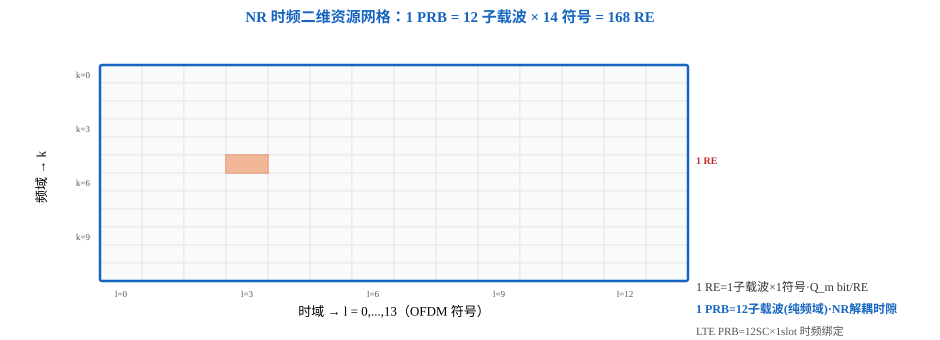
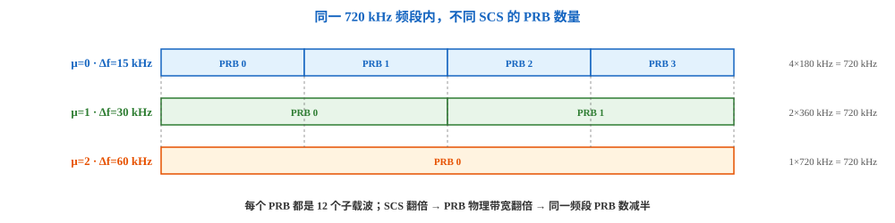
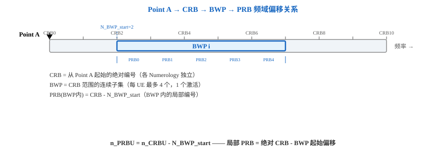

# T2.3 NR 频域资源网格：RE、PRB、CRB、Point A 与 BWP
## 本节学习目标

[[T2.2_NR_numerology_time_domain_hierarchy|T2.2]] 建立了 NR 的时域层级——从 μ 出发推导无线帧、子帧、时隙和 OFDM（正交频分复用，Orthogonal Frequency Division Multiplexing）符号。现在补上频域维度，构成完整的二维资源网格。NR 频域资源不是简单的"第几个子载波"，而是一条五级概念链。

先区分本节的核心对象：

| 术语 | 英文 | 先这样理解 |
|:---|:---|:---|
| 资源粒子 | Resource Element (RE) | RE（资源元素，Resource Element）：时频二维的最小资源粒度——频域 1 个子载波 × 时域 1 个 OFDM 符号。 |
| 物理资源块 | Physical Resource Block (PRB) | PRB（物理资源块，Physical Resource Block）：频域连续 12 个子载波，NR 中与时隙解耦的纯频域概念。 |
| 公共资源块 | Common Resource Block (CRB) | CRB（公共资源块，Common Resource Block）：从 Point A 开始对整个载波带宽的绝对 PRB 编号。 |
| 带宽部分 | Bandwidth Part (BWP) | BWP（带宽部分，Bandwidth Part）：给定载波、给定 Numerology 下连续 CRB 的子集；UE 的常规收发以当前激活的 DL/UL BWP 为工作窗口。 |

- 解释 RE 的二维地址 $(k, l)_{\mu}$ 中每个符号的含义。
- 说明 PRB 为什么定义为 12 子载波且与 SCS（子载波间隔，Subcarrier Spacing）无关——这简化了跨 Numerology 的参考信号设计。
- 理解 Point A 作为整个载波频域公共参考原点的角色。
- 区分 CRB（绝对编号）和 PRB（BWP 内局部编号）——$n_{PRB}^\mu = n_{CRB}^\mu - N_{BWP,i}^{start,\mu}$。
- 解释为什么不同 BWP 的 UE 在相同物理频率位置生成相同的 DM-RS（解调参考信号，Demodulation Reference Signal）序列。
- 用 Python 验证 RE/PRB/CRB/BWP 之间的编号转换关系。

## 前置知识检查

| 问题 | 需要达到的程度 |
|:---|:---|
| 子载波间隔 Δf 的含义是什么？ | 能说出 $\Delta f = 15 \cdot 2^\mu$ kHz，不同 μ 对应不同 SCS（[[T2.2_NR_numerology_time_domain_hierarchy|T2.2]]）。 |
| OFDM 符号是什么？ | 时域上一个 CP（循环前缀，Cyclic Prefix） + N 点 IFFT（逆快速傅里叶变换，Inverse Fast Fourier Transform）输出的时间片段（[[T2.1_OFDM_subcarrier_spacing_basics|T2.1]]）。 |
| 时隙的结构是什么？ | 普通 CP 下 14 个 OFDM 符号（[[T2.2_NR_numerology_time_domain_hierarchy|T2.2]]）。 |

## 频谱、频点与 ARFCN：资源网格的绝对坐标

Point A 是频域公共参考原点，但 Point A 本身挂在一个绝对频率坐标上——这个坐标由「频谱 → 频段 → 频点 → ARFCN」链条给出。频谱是电磁波按频率的连续范围，3GPP 把它划分成频段（NR 如 n78 = 3300–3800 MHz，FR1（频率范围 1，Frequency Range 1）为 450 MHz–6 GHz、FR2（频率范围 2，Frequency Range 2）为 24.25–52.6 GHz）；运营商在频段内选一个频点（载波中心频率），协议用 ARFCN（绝对射频信道号，Absolute Radio Frequency Channel Number）把它编码成整数——例如 `absoluteFrequencyPointA` 就是一个 NR-ARFCN 值，信令只传编号不传浮点频率。


频点 → 编号的公式（TS 38.101-1 §5.4.2.1）：

$$
F_{\mathrm{ref}} = F_{\mathrm{REF\_Offs}} + \Delta F_{\mathrm{Global}} \times (N_{\mathrm{REF}} - N_{\mathrm{REF\_Offs}})
$$

UE 开机沿同步栅格（GSCN（全球同步信道号，Global Synchronization Channel Number）列表）盲检 SSB（同步信号块，Synchronization Signal Block），读到 MIB（主信息块，Master Information Block）后用 ARFCN 对齐小区频点——栅格是「路网」，频点是「停车位」。本节之后 RE/PRB/CRB 的编号都从 Point A 这个绝对坐标出发。完整关系链见 [[Spectrum_and_Frequency_Point_频谱与频点]]。

## RE：时频二维的最小粒度

资源粒子是 NR 物理层最小的资源分配单位。它由频域上一个子载波和时域上一个 OFDM 符号唯一确定，地址表示为：

$$
\text{RE: } (k, l)_{\mu}
\tag{1}
$$

其中 $k$ 是频域子载波索引，$l$ 是时域 OFDM 符号索引，下标 $\mu$ 表示该 RE 属于哪个 Numerology 的网格。一个 RE 承载一个复数调制符号（modulation symbol）——在 QPSK（正交相移键控，Quadrature Phase Shift Keying）下为 2 个比特，在 64QAM（64 阶正交幅度调制，64 Quadrature Amplitude Modulation）下为 6 个比特。

RE 的物理带宽（即一个子载波的带宽）等于 $\Delta f$：μ=0 时 15 kHz，μ=4 时 240 kHz。SCS 越大，单个 RE 的频域跨度越宽，但时域符号越短——时频面积守恒。



## PRB：12 子载波的频域基本块

PRB 定义为频域上连续的 $N_{sc}^{RB} = 12$ 个子载波。这个数字与 Numerology 无关——μ=0 和 μ=4 都是 12 个子载波。

这里先分清协议事实和工程解释：

1. **协议事实**：TS 38.211 §4.4.4.1 直接规定 resource block 是频域连续 $N_{sc}^{RB}=12$ 个子载波。LTE TS 36.211 §5.2.3 也采用 $N_{sc}^{RB}=12$，15 kHz SCS 下一个 RB（资源块，Resource Block）的频域跨度是 180 kHz。
2. **不是 OFDM 正交性的数学必然**：子载波正交性来自 [[T2.1_OFDM_subcarrier_spacing_basics|T2.1]] 的 $\Delta f = 1/T_u$，不是来自"每 12 个子载波成一组"。理论上 8、10、16 个子载波也可以组成某种资源分配粒度，只要子载波间隔满足正交条件。
3. **工程上为什么 12 合理**：12 继承 LTE 的 RB 粒度；$12=2\times2\times3$，便于在一个 PRB 内设计 2、3、4、6 等梳状或分组参考信号图样；同时它在调度灵活性和 DCI（下行控制信息，Downlink Control Information）/RBG（资源块组，Resource Block Group）开销之间取得折中。更小的粒度会增加调度指示开销，更大的粒度会降低频域调度精度。
4. **NR 的统一抽象**：NR 固定"1 PRB = 12 子载波"，但允许 $\Delta f$ 随 Numerology 变化。因此 PRB 的子载波数不变，物理带宽随 SCS 线性变大。

所以，"为什么是 12"不能反推成 OFDM 理论要求；更准确的说法是：3GPP 选择 12 作为跨 LTE/NR、跨 Numerology 的统一频域资源块粒度，简化参考信号、调度和实现。

| 属性 | NR PRB | LTE PRB（对比） |
|:---|:---|:---|
| 频域定义 | 12 子载波（纯频域） | 12 子载波 |
| 时域绑定 | **无**——与时隙解耦 | **12 SC × 1 slot**（时频二维绑定） |
| 物理带宽 | $12 \cdot \Delta f$（随 μ 变） | 固定 180 kHz（μ=0） |

NR 的这一解耦使得资源分配更加灵活——频域以 PRB 为单位、时域以符号范围为单位，两个维度独立指定。

| μ | 子载波间隔 $\Delta f$ | 1 PRB 物理带宽 |
|:---|:---|:---|
| 0 | 15 kHz | $12 \times 15 = 180$ kHz |
| 1 | 30 kHz | $12 \times 30 = 360$ kHz |
| 2 | 60 kHz | $12 \times 60 = 720$ kHz |



## Point A：频域公共参考原点

Point A 是整个载波的频域公共参考原点，位于系统带宽的最低可用频率边界处。它是 NR 频域资源编排的"零点"——所有绝对位置都从这里开始数。

Point A 由 RRC（无线资源控制，Radio Resource Control）高层信令配置：
- SIB1（系统信息块 1，System Information Block 1）中的 `offsetToPointA` 字段——指示 Point A 与 SSB（同步信号块）最低子载波之间的频域偏移
- 专用 RRC 信令中的 `absoluteFrequencyPointA`——以 ARFCN（绝对射频信道号）给出 Point A 的绝对频率位置

CRB 0 的子载波 0 与 Point A 对齐。从 Point A 出发，整个载波的频域资源被划分为 CRB 网格。

## CRB 到 PRB 的编号体系

公共资源块（CRB）是从 Point A 开始在系统带宽内对所有 PRB 的统一绝对编号。对于 Numerology μ：

$$
n_{CRB}^\mu = \left\lfloor \frac{k}{N_{sc}^{RB}} \right\rfloor
\tag{2}
$$

其中 $k$ 是以 Point A 子载波 0 为原点的绝对子载波索引。不同 Numerology 的 CRB 网格各自独立编号——μ=0 和 μ=1 的 CRB 0 物理位置相同（都从 Point A 开始），但 CRB 1 的物理带宽不同（180 kHz vs 360 kHz）。

BWP 是给定载波、给定 Numerology 下连续 CRB 的子集。BWP 内的 PRB 使用局部编号：

$$
n_{PRB}^\mu = n_{CRB}^\mu - N_{BWP,i}^{start,\mu}
\tag{3}
$$

其中 $N_{BWP,i}^{start,\mu}$ 是 BWP $i$ 的起始 CRB 偏移（相对于 Point A）。每 UE 每服务小区最多配置 4 个下行 BWP 和 4 个上行 BWP，任意时刻每个传输方向仅 1 个 BWP 激活。不同 BWP 可配置不同的 Numerology——实现不同 SCS 业务的频分复用。

### 如何理解"UE 只在激活 BWP 上工作"

"一个载波内连续 CRB 的子集，UE 只在激活 BWP 上工作"这个说法方向正确，但它是教学简写，不能漏掉协议里的三个限定：

1. **BWP 的连续性有坐标系前提**：TS 38.211 §4.4.5 定义的是给定载波、给定 Numerology 下的一段连续 CRB。它不是任意散落的 RB 集合，而是从 $N_{BWP,i}^{start,\mu}$ 开始、长度为 $N_{BWP,i}^{size,\mu}$ 的频域窗口，并且必须落在该方向的资源网格范围内。
2. **"只在激活 BWP 上工作"分下行和上行说**：下行侧，UE 不期望在 active BWP 外接收 PDSCH（物理下行共享信道，Physical Downlink Shared Channel）、PDCCH（物理下行控制信道，Physical Downlink Control Channel）或 CSI-RS（信道状态信息参考信号，Channel State Information Reference Signal）（RRM（无线资源管理，Radio Resource Management）测量例外）；上行侧，UE 不应在 active BWP 外发送 PUSCH（物理上行共享信道，Physical Uplink Shared Channel）、PUCCH（物理上行控制信道，Physical Uplink Control Channel），活动小区内由 SRS-Resource 配置的 SRS（探测参考信号，Sounding Reference Signal）也不应发到 active BWP 外。
3. **这不是说 UE 完全不知道全载波**：Point A 和 CRB 仍然提供全载波的公共绝对坐标，SSB、初始接入、RRM 测量和 BWP 切换等流程也会涉及 active BWP 之外的上下文。更准确的理解是：调度和常规物理信道收发以 active BWP 为当前工作窗口，CRB 负责把这个局部窗口放回全载波坐标。

例如某载波的 CRB 范围足够大，UE 当前 active BWP 从 CRB 50 开始、宽 100 个 PRB。则 BWP 内的 PRB 0 对应 CRB 50，PRB 10 对应 CRB 60，PRB 99 对应 CRB 149。DCI 资源分配通常按 BWP 内 PRB 编号理解；参考信号、跨 BWP 对齐和协议证据追踪仍要回到 CRB 绝对编号。

### CRB 绝对编号对 DM-RS 序列生成的意义

DM-RS 序列生成公式（TS 38.211 §7.4.1.2）以 CRB 编号为绝对参考。这意味着：两个配置了不同 BWP 但在相同物理频率位置上接收的 UE，生成相同的 DM-RS 序列，维持端口正交性。DM-RS 序列不因 UE 的 BWP 配置不同而改变——它只取决于物理频率位置（即 CRB 编号）。

这是 CRB 作为"绝对编号层"存在的深层设计动机——它为参考信号的序列生成提供了一个与 BWP 配置无关的公共坐标。



## 完整频域层级

> Point A → CRB（绝对编号）→ BWP（CRB 子集）→ PRB（BWP 内局部编号）→ RE（1 子载波 × 1 OFDM 符号）

各层关系见图 2。

## VRB 到 PRB 的映射：交织与非交织

上面讲的 PRB 编号是 BWP 内的局部物理编号。但协议在资源分配和 PRB 之间还有一层——VRB（Virtual Resource Block，虚拟资源块）。VRB 到 PRB 的映射分两种模式：

**非交织映射（non-interleaved）**：VRB $n$ 直接映射到 PRB $n$。物理位置 = 虚拟位置——最简单的情况。

**交织映射（interleaved）**：VRB 按交织器重排后映射到 PRB，打乱了"相邻 VRB→相邻 PRB"的对应关系。交织粒度固定为 2 或 4 个 PRB 为一束（bundle）。

交织映射的工程动机是频率分集——将连续的逻辑资源分散到不连续的物理频率位置，对抗频率选择性衰落。对译码器而言，这意味着 LLR（对数似然比，Log-Likelihood Ratio）序列中的相邻比特可能来自频谱上相距甚远的 RE——它们的信道质量可能差异很大。译码器不直接处理 VRB/PRB 映射，但接收端的 LLR 顺序取决于发送端的 VRB→PRB 映射方式。

VRB 映射的完整参数（交织器配置、bundle 大小、是否启用）由 DCI format 1_1 中的 `vrb-to-prb-mapping` 字段指示（TS 38.214 §5.1.2.3）。

## CORESET：控制资源集的频域配置

NR 的控制信息不再像 LTE 那样占满全带宽的前几个符号，而是通过 CORESET（COntrol REsource SET，控制资源集）灵活配置。每个 CORESET 由频域的 $N_{RB}^{CORESET}$ 个 PRB 和时域的 $N_{symb}^{CORESET}$ 个符号（1–3）组成，可在载波内任意频域位置配置。

一个 CORESET 被划分为多个 CCE（Control Channel Element，控制信道元素），每个 CCE = 6 个 REG（资源元素组，Resource Element Group）= 6 × 12 = 72 个 RE（未扣除 DM-RS）。CCE 的编号顺序由交织器决定，而非简单的频率递增。

CORESET 对译码链路的影响：PDCCH 占用的 RE 不在 $N_{RE}^{data}$ 之内。即使 CORESET 只占 1–3 个符号、并非全带宽，这些符号上被 CORESET 占用的 PRB 区域也不能承载 PDSCH 数据——$N_{RE}^{data}$ 需扣除 CORESET 区域内的 RE。

## 载波带宽与保护带

系统带宽不等于实际可用的传输带宽。以 NR FR1 20 MHz 载波（μ=0, 15 kHz SCS）为例：

- 20 MHz 对应约 106 个 PRB（TS 38.101 Table 5.3.2-1）
- 但 20 MHz 信道栅格的物理带宽略大于 106×12×15 kHz = 19.08 MHz
- 两侧各有保护带（guard band）——不用于传输，用于满足频谱发射模板和邻道干扰要求

`offsetToCarrier`（TS 38.211 §4.4.2）定义了载波中心频率与 Point A 之间的频域偏移（以子载波数为单位）。这个参数影响 CRB 网格中哪些 CRB 落在实际传输带宽内——落在保护带区域的子载波不可用于数据传输。

对译码链路的影响：计算 $N_{RE}^{data}$ 时不是"所有 PRB 的 RE 减去参考信号"——还需扣除保护带内不可用的子载波。在链接级仿真中，保护带通常通过限制 $N_{PRB}$ 的最大值来隐式处理。

## 资源分配类型：Type 0 与 Type 1

gNB 通过 DCI 告诉 UE"你用哪几个 PRB"，NR 定义了两种资源分配类型：

**Type 0（bitmap）**：将 BWP 划分为若干个 RBG（Resource Block Group），每个 RBG 包含 2–16 个 PRB（取决于 BWP 大小）。DCI 中用一个 bitmap 指示哪些 RBG 被分配——bit $i$ = 1 表示 RBG $i$ 被分配给该 UE。调度灵活性高，但 bitmap 开销随 BWP 增大而增长。

**Type 1（RIV）**：分配一段连续的 PRB，用资源指示值（Resource Indication Value, RIV）编码起始位置和长度。开销固定（$\lceil \log_2(N_{BWP}(N_{BWP}+1)/2) \rceil$ bit），但不能分配不连续的 PRB。

此外还有 Type 2（仅上行，交织分配的连续 PRB）。

对译码链路的影响：译码器不需要知道资源分配类型——它只消费 LLR 向量。但仿真中构造测试向量时，资源分配类型决定了"哪些 PRB 上有 LLR"。Type 0 的不连续分配会导致 LLR 向量中出现来自频谱上分散的 PRB 的 LLR 交错排列。

## Python 校验片段

```python
"""
@brief 验证 NR 频域资源编号体系：Point A → CRB → BWP → PRB → RE
@date 2026-07-27
"""


def crb_from_subcarrier(k: int) -> int:
    """绝对子载波索引 k 到 CRB 编号（TS 38.211 §4.4.4）。

    @param k  以 Point A 子载波 0 为原点的绝对子载波索引
    @return   对应的 CRB 编号
    """
    return k // 12


def prb_from_crb(n_crb: int, n_bwp_start: int) -> int:
    """CRB 编号到 BWP 内 PRB 局部编号（TS 38.211 §4.4.5）。

    @param n_crb         CRB 编号（绝对）
    @param n_bwp_start   BWP 起始 CRB 偏移
    @return              BWP 内的 PRB 局部编号；不在 BWP 内返回 -1
    """
    return n_crb - n_bwp_start


# 教学场景：BWP 从 CRB 10 开始，宽 50 个 CRB
bwp_start, bwp_size = 10, 50

test_cases = [
    (0,   "Point A 处"),
    (12,  "CRB 1 起始"),
    (119, "BWP 起始前 (CRB 9)"),
    (120, "BWP 起始 (CRB 10, PRB 0)"),
    (719, "BWP 结束 (CRB 59, PRB 49)"),
]

for k, desc in test_cases:
    crb = crb_from_subcarrier(k)
    in_bwp = bwp_start <= crb < bwp_start + bwp_size
    prb = prb_from_crb(crb, bwp_start) if in_bwp else -1
    print(f"k={k:>4d} → CRB={crb:>3d}  "
          f"BWP={'是' if in_bwp else '否'}  "
          f"PRB={prb if in_bwp else '—':>3s}  ({desc})")

# CRB 编号步进验证
print()
for k in range(0, 25, 3):
    crb = crb_from_subcarrier(k)
    same = crb == crb_from_subcarrier(k - 1) if k > 0 else None
    print(f"k={k:>3d} → CRB={crb:>2d}  same_as_k-1={same}")
```

期望输出：

```text
k=   0 → CRB=  0  BWP=否  PRB= —  (Point A 处)
k=  12 → CRB=  1  BWP=否  PRB= —  (CRB 1 起始)
k= 119 → CRB=  9  BWP=否  PRB= —  (BWP 起始前 (CRB 9))
k= 120 → CRB= 10  BWP=是  PRB=0   (BWP 起始 (CRB 10, PRB 0))
k= 719 → CRB= 59  BWP=是  PRB=49  (BWP 结束 (CRB 59, PRB 49))

k=  0 → CRB= 0  same_as_k-1=None
k=  3 → CRB= 0  same_as_k-1=True
k=  6 → CRB= 0  same_as_k-1=True
k=  9 → CRB= 0  same_as_k-1=True
k= 12 → CRB= 1  same_as_k-1=False
```

## 和 3GPP 协议的关系

TS 38.211 §4.4.1–§4.4.5 分别定义了 RE、PRB、CRB 和 BWP。本节复现了五级概念之间的编号关系（Point A → CRB → BWP → PRB → RE），协议表格和具体 RRC 配置字段不在本节展开。

需要分清：
- $N_{sc}^{RB} = 12$ 和 `offsetToPointA`/`absoluteFrequencyPointA` 的存在是协议规定。
- "为什么选 12"属于工程解释：本节从 LTE 继承、参考信号图样、调度粒度和跨 Numerology 统一抽象解释其合理性；协议正文只规定 $N_{sc}^{RB}=12$，不把该数值推导为 OFDM 正交性的必要条件。
- CRB 编号公式和 PRB 偏移公式是这些协议定义的直接数学推论。
- BWP 的"连续 CRB 子集"和"active BWP 内收发"是 TS 38.211 §4.4.5 的直接协议约束；其中下行使用"not expected to receive"，上行使用"shall not transmit"，语气强度不同。
- BWP 的完整 RRC 配置字段来自 TS 38.331，不在本节展开。

| 协议依据 | 本地路径 | 本节采用程度 |
|:---|:---|:---|
| TS 38.211 Rel-19 §4.4.1–§4.4.5 | `3GPP_Rel19/processed/TS_38.211_38211-j30/` | 已定位 RE/PRB/CRB/BWP/Point A 定义入口；不复现协议表格 HTML。 |
| TS 36.211 Rel-19 §5.2.3 | `3GPP_Rel19/processed/TS_36.211_36211-j30_s00-s05/` | 用于 LTE PRB 对比：$N_{sc}^{RB}=12$，15 kHz 下频域 180 kHz。 |
| TS 38.331 Rel-19 | `3GPP_Rel19/processed/TS_38.331_38331-j20/` | BWP RRC 配置入口已定位；ASN.1 不在本节展开。 |

## 常见错误

| 错误 | 为什么错 | 正确做法 |
|:---|:---|:---|
| 把 NR PRB 当作时频二维绑定 | NR 的 PRB 是纯频域 12 子载波，与时隙解耦。 | 资源分配时频分离：频域指定 PRB，时域指定符号范围。 |
| 把"12 子载波"当成 OFDM 正交条件 | 正交条件是 $\Delta f = 1/T_u$；12 是协议选定的资源块粒度。 | 分清"子载波是否正交"和"多少个子载波组成一个调度单位"。 |
| 混淆 CRB 和 BWP 内 PRB | CRB 是从 Point A 开始的绝对编号，PRB 是 BWP 内的局部编号。 | $n_{PRB} = n_{CRB} - N_{BWP}^{start}$——两者相差一个偏移。 |
| 以为不同 μ 的 CRB 共享同一编号空间 | 每个 μ 下的 CRB 网格独立——CRB 0 物理位置相同但同级 CRB 物理带宽不同。 | 读协议时注意 CRB 上标 $\mu$。 |
| 把"只在激活 BWP 上工作"理解成 UE 完全看不到 BWP 外 | 协议限制的是常规 PDSCH/PDCCH/CSI-RS 接收和 PUSCH/PUCCH/SRS 发送；RRM、初始接入和 BWP 切换仍有额外规则。 | 把 active BWP 理解成当前调度窗口，把 CRB/Point A 理解成全载波公共坐标。 |
| 忘记 RE 的下标 μ | RE $(k, l)$ 的物理大小依赖于 μ——相同坐标在不同 Numerology 下对应不同物理带宽。 | 标注 $(k, l)_{\mu}$。 |

## 自测题

1. RE 的完整地址 $(k, l)_{\mu}$ 中，$k$、$l$ 和 $\mu$ 各代表什么？
2. NR 为什么把 PRB 固定为 12 子载波？这是不是 OFDM 正交性的要求？
3. Point A 是什么？它和 CRB 0 的子载波 0 有什么关系？
4. BWP 内 PRB 10、$N_{BWP}^{start}=20$ 时，对应的 CRB 编号是多少？
5. 为什么两个 BWP 不同的 UE 在相同物理频率位置应生成相同 DM-RS 序列？
6. "PRB 是纯频域概念"和"资源分配以 PRB 为频域单位"是否矛盾？
7. "UE 只在激活 BWP 上工作"这句话为什么需要加限定？

## 自测题参考答案

1. $k$ 是频域子载波索引，$l$ 是时域 OFDM 符号索引，$\mu$ 是 Numerology 索引——决定该 RE 的物理带宽和符号时长。

2. 不是 OFDM 正交性的要求。正交性来自 $\Delta f=1/T_u$。$N_{sc}^{RB}=12$ 是协议选定的资源块粒度，继承 LTE 的 12 子载波 RB 传统，并在参考信号图样、调度开销和频域调度灵活性之间取得折中。NR 固定 12 子载波，但让 PRB 物理带宽随 SCS 变化。

3. Point A 是载波的频域公共参考原点，由 RRC 信令配置。CRB 0 的子载波 0 与 Point A 对齐——Point A 是 CRB 编号的起点。

4. $n_{CRB} = n_{PRB} + N_{BWP}^{start} = 10 + 20 = 30$。

5. DM-RS 序列以 CRB 绝对编号生成——不依赖 BWP 配置。物理频率位置相同则 CRB 相同，因此生成相同参考序列，维持端口正交性。

6. 不矛盾。"纯频域"指 PRB 定义上不与特定时隙绑定（区别于 LTE PRB = 12 SC × 1 slot）。"以 PRB 为频域分配单位"指频域分配粒度是 12 子载波，时域以符号独立指定。两维度解耦正是"纯频域"的含义。

7. 因为 BWP 定义带有给定载波、给定 Numerology 的前提；下行和上行对 active BWP 外资源的协议措辞不同；并且 active BWP 是常规收发的调度窗口，不等于 UE 完全不需要 Point A、CRB、SSB、RRM 或 BWP 切换上下文。

## 本节验收

| 验收项 | 通过标准 |
|:---|:---|
| RE 地址 | 能写出 $(k, l)_{\mu}$ 并解释各符号含义。 |
| PRB 定义 | 能说明 PRB = 12 子载波、NR 中与时隙解耦，并能区分协议规定、工程解释和 OFDM 正交条件。 |
| Point A | 能解释其角色和 RRC 配置方式。 |
| CRB vs PRB | 能写出 $n_{PRB} = n_{CRB} - N_{BWP}^{start}$ 并解释场景。 |
| BWP | 能说明每 UE 最多 4 BWP、1 个激活、不同 BWP 可用不同 Numerology，并能解释 active BWP 的上下行限制和 RRM 例外。 |
| Python 复核 | 能运行代码并验证 CRB/PRB 转换。 |

## 资料与协议边界

| 资料 | 边界 |
| :--- | :--- |
| TS 38.211 Rel-19 §4.4.1–§4.4.5 | 本节复现 RE/PRB/CRB/BWP/Point A 定义和编号公式；不读取原始 Word/HTML。 |
| TS 38.331 Rel-19 | BWP RRC 配置入口已定位；ASN.1 不在本节展开。 |
| [[T2.2_NR_numerology_time_domain_hierarchy|T2.2]] NR Numerology | Δf 取值和时隙结构见 [[T2.2_NR_numerology_time_domain_hierarchy|T2.2]]。 |
| [[T2.5_MCS_modulation_order_target_code_rate|T2.5]] LTE 帧结构 | NR 与 LTE PRB 定义对比见 [[T2.5_MCS_modulation_order_target_code_rate|T2.5]]。 |

## 执行与证据记录

| 项目 | 记录 |
|:---|:---|
| 本地协议检索 | 使用 `rg` 检索 TS 38.211 的 §4.4.1–§4.4.5 定义入口，并核对 §4.4.4.1 的 $N_{sc}^{RB}=12$、§4.4.5 中 BWP 的连续 CRB 定义、active DL/UL BWP 限制和 RRM 例外；使用 TS 36.211 §5.2.3 核对 LTE PRB 对比。 |
| 示例验证 | 使用 Python 3 执行本节 CRB/PRB 编号转换片段。 |
| 审查范围 | 检查术语首现、公式编号、Point A→CRB→BWP→PRB→RE 五级链、NR vs LTE PRB 对比、常见错误、自测题。 |
| 证据边界 | VRB 映射（TS 38.211 §6.3.1）和 BWP RRC 完整 ASN.1 不在本节展开。 |
| 使用技能/流程 | 使用本地协议检索确认协议证据边界；使用 `verification-before-completion` 规则验证。 |

## 参考文献

- [3GPP, 2026] 3GPP TS 38.211, Rel-19, `38211-j30`, Physical channels and modulation, §4.4.1–§4.4.5. Local path: `3GPP_Rel19/processed/TS_38.211_38211-j30`.
- [3GPP, 2026] 3GPP TS 36.211, Rel-19, `36211-j30`, Physical channels and modulation, §5.2.3. Local path: `3GPP_Rel19/processed/TS_36.211_36211-j30_s00-s05`.
- [3GPP, 2026] 3GPP TS 38.331, Rel-19, `38331-j20`, Radio Resource Control (RRC) protocol specification. Local path: `3GPP_Rel19/processed/TS_38.331_38331-j20`.
