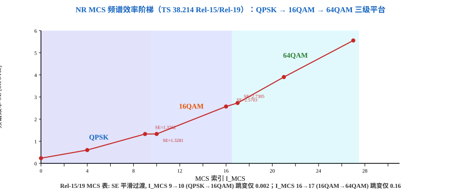

# T2.5 MCS、调制阶数与目标码率：从调度参数到频谱效率
## 本节学习目标

[[T2.1_OFDM_subcarrier_spacing_basics|T2.1]]–[[T2.3_NR_frequency_resource_grid|T2.3]] 构建了 LTE 和 NR 的完整时频资源框架。网格建好之后，调度层需要回答一个核心问题：每个 RE（资源元素，Resource Element）里装多少比特？

MCS（调制与编码策略，Modulation and Coding Scheme）就是回答这个问题的调度参数。它是一个 5-bit 索引（$I_{MCS}$ = 0–31），查表得到调制阶数 $Q_m$ 和目标码率 $R$，进而结合资源分配推导传输块大小（TBS）。

先区分与 MCS 直接相关的三个量：

| 术语 | 英文 | 先这样理解 |
|:---|:---|:---|
| 调制阶数 | modulation order $Q_m$ | 每个调制符号承载的比特数：QPSK（正交相移键控，Quadrature Phase Shift Keying）=2, 16QAM（16 阶正交幅度调制，16 Quadrature Amplitude Modulation）=4, 64QAM（64 阶正交幅度调制，64 Quadrature Amplitude Modulation）=6, 256QAM（256 阶正交幅度调制，256 Quadrature Amplitude Modulation）=8, 1024QAM（1024 阶正交幅度调制，1024 Quadrature Amplitude Modulation）=10 |
| 目标码率 | target code rate $R$ | 信息比特占编码后比特的比例，$R$ 低 = 冗余高 = 抗噪强 |
| 频谱效率 | spectral efficiency（SE） | 每子载波每符号传输的信息比特数，$SE = Q_m \cdot R$ [bit/s/Hz] |

- 解释 MCS 在协议栈中的位置：MAC（媒体接入控制层，Medium Access Control）调度器 ← CQI（信道质量指示，Channel Quality Indicator）← UE → gNB 选 MCS → PHY 查表得 $Q_m$ 和 $R$。
- 读懂 TS 38.214 Table 5.1.3.1-1 的核心片段——MCS 0–28 对应的 $Q_m$ 和 $R$ 变化规律。
- 理解 MCS 表格的三级阶梯设计：低 MCS→QPSK+低码率（边缘），中 MCS→16QAM（过渡），高 MCS→64QAM+高码率（中心）。
- 区分 NR 的公式化 TBS 计算和 LTE 的二维查表方式。
- 用 Python 复现 MCS→$Q_m,R,SE$ 的查表流程。

## 前置知识检查

| 问题 | 需要达到的程度 |
|:---|:---|
| RE 和 PRB 是什么？ | 能说出 RE = 1 子载波 × 1 符号，PRB（物理资源块，Physical Resource Block） = 12 子载波（[[T2.3_NR_frequency_resource_grid|T2.3]]）。 |
| 码率的基本概念是什么？ | $R = K/N$，信息比特占编码后比特的比例（[[T1.6_information_theory_minimum_for_decoding|T1.6]]）。 |

## MCS 的理论底座：从比特到资源元素的翻译器

### MCS 解决的问题：一个资源元素上装多少比特

物理层调度最终要回答的问题只有一个：这一次传输，每个 RE 里装几个比特，其中又有多少真正携带信息？

无线信道的质量随时在变——终端走到小区边缘或墙后，信干噪比（Signal-to-Interference-plus-Noise Ratio, SINR）骤降；贴近基站时，信号又强得过剩。若固定按最差信道设计（最低调制阶数加大量冗余），好信道下的容量被白白浪费；若按最好信道设计，差信道下接收机根本译不出码。

取消旋钮的代价可以用一个数字直觉衡量：若永远固定为 QPSK 加码率 1/2，每个 RE 只能装 1 个信息比特（$SE = 2 \times 0.5 = 1$），而 64QAM 高码率档可达约 5.55 bit/s/Hz——固定配置意味着好信道时容量被锁死在低档，差信道时又可能连这 1 bit 都装不稳。

链路自适应（Link Adaptation，根据信道质量动态调整传输参数的工作方式）的全部任务，就是用一个可调旋钮解决这对矛盾——把"当前信道能承受多少"翻译成"每个 RE 装多少信息比特"。MCS 就是这个旋钮的名字。

### 直观理解：装车比喻与两个旋钮

想象一趟每天往返的运输车队，道路状况（信道质量）时好时坏。MAC 调度器每次发车前只决定两件事：

1. 每个箱子装几件货——对应调制阶数 $Q_m$。箱子越大（$Q_m$ 越高），单车运量越大，但路面颠簸（噪声）时越容易分不清箱内货物。
2. 货物占整车装载的比例——对应目标码率 $R$。比例越低，防震填充（冗余比特）越多，货物越不易损坏。

两者的乘积给出"每车实际送达的有效货物数"——对应频谱效率（Spectral Efficiency, SE），即每子载波每符号承载的信息比特数，$SE = Q_m \cdot R$。

MCS 索引的职责，就是把这两个旋钮的取值组合压缩成一个 5-bit 编号 $I_{MCS}$（0–31）：收发双方查同一张表即可还原出 $(Q_m, R)$，无需逐一协商。比喻与协议量的对应关系如下：

| 装车比喻 | 协议对应量 |
|:---|:---|
| 车队调度 | MAC 调度器 |
| 路况报告 | CQI |
| 发车指令 | DCI（下行控制信息，Downlink Control Information）中的 $I_{MCS}$ |
| 箱子大小 | 调制阶数 $Q_m$ |
| 防震填充比例 | 目标码率 $R$ |
| 有效货物数 | 频谱效率 $SE$ |

这个比喻也解释了 MCS 表的三级阶梯：路况差时用小箱子加厚防震（QPSK 低码率），路况好时换大箱子并减薄防震（64QAM 高码率），换箱子的临界点处刻意对齐码率，使"有效运量"平稳过渡。

### 手算例子：给定 MCS 索引与资源数推演 TBS

下面用讲义已有的 MCS 表行走一遍最小数值例子：1 个 PRB、单层传输、$I_{MCS}=4$，从索引一路推导传输块大小（Transport Block Size, TBS）。

**第一步：数清可用资源元素。** 1 个 PRB 含 12 个子载波；取时隙内 $N_{symb}^{sh}=12$ 个数据符号，共 $12 \times 12 = 144$ 个 RE。扣除 12 个 DM-RS（解调参考信号，Demodulation Reference Signal）占用 RE、高层配置开销 $N_{oh}^{PRB}=0$，每 PRB 可用数据 RE 数 $N_{RE}' = 144 - 12 - 0 = 132$；与上限 156 取小后乘 1 个 PRB，得 $N_{RE} = 132$（TS 38.214 §5.1.3.2 的教学口径，完整定义见 [[T9.0_TS38214_MCS_TBS_decoder_descriptor|T9.0]]）。

**第二步：查 MCS 表取 $(Q_m, R)$。** $I_{MCS}=4$ 对应 $Q_m=2$（QPSK）、$R \times 1024 = 308$，即 $R = 308/1024 = 0.3008$。

**第三步：算未量化中间量。** 层数 $v=1$：

$$
N_{info} = N_{RE} \cdot R \cdot Q_m \cdot v = 132 \times 0.3008 \times 2 \times 1 = 79.4\ \text{bit}
$$

**第四步：量化到 TBS。** $N_{info} = 79.4 \leq 3824$，走小 TBS 分支（TS 38.214 §5.1.3.2）：先取 $n = \max(3, \lfloor \log_2 79.4 \rfloor - 6) = \max(3, 6-6) = 3$，再算 $N_{info}' = \max(24, 2^3 \cdot \lfloor 79.4/8 \rfloor) = \max(24, 72) = 72$，最后在量化表中找不小于 72 的最小条目——恰为 72。**结论：TBS = 72 bit**，即这 1 个 PRB 本次装载 72 个信息比特。

对照一组：同样的 132 个 RE 改取 $I_{MCS}=9$（$Q_m=2$，$R = 679/1024 = 0.6631$）：

$$
N_{info} = 132 \times 0.6631 \times 2 \times 1 = 175.1\ \text{bit}
$$

$n = \max(3, \lfloor \log_2 175.1 \rfloor - 6) = 3$，$N_{info}' = 8 \cdot \lfloor 175.1/8 \rfloor = 168$，量化表中不小于 168 的最小条目即 168，**TBS = 168 bit**。

再加第三组，验证跨阶切换点 $I_{MCS}=10$（$Q_m=4$，$R = 340/1024 = 0.3320$）：

$$
N_{info} = 132 \times 0.3320 \times 4 \times 1 = 175.3\ \text{bit}
$$

$n=3$，$N_{info}' = 8 \cdot \lfloor 175.3/8 \rfloor = 168$，**TBS = 168 bit**——与 $I_{MCS}=9$ 完全相同。这不是巧合：9→10 的切换点上调制阶数翻倍（2→4）、码率几乎减半（0.6631→0.3320），两个旋钮联动而乘积守恒，频谱效率 1.3262→1.3281 几乎不动，同一份资源装出的 TBS 自然相同。三组结果汇总：

| $I_{MCS}$ | $Q_m$ | $R$ | $N_{RE}$ | $N_{info}$ | $N_{info}'$ | TBS |
|:---:|:---:|:---:|:---:|:---:|:---:|:---:|
| 4 | 2 | 0.3008 | 132 | 79.4 | 72 | 72 |
| 9 | 2 | 0.6631 | 132 | 175.1 | 168 | 168 |
| 10 | 4 | 0.3320 | 132 | 175.3 | 168 | 168 |

物理资源一个 RE 没变，MCS 索引从 4 走到 10，运输的信息比特数从 72 升到 168——链路自适应的全部意义就浓缩在这张小表里。

### 量化步长的存在理由：整数一致性与实现成本

手算例子的第四步藏着一个初学者常忽略的环节——为什么 $N_{info}=79.4$ 不能直接当 TBS 用？原因有三条：

1. 收发一致性。$N_{info}$ 是连续值，若不做量化，收发双方任何一次浮点舍入分歧都会造成 TBS 长度错配，整个传输块作废；协议用整数格点把结果钉死，查表结果唯一确定。
2. 实现成本。量化把"任意实数"压到一张不到百项的小表上（TS 38.214 §5.1.3.2），替代了 LTE 时代 110×110 的大表——这正是 NR 用公式化计算取代二维查表的原因之一。
3. 容量损失可控。本例量化步长为 $2^3=8$，损失至多 8 bit，相对 72/168 bit 的 TBS 只是零头；大 TBS 分支粒度更粗，但相对损失随 TBS 增大而递减。

### 正式定义

MCS 索引的正式定义是一条三元组关系：5-bit 索引 $I_{MCS} \in \{0, 1, \dots, 31\}$ 经查表映射为调制阶数 $Q_m$ 与目标码率 $R$，两者共同决定频谱效率 $SE = Q_m \cdot R$；其中 $I_{MCS}=29/30/31$ 为重传条目，$Q_m$ 固定为 2/4/6、$R$ 沿用初传值，$I_{MCS}=28$ 为保留条目（TS 38.214 §5.1.3, Table 5.1.3.1-1）。

注意 MCS 是"如何装货"的字典索引而非货物本身——它必须结合 $N_{RE}$ 与层数 $v$ 才能得到 TBS，这正是上文手算例子需要第四步量化与查表的原因。

符号口径：$N_{RE}$ 为本次传输总可用数据 RE 数，$v$ 为层数，$N_{info}'$ 为量化后的中间信息比特数；该表的来源与完整 32 行见下文阶梯表与 [[T9.0_TS38214_MCS_TBS_decoder_descriptor|T9.0]]。

### 常见误解

| 误解 | 为什么错 | 正确理解 |
|:---|:---|:---|
| MCS 是信道质量的测量值 | MCS 是调度器做出的选择，测量值是 CQI | CQI 是 UE 上报的建议，MCS 是 gNB 的最终决定 |
| TBS 由 MCS 单独决定 | $N_{info}$ 公式里还有 $N_{RE}$ 与 $v$ | 同样 $I_{MCS}=4$，1 个 PRB 得 72 bit，10 个 PRB 得约十倍的 $N_{info}$ |
| MCS 与调制阶数是同义词 | MCS 表编码的是 $(Q_m, R)$ 组合 | 重传条目 29/30/31 三档 $Q_m$ 各不同却都沿用初传码率——MCS 编码的是策略组合而非单一参数 |

### 接收端后果

接收端后果直接而刚性：

1. 接收机必须先从 PDCCH（物理下行控制信道，Physical Downlink Control Channel）携带的 DCI（下行控制信息，Downlink Control Information）读出 $I_{MCS}$，才能与 gNB 查到同一对 $(Q_m, R)$ 和同一个 TBS。MCS 表是收发双方共享的字典——任何查表分歧都会使解调阶数与解速率匹配长度全线错位，整个传输块（Transport Block, TB）作废，且错误表现为"对不上"而非"译错"。
2. MCS 档位决定 LLR（对数似然比，Log-Likelihood Ratio）的证据强度：高阶调制星座点密集，逐比特软解调得到的 LLR 平均幅值更小、对噪声更敏感（详见 [[T2.14_QAM_Max_Log_MAP_demapping|T2.14]]）。工程后果是接收机必须为每一档 MCS 备好对应的解调与解速率匹配参数集——MCS 档位即接收机状态机的一条状态。
3. gNB 以块错误率（Block Error Rate, BLER）约 0.1 为目标选 MCS：选高了靠 HARQ（混合自动重传请求，Hybrid Automatic Repeat Request）重传补救，代价是时延；选低了浪费容量。吞吐与时延两个小区指标，最终都由这一档旋钮的取值分布塑造。

本节建立了 MCS 的理论底座：它解决的问题、两个旋钮的直观含义、从索引与资源数手算推演 TBS 的完整路径，以及量化存在的工程理由。下一节起进入协议细节——MCS 在协议栈中的位置、表格的阶梯设计与 NR 与 LTE 的差异。

## MCS 在协议栈中的位置

MCS 是 MAC 层调度器和 PHY 层之间的关键接口参数。整个流程是：

1. UE 测量下行参考信号（CSI-RS）的 SINR（信干噪比，Signal-to-Interference-plus-Noise Ratio），根据“BLER（块错误率，Block Error Rate）≤ 0.1”目标查找 CQI 表，上报 4-bit CQI 索引。
2. gNB MAC 调度器综合 CQI、可用 PRB 数、MIMO（多输入多输出，Multiple-Input Multiple-Output）层数、业务优先级等因素，选择 MCS 索引 $I_{MCS}$。
3. PHY 层根据 $I_{MCS}$ 查 TS 38.214 的 MCS 表格，确定本次传输的 $Q_m$ 和 $R$。
4. 结合资源分配（$N_{RE}$、层数 $v$）按公式计算 TBS。

NR 不强制 CQI 到 MCS 的绑定关系——调度器有实现自由度。CQI 上报只是一个"建议"，gNB 可以根据瞬时负载、干扰和调度策略选择偏离 CQI 建议的 MCS。

## NR MCS 表格的阶梯设计

TS 38.214 定义了三张 MCS 表格（自 Rel-15 引入，延续至 Rel-19），默认表是 Table 5.1.3.1-1（64QAM 表）。下面是它的核心片段和设计逻辑：

| $I_{MCS}$ | $Q_m$ | $R \times 1024$ | $SE$ [bit/s/Hz] | 区域 | 说明 |
|:---:|:---:|:---:|:---:|:---|:---|
| 0 | 2 | 120 | 0.2344 | QPSK 低码率 | 最低效率，小区边缘/广播 |
| 4 | 2 | 308 | 0.6016 | QPSK 中码率 | |
| 9 | 2 | 679 | 1.3262 | QPSK 高码率 | QPSK 最高效率 |
| 10 | 4 | 340 | 1.3281 | **切换至 16QAM** | SE 几乎连续——无跳变 |
| 16 | 4 | 658 | 2.5703 | 16QAM 高码率 | 16QAM 最高效率 |
| 17 | 6 | 466 | 2.7305 | **切换至 64QAM** | SE 再次平稳过渡 |
| 21 | 6 | 666 | 3.9023 | 64QAM 中码率 | |
| 27 | 6 | 948 | 5.5547 | 64QAM 高码率 | 64QAM 最高效率 |
| 28 | 6 | — | — | 保留 | $R$ 由 DCI（下行控制信息，Downlink Control Information）RV（冗余版本，Redundancy Version）隐式指示 |
| 29 | 2 | — | — | 重传 | QPSK，沿用初传 TBS |
| 30 | 4 | — | — | 重传 | 16QAM，沿用初传 TBS |
| 31 | 6 | — | — | 重传 | 64QAM，沿用初传 TBS |

这张表的设计有三个精妙之处：

**1. 跨调制阶数的 SE 平滑过渡。** $I_{MCS}=9$（QPSK, SE=1.3262）和 $I_{MCS}=10$（16QAM, SE=1.3281）之间频谱效率几乎连续。这不是巧合——码率 $R$ 被精细地选择，使得切换到更高阶调制时 SE 不会突然跳跃。避免了"QPSK 最高效率不够用但 16QAM 最低效率又浪费"的死区。

**2. 码率在每一级调制内单调递增。** QPSK 内从 $R \times 1024 = 120$ 升到 $679$，16QAM 内从 $340$ 升到 $658$，64QAM 内从 $466$ 升到 $948$。

**3. 重传的特殊处理。** $I_{MCS}=29/30/31$ 用于重传——调制阶数分别为 QPSK/16QAM/64QAM，但码率和 TBS 沿用初传值。



图 1 直观展示了三级调制平台的 SE 覆盖范围和跨阶过渡的平滑性。每个红点对应一个 MCS 索引——注意 $I_{MCS}=9$ 和 $I_{MCS}=10$ 之间 SE 从 1.3262 到 1.3281 的近乎无缝衔接。

### 256QAM 和 1024QAM 扩展表

NR 还定义了两张扩展表（RRC（无线资源控制，Radio Resource Control）参数 `mcs-Table` 控制）：
- **Table 5.1.3.1-2**（256QAM, `qam256`）：$I_{MCS}$ 0–27 覆盖至 $Q_m=8$
- **Table 5.1.3.1-3**（1024QAM, `qam64LowSE`）：$I_{MCS}$ 0–28 扩展至 $Q_m=10$

需 UE 上报对应能力，gNB 通过 RRC 配置后生效。

## 从 MCS 到 TBS 的两步流程

MCS 查表得 $Q_m$ 和 $R$ 后，结合物理资源计算 TBS：

$$
N_{info} = N_{RE} \cdot R \cdot Q_m \cdot v
\tag{1}
$$

其中 $N_{RE}$ 是可用于数据的 RE 数（扣除控制和参考信号），$v$ 是 MIMO 层数。

TBS 量化分两段（TS 38.214 §5.1.3.2）：$N_{info} \leq 3824$ 时分步查表量化，否则按分段公式量化到特定粒度。TBS 完整计算在 [[T9.0_TS38214_MCS_TBS_decoder_descriptor|T9.0]] 展开。

## LTE MCS 的关键差异

| 维度 | LTE | NR |
|:---|:---|:---|
| MCS→TBS 路径 | 间接：$I_{MCS} \to I_{TBS} \to$ 二维查表 | 直接：$I_{MCS} \to Q_m,R \to$ 公式计算 |
| MCS 表范围 | 最高 64QAM（256QAM Rel-12 扩展） | 原生 64QAM，256/1024QAM 扩展 |
| Numerology | 固定 15 kHz | 五套 μ=0–4 |

LTE 的二维查表 $I_{TBS} \times N_{PRB}$ 有 110×110=12100 项——NR 用公式替代了这张大表。

## Python 校验片段

```python
"""
@brief 复现 NR MCS 查表：I_MCS → Q_m, R, SE
@date 2026-07-27
"""

# TS 38.214 Table 5.1.3.1-1 核心片段（教学用）
MCS_TABLE = {
    0: (2, 120), 4: (2, 308), 9: (2, 679),
    10: (4, 340), 16: (4, 658),
    17: (6, 466), 21: (6, 666), 27: (6, 948),
}


def mcs_lookup(i_mcs: int):
    """查 MCS 表得到 (Q_m, R, SE)。重传/保留返回 None。"""
    if i_mcs in (28, 29, 30, 31):
        return None
    if i_mcs in MCS_TABLE:
        qm, r_x_1024 = MCS_TABLE[i_mcs]
        R = r_x_1024 / 1024.0
        return qm, R, qm * R
    return None


print("I_MCS  Q_m   R×1024     R        SE")
print("-" * 45)
for i_mcs in [0, 4, 9, 10, 16, 17, 21, 27]:
    r = mcs_lookup(i_mcs)
    if r:
        qm, R, SE = r
        print(f"  {i_mcs:>2d}    {qm}    {MCS_TABLE[i_mcs][1]:>4d}     {R:.4f}   {SE:.4f}")

_, _, se9 = mcs_lookup(9)
_, _, se10 = mcs_lookup(10)
print(f"\nQPSK max SE (I_MCS=9):  {se9:.4f}")
print(f"16QAM min SE (I_MCS=10): {se10:.4f}")
print(f"SE diff: {se10-se9:.4f} (应 ≈ 0)")
```

期望输出：

```text
I_MCS  Q_m   R×1024     R        SE
---------------------------------------------
   0    2     120     0.1172   0.2344
   4    2     308     0.3008   0.6016
   9    2     679     0.6631   1.3262
  10    4     340     0.3320   1.3281
  16    4     658     0.6426   2.5703
  17    6     466     0.4551   2.7305
  21    6     666     0.6504   3.9023
  27    6     948     0.9258   5.5547

QPSK max SE (I_MCS=9):  1.3262
16QAM min SE (I_MCS=10): 1.3281
SE diff: 0.0020 (应 ≈ 0)
```

## 和 3GPP 协议的关系

| 协议依据 | 本地路径 | 本节采用程度 |
|:---|:---|:---|
| TS 38.214 §5.1.3, Table 5.1.3.1-1 | `3GPP_Rel19/processed/TS_38.214_38214-j30/` | 复现 64QAM 表核心 8 行；完整 32 行见 [[T9.0_TS38214_MCS_TBS_decoder_descriptor|T9.0]] |
| TS 38.214 §5.1.3.2 | 同上 | TBS 量化入口已定位；完整公式见 [[T9.0_TS38214_MCS_TBS_decoder_descriptor|T9.0]] |
| TS 36.213 §7.1.7 | `3GPP_Rel19/processed/TS_36.213_36213-j30_s06-s07/` | LTE MCS 入口已定位 |

## 常见错误

| 错误 | 为什么错 | 正确做法 |
|:---|:---|:---|
| 混淆目标码率 $R$ 和有效码率 $R_{eff}$ | $R_{eff}$ 含 TB（传输块，Transport Block）CRC（循环冗余校验，Cyclic Redundancy Check）开销。 | 查 MCS 表用 $R$，算实际开销用 $R_{eff}$。 |
| 认为 MCS=0 是 BPSK（二进制相移键控，Binary Phase Shift Keying） | NR 数据信道没有 BPSK——$Q_m$ 从 2 起步。 | MCS 0 = QPSK + 最低码率。 |
| 把 $R \times 1024$ 当 $R$ | 协议用整数存储避免浮点。 | $R = (R \times 1024) / 1024$。 |
| 以为 NR 也用二维 TBS 表 | NR 用公式 + 量化替代了 LTE 的 110×110 大表。 | $N_{info} = N_{RE} \cdot R \cdot Q_m \cdot v$。 |

## 自测题

1. $I_{MCS}=10$ 对应什么调制阶数和目标码率？
2. 为什么 $I_{MCS}=9 \to 10$ 的 SE 几乎连续？这是偶然还是设计？
3. $I_{MCS}=29$ 的码率怎么确定？
4. NR 为什么不需要 LTE 那样的 110×110 TBS 表？
5. $N_{RE}=1200$、$v=2$、$I_{MCS}=4$ 时，$N_{info} \approx ?$

## 自测题参考答案

1. $Q_m=4$（16QAM），$R=340/1024 \approx 0.3320$，$SE=1.3281$。

2. 刻意设计——通过精细选择 MCS=10 的 $R$ 使跨调制阶数时 SE 不跳跃，避免"QPSK 不够用但 16QAM 最低效率又过高"的死区。

3. $I_{MCS}=29$ 对应 QPSK（$Q_m=2$），码率沿用初传——DCI 中 RV 隐式指示。29/30/31 是重传专用。

4. NR 拆为两步：先查 MCS 表得 $(Q_m,R)$，再用公式 $N_{info}=N_{RE} \cdot R \cdot Q_m \cdot v$ + 量化。LTE 的二维表本质是把 $R$ 和 $N_{RE}$ 的影响隐式编码在 12100 个表项中——NR 用显式公式替代。

5. $N_{info} = 1200 \times (308/1024) \times 2 \times 2 \approx 1444$ bit。

## 本节验收

| 验收项 | 通过标准 |
|:---|:---|
| MCS 信息流 | 能画出 CQI→MCS→$Q_m,R$→TBS 的链路。 |
| 表格读法 | 能解释 MCS 0/9/10/17/27 的 $Q_m$ 变化和 SE 过渡。 |
| 三级阶梯 | 能说明 QPSK→16QAM→64QAM 的 SE 平滑过渡是设计使然。 |
| NR vs LTE | 能区分 NR 公式化 TBS 和 LTE 二维查表。 |
| Python | 能运行代码并验证 SE diff ≈ 0.002。 |

## 资料与协议边界

| 资料 | 边界 |
| :--- | :--- |
| TS 38.214 §5.1.3, Tables 5.1.3.1-1/2/3 | 复现 64QAM 表核心行；完整 32 行、256QAM/1024QAM 表见 [[T9.0_TS38214_MCS_TBS_decoder_descriptor|T9.0]] |
| TS 38.214 §5.1.3.2 | TBS 量化完整公式见 [[T9.0_TS38214_MCS_TBS_decoder_descriptor|T9.0]] |
| TS 36.213 §7.1.7 | LTE MCS 入口已定位；对比见 T6.x |

## 执行与证据记录

| 项目 | 记录 |
|:---|:---|
| 本地协议检索 | 使用 `rg` 检索 TS 38.214 MCS 表格和 TBS 公式入口。 |
| 示例验证 | Python 3 执行 MCS 查表，验证 SE 平滑过渡。 |
| 审查范围 | 术语首现、MCS 表格逻辑、SE 阶梯、NR vs LTE 对比、常见错误、自测题。 |
| 证据边界 | 完整 32 行 MCS 表和 TBS 量化完整公式见 [[T9.0_TS38214_MCS_TBS_decoder_descriptor|T9.0]]。 |

- 2026-08-14 审核整改：补理论底座节（消除协议索引化风险）。

## 参考文献

- [3GPP, 2026] 3GPP TS 38.214, Rel-19, `38214-j30`, Physical layer procedures for data, §5.1.3. Local path: `3GPP_Rel19/processed/TS_38.214_38214-j30`.
- [3GPP, 2026] 3GPP TS 36.213, Rel-19, `36213-j30`, Physical layer procedures, §7.1.7. Local path: `3GPP_Rel19/processed/TS_36.213_36213-j30_s06-s07`（§7.1.7 所在分册，已核验）。
