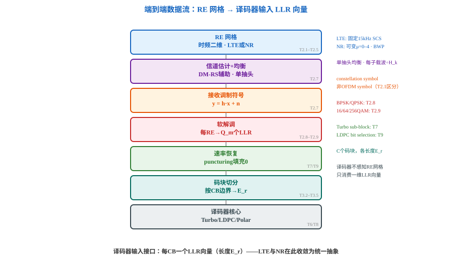

# T2.6 从资源网格到译码器输入：端到端数据流与接口边界
## 本节学习目标

[[T2.1_OFDM_subcarrier_spacing_basics|T2.1]]–[[T2.5_MCS_modulation_order_target_code_rate|T2.5]] 分别构建了 OFDM 原理、NR 时频结构、频域资源网格、LTE 帧结构和 MCS 参数。本节把这些零件组装成一条完整的端到端数据流：从 RE 网格上的复数调制符号，到译码器核心消费的一维 LLR 向量。

先区分这条链上的三个关键转换节点：

| 术语 | 英文 | 先这样理解 |
|:---|:---|:---|
| 软解调 | soft demodulation | 将接收复数调制符号 $y$ 转为每个编码比特的 LLR 值。 |
| 速率恢复 | rate recovery | 将 LLR 按发送端速率匹配的逆过程重新映射到编码母码。 |
| 码块切分 | code block segmentation | 将码字级 LLR 序列按 TB/CB 边界切为每 CB 的 LLR 向量。 |

- 画出从 RE 网格到译码器输入的完整数据流，标注每步对应的后续章节。
- 计算码字级 LLR 总长度 $L = N_{RE}^{data} \cdot Q_m$。
- 解释译码器对 RE 网格的不可见性——输入仅是一维 LLR 向量。
- 说明 puncturing 位置的 LLR 处理：$LLR = 0$（中性值）。
- 明确 LTE/NR 在 RE 网格层和速率匹配层的差异范围及译码器接口的收敛点。

## 前置知识检查

| 问题 | 需要达到的程度 |
|:---|:---|
| RE 网格是什么？ | 时频二维格点，每 RE 承载一个调制符号（[[T2.3_NR_frequency_resource_grid|T2.3]]）。 |
| $Q_m$ 是什么？ | 每调制符号承载 $Q_m$ 个比特（[[T2.5_MCS_modulation_order_target_code_rate|T2.5]]）。 |
| LLR 是什么？ | 对数似然比，正值→更像 0，幅度→可靠度（[[T1.5_LLR_soft_decision|T1.5]]）。 |

## 完整端到端数据流

各阶段对应的后续章节：

| 阶段 | 操作 | 详述章节 |
|:---|:---|:---|
| 信道估计与均衡 | DM-RS/CSI-RS 辅助，单抽头均衡 | [[T2.10_OFDM_channel_estimation_DMRS|T2.10]]、[[T2.11_OFDM_equalization_CSI_SINR|T2.11]] |
| 软解调 | 每 RE 复数符号 → $Q_m$ 个逐比特 LLR | [[T2.13_BPSK_QPSK_soft_demapping|T2.13]]（BPSK/QPSK）, [[T2.14_QAM_Max_Log_MAP_demapping|T2.14]]（QAM） |
| 速率恢复 | LLR 反填 circular buffer，puncturing 位填 0 | T7（LTE Turbo）, T9（NR LDPC） |
| 码块切分 | 码字级 LLR → 按 CB 边界切为 $C$ 个向量 | [[T3.2_transport_code_block_filler_bits|T3.2]]–[[T3.5_NR_Polar_segmentation_crc|T3.5]] |
| 译码 | Turbo / LDPC / Polar 迭代译码 | T6（Turbo）, T8（LDPC）, T10（Polar） |



## 关键转换公式

**有效数据 RE 数**：扣除控制区域和参考信号占用：

$$
N_{RE}^{data} = N_{PRB} \cdot N_{symb}^{data} \cdot 12 - N_{RE}^{RS}
\tag{1}
$$

**码字级 LLR 总长度**：

$$
L = N_{RE}^{data} \cdot Q_m
\tag{2}
$$

**每 CB 的 LLR 向量长度**（速率恢复后）：

$$
E_r = f_{rate\_recovery}(L, r, C)
\tag{3}
$$

其中 $r$ 为码块编号，$C$ 为总码块数。完整公式见 T7/T9。

## 译码器对 RE 网格的不可见性

译码器核心的关键设计原则：输入是单一的按码块组织的一维 LLR 向量——不感知：

- BWP 配置和 PRB 编号
- DM-RS/CSI-RS 时频位置
- 时隙边界和 OFDM 符号编号
- Numerology（μ）和 SCS

这些在上游已被剥离。Descriptor（[[T4.6_decoder_interface_contracts|T4.6]]/[[T9.0_TS38214_MCS_TBS_decoder_descriptor|T9.0]]）保存调度参数（$K_r$、$E_r$、RV、HARQ process），不保存 RE→LLR 的映射历史。

## Puncturing 处理

速率匹配中被打孔丢弃的比特在接收端无观测。对应 LLR 初始化为 $LLR = 0$——中性值，语义为"不偏向 0 也不偏向 1"。区别于 $LLR \approx 0$（有信道观测但高度不确定，仍可能微弱偏向某一侧）。

## LTE 与 NR 的差异范围与收敛点

| 层 | LTE | NR | 状态 |
|:---|:---|:---|:---:|
| RE 网格 | 固定 SCS 15 kHz, PRB pair, DC 子载波 | 可变 SCS, BWP, Point A | **不同** |
| 速率匹配 | Turbo sub-block interleaver | LDPC bit selection / Polar interleaver | **不同** |
| 译码器输入 | 每 CB 一个 LLR 向量（长度 $E_r$） | 每 CB 一个 LLR 向量（长度 $E_r$） | **相同** |

两制式在译码器输入接口收敛——这是 T2 系列的终结点和 T3 系列的起点。

## Python 校验片段

```python
"""
@brief RE 网格参数 → LLR 序列长度转换 + puncturing 示例
@date 2026-07-27
"""


def llr_seq_len(n_prb: int, n_sym_data: int, n_re_rs: int, qm: int) -> int:
    """计算码字级 LLR 序列总长度。"""
    return (n_prb * n_sym_data * 12 - n_re_rs) * qm


for n_prb, ns, nrs, qm, desc in [
    (10, 12, 20, 2, "QPSK, 10 PRB"),
    (50, 12, 80, 6, "64QAM, 50 PRB"),
    (100, 12, 160, 4, "16QAM, 100 PRB"),
]:
    L = llr_seq_len(n_prb, ns, nrs, qm)
    n_re = n_prb * ns * 12 - nrs
    print(f"{desc:>20s}: N_RE={n_re:>5d}  Q_m={qm}  L={L:>6d}")

## Puncturing 示例
print("\nPuncturing: LLR = 0（中性）")
llrs = [3.2, -1.5, 0.0, 0.8, -0.3, 0.0, 2.1, -4.0]
punct = {2, 5}
for i, v in enumerate(llrs):
    print(f"  [{i}] {v:>5.1f}{' ← punctured' if i in punct else ''}")
```

期望输出：

```text
      QPSK, 10 PRB: N_RE= 1180  Q_m=2  L=  2360
   64QAM, 50 PRB: N_RE= 5920  Q_m=6  L= 35520
   16QAM, 100 PRB: N_RE=11840  Q_m=4  L= 47360

Puncturing: LLR = 0（中性）
  [0]   3.2
  [1]  -1.5
  [2]   0.0 ← punctured
  [3]   0.8
  [4]  -0.3
  [5]   0.0 ← punctured
  [6]   2.1
  [7]  -4.0
```

## 和 3GPP 协议的关系

| 协议依据 | 本节采用程度 |
|:---|:---|
| TS 38.211 §5 / TS 36.211 §7 | 调制映射入口；软解调公式见 [[T2.9_AWGN_noise_scaling|T2.9]]、[[T2.13_BPSK_QPSK_soft_demapping|T2.13]]–[[T2.14_QAM_Max_Log_MAP_demapping|T2.14]] |
| TS 38.212 §5 / TS 36.212 §5 | 码块分段入口；完整算法见 [[T3.2_transport_code_block_filler_bits|T3.2]]–[[T3.5_NR_Polar_segmentation_crc|T3.5]] |
| TS 38.214 §5.1.3.2 | $N_{RE}$ 完整定义（含 $N_{oh}^{PRB}$）见 [[T9.0_TS38214_MCS_TBS_decoder_descriptor|T9.0]] |

## 常见错误

| 错误 | 正确做法 |
|:---|:---|
| 未扣除参考信号 RE | $N_{RE}^{data}$ 需减去 DM-RS/CSI-RS/SSB 占用。 |
| puncturing LLR 填极值 | $LLR=0$（中性），不是 $±∞$。 |
| 译码器直接感知 RE 网格 | 译码器只消费 LLR 向量——物理映射已在上游剥离。 |

## 自测题

1. 从 RE 到译码器输入经历哪几层转换？
2. 为什么译码器不需要知道 BWP 配置？
3. puncturing LLR 为什么填 0？
4. LTE/NR 在译码器接口的同与不同？
5. $N_{PRB}=25, Q_m=4, N_{sym}^{data}=12, N_{RE}^{RS}=40$ → $L$ = ?

## 自测题参考答案

1. RE 接收符号→均衡→软解调→速率恢复→码块切分→译码器。2. 已在上游剥离——物理层抽象原则。3. 无观测=不偏向任一侧。4. 接口相同（每 CB LLR 向量），差异在 RE 网格和速率匹配层。5. $N_{RE}=3560, L=14240$。

## 本节验收

| 验收项 | 通过标准 |
|:---|:---|
| 数据流 | 画出 RE→均衡→软解调→速率恢复→切分→译码器。 |
| LLR 长度 | 从 $N_{PRB}, Q_m$ 计算 $L$。 |
| 物理层抽象 | 解释译码器对 RE 网格不可见性。 |
| puncturing | $LLR_{punctured}=0$。 |
| Python | 运行 RE→LLR 长度和 puncturing 示例。 |

## 资料与协议边界

| 资料 | 边界 |
| :--- | :--- |
| TS 38.211 §5 / TS 36.211 §7 | 调制映射入口；软解调见 [[T2.9_AWGN_noise_scaling|T2.9]]、[[T2.13_BPSK_QPSK_soft_demapping|T2.13]]–[[T2.14_QAM_Max_Log_MAP_demapping|T2.14]] |
| TS 38.214 §5.1.3.2 | $N_{RE}$ 完整定义见 [[T9.0_TS38214_MCS_TBS_decoder_descriptor|T9.0]] |

## 执行与证据记录

| 项目 | 记录 |
|:---|:---|
| 协议证据 | TS 38.211 §5.3（OFDM 基带生成）、§5.1（调制映射）；TS 38.212 §5.1（信道编码）。 |
| 证据边界 | 本节为资源网格到 LLR 的链路总览，具体协议表值由对应专题章节复现。 |

## 参考文献

- [3GPP, 2026] 3GPP TS 38.211, Rel-19, `38211-j30`, Physical channels and modulation, §5.
- [3GPP, 2026] 3GPP TS 38.214, Rel-19, `38214-j30`, Physical layer procedures for data, §5.1.3.2.
