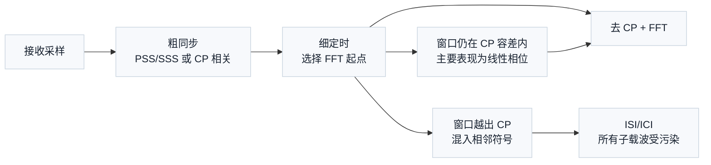
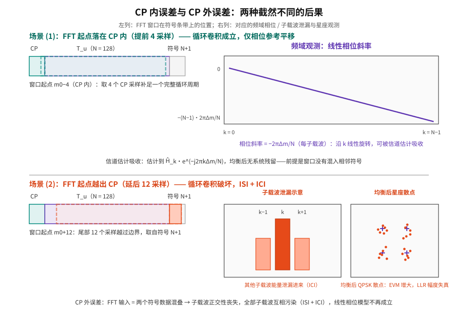
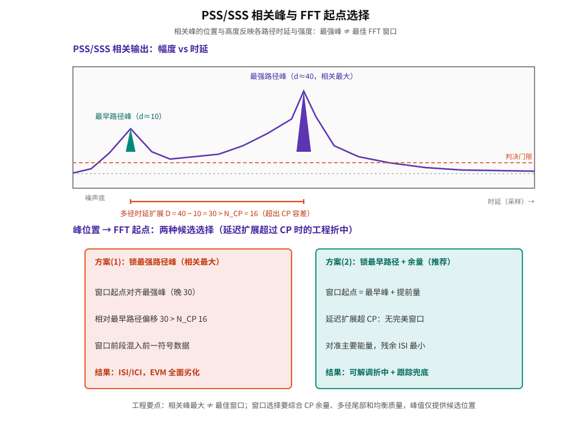

# T2.7 OFDM 定时同步：FFT 窗口、CP 容差与符号边界
## 本节学习目标

[[T2.1_OFDM_subcarrier_spacing_basics|T2.1]] 已经说明循环前缀（Cyclic Prefix, CP）保护 OFDM（正交频分复用，Orthogonal Frequency Division Multiplexing）符号的机制，[[T2.2_NR_numerology_time_domain_hierarchy|T2.2]] 给出了 NR 的符号和时隙层级。本节进入接收机工程的第一关：接收端输入是连续采样流，而非已经切分完成的 OFDM 符号。定时同步（Timing Synchronization）的任务是在采样流中确定每个 OFDM 符号的边界，并选择一个不会被相邻符号污染的快速傅里叶变换（Fast Fourier Transform, FFT）窗口。

先建立三个判断：

| 对象 | 概念说明 | 错误影响 |
|:---|:---|:---|
| 符号边界 | 当前 OFDM 符号从哪里开始 | 去 CP 位置错，FFT 输入混入错误采样。 |
| FFT 窗口 | 送入 FFT 的 $T_u$ 有用符号采样区间 | 窗口越出 CP 容差会产生 ISI/ICI。 |
| 定时容差 | CP 提供的可容忍误差范围 | 容差不是无限的，且会消耗多径保护余量。 |

- 解释为什么 OFDM 接收必须先做定时同步。
- 区分粗定时、细定时和跟踪。
- 说明定时误差落在 CP 内与落出 CP 的不同后果。
- 把定时误差如何进入信道估计、均衡和 LLR（对数似然比，Log-Likelihood Ratio）质量讲清楚。
- 明确 PSS（主同步信号，Primary Synchronization Signal）/SSS（辅同步信号，Secondary Synchronization Signal）、CP 相关和接收机实现自由度的协议边界。
- 用 3 张手绘 SVG 建立三种 FFT 起点、CP 内外误差、PSS/SSS 峰选择的时空直觉；精读 TS 38.211 §5.3.1 与 §7.4.2/§7.4.3 作为协议锚点。

## 前置知识检查

| 问题 | 需要达到的程度 |
|:---|:---|
| CP 的作用是什么？ | 知道 CP 是同一 OFDM 符号尾部副本，接收端会先丢弃。 |
| FFT 窗口是什么？ | 知道 FFT 只处理 $T_u$ 长度的有用符号采样。 |
| 多径时延扩展是什么？ | 知道前一符号的延迟副本可能侵入后一符号开头。 |
| PSS/SSS 是什么？ | 知道它们是 NR 小区搜索和同步相关的协议序列。 |

若需要复习 CP 机制，可先阅读 [[T2.1_OFDM_subcarrier_spacing_basics|T2.1]] 的相关图示与推导。T2.7 不重新推导 CP 将线性卷积等效为循环卷积的条件，而是讨论接收端如何选择受 CP 保护的 FFT 起点。

## 定时同步要解决什么问题（零基础开篇）

**是什么。** 发射端把 OFDM 符号按"CP + 有用区间 $T_u$"的节奏一个接一个连续发送；接收端拿到的是没有打标签的采样流。定时同步就是在采样流里回答两个问题：当前符号从哪里开始（符号边界），以及 FFT 取哪一段采样（FFT 窗口）。

**解决什么问题。** FFT 解调是"把一段时域采样投影到 $N$ 个子载波上"。只有投影区间恰好覆盖同一个 OFDM 符号的一个完整循环周期，投影结果才是"本符号各子载波上的值"；区间错位或跨符号，投影结果就是混杂信号，后续信道估计、均衡、软解调全部建立在错误数据上。

**直观例子。** 想象一列按固定节拍行驶的列车，每节车厢长度相同、首尾相接（OFDM 符号），其中每节车厢前半截（CP）是后半截（$T_u$）的复读广播。FFT 窗口是站台上检票口：只有对准车厢节拍线，检票人才能完整检过一节车厢；窗口对不准，就会把前一节车厢的乘客错配到本节（符号间泄漏），整个编组秩序被打乱。接收端必须先把自己的"钟"校准到发射端的节拍上，才开始解调。更进一步：检票口只要落在这节车厢的"复读区"（CP）内，虽然会读到复读内容，但内容仍属于本节车厢——这就是 CP 容差的含义（概念笔记 `Timing_Sync_定时同步` 用同一比喻）。

**正式定义。** 设第 $n$ 个符号的有用区间（$T_u$）真实起点为 $m_0$（以采样为单位），接收端选择的 FFT 窗口起点为 $\hat{m}_0$，则定时误差定义为

$$
\Delta m = \hat{m}_0 - m_0
\tag{1}
$$

工程上最关心的不是 $\Delta m$ 是否严格为 0，而是窗口是否仍落在 CP 可以吸收的范围内。CP 允许接收端把 FFT 起点放在一个小区间内；只要窗口没有混入前后符号的有效数据，FFT 后仍可以保持循环卷积结构。

## FFT 窗口选择的约束

OFDM 的 FFT 解调隐含一个强前提：FFT 积分窗口必须覆盖同一个 OFDM 符号的有用区间。如果窗口取错，接收端做的就不是"把当前符号的频域子载波恢复出来"，而是对一段混杂信号做投影。

为什么"落在 CP 内"就能保持正确性？因为 CP 是符号尾部 $N_{CP}$ 个采样的副本。设符号占用采样 $[0, N + N_{CP})$，CP 段为 $[0, N_{CP})$，它是 $[N, N+N_{CP})$ 的复制。若窗口起点 $w_0 \in [0, N_{CP}]$，则窗口 $[w_0, w_0+N)$ 的内容是"CP 尾部 $(N_{CP}-w_0)$ 个采样 + 有用区间前 $(N - N_{CP} + w_0)$ 个采样"。按循环结构，这两段拼起来正好是有用区间的一个循环移位（cyclic shift）：窗口内没有混入任何相邻符号的数据，FFT 输出只差一个每子载波线性相位。这就是 CP"吸收定时误差"的机制——也是图 1 中"安全起点区间"的由来。

若窗口起点晚于 $N_{CP}$，窗口尾部会伸进下一符号；若早于多径污染边界（见下节），窗口头部会混入前一符号的延迟副本。两者都破坏循环卷积假设。

## 接收机定时同步链路总览（图示）



图示（图 4，Mermaid 流程）的读图顺序是：接收端先在连续采样中找粗同步峰，再结合 CP、多径和参考信号选择细定时位置，最后丢弃 CP 并取 $T_u$ 长度做 FFT。窗口误差仍落在 CP 容差内时，主要问题是频域线性相位；窗口越出 CP 时，FFT 输入直接混入相邻符号，当前符号的所有子载波都会被污染。

## 教学例子：三种 FFT 起点的数值手算（N=128, N_CP=16, D=10）

假设一个教学 OFDM 参数为：

| 参数 | 数值 | 含义 |
|:---:|---:|:---|
| $N$ | 128 | IFFT（逆快速傅里叶变换，Inverse Fast Fourier Transform）/FFT 有用采样点数。 |
| $N_{CP}$ | 16 | CP 采样点数。 |
| 信道最大时延 | 10 | 最晚多径比最早路径晚 10 个采样。 |

接收端有三个候选 FFT 起点：

| 候选 | 相对理想起点 | 是否推荐 | 原因 |
|:---:|---:|:---:|:---|
| A | $-6$ | 可用但偏早 | 仍在 CP 容差内，频域主要多一个相位斜率；但只剩 $16-10-6=0$ 个采样余量，抗漂移差。 |
| B | $0$ | 推荐 | 与理想有用符号起点一致，CP 全部用于吸收多径。 |
| C | $+9$ | 风险高 | 延后太多，本符号尾部可能被截断，下一符号开头进入 FFT 窗口。 |

![图 1：三种 FFT 起点 vs CP 容差与多径时序 — 符号条带（CP=16、T_u=128），多径污染区 [0,10) 与干净余量区 [10,16)，窗口 A/B/C 与安全起点区间 [m0−6, m0]](assets/T2.7_fft_window_cp_margin.svg)

**手算一：安全起点区间。** 以符号起点（CP 起点）为 0，窗口起点为 $w_0$。窗口 $[w_0, w_0 + 128)$ 不混入相邻符号的条件有二：

1. 不混入前一符号：$w_0 \ge D = 10$（延迟副本最早在采样 10 结束，即 $[0,10)$ 是污染区）；
2. 不混入后一符号：$w_0 + 128 \le 128 + 16$，即 $w_0 \le 16$。

所以安全区间是 $w_0 \in [10, 16]$，换算成相对理想起点 $m_0=16$ 的偏移就是 $[m_0-6, m_0]$——与图 1 的绿色区间一致。A（$w_0=10$）在左边界、余量 0；B（$w_0=16$）在右边界、余量 6；C（$w_0=25$）越界，窗口尾部 $25+128-144=9$ 个采样取自符号 N+1（约 7% 的窗口采样是相邻符号数据）。

**手算二：CP 内误差的频域相位（候选 A）。** 窗口内容 = 有用区间的循环移位（提前 6 采样），由 DFT（离散傅里叶变换，Discrete Fourier Transform）循环移位性质，子载波 $k$ 上的输出乘上相位因子 $e^{-j2\pi k\Delta m/N}$。取 $\Delta m = -6$、$N=128$，相位 $\theta_k = -2\pi k\cdot(-6)/128 = 3\pi k/32$：

| 子载波 $k$ | $\theta_k$ | 说明 |
|:---:|:---:|:---|
| 0 | $0$ | 直流子载波无相位偏移。 |
| 1 | $3\pi/32 \approx 16.9°$ | 相位随 $k$ 线性增长。 |
| 16 | $3\pi/2 = 270°$ | 已经旋转大半圈。 |
| 32 | $3\pi = 540° \equiv 180° \ (\mathrm{mod}\ 360°)$ | 越过 $2\pi$ 后卷绕。 |
| 64 | $6\pi \equiv 0°$ | 卷绕回 $0°$，周期为 $N/\gcd(N,6)=64$ 个子载波。 |

这组数值说明两件事：第一，相位是"线性斜率"而不是随机散布——信道估计能在每个子载波上把 $\theta_k$ 吸收进 $\hat{H}_k$；第二，斜率会随 $\Delta m$ 变化，若跟踪不及时更新，$\hat{H}_k$ 里的相位参考过期，星座仍会缓慢旋转。

**手算三：预算公式。** 若窗口提前量为 $a$（$a=-\Delta m$ 当 $\Delta m<0$），最大多径时延为 $D$，CP 长度为 $N_{CP}$，一个保守约束是：

$$
a + D \leq N_{CP}
\tag{2}
$$

式 (2) 中 $a$ 不是越大越好。提前太多会降低对定时漂移的余量；延后太多会截掉本符号尾部。实际系统还要考虑滤波器群时延、采样率转换延迟、射频链路固定延迟和多径统计。例如把"滤波器群时延 4 采样 + 射频固定延迟 2 采样"纳入预算：$a + 10 + 6 \le 16$ 得 $a \le 0$——固定延迟已经吃满 CP 容差，必须精确对齐或另想办法（这正是 [[T2.19_OFDM_windowing_filtering|T2.19]] 里发射/接收滤波与定时预算的衔接点）。

这个例子说明：定时同步不是"相关峰最大就结束"。最强相关峰可能对应最强路径而不是最早路径；若把 FFT 起点放得太晚，虽然当前主径能量强，但多径尾部和下一符号边界会压缩可用余量。工程接收机常把峰值、CP 余量、EVM（误差矢量幅度，Error Vector Magnitude）、DM-RS（解调参考信号，Demodulation Reference Signal）估计质量和跟踪稳定性一起判断。

## CP 内误差与 CP 外误差

定时误差落在 CP 内时，系统不一定"完全无影响"。对于多径信道，选择不同 FFT 起点会改变每个子载波上的相位参考。由 DFT 循环移位性质（时域循环移位 $\Delta m$ $\Leftrightarrow$ 频域乘 $e^{-j2\pi k\Delta m/N}$），FFT 输出为：

$$
Y_k \approx H_k X_k e^{-j2\pi k\Delta m/N} + N_k
\tag{3}
$$

式 (3) 逐符号解释：$Y_k$ 是第 $k$ 个子载波上的 FFT 输出；$H_k$ 是信道频响；$X_k$ 是发送的调制符号；$e^{-j2\pi k\Delta m/N}$ 是窗口偏移引入的相位因子（$k$ 越大旋转越多，这就是"线性相位斜率"）；$N_k$ 是噪声。约等号说明它仍是"每子载波独立"的结构——只是相位参考变了。

这类相位通常可以被信道估计吸收，因为接收端估计到的是包含该相位参考的等效信道 $\tilde{H}_k = H_k e^{-j2\pi k\Delta m/N}$。但如果窗口越出 CP，问题就不再只是相位。FFT 输入会包含前一符号或后一符号的有效数据，循环卷积假设被破坏：

$$
Y_k \neq H_k X_k + N_k
\tag{4}
$$

式 (4) 的不等式意味着输出中混入了相邻符号和其他子载波的成分，表现为符号间干扰（Inter-Symbol Interference, ISI）和子载波间干扰（Inter-Carrier Interference, ICI）。此时每个子载波不再只对应自己的 $X_k$，所有子载波互相污染，且污染量随窗口越界深度增大——不存在"可被估计吸收"的简单结构。



读图要点：图 2 上半部分的三条信息链是"窗口起点在 CP 内 $\to$ 循环卷积成立 $\to$ 只有线性相位斜率"；下半部分则是"窗口起点越过符号边界 $\to$ FFT 输入混入相邻符号 $\to$ 子载波泄漏 + 星座扩散"。对比两者可以看出：CP 内误差是"可建模、可吸收、可跟踪"的良性问题，CP 外误差是"不可建模、全符号污染"的硬错误。

## 深入理解：定时误差的三种观测形态

定时误差可以从三个角度观察：

| 观测域 | 看什么 | 典型诊断 |
|:---|:---|:---|
| 时域相关 | PSS/SSS 或 CP 相关峰的位置和形状 | 多峰、峰宽、峰值抖动说明多径或低 SNR（信噪比，Signal-to-Noise Ratio）下定时不稳。 |
| 频域相位 | DM-RS 估计出的子载波相位斜率 | 线性相位斜率可能来自 CP 内窗口偏移，也可能来自 SFO（采样时钟偏移，Sampling Frequency Offset）。 |
| 星座/EVM | 均衡后星座点散布 | CP 外误差通常让整符号 EVM 变差，且不只是一条平滑相位线。 |

这三种观测不能互相替代。只看相关峰容易忽略后续均衡质量；只看 EVM 又难以区分定时、频偏和信道估计误差。严谨的日志应至少保存 `timing_offset`、`fft_start`、相关峰度量、DM-RS 相位斜率和 EVM。

## 粗同步、细同步与定时跟踪（三层结构与状态交接）

定时同步不是一个单次动作。实际接收机通常分三层处理：

| 阶段 | 输入 | 常见方法 | 输出 |
|:---|:---|:---|:---|
| 粗同步 | 宽范围接收采样 | PSS/SSS 相关峰、能量检测 | 大致帧/符号位置。 |
| 细同步 | 粗同步附近采样 | CP 相关、DM-RS 辅助、最大似然（Maximum Likelihood, ML）搜索 | 更精确的 FFT 窗口。 |
| 定时跟踪 | 连续时隙或连续符号 | 参考信号相位/相关峰漂移 | 慢漂移修正量。 |

PSS/SSS 适合初始小区搜索和粗定时，因为它们在 SS/PBCH block（同步信号/物理广播信道块，Synchronization Signal/Physical Broadcast Channel block，下文简称 SSB）中有协议规定的位置和序列（见"协议锚点精读"一节）。CP 相关利用"CP 是符号尾部副本"的结构：把候选 CP 段与候选符号尾部相乘累加，相关峰高的位置更可能是符号边界。DM-RS 辅助细同步则利用已知参考信号，让定时选择与后续信道估计质量一致。

一个接收机通常不会每个 OFDM 符号都从零开始做全范围搜索。更常见的状态交接结构是：

1. 初始接入或重捕获时做大范围粗搜索。
2. 在候选窗口附近做细同步。
3. 成功解调后进入跟踪状态，只估计慢变化偏移。
4. 若 CRC（循环冗余校验，Cyclic Redundancy Check）、EVM、相关峰或频偏指标异常，再触发重捕获。

这条状态链对译码器也重要。若定时跟踪已经失锁，但接收机仍继续输出 LLR，译码器会收到看似完整、实际已污染的软信息。工程接口应有"前端同步状态"或"LLR quality valid"之类的诊断字段，至少在仿真日志中保存。

**峰到窗口的映射（图 3）。** 相关峰的位置与高度分别对应多径时延与路径强度，而"最强峰"经常是反射路径。图 3 给出两种候选策略的对比：锁最强峰（窗口起点晚 30 采样，超出 CP 容差，前段混入前一符号）vs 锁最早路径 + 余量（延迟扩展超 CP 时无完美窗口，但把残余 ISI 压到最小，再交给跟踪兜底）。这也解释了调试案例库中的"锁到强反射路径"案例。



## 协议锚点精读：TS 38.211 给定时同步提供了什么

本节之前的内容大多是接收机工程模型；协议层面，3GPP 规定的是"信号结构"，不是"同步算法"。以下是精读本地抽取件后的协议锚点清单（本地路径：`3GPP_Rel19/processed/TS_38.211_38211-j30/full.md` 与 `source.pdf`）。

### 锚点 1：OFDM 基带信号生成与 CP 长度（§4.1、§4.2、§5.3.1）

§4.1 定义统一时间单位：$T_c = 1/(\Delta f_{max} N_f)$，其中 $\Delta f_{max} = 480\cdot10^3$ Hz、$N_f = 4096$（即 $T_c \approx 0.509$ ns）；$\kappa = T_s/T_c = 64$，$T_s = 1/(\Delta f_{ref} N_{f,ref})$、$\Delta f_{ref} = 15\cdot10^3$ Hz、$N_{f,ref} = 2048$（即 $T_s = 32.55$ ns，LTE 参考采样周期）。

§4.2 Table 4.2-1 规定子载波间隔（Subcarrier Spacing, SCS）配置：$\Delta f = 2^{\mu}\cdot 15$ kHz，$\mu \in \{0,1,\ldots,6\}$（15/30/60/120/240/480/960 kHz）；只有 $\mu=2$（60 kHz）同时支持普通 CP 与扩展 CP。

§5.3.1 给出除 PRACH（物理随机接入信道，Physical Random Access Channel）和 RIM-RS 外所有信道/信号的时域连续信号（抽取件 full.md 第 1479–1485 行，与 source.pdf 第 27 页文本层核对一致）：

$$
s_l^{(p,\mu)}(t) = \hat{s}_l^{(p,\mu)}(t),\quad t_{start,l}^{\mu} \le t < t_{start,l}^{\mu} + T_{symb,l}^{\mu}
$$

$$
\hat{s}_l^{(p,\mu)}(t) = \sum_{k=0}^{N_{grid,x}^{size,\mu}N_{sc}^{RB}-1} a_{k,l}^{(p,\mu)} e^{j2\pi\left(k + k_0^{\mu} - \frac{N_{grid,x}^{size,\mu}N_{sc}^{RB}}{2}\right)\Delta f \left(t - N_{CP,l}^{\mu}T_c - t_{start,l}^{\mu}\right)}
$$

$$
T_{symb,l}^{\mu} = \left(N_u^{\mu} + N_{CP,l}^{\mu}\right) T_c
$$

逐符号解释：$a_{k,l}^{(p,\mu)}$ 是符号 $l$ 内子载波 $k$ 的调制符号（端口 $p$）；求和范围是整个载波网格 $N_{grid,x}^{size,\mu}N_{sc}^{RB}$ 个子载波（$N_{sc}^{RB}=12$）；指数里的 $-\frac{N_{grid,x}^{size,\mu}N_{sc}^{RB}}{2}$ 是把频率平移使信号关于直流对称；关键在时间项 $t - N_{CP,l}^{\mu}T_c - t_{start,l}^{\mu}$：每个符号的"相位原点"是**去掉 CP 之后的有用区间起点** $t_{start,l}^{\mu} + N_{CP,l}^{\mu}T_c$——这正是接收端 FFT 窗口应当对准的时刻。$T_{symb,l}^{\mu}$ 是符号总时长 = 有用部分 + CP。符号按 $t_{start,l}^{\mu} = t_{start,l-1}^{\mu} + T_{symb,l-1}^{\mu}$ 连续排列（§5.3.1 递推式）。

CP 长度由同一节给出（三情形分段公式，按 source.pdf 第 27 页文本层核对）：

$$
N_u^{\mu} = 2048\kappa \cdot 2^{-\mu}
$$

$$
N_{CP,l}^{\mu} =
\begin{cases}
512\kappa \cdot 2^{-\mu} & \text{extended cyclic prefix} \\
144\kappa \cdot 2^{-\mu} + 16\kappa & \text{normal cyclic prefix, } l = 0 \text{ or } l = 7 \cdot 2^{\mu} \\
144\kappa \cdot 2^{-\mu} & \text{normal cyclic prefix, otherwise}
\end{cases}
$$

逐符号解释：$\kappa=64$ 使所有长度以 $T_c$ 为单位；$l$ 是**子帧内**符号序号（§5.3.1 定义域 $l \in \{0,1,\ldots,N_{symb}^{subframe,\mu}-1\}$），$l = 7\cdot2^{\mu}$ 是半子帧边界符号（$\mu=0$ 时为符号 7，$\mu=1$ 时为符号 14，$\mu=2$ 时为符号 28）。三个分支的归属是：扩展 CP（extended，仅 $\mu=2$）为 $512\kappa\cdot2^{-\mu}$（$\mu=2$ 时 $4.17\ \mu s$）；普通 CP 的长符号（$l=0$ 或 $l=7\cdot2^{\mu}$）为 $144\kappa\cdot2^{-\mu}+16\kappa$，即在常规值上多 $16\kappa = 0.52\ \mu s$（$\mu=0$ 时为 160 采样）；普通 CP 其余符号为 $144\kappa\cdot2^{-\mu}$。

把 $T_c$ 单位换算成时长，得到接收端定时预算的基础数值表：

| $\mu$ | $\Delta f$ | $T_u = N_u^{\mu}T_c$ | CP（常规符号） | CP（$l=0$ 或 $l=7\cdot2^{\mu}$） | 说明 |
|:---:|:---:|:---:|:---:|:---:|:---|
| 0 | 15 kHz | 66.67 $\mu s$ | 4.69 $\mu s$ | 5.21 $\mu s$ | 子帧内符号 0 和 7 为长 CP。 |
| 1 | 30 kHz | 33.33 $\mu s$ | 2.34 $\mu s$ | 2.86 $\mu s$ | 子帧内符号 0 和 14 为长 CP。 |
| 2 | 60 kHz | 16.67 $\mu s$ | 1.17 $\mu s$ | 1.69 $\mu s$ | 扩展 CP 为 4.17 $\mu s$（仅此 $\mu$）。 |
| 3 | 120 kHz | 8.33 $\mu s$ | 0.59 $\mu s$ | 1.11 $\mu s$ | 120 kHz 下 CP 已不足 0.6 $\mu s$。 |

**接收端含义。** CP 长度就是协议给接收端开的"定时误差预算"：15 kHz 下窗口起点可以容忍约 $\pm 4.7\ \mu s$ 的偏移（相对符号起点），120 kHz 下只剩 $\pm 0.59\ \mu s$——SCS 越高，定时余量越紧，这正是高频段接收机对时钟精度要求更高的原因。协议要求符号按时长连续排列，因此接收端必须逐符号找到边界才能取窗口；**但协议没有规定用哪种算法找**。

### 锚点 2：PSS/SSS 序列与 SS/PBCH block 结构（§7.4.2、§7.4.3）

§7.4.2.1 规定物理层小区 ID（Physical-layer Cell Identity）：共 1008 个，

$$
N_{ID}^{cell} = 3 N_{ID}^{(1)} + N_{ID}^{(2)},\quad N_{ID}^{(1)} \in \{0,1,\ldots,335\},\ N_{ID}^{(2)} \in \{0,1,2\}
$$

主同步信号（Primary Synchronization Signal, PSS）序列（§7.4.2.2.1，与 source.pdf 第 144 页文本层核对）：

$$
d_{PSS}(n) = 1 - 2x(m),\quad m = \left(n + 43 N_{ID}^{(2)}\right) \bmod 127,\quad 0 \le n < 127
$$

其中 $x(i+7) = (x(i+4) + x(i)) \bmod 2$，初值 $[x(6) x(5) x(4) x(3) x(2) x(1) x(0)] = [1\ 1\ 1\ 0\ 1\ 1\ 0]$。

逐符号解释：$d_{PSS}(n)$ 是 127 长的二值序列（$\pm1$）；$x(\cdot)$ 是一个 127 长的 m 序列（本原多项式生成的伪随机序列），$(1-2x)$ 把 0/1 映射为 $+1/-1$；$43 N_{ID}^{(2)} \bmod 127$ 是循环移位量——$N_{ID}^{(2)}$ 只有 3 个取值，所以 PSS 只有 3 个候选序列，接收端粗同步只需与 3 个已知序列做相关。PSS 映射在 SS/PBCH block 的第 0 个符号（Table 7.4.3.1-1，见下），这正是"PSS 相关给出粗定时 + 小区组内 ID"的协议依据。

辅同步信号（Secondary Synchronization Signal, SSS）序列（§7.4.2.3.1，source.pdf 第 145 页）：

$$
d_{SSS}(n) = \left[1 - 2x_0\left((n + m_0) \bmod 127\right)\right]\left[1 - 2x_1\left((n + m_1) \bmod 127\right)\right],\quad 0 \le n < 127
$$

$$
m_0 = 15\left\lfloor N_{ID}^{(1)}/112 \right\rfloor + N_{ID}^{(2)},\quad m_1 = N_{ID}^{(1)} \bmod 112
$$

其中 $x_0(i+7) = (x_0(i+4) + x_0(i)) \bmod 2$、$x_1(i+7) = (x_1(i+1) + x_1(i)) \bmod 2$，初值均为 $[0\ 0\ 0\ 0\ 0\ 0\ 1]$。

逐符号解释：$d_{SSS}(n)$ 是两个不同 m 序列乘积（Gold 序列结构），通过 $m_0$、$m_1$ 两个移位量携带 $N_{ID}^{(1)}$：$\lfloor N_{ID}^{(1)}/112\rfloor \in \{0,1,2\}$ 与 $N_{ID}^{(2)}$ 一起决定 $m_0$（每 112 个 $N_{ID}^{(1)}$ 一组），$m_1 = N_{ID}^{(1)} \bmod 112$ 在组内区分 112 个小区，共 $3\times112=336$ 种 $N_{ID}^{(1)}$，配合 3 个 PSS 正好编码 1008 个小区 ID。接收端把 336 个 SSS 候选与接收信号相关（或做 FFT 域处理）即可完成小区 ID 检测。注意：本地抽取件 PDF 文本层在 $m_0$ 公式处有字形噪声（"$+5\,N_{ID}^{(2)}$"与"$+N_{ID}^{(2)}$"的歧义），此处按标准形式转写；数值自洽性（$m_0\in\{0,1,2,15,16,17,30,31,32\}$ 与 336 种 $N_{ID}^{(1)}$ 一一对应）已验证。

SS/PBCH block（§7.4.3.1）时频结构：时域 4 个 OFDM 符号（编号 0–3），频域 240 个连续子载波（编号 0–239），PSS/SSS/PBCH（物理广播信道，Physical Broadcast Channel）/DM-RS 的映射由 Table 7.4.3.1-1 规定：

| 信道/信号 | OFDM 符号 $l$（相对 SSB 起点） | 子载波 $k$（相对 SSB 起点） |
|:---|:---:|:---|
| PSS | 0 | 56, 57, …, 182 |
| SSS | 2 | 56, 57, …, 182 |
| Set to 0 | 0 | 0, 1, …, 55, 183, 184, …, 239 |
|  | 2 | 48, 49, …, 55, 183, 184, …, 191 |
| PBCH | 1, 3 | 0, 1, …, 239 |
|  | 2 | 0, 1, …, 47, 192, 193, …, 239 |
| DM-RS for PBCH | 1, 3 | $0+v, 4+v, 8+v, \ldots, 236+v$ |
|  | 2 | $0+v, 4+v, \ldots, 44+v, 192+v, \ldots, 236+v$ |

其中 $v = N_{ID}^{cell} \bmod 4$。PSS 与 SSS 各占 127 个子载波（$k = 56..182$），正好与序列长度 127 对应——接收端做 127 点相关即可获得"符号级"粗定时；SSB 内 PSS、SSS、PBCH、DM-RS 使用相同的 CP 长度与子载波间隔（协议强制，UE shall assume），且都从天线端口 4000 发送。SS/PBCH block 分型：type A（FR1（频率范围 1，Frequency Range 1））$\mu \in \{0,1\}$、$k_{SSB} \in \{0,\ldots,23\}$；type B（FR2-1（频率范围 2，Frequency Range 2））$\mu \in \{3,4\}$（§7.4.3.1，source.pdf 第 146 页）。SSB 的时域监测位置由 §7.4.3.2 转引 TS 38.213 §4.1、§4.4、§11.6——即"SSB 在哪些符号上出现"的 case A/B/C 模式属于 TS 38.213 的内容，不在本讲义展开。

### 锚点 3：协议强制 vs 接收机实现自由度

| 项目 | 协议强制（UE shall） | 接收机实现自由度 |
|:---|:---|:---|
| 符号结构 | $N_u^{\mu}$、$N_{CP,l}^{\mu}$ 数值与符号连续排列（§5.3.1） | 无——接收端必须按此结构取窗口。 |
| SSB 位置 | SSB 由 4 符号 × 240 子载波构成，PSS/SSS/PBCH/DM-RS 按 Table 7.4.3.1-1 映射；UE 在 TS 38.213 规定的时域位置监测 | PSS/SSS 相关器的实现方式、长度、门限。 |
| 同步信号序列 | $d_{PSS}$、$d_{SSS}$ 的生成公式与小区 ID 编码（§7.4.2） | 检测算法（时域相关、FFT 域相关、频域估计）。 |
| 窗口起点 | 协议不规定窗口起点如何选择 | CP 相关、DM-RS 辅助、ML 搜索、跟踪滤波器带宽、失锁门限全部自由。 |

一句话边界：**协议提供"可被检测的信号结构"（符号节奏、CP 长度、PSS/SSS 序列与位置），不规定 UE 必须使用哪一种定时同步算法**。CP 相关、PSS/SSS 搜索、DM-RS 辅助细同步、跟踪滤波器和异常检测阈值都属于接收机实现自由度。

本节资料来源与边界汇总：

| 资料 | 本节采用 | 边界 |
|:---|:---|:---|
| TS 38.211 §4.1/§4.2 | $T_c$、$\kappa$ 与子载波间隔配置 | 只取与定时预算相关的数值。 |
| TS 38.211 §5.3.1 | OFDM 基带信号生成公式与 CP 长度 | 不复现全部采样率和符号生成细节。 |
| TS 38.211 §7.4.2.1/§7.4.2.2/§7.4.2.3 | 小区 ID、PSS/SSS 序列与映射入口 | 序列生成只到"结构+长度"层，检测算法不在协议范围。 |
| TS 38.211 §7.4.3.1/§7.4.3.2 | SSB 时频结构与时域位置转引 | 不复现 case A/B/C 的具体符号模式（属 TS 38.213）。 |
| `Timing_Sync_定时同步` | 接收机实现解释 | 作为概念材料，不写成协议强制算法。 |
| [[T2.1_OFDM_subcarrier_spacing_basics|T2.1]] | CP 与 FFT 窗口的机制基础 | 本节不重复 [[T2.1_OFDM_subcarrier_spacing_basics|T2.1]] 的完整正交性推导。 |

本节也不展开随机接入的 timing advance 闭环；那属于上行时序控制和 MAC（媒体接入控制层，Medium Access Control）/RRC（无线资源控制，Radio Resource Control）过程，和这里的“接收端如何选择 FFT 窗口”不是同一层问题。

## 定时误差如何影响 LLR

译码器不直接看到定时误差。它看到的是软解调输出的 LLR。但定时误差会沿下面链路传播：

```text
FFT 窗口误差 -> 子载波正交性下降 -> 信道估计偏差/均衡残留
             -> 星座点旋转或扩散 -> LLR 符号/幅度错误
```

若窗口仍在 CP 内，主要风险是相位参考和估计一致性；若窗口越出 CP，风险变成全符号污染。对高阶 QAM（正交幅度调制，Quadrature Amplitude Modulation），星座点间距更小，同样的窗口偏差更容易造成边界比特 LLR 翻转。

## 工程检查点

| 检查项 | 应记录的证据 | 失败迹象 |
|:---|:---|:---|
| 粗同步峰 | peak index、peak-to-side ratio | 多个候选峰接近，帧起点不稳定。 |
| FFT 起点 | 相对 CP 起点的采样偏移 | 偏移靠近 CP 边缘，保护余量不足。 |
| EVM/星座 | 同步前后星座散布 | 同步后仍有整体旋转或扩散。 |
| BLER（块错误率，Block Error Rate）对比 | perfect timing vs practical timing | practical 曲线出现额外损失。 |
| 日志字段 | `timing_offset`, `peak_metric`, `fft_start` | 无法复现窗口选择。 |

## 扩展讲解：验证与实现关注点

定时同步在仿真里很容易被"理想函数"隐藏。许多链路脚本直接使用 perfect timing，把接收波形按真实信道路径信息对齐。这适合建立上界，但不能代表实际接收机。实际实现至少要回答四个问题：粗同步如何找到候选区域，细同步如何选择 FFT 起点，跟踪如何处理慢漂移，失锁如何被发现。

第一，粗同步的目标不是一次性精确到采样，而是把搜索范围缩小到可控窗口。PSS/SSS 相关峰可以提供小区搜索和粗时序线索，但在低 SNR、多径和强邻区环境下，相关峰可能有多个局部最大值。若接收机只取最大峰，可能锁到强反射路径而不是更适合 FFT 的窗口位置。工程日志应保存前几名候选峰，而不只保存最终峰值。

第二，细同步要把"峰值最大"翻译成"FFT 窗口最安全"。最安全的位置通常要保留 CP 余量，避免多径尾巴或后续定时漂移把窗口推出保护区。一个实用策略是先估计信道时延扩展，再把 FFT 起点放在既能覆盖主要能量、又不贴近 CP 边界的位置。这个策略不一定在所有信道模型中最优，但它比"固定取峰值"更容易解释和调试。

第三，跟踪环路必须区分慢漂移和瞬时异常。采样时钟误差、温漂和移动造成的路径变化通常是慢变化；突发干扰、深衰落和错误相关峰则可能是瞬时异常。如果跟踪环路带宽太宽，会追随噪声；带宽太窄，又跟不上真实漂移。验证时可构造低速、中速、高速三组信道，并记录 `timing_offset` 的平滑曲线，而不是只看最终 BLER。

第四，定时失败需要进入质量门控。若前端已经判断同步不可靠，还继续输出高幅 LLR，译码器会收到错误证据。工程接口可以把 `sync_valid`、`timing_metric`、`fft_start_margin` 作为诊断字段，至少在仿真和 bring-up 中保留。对硬件而言，这些字段还可驱动丢包、重捕获或降低 LLR 置信度。

| 验证场景 | 目的 | 预期观察 |
|:---|:---|:---|
| AWGN（加性白高斯噪声，Additive White Gaussian Noise）单径 | 检查同步基础逻辑 | 相关峰唯一，FFT 起点稳定。 |
| 多径 TDL（抽头延迟线，Tapped Delay Line） | 检查 CP 余量选择 | 最强峰与最佳 FFT 起点可能不同。 |
| 高速移动 | 检查跟踪带宽 | 相位和定时漂移需要连续修正。 |
| 低 SNR | 检查误锁保护 | 候选峰接近时应降低置信度。 |
| perfect/practical 对比 | 定位接收机损失 | practical BLER 相对 perfect 有可解释差距。 |

定时同步还会影响后续所有参考信号处理。FFT 起点变化会改变 DM-RS 的相位参考；如果信道估计和数据均衡使用同一个窗口，这个相位可以被吸收；如果估计窗口和数据窗口不一致，等效信道就会错配。因此仿真日志应把 `fft_start` 与 channel estimate、equalizer、soft demapper 的数据关联起来，不能只在同步模块内部保存。

## 调试案例库

| 案例 | 表现 | 定位步骤 | 修复方向 |
|:---|:---|:---|:---|
| 锁到强反射路径 | 相关峰很高，但 BLER 比 perfect timing 差很多 | 对比最早路径、最强路径和 EVM 最优窗口 | 改为 CP 余量约束下的窗口选择。 |
| 低 SNR 误锁 | 帧起点偶发跳变，CRC 成簇失败 | 保存 top-N 相关峰和峰比 | 增加峰值置信度门限和重捕获机制。 |
| 滤波器时延未扣除 | 所有场景 FFT 起点固定偏移 | 关闭滤波或补偿群时延后对比 | 在同步坐标里统一扣除固定延迟。 |
| SFO 伪装成定时漂移 | 长 burst 后 slot 末端 EVM 恶化 | 观察 timing drift 和 per-subcarrier phase slope | 把 SFO 跟踪接入定时环路。 |

这些案例的共同点是：错误不一定在同步模块内部立刻显性失败，而是通过 DM-RS residual、EVM、LLR 和 BLER 逐层放大。定时同步的验收不能只写"检测到峰值"，而要证明这个峰值选择使后续 FFT、信道估计和 LLR 都一致。

## 常见错误

| 错误 | 为什么错 | 正确做法 |
|:---|:---|:---|
| 认为 CP 内任意位置都完全等价 | CP 内窗口偏移仍会改变频域相位参考。 | 让信道估计和 FFT 窗口选择使用一致参考。 |
| 把定时同步当作协议固定算法 | 协议定义 PSS/SSS 和参考信号，算法是接收机实现。 | 文档中分清"信号结构"和"检测方法"。 |
| 只看峰值不看多径 | 最早路径、最强路径和最佳 FFT 窗口不一定相同。 | 结合 CP 余量、EVM 和信道估计质量选择窗口。 |
| 认为"长 CP 符号"是每个时隙首符号 | §5.3.1 的 $l$ 是子帧内序号，$l=7\cdot2^{\mu}$ 是半子帧边界（$\mu=0$ 时是符号 7 而非符号 14）。 | 按 $l=0$ 或 $l=7\cdot2^{\mu}$ 精确计算 CP 预算。 |
| 仿真一直用 perfect timing | 会隐藏实际接收机损失。 | 同时跑 perfect/practical 两组基线。 |

## 最小仿真矩阵

| 维度 | 建议取值 | 覆盖目的 |
|:---|:---|:---|
| 信道 | AWGN、单径、TDL 多径 | 区分纯噪声、固定时延和多径扩展。 |
| SNR | 高、中、低三点 | 检查相关峰置信度随噪声变化是否合理。 |
| 定时偏移 | CP 内、CP 边缘、CP 外 | 验证相位误差和 ISI/ICI 的边界。 |
| 参考信号 | PSS/SSS only、DM-RS assisted | 比较粗同步和细同步能力。 |
| 接收模式 | perfect timing、practical timing | 给出接收机实现损失。 |

每个仿真点至少保存 `fft_start`、`timing_offset`、相关峰度量、EVM 和 BLER。若文章或报告只给最终 BLER，没有同步度量，就无法证明问题来自定时还是来自后续均衡/译码。

实际排查时还应保存同步模块的候选列表，而不是只保存最终 `fft_start`。候选列表至少包含候选采样点、相关峰值、相对主峰差值、估计 CP 余量和该候选下的 DM-RS residual。这样可以复盘接收机为什么选择某个窗口，也能判断失败是搜索范围不足、峰值判决错误，还是后续跟踪把窗口慢慢推到 CP 边缘。

## 自测题

1. 为什么 FFT 窗口必须覆盖同一个 OFDM 符号的有用区间？
2. 定时误差落在 CP 内和越出 CP 的后果有什么本质差别？
3. CP 相关为什么能用于定时同步？
4. PSS/SSS 在定时同步中提供什么帮助？
5. 定时误差最终如何影响译码器输入？
6. TS 38.211 §5.3.1 中 $N_{CP,l}^{\mu}$ 的三种取值分别对应什么条件？$\mu=0$ 时它们的时长各是多少？
7. 为什么 PSS 只有 3 个候选序列，而小区 ID 有 1008 个？PSS/SSS 分别携带哪一部分信息？
8. 用本节参数（$N=128$、$N_{CP}=16$、$D=10$）独立算出安全起点区间，并说明窗口 A（$m_0-6$）的频域相位斜率。

## 自测题参考答案

1. 因为 FFT 解调依赖当前符号内部子载波的正交投影；混入相邻符号会破坏这个投影。
2. CP 内误差主要表现为可被估计吸收的相位参考变化；越出 CP 会混入相邻符号有效数据，产生 ISI/ICI。
3. 因为 CP 是有用符号尾部的副本，候选 CP 段与候选尾部段应具有较高相关性。
4. PSS/SSS 是协议定义的同步信号，接收端可用相关检测获得粗帧/符号位置和小区搜索线索。
5. 定时误差先破坏 FFT 输出，再影响信道估计和均衡，最终表现为星座点偏移、LLR 符号或幅度错误。
6. 三种情形：扩展 CP（$512\kappa\cdot2^{-\mu}$，仅 $\mu=2$，$4.17\ \mu s$）；普通 CP 且 $l=0$ 或 $l=7\cdot2^{\mu}$（$144\kappa\cdot2^{-\mu}+16\kappa$，$\mu=0$ 时 $5.21\ \mu s$）；普通 CP 其余符号（$144\kappa\cdot2^{-\mu}$，$\mu=0$ 时 $4.69\ \mu s$）。
7. PSS 只由 $N_{ID}^{(2)} \in \{0,1,2\}$ 决定（循环移位 $43N_{ID}^{(2)} \bmod 127$），所以只有 3 个序列；$N_{ID}^{(1)}$ 的 336 个取值由 SSS 的 $m_0$、$m_1$ 编码，两者联合给出 1008 个小区 ID。
8. 安全条件：$w_0 \ge D=10$ 且 $w_0 \le N_{CP}=16$，即 $w_0 \in [10,16]$，相对 $m_0=16$ 为 $[m_0-6, m_0]$。窗口 A（$\Delta m=-6$）的相位斜率 $\theta_k = 3\pi k/32$，在 $k=16$ 处为 $270°$，$k=32$ 处卷绕回 $180°$。

## 本节验收

| 验收项 | 通过标准 |
|:---|:---|
| 窗口模型 | 能画出 CP、$T_u$ 和 FFT 窗口的关系（图 1），并解释安全起点区间的两个边界条件。 |
| 误差分类 | 能区分 CP 内相位误差和 CP 外 ISI/ICI（图 2），并能用式 (3)/式 (4) 说明。 |
| 接收机流程 | 能说明粗同步、细同步、跟踪各自解决什么，以及峰到窗口的映射（图 3）。 |
| 数值能力 | 能独立完成 N=128/N_CP=16/D=10 的安全区间与相位斜率手算。 |
| 协议锚点 | 能指出 §5.3.1 的 $N_u^{\mu}$/CP 长度公式、Table 7.4.3.1-1 中 PSS/SSS 的位置，以及 §7.4.3.2 转引 TS 38.213。 |
| 协议边界 | 能说清 PSS/SSS 是协议信号结构，检测算法不是协议强制。 |
| 链路图理解 | 能按图示说明同步、FFT 窗口、CP 容差和越界污染的关系。 |

## 与相邻章节的衔接

T2.7 是 [[T2.8_OFDM_CFO_SFO_frequency_synchronization|T2.8]]–[[T2.12_MIMO_OFDM_layer_detection|T2.12]] 的入口条件。若 FFT 窗口没有稳定对齐，频偏估计会把定时偏差误读为相位斜率，信道估计会把窗口错误吸收到 $\hat{H}$，均衡器会在错误模型上输出 LLR。学习时应首先将定时同步视为时间参考建立问题，再进入 CFO（载波频偏，Carrier Frequency Offset）/SFO 的频率参考修正。

它也和 [[T2.19_OFDM_windowing_filtering|T2.19]] 有双向关系。发射端窗口/滤波可能引入固定群时延或改变 CP 余量，接收端定时同步必须把这些固定延迟和有效保护间隔纳入预算（见"教学例子"手算三）。最终这些误差都在 [[T2.17_OFDM_impairments_to_LLR|T2.17]] 收束为 LLR 可靠度问题。

## 资料与协议边界

本节的协议内容集中在"协议锚点精读"一节的四条锚点：TS 38.211 §4.1/§4.2（时间单位与子载波间隔配置）、§5.3.1（OFDM 基带信号生成与 CP 长度公式）、§7.4.2（小区 ID 与 PSS/SSS 序列）、§7.4.3（SS/PBCH block 时频结构与监测位置转引）。三层同步流程、三种 FFT 起点手算与工程检查点属于接收机工程模型，不属于协议条文。

| 维度 | 内容 |
|:---|:---|
| 协议规定 | 符号结构与节奏：$N_u^{\mu}$、$N_{CP,l}^{\mu}$ 的数值与符号连续排列（§5.3.1）；PSS/SSS 序列生成与小区 ID 编码（§7.4.2）；SSB 内各信号的时频位置（Table 7.4.3.1-1）；UE 在 TS 38.213 规定的时域位置监测。 |
| 协议不规定（实现域） | 定时同步算法本身：PSS/SSS 相关器的实现方式与长度、检测门限、窗口起点选择策略、跟踪滤波器带宽、失锁判定阈值、量化位宽——全部属于接收机实现自由度。 |
| 接收端义务边界 | 接收端必须按协议符号节奏逐符号取 FFT 窗口（窗口内容不得混入相邻符号），必须能检测协议给出的已知序列；但选择哪种算法、窗口取 CP 容差内的哪个位置，协议不做要求——只需链路指标（信道估计、均衡、LLR 质量）自洽。 |

一句话边界：**协议提供"可被检测的信号结构"（符号节奏、CP 长度、PSS/SSS 序列与位置），不规定 UE 必须使用哪一种定时同步算法**——这正是"协议锚点精读"中协议强制对照表的浓缩结论。

## 执行与证据记录

| 项目 | 记录 |
|:---|:---|
| 本地材料 | 使用 `rg` 定位 TS 38.211 §4.1、§4.2、§5.3.1、§7.4.2.1、§7.4.2.2、§7.4.2.3、§7.4.3.1、§7.4.3.2；协议文本以 `source.pdf` 文本层（第 27、144–147 页）与 `full.md` 抽取件交叉核对，并核验概念笔记 `Timing_Sync_定时同步`。 |
| 图解材料 | 本节新增 3 张手绘 SVG：`assets/T2.7_fft_window_cp_margin.svg`（图 1）、`assets/T2.7_timing_error_cp_in_out.svg`（图 2）、`assets/T2.7_pss_sss_candidate_selection.svg`（图 3）；语义色系按本节内容自定（有用数据=紫罗兰、CP/保护=深青、污染/越界=橙红），不沿用既有图资产配色；保留原 Mermaid 链路图（图 4）。 |
| 图解边界 | 图示只表达窗口/误差分类/峰选择的时空语义，不作为具体接收机状态机或协议时序图。 |
| 证据边界 | 协议公式均注明本地路径与核对方式；SSS $m_0$ 公式因抽取件字形噪声按标准形式转写并标注，未核验处不声称精确复现；定时同步算法本身不声明为协议内容。 |
| 工程验证 | `tools/audit_svg_layout.py` 对 3 张 SVG 全部 PASS；Y 坐标扫描（元素间距 ≥8px）PASS；`cairosvg` 1.5 倍渲染无异常；`tools/audit_latex_render.py` 审计通过。 |

- 2026-08-14 审核整改：补"资料与协议边界"必选章节。

## 参考文献

- [3GPP, 2026] 3GPP TS 38.211, Rel-19, `38211-j30`, Physical channels and modulation, §4.1, §4.2, §5.3.1, §7.4.2, §7.4.3. Local path: `3GPP_Rel19/processed/TS_38.211_38211-j30`（`full.md`、`content.md`、`sections.jsonl`、`source.pdf`）。
- [3GPP, 2026] 3GPP TS 38.213, Rel-19, §4.1/§4.4/§11.6（SSB 时域监测位置，经 §7.4.3.2 转引，本讲义未展开）。
- 项目概念笔记：`3gpp/docs/concepts/Timing_Sync_定时同步.md`。
