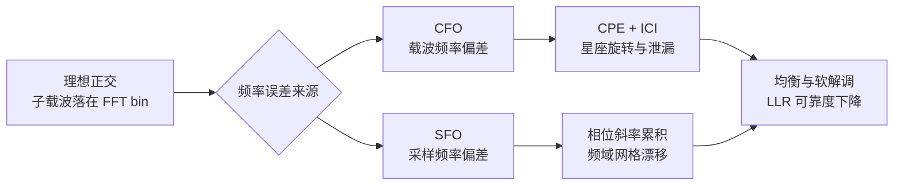
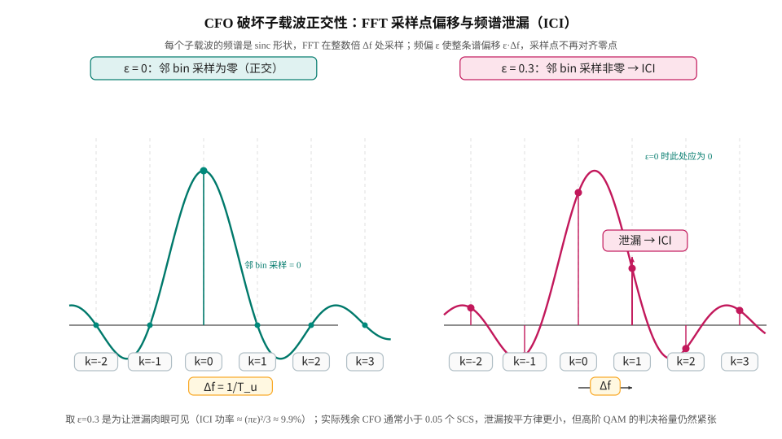
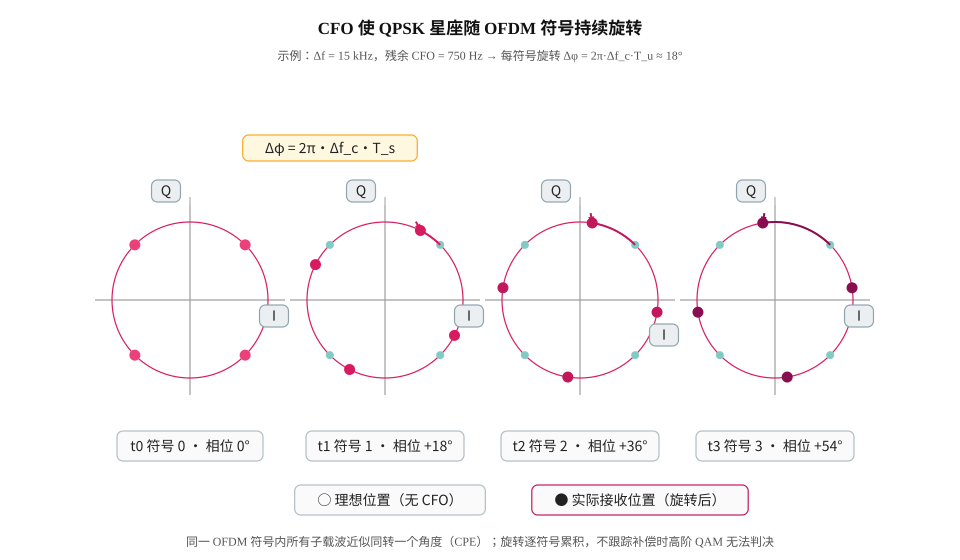
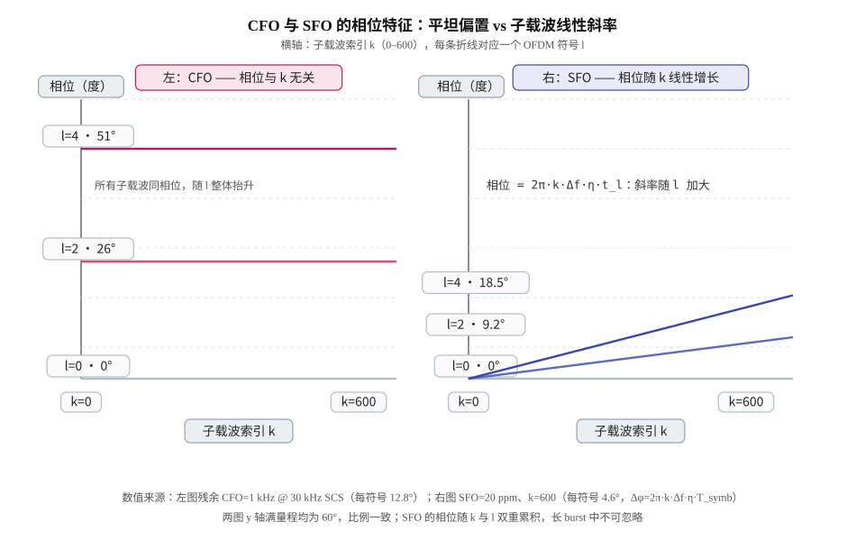

# T2.8 OFDM 频率同步：CFO、SFO 与子载波正交性损失
## 本节学习目标

T2.7 解决“FFT 窗口取哪里”的问题。本节解决“接收机的频率和采样节拍是否跟发送机一致”的问题。OFDM 的优势来自子载波正交性；载波频偏（Carrier Frequency Offset, CFO）和采样频偏（Sampling Frequency Offset, SFO）会让这个正交性逐步失效。

先区分两个频率误差：

| 误差 | 来源 | 直观表现 |
|:---|:---|:---|
| CFO | 发射/接收本振不一致，多普勒频移 | 星座随 OFDM 符号旋转，严重时子载波互相泄漏。 |
| SFO | ADC/DAC 采样时钟不一致 | 采样点慢慢漂移，频域相位随子载波索引和时间变化。 |

- 推导归一化 CFO 如何破坏 FFT bin 的正交投影。
- 区分整数 CFO、小数 CFO、公共相位误差和 ICI。
- 说明 SFO 为什么同时造成定时漂移和频域相位斜率。
- 解释 PSS/SSS、DM-RS、PTRS 在频率同步中的不同角色。
- 把残余 CFO/SFO 如何影响 LLR 质量讲清楚。
- 通过两组数值手算（15 kHz/750 Hz 与 30 kHz/1 kHz + 20 ppm SFO）建立“频偏 → 每符号旋转角 / 相位斜率”的量化直觉。
- 用 TS 38.211 §4.1/§4.2/§5.3.1/§5.4 与 TS 38.101-1 §6.4.1 定位频率参考的协议依据，明确“协议强制”与“接收机实现自由度”的边界。

## 前置知识检查

| 问题 | 需要达到的程度 |
|:---|:---|
| 子载波正交条件是什么？ | 知道 T2.1 中 $\Delta f=1/T_u$ 是正交性的核心。 |
| FFT bin 是什么？ | 知道 FFT 把离散频率投影到一组固定频点（频率仓，bin）。 |
| 相位旋转和频率偏移的关系是什么？ | 知道固定频率差会随时间累积相位。 |
| DM-RS/PTRS 的用途是什么？ | 知道参考信号可用于估计信道和相位误差。 |
| 频率误差用什么单位衡量？ | 知道 Hz、ppm 与归一化频偏 $\varepsilon$ 三者之间的换算。 |

本节不要求掌握锁相环或射频本振实现，只需要抓住一条主线：OFDM 靠“频率刚好对齐”保持正交，CFO/SFO 都会让这个对齐关系变差。

## 白话引入：频率同步在解决什么问题（概念四要素）

把 OFDM 接收机想象成一台需要同时对准“时间格子”和“频率格子”的机器。T2.7 对准了时间格子（符号边界落在哪里）；本节对准频率格子——载波频率差多少、采样节拍差多少。两个通俗类比：

- **CFO 像一块走得快慢不一致的手表**：走一分钟会差几秒，差值恒定，但误差随看表的次数累积。对应到信号上，就是每个采样时刻的相位都额外转一个固定角度，符号越长、累积越多。
- **SFO 像秒针长度不对的钟**：每一秒都不准一点点，走得越久偏得越多。对应到采样上，就是 ADC 采到的样点位置慢慢偏离发射端网格。

本节涉及的六个概念先给出四要素（概念、白话、工程后果、协议依据），后文再逐个展开：

| 概念 | 一句话白话 | 工程后果 | 协议依据 |
|:---|:---|:---|:---|
| CFO | 接收本振频率与发射载波 $f_0$ 之差，加上多普勒频移 | 星座整体旋转（CPE），大频偏时子载波互相泄漏（ICI） | TS 38.211 §5.4（载波 $f_0$ 进入系统之处）、§7.4.3.1（同步信号） |
| SFO | 接收采样时钟与发射采样时钟的速率差 | 采样点缓慢漂移，频域相位随子载波索引 $k$ 线性增长 | TS 38.211 §5.3.1（以 $T_c$ 为单位的时域网格） |
| 归一化频偏 $\varepsilon$ | CFO 占子载波间隔的比例 | $\varepsilon\ge0.5$ 时出现频谱混叠歧义，需要整数频偏处理 | TS 38.211 §4.2 Table 4.2-1（$\Delta f$ 定义） |
| CPE（公共相位误差） | 同一 OFDM 符号内所有子载波近似同转一个角度 | 星座整体旋转，可用单个相位旋转补偿 | 参考信号相位估计（接收机实现） |
| ICI（子载波间干扰） | 邻子载波的能量泄漏进当前 bin | 星座扩散、EVM 恶化，无法用单相位补偿 | 正交性破坏（§5.3.1 指数结构） |
| ppm | 百万分之一，频率精度的常用单位 | 射频晶振误差与 SFO 都以 ppm 计量 | TS 38.101-1 §6.4.1（发射频率精度） |

## CFO 的基本模型

**回答什么问题**：接收本振与发射载波相差 $\Delta f_c$（Hz）时，基带采样会变成什么样子？这是整个频率同步分析的起点。

设发送端基带 OFDM 采样为 $s[n]$。若接收本振与发送本振存在频率差 $\Delta f_c$，接收采样可写成：

$$
r[n] = s[n]e^{j2\pi \Delta f_c nT_s} + w[n]
\tag{1}
$$

符号含义：$r[n]$ 是接收端基带采样，$s[n]$ 是发射端基带采样，$\Delta f_c$ 是载波频率差（Hz），$T_s$ 是采样周期，$w[n]$ 是加性噪声。白话解释：每过一个采样周期，相位就多转 $2\pi\Delta f_cT_s$ 弧度；$n$ 越大累积越多——频率差在时域上表现为**相位随时间的线性累积**，这就是“频偏导致相位旋转”的数学来源。

把 CFO 按子载波间隔 $\Delta f$ 归一化：

$$
\epsilon = \frac{\Delta f_c}{\Delta f}
\tag{2}
$$

$\varepsilon$ 的意思是“频偏占子载波间隔的几分之几”，单位是 SCS 的倍数。它把不同 numerlogy 下的频偏统一到一个无量纲数上：同样 1 kHz 频偏，15 kHz SCS 下 $\varepsilon=0.067$，120 kHz SCS 下只有 $\varepsilon=0.0083$，危害程度完全不同。

当 $\epsilon=0$ 时，每个子载波正好落在 FFT 的整数 bin 上。若 $\epsilon$ 不是 0，FFT 不再只在目标 bin 上取到能量。小数 CFO 会让能量泄漏到邻近子载波，形成 ICI；整数 CFO 则主要表现为子载波索引整体偏移。

## 图示：CFO/SFO 的影响链

图示从理想正交开始，分别引入 CFO 和 SFO，再落到软解调。CFO 更直接表现为公共相位旋转和 ICI；SFO 更像采样网格随时间漂移，在频域表现为随子载波索引变化的相位斜率。两者都可能让同一个 RE 的 LLR 幅度变小或符号错误。

本节另配三张手绘 SVG，画 Mermaid 画不出的频谱与星座直觉：图 1（星座逐符号旋转）见“数值手算示例一”，图 2（CFO 与 SFO 相位特征对比）见“SFO 的基本模型”，图 3（CFO 破坏正交性的频谱泄漏）见下一节。

## CFO 破坏子载波正交性的机理：FFT 投影与 ICI 系数

**回答什么问题**：为什么“一点点”频偏就能破坏正交性？做法是把带频偏的接收信号完整地投影到 FFT 的每个 bin 上，算一次闭式积分。

沿用 §5.3.1 的指数结构（见“协议锚点一”）：一个 OFDM 有用符号（去掉 CP 后，以符号起点为时间零点）可以写成

$$
s(t)=\sum_{m} X_m e^{j2\pi m\Delta f t},\quad 0\le t<T_u
$$

其中 $X_m$ 是第 $m$ 个子载波上承载的复数符号。接收端在频偏 $\Delta f_c=\varepsilon\Delta f$ 下收到 $r(t)=s(t)e^{j2\pi\varepsilon\Delta f t}$。接收端把 $r(t)$ 投影到 bin $k$ 上（积分就是“解调”本身）：

$$
Y_k=\frac{1}{T_u}\int_0^{T_u} r(t)e^{-j2\pi k\Delta f t}\,dt
=\sum_{m} X_m C_{m-k}+N_k
\tag{3}
$$

其中每个子载波对的投影系数是

$$
C_d=e^{j\pi(d+\varepsilon)}\,\operatorname{sinc}(d+\varepsilon),\qquad
\operatorname{sinc}(x)=\frac{\sin(\pi x)}{\pi x},\quad d=m-k
\tag{4}
$$

推导只有一步几何级数积分：$\int_0^{T_u}e^{j2\pi(d+\varepsilon)\Delta f t}dt/T_u=e^{j\pi(d+\varepsilon)}\sin(\pi(d+\varepsilon))/(\pi(d+\varepsilon))$。这个式子是本节的核心：**投影系数 $C_d$ 在 $d=0$（自己的 bin）上取最大，在 $d\neq0$（别的子载波）上不再为零——正交性破坏的定量来源**。

两个近似在工程中够用（$\varepsilon$ 很小时）：

$$
|C_0|\approx\operatorname{sinc}(\varepsilon)\approx1-\frac{(\pi\varepsilon)^2}{6},
\qquad |C_0|^2\approx1-\frac{(\pi\varepsilon)^2}{3}
\tag{5}
$$

主项 $C_0$ 的幅值略小于 1（主信号功率损失），相位约 $e^{j\pi\varepsilon}$（这就是 CPE 的来源）。而全部 bin 的投影功率守恒（Parseval 等式 $\sum_d|C_d|^2=1$），因此漏到别的子载波上的功率占比为

$$
\frac{P_{\mathrm{ICI}}}{P_S}=1-|C_0|^2\approx\frac{(\pi\varepsilon)^2}{3}
\tag{6}
$$

这就是“ICI 功率随频偏按平方律增长”的量化结论。需要说明：以上是接收机分析用的连续时间模型（忽略 CP 与窗函数），离散 FFT 版本只差相位参考 $(N-1)/N$ 的细节；它不是协议规定，而是接收机实现自由度下常用的分析工具。

图 3 的读图顺序：左边是 $\varepsilon=0$ 的理想情况，每个子载波的 sinc 谱零点恰好落在相邻 bin 上，FFT 采样“看不见”邻子载波；右边是 $\varepsilon=0.3$ 的情况，整条谱偏移了 $0.3\Delta f$，bin 采样点不再在零点上（例如 k=1 处采到约 0.37 倍峰值的泄漏量）。取 $\varepsilon=0.3$ 只是为了让泄漏肉眼可见（对应 ICI 功率约 9.9%），实际残余 CFO 通常远小于 0.1 个 SCS，泄漏按平方律小得多。

## 公共相位误差（CPE）与子载波间干扰（ICI）

**回答什么问题**：残余 CFO 对接收符号的影响怎么拆成“可以补的”和“补不掉的”两部分？

在小 CFO 下，接收端常把影响拆成两部分：

| 成分 | 含义 | 接收端处理 |
|:---|:---|:---|
| CPE（公共相位误差，Common Phase Error） | 整个 OFDM 符号近似同转一个相位 | 可用 DM-RS/PTRS 估计并补偿。 |
| ICI（子载波间干扰，Inter-Carrier Interference） | 其他子载波泄漏进当前子载波 | 无法只靠单个相位完全消除。 |

简化写法是把式 (3) 的结果按 $d=0$ 与 $d\neq0$ 拆开：

$$
Y_k \approx C_0 X_k + \sum_{m\neq k} C_{k-m}X_m + N_k
\tag{7}
$$

$C_0$ 对应主子载波上的衰减和相位，求和项就是 ICI。CFO 越大，ICI 项越强。对高阶 QAM，CPE 会让星座整体旋转；ICI 会让星座点扩散，两者都会影响 soft demapper 的欧氏距离计算。工程上 CPE 可以用参考信号相位估计后“单相位旋转”补偿掉，而 ICI 是补偿后仍残留的“看不见的干扰”——它最终体现为 EVM 抬高和 post-eq SINR 下降（见“对 LLR 的影响”一节）。

## 数值手算示例一：15 kHz 子载波间隔下的 750 Hz 残余 CFO

**回答什么问题**：一个具体的小 CFO 到底让星座每符号转多少度、ICI 占多少功率？

假设 NR 使用 $\Delta f=15$ kHz，接收机残余 CFO 为 750 Hz。归一化频偏为：

$$
\epsilon=\frac{750}{15000}=0.05
\tag{8}
$$

这表示频偏是子载波间隔的 5%。若一个 OFDM 有用符号时长近似为：

$$
T_u=\frac{1}{15000}\approx 66.67\ \mu s
\tag{9}
$$

一个有用符号内累积相位为：

$$
\Delta\phi=2\pi\Delta f_cT_u
=2\pi\times750\times66.67\times10^{-6}
\approx0.314\ \mathrm{rad}
\tag{10}
$$

约等于 18 度。捷径校验：$\Delta\phi=2\pi\varepsilon=2\pi\times0.05=0.314\ \mathrm{rad}$——**每符号旋转角只由归一化频偏决定**。对 QPSK，这可能还可以由 DM-RS 相位补偿吸收；对 256QAM，18 度足以造成明显星座旋转。如果 CFO 未被建模，soft demapper 会把旋转后的点投到错误的候选距离上。

图 1 把示例一画成四帧 QPSK 星座：灰色点是理想位置，彩色点是实际接收位置。注意旋转是“整片星座一起转”的——这就是 CPE 的可补偿性；而弧线之间每帧转 18°，不跟踪的话十几帧就转了一整圈。

再看跨符号累积。若 residual CFO 没有被继续跟踪，第 10 个 OFDM 符号附近相位可以累积到约 180 度量级。实际系统会在粗频偏校正后继续使用 DM-RS/PTRS 做细相位跟踪，否则星座会持续转动。

## 数值手算示例二：30 kHz 子载波间隔、1 kHz CFO 与 20 ppm SFO

**回答什么问题**：换成 30 kHz SCS（NR μ=1 的常见配置）和 1 kHz 残余 CFO，数量级变成多少？再算 SFO 的累积速度。

### 1 kHz CFO 部分

归一化频偏：

$$
\epsilon=\frac{1000}{30000}=\frac{1}{30}\approx0.0333
\tag{11}
$$

有用符号内旋转角（$T_u=1/\Delta f=33.33\ \mu s$）：

$$
\Delta\phi=2\pi\epsilon=\frac{2\pi}{30}\approx0.209\ \mathrm{rad}\approx12.0^\circ
\tag{12}
$$

若把 CP 也算进去，符号时长按 §5.3.1 的 $T_{\mathrm{symb},l}^{\mu}=(N_u^{\mu}+N_{CP,l}^{\mu})T_c$ 计算（数值见“协议锚点一”）：$N_u^{\mu}=2048\kappa\cdot2^{-\mu}=65536$（$\mu=1$），$N_{CP}=144\kappa\cdot2^{-\mu}=4608$（$T_c\approx0.509\ \mathrm{ns}$），得：

$$
T_{\mathrm{symb}}\approx(65536+4608)\times0.509\ \mathrm{ns}\approx35.67\ \mu s
\tag{13}
$$

含 CP 后每符号 CPE 约 $12.8^\circ$。一个 slot（$\mu=1$ 为 14 个符号、0.5 ms）内的相位累积是：

$$
\Delta\phi_{\mathrm{slot}}=2\pi\Delta f_c T_{\mathrm{slot}}=2\pi\times1000\times0.5\times10^{-3}=\pi\approx180^\circ
\tag{14}
$$

即 **1 kHz 残余 CFO 在 30 kHz SCS 下恰好一个 slot 转半圈**。这意味着：如果接收机只做每 slot 一次 DM-RS 相位补偿，slot 内后半个 slot 的星座已经转到接近 180°，64QAM/256QAM 无法解调；必须按符号跟踪（PTRS 时间密度 $L_{\mathrm{PT\text{-}RS}}\in\{1,2,4\}$ 就是在买这种每符号相位跟踪能力）。

ICI 功率按式 (6)：

$$
\frac{P_{\mathrm{ICI}}}{P_S}\approx\frac{(\pi\times0.0333)^2}{3}\approx3.7\times10^{-3}\approx0.37\%
\tag{15}
$$

折算成等效 SNR 损失约 $10\lg(1+0.0037)\approx0.016\ \mathrm{dB}$，几乎可以忽略。这个对比很有教学价值：**小 CFO 的第一危害是 CPE（可补偿的旋转），而不是 ICI（不可补偿的泄漏）**；工程上先花力气把 CFO 压进 $\varepsilon<0.01$ 量级，然后靠 CPE 跟踪解决残余。

### 20 ppm SFO 部分

SFO 的相位特征是随子载波索引 $k$ 线性增长。设 $\eta=20\ \mathrm{ppm}$，子载波 $k$ 在第 $l$ 个符号上的相位增量为（推导见后文式 (23)）：

$$
\Delta\phi_{\mathrm{SFO}}(k)=2\pi\,k\,\Delta f\,\eta\,T_{\mathrm{symb}}
\tag{16}
$$

取 $k=600$（20 MHz 信道 @ 30 kHz SCS 共 51 PRB，$k=600$ 接近频带边缘）：

$$
\Delta\phi_{\mathrm{SFO}}(600)=2\pi\times600\times30000\times20\times10^{-6}\times35.67\times10^{-6}
\approx0.0807\ \mathrm{rad}\approx4.62^\circ/\text{符号}
\tag{17}
$$

一个 slot 累积 $2\pi\times600\times30000\times20\times10^{-6}\times0.5\times10^{-3}=1.13\ \mathrm{rad}\approx64.8^\circ$。采样点漂移的速度是 $\eta T_{\mathrm{slot}}=10\ \mathrm{ns/slot}$（30.72 Msps 下约 0.31 个采样/slot）；从理想起点漂移到 CP 边界（$\mu=1$ 的 CP 为 72 个采样 @30.72 Msps）需要：

$$
\frac{72}{20\times10^{-6}}=3.6\times10^6\ \text{采样}\approx117\ \mathrm{ms}\approx234\ \text{slot}
\tag{18}
$$

所以 SFO 在短包里几乎无害（每符号 4.6° 的带边斜率可以并入信道估计），但在长 burst、连续接收（如 VoNR、连续大流量下载）或低成本晶振场景下，117 ms 就会把 FFT 窗口推到 CP 边缘，同时频带两端出现几十度的相位差——这正是“SFO 必须跟踪”的量化依据。另一个直观换算：$k\cdot\Delta f\cdot\eta=600\times30000\times20\times10^{-6}=360\ \mathrm{Hz}$——**频带边缘子载波在 SFO 下看起来像额外偏了 360 Hz**，这就是 SFO 与 CFO 容易混淆的原因。

## 整数 CFO、小数 CFO 与符号时变相位的分解

**回答什么问题**：CFO 的不同分量各有不同的“长相”，怎么分诊？

CFO 可以按归一化值拆成整数部分和小数部分：

$$
\epsilon = q + \delta,\quad q\in\mathbb{Z},\ -0.5<\delta\leq0.5
\tag{19}
$$

| 成分 | 主要后果 | 诊断方式 |
|:---|:---|:---|
| 整数 CFO $q$ | 子载波索引整体搬移，资源网格频域对不齐 | PSS/SSS 频域搜索、SSB 光栅偏差。 |
| 小数 CFO $\delta$ | CPE + ICI，星座旋转和扩散 | DM-RS/PTRS 相位、EVM、ICI 代理。 |
| 残余时变相位 | 相位随 OFDM 符号继续漂移 | per-symbol CPE 曲线。 |

整数 CFO 如果没处理，接收端可能把 PRB/子载波地址整体读错（见“协议锚点二”中 SSB 的 $k_{\mathrm{SSB}}$ 偏移语义）；小数 CFO 即使只有几个百分点，也会降低子载波隔离度。两类问题在日志上不同，不能只保存一个 `frequency_offset_estimate` 字段后就结束。

## SFO 的数值直觉

采样频偏常用 ppm 表示（ppm 即百万分之一，parts per million）。若采样率为 $30.72$ Msps，SFO 为 20 ppm，则采样频率误差为：

$$
\Delta f_s = 30.72\times10^6 \times 20\times10^{-6}
=614.4\ \mathrm{Hz}
\tag{20}
$$

这不是载波频偏，但它会让采样点逐步漂移。每经过 50000 个采样，累计误差约为：

$$
50000\times20\times10^{-6}=1\ \text{sample}
\tag{21}
$$

因此 SFO 可能在短时间内看不明显，却会在长 burst 或连续 slot 中逐步把 FFT 窗口推向 CP 边缘，同时在频域留下相位斜率。高速移动、低成本晶振和长时间连续接收都需要关注 SFO 跟踪。

## SFO 的基本模型：采样时钟误差与频域相位斜率

**回答什么问题**：SFO 的数学描述是什么？为什么它同时表现为“定时漂移”和“频域相位斜率”？

SFO 来自采样时钟误差。设接收采样周期不是 $T_s$，而是：

$$
\hat{T}_s = T_s(1+\eta)
\tag{22}
$$

其中 $\eta$ 是相对采样频偏，常用 ppm 表示。SFO 的麻烦在于它会积累：采样点每个符号都略微偏离，经过多个 OFDM 符号后，FFT 窗口位置和每个子载波的相位都会变化。

频域上，SFO 常表现为随子载波索引 $k$ 变化的相位斜率，并且随 OFDM 符号时间 $l$ 继续累积：

$$
Y[k,l] \approx X[k,l]H[k,l]e^{j\phi(k,l)} + ICI + N[k,l]
\tag{23}
$$

其中

$$
\phi(k,l)=2\pi\,k\,\Delta f\,\eta\,t_l,\qquad t_l=l\,T_{\mathrm{symb}}
\tag{24}
$$

符号含义：$\phi(k,l)$ 是子载波 $k$ 在第 $l$ 个符号上的相位误差，$t_l$ 是第 $l$ 个符号的起点时刻。推导直觉：采样点比理想位置慢（或快）了 $\eta t_l$ 秒，等价于子载波 $k$ 的相位参考移动了 $2\pi\cdot(k\Delta f)\cdot(\eta t_l)$——频率越高（$k$ 越大）、时间越久（$l$ 越大），相位误差越大。严格说符号内还有约 $2\pi k\Delta f\eta T_u/2$ 的相位参考项和少量 ICI，工程上通常并入信道估计或当作小量。工程调试时，如果星座不是整体同转，而是高频端和低频端相位不一致，就要怀疑 SFO 或定时漂移。

图 2 是“一眼分诊图”：左图三条水平线（CFO：所有子载波同相位，随 $l$ 整体抬升）；右图三条过原点的斜线（SFO：相位 $=2\pi k\Delta f\eta t_l$，随 $k$ 线性增长、随 $l$ 加大斜率）。调试时若 per-subcarrier 相位残差呈直线，优先怀疑 SFO 或定时偏移；若呈整体台阶，优先怀疑残余 CFO。两图 y 轴满量程一致（60°），可以看到即使 $l=4$，SFO 在 $k=600$ 处也只有约 18.5°——它靠“双重累积”在长 burst 中发难。

## 协议锚点一：频率参考的协议依据（TS 38.211 §4.1/§4.2/§5.3.1/§5.4）

**本节回答**：3GPP 在 TS 38.211 里规定了什么？接收端必须做什么？哪些是接收机自由发挥？

接收机要“对准频率格子”，依据全部来自 TS 38.211 第 4、5 章——它们定义发射端用什么时间单位、什么频率网格生成信号。四块内容依次核验如下（本地证据：`3GPP_Rel19/processed/TS_38.211_38211-j30/full.md`）。

**① 时间单位（§4.1，full.md 第 877 行起）**。协议原文：时间域各字段以时间单位 $T_c$ 表示，其中 $\Delta f_{\max}=480\cdot10^3$ Hz、$N_f=4096$：

$$
T_c=\frac{1}{\Delta f_{\max}N_f}=\frac{1}{480\times10^3\times4096}\approx0.509\ \mathrm{ns},
\qquad \kappa=\frac{T_s}{T_c}=64
\tag{P-1}
$$

其中 $T_s=1/(\Delta f_{\mathrm{ref}}N_{f,\mathrm{ref}})$、$\Delta f_{\mathrm{ref}}=15\ \mathrm{kHz}$、$N_{f,\mathrm{ref}}=2048$ 是 LTE 参考参数。接收端含义：一切符号时长、CP 长度都以 $T_c$ 的整数倍表达，采样时钟的“正确刻度”由这套时间单位定义——SFO 就是接收端采样刻度相对 $T_c$ 网格的速率偏差。

**② numerology（§4.2 Table 4.2-1，full.md 第 883 行起）**。协议表 4.2-1 规定支持的传输 numerology：

$$
\Delta f=2^{\mu}\cdot15\ \mathrm{kHz},\qquad \mu\in\{0,1,\ldots,6\}\ (15\sim960\ \mathrm{kHz})
\tag{P-2}
$$

且 $\mu$ 与 CP 类型由高层参数 `subcarrierSpacing` 与 `cyclicPrefix` 给出（§4.2 原文：“$\mu$ and the cyclic prefix for a downlink or uplink bandwidth part are obtained from the higher-layer parameters subcarrierSpacing and cyclicPrefix”）。接收端含义：**接收端的 FFT bin 间隔必须等于协议给出的 $\Delta f$**；CFO 的归一化（式 (2)）用的就是这张表。帧/子帧时长见 §4.3.1（full.md 第 901 行起）：帧 10 ms、子帧 1 ms，各由 $\Delta f_{\max}N_f$ 与 $T_c$ 组合定义。

**③ OFDM 基带信号生成（§5.3.1，full.md 第 1475–1560 行）**。协议原文给出天线端口 $p$、numerlogy $\mu$、符号 $l$ 的时域连续信号（除 PRACH 与 RIM-RS 外）：

$$
\hat{s}_l^{(p,\mu)}(t)=\sum_{k=0}^{N_{\mathrm{grid},x}^{\mathrm{size},\mu}N_{\mathrm{sc}}^{\mathrm{RB}}-1}
a_{k,l}^{(p,\mu)}
e^{j2\pi\left(k+k_0^{\mu}-\frac{N_{\mathrm{grid},x}^{\mathrm{size},\mu}N_{\mathrm{sc}}^{\mathrm{RB}}}{2}\right)
\Delta f\left(t-N_{CP,l}^{\mu}T_c-t_{\mathrm{start},l}^{\mu}\right)}
\tag{P-3}
$$

符号时长 $T_{\mathrm{symb},l}^{\mu}=(N_u^{\mu}+N_{CP,l}^{\mu})T_c$，其中 $N_u^{\mu}=2048\kappa\cdot2^{-\mu}$（$\kappa=64$，见 §5.3.x 中 $N_u^{\mathrm{RIM}}=2\cdot2048\kappa\cdot2^{-\mu}$ 的同构定义），普通 CP 为

$$
N_{CP,l}^{\mu}=
\begin{cases}
144\kappa\cdot2^{-\mu}+16\kappa & l=0\ \text{或}\ l=7\cdot2^{\mu}\\
144\kappa\cdot2^{-\mu} & \text{其余符号}
\end{cases}
$$

（扩展 CP 为 $512\kappa\cdot2^{-\mu}$；该式在抽取件中以 OMML 公式图片 `media_svg/image97.svg` 嵌入，OCR 文本可辨认 token 144、512、$16\kappa$、$2^{-\mu}$、$l=0$ 或 $l=7\cdot2^{\mu}$、normal/extended，此处为排版重建）。逐符号解释：$a_{k,l}^{(p,\mu)}$ 是资源单元 $(k,l)$ 上的复数符号；$k_0^{\mu}$ 是频带起点相对参考点的子载波偏移（§4.4.2/§4.4.4 定义）；$(t-N_{CP,l}^{\mu}T_c-t_{\mathrm{start},l}^{\mu})$ 说明**相位参考点是去掉 CP 后的有用符号起点**。接收端含义：每个子载波频率是 $\Delta f$ 的整数倍，bin 网格必须与发射端一致；去 CP 的位置（T2.7 的内容）同时决定相位参考——所以定时误差与 SFO 在频域都表现为相位斜率，容易互相伪装。

**④ 调制与上变频（§5.4，full.md 第 1673–1683 行）**。协议原文：“Modulation and upconversion to the carrier frequency $f_0$ of the complex-valued OFDM baseband signal ... is given by”，对除 PRACH/RIM-RS 外的所有信道与信号：

$$
\mathrm{Re}\left\{s_l^{(p,\mu)}(t)e^{j2\pi f_0\left(t-t_{\mathrm{start},l}^{\mu}-N_{CP,l}^{\mu}T_c\right)}\right\}
\tag{P-4}
$$

载波频率 $f_0$ 在这里进入系统。接收端含义：**CFO 的定义就是这个 $f_0$ 与接收本振之差**；协议规定发射端把信号放在 $f_0$ 上（以及 §5.4 中关于上行滤波的 NOTE），但没有、也不可能规定接收端用什么方法把 $f_0$ 找回来——那是实现自由度。

接收端流程翻译（5 步）：① 从高层参数 `subcarrierSpacing` 得到 $\mu$，按 Table 4.2-1 确定 $\Delta f$；② 按 §5.3.1 的指数结构建立“期望频率网格”（bin $k$ 对应 $k\Delta f$）；③ 本振残余差 $\Delta f_c$ 就是 CFO，把它按式 (2) 归一化为 $\varepsilon$；④ 采样时钟相对 $T_c$ 网格的速率差就是 SFO $\eta$；⑤ 用 PSS/SSS 做粗校准、DM-RS/PTRS 做细校准（下一节），把网格拉回协议定义的位置。

## 协议锚点二：同步信号与参考信号的协议角色（TS 38.211 §7.4.x 与 TS 38.101-1 §5.4.3）

**本节回答**：PSS/SSS、DM-RS、PTRS 在频率同步里各管什么？协议强制什么、不强制什么？

### PSS/SSS：初始接入的粗频率参考

TS 38.211 §7.4.3.1.1/§7.4.3.1.2（full.md 第 5235 行附近）原文：“The UE shall assume the sequence of symbols $d_{\mathrm{PSS}}(0),\ldots,d_{\mathrm{PSS}}(126)$ constituting the primary synchronization signal ... mapped to resource elements $(k,l)_{p,\mu}$ in increasing order of $k$ where $k$ and $l$ are given by Table 7.4.3.1-1 and represent the frequency and time indices, respectively, within one SS/PBCH block”（SSS 同构，full.md 中 SSS 条款原文把 primary 换成 secondary）。同一处还规定 SS/PBCH block（SSB）在时域占 4 个 OFDM 符号、频域占 240 个连续子载波，且：

> “$k_{\mathrm{SSB}}$ is the subcarrier offset from subcarrier 0 in common resource block $N_{\mathrm{CRB}}^{\mathrm{SSB}}$ to the lowest-numbered subcarrier of the SS/PBCH block, where $N_{\mathrm{CRB}}^{\mathrm{SSB}}$ is obtained from the higher-layer parameter offsetToPointA.”

接收端含义：初始接入时，UE 并不知道小区的精确频率。UE 在同步光栅（synchronization raster）上搜索 SSB——TS 38.101-1 §5.4.3.1（`TS_38.101_38101-1-j60_s00-0504/content.md` 第 1141 行起）原文：“The synchronization raster indicates the frequency positions of the synchronization block that can be used by the UE for system acquisition when explicit signalling of the synchronization block position is not present”，SSB 的参考频率位置用 SSREF/GSCN 编号（Table 5.4.3.1-1）。PSS/SSS 相关峰给出粗 CFO 与定时；**整数 CFO 会让 SSB 出现在错误的子载波索引上**——若没做整数频偏校正，后续按 $k_{\mathrm{SSB}}$/Point A 建立的资源网格整体错位，表现为“资源网格整体频移”而不是单点噪声增大。

### DM-RS：数据区域的相位参考

TS 38.211 §7.4.1.1.1（full.md 第 5201 行起）原文：“The UE shall assume the sequence $r(n)$ is defined by”：

$$
r(n)=\frac{1}{\sqrt2}\left(1-2c(2n)\right)+j\frac{1}{\sqrt2}\left(1-2c(2n+1)\right)
\tag{P-5}
$$

其中伪随机序列 $c(i)$ 由 §5.2.1 定义并按时隙、符号、小区等初始化。映射规则在 §7.4.1.1.2：DM-RS 按 Tables 7.4.1.1.2-1/2 映射到 $(k,l)$，同一 CDM 组内用正交掩码 $w_f(k')$、$w_t(l')$ 区分端口，前置符号位置由 `dmrs-TypeA-Position` 决定。接收端含义：**DM-RS 是接收端完全已知的相位参考**——把它在频域的相位斜率分解出来，常数部分就是 CPE（CFO 残留），线性部分就是 SFO/定时偏移。但“如何分解、用什么窗、多大平滑”全是接收机实现自由度。

### PTRS：每符号的相位跟踪

TS 38.211 §7.4.1.2（full.md 第 5074 行起）原文：“The UE shall assume phase-tracking reference signals being present only in the resource blocks used for the PDSCH, and only if the procedure in [6, TS 38.214] indicates phase-tracking reference signals being used”，映射为 $a_{k,l}^{(p,\mu)}=\beta_{\mathrm{PT-RS}}r_k$，且“where $L_{\mathrm{PT-RS}}\in\{1,2,4\}$ is defined in Table 6.2.3.1-1 of [6, TS 38.214]”（§7.4.1.2.2 时间索引按 $L_{\mathrm{PT-RS}}$ 步进选取）。接收端含义：$L_{\mathrm{PT-RS}}=1$ 表示每个符号都有 PTRS 采样点，可以逐符号跟踪 CPE（对付相位噪声和残余频偏）；$L=4$ 表示每 4 个符号一个点，开销小但只能跟踪慢变相位。选哪个密度是调度/配置问题（TS 38.214 决定何时使用），接收端用它做什么环路是实现自由度。

### 边界小结

协议强制的是：PSS/SSS、DM-RS、PTRS 的**序列与映射位置**（“UE shall assume”句式），以及同步光栅/SSREF 的定义。协议不规定的是：CP 相关估计、PSS 搜索策略、DM-RS 相位斜率分解、PTRS 环路带宽、异常判定阈值——全部是接收机实现自由度。

## 协议锚点三：射频频率误差的现实约束（TS 38.101-1 §6.4.1 与 TS 38.104 §6.5.1.2）

**本节回答**：晶振误差有多“现实”？协议对频率精度到底管到什么程度？

接收机要对抗的 CFO 主要来自两个现实：本振/晶振误差与多普勒。协议对**发射端**的频率精度有硬性要求。TS 38.101-1 §6.4.1（`TS_38.101_38101-1-j60_s06-06/content.md` 第 5725 行起）原文：

> “The UE basic measurement interval of modulated carrier frequency is 1 UL slot. The mean value of basic measurements of UE modulated carrier frequency shall be accurate to within ± 0.1 PPM observed over a period of 1 ms of cumulated measurement intervals compared to the carrier frequency received from the NR Node B.”

即 UE 发射的调制载波频率相对从 gNB 接收到的载波必须准确到 ±0.1 ppm。基站侧对应要求见 TS 38.104 §6.5.1.2（`TS_38.104_38104-j50/content.md` 第 3071 行起）：大区（Wide Area）BS ±0.05 ppm、中/小区（Medium/Local Area）±0.1 ppm，观测窗口 1 ms；同节还规定“**The same source shall be used for RF frequency and data clock generation**”——射频频率与数据时钟必须同源，这意味着发射端 CFO 与 SFO 天然相关，接收端也常把两者联合估计。

把这些 ppm 换算成 Hz 就有直觉了（$\varepsilon$ 按对应 SCS 归一化）：

| 场景 | 频率误差 | 归一化 $\varepsilon$ |
|:---|:---|:---|
| 0.1 ppm @ 3.5 GHz（FR1 载波） | 350 Hz | 30 kHz SCS 下 0.012 |
| 0.1 ppm @ 28 GHz（FR2 载波） | 2.8 kHz | 120 kHz SCS 下 0.023 |
| 多普勒 @ 3.5 GHz、120 km/h | ≈389 Hz | 30 kHz SCS 下 0.013 |
| 多普勒 @ 3.5 GHz、300 km/h | ≈972 Hz（约 1 kHz，就是示例二的量级） | 30 kHz SCS 下 0.032 |
| 多普勒 @ 28 GHz、300 km/h | ≈7.8 kHz | 120 kHz SCS 下 0.065 |

多普勒公式 $f_d=(v/c)f_c$ 是信道物理，与协议无关。这张表说明：FR1 下残余 CFO 通常为零点几 kHz 到 1 kHz 量级，对应 $\varepsilon\approx0.01\sim0.03$——正是“CPE 为主、ICI 次要”的工作区；FR2 下 ppm 与多普勒都放大，加上相位噪声，是 PTRS 每符号跟踪的主要动机。而**接收机如何把 350 Hz 或 2.8 kHz 估计出来并补偿掉，协议完全不管**。

## 协议强制与接收机实现自由度的边界

| 事项 | 状态 | 依据（本地路径） |
|:---|:---|:---|
| 载波频率 $f_0$ 与基带信号结构（子载波在 $k\Delta f$ 上） | 协议强制（发射端定义） | TS 38.211 §5.3.1/§5.4（`TS_38.211_38211-j30/full.md` 第 1475/1673 行起） |
| $\Delta f=2^\mu\cdot15$ kHz 与 numerlogy 参数 | 协议强制 | §4.2 Table 4.2-1（第 883 行起） |
| PSS/SSS/DM-RS/PTRS 序列与映射位置 | 协议强制（UE shall assume） | §7.4.3.1.1/2、§7.4.1.1、§7.4.1.2（第 5201/5074/5235 行附近） |
| 同步光栅 SSREF/GSCN | 协议强制（UE 可据此搜索） | TS 38.101-1 §5.4.3.1（`TS_38.101_38101-1-j60_s00-0504/content.md` 第 1141 行起） |
| UE/BS 发射频率精度 | 协议强制（±0.1/±0.05 ppm） | TS 38.101-1 §6.4.1、TS 38.104 §6.5.1.2 |
| CFO/SFO 估计与补偿算法（CP 相关、PSS 搜索、DM-RS 相位斜率、PTRS 环路、环路带宽、判定阈值） | **接收机实现自由度** | 3GPP 未规定 |
| 残余 CFO/SFO 目标值、EVM 预算分配 | 实现自由度（受 EVM 指标间接约束） | TS 38.101-1 §6.4.2.1（EVM 测量前先校正采样定时与射频频偏） |

## 资料与协议边界

| 资料 | 本节采用 | 边界 |
|:---|:---|:---|
| TS 38.211 §7.4.3.1.1/§7.4.3.1.2 | PSS/SSS 映射入口 | 不复现小区搜索算法。 |
| TS 38.211 §7.4.1.1/§7.4.1.2 | DM-RS/PTRS 入口 | 不复现完整参考信号序列和配置表。 |
| TS 38.101-1 §5.4.3.1/§6.4.1 | 同步光栅与 UE 频率精度 | 不复现各频段 GSCN 表。 |
| TS 38.104 §6.5.1.2 | gNB 频率精度 | 不复现各 BS 类别指标表。 |
| T2.1 | 子载波正交性基础 | 本节只讨论频率误差破坏正交性的工程模型。 |
| T2.7 | FFT 窗口和 CP 容差 | SFO 与定时漂移的关系在本节衔接。 |

TS 38.211 定义 PSS/SSS、DM-RS 和 PTRS 的信号结构与映射；接收端使用哪些滤波器、环路带宽、估计窗口和异常判定阈值，是实现选择。

## 频率同步的典型流程与实现自由度

| 阶段 | 目标 | 典型依据 |
|:---|:---|:---|
| 粗 CFO | 将大频偏校正到可解调范围 | PSS/SSS、重复结构、频域搜索。 |
| 细 CFO | 消除残余公共旋转 | DM-RS 相位、相邻符号相位差。 |
| 相位跟踪 | 跟踪高频相位噪声和残余 CPE | PTRS 或密集参考信号。 |
| SFO 跟踪 | 估计采样时钟漂移 | 频域相位斜率、定时漂移历史。 |

表中“目标”是必须达到的功能（否则后级无法解调），但“典型依据”只是常见做法：用 CP 相关、用 DM-RS 相位斜率、用 PTRS 环路，都是接收机实现自由度。验收时按“校正前误差 → 校正后残差 → 星座/EVM 改善”的证据链检查，而不是只检查“用了哪个算法”。

## 对 LLR 的影响

软解调的 LLR 通常来自候选星座点距离和噪声方差。如果残余 CFO/SFO 没有补偿，接收符号不再满足理想模型：

$$
Y_k = H_k X_k + N_k
\tag{25}
$$

而更接近：

$$
Y_k = H_k X_k e^{j\theta_k} + I_k + N_k
\tag{26}
$$

$I_k$ 是 ICI 或残留干扰。若 soft demapper 仍按理想模型式 (25) 计算，LLR 会过度自信或方向错误。工程上需要把残余频偏造成的扩散计入 EVM、post-eq SINR 或等效噪声估计。

## 工程检查点

| 检查项 | 应记录的证据 | 失败迹象 |
|:---|:---|:---|
| 残余 CFO | Hz 或归一化 $\epsilon$ | 星座随符号时间持续旋转。 |
| SFO/ppm | 估计 ppm、相位斜率 | 频带两端相位误差不同。 |
| PTRS/DM-RS 相位 | CPE 跟踪曲线 | 相位噪声峰值后 BLER 跳变。 |
| ICI 代理 | EVM、邻子载波泄漏 | 高 SCS 或高速移动下曲线恶化。 |
| LLR 质量 | LLR 均值/方差、clip 计数 | LLR 幅度异常偏大或偏小。 |

## 验证与实现关注点

频率同步问题的难点在于它常常伪装成别的错误。残余 CFO 会让星座旋转，看起来像信道估计相位错；SFO 会让相位随子载波索引变化，看起来像频率选择性信道估计不准；ICI 会让星座扩散，看起来像噪声方差变大。调试时不能只看一个 EVM 数字，必须把时间、频率和参考信号相位拆开看（图 2 就是拆开看的入口）。

粗 CFO 估计通常要处理较大搜索范围。初始接入时，接收端可能先在时域或频域上执行候选频偏搜索，使 PSS/SSS 相关峰最大。这个阶段的目标是将频偏校正到细估计可处理范围，不追求极限精度。若粗 CFO 漏掉整数子载波偏移，后续 DM-RS 可能与预期频域位置完全错开；这种错误通常表现为资源网格整体频移，而不是单个 RE 的噪声增大。

细 CFO 和 CPE 跟踪更多依赖参考信号。DM-RS 可用于估计数据区域附近的相位；PTRS 更适合跟踪相位噪声和残余公共相位误差。两者的时间密度、频率密度和端口关系会影响估计质量（时间密度由 `dmrs-TypeA-Position`、additional position 与 $L_{\mathrm{PT-RS}}$ 决定）。若使用太长的平均窗口，噪声能被压低，但快速相位变化会被抹平；若窗口太短，估计噪声又会进入 LLR。工程设计需要在相位跟踪带宽和估计噪声之间折中。

SFO 的验证最好使用长时间连续接收场景。短包里 SFO 可能只表现为很小的相位斜率，BLER 不明显；长 burst 中采样点漂移会逐步逼近 CP 边缘。测试时应记录 `sfo_ppm_estimate`、`timing_drift_per_slot`、`phase_slope_per_prb`，并观察这些量是否同向变化。若只记录 residual CFO，SFO 问题会被误归因到信道估计。

| 诊断图 | 横轴 | 纵轴 | 能暴露的问题 |
|:---|:---|:---|:---|
| per-symbol CPE | OFDM symbol index | common phase | 残余 CFO、相位噪声。 |
| per-subcarrier phase | subcarrier index | DM-RS phase residual | SFO、定时偏移、频域估计误差。 |
| EVM heatmap | PRB x OFDM symbol | EVM | 局部 ICI、跟踪失锁。 |
| LLR histogram | LLR bin | count | 可靠度过强/过弱。 |

对定点实现，频偏补偿通常是复数旋转器。旋转因子精度、相位累加器位宽和查表/坐标旋转数字计算机实现都会影响残余相位误差。若相位累加器截断过粗，星座会出现周期性抖动；若旋转器饱和或缩放不一致，后续信道估计幅度也会偏。硬件验证应加入固定 CFO、扫频 CFO、SFO ppm 和相位噪声四类向量，而不是只跑静态 AWGN。

## 调试案例库

| 案例 | 表现 | 定位步骤 | 修复方向 |
|:---|:---|:---|:---|
| 残余 CFO | 星座逐符号同向旋转 | 画 per-symbol CPE 曲线 | 调整细 CFO 环路或 DM-RS 相位估计。 |
| SFO 漂移 | 频带两端相位方向不同 | 画 per-subcarrier phase residual | 增加 SFO 估计和采样率校正。 |
| 相位噪声 | 高频段 CPE 抖动明显 | 对比 PTRS on/off | 增加 PTRS 跟踪或缩短估计窗口。 |
| 整数 CFO | 资源网格整体频移 | 检查 SSB/PSS 频域候选 | 扩大粗频偏搜索并校正子载波偏移。 |

频率同步和信道估计要联合验证。如果先做信道估计再用估计结果补 CFO，残余 CFO 会污染 $\hat{H}$；如果先补 CFO 但粗估计方向错，DM-RS 又会被放到错误频点。工程实现通常要迭代：粗同步和粗 CFO 给出初始网格，DM-RS/ PTRS 提供细修正，再把修正后的网格用于后续估计和均衡。

## 常见错误

| 错误 | 为什么错 | 正确做法 |
|:---|:---|:---|
| 把 CFO 当成固定相位 | CFO 是频率差，随时间累积相位。 | 用相邻符号相位变化估计残余频偏。 |
| 只补 CPE 不管 ICI | 大 CFO 下 ICI 不能靠单相位旋转消除。 | 先通过粗 CFO 将频偏降至细补偿可处理范围。 |
| 混淆 CFO 和 SFO | CFO 来自载波频率，SFO 来自采样时钟。 | 分别观察整体旋转和频域相位斜率。 |
| 仿真不记录残余频偏 | BLER 损失无法归因。 | 保存 CFO/SFO 估计、校正后 EVM 和 LLR 统计。 |
| Hz、ppm、$\varepsilon$ 混写 | 单位错会让环路带宽、相位累积和扫点全失真。 | 日志与报告中分别注明 Hz/ppm/归一化值，换算留档。 |

## 最小仿真矩阵

| 维度 | 建议取值 | 覆盖目的 |
|:---|:---|:---|
| CFO | 0、0.01、0.05、0.2 个 SCS | 分离小相位旋转和明显 ICI。 |
| SFO | 0、5、20、50 ppm | 观察长 burst 下采样漂移。 |
| 速度 | 静止、低速、高速 | 覆盖多普勒和相位跟踪压力。 |
| 参考信号 | DM-RS only、DM-RS+PTRS | 验证 CPE 跟踪收益。 |
| 调制 | QPSK、64QAM、256QAM | 检查高阶调制对相位误差的敏感性。 |

每个点至少输出 residual CFO、SFO estimate、per-symbol CPE、per-subcarrier phase slope、EVM 和 LLR histogram。若 CFO/SFO 只用一个平均误差表示，会漏掉时间和频率两个方向的结构性失真。

## 自测题

1. 为什么 CFO 会破坏 OFDM 子载波正交性？
2. CPE 和 ICI 有什么区别？
3. SFO 为什么会随时间积累？
4. PTRS 和 DM-RS 在频率误差补偿中有什么不同角色？
5. 残余 CFO/SFO 为什么会改变 LLR 可靠度？
6. 数值题：$\Delta f=30$ kHz、残余 CFO=1 kHz，每个有用符号内星座旋转多少度？一个 slot（0.5 ms）内累计多少度？
7. 数值题：SFO=20 ppm、子载波 $k=600$，每符号相位增量是多少度？
8. 判断题：TS 38.211 是否规定接收机必须用 PSS 相关峰估计 CFO？

## 自测题参考答案

1. CFO 使子载波频率不再对准 FFT 的整数 bin，目标子载波能量会泄漏到其他 bin（式 (4) 的 $C_d$ 在 $d\neq0$ 时非零）。
2. CPE 是同一个 OFDM 符号内近似公共的相位旋转；ICI 是其他子载波泄漏进当前子载波的干扰。
3. 因为采样周期长期略大或略小，采样点偏差会逐符号累积。
4. DM-RS 主要服务信道估计和细相位修正；PTRS 更偏向跟踪相位噪声和残余 CPE。
5. 它们让星座旋转和扩散，soft demapper 的距离和噪声假设失配，导致 LLR 幅度或符号错误。
6. $\varepsilon=1/30$，有用符号旋转角 $\Delta\phi=2\pi\varepsilon=12^\circ$；一个 slot 累计 $2\pi\times1000\times0.5\times10^{-3}=\pi\approx180^\circ$（式 (12)/(14)）。
7. $\Delta\phi_{\mathrm{SFO}}=2\pi\times600\times30000\times20\times10^{-6}\times35.67\times10^{-6}\approx4.62^\circ$（式 (17)）。
8. 否。TS 38.211 §7.4.3.1 只规定 PSS 的序列与映射（“UE shall assume”），估计算法是接收机实现自由度。

## 本节验收

| 验收项 | 通过标准 |
|:---|:---|
| CFO 模型 | 能写出 $r[n]=s[n]e^{j2\pi\Delta f_c nT_s}+w[n]$。 |
| SFO 模型 | 能解释 $\hat{T}_s=T_s(1+\eta)$ 的累积效应。 |
| 误差分类 | 能区分 CPE、ICI 和频域相位斜率。 |
| 数值手算 | 能由 $\varepsilon$ 推出每符号旋转角 $2\pi\varepsilon$，并估算 ICI 功率 $(\pi\varepsilon)^2/3$。 |
| 协议边界 | 能说明 PSS/SSS、DM-RS、PTRS 是信号结构，不是固定算法。 |
| 协议锚点 | 能说出 TS 38.211 §5.3.1/§5.4 与 TS 38.101-1 §6.4.1 各自规定什么、接收端必须做什么。 |
| 图理解 | 能对照三张 SVG 解释星座旋转、相位斜率与频谱泄漏。 |
| 链路图理解 | 能按图示说明 CFO、SFO、CPE、ICI 和 LLR 可靠度之间的关系。 |

## 与相邻章节的衔接

T2.8 接在 T2.7 后面，因为频率误差估计必须建立在大致正确的时间窗口上。窗口错位会制造频域相位斜率，容易和 SFO 混淆；残余 CFO 又会污染 DM-RS 相位，影响 T2.10 的信道估计。学习时应将 T2.7 和 T2.8 视为时间参考与频率参考校准的两个连续环节。

它还直接影响 T2.11 和 T2.17。均衡器假设输入 RE 已经落在正确子载波上；若残余 CFO 仍产生 ICI，均衡器输出的 post-eq SINR 应包含这部分残留干扰。否则 T2.17 中的 LLR 会过度自信，译码器会把前端频偏误差当成可靠证据。

工程验收时，频率同步不应只给一个“校正后 CFO=0”的结论。更稳妥的口径是同时给出校正前误差、校正后残差、相位跟踪曲线、EVM 改善和 BLER 改善。若 CFO 数值很小但 EVM 仍差，可能是 SFO、相位噪声或 ICI；若 EVM 改善但 BLER 不改善，可能是 LLR 可靠度没有同步修正。

报告中还应注明频偏单位：Hz、ppm 和归一化 SCS 不能混写。单位错会让环路带宽、相位累积和仿真扫点全部失真。

## 执行与证据记录

| 项目 | 记录 |
|:---|:---|
| 本地材料 | 用 python 脚本核对 TS 38.211 §4.1/§4.2/§4.3.1/§5.3.1/§5.4/§7.4.1.1/§7.4.1.2/§7.4.3.1.1/§7.4.3.1.2、TS 38.101-1 §5.4.3.1/§6.4.1、TS 38.104 §6.5.1.2 的实际文本后引用。 |
| 图解材料 | 新增三张手绘 SVG：`assets/T2.8_cfo_constellation_rotation.svg`（星座旋转）、`assets/T2.8_cfo_vs_sfo_phase_slope.svg`（相位特征对比）、`assets/T2.8_cfo_subcarrier_leakage.svg`（频谱泄漏）；保留原 Mermaid 块。 |
| 图解验证 | 三张 SVG 均通过 `tools/audit_svg_layout.py`（五条几何规则 ALL_PASS）、Y 坐标扫描（同 x 范围文本间距 ≥8 px）、cairosvg -s 1.5 渲染无异常。 |
| 图解边界 | 图示只表达误差传播与频谱机理，不规定接收机环路结构。 |
| 证据边界 | 本节讲接收机频率同步模型与协议锚点，不复现 PTRS、PSS、SSS 序列生成公式；§5.3.1 公式为抽取件排版重建（原为 OMML 公式图片），结构 token 已核对。 |
| LaTeX 审计 | `tools/audit_latex_render.py` 全量通过（KaTeX 渲染无错误）。 |

## 参考文献

- [3GPP, 2026a] 3GPP TS 38.211, Rel-19, `38211-j30`, Physical channels and modulation, §4.1, §4.2, §4.3.1, §5.3.1, §5.4, §7.4.1.1, §7.4.1.2, §7.4.3.1.1, §7.4.3.1.2. Local path: `3GPP_Rel19/processed/TS_38.211_38211-j30/full.md`.
- [3GPP, 2026b] 3GPP TS 38.101-1, Rel-19, `38101-1-j60`, User Equipment (UE) radio transmission and reception, §5.4.3.1, §6.4.1, §6.4.2.1. Local path: `3GPP_Rel19/processed/TS_38.101_38101-1-j60_s00-0504/content.md` 与 `TS_38.101_38101-1-j60_s06-06/content.md`.
- [3GPP, 2026c] 3GPP TS 38.104, Rel-19, `38104-j50`, Base Station (BS) radio transmission and reception, §6.5.1.2. Local path: `3GPP_Rel19/processed/TS_38.104_38104-j50/content.md`.
- 配图：`docs/L1_基础/assets/T2.8_cfo_constellation_rotation.svg`、`docs/L1_基础/assets/T2.8_cfo_vs_sfo_phase_slope.svg`、`docs/L1_基础/assets/T2.8_cfo_subcarrier_leakage.svg`.
