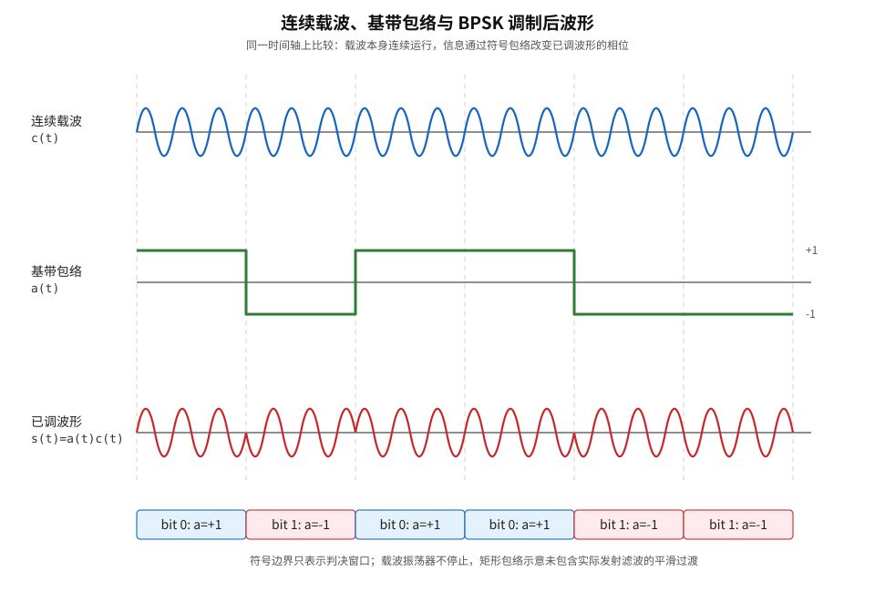
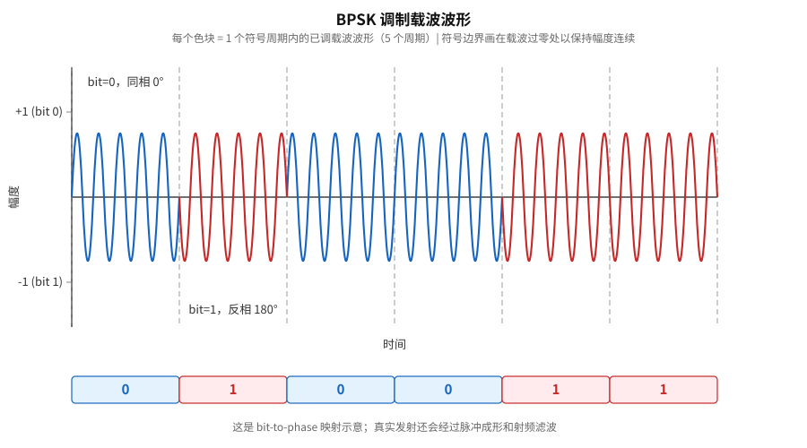
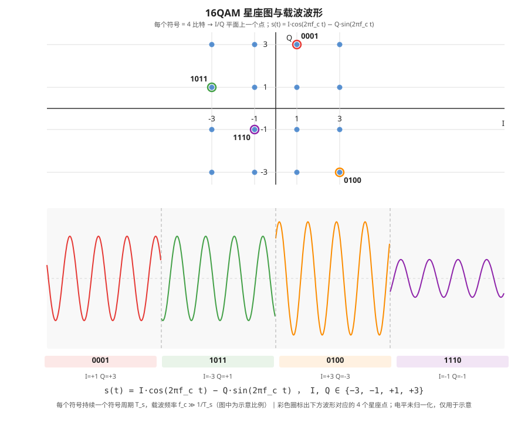

# T2.9 AWGN 信道与噪声缩放：$E_b/N_0$ 到译码器软信息
## 本节学习目标

[[T1.4_probability_bayes_soft_decoding|T1.4]] 和 [[T1.5_LLR_soft_decision|T1.5]] 已经讲过概率、似然和对数似然比。现在要把这些概念接到“真实接收值”上：接收端不是直接拿到概率，而是先拿到一个被噪声污染的采样值，再把它变成 LLR（对数似然比，Log-Likelihood Ratio）。

本节只讲最常用的入门信道模型：加性白高斯噪声。它不是完整无线信道课程，也不是 3GPP 协议强制规定的真实空口噪声；它是链路仿真和软解调推导里最常用的基准模型。

- 解释 AWGN（加性白高斯噪声，Additive White Gaussian Noise）里”加性””白””高斯””噪声”分别是什么意思。
- 区分信噪比（Signal-to-Noise Ratio, SNR）、$E_b/N_0$ 和 $E_s/N_0$。
- 说明码率 $R$、调制阶数 $Q_m$ 和噪声方差之间的关系。
- 在归一化二进制相移键控例子中从 $E_b/N_0$ 计算噪声标准差。
- 推导 BPSK（二进制相移键控，Binary Phase Shift Keying）在 AWGN 下的 LLR。
- 用固定随机种子生成可复现实验样本。

这里的 $N_0$ 是噪声功率谱密度的常用符号。此处暂不需将其理解为频谱课程里的严格定义，先把 $E_b/N_0$ 和 $E_s/N_0$ 看成“能量和噪声强弱的比值”即可。

## 前置知识检查

| 问题 | 需要达到的程度 |
|:---|:---|
| 概率密度是什么？ | 可理解为连续随机变量取值落在某点附近的相对可能性。 |
| LLR 是什么？ | 能说出它是对数概率比，正负号表示更像哪个比特。 |
| dB 是什么？ | 知道它是比值的对数表示；本节会给转换公式。 |
| 码率是什么？ | 能说出 $R=K/N$，信息比特占编码后比特的比例。 |

本节会用到自然对数 $\ln(\cdot)$ 和以 10 为底的 dB 换算。所有公式都会先说明用途，再写出来。

## AWGN 接收模型与噪声假设

最简单的接收模型写成：

$$
y=x+n
\tag{1}
$$

其中：

- $x$ 是发送符号。
- $n$ 是噪声。
- $y$ 是接收端看到的值。

“加性”表示噪声是直接加上去的；不是乘上去，也不是先经过复杂非线性变化。

“高斯”表示噪声 $n$ 服从高斯分布：

$$
n\sim\mathcal{N}(0,\sigma^2)
\tag{2}
$$

这里的平均值是 0，表示噪声不偏向正也不偏向负；方差是 $\sigma^2$，表示噪声波动强弱。

“白”表示不同时间采样的噪声可假定为互不相关。此处暂不展开其频谱意义，只把它当成“每次扰动互不记仇”的理想模型。

## 实基带与复基带噪声方差

AWGN 公式里最容易出错的是“方差到底按一个实数维度算，还是按一个复数符号算”。先把两个模型分开。

实基带模型只看一个实数维度：

$$
y=x+n,\quad n\sim\mathcal{N}(0,\sigma^2)
\tag{3}
$$

在通信教材的常见约定下，单个实维噪声方差是：

$$
\sigma^2=\frac{N_0}{2}
\tag{4}
$$

复基带模型把 I/Q 两路合成一个复数：

$$
y=x+n_I+jn_Q
\tag{5}
$$

其中：

$$
n_I\sim\mathcal{N}(0,N_0/2),\quad
n_Q\sim\mathcal{N}(0,N_0/2)
\tag{6}
$$

所以复噪声的平均功率是两路方差相加：

$$
E[|n|^2]=E[n_I^2+n_Q^2]=N_0
\tag{7}
$$

这并不矛盾。$N_0/2$ 是每个实维度的方差；$N_0$ 是一个复符号里 I/Q 两个实维度合起来的噪声功率。若仿真代码用复数生成噪声，常见写法是：

```text
n = sqrt(N0/2) * randn() + j * sqrt(N0/2) * randn()
```

如果误写成每路方差 $N_0$，噪声功率会翻倍，曲线整体变差；如果误把复数总功率 $N_0$ 又除两次，LLR 会过于自信，译码错误更难被纠正。

## 高斯分布作为入门噪声模型的适用性

高斯噪声有三个教学优点。

第一，它直观。噪声大多数时候在 0 附近，小概率出现较大偏移。

第二，它数学上好推导。BPSK 在 AWGN 下可以推到一个很简单的 LLR 公式。

第三，它是链路仿真的常用基线。后续加入衰落、均衡、信道估计误差和量化损失之前，先用 AWGN 检查编码和译码链路是否基本正确。

但要注意：AWGN 不是完整无线信道。真实无线还有多径、衰落、干扰、同步误差、射频非理想和接收机估计误差。

## SNR、$E_b/N_0$ 与 $E_s/N_0$ 三个指标

通信中常用三种"信噪比"口径，它们的区别在于分母用什么能量归一化。

信号功率与噪声功率的比值叫 SNR（Signal-to-Noise Ratio）：

$$
\mathrm{SNR}=\frac{P_{\mathrm{signal}}}{P_{\mathrm{noise}}}
\tag{7.1}
$$

在接收采样等间隔、噪声功率谱密度为 $N_0$ 的简化模型下，SNR 可写成 $E_s/(N_0 B T_s)$ 等形式，具体形式取决于带宽和符号速率。本节不推导最通用的 SNR 到 $E_s/N_0$ 的转换，仅需记住直觉：**SNR 高意味着信号比噪声强，接收线索更可靠**。

把能量归一化到"每个调制符号"就是 $E_s/N_0$；归一化到"每个信息比特"就是 $E_b/N_0$。三者关系如下：

| 指标 | 归一化到 | 符号 | 何时用 |
|:---|:---|:---|:---|
| SNR | 带宽内信号功率 vs 噪声功率 | — | 射频测量、链路预算。 |
| $E_s/N_0$ | 每个调制符号的能量 | $\gamma_s$ | 星座图设计、逐符号软解调。 |
| $E_b/N_0$ | 每个信息比特的能量 | $\gamma_b$ | 比较不同码率方案的公平基准。 |

本节后续重点在 $E_b/N_0 \to E_s/N_0 \to \sigma^2$ 这条换算链，因为它是仿真中从"给定 $E_b/N_0$ dB"到"生成噪声样本"的唯一通路。

## dB 和线性比值

仿真经常用 dB 表示 $E_b/N_0$。如果给定：

$$
\gamma_{b,\mathrm{dB}}=6
\tag{8}
$$

线性比值是：

$$
\gamma_b=10^{\gamma_{b,\mathrm{dB}}/10}
\tag{9}
$$

所以 6 dB 大约对应：

$$
\gamma_b=10^{0.6}\approx 3.9811
\tag{10}
$$

这里 $\gamma_b$ 就是线性形式的 $E_b/N_0$。

## $E_b/N_0$、$E_s/N_0$、码率和调制阶数

首先说清为什么需要调制，再说明"调制符号"到底是什么。

发射机通过天线向外发送的，是一段高频正弦电磁波，称为载波（carrier）。载波本身不携带信息——它只是一个固定频率、固定幅度、固定相位的"空载波形"。

比特本身只是抽象符号。要让电路或天线处理，必须先把比特变成随时间变化的波形。例如 BPSK 教学映射可以先写成：

$$
0\mapsto +1,\qquad 1\mapsto -1
$$

再用脉冲成形函数（pulse-shaping function）$p(t)$ 把离散符号变成连续时间基带信号（baseband signal）：

$$
m(t)=\sum_k a_k p(t-kT_s),\qquad a_k\in\{+1,-1\}
$$

这里的 $m(t)$ 适合在数字基带、数模转换器前后和芯片内部处理，但它的频谱主要集中在 0 Hz 附近，不适合直接作为无线发射波形。

第一个原因是天线尺寸。天线有效辐射和波长有关，波长可写成：

$$
\lambda=\frac{c}{f}
$$

其中 $c\approx3\times10^8\ \mathrm{m/s}$。如果直接发 1 kHz 量级的低频基带变化，波长约为：

$$
\lambda=\frac{3\times10^8}{10^3}=300000\ \mathrm{m}
$$

四分之一波长也有 75000 m，不可能放进手机、基站或普通无线设备。若把同样的信息搬到 2 GHz 附近：

$$
\lambda=\frac{3\times10^8}{2\times10^9}=0.15\ \mathrm{m}
$$

四分之一波长约 3.75 cm，这才进入实际天线尺寸量级。

第二个原因是频谱复用。如果所有无线系统都直接在低频附近发送，彼此会挤在一起，接收机也很难用滤波器分开不同系统。调制把基带信息搬到指定载频 $f_c$ 附近，让不同系统、不同小区或不同用户可以占用不同频段或频率资源。

第三个原因是射频硬件本身通常是带通系统。功放、滤波器、混频器、天线、低噪声放大器和接收机前端都围绕某个射频频段设计。调制把算法层的低频基带表示转换成硬件和无线传播层可处理的带通信号（passband signal）。

理论上，最简单的调制可以写成把基带信号乘上连续载波：

$$
s(t)=m(t)\cos(2\pi f_c t)
$$

根据傅里叶变换（Fourier transform）的频移性质：

$$
S(f)=\frac{1}{2}\left[M(f-f_c)+M(f+f_c)\right]
$$

也就是说，原本集中在 0 Hz 附近的基带频谱 $M(f)$，会被复制并搬移到 $+f_c$ 和 $-f_c$ 附近。物理实信号有正负频率对称；工程上看正频率一侧，就是把低频信息搬到射频载波附近。



上图用 BPSK 的矩形符号包络做示意。载波振荡器本身连续运行；信息不是靠"切断载波"发送，而是通过基带包络 $a(t)$ 改变已调波形 $s(t)=a(t)c(t)$ 的相位。图中的突变边界是为了说明符号判决窗口，真实发射机还会经过脉冲成形和射频滤波，边界过渡不会像理想矩形包络那样生硬。

调制（modulation）做的事是：按比特内容，**临时改变连续载波的幅度和/或相位**。改完之后维持一个符号周期，再根据下一组比特改成下一个状态。每一个"符号周期内的已调载波波形"，就是一个调制符号（modulation symbol）。

以 BPSK 为例。载波是 $\cos(2\pi f_c t)$（$f_c$ 是载波频率，比如 2 GHz）。发射机取一个比特：
- 比特 `0`：保持载波相位不变，发送 $\cos(2\pi f_c t)$。
- 比特 `1`：把载波相位反转 180°，发送 $-\cos(2\pi f_c t)$。

接收端看到这段波形，判断它的相位是正还是反，就能恢复出 `0` 或 `1`。



图 1 和图 2 是两个独立示意，不是同一条时间轴上的前后续接。图 2 展示的比特序列 `0 1 0 0 1 1` 对应 6 个调制符号。蓝色段（相位 0°）对应比特 `0`，红色段（相位 180°）对应比特 `1`。每个符号持续相同的时间，其间载波完成若干完整周期。图中把符号边界画在载波过零处，因此波形幅度连续；实际系统还会用脉冲成形和射频滤波限制突变。接收端的工作就是逐段检测相位，恢复比特。

但直接把 $\cos(2\pi f_c t)$ 和 $-\cos(2\pi f_c t)$ 写在公式里推导译码算法太啰嗦。工程上换一种等价写法：每个调制符号用一个**基带复数**（baseband complex number）来代表。复数的模长编码幅度变化，幅角编码相位变化。这个复数就是本课程说的"符号"——它是一个符号周期内已调载波波形的数学模型，不是载波本身。

| 调制方式 | 物理上做的事 | 基带模型中的符号 | 每个符号承载比特数 $Q_m$ |
|:---|:---|:---|:---:|
| BPSK | 改变载波相位（0° / 180°） | 实数 $+1$ 或 $-1$ | 1 |
| QPSK（正交相移键控，Quadrature Phase Shift Keying） | 4 种相位组合 | 复数 $(\pm 1 \pm j)/\sqrt{2}$ | 2 |
| 16QAM（16 阶正交幅度调制，16 Quadrature Amplitude Modulation） | 4×4 种幅度和相位组合 | 复数 $I+jQ$，其中 $I,Q\in\{\pm1,\pm3\}$ | 4 |
| 64QAM（64 阶正交幅度调制，64 Quadrature Amplitude Modulation） | 8×8 种幅度和相位组合 | 复数 $I+jQ$，其中 $I,Q\in\{\pm1,\pm3,\pm5,\pm7\}$ | 6 |

以 16QAM 为例，下图同时给出星座图和 4 个连续符号的载波波形，帮助建立"星座点—I/Q 分量—实际载波"三者之间的对应关系。



上半部分是星座图：16 个蓝色点对应 16 种 4-bit 组合，4 个彩色圈高亮了下方波形使用的符号。下半部分是载波波形：每个符号的实际波形由 $s(t)=I\cos(2\pi f_c t)-Q\sin(2\pi f_c t)$ 生成，不同 (I,Q) 组合产生不同的幅度和相位。

后续所有公式——$y=x+n$、$E_s$、$E_s/N_0$、LLR 推导——都是在基带模型里操作的。读者只需记住：公式里的 $x=+1$ 不是"1 伏直流电压"，而是"载波相位 0° 的数学模型表示"。真实载波频率 $f_c$ 已经在基带等效过程中被剥离了，这正是基带模型的设计目的——让算法推导不依赖 $f_c$。

理解了物理层和模型层的对应关系，再来看 $Q_m$ 和 $E_s$ 就自然了。每组比特数就叫调制阶数 $Q_m$（modulation order）。$Q_m$ 越大，每个符号扛的比特越多，但符号之间的间距越小，在同样噪声下更容易混淆。16QAM 的 $4\times 4=16$ 个候选点各扛 4 比特，这就是 $Q_m=4$ 的来源。

$E_s$ 是每个调制符号的平均能量。在基带模型里，对于复符号 $x=I+jQ$，符号能量就是 $|x|^2=I^2+Q^2$。所有可能映射点的 $|x|^2$ 取平均，就是 $E_s$。例如 16QAM 的 16 个点能量有高有低，平均后如果归一化就得到 $E_s=1$。

$E_b$ 是分摊到每个信息比特的能量。对于一个承载 $Q_m$ 个编码比特的符号，编码码率 $R$ 表示其中真正属于信息比特的比例。因此每个调制符号大约承载 $R Q_m$ 个信息比特的能量：

$$
R Q_m
\tag{11}
$$

个信息比特。

如果归一化每个调制符号能量为：

$$
E_s=1
\tag{12}
$$

那么每个信息比特能量可以写成：

$$
E_b=\frac{E_s}{R Q_m}
\tag{13}
$$

因为：

$$
\frac{E_s}{N_0}=R Q_m\frac{E_b}{N_0}
\tag{14}
$$

换成线性比值：

$$
\gamma_s=R Q_m\gamma_b
\tag{15}
$$

其中 $\gamma_s$ 是线性形式的 $E_s/N_0$。

## $E_b/N_0$ 到噪声方差的换算

本节采用一个明确约定：

```text
归一化 BPSK 符号能量 Es = 1；
接收模型是实数 y = x + n；
n ~ N(0, sigma^2)；
每个实数维度的噪声方差 sigma^2 = N0/2。
```

在这个约定下：

$$
\sigma^2=\frac{N_0}{2}
\tag{16}
$$

又因为：

$$
\gamma_s=\frac{E_s}{N_0}
\tag{17}
$$

且 $E_s=1$，所以：

$$
N_0=\frac{1}{\gamma_s}
\tag{18}
$$

代入 $\gamma_s=R Q_m\gamma_b$：

$$
\sigma^2=\frac{1}{2R Q_m\gamma_b}
\tag{19}
$$

这就是本节最重要的噪声缩放公式。

如果 $R=0.5$，$Q_m=1$，$E_b/N_0=6$ dB，则：

$$
\gamma_b=3.9811
\tag{20}
$$

$$
\sigma^2=\frac{1}{2\times 0.5\times 1\times 3.9811}=0.2512
\tag{21}
$$

$$
\sigma=\sqrt{0.2512}=0.5012
\tag{22}
$$

## BPSK 映射和接收模型

本节采用 BPSK 教学映射：

| 比特 | 发送符号 |
|:---:|:---:|
| `0` | $+1$ |
| `1` | $-1$ |

也就是：

$$
x(0)=+1,\quad x(1)=-1
\tag{23}
$$

接收端看到：

$$
y=x+n
\tag{24}
$$

如果 $y$ 很靠近 $+1$，就更像比特 `0`；如果 $y$ 很靠近 $-1$，就更像比特 `1`。如果 $y$ 靠近 0，就很不确定。

## BPSK 在 AWGN 下的 LLR 推导

按照 [[T1.5_LLR_soft_decision|T1.5]] 的符号约定，LLR 为正表示更像 `0`：

$$
L(y)=\ln\frac{p(y\mid X=0)}{p(y\mid X=1)}
\tag{25}
$$

在 AWGN 下，如果发送 `0`，也就是 $x=+1$，接收值 $y$ 的概率密度与下面成正比：

$$
p(y\mid X=0)\propto \exp\left(-\frac{(y-1)^2}{2\sigma^2}\right)
\tag{26}
$$

如果发送 `1`，也就是 $x=-1$：

$$
p(y\mid X=1)\propto \exp\left(-\frac{(y+1)^2}{2\sigma^2}\right)
\tag{27}
$$

代入 LLR：

$$
L(y)=
\ln
\frac{
\exp\left(-\frac{(y-1)^2}{2\sigma^2}\right)
}{
\exp\left(-\frac{(y+1)^2}{2\sigma^2}\right)
}
\tag{28}
$$

把指数相除变成指数相减：

$$
L(y)=\frac{(y+1)^2-(y-1)^2}{2\sigma^2}
\tag{29}
$$

展开平方：

$$
(y+1)^2-(y-1)^2=4y
\tag{30}
$$

所以：

$$
L(y)=\frac{2y}{\sigma^2}
\tag{31}
$$

这个公式非常重要。它说明在这个归一化 BPSK + 实数 AWGN 约定下：

- $y>0$，LLR 为正，更像 `0`。
- $y<0$，LLR 为负，更像 `1`。
- 噪声方差越小，同样的 $y$ 会给出更大的 LLR 幅度。
- 噪声方差越大，同样的 $y$ 应该更不可靠，LLR 幅度更小。

## 一个数值例子

沿用上面的 $R=0.5$、$Q_m=1$、$E_b/N_0=6$ dB：

$$
\sigma^2=0.2512
\tag{32}
$$

如果接收值是：

$$
y=0.7
\tag{33}
$$

则：

$$
L(y)=\frac{2\times 0.7}{0.2512}=5.5732
\tag{34}
$$

LLR 为正，说明更像 `0`；幅度较大，说明比较可靠。

如果接收值是：

$$
y=-0.2
\tag{35}
$$

则：

$$
L(y)=\frac{2\times(-0.2)}{0.2512}=-1.5924
\tag{36}
$$

LLR 为负，说明更像 `1`；但幅度没有上一个例子大，所以可靠度弱一些。

## 噪声方差错配的译码后果

噪声方差不是仿真里的次要参数。它直接出现在 LLR 分母里，因此会决定译码器对每个输入比特“相信到什么程度”。同一个接收值 $y=0.7$，如果真实噪声方差是 $0.2512$，正确 LLR 约为 $5.5732$；如果实现误把噪声方差写成 $0.1256$，LLR 就会变成原来的 2 倍，译码器会过度相信前端判断。

可以把这种错误分成两类：

| 错配类型 | LLR 表现 | 译码后果 |
|:---|:---|:---|
| 方差估计过小 | LLR 幅度过大 | 错误比特被赋予过高置信度，迭代译码难以纠正，块错误率曲线可能出现地板。 |
| 方差估计过大 | LLR 幅度过小 | 可靠比特被看成不可靠，译码收敛变慢，低信噪比区域性能损失明显。 |

以本节公式为例：

$$
L_{\mathrm{used}}(y)=\frac{2y}{\hat{\sigma}^2}
\tag{37}
$$

这里 $\hat{\sigma}^2$ 是接收机实际使用的方差估计。若 $\hat{\sigma}^2=\sigma^2/2$，则：

$$
L_{\mathrm{used}}(y)=2L_{\mathrm{true}}(y)
\tag{38}
$$

若 $\hat{\sigma}^2=2\sigma^2$，则：

$$
L_{\mathrm{used}}(y)=\frac{1}{2}L_{\mathrm{true}}(y)
\tag{39}
$$

这三个公式回答的是同一个工程问题：前端噪声估计的尺度错误，会不会被后端译码器自动修好？答案通常是否定的。译码器只看到 LLR，不知道这些 LLR 是不是被错误放大或压缩。后续做链路级仿真时，必须同时记录 $E_b/N_0$、码率、调制阶数、噪声方差、LLR 缩放和随机种子，否则块错误率曲线偏移时很难定位原因。

后续正交幅度调制软解调会继续使用同一套噪声尺度。若 QAM（正交幅度调制，Quadrature Amplitude Modulation）星座能量归一化和这里的 $E_s/N_0$ 口径不一致，逐比特 LLR 的幅度也会错。

从协议角度看，3GPP 章节会给出本次传输的调制阶数、目标码率和传输块大小等上下文；但接收机如何把这些上下文转换成噪声方差和 LLR，是实现策略。这里的边界必须守住：协议提供输入条件，仿真模型提供噪声，接收机实现负责估计和缩放。

## 噪声缩放错误诊断表

下面这张表把最常见的 LLR scaling bug 放在一起。它不是某次真实仿真的结论，而是调试时用于缩小排查范围的教学清单。

| 错误类型 | 典型写法 | 曲线或日志表现 | 优先检查 |
|:---|:---|:---|:---|
| dB 未转线性 | 直接把 `6` 当 $\gamma_b$ | 所有 SNR 点噪声尺度错误，曲线整体偏移。 | `10 ** (ebn0_db / 10)` 是否执行。 |
| 漏掉码率 $R$ | 用 $\sigma^2=1/(2Q_m\gamma_b)$ | 不同码率曲线相对位置异常。 | 记录 effective code rate 和 rate matching 后口径。 |
| 漏掉调制阶数 $Q_m$ | 把高阶 QAM 当 BPSK 缩放 | QPSK/16QAM/64QAM 之间性能差距不可信。 | $E_s/N_0=RQ_mE_b/N_0$ 是否一致。 |
| 实复维度混淆 | 复噪声每路用 $\sqrt{N_0}$ | 复基带噪声功率翻倍，LLR 幅度偏小。 | I/Q 每路方差是否为 $N_0/2$。 |
| LLR 分母错用 $\sigma$ | 写成 $2y/\sigma$ | 高 SNR 幅度尤其不对。 | BPSK 推导中应除以 $\sigma^2$。 |
| 归一化不一致 | 星座 $E_s\ne1$ 但按 $E_s=1$ 加噪声 | QAM 曲线整体偏移，bit-channel 可靠性也错。 | 星座平均能量和噪声公式共用同一 $E_s$。 |

调试顺序建议从单符号 directed test 开始：固定发送比特、固定噪声样本、打印 $E_b/N_0$ 线性值、$E_s/N_0$、$N_0$、$\sigma^2$、接收值和 LLR。若单符号都对不上，不要先调译码器迭代次数。

## Python 固定随机种子实验

下面用固定随机种子生成 8 个 BPSK 样本。这里使用 Python 标准库，不需要第三方库。

```python
import math
import random


def noise_sigma(ebn0_db: float, code_rate: float, modulation_order: int) -> float:
    ebn0_linear = 10 ** (ebn0_db / 10.0)
    sigma2 = 1.0 / (2.0 * code_rate * modulation_order * ebn0_linear)
    return math.sqrt(sigma2)


def bpsk_symbol(bit: int) -> float:
    return 1.0 if bit == 0 else -1.0


def bpsk_llr_awgn(y: float, sigma: float) -> float:
    return 2.0 * y / (sigma * sigma)


random.seed(20260619)
bits = [0, 1, 0, 0, 1, 1, 0, 1]
sigma = noise_sigma(6.0, 0.5, 1)

samples = []
for bit in bits:
    x = bpsk_symbol(bit)
    y = x + random.gauss(0.0, sigma)
    llr = bpsk_llr_awgn(y, sigma)
    samples.append((bit, round(y, 4), round(llr, 4)))

print(round(sigma, 4))
print(samples)
```

期望输出：

```text
0.5012
[(0, 0.3862, 3.0747), (1, -1.143, -9.1006), (0, 0.506, 4.0285), (0, 1.7849, 14.2114), (1, -0.7955, -6.334), (1, 0.0022, 0.0171), (0, 0.5507, 4.3847), (1, -1.2162, -9.6838)]
```

## 和 3GPP 协议的关系

本节的 AWGN、$E_b/N_0$ 和噪声方差缩放是链路仿真与软解调理论，不是 3GPP 协议逐项规定的空口信道模型。3GPP 协议更直接规定的是调制映射、调制阶数、目标码率、传输块大小、速率匹配和物理信道流程。

NR 中，调制阶数和目标码率可从调制与编码方案相关流程定位；传输块大小用于描述本次传输承载多少信息比特。LTE 的等价入口后续还需要逐项核验。本节只使用 NR Rel-19 的章节入口作为“协议里确实存在 $Q_m$、目标码率和 TBS（传输块大小，Transport Block Size）这些上下文参数”的背景，不从 MCS（调制与编码方案，Modulation and Coding Scheme）表读取任何具体数值。

本节公式里的 $Q_m$ 和 $R$ 是仿真输入变量：$Q_m=1$ 表示教学 BPSK，$R=0.5$ 表示教学码率。它们不是从 TS 38.214 表格查出的协议配置。因此本节噪声缩放公式可以独立验证；后续做真实 LTE/NR 链路仿真时，才需要把 $Q_m$、目标码率和 TBS 从协议表格和调度信息中逐项核验。

本地 Rel-19 资料入口如下：

| 系统 | 协议依据 | 本地路径 | 本节采用程度 |
|:---|:---|:---|:---|
| NR | 技术规范（Technical Specification, TS）38.214 Rel-19 `38214-j30` §5.1.3、§5.1.3.1、§6.1.4、§6.1.4.1 | `3GPP_Rel19/processed/TS_38.214_38214-j30/sections.jsonl`，`content.md` | 只定位调制阶数、目标码率、冗余版本和传输块大小相关入口；本节不从 MCS 表取值。 |
| NR | TS 38.211 Rel-19 `38211-j30` §5.1 Modulation mapper | `3GPP_Rel19/processed/TS_38.211_38211-j30/sections.jsonl`，`content.md` | 已定位调制映射入口；本节只用 BPSK 教学映射，不复现协议星座表。 |
| LTE | TS 36.211/36.214 Rel-19 | `3GPP_Rel19/processed/TS_36.211_*`；TS 36.214 入口待核验 | 只标记后续对照方向；本节不声明已完成 LTE 等价锚点核验。 |

这里没有逐项核验原始 Word、表格超文本标记语言（HyperText Markup Language, HTML）或公式可扩展标记语言（Extensible Markup Language, XML），因此本节不宣称已经完成 NR MCS 表、调制表或 LTE 等价章节的协议精读。

## 常见错误

| 错误 | 为什么错 | 正确做法 |
|:---|:---|:---|
| 把 dB 值直接代进线性公式 | 6 dB 不是线性 6。 | 先用 $10^{\gamma_{\mathrm{dB}}/10}$ 转成线性比值。 |
| 忘记码率 $R$ | 同样 $E_b/N_0$ 下，码率会改变每符号能量和噪声缩放关系。 | 用 $\sigma^2=1/(2R Q_m\gamma_b)$。 |
| 混淆 $E_b/N_0$ 和 $E_s/N_0$ | 一个按信息比特算，一个按调制符号算。 | 记住 $\gamma_s=R Q_m\gamma_b$。 |
| 把 AWGN 当真实无线全貌 | AWGN 没有衰落、多径和干扰。 | 把它作为基准模型，后续再加复杂信道。 |
| LLR 符号和映射不一致 | 若 `0 -> +1`，本节 LLR 为正表示 `0`；换映射会改变符号。 | 映射、LLR 公式和译码器符号约定必须一起检查。 |

## 自测题

先自己算，再看参考答案。

1. 为什么 6 dB 不能直接当作线性比值 6 使用？
2. 在本节约定下，$R=0.5$、$Q_m=1$、$E_b/N_0=6$ dB 时，$\sigma^2$ 和 $\sigma$ 分别约是多少？
3. 若 $y=0.7$、$\sigma^2=0.2512$，BPSK LLR 是多少？更像哪个比特？
4. 为什么噪声方差越大，同样的接收值应给出更小的 LLR 幅度？
5. 本节为什么不能说”3GPP 规定 AWGN 噪声方差这样算”？
6. SNR、$E_b/N_0$ 和 $E_s/N_0$ 三者各归一化到什么量？比较不同码率的编码方案时，为什么要用 $E_b/N_0$ 而不是 SNR 或 $E_s/N_0$？
7. $R=0.5$、$Q_m=2$（QPSK）、$E_b/N_0=3$ dB 时，$\sigma^2$ 是多少？和 $Q_m=1$（BPSK）相比，噪声方差变大还是变小？为什么？

## 自测题参考答案

1. dB 是对数表示，必须先转换为线性比值：$\gamma=10^{\gamma_{\mathrm{dB}}/10}$。
2. 6 dB 对应 $\gamma_b\approx 3.9811$，所以 $\sigma^2=1/(2\times0.5\times1\times3.9811)\approx0.2512$，$\sigma\approx0.5012$。
3. $L=2y/\sigma^2=1.4/0.2512\approx5.5732$，为正，所以更像 `0`。
4. 方差越大，说明噪声越强，同样的 $y$ 不能给出同样高的信心；公式 $L=2y/\sigma^2$ 也显示方差越大，幅度越小。
5. AWGN 是仿真和理论基准模型；3GPP 这里提供的是调制、码率、物理信道等协议入口，不逐项规定接收机仿真的 AWGN 方差公式。
6. SNR 归一化到信号功率 vs 噪声功率；$E_s/N_0$ 归一化到每个调制符号的能量；$E_b/N_0$ 归一化到每个信息比特的能量。比较不同码率的编码方案时，用 SNR 或 $E_s/N_0$ 不公平——低码率方案每个符号承载更少信息比特，$E_s/N_0$ 相同但实际每信息比特得到更高能量。$E_b/N_0$ 校正了这个差异，因此更适合做公平比较。
7. 3 dB → $\gamma_b = 10^{0.3} \approx 1.9953$。$\sigma^2 = 1/(2 \times 0.5 \times 2 \times 1.9953) = 1/(3.9906) \approx 0.2506$。和 $Q_m=1$ 相比噪声方差变小（$Q_m=1$ 时 $\sigma^2 \approx 0.5012$，差约 2 倍）。原因是 $Q_m$ 变大 → 每个符号承载更多比特 → 相同 $E_b/N_0$ 下 $E_s/N_0$ 变大（$E_s/N_0 = R Q_m \gamma_b$）→ 噪声相对更弱 → $\sigma^2$ 更小。

## 本节验收

| 验收项 | 通过标准 |
|:---|:---|
| AWGN 概念 | 能解释 $y=x+n$ 和 $n\sim\mathcal{N}(0,\sigma^2)$，说明"加性""白""高斯"各指什么。 |
| SNR / $E_b/N_0$ / $E_s/N_0$ 区分 | 能说出三者分贝归一化到"信号功率""每信息比特""每调制符号"，以及什么时候用哪个。 |
| dB 换算 | 能把 $E_b/N_0$ dB 转成线性比值 $\gamma_b = 10^{\mathrm{dB}/10}$。 |
| $R$、$Q_m$ 与噪声方差 | 能从 $E_b/N_0$、$R$、$Q_m$ 出发，用 $\sigma^2 = 1/(2 R Q_m \gamma_b)$ 计算噪声方差。 |
| BPSK LLR 推导 | 能推出 $L(y)=2y/\sigma^2$，并解释为什么噪声方差出现在分母。 |
| 固定种子实验 | 能用固定随机种子生成可复现的 AWGN/BPSK 样本，并验证 LLR 数值。 |

## 资料与协议边界

本节是信道模型与软解调基础课。涉及 3GPP 的内容只作为调制阶数、目标码率和调制映射的后续协议精读入口。

| 资料 |
| :--- |
| TS 38.214 Rel-19 `38214-j30` §5.1.3, §5.1.3.1 |
| TS 38.214 Rel-19 `38214-j30` §6.1.4, §6.1.4.1 |
| TS 38.211 Rel-19 `38211-j30` §5.1 |

这里没有复现 MCS 表、TBS 表、调制星座表或真实接收机噪声估计算法，因此不宣称完成协议精读。非 3GPP 文献只作为 AWGN、数字调制和无线信道背景读物；本节使用的噪声缩放、BPSK LLR 和数值例子均在正文自洽推导，没有引用这些文献中的具体表格、图或算法框图。


## 执行与证据记录

| 项目 | 记录 |
|:---|:---|
| 本地协议检索 | 使用 `rg` 检索 TS 38.214、TS 38.211 的 `sections.jsonl` 和 `content.md`，定位调制阶数、目标码率、TBS 与 modulation mapper 入口。 |
| 示例验证 | 使用 Python 3 执行固定随机种子 AWGN/BPSK 样本生成片段，验收输出为 `T2.1_PYTHON_EXAMPLE_OK`。 |
| 审查范围 | 检查术语首现、公式编号、噪声缩放推导、协议边界、自测答案、验收项和参考文献。 |
| 证据边界 | 未核验协议表格 HTML、公式 XML 或原始 Word；不复现 MCS 表、TBS 表或协议调制星座表。 |
| 使用技能/流程 | 使用 `3gpp-word-extraction` 规则确认协议证据边界；使用 `verification-before-completion` 规则执行本地验证；使用 `tools/audit_lesson_terms.py` 做术语审计；按 `requesting-code-review` 的检查维度做小节审查。 |

## 参考文献

- [3GPP, 2026] 3GPP TS 38.214, Rel-19, `38214-j30`, Physical layer procedures for data, §5.1.3 and §6.1.4. Local path: `3GPP_Rel19/processed/TS_38.214_38214-j30`.
- [3GPP, 2026] 3GPP TS 38.211, Rel-19, `38211-j30`, Physical channels and modulation, §5.1 Modulation mapper. Local path: `3GPP_Rel19/processed/TS_38.211_38211-j30`.
- [Proakis, 2001] John G. Proakis, *Digital Communications*, 4th ed., McGraw-Hill, 2001.
- [Goldsmith, 2005] Andrea Goldsmith, *Wireless Communications*, Cambridge University Press, 2005.
