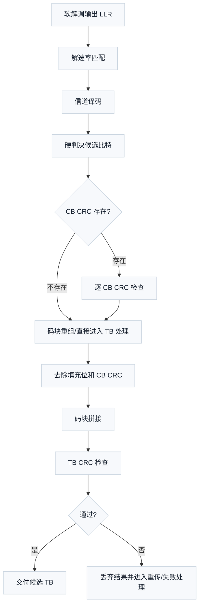

# T3.1 LTE/NR CRC 家族：从错误检测到译码通过/失败判决
## 本节学习目标

[[T1.2_GF2_polynomials_crc_remainders|T1.2]] 已经讲过循环冗余校验的算术核心：发送端把一串比特按 GF(2) 多项式规则除以生成多项式，把余数作为校验比特附在后面；接收端用同一条规则再检查一次，余数为 `0` 表示“没有被这条规则发现错误”。

本节第一次把 CRC 放回 LTE/NR 译码链路。这里的重点不是背多项式，而是看懂协议为什么在不同位置放不同 CRC，以及接收端怎样用这些 CRC 做通过/失败判决。


- 解释 CRC 是错误检测，不是纠错码，也不是译码算法本身。
- 区分TB CRC、码块CRC 和控制信息 CRC 的角色。
- 说明 LTE/NR 的数据信道和控制信道译码链路为什么都离不开 CRC 判决。
- 读懂 TS 36.212/38.212 中 CRC 相关章节的前后关系。
- 手算并运行一个小型 CRC-4 教学例子。
- 说清哪些内容本节已经用本地 Rel-19 资料定位，哪些公式/表格还没有完整复现。

## 前置知识检查

| 问题 | 需要达到的程度 |
|:---|:---|
| GF(2) 加法怎么做？ | `1 + 1 = 0`，也就是异或。 |
| CRC 余数为什么能检测错误？ | 发送端构造出的完整比特串满足“除以生成多项式余数为 0”的规则。 |
| 译码器输入是什么？ | 对数似然比是译码器输入的软信息。 |
| 后面三类纠错码是什么？ | Turbo、低密度奇偶校验码和Polar是本路线图要精读的纠错码家族。 |

如果 GF(2) 多项式长除法还不熟，先回看 [[T1.1_GF2_binary_arithmetic_for_decoders|T1.1]] 和 [[T1.2_GF2_polynomials_crc_remainders|T1.2]]。本节会复述 CRC 的直觉，但不会重新完整推导每一步长除法。

## CRC 在译码链路中的职责

译码器的任务是从噪声、衰落和干扰污染过的 LLR 中恢复比特。问题是：恢复出来的一串比特看起来像 `0/1`，但接收端怎么知道它是否可信？

CRC 就是一个低成本的错误检测关卡。它不告诉你哪个比特错，也不负责把错误改正；它只回答一个问题：

```text
这串候选比特是否满足发送端预先附加的 CRC 规则？
```

如果 CRC 失败，接收端通常认为这次译码结果不可接受。数据业务里，这会影响混合自动重传请求的确认/否定确认流程；HARQ 是把前后多次传输组合起来提高可靠性的重传机制。本节关注 CRC 结果对接收端接纳/拒绝的影响，媒体接入控制层的 HARQ 流程作为系统层背景处理。

如果 CRC 通过，也不能说“绝对无错”。CRC 有漏检概率：某些错误模式可能刚好仍满足同一个余数规则。工程上说的是“未检测到错误”，不是“数学证明无错”。

## 多层 CRC 的协议动机

假设发送端有一大包数据。它太大，不能一次交给一个译码器处理，于是要拆成几个小块并行译码。现在有两个层次的问题：

| 问题 | 需要哪个 CRC 帮忙 | 接收端用它做什么 |
|:---|:---|:---|
| 每个小块译码是否可靠？ | CB CRC | 判断某个码块是否通过，帮助定位失败发生在哪个块。 |
| 拼回来的整包数据是否可靠？ | TB CRC | 判断最终传输块是否可以交给上层。 |
| 控制信令候选是否可信？ | 控制信息 CRC | 帮助接收端确认调度、授权或控制信息是否有效。 |

这三个 CRC 的目的不同。CB CRC 更像“分块局部验收”，TB CRC 更像“整包最终验收”，控制信息 CRC 则服务于低时延、高可靠的控制信令检测。后续 LTE Turbo、NR LDPC 和 NR Polar 章节会分别把这些 CRC 放进具体接收链路。

## 协议定位：TS 36.212 和 TS 38.212 的 CRC 章节结构

LTE 和 NR 的信道编码协议都把 CRC 放在复用与信道编码规范中。这里要先读结构，再读公式。

| 系统 | 本地协议依据 | 章节入口 | 本节读到的作用 |
|:---|:---|:---|:---|
| LTE | TS 36.212 Rel-19 `36212-j30` | §5.1.1 CRC calculation | 通用 CRC 计算过程和生成多项式家族入口。 |
| LTE | TS 36.212 Rel-19 `36212-j30` | §5.1.2 Code block segmentation and code block CRC attachment | 当输入超过最大码块大小时分段，并对码块附加 CRC 的通用入口。 |
| LTE | TS 36.212 Rel-19 `36212-j30` | §5.2.2.1、§5.3.2.1 | 上行共享信道和下行共享/寻呼/多播信道的 TB CRC attachment 入口。 |
| LTE | TS 36.212 Rel-19 `36212-j30` | §5.3.3.2 | 下行控制信息 CRC attachment 入口。 |
| NR | TS 38.212 Rel-19 `38212-j30` | §5.1 CRC calculation | 通用 CRC 计算过程和生成多项式家族入口。 |
| NR | TS 38.212 Rel-19 `38212-j30` | §5.2 Code block segmentation and code block CRC attachment | Polar/LDPC 的分段和码块 CRC 通用入口。 |
| NR | TS 38.212 Rel-19 `38212-j30` | §6.2.1、§7.2.1 | 上行共享信道/下行共享信道等传输块 CRC attachment 入口。 |
| NR | TS 38.212 Rel-19 `38212-j30` | §7.3.2 | 下行控制信息 CRC attachment 入口。 |

这张表先定位结构。LTE 的 CRC 生成多项式已经能在 TS 36.212 `content.md` 和原始 `document.xml` 邻域中交叉看到，并在正文复现。NR 的 CRC 生成多项式在 TS 38.212 `content.md` 的 Markdown 抽取中丢失了公式本体，只保留“for a CRC length ...”等残缺文本；本次阶段 4 已回到 `source.docx` 的 Word XML 和 `word/_rels/document.xml.rels`，把 §5.1 中六个 Equation.3 OLE 对象映射到 `media/image7.wmf`、`image9.wmf`、`image10.wmf`、`image11.wmf`、`image13.wmf`、`image15.wmf`，因此可以在正文复现 NR 多项式。

码块大小表、下行控制信息掩码和 Polar 相关细节分别由 [[T3.4_NR_LDPC_segmentation_rules|T3.4]]、[[T3.5_NR_Polar_segmentation_crc|T3.5]] 和 Polar 章节精读。

## 从发送端到接收端：CRC 的前因后果

协议里的 CRC 不是孤立出现的。它在发送端和接收端形成一对动作。


从接收端看，CRC 的关键作用是把“译码器输出了一串比特”变成“这串比特是否可接受”。没有 CRC，接收端只能得到候选比特，却缺少一个协议规定的验收信号。

## TB CRC：整包最终验收

传输块是物理层一次编码处理的主要数据单位，可以理解为“这次物理层要保护和发送的一包比特”。

TB CRC 附在整个传输块后面。发送端先对整个 TB 计算 CRC，再把 CRC 比特附加进去。接收端完成译码、码块拼接和必要的 CRC 去除后，会对恢复出的 TB 做最终 CRC 检查。

TB CRC 的工程意义很直接：

- 通过：接收端认为这个 TB 没有被 CRC 检测出错误，可以进入后续处理。
- 失败：接收端认为这个 TB 不可接受，即使某些局部码块看起来通过，也不能把这个 TB 当成正确数据交付。

NR 的 TS 38.212 §6.2.1 明确把 UL-SCH 传输块的错误检测与 CRC 联系起来，并说明整个传输块用于计算 CRC parity bits；§7.2.1 给出下行共享信道的对应入口。LTE 的 TS 36.212 也在上行和下行共享信道流程中给出 TB CRC attachment 入口。

## CB CRC：分块译码的局部验收

码块是把一个较大的 TB 拆开后交给信道编码器/译码器处理的小块。为什么要拆？因为真实编码器和译码器通常有最大块长限制；块太大时，复杂度、存储和时延都会不可接受。

CB CRC 的核心作用是：给每个分出来的小块增加局部错误检测。接收端可以逐个码块译码，并检查每个 CB CRC。

这带来三个工程后果：

| 后果 | 解释 |
|:---|:---|
| 可以定位局部失败 | 哪个 CB CRC 失败，说明这个码块候选结果没有通过局部检查。 |
| 支持并行译码验收 | 多个码块可以并行译码，每个块有自己的局部 CRC 检查。 |
| 不能替代 TB CRC | 所有码块局部通过之后，拼接、填充位处理或接口顺序仍可能出错，所以还需要 TB CRC 做最终验收。 |

LTE TS 36.212 §5.1.2 提到当输入长度超过最大码块大小时要分段，并附加额外的 24 bit CRC 到每个码块。NR TS 38.212 §5.2 把 Polar/LDPC 的码块分段和码块 CRC 放到通用流程中；[[T3.4_NR_LDPC_segmentation_rules|T3.4]]/[[T3.5_NR_Polar_segmentation_crc|T3.5]] 会继续精读这些分段规则。

## 控制信息 CRC：控制候选有效性判定

控制信息和数据信道的关注点不完全一样。数据可以比较大，通常通过 TB/CB 流程和 HARQ 机制保证可靠性；控制信息更小、更敏感，接收端需要快速判断某个候选控制消息是否有效。

DCI 是基站发给终端的调度或控制指令。上行控制信息是终端上报给基站的控制信息，例如确认信息、信道状态相关信息等。

控制信息 CRC 的作用可理解为：

```text
候选控制比特 -> 做 CRC 检查 -> 通过才认为这个控制候选可信
```

NR TS 38.212 §7.3.2 是 DCI CRC attachment 入口；LTE TS 36.212 §5.3.3.2 是 LTE 下行控制信息 CRC attachment 入口。Polar 译码章节还会看到 CRC 辅助列表译码：多个候选路径中，CRC 可以帮助选择可信路径。本节建立 CRC 选择路径的动机，Polar SCL 算法在 Polar 专题中讲解。

## CRC 家族的长度与用途差异

从 [[T1.2_GF2_polynomials_crc_remainders|T1.2]] 的角度看，CRC 由生成多项式决定。协议中会出现不同长度的 CRC，例如 24 bit、16 bit、11 bit、8 bit 等。这不是为了增加名词，而是因为不同对象的长度、可靠性需求和开销预算不同。

可以这样理解：

| CRC 类型 | 直觉 | 工程取舍 |
|:---|:---|:---|
| 较长 CRC | 错误检测能力更强，附加比特更多 | 适合大块数据或关键验收。 |
| 较短 CRC | 开销更小，检测能力相对弱 | 适合小负载或特定控制场景。 |
| TB CRC | 看整包是否可信 | 影响最终交付和 HARQ 反馈。 |
| CB CRC | 看单个分块是否可信 | 影响并行译码、局部失败定位和重组前检查。 |
| 控制信息 CRC | 看控制候选是否可信 | 影响调度/授权/控制消息是否被接受。 |

## LTE 协议 CRC 生成多项式复现

TS 36.212 §5.1.1 给出 LTE 通用 CRC calculation 的生成多项式族。本节把当前能从本地 `content.md` 与 `document.xml` 共同核验到的四个多项式完整列出。这里的 $D$ 是 GF(2) 多项式里的延迟/占位变量；$D^{24}$ 表示最高次数为 24，因此对应 CRC 余数长度为 24 bit。

| LTE CRC 生成多项式 | 协议多项式 | 长度 | 本节用途 |
|:---|:---|---:|:---|
| $g_{\mathrm{CRC24A}}(D)$ | $D^{24}+D^{23}+D^{18}+D^{17}+D^{14}+D^{11}+D^{10}+D^7+D^6+D^5+D^4+D^3+D+1$ | 24 bit | LTE TB CRC 等场景的主要 24 bit CRC 入口。 |
| $g_{\mathrm{CRC24B}}(D)$ | $D^{24}+D^{23}+D^6+D^5+D+1$ | 24 bit | LTE CB CRC，例如 TS 36.212 §5.1.2 分段后每个码块附加的 CRC。 |
| $g_{\mathrm{CRC16}}(D)$ | $D^{16}+D^{12}+D^5+1$ | 16 bit | LTE 较短 CRC 场景入口。 |
| $g_{\mathrm{CRC8}}(D)$ | $D^8+D^7+D^4+D^3+D+1$ | 8 bit | LTE 8 bit CRC 场景入口。 |

这张表回答的是“协议到底用哪条除法规则”。接收端 CRC checker 不是只看 CRC 长度，还要使用同一个生成多项式。如果把 CRC24A 和 CRC24B 混用，二者都是 24 bit，但校验规则不同，余数检查会失去协议意义。

以 $g_{\mathrm{CRC24B}}(D)$ 为例，它的最高次数是 24，所以分段后的每个 LTE 码块会附加 24 个 CRC parity bits。[[T3.3_LTE_Turbo_segmentation_rules|T3.3]] 中的码块 CRC 长度 $L=24$ 只说明“附加多少位”，这里的多项式说明“这 24 位按哪条 GF(2) 规则计算”。

## NR 协议 CRC 生成多项式复现

TS 38.212 §5.1 定义 NR 的 CRC 生成多项式族。Markdown 抽取文本在这里会丢失公式名和公式本体，所以不能只看 `content.md`；本节使用原始 `source.docx` 的 Word XML 关系核验。§5.1 中六条多项式分别是旧版 Equation.3 OLE 对象，media 关系如下：`rId25 -> media/image7.wmf`、`rId29 -> media/image9.wmf`、`rId32 -> media/image10.wmf`、`rId35 -> media/image11.wmf`、`rId39 -> media/image13.wmf`、`rId43 -> media/image15.wmf`。

| NR CRC 生成多项式 | 协议多项式 | 长度 | 本地证据 |
|:---|:---|---:|:---|
| $g_{\mathrm{CRC24A}}(D)$ | $D^{24}+D^{23}+D^{18}+D^{17}+D^{14}+D^{11}+D^{10}+D^7+D^6+D^5+D^4+D^3+D+1$ | 24 bit | TS 38.212 §5.1；`source.docx` `rId25 -> media/image7.wmf`；长度标签 `rId27 -> media/image8.wmf`。 |
| $g_{\mathrm{CRC24B}}(D)$ | $D^{24}+D^{23}+D^6+D^5+D+1$ | 24 bit | TS 38.212 §5.1；`source.docx` `rId29 -> media/image9.wmf`；长度标签复用 `rId27 -> media/image8.wmf`。 |
| $g_{\mathrm{CRC24C}}(D)$ | $D^{24}+D^{23}+D^{21}+D^{20}+D^{17}+D^{15}+D^{13}+D^{12}+D^8+D^4+D^2+D+1$ | 24 bit | TS 38.212 §5.1；`source.docx` `rId32 -> media/image10.wmf`；长度标签复用 `rId27 -> media/image8.wmf`。 |
| $g_{\mathrm{CRC16}}(D)$ | $D^{16}+D^{12}+D^5+1$ | 16 bit | TS 38.212 §5.1；`source.docx` `rId35 -> media/image11.wmf`；长度标签 `rId37 -> media/image12.wmf`。 |
| $g_{\mathrm{CRC11}}(D)$ | $D^{11}+D^{10}+D^9+D^5+1$ | 11 bit | TS 38.212 §5.1；`source.docx` `rId39 -> media/image13.wmf`；长度标签 `rId41 -> media/image14.wmf`。 |
| $g_{\mathrm{CRC6}}(D)$ | $D^6+D^5+1$ | 6 bit | TS 38.212 §5.1；`source.docx` `rId43 -> media/image15.wmf`；长度标签 `rId45 -> media/image16.wmf`。 |

这张表有两个接收端含义。第一，NR 不是只比 LTE “多一个 LDPC”或“多一个 Polar”，CRC 家族也扩展了：除了 LTE 已有的 24A、24B、16 等规则，NR 还使用 CRC24C、CRC11 和 CRC6 等多项式服务于不同传输块、码块和控制信息场景。第二，CRC 长度相同不代表多项式相同。例如 CRC24A、CRC24B、CRC24C 都是 24 bit，但 tap 位置不同；接收端若只按长度选择 checker，会把协议不同对象混到同一条除法规则里。

TS 38.212 后续章节会引用这些多项式。例如 §6.2.1 和 §7.2.1 在 UL-SCH/DL-SCH 传输块 CRC attachment 中按传输块大小选择 24 bit 或 16 bit CRC；§5.2 的 Polar/LDPC 码块分段会引用 6 bit、11 bit 或 24 bit CRC；§7.3.2 的 DCI CRC attachment 使用 24 bit CRC 并叠加控制信息语境。具体到某个信道时，接收端必须同时锁定“对象类型、CRC 长度、生成多项式、是否存在扰码/掩码和候选检测规则”，不能只拿本表孤立套用。

## CRC-4 教学算例

下面用一个教学 CRC-4 例子把 TB CRC 的“附加再检查”机制跑通。这里的生成多项式 `10011` 表示：

$$
g(D)=D^4+D+1
\tag{1}
$$

它的最高次数是 4，所以余数长度是 4 bit。消息取：

$$
m=101101
\tag{2}
$$

发送端先在消息后补 4 个 `0`：

```text
1011010000
```

然后用 `10011` 做 GF(2) 长除法，得到 4 bit 余数。最后把余数贴到原消息后，得到码字。接收端再除一次，如果余数为 `0000`，这个教学 CRC 检查通过。

注意：这个 CRC-4 不是 LTE/NR 协议多项式，只是为了让你能手算和运行代码。协议 CRC 家族必须回到 TS 36.212/38.212。

## Python 校验片段

```python
def crc_remainder(bits: str, generator: str) -> str:
    # Time: O(N * R), Space: O(N + R)
    work = [int(b) for b in bits]
    gen = [int(b) for b in generator]
    r = len(gen) - 1

    for i in range(len(work) - r):
        if work[i] == 0:
            continue
        for j, gj in enumerate(gen):
            work[i + j] ^= gj
    return "".join(str(b) for b in work[-r:])


def append_crc(message: str, generator: str) -> str:
    # Time: O(N * R), Space: O(N + R)
    r = len(generator) - 1
    rem = crc_remainder(message + "0" * r, generator)
    return message + rem


def check_crc(codeword: str, generator: str) -> bool:
    # Time: O(N * R), Space: O(N + R)
    return set(crc_remainder(codeword, generator)) == {"0"}


generator = "10011"  # D^4 + D + 1, teaching CRC-4 only.
message = "101101"
codeword = append_crc(message, generator)
bad = list(codeword)
bad[2] = "0" if bad[2] == "1" else "1"
bad = "".join(bad)

print(codeword)
print(crc_remainder(codeword, generator), check_crc(codeword, generator))
print(crc_remainder(bad, generator), check_crc(bad, generator))
```

期望输出：

```text
1011011110
0000 True
1011 False
```

这个例子对应三个接收端结论：

1. `1011011110` 是发送端构造出的完整比特串。
2. 原始码字检查余数为 `0000`，CRC 通过。
3. 翻转一个比特后余数 `1011` 不为 `0000`，CRC 检测到错误。

## 接收端流程



不同译码器家族的细节不同，但 CRC 作为验收信号的思想相同：

- LTE Turbo：后续会看 CB CRC、码块拼接和 TB CRC。
- NR LDPC：后续会看 LDPC 分段、CB CRC、码块组和 TB CRC。
- NR Polar：后续会看控制信息 CRC 如何辅助候选路径选择。

## 伪代码

```text
for each received transport block:
    llrs = soft_demapper_output()
    code_blocks = rate_recover_and_split(llrs)
    decoded_blocks = []

    for each code_block in code_blocks:
        bits = channel_decode(code_block)
        if code_block_has_crc:
            if not crc_check(bits_without_filler, cb_crc_rule):
                mark_cb_failed()
        decoded_blocks.append(remove_cb_crc_and_filler(bits))

    tb_candidate = concatenate(decoded_blocks)
    if crc_check(tb_candidate, tb_crc_rule):
        deliver_transport_block()
    else:
        reject_transport_block()
```

这里的 `crc_check()` 必须使用协议规定的 CRC 规则。`channel_decode()` 是 Turbo/LDPC/Polar 等具体译码器，分别由对应章节展开。

## 代表性工程用例

| 用例 | 输入 | 输出 | 失败案例 | 验证方式 |
|:---|:---|:---|:---|:---|
| PDSCH 数据译码验收 | 软解调 LLR、调度元数据、码块数、CRC 规则 | 每个 CB 的通过/失败状态和最终 TB CRC 状态 | 某个 CB CRC 去除位置错，导致 TB CRC 必然失败 | 单 TB golden vector、逐 CB CRC 日志、TB CRC 对齐检查。 |
| DCI 候选检测 | 控制信道候选 LLR、Polar 译码候选路径、CRC 规则 | 通过 CRC 的 DCI 候选或无有效候选 | CRC 掩码或比特顺序错，导致误接收或漏检控制信息 | 控制信息边界向量、候选路径 CRC 统计、误检率扫描。 |

## 浮点仿真方案

T3.1 的浮点仿真不需要完整 LTE/NR 编码器。先做三层验证：

| 层次 | 目的 | 方法 |
|:---|:---|:---|
| 纯 CRC 单元 | 验证 GF(2) 除法和余数检查 | 使用教学 CRC-4 穷举短消息，确认附加后余数为 0。 |
| 错误注入 | 验证 CRC 能发现常见翻转 | 对码字逐位翻转，统计哪些错误被检测到。 |
| 接收链路占位 | 验证接口语义 | 用固定候选比特模拟译码输出，分别触发 CB CRC 失败、TB CRC 失败和全部通过。 |

真实 LTE/NR 浮点链路需要接入协议 CRC 家族、真实分段、Turbo/LDPC/Polar 编码和速率匹配后再做。

## 定点和硬件映射预览

CRC 检查本身是 GF(2) 逻辑，天然适合硬件。寄存器传输级实现通常不会真的做“长除法文本步骤”，而是把生成多项式展开成线性反馈移位寄存器或并行异或网络。专用集成电路实现会进一步关心吞吐、面积、时序和功耗。

| 实现层 | 常见做法 | 风险 |
|:---|:---|:---|
| 软件模型 | 按位异或长除法或查表 | 位序、余数附加顺序和协议不一致。 |
| 定点/逐位一致（bit-exact）模型 | 固定输入输出位序，和 RTL 对齐 | 把 `<NULL>` filler 当普通 `0` 参与错误位置处理。 |
| RTL/ASIC | LFSR、并行 XOR 网络、流水线 CRC checker | 多项式 tap、初值、输出顺序、掩码和时序接口错误。 |

CRC 不是近似算法，因此不存在浮点/定点数值误差；它的主要风险是位序、边界、掩码和协议场景错。

## 常见错误

| 错误 | 为什么错 | 正确做法 |
|:---|:---|:---|
| 把 CRC 当纠错码 | CRC 只能检测错误，不定位也不修正错误。 | 纠错由 Turbo/LDPC/Polar 译码器完成，CRC 负责验收。 |
| CB CRC 通过就直接交付 TB | 码块拼接、填充处理或 TB 层仍可能出错。 | CB CRC 后还要做 TB CRC。 |
| TB CRC 失败但仍交付数据 | 这会把不可接受的候选数据交给上层。 | TB CRC 失败必须进入失败处理或重传流程。 |
| 复现协议多项式不核验原始制品 | `content.md` 可能丢上下标、公式结构或表格关系。 | 复现公式前核验原始 Word、公式 XML 或表格 HTML。 |
| 控制信息 CRC 和数据信道 CRC 混用 | 控制信息有自己的 CRC attachment、掩码和候选检测语境。 | 按 TS 36.212/38.212 对应章节区分。 |

## 自测题

1. CRC 通过能否证明数据绝对正确？为什么？
2. TB CRC 和 CB CRC 的区别是什么？
3. 为什么大 TB 分成多个 CB 后，仍然需要最终 TB CRC？
4. 控制信息 CRC 为什么不能简单理解成“又一个数据 CRC”？
5. 为什么 NR CRC 多项式不能只看 `content.md` 抽取文本就下结论？
6. Python 例子里，翻转一个比特后为什么 `check_crc()` 返回 `False`？

## 自测题参考答案

1. 不能。CRC 通过只表示这条 CRC 规则没有检测到错误，仍存在漏检概率。
2. TB CRC 面向整个传输块，是最终交付前的整包验收；CB CRC 面向分段后的单个码块，是局部验收。
3. 因为 CB 通过只说明各个局部块通过；码块拼接、填充位去除、CB CRC 去除或顺序处理仍可能出错，最终还要 TB CRC 检查整包。
4. 控制信息负载小、候选多、时延敏感，还可能涉及特定 CRC 掩码和候选检测流程；它服务于控制候选是否可信，不只是数据块验收。
5. 因为 TS 38.212 §5.1 的多项式在 Markdown 抽取里丢失了 Equation.3 OLE 公式本体，只留下残缺句子；必须回到 `source.docx` 的 Word XML 关系和 media 公式图片核验，才能确认 CRC24A/24B/24C/16/11/6 的完整公式。
6. 翻转比特破坏了发送端构造的“除以生成多项式余数为 0”规则，所以接收端重新计算得到非零余数。

## 本节验收

| 验收项 | 通过标准 |
|:---|:---|
| CRC 角色 | 能说出 CRC 是错误检测，不是纠错。 |
| TB/CB/控制信息区分 | 能分别解释 TB CRC、CB CRC 和控制信息 CRC 的接收端用途。 |
| 协议定位 | 能指出 TS 36.212/38.212 中通用 CRC、TB CRC、CB CRC 和 DCI CRC 的章节入口。 |
| 教学例子 | 能运行 CRC-4 Python 片段并解释 `0000 True` 和 `1011 False`。 |
| 证据边界 | 能说明 LTE/NR CRC 多项式已复现，并能指出 NR 多项式来自 TS 38.212 `source.docx` 的 Equation.3 OLE/media 证据，而不是 Markdown 抽取文本。 |

## 资料与协议边界

| 资料 | 边界 |
| :--- | :--- |
| [[T1.2_GF2_polynomials_crc_remainders|T1.2]] GF(2) 多项式与 CRC 余数 | 本节引用其手算结论。 |
| TS 36.212 Rel-19 `36212-j30` §5.1.1 | 使用 `content.md` 与 `document.xml` 邻域交叉核验；未复现系统形式附加公式中的完整比特下标。 |
| TS 36.212 Rel-19 `36212-j30` §5.1.2、§5.2.2.1、§5.3.2.1、§5.3.3.2 | LTE Turbo 分段和控制信息掩码细节由对应专题承接。 |
| TS 38.212 Rel-19 `38212-j30` §5.1、§5.2 | NR 多项式公式来自 `source.docx` 的 Equation.3 OLE/media 证据；Polar/LDPC 具体分段公式由 [[T3.4_NR_LDPC_segmentation_rules|T3.4]]/[[T3.5_NR_Polar_segmentation_crc|T3.5]] 承接。 |
| TS 38.212 Rel-19 `38212-j30` §6.2.1、§7.2.1、§7.3.2 | DCI size alignment、CRC scrambling/masking 和 Polar SCL 由控制信息专题承接。 |

本节已经复现 LTE 和 NR CRC 生成多项式。NR 码块大小表、控制信息 CRC 掩码或分段公式仍未完成出版级复现，分别由 [[T3.4_NR_LDPC_segmentation_rules|T3.4]]/[[T3.5_NR_Polar_segmentation_crc|T3.5]] 和后续控制信息/Polar 专题承接。

非 3GPP 文献用于差错控制编码和 CRC 背景阅读。本节实际采用的 CRC 多项式来自本地 TS 36.212 与 TS 38.212 抽取件，并已在正文复现；CRC-4 例子是教学构造，没有引用这些文献中的具体表格、图或算法框图。
## 执行与证据记录

| 项目 | 记录 |
|:---|:---|
| 路线图依据 | `2026-06-19-lte-nr-decoding-learning-roadmap.md` T3.1 卡片要求讲清 LTE/NR CRC 家族、TB CRC、CB CRC、控制信道 CRC 和小型可执行例子。 |
| 本地协议检索 | 使用 `rg`、`sed` 和 XML 段落抽取查看 TS 36.212/38.212 的 `sections.jsonl`、`content.md`、`document.xml`，定位 CRC calculation、code block segmentation、transport block CRC attachment 和 DCI CRC attachment。 |
| NR 多项式证据 | TS 38.212 `content.md` 在 §5.1 丢失公式本体；已从 `source.docx` 的 `word/_rels/document.xml.rels` 核验 `rId25 -> media/image7.wmf`、`rId29 -> media/image9.wmf`、`rId32 -> media/image10.wmf`、`rId35 -> media/image11.wmf`、`rId39 -> media/image13.wmf`、`rId43 -> media/image15.wmf`，对应 CRC24A、CRC24B、CRC24C、CRC16、CRC11、CRC6。 |
| 示例验证 | 使用 Python 3 执行本节 CRC-4 片段，期望输出 `1011011110`、`0000 True`、`1011 False`。 |
| 审查范围 | 检查术语首现、协议前因后果、TB/CB/控制信息区分、Python 示例、硬件映射预览、自测答案、验收项和证据边界。 |
| 证据边界 | LTE/NR CRC 多项式已按本地协议制品复现；TS 38.212 的 Markdown 抽取文本不保留 NR 多项式公式本体，因此正文记录的是 Word XML/OLE media 证据链；控制信息掩码细节未展开。 |

## 参考文献

- [3GPP, 2026] 3GPP TS 36.212, Rel-19, `36212-j30`, Multiplexing and channel coding, §5.1.1, §5.1.2, §5.2.2.1, §5.3.2.1, §5.3.3.2. Local path: `3GPP_Rel19/processed/TS_36.212_36212-j30`.
- [3GPP, 2026] 3GPP TS 38.212, Rel-19, `38212-j30`, Multiplexing and channel coding, §5.1, §5.2, §6.2.1, §7.2.1, §7.3.2. Local path: `3GPP_Rel19/processed/TS_38.212_38212-j30`.
- [Lin and Costello, 2004] Shu Lin and Daniel J. Costello, *Error Control Coding*, 2nd ed., Pearson, 2004.
- [Peterson and Weldon, 1972] W. W. Peterson and E. J. Weldon, *Error-Correcting Codes*, 2nd ed., MIT Press, 1972.
