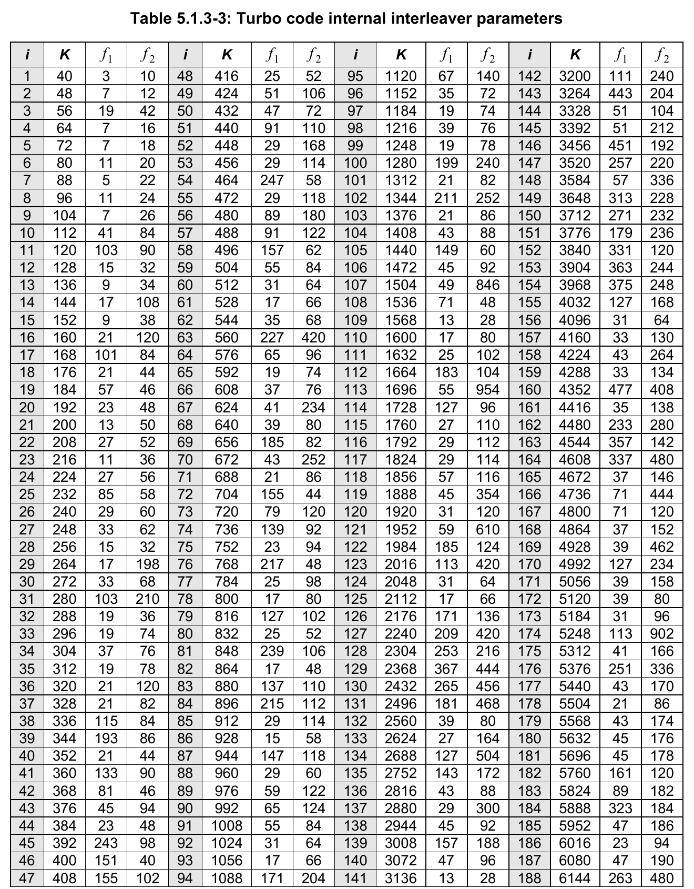
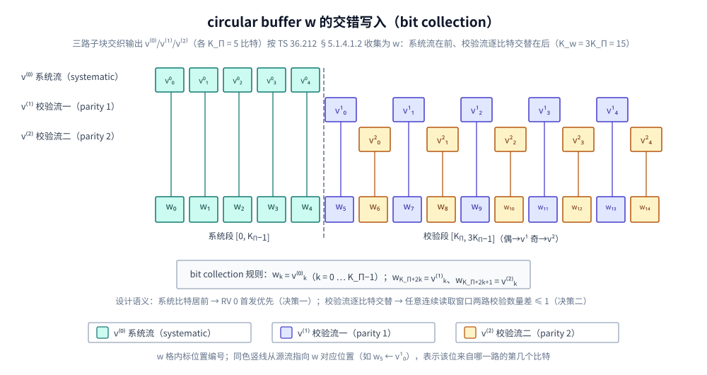
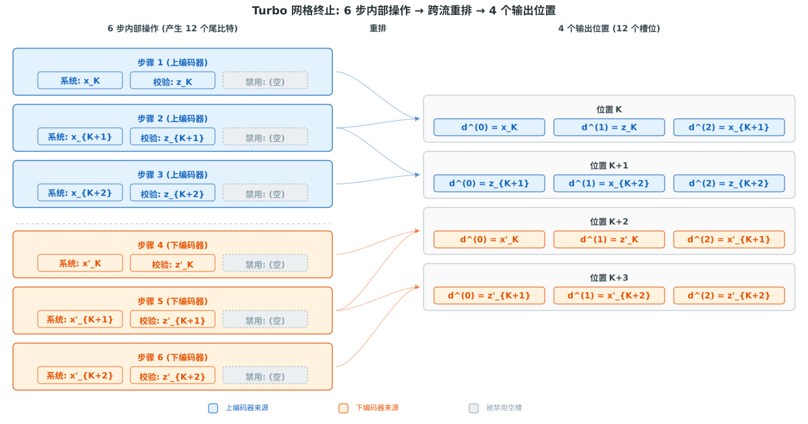

# T3.2 传输块、码块与填充位：LTE/NR 分段流程的接收侧语义
## 本节学习目标

[[T3.1_LTE_NR_CRC_families|T3.1]] 已经把循环冗余校验放回 LTE/NR 译码链路。本节继续向前走一步：协议为什么不总是把一个大传输块直接交给一个译码器，而是要把它拆成多个码块？拆开之后，填充位从哪里来，码块 CRC 又在接收端起什么作用？

这里有三个核心对象：

| 术语 | 英文 | 先这样理解 |
|:---|:---|:---|
| 传输块 | Transport Block | 物理层一次主要编码和传输的数据单位，通常来自媒体接入控制层交给物理层的一包比特。 |
| 码块 | Code Block | TB 附加 CRC 后，按协议规则分出来、分别送入信道编码器/译码器的小块。 |
| 填充位（filler bit） | filler bit | 为了让分段后的块长满足编码器允许的长度而插入的占位位；它不是原始业务数据。 |


- 解释 TB、CB 和 filler bit 的区别。
- 说明“传输块 CRC 附加（TB CRC attachment）-> 码块分段（code block segmentation）-> 码块 CRC 附加（CB CRC attachment）-> 信道编码（channel coding）”的前后关系。
- 读懂 LTE TS 36.212 和 NR TS 38.212 对分段流程的协议定位。
- 读懂 LTE TS 36.212 Table 5.1.3-3 中 $K/f_1/f_2$ 的来源、含义和用途。
- 说明 $B=6145$ 触发分段的基本过程（完整手算见 [[T3.3_LTE_Turbo_segmentation_rules|T3.3]]）。
- 说明为什么 filler bit 在 CRC 计算、编码器输入和接收端恢复里必须被特殊处理。
- 用一个教学分段例子手算 TB 拆成多个 CB 的过程。
- 用 Python 复核一个玩具分段/重组流程，并说清它不是协议真实公式。

## 前置知识检查

| 问题 | 需要达到的程度 |
|:---|:---|
| CRC 的作用是什么？ | 能说出 CRC 是错误检测，不负责纠错。 |
| GF(2) 比特串是什么？ | 能把一串 `0/1` 看成后续 CRC、编码和译码处理的对象。 |
| 对数似然比是什么？ | 能说出译码器输入通常是对数似然比软信息。 |
| 三类后续纠错码是什么？ | Turbo、低密度奇偶校验码和Polar是后续要精读的三类纠错码。 |

TB 与 CB 的关系可归结为：TB 是整包，CB 是拆开后送给编码器/译码器处理的子包。

## 协议定位：分段位于 CRC 与信道编码之间

LTE 和 NR 都把分段放在“复用与信道编码”协议里。它不是 MAC 层随意切包，也不是译码器实现者随便选的块大小，而是物理层信道编码流程的一部分。

| 系统 | 协议依据 | 本地路径 | 本节采用程度 |
|:---|:---|:---|:---|
| LTE | TS 36.212 Rel-19 `36212-j30` §5.1.2 Code block segmentation and code block CRC attachment | `3GPP_Rel19/processed/TS_36.212_36212-j30/content.md`，`sections.jsonl` | 已核对分段入口、最大码块大小 `Z = 6144`、CB CRC `L = 24`、filler bit 插入和 `<NULL>` 语义入口；本节摘取 LTE Turbo 核心尺寸读法和边界例子，完整重建见 [[T3.3_LTE_Turbo_segmentation_rules|T3.3]]。 |
| LTE | TS 36.212 Rel-19 `36212-j30` §5.1.3.2.3 Turbo code internal interleaver 与 Table 5.1.3-3 | `3GPP_Rel19/processed/TS_36.212_36212-j30/source.pdf` 第 16 页；`content.md:761-773`；`tables/table_0009.csv` | 已核对 Table 5.1.3-3 的来源、$K/f_1/f_2$ 的协议层次和内部交织器二次置换参数用途。 |
| LTE | TS 36.212 Rel-19 `36212-j30` §5.1.3、§5.1.3.2.2、§5.1.4.1.1、§5.1.4.1.2 | `source.pdf` 打印页 14-18；`content.md:695-699`、`content.md:747-759`、`content.md:791-819` | 已核对 Turbo coding 每路输出长度 $D=K+4$、trellis termination 的尾比特来源、sub-block interleaver 的 $K_\Pi$ 以及 circular buffer 长度 $K_w=3K_\Pi$。 |
| LTE | TS 36.212 Rel-19 `36212-j30` §5.2.2.1/§5.2.2.2，§5.3.2.1/§5.3.2.2 | `3GPP_Rel19/processed/TS_36.212_36212-j30/content.md`，`sections.jsonl` | 已核对上行共享信道/下行共享信道先做 TB CRC，再调用 §5.1.2 做分段和 CB CRC。 |
| NR | TS 38.212 Rel-19 `38212-j30` §5.2.1 Polar coding | `3GPP_Rel19/processed/TS_38.212_38212-j30/content.md`，`sections.jsonl` | 已定位 Polar 分段入口和最大值线索；具体公式抽取不完整，后续 [[T3.5_NR_Polar_segmentation_crc|T3.5]] 需核验公式 XML/原始 Word。 |
| NR | TS 38.212 Rel-19 `38212-j30` §5.2.2 Low density parity check coding | `3GPP_Rel19/processed/TS_38.212_38212-j30/content.md`，`sections.jsonl` | 已核对 LDPC 分段入口、按基图（base graph，用于选择 LDPC 校验矩阵结构）定义最大码块大小、CB CRC、提升大小（lifting size，用于把基图扩展成实际码长）和 filler bit 插入入口；本节不使用具体表值，完整公式和 Table 5.3.2-1/2/3 留给 [[T3.4_NR_LDPC_segmentation_rules|T3.4]] 重建。 |
| NR | TS 38.212 Rel-19 `38212-j30` §6.2.1/§6.2.3，§7.2.1/§7.2.3 | `3GPP_Rel19/processed/TS_38.212_38212-j30/content.md`，`sections.jsonl` | 已核对 UL-SCH/DL-SCH TB CRC 后，分段调用 §5.2.2。 |

协议前后链条可以概括为：

```text
MAC/上层给物理层 TB
  -> 传输块 CRC 附加（TB CRC attachment）
  -> 码块分段（code block segmentation）
  -> 码块 CRC 附加（CB CRC attachment，需要分段时）
  -> Turbo/LDPC/Polar 信道编码（channel coding）
  -> 速率匹配（rate matching，把编码后比特适配到可发送资源）
  -> 调制和发送（modulation and transmission）
```

接收端方向正好反过来：

```text
LLR 恢复和解速率匹配（rate recovery/de-rate matching）
  -> 各 CB 译码
  -> CB CRC 检查
  -> 去除 filler/CB CRC 并拼接
  -> TB CRC 检查
  -> 通过后交给上层或失败后触发重传相关流程
```

这就是本节的主线：分段不是为了让文档复杂，而是为了把“大块协议数据”变成编码器和译码器可以处理、验证和并行调度的小块。

## TB 与 CB 的工程动机

如果一个 TB 很小，把它作为一个整体编码和译码通常没有问题。问题出现在 TB 很大时。

大块带来三类工程压力：

| 压力 | 对译码器的影响 |
|:---|:---|
| 存储压力 | 软信息、内部消息、路径度量或 trellis 状态都要随块长增长。 |
| 时延压力 | 一个超长块可能让单次译码延迟不可接受。 |
| 并行压力 | 一个整块串行处理不利于多核、多 bank 或多译码引擎并行。 |

协议分段的作用就是把过大的输入拆成多个 CB。接收端可以对每个 CB 独立执行速率恢复、译码和 CB CRC 检查，再把通过的结果拼回 TB。这样做并不改变 TB 是最终交付单位这一事实；它只是把中间译码工作拆成更可实现的颗粒。

要注意两个非目标：

- CB 不是 MAC 层重新生成的数据包。它是物理层信道编码流程中的中间块。
- filler bit 不是业务数据，也不是 CRC 保护出来的新信息。它只是为了满足块长和编码结构而插入的占位。

## LTE 分段规则的协议读法

LTE TS 36.212 §5.1.2 给出通用的 code block segmentation and code block CRC attachment。当前 `content.md` 能稳定确认以下要点：

| 规则要点 | 协议线索 | 接收端含义 |
|:---|:---|:---|
| 输入长度记为 $B$ | 输入到 code block segmentation 的 bit sequence，且 $B>0$ | $B$ 已经包括前面的 TB CRC。 |
| 最大码块大小 | `Z = 6144` | 如果 $B$ 超过这个限制，需要分段。 |
| 多码块时附加 CB CRC | 当 $B$ 大于最大码块大小时分段，并给每个 CB 附加额外 `L = 24` bit CRC | 接收端每个 CB 译码后有局部 CRC 验收。 |
| filler bit 位置 | 如果计算得到 $F\ne 0$，filler bits 加到第一个 block 的开头 | 接收端恢复 TB 时要知道这些位不是原始数据。 |
| 小块特殊处理 | 如果 $B<40$，也会在 code block 开头添加 filler bits | 即使不分多个 CB，也可能有填充。 |
| filler bit 值 | encoder input 处 filler bits 设为 `<NULL>`；CRC 计算时若存在 filler bits，按 0 处理 | `<NULL>` 是协议占位语义，不应被当作普通业务 `0` 交付。 |

本节把 LTE Turbo 作为完整分段读法样例：从 §5.1.2 的分段规则读到 Table 5.1.3-3 的合法块长，再用一个边界长度手算。NR LDPC/Polar 在本节只保留入口、术语和接收侧语义，完整尺寸公式分别留给 [[T3.4_NR_LDPC_segmentation_rules|T3.4]] 和 [[T3.5_NR_Polar_segmentation_crc|T3.5]]。

### LTE filler bit 与小块特例的协议原文位置

这两个规则都不在 UL-SCH 或 DL-SCH 的专用小节里重新写一遍，而是在 LTE 通用分段小节定义，再由上下行共享信道章节回指。

| 读法问题 | 协议原文位置 | 本地证据位置 | 可确认的协议结论 |
|:---|:---|:---|:---|
| filler bit 放在哪里 | TS 36.212 Rel-19 `36212-j30` §5.1.2 Code block segmentation and code block CRC attachment | `3GPP_Rel19/processed/TS_36.212_36212-j30/content.md:607`；`document.xml` 抽取段落约 `paragraph_index=342` | 当按后续公式算出的 filler 数 $F$ 不为 0 时，filler bits 放在第一个 block 的开头。 |
| 小块 $B<40$ 怎么处理 | TS 36.212 Rel-19 `36212-j30` §5.1.2 同一段 | `content.md:609`；`document.xml` 抽取段落约 `paragraph_index=343` | 如果 $B<40$，即使不是“大 TB 分多个 CB”的典型场景，也要在 code block 开头加 filler bits。 |
| filler bit 到编码器输入时是什么值 | TS 36.212 Rel-19 `36212-j30` §5.1.2 同一段 | `content.md:611`；`document.xml` 抽取段落约 `paragraph_index=344` | filler bits 在 encoder input 处设为 `<NULL>`，因此接收端实现不能把它们当成普通业务比特。 |
| $K_+$ 与 $K_-$ 的分段位置 | TS 36.212 Rel-19 `36212-j30` §5.1.2 同一段的 “Number of bits in each code block” | `content.md:629-645`；`document.xml` 抽取段落约 `paragraph_index=353-361` | 协议先从 Table 5.1.3-3 选择上侧合法长度 $K_+$，必要时再选择低一档合法长度 $K_-$，并计算有多少个 CB 使用这两种长度。 |
| UL-SCH 如何引用通用规则 | TS 36.212 Rel-19 `36212-j30` §5.2.2.2 Code block segmentation and code block CRC attachment | `content.md:1085-1091`；`document.xml` 抽取段落约 `paragraph_index=1384-1387` | UL-SCH 先说明 $B$ 是包含 CRC 的 transport block bit 数，再声明 code block segmentation and code block CRC attachment 按 §5.1.2 执行。 |
| DL-SCH/PCH/MCH 如何引用通用规则 | TS 36.212 Rel-19 `36212-j30` §5.3.2.2 Code block segmentation and code block CRC attachment | `content.md:3241-3247`；`document.xml` 抽取段落约 `paragraph_index=9420-9423` | DL-SCH/PCH/MCH 也先说明 $B$ 是包含 CRC 的 transport block bit 数，再回指 §5.1.2。 |

读协议时要注意这个层次：§5.2.2.2 和 §5.3.2.2 告诉你“上下行共享信道的输入 $B$ 是含 TB CRC 的比特数，并调用 §5.1.2”；真正回答 filler bit 位置、小块 $B<40$ 特例和 `<NULL>` 语义的是 §5.1.2。因此调试 LTE 分段时，不能只看 UL/DL 专用章节标题，必须回到 §5.1.2 的通用分段规则。

### LTE 分段边界 40 与 6144 的来源

先把结论说清楚：$40$ 和 $6144$ 不是实现者随手选的经验值，而是 LTE Turbo 内部交织器（internal interleaver）合法输入长度表的两个端点。分段流程的任务之一，就是把每个 code block 的长度变成这张表里允许的 $K$。

| 边界 | 协议位置 | 表格证据 | 为什么这样处理 |
|:---|:---|:---|:---|
| $B>6144$ 要分段 | TS 36.212 §5.1.2 明确规定：当 $B$ 大于最大 code block size $Z$ 时执行分段，且 $Z=6144$。 | Table 5.1.3-3 的最大合法 $K$ 是 `i=188, K=6144, f1=263, f2=480`，本地表为 `tables/table_0009.csv` 最后一项。 | 单个 LTE Turbo CB 如果超过 6144，就没有对应的 Turbo interleaver 参数 $f_1/f_2$，也就不能作为一个合法的 LTE Turbo 编码块处理；协议必须把它拆成多个合法长度的 CB。 |
| $B<40$ 要特殊处理 | TS 36.212 §5.1.2 的 note 规定：如果 $B<40$，filler bits 加到 code block 开头。 | Table 5.1.3-3 的最小合法 $K$ 是 `i=1, K=40, f1=3, f2=10`，本地表为 `tables/table_0009.csv` 第一项。 | 小于 40 的块也找不到合法 interleaver 长度，因此即使不需要“大 TB 分多个 CB”，也要用 filler 把编码器看到的块长补到合法范围。 |

所以可以把 LTE Turbo 分段边界理解成一个闭区间约束：

$$
40 \le K_r \le 6144
$$

这里的 $K_r$ 是第 $r$ 个 code block 进入 Turbo 编码器时的实际长度，包含 filler 和可能存在的 CB CRC。$B$ 是分段入口处的输入长度，通常已经包含 TB CRC；$K_r$ 是分段输出后每个 CB 的长度。协议用 $B>6144$ 触发多 CB 分段，用 $B<40$ 触发小块 filler 特例，本质上都是为了让后续每个 $K_r$ 落到 Table 5.1.3-3 的合法 $K$ 集合里。

基于这两个边界的完整分段公式（$C$、$B'$、$K_+$、$K_-$、$C_-$、$C_+$、$F$）和 $B=6145$/$B=10001$ 的手算推导见 [[T3.3_LTE_Turbo_segmentation_rules]]。对接收端来说，这两个边界对应两类最该单独测试的用例：刚超过 6144 的大块要验证 CB 数、CB CRC 和拼接顺序；小于 40 的块要验证 filler 位于开头、`<NULL>` 不被交付为业务比特，并且 CRC 计算口径与发送端一致。

### Table 5.1.3-3：列含义与用法

分段计算的核心变量（$C$、$B'$、$K_+$、$K_-$、$C_-$、$C_+$、$F$）的完整推导公式见 [[T3.3_LTE_Turbo_segmentation_rules]] 的”从协议规则到尺寸计算”一节。本节不重复完整推导，只聚焦理解这张表本身——它的四列分别代表什么、为什么分段必须查它。

§5.1.2 自己是 code block segmentation 规则；它在选择 $K_+$ 和 $K_-$ 时要查的协议表，是 TS 36.212 Table 5.1.3-3。下面直接贴从本地 `source.pdf` 第 16 页裁下来的协议原图，方便直观看到合法 $K$ 不是连续整数，而是一组离散表项。



Table 5.1.3-3 原表共有 188 个合法 Turbo internal interleaver 参数项。原图中四组 `i/K/f1/f2` 列覆盖全部表项；图用于保留协议原貌，后面的关键行表用于跟随手算过程。

先解释这张表每列从哪里来、是什么意思、起什么作用。

| 列 | 协议来源 | 含义 | 在分段和译码里的作用 |
|:---|:---|:---|:---|
| $i$ | TS 36.212 Table 5.1.3-3 的表项序号 | 只是表格索引，从 1 到 188；它不是码块长度，也不是比特编号。 | 方便定位某一行参数。实现里可以保存 $K$ 到 $f_1/f_2$ 的映射，不一定需要把 $i$ 当运行时字段。 |
| $K$ | TS 36.212 §5.1.3 先把 channel coding 输入长度记为 $K$；§5.1.3.2.3 又说明 Turbo internal interleaver 的输入比特数是 $K$。 | 一个 code block 进入 Turbo 编码器和内部交织器时的输入长度。Table 5.1.3-3 只列出 LTE Turbo 支持的合法 $K$。 | §5.1.2 分段时用这一列选择 $K_+$ 和 $K_-$，保证每个 $K_r$ 都是合法 Turbo 输入长度。接收端也用 $K_r$ 配置 Turbo 译码器、LLR 切分和 CB 描述符。 |
| $f_1$ | TS 36.212 §5.1.3.2.3 的 Turbo code internal interleaver 公式参数 | 二次置换多项式的第一参数。它与 $K$ 绑定，不是可以单独调的经验系数。 | 对某个 $K_r$，发送端和接收端必须取同一行的 $f_1$，用于生成 Turbo 内部交织地址和解交织地址。 |
| $f_2$ | TS 36.212 §5.1.3.2.3 的 Turbo code internal interleaver 公式参数 | 二次置换多项式的第二参数。它同样与 $K$ 绑定。 | 与 $f_1$ 一起决定交织排列。若 $K$ 查对了但 $f_1/f_2$ 用错行，CB 长度看起来正确，Turbo 译码内部地址仍会错。 |

协议里的关系可以写成：

$$
\Pi(i)=\left(f_1 i+f_2 i^2\right)\bmod K
$$

这里 $i$ 是交织器输出位置索引，$\Pi(i)$ 是要读取的输入位置索引。直观理解：Turbo 编码器会把同一块输入比特按一个协议指定的排列重新排序后送入第二个 constituent encoder；接收端做迭代 Turbo 译码时，也要按同一套排列在两个分量译码器之间传递软信息。因此 Table 5.1.3-3 不是只服务“分段长度选择”的表，它同时也是后续 Turbo 内部交织/解交织地址生成表。

注意这里有两个不同层次的 $i$：Table 5.1.3-3 表头中的 $i$ 是表项编号，交织公式里的 $i$ 是交织器位置索引。它们在协议排版里都写成 $i$，但工程实现里不能把表项编号当成比特位置。

这也解释了为什么 $K/f_1/f_2$ 必须成行使用：$K$ 决定这个 CB 的长度，$f_1/f_2$ 决定这个长度下的交织排列。分段阶段主要用 $K$ 列选出 $K_+$、$K_-$ 和每个 $K_r$；进入 Turbo 编码/译码阶段后，必须用每个 $K_r$ 在同一张表里找到配套的 $f_1/f_2$。不能用“相邻长度的 $f_1/f_2$”，也不能自己生成一组看起来能取模的参数。

| 表项 $i$ | $K$ | $f_1$ | $f_2$ | 为什么截取这一行 |
|---:|---:|---:|---:|:---|
| 1 | 40 | 3 | 10 | 最小合法 Turbo interleaver 输入长度；解释 $B<40$ 为什么要补 filler。 |
| 188 | 6144 | 263 | 480 | 最大合法 Turbo interleaver 输入长度，也是 §5.1.2 的最大 code block size $Z$。 |

完整的 $K_+/K_-/C_-/C_+/F$ 推导公式、关键行查表（如 $K=3072$、$3136$、$4992$、$5056$）以及 $B=6145$ 和 $B=10001$ 的手算例子见 [[T3.3_LTE_Turbo_segmentation_rules]] 的"从协议规则到尺寸计算"和"手算例子"两节。本节只保留最小和最大边界行，用于说明 $40 \le K_r \le 6144$ 的来源。

### $K_+$、$K_-$、$K_r$ 与 $K_\Pi$ 的层次区别

这几个符号容易混在一起，因为它们都围绕“Turbo 编码器能接受多长的块”这个问题，但层次不同。

| 符号 | 所在层次 | 与分段的关系 | 接收端实现含义 |
|:---|:---|:---|:---|
| $K_+$ | §5.1.2 分段尺寸选择 | 从 TS 36.212 Table 5.1.3-3 的合法 $K$ 集合中选择的上侧 block size，满足所有 CB 用这个长度时容量足够覆盖 $B'$。 | 后续一部分或全部 CB 的实际 Turbo 输入长度会等于 $K_+$。 |
| $K_-$ | §5.1.2 分段尺寸选择 | 当全部使用 $K_+$ 会多出较多空间时，选择的低一档合法 block size；协议再计算多少个 CB 用 $K_-$、多少个用 $K_+$。 | 前若干个 CB 可能是短块，接收端 descriptor 不能只保存一个统一长度。 |
| $K_r$ | §5.1.2 分段输出 | 第 $r$ 个 code block 的实际长度；它只会取 $K_-$ 或 $K_+$，并包含 filler 和可能存在的 CB CRC。 | 速率恢复、Turbo 译码、CB CRC 剥离和 TB 重组都要按每个 $K_r$ 管理。 |
| $K_\Pi$ | §5.1.4.1.1 rate matching 的 sub-block interleaver 输出长度 | 它不是 §5.1.2 分段变量，也不是 Table 5.1.3-3 的 Turbo internal interleaver 长度。Turbo 编码后有三路编码流 $d^{(0)}$、$d^{(1)}$、$d^{(2)}$，每一路先按 $D=K_r+4$ 进入 sub-block interleaver，再补 `<NULL>` 到 32 列矩阵长度 $K_\Pi=R_{\mathrm{subblock}}^{\mathrm{TC}}C_{\mathrm{subblock}}^{\mathrm{TC}}$。 | 对系统流 $d^{(0)}$ 来说，$K_\Pi$ 可以理解为“系统流经过 sub-block interleaver 后的长度”，但同一个 $K_\Pi$ 也用于两路 parity 流；bit collection 后 circular buffer 长度为 $K_w=3K_\Pi$。 |

更精确地说，这几个长度变量的关系如下：

- $K_r$ 是 §5.1.2 分段后的第 $r$ 个 CB 长度，也是 Turbo 编码器和 Turbo internal interleaver 看到的输入长度。
- Turbo 编码后产生三路编码流：系统流 $d^{(0)}$、第一路 parity 流 $d^{(1)}$、第二路 parity 流 $d^{(2)}$。
- 对 Turbo 码，三路编码流在 rate matching 前的每路长度是 $D=K_r+4$；其中 $+4$ 由 §5.1.3.2.2 的 trellis termination 输出位置定义得到。
- $K_\Pi$ 是 §5.1.4.1.1 sub-block interleaver 的输出长度，不是原始系统位数量；它是每一路编码流补 `<NULL>` 后的矩阵长度。
- 系统流 $d^{(0)}$ 的 sub-block interleaver 输出长度是 $K_\Pi$，两路 parity 流也各自输出 $K_\Pi$。
- §5.1.4.1.2 做 bit collection 后，circular buffer 长度为 $K_w=3K_\Pi$。

$K_w=3K_\Pi$ 的协议来源可以按 §5.1.4.1.1 和 §5.1.4.1.2 顺序读取。§5.1.4.1.1 先把三路编码流分别做 sub-block interleaving，得到三路等长输出 $v^{(0)}$、$v^{(1)}$、$v^{(2)}$，每一路长度都是 $K_\Pi$；§5.1.4.1.2 再把这三路收集到一个 circular buffer $w$。由于 circular buffer 同时容纳 1 路系统流和 2 路 parity 流，其总长度为：

$$
K_w=K_\Pi+K_\Pi+K_\Pi=3K_\Pi
$$

#### 协议原文摘录：$K_\Pi$ 与 $K_w=3K_\Pi$ 的出处

下面按阅读顺序摘录 TS 36.212 Rel-19 V19.3.0 (2026-03) 对应两小节的原文关键词句，方便读者直接对照协议与本文解释。

**§5.1.4.1.1 Sub-block interleaver — 子块交织器输出长度 $K_\Pi$**

本节规定每路编码流 ($d^{(0)}$、$d^{(1)}$、$d^{(2)}$) 各自独立通过同一个 32 列的块交织器：

> (1) Assign $C_{\mathrm{subblock}}^{\mathrm{TC}} = 32$ to be the number of columns of the matrix.
>
> (2) Determine the number of rows of the matrix $R_{\mathrm{subblock}}^{\mathrm{TC}}$, by finding minimum integer $R_{\mathrm{subblock}}^{\mathrm{TC}}$ such that:
>
> $$
> D \le \left( R_{\mathrm{subblock}}^{\mathrm{TC}} \times C_{\mathrm{subblock}}^{\mathrm{TC}} \right)
> $$
>
> (5) The bits after sub-block interleaving are denoted by $v_0^{(i)}, v_1^{(i)}, v_2^{(i)}, \ldots, v_{K_\Pi-1}^{(i)}$, … and
>
> $$
> K_\Pi = \left( R_{\mathrm{subblock}}^{\mathrm{TC}} \times C_{\mathrm{subblock}}^{\mathrm{TC}} \right)
> $$

关键结论：三路子块交织器输出 $v^{(0)}$、$v^{(1)}$、$v^{(2)}$ 各自长度均为 $K_\Pi$，$K_\Pi$ 是行数与 32 列的乘积，确保输入长度 $D$ 补齐 `<NULL>` 后可填满一个整数矩阵。

**§5.1.4.1.2 Bit collection, selection and transmission — 比特收集与循环缓冲区长度 $K_w$**

本节将上述三路等长输出收集到一条循环缓冲区中，汇编规则和总长：

> The circular buffer of length $K_w = 3K_\Pi$ for the $r$-th coded block is generated as follows:
>
> $$
> \begin{aligned}
> w_k &= v_k^{(0)} &\text{for } k &= 0, \ldots, K_\Pi - 1 \\
> w_{K_\Pi + 2k} &= v_k^{(1)} &\text{for } k &= 0, \ldots, K_\Pi - 1 \\
> w_{K_\Pi + 2k + 1} &= v_k^{(2)} &\text{for } k &= 0, \ldots, K_\Pi - 1
> \end{aligned}
> $$

关键结论：循环缓冲区长度 $K_w = 3K_\Pi$ 直接写在协议正文中，是从"三路等长 $K_\Pi$ 汇聚到同一缓冲区"这个事实引出的，不是经验值或实现者选择的参数。

---

bit collection 的写入顺序由协议显式规定。把 circular buffer $w$ 看成一条长度为 $K_w=3K_\Pi$ 的线性数组，写入分两步，规则很机械：

**第一步** — 系统流独占前半段。$v^{(0)}$ 按原序填入 $w$ 的第 0 到第 $K_\Pi-1$ 个位置：

$$
w_k=v^{(0)}_k,\qquad k=0,1,\ldots,K_\Pi-1
$$

**第二步** — 两路 parity 流从 $K_\Pi$ 开始交错填入后半段。所谓"交错"，就是 $v^{(1)}$ 和 $v^{(2)}$ 的第 $k$ 个比特不再各自占据连续区间，而是一个隔一个地放进 $w$ 的偶/奇位置：

$$
\begin{aligned}
w_{K_\Pi+2k}   &= v^{(1)}_k,\qquad k=0,1,\ldots,K_\Pi-1 \\
w_{K_\Pi+2k+1} &= v^{(2)}_k,\qquad k=0,1,\ldots,K_\Pi-1
\end{aligned}
$$

以 $K_\Pi=5$ 为例，下图把三路流的每个比特在 $w$ 中的位置一格一格画了出来：



### 比特收集布局的深层设计逻辑

上图不仅仅是公式的图形化翻译——它揭示了 LTE Turbo 速率匹配（rate matching，把编码后比特适配到空口可发送资源量）在比特收集（bit collection）阶段的三个设计决策。把这三个决策分开来看，每一步的协议规定都不是任意的。

**决策一：系统比特置于缓冲区最前端——服务于首发传输（RV 0）。** 信息论中，系统比特（systematic bit）是编码器直接透传的原始信息位，不经任何卷积运算。对于 Turbo 码这类系统卷积码（systematic convolutional code），系统比特在译码端承担的置信度传播角色远重于校验比特（parity bit，由编码器通过移位寄存器运算生成的冗余位）：系统比特的错误直接意味着信息位的错误，而单个校验比特的错误可以被迭代译码中另一路校验比特的软信息部分弥补。

将系统比特置于 $w$ 的前 $K_\Pi$ 个位置，其设计目标不是”让所有 RV 都能覆盖全部系统比特”，而是”在首发传输中让系统比特获得最高的传输优先级”。LTE 为 Turbo 编码传输块定义了四个冗余版本（Redundancy Version，RV），每个 RV 对应循环缓冲区上一个不同的起始位置 $k_0$（由 §5.1.4.1.2 公式计算），它们的设计意图是不同的：

| RV | $k_0$ 位置 | 协议用途 | 系统比特覆盖情况 |
|:---|:---|:---|:---|
| RV 0 | 接近缓冲区起点 | 首发（initial transmission）——提供系统比特和部分校验比特，支持独立译码 | $k_0$ 位于系统比特段内或刚跳过少量 dummy 列，绝大多数系统比特被首先读出；某些列偏移可能使最初几个系统比特被跳过，但若 $E$ 足够大（典型的首发 $E$ 远大于 $K_\Pi$），剩余系统比特通过绕回也可覆盖 |
| RV 1, 2, 3 | 依次推进到校验比特区域深处 | 重传（retransmission）——提供增量冗余（Incremental Redundancy）校验比特，补充前次传输未覆盖的校验信息 | 有意降低甚至完全跳过系统比特段；接收端已在首发中保存系统比特的对数似然比（LLR），重传的任务是提供新的校验约束信息以加速迭代译码收敛 |

因此，系统比特的覆盖概率并非”与 RV 无关的常数 1”，而是**按 RV 分化的设计策略**：首发传输（RV 0）最大化系统比特覆盖；重传传输（RV ≠ 0）刻意跳过系统比特段，用新增校验比特支撑 Turbo 迭代译码。这与决策三的环形读取机制一致——$w$ 是一个环，不同的 RV 起始位置正是用来在同一环形存储结构上实现”首发偏系统、重传偏校验”的读取策略分化。

速率匹配实际读取哪些比特，由三个参数共同决定：**起始位置 $k_0$（RV 决定）、读取长度 $E$（物理资源块数量与调制阶数共同决定）和循环缓冲区总长 $K_w$**。一个比特 $w_i$ 被当前传输选中当且仅当它落在环形读取窗口 $[k_0, k_0+E-1]$（模 $K_w$）内。$E$ 越大，覆盖的比特越多；但当 $k_0$ 本身位于校验比特区域深处时，增大 $E$ 也不能改变”系统比特在被读取前必须先经过剩余校验比特区域”的事实——系统比特的覆盖窗口永远在环形前进方向上的远处，而非近处。

**决策二：两路校验比特逐位交替而非分区堆放。** 如果协议选择了”先将第一路校验比特全部放入、再接第二路校验比特”的连续分区策略，则速率匹配从 $K_\Pi$ 之后某个位置开始读取时，可能只读到同一路校验比特，另一路的校验信息完全缺失。Turbo 译码器需要两路校验比特分别对应两个分量编码器（constituent encoder，Turbo 码内部级联的两个递归系统卷积码编码器），缺失任一路等价于译码器缺少一整个维度的校验约束，译码性能从逼近香农限退化为单路卷积码水平。逐位交替将这种风险降到最低：即使速率匹配只取了后半段的一个连续子区间，只要这个区间跨越至少两个比特，两路校验比特都能等比例地被获取。用数学语言描述：对于任意起始偏移 $\delta \ge 0$ 和任意读取长度 $L$，交替策略保证：

$$
\left| \left\{ k : w_{K_\Pi+2k} \in [\delta, \delta+L) \right\} - \left\{ k : w_{K_\Pi+2k+1} \in [\delta, \delta+L) \right\} \right| \le 1
$$

即两路校验比特在任何连续读取窗口中的数量之差不超过 1。

**决策三：以整个循环缓冲区（circular buffer，首尾逻辑相连的环形缓冲区，速率匹配从某个 RV 位置开始沿环读取，到达末尾后绕回开头继续）而非分段流为单位进行速率匹配。** $w$ 的长度 $K_w = 3K_\Pi$ 已经融合了系统流和两路校验流。速率匹配从某个 RV 起始位置进入 $w$，沿环读取 $E$ 个比特（$E$ 由物理资源块数量和调制阶数决定），到达 $K_w-1$ 后自动回绕到 $w_0$。这个”回绕”正是 circular buffer 得名的原因——它不是一条用完即弃的线性数组，而是一个支持循环读取的环形结构。打孔（puncturing，跳过某些比特不传输以适配更小的物理资源）和重复（repetition，在读取完一圈后继续绕回开头读取，以填满多于母码比特的物理资源）因此成为同一个框架下的两种读取策略：$E < K_w$ 时自然产生打孔，$E > K_w$ 时自然产生重复。


### 循环缓冲区的接收端反向操作

发送端的比特收集和循环缓冲区定义了从编码器输出到空口发送比特的映射规则。接收端必须精确地执行这个映射的逆过程——解速率匹配（rate recovery，或称 de-rate matching）。

在速率恢复阶段，接收端已通过信道估计和解调获得了每个发送比特的对数似然比（Log-Likelihood Ratio，LLR）。这些 LLR 按照发送端相同的 RV 起始位置和 $E$ 个比特的读取规则，填入一条长度同为 $K_w$ 的软信息循环缓冲区。对于被打孔而未实际发送的比特位置，填入 $0$（表示”该比特无任何信道观测，译码器不应在此位置引入偏差”）。然后，按照比特收集的逆映射，从 $w$ 中分离出三路软信息流：

- $w_0, \ldots, w_{K_\Pi-1}$ 中的 LLR 反填给系统流 $v^{(0)}$ 对应位置；
- $w_{K_\Pi}, w_{K_\Pi+2}, w_{K_\Pi+4}, \ldots$（偶数偏移位置）中的 LLR 反填给第一路校验流 $v^{(1)}$；
- $w_{K_\Pi+1}, w_{K_\Pi+3}, w_{K_\Pi+5}, \ldots$（奇数偏移位置）中的 LLR 反填给第二路校验流 $v^{(2)}$。

三路软信息再经过子块解交织（sub-block de-interleaving，子块交织的逆过程），恢复为 Turbo 译码器可以直接使用的三路软输入——系统 LLR、第一路校验 LLR、第二路校验 LLR。整个逆过程的正确性完全依赖于对发送端正向映射的逐位精确复刻。

> **注意区分"槽位数量"与"存储总量"。** 上文中"长度同为 $K_w$ 的软信息循环缓冲区"指的是槽位（slot）数量——接收端软 buffer 有 $K_w$ 个位置，每个位置存放一个 LLR 值（通常 8–16 bit 定点），而发送端 hard-bit buffer 同一位置只放 1 bit。槽位数量相同（都是 $K_w$），是因为接收端必须用同样的环形地址空间把每个收到的 LLR 反填到正确的编码流位置。存储总量上，软 buffer 是 hard-bit buffer 的 8–16 倍。
>
> 协议的精确表述中还有参数 $N_{cb}$（soft buffer size for the $r$-th code block，§5.1.4.1.2）。对于 UL-SCH，$N_{cb}=K_w$；对于 DL-SCH/PCH，$N_{cb}=\min\left(\left\lfloor\frac{N_{IR}}{C}\right\rfloor,\; K_w\right)$，即接收端 HARQ 软内存可能因 UE 能力限缩而截断到小于 $K_w$。T3.2 在教学阶段以 $K_w$ 为软 buffer 长度是合理的近似；$N_{cb}$ 与 $N_{IR}$ 的完整关系留给后续 rate matching 深入章节。

### Turbo 母码输出长度 $D = K_r + 4$ 的完整协议溯源

$D = K_r + 4$ 不是凭经验凑出来的数值关系，它在 TS 36.212 中有两条独立的协议规定相互印证，分别来自通用编码入口和 Turbo 编码器结构规范。

**第一层规定**来自 §5.1.3 的通用信道编码入口。该节在定义所有编码方案时声明：对于 Turbo 编码，三个输出流 $d^{(0)}$、$d^{(1)}$、$d^{(2)}$ 的长度均定义为 $D = K + 4$，其中 $K$ 是进入信道编码步骤的码块（code block）输入比特数。将 §5.1.2 分段过程分配给第 $r$ 个码块的实际长度 $K_r$ 代入 $K$，立即得到 $D = K_r + 4$。

**第二层规定**来自 §5.1.3.2.2 的 Turbo 编码器结构描述，它解释了 $+4$ 的物理来源——网格终止（trellis termination，卷积码编码完成后，将移位寄存器强制归零以产生确定终止状态并输出对应尾部比特的过程）。

LTE Turbo 编码器由两个 8 状态分量编码器并行级联而成。每个分量编码器内部包含 3 个移位寄存器，编码过程从一个全零的初始状态开始。$K_r$ 个信息比特依次进入编码器后，移位寄存器内残留的状态值取决于输入序列的具体内容——如果不做任何处理，编码器的终态是随机的，接收端译码器无法确定最后一组比特的起始/终止网格状态，导致尾部比特的译码可靠性严重下降。

#### 终止状态的译码必要性

把卷积编码器想象成一个在 8 个房间之间走来走去的人。他每走一步（处理一个输入比特），从一个房间进入另一个房间，同时在走廊上留下一组输出比特。前一步去了哪个房间、这一步输入是 0 还是 1，共同决定下一步进入哪个房间。译码器的工作是根据走廊上留下的输出比特，反推这个人每一步走了什么路线。

译码器反推路线时依赖两类证据：**从起点一路看过来的证据**（前向——"从已知起点 0 号房间出发，前 t 步最可能走到哪些房间"）和**从终点一路倒回来看的证据**（后向——"如果最后停在第 S 号房间，倒推回去第 t 步最可能在哪"）。两步合在一起，才能确定第 t 步的输入是 0 还是 1。

问题出在最后几步。这个人走了 $K_r$ 步之后停下了——但走廊上没有第 $K_r+1$、$K_r+2$、$K_r+3$ 步的"脚印"（没有编码输出）。译码器不知道他最后停在了 8 个房间中的哪一个，后向证据链在尾部断裂。只能假设"8 个房间都有可能"，于是最后几个比特的判决相当于丢了一半证据——这就是尾部效应。

这不仅仅是"最后几个比特判不准"的问题。Turbo 译码是迭代的——两个分量译码器互相交换"我认为这些比特最可能是什么"的外部信息。如果尾部几个比特的后向证据弱，它们在第一轮迭代中输出的外部信息就很差；第二个分量译码器收到这些差的外部信息后，自己对这些比特的判断也变差；反过来又把更差的信息还给第一个译码器。**尾部污染会通过迭代逐轮扩散到前面的比特**，拉低整个码块的译码性能。

网格终止的做法很简单：不让这个人在第 $K_r$ 步随意停下，而是强制他继续走 3 步，每一步输入的不是数据而是移位寄存器反馈值，最终保证他停在 0 号房间。译码器因此确切知道终点是 0 号房间，后向证据链恢复完整——最后几步的两类证据都齐全了，迭代中的外部信息质量从尾部到头部全线提升。

上文中"从起点看"和"从终点倒推"分别对应 BCJR 算法的前向递推（$\alpha$）和后向递推（$\beta$）。这里只给出了直觉类比；$\alpha$/$\beta$ 的严格递推公式、分支度量 $\gamma$ 的定义、以及 BCJR 的完整数学推导见 [[T6.5_BCJR_MAP_decoding_intuition]]，Log-MAP 与 Max-Log-MAP 的数值实现见 [[T6.6_Log_MAP_Max_Log_MAP_Turbo]]。

#### 网格终止 vs 咬尾卷积

LTE Turbo 用的是网格终止，不是咬尾卷积（tail-biting convolution）。咬尾将初始状态设置成消息尾部的几个比特，使初始状态与终止状态自动相等，无需额外尾比特——LTE 的控制信道卷积码和 NR Polar 的前置变换即用此法，但编码器和译码器设计的复杂度代价不同。Turbo 选择主动注入尾比特归零，换取译码器端终止状态的确知性，从而在整个码块上维持迭代译码的外部信息质量。尾部比特的置信度若因尾部效应恶化，会通过迭代中的外部信息交换向前面扩散——修复尾部的意义不只是保护最后几个比特，而是保护整个码块的译码性能。

协议规定的终止流程分两步执行，每一步产生 3 个尾比特（tail bit），但向分量编码器注入尾比特时，另一个分量编码器被禁用（输出不参与后续处理）：

1. 第一个分量编码器执行网格终止：$K_r$ 个信息比特编码完毕后，上开关切换到下方位置，将第一个分量编码器移位寄存器的反馈值接入系统路径。继续向该编码器输入 3 个尾比特，同时第二个分量编码器被禁用。
2. 第二个分量编码器执行网格终止：下开关切换到下方位置，将第二个分量编码器移位寄存器的反馈值接入系统路径。向该编码器输入 3 个尾比特，同时第一个分量编码器被禁用。

整个过程共消耗 6 个尾比特的输入动作——3 个归零第一个分量编码器，3 个归零第二个。这 6 步内部操作产生的原始比特为：

$$
\begin{aligned}
\text{上编码器尾比特（系统路径）}&: x_K,\; x_{K+1},\; x_{K+2} \\
\text{上编码器尾比特（校验输出）}&: z_K,\; z_{K+1},\; z_{K+2} \\
\text{下编码器尾比特（系统路径）}&: x'_K,\; x'_{K+1},\; x'_{K+2} \\
\text{下编码器尾比特（校验输出）}&: z'_K,\; z'_{K+1},\; z'_{K+2}
\end{aligned}
$$

合计 12 个尾比特（6 个系统路径 + 6 个校验路径）。但 §5.1.3.2.2 随后规定，这 12 个尾比特并不按"第 1 步 → 位置 K，第 2 步 → 位置 K+1，……"的简单一一对应方式输出，而是经过一次精心的**跨流重排（cross-stream shuffling）**，压缩到恰好 4 个输出位置中。每个位置仍然输出三路流 $d^{(0)}$、$d^{(1)}$、$d^{(2)}$，但每路流的取值不再只来自"自己的"分量编码器——来自另一个（已被禁用）分量编码器在该时刻无有效输出，其槽位被重排后的尾比特填充。

协议原文（TS 36.212 V19.3.0 §5.1.3.2.2）如下：

> The transmitted bits for trellis termination shall then be:
>
> $$
> \begin{aligned}
> d_K^{(0)} = x_K, &\quad d_{K+1}^{(0)} = z_{K+1}, &\quad d_{K+2}^{(0)} = x'_K, &\quad d_{K+3}^{(0)} = z'_{K+1} \\
> d_K^{(1)} = z_K, &\quad d_{K+1}^{(1)} = x_{K+2}, &\quad d_{K+2}^{(1)} = z'_K, &\quad d_{K+3}^{(1)} = x'_{K+2} \\
> d_K^{(2)} = x_{K+1}, &\quad d_{K+1}^{(2)} = z_{K+2}, &\quad d_{K+2}^{(2)} = x'_{K+1}, &\quad d_{K+3}^{(2)} = z'_{K+2}
> \end{aligned}
> $$

这一段就是跨流重排的完整协议定义。把它按"哪个编码器的哪一步"重新标注后，映射关系为：

$$
\begin{aligned}
\text{位置 } K&: &
d^{(0)}_K &= x_K,      & d^{(1)}_K &= z_K,      & d^{(2)}_K &= x_{K+1} \\[4pt]
\text{位置 } K+1&: &
d^{(0)}_{K+1} &= z_{K+1}, & d^{(1)}_{K+1} &= x_{K+2}, & d^{(2)}_{K+1} &= z_{K+2} \\[4pt]
\text{位置 } K+2&: &
d^{(0)}_{K+2} &= x'_K,    & d^{(1)}_{K+2} &= z'_K,    & d^{(2)}_{K+2} &= x'_{K+1} \\[4pt]
\text{位置 } K+3&: &
d^{(0)}_{K+3} &= z'_{K+1}, & d^{(1)}_{K+3} &= x'_{K+2}, & d^{(2)}_{K+3} &= z'_{K+2}
\end{aligned}
$$

把上面这张映射表画成图，6 步内部操作如何产生 12 个原始尾比特、再经过跨流重排填入 4 个输出位置，就一目了然了：



这张映射表才是理解"为什么是 4 而不是 6"的关键。观察每行：

- **位置 $K$**：$d^{(0)}$ 和 $d^{(1)}$ 取自上编码器第 1 个尾比特的系统值和校验值；$d^{(2)}$ 本该来自下编码器（此时被禁用），协议用上编码器第 2 个尾比特的系统值 $x_{K+1}$ 填充了这个空槽。
- **位置 $K+1$**：$d^{(0)}$ 用上编码器第 2 个尾比特的校验值 $z_{K+1}$，$d^{(1)}$ 用上编码器第 3 个尾比特的系统值 $x_{K+2}$，$d^{(2)}$ 用上编码器第 3 个尾比特的校验值 $z_{K+2}$。至此，上编码器 3 步内部操作产生的全部 6 个比特（$x_K, x_{K+1}, x_{K+2}, z_K, z_{K+1}, z_{K+2}$），恰好被填满位置 $K$ 和 $K+1$ 的 $3 \times 2 = 6$ 个槽位。
- **位置 $K+2$ 和 $K+3$**：对称地，下编码器 3 步内部操作产生的 6 个比特（$x'_K, x'_{K+1}, x'_{K+2}, z'_K, z'_{K+1}, z'_{K+2}$）被填入这两个位置。其中位置 $K+2$ 取 $x'_K, z'_K, x'_{K+1}$，位置 $K+3$ 取 $z'_{K+1}, x'_{K+2}, z'_{K+2}$。

这个重排方案不是随意的——它背后有三个理论约束共同决定了表的结构：

**约束 A：槽位数量守恒。** 6 步内部操作恰好产生 12 个尾比特（每个活跃编码器在每一步同时输出一个系统比特和一个校验比特，6 步 × 2 比特/步 = 12）。如果输出端也有 12 个槽位（4 个位置 × 3 路流），则槽位刚好填满，不打孔不重复。唯一的问题是：哪些比特填入哪些槽位。

**约束 B：每路输出流必须包含系统比特。** 译码器需要从系统流 $d^{(0)}$ 获取尾比特的系统值来判断终止后首个信息比特的网格状态，也需要从校验流 $d^{(1)}$ 和 $d^{(2)}$ 获取尾比特的校验值来进行终止阶段的置信度传播。如果某一路输出流在终止阶段完全不包含系统比特，则该流对译码器的尾部状态估计贡献为零。因此重排方案必须保证 $d^{(0)}$、$d^{(1)}$、$d^{(2)}$ 在 4 个尾比特位置上都至少各有一个系统比特位置。

检查协议方案：$d^{(0)}$ 在位置 $K$（$x_K$）和 $K+2$（$x'_K$）收到系统比特，$d^{(1)}$ 在位置 $K+1$（$x_{K+2}$）和 $K+3$（$x'_{K+2}$）收到系统比特，$d^{(2)}$ 在位置 $K$（$x_{K+1}$）和 $K+2$（$x'_{K+1}$）收到系统比特。每路流恰好 2 个系统位置，满足约束。

**约束 C：两个分量编码器的终止比特在时间上不应分离太远。** 上编码器的 6 个尾比特集中在位置 $K$ 和 $K+1$ 中输出，下编码器的 6 个尾比特集中在位置 $K+2$ 和 $K+3$ 中输出。这不是巧合——它确保接收端在做滑窗译码时，每个分量编码器的终止信息在时间上局部化，不会散布到整个尾部窗口。

综合三个约束，协议的映射规则可以写成矩阵形式。把 12 个原始尾比特排成列向量：

$$
\mathbf{t} = \begin{bmatrix}
x_K & x_{K+1} & x_{K+2} & z_K & z_{K+1} & z_{K+2} & x'_K & x'_{K+1} & x'_{K+2} & z'_K & z'_{K+1} & z'_{K+2}
\end{bmatrix}^\top
$$

12 个输出槽位排成另一个列向量（按位置优先：$K$ 的 $d^{(0)} d^{(1)} d^{(2)}$，$K+1$ 的 $d^{(0)} d^{(1)} d^{(2)}$，……）：

$$
\mathbf{o} = \begin{bmatrix}
d^{(0)}_K & d^{(1)}_K & d^{(2)}_K & d^{(0)}_{K+1} & d^{(1)}_{K+1} & d^{(2)}_{K+1} & d^{(0)}_{K+2} & d^{(1)}_{K+2} & d^{(2)}_{K+2} & d^{(0)}_{K+3} & d^{(1)}_{K+3} & d^{(2)}_{K+3}
\end{bmatrix}^\top
$$

则协议规定的重排等价于一个 $12 \times 12$ 的置换矩阵 $\mathbf{P}$：$\mathbf{o} = \mathbf{P} \,\mathbf{t}$。$\mathbf{P}$ 的每一行有一个 1，其余为 0；每一列也有一个 1，其余为 0。矩阵的非零元位置完全由上面的映射表决定。这种置换结构保证了重排过程是信息无损的——没有比特被复制，没有比特被丢弃，只是位置被重新排列。

因此，最终每个输出流恰好看到 4 个尾比特位置——不是 6。6 步内部操作 → 12 个尾比特 → 经置换矩阵 $\mathbf{P}$ 重排压缩为 4 个输出位置 × 3 路流 = 12 个槽位，槽位数量守恒，压缩是通过**跨流复用**实现的：在一个分量编码器被禁用时，其输出槽位不被丢弃，而是被来自另一个分量编码器后续尾比特的系统值或校验值占据。将通用定义中的 $K$ 替换为 $K_r$，得到本节的最终形式：

$$
D = K_r + 4
$$

**常见工程错误辨析**。明确 $D$ 不是什么，对于防止实现级错误至关重要：

| 错误理解 | 实际来源 | 错误后果 |
|:---|:---|:---|
| $D = K_r$（不加 4） | 忽略了网格终止 | 尾部 4 个比特缺失，译码器对最后几个信息比特的置信度计算失去终止状态约束，尾部译码性能显著恶化 |
| $D = K_r + 6$（加 6 而非加 4） | 将 6 个尾比特的输入动作数量误认为每路输出增量 | 每路多出 2 个位置，子块交织和比特收集的比特地址全部错位，接收端 LLR 反填地址与发送端不对齐 |
| $D = K_r + 24$ | 将 CB CRC 长度 $L=24$ 误认为是编码输出增量 | 在比特收集阶段与其他长度参量矛盾，无法解释协议中 $K_w = 3K_\Pi$ 的比特收集总长度为何不等于 $3(K_r + 24 + \text{NULL})$ |

### 从分段参数到循环缓冲区的完整长度转换链

将上述所有参量按协议处理的时间顺序串联，得到一条从 TB CRC 附加到循环缓冲区的完整长度转换链。这条链中的每一步都不可跳过，后面步骤的输入严格依赖前面步骤的输出：

$$
\boxed{B} \xrightarrow{\text{§5.1.2}} 
\boxed{\begin{aligned}C &= \lceil B/(Z-L)\rceil \\ B' &= B + CL\end{aligned}} 
\xrightarrow{\text{查 Table 5.1.3-3}} 
\boxed{\begin{aligned}&K_+, K_- \\ &C_+, C_- \\ &F\end{aligned}} 
\xrightarrow{\text{§5.1.2 循环}} 
\boxed{K_0, K_1, \ldots, K_{C-1}}
$$

$$
\boxed{K_r} \xrightarrow{\text{§5.1.3}} 
\boxed{D = K_r + 4} 
\xrightarrow{\text{§5.1.3.2.3}} 
\boxed{\Pi(k) = \left(f_1 k + f_2 k^2\right) \bmod K_r} 
\xrightarrow{\text{§5.1.4.1.1}} 
\boxed{K_\Pi = R_{\text{subblock}}^{\text{TC}} \times C_{\text{subblock}}^{\text{TC}}}
$$

$$
\boxed{v^{(0)}, v^{(1)}, v^{(2)}\ \text{(各长}\ K_\Pi\text{)}} 
\xrightarrow{\text{§5.1.4.1.2}} 
\boxed{K_w = 3K_\Pi} 
\xrightarrow{\text{RV 选择}} 
\boxed{E\ \text{个发送比特}}
$$

每个方框的含义及其之间的依赖关系：

| 方框 | 参数 | 协议来源 | 对下一步的影响 |
|:---|:---|:---|:---|
| 分段 | $C$, $B'$, $K_+$, $K_-$, $C_+$, $C_-$, $F$ | §5.1.2 | 决定有几个码块、每个码块多长、filler 放多少 |
| 码块长度 | $K_r = K_-$ 或 $K_+$ | §5.1.2 + Table 5.1.3-3 | 决定 Turbo 编码器输入长度和内部交织器参数 $f_1/f_2$ |
| 编码输出 | $D = K_r + 4$ | §5.1.3 + §5.1.3.2.2 | 决定子块交织器的输入长度 |
| 内部交织 | $f_1, f_2$ | Table 5.1.3-3（与 $K_r$ 同行的参数） | 必须与 $K_r$ 严格配套，不可混用不同行的参数 |
| 子块交织输出 | $K_\Pi$ | §5.1.4.1.1 | 决定循环缓冲区中系统段和校验段的槽位数量 |
| 循环缓冲区总长 | $K_w = 3K_\Pi$ | §5.1.4.1.2 | 决定速率匹配的环形地址空间大小 |
| 发送比特数 | $E$ | §5.1.4.1.2 + 物理层调度 | 决定打孔或重复的数量 |

填充位 $F$ 在这条链中的角色是：它仅在分段阶段被插入第一个码块的开头，在 CRC 计算时按 $0$ 参与，在编码器输入处标记为 `<NULL>`。$F$ 不计入 $B$、不计入 $B'$、也不改变 $D$ 或 $K_\Pi$ 的公式形式。它在接收端重组阶段被从第一个码块的译码输出中删除，不交付给上层。

### 本节边界与 [[T3.3_LTE_Turbo_segmentation_rules|T3.3]] 的分工

[[T3.3_LTE_Turbo_segmentation_rules|T3.3]] 将对 LTE Turbo 分段过程的所有分支做逐位重建——包括 Table 5.1.3-3 全部 188 个合法 $K$ 的程序化读取、分段算法伪代码、手算例子和接收端并行译码流程。本节之所以不在此处展开完整的比特级填入循环，是因为本节的主线是”接收端在译码之前需要从协议中读取哪些关键长度参数”，而非”发送端如何逐位填入每一段”。两节的关系是层次递进：T3.2 建框架（概念和边界），[[T3.3_LTE_Turbo_segmentation_rules|T3.3]] 填细节（公式和表格）。

## NR 分段规则的协议读法

NR TS 38.212 把 Polar 和 LDPC 的分段入口分开。

### NR LDPC 数据链路

NR LDPC 分段主要在 TS 38.212 §5.2.2。当前 `content.md` 能稳定确认以下要点：

这里先给两个后续会反复出现的术语。**基图（base graph）** 是 NR LDPC 协议中描述校验矩阵骨架的结构选择；它决定后续实际 LDPC 矩阵从哪套骨架扩展出来。**提升大小（lifting size）** 是把基本节图表中的一个小格子扩展成循环置换矩阵的尺度参数，直观上会影响实际码块长度和硬件并行颗粒。完整基图选择、提升集合和表格值会在 [[T3.4_NR_LDPC_segmentation_rules|T3.4]] 精读，本节只说明它们为什么已经出现在分段边界里。

| 规则要点 | 协议线索 | 接收端含义 |
|:---|:---|:---|
| 输入长度 | 输入到 code block segmentation 的 bit sequence | 对 UL-SCH/DL-SCH，§6.2.3/§7.2.3 说明该输入是包含 TB CRC 的传输块比特。 |
| 超过最大码块大小时分段 | 如果输入大于最大 code block size，则执行 segmentation 并给每个 CB 附加 CRC | 大 TB 会变成多个 LDPC CB。 |
| 最大码块大小依赖基图 | §5.2.2 分别给出 LDPC base graph 1 和 base graph 2 的最大码块大小入口 | 后续 [[T3.4_NR_LDPC_segmentation_rules|T3.4]] 必须结合基图选择和提升大小精读。 |
| 提升大小参与块长构造 | §5.2.2 提到从 Table 5.3.2-1 的 lifting size 集合中寻找满足条件的最小值 | 接收端需要用同一套提升大小反推出码块结构和解速率匹配位置；具体 lifting size 集合本节不复现。 |
| filler bit 插入 | §5.2.2 出现 Insertion of filler bits 流程 | filler 会影响编码输入、速率匹配和接收端还原。 |

NR UL-SCH 的 §6.2.1 明确说每个 UL-SCH TB 通过 CRC 提供错误检测，整个 TB 用于计算 CRC parity bits；§6.2.3 再说明 code block segmentation and code block CRC attachment 按 §5.2.2 执行。DL-SCH 在 §7.2.1/§7.2.3 有对应流程。这里的 UL-SCH/DL-SCH 分别表示上行和下行承载用户数据的共享信道。

### NR Polar 控制链路

NR Polar 分段入口是 TS 38.212 §5.2.1。当前 `content.md` 能定位到 code block segmentation、CRC parity bits、以及相关最大值线索，但公式抽取缺失较多。[[T3.5_NR_Polar_segmentation_crc|T3.5]] 会把 Polar 控制信息、上行控制信息/下行控制信息背景和 CRC 辅助译码单独展开。本节只建立一个边界：Polar 也有分段和 CRC 相关流程，但它服务的控制信息场景、块长范围和译码方式不同于 LDPC 数据链路。

## Filler Bit 的特殊语义

filler bit 最容易被误解成“补几个 0”。这个说法不够准确。协议里的 filler bit 更像一个占位标记：它为了让块长满足编码结构而出现，但它不是原始 TB 数据。

LTE §5.1.2 里有两个关键线索：

- filler bits 加在第一个 block 的开头。
- filler bits 在 encoder input 处设为 `<NULL>`；做 CRC 计算时，如果存在 filler bits，按 0 参与计算。

这带来三个接收端要求：

| 要求 | 原因 | 出错后果 |
|:---|:---|:---|
| 记录 filler 数量 $F$ | 接收端重组时必须知道哪些开头位不是 TB 数据 | 把 filler 当数据交付会造成 TB CRC 失败或上层数据错位。 |
| 区分 `<NULL>` 和普通 `0` | `<NULL>` 是协议占位语义，普通 `0` 是真实比特值 | 软件模型和硬件实现若混淆，边界用例会失败。 |
| CRC 计算口径一致 | 协议规定特定步骤中 filler 以 0 参与 CRC 计算 | 发送端/接收端参考模型不一致会导致 CB CRC 系统性失败。 |

从 LLR 角度看，filler bit 通常不应该像普通接收比特一样由信道观测决定可靠度。工程实现可能把 filler 位置设置成固定已知值、极大可靠度或在解速率匹配中跳过，具体做法要跟对应编码家族和实现接口一致。这里不能把某个实现策略写成 3GPP 的唯一要求。

## 教学分段例子

下面用一个小型教学例子说明“TB -> CB -> filler -> CB CRC -> 重组”的关系。它不是 LTE/NR 真实参数。

设：

$$
B=22
\tag{1}
$$

表示 TB CRC 后共有 22 个比特。教学最大码块输入长度设为：

$$
Z_{\mathrm{toy}}=10
\tag{2}
$$

如果每个 CB 还要附加一个教学 CRC-2，则每个 CB 最多承载：

$$
K_{\mathrm{payload}}=Z_{\mathrm{toy}}-2=8
\tag{3}
$$

需要的 CB 数量为：

$$
C=\left\lceil\frac{22}{8}\right\rceil=3
\tag{4}
$$

3 个 CB 一共可放：

$$
C K_{\mathrm{payload}}=3\times 8=24
\tag{5}
$$

所以需要 filler：

$$
F=24-22=2
\tag{6}
$$

按 LTE 类似的直觉，把 2 个 filler 放在第一个块开头。若原始 22 bit 教学序列为：

```text
1011001110001111000011
```

加上两个 filler，占位写成 `N`：

```text
NN1011001110001111000011
```

再按 8 个 payload 位一组分成 3 个 CB：

| CB 编号 | 分段 payload | 说明 |
|:---:|:---|:---|
| 0 | `NN101100` | 前两个是 filler，不是 TB 数据。 |
| 1 | `11100011` | 全部是真实 TB 比特。 |
| 2 | `11000011` | 全部是真实 TB 比特。 |

如果每个 CB 后面附加 2 bit 教学 CRC，编码器输入看到的是每个 CB payload 加局部 CRC。接收端恢复时要先检查 CB CRC，再删除 filler，最后拼回 22 bit TB 候选并做 TB CRC。

## 接收端流程


这个流程说明：CB CRC 和 TB CRC 的职责不同。CB CRC 帮助局部验收，TB CRC 负责最终验收。filler 位处理夹在中间，如果去除时机或位置错了，即使每个 CB 的硬判决看起来合理，最终 TB CRC 也会失败。

## 伪代码

下面是教学分段伪代码，不是 LTE/NR 真实分段公式。

```text
input:
  tb_bits_after_tb_crc
  toy_max_cb_len
  toy_cb_crc_len

payload_per_cb = toy_max_cb_len - toy_cb_crc_len
C = ceil(len(tb_bits_after_tb_crc) / payload_per_cb)
F = C * payload_per_cb - len(tb_bits_after_tb_crc)

seg_input = F copies of NULL + tb_bits_after_tb_crc
for r in 0..C-1:
    payload = seg_input[r * payload_per_cb : (r + 1) * payload_per_cb]
    cb_crc = toy_crc(payload, treating NULL as 0)
    cb[r] = payload + cb_crc

receiver:
  decode each cb
  check cb_crc
  remove cb_crc
  remove first F NULL positions
  concatenate remaining bits
  check tb_crc
```

真正写 LTE/NR 参考模型时，`payload_per_cb`、$C$、$F$、合法块长、base graph、lifting size 和 CRC 长度都必须来自 TS 36.212/38.212 的对应公式和表格，不能使用这个玩具逻辑。LTE 的这些尺寸细节见 [[T3.3_LTE_Turbo_segmentation_rules|T3.3]]；NR LDPC 的基图、lifting size 集合和分段公式后续由 [[T3.4_NR_LDPC_segmentation_rules|T3.4]] 重建。

## Python 校验片段

下面的代码只验证本节教学例子。它刻意用 `None` 表示 filler，避免把 filler 和普通 `0` 混在一起。

```python
from math import ceil


def toy_crc2(bits: list[int | None]) -> list[int]:
    # Time: O(N), Space: O(1)
    acc0 = 0
    acc1 = 0
    for i, bit in enumerate(bits):
        value = 0 if bit is None else bit
        if i % 2 == 0:
            acc0 ^= value
        else:
            acc1 ^= value
    return [acc0, acc1]


def segment_toy(tb_bits: str, max_cb_len: int, cb_crc_len: int) -> tuple[int, list[list[int | None]]]:
    # Time: O(N), Space: O(N)
    payload_per_cb = max_cb_len - cb_crc_len
    c = ceil(len(tb_bits) / payload_per_cb)
    filler_count = c * payload_per_cb - len(tb_bits)
    work: list[int | None] = [None] * filler_count + [int(b) for b in tb_bits]
    blocks = []
    for r in range(c):
        start = r * payload_per_cb
        payload = work[start : start + payload_per_cb]
        blocks.append(payload + toy_crc2(payload))
    return filler_count, blocks


def reassemble_toy(blocks: list[list[int | None]], filler_count: int, cb_crc_len: int) -> str:
    # Time: O(N), Space: O(N)
    payload = []
    for block in blocks:
        data = block[:-cb_crc_len]
        expected = toy_crc2(data)
        got = [int(x) for x in block[-cb_crc_len:]]
        if expected != got:
            raise ValueError("CB CRC failed")
        payload.extend(data)
    payload = payload[filler_count:]
    return "".join(str(int(b)) for b in payload)


tb = "1011001110001111000011"
filler, blocks = segment_toy(tb, max_cb_len=10, cb_crc_len=2)
rebuilt = reassemble_toy(blocks, filler, cb_crc_len=2)

print(filler)
print(["".join("N" if b is None else str(b) for b in block) for block in blocks])
print(rebuilt == tb)
```

期望输出：

```text
2
['NN10110001', '1110001110', '1100001100']
True
```

## 代表性工程用例

| 用例 | 输入 | 输出 | 失败案例 | 验证方式 |
|:---|:---|:---|:---|:---|
| LTE Turbo 大 TB 分段 | TB CRC 后比特流、TS 36.212 §5.1.2 分段参数 | 多个 CB、每个 CB 的 CRC 和 filler 位置 | 把 filler `<NULL>` 当普通数据 `0` 交付 | 协议向量、CB CRC、TB CRC、filler 边界黄金参考测试（golden test）；本节核心读法可用于理解分段尺寸，完整边界和脚本以 [[T3.3_LTE_Turbo_segmentation_rules|T3.3]] 为准。 |
| NR LDPC DL-SCH 分段 | TB CRC 后比特流、基图、提升大小、TS 38.212 §5.2.2 参数 | LDPC CB 集合和 filler 位置 | 基图或提升大小错，导致解速率匹配和 CB 长度错位 | [[T3.4_NR_LDPC_segmentation_rules|T3.4]] 重建 Table 5.3.2-1/2/3 和公式后，再与参考模型逐位一致（bit-exact）对比。 |

## 定点和硬件映射预览

本节仍是协议基础课，不设计完整寄存器传输级或专用集成电路实现。但分段信息会直接影响硬件接口。

| 层次 | 需要保存的信息 | 风险 |
|:---|:---|:---|
| 浮点/协议模型 | $C$、每个 $K_r$、$F$、CB CRC 长度、TB CRC 长度 | 模型和协议表格不一致。 |
| 定点模型 | 每个 CB 的 LLR 起止位置、filler mask、CRC 输出 | filler 位置被当成普通软信息。 |
| RTL/ASIC | CB 描述符、软缓存地址、译码器启动参数、重组顺序 | 多 CB 并行完成顺序与 TB 拼接顺序混淆。 |
| 验证 | 最小/最大 TB、刚好不分段、刚好分段、$F=0$、$F>0$ | 只测普通长度，遗漏边界。 |

在硬件里，常见做法是为每个 CB 生成一个描述符，记录 CB 编号、LLR 起始地址、长度、filler 数量、CRC 类型和输出地址。描述符是实现策略，不是协议字段；但它必须忠实表达协议分段结果。

## 常见错误

| 错误 | 为什么错 | 正确做法 |
|:---|:---|:---|
| 把 TB 和 CB 混为一谈 | TB 是最终交付单位，CB 是编码/译码中间块。 | 明确 TB CRC 与 CB CRC 的不同验收层次。 |
| 把 filler 当业务 `0` | filler 是占位，不是原始数据。 | 用 mask 或 `None/<NULL>` 语义单独表示。 |
| 只检查 CB CRC，不检查 TB CRC | CB 局部通过不代表拼接后的 TB 一定正确。 | CB CRC 后仍需 TB CRC。 |
| 把教学分段公式当 LTE/NR 公式 | 玩具例子忽略合法块长、表格、基图、提升大小。 | 协议实现必须回到 TS 36.212/38.212 公式和表格。 |
| 忽略 $F=0$ 和 $F>0$ 边界 | filler 边界最容易暴露地址和拼接错误。 | 单独构造边界测试。 |

## 自测题

1. TB 和 CB 的区别是什么？
2. 为什么大 TB 需要分段？
3. filler bit 是普通业务 `0` 吗？为什么？
4. LTE TS 36.212 §5.1.2 中，当前本地文本能确认的最大码块大小是多少？
5. NR LDPC 分段为什么要提到基图和提升大小？
6. 教学例子中，$B=22$、$Z_{\mathrm{toy}}=10$、CRC-2 时，为什么需要 3 个 CB 和 2 个 filler？
7. 为什么所有 CB CRC 通过后仍需要 TB CRC？
8. LTE Turbo 分段中，为什么 $B>6144$ 和 $B<40$ 是两个特殊边界？
9. Table 5.1.3-3 中的 $K$、$f_1$、$f_2$ 分别起什么作用？
10. 为什么 Turbo 编码后每路长度是 $D=K_r+4$，而 rate matching circular buffer 长度是 $K_w=3K_\Pi$？

## 自测题参考答案

1. TB 是物理层一次主要编码/传输的数据单位，也是最终交付验收对象；CB 是 TB 附加 CRC 后按协议拆出来、分别编码和译码的小块。
2. 因为编码器/译码器有最大块长、存储、时延和并行实现限制；分段让大 TB 可以拆成可处理的 CB。
3. 不是。filler bit 是占位语义，不是原始业务数据；它可能在某些 CRC 计算中按 0 处理，但接收端不能把它当作真实 TB 比特交付。
4. 当前 `content.md` 能稳定看到 LTE §5.1.2 的最大码块大小 `Z = 6144`。
5. NR LDPC 的最大块长、码块长度构造和编码结构与基图、提升大小相关，接收端解速率匹配和译码参数也依赖这些选择。
6. 每个 CB 最多承载 $10-2=8$ 个 payload 位，$22/8$ 向上取整得到 3 个 CB，3 个 CB 可放 24 个 payload 位置，所以需要 2 个 filler。
7. CB CRC 只验证局部码块；拼接顺序、filler 去除、接口处理或漏检风险仍可能影响最终 TB，因此还需要 TB CRC 做整包验收。
8. 这两个边界限制的是**硬比特源码的比特数**——即输入 Turbo 编码器的每个码块所包含的原始信息比特个数，不是对数似然比的个数，也不是对数似然比的位宽。它们来自 TS 36.212 Table 5.1.3-3 的 $K$ 列：该列列出了 Turbo 内部交织器全部 188 个合法输入长度，最小 $K=40$，最大 $K=6144$。

之所以是硬比特而非对数似然比，因为这两个边界出现在**发送端的分段流程（§5.1.2）**，此时还没有调制、没有信道、没有接收，根本不存在对数似然比。分段的任务是把传输块拆成 Turbo 编码器能处理的硬比特码块。超过 6144 的硬比特输入找不到配套的 $f_1/f_2$ 交织参数，不能作为一个合法 Turbo 码块编码，所以协议触发分段；小于 40 的硬比特输入同样没有合法交织器长度，所以要在码块开头补 filler 把长度填到合法范围。

接收端的对数似然比数量由空口发送比特数 $E$ 决定，与这里的 $K$ 不是同一回事。每个空口发送比特对应一个对数似然比（解调器输出），$E$ 可能因为打孔而小于 $K_r$，也可能因为重复而大于 $K_r$。
9. $K$ 是 Turbo 编码器和内部交织器的合法输入块长，分段用它选择 $K_+$、$K_-$ 和每个 $K_r$；$f_1/f_2$ 是同一行 $K$ 对应的二次置换多项式参数，用来生成 Turbo 内部交织和解交织地址。
10. $D=K_r+4$ 是因为 Turbo 编码的信息段有 $K_r$ 个位置，trellis termination 在每一路母码流尾部再产生 4 个终止相关位置；$K_w=3K_\Pi$ 是因为三路 sub-block interleaver 输出 $v^{(0)}$、$v^{(1)}$、$v^{(2)}$ 各自长度都是 $K_\Pi$，bit collection 后三路一起组成 circular buffer。

## 本节验收

| 验收项 | 通过标准 |
|:---|:---|
| 概念区分 | 能解释 TB、CB 和 filler bit 的不同职责。 |
| 协议链路 | 能说出 LTE/NR 分段位于 TB CRC 之后、信道编码之前。 |
| Filler 语义 | 能说明 `<NULL>`/filler 不是普通业务 `0`。 |
| LTE 表格读法 | 能说明 Table 5.1.3-3 中 $K/f_1/f_2$ 的来源和作用。 |
| LTE 分段边界 | 能解释为什么 $40$ 和 $6144$ 是 Table 5.1.3-3 的 $K$ 列两端点，$B>6144$ 触发分段、$B<40$ 触发 filler 补位。完整手算在 [[T3.3_LTE_Turbo_segmentation_rules|T3.3]]。 |
| LTE rate matching 长度 | 能区分 $K_r$、$D=K_r+4$、$K_\Pi$ 和 $K_w=3K_\Pi$。 |
| 教学例子 | 能手算 $C=3$、$F=2$，并解释三个教学 CB。 |
| Python 复核 | 能运行本节代码并得到期望输出。 |
| 证据边界 | 能说明本节未复现完整 NR LDPC/Polar 分段公式和表格；LTE Turbo 尺寸公式与 Table 5.1.3-3 全表图已在本节引用，完整重建见 [[T3.3_LTE_Turbo_segmentation_rules|T3.3]]。 |

## 资料与协议边界

本节以协议精读入口和接收侧语义为主，正文复现 LTE Turbo 的核心尺寸计算、Table 5.1.3-3 原文截图、关键表项截取和一个手算例子，但不重复完整 bit 级填入循环、全部边界测试脚本和 Turbo 迭代译码细节。它实际使用并在正文复现的协议结论包括：TB/CB/filler 的处理位置、LTE `Z=6144`、LTE 多码块时 CB CRC `L=24`、filler 位于第一个 block 开头、`<NULL>` 语义、Table 5.1.3-3 的最小/最大合法 $K$ 边界以及 NR LDPC/Polar 分段入口。LTE Turbo 的完整尺寸计算重建见 [[T3.3_LTE_Turbo_segmentation_rules|T3.3]]；NR LDPC 的 Table 5.3.2-1/2/3 和分段公式仍待 [[T3.4_NR_LDPC_segmentation_rules|T3.4]]。

| 资料 | 边界 |
| :--- | :--- |
| TS 36.212 Rel-19 `36212-j30` §5.1.2 | 已补充 filler bit 位置、小块 $B<40$ 特例、`<NULL>` 语义、$B>6144$ 分段边界、核心 $C/B'/K_+/K_-/F$ 计算以及 $K_+ / K_- / K_r$ 的原文位置；Table 5.1.3-3 全表和更完整尺寸算法已由 [[T3.3_LTE_Turbo_segmentation_rules|T3.3]] 通过 `table_0009.csv/html` 与 Python 表格化重建。 |
| TS 36.212 Rel-19 `36212-j30` §5.1.3、§5.1.3.2.2、§5.1.3.2.3 与 Table 5.1.3-3 | 已补充 $K/f_1/f_2$ 的来源、含义和作用：$K$ 是 Turbo internal interleaver 输入长度，$f_1/f_2$ 是同一行 $K$ 对应的二次置换参数；已补充 $D=K_r+4$ 来自 trellis termination 的原因；本节不展开完整 Turbo 迭代译码，详见 [[T6.3_LTE_Turbo_encoder_trellis_termination|T6.3]]/[[T6.4_LTE_Turbo_internal_interleaver|T6.4]]。 |
| TS 36.212 Rel-19 `36212-j30` §5.1.4.1.1/§5.1.4.1.2 | 已补充 $K_\Pi$ 是 sub-block interleaver 输出长度、$K_w=3K_\Pi$ 是 bit collection 后 circular buffer 长度；不展开完整 RV 选择和 soft buffer 限制。 |
| TS 36.212 Rel-19 `36212-j30` §5.2.2.1/§5.2.2.2，§5.3.2.1/§5.3.2.2 | 已补充 UL-SCH 与 DL-SCH/PCH/MCH 回指 §5.1.2 的原文位置；不复现完整 UL/DL 处理图。 |
| TS 38.212 Rel-19 `38212-j30` §5.2.1 | 公式抽取不完整，[[T3.5_NR_Polar_segmentation_crc|T3.5]] 再核验。 |
| TS 38.212 Rel-19 `38212-j30` §5.2.2 | 本节不引用具体 lifting size 表值；Table 5.3.2-1/2/3 和完整分段公式待 [[T3.4_NR_LDPC_segmentation_rules|T3.4]] 核验并重建。 |
| TS 38.212 Rel-19 `38212-j30` §6.2.1/§6.2.3，§7.2.1/§7.2.3 | 不复现完整速率匹配或基图选择公式。 |
## 执行与证据记录

| 项目 | 记录 |
|:---|:---|
| 总纲复核 | 复核 `合规与遵从.md` 中零基础、协议精读、标题正式化、术语首现和讲义细致度要求。 |
| 新增证据资产 | `docs/L1_基础/assets/T3.2_circular_buffer_decision3.svg`、`docs/L1_基础/assets/T3.2_circular_buffer_interleaving.svg`（手绘 SVG，替代原脚本渲染 PNG 及 `tools/archive_python_drawing/figures/render_circular_buffer_decision3.py`、`tools/archive_python_drawing/figures/render_t3.2_circular_buffer_interleaving.py`；脚本与 PNG 已删除，git 可恢复）。 |
| 本地协议检索 | 使用 `rg`、`sed` 检索 TS 36.212/38.212 的 `sections.jsonl` 和 `content.md`，定位 TB CRC、CB segmentation、CB CRC、filler、`<NULL>`、base graph 和 lifting size 入口；本轮补充核对 TS 36.212 §5.1.2 的 `content.md:603-611` 和 `content.md:629-645`、§5.1.3 的 `content.md:695-699`、§5.1.3.2.2 的 `content.md:747-759`、§5.1.3.2.3 的 `content.md:761-773`、§5.1.4.1.1/§5.1.4.1.2 的 `content.md:791-819`、§5.2.2.2 的 `content.md:1085-1091`、§5.3.2.2 的 `content.md:3241-3247`，并对照 `tables/table_0009.csv` 第一项 `K=40` 和最后一项 `K=6144`，说明 $B<40$、$B>6144$、$K/f_1/f_2$、$K_+ / K_- / K_\Pi$ 的层次；正文已嵌入从 `source.pdf` 第 16 页裁剪的 `docs/L1_基础/assets/T3.2_TS36.212_Table_5.1.3-3_original_crop.png` 作为 Table 5.1.3-3 原文截图。 |
| 示例验证 | 使用 Python 3 执行本节教学分段片段，验收输出为 `T3.2_PYTHON_EXAMPLE_OK`。 |
| 审查范围 | 检查 TB/CB/filler 术语解释、协议前后链路、教学例子、接收端流程、证据边界、自测答案和标题正式性。 |
| 证据边界 | [[T3.3_LTE_Turbo_segmentation_rules|T3.3]] 已核验并表格化重建 TS 36.212 Table 5.1.3-3；本节嵌入协议原文截图，并截取关键表项和核心尺寸公式。TS 38.212 Table 5.3.2-1/2/3 和 NR LDPC 分段公式待 [[T3.4_NR_LDPC_segmentation_rules|T3.4]] 核验并重建。 |
| 使用技能/流程 | 使用 `3gpp-word-extraction` 规则确认协议证据边界；使用标题/术语审计脚本；按审核经理流程复审。 |

## 参考文献

- [3GPP, 2026] 3GPP TS 36.212, Rel-19, `36212-j30`, Multiplexing and channel coding, §5.1.2, §5.1.3, §5.1.3.2.2, §5.1.3.2.3, Table 5.1.3-3, §5.1.4.1.1, §5.1.4.1.2, §5.2.2.1-§5.2.2.2, §5.3.2.1-§5.3.2.2. Local path: `3GPP_Rel19/processed/TS_36.212_36212-j30`.
- [3GPP, 2026] 3GPP TS 38.212, Rel-19, `38212-j30`, Multiplexing and channel coding, §5.2.1, §5.2.2, §6.2.1, §6.2.3, §7.2.1, §7.2.3. Local path: `3GPP_Rel19/processed/TS_38.212_38212-j30`.
