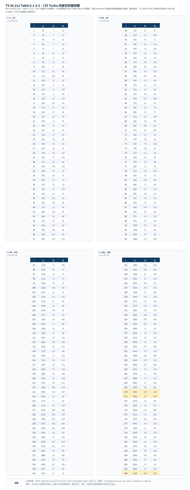
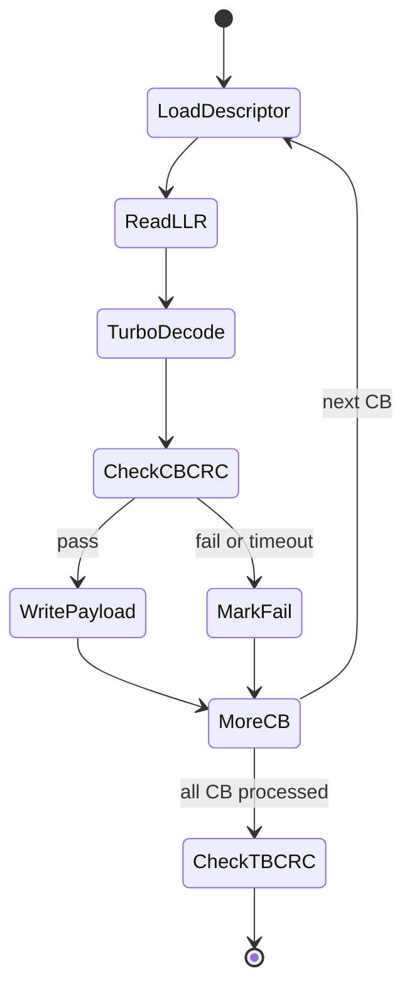

# T3.3 LTE Turbo 分段规则：码块 CRC、填充位与并行译码边界
## 本节学习目标

T3.2 已经建立了传输块、码块和填充位的基本关系。本节把范围收窄到 LTE 的 Turbo链路：一个已经附加循环冗余校验的传输块，如何按 TS 36.212 Rel-19 规则拆成若干个码块，每个 CB 如何附加码块 CRC，填充位如何进入第一个 CB，以及接收端为什么可以按 CB 并行译码。

本节第一次把 **Turbo 分段**作为主线。Turbo 码是一类用两个卷积码编码器和一个内部交织器组合起来的纠错码；本节聚焦它对“每个码块长度必须落在协议允许集合内”的要求。LTE 的用户数据信道采用 Turbo 编码时，TS 36.212 先规定分段，再规定每个码块独立进入 Turbo 编码器。接收端译码时必须反向遵守同一套分段边界。


- 解释 CRC 在 LTE Turbo 分段中的两层角色：传输块 CRC 和码块 CRC。
- 解释 TB 和 CB 在 LTE Turbo 链路中的前后关系。
- 读懂 TS 36.212 §5.1.2、§5.1.3.2、§5.2.2.2、§5.3.2.2 之间的调用链。
- 说明最大码块大小 $Z=6144$、码块 CRC 长度 $L=24$、填充位 $F$ 和 Table 5.1.3-3 合法块长集合之间的关系。
- 用一个 LTE 风格的尺寸例子手算码块数、合法码块长度和填充位数量。
- 说明接收端如何利用 CB 边界做并行 Turbo 译码、CB CRC 局部验收和 TB CRC 最终验收。

## 前置知识检查

| 前置项 | 本节需要达到的程度 |
|:---|:---|
| GF(2) 与 CRC | 能说出 CRC 是在二元多项式除法意义下做错误检测，CRC 通过不代表纠错，只代表未检测到错误。 |
| TB/CB/filler bit | 能区分 TB 是整包，CB 是编码/译码中间块，filler bit 是协议占位，不是业务数据。 |
| 对数似然比 | 能说出对数似然比是接收端交给译码器的软信息。 |
| Turbo 码基本定位 | 只需知道 Turbo 码是 LTE 数据链路使用的一类纠错码；trellis 可先理解为卷积码的状态路径图，Log-MAP 可先理解为基于后验概率的软输出译码算法，完整迭代译码会在 T6 展开。 |
| 协议证据意识 | 能接受本节只复现已经核验到本地抽取件和表格的规则；未逐符号核验的公式边界必须记录。 |

如果还分不清 TB CRC 和 CB CRC，可以先用一句话固定语义：TB CRC 是整包最终验收，CB CRC 是大块被拆开以后给每个小块增加的局部验收。

## 协议定位：TS 36.212 的分段、编码与上下行调用链

LTE 的信道编码主协议是 TS 36.212。Rel-19 本地包 `36212-j30` 已经结构化抽取到 `3GPP_Rel19/processed/TS_36.212_36212-j30`。本节使用的协议入口如下。

| 协议位置 | 本地证据 |
| :--- | :--- |
| TS 36.212 Rel-19 `36212-j30` §5.1 Generic procedures | `content.md`，`sections.jsonl` |
| TS 36.212 §5.1.1 CRC calculation | `content.md` |
| TS 36.212 §5.1.2 Code block segmentation and code block CRC attachment | `content.md`，`sections.jsonl` |
| TS 36.212 §5.1.3.2 Turbo coding | `content.md`，`sections.jsonl` |
| TS 36.212 Table 5.1.3-3 | `tables/table_0009.csv`，`tables/table_0009.html` |
| TS 36.212 §5.2.2.1-§5.2.2.3 | `content.md` |
| TS 36.212 §5.3.2.1-§5.3.2.3 | `content.md` |

发送端和接收端的完整协议处理链见 [[T3.2_transport_code_block_filler_bits]] 的”协议定位”一节。这里的关键是**码块边界是协议边界**——译码器可以在工程上并行处理多个 CB，但 CB 的数量、长度、填充位和 CRC 类型不能由硬件随意决定。

## LTE Turbo 分段的工程动机

分段不是为了让协议表格复杂，而是为了同时满足编码理论、接收端实现和空口资源适配三类约束。

第一，Turbo 内部交织器只支持一组离散的输入长度。TS 36.212 Table 5.1.3-3 列出每个合法 $K$ 对应的交织器参数。换句话说，Turbo 编码器不是“任意长度都能直接进去”的黑盒。若某个 CB 长度不在表中，发送端无法按协议生成内部交织序列，接收端也无法按协议生成对应的解交织地址。

第二，Turbo 码块存在最大长度。TS 36.212 §5.1.2 给出的最大码块大小是：

$$
Z=6144
\tag{1}
$$

这个 $Z$ 是分段判断中的硬边界。输入到分段的比特数 $B$ 如果超过 $Z$，就不能作为单个 Turbo 码块直接处理，必须拆成多个 CB。

第三，接收端实现必须在时延和吞吐之间折中。一个很大的 TB 如果被拆成多个 CB，接收端可以给不同 Turbo 译码引擎、不同软件线程或不同硬件时间片分配任务。CB CRC 还能让每个局部块有独立验收信号，便于早停、错误定位和调度。但要注意：这种并行是协议允许后的工程利用，不是改变协议边界。

## 关键术语与符号

本节使用的符号集中在分段长度上。先把每个符号对应的工程对象说清楚，再进入公式。

| 符号 | 含义 | 接收端需要保存的原因 |
|:---|:---|:---|
| $A$ | 原始 TB 长度，来自物理层拿到的传输块大小 | 最终交付上层时应恢复的业务比特数量。 |
| $B$ | TB CRC 附加后的长度 | TS 36.212 §5.2.2.2/§5.3.2.2 的分段输入包含 TB CRC。 |
| $Z$ | 最大码块大小，LTE Turbo 分段中为 6144 | 判断是否需要分段。 |
| $C$ | 码块数量 | 决定接收端启动多少个 CB 译码任务。 |
| $L$ | 每个 CB 附加的 CRC 长度；分段时为 24，不分段时为 0 | 决定每个 CB 译码后要剥离和检查多少局部 CRC 位。 |
| $B'$ | 考虑 CB CRC 后需要装入各 CB 的总比特数 | 用来选择合法码块长度。 |
| $K_r$ | 第 $r$ 个 CB 的输入长度，包含 filler 和 CB CRC | Turbo 编码器/译码器处理的实际块长。 |
| $F$ | 填充位数量 | 接收端重组 TB 时必须删除这些占位位。 |

这里 $K_r$ 的“包含关系”很重要：它不是原始业务位数量，而是送入 Turbo 编码器的码块输入长度。若存在 CB CRC，$K_r$ 包含该 CB 的 CRC 位；若第 0 个 CB 存在 filler，$K_0$ 还包含开头的 filler 占位。

## 从协议规则到尺寸计算

下面的公式不是从通信理论凭空推出来的，而是 TS 36.212 §5.1.2 的工程规则翻译。它回答的问题是：给定 $B$，怎样得到符合 Turbo 交织器合法长度集合的 $C$ 个码块。

### 分段触发与码块 CRC 长度

如果 $B$ 不超过最大码块大小，则只需要一个码块，不附加 CB CRC：

$$
B \le Z \Rightarrow C=1,\quad L=0
\tag{2}
$$

如果 $B$ 大于 $Z$，就要分段，并给每个 CB 附加 24 bit 的码块 CRC：

$$
B>Z \Rightarrow L=24
\tag{3}
$$

这 24 bit CB CRC 在 TS 36.212 §5.1.2 中使用 `gCRC24B(D)`。TB CRC 和 CB CRC 都是 CRC，但使用位置不同：TB CRC 在分段前保护整包，CB CRC 在分段后保护每个码块。

### 码块数量的估计

分段以后，每个 CB 的长度上限仍受 $Z$ 约束，但每个 CB 还要容纳 $L=24$ bit 的局部 CRC。因此每个 CB 可承载的分段前输入位数量最多约为 $Z-L$。码块数量按向上取整得到：

$$
C=\left\lceil\frac{B}{Z-L}\right\rceil,\quad B>Z
\tag{4}
$$

这个公式回答的是“至少需要几个 CB 才能放下 $B$ 个分段输入位，同时给每个 CB 留出 24 bit 局部 CRC”。它不是为了平均好看，而是为了保证每个 CB 加上 CRC 后不超过最大块长并进入合法长度选择流程。

### 计入 CB CRC 后的总长度

若 $C>1$，每个 CB 都多出 $L$ bit CRC，所以需要装入所有 CB 的总长度是：

$$
B'=B+C L
\tag{5}
$$

若 $C=1$，则 $L=0$，有 $B'=B$。$B'$ 是后续选择合法 $K_r$ 的总需求。

### 合法 Turbo 块长集合

TS 36.212 Table 5.1.3-3 给出 Turbo 内部交织器支持的 $K$ 值集合，以及每个 $K$ 对应的内部交织器参数 $f_1$ 和 $f_2$。本节直接使用协议原文截图（图 1），不再用生成图表复现。本地逗号分隔值文件（Comma-Separated Values, CSV）`table_0009.csv` 与超文本标记语言（HyperText Markup Language, HTML）`table_0009.html` 仅作为程序化读取的证据保留。先解释每一列：

| 列名 | 协议含义 | 本节如何使用 |
|:---|:---|:---|
| $i$ | Table 5.1.3-3 的表项编号，从 1 到 188。 | 用于定位某个合法块长对应的整行参数。 |
| $K$ | Turbo 编码器输入块长，也是 Turbo 内部交织器支持的块长。 | 本节分段计算必须从这一列选择 $K_+$ 和 $K_-$；不能任意取整数块长。 |
| $f_1$ | Turbo 内部交织器二次置换多项式的第一参数。 | 本节只记录和复现；T6.4 再用它生成交织地址。 |
| $f_2$ | Turbo 内部交织器二次置换多项式的第二参数。 | 本节只记录和复现；T6.4 再用它生成交织地址。 |

Turbo 内部交织器会使用二次置换多项式形式。这里给出它的用途，完整地址生成由 T6.4 承接：

$$
\Pi(k)=\left(f_1 k+f_2 k^2\right)\bmod K
\tag{6}
$$

其中 $k$ 是交织前的位置索引，$\Pi(k)$ 是交织后的位置索引。这个公式说明为什么表中不能只有 $K$：同一个块长必须配套对应的 $f_1$ 和 $f_2$，接收端译码器才能生成与发送端一致的交织和解交织地址。本节做分段尺寸计算时使用 $K$ 列；T6.4 会把公式、$f_1/f_2$ 和地址生成逐步展开。

表中 $K$ 列范围为：

$$
40 \le K \le 6144
\tag{7}
$$

并且 $K$ 不是任意整数。表中小长度从 40、48、56、64 等开始，较大长度逐步稀疏到 6144。协议在 §5.1.2 中要求选择表内的合法 $K$，这样后续 Turbo 内部交织器才能根据同一张表取参数。

TS 36.212 Table 5.1.3-3 的正文引用方式如下：本节直接用协议原文截图展示完整的 Turbo 内部交织器参数表，覆盖全部 188 个表项。截图来自 TS 36.212 Rel-19 `36212-j30` PDF 第 16 页，保留协议原文的排版、表头、页码和版本信息，方便读者直接对照协议原文。



| 内容 | 说明 |
|:---|:---|
| 表格来源 | TS 36.212 Table 5.1.3-3；截图自 `source.pdf` 第 16 页，覆盖全部 188 个 Turbo interleaver 参数项。本地结构化证据为 `table_0009.csv/html`，用于程序中读取合法 $K$ 集合。 |
| 列 `i` | 表项序号，用于索引合法 block size 组合；它不是码块长度。 |
| 列 `K` | Turbo internal interleaver 支持的合法 block size；本节直接使用该列判断 LTE Turbo 分段后每个 CB 的合法尺寸。 |
| 列 `f1` / `f2` | 二次置换多项式 $\Pi(k)=(f_1k+f_2k^2)\bmod K$ 的参数；同一个 `K` 必须配套对应的 `f1/f2`。 |
| 高亮项 | `K=4992`、`K=5056` 是本节手算分段例子用到的候选块长；`K=6144` 是 LTE Turbo 最大块长边界。 |
| 接收端用途 | Turbo decoder 内部交织/解交织地址生成必须读取与 `K` 对应的 `f1/f2`，不能只保存 `K` 或用相邻行参数替代。 |

为了便于跟随后面的手算例子，先把本节直接使用的几行列出来：

| 表项 $i$ | $K$ | $f_1$ | $f_2$ | 本节作用 |
|---:|---:|---:|---:|:---|
| 170 | 4992 | 127 | 234 | $B=10001$ 例子中 $K_+$ 的低一档候选 $K_-$。 |
| 171 | 5056 | 39 | 158 | $B=10001$ 例子中实际选择的 $K_+$。 |
| 188 | 6144 | 263 | 480 | LTE Turbo 分段中的最大合法块长，也是 $Z$ 的表内上限。 |

### 两种码块长度与填充位

协议不是简单把 $B'$ 平均分成 $C$ 份再四舍五入。它选择一个表内上侧长度 $K_+$，使得 $C K_+$ 足以容纳 $B'$：

$$
K_+=\min\{K\in \mathcal{K}_{\mathrm{table}}: C K \ge B'\}
\tag{8}
$$

如果 $C K_+=B'$，所有 CB 都可以使用 $K_+$：

$$
C_+=C,\quad C_-=0
\tag{9}
$$

如果 $C K_+>B'$，说明全部用 $K_+$ 会多出空间。协议再取表内低一档长度 $K_-$，并用一部分 $K_-$ 码块和一部分 $K_+$ 码块组合：

$$
K_-=\max\{K\in \mathcal{K}_{\mathrm{table}}: K<K_+\}
\tag{10}
$$

低一档码块数量 $C_-$ 和高一档码块数量 $C_+$ 可按差值计算：

$$
C_-=\left\lfloor\frac{C K_+ - B'}{K_+ - K_-}\right\rfloor,\quad C_+=C-C_-
\tag{11}
$$

这里的向下取整不能省略，因为码块数量必须是整数。若差值不足以把一个码块从 $K_+$ 降到 $K_-$，就不能得到“小数个短码块”，只能保持该码块为 $K_+$，多出来的位置由 filler 承担。

最后，总容量与 $B'$ 的差就是填充位数量：

$$
F=C_+K_+ + C_-K_- - B'
\tag{12}
$$

### 码块长度顺序与比特填入顺序

这里有一个很容易被教材式公式省略、但工程实现必须写死的协议细节：当同时存在 $K_-$ 和 $K_+$ 两种长度时，不是任意排列，也不是发送端先放长块。TS 36.212 §5.1.2 的循环按码块编号 $r=0,1,\ldots,C-1$ 处理，并在循环内使用这样的顺序：

| 码块编号范围 | 使用的码块长度 | 工程含义 |
|:---|:---|:---|
| $0 \le r < C_-$ | $K_r=K_-$ | 前 $C_-$ 个 CB 是短块。 |
| $C_- \le r < C$ | $K_r=K_+$ | 后 $C_+$ 个 CB 是长块。 |

因此，若有人问“TB 传输时是 $K_+$ 块在前还是 $K_-$ 块在前”，在 LTE Turbo 分段语境下答案是：**按 CB 编号顺序，$K_-$ 短块在前，$K_+$ 长块在后**。这里的“在前”不是说空口上直接裸传一个未编码 CB，而是说 TB CRC 后的输入比特序列在分段阶段先填入较小编号的 CB；之后每个 CB 再分别 Turbo 编码、速率匹配和传输。接收端恢复时也必须按同一个 $r$ 顺序管理 CB 描述符、软信息切分、CRC 检查和重组。

比特填入顺序可以理解成三个动作：

1. 如果 $F>0$，先把 filler bits 放到第 0 个 CB 的开头。
2. 从 TB CRC 后的输入序列第一个真实比特开始，按 $r=0$ 到 $C-1$ 依次填满每个 CB 的信息部分。
3. 若 $C>1$，对每个 CB 分别计算并追加 CRC24B；计算 CRC 时 filler 按 0 参与，但重组时 filler 必须删除。

举一个专门用来观察顺序的边界例子——刚超过 $Z=6144$ 的最小长度 $B=6145$。

$$
B=6145>6144 \;\Rightarrow\; L=24
$$

$$
C=\left\lceil\frac{6145}{6144-24}\right\rceil=2
$$

$$
B'=6145+2\times24=6193
$$

查 Table 5.1.3-3，最小 $K_+$ 满足 $2K_+\ge6193$ 即 $K_+\ge3096.5$，得到 $K_+=3136$。低一档 $K_-=3072$。

全用 $K_+$ 时容量 $2\times3136=6272$，超出 $6272-6193=79$。因 $K_+-K_-=64$ 且 $79\ge64$，可将一个 CB 降为 $K_-$：

$$
C_-=\left\lfloor\frac{79}{64}\right\rfloor=1,\quad C_+=1
$$

$$
F=1\times3136+1\times3072-6193=15
$$

结果：CB0 是 3072 bit 短块（开头 15 filler），CB1 是 3136 bit 长块。接收端必须按 $r=0$ 先处理 CB0 再 CB1，不能按译码完成时间拼回。

这些 filler bits 放在第一个 block 的开头。TS 36.212 §5.1.2 还说明：如果 $B<40$，也要在 code block 开头添加 filler bits；filler bits 在 encoder input 处设为 `<NULL>`；做 CB CRC 计算时，如果存在 filler bits，按 0 处理。

## 手算例子：$B=10001$ 的 LTE Turbo 分段尺寸

下面用一个尺寸例子走完整个分段计算。这个例子使用 TS 36.212 的 LTE Turbo 参数和 Table 5.1.3-3 的 $K$ 集合，但不构造真实 CRC 比特内容。

设 TB CRC 后进入分段的长度为：

$$
B=10001
\tag{13}
$$

因为：

$$
10001 > 6144
\tag{14}
$$

所以必须分段，并且：

$$
L=24
\tag{15}
$$

码块数量为：

$$
C=\left\lceil\frac{10001}{6144-24}\right\rceil
=\left\lceil\frac{10001}{6120}\right\rceil
=2
\tag{16}
$$

计入两个 CB 的 CRC 后：

$$
B'=10001+2\times24=10049
\tag{17}
$$

接下来查 Table 5.1.3-3 的合法 $K$。需要找到最小的 $K_+$，使得：

$$
2K_+ \ge 10049
\tag{18}
$$

等价于：

$$
K_+ \ge 5024.5
\tag{19}
$$

表中大于等于 5024.5 的最小合法 $K$ 是：

$$
K_+=5056
\tag{20}
$$

低一档合法长度是：

$$
K_-=4992
\tag{21}
$$

如果两个 CB 都用 5056，总容量为：

$$
2\times5056=10112
\tag{22}
$$

多出的空间是：

$$
10112-10049=63
\tag{23}
$$

因为 $K_+-K_-=64$，多出的 63 不足以把一个 CB 从 5056 降到 4992，所以两个 CB 都使用 5056：

$$
C_-=0,\quad C_+=2
\tag{24}
$$

填充位数量为：

$$
F=2\times5056-10049=63
\tag{25}
$$

接收端含义如下：

| 项目 | 结果 |
|:---|:---|
| CB 数量 | 2 |
| 每个 CB 的 Turbo 输入长度 | 5056、5056 |
| 每个 CB 的局部 CRC | 24 bit CRC24B |
| filler 位置 | 第 0 个 CB 开头 63 个位置 |
| 重组规则 | 两个 CB 译码并通过 CB CRC 后，剥离 CB CRC、删除开头 63 个 filler，再拼回 $B=10001$ 个 TB CRC 后比特。 |

这个例子强调一个容易犯错的点：filler 数量不是为了把原始 $B$ 补到 $C K_+$，而是为了把“原始 $B$ 加上所有 CB CRC 后的 $B'$”补到合法码块容量。

## Filler Bit 与 Turbo 编码器输入

在普通语言里，filler bit 容易被说成“补 0”。对 LTE Turbo 分段来说，这个说法会掩盖两个协议细节。

第一，TS 36.212 §5.1.2 使用 `<NULL>` 描述 encoder input 处的 filler bits。`<NULL>` 表示占位语义，不是原始 TB 数据位。接收端重组时必须删除这些位置，不能把它们交给上层。

第二，TS 36.212 §5.1.2 又规定做 CB CRC 计算时，如果存在 filler bits，假定其值为 0。这只是在 CRC 计算口径中的数值约定，不等于 filler 已经变成业务 `0`。

第三，TS 36.212 §5.1.3.2 进一步涉及第 0 个码块存在 filler 时 Turbo 编码器输入和部分输出的处理。当前 `content.md` 里相关符号抽取不完整，因此正文记录“存在专门处理规则”这一事实；具体输出流下标由 T6.3 在核验原始 Word XML、图 5.1.3-2 和公式 XML 后逐符号展开。

接收端实现上，filler 位通常会通过 mask 或描述符表示。无论软件还是硬件，都不应只靠“值为 0”判断 filler，因为真实业务比特也可能是 0。

## 接收端并行译码流程


这个流程里有三个工程边界。

| 边界 | 协议事实 | 工程利用 |
|:---|:---|:---|
| CB 独立 Turbo 编码 | TS 36.212 §5.2.2.3 说明每个 code block individually turbo encoded | 接收端可以并行启动多个 CB 译码任务。 |
| CB CRC 局部验收 | TS 36.212 §5.1.2 分段时每个 CB 附加 CRC24B | 可以做每块 early stopping 或错误定位。 |
| TB CRC 最终验收 | UL-SCH/DL-SCH TB CRC 在分段前附加 | 所有 CB 局部通过后仍需整包检查。 |

并行译码不改变拼接顺序。CB1 先译码完成，并不意味着它可以先交付上层。接收端必须按 $r=0,1,\ldots,C-1$ 的协议顺序剥离、删除 filler、拼接和检查 TB CRC。

## 算法伪代码

下面的伪代码描述 LTE Turbo 分段尺寸计算和接收端重组所需的描述符。它省略真实 CRC 生成比特，只保留长度、filler 和 CRC 类型。

```text
input:
  B: length after TB CRC attachment
  K_TABLE: valid Turbo interleaver sizes from TS 36.212 Table 5.1.3-3
  Z = 6144

if B <= Z:
    C = 1
    L = 0
else:
    L = 24
    C = ceil(B / (Z - L))

B_prime = B + C * L

K_plus = smallest K in K_TABLE such that C * K >= B_prime
if C * K_plus == B_prime:
    C_minus = 0
    C_plus = C
    K_minus = unused
else:
    K_minus = largest K in K_TABLE smaller than K_plus
    C_minus = floor((C * K_plus - B_prime) / (K_plus - K_minus))
    C_plus = C - C_minus

F = C_plus * K_plus + C_minus * K_minus - B_prime

create CB descriptors:
  first C_minus blocks use K_minus
  remaining C_plus blocks use K_plus
  CB0 has filler_count = F
  each CB has cb_crc_len = L

receiver:
  for each CB descriptor:
      decode Turbo code block
      if cb_crc_len == 24:
          check CRC24B
      remove CB CRC bits
  concatenate CB payloads by r order
  remove first F filler positions
  check TB CRC
```

实际协议实现还要处理具体比特搬移顺序、CRC 生成和速率匹配后的软信息地址，这些由 LTE Turbo 链路章节展开。

## Python 校验片段

下面的代码从本地 TS 36.212 Table 5.1.3-3 CSV 中读取合法 $K$，复核本节 $B=10001$ 的尺寸例子。它不是完整 LTE 编码器，只验证分段长度计算。

```python
import csv
import math
from pathlib import Path


def load_turbo_k_table(path: Path) -> list[int]:
    # Time: O(R), Space: O(R), R is the number of CSV rows.
    values: set[int] = set()
    for row in csv.reader(path.read_text(encoding="utf-8").splitlines()):
        if not row or row[0] == "i":
            continue
        for column in (1, 5, 9, 13):
            if column < len(row) and row[column].strip().isdigit():
                values.add(int(row[column]))
    return sorted(values)


def lte_turbo_segmentation_sizes(b_len: int, k_table: list[int]) -> dict[str, object]:
    # Time: O(K), Space: O(C), K is table length and C is code-block count.
    z = 6144
    if b_len <= z:
        c = 1
        crc_len = 0
    else:
        crc_len = 24
        c = math.ceil(b_len / (z - crc_len))

    b_prime = b_len + c * crc_len
    k_plus = next(k for k in k_table if c * k >= b_prime)

    if c * k_plus == b_prime:
        c_minus = 0
        c_plus = c
        k_values = [k_plus] * c
        filler = 0
    else:
        k_minus = max(k for k in k_table if k < k_plus)
        c_minus = (c * k_plus - b_prime) // (k_plus - k_minus)
        c_plus = c - c_minus
        filler = c_plus * k_plus + c_minus * k_minus - b_prime
        k_values = [k_minus] * c_minus + [k_plus] * c_plus

    return {
        "C": c,
        "L": crc_len,
        "B_prime": b_prime,
        "K_values": k_values,
        "F": filler,
        "C_minus": c_minus,
        "C_plus": c_plus,
    }


k_table = load_turbo_k_table(
    Path("3GPP_Rel19/processed/TS_36.212_36212-j30/tables/table_0009.csv")
)
result = lte_turbo_segmentation_sizes(10001, k_table)

print(len(k_table), k_table[0], k_table[-1])
print(result["C"], result["L"], result["B_prime"])
print(result["K_values"])
print(result["F"], result["C_minus"], result["C_plus"])

edge = lte_turbo_segmentation_sizes(6145, k_table)
print(edge["C"], edge["L"], edge["B_prime"])
print(edge["K_values"])
print(edge["F"], edge["C_minus"], edge["C_plus"])
```

期望输出：

```text
188 40 6144
2 24 10049
[5056, 5056]
63 0 2
2 24 6193
[3072, 3136]
15 1 1
```

## 代表性工程用例

| 用例 | 输入 | 输出 | 失败案例 | 验证方式 |
|:---|:---|:---|:---|:---|
| LTE DL-SCH 大 TB Turbo 译码 | 解速率匹配后的每 CB LLR、TS 36.212 §5.1.2 分段参数、Table 5.1.3-3 合法长度 | 每个 CB 的硬判决、CRC24B 结果、重组后的 TB CRC 结果 | CB 长度按平均分配而不是按合法 $K$ 表选择，导致交织/解交织地址错位 | 协议尺寸向量、CB CRC、TB CRC、逐位一致 golden test。 |
| LTE UL-SCH 并行 CB 译码 | 多个 CB 的软信息地址、迭代次数上限、CB 描述符 | 并行译码完成状态、按 $r$ 顺序拼接的 TB 候选 | 先完成的 CB 先写回拼接区，造成 TB 位序错乱 | 描述符顺序测试、乱序完成仿真、最终 TB CRC 检查。 |

## 浮点仿真方案

本节的浮点仿真先建立长度和描述符的黄金参考，完整 Turbo Log-MAP 译码器由 T6 系列承接。建议分三层验证。

| 层次 | 输入 | 输出 | 验收 |
|:---|:---|:---|:---|
| 尺寸模型 | $B$、Table 5.1.3-3 的 $K$ 集合 | $C$、$L$、$B'$、$K_r$、$F$ | 与手算例子和协议边界案例一致。 |
| 比特级分段模型 | TB CRC 后 bit array、CRC24B 函数 | 每个 CB 的 payload、filler mask、CB CRC | CRC 计算时 filler 按 0，重组后恢复原始 $B$ 位。 |
| 软信息接口模型 | 每个 CB 的 LLR 序列、filler mask | Turbo 译码器输入 descriptor | filler 不作为普通业务 LLR 交付，CB 顺序可恢复。 |

随机仿真应固定随机种子，例如 `seed=20260619`，覆盖以下长度：

| 类别 | 示例 |
|:---|:---|
| 不分段普通长度 | $B=1000$ |
| 小块边界 | $B<40$ |
| 最大不分段 | $B=6144$ |
| 刚好触发分段 | $B=6145$ |
| 多 CB 且 $F=0$ | 从表中搜索满足整除的长度 |
| 多 CB 且 $F>0$ | 本节 $B=10001$ |

## 定点化策略

LTE Turbo 分段本身主要是整数控制逻辑，不是定点数值算法。但它会影响定点译码器看到的 LLR 宽度、地址和 mask。

| 对象 | 定点实现含义 | 建议 |
|:---|:---|:---|
| CB LLR 起始地址 | 每个 CB 对应一段软信息 buffer | 使用描述符保存 base address 和 length，避免按平均长度推导。 |
| filler 位置 | 第 0 个 CB 开头若干位置不是业务数据 | 用 `filler_count` 或 bit mask 表示，避免只用 LLR 数值表示。 |
| CB CRC 结果 | 局部验收信号 | 在定点仿真中记录每个 CB 的 syndrome 或 pass/fail。 |
| 迭代次数 | Turbo 译码器可能按 CB 独立早停 | 早停策略是实现选择，不应写成协议强制要求。 |
| 饱和策略 | LLR 量化后可能影响 CRC 通过率 | 用固定随机种子比较浮点/定点块错误率和 CB CRC 分布。 |

这里的核心原则是：分段描述符必须逐位一致，定点数值误差才有讨论意义。如果 CB 边界错了，再精细的 LLR 量化也无法补救。

## 寄存器传输级与芯片架构映射

本节不是完整寄存器传输级设计，但 LTE Turbo 分段会直接变成专用集成电路里的控制信息。

一个合理的 CB 描述符可以包含：

| 字段 | 位宽/类型示意 | 来源 | 用途 |
|:---|:---|:---|:---|
| `cb_id` | 整数 | 分段顺序 $r$ | 拼接排序、状态跟踪。 |
| `k_len` | 至少覆盖 0 到 6144 | $K_r$ | Turbo 译码器长度配置、交织器参数选择。 |
| `llr_base` | 地址 | 解速率匹配输出 | 读取该 CB 的软信息。 |
| `filler_count` | 0 到 6144 | $F$，只对第 0 个 CB 非零 | 生成 mask、重组时删除。 |
| `cb_crc_len` | 0 或 24 | $L$ | 控制是否检查 CRC24B。 |
| `out_base` | 地址 | 拼接计划 | 写回硬判决 payload。 |
| `status` | 枚举 | 译码器与 CRC 单元 | idle/running/pass/fail/timeout。 |

硬件状态流可以抽象为：



这个状态图是实现建议，不是 3GPP 协议图。协议规定的是比特处理和块边界，RTL 需要把这些规则映射成地址、状态、并行调度和错误上报。

## 验证方法

| 验证对象 | 方法 | 通过标准 |
|:---|:---|:---|
| Table 5.1.3-3 解析 | 从 `table_0009.csv` 提取所有 $K$ | 得到 188 个唯一 $K$，范围 40 到 6144。 |
| 尺寸公式 | 对 $B=10001$ 运行 Python 片段 | 输出 $C=2$、$L=24$、$B'=10049$、$K=[5056,5056]$、$F=63$。 |
| Filler 处理 | 构造 $F>0$ bit 级例子 | CB CRC 计算时 filler 按 0，重组时删除 filler。 |
| 并行完成顺序 | 人为打乱 CB 完成顺序 | 输出 TB 仍按 `cb_id` 顺序拼接。 |
| CRC 层次 | 注入单 CB 错误和拼接错误 | 单 CB 错误触发 CB CRC；拼接错误应由 TB CRC 暴露。 |
| 协议边界 | 文档审查 | 所有协议结论都有 TS 36.212 Rel-19 路径和章节；尚待校验的公式不作强声明。 |

## 常见错误

| 错误 | 后果 | 修正方式 |
|:---|:---|:---|
| 用 $B/Z$ 直接算码块数 | 忽略每个 CB 还要附加 24 bit CRC，边界长度会错。 | 分段时使用 $Z-L$ 并计算 $B'=B+CL$。 |
| 任意平均分配 CB 长度 | 得到的长度可能不在 Table 5.1.3-3，Turbo 交织器无法配置。 | 只从协议表中的合法 $K$ 集合选择。 |
| 把 filler 当普通业务 0 | 重组后 TB 位序污染，TB CRC 失败或误交付。 | 用 mask/descriptor 表示 filler，占位和数值分开处理。 |
| 只看 CB CRC 通过 | CB 局部正确不等于 TB 拼接正确。 | 必须执行 TB CRC 最终验收。 |
| 把并行译码完成顺序当拼接顺序 | 多核或多引擎情况下会造成 CB 顺序错乱。 | 按 `cb_id` 和协议顺序拼接。 |
| 把本文尺寸脚本当完整 LTE 编码器 | 缺少真实 CRC、多项式除法、Turbo 编码、速率匹配和调制链路。 | 仅把脚本用作分段尺寸黄金参考的一部分。 |

## 工程思考题

1. 如果 $B=6144$，是否需要 CB CRC？为什么？
2. 如果 $B=6145$，为什么不能只生成一个 6169 bit 的 CB？
3. 本节 $B=10001$ 例子中，为什么 $F=63$ 而不是 $2\times5056-10001$？
4. 若两个 CB 都通过 CB CRC，TB CRC 仍失败，可能有哪些原因？
5. RTL 中为什么要保存 `cb_id`，而不是按译码完成顺序写回？
6. 为什么 Table 5.1.3-3 的合法 $K$ 集合对接收端也重要？

## 自测题

1. LTE Turbo 分段的最大码块大小 $Z$ 是多少？
2. 分段时每个 CB 附加的 CRC 长度是多少，使用哪个 CRC 多项式族？
3. TB CRC 和 CB CRC 的职责有什么区别？
4. Table 5.1.3-3 在分段规则中起什么作用？
5. filler bit 在 CRC 计算和业务交付中的语义是否相同？
6. 根据本节例子，$B=10001$ 时 $C$、$L$、$B'$、$F$ 分别是多少？
7. 接收端并行 Turbo 译码后，为什么还要按 CB 编号拼接？

## 自测题参考答案

1. LTE TS 36.212 §5.1.2 给出的最大码块大小是 $Z=6144$。
2. 当 $B>Z$ 需要分段时，每个 CB 附加 24 bit CRC，§5.1.2 指向 `gCRC24B(D)`。
3. TB CRC 在分段前附加，保护整包并作为最终交付验收；CB CRC 在分段后附加，保护每个局部码块并支持局部验收。
4. Table 5.1.3-3 给出 Turbo 内部交织器支持的合法 $K$ 值。分段后的每个 $K_r$ 必须来自该表，否则后续 Turbo 编码器和译码器无法按协议生成交织/解交织地址。
5. 不相同。CRC 计算时 filler 可按 0 处理，但业务交付时 filler 是 `<NULL>` 占位，必须删除，不能作为真实 TB 比特。
6. $C=2$，$L=24$，$B'=10049$，$F=63$，两个 CB 的长度都是 5056。
7. 因为协议定义了 CB 顺序，工程并行只改变处理时间，不改变比特拼接顺序。按完成顺序拼接会破坏 TB 位序。

## 本节验收

| 验收项 | 通过标准 |
|:---|:---|
| 协议定位 | 能指出 TS 36.212 §5.1.2 是分段主入口，§5.2.2.2/§5.3.2.2 调用该入口。 |
| 尺寸计算 | 能手算 $B=10001$ 的 $C=2$、$B'=10049$、$K_r=5056$、$F=63$。 |
| 术语理解 | 能区分 TB CRC、CB CRC、filler、Turbo 合法 $K$。 |
| 接收端流程 | 能画出 CB 译码、CB CRC、去 filler、拼接、TB CRC 的顺序。 |
| 工程边界 | 能说明并行译码是实现利用，不改变协议规定的 CB 顺序。 |
| 证据意识 | 能说明本节已用协议原文截图核验 Table 5.1.3-3，但未逐符号复现 Turbo 编码器 filler 输出规则。 |

## 资料与协议边界

| 资料 | 已使用结论 | 边界 |
|:---|:---|:---|
| `3GPP_Rel19/manifest.csv` | TS 36.212 Rel-19 包为 `36212-j30.zip`，源文件 `36212-j30.docx`，主题为复用与信道编码。 | 未联网核对官方站点当前状态，使用本地 Rel-19 基线。 |
| `3GPP_Rel19/processed/manifest.json` | TS 36.212 状态为 processed，包含 3430 个段落、250 个表格、23 个公式和 1034 个媒体文件。 | 抽取成功不等于公式语义已全部人工核验。 |
| TS 36.212 README | 说明 `content.md`、`sections.jsonl`、`tables/*.html/csv`、`equations/*.xml` 的用途和边界。 | 复杂公式应优先核验 XML 或原始 Word。 |
| TS 36.212 §5.1.2 | 使用 $Z=6144$、分段时 CB CRC `L=24`、filler 放在第一个 block 开头、filler 为 `<NULL>`、CRC 计算时 filler 按 0。 | `content.md` 对部分公式变量抽取不完整，本节用可核验规则和表格重建尺寸逻辑。 |
| TS 36.212 Table 5.1.3-3 | 使用协议原文截图（`source.pdf` 第 16 页）展示完整 Turbo 内部交织器参数表，包含 188 组 `i/K/f1/f2`。`table_0009.csv/html` 作为程序化读取证据保留。 | 本节只使用 $K$ 列完成分段尺寸计算；$f_1/f_2$ 的交织地址公式会在 T6.4 精读。 |
| TS 36.212 §5.1.3.2 | 使用 PCCC、两个 8 状态组成编码器、内部交织器、1/3 码率和每 CB 独立 Turbo 编码的定位。 | 完整传递函数、尾比特和 filler 输出流下标由 T6.3 在核验公式 XML/图 5.1.3-2 后承接。 |
| TS 36.212 §5.2.2.1-§5.2.2.3，§5.3.2.1-§5.3.2.3 | 使用 UL-SCH/DL-SCH 的 TB CRC、分段调用和 Turbo 编码调用链。 | 速率匹配、混合自动重传请求和物理信道映射由 T7 与系统接口章节承接。 |

非 3GPP 文献用于 Turbo 码历史和现代编码背景阅读。本节实际依赖的分段规则、合法块长集合和 CRC 长度均来自 TS 36.212 本地制品；正文没有引用这些文献中的具体公式、表格、图或算法框图。

## 图示

本节图示已嵌入正文对应位置，不在末尾重复列出：
- TS 36.212 Table 5.1.3-3 协议原文截图：见 §合法 Turbo 块长集合 段落内。

## 执行与证据记录

| 项目 | 记录 |
|:---|:---|
| 总纲复核 | 复核 `合规与遵从.md` 的协议精读、零基础、缩写首现、标题正式化和讲义细致度要求。 |
| 计划复核 | 复核 `docs/superpowers/plans/2026-06-19-l1-remaining-lessons.md` 中 T3.3 任务要求。 |
| 协议清单 | 检查 `3GPP_Rel19/manifest.csv`、`3GPP_Rel19/processed/manifest.json` 和 TS 36.212 README。 |
| 本地协议检索 | 使用 `rg`、`sed` 检索 TS 36.212 `content.md` 与 `sections.jsonl`，定位 §5.1.2、§5.1.3.2、§5.2.2.2、§5.3.2.2。 |
| 表格核验 | 查看 `tables/table_0009.csv` 和 `tables/table_0009.html`，确认 Turbo 合法 $K$ 集合和 $f_1/f_2$ 参数可由本地表格抽取；使用 `pdftoppm` 从 `source.pdf` 第 16 页提取协议原文截图，替换原有生成图表，保存为 `docs/L1_基础/assets/T3.3_TS36.212_Table_5.1.3-3.png`。 |
| 示例验证 | 使用 Python 3 运行本节尺寸计算片段，期望输出记录为 `T3.3_PYTHON_EXAMPLE_OK`。 |
| 自动审计 | 计划运行标题审计、术语首现审计、L1 结构审计和 Python 示例审计。 |
| 审核经理 | 本节完成后提交审核经理复核协议证据链、解释细致度、公式边界、标题正式性和缩写首现。 |

## 参考文献

- [3GPP, 2026] 3GPP TS 36.212, Rel-19, `36212-j30`, Multiplexing and channel coding, §5.1.1, §5.1.2, §5.1.3.2, §5.2.2.1-§5.2.2.3, §5.3.2.1-§5.3.2.3, Table 5.1.3-3. Local path: `3GPP_Rel19/processed/TS_36.212_36212-j30`.
- [Berrou et al., 1993] Claude Berrou, Alain Glavieux, and Punya Thitimajshima, "Near Shannon Limit Error-Correcting Coding and Decoding: Turbo-Codes," *Proceedings of ICC 1993*, 1993.
- [Richardson and Urbanke, 2008] Tom Richardson and Ruediger Urbanke, *Modern Coding Theory*, Cambridge University Press, 2008.
