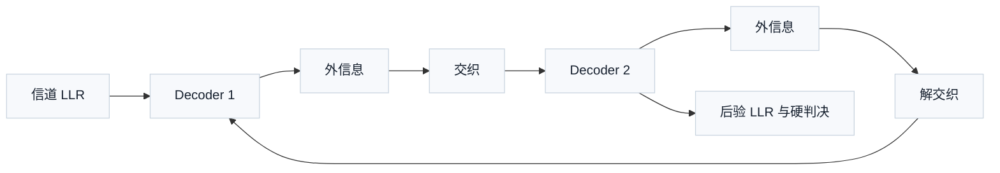
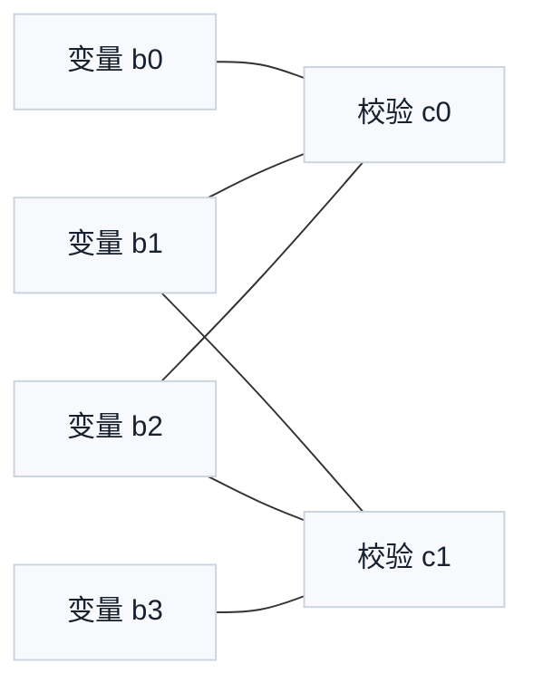

# T4.1 迭代译码与外信息：多次更新置信度的接收端方法
## 本节学习目标

本节讲 **迭代译码（iterative decoding）** 和 **外信息（extrinsic information）**。迭代译码不是“把同一个算法多跑几遍”这么简单，而是在多个约束之间反复交换置信度：接收端先从信道得到每个比特的软信息，再用编码结构检查哪些比特组合更合理，然后把新得到的线索反馈给其他约束，逐步修正判断。

这里的软信息以 对数似然比 表示。LLR（对数似然比，Log-Likelihood Ratio）的正负号表示更像 `0` 还是更像 `1`，绝对值表示相信程度。迭代译码的目标不是一开始就给出最终硬判决，而是让每个比特的置信度在“信道观测”和“编码约束”之间不断被校正。


- 区分 信道对数似然比（channel LLR）、先验信息（a priori information）、外信息（extrinsic information）和 后验对数似然比（posterior LLR）。
- 解释 Turbo（Turbo 码，Turbo Code）和低密度奇偶校验码为什么需要多次迭代。
- 用两个奇偶校验关系的小例子手算一次置信度更新。
- 说明外信息为什么不能把输入信息原封不动再反馈回去。
- 把迭代次数、早停、LLR 裁剪、路径/消息存储、寄存器传输级和专用集成电路实现联系起来。

## 前置知识检查

| 前置项 | 本节需要达到的程度 |
|:---|:---|
| LLR | 能读懂 LLR 正负号和绝对值含义；不要求掌握复杂概率推导。 |
| GF(2) | 知道二元有限域加法等价于异或。 |
| 奇偶校验 | 知道一组比特的异或和为 `0` 表示偶校验通过。 |
| 循环冗余校验 | 知道 CRC（循环冗余校验，Cyclic Redundancy Check）用于最后验收，不能替代迭代译码内部消息更新。 |
| 概率直觉 | 知道多个独立线索可以让判断更可靠，但错误线索也会误导判断。 |

如果只记住一句话：迭代译码就是“每个比特先听信道怎么说，再听校验关系怎么说，多轮之后形成更稳的最终判断”。

## 协议定位与本地证据

本节是算法基础课，不把外信息公式写成 3GPP 强制规则。3GPP 规范规定编码结构、分段、速率匹配、CRC 和物理层流程；具体 Turbo MAP（最大后验概率，Maximum A Posteriori）/Max-Log-MAP、LDPC（低密度奇偶校验码，Low-Density Parity-Check Code）BP/Min-Sum 的内部消息更新公式属于接收机实现算法。

| 协议位置 | 本地证据 |
| :--- | :--- |
| LTE TS 36.212 Rel-19 `36212-j30` §5.1.3.2 | `3GPP_Rel19/processed/TS_36.212_36212-j30/content.md`，Figure 5.1.3-2 文字锚点 |
| LTE TS 36.212 Rel-19 `36212-j30` §5.1.2、§5.2.2.2、§5.3.2.2 | `content.md` |
| NR TS 38.212 Rel-19 `38212-j30` §5.3.2 | `3GPP_Rel19/processed/TS_38.212_38212-j30/content.md`，Tables 5.3.2-1/2/3 |
| NR TS 38.212 Rel-19 `38212-j30` §6.2、§7.2 | `content.md` |

协议精读的边界要清楚：3GPP 规定发送端编码和接收端必须匹配的结构，不规定厂商一定用多少次迭代、多少 bit LLR、哪种归一化 Min-Sum 或哪个早停门限。这些是工程实现策略，必须通过仿真和芯片约束验证。

## 迭代译码的工程动机

硬判决只给出 `0/1`，软判决给出“更像 `0` 还是更像 `1` 以及有多确信”。译码器真正需要的是后者，因为校验关系可能会推翻某个看似合理的单比特判断。

设接收端看到三个比特的信道 LLR：

| 比特 | 信道 LLR | 单独看信道的判断 |
|:---|---:|:---|
| $b_0$ | +3.0 | 很像 `0` |
| $b_1$ | +2.0 | 像 `0` |
| $b_2$ | -0.3 | 略像 `1`，但不确定 |

如果编码约束规定：

$$
b_0 \oplus b_1 \oplus b_2 = 0
\tag{1}
$$

那么 $b_0=0$、$b_1=0$ 时，$b_2$ 更应该是 `0`，因为 $0\oplus0\oplus0=0$。这时校验关系会把 $b_2$ 的置信度从“略像 `1`”拉回“更像 `0`”。这就是迭代译码的基本价值：单个符号的观测可能弱，但多个校验关系能给它补充上下文。

## 四类信息的定义

译码器里经常出现四类信息。初学时最容易混淆的是先验信息（a priori）和外信息（extrinsic）。

| 名称 | 中文解释 | 来源 | 是否包含当前模块新贡献 |
|:---|:---|:---|:---|
| Channel LLR | 信道软信息 | 解调器根据接收采样和噪声估计生成 | 否，它是外部观测输入。 |
| A priori information | 先验信息 | 本轮更新前已经从其他模块或上一轮得到的置信度 | 否，它是当前模块更新前已有的线索。 |
| Extrinsic information | 外信息 | 当前约束模块利用本模块结构新产生、准备传给其他模块的增量线索 | 是，但必须排除原输入的直接回声。 |
| Posterior LLR | 后验 LLR | 综合 channel、a priori 和 extrinsic 后的总置信度 | 是最终或中间判决依据。 |

一个常用抽象关系是：

$$
L_{\mathrm{post}}(b_i)
=
L_{\mathrm{ch}}(b_i)
+
L_{\mathrm{apr}}(b_i)
+
L_{\mathrm{ext}}(b_i)
\tag{2}
$$

式 (2) 回答的问题是：一个比特当前总置信度由哪些部分组成。$L_{\mathrm{ch}}$ 是信道给的，$L_{\mathrm{apr}}$ 是当前模块进入前已经有的，$L_{\mathrm{ext}}$ 是当前模块根据约束新算出来的。后验 LLR 为正时倾向判 `0`，为负时倾向判 `1`。

外信息的关键要求是 **不把自己收到的信息原样返还**。如果模块 A 把来自模块 B 的信息原样放大后又传回 B，系统会把同一条证据重复计算，置信度越来越虚高，最后出现过度自信错误。

## 两个校验关系的手算例子

现在用一个不依赖图论的小例子理解外信息。设有 4 个比特：

$$
\mathbf{b}=[b_0,b_1,b_2,b_3]
\tag{3}
$$

它们满足两个偶校验关系：

$$
b_0\oplus b_1\oplus b_2=0
\tag{4}
$$

$$
b_1\oplus b_2\oplus b_3=0
\tag{5}
$$

接收端从解调器得到 channel LLR：

| 比特 | $L_{\mathrm{ch}}$ | 初始判断 |
|:---|---:|:---|
| $b_0$ | +4.0 | `0`，很可靠 |
| $b_1$ | +1.0 | `0`，较弱 |
| $b_2$ | -0.6 | `1`，很弱 |
| $b_3$ | +3.0 | `0`，可靠 |

先用硬判决看一眼：$b_0=0,b_1=0,b_2=1,b_3=0$。代入式 (4) 得到 $0\oplus0\oplus1=1$，校验失败；代入式 (5) 得到 $0\oplus1\oplus0=1$，也失败。两个校验都把矛头指向 $b_2$ 或相邻弱比特。

在 LDPC 的校验节点更新中，一个校验关系给某个比特的外信息，来自“同一条校验里其他比特的置信度”。为了做手算，本节使用 Min-Sum 风格的教学近似：

$$
L_{c\rightarrow i}
=
\left(\prod_{j\in \mathcal{N}(c)\setminus i}\mathrm{sign}(L_{j\rightarrow c})\right)
\cdot
\min_{j\in \mathcal{N}(c)\setminus i}|L_{j\rightarrow c}|
\tag{6}
$$

式 (6) 回答的问题是：一个校验关系 $c$ 给比特 $i$ 的建议是什么。$\mathcal{N}(c)$ 表示参与该校验的比特集合。符号乘积决定建议偏向 `0` 还是 `1`，最小绝对值表示这条建议受最不可靠邻居限制。

对式 (4) 给 $b_2$ 的消息，只看 $b_0$ 和 $b_1$：

$$
L_{c_0\rightarrow 2}
=
\mathrm{sign}(+4.0)\mathrm{sign}(+1.0)\cdot \min(4.0,1.0)
=+1.0
\tag{7}
$$

这条消息的含义是：从 $b_0,b_1$ 看，为了让 $b_0\oplus b_1\oplus b_2=0$，$b_2$ 更应该是 `0`，强度约为 1.0。

对式 (5) 给 $b_2$ 的消息，只看 $b_1$ 和 $b_3$：

$$
L_{c_1\rightarrow 2}
=
\mathrm{sign}(+1.0)\mathrm{sign}(+3.0)\cdot \min(1.0,3.0)
=+1.0
\tag{8}
$$

把两条外信息和信道 LLR 合起来：

$$
L_{\mathrm{post}}(b_2)
=
-0.6+1.0+1.0
=+1.4
\tag{9}
$$

$b_2$ 从“略像 `1`”变成“更像 `0`”。这不是魔法，而是两个校验关系都认为 $b_2=0$ 更能解释当前观测。

## 外信息的非回声原则

外信息必须只包含“当前模块新贡献的线索”。如果计算 $c_0\rightarrow b_2$ 时把 $b_2$ 自己的输入 LLR 也放进去，就会发生回声：

$$
L_{c_0\rightarrow 2}^{\mathrm{wrong}}
=
f(L_{0\rightarrow c_0},L_{1\rightarrow c_0},L_{2\rightarrow c_0})
\tag{10}
$$

这会让 $b_2$ 自己原本的判断又绕一圈回来影响自己，导致证据重复计数。正确做法是式 (6) 那样排除目标变量本身：

$$
L_{c\rightarrow i}
=
f(\{L_{j\rightarrow c}:j\in\mathcal{N}(c),j\ne i\})
\tag{11}
$$

Turbo 译码里的两个 constituent decoder 也遵守同样思想。一个译码器输出的后验 LLR 不能原样全部传给另一个译码器；要扣除 channel LLR 和输入先验，留下外信息：

$$
L_{\mathrm{ext}}
=
L_{\mathrm{post}}
-
L_{\mathrm{ch}}
-
L_{\mathrm{apr}}
\tag{12}
$$

式 (12) 回答的问题是：当前模块到底新增了多少证据。这个差值才适合通过交织器或解交织器传给另一个模块。

## Turbo 译码中的外信息交换

LTE Turbo 编码由两个递归系统卷积编码器和内部交织器构成。接收端通常用两个软输入软输出译码器交替工作：

%%{init: {'theme': 'default'}}%%


本节图表不是 3GPP 协议图的复刻，而是接收端算法结构图。TS 36.212 定义发送端 Turbo 编码结构和交织器参数；接收端实现要反向利用这些结构。两个译码器看的是同一批信息比特的不同约束视角：一个看原顺序，另一个看交织顺序。外信息交换让两个视角互相补充。

工程上，Turbo 译码的迭代次数通常是固定上限加早停条件。例如最多 8 次迭代，每半次迭代后更新一批外信息，若 CRC 通过或 LLR 稳定则提前停止。具体次数不是 3GPP 固定值，而是性能、功耗和延迟的设计选择。

## LDPC 译码中的消息传递

NR LDPC 码由稀疏奇偶校验矩阵定义。稀疏表示每个校验只连接少量变量，每个变量也只参与少量校验。接收端可以在变量节点和校验节点之间传递消息：

%%{init: {'theme': 'default'}}%%


变量节点把信道 LLR 和来自其他校验的消息合成后发给某个校验；校验节点再用式 (6) 类似的规则给变量反馈外信息。多轮之后，变量节点形成后验 LLR：

$$
L_{\mathrm{post}}(b_i)
=
L_{\mathrm{ch}}(b_i)
+
\sum_{c\in\mathcal{N}(i)}L_{c\rightarrow i}
\tag{13}
$$

式 (13) 回答的问题是：一个 LDPC 变量节点最终怎样整合信道和所有校验节点的建议。若所有硬判决满足奇偶校验，syndrome 为零，译码器可以考虑早停；若传输块/CB（码块，Code Block）CRC 通过，接收端可以接受对应数据。

## 接收端流程

迭代译码器的通用接收流程如下：

1. 解调器输出每个 coded bit 的 channel LLR。
2. 解速率匹配把收到的 LLR 放回编码器输出位置，并完成软合并或填充位置处理。
3. 译码器根据协议描述符建立码块长度、校验结构、交织器或 LDPC 基图。
4. 初始化变量消息，通常从 channel LLR 开始。
5. 运行若干轮消息更新：
- Turbo：两个软输入软输出译码器交替交换外信息。
- LDPC：变量节点和校验节点交换消息。
6. 每轮或若干轮后形成 posterior LLR 和硬判决。
7. 运行 syndrome 检查或 CRC 检查。
8. 满足早停条件则输出；否则继续迭代到最大次数。
9. 若达到最大次数仍失败，输出 fail 状态和调试计数。

## 伪代码

```python
def single_check_message(llrs, check, target):
    """Compute one Min-Sum-style check-to-variable message.

    Time: O(d), where d is the check degree.
    Space: O(1), excluding the input list.
    """
    sign = 1.0
    magnitude = float("inf")
    for idx in check:
        if idx == target:
            continue
        value = llrs[idx]
        sign *= 1.0 if value >= 0 else -1.0
        magnitude = min(magnitude, abs(value))
    return sign * magnitude


channel_llr = [4.0, 1.0, -0.6, 3.0]
checks = [[0, 1, 2], [1, 2, 3]]
extrinsic_to_b2 = sum(single_check_message(channel_llr, check, 2) for check in checks)
posterior_b2 = channel_llr[2] + extrinsic_to_b2
assert abs(extrinsic_to_b2 - 2.0) < 1e-9
assert abs(posterior_b2 - 1.4) < 1e-9
print("T4.1_ITERATIVE_EXTRINSIC_TOY_OK")
```

这个伪代码是教学模型，不是标准 LDPC BP，也不是 Turbo MAP。它验证三个概念：外信息来自其他比特，迭代会改变弱比特判断，校验通过可以作为早停线索。

## 工业用例

| 用例 | 输入 | 输出 | 边界条件 | 失败案例 | 验证方式 |
|:---|:---|:---|:---|:---|:---|
| LTE Turbo 码块译码 | 解速率匹配后的系统位和校验位 LLR、交织器参数、最大迭代次数 | 信息比特、CRC 状态、迭代次数 | 低信噪比、filler bit、CB 长度边界 | 外信息未扣除 channel LLR，导致过度自信但 CRC fail | 与浮点 golden model 比对 posterior LLR、hard decision、CRC status。 |
| NR LDPC 码块译码 | LDPC 码块 LLR、base graph、lifting size、最大迭代次数 | CB payload、syndrome/CRC 状态、迭代次数 | BG1/BG2 切换、短块、量化饱和 | 校验节点消息符号错误，syndrome 长期不收敛 | syndrome trace、message histogram、块错误率曲线和 bit-exact regression。 |

## 浮点仿真方案

| 仿真项 | 方法 | 通过条件 |
|:---|:---|:---|
| 两校验 toy model | 运行本节伪代码 | 两条校验关系给 $b_2$ 的外信息为 +2.0，$b_2$ 的 posterior 从 -0.6 变成 +1.4。 |
| 外信息非回声 | 人为加入目标变量自身输入，观察 posterior 虚高 | 错误实现的 LLR 幅度明显异常，审计脚本能检测重复加法。 |
| 迭代次数扫描 | 固定随机种子生成多个噪声样本，扫描 max_iter | 迭代次数增加时失败率先下降，随后收益变小。 |
| 裁剪影响 | 对 LLR 加不同 clipping 阈值 | 过小阈值损失性能，过大阈值可能定点溢出。 |

建议命令：

```bash
python3 - <<'PY'
channel_llr = [4.0, 1.0, -0.6, 3.0]
checks = [[0, 1, 2], [1, 2, 3]]
extrinsic_to_b2 = 0.0
for check in checks:
    others = [i for i in check if i != 2]
    sign = 1.0
    mag = min(abs(channel_llr[i]) for i in others)
    for i in others:
        sign *= 1.0 if channel_llr[i] >= 0 else -1.0
    extrinsic_to_b2 += sign * mag
posterior_b2 = channel_llr[2] + extrinsic_to_b2
assert abs(extrinsic_to_b2 - 2.0) < 1e-9
assert abs(posterior_b2 - 1.4) < 1e-9
print("T4.1_SINGLE_ITERATION_PARITY_OK")
PY
```

## 定点化策略

| 对象 | 定点风险 | 策略 |
|:---|:---|:---|
| Channel LLR | 输入饱和或符号约定错误 | 统一正号含义，记录 clipping 计数。 |
| Extrinsic message | 多轮累加导致幅度虚高 | 每轮做饱和、归一化或 offset 修正。 |
| Posterior LLR | 位宽不足导致溢出 | 单独估算最大迭代次数下的累加范围。 |
| 迭代计数 | 过多迭代增加功耗和延迟 | 结合 CRC/syndrome 早停。 |
| 消息存储 | Turbo 交织访问和 LDPC layered 访问冲突 | 使用 banked 静态随机存取存储器或双缓冲调度。 |

定点验证不能只看最终 CRC。还要看中间消息分布：若大量 LLR 卡在最大值，说明裁剪过强或重复计数；若所有消息都接近 0，说明缩放过弱，译码器无法形成可靠判断。

## 硬件实现映射

| 模块 | 输入 | 输出 | 关键风险 |
|:---|:---|:---|:---|
| LLR input buffer | 解速率匹配后 LLR | 初始化变量消息 | bit order 或符号约定错误。 |
| Message memory | 变量到校验、校验到变量消息 | 下一轮迭代输入 | bank conflict 或路径覆盖。 |
| Check/update unit | 邻居消息 | extrinsic message | Min-Sum 符号和最小值选择错误。 |
| Posterior accumulator | channel + extrinsic | hard decision LLR | 溢出、饱和和重复计数。 |
| Stop controller | syndrome、CRC、iteration count | continue/done/fail | CRC fail 被误当 pass，或早停条件过松。 |

RTL（寄存器传输级，Register Transfer Level）实现中，外信息更新通常是吞吐与面积的核心。ASIC（专用集成电路，Application-Specific Integrated Circuit）设计要在并行度、SRAM（静态随机存取存储器，Static Random-Access Memory）bank 数、更新单元数量和时钟频率之间折中。

## 验证方法

| 验证层级 | 检查内容 | 通过标准 |
|:---|:---|:---|
| 单元测试 | 式 (6)-式 (9) 两校验手算例子 | 输出 posterior 与手算一致。 |
| 单元测试 | 外信息非回声 | 目标变量自身消息不参与本次 check-to-variable 更新。 |
| 集成测试 | 最大迭代次数 | 达到 max_iter 后 fail 状态正确。 |
| 集成测试 | 早停 | 校验/CRC pass 后不继续无意义迭代。 |
| 定点回归 | 浮点 vs 定点 hard decision 和 CRC | 在指定 SNR（信噪比，Signal-to-Noise Ratio）点差异可解释，不能出现符号系统性反转。 |
| 硬件验证 | 消息存储地址 | 无读写冲突、无越界、无旧迭代消息误用。 |

## 常见错误

| 错误 | 后果 | 修正 |
|:---|:---|:---|
| 把 posterior LLR 当 extrinsic 传递 | 重复计数，LLR 虚高 | 按式 (12) 扣除 channel 和 a priori。 |
| 忽略 LLR 符号约定 | 所有判决反向 | 在接口契约中固定正号表示 `0`。 |
| 只看 CRC 不看中间消息 | 难以定位不收敛原因 | 记录 syndrome、message histogram 和迭代 trace。 |
| 固定迭代过多 | 功耗和延迟浪费 | 增加 syndrome/CRC 早停。 |
| 早停过松 | 错误码块被接受 | CRC 和 syndrome 条件必须严格定义。 |

## 工程思考题

1. 外信息为什么不能包含目标变量自己的输入消息？
2. Channel LLR、a priori information 和 posterior LLR 的关系是什么？
3. 两条校验关系同时支持某个弱比特翻转时，posterior LLR 会怎样变化？
4. Turbo 和 LDPC 的迭代对象有什么不同？
5. 定点实现中为什么要观察消息直方图？

## 工程思考题参考答案

1. 如果包含目标变量自己的输入消息，信息会绕一圈回到自己，造成重复计数和过度自信。正确外信息只包含当前约束从其他变量或其他模块得到的新线索。
2. Channel LLR 来自解调器；a priori 是当前模块更新前已有线索；posterior LLR 是 channel、a priori 和 extrinsic 合成后的总置信度。
3. 如果两条校验关系都支持同一个弱比特从 `1` 改判为 `0`，它们会给该比特提供同号外信息，使 posterior LLR 朝 `0` 方向移动。
4. Turbo 主要在两个 constituent decoder 之间通过交织/解交织交换外信息；LDPC 主要在变量节点和校验节点之间沿稀疏图传递消息。
5. 因为最终 CRC 只能告诉结果是否通过，消息直方图能暴露裁剪过强、缩放过弱、溢出、重复计数和符号错误等内部问题。

## 自测题

1. $L_{\mathrm{ch}}$ 表示什么？
2. $L_{\mathrm{ext}}$ 与 $L_{\mathrm{post}}$ 是同一个东西吗？
3. 式 (4) 中若 $b_0=0,b_1=0$，为了偶校验通过，$b_2$ 应该是什么？
4. LDPC check-to-variable 更新为什么要排除目标变量自身？
5. 3GPP 是否规定厂商必须使用某个固定迭代次数？

## 自测题参考答案

1. 表示信道 LLR，由解调器根据接收采样和噪声估计生成。
2. 不是。$L_{\mathrm{post}}$ 是总置信度，$L_{\mathrm{ext}}$ 是当前模块新增并准备传给其他模块的外信息。
3. 应该是 `0`，因为 $0\oplus0\oplus0=0$。
4. 为了避免把同一条证据原样反馈给自己，造成重复计数。
5. 不规定。协议规定编码结构和接收端必须匹配的比特/码块语义；迭代次数是实现策略，需要仿真和硬件验证。

## 本节验收

| 验收项 | 通过标准 |
|:---|:---|
| 概念区分 | 能区分 channel LLR、a priori、extrinsic 和 posterior LLR。 |
| 手算能力 | 能复现两校验关系对弱比特的外信息更新。 |
| 协议边界 | 能说明 Turbo/LDPC 结构来自 TS 36.212/38.212，但具体迭代算法是实现选择。 |
| 工程映射 | 能说出外信息存储、迭代次数、早停和定点饱和的硬件影响。 |

## 资料与协议边界

本节使用 TS 36.212 和 TS 38.212 作为 Turbo/LDPC 结构和接收端码块语义的协议背景，不引用 3GPP 的具体迭代译码公式。外信息、Min-Sum 教学公式、posterior LLR 合成公式和两校验例子属于算法教学模型。

未复现内容包括：LTE Turbo MAP/Max-Log-MAP 详细公式、NR LDPC 完整 BP/Min-Sum 归一化参数、真实基图矩阵消息调度、厂商特定早停策略。这些将在后续 Turbo、LDPC 和硬件章节展开。

## 协议证据表

| 证据 | 状态 | 本节结论 |
|:---|:---|:---|
| TS 36.212 Rel-19 `36212-j30` §5.1.3.2 | 已定位 | LTE Turbo 编码结构为后续 Turbo 迭代译码提供约束背景。 |
| TS 36.212 Rel-19 `36212-j30` Figure 5.1.3-2 | 已定位文字锚点，未重绘原图 | 本节只用自绘接收端外信息交换图，不复现协议发送端图。 |
| TS 38.212 Rel-19 `38212-j30` §5.3.2 | 已定位 | NR LDPC 由奇偶校验矩阵和基图/提升规则定义。 |
| TS 38.212 Rel-19 `38212-j30` §6.2/§7.2 | 已定位 | UL-SCH（上行共享信道，Uplink Shared Channel）/DL-SCH（下行共享信道，Downlink Shared Channel）的 CRC、基图选择、分段和 LDPC 编码链路为接收端 descriptor 来源。 |
## 执行与证据记录

| 项目 | 记录 |
|:---|:---|
| 本地协议检索 | 使用 `rg` 检索 TS 36.212 `content.md` 中 Turbo coding、Figure 5.1.3-2、分段/CRC；检索 TS 38.212 `content.md` 中 LDPC coding、base graph、CRC 和分段章节。 |
| 教学公式 | 自写式 (1)-式 (13)，用于解释外信息和 toy Min-Sum 更新；不声明为 3GPP 公式。 |
| Mermaid 图 | 自绘 Turbo 外信息交换图和 LDPC toy 消息图，用于教学结构说明。 |
| Python 验证 | 提供两校验关系对 $b_2$ 的外信息计算和 posterior 检查命令。 |
| 审计边界 | 本节应通过标题、术语、结构和深度审计；真实 Turbo/LDPC bit-exact 验证不在本节范围。 |

## 参考文献

- [Berrou et al., 1993] C. Berrou, A. Glavieux, and P. Thitimajshima, "Near Shannon Limit Error-Correcting Coding and Decoding: Turbo-Codes," ICC, 1993. 本节只作为 Turbo 迭代译码历史背景，不复现论文公式。
- [3GPP, 2026a] 3GPP TS 36.212, Rel-19, `36212-j30`, Multiplexing and channel coding, §5.1.2, §5.1.3.2, §5.2.2.2, §5.3.2.2. Local path: `3GPP_Rel19/processed/TS_36.212_36212-j30`.
- [3GPP, 2026b] 3GPP TS 38.212, Rel-19, `38212-j30`, Multiplexing and channel coding, §5.3.2, §6.2, §7.2. Local path: `3GPP_Rel19/processed/TS_38.212_38212-j30`.
- [Gallager, 1962] R. G. Gallager, "Low-Density Parity-Check Codes," IRE Transactions on Information Theory, 1962. 本节只作为 LDPC 消息传递历史背景，不复现论文公式。
