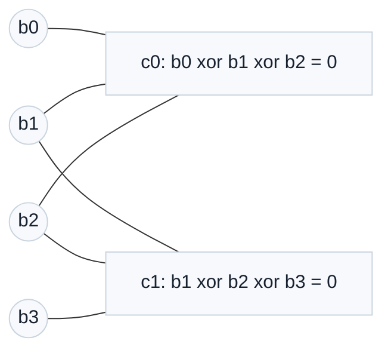
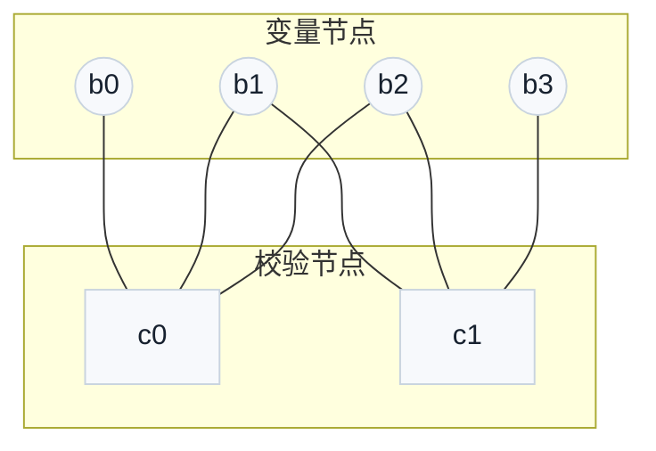
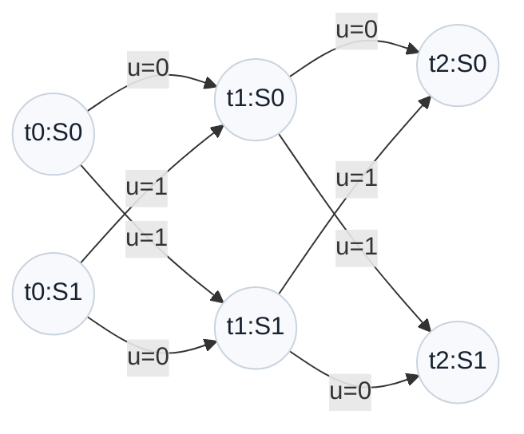
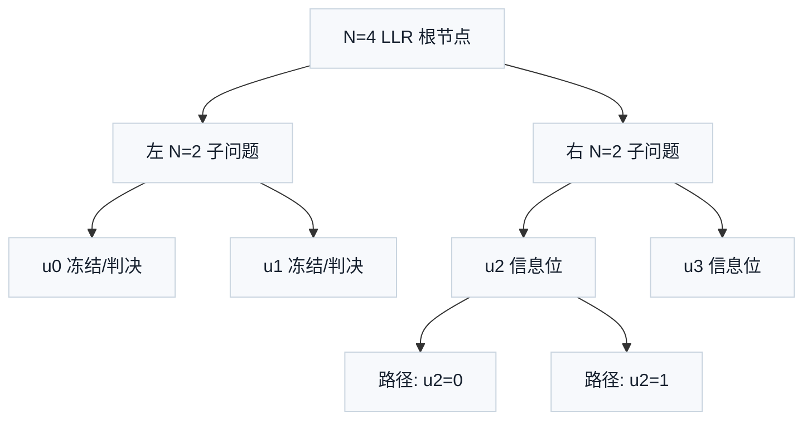

# T4.2 因子图、Tanner 图与网格图：译码约束的三种可视化语言
## 本节学习目标

译码器面对的不是一串孤立比特，而是一组有约束的比特。图的作用是把“哪些比特互相约束、消息沿哪里传递、状态怎样演化”画出来。对零基础学习者来说，图不是抽象装饰，而是后续理解 Turbo（Turbo 码，Turbo Code）、低密度奇偶校验码和Polar（极化码，Polar Code）译码器硬件结构的地图。

本节讲四种图语言：

- **因子图（factor graph）**：通用图语言，用变量节点和函数/约束节点表示概率或约束分解。
- **Tanner 图（Tanner graph）**：LDPC（低密度奇偶校验码，Low-Density Parity-Check Code）常用图语言，用变量节点和校验节点表示奇偶校验矩阵。
- **网格图（trellis diagram）**：卷积码和 Turbo 译码常用图语言，用状态随时间变化表示码约束。
- **树形图（tree diagram）**：Polar SC/SCL（连续消除列表译码，Successive Cancellation List）译码常用直觉，用递归分裂和路径保留表示逐位判决。


- 解释节点、边、变量节点、约束节点各自是什么。
- 把一个两条奇偶校验关系画成因子图和 Tanner 图。
- 说明 Tanner 图为什么适合 LDPC 消息传递。
- 说明网格图为什么适合 Turbo/卷积码的状态递推。
- 说明 Polar 译码为什么常用树和路径来描述。
- 把三类图与 LTE Turbo、NR LDPC、NR Polar 的协议结构联系起来，同时不把算法图误认为协议原图。

## 前置知识检查

| 前置项 | 本节需要达到的程度 |
|:---|:---|
| GF(2) | 知道异或和为 `0` 可以表示偶校验通过。 |
| 矩阵 | 知道矩阵的一行可以代表一条校验规则。 |
| 对数似然比 | 知道 LLR（对数似然比，Log-Likelihood Ratio）是软信息。 |
| 外信息 | 知道外信息（extrinsic information）是当前约束给其他模块的新线索。 |
| 循环冗余校验 | 知道 CRC（循环冗余校验，Cyclic Redundancy Check）通常用于译码结果验收，不是图上每条边的消息。 |

如果你还不熟图论，不影响本节学习。这里的“图”只需要理解成由点和线组成的结构：点表示对象，线表示对象之间存在关系。

## 协议定位与本地证据

本节是算法结构基础课。图模型本身不是 3GPP 强制实现方式，但 3GPP 定义的编码结构决定了接收端可以画出什么样的图。

| 协议位置 | 本地证据 |
| :--- | :--- |
| LTE TS 36.212 Rel-19 `36212-j30` §5.1.3.2 | `3GPP_Rel19/processed/TS_36.212_36212-j30/content.md` |
| NR TS 38.212 Rel-19 `38212-j30` §5.3.2 | `3GPP_Rel19/processed/TS_38.212_38212-j30/content.md` |
| NR TS 38.212 Rel-19 `38212-j30` §5.3.1.2 | `content.md`，`tables/table_0012.csv/html` |
| NR TS 38.212 Rel-19 `38212-j30` §6.2/§7.2/§7.3 | `content.md` |

协议边界：TS 36.212/38.212 规定编码、分段、矩阵、交织、速率匹配等发送端和接收端必须匹配的结构；Tanner 图、网格译码图、Polar 树遍历是接收端理解和实现这些结构的算法表达。除非正文明确标注为协议图，否则本节 Mermaid 图都是教学重建图。

## 图语言的最小定义

图由节点和边组成：

| 名称 | 含义 | 译码里的例子 |
|:---|:---|:---|
| 节点 | 一个对象或一次计算 | 比特变量、校验规则、状态、路径。 |
| 边 | 两个节点之间的关系或消息通道 | 某个比特参与某条校验，某个状态转移到下一状态。 |
| 变量节点 | 表示未知量的节点 | $b_0,b_1,b_2$ 这些待译码比特。 |
| 约束节点 | 表示规则的节点 | $b_0\oplus b_1\oplus b_2=0$。 |
| 消息 | 沿边传递的置信度 | LLR、外信息、路径度量更新。 |

一个图是否有用，取决于它有没有回答工程问题。LDPC 图回答“每个校验依赖哪些变量”；Turbo 网格回答“编码器状态怎样随输入比特变化”；Polar 树回答“SC/SCL 译码按什么递归顺序拆分 LLR 和部分和”。

## 因子图的通用含义

因子图把一个复杂关系拆成多个局部关系。设有 4 个比特和两个约束：

$$
c_0:\ b_0\oplus b_1\oplus b_2=0
\tag{1}
$$

$$
c_1:\ b_1\oplus b_2\oplus b_3=0
\tag{2}
$$

这个系统可以画成：



圆形节点是变量，方形节点是约束。边表示“这个变量参与这条约束”。译码消息沿边传递：变量把自己的信道 LLR 和其他约束给的外信息发给某条约束；约束再根据相邻变量给目标变量反馈建议。

因子图的价值是局部化。没有图时，只能看到一大串公式；有图后，可以看出哪个模块可以并行、哪个变量共享消息、哪个节点会成为硬件访存热点。

## Tanner 图与 LDPC 的手算例子

Tanner 图是 LDPC 最常用的图。它有两类节点：

- 变量节点：对应码字中的 bit。
- 校验节点：对应奇偶校验矩阵的一行。

设奇偶校验矩阵为：

$$
\mathbf{H}=
\begin{bmatrix}
1&1&1&0\\
0&1&1&1
\end{bmatrix}
\tag{3}
$$

式 (3) 的第一行表示式 (1)，第二行表示式 (2)。矩阵中某个位置是 `1`，就表示对应变量节点和校验节点之间有一条边；是 `0`，就没有边。



LDPC 的英文是 Low-Density Parity-Check Code，中文是低密度奇偶校验码。“低密度”指 $\mathbf{H}$ 里大多数元素是 `0`，只有少数是 `1`。这非常重要：如果每个校验都连接大量变量，消息更新代价会很高；稀疏连接让译码器可以做局部更新和并行硬件。

NR TS 38.212 §5.3.2 不直接给一个完整巨大 $\mathbf{H}$ 矩阵，而是给 base graph、lifting size 和循环置换规则。接收端可以把这些协议参数展开成实际 Tanner 图。[[T3.4_NR_LDPC_segmentation_rules|T3.4]] 已经复现了 NR LDPC 的 lifting sets 和 base graph 非零位置；T4.2 只解释“为什么这些表最终会变成图上的边”。

## Tanner 图消息更新的读法

在 Tanner 本节图表中，变量节点和校验节点轮流更新消息：

$$
L_{v\rightarrow c}
=
L_{\mathrm{ch}}(v)
+
\sum_{c'\in\mathcal{N}(v)\setminus c}L_{c'\rightarrow v}
\tag{4}
$$

式 (4) 回答的问题是：变量 $v$ 发给校验 $c$ 的消息包含什么。它包含信道 LLR 和其他校验给 $v$ 的建议，但排除目标校验 $c$ 自己之前发来的消息，避免回声。

校验节点给变量的教学化 Min-Sum 消息为：

$$
L_{c\rightarrow v}
=
\left(\prod_{v'\in\mathcal{N}(c)\setminus v}\mathrm{sign}(L_{v'\rightarrow c})\right)
\min_{v'\in\mathcal{N}(c)\setminus v}|L_{v'\rightarrow c}|
\tag{5}
$$

式 (5) 回答的问题是：一条偶校验如何根据其他变量判断目标变量。符号乘积决定倾向 `0` 或 `1`，最小幅度表示最弱邻居限制了这条建议的可靠性。

这两条公式是算法教学公式，不是 3GPP 规范公式。协议给出 $\mathbf{H}$ 的构造，接收机厂商选择 BP（置信传播，Belief Propagation）、Min-Sum、Normalized Min-Sum、Offset Min-Sum 或 layered schedule。

## 网格图与 Turbo

网格图用于描述“状态随时间变化”。卷积码编码器有记忆：当前输出不仅取决于当前输入 bit，还取决于之前几个 bit 留在寄存器里的状态。把每个时间点的可能状态画出来，再把输入 `0/1` 对应的状态转移连起来，就得到网格图。

下面是一个简化的 2-state 教学网格，不复现 LTE Turbo 的真实 8-state 编码器：



网格译码的核心问题是：接收端看到一串 noisy symbols 后，哪条状态路径最可能？硬判决 Viterbi 找最可能单一路径；Turbo 的软输入软输出译码会计算每个 bit 为 `0/1` 的软置信度，并输出外信息给另一个分量译码器（constituent decoder）。

LTE TS 36.212 §5.1.3.2 的 Figure 5.1.3-2 是 Turbo 编码器结构图，说明发送端用了两个 8-state 分量编码器（constituent encoder）和内部交织器。接收端的网格来自这些分量编码器（constituent encoder）的状态机。换言之，协议图定义”编码器怎么产生约束”，网格译码图表达”接收端怎样利用状态约束反推输入比特”。

## Polar 树与路径

Polar 译码常用树来理解，因为 Polar 编码由递归核矩阵构成。对 $N=4$，可以把 LLR 拆成左右子问题，再合并部分和。逐次消除译码（Successive Cancellation, SC）每次只保留一条路径；逐次消除列表译码（Successive Cancellation List, SCL）在信息位处分裂路径，保留若干条候选。



Polar 树和 LDPC Tanner 图的思维方式不同。LDPC 是在同一个稀疏图上反复传消息；Polar SC/SCL 是按递归结构逐步判决。[[T3.5_NR_Polar_segmentation_crc|T3.5]] 已经解释 CRC-aided SCL：SCL 产生多条候选路径，CRC 帮助选择通过路径中 path metric 最优者。

## 三类图的对比

| 图语言 | 适配编码 | 节点含义 | 边含义 | 接收端典型算法 | 硬件关注点 |
|:---|:---|:---|:---|:---|:---|
| 网格图 | 卷积码、Turbo constituent code | 状态和时间 | 输入 bit 导致的状态转移 | BCJR（BCJR 算法，Bahl-Cocke-Jelinek-Raviv Algorithm）/MAP（最大后验概率，Maximum A Posteriori）、Max-Log-MAP、Viterbi | 前向/后向度量存储、交织访问。 |
| Tanner 图 | LDPC | 变量节点和校验节点 | 某个 bit 参与某条校验 | BP、Min-Sum、Layered Min-Sum | 稀疏访存、bank 冲突、层化调度。 |
| Polar 树 | Polar | 递归子问题、bit 判决、路径 | LLR 拆分与部分和传播 | SC、SCL、CRC-aided SCL | LLR 树存储、部分和、路径复制、排序。 |
| 因子图 | 通用概率/约束模型 | 变量和因子 | 变量参与因子 | Sum-Product、Max-Product | 消息调度和并行划分。 |

初学时不要急着背算法名。先问三个问题：变量是什么？约束是什么？消息或状态沿哪里流动？这三个问题答清楚，图就不是装饰，而是实现结构。

## 接收端流程

当接收端准备译码一个码块时，可以按以下流程选择图语言：

1. 读取协议 descriptor：编码类型、码块长度、交织器参数、LDPC base graph/lifting size 或 Polar $N/K$。
2. 若是 LTE Turbo，建立 constituent encoder 的状态机和内部交织/解交织地址，使用网格视角做软输入软输出译码。
3. 若是 NR LDPC，按 base graph 和 lifting size 展开校验关系，使用 Tanner 图视角做消息传递。
4. 若是 NR Polar，按可靠性序列、冻结位和速率恢复结果建立递归树和路径管理，使用 SC/SCL 视角译码。
5. 输出后验对数似然比（posterior LLR）或硬判决比特（hard bits），执行 CRC/syndrome/路径选择。
6. 记录图相关调试信息：迭代次数、路径数、校验失败位置、状态度量范围、访存冲突统计。

## 伪代码

```python
def tanner_edges_from_h(matrix):
    """Return Tanner graph edges from a binary parity-check matrix.

    Time: O(rows * cols), Space: O(E).
    """
    edges = []
    for row, values in enumerate(matrix):
        for col, value in enumerate(values):
            if value:
                edges.append((f"c{row}", f"b{col}"))
    return edges


h = [
    [1, 1, 1, 0],
    [0, 1, 1, 1],
]
edges = tanner_edges_from_h(h)
assert edges == [
    ("c0", "b0"),
    ("c0", "b1"),
    ("c0", "b2"),
    ("c1", "b1"),
    ("c1", "b2"),
    ("c1", "b3"),
]
print("T4.2_TANNER_EDGE_EXTRACTION_OK")
```

这个伪代码验证矩阵和 Tanner 图之间的最小关系：矩阵中的 `1` 对应一条边。真实 NR LDPC 还要把 base graph 的 `1` 替换为 $Z_c\times Z_c$ 循环置换矩阵，边数量会随 lifting size 放大。

## 工业用例

| 用例 | 输入 | 输出 | 边界条件 | 失败案例 | 验证方式 |
|:---|:---|:---|:---|:---|:---|
| NR LDPC 图展开 | base graph、lifting size、shift values | Tanner 图边表或 layered schedule | BG1/BG2、不同 lifting set、filler bit | shift 方向错，导致所有校验关系错位 | 与 TS 38.212 表格重建结果比对，跑 syndrome regression。 |
| LTE Turbo 网格译码 | constituent encoder 状态机、交织器、码块 LLR | posterior LLR、hard bits、CRC status | filler bit、网格终止（trellis termination）、交织地址边界 | 状态转移表错，导致 decoder 无法收敛 | 状态转移表单元测试、known vector、CRC/块错误率曲线。 |

## 浮点仿真方案

| 仿真项 | 方法 | 通过条件 |
|:---|:---|:---|
| Tanner 边提取 | 用本节 $\mathbf{H}$ 矩阵提取边 | 输出边表与手算一致。 |
| LDPC toy message | 在两校验图上跑一轮 Min-Sum | 消息方向、目标排除和符号与 [[T4.1_iterative_decoding_extrinsic_information|T4.1]] 一致。 |
| Turbo toy trellis | 枚举 2-state 状态转移 | 每个状态在输入 `0/1` 下都有唯一下一状态。 |
| Polar toy tree | 对 $N=4$ 构造递归节点 | 叶子数为 4，信息位路径能分裂。 |

建议命令：

```bash
python3 - <<'PY'
def tanner_edges_from_h(matrix):
    edges = []
    for row, values in enumerate(matrix):
        for col, value in enumerate(values):
            if value:
                edges.append((row, col))
    return edges

h = [[1, 1, 1, 0], [0, 1, 1, 1]]
assert tanner_edges_from_h(h) == [(0, 0), (0, 1), (0, 2), (1, 1), (1, 2), (1, 3)]
print("T4.2_TANNER_TOY_OK")
PY
```

## 定点化策略

图本身没有定点位宽，但图上的消息和度量有。

| 图语言 | 定点对象 | 风险 | 策略 |
|:---|:---|:---|:---|
| Tanner 图 | 变量消息、校验消息、posterior LLR | 消息累加溢出、符号错误 | 对每类消息单独定宽，统计饱和率。 |
| 网格图 | branch metric、forward metric、backward metric | 度量指数增长或归一化错误 | 每个时间步做归一化或偏置扣除。 |
| Polar 树 | LLR、部分和、路径度量 | path metric 排序被量化误差改变 | 路径度量位宽与 list size 一起扫描。 |

图语言还能帮助定点验证定位问题。若某一层 Tanner 图消息全饱和，可能是对应校验节点度数或缩放错；若某个 trellis stage 度量全相等，可能是 branch metric 没接入；若 Polar 某层路径复制异常，可能是树遍历顺序或部分和地址错。

## 硬件实现映射

| 图语言 | 硬件模块 | 存储形态 | 关键瓶颈 |
|:---|:---|:---|:---|
| Tanner 图 | variable-node/check-node update units | 边消息静态随机存取存储器、layer schedule ROM（只读存储器，Read-Only Memory） | bank conflict、读写带宽、层间依赖。 |
| 网格图 | forward/backward metric units | 状态度量 RAM、branch metric RAM | 滑窗长度、归一化、交织访存。 |
| Polar 树 | f/g processing units、path manager | LLR memory、partial-sum memory、path memory | 路径复制、排序、CRC 检查尾延迟。 |

寄存器传输级设计中，图结构会变成地址生成器和调度器。专用集成电路面积不只来自计算单元，更多时候来自消息 SRAM（静态随机存取存储器，Static Random-Access Memory）、跨 bank 连接和排序网络。

## 验证方法

| 验证层级 | 检查内容 | 通过标准 |
|:---|:---|:---|
| 单元测试 | $\mathbf{H}$ 到 Tanner 边表 | 每个 `1` 对应一条边，`0` 不生成边。 |
| 单元测试 | Trellis 状态转移表 | 每个状态和输入组合有确定 next state 和输出。 |
| 单元测试 | Polar 树节点数 | $N=2^n$ 时叶子数为 $N$，递归层数为 $n$。 |
| 集成测试 | LDPC syndrome | Tanner 图展开后校验矩阵与编码输出匹配。 |
| 集成测试 | Turbo known vector | 网格译码能恢复协议合法码块。 |
| 集成测试 | Polar CRC-aided SCL | 路径树输出和 CRC/path metric 选择一致。 |

## 常见错误

| 错误 | 后果 | 修正 |
|:---|:---|:---|
| 把 Tanner 图和普通流程图混淆 | 看不出变量与校验的边关系 | 从 $\mathbf{H}$ 的 `1` 生成边表。 |
| 把协议发送端图当接收端算法图 | 误以为协议规定具体译码器结构 | 明确协议定义编码结构，译码算法是实现选择。 |
| 网格状态定义不一致 | branch metric 和状态转移表错位 | 固定状态 bit 顺序并写枚举测试。 |
| Polar 树遍历顺序错 | LLR/部分和地址错误 | 用 $N=4$ 和 $N=8$ toy case 做逐节点 trace。 |
| 图上消息包含回声 | LLR 过度自信 | 发送给目标节点时排除目标节点来源的旧消息。 |

## 工程思考题

1. 为什么 LDPC 特别适合用 Tanner 图表示？
2. 一个 $\mathbf{H}$ 矩阵中的 `1` 对 Tanner 图意味着什么？
3. 网格本节图表中的“状态”来自哪里？
4. Polar 树和 LDPC Tanner 图的主要区别是什么？
5. 为什么本节 Mermaid 图不能直接当成 3GPP 协议图？

## 工程思考题参考答案

1. 因为 LDPC 由稀疏奇偶校验矩阵定义，变量节点和校验节点的连接关系正好对应矩阵中的非零位置。
2. 表示对应校验节点和变量节点之间存在一条边，该变量参与该校验。
3. 来自卷积编码器的记忆寄存器内容。当前输入和当前状态共同决定下一状态和输出。
4. LDPC Tanner 图是在稀疏图上多轮传消息；Polar 树是按递归结构逐步拆分 LLR、生成部分和并在 SCL 中管理路径。
5. 因为这些图是教学重建图，用于解释接收端算法结构；3GPP 协议图和表格有自己的编号、来源和精确语义。

## 自测题

1. Tanner 图有哪两类主要节点？
2. 因子本节图表中的约束节点表示什么？
3. Turbo 译码为什么常用网格图直觉？
4. Polar SCL 中“路径”表示什么？
5. 3GPP 规定 LDPC 基图和提升规则后，接收端为什么能构造 Tanner 图？

## 自测题参考答案

1. 变量节点和校验节点。
2. 表示若干变量必须满足的局部函数或规则，例如偶校验。
3. 因为卷积编码器有记忆，当前输出与状态转移相关；网格图能表示状态随时间的所有可能路径。
4. 表示一组已经做出的逐位判决及其路径度量。SCL 会保留多条候选路径。
5. 因为基图、提升大小和循环置换规则决定了实际奇偶校验矩阵中哪些位置为非零，而这些非零位置就是 Tanner 图的边。

## 本节验收

| 验收项 | 通过标准 |
|:---|:---|
| 图语言基础 | 能解释节点、边、变量节点和约束节点。 |
| Tanner 图 | 能从小型 $\mathbf{H}$ 矩阵列出 Tanner 边。 |
| 网格图 | 能说明卷积/Turbo 状态递推为什么需要 trellis。 |
| Polar 树 | 能说明 SC/SCL 与树和路径的关系。 |
| 协议边界 | 能区分 3GPP 编码结构证据和接收端算法教学图。 |

## 资料与协议边界

本节使用 TS 36.212 和 TS 38.212 作为编码结构背景，不复现协议原图 Figure 5.1.3-2，也不复现完整 NR LDPC base graph 表格，因为 [[T3.4_NR_LDPC_segmentation_rules|T3.4]] 已经对 LDPC 表格做了表格化重建。正文 Mermaid 图均为教学图，用于解释接收端算法结构。

未覆盖内容包括：Turbo 8-state 状态转移表、BCJR/Max-Log-MAP 公式、NR LDPC 完整 lifted Tanner graph、Polar f/g 函数和 SCL 排序器。后续 L2/L3 章节会分别展开。

## 协议证据表

| 证据 | 状态 | 本节结论 |
|:---|:---|:---|
| TS 36.212 Rel-19 `36212-j30` §5.1.3.2 | 已定位 | LTE Turbo 编码结构提供 trellis 译码约束来源。 |
| TS 36.212 Rel-19 `36212-j30` Figure 5.1.3-2 | 已定位文字锚点，未复现原图 | 本节自绘接收端教学网格，不替代协议图。 |
| TS 38.212 Rel-19 `38212-j30` §5.3.2 | 已定位 | NR LDPC parity check matrices 与 Tanner 图边关系相关。 |
| TS 38.212 Rel-19 `38212-j30` §5.3.1.2 | 已定位 | NR Polar encoding 和可靠性序列是 Polar 树译码背景。 |
## 执行与证据记录

| 项目 | 记录 |
|:---|:---|
| 本地协议检索 | 使用 `rg` 检索 TS 36.212 Turbo coding/Figure 5.1.3-2 和 TS 38.212 LDPC/Polar coding 锚点。 |
| 图表处理 | 使用 Mermaid 自绘因子图、Tanner 图、简化 trellis 和 Polar 树；均为教学图，不声明为协议原图。 |
| Python 验证 | 提供 $\mathbf{H}$ 到 Tanner 边表的 toy 验证命令。 |
| 边界记录 | 不复现完整协议矩阵和 Turbo 原图；后续专章再做 bit-exact 图/表重建。 |

## 参考文献

- [Forney, 2001] G. D. Forney, "Codes on Graphs: Normal Realizations," IEEE Transactions on Information Theory, 2001. 本节只作为因子图/图上代码背景，不复现论文公式。
- [Gallager, 1962] R. G. Gallager, "Low-Density Parity-Check Codes," IRE Transactions on Information Theory, 1962. 本节只作为 LDPC Tanner 图历史背景，不复现论文公式。
- [3GPP, 2026a] 3GPP TS 36.212, Rel-19, `36212-j30`, Multiplexing and channel coding, §5.1.3.2. Local path: `3GPP_Rel19/processed/TS_36.212_36212-j30`.
- [3GPP, 2026b] 3GPP TS 38.212, Rel-19, `38212-j30`, Multiplexing and channel coding, §5.3.1.2, §5.3.2, §6.2, §7.2. Local path: `3GPP_Rel19/processed/TS_38.212_38212-j30`.
