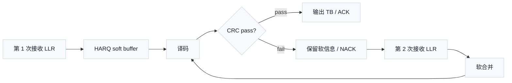

# T4.3 HARQ 软合并基础：跨重传累积译码证据
## 本节学习目标

本节讲 **混合自动重传请求** 和 **软合并（soft combining）**。HARQ（混合自动重传请求，Hybrid Automatic Repeat Request）不是简单的“错了再发一次”。它把自动重传请求的协议控制和信道编码的软信息利用结合起来：第一次译码失败后，接收端不一定丢掉已经收到的软信息，而是把后续重传带来的新证据合并进同一个 HARQ buffer，再尝试译码。

本节的核心是一个接收端问题：同一个传输块多次传输后，译码器输入的对数似然比应该怎样累积、放置和验收。这里先把几个会反复出现的名字一次说清楚：循环冗余校验负责判断候选译码结果是否满足校验规则；码块是 TB（传输块，Transport Block）过大时切出来的编码子块；低密度奇偶校验码、Turbo（Turbo 码，Turbo Code）和Polar（极化码，Polar Code）是后续译码器要处理的三类信道编码；调制与编码方案和传输块大小是调度侧给译码器配置长度、码率和调制阶数的重要来源；下行控制信息是下行调度里携带 HARQ process ID、RV（冗余版本，Redundancy Version）、MCS（调制与编码方案，Modulation and Coding Scheme）等字段的控制消息；寄存器传输级和专用集成电路则是把软缓存、地址生成和合并器落到硬件时使用的实现层级。


- 解释 HARQ、确认/否定确认（Acknowledgement/Negative Acknowledgement, ACK/NACK）、冗余版本（Redundancy Version, RV）和软缓存的关系。
- 区分 Chase combining 和 incremental redundancy 的直觉差异。
- 用一个 LLR（对数似然比，Log-Likelihood Ratio）数值例子说明为什么软合并通常是“证据相加”。
- 读懂 LTE TS 36.212 circular buffer/soft buffer/rvidx 与 NR TS 38.212 LDPC（低密度奇偶校验码，Low-Density Parity-Check Code）rate matching/RV 的接收端含义。
- 说明 TS 38.214 的 HARQ process、MCS/RV/TBS（传输块大小，Transport Block Size）过程如何成为译码器 descriptor 的来源。
- 说明软缓存位宽、饱和、HARQ process ID 和 CRC（循环冗余校验，Cyclic Redundancy Check）结果对 RTL（寄存器传输级，Register Transfer Level）/ASIC（专用集成电路，Application-Specific Integrated Circuit）的影响。
- 用块错误率随重传次数下降这一现象检查软合并是否产生收益。

## 前置知识检查

| 前置项 | 本节需要达到的程度 |
|:---|:---|
| LLR | 知道 LLR 正负号表示倾向，绝对值表示置信度。 |
| CRC（循环冗余校验，Cyclic Redundancy Check） | 知道循环冗余校验通过才表示译码结果可接受。 |
| TB/CB（码块，Code Block） | 知道 TB 是一次传输的上层数据单元，码块是信道编码内部分块。 |
| 速率匹配 | 知道编码器输出比特可能只发送其中一部分，接收端要做反向映射。 |
| 定点 LLR | 知道硬件中 LLR 会被量化和裁剪。 |

如果只记住一句话：HARQ 软合并是把同一个 HARQ process 中同一编码位置的多次接收证据合起来，让后一次译码站在前一次失败留下的软信息基础上继续尝试。

## 协议定位与本地证据

HARQ 软合并很容易被误解成一个“接收机自己想怎么加就怎么加”的算法。实际不是这样。接收机可以自行选择 LLR 位宽、饱和阈值和 soft buffer 物理组织，但它必须先服从协议给出的传输身份和比特位置：这是新 TB 还是旧 TB 的重传，属于哪个 HARQ process，使用哪个 RV，本次发了多少调制后比特，解速率匹配后每个 LLR 应该回填到哪个编码位置。下面的协议定位表不是让你背章节号，而是说明每个译码器 descriptor 字段从哪里来。

| 协议位置 | 本地证据 |
| :--- | :--- |
| LTE TS 36.212 Rel-19 `36212-j30` §5.1.4.1 | `3GPP_Rel19/processed/TS_36.212_36212-j30/content.md` |
| LTE TS 36.212 Rel-19 `36212-j30` §5.1.2 | `content.md` |
| NR TS 38.212 Rel-19 `38212-j30` §5.4.2 | `3GPP_Rel19/processed/TS_38.212_38212-j30/content.md` |
| NR TS 38.212 Rel-19 `38212-j30` §6.2/§7.2 | `content.md` |
| NR TS 38.214 Rel-19 `38214-j30` §5.1 | `3GPP_Rel19/processed/TS_38.214_38214-j30/content.md` |
| NR TS 38.214 Rel-19 `38214-j30` §5.1.3、§6.1.4 | `content.md`，`sections.jsonl` |

协议边界：3GPP 规定 RV、rate matching、HARQ process、TBS/MCS 等语义；接收端如何组织 soft buffer、LLR 位宽、合并饱和策略和重传调度队列，是实现设计，但必须与协议 descriptor 完全一致。

把这张表翻译成接收端语言，就是三条约束。第一，TS 36.212/38.212 决定“一个编码比特在 circular buffer 或 LDPC rate matching buffer 中的身份”。第二，TS 38.214 决定“本次调度到底取哪些身份的比特、归属哪个 HARQ process”。第三，CRC 结果决定“这些软信息是释放、保留还是等待下一次重传继续合并”。如果少了第一条，LLR 会放错位置；少了第二条，新旧 TB 会混到同一个缓存；少了第三条，失败传输留下的可用证据会被错误丢弃。

## HARQ 的基本角色

自动重传请求（Automatic Repeat Request, ARQ）只靠“错了再发”。前向纠错（Forward Error Correction, FEC）只靠“接收端自己纠错”。HARQ 把两者合在一起：先用纠错码尝试恢复，若 CRC fail，则通过 ACK/NACK 机制请求或等待重传；后续重传不只是重新来过，而是可以提供新的软信息。

为了避免把 HARQ 想成“重复下载同一份文件”，首先考察一个最小故事。接收端第一次收到某个 TB 后，译码器给出一串候选比特，但 CRC 失败。CRC 失败不等于本次接收完全没用：解调器输出的很多 LLR 可能方向是对的，只是置信度还不够，或者有一部分编码位置没有收到足够可靠的证据。HARQ 软合并的价值就在这里：保留失败传输中的软证据，让第二次传输补充它，而不是把第一次的努力全部归零。

这里有四个对象必须区分：

| 对象 | 它是什么 | 它不是什么 | 对接收端的后果 |
|:---|:---|:---|:---|
| HARQ process | 一条可并行等待确认或重传的传输上下文 | 不是译码算法名称 | 决定 soft buffer bank 和状态机槽位。 |
| RV | 本次传输选择编码冗余的版本编号 | 不是简单重传次数 | 决定解速率匹配地址和软合并位置。 |
| Soft buffer | 保存失败或未完成传输 LLR 的缓存 | 不是硬判决 bit 缓存 | 决定后续重传能否累积前次证据。 |
| CRC status | 译码候选是否通过错误检测 | 不是纠错算法本身 | 决定 ACK/NACK、释放缓存或保留缓存。 |

这四个对象连在一起，才是译码器看到的 HARQ。单独知道“CRC fail”不够，因为你还要知道该保留哪个 process 的缓存；单独知道“RV=2”也不够，因为你还要知道这是新数据还是旧 TB 的重传；单独知道“LLR 很大”仍然不够，因为如果地址放错，它会强化错误的编码位置。



ACK/NACK 是控制反馈，不是译码算法本身。译码器内部只知道 CRC pass/fail、HARQ process ID、RV、soft buffer 位置和当前可用 LLR；媒体接入控制层和物理层过程决定什么时候反馈、重传哪个 HARQ process。

## Chase 合并与增量冗余

HARQ 软合并常用两种直觉解释：

| 类型 | 英文 | 发送内容直觉 | 接收端合并直觉 |
|:---|:---|:---|:---|
| Chase 合并 | Chase combining | 多次发送相同或高度相同的编码比特 | 同一编码位置的 LLR 直接相加，提高置信度。 |
| 增量冗余 | Incremental Redundancy, IR | 不同 RV 发送不同编码比特子集 | 新 LLR 填入 soft buffer 的不同位置，已有位置可相加，整体码率随重传降低。 |

NR LDPC 和 LTE Turbo 的 rate matching 都有 circular buffer 思想。RV 的作用可以理解为：同一个编码码字很长，一次传输只能取其中一段或一组位置；不同 RV 从不同起点或按不同规则取比特，让接收端逐步看到更多冗余。

Chase 合并强调“同一位置重复观测”，所以最容易理解成 LLR 相加。增量冗余强调“不同位置逐步补齐”，所以更像把拼图逐次填完整。真实 LTE/NR rate matching 可能同时出现重复位置和新增位置：重复位置做加法，新增位置写入空位置，未收到的位置保留为擦除或低可靠度。接收端不能只按“第几次传输”猜位置，必须按协议 RV 规则反推每个接收 LLR 的编码位置。

一个 8 位置教学 circular buffer 可以说明这个差别。假设完整编码位置是 `0..7`，一次只能发送 4 个位置：

| RV | 教学发送位置 | 接收端动作 |
|:---|:---|:---|
| RV0 | `0,1,2,3` | 写入 soft buffer 前半部分。 |
| RV1 | `2,3,4,5` | 位置 `2,3` 与旧 LLR 相加，位置 `4,5` 新写入。 |
| RV2 | `4,5,6,7` | 继续补充后半部分。 |
| RV3 | `6,7,0,1` | 位置 `6,7` 新写入，位置 `0,1` 与旧 LLR 相加。 |

这不是 LTE/NR 的真实 RV 表，只是用最小例子解释“RV 改变的是编码位置集合”。真实 LTE Turbo 和 NR LDPC 必须回到 TS 36.212/38.212 的 rate matching 规则。

## LLR 软合并的数值例子

假设同一个编码比特对应原始 bit `0`。第一次接收得到：

$$
L_1=+0.8
\tag{1}
$$

这个值为正，表示更像 `0`，但置信度不强。第二次重传同一编码位置后得到：

$$
L_2=+1.1
\tag{2}
$$

如果两次观测的噪声近似独立，那么对数似然比可以相加：

$$
L_{\mathrm{combined}}=L_1+L_2=+1.9
\tag{3}
$$

式 (3) 回答的问题是：两次独立证据都支持 `0` 时，总证据有多强。若第二次接收反而支持 `1`：

$$
L_2=-0.6
\tag{4}
$$

则合并后：

$$
L_{\mathrm{combined}}=+0.8-0.6=+0.2
\tag{5}
$$

总证据仍略偏向 `0`，但置信度降低。这比硬判决更合理：硬判决只会看到“第一次 0、第二次 1”，无法表达谁更可靠。

## 协议中的 RV 与 circular buffer

LTE TS 36.212 §5.1.4.1 说明 Turbo coded transport channels 的 rate matching 包括三个 bit streams 的 sub-block interleaving、bit collection 和 circular buffer 生成。§5.1.4.1.2 进一步涉及 soft buffer size、CB 数量、`Ncb` 和 `rvidx`。协议文本中 `rvidx = 0,1,2,3` 用于 DL-SCH（下行共享信道，Downlink Shared Channel）/PCH 等传输。

NR TS 38.212 §5.4.2 对 LDPC rate matching 也使用 RV 概念。`rvid` 取值 `0,1,2,3`，并根据 LDPC base graph 和 Table 5.4.2.1-2 决定 rate matching 起点 `k0`。接收端反向操作必须知道同一个 RV，否则收到的 LLR 会放进错误 soft buffer 位置。

教学化地，可以把 rate matching 看成：

$$
\mathrm{tx\_bits}
=
\mathrm{select}(\mathrm{circular\_buffer}, RV, E)
\tag{6}
$$

接收端反向合并为：

$$
L_{\mathrm{buf}}[p]
\leftarrow
\mathrm{saturate}\left(L_{\mathrm{buf}}[p]+L_{\mathrm{rx}}[k]\right)
\tag{7}
$$

其中 $p$ 是由协议 rate matching 反向映射得到的编码位置，$k$ 是本次接收的第 $k$ 个 LLR。式 (7) 是工程实现公式，不是 3GPP 原文公式；3GPP 规定的是 $p$ 如何由 RV、rate matching、CB 和 buffer 规则决定。

## HARQ process 与 descriptor

TS 38.214 §5.1 说明下行每小区支持多个 HARQ process，且 UE 检测到 PDCCH（物理下行控制信道，Physical Downlink Control Channel）上的 DCI（下行控制信息，Downlink Control Information）后，按 DCI 指示接收对应 PDSCH（物理下行共享信道，Physical Downlink Shared Channel）；HARQ process ID 由 DCI 指示并在多 PDSCH 调度中按规则递增。对译码器来说，这些控制信息最终要落成 descriptor：

| 字段 | 来源 | 译码器用途 |
|:---|:---|:---|
| HARQ process ID | DCI/MAC（媒体接入控制层，Medium Access Control）/PHY procedure | 选择哪一个 soft buffer bank。 |
| RV | DCI 或配置授权等过程 | 决定解速率匹配位置和合并方式。 |
| MCS | 调制与编码方案字段 | 推导调制阶数、目标码率和 TBS。 |
| TBS | TS 38.214 TBS determination | 决定 TB CRC、CB segmentation 和输出长度。 |
| New Data Indicator | DCI 中的新数据指示 | 判断是清空 soft buffer 还是合并重传。 |
| CRC status | 译码结果 | 决定 ACK/NACK 和是否释放 soft buffer。 |

如果 HARQ process ID 错，接收端会把新传输合并到别的 TB；如果 RV 错，LLR 会放进错误编码位置；如果 New Data Indicator 错，可能把新数据和旧数据混合。这类错误通常表现为 CRC 长期 fail，而且 LLR 幅度看似很高，调试困难。

Descriptor 这个词在协议里未必按实现口径出现，但硬件和软件参考模型通常都需要这样一个结构。它把分散在 DCI、MAC 状态、TS 38.214 过程和 TS 38.212/36.212 rate matching 规则里的信息压成译码器一次调用能消费的输入。一个合格 descriptor 至少要回答五个问题：

| 问题 | descriptor 字段 | 答错后的典型现象 |
|:---|:---|:---|
| 这是不是新数据？ | NDI（新数据指示，New Data Indicator）、HARQ process state | 旧 LLR 污染新 TB，或重传收益消失。 |
| 属于哪个缓存槽？ | HARQ process ID、codeword/layer | 多进程串扰，偶发 CRC fail。 |
| 本次比特来自哪里？ | RV、E、Ncb、BG、Zc 或 Turbo 参数 | 解速率匹配错位。 |
| 译码器该输出多长？ | TBS、CB lengths、CRC length | 拼接长度错，TB CRC fail。 |
| 成功后释放什么？ | TB/CB/CBG（码块组，Code Block Group）status | buffer 泄漏或提前释放。 |

协议精读的目的不是把这些字段名字列出来，而是让每个字段都能落到一个接收端动作。只要某个协议字段不能解释成“清空、保留、寻址、合并、译码、检查、反馈”中的一个动作，就说明本节还没有真正读懂它。

## 接收端流程

1. PDCCH/DCI 或上行授权给出 HARQ process ID、RV、MCS、资源和新数据指示。
2. 接收端根据 MCS/TBS 和 TS 36.212/38.212 分段规则建立 TB/CB descriptor。
3. 若是新数据，清空对应 HARQ soft buffer；若是重传，保留旧 soft buffer。
4. 解调器输出本次传输的 LLR。
5. 解速率匹配根据 RV 和 rate matching 规则把 LLR 映射到编码位置。
6. 对同一编码位置执行软合并，通常是饱和加法。
7. 对每个 CB 运行 Turbo/LDPC/Polar 译码。
8. 检查 CB CRC/TB CRC 或控制信息 CRC。
9. CRC pass：输出 payload，释放或标记 soft buffer；CRC fail：保留 soft buffer 等待后续重传或超时丢弃。

## 伪代码

```python
def saturating_add(a, b, limit):
    """Saturating LLR add. Time: O(1), Space: O(1)."""
    value = a + b
    if value > limit:
        return limit
    if value < -limit:
        return -limit
    return value


def combine_llrs(buffer, rx_llrs, positions, limit=7.5):
    """Combine received LLRs into a HARQ soft buffer.

    Time: O(E), Space: O(1) besides the buffer.
    """
    for llr, pos in zip(rx_llrs, positions):
        buffer[pos] = saturating_add(buffer[pos], llr, limit)
    return buffer


soft_buffer = [0.0, 0.0, 0.0, 0.0]
combine_llrs(soft_buffer, [0.8, -0.2], [0, 2])
combine_llrs(soft_buffer, [1.1, 0.5], [0, 1])
expected = [1.9, 0.5, -0.2, 0.0]
assert all(abs(a - b) < 1e-12 for a, b in zip(soft_buffer, expected))
print("T4.3_HARQ_SOFT_COMBINING_OK")
```

这个伪代码不实现真实 LTE/NR rate matching，只验证“相同编码位置的 LLR 需要累积，且累积要有饱和保护”。

## 工业用例

| 用例 | 输入 | 输出 | 边界条件 | 失败案例 | 验证方式 |
|:---|:---|:---|:---|:---|:---|
| NR PDSCH LDPC HARQ | HARQ process ID、RV、MCS/TBS、PDSCH LLR | 合并后 CB LLR、TB CRC status | 多 CB、CBG、RV 切换、新数据指示 | RV 反匹配错位，LLR 高但 CRC fail | RV sweep、known vector、soft buffer dump。 |
| LTE Turbo DL-SCH HARQ | `rvidx`、Turbo circular buffer 参数、码块 LLR | 合并后 Turbo 输入 LLR、TB CRC status | Nsoft/Ncb 限制、不同 UE category、slot/subslot 重传 | Ncb 计算错导致软缓存覆盖 | 与 TS 36.212 §5.1.4.1 descriptor 比对。 |

## 浮点仿真方案

| 仿真项 | 方法 | 通过条件 |
|:---|:---|:---|
| LLR 加法 | 构造同一位置两次接收 LLR | 合并值等于两次 LLR 之和。 |
| 冲突证据 | 一正一负 LLR 合并 | 合并后绝对值下降。 |
| 饱和保护 | 多次大 LLR 合并 | 输出不超过设定 limit。 |
| RV 映射 | toy circular buffer 不同起点 | 不同 RV 写入不同位置，重复位置执行加法。 |

建议命令：

```bash
python3 - <<'PY'
buf = [0.0, 0.0, 0.0]
for pos, llr in [(0, 0.8), (0, 1.1), (1, -0.4)]:
    buf[pos] += llr
assert abs(buf[0] - 1.9) < 1e-9
assert abs(buf[1] + 0.4) < 1e-9
print("T4.3_FLOAT_COMBINE_OK")
PY
```

## 定点化策略

| 对象 | 风险 | 策略 |
|:---|:---|:---|
| Soft buffer LLR | 多次合并后溢出 | 使用饱和加法，记录 saturation counter。 |
| HARQ process bank | process ID 错选 | descriptor 加 parity/checksum，仿真覆盖所有 process。 |
| RV positions | 反匹配错位 | 用 known vector 验证 RV0/1/2/3 位置。 |
| New Data Indicator | 旧数据未清空或重传被清空 | 新传/重传状态机单独验证。 |
| CB/TB CRC | 错误释放 buffer | CRC pass 才释放对应 TB；CBG 场景按协议分组处理。 |

静态随机存取存储器中的 soft buffer 往往是面积大户。位宽越大，合并越稳但面积越大；位宽越小，容易饱和或损失弱证据。定点仿真必须扫描重传次数和 SNR（信噪比，Signal-to-Noise Ratio），不能只看一次传输。

## 硬件实现映射

| 模块 | 输入 | 输出 | 关键风险 |
|:---|:---|:---|:---|
| HARQ descriptor table | process ID、RV、MCS、NDI | buffer address、rate recovery config | process bank 错选。 |
| Rate recovery address generator | RV、CB index、E、Ncb | soft buffer write positions | circular buffer 起点错。 |
| Saturating combiner | old LLR、new LLR | combined LLR | 溢出、符号位错误。 |
| Soft buffer SRAM（静态随机存取存储器，Static Random-Access Memory） | combined LLR | decoder input LLR | 多端口带宽不足。 |
| CRC/HARQ controller | CRC status、max retransmission | ACK/NACK、release/keep buffer | CRC fail 后错误释放。 |

寄存器传输级实现中，soft buffer 需要按 HARQ process、TB/CB、layer/codeword 和 RV 组织地址。专用集成电路设计要在 SRAM 容量、读写带宽、时钟频率和最大 HARQ process 数之间折中。

## 验证方法

| 验证层级 | 检查内容 | 通过标准 |
|:---|:---|:---|
| 单元测试 | LLR saturating add | 正负、饱和和零输入全部正确。 |
| 单元测试 | RV address generation | RV0/1/2/3 位置与参考模型一致。 |
| 集成测试 | New Data Indicator | 新数据清空 buffer，重传保留 buffer。 |
| 集成测试 | CRC fail/pass | fail 保留 soft buffer，pass 释放或提交。 |
| 压力测试 | 多 HARQ process 并发 | 不串 bank、不覆盖未完成 TB。 |
| 性能测试 | BLER（块错误率，Block Error Rate）vs retransmission count | 合并后块错误率随重传下降。 |

## 常见错误

| 错误 | 后果 | 修正 |
|:---|:---|:---|
| 硬判决后再合并 | 丢失可靠度信息 | 合并 LLR，不合并 hard bit。 |
| RV 反匹配错 | 新证据写入错误位置 | RV address generator 做 bit-exact 测试。 |
| 新数据未清空旧 buffer | 不同 TB 软信息混合 | NDI 变化时强制清空对应 process。 |
| 饱和计数不记录 | 定点性能退化难定位 | 输出 saturation counter 和 LLR histogram。 |
| CRC fail 后释放 buffer | 后续重传无法合并 | fail 保留，pass 才释放。 |

## 工程思考题

1. 为什么 HARQ 软合并通常合并 LLR，而不是合并硬判决？
2. Chase combining 和 incremental redundancy 的直觉差异是什么？
3. RV 错误会造成什么接收端后果？
4. New Data Indicator 错误为什么危险？
5. Soft buffer 位宽过小会怎样影响 BLER？

## 工程思考题参考答案

1. LLR 保留方向和可靠度，硬判决只保留 `0/1`，无法表达两次接收谁更可信。
2. Chase combining 更像重复发送相同证据并相加；incremental redundancy 通过不同 RV 提供不同编码位置，让接收端看到更多冗余。
3. LLR 会写入错误编码位置，译码器利用的是错位证据，通常表现为 CRC 长期 fail。
4. NDI 决定清空还是保留 soft buffer。若新数据未清空，会混入旧 TB；若重传被清空，会丢掉前次证据。
5. 位宽过小会导致饱和或量化噪声增大，多次重传的可靠度无法正确累积，BLER 曲线收益变差。

## 自测题

1. HARQ 中 ACK/NACK 表示什么？
2. 同一编码位置两次独立接收的 LLR 为什么可以相加？
3. RV 在 rate matching 中主要影响什么？
4. CRC fail 后 soft buffer 应该保留还是释放？
5. TS 38.214 的 MCS/TBS/RV 信息对译码器有什么用？

## 自测题参考答案

1. ACK 表示接收成功确认，NACK 表示接收失败否定确认。
2. LLR 是对数似然比，独立证据的似然相乘，对数域中变成相加。
3. RV 影响从 circular buffer 或 LDPC rate matching buffer 中选择哪些编码位置发送和接收端反向放置。
4. 应该保留，等待后续重传继续软合并；除非达到最大重传或协议状态要求丢弃。
5. 它们共同决定调制阶数、码率、TBS、分段、soft buffer 位置、HARQ process 和译码器配置。

## 本节验收

| 验收项 | 通过标准 |
|:---|:---|
| 概念理解 | 能解释 HARQ、RV、soft buffer、ACK/NACK 和 CRC 的关系。 |
| 数值能力 | 能手算两个 LLR 的合并结果。 |
| 协议精读 | 能指出 LTE TS 36.212 §5.1.4.1 和 NR TS 38.212 §5.4.2 与 RV/circular buffer 的关系。 |
| 工程落地 | 能说明 HARQ process ID、NDI、RV 和 CRC status 如何控制 soft buffer。 |

## 资料与协议边界

本节精读协议中的 HARQ 软合并相关入口，但没有复现完整 LTE Turbo rate matching 表、NR LDPC Table 5.4.2.1-2 或 TS 38.214 MCS/TBS 表。正文中的 LLR 加法和饱和合并公式是接收端工程模型，用于解释软合并，不是 3GPP 原文公式。

后续 HARQ 专章需要完整复现 RV 起点表、TBS/MCS 表子集、CBG 规则和多进程调度边界。本节只建立零基础理论和译码器接口语义。

## 协议证据表

| 证据 | 状态 | 本节结论 |
|:---|:---|:---|
| LTE TS 36.212 §5.1.4.1 | 已定位 | Turbo rate matching 使用 circular buffer，涉及 soft buffer size 和 `rvidx`。 |
| NR TS 38.212 §5.4.2 | 已定位 | LDPC rate matching 使用 RV 和 `k0` 起点，RV 取值 `0,1,2,3`。 |
| NR TS 38.214 §5.1 | 已定位 | PDSCH 接收过程包含 HARQ process 数量、DCI 调度和 HARQ process ID。 |
| NR TS 38.214 §5.1.3/§6.1.4 | 已定位 | 下行/上行 modulation order、target code rate、RV 和 TBS 确定入口。 |
## 执行与证据记录

| 项目 | 记录 |
|:---|:---|
| 本地协议检索 | 使用 `sed`/`rg` 检索 TS 36.212 §5.1.4.1、TS 38.212 §5.4.2、TS 38.214 §5.1 和 §5.1.3/§6.1.4。 |
| 教学公式 | 自写 LLR soft combining 和 saturating add 公式；标注为工程模型。 |
| Python 验证 | 提供 soft buffer 合并和浮点 LLR 加法验证命令。 |
| 未覆盖内容 | 未复现完整 RV 表、MCS/TBS 表、CBG 规则和真实 bit-exact rate recovery。 |

## 参考文献

- [3GPP, 2026a] 3GPP TS 36.212, Rel-19, `36212-j30`, Multiplexing and channel coding, §5.1.2, §5.1.4.1. Local path: `3GPP_Rel19/processed/TS_36.212_36212-j30`.
- [3GPP, 2026b] 3GPP TS 38.212, Rel-19, `38212-j30`, Multiplexing and channel coding, §5.4.2, §6.2, §7.2. Local path: `3GPP_Rel19/processed/TS_38.212_38212-j30`.
- [3GPP, 2026c] 3GPP TS 38.214, Rel-19, `38214-j30`, Physical layer procedures for data, §5.1, §5.1.3, §6.1.4. Local path: `3GPP_Rel19/processed/TS_38.214_38214-j30`.
