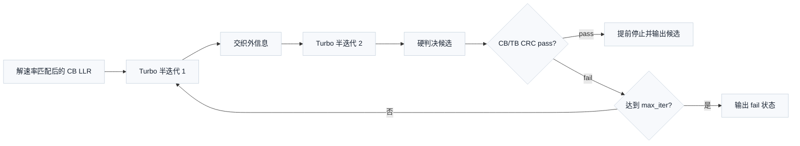
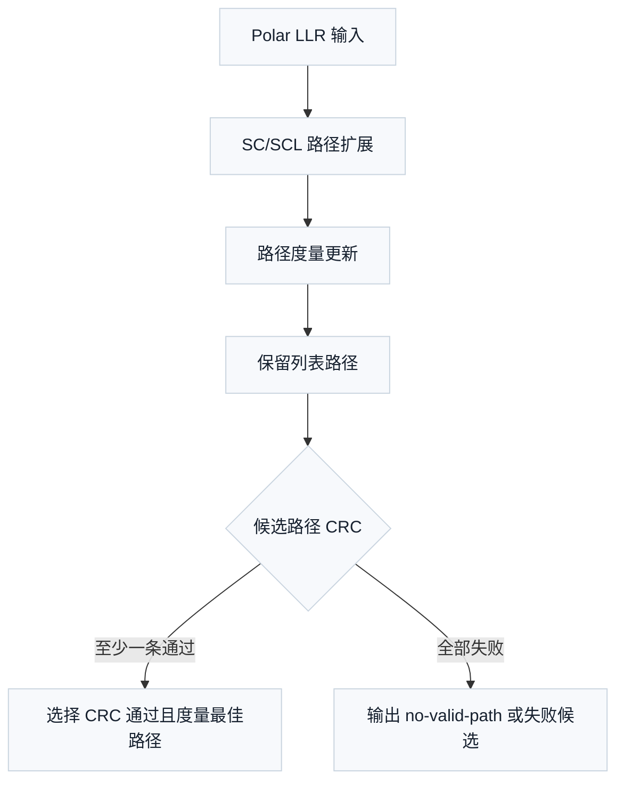
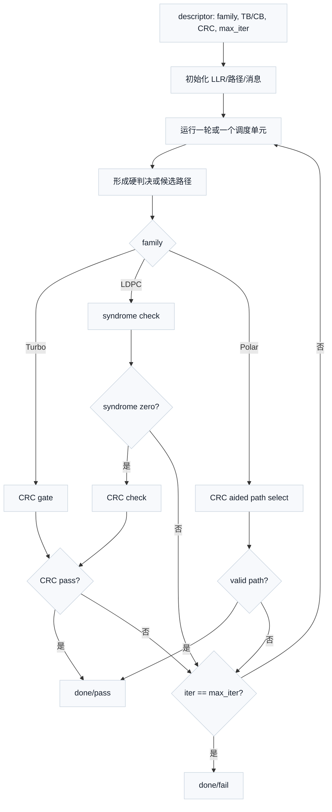
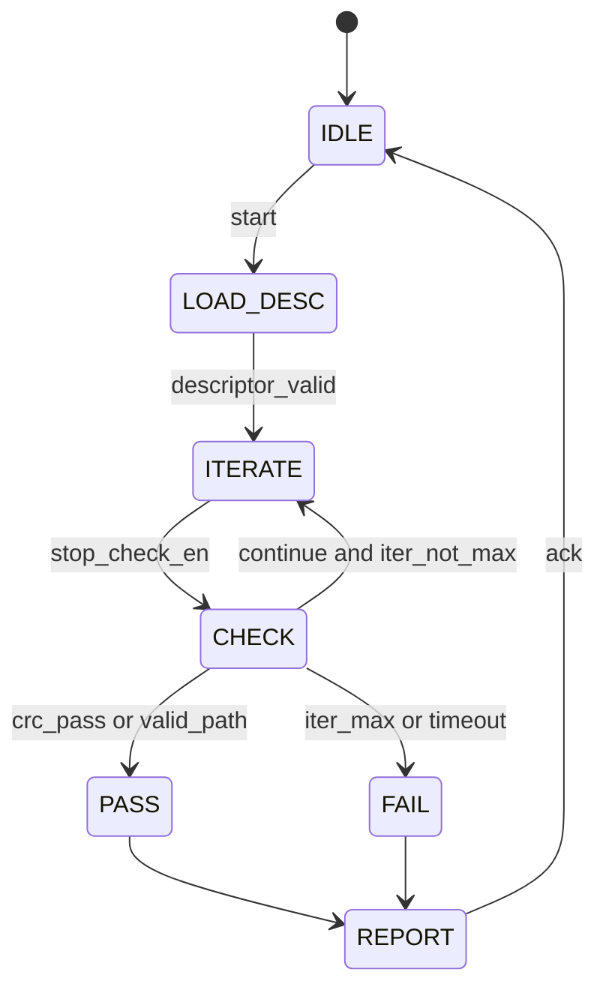

# T4.4 早停与 CRC 门控译码控制：用校验结果节省迭代、延迟和功耗
## 本节学习目标

本节讲译码早停控制。早停不是一种新的信道编码，也不是 3GPP 直接规定的“第几轮必须停”。它是接收机实现策略：译码器每运行一轮或若干轮，就检查当前候选比特是否已经满足足够强的校验条件；如果满足，就提前结束，节省计算、时延和功耗。

本节第一次出现的技术缩写先统一展开：循环冗余校验是错误检测规则；对数似然比是译码器输入的软信息；传输块是物理层一次处理的主要数据单元；码块是 TB 分段后的译码子块；混合自动重传请求决定译码失败后的重传和软合并；Turbo、低密度奇偶校验码和Polar是本课程关注的三类编码；寄存器传输级和专用集成电路是硬件落地层级。


- 解释奇偶校验、syndrome 和 CRC 如何给译码器提供停止线索。
- 区分算法停止策略（algorithmic stopping）、CRC 门控停止、校验综合（syndrome）停止和 CRC 辅助路径选择。
- 对比 Turbo、LDPC 和 Polar 三类译码器的停止对象和风险。
- 用一个可手算例子判断 syndrome 是否为零，并说明为什么仍要用 CRC 做最终验收。
- 说明 CRC 误通过风险为什么存在，以及工程上怎样降低它的影响。
- 把停止控制映射到浮点仿真、定点模型、RTL/ASIC 状态机和验证覆盖点。

如果只记住一句话：协议给出 CRC、分段和编码结构这些锚点；接收机用这些锚点设计早停控制，但具体第几轮检查、检查哪些条件、是否继续迭代，是实现策略。

## 前置知识检查

| 前置项 | 本节需要达到的程度 |
|:---|:---|
| 二元有限域（Galois Field with 2 elements, GF(2)）异或 | 知道 `0 xor 0 = 0`、`1 xor 1 = 0`、`0 xor 1 = 1`。 |
| 奇偶校验 | 知道一组比特异或和为 `0` 表示偶校验通过。 |
| CRC | 知道它检测错误但不定位错误，也不能把错误改正。 |
| LLR | 知道正负号表示更像 `0` 或 `1`，绝对值表示置信度。 |
| 迭代译码 | 知道译码器可以多轮更新置信度，直到通过校验或达到最大轮数。 |

本节会重新解释这些概念，不要求读者已经会矩阵、概率或硬件状态机。矩阵只当作“把多条异或关系排成表”的记号使用。

## 协议定位与本地证据

早停控制必须先分清协议锚点和实现策略。3GPP 的 TS 36.212/38.212 规定的是编码、分段、CRC、速率匹配和连接关系；TS 38.214 给出调度、调制编码和 HARQ 相关的过程入口。它们不规定厂商的 Turbo 最大迭代次数、LDPC syndrome 检查周期、Polar 列表大小或 CRC 早停门限。

下面的协议表还会出现几类对象：上行共享信道和下行共享信道承载数据 TB；下行控制信息和上行控制信息承载调度、反馈或控制负载；调制与编码方案与传输块大小决定译码器描述符（descriptor）中的长度、码率和处理预算。

| 协议位置 | 本地证据 |
| :--- | :--- |
| TS 36.212 Rel-19 `36212-j30` §5.1.1 | `3GPP_Rel19/processed/TS_36.212_36212-j30/content.md` |
| TS 36.212 Rel-19 `36212-j30` §5.1.2 | `3GPP_Rel19/processed/TS_36.212_36212-j30/content.md` |
| TS 36.212 Rel-19 `36212-j30` §5.1.3.2、§5.2.2、§5.3.2 | `3GPP_Rel19/processed/TS_36.212_36212-j30/content.md` |
| TS 38.212 Rel-19 `38212-j30` §5.1、§5.2.2、§5.3.2 | `3GPP_Rel19/processed/TS_38.212_38212-j30/content.md` |
| TS 38.212 Rel-19 `38212-j30` §6.2.1、§6.2.3、§7.2.1、§7.2.3 | `3GPP_Rel19/processed/TS_38.212_38212-j30/content.md` |
| TS 38.212 Rel-19 `38212-j30` §5.2.1、§5.3.1、§7.3.2、§8.3.2、§8.4.2 | `3GPP_Rel19/processed/TS_38.212_38212-j30/content.md` |
| TS 38.214 Rel-19 `38214-j30` §5.1、§5.1.3、§6.1.4 | `3GPP_Rel19/processed/TS_38.214_38214-j30/content.md` |

协议前因后果可以概括为三层。第一，发送端附加 TB/CB/控制信息 CRC，并按 Turbo、LDPC 或 Polar 结构编码。第二，接收端按相同结构译码，得到候选比特。第三，接收端用 CRC、syndrome 或路径 CRC 结果决定“继续算、提前停、输出通过、输出失败、保留 HARQ 软缓存”。其中第三层的控制动作是实现设计，但它必须受第一层协议对象边界约束。

## 校验结果作为停止证据

译码器为什么能早停？因为纠错码不是任意比特串。发送端构造出来的码字必须满足某些规则。接收端每一轮迭代后都可以问一个问题：

```text
当前硬判决候选是否已经满足这些规则？
```

最简单的规则是奇偶校验。若三个比特满足偶校验：

$$
b_0 \oplus b_1 \oplus b_2 = 0
\tag{1}
$$

式 (1) 回答的问题是：这三个比特的 `1` 的个数是否为偶数。符号 $\oplus$ 表示 GF(2) 异或，也就是二元有限域里的加法。只要结果为 `0`，这条校验通过；结果为 `1`，这条校验失败。

多条奇偶校验可以排成一个矩阵。为了零基础理解，可以先把矩阵看成“每一行是一条校验规则，每一列对应一个比特”。下面这个教学矩阵有两条校验、四个比特：

$$
\mathbf{H}
=
\begin{bmatrix}
1 & 1 & 1 & 0 \\
0 & 1 & 1 & 1
\end{bmatrix}
\tag{2}
$$

第一行表示 $b_0\oplus b_1\oplus b_2=0$，第二行表示 $b_1\oplus b_2\oplus b_3=0$。把硬判决向量写成：

$$
\hat{\mathbf{b}}=[0,0,1,0]
\tag{3}
$$

则两个校验的结果是：

$$
s_0=0\oplus0\oplus1=1
\tag{4}
$$

$$
s_1=0\oplus1\oplus0=1
\tag{5}
$$

向量 $\mathbf{s}=[1,1]$ 称为校验综合（syndrome）。本节后面简称 syndrome。syndrome 为零表示所有奇偶校验都通过；非零表示至少有一条校验不满足。LDPC 译码器最常用的早停线索就是 syndrome 为零。

但 syndrome 不是全部。CRC 是另一种错误检测规则，它通常作用在信息比特或协议定义的 TB/CB/control payload 上。CRC 通过说明候选比特满足发送端附加的 CRC 余数规则；CRC 失败说明候选不能被接受。早停控制常把 syndrome 和 CRC 组合起来：syndrome 检查编码约束，CRC 检查协议负载边界。

## 手算例子：syndrome 与 CRC 门控

首先考察一个 syndrome 手算例子。仍用式 (2) 的两条校验。若下一轮译码把候选改成：

$$
\hat{\mathbf{b}}=[0,0,0,0]
\tag{6}
$$

则两条校验为：

$$
s_0=0\oplus0\oplus0=0,\quad s_1=0\oplus0\oplus0=0
\tag{7}
$$

syndrome 为零，说明这个候选满足当前两条奇偶校验。若这是一个 LDPC 教学码，译码器可以把 `syndrome_zero=True` 作为停止条件之一。

再看一个 CRC 教学例子。取教学 CRC-3 生成多项式：

$$
g(D)=D^3+D+1
\tag{8}
$$

二进制写成 `1011`，消息取 `1101`。发送端在消息后补 3 个零后做 GF(2) 除法，余数为 `001`，完整码字为：

```text
1101001
```

接收端若候选仍是 `1101001`，重新除以 `1011` 得到余数 `000`，CRC 通过。若某次错误把候选改成 `1001001`，余数不再为 `000`，CRC 失败。这个 CRC-3 只是教学例子，不是 LTE/NR 协议多项式；真实接收机必须使用 TS 36.212/38.212 规定的生成多项式和对象边界。

这两个例子说明早停控制的基本逻辑：

| 检查结果 | 可以得出的结论 | 不能得出的结论 |
|:---|:---|:---|
| syndrome 非零 | 当前码字违反奇偶校验，不能接受。 | 不能直接知道哪个比特错。 |
| syndrome 为零 | 当前码字满足编码校验。 | 不能证明 payload 一定正确。 |
| CRC 失败 | 当前候选违反协议错误检测规则。 | 不能说明迭代再跑一定能成功。 |
| CRC 通过 | 当前候选未被 CRC 检出错误。 | 不能证明绝对无错，因为 CRC 有漏检概率。 |

## 算法停止策略的边界

算法停止策略（algorithmic stopping）指接收机内部的停止策略。它通常由三类条件组成：

| 条件 | 含义 | 协议属性 |
|:---|:---|:---|
| `iter >= max_iter` | 达到最大迭代次数，必须停止以满足时延预算。 | 实现策略。 |
| `syndrome == 0` | 当前硬判决满足奇偶校验矩阵。 | 利用协议编码结构，但检查周期和组合方式是实现策略。 |
| `crc_pass == True` | 当前候选满足 CRC 规则。 | CRC 规则和对象边界是协议锚点；用它早停是实现策略。 |

CRC、分段和编码结构是协议锚点。早停控制器读取这些锚点：一个 TB 是否分成多个 CB、每个 CB 是否有 CB CRC、最终是否有 TB CRC、Polar 控制信息 CRC 在哪里、LDPC 校验矩阵如何构造。控制器在这些锚点上做实现选择：每轮检查还是隔轮检查、先查 syndrome 还是先查 CRC、CB 局部通过后是否冻结该 CB、Polar 多条路径中先按路径度量还是先按 CRC 过滤。

把二者混淆会产生严重工程错误。若把“CRC 通过就可以早停”写成协议硬要求，测试会无法覆盖不同厂商策略。若把“CRC 多项式和 CB 边界”当作厂商可选项，接收机会和发送端不匹配。

## Turbo CRC 门控停止

Turbo 译码通常在两个软输入软输出译码器之间交换外信息。每一轮后，译码器可以形成信息比特的硬判决，再运行 CRC 检查。若 CRC 通过，就可以提前停止，不必跑完最大迭代次数。



LTE 的协议锚点是 TS 36.212 §5.1.2 的 CB 分段和 CB CRC、§5.1.3.2 的 Turbo 编码结构，以及 §5.2.2/§5.3.2 中 UL-SCH/DL-SCH 处理链路。接收端必须按这些边界恢复每个 CB，再检查相应 CRC。至于“第 2 轮以后才允许查 CRC”“每一整轮查一次还是每半轮查一次”“CB CRC 通过后是否停止该 CB”，都属于实现策略。

Turbo 的早停直觉是：若当前迭代已经恢复出满足 CRC 的候选，再继续交换外信息通常只会增加延迟和功耗。但它也有两个风险。第一，CRC 可能误通过，尤其在低信噪比、候选仍很差时，某个错误模式可能碰巧满足 CRC。第二，过早只看 CB CRC 可能掩盖拼接、filler 删除或 TB 层顺序错误，所以最终 TB CRC 仍然重要。

## LDPC Syndrome/CRC 停止

LDPC 译码围绕奇偶校验矩阵做消息传递。每轮或每个分层扫描（layered sweep）后，接收端可以从后验 LLR（posterior LLR）做硬判决，并计算：

$$
\mathbf{s}=\mathbf{H}\hat{\mathbf{b}}^T \pmod 2
\tag{9}
$$

式 (9) 回答的问题是：当前候选码字是否满足 LDPC 校验矩阵 $\mathbf{H}$ 的所有行。若 $\mathbf{s}=\mathbf{0}$，说明编码约束已经满足；若存在非零元素，说明至少一条校验失败。

NR 的协议锚点是 TS 38.212 §5.2.2 的 LDPC code block segmentation 和 CB CRC attachment、§5.3.2 的 LDPC coding、§6.2/§7.2 的 UL-SCH/DL-SCH TB CRC、base graph selection、CB segmentation、LDPC encoding 和 rate matching 前后关系。接收端从这些章节得到 base graph、lifting size、CB 数量、CB 长度和 CRC 位置。syndrome 检查利用 LDPC 校验结构，但 syndrome 检查周期、是否配合 CRC、是否在 layered schedule 中间检查，不是 3GPP 强制算法。

LDPC 常见停止策略有三种：

| 策略 | 停止条件 | 优点 | 风险 |
|:---|:---|:---|:---|
| syndrome-only | $\mathbf{s}=\mathbf{0}$ | 低成本，直接利用 LDPC 结构。 | 码字满足校验但 payload 仍可能因边界处理错误或少数未检错误而不可接受。 |
| CRC-only | CB/TB CRC pass | 与协议验收一致。 | 若每轮都跑长 CRC，功耗和时延增加；CRC 失败不能指出消息传递哪里不收敛。 |
| syndrome + CRC | syndrome 为零后再检查 CRC，二者通过才停 | 工程上更稳，便于定位。 | 控制复杂度更高，要定义两者不一致时的处理。 |

一个重要调试场景是 syndrome 为零但 CRC 失败。这通常说明候选是某个合法码字，但不是发送端那个合法码字，或者接收端在 filler、CB CRC 去除、bit order、rate recovery 地址上出错。另一个场景是 CRC 通过但 syndrome 非零，这在严格一致的 CB 级检查里应被视为危险信号，常见根因是 CRC 检查对象切片错误、syndrome 矩阵和 rate recovery 输出顺序不一致，或控制器把上一次候选的 CRC 状态误用了。

## Polar CRC 辅助路径选择

Polar 译码的早停语义和 Turbo/LDPC 不完全一样。特别是列表译码中，接收端可能同时保留多条候选路径。CRC 不只是“最后通过/失败”，还可以参与候选路径选择：在多条路径中，优先选择 CRC 通过的路径；若多条都通过，再用路径度量等规则排序；若没有路径通过，则输出失败或按实现策略选择最可信失败候选用于调试。



NR 的协议锚点包括 TS 38.212 §5.2.1 的 Polar code block segmentation、§5.3.1 的 Polar encoding、§7.3.2 的 DCI CRC attachment，以及 §8.3.2/§8.4.2 的 UCI CRC attachment 入口。控制信息常见特点是 payload 较短、时延预算紧、候选检测敏感；CRC 在这里同时承担错误检测和路径筛选帮助。列表大小、路径度量公式、何时做 CRC 检查和多路径并列处理，仍是接收端算法实现策略。

Polar 的 CRC 误通过风险更直观：列表里可能有一条错误路径的路径度量很好，另一条正确路径的度量略差；如果错误路径碰巧 CRC 通过，而正确路径因噪声和剪枝不在列表中，接收端会接受错误控制信息。控制信息一旦误接收，可能导致错误调度、错误 HARQ 反馈或错误资源解释，所以 Polar 专题必须把误检率和漏检率作为验证重点。

## CRC 误通过定性失败案例

CRC 误通过不是实现 bug 的同义词，它是错误检测码的有限能力带来的概率事件。CRC 长度为 $L$ 时，粗略直觉是随机错误候选碰巧通过的概率约随 $2^{-L}$ 降低。这个数不是本节的精确性能公式，因为真实错误模式不一定均匀随机；它只帮助理解“CRC 越长，随机误通过越少，但永远不是零”。

考虑一个低信噪比数据块。Turbo 译码第 2 轮后得到一个候选，里面仍有多个错误比特，但这些错误刚好构成 CRC 无法检测的模式。控制器看到 CB CRC pass，于是提前停止。后续 TB CRC 若存在并覆盖最终拼接结果，可能挡住这次错误；若检查对象切错、TB CRC 未正确运行，错误 payload 就可能被交付。

再考虑 Polar DCI 候选检测。接收端列表中有 8 条路径，其中错误路径 `P3` 的路径度量最好并且 CRC 通过，正确路径因为早期剪枝已经不在列表中。接收端选择 `P3`，得到一个看似有效的 DCI。后果不是“一个数据 bit 错了”这么简单，而是后续 PDSCH 资源、MCS、RV 或 HARQ process 解释都可能错。工程上必须通过候选搜索空间、CRC 掩码、路径度量、列表大小和误检率仿真一起控制风险。

## 接收端控制流程



本节结构是接收端实现图，不是 3GPP 协议图。协议决定 descriptor 中的家族、长度、CRC 类型、CB/TB 边界、rate recovery 参数和 HARQ 上下文；实现决定控制状态机怎样使用这些字段。

## 伪代码

```python
def parity_syndrome(bits, checks):
    """Return one syndrome bit per parity check.

    Time: O(E), where E is the number of edges in the toy check graph.
    Space: O(M), where M is the number of checks.
    """
    result = []
    for check in checks:
        value = 0
        for idx in check:
            value ^= bits[idx]
        result.append(value)
    return result


def toy_crc_remainder(bits, generator):
    """GF(2) CRC remainder for teaching only.

    Time: O(N * R), Space: O(N + R).
    """
    work = [int(b) for b in bits]
    gen = [int(b) for b in generator]
    r = len(gen) - 1
    for i in range(len(work) - r):
        if work[i] == 0:
            continue
        for j, gj in enumerate(gen):
            work[i + j] ^= gj
    return "".join(str(b) for b in work[-r:])


def should_stop_ldpc(candidate_bits, checks, crc_bits, crc_generator):
    """Toy LDPC stop rule: syndrome must be zero and CRC must pass.

    Time: O(E + N * R), Space: O(M + N + R).
    """
    syn = parity_syndrome(candidate_bits, checks)
    if any(syn):
        return False, "continue_syndrome_nonzero"
    codeword = "".join(str(b) for b in crc_bits)
    if toy_crc_remainder(codeword, crc_generator) != "0" * (len(crc_generator) - 1):
        return False, "continue_crc_fail"
    return True, "stop_pass"


checks = [[0, 1, 2], [1, 2, 3]]
assert parity_syndrome([0, 0, 1, 0], checks) == [1, 1]
assert parity_syndrome([0, 0, 0, 0], checks) == [0, 0]
assert toy_crc_remainder("1101001", "1011") == "000"
print("T4.4_EARLY_STOP_TOY_OK")
```

这个伪代码只验证控制思想，不实现真实 NR LDPC、LTE Turbo 或 NR Polar。真实工程模型必须替换为协议一致的 CRC、多块分段、bit order、rate recovery、LDPC base graph 和 Polar 可靠性序列。

## 浮点仿真方案

| 仿真项 | 方法 | 输出 | 通过条件 |
|:---|:---|:---|:---|
| syndrome 手算一致性 | 固定式 (2) 的 toy checks 和两组候选 | syndrome trace | `[1,1]` 与 `[0,0]` 和手算一致。 |
| CRC 教学一致性 | 固定 CRC-3 码字 `1101001` | remainder | 正确码字余数为 `000`，翻转后非零。 |
| Turbo 迭代扫描 | 固定随机种子、同一信道样本，开启/关闭 CRC early stop | 平均迭代次数、通过率、块错误率 | 早停不提高错误接受率，平均迭代次数下降。 |
| LDPC 停止策略对比 | syndrome-only、CRC-only、syndrome+CRC 三组配置 | syndrome/CRC trace、BLER、平均层数 | syndrome+CRC 的不一致案例可被日志定位。 |
| Polar 列表扫描 | 扫列表大小和 CRC 辅助选择 | valid path count、误检率、漏检率、延迟代理 | 列表增大时漏检下降；误检率必须低于项目门限。 |

建议命令：

```bash
python3 - <<'PY'
def syndrome(bits, checks):
    return [sum(bits[i] for i in check) % 2 for check in checks]

def crc_rem(bits, gen):
    w = [int(x) for x in bits]
    g = [int(x) for x in gen]
    r = len(g) - 1
    for i in range(len(w) - r):
        if w[i]:
            for j, gj in enumerate(g):
                w[i + j] ^= gj
    return ''.join(str(x) for x in w[-r:])

checks = [[0, 1, 2], [1, 2, 3]]
assert syndrome([0, 0, 1, 0], checks) == [1, 1]
assert syndrome([0, 0, 0, 0], checks) == [0, 0]
assert crc_rem("1101001", "1011") == "000"
assert crc_rem("1001001", "1011") != "000"
print("T4.4_FLOAT_STOP_CONTROL_OK")
PY
```

可复现设置建议：Python 3，固定随机种子 `20260620`，输出 CSV 字段包含 `family, snr_db, max_iter, stop_reason, iter_used, syndrome_zero, crc_pass, accepted`。真实链路仿真还应输出每个 CB 的停止轮数和 HARQ process 状态。

## 定点化风险

早停控制本身多为布尔逻辑，但它依赖的 LLR、路径度量和消息更新通常是定点数。定点风险会改变停止时机。

| 对象 | 风险 | 后果 | 策略 |
|:---|:---|:---|:---|
| LLR 饱和 | 强证据全部卡在最大值 | syndrome 可能迟迟不变，或错误候选显得过度可靠 | 记录 clipping counter 和 LLR histogram。 |
| LDPC Min-Sum 消息 | 归一化/offset 量化过粗 | syndrome 收敛变慢，早停收益消失 | 浮点、定点逐轮 syndrome trace 比对。 |
| Turbo 外信息 | 位宽不足或重复计数 | CRC fail 长期存在，或过早出现错误 CRC pass | posterior、extrinsic 和 CRC 状态联合记录。 |
| Polar 路径度量 | 比较器位宽不足或并列处理不稳定 | 正确路径被剪枝，CRC 辅助选择失效 | 路径度量排序做 bit-exact 回归。 |
| CRC 状态寄存 | 跨 CB 或跨轮未清零 | 旧 pass 污染新候选 | 每个 CB、每轮、每个候选路径使用 valid bit。 |

静态随机存取存储器中的消息、LLR 和路径存储也会影响早停。若读写带宽不足，控制器可能只能隔若干层检查 syndrome；若 CRC checker 共用，多个并行 CB 需要排队，过密检查会反而拖慢吞吐。

## RTL/ASIC 控制映射

硬件里早停不是一句 `break`，而是一组状态、握手和计数器。

| 模块 | 输入 | 输出 | 关键控制 |
|:---|:---|:---|:---|
| Descriptor decoder | family、CB/TB 长度、CRC 类型、max_iter、HARQ ID | 控制寄存器 | 从协议配置生成一次译码任务。 |
| Iteration controller | start、done、iter_count | next_iter、stop_check_en | 控制 Turbo/LDPC 迭代或 Polar 路径扩展节拍。 |
| Syndrome unit | LDPC hard decision、H 地址 | syndrome_zero | 可每层、每轮或配置周期检查。 |
| CRC checker | 候选 payload、CRC rule、valid | crc_pass、crc_done | CB/TB/control 候选共用或分实例。 |
| Path selector | Polar path metric、path CRC | selected_path、valid_path | CRC 过滤与路径度量排序。 |
| Stop arbiter | `candidate_valid`、`crc_done`、`crc_pass`、`syndrome_done`、`syndrome_zero`、`valid_path`、`max_iter`、`timeout` | pass/fail、iter_used、release/keep、flush | 只采样当前候选的完成信号，给上层和 HARQ buffer 明确状态。 |

一个简化状态机如下：



RTL/ASIC 验证要特别关注 `CHECK` 状态。它必须保证本轮硬判决已经稳定、CRC 输入切片对应当前 CB/TB 或路径、syndrome 来自同一个候选版本。若 pipeline 延迟没有对齐，控制器可能拿第 `i-1` 轮的 CRC 结果停止第 `i` 轮，这类 bug 在波形里很隐蔽。

CRC latency 是这里最容易低估的工程细节。CRC checker 往往不是组合逻辑：它可能需要若干周期读 payload、移位/XOR、比较余数并输出 `crc_done`。因此 stop arbiter 不能在送入 CRC 的同一周期直接采样 `crc_pass`，而应使用带候选身份的握手：

$$
\mathrm{sample\_crc}=\mathrm{candidate\_valid}\land \mathrm{crc\_done}\land(\mathrm{candidate\_id}=\mathrm{crc\_candidate\_id})
\tag{10}
$$

式 (10) 的含义是：只有当前候选有效、CRC checker 明确完成、并且返回结果属于同一个候选 ID 时，`crc_pass` 才能进入早停仲裁。LDPC syndrome checker 也应有同类保护：

$$
\mathrm{sample\_syn}=\mathrm{candidate\_valid}\land \mathrm{syndrome\_done}\land(\mathrm{candidate\_id}=\mathrm{syn\_candidate\_id})
\tag{11}
$$

这样做会多几个寄存器和比较器，但它避免了“旧 CRC 结果停止新迭代”的严重错误。工程上通常把候选身份做成 `{tb_id, cb_index, iter_count, path_id}` 的小型 tag，随 hard decision、CRC request、syndrome request 一起进入 pipeline。

Pipeline flush 也必须定义清楚。早停 pass 发生时，Turbo/LDPC 后续已经发出的下一轮读请求、消息更新或 CRC 请求可能还在 pipeline 中；Polar SCL 的路径扩展、排序和 CRC 检查也可能有未提交结果。正确策略不是简单拉低 `enable`，而是：

1. 标记当前 `candidate_id` 已经完成，阻止同一候选的新迭代或新路径扩展继续发射。
2. 对已经在 pipeline 中但尚未提交的年轻操作设置 `flush=1`，使它们的写回、CRC 更新、debug counter 和 soft buffer 提交被屏蔽。
3. 对已经完成且被接受的输出，只允许在 `candidate_valid && pass && output_ready` 后提交一次。
4. HARQ soft buffer 释放或保留必须等待 CB/TB 层级状态明确；CB pass 不得提前释放整个 TB 的 soft buffer。

一个可实现的提交条件可以写成：

$$
\mathrm{commit}=\mathrm{candidate\_valid}\land \mathrm{final\_decision}\land \lnot \mathrm{flush}
\tag{12}
$$

式 (12) 把早停决定和写回/输出提交分开。`final_decision` 可以来自 CRC pass、syndrome+CRC pass、Polar valid path 或 max-iteration fail；`flush` 则保护 pipeline 中已经失效的年轻操作。验证时应专门构造“CRC pass 与下一轮迭代发射同周期”“timeout 与 CRC done 同周期”“reset 与 flush 同周期”的边界用例。

## 验证方法

| 验证层级 | 检查内容 | 通过标准 |
|:---|:---|:---|
| 单元测试 | toy syndrome 和 CRC-3 | 与本节手算一致。 |
| 单元测试 | stop arbiter truth table | `syndrome_nonzero` 必须 continue；`crc_fail` 不得 pass；`max_iter` 必须 fail 或按配置输出。 |
| 集成测试 | Turbo CRC early stop | CRC pass 后不再发起下一轮，`iter_used` 正确。 |
| 集成测试 | LDPC syndrome/CRC 不一致 | syndrome 为零但 CRC fail 时不得输出 pass，并记录诊断码。 |
| 集成测试 | Polar 多路径选择 | 选择 CRC 通过且度量最佳路径；无 CRC 通过时输出 fail。 |
| 定点回归 | 浮点 vs 定点停止轮数 | 差异可解释，不能出现系统性过早 pass。 |
| 硬件验证 | pipeline 对齐和 valid bit | CRC、syndrome、hard decision、path metric 属于同一轮同一候选。 |
| 硬件验证 | CRC latency 与 `candidate_valid` | `crc_pass` 只能在 `candidate_valid && crc_done && candidate_id` 匹配时被采样。 |
| 硬件验证 | pipeline flush | pass/fail/timeout 后的年轻操作不得写回消息 RAM、CRC 状态、debug counter 或 output FIFO。 |
| 系统验证 | HARQ buffer 释放/保留 | pass 释放或提交，fail 保留或等待重传，timeout 按状态机处理。 |

覆盖率至少包括：family 类型、CB 数量、CRC 通过/失败、syndrome 通过/失败、最大迭代命中、Polar 多路径 CRC 并列、低信噪比误通过注入、复位中断和多 HARQ process 并发。

## 常见错误

| 错误 | 后果 | 修正 |
|:---|:---|:---|
| 把早停写成协议强制行为 | 不同实现无法解释，测试目标错误 | 明确 algorithmic stopping 是实现策略。 |
| 只看 syndrome 不看 CRC | 合法错误码字可能被接受 | 数据信道至少保留协议 CRC 验收。 |
| 只看 CB CRC 就交付 TB | 拼接、filler 或顺序错误漏到上层 | 最终 TB CRC 仍要检查。 |
| CRC 检查对象切片错误 | 可能出现假 pass 或假 fail | CRC 输入必须绑定 CB/TB/control descriptor。 |
| Polar 路径 CRC 旧结果复用 | 错误路径被接受 | 每条路径维护独立 CRC valid 和 path ID。 |
| max_iter 与 pass 同周期优先级不清 | 边界周期行为随机 | stop arbiter 明确定义 pass/fail/timeout 优先级。 |
| 未处理 CRC latency | 旧候选 CRC pass 停止新候选 | CRC result 必须带候选 ID，并由 `candidate_valid && crc_done` 采样。 |
| pipeline flush 漏写回屏蔽 | 早停后年轻操作污染 RAM 或输出 FIFO | pass/fail/timeout 后对未提交操作拉 `flush`，并检查 `commit` 条件。 |
| 未记录 stop_reason | 失败无法分诊 | 输出 `syndrome_nonzero`、`crc_fail`、`max_iter`、`valid_path` 等原因码。 |

## 工程思考题

1. 为什么 syndrome 为零仍不能完全替代 CRC？
2. Turbo 译码为什么适合用 CRC 做门控停止？
3. LDPC 中 syndrome 为零但 CRC 失败，可能有哪些根因？
4. Polar 列表译码中 CRC 的作用为什么不只是最终验收？
5. RTL 中为什么不能只保存一个全局 `crc_pass` bit？
6. 低信噪比下为什么要特别关注 CRC 误通过？

## 工程思考题参考答案

1. syndrome 只说明候选满足当前编码校验矩阵，不保证它是发送端对应的 payload，也不能覆盖拼接、filler 删除、CRC 切片和上层对象边界错误。
2. Turbo 迭代每轮后能形成候选信息比特，CRC 通过说明候选已经满足协议错误检测规则，继续迭代的边际收益通常小于功耗和时延成本。
3. 可能是译成了另一个合法码字、rate recovery 地址错、filler 处理错、CB CRC 去除错、bit order 错，或者 syndrome/CRC 检查对象不是同一轮候选。
4. Polar SCL 会保留多条候选路径，CRC 可用于过滤和选择路径；它参与“哪条路径可信”的决策，而不只是最后给一个 pass/fail。
5. 并行 CB、多轮 pipeline 和多条 Polar 路径会同时产生 CRC 结果。全局 bit 容易被旧候选、别的 CB 或别的路径污染，必须带 valid、ID 和轮次。
6. 低信噪比下候选错误更多，列表剪枝和迭代不收敛更常见，错误候选碰巧 CRC 通过的系统后果更严重，所以要做误通过注入和统计。

## 自测题

1. algorithmic stopping 和协议 CRC 规则的关系是什么？
2. 式 (2) 中候选 `[0,0,1,0]` 的 syndrome 是多少？
3. LDPC syndrome-only 停止的主要风险是什么？
4. Turbo CRC 门控停止中的 `max_iter` 有什么作用？
5. Polar CRC 辅助路径选择在没有路径通过 CRC 时应怎样处理？

## 自测题参考答案

1. CRC 规则和对象边界来自协议；用 CRC 作为早停条件、检查周期和优先级是接收端实现策略。
2. syndrome 是 `[1,1]`，因为两条校验都得到 `1`。
3. 它可能接受另一个满足校验的错误码字，或漏掉 CRC 切片、filler、拼接等协议对象边界错误。
4. 它限制最坏时延和功耗；即使 CRC 一直失败，也必须在达到上限后停止并输出失败状态。
5. 通常输出 no-valid-path 或 fail，并保留诊断信息；不能把 CRC 失败路径当作通过路径交付。

## 本节验收

| 验收项 | 通过标准 |
|:---|:---|
| 理论理解 | 能解释奇偶校验、syndrome、CRC 和早停控制的关系。 |
| 手算能力 | 能复现式 (2)-式 (7) 的 syndrome 例子和 CRC-3 通过/失败直觉，并解释式 (10)-式 (12) 的候选有效、CRC latency 和 pipeline flush 条件。 |
| 协议边界 | 能说明 CRC/分段/编码结构是协议锚点，algorithmic stopping 是实现策略。 |
| 三类译码器对比 | 能区分 Turbo CRC 门控、LDPC syndrome/CRC 停止和 Polar CRC 辅助路径选择。 |
| 工程落地 | 能给出浮点仿真、定点风险、RTL/ASIC 控制和验证覆盖点。 |

## 资料与协议边界

| 资料 | 边界 |
| :--- | :--- |
| [[T3.1_LTE_NR_CRC_families|T3.1]] LTE/NR CRC 家族 | 本节不重新复现 LTE/NR CRC 多项式表。 |
| [[T4.1_iterative_decoding_extrinsic_information|T4.1]] 迭代译码与外信息 | 本节不推导 Turbo MAP 或完整 LDPC BP。 |
| [[T4.3_HARQ_soft_combining_basics|T4.3]] HARQ 软合并基础 | 本节不复现 RV 和 soft combining 详细规则。 |
| TS 36.212 Rel-19 `36212-j30` | 早停次数、CRC 检查周期和门控策略不是协议规定。 |
| TS 38.212 Rel-19 `38212-j30` | 本节只使用章节锚点和前后关系，不复现完整 Polar/LDPC 参数表。 |
| TS 38.214 Rel-19 `38214-j30` | 调度细节不是本节主体。 |

本节实际依赖的公式和图均已在正文重建：奇偶校验、syndrome、CRC-3 教学多项式、停止流程图和状态机图均为教学模型或实现模型，不声明为 3GPP 原图原公式。协议章节用于约束对象边界和前后流程。

## 协议证据表

| 证据 | 本地路径 | 状态 | 本节结论 |
|:---|:---|:---|:---|
| TS 36.212 Rel-19 `36212-j30` §5.1.1 | `3GPP_Rel19/processed/TS_36.212_36212-j30/content.md`，`sections.jsonl` | 已定位 | LTE CRC calculation 是 CRC checker 的协议锚点。 |
| TS 36.212 Rel-19 `36212-j30` §5.1.2 | `3GPP_Rel19/processed/TS_36.212_36212-j30/content.md`，`sections.jsonl` | 已定位 | LTE CB segmentation 和 CB CRC 决定 Turbo 早停检查对象。 |
| TS 36.212 Rel-19 `36212-j30` §5.1.3.2、§5.2.2、§5.3.2 | `3GPP_Rel19/processed/TS_36.212_36212-j30/content.md`，`sections.jsonl` | 已定位 | LTE Turbo 编码结构和 UL/DL transport channel 链路是 Turbo 译码控制背景。 |
| TS 38.212 Rel-19 `38212-j30` §5.1、§5.2.2、§5.3.2 | `3GPP_Rel19/processed/TS_38.212_38212-j30/content.md`，`sections.jsonl` | 已定位 | NR CRC、LDPC segmentation 和 LDPC coding 是 LDPC syndrome/CRC 停止的结构锚点。 |
| TS 38.212 Rel-19 `38212-j30` §6.2.1、§6.2.3、§7.2.1、§7.2.3 | `3GPP_Rel19/processed/TS_38.212_38212-j30/content.md`，`sections.jsonl` | 已定位 | NR UL-SCH/DL-SCH 的 TB CRC 和 CB CRC 决定最终验收边界。 |
| TS 38.212 Rel-19 `38212-j30` §5.2.1、§5.3.1、§7.3.2、§8.3.2、§8.4.2 | `3GPP_Rel19/processed/TS_38.212_38212-j30/content.md`，`sections.jsonl` | 已定位 | NR Polar 和 DCI/UCI CRC attachment 是 CRC 辅助路径选择的协议背景。 |
| TS 38.214 Rel-19 `38214-j30` §5.1、§5.1.3、§6.1.4 | `3GPP_Rel19/processed/TS_38.214_38214-j30/content.md`，`sections.jsonl` | 已定位 | HARQ process、MCS/TBS/RV 是停止结果进入系统控制的 descriptor 背景。 |
## 执行与证据记录

| 项目 | 记录 |
|:---|:---|
| 总纲复核 | 已读取 `合规与遵从.md` 的 Skill Management、Hard Constraints、Document & Code Formatting Standards 和单节讲义结构要求。 |
| 风格依据 | 已读取 `docs/L1_基础/T4.1_iterative_decoding_extrinsic_information.md`、`docs/L1_基础/T4.3_HARQ_soft_combining_basics.md`、`docs/L1_基础/T3.1_LTE_NR_CRC_families.md` 的标题、术语、证据表和执行记录格式。 |
| 本地协议检索 | 使用 `rg`/`sed` 检索 TS 36.212、TS 38.212、TS 38.214 的 `content.md`，定位 CRC、CB segmentation、Turbo/LDPC/Polar coding、DCI/UCI CRC 和 HARQ/MCS/TBS 入口。 |
| 技能使用 | 已读取并应用 `3gpp-word-extraction` 的证据边界要求；已读取 `verification-before-completion` 并在完成前运行单篇审计。 |
| 教学内容 | 自写 syndrome、CRC-3、早停流程、伪代码和 RTL 状态机；不声明为 3GPP 原文。 |
| 证据边界 | 本节只读取 `content.md` 和相关文档目录元信息，未核验 TS 38.212 表格 HTML、公式 XML 或 Word 原图；因此不声明完整复现协议表格、图或公式。 |
| 审计结果 | `python3 tools/audit_lesson_terms.py docs/L1_基础/T4.4_early_stopping_crc_gated_control.md`：`LESSON_TERM_AUDIT_OK`。 |
| 审计结果 | `python3 tools/audit_markdown_headings.py docs/L1_基础/T4.4_early_stopping_crc_gated_control.md`：`MARKDOWN_HEADING_AUDIT_OK`。 |
| 审计结果 | `python3 tools/audit_lesson_depth.py --strict docs/L1_基础/T4.4_early_stopping_crc_gated_control.md`：`LESSON_DEPTH_AUDIT_OK`。 |
| 审计结果 | `python3 tools/audit_latex_render.py docs/L1_基础/T4.4_early_stopping_crc_gated_control.md`：`LATEX_RENDER_AUDIT_OK formulas=18`。 |
| 引用重建审计 | `python3 tools/audit_reference_rebuilds.py docs/L1_基础/T4.4_early_stopping_crc_gated_control.md` 返回 `REFERENCE_REBUILD_AUDIT_CANDIDATES`，退出码为 0；候选为本节自写教学公式、已标注待核验边界和未在本节复现的协议表/图范围。 |

## 参考文献

- [3GPP, 2026a] 3GPP TS 36.212, Rel-19, `36212-j30`, Multiplexing and channel coding, §5.1.1, §5.1.2, §5.1.3.2, §5.2.2, §5.3.2. Local path: `3GPP_Rel19/processed/TS_36.212_36212-j30`.
- [3GPP, 2026b] 3GPP TS 38.212, Rel-19, `38212-j30`, Multiplexing and channel coding, §5.1, §5.2.1, §5.2.2, §5.3.1, §5.3.2, §6.2, §7.2, §7.3.2, §8.3.2, §8.4.2. Local path: `3GPP_Rel19/processed/TS_38.212_38212-j30`.
- [3GPP, 2026c] 3GPP TS 38.214, Rel-19, `38214-j30`, Physical layer procedures for data, §5.1, §5.1.3, §6.1.4. Local path: `3GPP_Rel19/processed/TS_38.214_38214-j30`.
- [Berrou et al., 1993] C. Berrou, A. Glavieux, and P. Thitimajshima, "Near Shannon Limit Error-Correcting Coding and Decoding: Turbo-Codes," ICC, 1993. 背景阅读；本节未引用该文献的具体公式、表格、图或算法框图。
- [Gallager, 1962] R. G. Gallager, "Low-Density Parity-Check Codes," IRE Transactions on Information Theory, 1962. 背景阅读；本节未引用该文献的具体公式、表格、图或算法框图。
