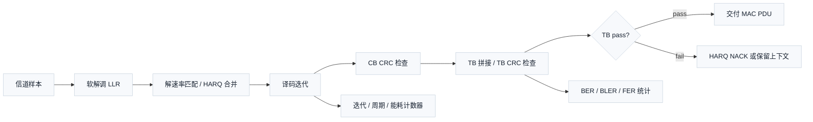

# T4.5 译码器性能指标：错误率、速度、能耗与面积取舍
## 本节学习目标

译码器的第一目标是把接收端的软信息恢复成正确比特，但工程项目不能只问“这一次是否译对”。同一个译码算法还要回答：长期看错多少、每秒能输出多少、单个块等多久、平均跑几次迭代、每个正确比特消耗多少能量、同样硅面积能换来多少吞吐。性能指标就是把这些问题变成可统计、可比较、可复现实验结果的语言。

本节讲BER（比特错误率，Bit Error Rate）、块错误率、FER（帧错误率，Frame Error Rate）、吞吐（throughput）、延迟（latency）、迭代次数、每比特能耗和面积吞吐取舍。这里先把会反复出现的单篇技术缩写一次说清楚：传输块是物理层一次交付给媒体接入控制层的数据单元；码块是 TB（传输块，Transport Block）过大时在信道编码内部切出的子块；循环冗余校验是接收端判断候选译码结果是否可接受的错误检测；混合自动重传请求会根据 CRC（循环冗余校验，Cyclic Redundancy Check）pass/fail 组织确认、否定确认和重传；对数似然比是译码器输入的软信息；加性白高斯噪声是本节画曲线时使用的入门信道；寄存器传输级和专用集成电路是硬件实现和芯片落地层级；低密度奇偶校验码、Turbo（Turbo 码，Turbo Code）和Polar（极化码，Polar Code）是后续译码器性能评估的主要对象；调制与编码方案和传输块大小给出链路配置中的码率、调制和数据量背景。


- 准确定义 BER、BLER（块错误率，Block Error Rate）、FER 的统计对象、分母、单位和公式。
- 解释译码研究为什么经常以 TB BLER 作为主指标，而不是只看 BER。
- 画出 BLER vs $E_b/N_0$ 曲线，并知道每个点需要统计多少帧才有可信度。
- 区分吞吐、延迟、迭代次数、每比特能耗和面积吞吐的工程含义。
- 把浮点仿真中的计数器映射到定点模型、RTL（寄存器传输级，Register Transfer Level）/ASIC（专用集成电路，Application-Specific Integrated Circuit）性能监控和验证报告。
- 明确协议证据只支撑 TB/CB（码块，Code Block）CRC pass/fail 和 TB 交付背景，不把任何性能门限写成 3GPP 强制要求。

如果只记住一句话：BLER 统计的是“一个 TB 或一个仿真块能否被上层接受”，它比 BER 更贴近译码器交付和 HARQ（混合自动重传请求，Hybrid Automatic Repeat Request）行为；吞吐、延迟、迭代、能耗和面积则说明为了达到这条 BLER 曲线付出了多少工程代价。

## 前置知识检查

| 前置项 | 本节需要达到的程度 |
|:---|:---|
| 比特 | 知道 bit 是 0 或 1 的最小信息单位。 |
| LLR（对数似然比，Log-Likelihood Ratio） | 知道 LLR 的正负号表示更像 0 还是 1，绝对值表示置信度。 |
| CRC | 知道 CRC pass 表示候选比特满足校验关系，CRC fail 表示接收端不能接受该候选。 |
| TB/CB | 知道 TB 是交付对象，CB 是译码内部可能出现的分块对象。 |
| $E_b/N_0$ | 知道它表示每信息比特能量相对噪声强弱，单位常用 dB。 |
| 时钟周期 | 知道硬件每个周期只能做有限工作，周期数和频率能换算时间。 |

本节会重新解释概率统计中的“比例”“置信度”和“样本数”。这里不要求你先学过数理统计，只需要接受一个直觉：如果一个事件很少发生，就必须观察很多次，才敢说它的发生概率很低。

## 资料与协议边界

性能指标本身大多是工程统计定义，不是 3GPP 给某个芯片规定的门限。本节使用 3GPP Rel-19 协议只支撑三件事：第一，LTE/NR 编码链路存在 TB CRC、CB segmentation 和 CB CRC attachment；第二，MAC（媒体接入控制层，Medium Access Control）和物理层之间围绕 TB 交付；第三，HARQ 以 Layer 1 交付和 CRC 结果为背景。协议没有在本节证据中强制规定“某译码器必须达到某个 BLER、吞吐、能耗或面积吞吐”。

| 协议位置 | 本地证据 |
| :--- | :--- |
| LTE TS 36.212 Rel-19 `36212-j30` §5.1.1 | `3GPP_Rel19/processed/TS_36.212_36212-j30/content.md`，`sections.jsonl` |
| LTE TS 36.212 Rel-19 `36212-j30` §5.1.2 | `3GPP_Rel19/processed/TS_36.212_36212-j30/content.md`，`sections.jsonl` |
| LTE TS 36.212 Rel-19 `36212-j30` §5.1.5、§5.2.2.1、§5.3.2.1 | `3GPP_Rel19/processed/TS_36.212_36212-j30/content.md`，`sections.jsonl` |
| NR TS 38.212 Rel-19 `38212-j30` §5.1、§5.2 | `3GPP_Rel19/processed/TS_38.212_38212-j30/content.md`，`sections.jsonl` |
| NR TS 38.212 Rel-19 `38212-j30` §6.2、§7.2 | `3GPP_Rel19/processed/TS_38.212_38212-j30/content.md`，`sections.jsonl` |
| NR TS 38.300 Rel-19 `38300-j20` §5.2.2、§6.2.1、§6.2.4 | `3GPP_Rel19/processed/TS_38.300_38300-j20/content.md`，`sections.jsonl` |
| NR TS 38.321 Rel-19 `38321-j20` §6.1.4、§6.2.1 | `3GPP_Rel19/processed/TS_38.321_38321-j20/content.md`，`sections.jsonl` |

协议边界必须写清：本节的 BER/BLER/FER、置信区间、错误块数停止、吞吐、延迟、能耗和面积吞吐公式都是工程统计和实现评估模型。3GPP 证据只说明接收端存在可观察的 CRC pass/fail 和 TB 交付对象，不把某个仿真门限、曲线斜率、最大延迟或每比特能耗写成规范强制值。

## 名称来源与工程动机

错误率的英文 error rate 表示“错误次数除以总次数”。分子是你定义的错误对象，分母是你尝试的总对象。对象不同，指标就不同。

| 指标 | 对象 | 最小直觉 |
|:---|:---|:---|
| BER | bit | 1000 个 bit 里错了几个。 |
| BLER | block | 100 个块里有几个块不能接受。 |
| FER | frame | 100 个帧里有几个帧失败。 |
| 吞吐 | bit/s 或 block/s | 长期每秒交付多少数据。 |
| 延迟 | s、ms、us 或 cycles | 单个对象从输入到输出等多久。 |
| 迭代次数 | iteration/block | 一个块译码时重复更新了多少轮。 |
| 每比特能耗 | J/bit、pJ/bit、nJ/bit | 交付一个比特平均消耗多少能量。 |
| 面积吞吐 | bit/s/mm² 或 Gbps/mm² | 每平方毫米硅面积能提供多少吞吐。 |

初学者常以为 BER 最细，所以一定最好。译码器工程不是这样。一个 TB 只要有 1 个信息 bit 错，TB CRC 就通常不能通过，上层不会把这个 TB 当作正确数据使用。于是 BER 很低但 BLER 仍可能不可接受。例如一个 TB 有 1000 bit，BER 是 $10^{-4}$，平均每 10 个 TB 就会出现约 1 个错误 bit；这些错误 bit 分散在不同 TB 时，BLER 可能接近 10%。因此，链路仿真和 HARQ 研究经常把 BLER 作为主指标，再用 BER 辅助定位错误分布。

FER 的名字来自 frame。帧在不同系统里可能表示无线帧、仿真帧、编码帧或测试向量批次。它不是天然等于 TB。写报告时若使用 FER，必须先定义 frame 到底是什么，否则 FER 没有可比性。为了避免歧义，本课程后续译码链路优先写 TB BLER 或 CB BLER；只有仿真框架明确把一个 frame 定义成一个 TB 或一组 TB 时，才使用 FER。

## 统计对象、分母、单位与公式

任何性能报告都必须先定义统计对象。一个合格定义至少包含：对象、分母、分子、单位、排除条件和工程后果。

### BER 定义

BER 回答的问题是：所有被比较的信息 bit 中，有多大比例被译错。

设参考比特向量为 $\mathbf{b}$，译码输出为 $\hat{\mathbf{b}}$，总比较 bit 数为 $N_{\mathrm{bit}}$，错误 bit 数为 $N_{\mathrm{bit,err}}$。BER 定义为：

$$
\mathrm{BER}=\frac{N_{\mathrm{bit,err}}}{N_{\mathrm{bit}}}
\tag{1}
$$

其中：

- $N_{\mathrm{bit}}$ 的单位是 bit。
- $N_{\mathrm{bit,err}}$ 的单位是 bit。
- BER 没有物理单位，通常写成比例、百分比或科学计数法。

工程后果：BER 适合观察算法还差多少、错误集中在哪些 bit 位置、软信息或定点量化是否损坏。但 BER 不能直接告诉 MAC 是否会收到一个可用 TB，因为一个 TB 内任何未被 CRC 掩盖的错误都可能导致 TB 拒收。

### BLER 定义

BLER 回答的问题是：统计的块中，有多大比例的块失败。关键是 block 必须定义清楚。本节推荐两种写法：

| 名称 | 块对象 | 分子 | 分母 |
|:---|:---|:---|:---|
| TB BLER | TB | TB CRC fail、或任一 CB 失败导致 TB 不可交付 | 尝试译码的 TB 数 |
| CB BLER | CB | CB CRC fail、或该 CB 无法被译码接受 | 尝试译码的 CB 数 |

如果统计对象是 TB，设总 TB 数为 $N_{\mathrm{TB}}$，失败 TB 数为 $N_{\mathrm{TB,err}}$：

$$
\mathrm{BLER}_{\mathrm{TB}}=\frac{N_{\mathrm{TB,err}}}{N_{\mathrm{TB}}}
\tag{2}
$$

如果统计对象是 CB，设总 CB 数为 $N_{\mathrm{CB}}$，失败 CB 数为 $N_{\mathrm{CB,err}}$：

$$
\mathrm{BLER}_{\mathrm{CB}}=\frac{N_{\mathrm{CB,err}}}{N_{\mathrm{CB}}}
\tag{3}
$$

工程后果：TB BLER 最贴近上层交付和 HARQ ACK/NACK；CB BLER 更适合定位某个分段、速率恢复、译码核或 CRC 检查的问题。报告不能只写“BLER=0.1”，必须写“TB BLER=0.1”或“CB BLER=0.1”。

### FER 定义

FER 回答的问题是：统计的 frame 中，有多大比例失败。设 frame 总数为 $N_{\mathrm{frame}}$，失败 frame 数为 $N_{\mathrm{frame,err}}$：

$$
\mathrm{FER}=\frac{N_{\mathrm{frame,err}}}{N_{\mathrm{frame}}}
\tag{4}
$$

如果一个 frame 恰好定义为一个 TB，则 FER 与 TB BLER 相同。如果一个 frame 包含多个 TB，则 FER 是“至少一个 TB 失败”的概率，不等于单个 TB BLER。工程报告必须写清 frame 定义，否则 FER 不能与其他曲线比较。

### 吞吐与有效吞吐

吞吐回答的问题是：单位时间交付了多少数据。译码器常见两种吞吐：

| 名称 | 分子 | 分母 | 用途 |
|:---|:---|:---|:---|
| 原始吞吐 | 尝试处理的信息 bit 或编码 bit | 时间 | 观察硬件处理能力。 |
| 有效吞吐 | CRC pass 并交付的信息 bit | 时间 | 观察系统最终有用输出。 |

若在时间 $T_{\mathrm{run}}$ 内尝试处理 $N_{\mathrm{info,attempt}}$ 个信息 bit，原始信息吞吐为：

$$
R_{\mathrm{raw}}=\frac{N_{\mathrm{info,attempt}}}{T_{\mathrm{run}}}
\tag{5}
$$

若成功交付 $N_{\mathrm{info,pass}}$ 个信息 bit，有效吞吐为：

$$
R_{\mathrm{eff}}=\frac{N_{\mathrm{info,pass}}}{T_{\mathrm{run}}}
\tag{6}
$$

在每个 TB 大小相同且失败后不交付的简单模型中：

$$
R_{\mathrm{eff}}\approx R_{\mathrm{raw}}\left(1-\mathrm{BLER}_{\mathrm{TB}}\right)
\tag{7}
$$

式 (7) 是工程近似，不是 HARQ 完整系统吞吐。HARQ 重传会占用额外资源，也会通过软合并改变后续 BLER。

### 延迟与迭代次数

延迟回答的问题是：单个 TB 或 CB 从输入到输出等了多久。若一个块消耗 $C_{\mathrm{blk}}$ 个周期，时钟频率为 $f_{\mathrm{clk}}$：

$$
T_{\mathrm{lat}}=\frac{C_{\mathrm{blk}}}{f_{\mathrm{clk}}}
\tag{8}
$$

迭代次数回答的问题是：译码器为一个块重复更新内部消息多少轮。设第 $j$ 个块使用 $I_j$ 次迭代，总块数为 $N_{\mathrm{blk}}$，平均迭代次数为：

$$
\bar{I}=\frac{1}{N_{\mathrm{blk}}}\sum_{j=1}^{N_{\mathrm{blk}}} I_j
\tag{9}
$$

工程后果：最大迭代次数决定最坏延迟和硬件周期预算；平均迭代次数决定平均吞吐和平均能耗。CRC 早停可以降低平均迭代，但不能消除最大迭代路径的验证责任。

### 每比特能耗与面积吞吐

每比特能耗回答的问题是：交付一个 bit 平均消耗多少能量。若总能量为 $E_{\mathrm{run}}$，成功交付信息 bit 数为 $N_{\mathrm{info,pass}}$：

$$
E_{\mathrm{bit,eff}}=\frac{E_{\mathrm{run}}}{N_{\mathrm{info,pass}}}
\tag{10}
$$

若只按尝试处理 bit 统计，则：

$$
E_{\mathrm{bit,raw}}=\frac{E_{\mathrm{run}}}{N_{\mathrm{info,attempt}}}
\tag{11}
$$

有效每比特能耗通常比原始每比特能耗更贴近系统价值，因为错误 TB 不能交付有用数据。

面积吞吐回答的问题是：单位硅面积提供多少吞吐。若 ASIC 面积为 $A_{\mathrm{mm^2}}$，有效吞吐为 $R_{\mathrm{eff}}$：

$$
\eta_{\mathrm{area}}=\frac{R_{\mathrm{eff}}}{A_{\mathrm{mm^2}}}
\tag{12}
$$

单位常写成 Gbps/mm²。工程后果：更大并行度可能降低 BLER 目标下的延迟并提高吞吐，但也可能增加静态随机存取存储器、互连和排序器面积；更宽 LLR 可能改善 BLER，却降低同面积可实现吞吐。

## 手算例子：BER、TB BLER、有效吞吐与能耗

假设一次仿真处理 5 个 TB，每个 TB 有 8 个信息 bit。参考比特和译码输出逐个比较后，得到下面的错误数：

| TB index | 错误 bit 数 | TB CRC 结果 |
|---:|---:|:---:|
| 0 | 0 | pass |
| 1 | 1 | fail |
| 2 | 0 | pass |
| 3 | 2 | fail |
| 4 | 0 | pass |

总比较 bit 数为：

$$
N_{\mathrm{bit}}=5\times 8=40
\tag{13}
$$

错误 bit 数为：

$$
N_{\mathrm{bit,err}}=1+2=3
\tag{14}
$$

所以：

$$
\mathrm{BER}=\frac{3}{40}=0.075
\tag{15}
$$

失败 TB 数为 2，总 TB 数为 5：

$$
\mathrm{BLER}_{\mathrm{TB}}=\frac{2}{5}=0.4
\tag{16}
$$

如果这 5 个 TB 共运行 $T_{\mathrm{run}}=10\ \mu s$，尝试处理信息 bit 是 40 bit，成功交付信息 bit 是 3 个通过 TB 的 $3\times 8=24$ bit：

$$
R_{\mathrm{raw}}=\frac{40}{10\times 10^{-6}}=4.0\ \mathrm{Mbit/s}
\tag{17}
$$

$$
R_{\mathrm{eff}}=\frac{24}{10\times 10^{-6}}=2.4\ \mathrm{Mbit/s}
\tag{18}
$$

若这段运行消耗 $E_{\mathrm{run}}=120\ \mathrm{nJ}$：

$$
E_{\mathrm{bit,raw}}=\frac{120\ \mathrm{nJ}}{40}=3.0\ \mathrm{nJ/bit}
\tag{19}
$$

$$
E_{\mathrm{bit,eff}}=\frac{120\ \mathrm{nJ}}{24}=5.0\ \mathrm{nJ/bit}
\tag{20}
$$

这个例子说明：同一批数据，BER、BLER、原始吞吐、有效吞吐、原始能耗和有效能耗会给出不同结论。工程报告必须同时写出统计口径，不能只挑最好看的数字。

## BLER vs $E_b/N_0$ 曲线绘制流程

BLER vs $E_b/N_0$ 曲线回答的问题是：噪声从强到弱变化时，译码器失败概率如何下降。横轴是 $E_b/N_0$，常用 dB；纵轴是 BLER，常用对数坐标。

### 曲线横轴与纵轴

$E_b/N_0$ 表示每信息比特能量与噪声功率谱密度之比。[[T2.9_AWGN_noise_scaling|T2.9]] 已经给出 AWGN（加性白高斯噪声，Additive White Gaussian Noise）噪声缩放方法。本节只强调绘图口径：

| 图形元素 | 推荐写法 | 备注 |
|:---|:---|:---|
| 横轴 | $E_b/N_0$ (dB) | 每个点固定一个 dB 值。 |
| 纵轴 | TB BLER 或 CB BLER | 必须写清统计对象。 |
| 纵轴尺度 | log scale | BLER 跨度常从 $10^{-1}$ 到 $10^{-5}$。 |
| 曲线标签 | 算法、码率、调制、长度、迭代上限、量化位宽 | 没有配置标签的曲线不可复现。 |
| 误差条 | 置信区间或错误块数 | 低 BLER 区域必须显示统计可信度。 |

### 可复现实验步骤

1. 固定一个配置：编码类型、信息长度、码率、调制、最大迭代、早停规则、LLR 位宽、随机种子基值。
2. 选择 $E_b/N_0$ 扫描点，例如 `[-1.0, 0.0, 1.0, 2.0, 3.0]` dB。
3. 对每个扫描点重复生成随机 TB、编码、调制、加 AWGN、软解调、译码、CRC 检查。
4. 统计 `tb_total`、`tb_fail`、`bit_total`、`bit_fail`、`iterations_sum`、`cycles_sum`。
5. 达到停止条件后输出 CSV，每行一个 $E_b/N_0$ 点。
6. 用 CSV 画图，不直接从临时日志手工抄数。

一个最小 CSV 表头应包含：

```text
ebn0_db,tb_total,tb_fail,tb_bler,bit_total,bit_fail,ber,avg_iter,avg_cycles,seed_start,seed_end,stop_reason
```

### 统计停止条件

每个 $E_b/N_0$ 点不能只跑固定很少的 TB。常用停止条件有两个：

| 条件 | 直觉 | 例子 |
|:---|:---|:---|
| 最小帧数 | 防止高 BLER 区域样本太少 | 至少跑 1000 个 TB。 |
| 最小错误块数 | 防止低 BLER 区域只看到 0 或 1 个错误 | 至少收集 100 个失败 TB。 |

更实用的停止条件是二者同时考虑：

```text
继续仿真，直到 tb_total >= min_tb 且 (tb_fail >= min_errors 或 tb_total >= max_tb)
```

`max_tb` 是预算保护，避免高信噪比点无限运行。若达到 `max_tb` 但错误块数很少，报告必须标注该点置信度不足或仅给上界。

## 二项统计与错误块数停止的直觉

BLER 统计可以看成重复抛一枚“失败概率为 $p$”的硬币。每个 TB 要么失败，要么成功。若总共跑 $N$ 个 TB，失败 $E$ 个 TB，估计值是：

$$
\hat{p}=\frac{E}{N}
\tag{21}
$$

为什么低 BLER 需要很多帧？假设真实 BLER 是 $10^{-3}$，平均每 1000 个 TB 才失败 1 个。如果只跑 1000 个 TB，可能看到 0 个、1 个、2 个错误，估计会剧烈跳动。若想看到约 100 个错误，需要：

$$
N\approx\frac{100}{10^{-3}}=100000
\tag{22}
$$

这就是“收集固定错误块数”的直觉：错误越稀有，分母必须越大。一个简单经验是相对随机波动约为：

$$
\frac{\sigma_{\hat{p}}}{\hat{p}}\approx\frac{1}{\sqrt{E}}
\tag{23}
$$

这里 $E$ 是错误块数。若只收集 25 个错误，随机相对波动大约 20%；若收集 100 个错误，约 10%；若收集 400 个错误，约 5%。这不是严格置信区间公式，但足够指导仿真预算。

当 $E=0$ 时不能报告“BLER=0”。如果跑了 $N$ 个 TB 没有错误，只能说在这个样本里没有观察到错误。常用的 95% 上界直觉是：

$$
p \lesssim \frac{3}{N}
\tag{24}
$$

例如跑了 30000 个 TB 没有错误，只能粗略说 BLER 的 95% 上界约为 $10^{-4}$，不能说真实 BLER 等于 0。

## 曲线形态、编码增益与失败机制

BER/BLER 曲线不只是几个点的集合，还要看形状。教学示意曲线通常分成瀑布区和错误平层区；这两个词描述的是曲线读法，不是某个协议字段。

| 曲线现象 | 图上表现 | 可能原因 | 报告动作 |
|:---|:---|:---|:---|
| 瀑布区 | $E_b/N_0$ 增加少量，BLER 快速下降。 | 信道线索跨过译码器可收敛区域，冗余约束开始发挥作用。 | 标注目标 BLER 交点和配置。 |
| iteration saturation | 平均迭代接近最大迭代，BLER 下降慢。 | 信道太差、消息更新参数不合适或 early stop 不触发。 | 同图报告平均/最大迭代。 |
| 错误平层 | 高 SNR（信噪比，Signal-to-Noise Ratio）下曲线下降变慢。 | 低重量事件、trapping set、量化饱和、位序 bug 或统计不足。 | 保存失败 dump，不用少量错误直接下结论。 |
| 非单调点 | SNR 升高但 BLER 反而上升。 | 样本数不足、随机波动、配置 hash 不一致、LLR 缩放错误。 | 检查置信区间和 replay。 |

编码增益通常在固定目标错误率下读取。例如在同一信道、同一统计口径和同一目标 TB BLER 下，未编码或基线译码器需要 $E_b/N_0=4.0$ dB，改进方案需要 $E_b/N_0=3.2$ dB，则教学上可说改进方案在该目标点有 0.8 dB 增益。这个说法必须绑定目标错误率和配置，不能外推成所有 SNR 下都有同样增益。

高 SNR 统计成本尤其高。若目标 BLER 为 $10^{-5}$，想收集 100 个失败 TB，期望需要约 $10^7$ 个 TB。工程报告应提前写出 `max_tb`、`min_errors` 和零错误上界，避免把“没跑到错误”误写成“没有错误平层”。

## 指标之间的取舍

译码器不是单指标优化。下面这些取舍经常同时出现：

| 设计动作 | 可能收益 | 可能代价 | 需要观察的指标 |
|:---|:---|:---|:---|
| 增大最大迭代次数 | BLER 下降 | 延迟、能耗、周期数上升 | TB BLER、平均/最大迭代、延迟、pJ/bit。 |
| 使用 CRC 早停 | 平均延迟和能耗下降 | 控制更复杂，需防误停 | 早停分布、误通过检查、平均周期。 |
| 增大并行度 | 吞吐上升、延迟下降 | 面积、SRAM（静态随机存取存储器，Static Random-Access Memory）端口、功耗上升 | Gbps、mm²、Gbps/mm²、stall。 |
| 增大 LLR 位宽 | BLER 可能改善 | 存储面积和带宽上升 | BLER loss、SRAM bit、能耗。 |
| 降低电压或频率 | 能耗下降 | 吞吐下降或时序风险 | pJ/bit、MHz、slack、有效吞吐。 |

面积吞吐取舍不能只看译码核心算术单元。实际 ASIC 中，静态随机存取存储器、交织地址、HARQ buffer、排序器、校验矩阵消息存储和输出接口都可能主导面积。若一个设计把 BLER 从 $10^{-3}$ 改善到 $5\times10^{-4}$，但面积翻倍、吞吐不变，它在面积吞吐上可能更差。

## 接收端流程中的指标位置



BER 的比较通常发生在仿真或验证环境中，因为真实接收机不知道发送端的参考 bit。BLER 可以由 CRC pass/fail 在接收端观察到。吞吐、延迟、迭代和能耗则来自实现计数器或功耗估算。把这些观察点分开，能避免把“真实芯片可见的 CRC fail”和“仿真环境可见的 bit mismatch”混在一起。

## 算法伪代码

下面的伪代码只表达统计逻辑，不实现真实 LTE/NR 编码和译码。它的价值是明确计数器和分母。

```python
from dataclasses import dataclass


@dataclass
class Metrics:
    tb_total: int = 0
    tb_fail: int = 0
    bit_total: int = 0
    bit_fail: int = 0
    iterations_sum: int = 0
    cycles_sum: int = 0


def count_bit_errors(reference: list[int], decoded: list[int]) -> int:
    """Count bit mismatches. Time: O(N), Space: O(1)."""
    assert len(reference) == len(decoded)
    return sum(1 for a, b in zip(reference, decoded) if a != b)


def update_metrics(
    metrics: Metrics,
    reference_bits: list[int],
    decoded_bits: list[int],
    crc_pass: bool,
    iterations: int,
    cycles: int,
) -> None:
    """Update TB-level and bit-level counters. Time: O(K), Space: O(1)."""
    metrics.tb_total += 1
    metrics.tb_fail += 0 if crc_pass else 1
    metrics.bit_total += len(reference_bits)
    metrics.bit_fail += count_bit_errors(reference_bits, decoded_bits)
    metrics.iterations_sum += iterations
    metrics.cycles_sum += cycles


def summarize(metrics: Metrics) -> dict[str, float]:
    """Return normalized metrics. Time: O(1), Space: O(1)."""
    return {
        "tb_bler": metrics.tb_fail / metrics.tb_total,
        "ber": metrics.bit_fail / metrics.bit_total,
        "avg_iter": metrics.iterations_sum / metrics.tb_total,
        "avg_cycles": metrics.cycles_sum / metrics.tb_total,
    }


m = Metrics()
update_metrics(m, [0, 1, 0, 1], [0, 1, 0, 1], True, 3, 120)
update_metrics(m, [0, 0, 1, 1], [0, 1, 1, 0], False, 6, 240)
result = summarize(m)
assert result["tb_bler"] == 0.5
assert result["ber"] == 2 / 8
assert result["avg_iter"] == 4.5
assert result["avg_cycles"] == 180
print("T4.5_METRICS_COUNTERS_OK")
```

BLER 曲线的扫描逻辑如下：

```python
def should_stop(tb_total: int, tb_fail: int, min_tb: int, min_errors: int, max_tb: int) -> bool:
    """Return simulation stop decision. Time: O(1), Space: O(1)."""
    enough_samples = tb_total >= min_tb
    enough_errors = tb_fail >= min_errors
    budget_exhausted = tb_total >= max_tb
    return enough_samples and (enough_errors or budget_exhausted)


def relative_error_hint(error_blocks: int) -> float | None:
    """Approximate relative random fluctuation. Time: O(1), Space: O(1)."""
    if error_blocks <= 0:
        return None
    return 1.0 / (error_blocks ** 0.5)


assert should_stop(1000, 12, 1000, 100, 100000) is False
assert should_stop(50000, 100, 1000, 100, 100000) is True
assert should_stop(100000, 8, 1000, 100, 100000) is True
assert abs(relative_error_hint(100) - 0.1) < 1e-12
print("T4.5_BLER_STOPPING_OK")
```

## 浮点仿真方案

浮点仿真用于建立算法基线。建议先用 Python/NumPy 或 MATLAB 完成，再进入定点和 RTL。

| 项目 | 推荐设置 |
|:---|:---|
| 信道 | AWGN，噪声缩放沿用 [[T2.9_AWGN_noise_scaling|T2.9]] 的 $E_b/N_0$ 到噪声方差公式。 |
| 随机种子 | 每个 $E_b/N_0$ 点记录 `seed_start` 和 `seed_end`。 |
| 扫描点 | 从高 BLER 到低 BLER，先粗扫再细扫瀑布区。 |
| 停止条件 | `min_tb=1000`、`min_errors=100`、`max_tb` 按预算设置。 |
| 输出 | CSV、PNG、配置 JSON、日志。 |
| 验收 | 手算计数器一致；曲线整体随 $E_b/N_0$ 增大而下降；低错误点标注置信度。 |

建议命令形态：

```bash
python3 sim_bler.py \
  --code ldpc \
  --k 8448 \
  --rate 0.5 \
  --mod qpsk \
  --ebn0-db-list -1,0,1,2,3 \
  --max-iter 20 \
  --min-tb 1000 \
  --min-errors 100 \
  --max-tb 200000 \
  --seed 20260620 \
  --out results/t4_5_ldpc_bler.csv
```

`sim_bler.py` 是后续工程仿真脚本名示例，本节不声称仓库已经提供该脚本。若当前项目还没有脚本，报告中应把这条命令写成计划命令，并在执行记录中说明未实际运行链路仿真。

最小绘图检查：

| 检查项 | 失败现象 | 可能原因 |
|:---|:---|:---|
| 曲线随 $E_b/N_0$ 增大下降 | 曲线上升或乱跳 | 噪声缩放、LLR 符号、随机种子或统计分母错误。 |
| 高信噪比点错误数足够 | 只看到 0 到 2 个错误 | 仿真预算不足，不能稳定估计。 |
| BER 与 BLER 同向改善 | BER 降而 BLER 不降 | CRC、分段、TB 拼接或错误集中模式需要检查。 |
| 平均迭代随信噪比下降 | 高信噪比仍跑满迭代 | 早停条件、CRC 触发或 syndrome 检查错误。 |

## 定点化策略

定点模型要回答：量化、饱和和舍入让 BLER 曲线损失多少，以及这些损失换来了多少面积、吞吐或能耗收益。

| 统计对象 | 定点需要记录 | 工程后果 |
|:---|:---|:---|
| 输入 LLR | 位宽、小数位、裁剪阈值、直方图 | LLR 过窄会让 BLER 曲线右移。 |
| 内部消息 | 位宽、舍入、饱和次数 | 饱和过多会导致错误平台或早停异常。 |
| 迭代 | 每 TB/CB 使用次数分布 | 位宽变化可能改变早停分布。 |
| BER/BLER | 浮点、定点同配置对比 | 报告定点损失，例如同 BLER 下需要多 0.1 dB。 |
| 吞吐/能耗 | word 打包、SRAM 读写次数 | 位宽变大可能降低每周期并行 LLR 数。 |

定点对比推荐固定同一批噪声样本：浮点译码和定点译码使用相同发送 bit、相同噪声、相同 $E_b/N_0$。这样差异更容易归因到量化，而不是随机波动。

一个定点性能报告至少包含：

```text
llr_width=6
llr_frac=2
internal_msg_width=8
rounding=nearest
saturation=clip
max_iter=20
float_tb_bler=1.2e-3
fixed_tb_bler=1.5e-3
fixed_loss_at_target=0.10 dB
saturation_events_per_tb=37.4
```

`fixed_loss_at_target` 是工程指标，不是协议指标。它表示在同一目标 BLER 下，定点实现比浮点模型大约需要多高的 $E_b/N_0$。

## RTL/ASIC 计数器与性能监控映射

RTL 和 ASIC 阶段不能依赖人工日志统计。性能指标需要落到寄存器、计数器、trace 或性能监控单元。

| 监控项 | 建议计数器 | 单位 | 对应指标 |
|:---|:---|:---|:---|
| TB 总数 | `tb_total_cnt` | TB | BLER 分母。 |
| TB 失败 | `tb_crc_fail_cnt` | TB | TB BLER 分子。 |
| CB 总数 | `cb_total_cnt` | CB | CB BLER 分母。 |
| CB 失败 | `cb_crc_fail_cnt` | CB | CB BLER 分子。 |
| 迭代 | `iter_sum_cnt`、`iter_max_cnt`、`iter_histogram` | iteration | 平均/最大迭代。 |
| 周期 | `cycles_per_tb_sum`、`cycles_max` | cycle | 延迟、吞吐估计。 |
| 停顿 | `stall_cycles_cnt` | cycle | 吞吐损失定位。 |
| 饱和 | `llr_sat_cnt`、`msg_sat_cnt` | event | 定点损失定位。 |
| 能耗代理 | `active_cycles`、`sram_read_cnt`、`sram_write_cnt` | cycle/access | 功耗估算输入。 |
| 面积代理 | synthesis area report | mm² | 面积吞吐分母。 |

硬件中 BER 通常不是在线计数器，因为芯片不知道参考 bit。BER 更适合仿真 testbench 或实验室已知向量。BLER 可以由 CRC 结果在线计数，但要注意：CRC 误通过概率很低但不是零，因此最终产品验证仍需要已知向量、bit-exact 对比和错误注入测试。

ASIC 能耗估算通常分阶段：

| 阶段 | 能耗来源 | 用途 |
|:---|:---|:---|
| RTL 架构估算 | active cycles、访存次数、切换代理 | 早期比较架构。 |
| 门级功耗估算 | 综合网表、切换活动文件、工艺库 | 估算 nJ/TB 和 pJ/bit。 |
| 后仿或硅后测量 | 实际电压、电流、吞吐 | 校准模型。 |

面积吞吐计算要同时报告面积口径。只算译码 core 面积会比包含 SRAM、接口、HARQ buffer 和控制寄存器的全模块面积更乐观。建议报告 `core_area_mm2` 和 `macro_area_mm2` 两种口径。

## 验证方法

| 验证层级 | 检查内容 | 通过标准 |
|:---|:---|:---|
| 手算单元 | BER、BLER、吞吐、能耗公式 | 与本节手算例子一致。 |
| 统计单元 | `should_stop` 和错误块数停止 | 达到最小 TB 和错误数后停止，预算耗尽有标记。 |
| 浮点链路 | BLER vs $E_b/N_0$ | 曲线单调趋势合理，低错误点有错误块数或上界说明。 |
| 定点回归 | 浮点/定点同噪声样本对比 | BLER loss、饱和次数、迭代分布可解释。 |
| RTL 仿真 | 计数器与 testbench 统计一致 | `tb_crc_fail_cnt`、`iter_sum_cnt`、`cycles` bit-exact 对齐。 |
| ASIC 估算 | 面积、频率、功耗、吞吐同表 | Gbps/mm² 和 pJ/bit 使用同一配置。 |
| 协议路径 | TB/CB CRC pass/fail 与交付动作 | CRC pass 才交付，CRC fail 不伪装成正确 TB。 |

验证报告必须记录配置、命令、随机种子、输入向量版本、golden model 版本、RTL 版本、协议证据路径、CSV/PNG 输出路径和审计脚本结果。没有这些元数据，曲线无法复现。

## 常见错误

| 错误 | 后果 | 修正 |
|:---|:---|:---|
| 只写 BLER 不写 TB/CB | 指标对象不清，无法比较 | 写成 TB BLER 或 CB BLER。 |
| 把 FER 当 BLER | frame 定义不清 | 明确 frame 是否等于 TB。 |
| 错误块数太少就画低 BLER 点 | 曲线随机跳动 | 使用最小错误块数或上界。 |
| 0 错误报告 BLER=0 | 误导设计判断 | 报告 `0/N` 和置信上界。 |
| BER 低就认为系统通过 | TB CRC 仍可能 fail | 同时报告 TB BLER。 |
| 把工程目标写成 3GPP 要求 | 违反协议边界 | 标注为设计目标或仿真门限。 |
| 只报平均延迟 | HARQ 反馈或实时路径超时 | 同时报最大值和高分位。 |
| 能耗分母用尝试 bit 混充成功 bit | pJ/bit 过于乐观 | 同时报 raw 和 effective。 |
| 面积只算算术核心 | Gbps/mm² 虚高 | 单独列 core 和 macro 面积口径。 |
| 曲线点使用不同配置 | 曲线不可解释 | 每行 CSV 记录配置 hash 或 manifest。 |

## 工程思考题

1. 为什么译码器研究常把 TB BLER 作为主指标，而不是只看 BER？
2. 如果一个 $E_b/N_0$ 点跑了 20000 个 TB，观察到 0 个错误，能不能写 BLER=0？
3. 收集 100 个错误块和 25 个错误块相比，统计波动大约有什么差别？
4. 最大迭代次数从 10 增到 20，可能怎样影响 BLER、延迟和能耗？
5. 为什么同一个设计要同时报告 raw throughput 和 effective throughput？
6. 面积吞吐为什么必须写明面积口径？

## 工程思考题参考答案

1. TB 是物理层向 MAC 交付的主要对象，CRC fail 的 TB 不会被当作正确数据使用；一个 TB 内即使只有少量 bit 错也可能导致 TB 拒收。因此 TB BLER 更贴近 HARQ 和上层交付。
2. 不能。只能写 `tb_fail=0, tb_total=20000`，并给出类似 $3/20000=1.5\times10^{-4}$ 的 95% 上界直觉。
3. 相对随机波动近似为 $1/\sqrt{E}$。25 个错误约 20%，100 个错误约 10%，所以 100 个错误更稳定。
4. BLER 可能下降，平均迭代可能在低信噪比区域上升，最坏延迟几乎按最大迭代增加，能耗通常也会上升。
5. Raw throughput 表示硬件处理能力，effective throughput 表示成功交付能力。高 BLER 时两者差异很大。
6. 只算译码核心会忽略 SRAM、HARQ buffer、接口和控制逻辑；完整 macro 面积更贴近芯片代价。不同口径的 Gbps/mm² 不能直接比较。

## 自测题

1. BER 的分子和分母分别是什么？
2. TB BLER 的分子和分母分别是什么？
3. FER 在什么条件下等于 TB BLER？
4. BLER vs $E_b/N_0$ 曲线的横轴和纵轴分别是什么？
5. 为什么低 BLER 区域需要 `min_errors` 停止条件？
6. RTL 中哪些计数器可以支撑 BLER、延迟和迭代统计？

## 自测题参考答案

1. 分子是错误 bit 数，分母是总比较 bit 数。
2. 分子是失败 TB 数，分母是尝试译码 TB 数。
3. 当一个 frame 明确定义为一个 TB 时，FER 等于 TB BLER。
4. 横轴是 $E_b/N_0$，通常单位 dB；纵轴是 TB BLER 或 CB BLER，通常用对数坐标。
5. 因为错误越稀有，少量样本会让估计剧烈波动；收集足够错误块能控制统计相对波动。
6. `tb_total_cnt`、`tb_crc_fail_cnt`、`iter_sum_cnt`、`iter_max_cnt`、`cycles_per_tb_sum`、`cycles_max` 等。

## 本节验收

| 验收项 | 通过标准 |
|:---|:---|
| 统计定义 | 能写出 BER、TB BLER、CB BLER、FER 的分子、分母和单位。 |
| 协议边界 | 能说明 3GPP 证据支撑 CRC pass/fail 和 TB 交付背景，不支撑本节性能门限。 |
| 曲线能力 | 能设计 BLER vs $E_b/N_0$ 扫描，写清停止条件、CSV 字段和置信度说明。 |
| 工程取舍 | 能解释迭代、吞吐、延迟、能耗和面积吞吐之间的取舍。 |
| 硬件映射 | 能把 BLER、迭代、周期、饱和和能耗代理映射到 RTL/ASIC 计数器。 |

## 协议证据表

| 证据 | 状态 | 本节结论 | 边界 |
|:---|:---|:---|:---|
| LTE TS 36.212 Rel-19 `36212-j30` §5.1.1 | 已定位 `content.md` 与 `sections.jsonl` | CRC calculation 提供 pass/fail 检查背景。 | 不提供 BLER 门限。 |
| LTE TS 36.212 Rel-19 `36212-j30` §5.1.2 | 已定位 | 大输入可分 CB 并附加 CB CRC，支持 CB BLER 统计对象。 | 不规定 CB BLER 必须达到某值。 |
| LTE TS 36.212 Rel-19 `36212-j30` §5.1.5、§5.2.2.1、§5.3.2.1 | 已定位 | TB CRC attachment 和 code block concatenation 支持 TB 级交付背景。 | 不规定吞吐、延迟、能耗。 |
| NR TS 38.212 Rel-19 `38212-j30` §5.1、§5.2 | 已定位 | NR CRC 和 LDPC（低密度奇偶校验码，Low-Density Parity-Check Code）CB segmentation/CB CRC 是 CB/TB pass/fail 的协议来源。 | 不规定仿真停止条件。 |
| NR TS 38.212 Rel-19 `38212-j30` §6.2、§7.2 | 已定位 | UL-SCH（上行共享信道，Uplink Shared Channel）、DL-SCH（下行共享信道，Downlink Shared Channel）/PCH 链路包含 TB CRC、CB segmentation、channel coding、rate matching。 | 不把某条曲线作为规范要求。 |
| NR TS 38.300 Rel-19 `38300-j20` §5.2.2、§6.2.1、§6.2.4 | 已定位 | 物理层处理含 TB CRC/CB CRC/HARQ，MAC 以 TB 与物理层交付，HARQ 支撑 Layer 1 delivery。 | 不规定实现计数器名称。 |
| NR TS 38.321 Rel-19 `38321-j20` §6.1.4、§6.2.1 | 已定位 | MAC PDU 与 TB 对齐、DL-SCH/UL-SCH subheader 背景说明 TB 通过后进入 MAC 解析。 | 不规定 BER/FER 统计方法。 |
## 执行与证据记录

| 项目 | 记录 |
|:---|:---|
| 总纲规则 | 已读取 `合规与遵从.md` 的 Skill Management、Hard Constraints、Document & Code Formatting Standards。 |
| 风格参考 | 已读取 `docs/L1_基础/T2.9_AWGN_noise_scaling.md`、`docs/L1_基础/T4.3_HARQ_soft_combining_basics.md`、`docs/L1_基础/T5.3_throughput_latency_parallelism.md`、`docs/L1_基础/T5.5_decoder_hardware_verification_mindset.md`。 |
| 协议资料 | 已检查 `3GPP_Rel19/manifest.csv`、`3GPP_Rel19/processed/manifest.json`、TS 36.212/38.212/38.300/38.321 的 `README.md`、`content.md` 和 `sections.jsonl`。 |
| 技能使用 | 使用 `superpowers:using-superpowers`、`superpowers:brainstorming`、`superpowers:writing-plans`、`superpowers:verification-before-completion` 指令；使用 `$3gpp-word-extraction` 规则约束本地协议证据读取。未进行新的 Word 抽取。 |
| 教学模型 | 自写 BER/BLER/FER、吞吐、延迟、迭代、每比特能耗、面积吞吐公式；所有性能门限均标注为工程统计或设计目标。 |
| 代码示例 | 提供计数器统计、BLER 停止条件和统计波动直觉伪代码。 |
| 未覆盖内容 | 未实现真实 LTE/NR bit-exact 编码、rate matching 或译码器；未运行链路级 BLER 仿真；本节只建立指标、统计和工程映射。 |
| 审计结果 | `python3 tools/audit_lesson_terms.py docs/L1_基础/T4.5_decoder_performance_metrics.md`：`LESSON_TERM_AUDIT_OK`。 |
| 审计结果 | `python3 tools/audit_markdown_headings.py docs/L1_基础/T4.5_decoder_performance_metrics.md`：`MARKDOWN_HEADING_AUDIT_OK`。 |
| 审计结果 | `python3 tools/audit_lesson_depth.py --strict docs/L1_基础/T4.5_decoder_performance_metrics.md`：`LESSON_DEPTH_AUDIT_OK`。 |
| 审计结果 | `python3 tools/audit_latex_render.py docs/L1_基础/T4.5_decoder_performance_metrics.md`：`LATEX_RENDER_AUDIT_OK formulas=87`。 |
| 引用重建审计 | `python3 tools/audit_reference_rebuilds.py docs/L1_基础/T4.5_decoder_performance_metrics.md` 返回 `REFERENCE_REBUILD_AUDIT_CANDIDATES`，退出码为 0；候选为本节自写工程统计公式、[[T2.9_AWGN_noise_scaling|T2.9]] 噪声缩放引用说明和执行记录中的“公式”字样，未发现本节新增外部协议表/图/公式缺失复现项。 |

## 参考文献

- [3GPP, 2026a] 3GPP TS 36.212, Rel-19, `36212-j30`, Multiplexing and channel coding, §5.1.1, §5.1.2, §5.1.5, §5.2.2.1, §5.3.2.1. Local path: `3GPP_Rel19/processed/TS_36.212_36212-j30`.
- [3GPP, 2026b] 3GPP TS 38.212, Rel-19, `38212-j30`, Multiplexing and channel coding, §5.1, §5.2, §6.2, §7.2. Local path: `3GPP_Rel19/processed/TS_38.212_38212-j30`.
- [3GPP, 2026c] 3GPP TS 38.300, Rel-19, `38300-j20`, NR and NG-RAN Overall description, §5.2.2, §6.2.1, §6.2.4. Local path: `3GPP_Rel19/processed/TS_38.300_38300-j20`.
- [3GPP, 2026d] 3GPP TS 38.321, Rel-19, `38321-j20`, Medium Access Control protocol specification, §6.1.4, §6.2.1. Local path: `3GPP_Rel19/processed/TS_38.321_38321-j20`.
- [Proakis and Salehi, 2008] John G. Proakis and Masoud Salehi, *Digital Communications*, 5th ed., McGraw-Hill, 2008. 本节使用通用数字通信性能统计背景，未引用该文献的具体公式、表格或图。
