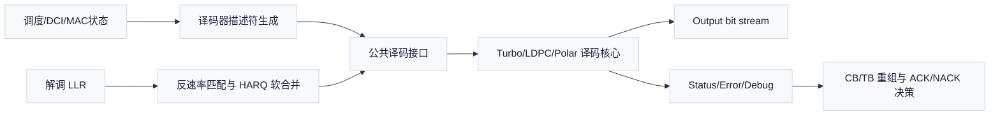
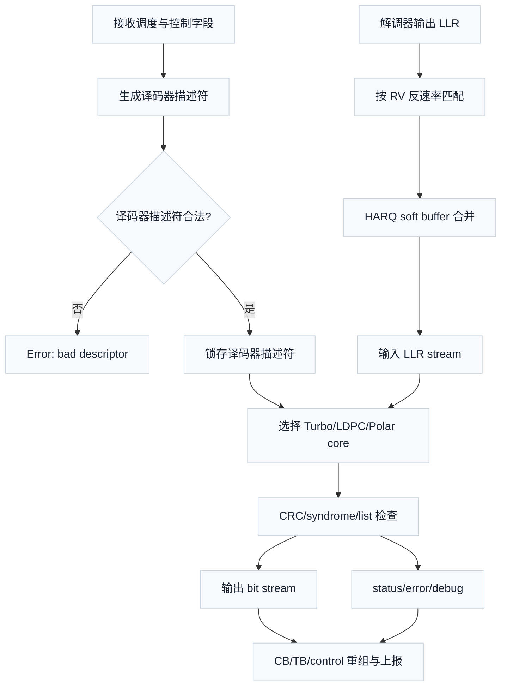

# T4.6 译码器接口契约：Turbo、LDPC 与 Polar 的公共调用边界
## 本节学习目标

本节讲译码器接口契约。接口契约不是某个算法的数学公式，而是一组工程约定：上游怎样把软信息和配置交给译码器，译码器怎样报告输出比特、循环冗余校验状态、迭代次数和错误原因，下游怎样据此释放缓存、触发重传或上报结果。

这一节会同时覆盖三类译码器。Turbo（Turbo 码，Turbo Code）在 LTE 传输信道中使用，低密度奇偶校验码在 NR 共享数据信道中使用，Polar（极化码，Polar Code）在 NR 控制信息场景中使用。三者内部算法不同：Turbo 常见为两个软输入软输出分量译码器交换外信息，LDPC（低密度奇偶校验码，Low-Density Parity-Check Code）常见为校验节点和变量节点消息传递，Polar 常见为逐次消除或列表路径搜索。但是从接收机系统角度看，它们都需要同一类边界对象：输入对数似然比流、码块元数据、冗余版本、混合自动重传请求进程号、输出比特、CRC（循环冗余校验，Cyclic Redundancy Check）状态、迭代次数和错误标志。


- 解释译码器描述符（descriptor）、输入对象（input）、输出对象（output）、状态对象（status）、错误对象（error）和调试对象（debug）六类接口对象的职责。
- 说明 LLR（对数似然比，Log-Likelihood Ratio）正号约定如何影响所有译码器的硬判决。
- 把传输块、码块、HARQ（混合自动重传请求，Hybrid Automatic Repeat Request）process ID 和冗余版本（Redundancy Version, RV）组成 soft buffer key。
- 区分 3GPP 协议强制语义和工程实现自定义字段。
- 设计 Turbo、LDPC、Polar 共用的中立接口表，并说明三类译码器各自如何映射。
- 给出字段合法性检查、接收端流程、伪代码、反压、复位、超时、定点位宽和寄存器传输级/专用集成电路接口映射。
- 建立验证计划，覆盖浮点模型、定点模型、硬件握手、协议边界和常见错误。

如果只记住一句话：译码器接口的核心不是把所有算法细节塞进一个结构体，而是让每个 CB（码块，Code Block）的软信息、协议身份、输出验收和错误状态都有唯一、可审计、可复现的归属。

## 前置知识检查

| 前置项 | 本节需要达到的程度 |
|:---|:---|
| LLR | 知道 LLR 是带正负号的软信息，符号表示更像 0 或 1，绝对值表示置信度。 |
| CRC | 知道 CRC 是错误检测，不负责纠错；CRC pass 代表候选比特满足校验规则。 |
| TB/CB | 知道 TB（传输块，Transport Block）是最终交付和 HARQ 反馈的主要单位，CB 是信道编码和译码内部的分块单位。 |
| HARQ | 知道 HARQ 会把失败传输的软信息留在 soft buffer 中，等待后续 RV 重传合并。 |
| RTL（寄存器传输级，Register Transfer Level）valid/ready | 知道 `valid && ready` 才表示一次数据传输真正发生。 |
| 定点数 | 知道硬件 LLR 不是无限精度小数，而是固定位宽、有饱和边界的整数。 |

本节不是要你现在会写 Turbo、LDPC 或 Polar 译码算法。它先解决更靠系统边界的问题：如果三种译码器都要接入同一个接收机，接口字段怎样命名、检查、握手和验收，才不会把协议身份、缓存地址和输出状态搞混。

## 资料与协议边界

本节涉及 3GPP，但要先划清边界。3GPP 规定编码链路、分段、速率匹配、冗余版本、HARQ 过程和控制字段语义；3GPP 不规定芯片内部译码器描述符结构体字段名、AXI 流式接口（AXI-stream）通道名、调试计数器（debug counter）数量、先进先出队列（First-In First-Out, FIFO）深度或超时（timeout）周期数。下面的中立接口是工程接口抽象，不是 3GPP 原文表格。

| 协议位置 | Rel-19 包与本地路径 | 协议前因后果 |
| :--- | :--- | :--- |
| TS 36.212 Rel-19 `36212-j30` §5.1.2 | `3GPP_Rel19/processed/TS_36.212_36212-j30/content.md`，`sections.jsonl` | LTE TB 在信道编码前可分为多个 CB，并涉及 CB CRC 和 filler。 |
| TS 36.212 Rel-19 `36212-j30` §5.1.3.2 | `3GPP_Rel19/processed/TS_36.212_36212-j30/content.md`，`sections.jsonl` | LTE Turbo channel coding 规定 Turbo 编码结构；接收端译码器要按同一 CB 长度和交织参数工作。 |
| TS 36.212 Rel-19 `36212-j30` §5.1.4.1 | `3GPP_Rel19/processed/TS_36.212_36212-j30/content.md`，`sections.jsonl` | Turbo rate matching 经过子块交织、bit collection、circular buffer，并使用 `rvidx`。 |
| TS 36.213 Rel-19 `36213-j30` | 本地分册集合：`TS_36.213_36213-j30_cover`、`TS_36.213_36213-j30_s00-s05`、`TS_36.213_36213-j30_s06-s07`、`TS_36.213_36213-j30_s08-s09`、`TS_36.213_36213-j30_s10-s13`、`TS_36.213_36213-j30_s14-xx`、`TS_36.213_36213-j30_sAnnexes` | LTE 物理层过程给出调度、HARQ 和物理过程上下文。 |
| TS 38.212 Rel-19 `38212-j30` §5.2.1、§5.3.1、§5.4.1 | `3GPP_Rel19/processed/TS_38.212_38212-j30/content.md`，`sections.jsonl` | NR Polar 涉及 code block segmentation/CRC attachment、Polar encoding 和 rate matching。 |
| TS 38.212 Rel-19 `38212-j30` §5.2.2、§5.3.2、§5.4.2 | `3GPP_Rel19/processed/TS_38.212_38212-j30/content.md`，`sections.jsonl` | NR LDPC 涉及基图、提升大小、LDPC 编码和 rate matching；RV 影响 bit selection 起点。 |
| TS 38.212 Rel-19 `38212-j30` §6.2、§7.2 | `3GPP_Rel19/processed/TS_38.212_38212-j30/content.md`，`sections.jsonl` | NR 上行共享信道/下行共享信道先做 TB CRC、LDPC base graph selection、CB segmentation、channel coding、rate matching、code block concatenation。 |
| TS 38.212 Rel-19 `38212-j30` §6.3、§7.3 | `3GPP_Rel19/processed/TS_38.212_38212-j30/content.md`，`sections.jsonl` | NR 上行控制信息/下行控制信息可经 Polar 编码和 rate matching。 |
| TS 38.213 Rel-19 `38213-j30` §9.1、§9.2.3、§10.5 | `3GPP_Rel19/processed/TS_38.213_38213-j30/content.md`，`sections.jsonl` | HARQ-ACK codebook、HARQ-ACK 报告和 PUSCH（物理上行共享信道，Physical Uplink Shared Channel）上 HARQ-ACK 信息影响反馈与上报时序。 |
| TS 38.214 Rel-19 `38214-j30` §5.1.3、§5.1.7、§6.1.4、§6.1.5 | `3GPP_Rel19/processed/TS_38.214_38214-j30/content.md`，`sections.jsonl` | PDSCH（物理下行共享信道，Physical Downlink Shared Channel）/PUSCH 的 modulation order、target code rate、RV、传输块大小和 CBG（码块组，Code Block Group）过程是译码器描述符的来源。 |
| TS 38.214 Rel-19 `38214-j30` §5.1 | `3GPP_Rel19/processed/TS_38.214_38214-j30/content.md`，`sections.jsonl` | 本地内容显示 NR 下行每小区 HARQ process 数量、DCI（下行控制信息，Downlink Control Information）调度 PDSCH 和 HARQ process ID 递增规则。 |

本节只读取了 `content.md`、`sections.jsonl`、README 和 manifest 级资料，没有复核所有表格 HTML、公式 XML 和 Word 原始 XML。因此，涉及表格值、精确公式和协议图复现的内容只作为章节锚点或工程接口来源，不声明已完整重建协议公式。

## 接口契约的工程动机

译码器很容易被想成一个函数：

```text
decoded_bits = decode(llrs)
```

这个想法太短，无法支撑真实 LTE/NR 接收机。真实接收端至少还要回答这些问题：

| 问题 | 缺失后果 |
|:---|:---|
| 这串 LLR 属于哪个 TB、哪个 CB、哪个 HARQ process？ | 软信息可能合并到错误缓存，重传收益消失或长期 CRC fail。 |
| LLR 正号表示更像 0 还是更像 1？ | 所有硬判决翻转，CRC 系统性失败。 |
| 本次传输是新数据还是重传？ | 新 TB 被旧 soft buffer 污染，或重传时旧证据被清空。 |
| RV 是多少，反速率匹配后的编码位置是什么？ | LLR 放错编码位置，LLR 幅度越大反而越坏。 |
| 输出是 CB 级通过、TB 级通过，还是控制信息通过？ | 上层无法正确 ACK/NACK、释放 buffer 或拼接。 |
| 译码是否超时、饱和、协议字段非法或被 reset 中断？ | 系统只看到 CRC fail，无法定位根因。 |

所以本节定义的接口契约分成六组对象：译码器描述符、输入对象、输出对象、状态对象、错误对象和调试对象。译码器描述符描述“这次译码是谁”；输入对象搬运“本次软信息是什么”；输出对象给出“候选硬比特是什么”；状态对象表达“验收结果和运行统计”；错误对象说明“为什么没有得到有效结果”；调试对象保存“如何复现和诊断”。这些英文名后续保留为接口字段族名称，是为了和软件结构体、RTL 信号和测试脚本对齐。

## LLR 符号约定与硬判决

LLR 是译码器输入的软信息。它回答的问题是：某个比特更像 0 还是更像 1，以及这个判断有多可靠。本课程采用中立接口默认约定：

$$
L=\log\frac{P(b=0\mid y)}{P(b=1\mid y)}
\tag{1}
$$

式 (1) 中，$b$ 是待判断的编码比特，$y$ 是接收机从信道观测到的样本，$P(b=0\mid y)$ 表示“看到 $y$ 后比特为 0 的概率”，$P(b=1\mid y)$ 表示“看到 $y$ 后比特为 1 的概率”。这个公式回答的是软信息方向：若 $L>0$，更倾向于 0；若 $L<0$，更倾向于 1；若 $L=0$，当前证据无法区分。

硬判决规则写成：

$$
\hat b=
\begin{cases}
0, & L\ge 0\\
1, & L<0
\end{cases}
\tag{2}
$$

式 (2) 是接口层必须固定的约定。某些外部库或硬件知识产权模块（Intellectual Property, IP）可能采用相反符号，也就是正号表示更像 1。接口契约不能假装大家天然一致，必须在译码器描述符中显式带 `llr_sign_convention`。当上游解调器和译码器约定不一致时，要么上游取负，要么输入适配层取负，不能让核心译码器自行猜测。

一个手算例子可以看出符号错误的破坏性。假设某个 CB 的前三个 LLR 为：

| 位置 | LLR | 按式 (2) 的硬判决 |
|---:|---:|:---:|
| 0 | `+2.0` | `0` |
| 1 | `-0.7` | `1` |
| 2 | `+0.1` | `0` |

硬判决得到 `010`。如果误把正号解释成更像 1，就会得到 `101`。这不是“可靠度稍有误差”，而是方向反了；后续 CRC 很可能失败，且 debug 时会看到 LLR 幅度看似正常。

## 中立接口总览

公共接口不应该把 Turbo、LDPC、Polar 的内部算法字段混在一个长列表里。更稳妥的做法是：先定义每次译码都需要的公共字段，再给每个 code family 一个小型扩展区。

| 接口组 | 方向 | 生命周期 | 作用 |
|:---|:---|:---|:---|
| Descriptor | 控制面输入 | 每个 CB 或控制块开始前锁存一次 | 描述协议身份、长度、算法家族、HARQ/RV 和校验策略。 |
| Input stream | 数据面输入 | 按 LLR 流握手传输 | 搬运反速率匹配和软合并后的 LLR。 |
| Output stream | 数据面输出 | 译码完成后按 bit 流或 word 流输出 | 搬运硬判决 payload、CB 结果或控制信息结果。 |
| Status | 控制面输出 | 每次译码结束产生一次 | 报告 CRC、迭代次数、停止原因、CB/TB 边界状态。 |
| Error | 控制面输出 | 非正常路径产生，可与 status 同时有效 | 报告非法字段、超时、溢出（overflow）、复位中止（reset abort）和缓存未命中（buffer miss）。 |
| Debug | 可选观测面 | 仿真、bring-up 和现场诊断使用 | 保存 key、地址、饱和计数、早停原因和 trace 索引。 |

一个中立顶层数据流如下：



上本节图表中的 Descriptor 生成和反速率匹配可以在软件、数字信号处理器或硬件前端完成；公共译码接口只要求进入核心前的对象已经可唯一寻址、可检查、可复现。

## 公共译码器描述符表

译码器描述符是一次译码调用的身份证。它不应该携带整串 LLR，也不应该携带大量调试转储（debug dump）；它只携带译码核心启动前必须稳定的元数据。

| 字段 | 类型示例 | 必选 | 合法性检查 | 接收端用途 |
|:---|:---|:---:|:---|:---|
| `desc_version` | `uint8` | 是 | 当前实现支持的版本号 | 防止软件和 RTL 结构体解释不一致。 |
| `code_family` | enum `{TURBO, LDPC, POLAR}` | 是 | 必须为已启用算法 | 选择译码核心和扩展字段解析方式。 |
| `direction` | enum `{UL, DL, SIDELINK, CONTROL}` | 是 | 与信道类型一致 | 区分 UL-SCH（上行共享信道，Uplink Shared Channel）、DL-SCH（下行共享信道，Downlink Shared Channel）、UCI（上行控制信息，Uplink Control Information）、DCI 等上下文。 |
| `carrier_id` | `uint8` | 是 | 小于配置小区数 | 多载波 soft buffer 和状态表寻址。 |
| `codeword_id` | `uint1` 或 `uint2` | 是 | 小于本次调度 codeword 数 | 多输入多输出（Multiple-Input Multiple-Output, MIMO）多码字场景下区分输出。 |
| `tb_id` | `uint16` | 是 | 本地流水号单调或可回绕 | debug 和 TB 重组关联。 |
| `tb_size_bits` | `uint32` | 数据链路必选 | 大于 0，且与 TBS（传输块大小，Transport Block Size）/CRC 后长度一致 | 输出拼接和 TB CRC 检查。 |
| `cb_index` | `uint16` | 是 | `cb_index < cb_count` | 标识当前 CB 在 TB 中的顺序。 |
| `cb_count` | `uint16` | 是 | 大于 0 | 判断 TB 是否已收齐全部 CB 状态。 |
| `cb_payload_bits` | `uint32` | 是 | 大于 0，且不超过算法支持最大值 | 指示输出 payload 长度。 |
| `cb_crc_bits` | `uint8` | 是 | 允许值由 code family 和信道上下文决定 | 选择 CRC 检查器或旁路。 |
| `filler_prefix_bits` | `uint16` | 条件必选 | 不超过当前 CB 输入长度 | CB 重组时删除协议占位。 |
| `rv` | `uint2` 或扩展枚举 | HARQ 场景必选 | LTE Turbo 使用 `rvidx`，NR LDPC 常见 `0..3` | 反速率匹配和 soft buffer key。 |
| `harq_process_id` | `uint5` | HARQ 场景必选 | 小于配置的 HARQ process 数 | 选择 soft buffer 槽位。 |
| `new_data_indicator` | `bool` | HARQ 场景必选 | 与 HARQ 状态机一致 | 新数据清 buffer，重传保留 buffer。 |
| `llr_count` | `uint32` | 是 | 等于 input stream 本次预期样本数 | LOAD 状态计数和 timeout 依据。 |
| `llr_width` | `uint8` | 是 | 与硬件配置一致 | 输入符号扩展、饱和和静态随机存取存储器packing。 |
| `llr_sign_convention` | enum `{POS_ZERO, POS_ONE}` | 是 | 必须与输入适配层一致 | 决定是否取负和硬判决方向。 |
| `max_iterations` | `uint8` | 是 | 大于 0；Polar SC 可固定为 1 | 控制迭代、列表或树遍历预算。 |
| `early_stop_enable` | `bool` | 是 | 与 CRC/syndrome 可用性一致 | 控制 Turbo/LDPC 早停或 Polar CRC 辅助选择。 |
| `timeout_cycles` | `uint32` | 是 | 大于最小 load+decode+output 预算 | 避免硬件死锁。 |
| `family_ext_ptr` | implementation-defined | 条件必选 | 地址对齐且在允许空间内 | 指向 Turbo/LDPC/Polar 扩展参数。 |

字段合法性检查要在译码器描述符被核心锁存前完成。错误策略建议是：非法译码器描述符不启动译码核心，直接输出 `ERR_BAD_DESCRIPTOR`，并保持 input stream 不被消费，除非系统设计有明确的丢弃协议。

## 公共 Input 表

Input stream 只搬运 LLR，不重复携带所有译码器描述符字段。每个 LLR 的编码位置必须已经由反速率匹配和 HARQ 合并模块整理好，或者通过旁带字段（sideband）`input_position` 显式给出。

| 字段 | 类型示例 | 必选 | 合法性检查 | 说明 |
|:---|:---|:---:|:---|:---|
| `llr_valid` | `bool` | 是 | valid/ready 协议 | 上游声明当前 `llr_data` 有效。 |
| `llr_ready` | `bool` | 是 | valid/ready 协议 | 译码器声明可接收。 |
| `llr_data` | signed fixed-point | 是 | 位宽等于 `llr_width` | 单个或向量化 LLR。 |
| `llr_last` | `bool` | 是 | 只能在最后一个 beat 拉高 | 标记当前 CB 输入结束。 |
| `llr_beat_index` | `uint32` | 调试建议 | 小于 `ceil(llr_count/vector_width)` | 输入顺序检查。 |
| `input_position` | `uint32` | 可选 | 小于解码输入 buffer 长度 | 使用 sparse/positioned input 时标识编码位置。 |
| `erase_mask` | bit mask | 可选 | 与 vector lane 对齐 | 标识未发送或 punctured 位置的擦除软信息。 |
| `saturation_hint` | `bool` | 可选 | 只作 debug | 标识上游合并已经饱和。 |

valid/ready 的采样条件为：

$$
\mathrm{fire}=\mathrm{valid}\land\mathrm{ready}
\tag{3}
$$

式 (3) 回答的是所有流式接口的所有权转移问题。只有 `fire=1` 时，输入计数器才能加一，LLR 才能写入输入 buffer。若 `valid=1` 且 `ready=0`，上游必须保持 `llr_data`、`llr_last` 和旁带字段稳定。

## 公共 Output 表

Output stream 搬运硬判决结果。数据链路通常输出 CB payload 或 TB 重组输入；控制链路可能输出 UCI/DCI payload。

| 字段 | 类型示例 | 必选 | 合法性检查 | 说明 |
|:---|:---|:---:|:---|:---|
| `out_valid` | `bool` | 是 | valid/ready 协议 | 译码器声明输出有效。 |
| `out_ready` | `bool` | 是 | valid/ready 协议 | 下游可接收输出。 |
| `out_bits` | bit vector | 是 | 位宽固定，最后 beat 可部分有效 | 硬判决输出。 |
| `out_keep` | bit mask | 是 | 最后 beat 标识有效 lane | 避免尾部垃圾位进入重组。 |
| `out_last` | `bool` | 是 | 只能在最后一个 beat 拉高 | 标记当前 CB/控制块输出结束。 |
| `out_cb_index` | `uint16` | 是 | 等于译码器描述符 `cb_index` | 防止多 CB 并行输出乱序。 |
| `out_payload_bits` | `uint32` | 是 | 等于预期 payload 长度 | 下游重组长度检查。 |
| `out_crc_removed` | `bool` | 是 | 与接口约定一致 | 指示输出是否已去除 CB CRC。 |
| `out_filler_removed` | `bool` | 数据链路必选 | 若 `filler_prefix_bits>0` 必须可解释 | 指示输出是否已去除 filler。 |

接口设计必须明确输出是“包含 CRC 的 CB 硬判决”还是“去除 CRC 后的 payload”。本节建议公共接口输出 payload，并在 status 中报告 CRC 结果；若某个验证平台需要观察包含 CRC 的原始硬判决，应走 debug trace 或扩展输出，避免下游重组误用。

## 公共 Status 表

Status 是一次译码结束后的验收记录。它应该比一个 `done` 信号更丰富，因为 `done=1` 不能说明成功、失败、超时还是被 reset abort。

| 字段 | 类型示例 | 必选 | 说明 |
|:---|:---|:---:|:---|
| `done` | `bool` | 是 | 当前译码器描述符已结束，无论成功或失败。 |
| `crc_pass` | `bool` | 是 | 当前 CB、控制块或 TB 层级的 CRC 结果。 |
| `crc_level` | enum `{NONE, CB, TB, CONTROL}` | 是 | 标识 CRC 作用层级。 |
| `syndrome_zero` | `bool` | LDPC 建议 | LDPC parity-check syndrome 是否全零；不是所有算法都有。 |
| `iterations_used` | `uint8` | 是 | Turbo/LDPC 为迭代次数；Polar 可填路径搜索阶段数或 1。 |
| `stop_reason` | enum | 是 | `CRC_PASS`、`MAX_ITER`、`SYNDROME_PASS`、`LIST_SELECTED`、`TIMEOUT` 等。 |
| `cb_index` | `uint16` | 是 | 与译码器描述符对齐。 |
| `cb_count` | `uint16` | 是 | TB 聚合器判断是否收齐。 |
| `tb_candidate_ready` | `bool` | 数据链路建议 | 当前 CB 结果是否可进入 TB 重组。 |
| `cbg_id` | `uint8` | NR CBG 场景 | NR code block group 状态上报。 |
| `latency_cycles` | `uint32` | 工程必选 | 从译码器描述符 fire 到 done 的周期数。 |
| `llr_consumed` | `uint32` | 工程必选 | 实际消费的 LLR 数。 |

状态边界要特别注意：CB CRC pass 不等于 TB pass。多 CB TB 需要所有必要 CB 通过并正确拼接后，再由 TB CRC 做最终验收。Polar 控制信息的 CRC 辅助路径选择也不是 TB CRC，它的输出通常进入控制消息解析和调度流程。

## 公共 Error 表

Error 表示本次调用没有按正常验收路径结束，或虽结束但存在必须记录的异常。

| 错误码 | 触发条件 | 推荐动作 | 典型根因 |
|:---|:---|:---|:---|
| `ERR_BAD_DESCRIPTOR` | 字段越界、算法家族不支持、长度不一致 | 拒绝启动，status done | 上游配置或版本不一致。 |
| `ERR_LLR_COUNT_MISMATCH` | `llr_last` 早到、晚到或计数不等于 `llr_count` | 丢弃当前 CB，保留错误 trace | 反速率匹配输出长度错。 |
| `ERR_LLR_SIGN_UNKNOWN` | 未声明 LLR 符号约定 | 拒绝启动 | 解调器和译码器集成遗漏。 |
| `ERR_SOFT_BUFFER_MISS` | 重传时找不到 HARQ soft buffer key | 触发 NACK 或上层恢复策略 | HARQ process ID、NDI 或 RV 状态错。 |
| `ERR_TIMEOUT` | 超过 `timeout_cycles` 未完成 | 中止（abort）当前调用，释放或隔离资源 | 核心死锁、反压（backpressure）永久拉低。 |
| `ERR_OVERFLOW` | LLR 或内部消息饱和超过策略阈值 | 可继续但记录 debug，或判 fail | 定点位宽不足、重复合并过多。 |
| `ERR_RESET_ABORT` | 运行中 reset 终止 | 输出 abort status，清内部状态 | 系统复位、时钟域复位顺序错误。 |
| `ERR_OUTPUT_BACKPRESSURE` | 输出保持超过预算 | 保持结果并上报 | 下游不 ready 或输出 FIFO 满。 |
| `ERR_UNSUPPORTED_CONTEXT` | code family 与信道上下文不匹配 | 拒绝启动 | 例如把 LDPC 配到控制信息 Polar 路径。 |

错误码必须稳定，因为软件、验证平台和现场日志会依赖它们做分类统计。不要只输出一个 `err=1`。

## 公共 Debug 表

Debug 字段不是功能正确性的前提，但它决定失败后能否复现。

| 字段 | 类型示例 | 记录时机 | 用途 |
|:---|:---|:---|:---|
| `trace_id` | `uint32` | 译码器描述符 fire | 关联日志、波形和向量文件。 |
| `soft_buffer_key` | packed struct | load 前 | 验证 HARQ/RV 是否寻址同一缓存。 |
| `rate_recovery_hash` | `uint32` | input 完成 | 检查反速率匹配输出是否一致。 |
| `llr_min_max` | pair | input 完成 | 观察 LLR 饱和和符号分布。 |
| `saturation_count` | `uint32` | load/decode | 定点风险定位。 |
| `early_stop_cycle` | `uint32` | stop 时 | 验证早停条件。 |
| `crc_syndrome` | implementation-defined | check 时 | CRC/syndrome 不一致时定位。 |
| `fsm_state_on_error` | enum | error 时 | 判断错误发生在 LOAD、DECODE、CHECK 还是 OUTPUT。 |
| `first_bad_field` | enum | 译码器描述符检查失败时 | 缩短 bring-up 调试时间。 |

Debug 字段可以通过寄存器、trace FIFO、仿真日志或内存 dump 输出。量产芯片可以裁剪，但验证模型中建议保留完整 debug 结构。

## Turbo、LDPC 与 Polar 映射关系

公共接口的关键是“同一字段，不同解释边界”。下表给出三类译码器的映射。

| 公共字段 | Turbo 映射 | LDPC 映射 | Polar 映射 |
|:---|:---|:---|:---|
| `code_family` | `TURBO` | `LDPC` | `POLAR` |
| `cb_payload_bits` | Turbo CB 解码后 payload 长度 | LDPC CB 解码后 payload 长度 | 控制信息或 Polar code block payload 长度 |
| `cb_count/cb_index` | LTE TB 分段得到的 CB 顺序 | NR UL-SCH/DL-SCH 分段得到的 CB 顺序 | 多数控制场景为单块；分段场景按 Polar code block 顺序 |
| `rv` | TS 36.212 §5.1.4.1.2 中 `rvidx` 背景 | TS 38.212 §5.4.2 bit selection 的 `rvid`/起点背景 | 控制信息 rate matching 通常不按数据 HARQ soft combining 方式使用；需要上下文声明 |
| `harq_process_id` | LTE HARQ soft buffer 槽位 | NR LDPC soft buffer 槽位 | 控制信息可填无效值或控制上下文 ID，不能误当数据 HARQ key |
| `max_iterations` | Turbo half-iteration/full-iteration 预算 | LDPC flooding/layered iteration 预算 | SC 可固定 1，SCL（连续消除列表译码，Successive Cancellation List）可解释为路径扩展预算或阶段预算 |
| `crc_pass` | CB CRC/TB CRC 门控停止 | CB CRC、TB CRC，另有 syndrome 辅助 | CRC 辅助路径选择或控制信息 CRC |
| `syndrome_zero` | 不适用 | LDPC 校验矩阵综合校验结果 | 不适用 |
| `family_ext_ptr` | 交织器参数、trellis 配置、tail 处理 | base graph、lifting size、layer schedule、min-sum 参数 | block length、可靠性序列索引、frozen mask、list size |
| `debug` | 外信息范围、alpha/beta 饱和 | 最小/次小值、layer 冲突、syndrome | 路径度量、排序、冻结位违规 |

这张表说明公共接口不消灭差异，而是把差异限制在可控扩展区。公共调度器可以用同一套 descriptor/input/output/status/error/debug 处理三类译码器，算法核心只在 `family_ext` 内解释自己的私有参数。

## HARQ Process ID、RV 与 Soft Buffer Key

HARQ soft buffer key 是接收机内部缓存身份。它必须足够具体，能区分不同小区、不同 HARQ process、不同 codeword、不同 TB、不同 CB 和不同 RV 背景。

建议 key 的最小结构为：

| key 字段 | 必要性 | 说明 |
|:---|:---:|:---|
| `carrier_id` | 是 | 多小区或载波聚合时防止跨载波串扰。 |
| `harq_process_id` | 是 | HARQ 并行进程槽位。 |
| `codeword_id` | 是 | 多码字场景中区分两个数据流。 |
| `tb_id` 或新数据指示（New Data Indicator, NDI）epoch | 是 | 区分同一 HARQ process 上的新旧 TB。 |
| `cb_index` | 是 | 多 CB soft buffer 独立合并。 |
| `rv` | 条件必选 | 不一定作为主缓存槽位的唯一维度，但必须作为本次写入、反速率匹配地址生成和 trace 的必备上下文。 |
| `decoder_family` | 是 | 防止控制信息和数据信道误用同一缓存池。 |

用集合写，soft buffer 主缓存槽位可表示为：

$$
K_{\mathrm{soft}}=(c,h,w,t,r,f)
\tag{4}
$$

式 (4) 中，$c$ 是 carrier ID，$h$ 是 HARQ process ID，$w$ 是 codeword ID，$t$ 是 TB epoch 或 TB ID，$r$ 是 CB index，$f$ 是 code family。这里故意把它称为“主缓存槽位”，而不是“完整访问事务”。完整的 soft buffer 访问还必须携带 RV：

$$
A_{\mathrm{soft}}=(K_{\mathrm{soft}},v)
\tag{4a}
$$

式 (4a) 中 $v$ 是本次传输的 RV 或 `rvidx`。RV 不建议单独作为主 key 的唯一后缀，因为重传 RV 的目的通常是把不同位置的证据合并到同一个 soft buffer 逻辑空间；但 RV 必须记录在写入操作、反速率匹配地址生成和 debug trace 中。这样既满足“同一 TB/CB 重传要命中同一 soft buffer”的合并需求，又满足“不同 RV 从循环缓存不同位置取样”的协议需求。

新数据到来时，如果 `new_data_indicator=1` 或 TB epoch 改变，接收端应清空式 (4) 对应的 soft buffer。重传到来时，key 应命中已有 soft buffer，并按 RV 反向映射的位置执行饱和合并。

## CB 与 TB 状态边界

CB 和 TB 的状态不能混用。一个 TB 可以有多个 CB；每个 CB 可以单独译码和检查 CB CRC；只有全部必要 CB 状态满足要求后，TB 重组器才能拼接并检查 TB CRC。

| 状态层级 | 触发对象 | 通过条件 | 失败处理 |
|:---|:---|:---|:---|
| CB decode status | 单个 CB | 译码完成且 CB 层 CRC/syndrome 策略满足 | 标记该 CB fail，保留 HARQ soft buffer。 |
| CBG status | NR code block group | CBG 内 CB 状态满足上报策略 | 支持部分重传或 CBG 级状态上报。 |
| TB candidate status | 所有 CB 输出 | 所有必要 CB payload 到齐且顺序正确 | 不得交付上层，等待重传或判 TB fail。 |
| TB CRC status | 重组后的 TB | TB CRC pass | pass 时释放对应 HARQ soft buffer，fail 时保留或按策略丢弃。 |
| Control status | Polar 控制信息 | 控制信息 CRC 或格式检查通过 | 丢弃该控制消息，不进入调度执行。 |

接收端实现要避免两个极常见错误。第一，某个 CB CRC pass 后就释放整个 TB 的 HARQ buffer；这会破坏后续 CB 失败重传。第二，按译码完成顺序拼接 CB；多核并行时完成顺序可能不是 `cb_index` 顺序，必须按译码器描述符中的 CB 顺序重组。

## 接收端流程

中立接口在接收端的位置如下：



流程要点如下：

1. 上游从调度、媒体接入控制层状态和 3GPP 编码链路推导译码器描述符。
2. 译码器描述符检查器先验证长度、算法家族、HARQ process ID、RV、LLR 位宽和上下文组合。
3. 若是新数据，soft buffer key 对应槽位清零；若是重传，读取旧软信息。
4. 解调器 LLR 经过反速率匹配和 soft combining 后，按 input stream 交给译码器。
5. 译码核心按 `code_family` 和 `family_ext` 运行。
6. 停止条件可能来自 CRC pass、LDPC syndrome pass、达到最大迭代、Polar 列表选择完成或 timeout。
7. 输出 bit stream 被下游按 `cb_index`、`out_keep` 和 `out_last` 收集。
8. status/error/debug 进入 TB 聚合器、HARQ 管理器和日志系统。

## 字段合法性检查

字段检查建议分三层：静态配置检查、译码器描述符检查和运行时一致性检查。

| 检查层 | 检查项 | 失败动作 |
|:---|:---|:---|
| 静态配置 | 支持的 code family、最大 CB 长度、LLR 位宽集合、HARQ process 数、timeout 下限 | 初始化失败或禁用该配置。 |
| Descriptor | `cb_index < cb_count`、`llr_count > 0`、`max_iterations > 0`、`rv` 合法、`harq_process_id` 合法、`llr_sign_convention` 已声明且合法、`filler_prefix_bits` 不越界 | 输出 `ERR_BAD_DESCRIPTOR` 或 `ERR_LLR_SIGN_UNKNOWN`。 |
| 运行时输入 | `llr_last` 与计数一致、input beat 不超过 `llr_count`、valid/ready 数据稳定 | 输出 `ERR_LLR_COUNT_MISMATCH`。 |
| 运行时输出 | `out_last` 与输出长度一致、反压未超过预算、status 与 output 不矛盾 | 输出 `ERR_OUTPUT_BACKPRESSURE` 或内部断言失败。 |
| HARQ 状态 | NDI 与 TB epoch 一致、重传 key 命中、RV 顺序可解释 | 输出 `ERR_SOFT_BUFFER_MISS` 或状态机错误。 |
| 算法上下文 | Turbo 不接收 LDPC base graph，LDPC 不接收 Polar frozen mask，Polar 控制上下文不误用 TB 拼接 | 输出 `ERR_UNSUPPORTED_CONTEXT`。 |

一个字段合法并不表示译码一定 pass。合法性检查只保证“这次调用可解释”；CRC/syndrome/list 选择才决定“候选比特是否可信”。

## 伪代码

下面是接口层伪代码，不实现真实 Turbo、LDPC 或 Polar 算法。它展示译码器描述符检查、soft buffer key、LLR 符号适配、核心调用和状态输出。

```python
from dataclasses import dataclass
from enum import Enum


class CodeFamily(Enum):
    TURBO = "TURBO"
    LDPC = "LDPC"
    POLAR = "POLAR"


class SignConvention(Enum):
    POS_ZERO = "POS_ZERO"
    POS_ONE = "POS_ONE"


@dataclass(frozen=True)
class Descriptor:
    code_family: CodeFamily
    carrier_id: int
    codeword_id: int
    tb_id: int
    cb_index: int
    cb_count: int
    cb_payload_bits: int
    llr_count: int
    llr_width: int
    llr_sign_convention: SignConvention
    harq_process_id: int
    rv: int
    new_data_indicator: bool
    max_iterations: int
    timeout_cycles: int


def check_descriptor(desc: Descriptor, cfg: dict) -> str | None:
    """Validate descriptor fields. Time: O(1), Space: O(1)."""
    if desc.cb_count <= 0 or not (0 <= desc.cb_index < desc.cb_count):
        return "ERR_BAD_DESCRIPTOR"
    if desc.cb_payload_bits <= 0 or desc.llr_count <= 0:
        return "ERR_BAD_DESCRIPTOR"
    if desc.max_iterations <= 0 or desc.timeout_cycles < cfg["min_timeout_cycles"]:
        return "ERR_BAD_DESCRIPTOR"
    if desc.harq_process_id >= cfg["harq_processes"]:
        return "ERR_BAD_DESCRIPTOR"
    if desc.rv not in cfg["allowed_rv"]:
        return "ERR_BAD_DESCRIPTOR"
    if desc.llr_width not in cfg["allowed_llr_widths"]:
        return "ERR_BAD_DESCRIPTOR"
    if desc.llr_sign_convention not in set(SignConvention):
        return "ERR_LLR_SIGN_UNKNOWN"
    return None


def soft_key(desc: Descriptor) -> tuple[int, int, int, int, int, CodeFamily]:
    """Build HARQ soft-buffer key. Time: O(1), Space: O(1)."""
    return (
        desc.carrier_id,
        desc.harq_process_id,
        desc.codeword_id,
        desc.tb_id,
        desc.cb_index,
        desc.code_family,
    )


def normalize_llr_sign(llrs: list[int], convention: SignConvention) -> list[int]:
    """Return LLRs using positive-means-zero convention. Time: O(N), Space: O(N)."""
    if convention == SignConvention.POS_ZERO:
        return llrs
    return [-x for x in llrs]


def dispatch_decode(desc: Descriptor, llrs: list[int], family_ext: dict) -> dict:
    """Call one decoder family through a common wrapper. Time: decoder-defined."""
    norm_llrs = normalize_llr_sign(llrs, desc.llr_sign_convention)
    if desc.code_family == CodeFamily.TURBO:
        return {"bits": [], "crc_pass": False, "iterations": desc.max_iterations}
    if desc.code_family == CodeFamily.LDPC:
        return {"bits": [], "crc_pass": False, "iterations": desc.max_iterations, "syndrome_zero": False}
    if desc.code_family == CodeFamily.POLAR:
        return {"bits": [], "crc_pass": False, "iterations": 1, "list_selected": family_ext.get("list_size", 1)}
    raise ValueError("unsupported family")


def decode_one(desc: Descriptor, llrs: list[int], cfg: dict, family_ext: dict) -> dict:
    """Common interface wrapper. Time: O(N)+decoder, Space: O(N)."""
    error = check_descriptor(desc, cfg)
    if error is not None:
        return {"done": True, "error": error, "crc_pass": False}
    if len(llrs) != desc.llr_count:
        return {"done": True, "error": "ERR_LLR_COUNT_MISMATCH", "crc_pass": False}
    result = dispatch_decode(desc, llrs, family_ext)
    return {
        "done": True,
        "error": None,
        "soft_buffer_key": soft_key(desc),
        "crc_pass": result["crc_pass"],
        "iterations_used": result["iterations"],
        "bits": result["bits"],
    }
```

伪代码中的 `dispatch_decode` 只留接口形状，真实算法在后续模块展开。这里的验收点是：非法译码器描述符不会进入核心，LLR 符号约定在统一入口检查和处理，soft buffer key 可以被 debug 记录复现。

## 反压、复位与超时

接口契约必须规定异常控制行为，否则 RTL 集成后容易出现死锁。

| 场景 | 接口规则 | 验证关注点 |
|:---|:---|:---|
| 输入反压 | `llr_ready=0` 时，上游保持 `llr_valid` 和数据稳定；译码器不得采样。 | 输入计数器只在 `llr_valid && llr_ready` 时加一。 |
| 输出反压 | `out_valid=1` 且 `out_ready=0` 时，译码器保持输出 bit、status 和 error 稳定。 | 下游恢复 ready 后只接收一次，不重复或丢失。 |
| 译码器描述符反压 | `desc_ready=0` 时，上游不得覆盖译码器描述符。 | 译码器描述符 fire 后才锁存字段。 |
| 同步 reset | 时钟沿复位内部有限状态机（Finite State Machine, FSM）、计数器、valid 输出和临时 buffer 标志。 | reset 后第一个译码器描述符不受旧状态污染。 |
| 异步 reset 释放 | 复位释放需同步到本时钟域。 | 避免半拍状态和跨时钟域（Clock Domain Crossing, CDC）亚稳态。 |
| 运行中 reset | 输出 `ERR_RESET_ABORT` 或由系统级 reset 清除所有未完成状态。 | soft buffer 写操作不得半提交。 |
| 超时 | `timeout_cycles` 到达仍未 done，进入 error/abort。 | 超时不应破坏其他 HARQ process。 |

超时预算不是随便写一个大数。它应覆盖 load、decode、CRC check、output 四部分：

$$
T_{\mathrm{budget}}\ge T_{\mathrm{load}}+T_{\mathrm{decode}}+T_{\mathrm{check}}+T_{\mathrm{output}}
\tag{5}
$$

式 (5) 是工程预算公式，不是 3GPP 规范公式。它回答的是硬件控制问题：在当前并行度、最大迭代次数和输出反压预算下，什么时候可以判定当前调用异常。

## 定点位宽与饱和策略

定点 LLR 位宽要同时服务算法和接口。接口至少要固定三件事：

| 项目 | 建议字段 | 工程含义 |
|:---|:---|:---|
| 输入 LLR 位宽 | `llr_width` | 例如 6 bit、7 bit 或 8 bit signed。 |
| 内部消息位宽 | family extension | Turbo 外信息、LDPC check-node 消息、Polar path metric 可能不同。 |
| 饱和策略 | `saturate_mode` 或配置寄存器 | 溢出时裁剪到最大/最小值，而不是回绕。 |

LLR 输入采用二进制定点整数时，常见范围为：

$$
L_{\min}=-(2^{W-1}-1),\quad L_{\max}=2^{W-1}-1
\tag{6}
$$

式 (6) 中 $W$ 是 signed LLR 位宽。若 $W=6$，范围可取 `-31..+31`，通常保留一个负侧编码值避免不对称饱和。软合并时推荐饱和加法：

$$
L_{\mathrm{new}}=\min\left(L_{\max},\max\left(L_{\min},L_{\mathrm{old}}+L_{\mathrm{rx}}\right)\right)
\tag{7}
$$

式 (7) 是实现策略公式，用于防止重传合并或内部迭代消息溢出。若用普通二进制回绕，`+31 + +4` 可能变成负数，硬判决方向会被翻转，这是严重错误。

Turbo、LDPC、Polar 对位宽的敏感点不同：

| 算法 | 位宽风险 | Debug 指标 |
|:---|:---|:---|
| Turbo | 外信息缩放和 alpha/beta 度量饱和影响收敛。 | 外信息 min/max、归一化前后范围、早停迭代。 |
| LDPC | check-node 最小/次小值、归一化/偏移和 layered 更新容易受裁剪影响。 | syndrome、层索引、最小值饱和计数。 |
| Polar | 路径度量累计和 sorter 比较对位宽敏感。 | path metric max/min、剪枝前后路径 ID、CRC 辅助选择。 |

## RTL/ASIC 接口映射

公共接口可以映射成三类 RTL 通道：译码器描述符通道、LLR 输入通道、输出/status 通道。下面是教学级 SystemVerilog 片段，展示字段分组，不代表最终项目代码。

```systemverilog
// @Purpose: Neutral decoder interface contract skeleton.
// @Clock: clk_i single decoder clock domain.
// @Reset: rst_ni active-low reset, released synchronously by integration logic.
// @Width: LLR_W is signed LLR width; LEN_W covers maximum CB/TB bit counts.
interface neutral_decoder_if #(
  parameter int LLR_W = 6,
  parameter int LEN_W = 24,
  parameter int ID_W  = 16
);
  logic                 desc_valid;
  logic                 desc_ready;
  logic [1:0]           code_family;
  logic [4:0]           harq_process_id;
  logic [1:0]           rv;
  logic [ID_W-1:0]      tb_id;
  logic [15:0]          cb_index;
  logic [15:0]          cb_count;
  logic [LEN_W-1:0]     cb_payload_bits;
  logic [LEN_W-1:0]     llr_count;
  logic [7:0]           max_iterations;
  logic                 llr_pos_means_zero;

  logic                 llr_valid;
  logic                 llr_ready;
  logic signed [LLR_W-1:0] llr_data;
  logic                 llr_last;

  logic                 out_valid;
  logic                 out_ready;
  logic [31:0]          out_bits;
  logic [3:0]           out_keep;
  logic                 out_last;

  logic                 status_valid;
  logic                 crc_pass;
  logic [7:0]           iterations_used;
  logic [7:0]           stop_reason;
  logic [15:0]          error_code;
endinterface
```

ASIC（专用集成电路，Application-Specific Integrated Circuit）微架构通常会把这个接口拆成：

| 模块 | 接口落点 | 关键实现点 |
|:---|:---|:---|
| Descriptor parser | `desc_*` | 字段检查、版本兼容、family extension 读取。 |
| Input adapter | `llr_*` | LLR 符号归一、向量打包、SRAM（静态随机存取存储器，Static Random-Access Memory）写地址生成。 |
| Soft buffer manager | key 和 RV | HARQ process bank、读改写、饱和合并。 |
| Decode core wrapper | family select | Turbo/LDPC/Polar core 启动、停止和错误隔离。 |
| Output packer | `out_*` | bit packing、filler/CRC 去除策略、反压滑动缓冲（skid buffer）。 |
| Status unit | `status_*` | CRC、迭代、latency、error 和 debug counter 汇总。 |

存储映射上，译码器描述符建议进入寄存器或小型寄存器文件；LLR 和 soft buffer 进入静态随机存取存储器；debug trace 可进入低优先级 FIFO。多引擎并行时，`soft_buffer_key` 到 bank 的映射必须与 [[T5.2_memory_banking_buffering_basics|T5.2]] 的 bank 冲突分析一致。

## 浮点仿真与定点模型

浮点仿真阶段验证接口语义，不急于追求硬件位宽。建议构造三类模拟译码器（mock decoder）：

| 模型 | 输入 | 输出 | 目的 |
|:---|:---|:---|:---|
| Turbo mock | descriptor + LLR list | 固定 bit + CRC status | 验证 LTE Turbo 字段路由和 CB 顺序。 |
| LDPC mock | descriptor + LLR list | syndrome/status stub | 验证 base graph/lifting 扩展字段和 status 组合。 |
| Polar mock | descriptor + LLR list | list selection stub | 验证控制信息上下文、CRC 辅助路径和输出长度。 |

定点模型阶段引入 `llr_width`、饱和加法和比特精确（bit-exact）输入输出。通过条件不是块错误率曲线好看，而是接口行为稳定：

| 验证项 | 通过标准 |
|:---|:---|
| LLR 符号归一 | `POS_ONE` 输入取负后与 `POS_ZERO` 参考一致。 |
| LLR 计数 | 少一个、多一个、`last` 错位都触发错误码。 |
| Saturation | 超范围合并裁剪，不回绕。 |
| Soft buffer key | 新数据清 buffer，重传命中同一 key。 |
| CB 输出顺序 | 并行完成时仍按 `cb_index` 重组。 |
| CRC 层级 | CB pass 不误报 TB pass。 |

## 验证方法

| 验证层级 | 检查内容 | 代表用例 | 通过标准 |
|:---|:---|:---|:---|
| 静态结构模式（schema） | 译码器描述符字段范围和版本 | 非法 family、非法 RV、`cb_index==cb_count` | 拒绝启动并给出稳定错误码。 |
| Python 单元测试 | soft key、LLR 符号、计数、饱和 | 小型手写 LLR 列表 | 输出与预期完全一致。 |
| 浮点接口仿真 | 三类 mock decoder 路由 | TURBO/LDPC/POLAR 各一组 | status/error/debug 字段完整。 |
| 定点 bit-exact | LLR 位宽和饱和 | 边界值 `+31/-31` 合并 | 不回绕，饱和计数正确。 |
| RTL 测试平台（testbench） | valid/ready、reset、timeout | 反压、运行中 reset、输出保持 | 无丢数、无重复、无死锁。 |
| 协议向量 | TS 36.212/38.212 章节锚点导出的长度和 RV | LTE Turbo CB、NR LDPC CB、NR Polar 控制块 | 译码器描述符与本地参考模型一致。 |
| 系统回归 | 多 HARQ process、多 CB、多 codeword | 并行重传和新数据交错 | soft buffer 不串扰，TB 状态正确。 |

建议最小可复现命令在后续代码仓建立后采用固定随机种子，例如：

```bash
python3 -m pytest tests/decoder_interface/test_descriptor_schema.py -q
python3 -m pytest tests/decoder_interface/test_soft_buffer_key.py -q
python3 -m pytest tests/decoder_interface/test_stream_handshake.py -q
```

本节没有创建这些测试文件；命令是后续工程计划的接口验收样式。

## 常见错误

| 错误 | 表现 | 定位方法 | 修复原则 |
|:---|:---|:---|:---|
| LLR 符号反了 | 所有块 CRC 长期失败，LLR 幅度正常 | 用已知 bit 的单位置 LLR 测试 | 固定 `llr_sign_convention` 并在适配层归一。 |
| RV 没进入 key/trace | 重传无收益或错位更严重 | dump RV 与反速率匹配地址 | RV 用于地址生成和 debug，不可丢失。 |
| 新旧 TB 混合 | NDI 后第一次传输也 fail | 检查 TB epoch 和 buffer clear | 新数据必须清对应 key。 |
| CB pass 当 TB pass | 多 CB TB 偶发上层错误 | 检查 status `crc_level` | CB/TB CRC 分层上报。 |
| 并行输出乱序 | TB CRC fail，单 CB 看似正确 | 比较 `out_cb_index` 和拼接顺序 | 按 CB index 重组，不按完成时间。 |
| `llr_last` 提前 | 输出短块或 core hang | input counter trace | last 与 `llr_count` 强一致。 |
| 输出反压覆盖 | 下游偶发 bit 丢失 | 拉低 `out_ready` 的 RTL 用例 | out_valid 期间保持输出稳定。 |
| 超时无隔离 | 一个坏 CB 阻塞整个译码器 | FSM state 和 busy mask | timeout 只 abort 当前上下文。 |
| debug key 不完整 | 现场无法复现 | 检查 trace 是否含 carrier/HARQ/TB/CB/family | debug 记录完整 soft key。 |

## 工程思考题

### 自测题

1. 如果 `LLR=+3.0` 且接口约定为 `POS_ZERO`，硬判决是什么？如果上游实际使用 `POS_ONE` 但没有声明，会发生什么？
2. 为什么 `rv` 不适合作为 soft buffer 主 key 的唯一新增维度？
3. 一个 TB 有 4 个 CB，其中 CB0、CB1、CB3 通过，CB2 失败。TB status 应该如何上报？
4. `valid=1`、`ready=0` 时，输入计数器能否加一？
5. 为什么 Polar 控制信息接口不能简单复用 LDPC 数据 TB 的所有 HARQ 字段语义？
6. 运行中 reset 后，为什么不能把已经写了一半的 soft buffer 当作有效重传证据？
7. 定点软合并为什么要用饱和加法，而不是普通整数加法？
8. 如何用一个最小测试暴露“按完成顺序拼接 CB”的错误？

### 自测题参考答案

1. 按本节约定 `LLR=+3.0` 判为 `0`。如果上游实际 `POS_ONE` 但未声明，译码器会把方向反着理解，硬判决和迭代消息都会系统性偏向错误方向，常见表现是 CRC 长期失败。
2. 不同 RV 的目的通常是把不同冗余位置或重复位置合并到同一个逻辑 soft buffer。若把每个 RV 完全分成独立主 key，重传证据无法累积。RV 应参与地址生成和 trace，主 key 仍应定位同一个 TB/CB soft buffer 空间。
3. TB 不能 pass。CB2 标记失败，对应 HARQ soft buffer 保留；TB candidate 不可交付上层。若支持 CBG，则只可按 CBG 策略上报局部状态，不能把其他 CB pass 推导成 TB pass。
4. 不能。只有 `valid && ready` 为 1 时才发生传输，输入计数器才能加一。
5. Polar 多用于控制信息，CRC 可能服务于列表路径选择或控制消息验收，不一定对应数据 TB 的多 CB HARQ soft combining。接口可以共用字段结构，但必须用 `direction`、`crc_level` 和 family extension 标明语义边界。
6. 半提交 soft buffer 可能混入不完整 LLR，后续重传会把损坏证据当成真实证据合并。运行中 reset 要么回滚未完成写入，要么将该上下文标记 abort 并清理。
7. 普通整数加法可能溢出回绕，使强正 LLR 变成负值或强负 LLR 变成正值。饱和加法把超范围结果裁剪到边界，保持方向不被硬件溢出破坏。
8. 构造一个 3 CB TB，让 CB2 最先完成、CB0 第二、CB1 最后；每个 CB payload 填不同递增标签。若重组输出按完成顺序而不是 `cb_index` 顺序，TB 串会变成 `CB2|CB0|CB1`，测试可直接比较预期顺序。

## 协议证据表

| 证据项 | TS 与 Rel-19 包 | 章节 | 本地路径 | 本节结论 | 核验边界 |
|:---|:---|:---|:---|:---|:---|
| LTE CB segmentation | TS 36.212 Rel-19 `36212-j30` | §5.1.2 | `3GPP_Rel19/processed/TS_36.212_36212-j30/content.md` | Descriptor 需要 TB/CB 长度、CB index、CB count、filler 信息。 | 未复现全部公式和表格。 |
| LTE Turbo coding | TS 36.212 Rel-19 `36212-j30` | §5.1.3.2 | `3GPP_Rel19/processed/TS_36.212_36212-j30/content.md`，`sections.jsonl` | `code_family=TURBO` 选择 Turbo core 和扩展参数。 | Figure 5.1.3-2 本节未重建。 |
| LTE Turbo rate matching/RV | TS 36.212 Rel-19 `36212-j30` | §5.1.4.1、§5.1.4.1.2 | `3GPP_Rel19/processed/TS_36.212_36212-j30/content.md`，`sections.jsonl` | `rv`/`rvidx` 进入反速率匹配和 soft buffer trace。 | Table 5.1.4-1 和图未复现。 |
| LTE HARQ 过程背景 | TS 36.213 Rel-19 `36213-j30` | `TS 36.213 精确分册待核验` | `3GPP_Rel19/processed/TS_36.213_36213-j30_*` | LTE 物理过程是 HARQ/RV 上下文来源之一。 | 本节未核验精确分册和章节，保留待核验标记。 |
| NR Polar segmentation/coding/rate matching | TS 38.212 Rel-19 `38212-j30` | §5.2.1、§5.3.1、§5.4.1 | `3GPP_Rel19/processed/TS_38.212_38212-j30/content.md` | `code_family=POLAR` 需要控制信息长度、CRC/list 语义和 rate recovery 背景。 | 可靠性序列表和 rate matching 表未复现。 |
| NR LDPC segmentation/coding/rate matching | TS 38.212 Rel-19 `38212-j30` | §5.2.2、§5.3.2、§5.4.2 | `3GPP_Rel19/processed/TS_38.212_38212-j30/content.md`，`sections.jsonl` | `code_family=LDPC` 需要 base graph、lifting size、RV、CB 边界和 syndrome 状态。 | Table 5.3.2-1/2/3 和 `k0` 表未复现。 |
| NR UL-SCH/DL-SCH chain | TS 38.212 Rel-19 `38212-j30` | §6.2、§7.2 | `3GPP_Rel19/processed/TS_38.212_38212-j30/content.md`，`sections.jsonl` | TB CRC、base graph selection、CB segmentation、coding、rate matching、concatenation 是 descriptor 前因后果。 | 本节不重建完整 UL/DL 链路。 |
| NR HARQ-ACK reporting | TS 38.213 Rel-19 `38213-j30` | §9.1、§9.2.3、§10.5 | `3GPP_Rel19/processed/TS_38.213_38213-j30/content.md` | CRC/status 输出会进入 HARQ-ACK 或控制上报流程。 | HARQ-ACK codebook 不在本节展开。 |
| NR PDSCH/PUSCH MCS（调制与编码方案，Modulation and Coding Scheme）/RV/TBS | TS 38.214 Rel-19 `38214-j30` | §5.1.3、§6.1.4 | `3GPP_Rel19/processed/TS_38.214_38214-j30/content.md` | MCS、TBS 和 RV 是 descriptor 来源。 | 表格值和精确 TBS 过程未复现。 |
| NR CBG | TS 38.214 Rel-19 `38214-j30` | §5.1.7、§6.1.5 | `3GPP_Rel19/processed/TS_38.214_38214-j30/content.md`，`sections.jsonl` | status 需要支持 CBG 字段，避免只按 TB 粒度上报。 | CBG 反馈细节留给后续接收链路课程。 |
## 执行与证据记录

| 项目 | 记录 |
|:---|:---|
| 工作区 | `/home/yys/ClaudeCode/3gpp` |
| 写入文件 | `docs/L1_基础/T4.6_decoder_interface_contracts.md` |
| 规则文件 | 已读取 `合规与遵从.md` 中 Skill Management、Hard Constraints、Document & Code Formatting Standards、输出规范和本地 Rel-19 资料基线。 |
| 风格参考 | 已读取 `docs/L1_基础/T3.2_transport_code_block_filler_bits.md`、`docs/L1_基础/T4.3_HARQ_soft_combining_basics.md`、`docs/L1_基础/T5.2_memory_banking_buffering_basics.md`、`docs/L1_基础/T5.4_RTL_state_machine_handshake_basics.md`。 |
| 协议资料入口 | 已检查 `3GPP_Rel19/manifest.csv`、`3GPP_Rel19/processed/manifest.json`、TS 36.212/38.212/38.213/38.214 README、`content.md` 和 `sections.jsonl` 关键词。 |
| TS 36.213 边界 | 本地 TS 36.213 Rel-19 `36213-j30` 为多分册抽取；本节未核验精确分册和章节，正文保留 `TS 36.213 精确分册待核验`。 |
| 协议抽取边界 | 本节未核验所有表格 HTML、公式 XML、media 和原始 Word XML；涉及未复现表/图/公式处已标注为章节锚点或待后续精读，不作为完整协议重建。 |
| 使用技能 | 使用了 `3gpp-word-extraction` 读取本地 3GPP Word 抽取资料的使用规则；使用了 verification-before-completion 规则准备最终审计。 |
| 审计结果 | `python3 tools/audit_lesson_terms.py docs/L1_基础/T4.6_decoder_interface_contracts.md`：`LESSON_TERM_AUDIT_OK`。 |
| 审计结果 | `python3 tools/audit_markdown_headings.py docs/L1_基础/T4.6_decoder_interface_contracts.md`：`MARKDOWN_HEADING_AUDIT_OK`。 |
| 审计结果 | `python3 tools/audit_lesson_depth.py --strict docs/L1_基础/T4.6_decoder_interface_contracts.md`：`LESSON_DEPTH_AUDIT_OK`。 |
| 审计结果 | `python3 tools/audit_latex_render.py docs/L1_基础/T4.6_decoder_interface_contracts.md`：`LATEX_RENDER_AUDIT_OK formulas=26`。 |
| 引用重建审计 | `python3 tools/audit_reference_rebuilds.py docs/L1_基础/T4.6_decoder_interface_contracts.md` 返回 `REFERENCE_REBUILD_AUDIT_CANDIDATES`，退出码为 0；候选为本节明确标注的 TS 36.213 待核验边界、未在本节复现的协议表/图边界和自写工程公式说明，不构成单篇审计失败。 |

## 参考文献

- [3GPP, 2026a] 3GPP TS 36.212 Rel-19 `36212-j30`, E-UTRA Multiplexing and channel coding. 本地路径：`3GPP_Rel19/processed/TS_36.212_36212-j30/`。本节引用其章节结构和接口前因后果，未引用具体表格数值作为已重建内容。
- [3GPP, 2026b] 3GPP TS 36.213 Rel-19 `36213-j30`, E-UTRA Physical layer procedures. 本地路径：`3GPP_Rel19/processed/TS_36.213_36213-j30_*`。本节仅记录 LTE HARQ/物理过程背景入口，精确分册待核验。
- [3GPP, 2026c] 3GPP TS 38.212 Rel-19 `38212-j30`, NR Multiplexing and channel coding. 本地路径：`3GPP_Rel19/processed/TS_38.212_38212-j30/`。本节引用其章节结构和译码链路前因后果，未复现 Polar/LDPC 表格。
- [3GPP, 2026d] 3GPP TS 38.213 Rel-19 `38213-j30`, NR Physical layer procedures for control. 本地路径：`3GPP_Rel19/processed/TS_38.213_38213-j30/`。本节引用 HARQ-ACK 过程章节作为 status 上报背景。
- [3GPP, 2026e] 3GPP TS 38.214 Rel-19 `38214-j30`, NR Physical layer procedures for data. 本地路径：`3GPP_Rel19/processed/TS_38.214_38214-j30/`。本节引用 MCS/RV/TBS、HARQ process 和 CBG 章节作为 descriptor/status 来源。
