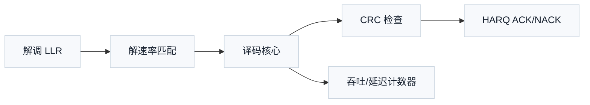

# T5.3 吞吐、延迟与并行度：译码器每秒能处理多少比特
## 本节学习目标

译码器设计不能只问“算法能不能译出来”，还必须问“多久译出来”和“每秒能译多少”。同一个算法，浮点 Python 参考模型可能跑几毫秒，硬件实现可能要求在几十微秒甚至更短时间内完成。吞吐、延迟、启动间隔、时钟频率、并行度和迭代次数就是描述这些约束的工程语言。

本节不是 3GPP 协议条文精读，但它解释为什么协议中的传输块大小、码块数量、混合自动重传请求时序、调制与编码方案和码率会变成译码器吞吐压力。

- 区分吞吐（throughput）、延迟（latency）和启动间隔（initiation interval）。
- 用块大小、周期数和时钟频率估算 bit/s。
- 解释并行度为什么会受存储 bank、算法依赖和迭代次数限制。
- 分别说明 Turbo（Turbo 码，Turbo Code）、低密度奇偶校验码和 Polar（极化码，Polar Code）的吞吐瓶颈直觉。
- 用 Python 复核一个译码器吞吐估算。
- 说明块错误率目标和最大迭代次数之间的工程取舍。

## 前置知识检查

| 前置项 | 本节需要达到的程度 |
|:---|:---|
| 码块/传输块 | 知道传输块可能被切成码块。 |
| 对数似然比 | 知道译码器输入通常是一串软信息。 |
| 迭代译码 | 知道 Turbo/LDPC（低密度奇偶校验码，Low-Density Parity-Check Code）可多轮迭代更新可靠度。 |
| 时钟周期 | 知道硬件每个周期执行有限工作。 |
| bank 冲突 | 知道存储冲突会让并行访问停顿。 |

如果只记住一句话：吞吐看长期平均每秒输出多少有效比特，延迟看单个块从输入到输出等多久，二者相关但不是同一个指标。

## 资料与协议边界

本节使用协议作为吞吐压力来源，而不是把吞吐公式说成 3GPP 公式。

| 协议背景 | 本地证据 |
| :--- | :--- |
| NR TS 38.214 Rel-19 `38214-j30` §5.1.3/§6.1.4 | `3GPP_Rel19/processed/TS_38.214_38214-j30` |
| TS 36.212/38.212 | `3GPP_Rel19/processed/TS_36.212_36212-j30`，`TS_38.212_38212-j30` |
| HARQ（混合自动重传请求，Hybrid Automatic Repeat Request）相关流程 | TS 36.213/38.214/36.321/38.321 后续专章核验 |

协议边界：3GPP 规定传输流程、参数来源和反馈时序，但不规定某个芯片的译码器必须使用多少并行度、多少 pipeline stage 或多少 MHz 时钟。本节公式是工程估算模型。

## 名称来源与常见误解

吞吐的英文 throughput 可以理解为“管道长期通过了多少东西”。它强调持续工作时的输出速率。延迟的英文 latency 强调“一个对象等待了多久”。启动间隔的英文 initiation interval 来自流水线设计，强调“多久可以发起下一件工作”。三者经常被混用，但在译码器里必须分开。

最常见的误解有三类：

| 误解 | 为什么错 | 正确理解 |
|:---|:---|:---|
| 单块延迟低，吞吐一定高 | 如果下一块必须等很久才能启动，长期输出仍然低。 | 吞吐要看启动间隔。 |
| 并行度翻倍，吞吐一定翻倍 | 存储冲突、控制开销和算法依赖会吞掉收益。 | 并行度只是上限，不是保证。 |
| 平均吞吐达标，实时性一定达标 | HARQ 反馈更关心最坏或高分位延迟。 | 同时报平均和最坏情况。 |

把译码器想成收费站会更直观：延迟是某一辆车从进站到出站花了多久；吞吐是每分钟通过多少辆车；启动间隔是连续两辆车进入同一个收费通道的间隔。收费站可以有多个通道，但如果前方道路合流处堵住，通道再多也不能线性提升通过量。译码器里的“合流处”通常就是存储 bank、交织地址、循环冗余校验早停控制和输出接口。

## 基本定义

### 延迟

延迟回答的问题是：一个块从进入译码器到输出结果，需要等待多少时间。

如果一个 CB（码块，Code Block）译码需要 $C_{\mathrm{blk}}$ 个周期，时钟频率为 $f_{\mathrm{clk}}$，则延迟为：

$$
T_{\mathrm{lat}}=\frac{C_{\mathrm{blk}}}{f_{\mathrm{clk}}}
\tag{1}
$$

例如 $C_{\mathrm{blk}}=2000$ cycles，$f_{\mathrm{clk}}=500\ \mathrm{MHz}$：

$$
T_{\mathrm{lat}}=\frac{2000}{500\times10^6}=4\ \mu s
\tag{2}
$$

### 吞吐

吞吐回答的问题是：长期运行时，每秒能输出多少比特。如果每个块有效信息为 $K$ bit，每隔 $C_{\mathrm{start}}$ 个周期可以启动一个新块，则吞吐为：

$$
R_{\mathrm{throughput}}=\frac{K\cdot f_{\mathrm{clk}}}{C_{\mathrm{start}}}
\tag{3}
$$

注意这里用的是启动间隔 $C_{\mathrm{start}}$，不一定等于单块延迟 $C_{\mathrm{blk}}$。如果 pipeline 做得好，一个块延迟可能是 2000 周期，但每 500 周期就能启动下一个块。

### 启动间隔

启动间隔（initiation interval）是连续两个块进入同一流水线之间的周期差。若：

$$
C_{\mathrm{start}}=C_{\mathrm{blk}}
\tag{4}
$$

说明译码器必须处理完当前块才能开始下一个块。若：

$$
C_{\mathrm{start}}<C_{\mathrm{blk}}
\tag{5}
$$

说明设计允许多个块在 pipeline 中重叠。

## 手算例子：由周期数估算吞吐

假设一个译码器处理每个 CB 的有效信息长度为：

$$
K=4096\ \mathrm{bit}
\tag{6}
$$

时钟频率：

$$
f_{\mathrm{clk}}=500\ \mathrm{MHz}
\tag{7}
$$

若每个块必须等待 4096 个周期才能启动下一个块：

$$
C_{\mathrm{start}}=4096
\tag{8}
$$

吞吐为：

$$
R_{\mathrm{throughput}}
=\frac{4096\times500\times10^6}{4096}
=500\times10^6\ \mathrm{bit/s}
\tag{9}
$$

也就是 500 Mbps。若通过 2 路并行或流水重叠把启动间隔降到 2048 周期：

$$
R_{\mathrm{throughput}}
=\frac{4096\times500\times10^6}{2048}
=1.0\times10^9\ \mathrm{bit/s}
\tag{10}
$$

吞吐翻倍，但单块延迟不一定翻倍改善。吞吐和延迟必须分别估算。

## 并行度的收益与限制

理想情况下，若并行度从 $P=1$ 提升到 $P=4$，每周期处理 4 个元素，周期数可以约降为四分之一：

$$
C(P)\approx \frac{C(1)}{P}
\tag{11}
$$

但真实译码器通常达不到理想比例，原因包括：

| 限制 | 影响 |
|:---|:---|
| 存储 bank 冲突 | 并行计算单元等数据，产生 stall。 |
| 算法依赖 | 当前状态依赖前一状态，无法完全并行。 |
| 控制开销 | pipeline 填充、清空和边界处理占周期。 |
| 迭代次数 | 每增加一次迭代，很多核心计算要重复。 |
| 循环冗余校验早停 | 平均周期数变小，但最坏周期数仍要按最大迭代设计。 |

更实际的模型可以写成：

$$
C(P,I)=C_{\mathrm{setup}}+I\cdot C_{\mathrm{iter}}(P)+C_{\mathrm{finish}}+C_{\mathrm{stall}}
\tag{12}
$$

其中 $I$ 是迭代次数，$C_{\mathrm{stall}}$ 是冲突和等待造成的额外周期。这个公式提醒你：提高并行度只影响 $C_{\mathrm{iter}}(P)$ 的一部分，不能消除初始化、收尾和冲突。

## 迭代次数与平均吞吐

Turbo 和 LDPC 译码常常设置最大迭代次数 $I_{\max}$。如果每个块都跑满最大迭代，则：

$$
C_{\mathrm{worst}}=C_{\mathrm{setup}}+I_{\max}C_{\mathrm{iter}}+C_{\mathrm{finish}}
\tag{13}
$$

但实际链路中，CRC（循环冗余校验，Cyclic Redundancy Check）早停可能让很多块提前结束。若第 $i$ 次迭代停止的概率为 $p_i$，平均迭代次数为：

$$
\bar{I}=\sum_{i=1}^{I_{\max}} i\cdot p_i
\tag{14}
$$

平均周期数约为：

$$
C_{\mathrm{avg}}=C_{\mathrm{setup}}+\bar{I}C_{\mathrm{iter}}+C_{\mathrm{finish}}
\tag{15}
$$

工程上要同时报告 worst-case 和 average-case。HARQ 反馈期限通常关心最坏或高分位延迟；吞吐宣传容易引用平均值，但验证不能只看平均值。

## 三类译码器的瓶颈直觉

| 译码器 | 主要并行机会 | 主要限制 |
|:---|:---|:---|
| LTE Turbo | 两个软输入软输出译码器、多个 CB 并行、trellis 前后向递推流水 | trellis 状态递推有时间依赖，交织/解交织访问会造成存储压力。 |
| NR LDPC | 校验节点/变量节点并行、layered schedule、多列组并行 | 消息存储巨大，bank 冲突和层间依赖限制并行度。 |
| NR Polar | 树节点并行、列表路径并行、候选排序并行 | 路径复制、排序和 CRC 辅助选择造成控制和存储瓶颈。 |

这张表不是协议规定，而是硬件实现直觉。协议决定结构，结构决定可并行性，可并行性再被存储和控制进一步限制。

## 接收端流程中的吞吐位置



译码器吞吐不只由 C 决定。B 的解速率匹配可能因为循环缓存和 bank 冲突产生 stall；D 的 CRC 检查可能决定早停；E 的反馈期限可能反过来要求 C 不能跑太多迭代。

## Python 估算片段

```python
def latency_seconds(cycles: int, f_clk_hz: float) -> float:
    """Return block latency. Time: O(1), Space: O(1)."""
    return cycles / f_clk_hz


def throughput_bps(info_bits: int, start_interval_cycles: int, f_clk_hz: float) -> float:
    """Return long-run throughput. Time: O(1), Space: O(1)."""
    return info_bits * f_clk_hz / start_interval_cycles


def average_iterations(stop_probs: list[float]) -> float:
    """Return expected iteration count. Time: O(I), Space: O(1)."""
    return sum((idx + 1) * prob for idx, prob in enumerate(stop_probs))


assert abs(latency_seconds(2000, 500e6) - 4e-6) < 1e-15
assert throughput_bps(4096, 4096, 500e6) == 500e6
assert throughput_bps(4096, 2048, 500e6) == 1e9
assert abs(average_iterations([0.2, 0.5, 0.3]) - 2.1) < 1e-12
print("T5.3_THROUGHPUT_LATENCY_OK")
```

## 浮点仿真方案

| 仿真项 | 方法 | 通过条件 |
|:---|:---|:---|
| 周期估算 | 用参数模型计算 latency/throughput | 与手算例子一致。 |
| 迭代分布 | 输入停止概率分布 | 平均迭代次数正确。 |
| Stall 影响 | 增加 bank conflict 周期 | 吞吐随 stall 增大而下降。 |
| 早停影响 | 比较固定迭代和随机早停 | 平均吞吐改善，最坏延迟不变。 |

这类仿真是架构估算，不替代 bit-exact 译码仿真，也不替代寄存器传输级仿真。后续若进入专用集成电路实现，还要把周期估算与综合频率、面积和功耗一起核对。

## 定点化策略

定点位宽会改变吞吐模型，因为它改变存储带宽和数据通路宽度。若一个静态随机存取存储器word 宽为 48 bit：

| LLR（对数似然比，Log-Likelihood Ratio）位宽 | 每 word 可放 LLR 数 | 对并行度的影响 |
|---:|---:|:---|
| 6 bit | 8 | 可自然支持 8 路读取。 |
| 8 bit | 6 | 同样 word 宽下 8 路读取需要更多 bank 或更宽 word。 |
| 10 bit | 4 | 存储带宽压力明显增加。 |

因此，提升定点精度可能改善 BLER（块错误率，Block Error Rate），但也可能降低可实现吞吐。架构评估必须把性能曲线和面积/带宽放在同一张表里比较。

## 硬件实现映射

本节只讨论实现层指标，不把时钟频率或并行度写成协议要求。

| 模块 | 吞吐相关参数 | 验证关注点 |
|:---|:---|:---|
| 输入 FIFO | 写入速率、深度 | 峰值输入不丢数据。 |
| 解速率匹配 | 每周期 LLR 放置数 | RV（冗余版本，Redundancy Version）地址生成不产生不可接受 stall。 |
| 译码核心 | 并行度、迭代周期 | 最大迭代下满足延迟约束。 |
| CRC/早停控制 | CRC 检查周期、停止时机 | 早停不输出错误块。 |
| 输出接口 | 输出带宽、backpressure | 下游 ready 拉低时状态保持正确。 |

硬件验收应同时记录：

- `cycles_per_cb`
- `cycles_per_tb`
- `iterations_used`
- `stall_cycles`
- `early_stop_reason`
- `crc_status`

这些计数器能把 BLER 异常和吞吐异常关联起来。

## 验证方法

| 验证层级 | 检查内容 | 通过标准 |
|:---|:---|:---|
| 单元测试 | 吞吐/延迟公式 | 与手算和 Python 一致。 |
| 架构仿真 | 不同并行度 $P$ | 周期数随 $P$ 增大合理下降，stall 可解释。 |
| 集成测试 | 最大迭代 | 不超过反馈期限或设计预算。 |
| 压力测试 | 连续 TB（传输块，Transport Block）/CB 输入 | FIFO 不溢出，输出不乱序。 |
| 性能回归 | BLER vs cycles | 早停策略不牺牲目标 BLER。 |

## 常见错误

| 错误 | 后果 | 修正 |
|:---|:---|:---|
| 把延迟当吞吐 | 单块快不等于长期输出高。 | 分别报告 latency 和 throughput。 |
| 忽略启动间隔 | 高估流水线吞吐。 | 用 $C_{\mathrm{start}}$ 计算长期吞吐。 |
| 只报平均迭代 | 最坏 HARQ 反馈超时。 | 同时报 worst-case 和 average-case。 |
| 并行度只看计算单元 | 存储冲突导致单元空转。 | 加入 bank conflict/stall 模型。 |
| 提高位宽不重算带宽 | SRAM（静态随机存取存储器，Static Random-Access Memory）和互连成为瓶颈。 | 位宽变更同步更新容量和端口需求。 |

## 工程思考题

1. 为什么 $C_{\mathrm{start}}$ 比 $C_{\mathrm{blk}}$ 更适合计算长期吞吐？
2. 若 $K=6144$、$f_{\mathrm{clk}}=400\ \mathrm{MHz}$、$C_{\mathrm{start}}=2048$，吞吐是多少？
3. 最大迭代次数增加一定会降低平均吞吐吗？
4. 为什么并行度提升可能被 bank 冲突抵消？
5. 为什么协议中的 TBS（传输块大小，Transport Block Size）/MCS（调制与编码方案，Modulation and Coding Scheme）会影响译码器吞吐压力？

## 工程思考题参考答案

1. 长期吞吐取决于新块能多久启动一次；单块延迟可能被流水线重叠隐藏。
2. $6144\times400\times10^6/2048=1.2\times10^9$ bit/s，即 1.2 Gbps。
3. 不一定。如果 CRC 早停让大多数块提前结束，平均迭代可能变化不大；但最坏延迟会增加。
4. 计算单元需要数据。若并行访问落到同一 bank，硬件必须等待，计算单元空转。
5. TBS 决定每次传输的信息量，MCS 影响调制阶数和码率，二者共同改变 LLR 数量、CB 数量和反馈期限内的处理压力。

## 自测题

1. 延迟和吞吐的区别是什么？
2. 启动间隔是什么意思？
3. $C_{\mathrm{blk}}=3000$、$f_{\mathrm{clk}}=600\ \mathrm{MHz}$ 时延迟是多少？
4. 为什么要同时记录 `stall_cycles` 和 `iterations_used`？
5. 早停改善的是最坏延迟还是平均周期数？

## 自测题参考答案

1. 延迟是单个块从输入到输出等待多久；吞吐是长期平均每秒输出多少比特。
2. 连续两个块进入同一处理流水线之间的周期间隔。
3. $3000/(600\times10^6)=5\ \mu s$。
4. 两者分别解释存储/接口等待和算法迭代负担，缺一项都难定位吞吐下降原因。
5. 通常改善平均周期数；最坏延迟仍由最大迭代和最坏 stall 决定。

## 本节验收

| 验收项 | 通过标准 |
|:---|:---|
| 概念区分 | 能区分 latency、throughput、initiation interval。 |
| 手算能力 | 能用 $Kf/C_{\mathrm{start}}$ 估算吞吐。 |
| 迭代意识 | 能说明最大迭代和平均迭代的区别。 |
| 并行限制 | 能列出至少三种限制并行收益的因素。 |
| 协议桥接 | 能说明 TBS/MCS/HARQ 时序为何会影响译码器预算。 |

## 协议证据表

| 证据 | 状态 | 本节结论 |
|:---|:---|:---|
| TS 38.214 §5.1.3/§6.1.4 | 已定位为背景 | MCS/TBS 相关流程会影响每次传输的数据规模。 |
| TS 36.212/38.212 分段和编码 | 已定位为背景 | CB 数量和编码结构影响译码器处理量。 |
| 具体时钟频率/并行度 | 不适用 | 属于芯片实现和产品需求，不是 3GPP 规定。 |
## 执行与证据记录

| 项目 | 记录 |
|:---|:---|
| 本地资料 | 依据路线图 T5.3 prompt；协议锚点采用 TS 38.214、TS 36.212、TS 38.212 背景路径。 |
| 教学公式 | 自写 latency、throughput、启动间隔、迭代周期和平均迭代公式。 |
| Python 验证 | 提供 `T5.3_THROUGHPUT_LATENCY_OK` 估算片段。 |
| LaTeX 审计 | 完成后运行 `tools/audit_latex_render.py` 对本节公式实际渲染全检。 |
| 协议边界 | 不把吞吐公式、并行度或时钟频率写成 3GPP 强制要求。 |

## 参考文献

- [3GPP, 2026a] 3GPP TS 38.214, Rel-19, `38214-j30`, Physical layer procedures for data, §5.1.3 and §6.1.4. Local path: `3GPP_Rel19/processed/TS_38.214_38214-j30`.
- [3GPP, 2026b] 3GPP TS 36.212, Rel-19, `36212-j30`, Multiplexing and channel coding. Local path: `3GPP_Rel19/processed/TS_36.212_36212-j30`.
- [3GPP, 2026c] 3GPP TS 38.212, Rel-19, `38212-j30`, Multiplexing and channel coding. Local path: `3GPP_Rel19/processed/TS_38.212_38212-j30`.
- [Hennessy and Patterson, 2019] John L. Hennessy and David A. Patterson, *Computer Architecture: A Quantitative Approach*, 6th ed., Morgan Kaufmann, 2019.
