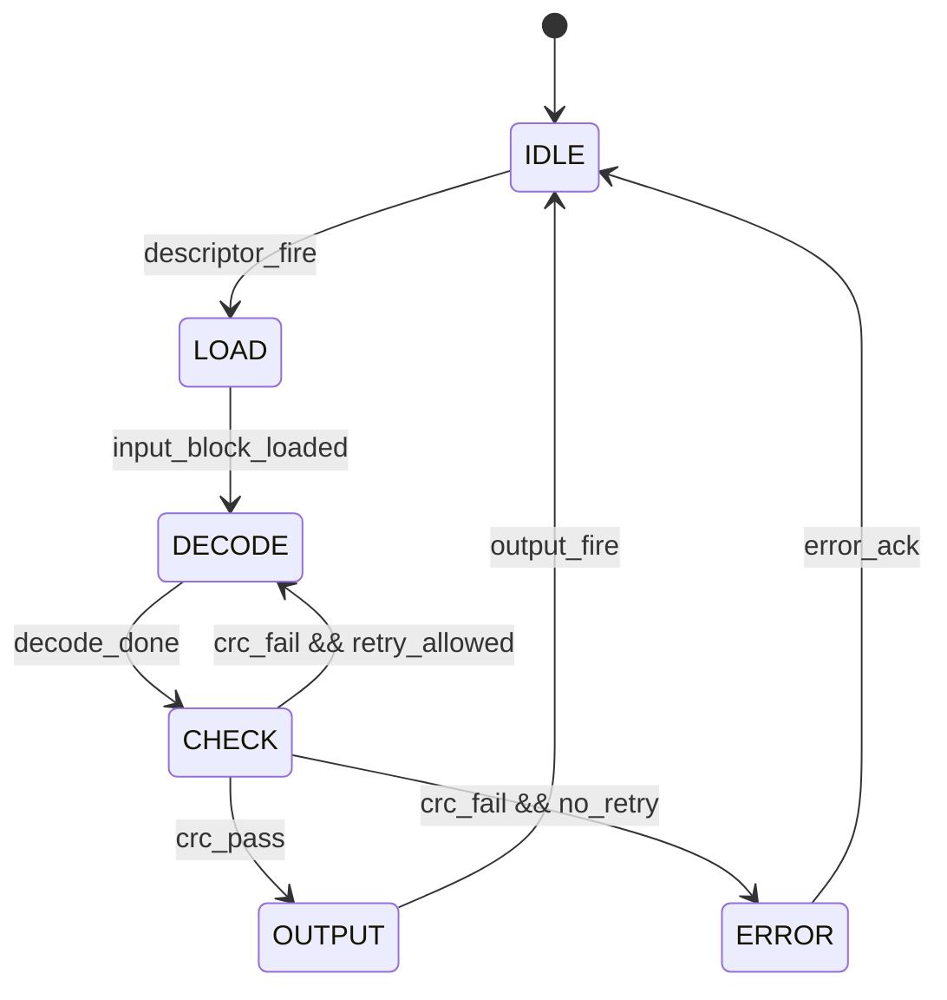

# T5.4 硬件状态机与握手基础：译码模块如何接收、处理和输出一个块
## 本节学习目标

前面讲了定点对数似然比、存储 bank、吞吐和延迟。现在要把这些工程概念放进一个硬件模块里：译码器什么时候接收输入，什么时候开始处理，什么时候检查循环冗余校验，什么时候输出结果，什么时候报告错误。

本节讲寄存器传输级接口、valid/ready 握手、有限状态机（Finite State Machine, FSM）、复位和时钟域基础。它不是 3GPP 协议条文，但所有 LTE/NR 译码器最终都需要类似控制结构把协议 descriptor、对数似然比输入、译码核心和输出接口连接起来。


- 解释 `valid`、`ready`、`fire` 三个握手概念。
- 画出包含 idle、load、decode、check、output、error 的译码控制 FSM。
- 说明同步复位、异步复位和时钟域跨越的基本风险。
- 写出一个 SystemVerilog 风格的译码器接口片段。
- 说明协议字段如何进入 descriptor，而不是直接散落在 RTL（寄存器传输级，Register Transfer Level）状态机里。

## 前置知识检查

| 前置项 | 本节需要达到的程度 |
|:---|:---|
| LLR（对数似然比，Log-Likelihood Ratio） | 知道译码器输入是一串软信息。 |
| CRC（循环冗余校验，Cyclic Redundancy Check） | 知道 CRC pass/fail 可作为译码结果验收。 |
| 状态 | 能理解模块当前处于 idle 或 decode 等阶段。 |
| 时钟周期 | 知道 RTL 每个时钟沿更新寄存器。 |
| 吞吐/延迟 | 知道状态机停顿会增加周期数。 |

如果只记住一句话：握手解决“什么时候数据有效、什么时候对方能接收”，状态机解决“模块当前应该做哪一步”。

## 状态机的工程动机

有限状态机的名字来自一个简单事实：硬件模块不可能在同一个周期里同时处于无限多种情况。它只能处在有限个可命名状态中，例如等待、装载、计算、检查、输出。每个状态决定当前周期允许哪些动作，下一状态逻辑决定下一个周期进入哪里。

可以把 FSM 拆成两部分：

| 部分 | 作用 | 零基础解释 |
|:---|:---|:---|
| 状态寄存器 | 保存当前状态 | “我现在在哪一步”。 |
| 下一状态组合逻辑 | 根据当前状态和事件计算下一状态 | “如果发生这个事件，下一步去哪里”。 |
| 输出逻辑 | 根据状态产生控制信号 | “当前这一步要打开哪些开关”。 |

译码器需要 FSM，是因为译码流程有顺序依赖：没有 descriptor 就不能知道块长；没有装完 LLR 就不能启动译码；译码没完成就不能检查 CRC；下游没 ready 就不能丢输出。若用一堆互不相关的 enable 信号临时拼接，很容易出现“输入没装完就开始译码”“CRC 还在 busy 又启动一次”“输出没被接收就覆盖结果”这类错误。

一个好的 FSM 至少要满足三条原则：

| 原则 | 含义 | 译码器例子 |
|:---|:---|:---|
| 状态互斥 | 同一周期只处于一个主状态 | 不能同时 `LOAD` 和 `OUTPUT`。 |
| 转移有因 | 每次跳转都有明确事件 | `input_block_loaded` 后才进入 `DECODE`。 |
| 输出可解释 | 每个控制信号能追溯到状态或握手 | `llr_ready` 只在能接收输入时拉高。 |

## 术语来源、正式定义与工程后果

`valid` 和 `ready` 这两个名字来自流式接口的直观分工：发送方声明“我手里这份数据有效”，接收方声明“我现在准备好接收”。它们解决的问题是上下游速度不一致。软解调器可能每周期都能吐 LLR，但译码器可能因为 bank 冲突、soft buffer 读改写或输出 backpressure 暂时不能接收；如果没有握手，数据就会丢失或重复。

`fire` 不是一个必须真实出现在 RTL 端口上的协议信号，而是工程上常用的内部判断符号。它的正式定义就是式 (1)：`valid && ready`。这个定义的工程后果很强：所有会改变数据所有权的动作，例如输入计数器加一、写入 buffer、锁存 descriptor，都应该由 `fire` 驱动，而不是只看 `valid` 或只看 `ready`。

FSM 的历史来源可以粗略理解为数字电路里的“有限自动机”模型：系统有有限个状态，输入事件触发状态跳转，状态和输入共同决定输出。对译码器来说，这个模型特别合适，因为接收端流程天然分阶段：接收配置、装载软信息、执行迭代、检查 CRC、输出结果。每个阶段的控制信号不同，把它们命名成状态可以减少隐藏条件。

常见误解是把状态机画成流程图就算完成设计。流程图只说明“希望怎样走”，RTL 还必须定义每个状态下输出是什么、哪些事件有效、异常事件怎样处理、复位后落到哪里、下游不 ready 时是否保持数据。遗漏这些定义，仿真可能在正常路径通过，但边界条件一来就出现死锁、重复输出或数据覆盖。

## 资料与协议边界

本节是实现基础课，3GPP 规范不规定 RTL 状态机的具体状态名、valid/ready 信号名、复位方式或 pipeline 划分。协议相关信息通常会在上游被整理成 descriptor，例如：

| descriptor 字段 | 协议来源示例 | RTL 用途 |
|:---|:---|:---|
| 传输块/码块长度 | TS 36.212/38.212 分段规则 | load 状态知道需要接收多少 LLR。 |
| CRC 类型 | TS 36.212/38.212 CRC 章节 | check 状态选择 CRC 检查配置。 |
| 冗余版本/重传进程 | PHY/媒体接入控制层调度和混合自动重传请求流程 | 选择 soft buffer 和解速率匹配地址。 |
| 最大迭代次数 | 产品配置或寄存器 | decode 状态决定停止条件。 |

本节不会复现协议表格和公式。它只说明协议参数进入硬件后的控制形态：descriptor 被锁存，状态机根据 descriptor 控制输入、译码、检查和输出。

## valid/ready 握手

valid/ready 是硬件流接口中常见的反压（backpressure）机制。

| 信号 | 发起方 | 含义 |
|:---|:---|:---|
| `valid` | 数据发送方 | 当前周期数据有效。 |
| `ready` | 数据接收方 | 当前周期可以接收数据。 |
| `fire` | 双方共同条件 | `valid && ready`，表示一次传输真正发生。 |

用公式写：

$$
\mathrm{fire}=\mathrm{valid}\land \mathrm{ready}
\tag{1}
$$

如果 `valid=1` 但 `ready=0`，发送方必须保持数据稳定，等待接收方准备好。如果 `valid=0` 但 `ready=1`，接收方空等，不应采样无效数据。

## 手算例子：三周期握手

假设输入接口三个周期的信号如下：

| cycle | valid | ready | fire | 说明 |
|---:|:---:|:---:|:---:|:---|
| 0 | 1 | 0 | 0 | 数据有效，但译码器不能收，发送方保持。 |
| 1 | 1 | 1 | 1 | 传输发生，译码器采样数据。 |
| 2 | 0 | 1 | 0 | 没有有效数据，译码器不能采样。 |

按式 (1)，只有 cycle 1 的 `fire=1`。如果 RTL 在 cycle 0 也采样，就会在未准备好时吞掉数据；如果 cycle 2 采样，就会读入无效值。

## 译码器控制状态机

一个入门级译码器控制 FSM 可以包含六个状态：



| 状态 | 作用 | 典型输出控制 |
|:---|:---|:---|
| `IDLE` | 等待 descriptor | `desc_ready=1` |
| `LOAD` | 接收 LLR 或从 soft buffer 取数 | `llr_ready=1` |
| `DECODE` | 启动译码核心迭代 | `core_enable=1` |
| `CHECK` | 检查 CRC 或停止条件 | `crc_start=1` |
| `OUTPUT` | 输出硬判决和状态 | `out_valid=1` |
| `ERROR` | 报告不可恢复错误 | `err_valid=1` |

这个 FSM 是教学骨架，不是所有译码器都必须这样划分。高性能设计可能把 load、decode 和 output 做流水重叠，但控制语义仍然存在。

## 状态转移条件

状态转移必须由明确事件驱动，而不是由“估计应该好了”驱动。

| 转移 | 条件 | 风险 |
|:---|:---|:---|
| `IDLE -> LOAD` | descriptor 被握手接收 | 未锁存 descriptor 会导致配置丢失。 |
| `LOAD -> DECODE` | 输入块全部装载完成 | 少收一个 LLR 会导致地址错位。 |
| `DECODE -> CHECK` | 核心完成或达到迭代停止条件 | 提前跳转会输出未收敛结果。 |
| `CHECK -> OUTPUT` | CRC pass | CRC 配置错会误通过或误失败。 |
| `CHECK -> DECODE` | CRC fail 且允许继续迭代 | 外信息和状态必须保持。 |
| `OUTPUT -> IDLE` | 输出握手完成 | 下游未 ready 时不能丢结果。 |

## 复位策略

复位（reset）用于把状态机和寄存器带回已知状态。常见有两类：

| 类型 | 特点 | 风险 |
|:---|:---|:---|
| 同步复位 | 只在时钟沿生效 | 时序友好，但时钟未运行时不能复位。 |
| 异步复位 | 不等时钟即可生效 | 释放复位时可能产生时序和亚稳态风险。 |

译码器复位后至少要保证：

- FSM 回到 `IDLE`。
- `valid` 输出为 0。
- 错误状态和计数器清零或进入已定义值。
- 未完成的 soft buffer 操作不会被误提交。
- descriptor 寄存器不会被当作有效配置使用。

## 时钟域基础

如果 descriptor 来自一个时钟域，译码核心在另一个时钟域，就出现时钟域跨越（Clock Domain Crossing, CDC）。CDC 不是简单连线问题，因为一个时钟域的信号可能在另一个时钟域采样时处于变化边界，导致亚稳态。

入门阶段只需要记住：

| 场景 | 常见处理 |
|:---|:---|
| 单 bit 控制脉冲跨域 | 同步器、toggle 或握手同步。 |
| 多 bit descriptor 跨域 | 异步 FIFO 或完整握手后保持稳定。 |
| LLR 数据流跨域 | 异步 FIFO。 |
| 复位跨域 | 异步 assert，同步 deassert。 |

本课程后续若进入 RTL 代码实现，CDC 必须单独做 lint 和形式/结构检查。本节只建立概念。

## SystemVerilog 接口片段

下面是教学用接口片段，展示 descriptor、LLR 输入和输出结果的握手形态。

```systemverilog
// @Purpose: Decoder top-level handshake skeleton.
// @Clock: clk_i single clock domain.
// @Reset: rst_ni active-low reset, synchronously released by integration logic.
// @Width: LLR_W includes sign bit; LEN_W covers max code-block length.
interface decoder_if #(
  parameter int LLR_W = 6,
  parameter int LEN_W = 16
);
  logic                  desc_valid;
  logic                  desc_ready;
  logic [LEN_W-1:0]      cb_len;
  logic [3:0]            max_iter;

  logic                  llr_valid;
  logic                  llr_ready;
  logic signed [LLR_W-1:0] llr_data;

  logic                  out_valid;
  logic                  out_ready;
  logic                  crc_pass;
  logic                  err;
endinterface
```

真实项目通常不会只用 interface，还会拆分输入流、输出流、配置寄存器、debug counter 和中断信号。本节重点是握手语义。

## Python FSM 检查片段

下面用 Python 模拟一个最小状态机，验证 CRC pass 和 CRC fail 路径。

```python
def next_state(state: str, event: str) -> str:
    """Toy decoder FSM transition. Time: O(1), Space: O(1)."""
    table = {
        ("IDLE", "descriptor_fire"): "LOAD",
        ("LOAD", "input_block_loaded"): "DECODE",
        ("DECODE", "decode_done"): "CHECK",
        ("CHECK", "crc_pass"): "OUTPUT",
        ("CHECK", "crc_fail_no_retry"): "ERROR",
        ("OUTPUT", "output_fire"): "IDLE",
        ("ERROR", "error_ack"): "IDLE",
    }
    return table.get((state, event), state)


state = "IDLE"
for event in ["descriptor_fire", "input_block_loaded", "decode_done", "crc_pass", "output_fire"]:
    state = next_state(state, event)
assert state == "IDLE"

state = "IDLE"
for event in ["descriptor_fire", "input_block_loaded", "decode_done", "crc_fail_no_retry", "error_ack"]:
    state = next_state(state, event)
assert state == "IDLE"
print("T5.4_DECODER_FSM_OK")
```

## 浮点仿真方案

本节不做通信浮点仿真，而做控制模型仿真：

| 仿真项 | 方法 | 通过条件 |
|:---|:---|:---|
| 握手 | 构造 valid/ready 序列 | 只有 fire 周期采样。 |
| 状态转移 | 构造 pass/fail 事件 | FSM 路径符合设计表。 |
| backpressure | output ready 拉低 | out_valid 保持，数据不丢。 |
| 错误路径 | CRC fail 且无 retry | 进入 ERROR 并等待 ack。 |

## 定点化策略

状态机本身不关心 LLR 小数位，但接口必须固定 LLR 位宽。若 `LLR_W` 改变：

| 影响对象 | 需要更新 |
|:---|:---|
| 输入接口 | `llr_data` 位宽。 |
| 静态随机存取存储器packing | 每个 word 中 LLR 数量。 |
| 译码核心 | 内部符号扩展和饱和逻辑。 |
| 验证向量 | bit-exact 参考输出。 |

因此，定点格式应写入 descriptor 或模块参数，而不是散落在状态机条件里。

## 硬件实现映射

| 设计对象 | RTL 落点 | 验证关注点 |
|:---|:---|:---|
| Descriptor latch | `desc_fire` 时锁存 | 未 fire 不得更新。 |
| Input counter | LOAD 状态计数 LLR | 不多收、不少收。 |
| Iteration counter | DECODE 状态计数 | 最大迭代和早停优先级正确。 |
| CRC controller | CHECK 状态启动 | CRC busy 时不重复启动。 |
| Output skid buffer | OUTPUT 状态保持结果 | 下游 backpressure 不丢数据。 |
| Error latch | ERROR 状态保存原因 | ack 前保持可读。 |

## 验证方法

| 验证层级 | 检查内容 | 通过标准 |
|:---|:---|:---|
| 单元测试 | valid/ready/fire | 只有 fire 才采样数据。 |
| 单元测试 | FSM 所有状态 | 每个状态都有合法退出条件。 |
| 复位测试 | reset 中断各状态 | 复位后回到 IDLE，输出无效。 |
| backpressure | out_ready 拉低 | out_valid 和数据保持。 |
| 错误注入 | CRC fail、长度错误、超时 | 进入 ERROR 并报告原因。 |
| 覆盖率 | 状态和转移覆盖 | 所有状态、主要转移被覆盖。 |

## 常见错误

| 错误 | 后果 | 修正 |
|:---|:---|:---|
| `valid` 高时 `ready` 低仍采样 | 数据丢失或重复。 | 只在 `valid && ready` 采样。 |
| 输出未 ready 时清空结果 | 下游读不到结果。 | OUTPUT 状态保持到 `out_fire`。 |
| CRC busy 时重复启动 | CRC 结果不可预测。 | 增加 busy/done 握手。 |
| descriptor 未锁存 | 解码中配置变化。 | `desc_fire` 后锁存到内部寄存器。 |
| 复位释放未同步 | 状态机进入非法状态。 | 复位释放按时钟域同步处理。 |

## 工程思考题

1. `valid=1`、`ready=0` 时发送方应该怎么做？
2. 为什么 descriptor 要在 `desc_fire` 后锁存？
3. CRC fail 后一定进入 ERROR 吗？
4. 输出接口 backpressure 会影响什么？
5. 为什么多 bit descriptor 跨时钟域不能简单用两个触发器同步每一位？

## 工程思考题参考答案

1. 保持数据和 valid 稳定，等待 ready 变成 1。
2. 防止上游配置变化影响正在进行的译码任务。
3. 不一定。如果允许继续迭代或等待 HARQ（混合自动重传请求，Hybrid Automatic Repeat Request）重传，可能回到 DECODE 或保留 soft buffer；无 retry 或出现不可恢复错误时进入 ERROR。
4. 输出结果必须保持，状态机不能释放 buffer 或覆盖结果，否则下游会丢数据。
5. 多 bit 信号各位可能在不同周期被采样，形成从未真实存在过的组合；应使用异步 FIFO 或完整握手。

## 自测题

1. `fire` 的定义是什么？
2. `IDLE -> LOAD` 的典型条件是什么？
3. 复位后 `out_valid` 应该是什么值？
4. LOAD 状态的输入计数器用于防止什么问题？
5. 本节为什么不引用某个 3GPP FSM 图作为规范？

## 自测题参考答案

1. `fire = valid && ready`。
2. descriptor 被 valid/ready 握手成功接收。
3. 应该为 0，避免复位后输出伪有效结果。
4. 防止 LLR 少收或多收，保证输入块长度与 descriptor 一致。
5. 3GPP 规定协议处理和参数，不规定芯片内部 FSM 状态划分；FSM 是实现选择。

## 本节验收

| 验收项 | 通过标准 |
|:---|:---|
| 握手理解 | 能解释 valid/ready/fire。 |
| 状态机 | 能画出 idle/load/decode/check/output/error 流程。 |
| 复位 | 能说明复位后哪些信号必须回到安全值。 |
| CDC 边界 | 能说出跨时钟域需要专门处理。 |
| 协议边界 | 能说明协议参数进入 descriptor，FSM 结构不是 3GPP 强制规定。 |

## 协议证据表

| 主题 | 证据状态 | 本节结论 |
|:---|:---|:---|
| RTL valid/ready 命名 | 不适用 | 属于实现接口约定。 |
| FSM 状态划分 | 不适用 | 属于芯片微架构选择。 |
| CRC pass/fail | 下游协议章节提供 CRC 规则 | 本节只把 CRC status 作为控制输入。 |
| TB（传输块，Transport Block）/CB（码块，Code Block）/RV（冗余版本，Redundancy Version）/HARQ descriptor | 下游协议章节提供来源 | 本节说明 descriptor 如何驱动状态机。 |
## 执行与证据记录

| 项目 | 记录 |
|:---|:---|
| 本地资料 | 依据路线图 T5.4 prompt；未使用 3GPP 表格作为本节规范结论。 |
| 教学图 | 使用 Mermaid `stateDiagram-v2` 自绘译码器 FSM。 |
| 代码片段 | 提供 SystemVerilog 风格接口和 Python FSM 检查。 |
| Python 验证 | 提供 `T5.4_DECODER_FSM_OK` 状态转移片段。 |
| LaTeX 审计 | 完成后运行 `tools/audit_latex_render.py` 对本节公式实际渲染全检。 |
| 协议边界 | 明确 FSM、握手、复位和 CDC 为实现基础，不是 3GPP 强制结构。 |

## 参考文献

- [3GPP, 2026a] 3GPP TS 36.212, Rel-19, `36212-j30`, Multiplexing and channel coding. 本节只把 CRC、TB/CB 和译码输入作为下游协议背景，不引用具体公式或表格。
- [3GPP, 2026b] 3GPP TS 38.212, Rel-19, `38212-j30`, Multiplexing and channel coding. 本节只把 CRC、TB/CB 和译码输入作为下游协议背景，不引用具体公式或表格。
- [Sutherland et al., 2007] Stuart Sutherland, Simon Davidmann, and Peter Flake, *SystemVerilog for Design*, 2nd ed., Springer, 2007.
