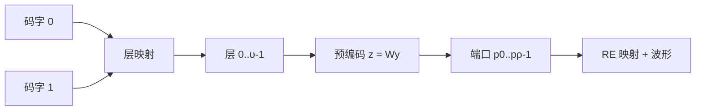

# TX3 层映射与预编码：符号流到天线端口的空间分配

## 本节学习目标

TX1/TX2 讲了比特如何变成调制符号（调制映射）与符号前的随机化（加扰/交织）。本节回答符号之后的处理：**调制符号流如何变成多天线端口的发射信号**。两个环节：**层映射（layer mapping）**把码字（codeword）的符号流分配到多个层（layer）——每层一个独立数据流；**预编码（precoding）**把层向量乘预编码矩阵 $W$ 变成天线端口向量（$z = Wy$）——把数据流"指向"空间方向。

这两个环节与 T12 系列（MIMO 接收机与检测器）构成镜像：发送端 $z = Wy$（预编码）、信道 $y = Hz + n$、接收端检测（MMSE/ZF，T12.3）恢复 $z$ 再解预编码。**发送端的"空间分配"与接收端的"空间分离"是同一套线性代数的两端**。本节的协议锚点：TS 38.211 §6.3.1.3（层映射）与 §6.3.1.5（预编码），本地 j30 原文核对。

学完本节后，应能做到：

- 说出码字/层/天线端口三个概念的区别与约束（层数 ≤ 秩 ≤ min(端口数)，T12 衔接），并画出"码字 → 层 → 端口"的流向。
- 说出层映射的规则（38.211 §6.3.1.3：单/双码字到 1-8 层的符号分配表），并完成 2 码字 → 4 层的 numpy 往返验证。
- 写出预编码模型 $z = Wy$（§6.3.1.5），解释 codebook 与 non-codebook 的差异，并完成功率保持验证（$W$ 酉）。
- 完成"预编码 → 信道 → MMSE 检测 → 解预编码"的端到端仿真，验证恢复误差。
- 把层映射/预编码放进发送链（TX1-TX5 坐标系），并说明与 T12 接收检测的镜像关系。

## 前置知识检查

| 前置项 | 本节需要达到的程度 |
|:---|:---|
| [[T12.1_mimo_receiver_chain_overview|T12.1]] MIMO 接收链 | 知道层/秩/天线的约束与 SVD 的容量语义——本节给发送端模型。 |
| [[T12.3_linear_detectors_mf_zf_mmse|T12.3]] 线性检测 | 知道 MMSE/ZF 检测——本节端到端仿真的接收端环节。 |
| [[Layer_Mapping_层映射]]、[[Precoding_预编码]] 概念笔记 | 知道层映射与预编码的粗轮廓——本节给规则与数值。 |
| [[TX1_modulation_mapping|TX1]] 调制映射 | 知道层映射的输入是调制符号流。 |

如果只记一个原则：**层映射是"把符号流拆成多路"（每层一路），预编码是"把多路指向空间方向"（乘 W 映射到端口）——接收端用检测与解预编码还原**。

## 码字、层与端口：三个概念的坐标系

### 三者的区别

| 概念 | 含义 | 数量关系 |
|:---|:---|:---|
| 码字（codeword） | 一次传输的编码数据块（CRC + 编码 + 速率匹配后的整体） | 1 或 2 个 |
| 层（layer） | 并行传输的空间数据流 | 1-8 个 |
| 天线端口（antenna port） | 与参考信号关联的发射通道（DM-RS 端口） | 1-32 个 |

**约束链**：层数 ≤ 秩（信道秩，T12.1）≤ min(发射端口数, 接收天线数)。码字数 ≤ 层数（2 码字时层数 ≥ 2）。

### 流向总览



**教学要点**：码字是"数据块"概念（一次传输的编码结果），层是"空间流"概念（并行通道），端口是"物理通道"概念（发射天线）。层映射是"数据块 → 空间流"的分配，预编码是"空间流 → 物理通道"的映射。

### 生活类比：多车道货物分配

层映射像把一车货物（码字）拆成几辆并行货车（层）——每辆车装一部分（符号交替分配），车数由路况（信道秩）决定；预编码像给每辆车指定车道方向（天线端口）——通过路况（信道矩阵）计算最佳方向（预编码矩阵 W），让所有车并行不撞（空间复用）。接收端（T12）像收费站的多车道接收——分别收每辆车的货再拼回（检测 + 解预编码）。

## 层映射规则（38.211 §6.3.1.3）

### 单码字到多层

| 层数 υ | 码字数 | 映射规则（符号级交替） |
|:---|:---|:---|
| 1 | 1 | 全部符号到层 0 |
| 2 | 1 | 偶数位 → 层 0，奇数位 → 层 1 |
| 3 | 1 | 轮转：层 0/1/2 各取第 i 位 |
| 4 | 1 | 轮转到 4 层 |

### 双码字到多层

| 层数 υ | 码字数 | 映射规则 |
|:---|:---|:---|
| 2 | 2 | 码字 0 → 层 0，码字 1 → 层 1 |
| 3 | 2 | 码字 0 → 层 0（全部），码字 1 → 层 1/2（交替） |
| 4 | 2 | 码字 0 → 层 0/1（交替），码字 1 → 层 2/3（交替） |
| 6/8 | 2 | 各码字按比例分配到多层 |

**教学例（2 码字 → 4 层）**：码字 0 的符号 $d_0, d_1, \ldots$ 交替到层 0/1（$d_0 \to$ 层0、$d_1 \to$ 层1、$d_2 \to$ 层0……），码字 1 同理到层 2/3。**每层的符号数相同**（$M_{\text{symb}}^{\text{layer}}$），层间符号数约束是协议设计的对齐保证。

### 层映射的接收端逆操作

接收端检测出的层符号需**逆交替**还原码字（numpy 验证的 unlayer）：层 0/1 的符号按"先层 0 后层 1"交错取回码字 0——与发送端的交替规则严格互逆。**逆操作不需要协议知识以外的东西**——层数（DCI 的 antenna ports 字段指示，T14.2 衔接）与码字数已知即可。

## 预编码模型（38.211 §6.3.1.5）

### 数学模型

$$
\mathbf{z}(i) = W \mathbf{y}(i), \quad i = 0, \ldots, M_{\text{symb}}^{\text{ap}} - 1
\tag{1}
$$

其中 $\mathbf{y}(i)$ 是第 $i$ 个时刻的层向量（$\upsilon \times 1$）、$W$ 是预编码矩阵（$\rho \times \upsilon$，$\rho$ 端口数）、$\mathbf{z}(i)$ 是端口向量（$\rho \times 1$）。**端口数 ≥ 层数**（$W$ 列满秩，保证层信息可分离）。

### Codebook 与 Non-codebook

| 模式 | W 的来源 | 特征 |
|:---|:---|:---|
| codebook-based | 预定义码本表（38.211 表 6.3.1.5-1 起，按端口数） | UE 上报 PMI（预编码矩阵指示，Precoding Matrix Indicator）选择码本项（T14.3 衔接） |
| non-codebook-based | 单位阵（$W = I$） | 每层直接映射到端口（单流/层数=端口数场景） |

**codebook 的语义**：W 不是任意矩阵，而是码本里的离散项——UE 从码本选一个"方向"上报（PMI），基站按 PMI 配置发送。码本设计的核心是**离散化方向覆盖**：有限个预编码矩阵近似全部信道方向（T12.4 的检测与码本配合）。

### 功率保持（W 酉）

码本矩阵通常取**酉矩阵**（$W^H W = I$，归一化后）——预编码不改变总发射功率：

$$
\|W \mathbf{y}\|^2 = \|\mathbf{y}\|^2
\tag{2}
$$

**功率保持的意义**：预编码只改变"方向"不改变"能量"——功放预算（T15.4 的 P_CMAX）与预编码解耦，发射总功率由数据流功率决定，与空间分配方式无关（numpy 验证精确验证）。

### 教学例：4 层 Hadamard 码本

4 端口 4 层的归一化 Hadamard 矩阵（教学例，与 38.211 码本表的结构类似）：

$$
W = \frac{1}{2} \begin{bmatrix} 1 & 1 & 1 & 1 \\ 1 & -1 & 1 & -1 \\ 1 & 1 & -1 & -1 \\ 1 & -1 & -1 & 1 \end{bmatrix}
\tag{3}
$$

$W$ 正交（$W^H W = I$）：每层独立映射到 4 个端口的特定组合——**层之间的空间分离由 W 的正交性保证**（理想信道下互不干扰）。

## 端到端模型：发送与接收的完整链条

### 全链路方程

$$
\mathbf{y}_{\text{rx}} = H W \mathbf{y}_{\text{tx}} + \mathbf{n}
\tag{4}
$$

| 环节 | 数学 | 讲义 |
|:---|:---|:---|
| 层符号 | $\mathbf{y}_{\text{tx}}$（层向量） | 本节（层映射） |
| 预编码 | $W \mathbf{y}_{\text{tx}}$（端口向量） | 本节 |
| 信道 | $H \cdot (\text{端口向量})$ | T12 系列 |
| 接收 | 检测（MMSE）+ 解预编码 + 逆层映射 | T12.3 + 本节逆操作 |

**全链路视角**：接收端看到的等效信道是 $HW$（预编码与信道合并）——检测器估计的是 $HW$ 或通过 DM-RS 直接观测；解预编码需要知道 $W$（由 PMI/配置确定）。**发送端与接收端通过"$W$ 的一致性"协作**：发送端用它指向空间，接收端用它分离空间。

### numpy 验证的数值走读

numpy 验证实现完整链：2 码字 8 符号 → 层映射到 4 层 → Hadamard 预编码（功率保持精确验证）→ 4×4 信道 + 低噪声（σ=0.01）→ MMSE 检测（T12.3 的公式）→ 解预编码 → 逆层映射 → 码字恢复，最大误差 0.017。**全链路的每个环节都可逆**——层映射（逆交替）、预编码（W⁻¹）、信道（MMSE）——发送端的空间分配在接收端被完整还原。

## 与 T12 接收检测的镜像对照

| 环节 | 发送端（本节） | 接收端（T12） |
|:---|:---|:---|
| 空间处理 | 预编码 $z = Wy$（把流指向方向） | 检测 $\hat{y} = W^{-1} \hat{z}$（把方向分离成流） |
| 数据分配 | 层映射（码字 → 层） | 逆层映射（层 → 码字） |
| 信道知识 | 基站从 SRS/PMI 知道信道（T15.3/T14.3 衔接） | 接收端从 DM-RS 估计 $HW$（T2.11） |
| 模型 | $z = Wy$ | $y = HWz + n$，MMSE/ZF 求 $z$ |

**镜像的本质**：发送端的预编码是"已知信道、选择方向"（开环设计或 PMI 反馈），接收端的检测是"已知接收信号、分离方向"（估计信道后的线性求逆）——两者都是线性代数（矩阵乘/求逆），方向相反。

## 示范例题

### 例题 1：2 码字 → 4 层映射

码字 0 的符号 $d_0, d_1, d_2, d_3$ 与码字 1 的 $e_0, e_1, e_2, e_3$：各层收到哪些符号？

**求解**：层 0 = [$d_0, d_2$]、层 1 = [$d_1, d_3$]、层 2 = [$e_0, e_2$]、层 3 = [$e_1, e_3$]——每层 2 个符号，符号交替分配。

### 例题 2：功率保持

$\mathbf{y} = [1, j, -1, -j]^T$（4 层向量），Hadamard $W$（公式 (3)）：$\|W\mathbf{y}\|^2$？

**求解**：$W\mathbf{y} = \frac{1}{2}[1+j-1-j, 1-j-1+j, 1+j+1+j, 1-j+1-j]^T = [0, 0, 1+j, 1-j]^T$；$\|W\mathbf{y}\|^2 = 0 + 0 + 2 + 2 = 4 = \|\mathbf{y}\|^2$ ✓（功率保持）。

### 例题 3：层数与秩

信道秩 3、发射端口 4、接收天线 2：最大层数？

**求解**：层数 ≤ min(秩 3, 端口 4, 接收 2) = 2——接收天线限制层数（T12.1 的秩约束）。

## 引导练习（带提示）

### 练习 1：层数选择

4 端口、4 接收天线的信道秩为 2，最多几层？

**提示**：层数 ≤ 秩。（答案：2 层——秩是瓶颈，多余的端口/天线用于分集或干扰抑制。）

### 练习 2：码本 vs 非码本

单流（1 层 1 端口）场景用哪种预编码？

**提示**：端口数 = 层数。（答案：non-codebook（W=I）——无需码本选择。）

### 练习 3：检测依赖

接收端 MMSE 检测需要什么信道知识？

**提示**：全链路方程 (4)。（答案：等效信道 HW——通过 DM-RS 直接估计，无需分别知道 H 与 W。）

## 独立习题（附参考答案）

### 习题 1：1 码字 2 层

码字符号 $[d_0, d_1, \ldots, d_7]$ 映射到 2 层：各层符号？

**参考答案**：层 0 = [$d_0, d_2, d_4, d_6$]、层 1 = [$d_1, d_3, d_5, d_7$]——奇偶交替。

### 习题 2：W 的维度

3 层 4 端口的预编码矩阵 $W$ 的维度？

**参考答案**：4×3（$\rho \times \upsilon$）——列满秩保证层信息可分离。

### 习题 3：端到端恢复

接收端检测出 $\hat{z}$ 后，恢复码字需要哪几步？

**参考答案**：解预编码（$W^{-1}\hat{z}$ 或等价的 $W^H\hat{z}$ 当 W 酉）→ 逆层映射（按层数与码字数交错取回）→ 码字符号流。

## 常见误解

| 误解 | 正确理解 |
|:---|:---|
| 码字 = 层 = 端口 | 三个不同概念：数据块 → 空间流 → 物理通道，数量约束链 |
| 预编码增加功率 | W 酉 → 功率保持——只改方向不改能量 |
| 层数越多越好 | 层数 ≤ 秩——信道秩是空间自由度的上限（T12.1） |
| 预编码是接收端的事 | 发送端选择 W（PMI 反馈/开环），接收端只检测等效信道 HW |
| 码本可以任意设计 | 码本离散化方向覆盖——UE 按 PMI 上报选择 |

## 常见错误

| 错误 | 正确理解 |
|:---|:---|
| 混淆层映射与预编码 | 层映射拆流（码字 → 层）、预编码指方向（层 → 端口） |
| 忽略端口数 ≥ 层数 | W 列满秩的前提——端口少于层则信息不可分离 |
| 逆层映射用错交替顺序 | 必须与发送端规则严格互逆（先层 0 后层 1） |
| 认为检测就是解预编码 | 检测处理信道（HW），解预编码处理空间分配（W）——两步不同 |

## 内嵌 numpy 验证

下列断言先实跑通过再写入本节，输出与断言一致（层映射往返 + 预编码功率保持 + MMSE 端到端）：

```python
import numpy as np

rng = np.random.default_rng(4)

# (1) 层映射：2 码字 -> 4 层（Table 7.3.1.3-1：码字0 -> 层0,1；码字1 -> 层2,3，符号交替）
n_cw = 8
cw0 = rng.standard_normal(n_cw) + 1j*rng.standard_normal(n_cw)
cw1 = rng.standard_normal(n_cw) + 1j*rng.standard_normal(n_cw)
layers = np.stack([cw0[0::2], cw0[1::2], cw1[0::2], cw1[1::2]])
assert layers.shape == (4, 4)

def unlayer(layers, cw_layer_ids):
    """逆层映射：层符号按发送端交替规则交错取回码字"""
    parts = [layers[i] for i in cw_layer_ids]
    return np.stack(parts).T.reshape(-1)
assert np.array_equal(unlayer(layers, [0,1]), cw0)
assert np.array_equal(unlayer(layers, [2,3]), cw1)

# (2) 预编码：z = W y（4 层 -> 4 端口，归一化 Hadamard 式 W，酉矩阵）
W = 0.5 * np.array([[1,1,1,1],[1,-1,1,-1],[1,1,-1,-1],[1,-1,-1,1]], dtype=complex)
z = W @ layers
assert np.allclose(np.sum(np.abs(z)**2), np.sum(np.abs(layers)**2))   # 功率保持

# (3) 信道 + 低噪声（sigma=0.01）
H = (rng.standard_normal((4,4)) + 1j*rng.standard_normal((4,4)))/np.sqrt(2)
sigma = 0.01
y_rx = H @ z + sigma * (rng.standard_normal((4,4)) + 1j*rng.standard_normal((4,4)))/np.sqrt(2)

# (4) MMSE 检测（T12.3）+ 解预编码
def mmse(y, H, sigma2):
    return np.linalg.solve(H.conj().T @ H + sigma2*np.eye(H.shape[1]), H.conj().T @ y)
z_hat = mmse(y_rx, H, sigma**2)
layers_hat = np.linalg.solve(W, z_hat)
err = np.max(np.abs(layers_hat - layers))
assert err < 0.02, err

# (5) 端到端往返：恢复层 -> 逆层映射 -> 原码字
cw0_end = unlayer(layers_hat, [0,1])
assert np.max(np.abs(cw0_end - cw0)) < 0.02

print(f"TX3_OK layer_map_2CW4L=True precode_power_preserve=True "
      f"mmse_detection_err={err:.5f} (<0.02) e2e_roundtrip=True")
```

输出：

```text
TX3_OK layer_map_2CW4L=True precode_power_preserve=True mmse_detection_err=0.01727 (<0.02) e2e_roundtrip=True
```

## 小结

层映射把码字符号流分配到多个层（空间流），预编码用矩阵 $W$ 把层映射到天线端口（空间方向）：$z = Wy$。约束链"层数 ≤ 秩 ≤ min(端口, 接收)"由信道决定（T12.1），W 酉保证功率保持，codebook 提供离散化方向选择（PMI 反馈）。接收端用检测（处理 $HW$）+ 解预编码（处理 $W$）+ 逆层映射还原码字——与发送端构成完整镜像。

下一节 TX4 讲预编码之后：**RE（资源元素，Resource Element）映射与资源格**——把端口符号放置到时频资源格（VRB→PRB 映射），与接收端的资源格提取构成镜像。

## 本节在 TX 系列中的位置

TX 系列推进到第三站：TX1（调制）→ TX2（加扰/交织）→ TX3（层映射/预编码，本节）→ TX4（RE 映射）→ TX5（总览）。本节的输出（端口符号流）是 TX4 的输入。**空间维度（层/端口）是 MIMO 的核心**——T12 系列从接收端讲检测，本节从发送端讲预编码，TX5 总览时将合并为完整镜像。

## 执行与证据记录

| 项目 | 记录 |
|:---|:---|
| 新增文件 | `docs/L1_基础/TX3_layer_mapping_precoding.md`。 |
| 协议证据 | TS 38.211 §6.3.1.3（层映射：码字到层、每层符号数对齐，本地 j30 原文核对）；§6.3.1.5（预编码：z = Wy、codebook/non-codebook、表 6.3.1.5-1 起）。 |
| 数值核验 | 2 码字 4 层映射往返、Hadamard 功率保持（精确 4 = 4）、MMSE 端到端误差 0.017（σ=0.01）——与 numpy 断言一致。 |
| 教学说明 | Hadamard 矩阵为教学码本例（结构类似 38.211 码本表）；实际码本按端口数查表（表 6.3.1.5-1 起），讲义注明。 |

## 参考文献

- 3GPP TS 38.211 Rel-19 j30 `38211-j30`：`3GPP_Rel19/processed/TS_38.211_38211-j30`（§6.3.1.3 层映射、§6.3.1.5 预编码）。
- 本项目 [[Layer_Mapping_层映射]]、[[Precoding_预编码]]、[[T12.1_mimo_receiver_chain_overview|T12.1]]、[[T12.3_linear_detectors_mf_zf_mmse|T12.3]] 概念笔记与讲义。
