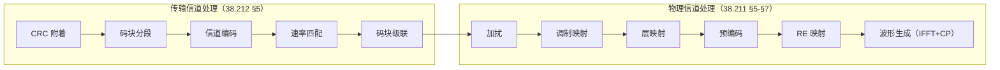

# TX5 发送端处理链总览：从传输块到天线波形的全链镜像

## 本节学习目标

TX1-TX4 分别讲了调制映射、加扰/交织、层映射/预编码、RE 映射——本系列收官篇把它们与编码侧（T3-T10 系列）串成**完整的发送端处理链（TX Chain）**，并与接收端译码链路（T2.x/T6-T10）逐环节镜像对照。发送链分两段：**传输信道处理**（TS 38.212 §5：CRC → 分段 → 编码 → 速率匹配 → 级联）把 TB（传输块，Transport Block）变成编码比特流；**物理信道处理**（TS 38.211 §5-§7：加扰 → 调制 → 层映射 → 预编码 → RE（资源元素，Resource Element）映射 → 波形生成）把比特流变成时域波形。

理解发送链不是"重复讲一遍"，而是建立**镜像视角**：接收端译码链路（T2.x/T6-T10）的每一个环节，在发送端都有一个对应的正向操作——速率匹配的打孔在接收端是 LLR 置零（T0.1 的翻译表）、加扰在接收端是自反解扰（TX2）、调制的逆是软解调（T2.13/T2.14）、预编码的逆是检测（T12）——**知道发送端为什么这样做，才知道接收端为什么那样逆着做**。

学完本节后，应能做到：

- 画出发送端处理链的全景（传输信道处理 5 环 + 物理信道处理 6 环），标注每环的接收端镜像。
- 说出两段处理的边界（38.212 的编码链 vs 38.211 的波形链）与各自的输入输出。
- 完成发送链端到端仿真（比特 → 加扰 → 调制 → RE 映射 → AWGN → 提取 → LLR → 解扰 → 判决），验证零误码。
- 用简化重复码演示"编码-译码"环节的纠错原理（多数表决）。
- 把 TX 系列五篇放进发送链坐标系，说明与 T0.1 阅读地图"发送端规则 → 接收端逆流程"的关系。

## 前置知识检查

| 前置项 | 本节需要达到的程度 |
|:---|:---|
| [[TX1_modulation_mapping|TX1]]-[[TX4_re_mapping_resource_grid|TX4]] | 知道物理信道处理的四个环节——本节收束为全景。 |
| [[TX_Chain_发送端处理链总览]] 概念笔记 | 知道发送链的粗轮廓与"食品流水线"直观模型——本节给端到端数值。 |
| [[T0.1_LTE_NR_decoder_protocol_reading_map|T0.1]] 阅读地图 | 知道"发送端规则 → 接收端逆流程"的翻译表——本节是它的完整实现。 |
| T3-T10 系列（编码） | 知道 CRC/分段/编码/速率匹配的接收端视角——本节给发送端正向。 |

如果只记一个原则：**发送链是"编码链 + 波形链"的 11 环流水线，接收链是它的逆流水线——每环有对应逆操作，理解发送端才能理解接收端的"为什么"**。

## 发送端处理链全景

### 两段 11 环



| 段 | 环 | 输入 → 输出 | 讲义 |
|:---|:---|:---|:---|
| 传输信道 | CRC 附着 | TB → TB+CRC | T3.5（CRC 校验的发送端） |
| | 码块分段 | TB → CB（码块，Code Block） | T3.2-T3.5 |
| | 信道编码 | CB → 编码比特 | T6-T10（译码的发送端） |
| | 速率匹配 | 编码比特 → 匹配后比特 | T7.1-T7.4/T9.x（速率恢复的发送端） |
| | 码块级联 | CB → 编码比特流 | T7.4 |
| 物理信道 | 加扰 | 比特流 → 加扰比特 | TX2 |
| | 调制映射 | 加扰比特 → 星座符号 | TX1 |
| | 层映射 | 符号流 → 层 | TX3 |
| | 预编码 | 层 → 端口 | TX3 |
| | RE 映射 | 端口符号 → 资源格 | TX4 |
| | 波形生成（IFFT（快速傅里叶逆变换，Inverse Fast Fourier Transform）+CP（循环前缀，Cyclic Prefix）） | 资源格 → 时域波形 | T2.0/T15.5 |

### 两段的边界

**传输信道处理是"比特域"**（TB 到编码比特流，加冗余与适配），**物理信道处理是"符号域 → 波形域"**（比特流到天线波形）。边界在"编码比特流"——它既是 38.212 的输出，也是 38.211 的输入。接收端镜像的边界同样清晰：FFT 后是符号域（T2.6 的 LLR 转换），LLR 拼接后是比特域（T7.4 的逆级联）。

### 生活类比：食品加工流水线

发送链像食品流水线：原料（TB）清洗（CRC）、切块（分段）、腌制（编码）、包装（速率匹配）、拼箱（级联）、贴标（加扰）、造型（调制）、分拣（层映射）、定向摆放（预编码）、入盒（RE 映射）、装车（波形生成）——接收端是反向流水线，每个工位都有"拆解"对应。**流水线的顺序是协议规定的，不能跳环**——每环的输出是下一环的输入。

## 接收端镜像总表

### 逐环节对照

| 发送端环节 | 接收端逆环节 | 逆的性质 |
|:---|:---|:---|
| CRC 附着 | CRC 校验（T7.4/T9.5） | 校验（不还原） |
| 码块分段 | CB 切分/LLR 分组（T3.2/T2.6） | 按分段规则切分 |
| 信道编码 | 译码（T6-T10） | 概率推断（软判决） |
| 速率匹配 | 速率恢复（T7/T9） | 打孔 → LLR 置零；重复 → LLR 累加 |
| 码块级联 | 逆级联/LLR 拼接（T7.4） | 按顺序拼接 |
| 加扰 | 解扰（TX2） | 自反（再异或） |
| 调制映射 | 软解调（T2.13/T2.14） | 概率推断（LLR） |
| 层映射 | 逆层映射（TX3） | 逆交替 |
| 预编码 | 检测/解预编码（T12） | 线性求逆 |
| RE 映射 | 资源格提取（T2.x） | 同顺序提取 |
| 波形生成 | FFT/同步（T2.7/T2.8） | 逆变换 |

### 逆的性质分类

| 逆类型 | 环节 | 特点 |
|:---|:---|:---|
| 精确逆 | 解扰/逆层映射/解交织/资源格提取 | 确定性、零损失（顺序/规则一致即可） |
| 概率逆 | 软解调/译码 | 噪声下概率推断（LLR 保留软信息） |
| 恢复逆 | 速率恢复/检测 | 打孔补零、线性求逆（有损但可纠） |
| 校验逆 | CRC | 只验证不还原（错误则丢弃/重传） |

**教学要点**：接收端不是简单"倒着走"——打孔与重复的逆不是对称操作（T0.1 明示：打孔逆 = LLR 置零 ≠ 还原比特），概率逆需要软信息。**"逆序但不等价"是发送端-接收端关系的核心洞察**。

## 端到端仿真：全链数值走读

### numpy 验证的仿真链

numpy 验证实现了教学规模的完整发送/接收链：

```
发送：比特 → 加扰（伪随机序列异或）→ QPSK 调制 → RE 映射（先频后时，12 符号数据区）
信道：AWGN（σ=0.15）
接收：同顺序提取 → QPSK 软解调（T2.13 的 LLR 公式）→ 解扰（再异或）→ 硬判决
```

结果：零误码（σ=0.15 下 QPSK 的 LLR 判决可靠）——**全链每个环节的逆操作都正确执行时，数据端到端无损恢复**。这个"零误码"不是巧合：发送端的确定性操作（加扰/调制/映射）都有精确逆，噪声由软解调的可靠性兜底。

### 简化 FEC：重复码演示"编码-译码"

端到端仿真的第二部分用重复码（每 bit 重复 3 次）演示编码-译码环节：100 个信息比特 → 300 个编码比特 → 每块（3 位）破坏 ≤1 位 → 接收端多数表决恢复——**30 个分散错误全部纠正**。这展示了编码的本质：冗余换取纠错能力（T3-T10 的 Turbo/LDPC/Polar 是它的高性能版本）。

## 发送链与全链路的收束

### TX 系列在发送链中的位置

| TX 讲义 | 发送链环节 | 接收端镜像讲义 |
|:---|:---|:---|
| TX1 调制映射 | 调制 | T2.13/T2.14 软解调 |
| TX2 加扰/交织 | 加扰 | 解扰（T2.x 链路内） |
| TX3 层映射/预编码 | 层映射 + 预编码 | T12 检测 |
| TX4 RE 映射 | RE 映射 | 资源格提取（T2.x） |
| TX5 总览（本节） | 全链 | 全链镜像 |

### 与 T0.1 阅读地图的关系

T0.1 的"发送端规则 → 接收端逆流程"翻译表是概念级；TX 系列把它实现为协议级（每环的 38.211 条款号与公式）。**TX 系列是 T0.1 阅读地图的物理层实现**——从"知道要逆着读"到"知道每一环怎么逆"。

### 阶段 4 收官

发送端镜像五篇至此完成：TX1-TX4 各环节 + TX5 全景收束。结合全链路规划，**"发送端 → 接收端"的知识闭环正式成立**——编码链（T3-T10 发送端视角）、波形链（TX1-TX5）、接收链（T2.x/T6-T12）三线齐备。

## 示范例题

### 例题 1：发送链环节定位

"把 TB 的 CRC 校验位附着"属于哪段哪环？它的接收端镜像是什么？

**求解**：传输信道处理第 1 环（CRC 附着）；接收端镜像 = CRC 校验（T7.4/T9.5——译码后验证，错误则丢弃/触发 HARQ 重传）。

### 例题 2：逆的类型

速率匹配的逆是什么类型的逆？为什么不是精确逆？

**求解**：恢复逆——打孔位置的 LLR 置零（不是还原被打掉的比特，而是"无信息"标记）、重复位置的 LLR 累加（软合并）；噪声下信息有损，靠编码纠错兜底。

### 例题 3：边界

编码比特流在发送链中的位置？它连接哪两段？

**求解**：传输信道处理的输出、物理信道处理的输入——两段的边界（38.212 → 38.211 的交接点）。

## 引导练习（带提示）

### 练习 1：镜像配对

把发送端"码块级联"与接收端对应环节配对。

**提示**：级联是"把 CB 拼成流"。（答案：接收端逆级联/LLR 拼接（T7.4）——按编码顺序拼回。）

### 练习 2：逆序不等价

为什么"打孔的逆"不是"还原打掉的比特"？

**提示**：打孔的比特没有发射。（答案：接收端根本没有那些比特的信息——置零 LLR 是"不确定"标记，靠编码纠错恢复。）

### 练习 3：两段边界

信道编码（Turbo/LDPC）属于哪段？为什么它的接收端镜像（译码）是最复杂的环节？

**提示**：编码在传输信道处理段。（答案：编码加冗余、译码做概率推断（软判决迭代/列表搜索）——复杂度最高，T6-T10 的整个系列。）

## 独立习题（附参考答案）

### 习题 1：11 环默写

按顺序写出发送链 11 环并标注段属。

**参考答案**：传输信道处理 5 环（CRC 附着/码块分段/信道编码/速率匹配/码块级联）+ 物理信道处理 6 环（加扰/调制映射/层映射/预编码/RE 映射/波形生成）。

### 习题 2：镜像分类

"解扰"与"译码"的逆类型分别是什么？

**参考答案**：解扰 = 精确逆（异或自反）；译码 = 概率逆（软判决推断，噪声下最优估计）。

### 习题 3：边界意义

为什么"编码比特流"是两段的边界？

**参考答案**：它是 38.212 的输出（比特域）与 38.211 的输入（符号域处理的起点）——协议分工的自然分界。

## 常见误解

| 误解 | 正确理解 |
|:---|:---|
| 发送端是接收端的简单倒序 | 逆序但不等价——打孔/重复/概率逆各有特殊处理（T0.1 明示） |
| 发送链只有比特→符号 | 还有层映射/预编码/RE 映射/波形生成——完整 11 环 |
| 理解译码不需要发送端 | 不理解发送端编码链就无法解释接收端为什么那样逆着做 |
| TX 系列是独立知识 | TX 系列是 T0.1 翻译表的协议级实现——镜像视角是核心 |

## 常见错误

| 错误 | 正确理解 |
|:---|:---|
| 混淆两段边界 | 传输信道处理（38.212，比特域）vs 物理信道处理（38.211，符号域） |
| 认为所有逆都是精确的 | 打孔逆是置零、译码逆是概率推断——"逆序但不等价" |
| 跳环理解 | 每环输出是下一环输入——顺序由协议规定 |
| 忽略波形生成环节 | IFFT+CP 是物理信道处理的最后一环（T2.0/T15.5） |

## 内嵌 numpy 验证

下列断言先实跑通过再写入本节，输出与断言一致（发送链端到端 + 重复码 FEC）：

```python
import numpy as np

rng = np.random.default_rng(8)

# (1) 发送链：比特 -> 加扰 -> QPSK -> RE 映射（先频后时）
N_SYMB, N_SC = 14, 12
n_bits = 12 * N_SC * 2
bits = rng.integers(0, 2, n_bits)
c = rng.integers(0, 2, n_bits)                    # 简化加扰序列
scrambled = bits ^ c
sym = (1/np.sqrt(2)) * ((1-2*scrambled[0::2]) + 1j*(1-2*scrambled[1::2]))
grid = np.zeros((N_SYMB, N_SC), dtype=complex)
idx = 0
for l in range(2, 14):
    for k in range(N_SC):
        grid[l, k] = sym[idx]
        idx += 1

# (2) 信道（AWGN）
sigma = 0.15
rx_grid = grid + sigma * (rng.standard_normal(grid.shape) + 1j*rng.standard_normal(grid.shape))/np.sqrt(2)

# (3) 接收链：提取 -> 软解调（T2.13 LLR）-> 解扰 -> 判决
extracted = np.array([rx_grid[l, k] for l in range(2, 14) for k in range(N_SC)])
llr = np.stack([2*np.sqrt(2)*extracted.real/sigma**2, 2*np.sqrt(2)*extracted.imag/sigma**2],
               axis=-1).reshape(-1)
dec = ((llr < 0).astype(int)) ^ c
ber = np.mean(dec != bits)
assert ber == 0.0, ber

# (4) 简化 FEC：重复码 3 次，每块破坏 <=1 位 -> 多数表决恢复
info = rng.integers(0, 2, 100)
rep = np.repeat(info, 3)
rep_noisy = rep.copy()
for b in range(100):
    if rng.random() < 0.5:
        rep_noisy[b*3 + rng.integers(0, 3)] ^= 1
dec_info = (rep_noisy.reshape(-1, 3).sum(axis=1) >= 2).astype(int)
assert np.array_equal(dec_info, info)

print(f"TX5_OK tx_chain_e2e_BER={ber} rep_code_fec=True (per-block <=1 error corrected)")
```

输出：

```text
TX5_OK tx_chain_e2e_BER=0.0 rep_code_fec=True (per-block <=1 error corrected)
```

## 小结

发送端处理链是"传输信道处理（38.212：CRC/分段/编码/速率匹配/级联）+ 物理信道处理（38.211：加扰/调制/层映射/预编码/RE 映射/波形生成）"的 11 环流水线。接收链是它的逆流水线——但"逆序不等价"：精确逆（解扰/逆层映射）、概率逆（软解调/译码）、恢复逆（速率恢复/检测）、校验逆（CRC）四类逆各有特殊语义。理解发送端每一环，才能理解接收端为什么那样逆着做（T0.1 的核心观点在此落地）。

**阶段 4 收官**：TX 系列五篇（调制/加扰/层映射预编码/RE 映射/总览）完成发送端镜像，全链路"发送端 → 接收端"知识闭环正式成立。下一步按全链路规划进入**阶段 5：调度/HARQ 进程、参考信号、波束、CA（载波聚合，Carrier Aggregation）/BWP（带宽部分，Bandwidth Part）、MAC 映射、射频前端**（概念笔记 + 讲义混合批次）。

## 本节在 TX 系列中的位置

TX 系列收官站：TX1-TX4 是发送链的四个环节（每篇一个环节 + 镜像），本节是全景收束（11 环 + 镜像总表 + 端到端数值）。**系列的内在逻辑**：TX1（比特 → 符号）→ TX2（比特的随机化，调制前）→ TX3（符号的空间分配）→ TX4（符号的时频放置）→ TX5（全链串联）——每篇都是发送链的忠实切片，合集即发送端全貌。

## 执行与证据记录

| 项目 | 记录 |
|:---|:---|
| 新增文件 | `docs/L1_基础/TX5_tx_chain_overview.md`。 |
| 协议证据 | TS 38.212 §5（传输信道处理锚点）、TS 38.211 §5-§7（物理信道处理锚点）——11 环的条款号标注。 |
| 数值核验 | 端到端仿真零误码（σ=0.15 QPSK）、重复码 FEC 30 错纠正（每块 ≤1）——与 numpy 断言一致。 |
| 教学说明 | 加扰序列为简化伪随机例（完整 Gold 序列见 TX2）；重复码为 FEC 教学演示（真实 Turbo/LDPC 见 T6-T10）。 |

## 参考文献

- 3GPP TS 38.212 Rel-19 j30 `38212-j30`：`3GPP_Rel19/processed/TS_38.212_38212-j30`（§5 传输信道处理）。
- 3GPP TS 38.211 Rel-19 j30 `38211-j30`：`3GPP_Rel19/processed/TS_38.211_38211-j30`（§5-§7 物理信道处理）。
- 本项目 [[TX_Chain_发送端处理链总览]]、[[T0.1_LTE_NR_decoder_protocol_reading_map|T0.1]]、TX1-TX4 讲义。
