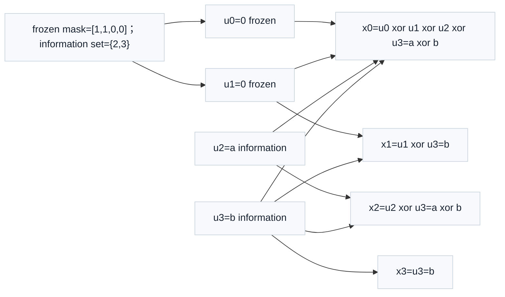

# T10.2 信道极化、冻结位与信息位
## 本节学习目标

本节从零基础解释 NR Polar的理论核心：信道极化、bit-channel、冻结位和信息位。这里的“信道极化”不是物理天线极化，也不是调制星座点的正负方向，而是编码变换后不同 bit 位置的可靠性分化。某些位置更适合承载真实信息，某些位置更不可靠，适合放发送端和接收端都知道的固定值。

本节使用的单篇技术缩写先统一说明：对数似然比是译码器输入软信息；逐次消除译码（Successive Cancellation, SC）是 Polar 的基础译码方式；循环冗余校验在后续 CA-SCL 中辅助路径选择；寄存器传输级和专用集成电路用于描述硬件实现边界。

学完本节后，应能做到：

- 说明信道极化不是物理极化，而是 bit-channel 可靠性分化。
- 区分 bit-channel、可靠 bit-channel、不可靠 bit-channel、frozen bit 和 information bit。
- 用 $N=4$ 的生成矩阵手算一次 Polar 编码变换。
- 说明 frozen bit 为什么通常固定为 0，以及接收端如何使用 frozen mask。
- 说明 information set 与 frozen set 是互补集合。
- 解释 bit-reversal 或顺序约定为什么必须在工程里固定，并知道本节只给边界，不完整展开 NR 所有索引规则。

## 前置知识检查

| 前置项 | 本节需要达到的程度 |
|:---|:---|
| GF(2) | 知道加法是异或，矩阵乘法里的加法也按异或算。 |
| LLR | 知道正负表示更像 0 或 1，绝对值表示可靠度。 |
| T1.6 信息论直觉 | 知道信道有可靠和不可靠之分。 |
| T10.1 | 知道 Polar 接收链路需要 rate recovery、frozen mask、SCL/CRC selector。 |

如果你只记一句话：Polar 编码先把输入位置混合成编码输出位置；可靠的位置放信息，不可靠的位置放固定值；接收端必须知道同一套位置集合。

## 任务边界与 Prompt 覆盖

| Prompt 要求 | 本节覆盖位置 | 覆盖方式 |
|:---|:---|:---|
| 从零基础讲信道极化 | “信道极化的基础解释” | 区分物理极化和可靠性分化。 |
| 解释 bit-channel、可靠/不可靠信道 | “bit-channel 的含义” | 用接收端判决问题解释。 |
| 解释冻结位、信息位 | “冻结位和信息位” | 给集合、mask、互补关系。 |
| 使用 N=4 或 N=8 小例子 | “N=4 生成矩阵手算例子” | 使用 $G_4=F^{\otimes2}$。 |
| 手算生成矩阵或蝶形结构 | “逐列手算编码输出” | 列出 $x_0$ 到 $x_3$。 |
| 讲接收端 frozen mask | “接收端 frozen mask” | 说明 descriptor、SC/SCL 行为和 dump 字段。 |
| 画 Polar 编码树/蝶形图 | “N=4 生成矩阵手算例子” | 用 Mermaid 和表格说明 $N=4$ 变换、frozen mask 与信息位扩散。 |
| 给 Python 小例子 | “Python 可复现校验” | 纯标准库生成 $G_4$ 并编码。 |
| 常见错误 | “常见错误” | frozen mask 反、索引基准错、frozen 与 punctured 混淆。 |

## 资料与协议边界

| 协议位置 | 本地证据路径 |
| :--- | :--- |
| TS 38.212 §5.3.1 | `3GPP_Rel19/processed/TS_38.212_38212-j30/TS_38.212_38212-j30_content.md:815-837` |
| TS 38.212 §5.3.1.2 | `TS_36.212_36212-j30_content.md:873-943` |
| TS 38.212 Table 5.3.1.2-1 | `tables/table_0012.csv/html` |
| T10.1 | `docs/L2/T10.1_NR_Polar_decoder_chain_overview.md` |

边界说明：本节是理论基础课，不复现完整 NR reliability sequence，也不处理 rate matching 后的 puncturing/shortening/repetition 如何改变信息集合。完整可靠性序列、索引筛选和 NR construction 规则由 T10.3 承接；Polar rate recovery 由 T10.7 承接。本节不省略协议证据，只是不把后续章节的表格提前展开。

## 信道极化的基础解释

普通直觉里，一个比特通过一个有噪声的信道，接收端拿到一个不确定观测值。若信道好，LLR 幅度通常大，判决可靠；若信道差，LLR 接近 0，判决不可靠。Polar 的关键不是“找到一个永远好用的物理信道”，而是通过编码变换把多个相同信道组合起来，让接收端看到一组可靠性不同的合成判决问题。

这些合成判决问题称为 bit-channel。bit-channel 不是一根物理线，也不是一个天线端口，而是“接收端在给定前面若干判决和全部接收观测的情况下，判断第 $i$ 个编码前位置 $u_i$ 的问题”。有些 $u_i$ 的判断问题很可靠，有些很不可靠。

| 概念 | 零基础解释 | 接收端表现 |
|:---|:---|:---|
| 物理信道 | 发射符号经过噪声、衰落和接收机处理形成观测。 | demapper 产生 LLR。 |
| bit-channel | Polar 结构下判断某个 $u_i$ 的合成问题。 | SC/SCL 按 bit index 遍历。 |
| 可靠 bit-channel | 更容易判断正确的位置。 | 适合放 payload/CRC。 |
| 不可靠 bit-channel | 更容易判断错的位置。 | 适合放 frozen bit。 |

“极化”的意思就是这些 bit-channel 的可靠性向两端分化：一部分越来越可靠，一部分越来越不可靠。Polar 码利用这个分化来放置信息位和冻结位。

## 最小二比特变换

首先考察 $N=2$ 的情况。Polar 的基础矩阵为：

$$
F=
\begin{bmatrix}
1&0\\
1&1
\end{bmatrix}.
\tag{1}
$$

若编码前向量为 $\mathbf{u}=[u_0,u_1]$，编码输出为：

$$
\mathbf{x}=\mathbf{u}F=[u_0\oplus u_1,\ u_1].
\tag{2}
$$

式 (2) 说明两个输入位置不再独立发出。接收端先判断 $u_0$，再利用 $\hat{u}_0$ 判断 $u_1$。因为 $u_0$ 的判断要同时解释两个观测之间的关系，它通常更难；$u_1$ 在已有 $\hat{u}_0$ 后更容易。这就是最小的可靠性分化。

## 冻结位和信息位

如果某个 bit-channel 不可靠，发送端不把真实信息放进去，而是放一个发送端和接收端都知道的固定值，通常是 0。这个位置叫 frozen bit。可靠位置承载 payload、CRC 或协议定义的辅助 bit，叫 information bit。

设码长 $N=4$，所有编码前位置集合为：

$$
\mathcal{U}=\{0,1,2,3\}.
\tag{3}
$$

若选择：

$$
\mathcal{F}=\{0,1\},\qquad \mathcal{I}=\{2,3\},
\tag{4}
$$

则 $\mathcal{F}$ 是 frozen set，$\mathcal{I}$ 是 information set。它们必须满足：

$$
\mathcal{F}\cap\mathcal{I}=\varnothing,\qquad
\mathcal{F}\cup\mathcal{I}=\mathcal{U}.
\tag{5}
$$

式 (5) 是工程中最容易被忽视的约束。一个位置不能既是 frozen 又是 information；所有位置必须被分类。如果 mask 漏了一位，硬件未必越界，但译码树会在错误的位置强制或分裂路径，最终常表现为 CRC fail。

## N=4 极化变换图

N=4 Polar 极化变换与 frozen mask 可以压缩成一个四输入、四输出的蝶形直觉：左侧是编码前位置 u0-u3；右侧是编码输出 x0-x3。蓝色位置为 frozen，绿色位置为 information。信息位经过异或扩散到多个输出位置，因此 $a,b$ 不只出现在单一输出线上。




| 内容 | 说明 |
|:---|:---|
| 输入向量 | $\mathbf{u}=[u_0,u_1,u_2,u_3]=[0,0,a,b]$；$u_0,u_1$ 为 frozen，$u_2,u_3$ 为 information。 |
| frozen mask | 本节图表中蓝色位置强制为 0，绿色位置承载信息；mask 写作 `[frozen,frozen,info,info]`。 |
| 输出 $x_0$ | $x_0=u_0\oplus u_1\oplus u_2\oplus u_3=a\oplus b$。 |
| 输出 $x_1$ | $x_1=u_1\oplus u_3=b$。 |
| 输出 $x_2$ | $x_2=u_2\oplus u_3=a\oplus b$。 |
| 输出 $x_3$ | $x_3=u_3=b$。 |
| 工程检查 | frozen set 与 information set 必须互斥且覆盖 $u_0..u_3$；漏配一位会让 SC/SCL 树在错误位置强制或分裂路径。 |
蓝色输入位置是 frozen，绿色输入位置是 information。本节图表中采用教学输入 $\mathbf{u}=[0,0,a,b]$，展示信息位如何通过 GF(2) 异或扩散到 $x_0,x_1,x_2,x_3$。

读图时注意三点：

- frozen 是编码前位置约束，不是编码输出后被删除的比特。
- information 位经过矩阵混合后会影响多个输出位置。
- 接收端必须用同样的 frozen mask 和顺序约定译码。

## N=4 生成矩阵手算例子

码长 $N=4$ 时，生成矩阵是 $F$ 的二阶 Kronecker 幂：

$$
G_4=F^{\otimes 2}=
\begin{bmatrix}
1&0&0&0\\
1&1&0&0\\
1&0&1&0\\
1&1&1&1
\end{bmatrix}.
\tag{6}
$$

设 frozen set 为 $\{0,1\}$，information set 为 $\{2,3\}$，两个信息比特为 $a,b$，则：

$$
\mathbf{u}=[0,\ 0,\ a,\ b].
\tag{7}
$$

编码为：

$$
\mathbf{x}=\mathbf{u}G_4.
\tag{8}
$$

逐列手算：

$$
x_0=0\oplus0\oplus a\oplus b=a\oplus b,
\tag{9}
$$

$$
x_1=0\oplus b=b,
\tag{10}
$$

$$
x_2=a\oplus b,
\tag{11}
$$

$$
x_3=b.
\tag{12}
$$

所以：

$$
\mathbf{x}=[a\oplus b,\ b,\ a\oplus b,\ b].
\tag{13}
$$

如果取 $a=1,b=0$，则：

$$
\mathbf{u}=[0,0,1,0],\qquad \mathbf{x}=[1,0,1,0].
\tag{14}
$$

这不是 NR 一致性测试向量，只是用于看清 Polar 变换和 mask 语义的 toy 例子。

## 接收端 frozen mask

接收端译码时，frozen mask 是 descriptor 的一部分。它告诉 SC/SCL：当前 bit index 是否允许自由判决。

| bit index | mask 类型 | SC 行为 | SCL 行为 |
|---:|:---|:---|:---|
| 0 | frozen | 强制 $\hat{u}_0=0$ | 不分裂，只保留 frozen 值路径。 |
| 1 | frozen | 强制 $\hat{u}_1=0$ | 不分裂，只保留 frozen 值路径。 |
| 2 | information | 根据 LLR 判 0/1 | 分裂 0/1，更新 path metric。 |
| 3 | information | 根据 LLR 判 0/1 | 分裂 0/1，更新 path metric。 |

frozen bit 和 rate matching 里的 punctured bit 不是同一类东西。frozen bit 是编码前位置上的已知约束；punctured bit 是编码输出位置没有被发送，接收端对该输出位置缺少观测。把二者混淆会导致两个层面的错误：译码树约束错，LLR 初始化也错。

## bit-reversal 与顺序约定边界

Polar 文献和实现中经常出现 bit-reversal、natural order、reliability order、encoder input order 等顺序差异。初学者容易把“可靠性序列里的 index”“编码前位置 $u_i$”“蝶形图里的线号”和“rate recovery 后的 codeword position”混成一个数组下标。

本节采用教学约定：$\mathbf{u}$ 按 $u_0,u_1,u_2,u_3$ 的自然顺序写，$G_4$ 使用式 (6)，输出按 $x_0,x_1,x_2,x_3$ 解释。NR 的可靠性序列、interleaving、rate matching 和具体顺序筛选由 T10.3/T10.7 处理。工程实现必须在 descriptor 中固定顺序约定，至少 dump：

| 字段 | 目的 |
|:---|:---|
| `index_base` | 说明表格/日志使用 0-based 还是 1-based。 |
| `info_set_order` | 说明 information set 是按 bit index 升序还是可靠性顺序存储。 |
| `frozen_mask_hash` | 快速比对 RTL 和 golden model 是否使用同一 mask。 |
| `bit_reversal_enable` | 若实现内部使用 bit-reversal，必须显式记录。 |

## Python 可复现校验

```python
def kron_gf2(a, b):
    out = []
    for row_a in a:
        for row_b in b:
            row = []
            for val_a in row_a:
                row.extend([(val_a * val_b) & 1 for val_b in row_b])
            out.append(row)
    return out


def encode_gf2(u, g):
    return [sum(ui * g[i][j] for i, ui in enumerate(u)) & 1 for j in range(len(g[0]))]


F = [[1, 0], [1, 1]]
G4 = kron_gf2(F, F)
u = [0, 0, 1, 0]
x = encode_gf2(u, G4)

assert G4 == [
    [1, 0, 0, 0],
    [1, 1, 0, 0],
    [1, 0, 1, 0],
    [1, 1, 1, 1],
]
assert x == [1, 0, 1, 0]
print("T10.2_POLAR_N4_ENCODE_OK", x)
```

## 浮点仿真方案

| 目标 | 方案 |
|:---|:---|
| 验证 mask 互补 | 随机生成 information set，自动生成 frozen set，检查交并关系。 |
| 验证编码变换 | 对 $N=4$ 和 $N=8$ 生成 $G_N$，和蝶形实现逐输入比较。 |
| 验证 frozen 约束 | 给 frozen 位强 LLR 错误方向，确认 SC/SCL 仍按 frozen 值约束。 |
| 验证索引边界 | 同一个 mask 用 0-based 和 1-based 两种解释，确认 CRC 或编码输出差异可观测。 |

## 定点化策略

本节本身的编码矩阵只做 GF(2) 运算，没有 LLR 定点问题。但接收端使用 frozen mask 时会进入 SC/SCL LLR 计算：

| 对象 | 定点风险 | 后续承接 |
|:---|:---|:---|
| LLR | f/g 函数饱和或符号约定错。 | T10.4、T13.4。 |
| path metric | SCL 排序方向和累加位宽错。 | T10.5、T10.6。 |
| mask | bit pack 后下标错，导致 frozen/information 反。 | 本节验证字段，T10.8 边界案例。 |

## RTL/ASIC 映射

| 模块 | 映射方式 | 调试字段 |
|:---|:---|:---|
| mask generator | 根据 `N/K` 和可靠性序列生成 info/frozen mask。 | `info_set_hash`, `frozen_mask_hash` |
| tree controller | 按 bit index 判断 frozen 或 information。 | `bit_index`, `is_frozen`, `decision_forced` |
| encoder checker | 在验证环境中重建 $G_N$ 或蝶形输出。 | `u_vec`, `x_vec`, `mismatch_index` |
| descriptor parser | 固定 index base 和 bit-reversal 设置。 | `index_base`, `bit_reversal_enable` |

## 验证方法

| 测试 | 输入 | 期望 |
|:---|:---|:---|
| N=4 编码 directed | $\mathbf{u}=[0,0,1,0]$ | $\mathbf{x}=[1,0,1,0]$。 |
| mask 互补检查 | $\mathcal{F}=\{0,1\}$，$\mathcal{I}=\{2,3\}$ | 交集为空，并集覆盖全部 index。 |
| frozen 强制检查 | frozen 位置 LLR 指向 1 | SC/SCL 仍强制输出 0。 |
| mask 反例 | 故意交换 frozen 和 information | CRC fail 或输出 payload 错。 |
| index 基准反例 | 1-based mask 当 0-based 用 | mask hash 不一致，译码失败。 |

## 常见错误

| 错误 | 后果 | 检查字段 |
|:---|:---|:---|
| 把信道极化理解成天线极化 | 理论方向错误，无法理解 bit-channel。 | 教学术语检查。 |
| frozen mask 和 info mask 反 | 信息位被强制，frozen 位被分裂。 | `is_frozen`, `split_count` |
| 0-based/1-based 混淆 | mask 整体错位。 | `index_base`, `mask_hash` |
| frozen 与 punctured 混淆 | 把输入约束和输出未发送混为一谈。 | `frozen_set`, `punctured_positions` |
| 忽略 bit-reversal 边界 | golden model 与 RTL 顺序不一致。 | `bit_reversal_enable`, `u_order` |

## 自测题

1. “信道极化”为什么不是物理天线极化？
2. frozen bit 和 information bit 的根本区别是什么？
3. 对 $\mathbf{u}=[0,0,a,b]$，用式 (6) 的 $G_4$ 编码后 $\mathbf{x}$ 是什么？
4. frozen set 和 information set 为什么必须互补？
5. frozen bit 和 punctured bit 有什么区别？

## 自测题参考答案

1. 它描述的是 Polar 变换后 bit-channel 可靠性分化，不是电磁波或天线方向。
2. frozen bit 是发送端和接收端都知道的固定值；information bit 承载 payload、CRC 或辅助信息，需要译码恢复。
3. $\mathbf{x}=[a\oplus b,\ b,\ a\oplus b,\ b]$。
4. 因为每个编码前位置必须且只能属于一种语义；重复或遗漏都会让译码树在错误位置强制或分裂。
5. frozen bit 是编码前输入位置的已知约束；punctured bit 是编码输出位置没有被发送，接收端缺少观测。

## 协议证据表

| 结论 | 协议依据 | 本地证据 |
|:---|:---|:---|
| Polar 编码使用 $F^{\otimes n}$ 并在 GF(2) 中执行 | TS 38.212 §5.3.1.2 | `TS_36.212_36212-j30_content.md:873-943` |
| Polar sequence 按可靠性升序排列 | TS 38.212 §5.3.1.2 | `TS_36.212_36212-j30_content.md:873-879`; `tables/table_0012.csv/html` |
| information/frozen 位置集合来自 Polar sequence 和 rate matching 相关规则 | TS 38.212 §5.3.1.2/§5.4.1.1 | `TS_36.212_36212-j30_content.md:879-883`; `TS_36.212_36212-j30_content.md:1041-1079` |
## 执行与证据记录

| 项 | 记录 |
|:---|:---|
| 写作范围 | 新增 `docs/L2/T10.2_channel_polarization_frozen_bits.md`。 |
| Prompt 对齐 | 覆盖信道极化、bit-channel、可靠/不可靠 bit-channel、frozen bit、information bit、N=4 手算、frozen mask、bit-reversal 边界、Python、常见错误。 |
| 协议精读 | 已读取 TS 38.212 §5.3.1/§5.3.1.2/§5.4.1.1。 |
| Python toy | 正文片段输出 `T10.2_POLAR_N4_ENCODE_OK [1, 0, 1, 0]`。 |
| 自动审计 | `python3 tools/audit_lesson_terms.py docs/L2/T10.2_channel_polarization_frozen_bits.md` 输出 `LESSON_TERM_AUDIT_OK`；`python3 tools/audit_markdown_headings.py docs/L2/T10.2_channel_polarization_frozen_bits.md` 输出 `MARKDOWN_HEADING_AUDIT_OK`；`python3 tools/audit_lesson_depth.py --strict docs/L2/T10.2_channel_polarization_frozen_bits.md` 输出 `LESSON_DEPTH_AUDIT_OK`；`python3 tools/audit_latex_render.py docs/L2/T10.2_channel_polarization_frozen_bits.md` 输出 `LATEX_RENDER_AUDIT_OK formulas=63`。 |
| 审核经理 | 待审核。 |

## 参考文献

1. 3GPP TS 38.212 Rel-19 `38212-j30`, Multiplexing and channel coding.
2. Erdal Arikan, “Channel Polarization: A Method for Constructing Capacity-Achieving Codes for Symmetric Binary-Input Memoryless Channels,” IEEE Transactions on Information Theory, 2009.
3. 本项目 T10.1：`docs/L2/T10.1_NR_Polar_decoder_chain_overview.md`。
