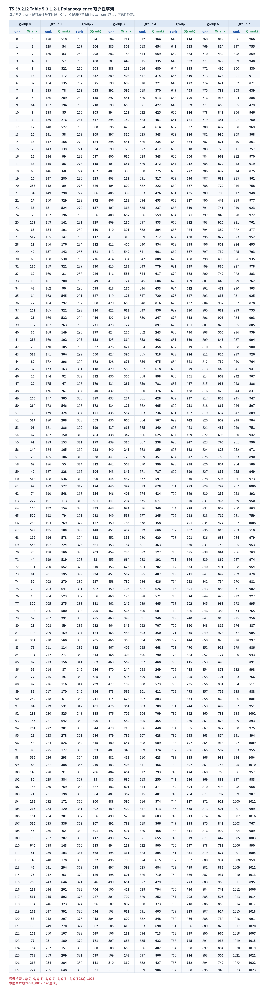

# T10.3 NR Polar 可靠性序列
## 本节学习目标

本节讲 NR Polar的可靠性序列，以及接收端如何由可靠性排序生成 information set 和 frozen set。可靠性序列不是随便写的一串下标，也不是仿真程序的私有参数；TS 38.212 Table 5.3.1.2-1 给出一张标准化的 Polar sequence，工程实现通常把它做成只读存储器（Read-Only Memory, ROM）或常量表。对数似然比、循环冗余校验、上行控制信息、下行控制信息、寄存器传输级和专用集成电路在本节继续作为接收端和工程实现边界出现。

学完本节后，应能做到：

- 解释可靠性序列是什么，以及为什么 NR 要标准化这张表。
- 说明 TS 38.212 §5.3.1.2 中 Polar sequence 是按可靠性升序排列，且使用 0-based bit index。
- 从可靠性序列中为给定 $N$ 取出小于 $N$ 的 bit index 子序列。
- 根据 $K$ 选择 information set，并把其余位置作为 frozen set。
- 说明 CRC bit 是否计入 $K$：进入 Polar coding 的 $K$ 包含 payload 和 CRC/辅助校验相关比特，不等于原始 payload $A$。
- 给出 toy 例子并生成 frozen mask。
- 说明实现为何查表，以及升序/降序、0-based/1-based、$A/K$ 混淆会造成什么错误。

## 前置知识检查

| 前置项 | 本节需要达到的程度 |
|:---|:---|
| T10.2 | 知道 bit-channel、frozen set、information set 和互补关系。 |
| GF(2) | 知道 Polar 编码矩阵运算在 GF(2) 中执行。 |
| CRC | 知道 CRC bit 会随 payload 一起进入 Polar information set。 |
| Python 基础 | 能读懂从表中筛选下标的伪代码。 |

如果只记一个原则：**表里靠前的 index 更不可靠，靠后的 index 更可靠；选信息位时要选当前 $N$ 子序列里最靠后的 $K$ 个。**

## 任务边界与 Prompt 覆盖

| Prompt 要求 | 本节覆盖位置 | 覆盖方式 |
|:---|:---|:---|
| 精读 Table 5.3.1.2-1 | “资料与协议边界”“完整表图复现” | 核验 CSV/HTML、生成完整表图。 |
| 解释可靠性序列是什么 | “可靠性序列的定义” | 从 bit-channel 排序解释。 |
| 说明排序方向和索引基准 | “排序方向和索引基准” | 明确升序、0-based。 |
| 如何根据 K 选择信息位 | “信息位选择规则” | 给步骤和公式。 |
| CRC 是否计入 K | “A 与 K 的边界” | 区分 payload $A$ 和 Polar input $K$。 |
| toy reliability order 例子 | “N=8, K=4 toy 例子” | 生成 info/frozen set 和 mask。 |
| 伪代码 | “接收端伪代码” | 输入 N、K，输出 masks。 |
| RTL 映射 | “RTL/ASIC 映射” | ROM、mask generator、descriptor dump。 |
| 常见错误 | “常见错误” | 升降序、0/1-based、K/A 混淆。 |

## 资料与协议边界

| 协议位置 | 本地证据路径 |
| :--- | :--- |
| TS 38.212 §5.3.1.2 | `3GPP_Rel19/processed/TS_38.212_38212-j30/content.md:873-883` |
| TS 38.212 Table 5.3.1.2-1 | `tables/table_0012.csv/html` |
| TS 38.212 §5.4.1.1 | `content.md:1041-1079` |

本地核验结果：

| 文件 | 规模 | SHA-256 |
|:---|:---|:---|
| `tables/table_0012.csv` | 129 行、最多 16 列；解析出 1024 个 `(rank, Q(rank))` 对 | `5df7ed346272365183c74ca5e832d94e651223738f05185a40c752d68a9f6a95` |
| `tables/table_0012.html` | 36820 bytes | `c10554468f90a9117bd83b212b4131e9ccbd5ab3a6281c109a7a51cb5941d5d7` |

解析检查：

- rank 覆盖 $0,1,\ldots,1023$，无缺失。
- 前四项为 $(0,0),(1,1),(2,2),(3,4)$。
- 最后一项为 $(1023,1023)$。
- `table_0012.csv` 是协议原表的横向分组排版，不能按文件行直接当成可靠性顺序；必须按 rank 排序后使用。

## 可靠性序列的定义

Polar 编码前有 $N$ 个位置 $u_0,u_1,\ldots,u_{N-1}$。这些位置对应的 bit-channel 可靠性不同。可靠性序列就是把 bit index 按可靠性排成一个列表：

$$
Q=[Q_0,Q_1,\ldots,Q_{1023}].
\tag{1}
$$

TS 38.212 §5.3.1.2 说明该序列按可靠性升序排列。换言之：

$$
Q_0 \text{ 最不可靠，} \quad Q_{1023} \text{ 最可靠。}
\tag{2}
$$

对于实际码长 $N$，不会使用所有 1024 个 index，而是取所有小于 $N$ 的元素，保持它们在 $Q$ 中的相对顺序：

$$
Q_N=\left[q\in Q \mid q<N\right].
\tag{3}
$$

式 (3) 很重要。它不是取 $Q$ 的前 $N$ 项，而是筛选出 bit index 小于 $N$ 的项。初学者若把“前 $N$ 项”和“小于 $N$ 的项”混淆，mask 会彻底错。

读表检查：Q(0)=0, Q(1)=1, Q(2)=2, Q(3)=4, Q(1023)=1023；本图由本地 table_0012.csv 生成。

## 排序方向和索引基准

本节采用 TS 38.212 的语义：

| 项 | 约定 |
|:---|:---|
| 排序方向 | 可靠性升序：越靠前越不可靠，越靠后越可靠。 |
| bit index | 0-based：位置从 0 开始。 |
| 选 information set | 从 $Q_N$ 的末尾选择 $K$ 个最可靠位置。 |
| frozen set | $0,\ldots,N-1$ 中不属于 information set 的位置。 |

选择规则可写成：

$$
\mathcal{I}=\mathrm{last}_K(Q_N),
\tag{4}
$$

$$
\mathcal{F}=\{0,1,\ldots,N-1\}\setminus\mathcal{I}.
\tag{5}
$$

这里 $\mathcal{I}$ 是 information set，$\mathcal{F}$ 是 frozen set。式 (4) 的 `last` 是因为表是升序。如果错误地取 `first_K`，就会把信息放到最不可靠的位置。

## 直观解释：从可靠性理论到接收端 mask

可靠性序列把 T10.2 的理论问题变成工程表格。T10.2 讲的是“不同 bit-channel 可靠性不同”；本节的表回答的是“在 NR 标准化构造里，哪个 bit index 更可靠”。接收端不需要在每个 slot 重新证明极化理论，而是把标准表、当前 $N$、当前 $K$ 和 rate matching 约束翻译成 mask。

这个翻译过程可以分成三层：

| 层次 | 问题 | 输出 |
|:---|:---|:---|
| 理论层 | 哪些 bit-channel 更可靠？ | 可靠性排序思想。 |
| 协议层 | NR 统一使用哪张排序表？ | TS 38.212 Table 5.3.1.2-1。 |
| 接收端层 | 当前 descriptor 的 $N,K$ 对应哪些位置可分裂？ | information mask 和 frozen mask。 |

因此，可靠性序列不是 decoder core 的可调参数。若软件 golden model 使用一张表，RTL ROM 使用另一张表，SC/SCL 内部公式即使完全正确，也会在不同位置分裂路径，最终表现为 CRC fail。这也是本节要求记录 `table_version_hash`、`info_set_hash` 和 `frozen_set_hash` 的原因。

## A 与 K 的边界

协议和实现中经常同时出现 $A$ 和 $K$。二者不能混用：

| 符号 | 含义 | 例子 |
|:---|:---|:---|
| $A$ | 原始控制 payload bit 数。 | DCI payload 或 UCI bit sequence 长度。 |
| CRC length | 附加的 CRC bit 数。 | DCI 是 24 bit；UCI Polar 分支可有 6/11 bit 等路径。 |
| $K$ | 进入 Polar coding 的 bit 数。 | 通常是 payload、CRC 和协议辅助位之后的长度。 |

因此，选择 information set 时用 $K$，不是用 $A$。如果 payload 有 20 bit，附加 24 bit CRC 后进入 Polar 的 $K$ 至少不是 20。把 $A$ 当 $K$ 会少选 CRC bit 位置，CA-SCL 最终无法正确检查路径。

## 完整表图复现


| 内容 | 说明 |
|:---|:---|
| 表格来源 | TS 38.212 Table 5.3.1.2-1；本地结构化证据为 `tables/table_0012.csv/html`，本节图表中保留协议原表的横向分组方式。 |
| 列 `rank` | 可靠性升序位置，表示在 Polar 可靠性序列中的排序。 |
| 列 `Q(rank)` | 对应的编码前 bit index；选择 information set 时通常取最可靠的若干 `Q(rank)`。 |
| 表格用途 | 当给定 Polar 码长 $N$ 和信息长度 $K$ 时，接收端/参考模型按可靠性序列选择 information positions，其余位置作为 frozen set。 |
| 与 $A/K$ 的边界 | 这张表服务于编码前的 Polar information/frozen 位置选择，使用的是进入 Polar coding 的 $K$，不是原始 payload $A$。 |
| 工程后果 | 若 `rank -> Q(rank)` 映射读错，冻结位和信息位会互换，SC/SCL/CA-SCL 即使路径管理正确也会稳定 CRC fail。 |
每组两列：`rank` 是可靠性升序位置，`Q(rank)` 是编码前 bit index。原协议表采用横向分组显示，本图保留这种分组方式，并增加列名便于阅读。

读图方法：

- 横向每组都是 `rank, Q(rank)`。
- rank 从 0 到 1023。
- `Q(rank)` 是 bit index，不是第 rank 个 bit 的值。
- 选 $N$ 子序列时筛选 `Q(rank)<N`。
- 选 $K$ 个信息位时取 $Q_N$ 中最靠后的 $K$ 个。

## 数值例子：N=8, K=4 的可靠性筛选

从完整序列筛选 $q<8$ 的项，按 rank 升序得到：

| rank | $Q(rank)$ |
|---:|---:|
| 0 | 0 |
| 1 | 1 |
| 2 | 2 |
| 3 | 4 |
| 7 | 3 |
| 8 | 5 |
| 11 | 6 |
| 24 | 7 |

所以：

$$
Q_8=[0,1,2,4,3,5,6,7].
\tag{6}
$$

若 $K=4$，information set 取最后 4 个：

$$
\mathcal{I}=\{3,5,6,7\}.
\tag{7}
$$

frozen set 是其互补：

$$
\mathcal{F}=\{0,1,2,4\}.
\tag{8}
$$

按 bit index 从小到大写成 mask：

| bit index | 0 | 1 | 2 | 3 | 4 | 5 | 6 | 7 |
|---:|---:|---:|---:|---:|---:|---:|---:|---:|
| role | F | F | F | I | F | I | I | I |

这里 `F` 表示 frozen，`I` 表示 information。注意 $\mathcal{I}$ 在集合里可以排序成 `{3,5,6,7}`，但它的选择依据是 $Q_8$ 中的可靠性顺序，不是简单取最大下标。这个例子中刚好结果看起来偏大，是因为 $N=8$ 太小；真实 $N$ 下不能用“下标越大越可靠”替代表查询。

这个手算例子给出一个直觉：可靠性序列是在回答“哪些 bit-channel 更适合承载信息”，而 mask 是把这个答案翻译成译码器能执行的控制信号。可靠性序列以 rank 为主语，mask 以 bit index 为主语。二者不是同一个数组视角：

| 视角 | 主语 | 用途 |
|:---|:---|:---|
| reliability order | rank 越大越可靠 | 从末尾取 $K$ 个作为 information。 |
| bit-index mask | bit index 从 0 到 $N-1$ | 告诉 SC/SCL 每个位置是 `F` 还是 `I`。 |

如果把这两个视角混在一起，日志里可能会出现“选择了正确数量的 information bit，但每个 bit 的位置错了”。这类错误在软件里不一定越界，在硬件里也不一定触发异常，但译码结果会稳定 CRC fail。

## 数值例子：N=16, K=6 的非连续信息集合

再看一个稍大的例子，避免误以为“下标越大越可靠”。从完整表筛选 $q<16$，按可靠性升序得到：

$$
Q_{16}=[0,1,2,4,8,3,5,9,6,10,12,7,11,13,14,15].
\tag{9}
$$

若 $K=6$，information set 取最后 6 项：

$$
\mathcal{I}=\{7,11,13,14,15\}\cup\{12\}=\{7,11,12,13,14,15\}.
\tag{10}
$$

frozen set 为：

$$
\mathcal{F}=\{0,1,2,3,4,5,6,8,9,10\}.
\tag{11}
$$

这里 information set 不是简单的 `{10,11,12,13,14,15}`，因为 bit index 10 在 $Q_{16}$ 中的可靠性排名不如 bit index 7。这个例子说明：可靠性不是由数字大小决定，而是由协议表排序决定。

## 接收端伪代码

```python
def select_polar_masks(q_sequence, n, k):
    q_n = [q for q in q_sequence if q < n]
    if len(q_n) != n:
        raise ValueError("reliability sequence does not cover this N")
    info_order = q_n[-k:]
    info_set = set(info_order)
    frozen_set = set(range(n)) - info_set
    mask = ["I" if i in info_set else "F" for i in range(n)]
    return q_n, info_order, sorted(info_set), sorted(frozen_set), mask
```

实际实现还要处理 §5.4.1.1 中 rate matching 对集合的影响，以及 parity-check bits 的放置规则。本节伪代码只表达可靠性序列如何决定基本 info/frozen mask。

## Python 可复现校验

```python
import csv
from pathlib import Path


def read_q_sequence(path):
    pairs = []
    with Path(path).open(encoding="utf-8", newline="") as handle:
        for row in csv.reader(handle):
            vals = [cell.strip() for cell in row if cell.strip()]
            for i in range(0, len(vals) - 1, 2):
                if vals[i].isdigit() and vals[i + 1].isdigit():
                    pairs.append((int(vals[i]), int(vals[i + 1])))
    pairs = sorted(pairs)
    assert [rank for rank, _ in pairs] == list(range(1024))
    return [q for _, q in pairs]


def select_polar_masks(q_sequence, n, k):
    q_n = [q for q in q_sequence if q < n]
    info_order = q_n[-k:]
    info_set = set(info_order)
    frozen_set = set(range(n)) - info_set
    mask = ["I" if i in info_set else "F" for i in range(n)]
    return q_n, info_order, sorted(info_set), sorted(frozen_set), mask


q_sequence = read_q_sequence("3GPP_Rel19/processed/TS_38.212_38212-j30/tables/table_0012.csv")
q8, info_order, info_set, frozen_set, mask = select_polar_masks(q_sequence, 8, 4)

assert q8 == [0, 1, 2, 4, 3, 5, 6, 7]
assert info_order == [3, 5, 6, 7]
assert info_set == [3, 5, 6, 7]
assert frozen_set == [0, 1, 2, 4]
assert mask == ["F", "F", "F", "I", "F", "I", "I", "I"]
print("T10.3_POLAR_RELIABILITY_MASK_OK", q8, mask)
```

## 查表实现的工程动机

可靠性排序不是每次接收时重新仿真得到的。标准化系统需要发送端和接收端对同一个 $N,K,E$ 生成同样的 information/frozen mask。因此实现通常使用：

| 实现方式 | 优点 | 风险 |
|:---|:---|:---|
| 固定 ROM 表 | 简单、bit-exact、RTL 友好。 | 表内容或索引基准错会全局失败。 |
| 软件常量数组 | 易调试、易打印。 | 版本和硬件 ROM 不一致。 |
| 运行时生成 | 灵活。 | 不适合 3GPP bit-exact 表，容易偏离标准。 |

NR 接收端通常不应在译码过程中“根据当前噪声估计临时重排可靠性序列”。协议表给的是构造规则的一部分，工程实现要确保表、筛选和 mask 生成一致。

## 浮点仿真方案

| 检查项 | 方法 |
|:---|:---|
| 表解析 | 读 `table_0012.csv`，确认 1024 个 rank 连续。 |
| N 子序列 | 对 $N=8,16,32$ 生成 $Q_N$，检查长度为 $N$。 |
| K 选择 | 对多个 $K$ 检查 information/frozen 互补。 |
| A/K 边界 | 构造 payload $A$ 和 CRC 后 $K$ 不同的 case，确认 mask 用 $K$。 |
| 方向反例 | 故意取 first_K，观察 CRC 或 toy 成功率恶化。 |

## 定点化策略

可靠性序列本身不涉及 LLR 定点位宽，但它决定后续 SCL 的路径搜索空间。硬件里常见的定点相关风险来自两个间接点：

| 对象 | 风险 | 检查 |
|:---|:---|:---|
| mask pack | bit 顺序打包错误，导致路径在错误位置分裂。 | dump `mask_hash` 和前 32 位 mask。 |
| path metric | mask 错会让 PM 对错误路径排序，即使 PM 位宽本身正确。 | 对比 golden `split_count` 和 `frozen_forced_count`。 |

## RTL/ASIC 映射

| 模块 | 职责 | 必查信号 |
|:---|:---|:---|
| reliability ROM | 保存 1024 项 $Q$ 表。 | `rom_addr`, `rom_data`, `table_version_hash` |
| N filter | 筛选 $q<N$ 的项目。 | `q_lt_n_count`, `q_n_tail` |
| info selector | 选择 $Q_N$ 末尾 $K$ 项。 | `K`, `info_order`, `info_set_hash` |
| mask generator | 生成 bit-index order 的 frozen/info mask。 | `frozen_mask`, `info_mask`, `index_base` |
| descriptor dump | 记录 $A/K/N/E$ 和 CRC 边界。 | `A`, `K`, `crc_len`, `N`, `E` |

## 验证方法

| 测试 | 输入 | 期望 |
|:---|:---|:---|
| 表完整性 | `table_0012.csv` | 1024 个 rank，覆盖 0-1023。 |
| N=8,K=4 directed | 本节 toy | mask 为 `F F F I F I I I`。 |
| 方向反例 | 取 first_K | 信息位落到低可靠位置，测试必须报方向错误。 |
| index 基准反例 | 把 0-based 当 1-based | mask hash 与 golden 不一致。 |
| A/K 混淆 | $A=20, crc_len=24, K=44$ | selector 必须使用 44，不是 20。 |

## 常见错误

| 错误 | 后果 | 修正 |
|:---|:---|:---|
| 把升序表当降序表 | 信息放到最不可靠位置。 | 选 $Q_N$ 末尾 $K$ 个。 |
| 取表前 $N$ 项而非筛选 $q<N$ | $N$ 子序列错误。 | 按式 (3) 筛选。 |
| 0-based/1-based 混淆 | mask 整体错位。 | descriptor 记录 `index_base=0`。 |
| 用 $A$ 代替 $K$ | CRC bit 不进入 information set。 | 选择 mask 时使用 Polar input length $K$。 |
| 按 bit index 最大值猜可靠性 | 大 $N$ 下完全错误。 | 永远查可靠性表。 |

## 自测题

1. TS 38.212 的 Polar sequence 是按可靠性升序还是降序排列？
2. 生成 $Q_N$ 时，为什么不能直接取 $Q$ 的前 $N$ 项？
3. 对 $N=8,K=4$，本节得到的 information set 和 frozen set 是什么？
4. payload 长度 $A$ 和 Polar input length $K$ 的区别是什么？
5. RTL 为什么通常把可靠性序列做成 ROM？

## 自测题参考答案

1. 升序排列，靠前更不可靠，靠后更可靠。
2. 因为要筛选 bit index 小于 $N$ 的项，并保留它们在可靠性序列中的相对顺序。
3. $\mathcal{I}=\{3,5,6,7\}$，$\mathcal{F}=\{0,1,2,4\}$。
4. $A$ 是原始 payload bit 数；$K$ 是进入 Polar coding 的 bit 数，通常包含 CRC 和协议辅助位。
5. 因为标准化可靠性序列必须 bit-exact、低延迟、易验证，ROM/常量表最稳定。

## 协议证据表

| 结论 | 协议依据 | 本地证据 |
|:---|:---|:---|
| Polar sequence 按可靠性升序排列 | TS 38.212 §5.3.1.2 | `content.md:873-879` |
| Table 5.3.1.2-1 给出 1024 项 Polar sequence | TS 38.212 Table 5.3.1.2-1 | `tables/table_0012.csv/html`；图 T10.3-1 |
| 编码在 GF(2) 中执行 | TS 38.212 §5.3.1.2 | `content.md:941-943` |
| information/frozen 集合还与 §5.4.1.1 中集合有关 | TS 38.212 §5.3.1.2/§5.4.1.1 | `content.md:879-883`; `content.md:1041-1079` |

## 图示


## 执行与证据记录

| 项 | 记录 |
|:---|:---|
| 写作范围 | 新增 `docs/L2/T10.3_NR_Polar_reliability_sequence.md`。 |
| Prompt 对齐 | 覆盖可靠性序列定义、Table 5.3.1.2-1 核验、排序方向、索引基准、信息位选择、$A/K$ 边界、toy 例子、伪代码、ROM 映射和常见错误。 |
| 协议精读 | 已读取 TS 38.212 §5.3.1.2 和 §5.4.1.1。 |
| 表格证据 | `table_0012.csv` SHA-256 `5df7ed346272365183c74ca5e832d94e651223738f05185a40c752d68a9f6a95`；`table_0012.html` SHA-256 `c10554468f90a9117bd83b212b4131e9ccbd5ab3a6281c109a7a51cb5941d5d7`；解析出 1024 个 rank 连续对。 |
| Python toy | 正文片段与扩展校验已运行：`T10.3_POLAR_RELIABILITY_MASK_OK [0, 1, 2, 4, 3, 5, 6, 7] ['F', 'F', 'F', 'I', 'F', 'I', 'I', 'I']`；`T10.3_POLAR_RELIABILITY_N16_OK [0, 1, 2, 4, 8, 3, 5, 9, 6, 10, 12, 7, 11, 13, 14, 15] [7, 11, 12, 13, 14, 15]`。 |
| 自动审计 | 已通过：`LESSON_TERM_AUDIT_OK`、`MARKDOWN_HEADING_AUDIT_OK`、`LESSON_DEPTH_AUDIT_OK`、`LATEX_RENDER_AUDIT_OK formulas=104`。 |
| 审核经理 | 待审核。 |

## 参考文献

1. 3GPP TS 38.212 Rel-19 `38212-j30`, Multiplexing and channel coding.
2. 本项目 T10.1：`docs/L2/T10.1_NR_Polar_decoder_chain_overview.md`。
3. 本项目 T10.2：`docs/L2/T10.2_channel_polarization_frozen_bits.md`。
