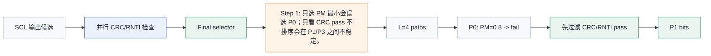
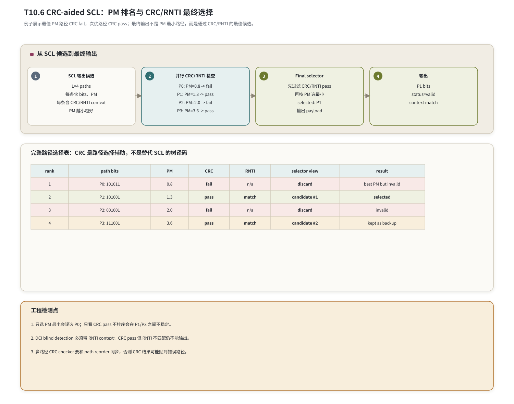

# T10.6 CRC 辅助 SCL 与控制信道可靠性
## 本节学习目标

本节讲循环冗余校验辅助逐次消除列表译码（CRC-aided Successive Cancellation List, CA-SCL）。T10.5 的 SCL 能输出多条候选路径和路径度量（Path Metric, PM），但控制信息译码不能只看 PM。CRC 会随 payload 进入Polar的 information set，译码后用来判断候选路径是否满足检错关系。对下行控制信息，CRC 还与无线网络临时标识（Radio Network Temporary Identifier, RNTI）存在边界；对上行控制信息，CRC 长度和是否附加 CRC 与 UCI payload 条件有关。

本节使用的工程缩写先统一说明：对数似然比是 SCL 的软输入；寄存器传输级和专用集成电路用于描述硬件实现；静态随机存取存储器用于描述多路径候选、CRC state 和 final selector 的存储。

学完本节后，应能做到：

- 解释 CA-SCL 的基本流程：SCL 产生候选，CRC/RNTI 过滤候选，PM 在通过候选中排序。
- 说明 CRC 是路径选择辅助，不是替代 SCL 树译码的算法本体。
- 给出“最佳 PM 路径 CRC fail，次优路径 CRC pass”的完整选择表。
- 解释 CRC 误通过风险，以及为什么 list size 影响性能、延迟和面积。
- 区分 UCI CRC、DCI CRC 和 DCI RNTI 边界。
- 给出 final selector 伪代码、多路径 CRC checker 的 RTL/ASIC 映射和常见错误。

## 前置知识检查

| 前置项 | 本节需要达到的程度 |
|:---|:---|
| T3.5 | 知道 NR Polar 控制信息会附加 CRC，并进入 Polar 编码链路。 |
| T10.1 | 知道 UCI/DCI 的 Polar 接收链路和 descriptor 字段。 |
| T10.5 | 知道 SCL 输出多条候选路径、PM 和剪枝后的 path list。 |
| CRC 基础 | 知道 CRC pass/fail 来自 GF(2) 多项式余数检查。 |

如果只记一个原则：**CA-SCL 不是“选 PM 最小路径”，而是“在 CRC/RNTI 有效的候选中选 PM 最好的路径”；若没有候选通过，再按实现策略报告 fail 或选择 fallback。**

## 任务边界与 Prompt 覆盖

| Prompt 要求 | 本节覆盖位置 | 覆盖方式 |
|:---|:---|:---|
| 讲解 CRC 辅助 SCL | “CA-SCL 的接收端流程” | 给候选、CRC/RNTI、final selector 三阶段。 |
| CRC bit 如何辅助路径选择 | “CRC 是路径选择辅助” | 区分树译码和最终选择。 |
| 误通过风险 | “CRC 误通过风险” | 解释随机错误候选仍可能通过。 |
| list size 取舍 | “列表大小、低延迟和高可靠取舍” | 性能、延迟、面积和功耗表。 |
| 控制信道低延迟和高可靠 | “控制信息的工程动机” | UCI/DCI 输出错误后果。 |
| 最佳 PM 路径 CRC fail 案例 | “数值例子：PM 最佳路径 CRC fail” | 完整路径表和 final selector。 |
| 硬件 | “RTL/ASIC 映射” | 多路径 CRC checker、final selector、early pruning。 |
| 常见错误 | “常见错误” | 只看 PM、CRC bit order、RNTI 边界。 |

## 资料与协议边界

| 协议位置 | 本地证据路径 |
| :--- | :--- |
| TS 38.212 §5.1 | `3GPP_Rel19/processed/TS_38.212_38212-j30/content.md:637-657` |
| TS 38.212 §5.2.1 | `content.md:665-715` |
| TS 38.212 §6.3.1.2.1 | `content.md:2325-2335` |
| TS 38.212 §6.3.2.2.1 | `content.md:2863-2865` |
| TS 38.212 §7.3.2 | `content.md:7177-7195` |
| TS 38.212 §7.3.3/§7.3.4 | `content.md:7197-7207` |

证据边界：`content.md` 对部分公式符号抽取不完整，因此本节不重新复现 CRC 多项式细节；CRC 多项式家族由 T3.1 复现。本节只精读影响 CA-SCL 选择逻辑的协议事实：UCI/ DCI 是否带 CRC、CRC 长度、DCI 的 RNTI 边界，以及 CRC 后进入 Polar 编码链路。

## 控制信息的工程动机

## 名称、来源与常见误解

CA-SCL 这个名字可以拆成三层：

| 组成 | 含义 | 解决的问题 |
|:---|:---|:---|
| SC | Successive Cancellation，逐次消除。 | 沿 Polar 树逐位判决，但只保留一条路径。 |
| SCL | Successive Cancellation List，逐次消除列表。 | 在 information 位保留多条候选，减少早期判错不可恢复的问题。 |
| CRC-aided | CRC 辅助。 | 在候选路径中利用检错关系选择更可信的控制信息。 |

CA-SCL 的来源不是“CRC 会让树译码公式变成另一套 $f/g$”。$f/g$、partial sum 和 path split 仍然是 SCL 的译码主体；CRC 只是在候选路径形成后提供额外约束。可以把 SCL 看成“提出多个答案”，把 CRC 看成“用控制信息自带的检错规则淘汰不合格答案”。

常见误解有三类：

| 误解 | 正确理解 |
|:---|:---|
| PM 最小就一定正确。 | PM 只衡量候选与 LLR 的一致性，CRC fail 的路径不能输出为有效控制信息。 |
| CRC pass 就一定是真实 payload。 | CRC 有误通过概率，且 DCI 还要检查 RNTI context。 |
| CRC 可以替代 list size。 | 如果正确路径在 SCL 剪枝时已被删掉，CRC checker 看不到它。 |

## 接收端直观模型

接收端可以把 CA-SCL 想成一个两级判卷过程。第一级是 SCL：根据 LLR 给出若干份“候选答卷”，每份有 PM 分数。第二级是 CRC/RNTI：检查候选答卷是否满足控制信息的检错边界。final selector 的规则不是单独相信某一级，而是组合两级：

| 级别 | 回答的问题 | 失败后果 |
|:---|:---|:---|
| SCL/PM | 这条路径和接收软信息是否一致？ | PM 好但可能是错误控制信息。 |
| CRC/RNTI | 这条路径是否满足协议检错和归属边界？ | CRC/RNTI fail 的候选不能输出。 |
| final selector | 在通过候选中哪条 PM 最好？ | 只看一边会误选或不稳定。 |

这个直观模型解释了后续公式：先构造 pass 集合，再在 pass 集合里取 PM 最优。

## 控制信息的工程动机

控制信息的译码错误比普通数据块错误更敏感。数据块 CRC fail 后可以走混合自动重传请求重传；控制信息若误通过，接收机可能执行错误调度、错误 HARQ-ACK、错误资源解释或错误 RNTI 归属。

| 控制信息 | 典型内容 | 译码错误后果 |
|:---|:---|:---|
| UCI | HARQ-ACK、SR、CSI 等上行控制。 | 基站可能错误理解终端反馈或信道状态。 |
| DCI | 调度、调制与编码方案、RV、HARQ process、资源分配。 | 终端可能按错误资源收发，或把不属于自己的 DCI 当成有效。 |

因此 NR Polar 控制信息译码需要两件事同时成立：

1. SCL 保留足够多的候选，避免 SC 早期误判直接丢掉正确路径。
2. CRC/RNTI 检查把“看起来 PM 很好但不满足控制信息检错边界”的路径过滤掉。

## CA-SCL 的接收端流程

CA-SCL 可以拆成四步：

| 步骤 | 输入 | 输出 |
|:---|:---|:---|
| SCL tree decode | LLR、frozen mask、list size $L$ | 最多 $L$ 条候选路径和 PM。 |
| Candidate extraction | 每条路径的 information bits | payload bits、CRC bits、可选 RNTI context。 |
| CRC/RNTI check | payload、CRC bits、CRC type、RNTI | 每条路径的 pass/fail。 |
| Final select | PM 和 pass/fail | 最终输出路径或 fail 状态。 |

这里的关键边界是：CRC 检查发生在候选路径已经形成之后。CRC 不是在每个 $f/g$ 节点替代 SCL 的 LLR 计算；它也不是“译码完再打印一下”的无关状态。它直接决定 final selector 是否允许输出某条路径。

## CRC 是路径选择辅助

设 SCL 输出候选集合：

$$
\mathcal{P}=\{p_0,p_1,\ldots,p_{L-1}\}.
\tag{1}
$$

每条路径有 PM：

$$
PM(p_i).
\tag{2}
$$

本节沿用 T10.5 的约定：PM 越小越好。每条路径还会生成 CRC 检查结果：

$$
C(p_i)\in\{\text{pass},\text{fail}\}.
\tag{3}
$$

CA-SCL 的选择规则可以写成：

$$
\mathcal{P}_{\text{pass}}=\{p_i\in\mathcal{P}\mid C(p_i)=\text{pass}\}.
\tag{4}
$$

若 $\mathcal{P}_{\text{pass}}$ 非空：

$$
p^\star=\arg\min_{p_i\in\mathcal{P}_{\text{pass}}} PM(p_i).
\tag{5}
$$

若 $\mathcal{P}_{\text{pass}}$ 为空，接收端通常报告 decode fail，并可按实现需求保留 PM 最小路径用于调试或软输出，但不能把它当成协议有效控制信息。

## 选择规则的理论推导

从概率角度看，SCL 的 PM 可以理解为候选路径的负对数似然近似。PM 越小，表示这条路径越符合接收 LLR 证据。CRC pass/fail 则不是另一种软可靠度，而是一个约束条件：候选 bit 序列必须落在 CRC 定义的合法集合中。

定义合法候选集合：

$$
\mathcal{C}_{\text{valid}}=\{p_i\mid \mathrm{CRC}(p_i)=0\ \text{and}\ \mathrm{RNTI}(p_i)=\text{match}\}.
\tag{6}
$$

在这个集合外的路径，即使 PM 很小，也不满足控制信息的检错和归属约束。于是 final selector 的理论问题不是：

$$
\arg\min_{p_i\in\mathcal{P}}PM(p_i),
\tag{7}
$$

而是带约束的最小化：

$$
p^\star=\arg\min_{p_i\in\mathcal{P}\cap\mathcal{C}_{\text{valid}}}PM(p_i).
\tag{8}
$$

这个推导给出一个工程后果：final selector 需要同时输入 `pass_mask` 和 `PM`，并且比较器只应在 pass mask 为 1 的路径之间比较。若把 fail 路径也送入最终最小值比较器，就会把无效候选混入输出集合。

## UCI CRC 与 DCI RNTI 边界

UCI 和 DCI 都可能走 Polar，但 CRC 边界不同。

| 项 | UCI Polar 分支 | DCI |
|:---|:---|:---|
| 协议入口 | TS 38.212 §6.3.1.2.1，PUSCH UCI 对应 §6.3.2.2.1 调用。 | TS 38.212 §7.3.2。 |
| CRC 长度 | 条件触发 6 bit 或 11 bit；小负载可无 CRC。 | 24 bit。 |
| RNTI 边界 | 本节不引入 UCI RNTI scrambling。 | CRC parity bits 与对应 RNTI 形成关系。 |
| CA-SCL 选择含义 | CRC pass 说明候选符合 UCI 检错边界。 | CRC/RNTI pass 说明候选既符合 CRC，又匹配当前 RNTI context。 |

DCI 的重点是 blind detection。接收机可能在多个候选控制信道位置、多个 aggregation level、多个 RNTI context 上尝试译码。如果某条路径 CRC pass 但 RNTI context 不匹配，不能输出为当前 UE 的 DCI。本文把这类结果统一写成 `CRC/RNTI fail`，并在 descriptor 中要求记录 `rnti_type`、`rnti_value` 和 `crc_scramble_checked`。

## 数值例子：PM 最佳路径 CRC fail

设 SCL 输出 $L=4$ 条候选，PM 越小越好：

图中的完整路径选择表采用 `rank / path bits / PM / CRC / RNTI / selector view / result` 七列。`selector view` 是 final selector 的视角：CRC/RNTI fail 的路径标为 `discard`，CRC/RNTI pass 的路径按 PM 排序为候选。

| rank | path bits | PM | CRC | RNTI | selector view | result |
|---:|:---|---:|:---|:---|:---|:---|
| 1 | P0: `101011` | 0.8 | fail | n/a | discard | best PM but invalid |
| 2 | P1: `101001` | 1.3 | pass | match | candidate #1 | selected |
| 3 | P2: `001001` | 2.0 | fail | n/a | discard | invalid |
| 4 | P3: `111001` | 3.6 | pass | match | candidate #2 | kept as backup |

| 排名 | path | PM | CRC | RNTI | final selector |
|---:|:---|---:|:---|:---|:---|
| 1 | P0: `101011` | 0.8 | fail | n/a | 丢弃 |
| 2 | P1: `101001` | 1.3 | pass | match | 选中 |
| 3 | P2: `001001` | 2.0 | fail | n/a | 丢弃 |
| 4 | P3: `111001` | 3.6 | pass | match | 备选 |

如果实现只选 PM 最小，就会输出 P0；但 P0 的 CRC fail，不能作为有效控制信息。CA-SCL 先过滤出通过集合：

$$
\mathcal{P}_{\text{pass}}=\{P1,P3\}.
\tag{9}
$$

再在通过集合中选 PM 最小：

$$
p^\star=P1.
\tag{10}
$$

这正是“最佳 PM 路径 CRC fail，次优路径 CRC pass”的典型案例。它说明 CRC 是控制信息可靠性的关键边界。

## Final selector 图




| 内容 | 说明 |
|:---|:---|
| 1. 只选 PM 最小会误选 P0；只看 CRC pass 不排序会在 P1/P3 之间不稳定。 | 2. DCI blind detection 必须带 RNTI context；CRC pass 但 RNTI 不匹配仍不能输出。；3. 多路径 CRC checker 要和 path reorder 同步，否则 CRC 结果可能贴到错误路径。 |
| L=4 paths | 每条含 bits、PM；每条含 CRC/RNTI context；PM 越小越好 |
| P0: PM=0.8 -> fail | P1: PM=1.3 -> pass；P2: PM=2.0 -> fail；P3: PM=3.6 -> pass |
| 先过滤 CRC/RNTI pass | 再按 PM 选最小；selected: P1；输出 payload |
| P1 bits | status=valid；context match |
读图顺序从左到右：SCL 输出候选路径；多路径 CRC/RNTI checker 并行或流水检查每条候选；final selector 先过滤 pass 路径，再按 PM 选择；最终输出 payload 和 valid 状态。

本节图表中的三个工程检测点需要在验证中保留：

- 只选 PM 最小会误选 P0。
- 只看 CRC pass 而不排序，会在 P1/P3 之间不稳定。
- 多路径 CRC checker 必须和 path reorder 同步，否则 CRC 结果可能贴到错误路径。

## CRC 误通过风险

CRC 能显著降低错误候选输出概率，但不能把错误概率变成绝对 0。若 CRC 长度为 $r$，一个随机错误候选误通过的粗略概率量级约为：

$$
P_{\text{false pass}}\approx 2^{-r}.
\tag{11}
$$

这个式子只是直觉估计，不是完整链路误检公式。真实误检还与候选路径相关性、RNTI context、blind detection 次数、信道条件和实现细节有关。

CRC 长度越长，误通过风险越低，但开销也越大。控制信息的取舍是：短 payload 需要低开销和低延迟，但又需要足够强的检错边界。TS 38.212 对 UCI Polar 分支使用条件化 CRC 长度，对 DCI 使用 24 bit CRC 并引入 RNTI 边界，就是这种工程需求的协议体现。

## 列表大小、低延迟和高可靠取舍

list size $L$ 与 CA-SCL 的关系如下：

| 增大 $L$ 的收益 | 代价 |
|:---|:---|
| 正确路径更可能留在候选集合中。 | SCL 树状态、LLR、partial sum 和 path bits 存储增加。 |
| CRC 有更多候选可过滤。 | 多路径 CRC checker 或串行 CRC 检查延迟增加。 |
| 块错误率和误检表现可能改善。 | sorter、copy network、final selector 面积和功耗增加。 |

低延迟控制信道不能无限增大 $L$。如果 final selector 等所有候选 CRC 都算完才输出，最坏时延会随候选数增加；如果使用 early pruning 或在线 CRC 更新，可以减少尾部延迟，但必须证明不会错误丢掉最终可能通过 CRC 的路径。

## Final selector 伪代码

```python
def final_select(paths):
    passed = [p for p in paths if p["crc_ok"] and p.get("rnti_ok", True)]
    if passed:
        passed.sort(key=lambda p: p["pm"])
        selected = passed[0]
        return {"status": "valid", "path": selected}
    paths = sorted(paths, key=lambda p: p["pm"])
    return {"status": "crc_fail", "path": paths[0]}


paths = [
    {"name": "P0", "bits": [1, 0, 1, 0, 1, 1], "pm": 0.8, "crc_ok": False, "rnti_ok": False},
    {"name": "P1", "bits": [1, 0, 1, 0, 0, 1], "pm": 1.3, "crc_ok": True, "rnti_ok": True},
    {"name": "P2", "bits": [0, 0, 1, 0, 0, 1], "pm": 2.0, "crc_ok": False, "rnti_ok": False},
    {"name": "P3", "bits": [1, 1, 1, 0, 0, 1], "pm": 3.6, "crc_ok": True, "rnti_ok": True},
]

result = final_select(paths)
assert result["status"] == "valid"
assert result["path"]["name"] == "P1"
print("T10.6_CA_SCL_SELECTOR_OK", result["path"]["name"], result["path"]["pm"])
```

这段代码故意不实现 CRC 多项式计算，因为 T3.1 已复现 CRC 家族，本节关注 CA-SCL final selector 的决策边界。工程实现中 `crc_ok` 必须由真实 CRC checker 产生，`rnti_ok` 必须来自 DCI 的 RNTI context 检查。

## 浮点仿真方案

| 检查项 | 方法 | 期望 |
|:---|:---|:---|
| PM 最佳但 CRC fail | 使用本节 P0/P1/P2/P3 表。 | 选择 P1，不选择 P0。 |
| 多个 CRC pass | P1/P3 都 pass。 | 选择 PM 更小的 P1。 |
| 无 CRC pass | 所有候选 fail。 | 输出 `crc_fail`，不声明 valid payload。 |
| DCI RNTI mismatch | CRC pass 但 RNTI 不匹配。 | 不输出为当前 RNTI 的 DCI。 |
| list size 扫描 | $L=1,2,4,8$。 | 记录正确路径保留率、延迟和面积估算。 |

最小 dump 字段：

| 字段 | 用途 |
|:---|:---|
| `path_id`、`path_bits`、`pm` | 复现候选排序。 |
| `payload_bits`、`crc_bits` | 复现 CRC 输入边界。 |
| `crc_type`、`crc_len` | 区分 UCI 6/11 和 DCI 24。 |
| `crc_ok` | 记录每条路径 CRC 结果。 |
| `rnti_type`、`rnti_value`、`rnti_ok` | 复现 DCI RNTI 边界。 |
| `selected_path_id`、`status` | 复现 final selector 输出。 |

## 定点化策略

CA-SCL 的定点风险主要集中在 PM 和 CRC checker 的路径对齐。

| 对象 | 策略 | 风险 |
|:---|:---|:---|
| PM | 沿用 T10.5 的 PM 位宽、饱和和 tie-break。 | PM 饱和导致多个 pass 路径并列，若 tie-break 不稳定则输出不复现。 |
| CRC input bits | 使用硬判决 bit，不使用 LLR。 | bit 顺序、payload/CRC 边界错会导致全路径 fail。 |
| RNTI check | DCI 路径附带 RNTI context。 | CRC pass 但 RNTI mismatch 被误输出。 |
| path reorder | CRC 结果随 path id 重映射。 | checker 输出贴到错误路径。 |

CRC checker 本身是 GF(2) 逻辑，不存在 LLR 量化；但路径 bit 的来源和顺序必须 bit-exact。若 SCL path bits 在 memory 中被压缩存储，CRC checker 读取顺序必须与协议 CRC attachment 顺序一致。

## RTL/ASIC 映射

| 模块 | 职责 | 必查信号 |
|:---|:---|:---|
| path output buffer | 保存 SCL 剪枝后的候选 bits 和 PM。 | `path_id`, `path_bits`, `path_pm` |
| CRC checker array | 并行检查多条路径，或按路径流水复用。 | `crc_start`, `crc_type`, `crc_ok[path]` |
| RNTI checker | DCI 场景检查 CRC/RNTI context。 | `rnti_type`, `rnti_value`, `rnti_ok[path]` |
| final selector | 过滤 pass 路径并按 PM 选择。 | `pass_mask`, `selected_path_id`, `valid` |
| reorder map | 路径剪枝后重映射 CRC 和 PM。 | `old_path_id`, `new_path_id`, `crc_result_map` |

多路径 CRC checker 有两种常见实现：

| 实现 | 优点 | 代价 |
|:---|:---|:---|
| 并行 checker | 延迟低，适合低时延控制信道。 | 面积和功耗随 $L$ 增加。 |
| 单 checker 复用 | 面积小。 | 最坏延迟随候选数增加，需要严格调度。 |

early pruning 可以在部分 CRC state 明显不可能通过时提前丢弃路径，但这类优化必须非常谨慎。CRC 是线性反馈结构，未处理完所有 bit 前通常不能仅凭中间状态断言最终 fail，除非有严格证明或特定实现约束。

## 验证方法

| 测试 | 输入 | 期望 |
|:---|:---|:---|
| T10.6 directed | 本节 P0/P1/P2/P3。 | 选择 P1。 |
| PM-only bug | 禁用 CRC 过滤。 | 测试应捕获误选 P0。 |
| CRC-only bug | 忽略 PM，在 pass 路径中随机选。 | 测试应捕获 P1/P3 不稳定。 |
| RNTI mismatch | P1 CRC pass 但 RNTI fail。 | 不输出 P1。 |
| path reorder | 剪枝后打乱 path id。 | CRC 结果仍贴到正确路径。 |
| no-pass case | 全部 CRC fail。 | `status=crc_fail`。 |

## 常见错误

| 错误 | 现象 | 定位方式 |
|:---|:---|:---|
| 只选 PM 最小 | PM 最好但 CRC fail 的路径被输出。 | 检查 final selector 是否先过滤 pass mask。 |
| 只看 CRC pass 不排序 | 多个 pass 路径时输出不稳定。 | dump pass paths 的 PM 和 selected id。 |
| CRC bit 顺序错 | 所有路径 CRC fail 或误通过率异常。 | 对比 T3.1 CRC golden 和 path bit extraction。 |
| payload/CRC 边界错 | 正确路径 CRC fail。 | dump `payload_bits` 与 `crc_bits` 分界。 |
| RNTI 边界错 | DCI blind detection 误检。 | dump `rnti_type`、`rnti_value`、`rnti_ok`。 |
| CRC 结果贴错路径 | PM、bits、CRC 三者不一致。 | 检查 reorder map 和 checker output path id。 |

## 自测题

1. CA-SCL 中 CRC 的作用是什么？
2. 本节 PM 最佳但 CRC fail 的路径是哪条？最终选择哪条？
3. 如果所有候选 CRC fail，接收端是否应输出 valid payload？
4. UCI Polar 分支和 DCI 的 CRC 边界有什么差异？
5. 为什么 DCI 场景不能只看 CRC pass，还要看 RNTI context？
6. 多路径 CRC checker 的主要硬件风险是什么？

## 自测题参考答案

1. CRC 用来辅助 SCL 候选路径选择，过滤不满足检错关系的路径；它不是替代 $f/g$ 树译码的算法本体。
2. P0 的 PM 最好但 CRC fail；最终选择 P1，因为 P1 CRC/RNTI pass 且在 pass 路径中 PM 最小。
3. 不应输出 valid payload，应报告 `crc_fail` 或等价失败状态。
4. UCI Polar 分支按条件使用 6/11 bit CRC，某些小负载无 CRC；DCI 使用 24 bit CRC，并存在 RNTI scrambling/匹配边界。
5. 因为 DCI blind detection 中 CRC parity bits 与对应 RNTI 形成关系；CRC pass 但 RNTI 不匹配的候选不属于当前 UE context。
6. CRC 结果必须与 path reorder 同步，不能把某条路径的 CRC pass/fail 贴到另一条路径。

## 协议证据表

| 结论 | 协议依据 | 本地证据 |
|:---|:---|:---|
| CRC calculation 是通用检错入口，系统化 CRC 余数为 0 | TS 38.212 §5.1 | `content.md:637-657` |
| Polar coding 分段和 CRC attachment 调用 §5.1 | TS 38.212 §5.2.1 | `content.md:665-715` |
| PUCCH UCI Polar 分支可使用 6/11 bit CRC，并有无 CRC 小负载边界 | TS 38.212 §6.3.1.2.1 | `content.md:2325-2335` |
| PUSCH UCI Polar 分支调用 PUCCH UCI Polar 的 CRC attachment 过程 | TS 38.212 §6.3.2.2.1 | `content.md:2863-2865` |
| DCI 使用 24 bit CRC，CRC parity bits 与对应 RNTI 形成关系 | TS 38.212 §7.3.2 | `content.md:7177-7195` |
| DCI CRC 后进入 Polar coding 和 rate matching | TS 38.212 §7.3.3/§7.3.4 | `content.md:7197-7207` |

## 图示


## 执行与证据记录

| 项 | 记录 |
|:---|:---|
| 写作范围 | 新增 `docs/L2/T10.6_CRC_aided_SCL_control_reliability.md`。 |
| Prompt 对齐 | 覆盖 CA-SCL、CRC 辅助路径选择、误通过风险、list size 取舍、控制信道低延迟高可靠、PM 最佳路径 CRC fail 案例、final selector 伪代码、RTL/ASIC 和常见错误。 |
| 协议精读 | 已读取 TS 38.212 §5.1、§5.2.1、§6.3.1.2.1、§6.3.2.2.1、§7.3.2、§7.3.3、§7.3.4。 |
| Python toy | 正文片段已运行，输出 `T10.6_CA_SCL_SELECTOR_OK P1 1.3`。 |
| 自动审计 | 已通过：`LESSON_TERM_AUDIT_OK`、`MARKDOWN_HEADING_AUDIT_OK`、`LESSON_DEPTH_AUDIT_OK`、`LATEX_RENDER_AUDIT_OK formulas=26`。 |
| 审核经理 | 待审核。 |

## 参考文献

1. 3GPP TS 38.212 Rel-19 `38212-j30`, Multiplexing and channel coding.
2. 本项目 T3.1：`docs/L1/T3.1_LTE_NR_CRC_families.md`。
3. 本项目 T3.5：`docs/L1/T3.5_NR_Polar_segmentation_crc.md`。
4. 本项目 T10.5：`docs/L2/T10.5_Polar_SCL_decoding.md`。
