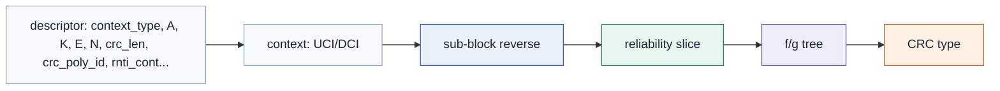
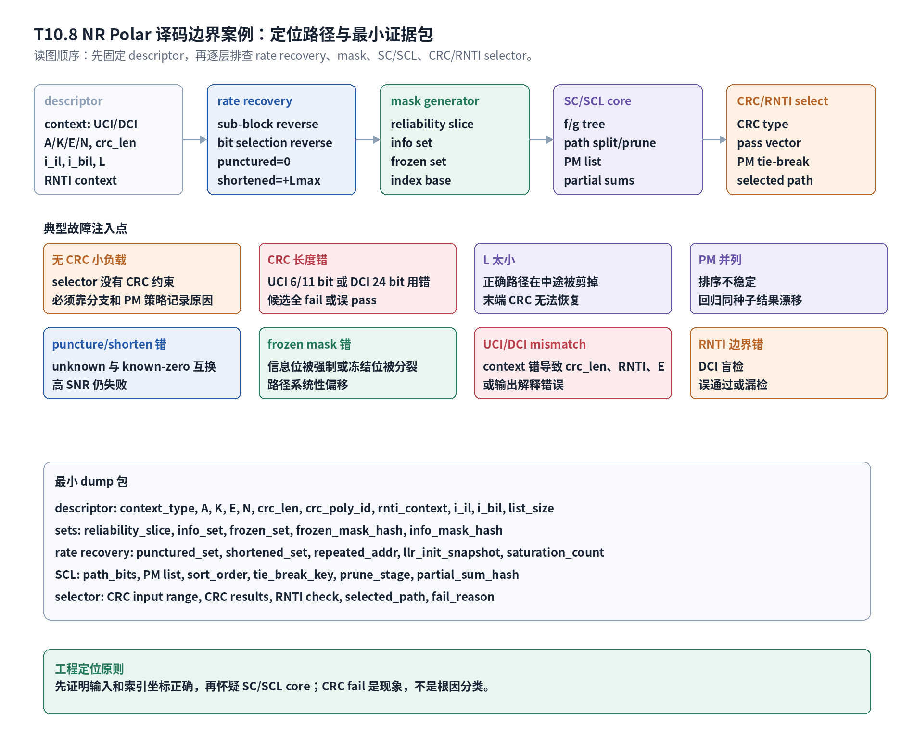

# T10.8 NR Polar 译码边界案例
## 本节学习目标

本节整理 NR Polar控制信息译码的典型边界案例。这里的“边界案例”不是孤立错误列表，而是接收端调试方法：当译码失败、循环冗余校验失败、路径度量（Path Metric, PM）异常、或者下行控制信息盲检误通过时，工程师要能判断错误来自 descriptor、rate recovery、frozen mask、逐次消除译码（Successive Cancellation, SC）、逐次消除列表译码（Successive Cancellation List, SCL）还是 CRC/无线网络临时标识（Radio Network Temporary Identifier, RNTI）selector。

本节还会使用上行控制信息、对数似然比、正交幅度调制、混合自动重传请求、低密度奇偶校验码、Turbo、寄存器传输级和专用集成电路这些术语。它们不是本节主角，但会作为协议背景、软信息来源、对比对象或硬件验证边界出现。

学完本节后，应能做到：

- 用固定顺序排查 NR Polar decode fail：descriptor -> rate recovery -> mask -> SC/SCL -> CRC/RNTI selector。
- 区分无 CRC 小负载、CRC 长度选择错误、RNTI 边界错误和 UCI/DCI context mismatch。
- 解释列表大小耗尽、PM 并列、frozen mask 错误、puncturing/shortening mismatch 的症状差异。
- 为每个案例列出触发条件、现象、必查字段、定位步骤和修复方向。
- 给出最小 dump 包：`A/K/E/N`、CRC type、info set、frozen set、reliability slice、`L`、PM list、CRC results。
- 说明哪些结论来自 TS 38.212，哪些是接收端实现和验证策略。

## 前置知识检查

| 前置项 | 本节需要达到的程度 |
|:---|:---|
| T10.1 | 知道 NR Polar 接收链路由 rate recovery、Polar decoder 和 CRC/RNTI selector 串接。 |
| T10.3 | 能从可靠性序列生成 information set 和 frozen set，并理解索引基准。 |
| T10.5 | 知道 SCL 如何分裂路径、更新 PM、排序剪枝。 |
| T10.6 | 知道 CA-SCL 选择规则：在 CRC/RNTI 通过候选中选择 PM 最优路径。 |
| T10.7 | 知道 punctured、shortened 和 repeated 位置的 LLR 初始化和合并语义。 |

如果只记一个原则：**CRC fail 是现象，不是根因分类。先证明输入长度、索引坐标和 mask 正确，再怀疑 SC/SCL core。**

## 任务边界与 Prompt 覆盖

| Prompt 要求 | 本节覆盖位置 | 扩展方式 |
|:---|:---|:---|
| 无 CRC 小负载 | “案例一：无 CRC 小负载” | 区分 Polar 分支和 small block 分支，说明 selector 约束变化。 |
| CRC 长度选择 | “案例二：CRC 长度选择错误” | 覆盖 UCI 6/11 bit、DCI 24 bit 和 `crc_len` dump。 |
| 列表大小耗尽 | “案例三：列表大小耗尽” | 解释正确路径被剪枝后末端 CRC 无法恢复。 |
| path metric 并列 | “案例四：PM 并列与排序稳定性” | 讨论 tie-break、定点饱和和回归可复现。 |
| puncturing/shortening mismatch | “案例五：puncturing/shortening mismatch” | 展开 unknown 与 known-zero 混淆。 |
| frozen mask 错误 | “案例六：frozen mask 错误” | 给系统性 CRC fail 案例和定位字段。 |
| DCI/UCI 背景不匹配 | “案例七：UCI/DCI descriptor 不匹配” | 连接 `context_type`、CRC、RNTI、E 和输出解释。 |
| RNTI/CRC 边界 | “案例八：RNTI/CRC 边界错误” | 讨论 DCI blind detection 误通过和漏检。 |
| 最小 dump 包 | “最小 dump 包” | 给字段、来源、用途和缺失后果。 |
| 诊断流程 | 图 T10.8-1 和“接收端诊断流程” | 展开 descriptor -> rate recovery -> mask -> SC/SCL -> selector。 |
| 适当拓展 | 多个详细案例、Python 诊断分类、RTL/ASIC 映射 | 不止覆盖 prompt 字面要求。 |

## 资料与协议边界

| 协议位置 | 本地证据路径 |
| :--- | :--- |
| TS 38.212 §5.1 | `3GPP_Rel19/processed/TS_38.212_38212-j30/content.md:637-657` |
| TS 38.212 §5.2.1 | `content.md:665-715` |
| TS 38.212 §5.3.1/§5.3.1.2 | `content.md` 对应 Polar coding 和 Table 5.3.1.2-1；`tables/table_0012.csv/html` |
| TS 38.212 §5.4.1/§5.4.1.1-§5.4.1.3 | `content.md:1019-1125`; `tables/table_0019.csv/html` |
| TS 38.212 §6.3.1.2.1 | `content.md:2325-2335` |
| TS 38.212 §6.3.1.2.2 | `content.md:2337-2342` |
| TS 38.212 §6.3.2.2.1/§6.3.2.2.2 | `content.md:2863-2868` |
| TS 38.212 §7.3.2-§7.3.4 | `content.md:7177-7207` |

证据边界：TS 38.212 规定编码链路、CRC 长度、RNTI 边界和 rate matching 调用；它不规定接收机必须使用哪种 SCL list size、PM 定点格式、tie-break 策略或 RTL sorter 结构。本节把这些实现策略标为工程策略，不写成协议强制要求。

## 接收端诊断流程




| 内容 | 说明 |
|:---|:---|
| context: UCI/DCI | A/K/E/N, crc_len；i_il, i_bil, L；RNTI context |
| sub-block reverse | bit selection reverse；punctured=0；shortened=+Lmax |
| reliability slice | info set；frozen set；index base |
| f/g tree | path split/prune；PM list；partial sums |
| CRC type | pass vector；PM tie-break；selected path |
| selector 没有 CRC 约束 | 必须靠分支和 PM 策略记录原因 |
| UCI 6/11 bit 或 DCI 24 bit 用错 | 候选全 fail 或误 pass |
| 正确路径在中途被剪掉 | 末端 CRC 无法恢复 |
| 排序不稳定 | 回归同种子结果漂移 |
| unknown 与 known-zero 互换 | 高 SNR 仍失败 |
读图顺序从上方链路开始：先检查 descriptor，再检查 rate recovery 的 LLR 放回，再检查 reliability 和 frozen mask，再检查 SC/SCL path list，最后检查 CRC/RNTI selector。中间区域标题为“典型故障注入点”，这些故障卡片覆盖无 CRC 小负载、CRC 长度错、列表大小耗尽、PM 并列、puncture/shorten 错、frozen mask 错、UCI/DCI mismatch 和 RNTI 边界错；下方给出最小 dump 包。

诊断流程可以写成五层：

| 层级 | 先验问题 | 典型错误 |
|:---|:---|:---|
| descriptor | 当前到底是 UCI、DCI 还是 small block 分支？ | `context_type`、`A/K/E/N`、`crc_len`、`L` 错。 |
| rate recovery | $E$ 个接收 LLR 是否放回正确的 $N$ 个母码位置？ | punctured、shortened、repeated 或 interleaver flag 错。 |
| mask | information set 与 frozen set 是否与发送端一致？ | 可靠性序列方向、0/1-based 索引、$K$ 边界错。 |
| SC/SCL | 正确路径是否仍在 list 中，PM 排序是否稳定？ | list size 太小、PM 饱和、tie-break 不稳定、partial sum 复制错。 |
| selector | CRC/RNTI 检查是否使用正确范围和上下文？ | CRC 长度错、RNTI mask 错、只选 PM 最优路径。 |

## 案例总表

工程定位原则：先证明输入和索引坐标正确，再怀疑 SC/SCL core；CRC fail 是现象，不是根因分类。

| 案例 | 触发条件 | 现象 | 必查字段 | 定位步骤 | 修复方向 |
|:---|:---|:---|:---|:---|:---|
| 无 CRC 小负载 | UCI payload 落入 small block lengths 分支，CRC bits are not attached。 | 没有 CRC pass/fail 约束；若仍跑 CA-SCL selector，会出现伪 fail 或空 CRC 误判。 | `context_type`, `A`, `small_block_branch`, `crc_len`, `coding_scheme` | 查 §6.3.1.2/§6.3.2.2 分支；确认是否调用 Polar code path。 | small block 分支走对应译码，不把“无 CRC”误写成 CA-SCL 失败。 |
| CRC 长度选择错误 | UCI 6/11 bit 或 DCI 24 bit CRC 用错。 | PM 分布正常但候选全 CRC fail；或错误候选误 pass。 | `crc_len`, `crc_poly_id`, `context_type`, `E`, `A`, `K` | 对照 §6.3.1.2.1 和 §7.3.2；dump CRC input range。 | 按 context 生成 CRC descriptor；DCI 固定 24 bit。 |
| 列表大小耗尽 | $L$ 太小或排序剪枝过早，正确路径中途被删。 | 末端所有 CRC fail；增大 $L$ 后恢复。 | `list_size`, `prune_stage`, `path_count`, `pm_list`, `crc_results` | 跑 $L=1,2,4,8$ 对比；记录正确路径首次消失位置。 | 提升 $L$、修 PM 更新、检查 lazy-copy 状态同步。 |
| PM 并列 | 定点饱和、LLR 过度裁剪或多个候选 PM 相等。 | 同一随机种子结果漂移；不同平台选择路径不同。 | `pm_width`, `pm_list`, `tie_break_key`, `sort_order` | 构造相同 PM 候选；检查排序稳定性。 | 固定 tie-break 规则；必要时扩 PM 位宽或归一化。 |
| puncturing/shortening mismatch | unknown 位置与 known-zero 位置互换。 | 高信噪比仍 CRC fail；PM 对错误路径过度自信。 | `punctured_set`, `shortened_set`, `llr_init_snapshot`, `i_bil` | 从 T10.7 的 rate recovery dump 查 LLR 初始化。 | punctured 写 0；shortened 写 $+L_{\max}$；repeated 饱和累加。 |
| frozen mask 错误 | information/frozen 集合错，或者索引方向错。 | 所有路径都“看似合理”但系统性 CRC fail；split/frozen 统计异常。 | `N`, `K`, `reliability_slice`, `info_set`, `frozen_set`, `index_base` | 对比 T10.3 golden mask；检查 `split_count` 和 `frozen_forced_count`。 | 统一 reliability 序列筛选、索引基准和 $K$ 定义。 |
| UCI/DCI descriptor 不匹配 | UCI 流按 DCI 解释，或 DCI 按 UCI 解释。 | CRC 长度、RNTI、rate matching $E$ 或输出字段解释错误。 | `context_type`, `crc_len`, `rnti_context`, `E`, `output_semantics` | 从上游控制链路重建 descriptor；比较 UCI/DCI 分支证据。 | descriptor parser 加 context 校验和互斥断言。 |
| RNTI/CRC 边界错误 | DCI CRC parity bits 与 RNTI 的关系处理错。 | 盲检误通过或漏检；错误 DCI 被认为属于当前 UE。 | `rnti_context`, `crc_scramble_mask`, `crc_results`, `candidate_id` | 用已知 RNTI 和错误 RNTI 双测；dump descramble 前后 CRC bits。 | 将 CRC check 与 RNTI check 绑定为 DCI selector 子流程。 |

## 案例一：无 CRC 小负载

TS 38.212 §6.3.1.2 把 UCI code block segmentation and CRC attachment 分成 Polar 分支和 small block lengths 分支。§6.3.1.2.2 明确 small block lengths 分支 CRC bits are not attached。接收端的后果是：这类负载不能套用“CA-SCL 候选路径先 CRC 过滤，再按 PM 选择”的完整逻辑。

工程上常见错误是 descriptor 只写了 `context_type=UCI`，没有写 `coding_scheme=SMALL_BLOCK` 或 `POLAR`，导致软件把无 CRC 小负载送进 Polar CA-SCL selector。症状通常不是“信道差”，而是日志里出现空 CRC 输入、`crc_len=0` 仍然计算 CRC、或者所有候选被标成 fail。

定位要点：

| 检查项 | 正确状态 |
|:---|:---|
| `small_block_branch` | 若为 true，不进入 Polar CA-SCL selector。 |
| `crc_len` | small block 分支为 0；Polar UCI 分支按 §6.3.1.2.1 选择 6 或 11。 |
| `coding_scheme` | 必须能区分 small block coding 与 Polar coding。 |
| `fail_reason` | 不能把“无 CRC 分支”记成 `CRC_FAIL`。 |

## 案例二：CRC 长度选择错误

UCI 与 DCI 的 CRC 边界不同。UCI encoded by Polar code 在 §6.3.1.2.1 中根据 payload 和 rate matching output 条件选择 6 bit 或 11 bit CRC；DCI 在 §7.3.2 中使用 24 bit CRC，并且后续与 RNTI 形成边界。

如果把 DCI 的 24 bit CRC 当成 UCI 的 11 bit，SCL core 仍可能给出看似正常的 PM list，因为 PM 只看 LLR 和路径一致性，不知道你切了多少 CRC bit。错误会在 selector 层表现为：所有路径 CRC fail，或者某条错误路径因为截断范围错而误通过。

最小定位流程：

1. 从 descriptor 打印 `context_type`、`A`、`K`、`crc_len`、`crc_poly_id`。
2. 检查 `K = A + crc_len` 是否符合本分支定义。
3. dump 每条候选的 `crc_input_range`，确认 payload bits 和 CRC bits 边界。
4. 对 DCI 同时 dump RNTI descramble 前后的 CRC parity bits。

修复方向是把 CRC 选择放在 descriptor 生成阶段，不允许 decoder core 根据 `K-A` 自行猜测 CRC 类型。

## 案例三：列表大小耗尽

列表大小 $L$ 是接收端实现参数，不是 TS 38.212 强制值。$L$ 太小的典型表现是：正确路径在某个 information bit 分裂后被剪掉，后续即使 CRC selector 正确，也看不到正确候选。

这个错误容易被误判为 CRC 或 RNTI 问题，因为最终日志只显示所有路径 CRC fail。真正的证据在中间阶段：

| 字段 | 诊断含义 |
|:---|:---|
| `prune_stage` | 正确路径首次消失的 bit index。 |
| `path_count_before_prune` | 候选是否达到 $2L$。 |
| `pm_list_before_prune` | 正确路径是否因 PM 更新异常被排到末尾。 |
| `state_copy_hash` | lazy-copy 是否把 LLR/partial sum/CRC state 复制错。 |

调试时应使用同一组 LLR 运行多个 $L$：若 $L=1$ fail、$L=2$ fail、$L=8$ pass，不能立刻得出“需要更大 $L$”的产品结论，还要检查 PM 更新和复制网络是否正确。否则更大 $L$ 只是掩盖路径管理 bug。

## 案例四：PM 并列与排序稳定性

PM 并列常见于三种场景：LLR 大量为 0、LLR 被过度裁剪、PM 定点位宽太窄而饱和。并列本身不是错误，但排序必须稳定。否则同一个测试向量在不同平台、不同综合优化或不同仿真种子下可能选择不同 path。

本节沿用 T10.5 的约定：PM 越小越好。当两条 path 的 PM 相等，工程实现必须定义 tie-break，例如按 path id、bit 序、创建时间或固定优先级。该规则属于实现策略，但必须进验证计划。

| 风险 | 现象 | 验证方式 |
|:---|:---|:---|
| PM 饱和 | 多条 path 都到 `PM_MAX`。 | 构造强冲突 LLR，检查 `saturation_count`。 |
| tie-break 未定义 | 回归结果漂移。 | 同一输入跑 100 次，`selected_path` 必须一致。 |
| sort direction 反 | PM 最大路径被保留。 | directed test：PM `[0,2,5]` 必须保留 0。 |

## 案例五：puncturing/shortening mismatch

T10.7 已经给出 rate recovery 语义：punctured position 是 unknown，LLR 初始化为 0；shortened position 是 known zero，LLR 初始化为强正饱和值；repeated position 对同一母码位置做饱和累加。

如果把 punctured 当 shortened，接收端等于凭空给未知位置一个强约束，SCL 会更相信错误路径。反过来，如果把 shortened 当 punctured，接收端丢掉了已知 0 的约束。两者都可能出现“高信噪比仍失败”的症状，因为信道 LLR 越强，错误初始化越难被后续路径搜索纠正。

推荐最小例子：

| position | 正确状态 | 正确 LLR | 错误状态 | 错误后果 |
|---:|:---|---:|:---|:---|
| 0 | punctured | 0 | shortened | 未知位置被强制为 0。 |
| 3 | shortened | $+L_{\max}$ | punctured | 已知 0 约束消失。 |
| 6 | repeated | $\ell_1+\ell_2$ 饱和 | overwrite | 重复信息增益丢失。 |

定位字段必须包含 `punctured_set`、`shortened_set`、`repeated_addr`、`llr_init_snapshot` 和 `saturation_count`。

## 案例六：frozen mask 错误

frozen mask 错误通常比单个 LLR 错误更隐蔽，因为它会系统性改变 SCL 树的分裂行为。信息位被误标为 frozen 时，正确 bit 被强制为 0；frozen 位被误标为 information 时，路径数增加，PM 和 CRC state 也会偏移。

一个典型案例：

| bit index | golden 类型 | 错误类型 | SCL 行为变化 |
|---:|:---|:---|:---|
| 2 | frozen | information | 多出 0/1 分裂，路径和 CRC input offset 后移。 |
| 5 | information | frozen | 正确 payload bit 被强制为 0，正确路径消失。 |

定位步骤：

1. dump `N`、`K`、`reliability_slice`、`info_set`、`frozen_set`。
2. 计算 `info_mask_hash` 和 `frozen_mask_hash`，与 golden 比较。
3. dump 每个 bit index 的 `is_frozen`、`split_count` 和 `frozen_forced_count`。
4. 若 CRC fail 但 PM 正常，优先检查 mask，而不是先改 CRC 多项式。

修复方向是统一 T10.3 的 reliability sequence 读取、筛选方向、0-based 索引和 $K$ 定义。不要在 SCL core 内部临时修 mask；mask 应由 descriptor/mask generator 单点产生。

## 案例七：UCI/DCI descriptor 不匹配

UCI 和 DCI 都可以进入 Polar coding，但上下文不同。UCI 的 payload 来自上行控制信息，CRC 长度与 §6.3 条件有关；DCI 的 payload 来自下行控制格式，§7.3.2 使用 24 bit CRC 并涉及 RNTI 边界。

如果 `context_type` 错，后果不是单一字段错，而是成串传播：

| 传播点 | UCI/DCI mismatch 的后果 |
|:---|:---|
| CRC | UCI 6/11 与 DCI 24 混用。 |
| RNTI | UCI 不应使用 DCI RNTI selector；DCI 漏 RNTI 会误通过。 |
| rate matching | $E$ 和 interleaver flag 可能来自错误链路。 |
| output | UCI payload 被当成 DCI 调度字段解释，或 DCI 被当成 HARQ-ACK/CSI。 |

工程上应在 descriptor parser 加互斥断言：`context_type=DCI_PDCCH` 必须携带有效 `rnti_context` 和 `crc_len=24`；`context_type=UCI_*` 不允许默认启用 DCI RNTI check。

## 案例八：RNTI/CRC 边界错误

DCI 的 CRC parity bits 会与对应 RNTI 建立关系。接收端 DCI blind detection 的关键不是“这串 bit CRC 看起来通过”，而是“在当前 RNTI context 下 CRC/RNTI 检查通过”。RNTI 边界错误有两类：

| 类型 | 现象 | 风险 |
|:---|:---|:---|
| 漏检 | 正确 DCI 因 RNTI descramble 错而 fail。 | UE 错过调度。 |
| 误通过 | 非本 UE 或错误格式候选通过。 | UE 执行错误调度、错误 HARQ 或错误资源解释。 |

最小验证必须包含两个 RNTI：一个正确 RNTI 和一个错误 RNTI。同一候选在正确 RNTI 下应 pass，在错误 RNTI 下应 fail。若两者都 pass，说明 CRC/RNTI 边界或 CRC input range 有问题；若两者都 fail，先查 `crc_len`、payload range 和 RNTI bit order。

## 数值例子：frozen mask 错导致候选 CRC fail

设 toy Polar descriptor 有 $N=8$、$K=4$，golden information set 为 $\{3,5,6,7\}$，frozen set 为 $\{0,1,2,4\}$。若实现把 bit 5 错标为 frozen，把 bit 4 错标为 information，则 SCL 在 bit 4 多分裂一次，在 bit 5 强制 0。

如果真实 payload 在 bit 5 位置需要 1，正确路径会在 bit 5 直接消失。末端看到的是所有候选 CRC fail，但根因不是 CRC 多项式，也不是 PM 位宽，而是 mask。最短定位证据是：

| dump 字段 | golden | failing |
|:---|:---|:---|
| `info_set` | `{3,5,6,7}` | `{3,4,6,7}` |
| `frozen_set` | `{0,1,2,4}` | `{0,1,2,5}` |
| `split_count_at_4` | 0 | 1 |
| `forced_bit_at_5` | 不适用 | 0 |
| `crc_results` | 至少正确路径 pass | 全 fail |

修复后不只重新跑 CRC case，还要跑 mask directed test：给定 `N,K`，`info_set` 和 `frozen_set` 必须 bit-exact 匹配 T10.3 golden。

## 数值例子：PM 最优路径 CRC fail 但次优路径通过

这是 T10.6 的 CA-SCL 核心案例，也是 T10.8 诊断时必须保留的 selector directed test。

| path | PM | CRC/RNTI | selector 结果 |
|:---|---:|:---|:---|
| P0 | 0.8 | fail | 丢弃。 |
| P1 | 1.3 | pass | 选择。 |
| P2 | 2.0 | pass | 保留为次优通过候选。 |
| P3 | 3.5 | fail | 丢弃。 |

若实现输出 P0，说明 selector 只看 PM。若实现输出 P2，说明 pass 集合内排序或 tie-break 错。若 P1/P2 都被标 fail，回到 CRC input range、CRC length、RNTI context 和 path bit extraction。

## 最小 dump 包

| 类别 | 字段 | 用途 |
|:---|:---|:---|
| descriptor | `context_type`, `A`, `K`, `E`, `N`, `crc_len`, `crc_poly_id`, `rnti_context`, `i_il`, `i_bil`, `list_size` | 固定协议分支和实现参数。 |
| reliability/mask | `reliability_slice`, `info_set`, `frozen_set`, `info_mask_hash`, `frozen_mask_hash`, `index_base` | 排查信息位和冻结位错误。 |
| rate recovery | `punctured_set`, `shortened_set`, `repeated_addr`, `llr_init_snapshot`, `saturation_count` | 排查 LLR 放回和初始化。 |
| SCL | `path_bits`, `pm_list`, `sort_order`, `tie_break_key`, `prune_stage`, `partial_sum_hash` | 排查路径剪枝、PM 和状态复制。 |
| selector | `crc_input_range`, `crc_results`, `rnti_check`, `selected_path`, `fail_reason` | 排查 CRC/RNTI 和最终选择。 |

日志原则：字段宁可结构化为 JSON/CSV，也不要只打印自然语言。自然语言日志可以辅助阅读，但不能作为 bit-exact regression 的唯一证据。

## Python 诊断分类片段

```python
def classify_polar_failure(d):
    if d.get("coding_scheme") == "SMALL_BLOCK" and d.get("crc_len", 0) != 0:
        return "SMALL_BLOCK_SHOULD_NOT_HAVE_CRC"
    if d["context_type"].startswith("DCI") and d["crc_len"] != 24:
        return "DCI_CRC_LENGTH_ERROR"
    if d["context_type"].startswith("UCI") and d["crc_len"] not in (0, 6, 11):
        return "UCI_CRC_LENGTH_ERROR"
    if d["info_set"] != d["golden_info_set"]:
        return "FROZEN_OR_INFO_MASK_MISMATCH"
    if d["llr_init"]["punctured_nonzero"]:
        return "PUNCTURED_LLR_NOT_NEUTRAL"
    if d["llr_init"]["shortened_not_strong_positive"]:
        return "SHORTENED_LLR_NOT_STRONG_KNOWN_ZERO"
    if d["all_crc_fail"] and d["passes_with_larger_list"]:
        return "LIST_SIZE_OR_PRUNING_EXHAUSTION"
    if d["pm_tie_count"] and not d["tie_break_stable"]:
        return "UNSTABLE_PM_TIE_BREAK"
    if d["context_type"].startswith("DCI") and not d["rnti_checked"]:
        return "DCI_RNTI_BOUNDARY_MISSING"
    return "NEEDS_LAYERED_TRACE"


toy = {
    "coding_scheme": "POLAR",
    "context_type": "DCI_PDCCH",
    "crc_len": 11,
    "info_set": {3, 5, 6, 7},
    "golden_info_set": {3, 5, 6, 7},
    "llr_init": {
        "punctured_nonzero": False,
        "shortened_not_strong_positive": False,
    },
    "all_crc_fail": True,
    "passes_with_larger_list": False,
    "pm_tie_count": 0,
    "tie_break_stable": True,
    "rnti_checked": True,
}
assert classify_polar_failure(toy) == "DCI_CRC_LENGTH_ERROR"
print("T10.8_POLAR_EDGE_CLASSIFIER_OK", classify_polar_failure(toy))
```

这个片段不是替代完整 golden model，而是固定诊断优先级：先检查 context 和 CRC 长度，再检查 mask 和 rate recovery，再看 list/PM/selector。

## 浮点仿真方案

| 测试 | 输入 | 期望 |
|:---|:---|:---|
| CRC length directed | DCI descriptor with `crc_len=11`。 | 分类为 `DCI_CRC_LENGTH_ERROR`。 |
| mask directed | `info_set` 与 golden 相差一个 index。 | 分类为 `FROZEN_OR_INFO_MASK_MISMATCH`。 |
| punctured directed | punctured position LLR 非 0。 | 分类为 `PUNCTURED_LLR_NOT_NEUTRAL`。 |
| shortened directed | shortened position 未写强正 LLR。 | 分类为 `SHORTENED_LLR_NOT_STRONG_KNOWN_ZERO`。 |
| list sweep | 同一 LLR 分别跑 $L=1,2,4,8$。 | 若只在大 $L$ pass，记录 `prune_stage`。 |
| PM tie | 构造相同 PM 的候选。 | `selected_path` 稳定。 |
| RNTI negative | DCI 用错误 RNTI 检查。 | 正确 fail，不允许误 pass。 |

## 定点化策略

| 对象 | 定点风险 | 验证点 |
|:---|:---|:---|
| LLR 初始化 | punctured/shortened 符号或幅度错。 | `llr_init_snapshot` 与 golden 比较。 |
| repeated 累加 | 饱和加法写成回绕或覆盖。 | `saturation_count` 和累加前后值。 |
| PM 累加 | 位宽不足导致 PM 并列或排序反。 | `pm_width`, `pm_max`, `pm_tie_count`。 |
| CRC checker | bit order 或 input range 错。 | `crc_input_range` 和 known-answer CRC。 |
| RNTI check | bit order 或 mask 宽度错。 | 正确/错误 RNTI 对照测试。 |

## RTL/ASIC 映射

| 模块 | 必查信号 | 边界案例覆盖 |
|:---|:---|:---|
| descriptor parser | `context_type`, `A`, `K`, `E`, `N`, `crc_len`, `rnti_valid` | UCI/DCI mismatch、CRC length error、small block branch。 |
| rate recovery | `addr`, `state`, `llr_init`, `acc_en`, `sat_flag` | puncturing/shortening/repetition mismatch。 |
| mask generator | `info_mask`, `frozen_mask`, `mask_hash` | frozen mask 错误、索引基准错。 |
| SCL path manager | `path_id`, `pm`, `sort_order`, `copy_valid`, `prune_stage` | list exhaustion、PM tie、copy state 错。 |
| CRC/RNTI selector | `crc_pass_vec`, `rnti_pass_vec`, `selected_path`, `fail_reason` | PM 最优 CRC fail、RNTI 边界错误。 |

硬件验证不应只看最终 `decode_success`。至少要在失败时保留一拍或一块级别的 debug RAM，能导出最小 dump 包。否则现场只看到 CRC fail，无法判断是 rate recovery、mask、path manager 还是 selector。

## 验证方法

| 验证层 | 方法 | 通过标准 |
|:---|:---|:---|
| 单元测试 | 对 descriptor parser、mask generator、rate recovery、selector 分别注入错误。 | 每类错误分类稳定。 |
| 端到端 directed | 使用本节八类案例构造最小向量。 | fail reason 与预期一致。 |
| 随机回归 | 随机 `A/K/E/N/L` 和 LLR，记录 seed。 | 同 seed 可复现；PM tie 选择稳定。 |
| 协议锚点 | 对照 TS 38.212 §6.3 和 §7.3 分支。 | UCI/DCI/small block 走正确路径。 |
| 波形审查 | 观察 `crc_pass_vec`、`selected_path`、`prune_stage`。 | 与软件 dump 一致。 |

## 常见错误

| 错误 | 典型误判 | 正确处理 |
|:---|:---|:---|
| 所有 CRC fail 就改 CRC 多项式 | 忽略 rate recovery 和 mask。 | 先查 descriptor、LLR 初始化、info/frozen set。 |
| small block 分支仍跑 CA-SCL | 把无 CRC 误认为 CRC fail。 | 先判断 coding scheme。 |
| DCI 未做 RNTI check | CRC pass 就输出 DCI。 | DCI selector 必须包含 RNTI context。 |
| PM tie 无稳定规则 | 回归偶发失败。 | 固定 tie-break 并记录。 |
| 增大 list size 掩盖 copy bug | 误以为性能问题。 | 比较 `prune_stage` 和 copy hash。 |
| frozen mask 在多个模块重复生成 | 不同模块结果漂移。 | 单点生成 mask，传 hash 到 SCL。 |

## 自测题

1. 为什么不能把所有 Polar decode fail 都归类为 CRC fail？
2. DCI 的 CRC/RNTI 边界和 UCI 的 CRC 边界有什么差异？
3. 若 $L=8$ pass 但 $L=2$ fail，下一步应直接增大量产 list size 吗？
4. punctured 与 shortened 的 LLR 初始化为什么不能互换？
5. PM 并列时为什么要定义 tie-break？
6. 最小 dump 包中哪几个字段能最快定位 frozen mask 错误？

## 自测题参考答案

1. CRC fail 是末端现象；descriptor、rate recovery、mask、SC/SCL path manager 和 selector 任一层错误都可能导致 CRC fail。
2. DCI 使用 24 bit CRC 并涉及 RNTI 归属；UCI encoded by Polar code 的 CRC 长度按 §6.3.1.2.1 条件可为 6 或 11，small block 分支无 CRC。
3. 不能直接下结论。应先检查正确路径消失的 `prune_stage`、PM 更新、sorter 方向和 path state copy；确认不是实现 bug 后再评估 list size 取舍。
4. punctured 是 unknown，LLR 应为 0；shortened 是 known zero，LLR 应为强正饱和值。互换会分别制造虚假证据或丢掉强约束。
5. 没有稳定 tie-break，同一输入可能在不同平台或不同综合结果下选不同 path，回归不可复现。
6. `N`, `K`, `reliability_slice`, `info_set`, `frozen_set`, `info_mask_hash`, `frozen_mask_hash`, `index_base`。

## 协议证据表

| 结论 | 协议依据 | 本地证据 |
|:---|:---|:---|
| Polar code block segmentation and CRC attachment 由 §5.2.1 描述 | TS 38.212 §5.2.1 | `content.md:665-715` |
| UCI encoded by Polar code 可使用 6/11 bit CRC | TS 38.212 §6.3.1.2.1 | `content.md:2325-2335` |
| UCI small block lengths 分支不附加 CRC bits | TS 38.212 §6.3.1.2.2 | `content.md:2337-2342` |
| PUSCH UCI 调用 PUCCH UCI 的 Polar/small block 分支 | TS 38.212 §6.3.2.2.1/§6.3.2.2.2 | `content.md:2863-2868` |
| DCI 使用 24 bit CRC 并存在 RNTI 边界 | TS 38.212 §7.3.2 | `content.md:7177-7195` |
| DCI 后续进入 Polar coding 和 rate matching | TS 38.212 §7.3.3/§7.3.4 | `content.md:7197-7207` |
| Polar rate matching 反操作由 T10.7 承接 | TS 38.212 §5.4.1 | `content.md:1019-1125`; `tables/table_0019.csv/html` |
| reliability sequence 和 mask 由 T10.3 承接 | TS 38.212 Table 5.3.1.2-1 | `tables/table_0012.csv/html` |

## 图示


## 执行与证据记录

| 项 | 记录 |
|:---|:---|
| 写作范围 | 新增 `docs/L2/T10.8_NR_Polar_decoder_edge_cases.md`。 |
| Prompt 对齐 | 覆盖无 CRC 小负载、CRC 长度、list size 耗尽、PM 并列、puncturing/shortening mismatch、frozen mask 错、UCI/DCI mismatch、RNTI/CRC 边界、最小 dump 包和诊断流程。 |
| 协议精读 | 已读取 TS 38.212 §5.1、§5.2.1、§5.4.1、§6.3.1.2.1、§6.3.1.2.2、§6.3.2.2.1、§6.3.2.2.2、§7.3.2-§7.3.4。 |
| Python toy | `T10.8_POLAR_EDGE_CLASSIFIER_OK DCI_CRC_LENGTH_ERROR`。 |
| 自动审计 | 本轮 E3 收尾重新运行：`python3 tools/audit_lesson_terms.py docs/L2/T10.8_NR_Polar_decoder_edge_cases.md`；`python3 tools/audit_markdown_headings.py docs/L2/T10.8_NR_Polar_decoder_edge_cases.md`；`python3 tools/audit_lesson_depth.py --strict docs/L2/T10.8_NR_Polar_decoder_edge_cases.md`；`python3 tools/audit_latex_render.py docs/L2/T10.8_NR_Polar_decoder_edge_cases.md`。结果见本轮最终审计输出。 |
| 审核经理 | 本节仍属于文档讲义，不新增代码实现；后续若接入真实 small-block/Polar classifier，应由主线程补 bit-exact 向量审核。 |

## 参考文献

1. 3GPP TS 38.212 Rel-19 `38212-j30`, “NR; Multiplexing and channel coding.”
2. 本项目 T10.1：`docs/L2/T10.1_NR_Polar_decoder_chain_overview.md`。
3. 本项目 T10.3：`docs/L2/T10.3_NR_Polar_reliability_sequence.md`。
4. 本项目 T10.5：`docs/L2/T10.5_Polar_SCL_decoding.md`。
5. 本项目 T10.6：`docs/L2/T10.6_CRC_aided_SCL_control_reliability.md`。
6. 本项目 T10.7：`docs/L2/T10.7_NR_Polar_rate_recovery.md`。
