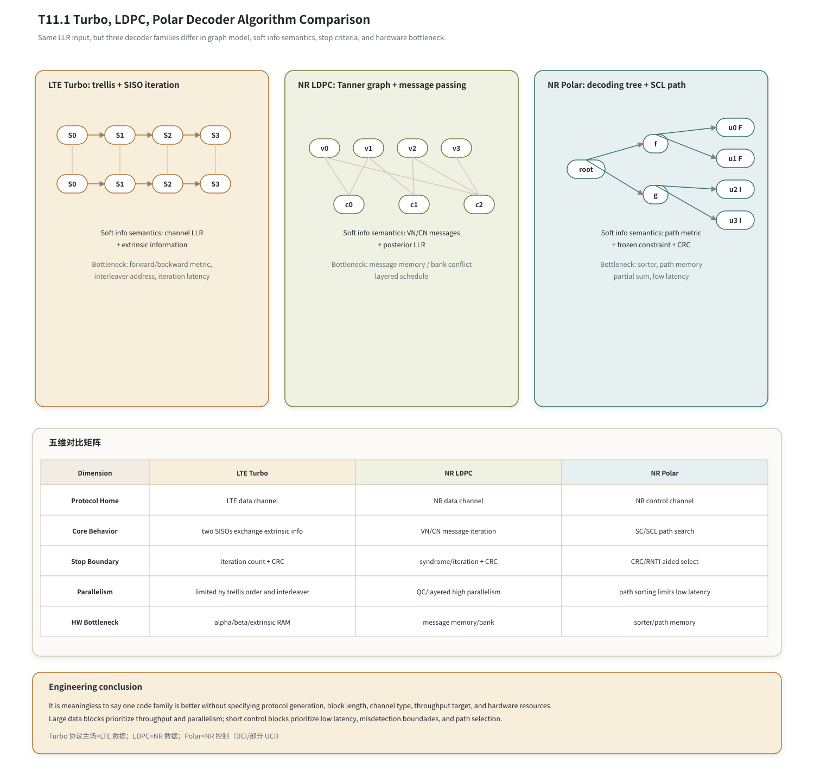

# T11.1 Turbo、LDPC、Polar 译码算法对比
## 本节学习目标

本节是对比课，不重新推导 T6、T8、T10 已经展开过的全部公式，而是把三类译码器放到同一个接收端视角下比较。先统一本篇缩写：Turbo是 LTE 数据传输主线使用的并行级联卷积码；低密度奇偶校验码是 NR 数据传输主线使用的稀疏校验矩阵码；Polar是 NR 控制信息主线使用的短块编码方案；对数似然比是三类译码器共同消费的软信息；循环冗余校验用于检查候选比特是否满足错误检测规则；块错误率用于链路性能验证；媒体接入控制层是物理层译码结果上交或反馈的上层边界；传输块是最终交付给 MAC 的业务块；码块是译码核心逐块处理的对象；混合自动重传请求负责重传和软信息保留；上行共享信道、下行共享信道、上行控制信息和下行控制信息用于标识协议使用位置；寄存器传输级和专用集成电路用于描述硬件实现边界。

学完本节后，应能做到：

- 说明 Turbo、LDPC、Polar 各自的名称来源、基本思想和接收端译码对象。
- 从协议事实解释 LTE 数据传输使用 Turbo、NR 数据传输使用 LDPC、NR 控制信息使用 Polar 的背景。
- 区分三种图模型：Turbo trellis、LDPC Tanner graph、Polar decoding tree。
- 区分三种译码行为：Turbo SISO 迭代、LDPC message passing、Polar SC/SCL path search。
- 区分软信息语义：channel LLR、extrinsic information、check/variable messages、path metric。
- 比较停止和选择边界：Turbo CRC/迭代、LDPC syndrome/CRC/迭代、Polar CRC-aided selection。
- 从吞吐、时延、面积、功耗、存储和验证复杂度解释为什么不能简单说“LDPC 比 Turbo 好”。

如果只记一个原则：**三类译码器都在消费软信息，但它们约束候选比特的方式不同；协议选择的是“适合该代系统、信道类型、块长和硬件目标的方案”，不是抽象地给某类码颁奖。**

## 前置知识检查

| 前置项 | 本节需要达到的程度 |
|:---|:---|
| T4.1 外信息 | 知道 channel LLR、a priori、extrinsic 和 posterior 的区别。 |
| T4.2 图模型 | 知道 trellis、Tanner graph、tree 分别表达不同约束结构。 |
| T6.7 Turbo 迭代 | 知道两个 SISO decoder 通过 interleaver/deinterleaver 交换外信息。 |
| T8.7 LDPC layered schedule | 知道变量节点和校验节点之间传消息，并可用 syndrome 检查校验约束。 |
| T10.6 CRC-aided SCL | 知道 Polar SCL 保留路径列表，再用 CRC/RNTI 做最终选择。 |

若这些前置不熟，本节仍可以读，但不要把表格当成背诵清单。对比的价值在于看懂“同一个 LLR 输入，为什么三个核心会走完全不同的内部流程”。

## 任务边界与 Prompt 覆盖

| Prompt 要求 | 本节覆盖位置 | 扩展方式 |
|:---|:---|:---|
| 图模型对比 | “三类图模型”与图 T11.1-1 | 解释 trellis/Tanner graph/tree 分别表达什么约束。 |
| 迭代/列表行为 | “三种译码行为” | 分别讲 SISO 外信息、VN/CN 消息、SC/SCL 路径搜索。 |
| 复杂度、存储、延迟 | “工程取舍矩阵” | 扩展到吞吐、面积、功耗、验证难度。 |
| 数据/控制信道适配性 | “协议使用位置与系统动机” | 结合 TS 36.212/38.212 表格和短块/长块需求。 |
| 简明对比表 | “算法行为对比表”和“工程取舍矩阵” | 表格只作总结，前文先讲概念和协议背景。 |
| 不能简单说 LDPC 更好 | “协议代际与适用条件” | 从系统代际、块长、并行度和硬件目标解释。 |
| 同一输入 LLR 教学例子 | “同一组 LLR 的三种消费方式” | 给数值输入、三类内部对象和输出边界。 |
| 验证方法 | “验证方法与最小 dump 包” | 覆盖 BLER、bit-exact、latency、memory trace、CRC/syndrome/path metric。 |

本节是对比讲义，详细公式推导分别承接 T6、T8、T10；本节的验收重点是能讲清差异背后的协议和工程原因。

## 资料与协议边界

### LTE Turbo 的协议位置

TS 36.212 Rel-19 §5.1.3 说明不同传输信道和控制信息类型使用的编码方案由 Table 5.1.3-1 和 Table 5.1.3-2 给出。`content.md` 行 693-705 给出表格入口；行 719-723 进入 Turbo coding，并说明 Turbo encoder 是并行级联卷积码，包含两个 8-state constituent encoders 和一个内部交织器，码率为 1/3。

本地 `tables/table_0007.csv` 抽取如下。原 Word 表存在合并单元格，CSV 中空白单元格表示继承原表合并单元格语义；使用时以 `table_0007.html` 和 `content.md` 交叉核验。

| TrCH | Coding scheme | Coding rate |
|:---|:---|:---|
| UL-SCH | Turbo coding | 1/3 |
| DL-SCH | Turbo coding | 1/3 |
| PCH | Turbo coding | 1/3 |
| MCH | Turbo coding | 1/3 |
| SL-SCH | Turbo coding | 1/3 |
| SL-DCH | Turbo coding | 1/3 |
| BCH | Tail biting convolutional coding | 1/3 |
| SL-BCH | Tail biting convolutional coding | 1/3 |

这张表回答的是“LTE 哪些传输信道使用 Turbo”。它不规定接收端必须使用 Max-Log-MAP、Log-MAP 还是哪种迭代停止策略；这些属于接收机实现，但必须与协议输入输出和 CRC 边界一致。

### LTE 控制信息的对照

TS 36.212 Table 5.1.3-2 给出控制信息编码方案，本地 `tables/table_0008.csv` 抽取如下：

| Control Information | Coding scheme | Coding rate |
|:---|:---|:---|
| DCI | Tail biting convolutional coding | 1/3 |
| CFI | Block code | 1/16 |
| HI | Repetition code | 1/3 |
| UCI | Block code / Tail biting convolutional coding | variable / 1/3 |
| SCI | Tail biting convolutional coding | 1/3 |

本节只用这张表说明：LTE 数据传输的主线对比对象是 Turbo，而 LTE 控制信息并不是本节 Polar 对比的直接对象。NR 才把 Polar 放到控制信息主线。

### NR LDPC 与 Polar 的协议位置

TS 38.212 Rel-19 §5.3 行 807-813 说明 Table 5.3-1 给出传输信道编码方案，Table 5.3-2 给出控制信息编码方案。§5.3.1 是 Polar coding 入口；§5.4.1 是 Polar rate matching；§5.4.2 是 LDPC rate matching；§6.3.1.2.1 和 §7.3.3 给出 UCI/DCI 调用 Polar 的控制信息分支。

本地 `tables/table_0009.csv` 抽取 Table 5.3-1。原表存在合并单元格，下面按协议语义复现：

| TrCH | Coding scheme |
|:---|:---|
| UL-SCH | LDPC |
| DL-SCH | LDPC |
| PCH | LDPC |
| BCH | Polar code |

本地 `tables/table_0010.csv` 抽取 Table 5.3-2，复现如下：

| Control Information | Coding scheme |
|:---|:---|
| DCI | Polar code |
| UCI | Block code / Polar code |

这两张表给出本节最重要的协议事实：NR 数据传输主线使用 LDPC，NR 控制信息主线使用 Polar。具体 UCI 何时走 block code、何时走 Polar，由 T10.1/T10.8 的控制信息分支继续解释；本节只保留“控制短块与 Polar 译码器”的对比主线。

## 三类码的基本思想

### Turbo 码的对象

Turbo 码的核心思想是：不要只用一个卷积码一次性做完所有约束，而是用两个相互交织的递归系统卷积编码器给同一批信息比特提供两套不同视角的约束。接收端对应地使用两个软输入软输出译码器，轮流把“我从自己这套约束中新增的证据”传给对方。

这里的“新增证据”就是外信息。若一个 SISO decoder 直接把完整 posterior LLR 传给另一个 decoder，另一个 decoder 会重复使用相同 channel LLR，置信度会被虚高。Turbo 的迭代价值在于：两个 decoder 反复交换外信息，让早期不确定的 bit 被另一套约束纠正。

接收端看 Turbo 时，最重要的对象是：

| 对象 | 含义 | 工程后果 |
|:---|:---|:---|
| trellis state | 卷积码移位寄存器状态。 | 需要前向/后向度量，存在顺序依赖。 |
| interleaver address | 第二个 constituent decoder 看到的信息位顺序。 | 需要地址生成和外信息 RAM。 |
| extrinsic LLR | 本轮从当前约束新增的软证据。 | 不能重复计数 channel LLR。 |
| iteration count | 两个 SISO 交换信息的轮数。 | 决定延迟、功耗和平均吞吐。 |

### LDPC 码的对象

LDPC 码把“哪些比特必须满足偶校验”写成一个稀疏矩阵 $H$。低密度的意思是：矩阵里大部分位置是 0，少量 1 表示变量节点和校验节点之间有边。接收端译码不是沿着 trellis 逐状态前后递推，而是在 Tanner graph 上反复传消息。

一个变量节点代表一个编码比特，一个校验节点代表一条偶校验方程。变量节点把来自信道和其他校验节点的证据汇总后发给某个校验节点；校验节点根据“这条方程必须偶校验”的约束，反过来给每个变量节点发送外部约束消息。

接收端看 LDPC 时，最重要的对象是：

| 对象 | 含义 | 工程后果 |
|:---|:---|:---|
| Tanner graph | 变量节点和校验节点构成的稀疏图。 | 可高并行，但受 message memory 和 bank conflict 限制。 |
| VN/CN message | 变量节点到校验节点、校验节点到变量节点的边消息。 | 需要边级存储、读改写和饱和控制。 |
| posterior LLR | channel LLR 加上各校验消息后的当前总证据。 | 用于 hard decision 和 syndrome 检查。 |
| syndrome | hard bits 是否满足 $H\hat{\mathbf{x}}^T=0$。 | 可做 early stop，但不能替代业务 CRC。 |

### Polar 码的对象

Polar 码的核心思想和 Turbo/LDPC 很不同。它通过极化变换把一组原本相似的 bit-channel 变成可靠度分化明显的 bit-channel：可靠的位置放信息位，不可靠的位置放 frozen bit。接收端译码时，要沿着 Polar tree 逐步判断这些 bit。

基础 SC 译码一次只保留一条路径，前面判错后很难恢复。SCL 译码因此保留多个候选路径：遇到 information bit 时分裂路径，更新 path metric，再裁剪到列表大小 $L$。如果有 CRC，最后在 CRC 通过的候选中选 path metric 最好的路径。

接收端看 Polar 时，最重要的对象是：

| 对象 | 含义 | 工程后果 |
|:---|:---|:---|
| decoding tree | $f/g$ 函数和 partial sum 组成的树遍历。 | 控制复杂，低延迟设计需要精细调度。 |
| frozen mask | 哪些位置强制为已知值，哪些位置允许承载信息。 | mask 错会系统性 CRC fail。 |
| path metric | SCL 中每条候选路径与 LLR 证据的匹配代价。 | 需要排序器、路径复制和定点 PM 设计。 |
| CRC-aided selection | 在 CRC/RNTI 约束下选择最终路径。 | 控制信息误检和漏检边界非常关键。 |

### 收敛行为与失败机制

三类译码器的性能曲线都可能出现瀑布区和高 SNR 失败，但机制不同。对比时不能只看最终 BLER 数字，还要看失败发生在什么内部对象上。

| 译码器 | 瀑布区直觉 | 错误平层或高 SNR 失败风险 | 必查证据 |
|:---|:---|:---|:---|
| Turbo | 两个 SISO 通过交织视角逐轮增强外信息。 | 低重量输入事件、交织器相关事件、Max-Log 修正不足、外信息重复计数。 | alpha/beta/gamma、extrinsic LLR、迭代分布、CRC first failure。 |
| LDPC | Tanner 图消息逐轮让 hard decision 满足更多校验。 | trapping set、短环、NMS/OMS 参数不合适、LLR/消息饱和。 | syndrome weight 曲线、CN/VN message 饱和、layer trace。 |
| Polar | SC/SCL 沿 tree 搜索，SCL 用列表保留多个候选。 | 早期 SC 判错传播、SCL 列表过小、PM 量化并列、CRC-aided selection 误选。 | path metric、path list、frozen mask、CRC candidate dump。 |

容量和编码增益也要按同一口径比较。Turbo、LDPC、Polar 的曲线若使用不同块长、码率、调制、SNR 定义或停止条件，就不能直接比较“谁离容量更近”。T1.6 提供容量和容量差距语言，T4.5/T17.5 负责把瀑布区、错误平层和置信区间写进报告。

## 图模型总览

同样消费 LLR，但三类译码器的图模型、软信息语义、停止条件和硬件瓶颈不同。


| 内容 | 说明 |
|:---|:---|
| 软信息语义：channel LLR | + extrinsic information；瓶颈：前向/后向度量、交织地址、迭代延迟 |
| 软信息语义：VN/CN messages | + posterior LLR；瓶颈：message memory / bank conflict；layered schedule |
| 软信息语义：path metric | + frozen constraint + CRC；瓶颈：sorter、path memory；partial sum、低延迟 |
| 协议主场 | LTE 数据传输；NR 数据传输；NR 控制信息 |
| 核心行为 | 两个 SISO 交换外信息；VN/CN 消息迭代；SC/SCL 路径搜索 |
| 停止边界 | 迭代数 + CRC；syndrome/迭代 + CRC；CRC/RNTI aided select |
| 并行性 | 受 trellis 顺序和交织制约；QC/layered 高并行；路径排序限制低延迟 |
| 硬件瓶颈 | alpha/beta/extrinsic RAM；message memory/bank；sorter/path memory |
上排三块分别展示 Turbo trellis、LDPC Tanner graph 和 Polar decoding tree；中部表格总结协议主场、核心行为、停止边界、并行性和硬件瓶颈；底部提示本节结论：不能脱离协议代际、块长、信道类型和硬件资源比较“谁更好”。

工程结论：不能脱离协议代际、块长、信道类型、吞吐目标和硬件资源说某类码“更好”。数据大块优先看吞吐和并行，控制短块优先看低延迟、误检边界和路径选择。

图模型的差异可以这样理解：

| 图模型 | 约束形态 | 译码动作 | 典型优势 | 典型代价 |
|:---|:---|:---|:---|:---|
| Turbo trellis | 时间顺序状态转移约束。 | 前向/后向递推，两个 SISO 交换外信息。 | 中等块长性能强，LTE 时代成熟。 | 顺序依赖、交织访问、迭代延迟。 |
| LDPC Tanner graph | 稀疏偶校验方程约束。 | VN/CN 消息传递，syndrome 检查。 | 高并行、长块吞吐友好、QC 结构硬件友好。 | 消息存储、bank conflict、layer 调度复杂。 |
| Polar tree | 极化结构和 frozen constraint。 | SC/SCL 路径搜索，CRC 辅助选择。 | 短控制块、低延迟和误检控制友好。 | sorter、path memory、partial sum 和 list 管理。 |

## 三种译码行为

### Turbo SISO 迭代

Turbo 接收端通常包括两个 SISO decoder。第一个 decoder 使用系统位、第一路校验位和来自第二个 decoder 的先验信息，输出新的外信息；经过交织后给第二个 decoder。第二个 decoder 使用同一批信息的交织视角和第二路校验位，再输出外信息并解交织回第一个 decoder。

简化写法可以表示为：

$$
L_{\mathrm{post}}^{(1)}
= L_{\mathrm{ch}} + L_{\mathrm{a}}^{(1)} + L_{\mathrm{e}}^{(1)}
\tag{1}
$$

式 (1) 回答的问题是：第一个 SISO decoder 对某个信息位的后验 LLR 由哪些证据组成。这里 $L_{\mathrm{ch}}$ 是系统位的 channel LLR，$L_{\mathrm{a}}^{(1)}$ 是来自另一个 decoder 的先验信息，$L_{\mathrm{e}}^{(1)}$ 是本 decoder 新产生的外信息。真正传给另一个 decoder 的应是 $L_{\mathrm{e}}^{(1)}$，不是完整 $L_{\mathrm{post}}^{(1)}$。

### LDPC 消息传递

LDPC 接收端维护的是边消息。变量节点更新可简写为：

$$
L_{v \rightarrow c}
= L_{\mathrm{ch},v}
+ \sum_{c' \in \mathcal{N}(v)\setminus c} L_{c' \rightarrow v}.
\tag{2}
$$

式 (2) 回答的问题是：变量节点 $v$ 发给某个校验节点 $c$ 的消息应该包含哪些证据。它使用 channel LLR 和其他校验节点的消息，但排除目标校验节点 $c$ 自己，避免回声计数。

校验节点再根据偶校验约束给变量节点回消息。以 Min-Sum 近似为例：

$$
L_{c \rightarrow v}
\approx
\left(\prod_{v' \in \mathcal{N}(c)\setminus v}\operatorname{sign}(L_{v'\rightarrow c})\right)
\min_{v' \in \mathcal{N}(c)\setminus v}|L_{v'\rightarrow c}|.
\tag{3}
$$

式 (3) 回答的问题是：某条校验方程根据其他变量的证据，对目标变量给出什么约束。它保留 SPA 校验节点的符号乘积和最小幅度结构，硬件上可做 min1/min2 优化。

### Polar SC/SCL 路径搜索

Polar 接收端不是在图上反复传边消息，而是在 tree 上递归计算 LLR 并决定路径。SC 每次只保留一个候选；SCL 在 information bit 处保留多个候选。一个常用 PM 更新直觉是：如果候选 bit 与 LLR 符号一致，代价小；如果相反，代价增加。

可用近似式写成：

$$
\mathrm{PM}' =
\mathrm{PM} +
\begin{cases}
0, & \hat{u} = \mathbf{1}[L < 0],\\
|L|, & \hat{u} \ne \mathbf{1}[L < 0].
\end{cases}
\tag{4}
$$

式 (4) 回答的问题是：SCL 中某条路径扩展一个 bit 后，路径代价如何变化。这里约定 PM 越小越好。frozen bit 不分裂，强制走 frozen value；information bit 分裂为 0/1 两条候选，再排序剪枝。

## 同一组 LLR 的三种消费方式

设接收端拿到四个软信息：

$$
\mathbf{L}_{\mathrm{rx}} = [+2.8,\ -0.6,\ +0.3,\ -3.1].
\tag{5}
$$

式 (5) 回答的问题是：demapper 对四个编码比特的初始看法是什么。正号更支持 0，负号更支持 1，幅度越大表示越可靠。三类译码器不会“直接把这四个数硬判决后交付”，而是把它们放入不同约束系统中。

| 译码器 | 这组 LLR 进入哪里 | 内部如何消费 | 可能输出的中间证据 |
|:---|:---|:---|:---|
| Turbo | 系统位/校验位三路流和交织地址。 | SISO 在 trellis 上做前向/后向递推，输出外信息；两个 decoder 迭代交换。 | `extrinsic[bit_id]`、iteration posterior、CB CRC 状态。 |
| LDPC | rate recovery 后的 LDPC 母码位置。 | 作为变量节点 channel LLR，和 CN/VN 消息一起更新 posterior。 | edge messages、posterior LLR、syndrome weight、CB/TB CRC 状态。 |
| Polar | rate recovery 后的 Polar mother-code LLR。 | SC/SCL tree 计算 $f/g$，information bit 路径分裂，frozen bit 强制，最终 CRC-aided selection。 | path list、PM list、partial sums、CRC/RNTI result。 |

一个最小教学例子如下：

1. Turbo 会问：“这些 LLR 在两套 trellis 约束下，哪个信息序列最一致？本 decoder 新增的外信息是多少？”
2. LDPC 会问：“这些 LLR 的 hard decision 是否满足所有偶校验？不满足时，哪些校验节点能给弱位置补充消息？”
3. Polar 会问：“按 frozen mask 和 tree 递归，哪些路径最可能？CRC 通过的候选里哪条 PM 最好？”

这就是三类算法的根本差异：Turbo 的核心对象是状态路径和外信息，LDPC 的核心对象是稀疏校验方程和边消息，Polar 的核心对象是路径列表和 frozen/CRC 约束。

## 协议代际与适用条件

不要把本节结论压缩成“LDPC 比 Turbo 好”。更准确的说法是：

| 条件 | Turbo | LDPC | Polar |
|:---|:---|:---|:---|
| LTE 数据业务 | 协议主线，设计成熟。 | 不适用；不是 LTE TS 36.212 的数据信道主线。 | 不适用；不是 LTE 数据主线。 |
| NR 数据业务 | 不再作为 NR 数据主线。 | 协议主线，适合高吞吐、长块、QC 并行。 | 不适合大数据块主线。 |
| NR 控制信息 | 不作为 NR 控制信息主线。 | 不作为 DCI/UCI 控制主线。 | 协议主线之一，适合短块和 CRC-aided selection。 |
| 长块高吞吐 | 迭代和 trellis 顺序限制并行。 | 结构化稀疏图更适合大规模并行。 | path sorting 和 list 管理不适合大块数据。 |
| 短块低延迟控制 | 不是 NR 控制主线。 | 短块 overhead 和结构不匹配。 | 控制信息、CRC/RNTI、盲检边界更匹配。 |

NR 数据传输选择 LDPC，不是因为 Turbo 在数学上“失效”，而是因为 NR 面向更高峰值吞吐、更灵活的码块和更强硬件并行需求。NR 控制信息选择 Polar，也不是因为 Polar 对所有长度都最优，而是因为短控制块、低延迟、CRC/RNTI 辅助选择和盲检场景形成了不同目标函数。

### NR 数据主码从 Turbo 转向 LDPC 的动机

把 LTE Turbo 与 NR LDPC 放在同一行比较时，最容易犯的错误是把代际选择写成“新码绝对更好”。协议选择更像系统工程取舍：同样服务数据业务，LTE 的目标约束和 NR 的目标约束不同。

| 维度 | LTE Turbo 的匹配点 | NR LDPC 的匹配点 | 不能简化成绝对优劣的原因 |
|:---|:---|:---|:---|
| 吞吐扩展 | 若干 SISO 核可支持 LTE 时代峰值速率，早停可降低平均迭代数。 | QC lifting 和分层译码便于把矩阵行、列、layer 映射到大量并行处理单元。 | 吞吐瓶颈取决于系统目标、时钟、存储带宽和并行度，不是码名本身决定。 |
| 并行度 | trellis 前向/后向递推有时间方向相关性，交织器带来随机地址访问。 | 稀疏图消息可按 layer、bank 和 lifting block 组织，硬件更容易规则并行。 | Turbo 也能并行到多个 CB 或多个 SISO 窗口，只是在 NR 峰值目标下扩展代价更高。 |
| HARQ 与 IR | LTE Turbo 通过 circular buffer、RV 和 soft combining 支持增量冗余。 | LDPC mother code、limited buffer、RV/k0 和 puncturing 更自然地在大母码坐标上做覆盖。 | 两者都支持 IR-HARQ；差异在地址空间、母码结构和重传覆盖粒度。 |
| 错误平层 | 长块和高 SNR 下需要关注交织器、低重量事件、停止策略和量化。 | LDPC 需要关注短环、trapping set、NMS/OMS 参数和量化。 | 两类码都有 error floor 风险，失败机理不同。 |
| 功耗和存储 | 多轮 SISO、alpha/beta/extrinsic RAM 和交织访问主导功耗。 | 大规模 message memory、bank conflict 和 check/variable node 单元主导功耗。 | 功耗看架构和业务负载，不能只看算法公式项数。 |

因此，LTE 接收机设计文档应把 Turbo 当作自己的数据链路主角：先按 TS 36.212 恢复三路 Turbo 软输入，再用 BCJR/Log-MAP 系列算法做迭代译码，最后用 CB/TB CRC 交付结果。NR 接收机的数据主线才切换到 TS 38.212 LDPC rate recovery 和 LDPC core。这个边界可以避免两类错误：一是把 LTE Turbo 写成 NR LDPC 的过渡注脚；二是把 NR 选择 LDPC 误读成 Turbo 在 LTE 场景中“不重要”。

## 算法行为对比表

| 维度 | LTE Turbo | NR LDPC | NR Polar |
|:---|:---|:---|:---|
| 协议主场 | LTE UL-SCH/DL-SCH/PCH/MCH 等数据传输。 | NR UL-SCH/DL-SCH/PCH 数据传输。 | NR DCI 和部分 UCI 控制信息；BCH 也使用 Polar。 |
| 基本图模型 | trellis + interleaver。 | Tanner graph + QC lifting。 | decoding tree + frozen mask。 |
| 输入软信息 | 系统位和两路校验位 LLR。 | LDPC mother-code 位置 LLR。 | Polar mother-code 位置 LLR。 |
| 核心迭代/搜索 | 两个 SISO decoder 交换外信息。 | VN/CN message passing，flooding 或 layered。 | SC/SCL 路径扩展、排序、剪枝。 |
| 关键内部量 | alpha/beta/gamma、extrinsic LLR。 | VN/CN message、posterior LLR、syndrome。 | $f/g$ LLR、partial sum、path metric。 |
| 停止/选择 | 最大迭代、CB CRC、TB CRC。 | syndrome early stop、最大迭代、CB/TB CRC。 | CRC/RNTI aided final selector。 |
| 典型错误 | 外信息重复计数、交织地址错、tail 边界错。 | BG/Zc/RV 地址错、message memory/bank conflict、syndrome/CRC 混淆。 | frozen mask 错、PM 方向错、CRC/RNTI 边界错。 |

## 工程取舍矩阵

| 工程指标 | LTE Turbo | NR LDPC | NR Polar |
|:---|:---|:---|:---|
| 吞吐 | 受 trellis 递推、交织访存和迭代轮数限制。 | QC 结构和 layered schedule 支持高并行。 | 短块可低延迟，大块受 list/path 管理限制。 |
| 时延 | 多次 half-iteration 累积；平均时延受 early stop 影响。 | 迭代次数和 layer 数决定；并行度可换时延。 | 控制短块时延低，但 SCL sorter 和路径复制是关键路径。 |
| 面积 | SISO 单元、alpha/beta RAM、interleaver RAM。 | CN/VN 单元、message memory、LLR RAM、banking。 | path memory、partial sum memory、sorter、CRC checker。 |
| 功耗 | 多迭代和随机交织访问增加功耗。 | 并行 CN/VN 和大存储带宽主导功耗。 | 排序器和路径复制在高 list size 下显著。 |
| 存储 | extrinsic RAM、interleaver/deinterleaver 地址、软缓存。 | edge message memory、posterior LLR、soft buffer、shift table。 | path LLR memory、partial sum memory、PM list、frozen/reliability ROM。 |
| 控制复杂度 | 迭代控制和交织地址同步。 | layer 调度、bank conflict、syndrome early stop。 | tree traversal、path copy、sort/prune、CRC-aided selector。 |
| 验证难度 | 外信息非回声、迭代停止和 interleaver bit-exact。 | message trace、syndrome 曲线、BG/Zc/RV 地址一致性。 | path metric 方向、tie-break、mask、CRC/RNTI selection。 |

统一译码子系统可以共享 DMA、输入 LLR buffer、CRC checker、寄存器配置和中断/status 框架，但三类核心的内部计算单元通常不能简单共享：Turbo 的 SISO/trellis、LDPC 的 CN/VN message update、Polar 的 sorter/path memory 是不同数据通路。

## 接收端统一 descriptor

对比课还要落到接口。一个统一 decoder dispatcher 至少需要这些字段：

| 字段 | Turbo | LDPC | Polar | 错误后果 |
|:---|:---:|:---:|:---:|:---|
| `rat` | LTE | NR | NR | 跨制式规则混用。 |
| `channel_type` | UL-SCH/DL-SCH/PCH/MCH 等 | UL-SCH/DL-SCH/PCH/BCH | UCI/DCI/BCH 等 | 选错译码器家族。 |
| `decoder_type` | TURBO | LDPC | POLAR | 数据误送控制译码器或反之。 |
| `tb_id/cb_id` | 需要 | 需要 | 控制块通常按候选管理 | CRC/reassembly 状态错。 |
| `harq_id/rvidx` | rate recovery/HARQ 需要 | rate recovery/HARQ/CBG 需要 | 控制分支通常不按同一数据 HARQ 语义处理 | soft buffer 污染。 |
| `E/Ncb/N/K` | Turbo rate recovery 参数 | LDPC rate recovery 与母码长度 | Polar mother-code 和 rate recovery | LLR 放回坐标错。 |
| `crc_type` | CB/TB CRC | CB/TB CRC | UCI/DCI CRC/RNTI | pass/fail 边界错。 |
| `graph_id/mask_id` | interleaver id | BG/Zc/shift table | frozen/reliability mask | 结构坐标错。 |

Dispatcher 伪代码如下：

```python
def dispatch_decoder(desc, llr):
    if desc.rat == "LTE" and desc.decoder_type == "TURBO":
        turbo_llr = lte_turbo_rate_recover(desc, llr)
        cb_bits, cb_crc = turbo_decode(desc, turbo_llr)
        return lte_reassemble_and_check_tb(desc, cb_bits, cb_crc)
    if desc.rat == "NR" and desc.decoder_type == "LDPC":
        ldpc_llr = nr_ldpc_rate_recover(desc, llr)
        cb_bits, syndrome, cb_crc = ldpc_decode(desc, ldpc_llr)
        return nr_ldpc_reassemble_and_check_tb(desc, cb_bits, syndrome, cb_crc)
    if desc.rat == "NR" and desc.decoder_type == "POLAR":
        polar_llr = nr_polar_rate_recover(desc, llr)
        paths = polar_scl_decode(desc, polar_llr)
        return crc_aided_select(desc, paths)
    raise ValueError("unsupported decoder descriptor")
```

这段伪代码不是协议原文，而是接收端对象模型。它的作用是把协议表中的“使用哪类编码”翻译成工程入口：同一个 `llr` 数组必须先被送到正确 rate recovery 和正确 decoder core，否则后续 CRC fail 只是症状。

## 浮点仿真方案

T11.1 的浮点仿真不要求重新实现完整 Turbo/LDPC/Polar golden model，但要建立可比指标：

| 验证项 | Turbo | LDPC | Polar |
|:---|:---|:---|:---|
| BLER 曲线 | 固定调制、码率、迭代数，画 TB BLER。 | 固定 BG/Zc/码率、迭代数或 early stop。 | 固定 $N/K/E/L$ 和 CRC，画控制块 BLER。 |
| bit-exact | interleaver、rate recovery、SISO 输出抽样。 | BG/Zc、edge list、layer update、syndrome。 | reliability mask、f/g、PM、CRC selector。 |
| latency model | 迭代轮数和 trellis 长度。 | layer 数、并行度、bank conflict。 | tree traversal、list size、sorter 次数。 |
| memory trace | extrinsic/interleaver RAM 访问。 | message memory/LLR RAM 访问。 | path memory/partial sum/PM list 访问。 |
| fail signature | CB/TB CRC fail、iteration timeout。 | syndrome nonzero、CRC fail、BG/Zc mismatch。 | CRC/RNTI fail、PM tie、mask mismatch。 |

最低 directed test 可用同一批固定 LLR 输入，分别检查三类 decoder wrapper 是否产生正确的内部 trace 字段，而不是只看最终 pass/fail。

## 定点化策略

三类译码器的定点风险不同：

| 风险 | Turbo | LDPC | Polar |
|:---|:---|:---|:---|
| LLR 饱和 | 外信息和 posterior 过度自信，迭代难纠错。 | VN/CN 消息饱和，syndrome 曲线异常。 | PM 饱和导致路径并列和错误剪枝。 |
| 缩放 | Max-Log-MAP 近似可能需要校正。 | NMS/OMS 需要 $\alpha/\beta$ 参数。 | LLR/PM 尺度要保持排序稳定。 |
| 舍入 | alpha/beta 度量量化影响外信息。 | min1/min2 和符号位处理影响 CN 消息。 | $f/g$ 近似、PM 更新、tie-break 影响路径。 |
| 状态清零 | 新 TB、HARQ flush、iteration reset。 | 新 CB、CBG partial update、message RAM init。 | 新候选、path copy、CRC state reset。 |

定点验证不能只比较最终 CRC。必须 dump saturation count、最大/最小 LLR、PM tie count、syndrome weight 曲线和每轮 early stop 原因。

## RTL/ASIC 映射

硬件上，三类 decoder core 的主要不可共享部分如下：

| 模块 | Turbo | LDPC | Polar |
|:---|:---|:---|:---|
| 核心计算 | SISO/BCJR 或 Max-Log-MAP 单元。 | CN/VN update、min tree、layered pipeline。 | SC/SCL tree、path expansion、sort/prune。 |
| 存储 | alpha/beta metric、extrinsic RAM、interleaver address。 | message RAM、posterior LLR RAM、shift table、banked soft buffer。 | path LLR RAM、partial sum RAM、PM RAM、frozen/reliability ROM。 |
| 控制 | half-iteration FSM、interleaver/deinterleaver 切换。 | layer controller、bank conflict handler、syndrome checker。 | tree traversal controller、lazy-copy、sorter controller、CRC selector。 |
| 输出状态 | CB CRC、TB CRC、iteration count。 | syndrome、CB CRC、TB CRC、CBG status。 | selected path、CRC/RNTI status、PM、list diagnostics。 |

共享层应放在 core 外部：descriptor parser、DMA、LLR ingress buffer、soft buffer manager、CRC checker library、interrupt/status register 和 debug dump。不要为了“复用硬件”把 LDPC 的 CN/VN 单元硬套到 Turbo，或把 Polar sorter 当成通用排序器随意共享到无关路径；共享必须服从时序、带宽和验证成本。

## 验证方法与最小 dump 包

| 验证层 | 必查内容 |
|:---|:---|
| 协议分类 | `rat`、`channel_type`、`decoder_type` 是否与 TS 36.212/38.212 表格一致。 |
| 软信息入口 | LLR 符号约定、长度、rate recovery 后母码坐标。 |
| 算法 trace | Turbo `extrinsic/p_iter`；LDPC `vn/cn/syndrome`；Polar `path/pm/crc_result`。 |
| 停止条件 | max iteration、CRC pass/fail、syndrome zero、CRC-aided select。 |
| 性能回归 | BLER vs SNR、平均迭代数、误检率、latency histogram。 |
| 硬件回归 | bit-exact、memory trace、bank conflict、saturation count、flush/reset。 |

最小 dump 包建议：

| 字段 | 用途 |
|:---|:---|
| `rat/channel_type/decoder_type` | 证明选择了正确译码器家族。 |
| `tb_id/cb_id/candidate_id` | 关联输出状态和上层对象。 |
| `E/Ncb/N/K/BG/Zc/interleaver_id/mask_id` | 证明坐标系正确。 |
| `llr_min/llr_max/sat_count/sign_convention` | 定点和符号约定排查。 |
| `iter_count/syndrome_weight/pm_list/crc_results` | 三类核心的停止或选择证据。 |
| `memory_trace_hash` | 对比 RTL 和 golden model 的地址轨迹。 |

## 常见错误

| 错误 | 现象 | 修复方向 |
|:---|:---|:---|
| 把 Polar 当数据大块码 | 控制短块测试通过，但大块数据路径吞吐和存储不可接受。 | 按协议表区分 NR data 和 control。 |
| 把 LDPC syndrome 当业务 CRC | syndrome zero 但 TB CRC fail 被误判为 pass。 | syndrome 只检查 LDPC 校验约束，业务交付仍看 CB/TB CRC。 |
| 把 Turbo 外信息当 LDPC 消息 | 误把 `extrinsic` 和 edge message 统一成同一接口。 | 区分 trellis SISO 外信息和 Tanner graph 边消息。 |
| 只比计算单元不比存储 | 算术单元看似少，系统吞吐仍低。 | 同时评估 RAM 带宽、bank conflict、地址生成和控制。 |
| 只看最终 CRC | debug 时无法定位 rate recovery、core、selector 哪层错。 | 强制保存中间 trace 和最小 dump 包。 |
| 跨制式 descriptor 混用 | LTE TB 被送进 NR LDPC 或 NR 控制被送进 Turbo。 | dispatcher 增加 `rat/channel_type/decoder_type` 互斥断言。 |

## 自测题

1. 为什么不能用 syndrome pass 替代 LDPC 的 TB CRC pass？
2. 为什么 Turbo 译码器不能把完整 posterior LLR 直接作为外信息传给另一个 SISO decoder？
3. 为什么 NR 控制信息适合 Polar SCL/CA-SCL，而不是简单复用 LDPC 数据译码器？
4. 如果同一个 LLR 输入在浮点 Polar SCL 中结果稳定，但 RTL 中不同种子选择不同 path，优先检查哪些字段？

## 自测题参考答案

1. syndrome 只说明当前 hard decision 满足 LDPC 校验矩阵约束；它不检查 filler 删除、CB 拼接、TB CRC 输入边界和业务错误检测。TB 交付必须以协议 CRC 边界为准。
2. posterior LLR 包含 channel LLR、先验信息和本 decoder 新增证据。若完整传递，另一个 SISO 会重复使用已经用过的证据，造成 LLR 虚高；应传递 extrinsic information。
3. 控制信息短、低延迟且有 CRC/RNTI 辅助选择和盲检边界。Polar 的 frozen mask、SCL path search 和 CRC-aided selection 与这类目标匹配；LDPC 更适合长数据块和高并行吞吐。
4. 优先检查 PM 定点位宽、饱和计数、tie-break 规则、path id 稳定性、sorter 比较方向、CRC state 复制和 frozen mask；不要先改信道 LLR 或 CRC 多项式。

## 协议证据表

| 结论 | 协议证据 | 本地路径 |
|:---|:---|:---|
| LTE TrCH 编码方案表给出 Turbo coding 用于 UL-SCH、DL-SCH、PCH、MCH、SL-SCH、SL-DCH 等，BCH/SL-BCH 为 tail biting convolutional coding。 | TS 36.212 Rel-19 `36212-j30` §5.1.3, Table 5.1.3-1。 | `3GPP_Rel19/processed/TS_36.212_36212-j30/content.md:693-705`; `tables/table_0007.csv/html`。 |
| LTE Turbo encoder 是 PCCC，含两个 8-state constituent encoders 和一个 turbo code internal interleaver，码率 1/3。 | TS 36.212 §5.1.3.2.1。 | `content.md:719-723`。 |
| LTE 控制信息不是本节 Polar 对比主线。 | TS 36.212 Table 5.1.3-2。 | `tables/table_0008.csv/html`。 |
| NR TrCH 编码方案表给出 UL-SCH/DL-SCH/PCH 使用 LDPC，BCH 使用 Polar code。 | TS 38.212 Rel-19 `38212-j30` §5.3, Table 5.3-1。 | `3GPP_Rel19/processed/TS_38.212_38212-j30/content.md:807-813`; `tables/table_0009.csv/html`。 |
| NR 控制信息表给出 DCI 使用 Polar code，UCI 可使用 block code 或 Polar code。 | TS 38.212 §5.3, Table 5.3-2。 | `content.md:807-813`; `tables/table_0010.csv/html`。 |
| NR DCI 使用 CRC、RNTI 处理、Polar coding 和 Polar rate matching。 | TS 38.212 §7.3.2-§7.3.4。 | `content.md:7177-7207`。 |
| NR UCI Polar 分支存在 6/11 bit CRC 和 Polar coding 调用边界。 | TS 38.212 §6.3.1.2.1, §6.3.1.3.1。 | `content.md:2325-2345`。 |

## 图示


## 执行与证据记录

| 项目 | 记录 |
|:---|:---|
| Roadmap Prompt | 已读取 `2026-06-19-lte-nr-decoding-learning-roadmap.md` T11.1：要求从图模型、迭代/列表行为、复杂度、存储、延迟和数据/控制信道适配性对比 Turbo、LDPC、Polar。 |
| 协议资料 | 使用 TS 36.212 `36212-j30` 与 TS 38.212 `38212-j30` 的 `content.md`、`tables/*.csv/html`。 |
| 表格复现 | 正文复现 TS 36.212 Table 5.1.3-1/2 和 TS 38.212 Table 5.3-1/2 的本节使用子集，并说明 CSV 合并单元格抽取限制。 |
| 审计命令 | 单篇审计已运行：`python3 tools/audit_lesson_terms.py docs/L2/T11.1_Turbo_LDPC_Polar_algorithm_comparison.md` 输出 `LESSON_TERM_AUDIT_OK`；`python3 tools/audit_markdown_headings.py ...` 输出 `MARKDOWN_HEADING_AUDIT_OK`；`python3 tools/audit_lesson_depth.py --strict ...` 输出 `LESSON_DEPTH_AUDIT_OK`；`python3 tools/audit_latex_render.py ...` 输出 `LATEX_RENDER_AUDIT_OK formulas=22`；`python3 tools/audit_reference_rebuilds.py ...` 输出 `REFERENCE_REBUILD_AUDIT_CANDIDATES`，作为候选清单处理。 |
| C1 补写 | 已新增“NR 数据主码从 Turbo 转向 LDPC 的动机”，覆盖吞吐、并行度、QC/IR-HARQ、错误平层、功耗和协议场景边界；明确 LTE Turbo 仍是 LTE 数据链路主角。 |
| 证据边界 | 本节是算法/协议/工程对比，不重新复现完整 Turbo interleaver 表、LDPC BG/shift 表、Polar reliability sequence 或 rate matching 表；这些已由 T6.4/T8.3/T10.3/T10.7 等章节承接。 |

## 参考文献

1. [Arikan, 2009] Erdal Arikan, “Channel Polarization: A Method for Constructing Capacity-Achieving Codes for Symmetric Binary-Input Memoryless Channels,” *IEEE Transactions on Information Theory*, 2009.
2. [Berrou et al., 1993] Claude Berrou, Alain Glavieux, and Punya Thitimajshima, “Near Shannon Limit Error-Correcting Coding and Decoding: Turbo-Codes,” *Proceedings of ICC*, 1993.
3. [Gallager, 1962] Robert G. Gallager, “Low-Density Parity-Check Codes,” *IRE Transactions on Information Theory*, 1962.
4. [3GPP, 2026] 3GPP TS 36.212 Rel-19 `36212-j30`, “Evolved Universal Terrestrial Radio Access (E-UTRA); Multiplexing and channel coding,” §5.1.3, Table 5.1.3-1, Table 5.1.3-2.
5. [3GPP, 2026] 3GPP TS 38.212 Rel-19 `38212-j30`, “NR; Multiplexing and channel coding,” §5.3, §5.3.1, §5.4.1, §5.4.2, §6.3.1, §7.3, Table 5.3-1, Table 5.3-2.
